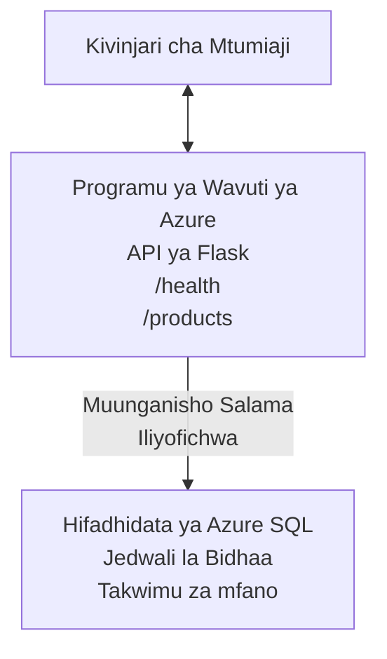

# Kuweka Hifadhidata ya Microsoft SQL na App ya Wavuti kwa AZD

⏱️ **Muda Unaokadiriwa**: dakika 20-30 | 💰 **Gharama Inayokadiriwa**: ~$15-25/mwezi | ⭐ **Ugumu**: Kati

Mfano huu **kamili, unaofanya kazi** unaonyesha jinsi ya kutumia [Azure Developer CLI (azd)](https://learn.microsoft.com/azure/developer/azure-developer-cli/) kuweka programu ya wavuti ya Python Flask pamoja na Hifadhidata ya Microsoft SQL kwenye Azure. Msimbo wote umejumuishwa na umejaribiwa—hakuna utegemezi wa nje unaohitajika.

## Utajifunza Nini

Kwa kukamilisha mfano huu, utafanya:
- Kuweka programu yenye nguzo nyingi (app ya wavuti + hifadhidata) ukitumia miundombinu-kama-msimbo
- Kusanidi muunganisho salama wa hifadhidata bila kuweka siri moja kwa moja kwenye msimbo
- Kufuatilia afya ya programu kwa Application Insights
- Kusimamia rasilimali za Azure kwa ufanisi kupitia AZD CLI
- Kufuatilia mbinu bora za Azure kwa usalama, uboreshaji wa gharama, na ufuatiliaji

## Muhtasari wa Senario
- **App ya Wavuti**: API ya Python Flask yenye muunganisho wa hifadhidata
- **Hifadhidata**: Azure SQL Database yenye sampuli ya data
- **Miundombinu**: Imeandaliwa kwa kutumia Bicep (mifumo ya moduli, inaweza kutumika tena)
- **Uwekaji**: Ulio otomatiki kabisa kwa amri za `azd`
- **Ufuatiliaji**: Application Insights kwa logi na telemetry

## Mahitaji

### Zana Zinazohitajika

Kabla ya kuanza, thibitisha una zana hizi zilizosakinishwa:

1. **[Azure CLI](https://learn.microsoft.com/cli/azure/install-azure-cli)** (toleo 2.50.0 au juu)
   ```sh
   az --version
   # Matokeo yanayotarajiwa: azure-cli 2.50.0 au toleo la juu zaidi
   ```

2. **[Azure Developer CLI (azd)](https://learn.microsoft.com/azure/developer/azure-developer-cli/install-azd)** (toleo 1.0.0 au juu)
   ```sh
   azd version
   # Matokeo yanayotarajiwa: azd toleo 1.0.0 au la juu zaidi
   ```

3. **[Python 3.8+](https://www.python.org/downloads/)** (kwa maendeleo ya eneo la ndani)
   ```sh
   python --version
   # Matokeo yanayotarajiwa: Python 3.8 au toleo la juu zaidi
   ```

4. **[Docker](https://www.docker.com/get-started)** (hiari, kwa maendeleo ya kikontena kwa eneo la ndani)
   ```sh
   docker --version
   # Matokeo yanayotarajiwa: Toleo la Docker 20.10 au la juu zaidi
   ```

### Mahitaji ya Azure

- Usajili hai wa **Azure** ([tengeneza akaunti ya bure](https://azure.microsoft.com/free/))
- Ruhusa za kuunda rasilimali kwenye usajili wako
- Nafasi ya **Owner** au **Contributor** kwenye usajili au kundi la rasilimali

### Maarifa Yanayohitajika

Mfano huu ni wa ngazi ya **kati**. Unapaswa kufahamu:
- Operesheni za msingi za laini ya amri
- Dhana za msingi za wingu (rasilimali, makundi ya rasilimali)
- Uelewa wa msingi wa programu za wavuti na hifadhidata

**Mpya kwa AZD?** Anza na [Mwongozo wa Kuanzia](../../docs/chapter-01-foundation/azd-basics.md) kwanza.

## Mchoro wa Miundombinu

Mfano huu unaweka usanifu wa nguzo mbili yenye programu ya wavuti na hifadhidata:


**Uwekaji wa Rasilimali:**
- **Resource Group**: Kontena la rasilimali zote
- **App Service Plan**: Ukarimu wa mwenyeji unaotumia Linux (ngazi B1 kwa ufanisi wa gharama)
- **Web App**: Muda wa utekelezaji wa Python 3.11 pamoja na programu ya Flask
- **SQL Server**: Server ya hifadhidata inayosimamiwa yenye TLS 1.2 angalau
- **SQL Database**: Ngazi ya Basic (2GB, inafaa kwa maendeleo/majaribio)
- **Application Insights**: Ufuatiliaji na uandikishaji logi
- **Log Analytics Workspace**: Hifadhi ya logi iliyozingatiwa kwa pamoja

**Mfano wa Mlinganisho**: Fikiria hii kama mgahawa (app ya wavuti) wenye friza ya kuingilia (hifadhidata). Wateja wanaagiza kutoka kwenye menyu (mifumo ya API), na jikoni (app ya Flask) huchukua viungo (data) kutoka kwenye friza. Meneja wa mgahawa (Application Insights) anaandika kila kitu kinachotokea.

## Muundo wa Folda

Faili zote zipo kwenye mfano huu—hakuna utegemezi wa nje unaohitajika:

```
examples/database-app/
│
├── README.md                    # This file
├── azure.yaml                   # AZD configuration file
├── .env.sample                  # Sample environment variables
├── .gitignore                   # Git ignore patterns
│
├── infra/                       # Infrastructure as Code (Bicep)
│   ├── main.bicep              # Main orchestration template
│   ├── abbreviations.json      # Azure naming conventions
│   └── resources/              # Modular resource templates
│       ├── sql-server.bicep    # SQL Server configuration
│       ├── sql-database.bicep  # Database configuration
│       ├── app-service-plan.bicep  # Hosting plan
│       ├── app-insights.bicep  # Monitoring setup
│       └── web-app.bicep       # Web application
│
└── src/
    └── web/                    # Application source code
        ├── app.py              # Flask REST API
        ├── requirements.txt    # Python dependencies
        └── Dockerfile          # Container definition
```

**Kila Faili Inafanya Nini:**
- **azure.yaml**: Inamwambia AZD ni nini cha kuweka na wapi
- **infra/main.bicep**: Inapanga rasilimali zote za Azure
- **infra/resources/*.bicep**: Maelezo ya rasilimali za mtu mmoja mmoja (moduli kwa matumizi tena)
- **src/web/app.py**: Programu ya Flask yenye mantiki ya hifadhidata
- **requirements.txt**: Utegemezi wa vifurushi vya Python
- **Dockerfile**: Maelekezo ya kuifunga kwenye kontena kwa ajili ya uwekaji

## Mwongozo wa Haraka (Hatua kwa Hatua)

### Hatua 1: Clone na Uende Kwenye Folda

```sh
git clone https://github.com/microsoft/AZD-for-beginners.git
cd AZD-for-beginners/examples/database-app
```

**✓ Kagua Mafanikio**: Thibitisha unaona `azure.yaml` na folda `infra/`:
```sh
ls
# Inatarajiwa: README.md, azure.yaml, infra/, src/
```

### Hatua 2: Thibitisha Utambulisho kwa Azure

```sh
azd auth login
```

Hii itafungua kivinjari chako kwa ajili ya uthibitisho wa Azure. Ingia kwa vitambulisho vyako vya Azure.

**✓ Kagua Mafanikio**: Unapaswa kuona:
```
Logged in to Azure.
```

### Hatua 3: Anzisha Mazingira

```sh
azd init
```

**Kinachotokea**: AZD inaunda usanidi wa eneo la ndani kwa ajili ya uwekaji wako.

**Matokeo utakayoyaona**:
- **Environment name**: Ingiza jina fupi la mazingira (mf., `dev`, `myapp`)
- **Azure subscription**: Chagua usajili wako kutoka kwenye orodha
- **Azure location**: Chagua eneo (mf., `eastus`, `westeurope`)

**✓ Kagua Mafanikio**: Unapaswa kuona:
```
SUCCESS: New project initialized!
```

### Hatua 4: Tayarisha Rasilimali za Azure

```sh
azd provision
```

**Kinachotokea**: AZD inaweka miundombinu yote (inachukua dakika 5-8):
1. Inaweka resource group
2. Inaweka SQL Server na Database
3. Inaweka App Service Plan
4. Inaweka Web App
5. Inaweka Application Insights
6. Inasanidi mtandao na usalama

**Utaulizwa kwa ajili ya**:
- **SQL admin username**: Ingiza jina la mtumiaji (mf., `sqladmin`)
- **SQL admin password**: Ingiza nenosiri imara (kihifadhi!)

**✓ Kagua Mafanikio**: Unapaswa kuona:
```
SUCCESS: Your application was provisioned in Azure in X minutes Y seconds.
You can view the resources created under the resource group rg-<env-name> in Azure Portal:
https://portal.azure.com/#@/resource/subscriptions/.../resourceGroups/rg-<env-name>
```

**⏱️ Muda**: dakika 5-8

### Hatua 5: Weka Programu

```sh
azd deploy
```

**Kinachotokea**: AZD inajenga na kuweka programu yako ya Flask:
1. Inapakiza programu ya Python
2. Inajenga kontena la Docker
3. Inaleta kwenye Azure Web App
4. Inanzisha hifadhidata na data ya sampuli
5. Inaendesha programu

**✓ Kagua Mafanikio**: Unapaswa kuona:
```
SUCCESS: Your application was deployed to Azure in X minutes Y seconds.
You can view the resources created under the resource group rg-<env-name> in Azure Portal:
https://portal.azure.com/#@/resource/subscriptions/.../resourceGroups/rg-<env-name>
```

**⏱️ Muda**: dakika 3-5

### Hatua 6: Vinjari Programu

```sh
azd browse
```

Hii itafungua app yako iliyowekwa kwenye kivinjari kwa `https://app-<unique-id>.azurewebsites.net`

**✓ Kagua Mafanikio**: Unapaswa kuona pato la JSON:
```json
{
  "message": "Welcome to the Database App API",
  "endpoints": {
    "/": "This help message",
    "/health": "Health check endpoint",
    "/products": "List all products",
    "/products/<id>": "Get product by ID"
  }
}
```

### Hatua 7: Jaribu Mipaka ya API

**Ukaguzi wa Afya** (thibitisha muunganisho wa hifadhidata):
```sh
curl https://app-<your-id>.azurewebsites.net/health
```

**Majibu Yanayotarajiwa**:
```json
{
  "status": "healthy",
  "database": "connected"
}
```

**Orodha ya Bidhaa** (data ya sampuli):
```sh
curl https://app-<your-id>.azurewebsites.net/products
```

**Majibu Yanayotarajiwa**:
```json
[
  {
    "id": 1,
    "name": "Laptop",
    "description": "High-performance laptop",
    "price": 1299.99,
    "created_at": "2025-11-19T10:30:00"
  },
  ...
]
```

**Pata Bidhaa Moja**:
```sh
curl https://app-<your-id>.azurewebsites.net/products/1
```

**✓ Kagua Mafanikio**: Mipaka yote inarudisha data ya JSON bila makosa.

---

**🎉 Hongera!** Umeweka kwa mafanikio programu ya wavuti yenye hifadhidata kwenye Azure ukitumia AZD.

## Uchambuzi wa Kina wa Usanidi

### Mbadala za Mazingira (Environment Variables)

Siri zinahifadhiwa kwa usalama kupitia usanidi wa Azure App Service—**usizihifadhi moja kwa moja kwenye msimbo**.

**Imesanidiwa Kiotomatiki na AZD**:
- `SQL_CONNECTION_STRING`: Muunganisho wa hifadhidata wenye nywila zilizofichwa
- `APPLICATIONINSIGHTS_CONNECTION_STRING`: Nukta ya telemetry ya ufuatiliaji
- `SCM_DO_BUILD_DURING_DEPLOYMENT`: Inawezesha ufungaji wa utegemezi otomatiki wakati wa uwekaji

**Wapi Siri Zinahifadhiwa**:
1. Wakati wa `azd provision`, unatoa vitambulisho vya SQL kupitia vitisho salama
2. AZD inaohifadhi hizi kwenye faili yako ya eneo la ndani `.azure/<env-name>/.env` (imewekewa git-ignore)
3. AZD inaingiza hizi kwenye usanidi wa Azure App Service (imekodeshwa kwa usalama)
4. Programu inazisoma kupitia `os.getenv()` wakati wa utekelezaji

### Maendeleo ya Eneo la Ndani

Kwa majaribio ya eneo la ndani, tengeneza faili `.env` kutoka kwa sampuli:

```sh
cp .env.sample .env
# Hariri .env na muunganisho wa hifadhidata ya eneo lako
```

**Mtiririko wa Maendeleo ya Eneo la Ndani**:
```sh
# Sakinisha utegemezi
cd src/web
pip install -r requirements.txt

# Weka vigezo vya mazingira
export SQL_CONNECTION_STRING="your-local-connection-string"

# Endesha programu
python app.py
```

**Jaribu kwa eneo la ndani**:
```sh
curl http://localhost:8000/health
# Inatarajiwa: {"hali": "yenye afya", "hifadhidata": "imeunganishwa"}
```

### Miundombinu kama Msimbo

Rasilimali zote za Azure zimefafanuliwa katika **mifumo ya Bicep** (folda `infra/`):

- **Ubunifu wa Moduli**: Kila aina ya rasilimali ina faili yake kwa matumizi tena
- **Inayoweza Kupangwa**: Badilisha SKUs, maeneo, kanuni za majina
- **Mbinu Bora**: Inafuata viwango vya majina na mipangilio ya usalama ya Azure
- **Imegaiwa kwa Toleo**: Mabadiliko ya miundombinu yanarekodiwa kwenye Git

**Mfano wa Urekebishaji**:
Ili kubadilisha ngazi ya hifadhidata, hariri `infra/resources/sql-database.bicep`:
```bicep
sku: {
  name: 'Standard'  // Changed from 'Basic'
  tier: 'Standard'
  capacity: 10
}
```

## Mbinu Bora za Usalama

Mfano huu unafuata mbinu bora za usalama za Azure:

### 1. **Hakuna Siri katika Msimbo wa Chanzo**
- ✅ Vitambulisho vinahifadhiwa kwenye usanidi wa Azure App Service (vilivyo na usimbaji)
- ✅ Faili za `.env` zimeondolewa kutoka Git kwa `.gitignore`
- ✅ Siri zinapitia vigezo vilivyo salama wakati wa utoaji

### 2. **Muunganisho Uliofichwa**
- ✅ TLS 1.2 angalau kwa SQL Server
- ✅ HTTPS pekee imetambuliwa kwa Web App
- ✅ Muunganisho wa hifadhidata unatumia njia zilizo na usimbaji

### 3. **Usalama wa Mtandao**
- ✅ Firewall ya SQL Server imewekwa kuruhusu huduma za Azure pekee
- ✅ Ufikiaji wa mtandao wa umma umepunguzwa (unaweza kufungwa zaidi kwa Private Endpoints)
- ✅ FTPS imezimwa kwenye Web App

### 4. **Uthibitishaji & Uidhinishaji**
- ⚠️ **Sasa**: Uthibitishaji wa SQL (jina la mtumiaji/nenosiri)
- ✅ **Mapendekezo kwa Uzalishaji**: Tumia Azure Managed Identity kwa uthibitishaji bila nenosiri

**Ili Kuboresha kwa Managed Identity** (kwa uzalishaji):
1. Weka managed identity kwenye Web App
2. Mpeleke ruhusa za identity kwenye SQL
3. Sasisha connection string kutumia managed identity
4. Ondoa uthibitishaji kwa msingi wa nenosiri

### 5. **Ukaguzi & Uzingatiaji**
- ✅ Application Insights inaandika maombi yote na makosa
- ✅ Ukaguzi wa SQL Database umewezeshwa (unaweza kusanidiwa kwa uzingatiaji)
- ✅ Rasilimali zote zimewekwa tags kwa ajili ya udhibiti

**Orodha ya Ukaguzi Kabla ya Uzalishaji**:
- [ ] Weka Azure Defender kwa SQL
- [ ] Sanidi Private Endpoints kwa SQL Database
- [ ] Wekeza Web Application Firewall (WAF)
- [ ] Tekeleza Azure Key Vault kwa mzunguko wa siri
- [ ] Sanidi uthibitishaji wa Azure AD
- [ ] Weka uandikishaji wa uchunguzi kwa rasilimali zote

## Uboreshaji wa Gharama

**Gharama Zinazokadiriwa za Kila Mwezi** (kama ya Novemba 2025):

| Rasilimali | SKU/Safa | Gharama Inakadiriwa |
|----------|----------|----------------|
| App Service Plan | B1 (Basic) | ~$13/month |
| SQL Database | Basic (2GB) | ~$5/month |
| Application Insights | Pay-as-you-go | ~$2/month (trafiki ndogo) |
| **Jumla** | | **~$20/month** |

**💡 Vidokezo vya Kuokoa Gharama**:

1. **Tumia Safa ya Bure kwa Kujifunza**:
   - App Service: ngazi F1 (bure, masaa yaliyopunguzwa)
   - SQL Database: Tumia Azure SQL Database serverless
   - Application Insights: 5GB/mwezi utegemezi wa bure

2. **Zima Rasilimali Unapotokotha**:
   ```sh
   # Simamisha programu ya wavuti (hifadhidata bado inagharimu)
   az webapp stop --name <app-name> --resource-group <rg-name>
   
   # Anzisha tena unapohitaji
   az webapp start --name <app-name> --resource-group <rg-name>
   ```

3. **Futa Kila Kitu Baada ya Kuandika**:
   ```sh
   azd down
   ```
   Hii inafuta RASILIMALI ZOTE na kuacha malipo.

4. **SKU za Maendeleo dhidi ya Uzalishaji**:
   - **Maendeleo**: Ngazi ya Basic (inayotumika katika mfano huu)
   - **Uzalishaji**: Ngazi ya Standard/Premium yenye upunguzaji wa hitilafu

**Ufuatiliaji wa Gharama**:
- Tazama gharama katika [Azure Cost Management](https://portal.azure.com/#view/Microsoft_Azure_CostManagement)
- Sanidi tahadhari za gharama kuepuka mshangao
- Weka tag kwa rasilimali zote `azd-env-name` kwa ufuatiliaji

**Mbadala wa Safa ya Bure**:
Kwa nia ya kujifunza, unaweza kubadilisha `infra/resources/app-service-plan.bicep`:
```bicep
sku: {
  name: 'F1'  // Free tier
  tier: 'Free'
}
```
**Kumbuka**: Safa ya bure ina vizingiti (60 min/siku CPU, hakuna aina ya always-on).

## Ufuatiliaji & Uwezo wa Kuonekana

### Uunganisho wa Application Insights

Mfano huu unajumuisha **Application Insights** kwa ufuatiliaji wa kina:

**Kinachofuatiliwa**:
- ✅ Maombi ya HTTP (ugumu wa kuchelewesha, nambari za hali, mipaka)
- ✅ Makosa na ubaguzi wa programu
- ✅ Uandikishaji maalum kutoka kwa app ya Flask
- ✅ Afya ya muunganisho wa hifadhidata
- ✅ Vigezo vya utendaji (CPU, kumbukumbu)

**Ufikiaji wa Application Insights**:
1. Fungua [Azure Portal](https://portal.azure.com)
2. Nenda kwenye resource group yako (`rg-<env-name>`)
3. Bonyeza kwenye rasilimali ya Application Insights (`appi-<unique-id>`)

**Maswali Muhimu** (Application Insights → Logs):

**Tazama Maombi Yote**:
```kusto
requests
| where timestamp > ago(1h)
| order by timestamp desc
| project timestamp, name, url, resultCode, duration
```

**Tafuta Makosa**:
```kusto
exceptions
| where timestamp > ago(24h)
| order by timestamp desc
| project timestamp, type, outerMessage, operation_Name
```

**Kagua Endpoint ya Afya**:
```kusto
requests
| where name contains "health"
| summarize count() by resultCode, bin(timestamp, 1h)
```

### Ukaguzi wa SQL Database

**Ukaguzi wa SQL Database umetumika** kufuatilia:
- Mifumo ya upatikanaji wa hifadhidata
- Jaribio la kuingia lililoshindwa
- Mabadiliko ya skima
- Upatikanaji wa data (kwa uzingatiaji)

**Ufikiaji wa Logi za Ukaguzi**:
1. Azure Portal → SQL Database → Auditing
2. Tazama logi katika Log Analytics workspace

### Ufuatiliaji wa Wakati Halisi

**Tazama Vigezo vya Moja kwa Moja**:
1. Application Insights → Live Metrics
2. Owona maombi, kushindwa, na utendaji kwa wakati halisi

**Sanidi Tahadhari**:
Unda tahadhari kwa matukio muhimu:
- Makosa ya HTTP 500 > 5 ndani ya dakika 5
- Kushindwa kwa muunganisho wa hifadhidata
- Muda wa majibu mrefu (>2 sekunde)

**Mfano wa Uundaji wa Tahadhari**:
```sh
az monitor metrics alert create \
  --name "High-Response-Time" \
  --resource-group <rg-name> \
  --scopes <app-insights-resource-id> \
  --condition "avg requests/duration > 2000" \
  --description "Alert when response time exceeds 2 seconds"
```

## Utatuzi wa Matatizo
### Masuala ya Kawaida na Suluhisho

#### 1. `azd provision` inashindwa na "Location not available"

**Dalili**:
```
Error: The subscription is not registered for the resource type 'components' in the location 'centralus'.
```

**Suluhisho**:
Chagua eneo tofauti la Azure au sajili mtoaji wa rasilimali:
```sh
az provider register --namespace Microsoft.Insights
```

#### 2. Muunganisho wa SQL Unashindwa Wakati wa Utekelezaji

**Dalili**:
```
pyodbc.OperationalError: ('08001', '[08001] [Microsoft][ODBC Driver 18 for SQL Server]TCP Provider...')
```

**Suluhisho**:
- Thibitisha kwamba firewall ya SQL Server inaruhusu huduma za Azure (imewekwa moja kwa moja)
- Kagua kwamba nenosiri la msimamizi wa SQL liliongezwa kwa usahihi wakati wa `azd provision`
- Hakikisha SQL Server imewekwa kikamilifu (inaweza kuchukua dakika 2-3)

**Thibitisha Muunganisho**:
```sh
# Kutoka kwenye Azure Portal, nenda kwenye SQL Database → Mhariri wa Maswali
# Jaribu kuungana kwa kutumia vyeti vyako
```

#### 3. App ya Wavuti Inaonyesha "Application Error"

**Dalili**:
Kivinjari kinaonyesha ukurasa wa kosa wa jumla.

**Suluhisho**:
Kagua kumbukumbu za programu:
```sh
# Tazama kumbukumbu za hivi karibuni
az webapp log tail --name <app-name> --resource-group <rg-name>
```

**Sababu za kawaida**:
- Kutokuwepo kwa vigezo vya mazingira (angalia App Service → Configuration)
- Ufungaji wa kifurushi cha Python umefeli (angalia kumbukumbu za utekelezaji)
- Kosa la kuanzisha hifadhidata (angalia muunganisho wa SQL)

#### 4. `azd deploy` inashindwa na "Build Error"

**Dalili**:
```
Error: Failed to build project
```

**Suluhisho**:
- Hakikisha `requirements.txt` haina makosa ya sintaksia
- Angalia kwamba Python 3.11 imeainishwa katika `infra/resources/web-app.bicep`
- Thibitisha Dockerfile ina picha msingi sahihi

**Fuatilia kwa kompyuta yako**:
```sh
cd src/web
docker build -t test-app .
docker run -p 8000:8000 test-app
```

#### 5. "Unauthorized" Wakati wa Kukimbiza Amri za AZD

**Dalili**:
```
ERROR: (Unauthorized) The client '<id>' with object id '<id>' does not have authorization
```

**Suluhisho**:
Fanya uthibitisho upya na Azure:
```sh
# Inahitajika kwa mtiririko wa kazi wa AZD
azd auth login

# Hiari ikiwa pia unatumia amri za Azure CLI moja kwa moja
az login
```

Thibitisha una ruhusa sahihi (cheo cha Contributor) kwenye usajili.

#### 6. Gharama Kubwa za Hifadhidata

**Dalili**:
Ankara ya Azure isiyotarajiwa.

**Suluhisho**:
- Angalia ikiwa umeisahau kukimbiza `azd down` baada ya kujaribu
- Thibitisha Hifadhidata ya SQL inatumia kiwango cha Basic (sio Premium)
- Pitia gharama katika Azure Cost Management
- Weka tahadhari za gharama

### Kupata Msaada

**Tazama Vigezo Vyote vya Mazingira vya AZD**:
```sh
azd env get-values
```

**Kagua Hali ya Utekelezaji**:
```sh
az webapp show --name <app-name> --resource-group <rg-name> --query state
```

**Pata Kumbukumbu za Programu**:
```sh
az webapp log download --name <app-name> --resource-group <rg-name> --log-file app-logs.zip
```

**Unahitaji Msaada Zaidi?**
- [Mwongozo wa Utatuzi wa AZD](../../docs/chapter-07-troubleshooting/common-issues.md)
- [Utatuzi wa Azure App Service](https://learn.microsoft.com/azure/app-service/troubleshoot-diagnostic-logs)
- [Utatuzi wa Azure SQL](https://learn.microsoft.com/azure/azure-sql/database/troubleshoot-common-errors-issues)

## Mazoezi ya Kivitendo

### Zoezi 1: Thibitisha Utekelezaji Wako (Mwanzo)

**Lengo**: Thibitisha rasilimali zote zimewekwa na programu inafanya kazi.

**Hatua**:
1. Orodhesha rasilimali zote katika kundi la rasilimali lako:
   ```sh
   az resource list --resource-group rg-<env-name> --output table
   ```
   **Inatarajiwa**: 6-7 resources (App ya Wavuti, SQL Server, Hifadhidata ya SQL, App Service Plan, Application Insights, Log Analytics)

2. Jaribu endpointi za API zote:
   ```sh
   curl https://app-<your-id>.azurewebsites.net/
   curl https://app-<your-id>.azurewebsites.net/health
   curl https://app-<your-id>.azurewebsites.net/products
   curl https://app-<your-id>.azurewebsites.net/products/1
   ```
   **Inatarajiwa**: Zote zirejeshe JSON halali bila makosa

3. Kagua Application Insights:
   - Nenda kwenye Application Insights kwenye Azure Portal
   - Nenda kwenye "Live Metrics"
   - Fungua tena kivinjari chako kwenye app ya wavuti
   **Inatarajiwa**: Ona ombi likionekana kwa wakati halisi

**Vigezo vya Mafanikio**: Rasilimali zote 6-7 zipo, endpointi zote zinarudisha data, Live Metrics inaonyesha shughuli.

---

### Zoezi 2: Ongeza Endpoint Mpya wa API (Wastani)

**Lengo**: Panua programu ya Flask kwa endpoint mpya.

**Msimbo wa Mwanzo**: Endpointi za sasa katika `src/web/app.py`

**Hatua**:
1. Hariri `src/web/app.py` na ongeza endpoint mpya baada ya kazi ya `get_product()`:
   ```python
   @app.route('/products/search/<keyword>')
   def search_products(keyword):
       """Search products by name or description."""
       try:
           conn = get_db_connection()
           cursor = conn.cursor()
           cursor.execute(
               "SELECT id, name, description, price, created_at FROM products WHERE name LIKE ? OR description LIKE ?",
               (f'%{keyword}%', f'%{keyword}%')
           )
           
           products = []
           for row in cursor.fetchall():
               products.append({
                   'id': row[0],
                   'name': row[1],
                   'description': row[2],
                   'price': float(row[3]) if row[3] else None,
                   'created_at': row[4].isoformat() if row[4] else None
               })
           
           cursor.close()
           conn.close()
           
           logger.info(f"Search for '{keyword}' returned {len(products)} results")
           return jsonify(products), 200
           
       except Exception as e:
           logger.error(f"Error searching products: {str(e)}")
           return jsonify({'error': str(e)}), 500
   ```

2. Tekeleza programu iliyosasishwa:
   ```sh
   azd deploy
   ```

3. Jaribu endpoint mpya:
   ```sh
   curl https://app-<your-id>.azurewebsites.net/products/search/laptop
   ```
   **Inatarajiwa**: Inarudisha bidhaa zinazolingana na "laptop"

**Vigezo vya Mafanikio**: Endpoint mpya inafanya kazi, inarudisha matokeo yaliyosefa, inaonekana katika kumbukumbu za Application Insights.

---

### Zoezi 3: Ongeza Ufuatiliaji na Tahadhari (Kiwango cha Juu)

**Lengo**: Sanidi ufuatiliaji wa kuzuia matatizo na tahadhari.

**Hatua**:
1. Unda tahadhari kwa makosa ya HTTP 500:
   ```sh
   # Pata kitambulisho cha rasilimali cha Application Insights
   AI_ID=$(az monitor app-insights component show \
     --app appi-<your-id> \
     --resource-group rg-<env-name> \
     --query id -o tsv)
   
   # Unda onyo
   az monitor metrics alert create \
     --name "High-Error-Rate" \
     --resource-group rg-<env-name> \
     --scopes $AI_ID \
     --condition "count requests/failed > 5" \
     --window-size 5m \
     --evaluation-frequency 1m \
     --description "Alert when >5 failed requests in 5 minutes"
   ```

2. Chochea tahadhari kwa kusababisha makosa:
   ```sh
   # Omba bidhaa isiyokuwepo
   for i in {1..10}; do curl https://app-<your-id>.azurewebsites.net/products/999; done
   ```

3. Kagua ikiwa tahadhari iliwaka:
   - Azure Portal → Alerts → Alert Rules
   - Angalia barua pepe yako (ikiwa imewekwa)

**Vigezo vya Mafanikio**: Sheria ya tahadhari imeundwa, inachochea wakati wa makosa, taarifa zinapokelewa.

---

### Zoezi 4: Mabadiliko ya Muundo wa Hifadhidata (Kiwango cha Juu)

**Lengo**: Ongeza jedwali jipya na urekebishe programu kuitumia.

**Hatua**:
1. Ungana na Hifadhidata ya SQL kupitia Azure Portal Query Editor

2. Tengeneza jedwali jipya la `categories`:
   ```sql
   CREATE TABLE categories (
       id INT PRIMARY KEY IDENTITY(1,1),
       name NVARCHAR(50) NOT NULL,
       description NVARCHAR(200)
   );
   
   INSERT INTO categories (name, description) VALUES
   ('Electronics', 'Electronic devices and accessories'),
   ('Office Supplies', 'Office equipment and supplies');
   
   -- Add category to products table
   ALTER TABLE products ADD category_id INT;
   UPDATE products SET category_id = 1; -- Set all to Electronics
   ```

3. Sasisha `src/web/app.py` ili kujumuisha taarifa za kategoria katika majibu

4. Tekeleza na jaribu

**Vigezo vya Mafanikio**: Jedwali jipya lipo, bidhaa zinaonyesha taarifa za kategoria, programu bado inafanya kazi.

---

### Zoezi 5: Tekeleza Caching (Mtaalamu)

**Lengo**: Ongeza Azure Redis Cache kuboresha utendaji.

**Hatua**:
1. Ongeza Redis Cache kwenye `infra/main.bicep`
2. Sasisha `src/web/app.py` kuhifadhi kwa cache maswali ya bidhaa
3. Pima kuboreka kwa utendaji kwa kutumia Application Insights
4. Linganisha nyakati za majibu kabla/baada ya caching

**Vigezo vya Mafanikio**: Redis imewekwa, caching inafanya kazi, nyakati za majibu zimeboreshwa kwa >50%.

**Kidokezo**: Anza na [Nyaraka za Azure Cache for Redis](https://learn.microsoft.com/azure/azure-cache-for-redis/).

---

## Kusafisha

Ili kuepuka malipo yanayoendelea, futa rasilimali zote baada ya kumaliza:

```sh
azd down
```

**Uthibitisho**:
```
? Total resources to delete: 7, are you sure you want to continue? (y/N)
```

Andika `y` kuthibitisha.

**✓ Ukaguzi wa Mafanikio**: 
- Rasilimali zote zimefutwa kutoka Azure Portal
- Hakuna malipo yanayoendelea
- Folda ya ndani `.azure/<env-name>` inaweza kufutwa

**Mbadala** (hifadhi miundombinu, futa data):
```sh
# Futa tu kundi la rasilimali (hifadhi usanidi wa AZD)
az group delete --name rg-<env-name> --yes
```
## Jifunze Zaidi

### Nyaraka Zinazohusiana
- [Nyaraka za Azure Developer CLI](https://learn.microsoft.com/azure/developer/azure-developer-cli/)
- [Nyaraka za Azure SQL Database](https://learn.microsoft.com/azure/azure-sql/database/)
- [Nyaraka za Azure App Service](https://learn.microsoft.com/azure/app-service/)
- [Nyaraka za Application Insights](https://learn.microsoft.com/azure/azure-monitor/app/app-insights-overview)
- [Marejeo ya Lugha ya Bicep](https://learn.microsoft.com/azure/azure-resource-manager/bicep/)

### Hatua Zifuatazo Katika Kozi Hii
- **[Mfano wa Container Apps](../../../../examples/container-app)**: Tekeleza microservices na Azure Container Apps
- **[Mwongozo wa Uunganishaji wa AI](../../../../docs/ai-foundry)**: Ongeza uwezo wa AI kwenye programu yako
- **[Mbinu Bora za Utekelezaji](../../docs/chapter-04-infrastructure/deployment-guide.md)**: Mifano ya utekelezaji kwa uzalishaji

### Mada za Juu
- **Managed Identity**: Ondoa nywila na tumia uthibitishaji wa Azure AD
- **Private Endpoints**: Linda muunganisho wa hifadhidata ndani ya mtandao wa virtual
- **CI/CD Integration**: Panga utekelezaji kiotomatiki kwa GitHub Actions au Azure DevOps
- **Multi-Environment**: Sanidi mazingira ya dev, staging, na production
- **Database Migrations**: Tumia Alembic au Entity Framework kwa ufuatiliaji wa matoleo ya muundo

### Ulinganisho na Mbinu Nyingine

**AZD vs. ARM Templates**:
- ✅ AZD: Abstraksheni ya ngazi ya juu, amri rahisi
- ⚠️ ARM: Inataja maneno mengi, udhibiti wa kina

**AZD vs. Terraform**:
- ✅ AZD: Inatokana na Azure, imeunganishwa na huduma za Azure
- ⚠️ Terraform: Inasaidia multi-cloud, ikolojia kubwa

**AZD vs. Azure Portal**:
- ✅ AZD: Inarudiwa, inasimamiwa kwa toleo, inaweza kujiendesha kiotomatiki
- ⚠️ Portal: Bonyeza kwa mkono, ngumu kuzalisha tena

**Fikiria AZD kama**: Docker Compose kwa Azure—usanidi uliorahisishwa kwa utekelezaji tata.

---

## Maswali Yanayoulizwa Mara kwa Mara

**Q: Je, naweza kutumia lugha tofauti ya programu?**  
A: Ndiyo! Badilisha `src/web/` kwa Node.js, C#, Go, au lugha yoyote. Sasisha `azure.yaml` na Bicep ipasavyo.

**Q: Ninawezaje kuongeza hifadhidata zaidi?**  
A: Ongeza moduli nyingine ya Hifadhidata ya SQL katika `infra/main.bicep` au tumia PostgreSQL/MySQL kutoka huduma za Azure Database.

**Q: Je, ninaweza kutumia hii kwa uzalishaji?**  
A: Huu ni msingi wa kuanza. Kwa uzalishaji, ongeza: managed identity, private endpoints, urudufu, mkakati wa nakala rudufu, WAF, na ufuatiliaji ulioboreshwa.

**Q: Je, ikiwa nataka kutumia container badala ya utekelezaji wa msimbo?**  
A: Angalia [Mfano wa Container Apps](../../../../examples/container-app) ambao unatumia kontena za Docker kote.

**Q: Ninawezaje kuungana na hifadhidata kutoka kwenye mashine yangu ya ndani?**  
A: Ongeza IP yako kwenye firewall ya SQL Server:
```sh
az sql server firewall-rule create \
  --resource-group rg-<env-name> \
  --server sql-<unique-id> \
  --name AllowMyIP \
  --start-ip-address <your-ip> \
  --end-ip-address <your-ip>
```

**Q: Je, ninaweza kutumia hifadhidata iliyopo badala ya kuunda mpya?**  
A: Ndiyo, badilisha `infra/main.bicep` kurejea SQL Server iliyopo na sasisha vigezo vya connection string.

---

> **Kumbuka:** Mfano huu unaonyesha mbinu bora za kutekeleza app ya wavuti pamoja na hifadhidata kwa kutumia AZD. Unajumuisha msimbo unaofanya kazi, nyaraka za kina, na mazoezi ya vitendo ili kuimarisha kujifunza. Kwa utekelezaji wa uzalishaji, pitia mahitaji ya usalama, upanuzi, uzingatiaji, na gharama maalum kwa shirika lako.

**📚 Muhtasari wa Kozi:**
- ← Iliyotangulia: [Mfano wa Container Apps](../../../../examples/container-app)
- → Ifuatayo: [Mwongozo wa Uunganishaji wa AI](../../../../docs/ai-foundry)
- 🏠 [Nyumbani wa Kozi](../../README.md)

---

<!-- CO-OP TRANSLATOR DISCLAIMER START -->
**Disclaimer**:
Hati hii imetafsiriwa kwa kutumia huduma ya tafsiri ya AI [Co-op Translator](https://github.com/Azure/co-op-translator). Wakati tunajitahidi kufikia usahihi, tafadhali fahamu kwamba tafsiri za kiotomatiki zinaweza kuwa na makosa au upotoshaji. Hati ya awali katika lugha yake ya asili inapaswa kuzingatiwa kama chanzo cha mamlaka. Kwa taarifa muhimu, inapendekezwa kutumia tafsiri ya kitaalamu iliyofanywa na binadamu. Hatuwajibiki kwa kutokuelewana au tafsiri zisizo sahihi zinazotokana na matumizi ya tafsiri hii.
<!-- CO-OP TRANSLATOR DISCLAIMER END -->