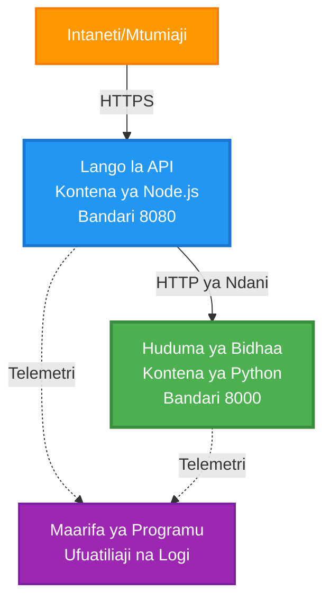
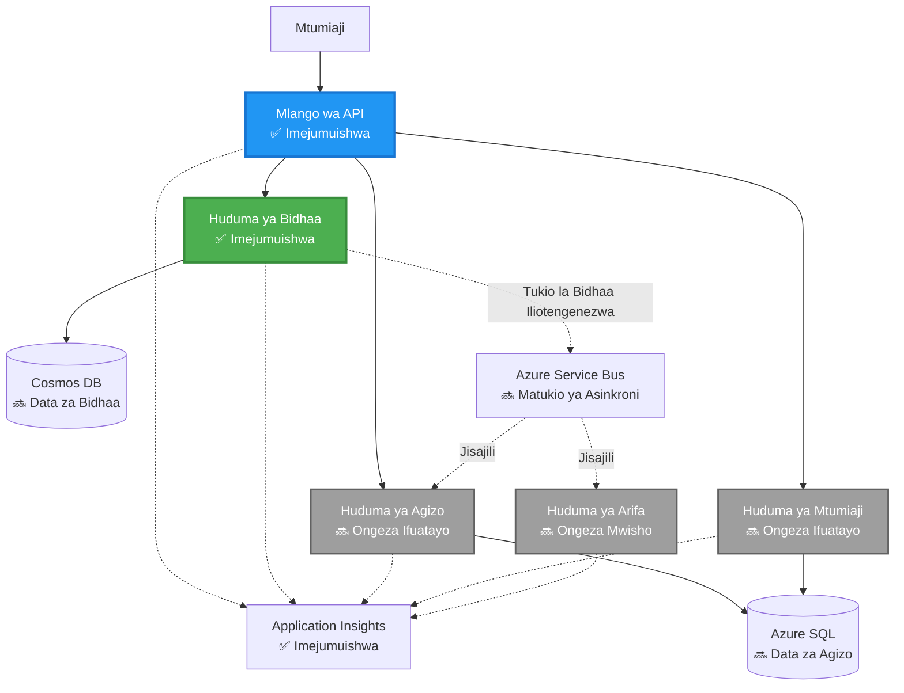
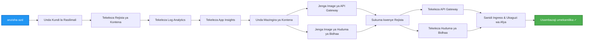
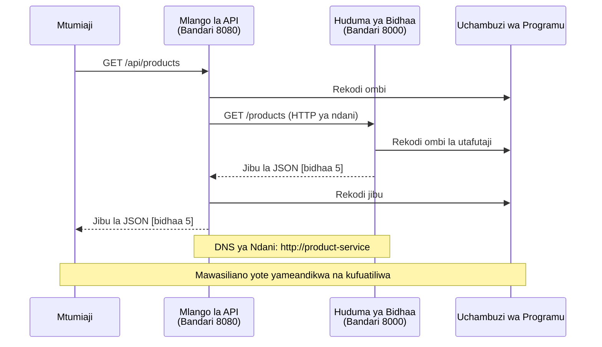

# Microservices Architecture - Container App Example

⏱️ **Wakati Unaokadiriwa**: 25-35 dakika | 💰 **Gharama Inayokadiriwa**: ~$50-100/mwezi | ⭐ **Ugumu**: Kipekee

**📚 Njia ya Kujifunza:**
- ← Zilizopita: [Simple Flask API](../../../../examples/container-app/simple-flask-api) - Misingi ya kontena moja
- 🎯 **Uko Hapa**: Microservices Architecture (fundamento ya huduma 2)
- → Ifuatayo: [AI Integration](../../../../docs/ai-foundry) - Ongeza akili kwa huduma zako
- 🏠 [Course Home](../../README.md)

---

Miundombinu ya microservices iliyorahisishwa lakini inayofanya kazi iliyowekwa kwenye Azure Container Apps kwa kutumia AZD CLI. Mfano huu unaonyesha mawasiliano ya huduma kwa huduma, orkestra ya kontena, na ufuatiliaji kwa usanidi wa huduma 2 wenye vitendo.

> **📚 Mbinu ya Kujifunza**: Mfano huu unaanza na miundombinu ya huduma 2 ya msingi (API Gateway + Backend Service) ambayo unaweza kuitekeleza na kujifunza kutoka. Baada ya kumiliki msingi huu, tunatoa mwongozo wa kupanua hadi mfumo kamili wa microservices.

## Utakacho Jifunze

Kwa kumaliza mfano huu, utafanya:
- Kuweka kontena nyingi kwenye Azure Container Apps
- Kutekeleza mawasiliano ya huduma kwa huduma kwa mtandao wa ndani
- Kusanidi upimaji wa huduma kulingana na mazingira na ukaguzi wa afya
- Kufuatilia programu zilizogawanywa kwa Application Insights
- Kuelewa mifumo ya utangazaji wa microservices na mbinu bora
- Kujifunza upanuzi wa hatua kwa hatua kutoka rahisi hadi miundo tata

## Miundombinu

### Awamu 1: Tunachojenga (Kimejumuishwa Katika Mfano Huu)


```mermaid
graph TB
    Internet[Intaneti/Mtumiaji]
    Gateway[Lango la API<br/>Kontena ya Node.js<br/>Bandari 8080]
    Product[Huduma ya Bidhaa<br/>Kontena ya Python<br/>Bandari 8000]
    AppInsights[Maarifa ya Programu<br/>Ufuatiliaji na Logi]
    
    Internet -->|HTTPS| Gateway
    Gateway -->|HTTP ya Ndani| Product
    Gateway -.->|Telemetri| AppInsights
    Product -.->|Telemetri| AppInsights
    
    style Gateway fill:#2196F3,stroke:#1976D2,stroke-width:3px,color:#fff
    style Product fill:#4CAF50,stroke:#388E3C,stroke-width:3px,color:#fff
    style Internet fill:#FF9800,stroke:#F57C00,stroke-width:2px,color:#fff
    style AppInsights fill:#9C27B0,stroke:#7B1FA2,stroke-width:2px,color:#fff
```
**Maelezo ya Vipengele:**

| Component | Purpose | Access | Resources |
|-----------|---------|--------|-----------|
| **API Gateway** | Routes external requests to backend services | Public (HTTPS) | 1 vCPU, 2GB RAM, 2-20 replicas |
| **Product Service** | Manages product catalog with in-memory data | Internal only | 0.5 vCPU, 1GB RAM, 1-10 replicas |
| **Application Insights** | Centralized logging and distributed tracing | Azure Portal | 1-2 GB/month data ingestion |

**Kwa Nini Kuanza kwa Urahisi?**
- ✅ Weka na kuelewa haraka (25-35 dakika)
- ✅ Jifunze mifumo ya msingi ya microservices bila ugumu
- ✅ Nambari inayo fanya kazi ambayo unaweza kuibadilisha na kujaribu
- ✅ Gharama ya chini kwa kujifunza (~$50-100/mwezi vs $300-1400/mwezi)
- ✅ Jenga kujiamini kabla ya kuongeza misimbo ya data na foleni za ujumbe

**Tafsiri**: Fikiria hili kama kujifunza kuendesha gari. Unaanza na eneo la kuegesha bila watu (huduma 2), umiliki misingi, kisha unasonga hadi trafiki ya mji (huduma 5+ na hifadhidata).

### Awamu 2: Upanuzi wa Baadaye (Miundombinu ya Marejeleo)

Mara utakapo ulimwa miundombinu ya huduma 2, unaweza kupanua hadi:


```mermaid
graph TB
    User[Mtumiaji]
    Gateway[Mlango wa API<br/>✅ Imejumuishwa]
    Product[Huduma ya Bidhaa<br/>✅ Imejumuishwa]
    Order[Huduma ya Agizo<br/>🔜 Ongeza Ifuatayo]
    UserSvc[Huduma ya Mtumiaji<br/>🔜 Ongeza Ifuatayo]
    Notify[Huduma ya Arifa<br/>🔜 Ongeza Mwisho]
    
    CosmosDB[(Cosmos DB<br/>🔜 Data za Bidhaa)]
    AzureSQL[(Azure SQL<br/>🔜 Data za Agizo)]
    ServiceBus[Azure Service Bus<br/>🔜 Matukio ya Asinkroni]
    AppInsights[Application Insights<br/>✅ Imejumuishwa]
    
    User --> Gateway
    Gateway --> Product
    Gateway --> Order
    Gateway --> UserSvc
    
    Product --> CosmosDB
    Order --> AzureSQL
    UserSvc --> AzureSQL
    
    Product -.->|Tukio la Bidhaa Iliotengenezwa| ServiceBus
    ServiceBus -.->|Jisajili| Notify
    ServiceBus -.->|Jisajili| Order
    
    Gateway -.-> AppInsights
    Product -.-> AppInsights
    Order -.-> AppInsights
    UserSvc -.-> AppInsights
    Notify -.-> AppInsights
    
    style Product fill:#4CAF50,stroke:#388E3C,stroke-width:3px,color:#fff
    style Gateway fill:#2196F3,stroke:#1976D2,stroke-width:3px,color:#fff
    style Order fill:#9E9E9E,stroke:#616161,stroke-width:2px,color:#fff
    style UserSvc fill:#9E9E9E,stroke:#616161,stroke-width:2px,color:#fff
    style Notify fill:#9E9E9E,stroke:#616161,stroke-width:2px,color:#fff
```
Tazama sehemu ya "Expansion Guide" mwishoni kwa maagizo ya hatua kwa hatua.

## Sifa Zilizojumuishwa

✅ **Kugundua Huduma**: Ugunduzi wa moja kwa moja kwa kutumia DNS kati ya kontena  
✅ **Kulinganisha Mzigo**: Kulinganisha mzigo kunakojengwa kwa replicas  
✅ **Kujiweka Kiotomatiki**: Kupanua kwa kujitegemea kwa kila huduma kulingana na maombi ya HTTP  
✅ **Ufuatiliaji wa Afya**: Vipimo vya liveness na readiness kwa huduma zote mbili  
✅ **Kuandika Logi Zilizogawanywa**: Kuandika logi za kati kwa Application Insights  
✅ **Mtandao wa Ndani**: Mawasiliano salama ya huduma kwa huduma  
✅ **Urekebishaji wa Kontena**: Utekelezaji na upanuzi wa moja kwa moja  
✅ **Sasisho Bila Kupunguza Huduma**: Sasisho zinazoendelea kwa usimamizi wa matoleo  

## Masharti ya Awali

### Vifaa Vinavyohitajika

Kabla ya kuanza, thibitisha kuwa una vifaa hivi vilivyowekwa:

1. **[Azure Developer CLI (azd)](https://learn.microsoft.com/azure/developer/azure-developer-cli/install-azd)** (toleo 1.0.0 au juu zaidi)
   ```bash
   azd version
   # Matokeo yanayotarajiwa: azd toleo 1.0.0 au zaidi
   ```

2. **[Azure CLI](https://learn.microsoft.com/cli/azure/install-azure-cli)** (toleo 2.50.0 au juu zaidi)
   ```bash
   az --version
   # Matokeo yaliyotarajiwa: azure-cli 2.50.0 au zaidi
   ```

3. **[Docker](https://www.docker.com/get-started)** (kwa maendeleo/local/testing - hiari)
   ```bash
   docker --version
   # Matokeo yanayotarajiwa: toleo la Docker 20.10 au zaidi
   ```

### Thibitisha Usanidi Wako

Endesha amri hizi kuthibitisha uko tayari:

```bash
# Angalia Azure Developer CLI
azd version
# ✅ Inatarajiwa: azd toleo 1.0.0 au juu zaidi

# Angalia Azure CLI
az --version
# ✅ Inatarajiwa: azure-cli 2.50.0 au juu zaidi

# Angalia Docker (hiari)
docker --version
# ✅ Inatarajiwa: toleo la Docker 20.10 au juu zaidi
```

**Vigezo vya Mafanikio**: Amri zote zinarudisha nambari za toleo zikiendana au kuzidi za chini.

### Mahitaji ya Azure

- Usajili wa **Azure** unaofanya kazi ([create a free account](https://azure.microsoft.com/free/))
- Uidhinishaji wa kuunda rasilimali katika usajili wako
- Nafasi ya **Contributor** kwenye usajili au kundi la rasilimali

### Maarifa Yanayohitajika

Huu ni mfano wa **ngazi ya juu**. Unapaswa kuwa:
- Umeimaliza mfano wa [Simple Flask API example](../../../../examples/container-app/simple-flask-api) 
- Uelewa wa msingi wa miundombinu ya microservices
- Uzoefu wa APIs za REST na HTTP
- Uelewa wa dhana za kontena

**Mpya kwa Container Apps?** Anza na [Simple Flask API example](../../../../examples/container-app/simple-flask-api) kwanza ili ujifunze misingi.

## Anza Haraka (Hatua kwa Hatua)

### Hatua 1: Clone na Nenda Katika Saraka

```bash
git clone https://github.com/microsoft/AZD-for-beginners.git
cd AZD-for-beginners/examples/microservices
```

**✓ Ukaguzi wa Mafanikio**: Thibitisha unaona `azure.yaml`:
```bash
ls
# Inatarajiwa: README.md, azure.yaml, infra/, src/
```

### Hatua 2: Jisajili na Azure

```bash
azd auth login
```

Hii itafungua kivinjari chako kwa ajili ya uthibitisho wa Azure. Ingia kwa nyaraka zako za Azure.

**✓ Ukaguzi wa Mafanikio**: Unapaswa kuona:
```
Logged in to Azure.
```

### Hatua 3: Anzisha Mazingira

```bash
azd init
```

**Maswali utakayoyaona**:
- **Environment name**: Ingiza jina fupi (mfano, `microservices-dev`)
- **Azure subscription**: Chagua usajili wako
- **Azure location**: Chagua eneo (mfano, `eastus`, `westeurope`)

**✓ Ukaguzi wa Mafanikio**: Unapaswa kuona:
```
SUCCESS: New project initialized!
```

### Hatua 4: Weka Miundombinu na Huduma

```bash
azd up
```

**Macho yanayotokea** (inachukua 8-12 dakika):


```mermaid
graph LR
    A[anzisha azd] --> B[Unda Kundi la Rasilimali]
    B --> C[Tekeleza Rejista ya Kontena]
    C --> D[Tekeleza Log Analytics]
    D --> E[Tekeleza App Insights]
    E --> F[Unda Mazingira ya Kontena]
    F --> G[Jenga Image ya API Gateway]
    F --> H[Jenga Image ya Huduma ya Bidhaa]
    G --> I[Sukuma kwenye Rejista]
    H --> I
    I --> J[Tekeleza API Gateway]
    I --> K[Tekeleza Huduma ya Bidhaa]
    J --> L[Sanidi Ingress & Ukaguzi wa Afya]
    K --> L
    L --> M[Usambazaji umekamilika ✓]
    
    style A fill:#2196F3,stroke:#1976D2,stroke-width:3px,color:#fff
    style M fill:#4CAF50,stroke:#388E3C,stroke-width:3px,color:#fff
```
**✓ Ukaguzi wa Mafanikio**: Unapaswa kuona:
```
SUCCESS: Your application was deployed to Azure in X minutes Y seconds.
Endpoint: https://api-gateway-<unique-id>.azurecontainerapps.io
```

**⏱️ Wakati**: 8-12 dakika

### Hatua 5: Jaribu Utekelezaji

```bash
# Pata eneo la mwisho la lango
GATEWAY_URL=$(azd env get-values | grep API_GATEWAY_URL | cut -d '=' -f2 | tr -d '"')

# Jaribu afya ya lango la API
curl $GATEWAY_URL/health
```

**✅ Matokeo Yanayotarajiwa:**
```json
{
  "status": "healthy",
  "service": "api-gateway",
  "timestamp": "2025-11-19T10:30:00Z"
}
```

**Jaribu huduma ya bidhaa kupitia gateway**:
```bash
# Orodhesha bidhaa
curl $GATEWAY_URL/api/products
```

**✅ Matokeo Yanayotarajiwa:**
```json
[
  {"id":1,"name":"Laptop","price":999.99,"stock":50},
  {"id":2,"name":"Mouse","price":29.99,"stock":200},
  {"id":3,"name":"Keyboard","price":79.99,"stock":150}
]
```

**✓ Ukaguzi wa Mafanikio**: Endpoints zote mbili zirudishe data ya JSON bila makosa.

---

**🎉 Hongera!** Umeweka miundombinu ya microservices kwenye Azure!

## Muundo wa Mradi

Faili zote za utekelezaji zimo—hii ni mfano kamili unaofanya kazi:

```
microservices/
│
├── README.md                         # This file
├── azure.yaml                        # AZD configuration
├── .gitignore                        # Git ignore patterns
│
├── infra/                           # Infrastructure as Code (Bicep)
│   ├── main.bicep                   # Main orchestration
│   ├── abbreviations.json           # Naming conventions
│   ├── core/                        # Shared infrastructure
│   │   ├── container-apps-environment.bicep  # Container environment + registry
│   │   └── monitor.bicep            # Application Insights + Log Analytics
│   └── app/                         # Service definitions
│       ├── api-gateway.bicep        # API Gateway container app
│       └── product-service.bicep    # Product Service container app
│
└── src/                             # Application source code
    ├── api-gateway/                 # Node.js API Gateway
    │   ├── app.js                   # Express server with routing
    │   ├── package.json             # Node dependencies
    │   └── Dockerfile               # Container definition
    └── product-service/             # Python Product Service
        ├── main.py                  # Flask API with product data
        ├── requirements.txt         # Python dependencies
        └── Dockerfile               # Container definition
```

**Kila Kipengele Kinachofanya Nini:**

**Infrastructure (infra/)**:
- `main.bicep`: Inaratibu rasilimali zote za Azure na utegemezi wao
- `core/container-apps-environment.bicep`: Inaunda mazingira ya Container Apps na Azure Container Registry
- `core/monitor.bicep`: Inasanidi Application Insights kwa kuandika logi zilizogawanywa
- `app/*.bicep`: Ufafanuzi wa kila container app kwa upanuzi na ukaguzi wa afya

**API Gateway (src/api-gateway/)**:
- Huduma inayoonekana kwa umma inayoratibu maombi kwa huduma za nyuma
- Inatekeleza kuandika logi, kushughulikia makosa, na kupeleka maombi
- Inaonyesha mawasiliano ya HTTP huduma kwa huduma

**Product Service (src/product-service/)**:
- Huduma ya ndani yenye katalogi ya bidhaa (kwa kumbukumbu ya ndani kwa urahisi)
- REST API yenye ukaguzi wa afya
- Mfano wa kigezo cha huduma ya backend

## Muhtasari wa Huduma

### API Gateway (Node.js/Express)

**Port**: 8080  
**Ufikiaji**: Umma (ingress ya nje)  
**Madhumuni**: Inaratibu maombi yanayoingia kwa huduma za nyuma zinazofaa  

**Endpoints**:
- `GET /` - Taarifa za huduma
- `GET /health` - Endpoint ya ukaguzi wa afya
- `GET /api/products` - Kupeleka kwa huduma ya bidhaa (orodha yote)
- `GET /api/products/:id` - Kupeleka kwa huduma ya bidhaa (pata kwa ID)

**Sifa Muhimu**:
- Kuweka njia za maombi kwa axios
- Kuandika logi kwa kitovu
- Kushughulikia makosa na usimamizi wa muda wa kuhitimisha
- Ugunduzi wa huduma kupitia vigezo vya mazingira
- Mwingiliano na Application Insights

**Sehemu ya Msimbo** (`src/api-gateway/app.js`):
```javascript
// Mawasiliano ya huduma za ndani
app.get('/api/products', async (req, res) => {
  const response = await axios.get(`${PRODUCT_SERVICE_URL}/products`, {
    timeout: 5000
  });
  res.json(response.data);
});
```

### Product Service (Python/Flask)

**Port**: 8000  
**Ufikiaji**: Ndani tu (hakuna ingress ya nje)  
**Madhumuni**: Inasimamia katalogi ya bidhaa kwa kumbukumbu ya ndani  

**Endpoints**:
- `GET /` - Taarifa za huduma
- `GET /health` - Endpoint ya ukaguzi wa afya
- `GET /products` - Orodha ya bidhaa zote
- `GET /products/<id>` - Pata bidhaa kwa ID

**Sifa Muhimu**:
- API ya RESTful kwa Flask
- Duka la bidhaa la kumbukumbu ya ndani (rahisi, hakuna hifadhidata inahitajika)
- Ufuatiliaji wa afya kwa probes
- Uandishi wa logi uliopangwa
- Mwingiliano na Application Insights

**Muundo wa Data**:
```python
{
  "id": 1,
  "name": "Laptop",
  "description": "High-performance laptop",
  "price": 999.99,
  "stock": 50
}
```

**Kwa Nini Ndani Tu?**
Huduma ya bidhaa haifunulishwi kwa umma. Maombi yote lazima yapite kupitia API Gateway, ambayo inatoa:
- Usalama: Sehemu ya kuingilia iliyodhibitiwa
- Urahisi: Inaweza kubadilisha backend bila kuathiri wateja
- Ufuatiliaji: Kuandika logi za maombi kwa kitovu

## Kuelewa Mawasiliano ya Huduma

### Huduma Zinazoongeleana Vipi


```mermaid
sequenceDiagram
    participant User as Mtumiaji
    participant Gateway as Mlango la API<br/>(Bandari 8080)
    participant Product as Huduma ya Bidhaa<br/>(Bandari 8000)
    participant AI as Uchambuzi wa Programu
    
    User->>Gateway: GET /api/products
    Gateway->>AI: Rekodi ombi
    Gateway->>Product: GET /products (HTTP ya ndani)
    Product->>AI: Rekodi ombi la utafutaji
    Product-->>Gateway: Jibu la JSON [bidhaa 5]
    Gateway->>AI: Rekodi jibu
    Gateway-->>User: Jibu la JSON [bidhaa 5]
    
    Note over Gateway,Product: DNS ya Ndani: http://product-service
    Note over User,AI: Mawasiliano yote yameandikwa na kufuatiliwa
```
Katika mfano huu, API Gateway inawasiliana na Product Service kwa kutumia **mavoaji ya HTTP ya ndani**:

```javascript
// Mlango wa API (src/api-gateway/app.js)
const PRODUCT_SERVICE_URL = process.env.PRODUCT_SERVICE_URL;

// Tuma ombi la HTTP la ndani
const response = await axios.get(`${PRODUCT_SERVICE_URL}/products`);
```

**Mambo Muhimu**:

1. **Ugunduzi kwa Msingi wa DNS**: Container Apps huweka DNS kwa huduma za ndani moja kwa moja
   - Product Service FQDN: `product-service.internal.<environment>.azurecontainerapps.io`
   - Imefanywa rahisi kama: `http://product-service` (Container Apps inaitatua)

2. **Hakuna Kufunguliwa kwa Umma**: Product Service ina `external: false` katika Bicep
   - Inapatikana tu ndani ya mazingira ya Container Apps
   - Haiwezi kufikiwa kutoka intaneti

3. **Vigezo vya Mazingira**: URL za huduma zinaingizwa wakati wa utekelezaji
   - Bicep hupitisha FQDN ya ndani kwa gateway
   - Hakuna URL zilizowekwa kimakosa ndani ya msimbo wa programu

**Tafsiri**: Fikiria hili kama vyumba vya ofisi. API Gateway ni dawati la kupokea wageni (inayoonekana kwa umma), na Product Service ni chumba cha ofisi (ndani tu). Wageni wanapaswa kupita kupitia dawati kupata chumba chochote.

## Chaguo za Utekelezaji

### Utekelezaji Kamili (Inayopendekezwa)

```bash
# Weka miundombinu na huduma zote mbili
azd up
```

Hii inaweka:
1. Mazingira ya Container Apps
2. Application Insights
3. Container Registry
4. Kontena ya API Gateway
5. Kontena ya Product Service

**Muda**: 8-12 dakika

### Weka Huduma Pamoja Pekee

```bash
# Sambaza huduma moja tu (baada ya azd up ya awali)
azd deploy api-gateway

# Au sambaza huduma ya bidhaa
azd deploy product-service
```

**Kesi ya Matumizi**: Unapobadilisha msimbo katika huduma moja na unataka kuiweka tena huduma hiyo pekee.

### Sasisha Ugawaji wa Mipangilio

```bash
# Badilisha vigezo vya upanuzi
azd env set GATEWAY_MAX_REPLICAS 30

# Peleka upya kwa usanidi mpya
azd up
```

## Mipangilio

### Mipangilio ya Upanuzi

Huduma zote zimewekwa na upanuzi wa kiotomatiki kulingana na HTTP katika faili zao za Bicep:

**API Gateway**:
- Nakala za chini: 2 (daima angalau 2 kwa upatikanaji)
- Nakala za juu: 20
- Kichocheo cha upanuzi: maombi 50 yanayofanana kwa kila nakala

**Product Service**:
- Nakala za chini: 1 (inaweza kupanua hadi sifuri ikiwa inahitajika)
- Nakala za juu: 10
- Kichocheo cha upanuzi: maombi 100 yanayofanana kwa kila nakala

**Binafsisha Upanuzi** (katika `infra/app/*.bicep`):
```bicep
scale: {
  minReplicas: 1
  maxReplicas: 10
  rules: [
    {
      name: 'http-scale-rule'
      http: {
        metadata: {
          concurrentRequests: '100'  // Adjust this
        }
      }
    }
  ]
}
```

### Ugawaji wa Rasilimali

**API Gateway**:
- CPU: 1.0 vCPU
- Kumbukumbu: 2 GiB
- Sababu: Inashughulikia trafiki yote ya nje

**Product Service**:
- CPU: 0.5 vCPU
- Kumbukumbu: 1 GiB
- Sababu: Operesheni nyepesi za kumbukumbu ya ndani

### Ukaguzi wa Afya

Huduma zote zinajumuisha vipimo vya liveness na readiness:

```bicep
probes: [
  {
    type: 'Liveness'
    httpGet: {
      path: '/health'
      port: 8080
    }
    initialDelaySeconds: 10
    periodSeconds: 30
  }
  {
    type: 'Readiness'
    httpGet: {
      path: '/health'
      port: 8080
    }
    initialDelaySeconds: 5
    periodSeconds: 10
  }
]
```

**Hii Inamaanisha Nini**:
- **Liveness**: Ikiwa ukaguzi wa afya unashindwa, Container Apps inaanzisha tena kontena
- **Readiness**: Ikiwa haiko tayari, Container Apps haileti trafiki kwa nakala hiyo

## Ufuatiliaji & Uonekano

### Tazama Logi za Huduma

```bash
# Tazama logi kwa kutumia azd monitor
azd monitor --logs

# Au tumia Azure CLI kwa ajili ya Container Apps maalum:
# Tiririsha logi kutoka API Gateway
az containerapp logs show --name api-gateway --resource-group $RG_NAME --follow

# Tazama logi za hivi karibuni za huduma ya bidhaa
az containerapp logs show --name product-service --resource-group $RG_NAME --tail 100
```

**Matokeo Yanayotarajiwa**:
```
[api-gateway] API Gateway listening on port 8080
[api-gateway] Product Service URL: http://product-service
[api-gateway] GET /api/products 200 - 45ms
[product-service] Retrieved 5 products
```

### Maswali ya Application Insights

Fikia Application Insights kwenye Azure Portal, kisha endesha maswali haya:

**Tafuta Maombi Yanayochukua Muda Mrefu**:
```kusto
requests
| where timestamp > ago(1h)
| where duration > 1000  // Requests taking >1 second
| summarize count() by name, cloud_RoleName
| order by count_ desc
```

**Fuata Mito ya Huduma kwa Huduma**:
```kusto
dependencies
| where timestamp > ago(1h)
| where type == "Http"
| project timestamp, name, target, duration, success
| order by timestamp desc
```

**Kiwango cha Makosa kwa Huduma**:
```kusto
exceptions
| where timestamp > ago(24h)
| summarize errorCount = count() by cloud_RoleName, type
| order by errorCount desc
```

**Kiasi cha Maombi kwa Muda**:
```kusto
requests
| where timestamp > ago(1h)
| summarize requestCount = count() by bin(timestamp, 5m), cloud_RoleName
| render timechart
```

### Fikia Dashibodi ya Ufuatiliaji

```bash
# Pata maelezo ya Application Insights
azd env get-values | grep APPLICATIONINSIGHTS

# Fungua ufuatiliaji katika Azure Portal
az monitor app-insights component show \
  --app $(azd env get-values | grep APPLICATIONINSIGHTS_CONNECTION_STRING | cut -d '=' -f2) \
  --resource-group $(azd env get-values | grep AZURE_RESOURCE_GROUP | cut -d '=' -f2) \
  --query "appId" -o tsv
```

### Metri za Moja kwa Moja

1. Nenda kwenye Application Insights katika Azure Portal
2. Bonyeza "Live Metrics"
3. Tazama maombi ya wakati halisi, kushindwa, na utendaji
4. Jaribu kwa kuendesha: `curl $(azd env get-values | grep API_GATEWAY_URL | cut -d '=' -f2 | tr -d '"')/api/products`

## Mazoezi ya Kitaalamu

### Zoezi 1: Ongeza Endpoint Mpya wa Bidhaa ⭐ (Rahisi)

**Lengo**: Ongeza endpoint ya POST kuunda bidhaa mpya

**Mahali pa Kuanzia**: `src/product-service/main.py`

**Hatua**:

1. Ongeza endpoint hii baada ya fungsi ya `get_product` katika `main.py`:

```python
@app.route('/products', methods=['POST'])
def create_product():
    """Create a new product"""
    data = request.get_json()
    
    # Thibitisha mashamba yanayohitajika
    if not data or 'name' not in data or 'price' not in data:
        return jsonify({'error': 'Missing required fields: name, price'}), 400
    
    new_id = max(p['id'] for p in products) + 1
    new_product = {
        'id': new_id,
        'name': data['name'],
        'description': data.get('description', ''),
        'price': float(data['price']),
        'stock': int(data.get('stock', 0))
    }
    products.append(new_product)
    logger.info(f"Created product {new_id}")
    return jsonify(new_product), 201
```

2. Ongeza njia ya POST kwa API Gateway (`src/api-gateway/app.js`):

```javascript
// Ongeza hii baada ya njia ya GET /api/products
app.post('/api/products', async (req, res) => {
  try {
    console.log(`Forwarding POST request to ${PRODUCT_SERVICE_URL}/products`);
    const response = await axios.post(`${PRODUCT_SERVICE_URL}/products`, req.body, {
      timeout: 5000
    });
    res.status(201).json(response.data);
  } catch (error) {
    console.error('Error calling product service:', error.message);
    res.status(503).json({
      error: 'Product service unavailable',
      message: error.message
    });
  }
});
```

3. Redeploy both services:

```bash
azd deploy product-service
azd deploy api-gateway
```

4. Test the new endpoint:

```bash
GATEWAY_URL=$(azd env get-values | grep API_GATEWAY_URL | cut -d '=' -f2 | tr -d '"')

# Unda bidhaa mpya
curl -X POST $GATEWAY_URL/api/products \
  -H "Content-Type: application/json" \
  -d '{"name":"USB Cable","price":9.99,"stock":500}'
```

**✅ Matokeo yanayotarajiwa:**
```json
{"id":6,"name":"USB Cable","description":"","price":9.99,"stock":500}
```

5. Thibitisha inaonekana katika orodha:

```bash
curl $GATEWAY_URL/api/products
# Sasa inapaswa kuonyesha bidhaa 6 zikiwemo kebo mpya ya USB
```

**Vigezo vya Mafanikio**:
- ✅ Ombi la POST lrudisha HTTP 201
- ✅ Bidhaa mpya inaonekana kwenye orodha ya GET /api/products
- ✅ Bidhaa ina ID inayoongezeka kiotomatiki

**Muda**: 10-15 dakika

---

### Zoefr 2: Badilisha Sheria za Autoscaling ⭐⭐ (Kiwango cha Kati)

**Lengo**: Badilisha Product Service ili iendeshwe kwa kuongezeka kwa nguvu zaidi

**Mahali pa kuanzia**: `infra/app/product-service.bicep`

**Hatua**:

1. Fungua `infra/app/product-service.bicep` na tafuta block ya `scale` (karibu mstari 95)

2. Badilisha kutoka:
```bicep
scale: {
  minReplicas: 1
  maxReplicas: 10
  rules: [
    {
      name: 'http-scale-rule'
      http: {
        metadata: {
          concurrentRequests: '100'  // OLD
        }
      }
    }
  ]
}
```

Kwa:
```bicep
scale: {
  minReplicas: 2  // Always have 2 running
  maxReplicas: 20  // Allow more scaling
  rules: [
    {
      name: 'http-scale-rule'
      http: {
        metadata: {
          concurrentRequests: '20'  // Scale at lower threshold
        }
      }
    }
  ]
}
```

3. Tumia tena miundombinu:

```bash
azd up
```

4. Thibitisha usanidi mpya wa autoscaling:

```bash
az containerapp show \
  --name $(azd env get-values | grep PRODUCT_SERVICE | head -1 | cut -d '/' -f5) \
  --resource-group $(azd env get-values | grep AZURE_RESOURCE_GROUP | cut -d '=' -f2 | tr -d '"') \
  --query "properties.template.scale" -o json
```

**✅ Matokeo yanayotarajiwa:**
```json
{
  "minReplicas": 2,
  "maxReplicas": 20,
  "rules": [...]
}
```

5. Jaribu autoscaling kwa mzigo:

```bash
# Tengeneza maombi sambamba
for i in {1..500}; do curl $GATEWAY_URL/api/products & done

# Tazama upanuzi unapotokea kwa kutumia Azure CLI
az containerapp logs show --name product-service --resource-group $RG_NAME --follow
# Tafuta: matukio ya upanuzi ya Container Apps
```

**Vigezo vya Mafanikio**:
- ✅ Product Service daima inaendesha angalau replicas 2
- ✅ Chini ya mzigo, inaongezeka hadi zaidi ya replicas 2
- ✅ Azure Portal inaonyesha sheria mpya za upanuaji

**Muda**: 15-20 dakika

---

### Zoefr 3: Ongeza Utafutaji wa Ufuatiliaji Maalum ⭐⭐ (Kiwango cha Kati)

**Lengo**: Unda utafutaji maalum wa Application Insights ili kufuatilia utendaji wa API ya product

**Hatua**:

1. Elekea Application Insights katika Azure Portal:
   - Nenda kwenye Azure Portal
   - Tafuta kikundi chako cha rasilimali (rg-microservices-*)
   - Bonyeza kwenye rasilimali ya Application Insights

2. Bonyeza "Logs" kwenye menyu ya kushoto

3. Unda query hii:

```kusto
requests
| where timestamp > ago(1h)
| where name contains "products"
| summarize 
    RequestCount = count(),
    AvgDuration = avg(duration),
    P95Duration = percentile(duration, 95),
    SuccessRate = 100.0 * countif(success == true) / count()
  by bin(timestamp, 5m)
| render timechart
```

4. Bonyeza "Run" ili kutekeleza query

5. Hifadhi query:
   - Bonyeza "Save"
   - Jina: "Utendaji wa API ya Product"
   - Kategoria: "Utendaji"

6. Tengeneza trafiki ya majaribio:

```bash
for i in {1..100}; do curl $GATEWAY_URL/api/products; sleep 1; done
```

7. Sasisha query ili kuona data

**✅ Matokeo yanayotarajiwa:**
- Chati inaonyesha idadi ya maombi kwa muda
- Muda wa wastani < 500ms
- Kiwango cha mafanikio = 100%
- Vipindi vya muda vya dakika 5

**Vigezo vya Mafanikio**:
- ✅ Query inaonyesha maombi 100+
- ✅ Kiwango cha mafanikio ni 100%
- ✅ Muda wa wastani < 500ms
- ✅ Chati inaonyesha vipindi vya muda vya dakika 5

**Matokeo ya Kujifunza**: Elewa jinsi ya kufuatilia utendaji wa huduma kwa query maalum

**Muda**: 10-15 dakika

---

### Zoefr 4: Tekeleza Mantiki ya Kujaribu Tena ⭐⭐⭐ (Kiwango cha Juu)

**Lengo**: Ongeza mantiki ya kujaribu tena kwenye API Gateway wakati Product Service haipatikani kwa muda

**Mahali pa kuanzia**: `src/api-gateway/app.js`

**Hatua**:

1. Sakinisha maktaba ya retry:

```bash
cd src/api-gateway
npm install axios-retry --save
cd ../..
```

2. Update `src/api-gateway/app.js` (ongeza baada ya import ya axios):

```javascript
const axiosRetry = require('axios-retry');

// Sanidi mantiki ya kujaribu tena
axiosRetry(axios, {
  retries: 3,
  retryDelay: (retryCount) => {
    return retryCount * 1000; // 1s, 2s, 3s
  },
  retryCondition: (error) => {
    // Jaribu tena kwa makosa ya mtandao au majibu ya 5xx
    return axiosRetry.isNetworkOrIdempotentRequestError(error) ||
           (error.response && error.response.status >= 500);
  }
});

console.log('Retry logic configured: 3 retries with exponential backoff');
```

3. Tumia tena API Gateway:

```bash
azd deploy api-gateway
```

4. Jaribu tabia ya retry kwa kuiga kushindwa kwa huduma:

```bash
# Punguza huduma ya bidhaa hadi 0 (kuiga kushindwa)
az containerapp update \
  --name $(azd env get-values | grep PRODUCT_SERVICE | head -1 | cut -d '/' -f5) \
  --resource-group $(azd env get-values | grep AZURE_RESOURCE_GROUP | cut -d '=' -f2 | tr -d '"') \
  --min-replicas 0 \
  --max-replicas 0

# Jaribu kufikia bidhaa (itajaribu tena mara 3)
time curl -v $GATEWAY_URL/api/products
# Chunguza: Mwitikio unachukua takriban sekunde 6 (1s + 2s + 3s za jaribio tena)

# Rejesha huduma ya bidhaa
az containerapp update \
  --name $(azd env get-values | grep PRODUCT_SERVICE | head -1 | cut -d '/' -f5) \
  --resource-group $(azd env get-values | grep AZURE_RESOURCE_GROUP | cut -d '=' -f2 | tr -d '"') \
  --min-replicas 1 \
  --max-replicas 10
```

5. Tazama log za retry:

```bash
az containerapp logs show --name api-gateway --resource-group $RG_NAME --tail 50
# Tafuta: ujumbe wa jaribio la kurudia
```

**✅ Tabia Inayotarajiwa:**
- Maombi ynajaribu tena mara 3 kabla ya kushindwa
- Kila jaribio tena hufanya subiri muda mrefu zaidi (1s, 2s, 3s)
- Maombi yanayofanikiwa baada ya huduma kuanzishwa upya
- Log zinaonyesha jaribio tena

**Vigezo vya Mafanikio**:
- ✅ Maombi ynajaribu tena mara 3 kabla ya kushindwa
- ✅ Kila jaribio tena hufanya subiri kwa muda mrefu zaidi (exponential backoff)
- ✅ Maombi yanayofanikiwa baada ya huduma kuanzishwa upya
- ✅ Log zinaonyesha jaribio tena

**Matokeo ya Kujifunza**: Elewa mifumo ya ustahimilivu katika microservices (circuit breakers, retries, timeouts)

**Muda**: 20-25 dakika

---

## Sehemu ya Kupima Maarifa

Baada ya kumaliza mfano huu, thibitisha uelewa wako:

### 1. Mawasiliano ya Huduma ✓

Jaribu maarifa yako:
- [ ] Je, unaweza kuelezea jinsi API Gateway inavyogundua Product Service? (ugunduzi wa huduma kwa kutumia DNS)
- [ ] Nini kinatokea ikiwa Product Service haipo? (Gateway inarudisha kosa 503)
- [ ] Utahifadhije huduma ya tatu? (Tengeneza faili mpya ya Bicep, ongeza kwenye main.bicep, tengeneza folda ya src)

**Uthibitisho wa Vitendo:**
```bash
# Igiza kushindwa kwa huduma
az containerapp update --name <product-service-name> --min-replicas 0 --max-replicas 0
curl $GATEWAY_URL/api/products
# ✅ Inatarajiwa: 503 Huduma Haipatikani

# Rejesha huduma
az containerapp update --name <product-service-name> --min-replicas 1 --max-replicas 10
```

### 2. Ufuatiliaji & Uwezo wa Kuonekana ✓

Jaribu maarifa yako:
- [ ] Wapi unaona log zilizogawanywa? (Application Insights katika Azure Portal)
- [ ] Unawezaje kufuatilia maombi polepole? (Kusto query: `requests | where duration > 1000`)
- [ ] Je, unaweza kubaini ni huduma gani ilisababisha kosa? (Angalia uwanja `cloud_RoleName` katika log)

**Uthibitisho wa Vitendo:**
```bash
# Tengeneza simulasi ya ombi la polepole
curl "$GATEWAY_URL/api/products?delay=2000"

# Fanya uchunguzi kwenye Application Insights kwa maombi polepole
# Nenda kwenye Azure Portal → Application Insights → Logs
# Endesha: requests | where duration > 1000 | project timestamp, name, duration, cloud_RoleName
```

### 3. Upanuaji & Utendaji ✓

Jaribu maarifa yako:
- [ ] Nini husababisha autoscaling? (Sheria za ombi la pamoja za HTTP: 50 kwa gateway, 100 kwa product)
- [ ] Ni nakala ngapi zinaendeshwa sasa? (Angalia kwa `az containerapp revision list`)
- [ ] Utashanaje Product Service hadi replicas 5? (Sasisha minReplicas katika Bicep)

**Uthibitisho wa Vitendo:**
```bash
# Tengeneza mzigo ili kujaribu upanuzi wa kiotomatiki
for i in {1..1000}; do curl $GATEWAY_URL/api/products & done

# Tazama mifano zikiongezeka ukitumia Azure CLI
az containerapp logs show --name api-gateway --resource-group $RG_NAME --follow
# ✅ Inatarajiwa: Ona matukio ya upanuzi katika rejista
```

**Vigezo vya Mafanikio**: Unaweza kujibu maswali yote na kuthibitisha kwa amri za vitendo.

---

## Uchambuzi wa Gharama

### Gharama Zinazokadiriwa Kila Mwezi (Kwa Mfano Huu wa Huduma 2)

| Rasilimali | Usanidi | Gharama Inayokadiriwa |
|----------|--------------|----------------|
| API Gateway | 2-20 replicas, 1 vCPU, 2GB RAM | $30-150 |
| Product Service | 1-10 replicas, 0.5 vCPU, 1GB RAM | $15-75 |
| Container Registry | ngazi ya Msingi | $5 |
| Application Insights | 1-2 GB/mwezi | $5-10 |
| Log Analytics | 1 GB/mwezi | $3 |
| **Jumla** | | **$58-243/month** |

### Mgawanyo wa Gharama kwa Matumizi

**Trafiki Ndogo** (majaribio/kujifunza): ~$60/mwezi
- API Gateway: replicas 2 × 24/7 = $30
- Product Service: replica 1 × 24/7 = $15
- Ufuatiliaji + Registry = $13

**Trafiki ya Kati** (uzalishaji mdogo): ~$120/mwezi
- API Gateway: replicas 5 wastani = $75
- Product Service: replicas 3 wastani = $45
- Ufuatiliaji + Registry = $13

**Trafiki Nguvu** (nyakati za shughuli nyingi): ~$240/mwezi
- API Gateway: replicas 15 wastani = $225
- Product Service: replicas 8 wastani = $120
- Ufuatiliaji + Registry = $13

### Vidokezo vya Kupunguza Gharama

1. **Punguza hadi Sifuri kwa Maendeleo**:
   ```bicep
   scale: {
     minReplicas: 0  // Save $30-40/month when not in use
     maxReplicas: 10
   }
   ```

2. **Tumia Consumption Plan kwa Cosmos DB** (wakati utaiongeza):
   - Lipa tu kwa unachotumia
   - Hakuna malipo ya chini

3. **Weka Sampling ya Application Insights**:
   ```javascript
   appInsights.defaultClient.config.samplingPercentage = 50; // Chukua sampuli ya 50% ya maombi
   ```

4. **Ondoa rasilimali unapokosa haja**:
   ```bash
   azd down --force --purge
   ```

### Chaguo za Tier ya Bure

Kwa kujifunza/majaribio, fikiria:
- ✅ Tumia mikopo ya bure ya Azure ($200 kwa siku za kwanza 30 kwa akaunti mpya)
- ✅ Dhibiti replicas kwa kiwango cha chini (huhifadhi ~50% gharama)
- ✅ Futa baada ya majaribio (hakuna malipo ya kudumu)
- ✅ Punguza hadi sifuri kati ya vikao vya kujifunza

**Mfano**: Kuendesha mfano huu kwa 2 saa/kalenda × siku 30 = ~$5/mwezi badala ya $60/mwezi

---

## Marejeleo ya Haraka ya Utatuzi

### Tatizo: `azd up` inashindwa na "Subscription not found"

**Suluhisho**:
```bash
# Ingia tena na kubainisha usajili
az account set --subscription <your-subscription-id>
azd env set AZURE_SUBSCRIPTION_ID <your-subscription-id>
azd up
```

### Tatizo: API Gateway inarudisha 503 "Product service unavailable"

**Tambua chanzo**:
```bash
# Kagua kumbukumbu za huduma ya bidhaa kwa kutumia Azure CLI
az containerapp logs show --name product-service --resource-group $RG_NAME --tail 50

# Kagua afya ya huduma ya bidhaa
az containerapp show \
  --name $(azd env get-values | grep PRODUCT_SERVICE | head -1 | cut -d '/' -f5) \
  --resource-group $(azd env get-values | grep AZURE_RESOURCE_GROUP | cut -d '=' -f2 | tr -d '"') \
  --query "properties.runningStatus"
```

**Sababu za kawaida**:
1. Product service haikuanza (angalia log kwa makosa ya Python)
2. Ukaguzi wa afya unatofaulu (thibitisha endpoint ya `/health` inafanya kazi)
3. Ujenzi wa image ya container ulianguka (angalia registry kwa image)

### Tatizo: Autoscaling haifanyi kazi

**Tambua chanzo**:
```bash
# Angalia idadi ya nakala za sasa
az containerapp revision list \
  --name $(azd env get-values | grep API_GATEWAY | head -1 | cut -d '/' -f5) \
  --resource-group $(azd env get-values | grep AZURE_RESOURCE_GROUP | cut -d '=' -f2 | tr -d '"') \
  --query "[].properties.replicas"

# Tengeneza mzigo kwa ajili ya kujaribu
for i in {1..1000}; do curl $GATEWAY_URL/api/products & done

# Tazama matukio ya upanuaji kwa kutumia Azure CLI
az containerapp logs show --name api-gateway --resource-group $RG_NAME --follow | grep -i scale
```

**Sababu za kawaida**:
1. Mzigo hauweki viwango vya kutosha kuzindua sheria ya scale (inahitaji >50 maombi ya pamoja)
2. Max replicas zimefikiwa tayari (angalia usanidi wa Bicep)
3. Sheria ya scale imesanifiwa vibaya katika Bicep (thibitisha thamani ya concurrentRequests)

### Tatizo: Application Insights haionyeshi log

**Tambua chanzo**:
```bash
# Thibitisha kuwa msururu wa muunganisho umewekwa
azd env get-values | grep APPLICATIONINSIGHTS

# Angalia ikiwa huduma zinatuma telemetry
az monitor app-insights component show \
  --app $(azd env get-values | grep APPLICATIONINSIGHTS_NAME | cut -d '=' -f2 | tr -d '"') \
  --resource-group $(azd env get-values | grep AZURE_RESOURCE_GROUP | cut -d '=' -f2 | tr -d '"') \
  --query "properties.InstrumentationKey"
```

**Sababu za kawaida**:
1. String ya muunganisho haikupitishwa kwa container (angalia environment variables)
2. SDK ya Application Insights haijasanifiwa (thibitisha imports katika code)
3. Firewall inazuia telemetry (sio kawaida, angalia sheria za mtandao)

### Tatizo: Ujenzi wa Docker unaanguka kwa mahali

**Tambua chanzo**:
```bash
# Jaribu ujenzi wa API Gateway
cd src/api-gateway
docker build -t test-gateway .

# Jaribu ujenzi wa Huduma ya Bidhaa
cd ../product-service
docker build -t test-product .
```

**Sababu za kawaida**:
1. Kutokuwepo kwa dependencies katika package.json/requirements.txt
2. Makosa ya sintaksia katika Dockerfile
3. Masuala ya mtandao kupakua dependencies

**Bado umekwama?** Angalia [Common Issues Guide](../../docs/chapter-07-troubleshooting/common-issues.md) au [Azure Container Apps Troubleshooting](https://learn.microsoft.com/azure/container-apps/troubleshooting)

---

## Usafishaji

Ili kuepuka malipo ya kuendelea, futa rasilimali zote:

```bash
azd down --force --purge
```

**Ombi la Uthibitisho**:
```
? Total resources to delete: 6, are you sure you want to continue? (y/N)
```

Andika `y` kuthibitisha.

**Vinavyofutwa**:
- Container Apps Environment
- Container Apps zote mbili (gateway & product service)
- Container Registry
- Application Insights
- Log Analytics Workspace
- Kikundi cha rasilimali

**✓ Thibitisha Usafishaji**:
```bash
az group list --query "[?starts_with(name,'rg-microservices')]" --output table
```

Inapaswa kurudisha tupu.

---

## Mwongozo wa Upanuzi: Kutoka Huduma 2 hadi 5+

Mara utakapojifunza usanifu huu wa huduma 2, hivi ndivyo ya kuongeza:

### Awamu 1: Ongeza Uhifadhi wa Data (Hatua Inayofuata)

**Ongeza Cosmos DB kwa Product Service**:

1. Tengeneza `infra/core/cosmos.bicep`:
   ```bicep
   resource cosmosAccount 'Microsoft.DocumentDB/databaseAccounts@2023-04-15' = {
     name: name
     location: location
     kind: 'GlobalDocumentDB'
     properties: {
       databaseAccountOfferType: 'Standard'
       consistencyPolicy: { defaultConsistencyLevel: 'Session' }
       locations: [{ locationName: location, failoverPriority: 0 }]
     }
   }
   ```

2. Sasisha product service kutumia Azure Cosmos DB Python SDK badala ya data ya ndani (in-memory)

3. Gharama ya ziada inayokadiriwa: ~$25/mwezi (serverless)

### Awamu 2: Ongeza Huduma ya Tatu (Usimamizi wa Oda)

**Tengeneza Order Service**:

1. Folda mpya: `src/order-service/` (Python/Node.js/C#)
2. Bicep mpya: `infra/app/order-service.bicep`
3. Sasisha API Gateway kupeleka `/api/orders`
4. Ongeza Azure SQL Database kwa uhifadhi wa oda

**Usanifu utakao kuwa**:
```
API Gateway → Product Service (Cosmos DB)
           → Order Service (Azure SQL)
```

### Awamu 3: Ongeza Mawasiliano yasiyo ya Synchronous (Service Bus)

**Tekeleza Architecture inayotegemea Matukio**:

1. Ongeza Azure Service Bus: `infra/core/servicebus.bicep`
2. Product Service itachapisha matukio "ProductCreated"
3. Order Service itasajiliwa kwa matukio ya product
4. Ongeza Notification Service kushughulikia matukio

**Mfumo**: Request/Response (HTTP) + Event-Driven (Service Bus)

### Awamu 4: Ongeza Uthibitishaji wa Watumiaji

**Tekeleza User Service**:

1. Tengeneza `src/user-service/` (Go/Node.js)
2. Ongeza Azure AD B2C au uthibitishaji wa JWT maalum
3. API Gateway ithibitishe token kabla ya kupitisha
4. Huduma zikague ruhusa za mtumiaji

### Awamu 5: Utayarishaji kwa Uzalishaji

**Ongeza Vifaa Hivi**:
- ✅ Azure Front Door (upangaji mzigo wa kimataifa)
- ✅ Azure Key Vault (usimamizi wa siri)
- ✅ Azure Monitor Workbooks (dashibodi maalum)
- ✅ CI/CD Pipeline (GitHub Actions)
- ✅ Utoaji wa Blue-Green
- ✅ Managed Identity kwa huduma zote

**Gharama ya Usanifu Kamili wa Uzalishaji**: ~$300-1,400/mwezi

---

## Jifunze Zaidi

### Nyaraka Zinazohusiana
- [Azure Container Apps Documentation](https://learn.microsoft.com/azure/container-apps/)
- [Microservices Architecture Guide](https://learn.microsoft.com/azure/architecture/guide/architecture-styles/microservices)
- [Application Insights for Distributed Tracing](https://learn.microsoft.com/azure/azure-monitor/app/distributed-tracing)
- [Azure Developer CLI Documentation](https://learn.microsoft.com/azure/developer/azure-developer-cli/)

### Hatua Zifuatazo katika Kozi Hii
- ← Zamani: [API Rahisi ya Flask](../../../../examples/container-app/simple-flask-api) - Mfano wa kuanzia wa single-container
- → Ifuatayo: [Mwongozo wa Uunganishaji wa AI](../../../../docs/ai-foundry) - Ongeza uwezo wa AI
- 🏠 [Nyumbani kwa Kozi](../../README.md)

### Ulinganisho: Wakati wa Kutumia Nini

| Kipengele | Container Moja | Microservices (Hii) | Kubernetes (AKS) |
|---------|-----------------|---------------------|------------------|
| **Matumizi** | Programu rahisi | Programu tata | Programu za kampuni |
| **Uwezo wa Upanuaji** | Huduma moja | Upanuaji kwa huduma | Unyumbufu mkubwa |
| **Ugumu** | Mdogo | Wastani | Juu |
| **Ukubwa wa Timu** | 1-3 developers | 3-10 developers | 10+ developers |
| **Gharama** | ~$15-50/mwezi | ~$60-250/mwezi | ~$150-500/mwezi |
| **Muda wa Utekelezaji** | 5-10 dakika | 8-12 dakika | 15-30 dakika |
| **Bora Kwa** | MVPs, prototypes | Programu za uzalishaji | Multi-cloud, mtandao wa hali ya juu |

**Recommendation**: Anza na Container Apps (mfano huu), hamia AKS tu ikiwa unahitaji vipengele maalum vya Kubernetes.

---

## Maswali Yanayoulizwa Mara kwa Mara

**Q: Kwa nini huduma 2 tu badala ya 5+?**  
A: Mageuzi ya kielimu. Fanya kazi na misingi (mawasiliano ya huduma, ufuatiliaji, upanuzi) kwa mfano rahisi kabla ya kuongeza ugumu. Mifumo unayojifunza hapa inatumika kwa usanifu wa huduma 100.

**Q: Je, ninaweza kuongeza huduma zaidi mwenyewe?**  
A: Bila shaka! Fuata mwongozo wa upanuzi uliyo juu. Kila huduma mpya inafuata muundo ule ule: tengeneza src folder, tengeneza Bicep file, sasisha azure.yaml, deploy.

**Q: Je, hii iko tayari kwa uzalishaji?**  
A: Ni msingi imara. Kwa uzalishaji, ongeza: managed identity, Key Vault, hifadhidata za kudumu, mchakato wa CI/CD, arifa za ufuatiliaji, na mkakati wa chelezo.

**Q: Kwa nini sielewi kutumia Dapr au service mesh nyingine?**  
A: Weka iwe rahisi kwa ajili ya kujifunza. Ukifa unakuelewa mitandao ya asili ya Container Apps, unaweza kuongeza Dapr kwa matukio ya juu (usimamizi wa state, pub/sub, bindings).

**Q: Ninawezaje kutatua hitilafu kwa eneo la kompyuta?**  
A: Endesha huduma kwa eneo la kompyuta kwa kutumia Docker:
```bash
cd src/api-gateway
docker build -t local-gateway .
docker run -p 8080:8080 -e PRODUCT_SERVICE_URL=http://localhost:8000 local-gateway
```

**Q: Je, ninaweza kutumia lugha tofauti za programu?**  
A: Ndiyo! Mfano huu unaonyesha Node.js (gateway) + Python (huduma ya bidhaa). Unaweza kuchanganya lugha yoyote inayotumia kwenye containers: C#, Go, Java, Ruby, PHP, n.k.

**Q: Je, nisipokuwa na mikopo ya Azure?**  
A: Tumia tier ya bure ya Azure (siku 30 za kwanza kwa akaunti mpya hupata $200 mikopo) au weka kwa vipindi vifupi vya majaribio kisha ufute mara moja. Mfano huu unagharimu takriban ~$2/kila siku.

**Q: Hii inatofautianaje na Azure Kubernetes Service (AKS)?**  
A: Container Apps ni rahisi zaidi (haitaji ujuzi wa Kubernetes) lakini ni mdogo kwa kubadilika. AKS inakupa udhibiti kamili wa Kubernetes lakini inahitaji utaalamu zaidi. Anza na Container Apps, hamia AKS ukihitaji.

**Q: Je, ninaweza kutumia hili na huduma za Azure zilizopo?**  
A: Ndiyo! Unaweza kuunganisha kwa hifadhidata zilizo tayari, akaunti za uhifadhi, Service Bus, n.k. Sasisha faili za Bicep ili kurejea rasilimali zilizopo badala ya kuunda mpya.

---

> **🎓 Muhtasari wa Njia ya Kujifunza**: Umejifunza kupeleka usanifu wa huduma nyingi wenye upanuzi wa kiotomatiki, mitandao ya ndani, ufuatiliaji uliowezeshwa katikati, na mifumo inayofaa uzalishaji. Msingi huu unakuandaa kwa mifumo tata za kusambazwa na usanifu wa microservices za kampuni.

**📚 Urambazaji wa Kozi:**
- ← Iliyopita: [Simple Flask API](../../../../examples/container-app/simple-flask-api)
- → Ifuatayo: [Database Integration Example](../../../../database-app)
- 🏠 [Nyumbani kwa Kozi](../../README.md)
- 📖 [Mbinu Bora za Container Apps](../../docs/chapter-04-infrastructure/deployment-guide.md)

---

**✨ Hongera!** Umekamilisha mfano wa microservices. Sasa unaelewa jinsi ya kujenga, kupeleka, na kufuatilia programu zilizosambazwa kwenye Azure Container Apps. Tayari kuongeza uwezo wa AI? Angalia [Mwongozo wa Uingizaji wa AI](../../../../docs/ai-foundry)!

---

<!-- CO-OP TRANSLATOR DISCLAIMER START -->
Kiondoa wajibu:

Nyaraka hii imetafsiriwa kwa kutumia huduma ya tafsiri ya AI [Co-op Translator] (https://github.com/Azure/co-op-translator). Wakati tunajitahidi kufikia usahihi, tafadhali zingatia kwamba tafsiri za kiotomatiki zinaweza kuwa na makosa au ukosefu wa usahihi. Nyaraka ya asili katika lugha yake inapaswa kuchukuliwa kama chanzo chenye mamlaka. Kwa taarifa muhimu, tunapendekeza tafsiri ya kitaalamu ya binadamu. Hatutawajibika kwa kutoelewana au tafsiri potofu zitokanazo na matumizi ya tafsiri hii.
<!-- CO-OP TRANSLATOR DISCLAIMER END -->