# Usanifu wa Microservices - Mfano wa Programu ya Kontena

⏱️ **Muda Unaokadiriwa**: Dakika 25-35 | 💰 **Gharama Inayokadiriwa**: ~$50-100/mwezi | ⭐ **Ugumu**: Juu

**📚 Njia ya Kujifunza:**
- ← Awali: [API Rahisi ya Flask](../../../../examples/container-app/simple-flask-api) - Misingi ya kontena moja
- 🎯 **Upo Hapa**: Usanifu wa Microservices (msingi wa huduma 2)
- → Ifuatayo: [Ujumuishaji wa AI](../../../../docs/ai-foundry) - Ongeza akili kwenye huduma zako
- 🏠 [Nyumbani kwa Kozi](../../README.md)

---

Usanifu wa **microservices rahisi lakini unaofanya kazi** uliotumwa kwa Azure Container Apps ukitumia AZD CLI. Mfano huu unaonyesha mawasiliano kati ya huduma, upangaji wa kontena, na ufuatiliaji kwa usanifu wa huduma 2 wa vitendo.

> **📚 Njia ya Kujifunza**: Mfano huu unaanza na usanifu wa huduma 2 wa kiwango cha chini (API Gateway + Huduma ya Nyuma) ambao unaweza kuutuma na kujifunza kutoka kwake. Baada ya kufahamu msingi huu, tunatoa mwongozo wa kupanua hadi mfumo kamili wa microservices.

## Utajifunza Nini

Kwa kukamilisha mfano huu, utajifunza:
- Kutuma kontena nyingi kwa Azure Container Apps
- Kutekeleza mawasiliano kati ya huduma kwa kutumia mtandao wa ndani
- Kusimamia upanuzi kulingana na mazingira na ukaguzi wa afya
- Kufuatilia programu zilizogawanyika kwa kutumia Application Insights
- Kuelewa mifumo ya utumaji wa microservices na mbinu bora
- Kujifunza upanuzi wa hatua kwa hatua kutoka usanifu rahisi hadi mgumu

## Usanifu

### Awamu ya 1: Tunachojenga (Kimejumuishwa Katika Mfano Huu)


**Maelezo ya Vipengele:**

| Kipengele | Kusudi | Ufikiaji | Rasilimali |
|-----------|---------|--------|-----------|
| **API Gateway** | Inapokea maombi ya nje na kuyapeleka kwa huduma za nyuma | Umma (HTTPS) | 1 vCPU, 2GB RAM, nakala 2-20 |
| **Huduma ya Bidhaa** | Inasimamia orodha ya bidhaa kwa data ya ndani ya kumbukumbu | Ya ndani tu | 0.5 vCPU, 1GB RAM, nakala 1-10 |
| **Application Insights** | Kumbukumbu kuu na ufuatiliaji wa kugawanyika | Azure Portal | 1-2 GB/mwezi ya data |

**Kwa Nini Kuanza Rahisi?**
- ✅ Tuma na elewa haraka (dakika 25-35)
- ✅ Jifunze mifumo ya msingi ya microservices bila ugumu
- ✅ Msimbo unaofanya kazi ambao unaweza kuubadilisha na kujaribu
- ✅ Gharama ya chini kwa kujifunza (~$50-100/mwezi dhidi ya $300-1400/mwezi)
- ✅ Jenga kujiamini kabla ya kuongeza hifadhidata na foleni za ujumbe

**Mfano**: Fikiria kama kujifunza kuendesha gari. Unaanzia kwenye uwanja wa maegesho tupu (huduma 2), unajifunza misingi, kisha unaendelea kwenye trafiki ya mji (huduma 5+ na hifadhidata).

### Awamu ya 2: Upanuzi wa Baadaye (Usanifu wa Marejeleo)

Baada ya kufahamu usanifu wa huduma 2, unaweza kupanua hadi:


Tazama sehemu ya "Mwongozo wa Upanuzi" mwishoni kwa maelekezo ya hatua kwa hatua.

## Vipengele Vilivyojumuishwa

✅ **Ugunduzi wa Huduma**: Ugunduzi wa DNS kiotomatiki kati ya kontena  
✅ **Usawazishaji wa Mizigo**: Usawazishaji wa mizigo uliojengwa ndani ya nakala  
✅ **Upanuzi wa Kiotomatiki**: Upanuzi wa kujitegemea kwa kila huduma kulingana na maombi ya HTTP  
✅ **Ufuatiliaji wa Afya**: Ukaguzi wa liveness na readiness kwa huduma zote mbili  
✅ **Kumbukumbu Zilizogawanyika**: Kumbukumbu kuu na Application Insights  
✅ **Mtandao wa Ndani**: Mawasiliano salama kati ya huduma  
✅ **Upangaji wa Kontena**: Utumaji na upanuzi wa kiotomatiki  
✅ **Sasisho Bila Kusimamisha**: Sasisho za mzunguko na usimamizi wa marekebisho  

## Mahitaji ya Awali

### Zana Zinazohitajika

Kabla ya kuanza, hakikisha una zana hizi zimesakinishwa:

1. **[Azure Developer CLI (azd)](https://learn.microsoft.com/azure/developer/azure-developer-cli/install-azd)** (toleo 1.0.0 au zaidi)
   ```bash
   azd version
   # Matokeo yanayotarajiwa: toleo la azd 1.0.0 au juu zaidi
   ```

2. **[Azure CLI](https://learn.microsoft.com/cli/azure/install-azure-cli)** (toleo 2.50.0 au zaidi)
   ```bash
   az --version
   # Matokeo yanayotarajiwa: azure-cli 2.50.0 au zaidi
   ```

3. **[Docker](https://www.docker.com/get-started)** (kwa maendeleo/majaribio ya ndani - hiari)
   ```bash
   docker --version
   # Matokeo yanayotarajiwa: Toleo la Docker 20.10 au juu zaidi
   ```

### Thibitisha Usanidi Wako

Endesha amri hizi kuthibitisha uko tayari:

```bash
# Angalia Azure Developer CLI
azd version
# ✅ Inatarajiwa: azd toleo 1.0.0 au juu

# Angalia Azure CLI
az --version
# ✅ Inatarajiwa: azure-cli 2.50.0 au juu

# Angalia Docker (hiari)
docker --version
# ✅ Inatarajiwa: Toleo la Docker 20.10 au juu
```

**Vigezo vya Mafanikio**: Amri zote zinarudisha namba za matoleo zinazolingana au kuzidi kiwango cha chini.

### Mahitaji ya Azure

- Usajili wa **Azure** unaofanya kazi ([unda akaunti ya bure](https://azure.microsoft.com/free/))
- Ruhusa za kuunda rasilimali katika usajili wako
- Jukumu la **Contributor** kwenye usajili au kikundi cha rasilimali

### Maarifa Yanayohitajika

Huu ni mfano wa **kiwango cha juu**. Unapaswa kuwa na:
- Umekamilisha mfano wa [API Rahisi ya Flask](../../../../examples/container-app/simple-flask-api) 
- Uelewa wa msingi wa usanifu wa microservices
- Uzoefu wa REST APIs na HTTP
- Uelewa wa dhana za kontena

**Mgeni kwa Container Apps?** Anza na mfano wa [API Rahisi ya Flask](../../../../examples/container-app/simple-flask-api) kwanza kujifunza misingi.

## Mwanzo wa Haraka (Hatua kwa Hatua)

### Hatua ya 1: Kloni na Elekea

```bash
git clone https://github.com/microsoft/AZD-for-beginners.git
cd AZD-for-beginners/examples/microservices
```

**✓ Ukaguzi wa Mafanikio**: Thibitisha unaona `azure.yaml`:
```bash
ls
# Inatarajiwa: README.md, azure.yaml, infra/, src/
```

### Hatua ya 2: Thibitisha na Azure

```bash
azd auth login
```

Hii inafungua kivinjari chako kwa uthibitishaji wa Azure. Ingia na maelezo yako ya Azure.

**✓ Ukaguzi wa Mafanikio**: Unapaswa kuona:
```
Logged in to Azure.
```

### Hatua ya 3: Anzisha Mazingira

```bash
azd init
```

**Maswali utakayoulizwa**:
- **Jina la Mazingira**: Weka jina fupi (mfano, `microservices-dev`)
- **Usajili wa Azure**: Chagua usajili wako
- **Eneo la Azure**: Chagua eneo (mfano, `eastus`, `westeurope`)

**✓ Ukaguzi wa Mafanikio**: Unapaswa kuona:
```
SUCCESS: New project initialized!
```

### Hatua ya 4: Tuma Miundombinu na Huduma

```bash
azd up
```

**Kinachotokea** (huchukua dakika 8-12):

```mermaid
graph LR
    A[azd up] --> B[Unda Kikundi cha Rasilimali]
    B --> C[Tuma Usajili wa Kontena]
    C --> D[Tuma Uchambuzi wa Magogo]
    D --> E[Tuma Uelewa wa Programu]
    E --> F[Unda Mazingira ya Kontena]
    F --> G[Jenga Picha ya Lango la API]
    F --> H[Jenga Picha ya Huduma ya Bidhaa]
    G --> I[Sukuma kwenye Usajili]
    H --> I
    I --> J[Tuma Lango la API]
    I --> K[Tuma Huduma ya Bidhaa]
    J --> L[Sanidi Ingress & Ukaguzi wa Afya]
    K --> L
    L --> M[Upelekaji Umekamilika ✓]
    
    style A fill:#2196F3,stroke:#1976D2,stroke-width:3px,color:#fff
    style M fill:#4CAF50,stroke:#388E3C,stroke-width:3px,color:#fff
```


**✓ Ukaguzi wa Mafanikio**: Unapaswa kuona:
```
SUCCESS: Your application was deployed to Azure in X minutes Y seconds.
Endpoint: https://api-gateway-<unique-id>.azurecontainerapps.io
```

**⏱️ Muda**: Dakika 8-12

### Hatua ya 5: Jaribu Utumaji

```bash
# Pata mwisho wa lango la gateway
GATEWAY_URL=$(azd env get-values | grep API_GATEWAY_URL | cut -d '=' -f2 | tr -d '"')

# Jaribu afya ya API Gateway
curl $GATEWAY_URL/health
```

**✅ Matokeo Yanayotarajiwa**:
```json
{
  "status": "healthy",
  "service": "api-gateway",
  "timestamp": "2025-11-19T10:30:00Z"
}
```

**Jaribu huduma ya bidhaa kupitia lango**:
```bash
# Orodhesha bidhaa
curl $GATEWAY_URL/api/products
```

**✅ Matokeo Yanayotarajiwa**:
```json
[
  {"id":1,"name":"Laptop","price":999.99,"stock":50},
  {"id":2,"name":"Mouse","price":29.99,"stock":200},
  {"id":3,"name":"Keyboard","price":79.99,"stock":150}
]
```

**✓ Ukaguzi wa Mafanikio**: Vituo vyote viwili vinarejesha data ya JSON bila makosa.

---

**🎉 Hongera!** Umetuma usanifu wa microservices kwa Azure!

## Muundo wa Mradi

Faili zote za utekelezaji zimejumuishwa—huu ni mfano kamili, unaofanya kazi:

```
microservices/
│
├── README.md                         # This file
├── azure.yaml                        # AZD configuration
├── .gitignore                        # Git ignore patterns
│
├── infra/                           # Infrastructure as Code (Bicep)
│   ├── main.bicep                   # Main orchestration
│   ├── abbreviations.json           # Naming conventions
│   ├── core/                        # Shared infrastructure
│   │   ├── container-apps-environment.bicep  # Container environment + registry
│   │   └── monitor.bicep            # Application Insights + Log Analytics
│   └── app/                         # Service definitions
│       ├── api-gateway.bicep        # API Gateway container app
│       └── product-service.bicep    # Product Service container app
│
└── src/                             # Application source code
    ├── api-gateway/                 # Node.js API Gateway
    │   ├── app.js                   # Express server with routing
    │   ├── package.json             # Node dependencies
    │   └── Dockerfile               # Container definition
    └── product-service/             # Python Product Service
        ├── main.py                  # Flask API with product data
        ├── requirements.txt         # Python dependencies
        └── Dockerfile               # Container definition
```

**Kila Kipengele Kinafanya Nini:**

**Miundombinu (infra/)**:
- `main.bicep`: Inapangilia rasilimali zote za Azure na utegemezi wake
- `core/container-apps-environment.bicep`: Inaunda mazingira ya Container Apps na Azure Container Registry
- `core/monitor.bicep`: Inasanidi Application Insights kwa kumbukumbu zilizogawanyika
- `app/*.bicep`: Ufafanuzi wa programu za kontena binafsi na upanuzi na ukaguzi wa afya

**API Gateway (src/api-gateway/)**:
- Huduma inayokabiliana na umma inayopokea maombi na kuyapeleka kwa huduma za nyuma
- Inatekeleza kumbukumbu, usimamizi wa makosa, na uelekezaji wa maombi
- Inaonyesha mawasiliano ya HTTP kati ya huduma

**Huduma ya Bidhaa (src/product-service/)**:
- Huduma ya ndani yenye orodha ya bidhaa (kwa kumbukumbu rahisi)
- REST API yenye ukaguzi wa afya
- Mfano wa muundo wa huduma ya nyuma

## Muhtasari wa Huduma

### API Gateway (Node.js/Express)

**Bandari**: 8080  
**Ufikiaji**: Umma (ingress ya nje)  
**Kusudi**: Inapokea maombi na kuyapeleka kwa huduma za nyuma  

**Vituo**:
- `GET /` - Taarifa ya huduma
- `GET /health` - Kituo cha ukaguzi wa afya
- `GET /api/products` - Elekeza kwa huduma ya bidhaa (orodha yote)
- `GET /api/products/:id` - Elekeza kwa huduma ya bidhaa (pata kwa ID)

**Vipengele Muhimu**:
- Uelekezaji wa maombi kwa axios
- Kumbukumbu kuu
- Usimamizi wa makosa na muda wa kusubiri
- Ugunduzi wa huduma kupitia vigezo vya mazingira
- Ujumuishaji wa Application Insights

**Msimbo wa Msingi** (`src/api-gateway/app.js`):
```javascript
// Mawasiliano ya huduma ya ndani
app.get('/api/products', async (req, res) => {
  const response = await axios.get(`${PRODUCT_SERVICE_URL}/products`, {
    timeout: 5000
  });
  res.json(response.data);
});
```

### Huduma ya Bidhaa (Python/Flask)

**Bandari**: 8000  
**Ufikiaji**: Ya ndani tu (hakuna ingress ya nje)  
**Kusudi**: Inasimamia orodha ya bidhaa kwa kumbukumbu rahisi  

**Vituo**:
- `GET /` - Taarifa ya huduma
- `GET /health` - Kituo cha ukaguzi wa afya
- `GET /products` - Orodhesha bidhaa zote
- `GET /products/<id>` - Pata bidhaa kwa ID

**Vipengele Muhimu**:
- RESTful API na Flask
- Duka la bidhaa kwa kumbukumbu (rahisi, hakuna hifadhidata inayohitajika)
- Ufuatiliaji wa afya kwa probes
- Kumbukumbu zilizopangiliwa
- Ujumuishaji wa Application Insights

**Mfano wa Data**:
```python
{
  "id": 1,
  "name": "Laptop",
  "description": "High-performance laptop",
  "price": 999.99,
  "stock": 50
}
```

**Kwa Nini Ya Ndani Tu?**
Huduma ya bidhaa haifichuliwi kwa umma. Maombi yote lazima yapitie API Gateway, ambayo hutoa:
- Usalama: Kituo cha ufikiaji kilichodhibitiwa
- Urahisi: Inaweza kubadilisha huduma ya nyuma bila kuathiri wateja
- Ufuatiliaji: Kumbukumbu kuu za maombi

## Kuelewa Mawasiliano ya Huduma

### Jinsi Huduma Zinavyowasiliana


Katika mfano huu, API Gateway inawasiliana na Huduma ya Bidhaa kwa kutumia **maombi ya HTTP ya ndani**:

```javascript
// Lango la API (src/api-gateway/app.js)
const PRODUCT_SERVICE_URL = process.env.PRODUCT_SERVICE_URL;

// Fanya ombi la HTTP la ndani
const response = await axios.get(`${PRODUCT_SERVICE_URL}/products`);
```

**Vidokezo Muhimu**:

1. **Ugunduzi wa DNS**: Container Apps hutoa DNS kiotomatiki kwa huduma za ndani
   - FQDN ya Huduma ya Bidhaa: `product-service.internal.<environment>.azurecontainerapps.io`
   - Imerahisishwa kama: `http://product-service` (Container Apps inatatua)

2. **Hakuna Ufunuo wa Umma**: Huduma ya Bidhaa ina `external: false` kwenye Bicep
   - Inapatikana tu ndani ya mazingira ya Container Apps
   - Haiwezi kufikiwa kutoka mtandao

3. **Vigezo vya Mazingira**: URL za huduma huingizwa wakati wa utumaji
   - Bicep hupitisha FQDN ya ndani kwa lango
   - Hakuna URL zilizowekwa moja kwa moja kwenye msimbo wa programu

**Mfano**: Fikiria kama vyumba vya ofisi. API Gateway ni dawati la mapokezi (inayokabiliana na umma), na Huduma ya Bidhaa ni chumba cha ofisi (ya ndani tu). Wageni lazima wapitie mapokezi kufikia chumba chochote.

## Chaguzi za Utumaji

### Utumaji Kamili (Inapendekezwa)

```bash
# Weka miundombinu na huduma zote mbili
azd up
```

Hii inatuma:
1. Mazingira ya Container Apps
2. Application Insights
3. Container Registry
4. Kontena la API Gateway
5. Kontena la Huduma ya Bidhaa

**Muda**: Dakika 8-12

### Tuma Huduma Binafsi

```bash
# Peleka huduma moja tu (baada ya azd up ya awali)
azd deploy api-gateway

# Au peleka huduma ya bidhaa
azd deploy product-service
```

**Matumizi**: Wakati umesasisha msimbo katika huduma moja na unataka kutuma tena huduma hiyo tu.

### Sasisha Usanidi

```bash
# Badilisha vigezo vya kupima
azd env set GATEWAY_MAX_REPLICAS 30

# Tuma upya na usanidi mpya
azd up
```

## Usanidi

### Usanidi wa Upanuzi

Huduma zote mbili zimeundwa na upanuzi wa kiotomatiki kulingana na HTTP kwenye faili zao za Bicep:

**API Gateway**:
- Nakala za chini: 2 (angalau 2 kwa upatikanaji)
- Nakala za juu: 20
- Kichocheo cha upanuzi: Maombi 50 ya wakati mmoja kwa nakala

**Huduma ya Bidhaa**:
- Nakala za chini: 1 (inaweza kupungua hadi sifuri ikiwa inahitajika)
- Nakala za juu: 10
- Kichocheo cha upanuzi: Maombi 100 ya wakati mmoja kwa nakala

**Badilisha Upanuzi** (katika `infra/app/*.bicep`):
```bicep
scale: {
  minReplicas: 1
  maxReplicas: 10
  rules: [
    {
      name: 'http-scale-rule'
      http: {
        metadata: {
          concurrentRequests: '100'  // Adjust this
        }
      }
    }
  ]
}
```

### Ugawaji wa Rasilimali

**API Gateway**:
- CPU: 1.0 vCPU
- Kumbukumbu: 2 GiB
- Sababu: Inashughulikia trafiki yote ya nje

**Huduma ya Bidhaa**:
- CPU: 0.5 vCPU
- Kumbukumbu: 1 GiB
- Sababu: Operesheni nyepesi za kumbukumbu

### Ukaguzi wa Afya

Huduma zote mbili zinajumuisha liveness na readiness probes:

```bicep
probes: [
  {
    type: 'Liveness'
    httpGet: {
      path: '/health'
      port: 8080
    }
    initialDelaySeconds: 10
    periodSeconds: 30
  }
  {
    type: 'Readiness'
    httpGet: {
      path: '/health'
      port: 8080
    }
    initialDelaySeconds: 5
    periodSeconds: 10
  }
]
```

**Hii Inamaanisha**:
- **Liveness**: Ikiwa ukaguzi wa afya unashindwa, Container Apps inarudisha kontena
- **Readiness**: Ikiwa haiko tayari, Container Apps inasimamisha kuelekeza trafiki kwa nakala hiyo

## Ufuatiliaji na Uangalizi

### Tazama Kumbukumbu za Huduma

```bash
# Tazama kumbukumbu kutoka kwa API Gateway
azd logs api-gateway --follow

# Tazama kumbukumbu za huduma ya bidhaa za hivi karibuni
azd logs product-service --tail 100

# Tazama kumbukumbu zote kutoka kwa huduma zote mbili
azd logs --follow
```

**Matokeo Yanayotarajiwa**:
```
[api-gateway] API Gateway listening on port 8080
[api-gateway] Product Service URL: http://product-service
[api-gateway] GET /api/products 200 - 45ms
[product-service] Retrieved 5 products
```

### Maswali ya Application Insights

Fikia Application Insights kwenye Azure Portal, kisha endesha maswali haya:

**Pata Maombi Polepole**:
```kusto
requests
| where timestamp > ago(1h)
| where duration > 1000  // Requests taking >1 second
| summarize count() by name, cloud_RoleName
| order by count_ desc
```

**Fuatilia Mawasiliano ya Huduma kwa Huduma**:
```kusto
dependencies
| where timestamp > ago(1h)
| where type == "Http"
| project timestamp, name, target, duration, success
| order by timestamp desc
```

**Kiwango cha Makosa kwa Huduma**:
```kusto
exceptions
| where timestamp > ago(24h)
| summarize errorCount = count() by cloud_RoleName, type
| order by errorCount desc
```

**Kiasi cha Maombi kwa Muda**:
```kusto
requests
| where timestamp > ago(1h)
| summarize requestCount = count() by bin(timestamp, 5m), cloud_RoleName
| render timechart
```

### Fikia Dashibodi ya Ufuatiliaji

```bash
# Pata maelezo ya Uchanganuzi wa Maombi
azd env get-values | grep APPLICATIONINSIGHTS

# Fungua ufuatiliaji wa Azure Portal
az monitor app-insights component show \
  --app $(azd env get-values | grep APPLICATIONINSIGHTS_CONNECTION_STRING | cut -d '=' -f2) \
  --resource-group $(azd env get-values | grep AZURE_RESOURCE_GROUP | cut -d '=' -f2) \
  --query "appId" -o tsv
```

### Metriki za Moja kwa Moja

1. Nenda kwenye Application Insights kwenye Azure Portal
2. Bonyeza "Live Metrics"
3. Tazama maombi ya wakati halisi, kushindwa, na utendaji
4. Jaribu kwa kuendesha: `curl $(azd env get-values | grep API_GATEWAY_URL | cut -d '=' -f2 | tr -d '"')/api/products`

## Mazoezi ya Vitendo

### Zoezi 1: Ongeza Kituo Kipya cha Bidhaa ⭐ (Rahisi)

**Lengo**: Ongeza kituo cha POST kuunda bidhaa mpya

**Sehemu ya Kuanza**: `src/product-service/main.py`

**Hatua**:

1. Ongeza kituo hiki baada ya kazi ya `get_product` katika `main.py`:

```python
@app.route('/products', methods=['POST'])
def create_product():
    """Create a new product"""
    data = request.get_json()
    
    # Thibitisha sehemu zinazohitajika
    if not data or 'name' not in data or 'price' not in data:
        return jsonify({'error': 'Missing required fields: name, price'}), 400
    
    new_id = max(p['id'] for p in products) + 1
    new_product = {
        'id': new_id,
        'name': data['name'],
        'description': data.get('description', ''),
        'price': float(data['price']),
        'stock': int(data.get('stock', 0))
    }
    products.append(new_product)
    logger.info(f"Created product {new_id}")
    return jsonify(new_product), 201
```

2. Ongeza njia ya POST kwa API Gateway (`src/api-gateway/app.js`):

```javascript
// Ongeza hii baada ya njia ya GET /api/products
app.post('/api/products', async (req, res) => {
  try {
    console.log(`Forwarding POST request to ${PRODUCT_SERVICE_URL}/products`);
    const response = await axios.post(`${PRODUCT_SERVICE_URL}/products`, req.body, {
      timeout: 5000
    });
    res.status(201).json(response.data);
  } catch (error) {
    console.error('Error calling product service:', error.message);
    res.status(503).json({
      error: 'Product service unavailable',
      message: error.message
    });
  }
});
```

3. Tuma tena huduma zote mbili:

```bash
azd deploy product-service
azd deploy api-gateway
```

4. Jaribu endpoint mpya:

```bash
GATEWAY_URL=$(azd env get-values | grep API_GATEWAY_URL | cut -d '=' -f2 | tr -d '"')

# Unda bidhaa mpya
curl -X POST $GATEWAY_URL/api/products \
  -H "Content-Type: application/json" \
  -d '{"name":"USB Cable","price":9.99,"stock":500}'
```

**✅ Matokeo yanayotarajiwa:**
```json
{"id":6,"name":"USB Cable","description":"","price":9.99,"stock":500}
```

5. Hakikisha inaonekana kwenye orodha:

```bash
curl $GATEWAY_URL/api/products
# Sasa inapaswa kuonyesha bidhaa 6 ikiwa ni pamoja na Kebo mpya ya USB
```

**Vigezo vya Mafanikio**:
- ✅ Ombi la POST linarejesha HTTP 201
- ✅ Bidhaa mpya inaonekana kwenye orodha ya GET /api/products
- ✅ Bidhaa ina ID inayoongezeka kiotomatiki

**Muda**: Dakika 10-15

---

### Zoezi la 2: Badilisha Kanuni za Autoscaling ⭐⭐ (Kati)

**Lengo**: Badilisha Huduma ya Bidhaa ili iweze kupanuka kwa kasi zaidi

**Sehemu ya Kuanza**: `infra/app/product-service.bicep`

**Hatua**:

1. Fungua `infra/app/product-service.bicep` na tafuta sehemu ya `scale` (karibu mstari wa 95)

2. Badilisha kutoka:
```bicep
scale: {
  minReplicas: 1
  maxReplicas: 10
  rules: [
    {
      name: 'http-scale-rule'
      http: {
        metadata: {
          concurrentRequests: '100'  // OLD
        }
      }
    }
  ]
}
```

Kwenda:
```bicep
scale: {
  minReplicas: 2  // Always have 2 running
  maxReplicas: 20  // Allow more scaling
  rules: [
    {
      name: 'http-scale-rule'
      http: {
        metadata: {
          concurrentRequests: '20'  // Scale at lower threshold
        }
      }
    }
  ]
}
```

3. Tuma tena miundombinu:

```bash
azd up
```

4. Hakikisha usanidi mpya wa upanuzi:

```bash
az containerapp show \
  --name $(azd env get-values | grep PRODUCT_SERVICE | head -1 | cut -d '/' -f5) \
  --resource-group $(azd env get-values | grep AZURE_RESOURCE_GROUP | cut -d '=' -f2 | tr -d '"') \
  --query "properties.template.scale" -o json
```

**✅ Matokeo yanayotarajiwa:**
```json
{
  "minReplicas": 2,
  "maxReplicas": 20,
  "rules": [...]
}
```

5. Jaribu autoscaling kwa mzigo:

```bash
# Tengeneza maombi ya wakati mmoja
for i in {1..500}; do curl $GATEWAY_URL/api/products & done

# Tazama upanuzi ukitokea
azd logs product-service --follow
# Tafuta: Matukio ya upanuzi wa Programu za Kontena
```

**Vigezo vya Mafanikio**:
- ✅ Huduma ya Bidhaa inaendesha angalau nakala 2 kila wakati
- ✅ Wakati wa mzigo, inapanda zaidi ya nakala 2
- ✅ Azure Portal inaonyesha kanuni mpya za upanuzi

**Muda**: Dakika 15-20

---

### Zoezi la 3: Ongeza Swali la Ufuatiliaji Maalum ⭐⭐ (Kati)

**Lengo**: Unda swali maalum la Application Insights kufuatilia utendaji wa API ya bidhaa

**Hatua**:

1. Nenda kwenye Application Insights katika Azure Portal:
   - Nenda kwenye Azure Portal
   - Tafuta kikundi chako cha rasilimali (rg-microservices-*)
   - Bonyeza rasilimali ya Application Insights

2. Bonyeza "Logs" kwenye menyu ya kushoto

3. Unda swali hili:

```kusto
requests
| where timestamp > ago(1h)
| where name contains "products"
| summarize 
    RequestCount = count(),
    AvgDuration = avg(duration),
    P95Duration = percentile(duration, 95),
    SuccessRate = 100.0 * countif(success == true) / count()
  by bin(timestamp, 5m)
| render timechart
```

4. Bonyeza "Run" kuendesha swali

5. Hifadhi swali:
   - Bonyeza "Save"
   - Jina: "Utendaji wa API ya Bidhaa"
   - Kategoria: "Utendaji"

6. Tengeneza trafiki ya majaribio:

```bash
for i in {1..100}; do curl $GATEWAY_URL/api/products; sleep 1; done
```

7. Fanya upya swali ili kuona data

**✅ Matokeo yanayotarajiwa:**
- Chati inayoonyesha idadi ya maombi kwa muda
- Muda wa wastani < 500ms
- Kiwango cha mafanikio = 100%
- Vipindi vya muda vya dakika 5

**Vigezo vya Mafanikio**:
- ✅ Swali linaonyesha maombi 100+
- ✅ Kiwango cha mafanikio ni 100%
- ✅ Muda wa wastani < 500ms
- ✅ Chati inaonyesha vipindi vya muda vya dakika 5

**Matokeo ya Kujifunza**: Elewa jinsi ya kufuatilia utendaji wa huduma kwa maswali maalum

**Muda**: Dakika 10-15

---

### Zoezi la 4: Tekeleza Mantiki ya Kurudia ⭐⭐⭐ (Juu)

**Lengo**: Ongeza mantiki ya kurudia kwenye API Gateway wakati Huduma ya Bidhaa haipatikani kwa muda

**Sehemu ya Kuanza**: `src/api-gateway/app.js`

**Hatua**:

1. Sakinisha maktaba ya kurudia:

```bash
cd src/api-gateway
npm install axios-retry --save
cd ../..
```

2. Sasisha `src/api-gateway/app.js` (ongeza baada ya uingizaji wa axios):

```javascript
const axiosRetry = require('axios-retry');

// Sanidi mantiki ya jaribio tena
axiosRetry(axios, {
  retries: 3,
  retryDelay: (retryCount) => {
    return retryCount * 1000; // 1s, 2s, 3s
  },
  retryCondition: (error) => {
    // Jaribu tena kwa makosa ya mtandao au majibu ya 5xx
    return axiosRetry.isNetworkOrIdempotentRequestError(error) ||
           (error.response && error.response.status >= 500);
  }
});

console.log('Retry logic configured: 3 retries with exponential backoff');
```

3. Tuma tena API Gateway:

```bash
azd deploy api-gateway
```

4. Jaribu tabia ya kurudia kwa kuiga kushindwa kwa huduma:

```bash
# Punguza huduma ya bidhaa hadi 0 (iga kushindwa)
az containerapp update \
  --name $(azd env get-values | grep PRODUCT_SERVICE | head -1 | cut -d '/' -f5) \
  --resource-group $(azd env get-values | grep AZURE_RESOURCE_GROUP | cut -d '=' -f2 | tr -d '"') \
  --min-replicas 0 \
  --max-replicas 0

# Jaribu kufikia bidhaa (itajaribu tena mara 3)
time curl -v $GATEWAY_URL/api/products
# Angalia: Jibu linachukua ~sekunde 6 (1s + 2s + 3s majaribio tena)

# Rejesha huduma ya bidhaa
az containerapp update \
  --name $(azd env get-values | grep PRODUCT_SERVICE | head -1 | cut -d '/' -f5) \
  --resource-group $(azd env get-values | grep AZURE_RESOURCE_GROUP | cut -d '=' -f2 | tr -d '"') \
  --min-replicas 1 \
  --max-replicas 10
```

5. Tazama kumbukumbu za kurudia:

```bash
azd logs api-gateway --tail 50
# Tafuta: Ujumbe wa jaribio la kurudia
```

**✅ Tabia inayotarajiwa:**
- Maombi yanarudia mara 3 kabla ya kushindwa
- Kila kurudia kunasubiri muda mrefu zaidi (1s, 2s, 3s)
- Maombi yanafanikiwa baada ya huduma kuanza tena
- Kumbukumbu zinaonyesha majaribio ya kurudia

**Vigezo vya Mafanikio**:
- ✅ Maombi yanarudia mara 3 kabla ya kushindwa
- ✅ Kila kurudia kunasubiri muda mrefu zaidi (exponential backoff)
- ✅ Maombi yanafanikiwa baada ya huduma kuanza tena
- ✅ Kumbukumbu zinaonyesha majaribio ya kurudia

**Matokeo ya Kujifunza**: Elewa mifumo ya ustahimilivu katika microservices (circuit breakers, retries, timeouts)

**Muda**: Dakika 20-25

---

## Kituo cha Maarifa

Baada ya kukamilisha mfano huu, hakikisha unaelewa:

### 1. Mawasiliano ya Huduma ✓

Jaribu maarifa yako:
- [ ] Unaweza kueleza jinsi API Gateway inavyogundua Huduma ya Bidhaa? (DNS-based service discovery)
- [ ] Nini kinatokea ikiwa Huduma ya Bidhaa haipo? (Gateway inarejesha kosa la 503)
- [ ] Unawezaje kuongeza huduma ya tatu? (Unda faili mpya ya Bicep, ongeza kwenye main.bicep, unda folda ya src)

**Uthibitisho wa Vitendo**:
```bash
# Simulate kushindwa kwa huduma
az containerapp update --name <product-service-name> --min-replicas 0 --max-replicas 0
curl $GATEWAY_URL/api/products
# ✅ Inatarajiwa: 503 Huduma Haipatikani

# Rejesha huduma
az containerapp update --name <product-service-name> --min-replicas 1 --max-replicas 10
```

### 2. Ufuatiliaji na Uangalizi ✓

Jaribu maarifa yako:
- [ ] Wapi unaona kumbukumbu zilizogawanyika? (Application Insights katika Azure Portal)
- [ ] Unafuatiliaje maombi ya polepole? (Kusto query: `requests | where duration > 1000`)
- [ ] Unaweza kutambua ni huduma gani ilisababisha kosa? (Angalia sehemu ya `cloud_RoleName` kwenye kumbukumbu)

**Uthibitisho wa Vitendo**:
```bash
# Tengeneza simulizi ya ombi polepole
curl "$GATEWAY_URL/api/products?delay=2000"

# Uliza Application Insights kwa maombi polepole
# Nenda kwenye Azure Portal → Application Insights → Logs
# Endesha: requests | where duration > 1000 | project timestamp, name, duration, cloud_RoleName
```

### 3. Upanuzi na Utendaji ✓

Jaribu maarifa yako:
- [ ] Nini husababisha autoscaling? (Kanuni za maombi ya HTTP ya pamoja: 50 kwa gateway, 100 kwa bidhaa)
- [ ] Nakala ngapi zinaendesha sasa? (Angalia kwa `az containerapp revision list`)
- [ ] Unawezaje kupanua Huduma ya Bidhaa hadi nakala 5? (Sasisha minReplicas kwenye Bicep)

**Uthibitisho wa Vitendo**:
```bash
# Tengeneza mzigo ili kujaribu kupanuka kiotomatiki
for i in {1..1000}; do curl $GATEWAY_URL/api/products & done

# Tazama nakala zikiongezeka
azd logs api-gateway --follow
# ✅ Inatarajiwa: Ona matukio ya upanuzi kwenye kumbukumbu
```

**Vigezo vya Mafanikio**: Unaweza kujibu maswali yote na kuthibitisha kwa amri za vitendo.

---

## Uchambuzi wa Gharama

### Gharama za Kila Mwezi Zinazokadiriwa (Kwa Mfano wa Huduma 2)

| Rasilimali | Usanidi | Gharama Inayokadiriwa |
|------------|---------|-----------------------|
| API Gateway | Nakala 2-20, 1 vCPU, 2GB RAM | $30-150 |
| Huduma ya Bidhaa | Nakala 1-10, 0.5 vCPU, 1GB RAM | $15-75 |
| Container Registry | Kiwango cha msingi | $5 |
| Application Insights | 1-2 GB/mwezi | $5-10 |
| Log Analytics | 1 GB/mwezi | $3 |
| **Jumla** | | **$58-243/mwezi** |

### Uvunjaji wa Gharama kwa Matumizi

**Trafiki nyepesi** (majaribio/kujifunza): ~$60/mwezi
- API Gateway: Nakala 2 × 24/7 = $30
- Huduma ya Bidhaa: Nakala 1 × 24/7 = $15
- Ufuatiliaji + Usajili = $13

**Trafiki ya wastani** (uzalishaji mdogo): ~$120/mwezi
- API Gateway: Nakala 5 wastani = $75
- Huduma ya Bidhaa: Nakala 3 wastani = $45
- Ufuatiliaji + Usajili = $13

**Trafiki kubwa** (vipindi vya shughuli nyingi): ~$240/mwezi
- API Gateway: Nakala 15 wastani = $225
- Huduma ya Bidhaa: Nakala 8 wastani = $120
- Ufuatiliaji + Usajili = $13

### Vidokezo vya Kupunguza Gharama

1. **Punguza hadi Sifuri kwa Maendeleo**:
   ```bicep
   scale: {
     minReplicas: 0  // Save $30-40/month when not in use
     maxReplicas: 10
   }
   ```

2. **Tumia Mpango wa Matumizi kwa Cosmos DB** (unapoongeza):
   - Lipa tu kwa kile unachotumia
   - Hakuna malipo ya chini

3. **Weka Sampuli ya Application Insights**:
   ```javascript
   appInsights.defaultClient.config.samplingPercentage = 50; // Sampuli 50% ya maombi
   ```

4. **Safisha Wakati Haijahitaji**:
   ```bash
   azd down --force --purge
   ```

### Chaguo za Kiwango cha Bure

Kwa kujifunza/majaribio, zingatia:
- ✅ Tumia mikopo ya bure ya Azure ($200 kwa siku 30 za kwanza na akaunti mpya)
- ✅ Weka nakala za chini kabisa (huokoa ~50% ya gharama)
- ✅ Futa baada ya majaribio (hakuna gharama zinazoendelea)
- ✅ Punguza hadi sifuri kati ya vipindi vya kujifunza

**Mfano**: Kuendesha mfano huu kwa masaa 2/siku × siku 30 = ~$5/mwezi badala ya $60/mwezi

---

## Marejeleo ya Haraka ya Utatuzi

### Tatizo: `azd up` inashindwa na "Subscription not found"

**Suluhisho**:
```bash
# Ingia tena na usajili wa wazi
az account set --subscription <your-subscription-id>
azd env set AZURE_SUBSCRIPTION_ID <your-subscription-id>
azd up
```

### Tatizo: API Gateway inarejesha 503 "Huduma ya bidhaa haipatikani"

**Tambua**:
```bash
# Angalia kumbukumbu za huduma ya bidhaa
azd logs product-service --tail 50

# Angalia afya ya huduma ya bidhaa
az containerapp show \
  --name $(azd env get-values | grep PRODUCT_SERVICE | head -1 | cut -d '/' -f5) \
  --resource-group $(azd env get-values | grep AZURE_RESOURCE_GROUP | cut -d '=' -f2 | tr -d '"') \
  --query "properties.runningStatus"
```

**Sababu za Kawaida**:
1. Huduma ya bidhaa haijaanza (angalia kumbukumbu kwa makosa ya Python)
2. Ukaguzi wa afya unashindwa (hakikisha endpoint ya `/health` inafanya kazi)
3. Ujenzi wa picha ya kontena umeshindwa (angalia usajili kwa picha)

### Tatizo: Autoscaling haifanyi kazi

**Tambua**:
```bash
# Angalia idadi ya nakala za sasa
az containerapp revision list \
  --name $(azd env get-values | grep API_GATEWAY | head -1 | cut -d '/' -f5) \
  --resource-group $(azd env get-values | grep AZURE_RESOURCE_GROUP | cut -d '=' -f2 | tr -d '"') \
  --query "[].properties.replicas"

# Tengeneza mzigo ili kujaribu
for i in {1..1000}; do curl $GATEWAY_URL/api/products & done

# Tazama matukio ya kupanua
azd logs api-gateway --follow | grep -i scale
```

**Sababu za Kawaida**:
1. Mzigo haujatosha kusababisha kanuni ya upanuzi (unahitaji >50 maombi ya pamoja)
2. Nakala za juu tayari zimefikiwa (angalia usanidi wa Bicep)
3. Kanuni ya upanuzi imekosewa kwenye Bicep (hakikisha thamani ya concurrentRequests)

### Tatizo: Application Insights haionyeshi kumbukumbu

**Tambua**:
```bash
# Thibitisha kwamba mnyororo wa muunganisho umewekwa
azd env get-values | grep APPLICATIONINSIGHTS

# Angalia kama huduma zinatuma telemetry
az monitor app-insights component show \
  --app $(azd env get-values | grep APPLICATIONINSIGHTS_NAME | cut -d '=' -f2 | tr -d '"') \
  --resource-group $(azd env get-values | grep AZURE_RESOURCE_GROUP | cut -d '=' -f2 | tr -d '"') \
  --query "properties.InstrumentationKey"
```

**Sababu za Kawaida**:
1. Mstari wa muunganisho haujapita kwenye kontena (angalia vigezo vya mazingira)
2. SDK ya Application Insights haijasakinishwa (hakikisha uingizaji kwenye msimbo)
3. Firewall inazuia telemetry (nadra, angalia sheria za mtandao)

### Tatizo: Ujenzi wa Docker unashindwa kwa ndani

**Tambua**:
```bash
# Jaribu ujenzi wa API Gateway
cd src/api-gateway
docker build -t test-gateway .

# Jaribu ujenzi wa Huduma ya Bidhaa
cd ../product-service
docker build -t test-product .
```

**Sababu za Kawaida**:
1. Vitegemezi vinakosekana kwenye package.json/requirements.txt
2. Makosa ya sintaksia ya Dockerfile
3. Masuala ya mtandao kupakua vitegemezi

**Bado Umekwama?** Tazama [Mwongozo wa Masuala ya Kawaida](../../docs/troubleshooting/common-issues.md) au [Utatuzi wa Azure Container Apps](https://learn.microsoft.com/azure/container-apps/troubleshooting)

---

## Usafishaji

Ili kuepuka gharama zinazoendelea, futa rasilimali zote:

```bash
azd down --force --purge
```

**Kidokezo cha Uthibitisho**:
```
? Total resources to delete: 6, are you sure you want to continue? (y/N)
```

Andika `y` kuthibitisha.

**Nini Kinachofutwa**:
- Mazingira ya Container Apps
- Huduma zote mbili za Container Apps (gateway & huduma ya bidhaa)
- Container Registry
- Application Insights
- Log Analytics Workspace
- Kikundi cha Rasilimali

**✓ Thibitisha Usafishaji**:
```bash
az group list --query "[?starts_with(name,'rg-microservices')]" --output table
```

Inapaswa kurudi tupu.

---

## Mwongozo wa Upanuzi: Kutoka Huduma 2 hadi 5+

Baada ya kufanikisha usanifu huu wa huduma 2, hapa kuna jinsi ya kupanua:

### Awamu ya 1: Ongeza Uhifadhi wa Database (Hatua Inayofuata)

**Ongeza Cosmos DB kwa Huduma ya Bidhaa**:

1. Unda `infra/core/cosmos.bicep`:
   ```bicep
   resource cosmosAccount 'Microsoft.DocumentDB/databaseAccounts@2023-04-15' = {
     name: name
     location: location
     kind: 'GlobalDocumentDB'
     properties: {
       databaseAccountOfferType: 'Standard'
       consistencyPolicy: { defaultConsistencyLevel: 'Session' }
       locations: [{ locationName: location, failoverPriority: 0 }]
     }
   }
   ```

2. Sasisha huduma ya bidhaa kutumia Azure Cosmos DB Python SDK badala ya data ya kumbukumbu

3. Gharama ya ziada inayokadiriwa: ~$25/mwezi (serverless)

### Awamu ya 2: Ongeza Huduma ya Tatu (Usimamizi wa Maagizo)

**Unda Huduma ya Maagizo**:

1. Folda mpya: `src/order-service/` (Python/Node.js/C#)
2. Bicep mpya: `infra/app/order-service.bicep`
3. Sasisha API Gateway kuelekeza `/api/orders`
4. Ongeza Azure SQL Database kwa uhifadhi wa maagizo

**Usanifu unakuwa**:
```
API Gateway → Product Service (Cosmos DB)
           → Order Service (Azure SQL)
```

### Awamu ya 3: Ongeza Mawasiliano ya Async (Service Bus)

**Tekeleza Usanifu Unaotegemea Matukio**:

1. Ongeza Azure Service Bus: `infra/core/servicebus.bicep`
2. Huduma ya Bidhaa inachapisha matukio ya "ProductCreated"
3. Huduma ya Maagizo inasajili matukio ya bidhaa
4. Ongeza Huduma ya Arifa kushughulikia matukio

**Mfumo**: Ombi/Jibu (HTTP) + Matukio (Service Bus)

### Awamu ya 4: Ongeza Uthibitisho wa Mtumiaji

**Tekeleza Huduma ya Mtumiaji**:

1. Unda `src/user-service/` (Go/Node.js)
2. Ongeza Azure AD B2C au uthibitisho wa JWT maalum
3. API Gateway inathibitisha tokeni kabla ya kuelekeza
4. Huduma zinakagua ruhusa za mtumiaji

### Awamu ya 5: Utayari wa Uzalishaji

**Ongeza Vipengele Hivi**:
- ✅ Azure Front Door (usawazishaji mzigo wa kimataifa)
- ✅ Azure Key Vault (usimamizi wa siri)
- ✅ Azure Monitor Workbooks (dashibodi maalum)
- ✅ CI/CD Pipeline (GitHub Actions)
- ✅ Blue-Green Deployments
- ✅ Managed Identity kwa huduma zote

**Gharama Kamili ya Usanifu wa Uzalishaji**: ~$300-1,400/mwezi

---

## Jifunze Zaidi

### Nyaraka Zinazohusiana
- [Nyaraka za Azure Container Apps](https://learn.microsoft.com/azure/container-apps/)
- [Mwongozo wa Usanifu wa Microservices](https://learn.microsoft.com/azure/architecture/guide/architecture-styles/microservices)
- [Application Insights kwa Ufuatiliaji wa Kumbukumbu Zilizogawanyika](https://learn.microsoft.com/azure/azure-monitor/app/distributed-tracing)
- [Nyaraka za Azure Developer CLI](https://learn.microsoft.com/azure/developer/azure-developer-cli/)

### Hatua Zifuatazo Katika Kozi Hii
- ← Awali: [API Rahisi ya Flask](../../../../examples/container-app/simple-flask-api) - Mfano rahisi wa kontena moja
- → Inayofuata: [Mwongozo wa Ujumuishaji wa AI](../../../../docs/ai-foundry) - Ongeza uwezo wa AI
- 🏠 [Nyumbani kwa Kozi](../../README.md)

### Ulinganisho: Wakati wa Kutumia Nini

| Kipengele | Kontena Moja | Microservices (Hii) | Kubernetes (AKS) |
|-----------|--------------|---------------------|------------------|
| **Matumizi** | Programu rahisi | Programu ngumu | Programu za biashara |
| **Upanuzi** | Huduma moja | Upanuzi wa huduma | Kubadilika kwa kiwango cha juu |
| **Ugumu** | Chini | Kati | Juu |
| **Ukubwa wa Timu** | Wabunifu 1-3 | Wabunifu 3-10 | Wabunifu 10+ |
| **Gharama** | ~$15-50/mwezi | ~$60-250/mwezi | ~$150-500/mwezi |
| **Muda wa Utekelezaji** | Dakika 5-10 | Dakika 8-12 | Dakika 15-30 |
| **Bora Kwa** | MVPs, prototypes | Programu za uzalishaji | Multi-cloud, mitandao ya hali ya juu |

**Pendekezo**: Anza na Container Apps (mfano huu), hamia AKS tu ikiwa unahitaji vipengele maalum vya Kubernetes.

---

## Maswali Yanayoulizwa Mara kwa Mara

**Swali: Kwa nini huduma 2 tu badala ya 5+?**  
Jibu: Maendeleo ya kielimu. Jifunze misingi (mawasiliano ya huduma, ufuatiliaji, upanuzi) kwa mfano rahisi kabla ya kuongeza ugumu. Mifumo unayojifunza hapa inatumika kwa usanifu wa huduma 100.

**Swali: Je, naweza kuongeza huduma zaidi mwenyewe?**  
Jibu: Bila shaka! Fuata mwongozo wa upanuzi hapo juu. Kila huduma mpya inafuata muundo huo huo: tengeneza folda ya src, unda faili ya Bicep, sasisha azure.yaml, peleka.

**Swali: Je, hii iko tayari kwa uzalishaji?**  
Jibu: Ni msingi mzuri. Kwa uzalishaji, ongeza: managed identity, Key Vault, hifadhidata za kudumu, CI/CD pipeline, arifa za ufuatiliaji, na mkakati wa kuhifadhi nakala.

**Swali: Kwa nini usitumie Dapr au mesh nyingine ya huduma?**  
Jibu: Iweke rahisi kwa kujifunza. Mara tu unapofahamu mitandao ya asili ya Container Apps, unaweza kuongeza Dapr kwa hali za juu (usimamizi wa hali, pub/sub, bindings).

**Swali: Je, ninawezaje kufuatilia hitilafu kwa ndani?**  
Jibu: Endesha huduma kwa ndani ukitumia Docker:  
```bash
cd src/api-gateway
docker build -t local-gateway .
docker run -p 8080:8080 -e PRODUCT_SERVICE_URL=http://localhost:8000 local-gateway
```
  
**Swali: Je, ninaweza kutumia lugha tofauti za programu?**  
Jibu: Ndiyo! Mfano huu unaonyesha Node.js (gateway) + Python (huduma ya bidhaa). Unaweza kuchanganya lugha zozote zinazoweza kuendeshwa kwenye kontena: C#, Go, Java, Ruby, PHP, n.k.

**Swali: Nifanye nini kama sina mikopo ya Azure?**  
Jibu: Tumia kiwango cha bure cha Azure (siku 30 za kwanza na akaunti mpya hupata mikopo ya $200) au peleka kwa vipindi vifupi vya majaribio na futa mara moja. Mfano huu unagharimu ~$2/siku.

**Swali: Hii inatofautianaje na Azure Kubernetes Service (AKS)?**  
Jibu: Container Apps ni rahisi (hakuna maarifa ya Kubernetes yanayohitajika) lakini ina kubadilika kidogo. AKS inakupa udhibiti kamili wa Kubernetes lakini inahitaji utaalamu zaidi. Anza na Container Apps, kisha hamia AKS ikiwa inahitajika.

**Swali: Je, ninaweza kutumia hii na huduma zilizopo za Azure?**  
Jibu: Ndiyo! Unaweza kuunganisha na hifadhidata zilizopo, akaunti za kuhifadhi, Service Bus, n.k. Sasisha faili za Bicep ili kurejelea rasilimali zilizopo badala ya kuunda mpya.

---

> **🎓 Muhtasari wa Njia ya Kujifunza**: Umejifunza jinsi ya kupeleka usanifu wa huduma nyingi na upanuzi wa kiotomatiki, mitandao ya ndani, ufuatiliaji wa kati, na mifumo ya uzalishaji. Msingi huu unakuandaa kwa mifumo changamano ya kusambazwa na usanifu wa microservices wa biashara.

**📚 Uelekezaji wa Kozi:**  
- ← Awali: [API Rahisi ya Flask](../../../../examples/container-app/simple-flask-api)  
- → Ifuatayo: [Mfano wa Muunganisho wa Hifadhidata](../../../../database-app)  
- 🏠 [Nyumbani kwa Kozi](../../README.md)  
- 📖 [Mbinu Bora za Container Apps](../../docs/deployment/deployment-guide.md)

---

**✨ Hongera!** Umehitimisha mfano wa microservices. Sasa unaelewa jinsi ya kujenga, kupeleka, na kufuatilia programu za kusambazwa kwenye Azure Container Apps. Tayari kuongeza uwezo wa AI? Angalia [Mwongozo wa Muunganisho wa AI](../../../../docs/ai-foundry)!

---

<!-- CO-OP TRANSLATOR DISCLAIMER START -->
**Kanusho**:  
Hati hii imetafsiriwa kwa kutumia huduma ya kutafsiri ya AI [Co-op Translator](https://github.com/Azure/co-op-translator). Ingawa tunajitahidi kwa usahihi, tafadhali fahamu kuwa tafsiri za kiotomatiki zinaweza kuwa na makosa au kutokuwa sahihi. Hati ya asili katika lugha yake ya awali inapaswa kuzingatiwa kama chanzo cha mamlaka. Kwa taarifa muhimu, tafsiri ya kitaalamu ya binadamu inapendekezwa. Hatutawajibika kwa kutoelewana au tafsiri zisizo sahihi zinazotokana na matumizi ya tafsiri hii.
<!-- CO-OP TRANSLATOR DISCLAIMER END -->