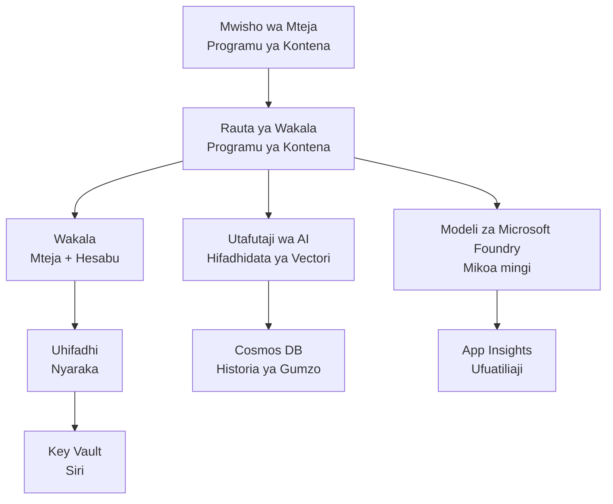

# Suluhisho la Multi-Agent ya Retail - Kiolezo cha Miundombinu

**Sura ya 5: Kifurushi cha Utoaji wa Uzalishaji**
- **📚 Nyumbani kwa Kozi**: [AZD For Beginners](../../README.md)
- **📖 Sura Iliyohusiana**: [Chapter 5: Multi-Agent AI Solutions](../../README.md#-chapter-5-multi-agent-ai-solutions-advanced)
- **📝 Mwongozo wa Hali**: [Complete Architecture](../retail-scenario.md)
- **🎯 Weka Haraka**: [One-Click Deployment](#-quick-deployment)

> **⚠️ KIOLEZO CHA MIUNDOMBINU TU**  
> Kiolezo hiki cha ARM kinatenga **rasilimali za Azure** kwa mfumo wa multi-agent.  
>  
> **Kinachotengwa (dakika 15-25):**
> - ✅ Microsoft Foundry Models (gpt-4.1, gpt-4.1-mini, embeddings katika maeneo 3)
> - ✅ AI Search service (ilibaki tupu, tayari kwa kuunda index)
> - ✅ Container Apps (picha za placeholder, tayari kwa msimbo wako)
> - ✅ Storage, Cosmos DB, Key Vault, Application Insights
>  
> **Siyo pamoja (inahitaji maendeleo):**
> - ❌ Msimbo wa utekelezaji wa agent (Customer Agent, Inventory Agent)
> - ❌ Mantiki ya routing na endpoints za API
> - ❌ UI ya frontend ya chat
> - ❌ Skima za index za search na pipelines za data
> - ❌ **Makadirio ya jitihada za maendeleo: saa 80-120**
>  
> **Tumia kiolezo hiki ikiwa:**
> - ✅ Unataka kuandaa miundombinu ya Azure kwa mradi wa multi-agent
> - ✅ Unapanga kuendeleza utekelezaji wa agent kando
> - ✅ Unahitaji msingi wa miundombinu unaostahili uzalishaji
>  
> **Usitumiie ikiwa:**
> - ❌ Unatarajia demo ya multi-agent inayofanya kazi mara moja
> - ❌ Unatafuta mifano kamili ya msimbo wa programu

## Muhtasari

Katalogi hii ina kiolezo kamili cha Azure Resource Manager (ARM) kwa ajili ya kupeleka **misingi ya miundombinu** ya mfumo wa msaada kwa wateja unaotumia multi-agent. Kiolezo hicho kinatoa huduma zote muhimu za Azure, zimewekwa vilivyo na kuunganishwa ipasavyo, tayari kwa maendeleo ya programu yako.

**Baada ya utoaji, utakuwa na:** Miundombinu ya Azure inayofaa uzalishaji  
**Ili kukamilisha mfumo, unahitaji:** Msimbo wa agent, UI ya frontend, na usanidi wa data (angalia [Architecture Guide](../retail-scenario.md))

## 🎯 Kinachotengwa

### Miundombinu ya Msingi (Hali Baada ya Utoaji)

✅ **Microsoft Foundry Models Services** (Tayari kwa simu za API)
  - Eneo kuu: utekelezaji wa gpt-4.1 (uwezo wa 20K TPM)
  - Eneo la pili: utekelezaji wa gpt-4.1-mini (uwezo wa 10K TPM)
  - Eneo la tatu: modeli ya text embeddings (uwezo wa 30K TPM)
  - Eneo la tathmini: modeli ya grader gpt-4.1 (uwezo wa 15K TPM)
  - **Hali:** Inafanya kazi kikamilifu - inaweza kufanya simu za API mara moja

✅ **Azure AI Search** (Tupu - tayari kwa usanidi)
  - Uwezo wa vector search umewezeshwa
  - Tier ya Standard na partition 1, replica 1
  - **Hali:** Huduma inaendeshwa, lakini inahitaji uundaji wa index
  - **Hatua inayohitajika:** Unda search index kwa skima yako

✅ **Azure Storage Account** (Tupu - tayari kwa kupakia)
  - Blob containers: `documents`, `uploads`
  - Usanidi salama (HTTPS tu, hakuna ufikishaji wa umma)
  - **Hali:** Tayari kupokea faili
  - **Hatua inayohitajika:** Pakiwa data za bidhaa na nyaraka zako

⚠️ **Container Apps Environment** (Picha za placeholder zimewekwa)
  - Agent router app (picha ya default ya nginx)
  - Frontend app (picha ya default ya nginx)
  - Auto-scaling imewekwa (0-10 instances)
  - **Hali:** Inafanya kazi kama containers za placeholder
  - **Hatua inayohitajika:** Jenga na weka utekelezaji wa agent applications zako

✅ **Azure Cosmos DB** (Tupu - tayari kwa data)
  - Database na container zimepangwa kabla
  - Imeboreshwa kwa operesheni za latency ya chini
  - TTL imewezeshwa kwa usafishaji wa moja kwa moja
  - **Hali:** Tayari kuhifadhi historia za chat

✅ **Azure Key Vault** (Hiari - tayari kwa siri)
  - Soft delete imewezeshwa
  - RBAC imewekwa kwa managed identities
  - **Hali:** Tayari kuhifadhi API keys na connection strings

✅ **Application Insights** (Hiari - ufuatiliaji unaendelea)
  - Imeunganishwa na Log Analytics workspace
  - Metrics za kawaida na alerts zimewekwa
  - **Hali:** Tayari kupokea telemetry kutoka kwa apps zako

✅ **Document Intelligence** (Tayari kwa simu za API)
  - Tier S0 kwa mzigo wa uzalishaji
  - **Hali:** Tayari kuchambua nyaraka zilizopakizwa

✅ **Bing Search API** (Tayari kwa simu za API)
  - Tier S1 kwa utafutaji wa wakati halisi
  - **Hali:** Tayari kwa maswali ya utafutaji wa wavuti

### Modal za Utoaji

| Mode | OpenAI Capacity | Container Instances | Search Tier | Storage Redundancy | Best For |
|------|-----------------|---------------------|-------------|-------------------|----------|
| **Minimal** | 10K-20K TPM | 0-2 replicas | Basic | LRS (Local) | Dev/test, learning, proof-of-concept |
| **Standard** | 30K-60K TPM | 2-5 replicas | Standard | ZRS (Zone) | Production, moderate traffic (<10K users) |
| **Premium** | 80K-150K TPM | 5-10 replicas, zone-redundant | Premium | GRS (Geo) | Enterprise, high traffic (>10K users), 99.99% SLA |

**Athari kwa Gharama:**
- **Minimal → Standard:** ongezeko la gharama takriban ×4 ($100-370/mo → $420-1,450/mo)
- **Standard → Premium:** ongezeko la gharama takriban ×3 ($420-1,450/mo → $1,150-3,500/mo)
- **Chagua kulingana na:** Mzigo unaotarajiwa, mahitaji ya SLA, vikwazo vya bajeti

**Mipango ya Uwezo:**
- **TPM (Tokens Per Minute):** Jumla katika kila utekelezaji wa modeli
- **Container Instances:** Eneo la auto-scaling (min-max replicas)
- **Search Tier:** Inaathiri utendaji wa query na mipaka ya ukubwa wa index

## 📋 Mahitaji ya Mwanzo

### Vifaa Vinavyohitajika
1. **Azure CLI** (toleo 2.50.0 au juu)
   ```bash
   az --version  # Angalia toleo
   az login      # Thibitisha
   ```

2. **Kiwhi cha Azure kinachofanya kazi** na ufikiaji wa Owner au Contributor
   ```bash
   az account show  # Thibitisha usajili
   ```

### Quotas za Azure Zinazohitajika

Kabla ya utoaji, hakikisha quotas za kutosha katika maeneo uliyochagua:

```bash
# Angalia upatikanaji wa modeli za Microsoft Foundry katika eneo lako
az cognitiveservices account list-skus \
  --kind OpenAI \
  --location eastus2

# Thibitisha kiwango cha rasilimali za OpenAI (mfano kwa gpt-4.1)
az cognitiveservices usage list \
  --location eastus2 \
  --query "[?name.value=='OpenAI.Standard.gpt-4.1']"

# Angalia kiwango cha rasilimali za Container Apps
az provider show \
  --namespace Microsoft.App \
  --query "resourceTypes[?resourceType=='managedEnvironments'].locations"
```

**Quota Ndogo Zinazohitajika:**
- **Microsoft Foundry Models:** utekelezaji wa modeli 3-4 katika maeneo tofauti
  - gpt-4.1: 20K TPM (Tokens Per Minute)
  - gpt-4.1-mini: 10K TPM
  - text-embedding-ada-002: 30K TPM
  - **Kumbuka:** gpt-4.1 inaweza kuwa na orodha ya kusubili katika baadhi ya maeneo - angalia [model availability](https://learn.microsoft.com/azure/ai-services/openai/concepts/models)
- **Container Apps:** Mazingira yaliyosimamiwa + instances 2-10 za container
- **AI Search:** Tier ya Standard (Basic haitoshi kwa vector search)
- **Cosmos DB:** Throughput iliyopangwa ya Standard

**Ikiwa quota haitoshi:**
1. Nenda Azure Portal → Quotas → Request increase
2. Au tumia Azure CLI:
   ```bash
   az support tickets create \
     --ticket-name "OpenAI-Quota-Increase" \
     --severity "minimal" \
     --description "Request quota increase for Microsoft Foundry Models gpt-4.1 in eastus2"
   ```
3. Fikiria maeneo mbadala yenye upatikanaji

## 🚀 Weka Haraka

### Chaguo 1: Kutumia Azure CLI

```bash
# Klonua au pakua faili za kiolezo
git clone <repository-url>
cd examples/retail-multiagent-arm-template

# Fanya skripti ya uanzishaji iwe inatekelezeka
chmod +x deploy.sh

# Endesha kwa mipangilio ya chaguo-msingi
./deploy.sh -g myResourceGroup

# Endesha kwa ajili ya uzalishaji ukitumia vipengele vya premium
./deploy.sh -g myProdRG -e prod -m premium -l eastus2
```

### Chaguo 2: Kutumia Azure Portal

[](https://portal.azure.com/#create/Microsoft.Template/uri/https%3A%2F%2Fraw.githubusercontent.com%2Fmicrosoft%2Fazd-for-beginners%2Fmain%2Fexamples%2Fretail-multiagent-arm-template%2Fazuredeploy.json)

### Chaguo 3: Kutumia Azure CLI moja kwa moja

```bash
# Unda kundi la rasilimali
az group create --name myResourceGroup --location eastus2

# Sambaza kiolezo
az deployment group create \
  --resource-group myResourceGroup \
  --template-file azuredeploy.json \
  --parameters azuredeploy.parameters.json
```

## ⏱️ Muda wa Utoaji

### Kile cha Kutegemea

| Phase | Duration | What Happens |
|-------|----------|--------------||
| **Template Validation** | 30-60 seconds | Azure validates ARM template syntax and parameters |
| **Resource Group Setup** | 10-20 seconds | Creates resource group (if needed) |
| **OpenAI Provisioning** | 5-8 minutes | Creates 3-4 OpenAI accounts and deploys models |
| **Container Apps** | 3-5 minutes | Creates environment and deploys placeholder containers |
| **Search & Storage** | 2-4 minutes | Provisions AI Search service and storage accounts |
| **Cosmos DB** | 2-3 minutes | Creates database and configures containers |
| **Monitoring Setup** | 2-3 minutes | Sets up Application Insights and Log Analytics |
| **RBAC Configuration** | 1-2 minutes | Configures managed identities and permissions |
| **Total Deployment** | **15-25 minutes** | Complete infrastructure ready |

**Baada ya Utoaji:**
- ✅ **Miundombinu Tayari:** Huduma zote za Azure zimetengwa na zinaendeshwa
- ⏱️ **Maendeleo ya Programu:** saa 80-120 (wajibu wako)
- ⏱️ **Usanidi wa Index:** dakika 15-30 (inahitaji skima yako)
- ⏱️ **Upakiaji Data:** Inategemea ukubwa wa dataset
- ⏱️ **Upimaji & Uthibitisho:** saa 2-4

---

## ✅ Thibitisha Mafanikio ya Utoaji

### Hatua 1: Angalia Utoaji wa Rasilimali (dakika 2)

```bash
# Thibitisha kuwa rasilimali zote zimewekwa kwa mafanikio
az resource list \
  --resource-group myResourceGroup \
  --query "[?provisioningState!='Succeeded'].{Name:name, Status:provisioningState, Type:type}" \
  --output table
```

**Kinachotarajiwa:** Jedwali tupu (rasilimali zote zinaonyesha hali "Succeeded")

### Hatua 2: Thibitisha Utekelezaji wa Microsoft Foundry Models (dakika 3)

```bash
# Orodhesha akaunti zote za OpenAI
az cognitiveservices account list \
  --resource-group myResourceGroup \
  --query "[?kind=='OpenAI'].{Name:name, Location:location, Status:properties.provisioningState}" \
  --output table

# Kagua usambazaji wa modeli kwa eneo kuu
OPENAI_NAME=$(az cognitiveservices account list \
  --resource-group myResourceGroup \
  --query "[?kind=='OpenAI'] | [0].name" -o tsv)

az cognitiveservices account deployment list \
  --name $OPENAI_NAME \
  --resource-group myResourceGroup \
  --output table
```

**Kinachotarajiwa:** 
- Akaunti 3-4 za OpenAI (eneo kuu, la pili, la tatu, la tathmini)
- Utekelezaji wa modeli 1-2 kwa kila akaunti (gpt-4.1, gpt-4.1-mini, text-embedding-ada-002)

### Hatua 3: Jaribu Endpoints za Miundombinu (dakika 5)

```bash
# Pata anwani za URL za programu za kontena
az containerapp list \
  --resource-group myResourceGroup \
  --query "[].{Name:name, URL:properties.configuration.ingress.fqdn, Status:properties.runningStatus}" \
  --output table

# Jaribu kiunganisho cha mwisho cha rutaa (picha ya nafasi itajibu)
ROUTER_URL=$(az containerapp show \
  --name retail-router \
  --resource-group myResourceGroup \
  --query "properties.configuration.ingress.fqdn" -o tsv)

echo "Testing: https://$ROUTER_URL"
curl -I https://$ROUTER_URL || echo "Container running (placeholder image - expected)"
```

**Kinachotarajiwa:** 
- Container Apps zinaonyesha hali "Running"
- Placeholder nginx inajibu kwa HTTP 200 au 404 (hakuna msimbo wa programu bado)

### Hatua 4: Thibitisha Upatikanaji wa API wa Microsoft Foundry Models (dakika 3)

```bash
# Pata endpoint na ufunguo wa OpenAI
OPENAI_ENDPOINT=$(az cognitiveservices account show \
  --name $OPENAI_NAME \
  --resource-group myResourceGroup \
  --query "properties.endpoint" -o tsv)

OPENAI_KEY=$(az cognitiveservices account keys list \
  --name $OPENAI_NAME \
  --resource-group myResourceGroup \
  --query "key1" -o tsv)

# Jaribu uanzishaji wa gpt-4.1
curl "${OPENAI_ENDPOINT}openai/deployments/gpt-4.1/chat/completions?api-version=2024-08-01-preview" \
  -H "Content-Type: application/json" \
  -H "api-key: $OPENAI_KEY" \
  -d '{
    "messages": [{"role": "user", "content": "Say hello"}],
    "max_tokens": 10
  }'
```

**Kinachotarajiwa:** Majibu ya JSON na chat completion (inathibitisha OpenAI inafanya kazi)

### Kitu Kinakofanya vs. Kinyoweza Kutoendelea

**✅ Vinavyofanya Baada ya Utoaji:**
- Microsoft Foundry Models zimeweka na zinakubali simu za API
- AI Search service inaendeshwa (tupu, bado haina indexes)
- Container Apps zinaendesha (picha za nginx kama placeholder)
- Akaunti za storage zinafikika na tayari kwa upakiaji
- Cosmos DB tayari kwa operesheni za data
- Application Insights inakusanya telemetry ya miundombinu
- Key Vault tayari kwa uhifadhi wa siri

**❌ Havifanyi Kazi Bado (Inahitaji Maendeleo):**
- Endpoints za agent (hakuna msimbo wa programu umewekwa)
- Uwezo wa chat (inahitaji frontend + backend utekelezaji)
- Maswali ya search (hakuna search index iliyoundwa bado)
- Pipeline ya uchakataji wa nyaraka (hakuna data iliyopakizwa)
- Telemetry maalum (inahitaji instrumentation ya programu)

**Hatua Zifuatazo:** Angalia [Post-Deployment Configuration](#-post-deployment-next-steps) ili kuendeleza na kuweka utekelezaji wa programu yako

---

## ⚙️ Chaguzi za Usanidi

### Vigezo vya Kiolezo

| Parameter | Type | Default | Description |
|-----------|------|---------|-------------|
| `projectName` | string | "retail" | Prefix kwa majina yote ya rasilimali |
| `location` | string | Resource group location | Eneo kuu la utoaji |
| `secondaryLocation` | string | "westus2" | Eneo la pili kwa utoaji wa maeneo mengi |
| `tertiaryLocation` | string | "francecentral" | Eneo kwa modeli za embeddings |
| `environmentName` | string | "dev" | Kielezo cha mazingira (dev/staging/prod) |
| `deploymentMode` | string | "standard" | Usanidi wa utoaji (minimal/standard/premium) |
| `enableMultiRegion` | bool | true | Weka utekelezaji wa maeneo mengi |
| `enableMonitoring` | bool | true | Weka Application Insights na logging |
| `enableSecurity` | bool | true | Weka Key Vault na usalama ulioboreshwa |

### Kubadilisha Vigezo

Hariri `azuredeploy.parameters.json`:

```json
{
  "$schema": "https://schema.management.azure.com/schemas/2019-04-01/deploymentParameters.json#",
  "contentVersion": "1.0.0.0",
  "parameters": {
    "projectName": {
      "value": "mycompany"
    },
    "environmentName": {
      "value": "prod"
    },
    "deploymentMode": {
      "value": "premium"
    },
    "location": {
      "value": "eastus2"
    }
  }
}
```

## 🏗️ Muhtasari wa Mimarisho


## 📖 Matumizi ya Skripti ya Utoaji

Skripti `deploy.sh` inatoa uzoefu wa utoaji unaoshirikisha:

```bash
# Onyesha msaada
./deploy.sh --help

# Utekelezaji wa msingi
./deploy.sh -g myResourceGroup

# Utekelezaji wa hali ya juu na mipangilio maalum
./deploy.sh \
  -g myProductionRG \
  -p companyname \
  -e prod \
  -m premium \
  -l eastus2

# Utekelezaji wa maendeleo bila mikoa mingi
./deploy.sh \
  -g myDevRG \
  -e dev \
  -m minimal \
  --no-multi-region \
  --no-security
```

### Sifa za Skripti

- ✅ **Uthibitishaji wa mahitaji ya mwanzo** (Azure CLI, hali ya kuingia, faili za kiolezo)
- ✅ **Usimamizi wa resource group** (inaunda ikiwa haipo)
- ✅ **Uthibitishaji wa kiolezo** kabla ya utoaji
- ✅ **Ufuatiliaji wa maendeleo** kwa kutoa rangi
- ✅ **Matokeo ya utoaji** kuonyeshwa
- ✅ **Mwongozo baada ya utoaji**

## 📊 Ufuatiliaji wa Utoaji

### Angalia Hali ya Utoaji

```bash
# Orodhesha uanzishaji
az deployment group list --resource-group myResourceGroup --output table

# Pata maelezo ya uanzishaji
az deployment group show \
  --resource-group myResourceGroup \
  --name retail-deployment-YYYYMMDD-HHMMSS

# Tazama maendeleo ya uanzishaji
az deployment group create \
  --resource-group myResourceGroup \
  --template-file azuredeploy.json \
  --parameters azuredeploy.parameters.json \
  --verbose
```

### Matokeo ya Utoaji

Baada ya utoaji wenye mafanikio, matokeo yafuatayo yanapatikana:

- **Frontend URL**: Endpoint ya umma kwa interface ya wavuti
- **Router URL**: Endpoint ya API kwa agent router
- **OpenAI Endpoints**: OpenAI service endpoints kuu na la pili
- **Search Service**: Endpoint ya Azure AI Search service
- **Storage Account**: Jina la storage account kwa nyaraka
- **Key Vault**: Jina la Key Vault (ikiwa imewezeshwa)
- **Application Insights**: Jina la huduma ya ufuatiliaji (ikiwa imewezeshwa)

## 🔧 Baada ya Utoaji: Hatua Zinazofuata
> **📝 Muhimu:** Miundombinu imewekwa, lakini unahitaji kuendeleza na kupeleka msimbo wa programu.

### Hatua 1: Tunga Programu za Maajenti (Jukumu Lako)

The ARM template creates **empty Container Apps** with placeholder nginx images. You must:

**Required Development:**
1. **Agent Implementation** (30-40 hours)
   - Ajenti wa huduma kwa wateja akiwa na muunganisho wa gpt-4.1
   - Ajenti wa hesabu ya bidhaa akiwa na muunganisho wa gpt-4.1-mini
   - Mantiki ya utumaji wa maajenti

2. **Frontend Development** (20-30 hours)
   - Kiolesura cha gumzo (UI) (React/Vue/Angular)
   - Utendaji wa kupakia faili
   - Uonyesho na uundaji muundo wa majibu

3. **Backend Services** (12-16 hours)
   - Router ya FastAPI au Express
   - Middleware ya uthibitishaji
   - Muunganisho wa telemetry

Tazama: [Architecture Guide](../retail-scenario.md) for detailed implementation patterns and code examples

### Hatua 2: Sanidi Indexi ya Utafutaji ya AI (15-30 dakika)

Create a search index matching your data model:

```bash
# Pata maelezo ya huduma ya utafutaji
SEARCH_NAME=$(az search service list \
  --resource-group myResourceGroup \
  --query "[0].name" -o tsv)

SEARCH_KEY=$(az search admin-key show \
  --service-name $SEARCH_NAME \
  --resource-group myResourceGroup \
  --query "primaryKey" -o tsv)

# Unda faharasa kwa kutumia skema yako (mfano)
curl -X POST "https://${SEARCH_NAME}.search.windows.net/indexes?api-version=2023-11-01" \
  -H "Content-Type: application/json" \
  -H "api-key: ${SEARCH_KEY}" \
  -d '{
    "name": "products",
    "fields": [
      {"name": "id", "type": "Edm.String", "key": true},
      {"name": "title", "type": "Edm.String", "searchable": true},
      {"name": "content", "type": "Edm.String", "searchable": true},
      {"name": "category", "type": "Edm.String", "filterable": true},
      {"name": "content_vector", "type": "Collection(Edm.Single)", 
       "searchable": true, "dimensions": 1536, "vectorSearchProfile": "default"}
    ],
    "vectorSearch": {
      "algorithms": [{"name": "default", "kind": "hnsw"}],
      "profiles": [{"name": "default", "algorithm": "default"}]
    }
  }'
```

**Rasilimali:**
- [Muundo wa Schema ya Indexi ya Utafutaji ya AI](https://learn.microsoft.com/azure/search/search-what-is-an-index)
- [Usanidi wa Utafutaji wa Vector](https://learn.microsoft.com/azure/search/vector-search-how-to-create-index)

### Hatua 3: Pakia Data Yako (Muda unabadilika)

Once you have product data and documents:

```bash
# Pata maelezo ya akaunti ya uhifadhi
STORAGE_NAME=$(az storage account list \
  --resource-group myResourceGroup \
  --query "[0].name" -o tsv)

STORAGE_KEY=$(az storage account keys list \
  --account-name $STORAGE_NAME \
  --resource-group myResourceGroup \
  --query "[0].value" -o tsv)

# Pakia nyaraka zako
az storage blob upload-batch \
  --destination documents \
  --source /path/to/your/product/docs \
  --account-name $STORAGE_NAME \
  --account-key $STORAGE_KEY

# Mfano: Pakia faili moja
az storage blob upload \
  --container-name documents \
  --name "product-manual.pdf" \
  --file /path/to/product-manual.pdf \
  --account-name $STORAGE_NAME \
  --account-key $STORAGE_KEY
```

### Hatua 4: Jenga na Peleka Programu Zako (8-12 masaa)

Once you've developed your agent code:

```bash
# 1. Unda Azure Container Registry (ikiwa inahitajika)
az acr create \
  --name myregistry \
  --resource-group myResourceGroup \
  --sku Basic

# 2. Jenga na tuma picha ya router ya wakala
docker build -t myregistry.azurecr.io/agent-router:v1 /path/to/your/router/code
az acr login --name myregistry
docker push myregistry.azurecr.io/agent-router:v1

# 3. Jenga na tuma picha ya kiolesura cha mtumiaji
docker build -t myregistry.azurecr.io/frontend:v1 /path/to/your/frontend/code
docker push myregistry.azurecr.io/frontend:v1

# 4. Sasisha Container Apps na picha zako
az containerapp update \
  --name retail-router \
  --resource-group myResourceGroup \
  --image myregistry.azurecr.io/agent-router:v1

az containerapp update \
  --name retail-frontend \
  --resource-group myResourceGroup \
  --image myregistry.azurecr.io/frontend:v1

# 5. Sanidi vigezo vya mazingira
az containerapp update \
  --name retail-router \
  --resource-group myResourceGroup \
  --set-env-vars \
    OPENAI_ENDPOINT=secretref:openai-endpoint \
    OPENAI_KEY=secretref:openai-key \
    SEARCH_ENDPOINT=secretref:search-endpoint \
    SEARCH_KEY=secretref:search-key
```

### Hatua 5: Jaribu Programu Yako (2-4 masaa)

```bash
# Pata URL ya programu yako
ROUTER_URL=$(az containerapp show \
  --name retail-router \
  --resource-group myResourceGroup \
  --query "properties.configuration.ingress.fqdn" -o tsv)

# Jaribu kiunganishi cha wakala (mara tu msimbo wako utakapo wekwa)
curl -X POST "https://${ROUTER_URL}/chat" \
  -H "Content-Type: application/json" \
  -d '{
    "message": "Hello, I need help with my order",
    "agent": "customer"
  }'

# Angalia kumbukumbu za programu
az containerapp logs show \
  --name retail-router \
  --resource-group myResourceGroup \
  --follow
```

### Rasilimali za Utekelezaji

**Usanifu & Ubunifu:**
- 📖 [Mwongozo Kamili wa Usanifu](../retail-scenario.md) - Detailed implementation patterns
- 📖 [Miundo ya Ubunifu ya Maajenti Wengi](https://learn.microsoft.com/azure/architecture/ai-ml/guide/multi-agent-systems)

**Mifano ya Msimbo:**
- 🔗 [Mfano wa Gumzo wa Microsoft Foundry Models](https://github.com/Azure-Samples/azure-search-openai-demo) - RAG pattern
- 🔗 [Semantic Kernel](https://github.com/microsoft/semantic-kernel) - Mfumo wa maajenti (C#)
- 🔗 [LangChain Azure](https://github.com/langchain-ai/langchain) - Utaratibu wa maajenti (Python)
- 🔗 [AutoGen](https://github.com/microsoft/autogen) - Mijadala ya maajenti wengi

**Makadirio ya Jumla ya Juhudi:**
- Infrastructure deployment: 15-25 minutes (✅ Complete)
- Application development: 80-120 hours (🔨 Your work)
- Testing and optimization: 15-25 hours (🔨 Your work)

## 🛠️ Utatuzi wa Masuala

### Masuala Yanayojirudia

#### 1. Kiwango cha Microsoft Foundry Models Kimezidiwa

```bash
# Angalia matumizi ya kikomo ya sasa
az cognitiveservices usage list --location eastus2

# Omba ongezeko la kikomo
az support tickets create \
  --ticket-name "OpenAI-Quota-Increase" \
  --severity "minimal" \
  --description "Request quota increase for Microsoft Foundry Models in region X"
```

#### 2. Uwekaji wa Container Apps Umeshindikana

```bash
# Angalia logi za programu ya kontena
az containerapp logs show \
  --name retail-router \
  --resource-group myResourceGroup \
  --follow

# Anzisha upya programu ya kontena
az containerapp revision restart \
  --name retail-router \
  --resource-group myResourceGroup
```

#### 3. Uanzishaji wa Huduma ya Utafutaji

```bash
# Thibitisha hali ya huduma ya utafutaji
az search service show \
  --name <search-service-name> \
  --resource-group myResourceGroup

# Pima muunganisho wa huduma ya utafutaji
curl -X GET "https://<search-service-name>.search.windows.net/indexes?api-version=2023-11-01" \
  -H "api-key: <search-admin-key>"
```

### Uthibitisho wa Uwekaji

```bash
# Thibitisha rasilimali zote zimeundwa
az resource list \
  --resource-group myResourceGroup \
  --output table

# Kagua afya ya rasilimali
az resource list \
  --resource-group myResourceGroup \
  --query "[?provisioningState!='Succeeded'].{Name:name, Status:provisioningState, Type:type}" \
  --output table
```

## 🔐 Mambo ya Usalama

### Usimamizi wa Vifunguo
- Siri zote zinahifadhiwa kwenye Azure Key Vault (wakati imewezeshwa)
- Container apps zinatumia utambulisho ulisimamiwa kwa uthibitishaji
- Akaunti za hifadhi zina mipangilio salama kwa chaguo-msingi (HTTPS tu, hakuna ufikiaji wa blob wa umma)

### Usalama wa Mtandao
- Container apps zinatumia mtandao wa ndani pale inapowezekana
- Huduma ya utafutaji imewekwa kwa chaguo la vituo vya mwisho vya kibinafsi
- Cosmos DB imewekwa na ruhusa chache tu zinazohitajika

### Usanidi wa RBAC
```bash
# Wape utambulisho uliosimamiwa majukumu muhimu
az role assignment create \
  --assignee <container-app-managed-identity> \
  --role "Cognitive Services OpenAI User" \
  --scope <openai-resource-id>
```

## 💰 Uboreshaji wa Gharama

### Makadirio ya Gharama (Kila Mwezi, USD)

| Njia | OpenAI | Container Apps | Utafutaji | Hifadhi | Jumla Kadiri |
|------|--------|----------------|--------|---------|------------|
| Minimali | $50-200 | $20-50 | $25-100 | $5-20 | $100-370 |
| Kawaida | $200-800 | $100-300 | $100-300 | $20-50 | $420-1450 |
| Premium | $500-2000 | $300-800 | $300-600 | $50-100 | $1150-3500 |

### Ufuatiliaji wa Gharama

```bash
# Sanidi arifa za bajeti
az consumption budget create \
  --account-name <subscription-id> \
  --budget-name "retail-budget" \
  --amount 500 \
  --time-grain Monthly \
  --start-date 2024-01-01 \
  --end-date 2024-12-31
```

## 🔄 Sasisho na Matunzo

### Sasisho za Template
- Tumia udhibiti wa matoleo kwa faili za template za ARM
- Jaribu mabadiliko katika mazingira ya maendeleo kwanza
- Tumia hali ya uwekaji wa hatua kwa hatua kwa sasisho

### Sasisho za Rasilimali
```bash
# Sasisha kwa vigezo vipya
az deployment group create \
  --resource-group myResourceGroup \
  --template-file azuredeploy.json \
  --parameters azuredeploy.parameters.json \
  --mode Incremental
```

### Nakili na Urejeshaji
- Nakili za otomatiki za Cosmos DB zimeshawashwa
- Uondoaji mpole (soft delete) wa Key Vault umewezeshwa
- Marekebisho ya container app yanahifadhiwa kwa urejesho

## 📞 Msaada

- **Masuala ya Template**: [GitHub Issues](https://github.com/microsoft/azd-for-beginners/issues)
- **Msaada wa Azure**: [Azure Support Portal](https://portal.azure.com/#blade/Microsoft_Azure_Support/HelpAndSupportBlade)
- **Jumuiya**: [Azure AI Discord](https://discord.gg/microsoft-azure)

---

**⚡ Tayari kupeleka suluhisho lako la maajenti wengi?**

Anza na: `./deploy.sh -g myResourceGroup`

---

<!-- CO-OP TRANSLATOR DISCLAIMER START -->
**Taarifa ya kutokuwajibika**:
Hati hii imetafsiriwa kwa kutumia huduma ya tafsiri ya AI [Co-op Translator](https://github.com/Azure/co-op-translator). Wakati tunajitahidi kwa usahihi, tafadhali fahamu kwamba tafsiri za kiotomatiki zinaweza kuwa na makosa au ukosefu wa usahihi. Hati ya asili katika lugha yake inapaswa kuchukuliwa kama chanzo chenye mamlaka. Kwa taarifa muhimu, tafsiri ya kitaalamu inayotolewa na mtaalamu wa lugha inashauriwa. Hatuwajibiki kwa kutoelewana au tafsiri zisizo sahihi zinazotokana na matumizi ya tafsiri hii.
<!-- CO-OP TRANSLATOR DISCLAIMER END -->