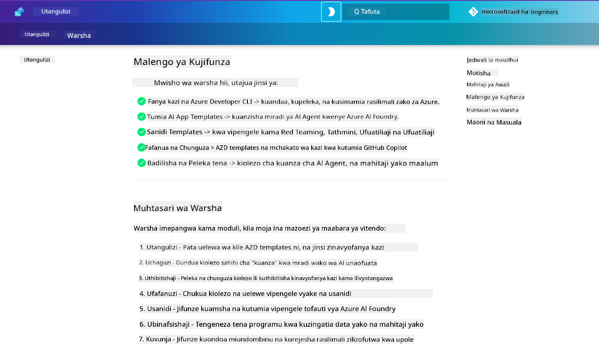

<!--
CO_OP_TRANSLATOR_METADATA:
{
  "original_hash": "9cc966416ab431c38b2ab863884b196c",
  "translation_date": "2025-09-25T00:43:16+00:00",
  "source_file": "workshop/README.md",
  "language_code": "sw"
}
-->
# Warsha ya AZD kwa Watengenezaji wa AI

Karibu kwenye warsha ya vitendo ya kujifunza Azure Developer CLI (AZD) kwa kuzingatia usambazaji wa programu za AI. Warsha hii itakusaidia kupata uelewa wa vitendo wa templeti za AZD kwa hatua 3:

1. **Ugunduzi** - pata templeti inayokufaa.
1. **Usambazaji** - sambaza na hakikisha inafanya kazi.
1. **Ubinafsishaji** - rekebisha na iteresha ili iwe yako!

Katika kipindi cha warsha hii, utatambulishwa pia kwa zana kuu za watengenezaji na mifumo ya kazi, ili kukusaidia kurahisisha safari yako ya maendeleo kutoka mwanzo hadi mwisho.

<br/>

## Mwongozo wa Kutumia Kivinjari

Masomo ya warsha yameandikwa kwa Markdown. Unaweza kuyapitia moja kwa moja kwenye GitHub - au kufungua mwonekano wa kivinjari kama inavyoonyeshwa kwenye picha hapa chini.



Ili kutumia chaguo hili - fanya fork ya hifadhi kwenye wasifu wako, na uzindue GitHub Codespaces. Mara terminal ya VS Code inapokuwa hai, andika amri hii:

```bash title="" linenums="0"
mkdocs serve > /dev/null 2>&1 &
```

Baada ya sekunde chache, utaona kidirisha kinachojitokeza. Chagua chaguo la `Open in browser`. Mwongozo wa mtandao sasa utafunguka kwenye tabo mpya ya kivinjari. Baadhi ya faida za mwonekano huu:

1. **Utafutaji wa ndani** - tafuta maneno au masomo haraka.
1. **Ikoni ya kunakili** - weka mshale juu ya sehemu za msimbo ili kuona chaguo hili.
1. **Kubadilisha mandhari** - badilisha kati ya mandhari ya giza na mwanga.
1. **Pata msaada** - bonyeza ikoni ya Discord kwenye footer kujiunga!

<br/>

## Muhtasari wa Warsha

**Muda:** Saa 3-4  
**Kiwango:** Mwanzoni hadi Kati  
**Mahitaji ya awali:** Uzoefu na Azure, dhana za AI, VS Code & zana za mstari wa amri.

Hii ni warsha ya vitendo ambapo unajifunza kwa kufanya. Mara baada ya kukamilisha mazoezi, tunapendekeza kupitia mtaala wa AZD Kwa Wanaoanza ili kuendelea na safari yako ya kujifunza kuhusu usalama na mbinu bora za uzalishaji.

| Muda | Moduli  | Lengo |
|:---|:---|:---|
| Dakika 15 | [Utangulizi](docs/instructions/0-Introduction.md) | Weka msingi, elewa malengo |
| Dakika 30 | [Chagua Templeti ya AI](docs/instructions/1-Select-AI-Template.md) | Chunguza chaguo na chagua ya kuanza | 
| Dakika 30 | [Thibitisha Templeti ya AI](docs/instructions/2-Validate-AI-Template.md) | Sambaza suluhisho la msingi kwenye Azure |
| Dakika 30 | [Chambua Templeti ya AI](docs/instructions/3-Deconstruct-AI-Template.md) | Chunguza muundo na usanidi |
| Dakika 30 | [Sanidi Templeti ya AI](docs/instructions/4-Configure-AI-Template.md) | Washa na jaribu vipengele vilivyopo |
| Dakika 30 | [Binafsisha Templeti ya AI](docs/instructions/5-Customize-AI-Template.md) | Rekebisha templeti kwa mahitaji yako |
| Dakika 30 | [Ondoa Miundombinu](docs/instructions/6-Teardown-Infrastructure.md) | Safisha na achilia rasilimali |
| Dakika 15 | [Hitimisho na Hatua Zifuatazo](docs/instructions/7-Wrap-up.md) | Rasilimali za kujifunza, changamoto ya warsha |

<br/>

## Unachojifunza

Fikiria Templeti ya AZD kama sandbox ya kujifunza ili kuchunguza uwezo mbalimbali na zana za maendeleo kutoka mwanzo hadi mwisho kwenye Azure AI Foundry. Mwisho wa warsha hii, unapaswa kuwa na uelewa wa kiintuitivu wa zana na dhana mbalimbali katika muktadha huu.

| Dhana  | Lengo |
|:---|:---|
| **Azure Developer CLI** | Elewa amri za zana na mifumo ya kazi |
| **Templeti za AZD**| Elewa muundo wa mradi na usanidi |
| **Wakala wa Azure AI**| Tengeneza & sambaza mradi wa Azure AI Foundry |
| **Utafutaji wa Azure AI**| Washa uhandisi wa muktadha na mawakala |
| **Ufuatiliaji**| Chunguza ufuatiliaji, uchunguzi na tathmini |
| **Upimaji wa Usalama**| Chunguza majaribio ya kiadui na suluhisho |

<br/>

## Muundo wa Warsha

Warsha imeundwa kukuchukua kwenye safari kutoka ugunduzi wa templeti, hadi usambazaji, uchambuzi, na ubinafsishaji - kwa kutumia templeti rasmi ya kuanza [Getting Started with AI Agents](https://github.com/Azure-Samples/get-started-with-ai-agents) kama msingi.

### [Moduli ya 1: Chagua Templeti ya AI](docs/instructions/1-Select-AI-Template.md) (Dakika 30)

- Templeti za AI ni nini?
- Ninaweza kupata wapi Templeti za AI?
- Ninawezaje kuanza kujenga Mawakala wa AI?
- **Maabara**: Kuanza haraka na GitHub Codespaces

### [Moduli ya 2: Thibitisha Templeti ya AI](docs/instructions/2-Validate-AI-Template.md) (Dakika 30)

- Muundo wa Templeti ya AI ni nini?
- Mchakato wa Maendeleo wa AZD ni nini?
- Ninawezaje kupata msaada na Maendeleo ya AZD?
- **Maabara**: Sambaza & Thibitisha templeti ya Mawakala wa AI

### [Moduli ya 3: Chambua Templeti ya AI](docs/instructions/3-Deconstruct-AI-Template.md) (Dakika 30)

- Chunguza mazingira yako kwenye `.azure/` 
- Chunguza usanidi wa rasilimali zako kwenye `infra/` 
- Chunguza usanidi wa AZD kwenye `azure.yaml`s
- **Maabara**: Rekebisha Vigezo vya Mazingira & Sambaza tena

### [Moduli ya 4: Sanidi Templeti ya AI](docs/instructions/4-Configure-AI-Template.md) (Dakika 30)
- Chunguza: Uzalishaji wa Urejeshaji wa Taarifa
- Chunguza: Tathmini ya Mawakala & Upimaji wa Usalama
- Chunguza: Ufuatiliaji & Ufuatiliaji wa Mchakato
- **Maabara**: Chunguza Mawakala wa AI + Ufuatiliaji 

### [Moduli ya 5: Binafsisha Templeti ya AI](docs/instructions/5-Customize-AI-Template.md) (Dakika 30)
- Fafanua: PRD na Mahitaji ya Mandhari
- Sanidi: Vigezo vya Mazingira kwa AZD
- Tekeleza: Vihusishi vya Mzunguko wa Maisha kwa kazi za ziada
- **Maabara**: Binafsisha templeti kwa mandhari yangu

### [Moduli ya 6: Ondoa Miundombinu](docs/instructions/6-Teardown-Infrastructure.md) (Dakika 30)
- Rudia: Templeti za AZD ni nini?
- Rudia: Kwa nini utumie Azure Developer CLI?
- Hatua Zifuatazo: Jaribu templeti tofauti!
- **Maabara**: Ondoa miundombinu & safisha

<br/>

## Changamoto ya Warsha

Unataka kujipima zaidi? Hapa kuna mapendekezo ya miradi - au shiriki mawazo yako nasi!!

| Mradi | Maelezo |
|:---|:---|
|1. **Chambua Templeti ya AI Ngumu** | Tumia mchakato na zana tulizotaja na uone kama unaweza kusambaza, kuthibitisha, na kubinafsisha templeti tofauti ya suluhisho la AI. _Umejifunza nini?_|
|2. **Binafsisha kwa Mandhari Yako**  | Jaribu kuandika PRD (Hati ya Mahitaji ya Bidhaa) kwa mandhari tofauti. Kisha tumia GitHub Copilot kwenye hifadhi ya templeti yako katika Modeli ya Mawakala - na uiombe itengeneze mchakato wa ubinafsishaji kwa ajili yako. _Umejifunza nini? Unawezaje kuboresha mapendekezo haya?_|
| | |

## Una maoni?

1. Tuma suala kwenye hifadhi hii - weka tagi `Workshop` kwa urahisi.
1. Jiunge na Discord ya Azure AI Foundry - ungana na wenzako!

| | | 
|:---|:---|
| **📚 Nyumbani kwa Kozi**| [AZD Kwa Wanaoanza](../README.md)|
| **📖 Nyaraka** | [Anza na templeti za AI](https://learn.microsoft.com/en-us/azure/ai-foundry/how-to/develop/ai-template-get-started)|
| **🛠️ Templeti za AI** | [Templeti za Azure AI Foundry](https://ai.azure.com/templates) |
|**🚀 Hatua Zifuatazo** | [Chukua Changamoto](../../../workshop) |
| | |

<br/>

---

**Iliyotangulia:** [Mwongozo wa Kutatua Matatizo ya AI](../docs/troubleshooting/ai-troubleshooting.md) | **Inayofuata:** Anza na [Maabara ya 1: Misingi ya AZD](../../../workshop/lab-1-azd-basics)

**Uko tayari kuanza kujenga programu za AI kwa AZD?**

[Anza Maabara ya 1: Misingi ya AZD →](./lab-1-azd-basics/README.md)

---

