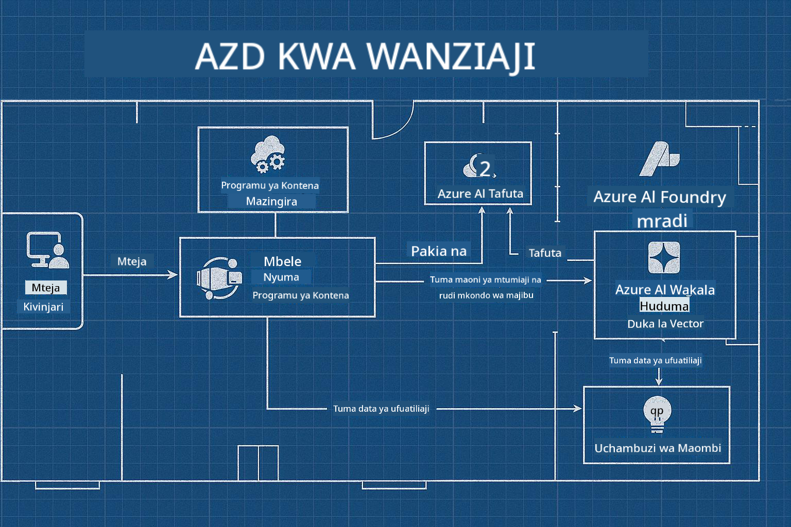

<!--
CO_OP_TRANSLATOR_METADATA:
{
  "original_hash": "245d24997bbcf2bae93bb2a503845d37",
  "translation_date": "2025-09-23T12:02:09+00:00",
  "source_file": "workshop/README.md",
  "language_code": "sw"
}
-->
# Warsha ya AZD kwa Waendelezaji wa AI

## Violezo vya AZD

Kujenga suluhisho la programu ya AI ya kiwango cha biashara kwa hali yako maalum ni kama kujenga nyumba yako mwenyewe. Unaweza kuibuni mwenyewe, kujenga hatua kwa hatua, na kuchukua jukumu la kuhakikisha inakidhi miongozo yote ya utawala na maendeleo.

**AU ....**

Unaweza kufanya kazi na mbunifu ambaye anaweza kukupa _mchoro_ wa nyumba ya kuanzia, kisha kufanya kazi nawe kuibadilisha ili kufaa mahitaji yako. Hii inakuwezesha kuzingatia kile kinachofanya **nyumba yako** kuwa maalum, huku wiring, mabomba, na utegemezi mwingine vikishughulikiwa na wataalamu.

**Hii ndiyo mbinu nyuma ya [Violezo vya Programu za AI](https://ai.azure.com/templates)** - mfululizo wa michoro ya kujenga aina tofauti za "nyumba za programu za AI" kulingana na mahitaji yako ya msingi na utegemezi.

## Kubadilisha Violezo

Violezo vimeundwa kufanya kazi na [Azure AI Foundry](https://ai.azure.com). Fikiria jukwaa hili kama "mkandarasi wako wa ujenzi" mwenye ufikiaji wa rasilimali zote, zana, na utaalamu unaohitaji kukamilisha kazi!

Unachohitaji ni kuchagua [violezo vyako vya kuanzia](https://learn.microsoft.com/en-us/azure/ai-foundry/how-to/develop/ai-template-get-started). Kwa mfano, tutazingatia kiolezo cha _Get Started with AI Agents_ ili kujenga "Nyumba ya AI ya Wakala" ambayo imeunganishwa na vipengele kama AI Search, Red Teaming, Evaluations, Tracing, Monitoring, na zaidi!



Unachohitaji ni kuweka muda na mbunifu, ili akuongoze kupitia mchakato wa kubadilisha. [GitHub Copilot for Azure](https://learn.microsoft.com/en-us/azure/developer/github-copilot-azure/get-started) inaweza kuwa mwongozo huo. "Zungumza nayo" tu ili:

- Kujifunza kuhusu vipengele vya Azure katika kiolezo chako
- Kuweka rasilimali za Azure
- Kupata taarifa kuhusu uwekaji wako
- Kugundua na kutatua matatizo!

Katika warsha hii, tunajifunza jinsi ya _kuchambua_ kiolezo kilichopo (ili kujifunza kinachotoa), kisha _kukibadilisha_ (ili kutimiza mahitaji yetu) - hatua kwa hatua.

Violezo vya AI **vinafanya kazi** - kwa kukamilisha warsha utajifunza jinsi ya **kuifanya iwe yako**

----

**Uelekezaji wa Warsha**
- **📚 Nyumbani kwa Kozi**: [AZD Kwa Wanaoanza](../README.md)
- **📖 Sura Zinazohusiana**: Inashughulikia [Sura ya 1](../README.md#-chapter-1-foundation--quick-start), [Sura ya 2](../README.md#-chapter-2-ai-first-development-recommended-for-ai-developers), na [Sura ya 5](../README.md#-chapter-5-multi-agent-ai-solutions-advanced)
- **🛠️ Maabara ya Vitendo**: [Maabara ya Warsha ya AI](../docs/ai-foundry/ai-workshop-lab.md)
- **🚀 Hatua Zifuatazo**: [Moduli za Maabara ya Warsha](../../../workshop)

Karibu kwenye warsha ya vitendo ya kujifunza Azure Developer CLI (AZD) kwa kuzingatia uwekaji wa programu za AI. Warsha hii imeundwa kukupeleka kutoka misingi ya AZD hadi kuweka suluhisho za AI tayari kwa uzalishaji.

## Muhtasari wa Warsha

**Muda:** Saa 2-3  
**Kiwango:** Mwanzoni hadi Kati  
**Mahitaji ya Awali:** Maarifa ya msingi ya Azure, zana za mstari wa amri, na dhana za AI

### Unachojifunza

- **Misingi ya AZD**: Kuelewa Miundombinu kama Kanuni kwa kutumia AZD
- 🤖 **Ujumuishaji wa Huduma za AI**: Kuweka Azure OpenAI, AI Search, na huduma nyingine za AI
- **Uwekaji wa Kontena**: Kutumia Azure Container Apps kwa programu za AI
- **Mazoea Bora ya Usalama**: Kutekeleza Managed Identity na usanidi salama
- **Ufuatiliaji na Uangalizi**: Kuweka Application Insights kwa mzigo wa kazi wa AI
- **Mifumo ya Uzalishaji**: Mikakati ya uwekaji tayari kwa biashara

## Muundo wa Warsha

### Moduli ya 1: Misingi ya AZD (Dakika 30)
- Kuweka na kusanidi AZD
- Kuelewa muundo wa mradi wa AZD
- Uwekaji wako wa kwanza wa AZD
- **Maabara**: Weka programu rahisi ya wavuti

### Moduli ya 2: Ujumuishaji wa Azure OpenAI (Dakika 45)
- Kuweka rasilimali za Azure OpenAI
- Mikakati ya uwekaji wa modeli
- Kuseti ufikiaji wa API na uthibitishaji
- **Maabara**: Weka programu ya mazungumzo na GPT-4

### Moduli ya 3: Programu za RAG (Dakika 45)
- Ujumuishaji wa Azure AI Search
- Usindikaji wa hati kwa kutumia Azure Document Intelligence
- Vector embeddings na semantic search
- **Maabara**: Jenga mfumo wa Q&A wa hati

### Moduli ya 4: Uwekaji wa Uzalishaji (Dakika 30)
- Usanidi wa Container Apps
- Uboreshaji wa utendaji na upanuzi
- Ufuatiliaji na uandishi wa kumbukumbu
- **Maabara**: Weka kwa uzalishaji na uangalizi

### Moduli ya 5: Mifumo ya Juu (Dakika 15)
- Uwekaji wa mazingira mengi
- Ujumuishaji wa CI/CD
- Mikakati ya uboreshaji wa gharama
- **Hitimisho**: Orodha ya ukaguzi wa utayari wa uzalishaji

## Mahitaji ya Awali

### Zana Zinazohitajika

Tafadhali weka zana hizi kabla ya warsha:

```bash
# Azure Developer CLI
curl -fsSL https://aka.ms/install-azd.sh | bash

# Azure CLI
curl -sL https://aka.ms/InstallAzureCLIDeb | sudo bash

# Git
sudo apt-get install git

# Docker
curl -fsSL https://get.docker.com -o get-docker.sh
sudo sh get-docker.sh

# Python 3.10+
sudo apt-get install python3.10 python3.10-venv python3-pip
```

### Usanidi wa Akaunti ya Azure

1. **Usajili wa Azure**: [Jisajili bure](https://azure.microsoft.com/free/)
2. **Ufikiaji wa Azure OpenAI**: [Omba ufikiaji](https://aka.ms/oai/access)
3. **Ruhusa Zinazohitajika**:
   - Jukumu la Contributor kwenye usajili au kikundi cha rasilimali
   - User Access Administrator (kwa ugawaji wa RBAC)

### Thibitisha Mahitaji ya Awali

Endesha script hii ili kuthibitisha usanidi wako:

```bash
#!/bin/bash
echo "Verifying workshop prerequisites..."

# Check AZD installation
if command -v azd &> /dev/null; then
    echo "✅ Azure Developer CLI: $(azd --version)"
else
    echo "❌ Azure Developer CLI not found"
fi

# Check Azure CLI
if command -v az &> /dev/null; then
    echo "✅ Azure CLI: $(az --version | head -n1)"
else
    echo "❌ Azure CLI not found"
fi

# Check Docker
if command -v docker &> /dev/null; then
    echo "✅ Docker: $(docker --version)"
else
    echo "❌ Docker not found"
fi

# Check Python
if command -v python3 &> /dev/null; then
    echo "✅ Python: $(python3 --version)"
else
    echo "❌ Python 3 not found"
fi

# Check Azure login
if az account show &> /dev/null; then
    echo "✅ Azure: Logged in as $(az account show --query user.name -o tsv)"
else
    echo "❌ Azure: Not logged in (run 'az login')"
fi

echo "Setup verification complete!"
```

## Vifaa vya Warsha

### Mazoezi ya Maabara

Kila moduli inajumuisha maabara ya vitendo na msimbo wa kuanzia na maelekezo ya hatua kwa hatua:

- **[lab-1-azd-basics/](../../../workshop/lab-1-azd-basics)** - Uwekaji wako wa kwanza wa AZD
- **[lab-2-openai-chat/](../../../workshop/lab-2-openai-chat)** - Programu ya mazungumzo na Azure OpenAI
- **[lab-3-rag-search/](../../../workshop/lab-3-rag-search)** - Programu ya RAG na AI Search
- **[lab-4-production/](../../../workshop/lab-4-production)** - Mifumo ya uwekaji wa uzalishaji
- **[lab-5-advanced/](../../../workshop/lab-5-advanced)** - Hali za uwekaji wa juu

### Vifaa vya Marejeleo

- **[Mwongozo wa Ujumuishaji wa AI Foundry](../docs/ai-foundry/azure-ai-foundry-integration.md)** - Mifumo ya ujumuishaji wa kina
- **[Mwongozo wa Uwekaji wa Modeli za AI](../docs/ai-foundry/ai-model-deployment.md)** - Mazoea bora ya uwekaji wa modeli
- **[Mazoea ya AI ya Uzalishaji](../docs/ai-foundry/production-ai-practices.md)** - Mifumo ya uwekaji tayari kwa biashara
- **[Mwongozo wa Kutatua Matatizo ya AI](../docs/troubleshooting/ai-troubleshooting.md)** - Masuala ya kawaida na suluhisho

### Violezo vya Mfano

Violezo vya kuanza haraka kwa hali za kawaida za AI:

```
workshop/templates/
├── minimal-chat/          # Basic OpenAI chat app
├── rag-application/       # RAG with AI Search
├── multi-model/          # Multiple AI services
└── production-ready/     # Enterprise template
```

## Kuanza

### Chaguo 1: GitHub Codespaces (Inapendekezwa)

Njia ya haraka zaidi ya kuanza warsha:

[](https://github.com/codespaces/new?hide_repo_select=true&ref=main&repo=YOUR_REPO_ID)

### Chaguo 2: Maendeleo ya Kawaida

1. **Clone hifadhi ya warsha:**
```bash
git clone https://github.com/YOUR_ORG/AZD-for-beginners.git
cd AZD-for-beginners/workshop
```

2. **Ingia kwenye Azure:**
```bash
az login
azd auth login
```

3. **Anza na Maabara ya 1:**
```bash
cd lab-1-azd-basics
cat README.md  # Follow the instructions
```

### Chaguo 3: Warsha Inayoongozwa na Mwalimu

Ikiwa unahudhuria kikao kinachoongozwa na mwalimu:

- 🎥 **Rekodi ya Warsha**: [Inapatikana kwa mahitaji](https://aka.ms/azd-ai-workshop)
- 💬 **Jumuiya ya Discord**: [Jiunge kwa msaada wa moja kwa moja](https://aka.ms/foundry/discord)
- **Maoni ya Warsha**: [Shiriki uzoefu wako](https://aka.ms/azd-workshop-feedback)

## Muda wa Warsha

### Kujifunza kwa Kujitegemea (Saa 3)

```
⏰ 00:00 - 00:30  Module 1: AZD Foundations
⏰ 00:30 - 01:15  Module 2: Azure OpenAI Integration
⏰ 01:15 - 02:00  Module 3: RAG Applications
⏰ 02:00 - 02:30  Module 4: Production Deployment
⏰ 02:30 - 02:45  Module 5: Advanced Patterns
⏰ 02:45 - 03:00  Q&A and Next Steps
```

### Kikao Kinachoongozwa na Mwalimu (Saa 2.5)

```
⏰ 00:00 - 00:15  Welcome & Prerequisites Check
⏰ 00:15 - 00:40  Module 1: Live Demo + Lab
⏰ 00:40 - 01:20  Module 2: OpenAI Integration
⏰ 01:20 - 01:30  Break
⏰ 01:30 - 02:10  Module 3: RAG Applications
⏰ 02:10 - 02:30  Module 4: Production Patterns
⏰ 02:30 - 02:45  Module 5: Advanced Topics
⏰ 02:45 - 03:00  Q&A and Resources
```

## Vigezo vya Mafanikio

Mwisho wa warsha hii, utaweza:

✅ **Kuweka programu za AI** kwa kutumia violezo vya AZD  
✅ **Kusanidi huduma za Azure OpenAI** kwa usalama sahihi  
✅ **Kujenga programu za RAG** na ujumuishaji wa Azure AI Search  
✅ **Kutumia mifumo ya uzalishaji** kwa mzigo wa kazi wa AI wa biashara  
✅ **Kufuatilia na kutatua matatizo** ya uwekaji wa programu za AI  
✅ **Kutumia mikakati ya uboreshaji wa gharama** kwa mzigo wa kazi wa AI  

## Jumuiya na Msaada

### Wakati wa Warsha

- 🙋 **Maswali**: Tumia mazungumzo ya warsha au inua mkono wako
- 🐛 **Masuala**: Angalia [mwongozo wa kutatua matatizo](../docs/troubleshooting/ai-troubleshooting.md)
- **Vidokezo**: Shiriki ugunduzi na washiriki wengine

### Baada ya Warsha

- 💬 **Discord**: [Jumuiya ya Azure AI Foundry](https://aka.ms/foundry/discord)
- **Masuala ya GitHub**: [Ripoti masuala ya violezo](https://github.com/YOUR_ORG/AZD-for-beginners/issues)
- 📧 **Maoni**: [Fomu ya tathmini ya warsha](https://aka.ms/azd-workshop-feedback)

## Hatua Zifuatazo

### Endelea Kujifunza

1. **Hali za Juu**: Chunguza [uwekaji wa maeneo mengi](../docs/ai-foundry/production-ai-practices.md#multi-region-deployment)
2. **Ujumuishaji wa CI/CD**: Sanidi [mifumo ya GitHub Actions](../docs/deployment/github-actions.md)
3. **Violezo vya Kibinafsi**: Unda [violezo vyako vya AZD](../docs/getting-started/custom-templates.md)

### Tumia katika Miradi Yako

1. **Tathmini**: Tumia [orodha yetu ya ukaguzi wa utayari](./production-readiness-checklist.md)
2. **Violezo**: Anza na [violezo vyetu maalum vya AI](../../../workshop/templates)
3. **Msaada**: Jiunge na [Discord ya Azure AI Foundry](https://aka.ms/foundry/discord)

### Shiriki Mafanikio Yako

- ⭐ **Ongeza nyota kwenye hifadhi** ikiwa warsha hii imekusaidia
- 🐦 **Shiriki kwenye mitandao ya kijamii** na #AzureDeveloperCLI #AzureAI
- 📝 **Andika chapisho la blogi** kuhusu safari yako ya uwekaji wa AI

---

## Maoni ya Warsha

Maoni yako yanatusaidia kuboresha uzoefu wa warsha:

| Kipengele | Ukadiriaji (1-5) | Maoni |
|-----------|------------------|-------|
| Ubora wa Maudhui | ⭐⭐⭐⭐⭐ | |
| Maabara ya Vitendo | ⭐⭐⭐⭐⭐ | |
| Nyaraka | ⭐⭐⭐⭐⭐ | |
| Kiwango cha Ugumu | ⭐⭐⭐⭐⭐ | |
| Uzoefu wa Jumla | ⭐⭐⭐⭐⭐ | |

**Tuma maoni**: [Fomu ya Tathmini ya Warsha](https://aka.ms/azd-workshop-feedback)

---

**Iliyotangulia:** [Mwongozo wa Kutatua Matatizo ya AI](../docs/troubleshooting/ai-troubleshooting.md) | **Inayofuata:** Anza na [Maabara ya 1: Misingi ya AZD](../../../workshop/lab-1-azd-basics)

**Uko tayari kuanza kujenga programu za AI kwa AZD?**

[Anza Maabara ya 1: Misingi ya AZD →](./lab-1-azd-basics/README.md)

---

