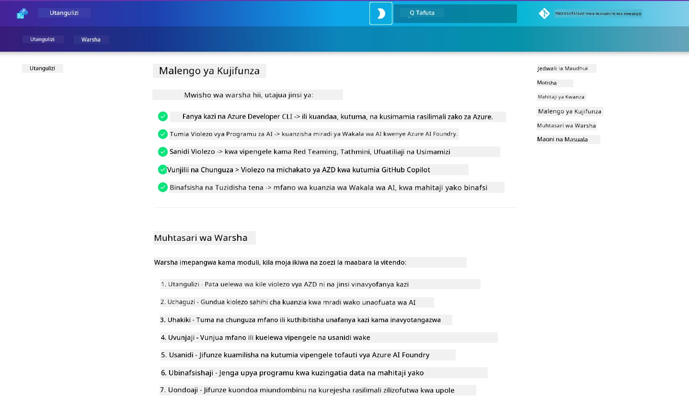

<div align="center">
  <div style="background: linear-gradient(135deg, #0078d4, #106ebe); border-radius: 10px; padding: 20px; margin: 20px 0; box-shadow: 0 4px 15px rgba(0, 120, 212, 0.3); border: 2px solid #005a9e;">
    <h2 style="color: white; margin: 0; font-size: 24px; text-shadow: 1px 1px 2px rgba(0,0,0,0.3);">
      🎯 Warsha ya AZD kwa Waendelezaji wa AI
    </h2>
    <p style="color: white; margin: 10px 0 0 0; font-size: 16px; text-shadow: 1px 1px 2px rgba(0,0,0,0.3);">
      <strong>Warsha ya vitendo ya kujifunzia jinsi ya kujenga programu za AI kwa kutumia Azure Developer CLI.</strong><br>
      Komesha moduli 7 ili kumiliki violezo vya AZD na mitiririko ya kazi ya uenezaji wa AI.
    </p>
    <div style="margin-top: 15px;">
      <span style="background: rgba(255,255,255,0.2); padding: 5px 10px; border-radius: 15px; color: white; font-size: 14px;">
        📅 Imeasisiwa: Februari 2026
      </span>
    </div>
  </div>
</div>

# AZD for AI Developers Workshop

Karibu kwenye warsha ya vitendo ya kujifunza Azure Developer CLI (AZD) ukiwa na mvuto wa uenezaji wa programu za AI. Warsha hii itakusaidia kupata uelewa wa vitendo wa violezo vya AZD katika hatua 3:

1. **Discovery** - pata kiolezo kinachokufaa.
1. **Deployment** - weka na thibitisha kuwa kinafanya kazi
1. **Customization** - badilisha na rudia ili kiwe chako!

Katika mdundo wa warsha hii, pia utatambulishwa kwa zana za msingi za watengenezaji na mitiririko ya kazi, ili kukusaidia kurahisisha safari yako ya maendeleo kutoka mwanzo hadi mwisho.

<br/>

## Browser-Based Guide

Masomo ya warsha yako yako kwa Markdown. Unaweza kuyaviga moja kwa moja kwenye GitHub - au anzisha mwonekano wa kivinjari kama ilivyoonyeshwa kwenye picha ya skrini hapo chini.



Ili kutumia chaguo hili - tengeneza fork ya repository kwenye wasifu wako, na anzisha GitHub Codespaces. Mara terminal ya VS Code itakapokuwa hai, andika amri hii:

```bash title="" linenums="0"
mkdocs serve > /dev/null 2>&1 &
```

Ndani ya sekunde chache, utaona dirisha la pop-up. Chagua chaguo la `Fungua kwenye kivinjari`. Mwongozo wa tovuti sasa utafunguka kwenye kichupo kipya cha kivinjari. Faida kadhaa za mwonekano huu:

1. **Utafutaji uliojengwa** - pata maneno muhimu au masomo haraka.
1. **Ikoni ya nakala** - piga kipanya juu ya vibloki vya msimbo ili kuona chaguo hili
1. **Vibadilisho vya mandhari** - badilisha kati ya mandhari nyeusi na mwanga
1. **Pata msaada** - bonyeza ikoni ya Discord katika sehemu ya chini ya ukurasa ili kujiunga!

<br/>

## Workshop Overview

**Duration:** 3-4 hours  
**Level:** Beginner to Intermediate  
**Prerequisites:** Familiarity with Azure, AI concepts, VS Code & command-line tools.

Hii ni warsha ya vitendo ambapo unajifunza kwa kufanya. Mara utakapokamilisha mazoezi, tunapendekeza ukague mtaala wa AZD For Beginners ili kuendelea na safari yako ya kujifunza kuelekea Usalama na mbinu Bora za Uzalishaji.

| Time| Module  | Objective |
|:---|:---|:---|
| 15 mins | [Utangulizi](docs/instructions/0-Introduction.md) | Weka muktadha, elewa malengo |
| 30 mins | [Chagua Kiolezo cha AI](docs/instructions/1-Select-AI-Template.md) | Chunguza chaguzi na chagua mwanzo | 
| 30 mins | [Thibitisha Kiolezo cha AI](docs/instructions/2-Validate-AI-Template.md) | Weza suluhisho la msingi kwenye Azure |
| 30 mins | [Changanua Kiolezo cha AI](docs/instructions/3-Deconstruct-AI-Template.md) | Chunguza muundo na usanidi |
| 30 mins | [Sanidi Kiolezo cha AI](docs/instructions/4-Configure-AI-Template.md) | Washa na ujaribu vipengele vinavyopatikana |
| 30 mins | [Binafsisha Kiolezo cha AI](docs/instructions/5-Customize-AI-Template.md) | Rekebisha kiolezo kwa mahitaji yako |
| 30 mins | [Ondoa Miundombinu](docs/instructions/6-Teardown-Infrastructure.md) | Safisha na toa rasilimali |
| 15 mins | [Hitimisho & Hatua Zifuatazo](docs/instructions/7-Wrap-up.md) | Rasilimali za kujifunza, Changamoto ya Warsha |

<br/>

## What You'll Learn

Fikiria Kiolezo cha AZD kama uwanja wa kujifunzia ili kuchunguza uwezo na zana mbalimbali kwa ajili ya maendeleo kutoka mwanzo hadi mwisho kwenye Microsoft Foundry. Mwishoni mwa warsha hii, unapaswa kuwa na hisia ya kibinafsi ya zana na dhana mbalimbali katika muktadha huu.

| Concept  | Objective |
|:---|:---|
| **Azure Developer CLI** | Elewa amri za zana na mitiririko ya kazi|
| **AZD Templates**| Elewa muundo wa mradi na usanidi|
| **Azure AI Agent**| Tayarisha na weka mradi wa Microsoft Foundry  |
| **Azure AI Search**| Wezesha uhandisi wa muktadha kwa kutumia maajenti |
| **Observability**| Chunguza ufuatiliaji, uangalizi na tathmini |
| **Red Teaming**| Chunguza majaribio ya kuingiliana na mbinu za kuzuia |

<br/>

## Workshop Structure

Warsha imepangwa kukuchukua kwenye safari kutoka kugundua kiolezo, hadi uenezaji, uchambuzi, na ubinafsishaji - ukitumia kiolezo rasmi cha kuanzia [Getting Started with AI Agents](https://github.com/Azure-Samples/get-started-with-ai-agents) kama msingi.

### [Module 1: Select AI Template](docs/instructions/1-Select-AI-Template.md) (30 mins)

- Je, violezo vya AI ni nini?
- Ninatoka wapi kupata Violezo vya AI?
- Ninawezaje kuanza kujenga Maajenti ya AI?
- **Maabara**: Mwanzoni kwa GitHub Codespaces

### [Module 2: Validate AI Template](docs/instructions/2-Validate-AI-Template.md) (30 mins)

- Ni usanifu gani wa Kiolezo cha AI?
- Ni mtiririko gani wa Maendeleo wa AZD?
- Ninawezaje kupata msaada na Maendeleo ya AZD?
- **Maabara**: Weka & Thibitisha kiolezo cha Maajenti ya AI

### [Module 3: Deconstruct AI Template](docs/instructions/3-Deconstruct-AI-Template.md) (30 mins)

- Chunguza mazingira yako katika `.azure/` 
- Chunguza usanidi wa rasilimali zako katika `infra/` 
- Chunguza usanidi wako wa AZD katika `azure.yaml`s
- **Maabara**: Badilisha Vigezo vya Mazingira na Uweke tena

### [Module 4: Configure AI Template](docs/instructions/4-Configure-AI-Template.md) (30 mins)
- Chunguza: Retrieval Augmented Generation
- Chunguza: Tathmini ya Maajenti & Red Teaming
- Chunguza: Ufuatiliaji & Uangalizi
- **Maabara**: Chunguza Maajenti ya AI + Ufuatiliaji 

### [Module 5: Customize AI Template](docs/instructions/5-Customize-AI-Template.md) (30 mins)
- Eleza: PRD na Mahitaji ya Senario
- Sanidi: Vigezo vya Mazingira kwa AZD
- Tekeleza: Lifecycle Hooks kwa kazi zilizoongezwa
- **Maabara**: Binafsisha kiolezo kwa senario yangu

### [Module 6: Teardown Infrastructure](docs/instructions/6-Teardown-Infrastructure.md) (30 mins)
- Rudia: Je, violezo vya AZD ni nini?
- Rudia: Kwa nini utumie Azure Developer CLI?
- Hatua Zifuatazo: Jaribu kiolezo tofauti!
- **Maabara**: Ondoa miundombinu & safisha

<br/>

## Workshop Challenge

Unataka kujichochea kufanya zaidi? Hapa kuna mapendekezo ya miradi - au shiriki mawazo yako nasi!!

| Project | Description |
|:---|:---|
|1. **Changanua Kiolezo Kinachojumuisha** | Tumia mtiririko wa kazi na zana tulizozieleza ukaone kama unaweza kueneza, kuthibitisha, na kubinafsisha kiolezo tofauti cha suluhisho la AI. _Ulipata nini?_|
|2. **Binafsisha Kwa Senario Yako**  | Jaribu kuandika PRD (Product Requirements Document) kwa senario tofauti. Kisha tumia GitHub Copilot katika repo ya kiolezo chako katika Agent Model - na muulize uundae mtiririko wa kazi wa ubinafsishaji kwako. _Ulipata nini? Unaweza kuboresha vipi mapendekezo haya?_|
| | |

## Have feedback?

1. Tuma issue kwenye repo hii - uitag `Workshop` kwa urahisi.
1. Jiunge na Microsoft Foundry Discord - ungana na wenzako!


| | | 
|:---|:---|
| **📚 Nyumba ya Kozi**| [AZD Kwa Waanzilishi](../README.md)|
| **📖 Nyaraka** | [Get started with AI templates](https://learn.microsoft.com/en-us/azure/ai-foundry/how-to/develop/ai-template-get-started)|
| **🛠️Violezo vya AI** | [Microsoft Foundry Templates](https://ai.azure.com/templates) |
|**🚀 Hatua Zifuatazo** | [Anza Warsha](../../../workshop) |
| | |

<br/>

---

**Navigation:** [Kozi Kuu](../README.md) | [Utangulizi](docs/instructions/0-Introduction.md) | [Module 1: Chagua Kiolezo](docs/instructions/1-Select-AI-Template.md)

**Uko tayari kuanza kujenga programu za AI kwa kutumia AZD?**

[Anza Warsha: Utangulizi →](docs/instructions/0-Introduction.md)

---

<!-- CO-OP TRANSLATOR DISCLAIMER START -->
Tamko la kutolea mbali:
Nyaraka hii imetafsiriwa kwa kutumia huduma ya tafsiri ya AI [Co-op Translator](https://github.com/Azure/co-op-translator). Ingawa tunajitahidi kufikia usahihi, tafadhali fahamu kuwa tafsiri za kiotomatiki zinaweza kuwa na makosa au ukosefu wa usahihi. Nyaraka ya asili katika lugha yake ya asili inapaswa kuchukuliwa kuwa chanzo cha mamlaka. Kwa taarifa za muhimu, inashauriwa kutumia tafsiri ya kitaalamu ya binadamu. Hatuwajibiki kwa maelewano au tafsiri potofu zitokanazo na matumizi ya tafsiri hii.
<!-- CO-OP TRANSLATOR DISCLAIMER END -->