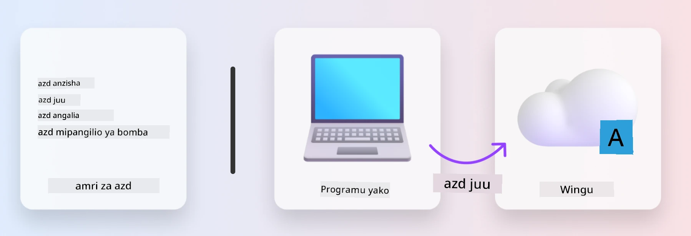
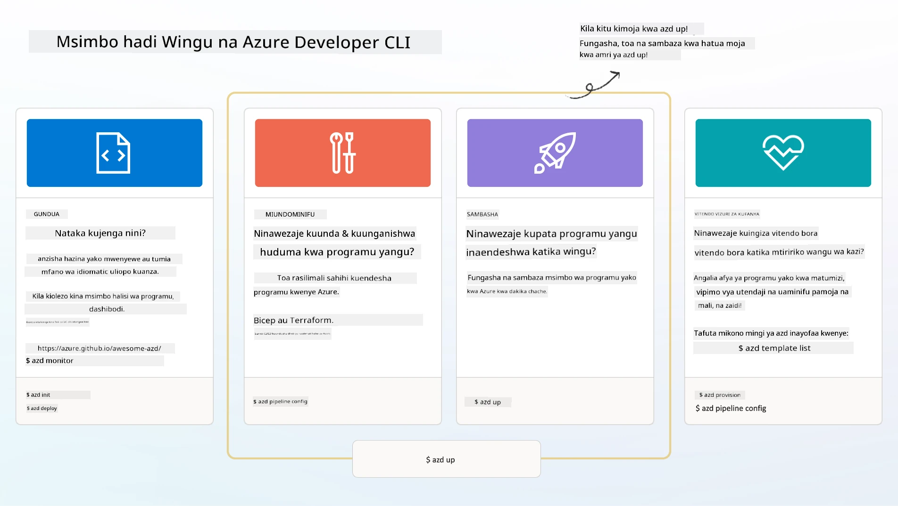

# 1. Chagua Kiolezo

!!! tip "MWISHO WA MODULI HII UTAWEZA"

    - [ ] Elezea ni nini violezo vya AZD
    - [ ] Gundua na tumia violezo vya AZD kwa AI
    - [ ] Anza na kiolezo cha Mawakala wa AI
    - [ ] **Maabara 1:** Mwanzilishi wa AZD katika Codespaces au kontena ya maendeleo

---

## 1. Mfano wa Mjenzi

Kujenga programu ya kisasa ya AI inayostahili kwa biashara _kuanzia mwanzo_ kunaweza kuwa jambo la kuogopesha. Ni kama kujenga nyumba yako mpya mwenyewe, jengo kwa jengo. Ndiyo, inaweza kufanywa! Lakini siyo njia bora kabisa ya kupata matokeo unayotaka! 

Badala yake, mara nyingi tunaanza na _mchoro wa muundo_ uliopo, na tufanye kazi na mbunifu wa majengo ili kuibinafsisha kwa mahitaji yetu binafsi. Na hiyo ni hasa approachto ya kuchukua wakati wa kujenga programu zenye akili. Kwanza, tafuta usanifu mzuri unaofaa eneo la tatizo lako. Kisha fanya kazi na mbunifu wa suluhisho ili kuibinafsisha na kuendeleza suluhisho kwa senario yako maalum.

Lakini tunaweza kupata wapi ile michoro ya muundo? Na tunawezaje kupata mbunifu ambaye yuko tayari kutufundisha jinsi ya kuibinafsisha na kuizindua wenyewe? Katika warsha hii, tunajibu maswali hayo kwa kukutambulisha teknolojia tatu:

1. [Azure Developer CLI](https://aka.ms/azd) - zana ya chanzo-wazi inayoongeza kasi ya safari ya msanidi kuanzia maendeleo ya eneo-kazi hadi uenezaji kwenye wingu.
1. [Microsoft Foundry Templates](https://ai.azure.com/templates) - hazina za chanzo-wazi zilizostandazwa zinazoelezea msimbo wa mfano, miundombinu na faili za usanidi kwa kupeleka usanifu wa suluhisho la AI.
1. [GitHub Copilot Agent Mode](https://code.visualstudio.com/docs/copilot/chat/chat-agent-mode) - wakala wa kuandika msimbo aliyeegeshwa kwenye maarifa ya Azure, ambaye anaweza kutuelekeza katika kusafiri kwenye hifadhidata ya msimbo na kufanya mabadiliko kwa kutumia lugha ya kawaida.

Kwa zana hizi mikononi, sasa tunaweza _gundua_ kiolezo sahihi, _kipeleke_ ili kuthibitisha kinafanya kazi, na _kuibinafsisha_ ili kiendane na senario zetu maalum. Hebu tuanze na tujifunze jinsi vinavyofanya kazi.


---

## 2. Azure Developer CLI

The [Azure Developer CLI](https://learn.microsoft.com/en-us/azure/developer/azure-developer-cli/) (or `azd`) ni zana ya amri ya chanzo-wazi ambayo inaweza kuharakisha safari yako ya msimbo-ku-wingu kwa seti ya amri rafiki kwa msanidi ambazo zinafanya kazi kwa utaratibu katika IDE yako (maendeleo) na mazingira ya CI/CD (devops).

With `azd`, safari yako ya uenezaji inaweza kuwa rahisi kama:

- `azd init` - Inawasha mradi mpya wa AI kutoka kwa kiolezo cha AZD kilicho tayari.
- `azd up` - Inatenga miundombinu na kuipeleka programu yako kwa hatua moja.
- `azd monitor` - Pata ufuatiliaji wa wakati-halisi na uchanganuzi kwa programu uliyoipeleka.
- `azd pipeline config` - Weka mipango ya CI/CD ili kuendeshwa kwa kujiendesha kwa uenezaji kwenda Azure.

**🎯 | EXERCISE**: <br/> Gundua zana ya amri `azd` katika mazingira yako ya warsha sasa. Hii inaweza kuwa GitHub Codespaces, kontena ya maendeleo, au nakala ya eneo-kazi yenye matakwa yaliyowekwa. Anza kwa kuandika amri hii ili kuona kile zana inaweza kufanya:

```bash title="" linenums="0"
azd help
```



---

## 3. Kiolezo cha AZD

Ili `azd` ifikie hili, inahitaji kujua miundombinu ya kutengeza, mipangilio ya usanidi ya kutekeleza, na programu ya kupeleka. Hapa ndipo [AZD templates](https://learn.microsoft.com/en-us/azure/developer/azure-developer-cli/azd-templates?tabs=csharp) zinapoingia.

AZD templates ni hazina za chanzo-wazi zinazounganisha msimbo wa mfano pamoja na faili za miundombinu na usanidi zinazohitajika kwa kupeleka usanifu wa suluhisho.
Kwa kutumia mbinu ya _Infrastructure-as-Code_ (IaC), zinaruhusu ufafanuzi wa rasilimali za kiolezo na mipangilio ya usanidi kuhifadhiwa kwa version-controller (kama msimbo wa chanzo wa programu) - zikitengeneza mtiririko wa kazi unaoweza kutumika tena na thabiti kwa watumiaji wa mradi huo.

Unapounda au kutumia tena kiolezo cha AZD kwa _senario_ yako, fikiria maswali haya:

1. Unajenga nini? → Je, kuna kiolezo kinachotoa msimbo wa kuanzia kwa senario hiyo?
1. Suluhisho lako limepangwa vipi? → Je, kuna kiolezo lenye rasilimali zinazohitajika?
1. Suluhisho lako linawekezeshwaje? → Fikiria `azd deploy` na hooks za pre/post-processing!
1. Unawezaje kuiboresha zaidi? → Fikiria ufuatiliaji uliojengwa na mitiririko ya uendeshaji wa kiotomatiki!

**🎯 | EXERCISE**: <br/> 
Tembelea maktaba ya [Awesome AZD](https://azure.github.io/awesome-azd/) na tumia chujio kuchunguza violezo 250+ vinavyopatikana kwa sasa. Angalia kama unaweza kupata on ambayo inaendana na mahitaji ya _senario_ yako.



---

## 4. Violezo vya Programu za AI

Kwa programu zinazoendeshwa na AI, Microsoft hutoa violezo maalum vinavyoficha **Microsoft Foundry** na **Foundry Agents**. Violezo hivi vinaongeza kasi ya njia yako ya kujenga programu zenye akili na tayari kwa uzalishaji.

### Violezo vya Microsoft Foundry & Foundry Agents

Chagua kiolezo hapa chini ili kupeleka. Kila kiolezo kinapatikana kwenye [Awesome AZD](https://azure.github.io/awesome-azd/) na kinaweza kuanzishwa kwa amri moja.

| Kiolezo | Maelezo | Amri ya Kupeleka |
|----------|-------------|----------------|
| **[AI Chat with RAG](https://azure.github.io/awesome-azd/?tags=ai&tags=rag)** | Programu ya mazungumzo yenye Retrieval Augmented Generation ikitumia Microsoft Foundry | `azd init -t azure-samples/azure-search-openai-demo` |
| **[Foundry Agent Service Starter](https://azure.github.io/awesome-azd/?tags=ai&tags=agents)** | Jenga mawakala wa AI kwa Foundry Agents kwa utekelezaji wa kazi wenye uhuru | `azd init -t azure-samples/foundry-agent-service-starter` |
| **[Multi-Agent Orchestration](https://azure.github.io/awesome-azd/?tags=ai&tags=agents)** | Ratibu mawakala wengi wa Foundry kwa mtiririko wa kazi tata | `azd init -t azure-samples/multi-agent-orchestration` |
| **[AI Document Intelligence](https://azure.github.io/awesome-azd/?tags=ai&tags=document)** | Tenganua na chambua nyaraka kwa kutumia modeli za Microsoft Foundry | `azd init -t azure-samples/ai-document-processing` |
| **[Conversational AI Bot](https://azure.github.io/awesome-azd/?tags=ai&tags=bot)** | Tengeneza chatbots zenye akili zilizounganishwa na Microsoft Foundry | `azd init -t azure-samples/ai-chat-protocol` |
| **[AI Image Generation](https://azure.github.io/awesome-azd/?tags=ai&tags=dalle)** | Zalisha picha kwa kutumia DALL-E kupitia Microsoft Foundry | `azd init -t azure-samples/ai-image-generation` |
| **[Semantic Kernel Agent](https://azure.github.io/awesome-azd/?tags=ai&tags=semantic-kernel)** | Mawakala wa AI wakitumia Semantic Kernel pamoja na Foundry Agents | `azd init -t azure-samples/semantic-kernel-agent` |
| **[AutoGen Multi-Agent](https://azure.github.io/awesome-azd/?tags=ai&tags=autogen)** | Mifumo ya mawakala wengi ikitumia mfumo wa AutoGen | `azd init -t azure-samples/autogen-multi-agent` |

### Anza Haraka

1. **Tazama violezo**: Tembelea [https://azure.github.io/awesome-azd/](https://azure.github.io/awesome-azd/) na chuja kwa `AI`, `Agents`, au `Microsoft Foundry`
2. **Chagua kiolezo chako**: Chagua kile kinacholingana na matumizi yako
3. **Anzisha**: Endesha amri ya `azd init` kwa kiolezo ulichochagua
4. **Peleka**: Endesha `azd up` kutenga na kupeleka

**🎯 | EXERCISE**: <br/>
Chagua kimoja cha violezo hapo juu kulingana na senario yako:

- **Unatengeneza chatbot?** → Anza na **AI Chat with RAG** au **Conversational AI Bot**
- **Unahitaji mawakala huru?** → Jaribu **Foundry Agent Service Starter** au **Multi-Agent Orchestration**
- **Unachakata nyaraka?** → Tumia **AI Document Intelligence**
- **Unataka msaada wa kuandika msimbo kwa AI?** → Chunguza **Semantic Kernel Agent** au **AutoGen Multi-Agent**

```bash title="Example: Deploy the AI Chat with RAG template" linenums="0"
azd init -t azure-samples/azure-search-openai-demo
azd up
```

!!! info "Gundua Violezo Zaidi"
    The [Awesome AZD Gallery](https://azure.github.io/awesome-azd/) contains 250+ templates. Use the filters to find templates matching your specific requirements for language, framework, and Azure services.

---

<!-- CO-OP TRANSLATOR DISCLAIMER START -->
**Taarifa ya kutokuwajibika**:
Hati hii imetafsiriwa kwa kutumia huduma ya tafsiri ya AI [Co-op Translator](https://github.com/Azure/co-op-translator). Ingawa tunajitahidi kuwa sahihi, tafadhali fahamu kuwa tafsiri za kiotomatiki zinaweza kuwa na makosa au ukosefu wa usahihi. Hati asili katika lugha yake ya asili inapaswa kuchukuliwa kama chanzo chenye mamlaka. Kwa taarifa muhimu, inapendekezwa kutumia tafsiri ya kitaalamu ya binadamu. Hatuwajibiki kwa kutoelewana au tafsiri potofu zinazotokana na matumizi ya tafsiri hii.
<!-- CO-OP TRANSLATOR DISCLAIMER END -->