<!--
CO_OP_TRANSLATOR_METADATA:
{
  "original_hash": "7816c6ec50c694c331e7c6092371be4d",
  "translation_date": "2025-09-25T02:08:32+00:00",
  "source_file": "workshop/docs/instructions/2-Validate-AI-Template.md",
  "language_code": "sw"
}
-->
# 2. Thibitisha Kiolezo

!!! tip "MWISHO WA MODULI HII UTAWEZA"

    - [ ] Kuchambua Muundo wa Suluhisho la AI
    - [ ] Kuelewa Mtiririko wa Uwekaji wa AZD
    - [ ] Kutumia GitHub Copilot kupata msaada kuhusu matumizi ya AZD
    - [ ] **Maabara ya 2:** Weka & Thibitisha kiolezo cha AI Agents

---

## 1. Utangulizi

[Azure Developer CLI](https://learn.microsoft.com/en-us/azure/developer/azure-developer-cli/) au `azd` ni zana ya amri ya wazi inayorahisisha mtiririko wa kazi wa msanidi programu wakati wa kujenga na kuweka programu kwenye Azure.

[AZD Templates](https://learn.microsoft.com/azure/developer/azure-developer-cli/azd-templates) ni hifadhi zilizo sanifu zinazojumuisha msimbo wa programu ya mfano, mali za _miundombinu kama msimbo_, na faili za usanidi za `azd` kwa muundo wa suluhisho lenye mshikamano. Kuweka miundombinu kunakuwa rahisi kama amri ya `azd provision` - wakati kutumia `azd up` hukuruhusu kuweka miundombinu **na** kuweka programu yako kwa hatua moja!

Kwa hivyo, kuanza mchakato wako wa maendeleo ya programu kunaweza kuwa rahisi kama kupata _AZD Starter template_ inayokaribia mahitaji ya programu na miundombinu yako - kisha kubadilisha hifadhi ili kufaa mahitaji ya hali yako.

Kabla ya kuanza, hakikisha umeweka Azure Developer CLI.

1. Fungua terminal ya VS Code na andika amri hii:

      ```bash title="" linenums="0"
      azd version
      ```

1. Unapaswa kuona kitu kama hiki!

      ```bash title="" linenums="0"
      azd version 1.19.0 (commit b3d68cea969b2bfbaa7b7fa289424428edb93e97)
      ```

**Sasa uko tayari kuchagua na kuweka kiolezo kwa azd**

---

## 2. Uchaguzi wa Kiolezo

Jukwaa la Azure AI Foundry linakuja na [seti ya violezo vya AZD vilivyopendekezwa](https://learn.microsoft.com/en-us/azure/ai-foundry/how-to/develop/ai-template-get-started) vinavyoshughulikia hali maarufu za suluhisho kama _atomatiki ya mtiririko wa kazi wa mawakala wengi_ na _usindikaji wa maudhui ya njia nyingi_. Unaweza pia kugundua violezo hivi kwa kutembelea portal ya Azure AI Foundry.

1. Tembelea [https://ai.azure.com/templates](https://ai.azure.com/templates)
1. Ingia kwenye portal ya Azure AI Foundry unapoulizwa - utaona kitu kama hiki.

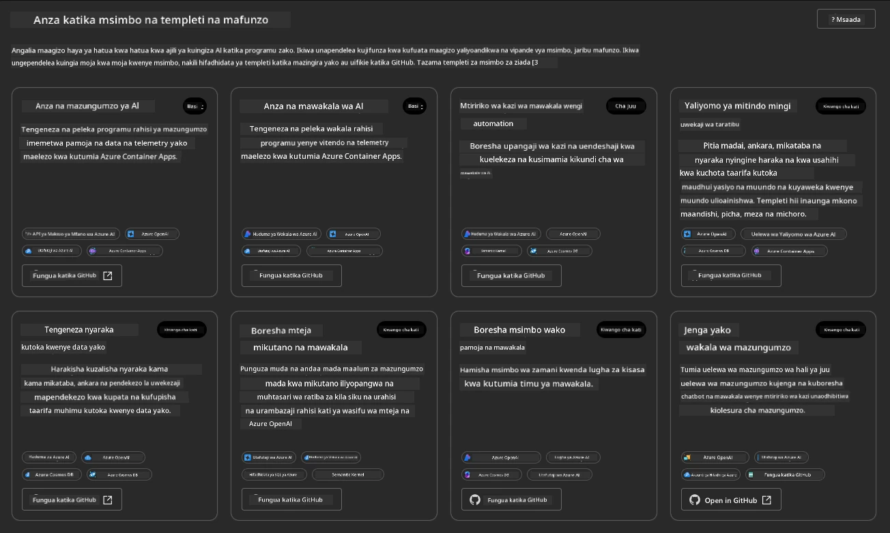

Chaguo za **Msingi** ni violezo vyako vya kuanzia:

1. [ ] [Anza na AI Chat](https://github.com/Azure-Samples/get-started-with-ai-chat) ambayo huweka programu ya mazungumzo ya msingi _na data yako_ kwenye Azure Container Apps. Tumia hii kuchunguza hali ya msingi ya chatbot ya AI.
1. [X] [Anza na AI Agents](https://github.com/Azure-Samples/get-started-with-ai-agents) ambayo pia huweka AI Agent ya kawaida (na Huduma ya Azure AI Agent). Tumia hii kufahamiana na suluhisho za AI za mawakala zinazohusisha zana na mifano.

Tembelea kiungo cha pili kwenye tabo mpya ya kivinjari (au bonyeza `Open in GitHub` kwa kadi inayohusiana). Unapaswa kuona hifadhi ya kiolezo hiki cha AZD. Chukua dakika kuchunguza README. Muundo wa programu unaonekana kama huu:

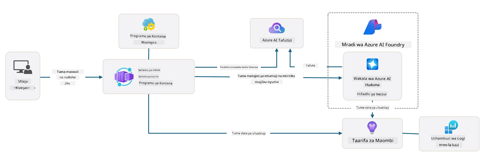

---

## 3. Uanzishaji wa Kiolezo

Hebu jaribu kuweka kiolezo hiki na kuhakikisha kuwa ni halali. Tutafuata miongozo katika sehemu ya [Getting Started](https://github.com/Azure-Samples/get-started-with-ai-agents?tab=readme-ov-file#getting-started).

1. Bonyeza [kiungo hiki](https://github.com/codespaces/new/Azure-Samples/get-started-with-ai-agents) - thibitisha hatua ya chaguo-msingi ya `Create codespace`
1. Hii inafungua tabo mpya ya kivinjari - subiri kikao cha GitHub Codespaces kikamilishe kupakia
1. Fungua terminal ya VS Code ndani ya Codespaces - andika amri ifuatayo:

   ```bash title="" linenums="0"
   azd up
   ```

Kamilisha hatua za mtiririko ambazo hii itasababisha:

1. Utaulizwa kuingia kwenye Azure - fuata maelekezo ili kuthibitisha
1. Ingiza jina la kipekee la mazingira yako - kwa mfano, nilitumia `nitya-mshack-azd`
1. Hii itaunda folda `.azure/` - utaona folda ndogo yenye jina la mazingira
1. Utaulizwa kuchagua jina la usajili - chagua chaguo-msingi
1. Utaulizwa eneo - tumia `East US 2`

Sasa, subiri mchakato wa kuweka miundombinu ukamilike. **Hii inachukua dakika 10-15**

1. Ukimaliza, terminal yako itaonyesha ujumbe wa MAFANIKIO kama huu:
      ```bash title="" linenums="0"
      SUCCESS: Your up workflow to provision and deploy to Azure completed in 10 minutes 17 seconds.
      ```

1. Portal yako ya Azure sasa itakuwa na kikundi cha rasilimali kilichowekwa na jina la mazingira hayo:

      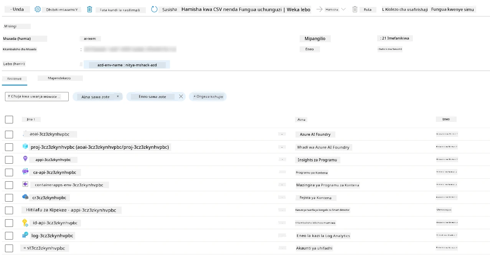

1. **Sasa uko tayari kuthibitisha miundombinu na programu iliyowekwa.**

---

## 4. Uthibitishaji wa Kiolezo

1. Tembelea ukurasa wa [Resource Groups](https://portal.azure.com/#browse/resourcegroups) kwenye Portal ya Azure - ingia unapoulizwa
1. Bonyeza RG kwa jina la mazingira yako - utaona ukurasa hapo juu

      - bonyeza rasilimali ya Azure Container Apps
      - bonyeza URL ya Programu katika sehemu ya _Essentials_ (juu kulia)

1. Unapaswa kuona UI ya mbele ya programu iliyohifadhiwa kama hii:

   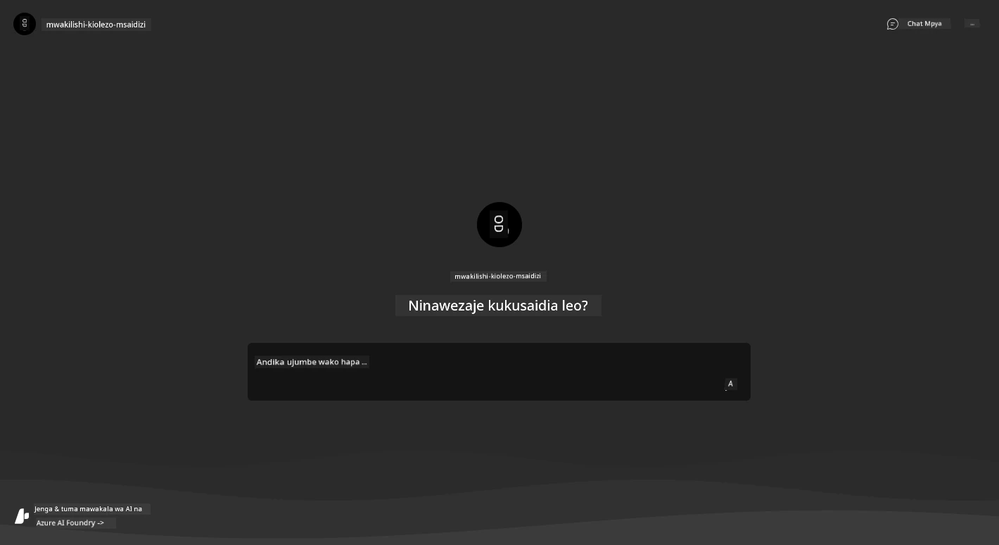

1. Jaribu kuuliza maswali kadhaa ya [mfano](https://github.com/Azure-Samples/get-started-with-ai-agents/blob/main/docs/sample_questions.md)

      1. Uliza: ```What is the capital of France?``` 
      1. Uliza: ```What's the best tent under $200 for two people, and what features does it include?```

1. Unapaswa kupata majibu yanayofanana na yale yaliyoonyeshwa hapa chini. _Lakini hii inafanyaje kazi?_ 

      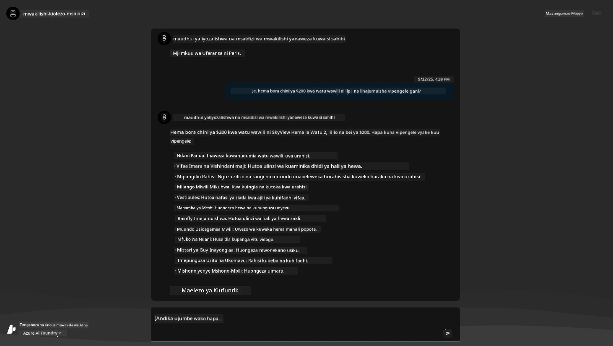

---

## 5. Uthibitishaji wa Mawakala

Azure Container App huweka endpoint inayounganisha na AI Agent iliyowekwa katika mradi wa Azure AI Foundry kwa kiolezo hiki. Hebu tuangalie maana ya hili.

1. Rudi kwenye ukurasa wa _Overview_ wa Portal ya Azure kwa kikundi chako cha rasilimali

1. Bonyeza rasilimali ya `Azure AI Foundry` katika orodha hiyo

1. Unapaswa kuona hii. Bonyeza kitufe cha `Go to Azure AI Foundry Portal`. 
   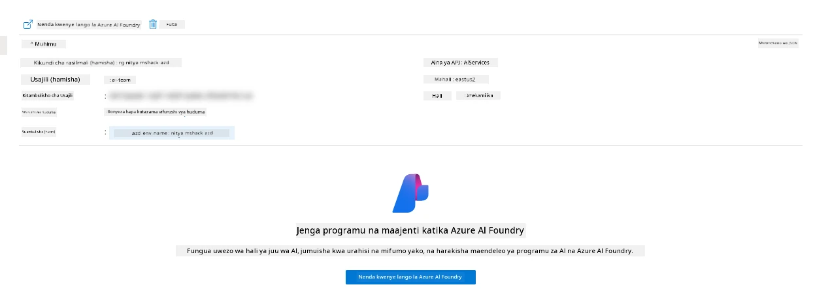

1. Unapaswa kuona ukurasa wa Mradi wa Foundry kwa programu yako ya AI
   

1. Bonyeza `Agents` - utaona Mawakala wa chaguo-msingi waliowekwa katika mradi wako
   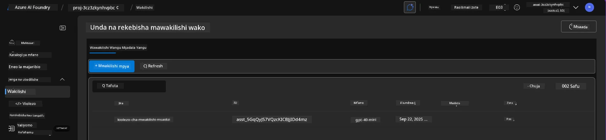

1. Chagua - na utaona maelezo ya Mawakala. Kumbuka yafuatayo:

      - Mawakala hutumia File Search kwa chaguo-msingi (daima)
      - `Knowledge` ya Mawakala inaonyesha ina faili 32 zilizopakiwa (kwa utafutaji wa faili)
      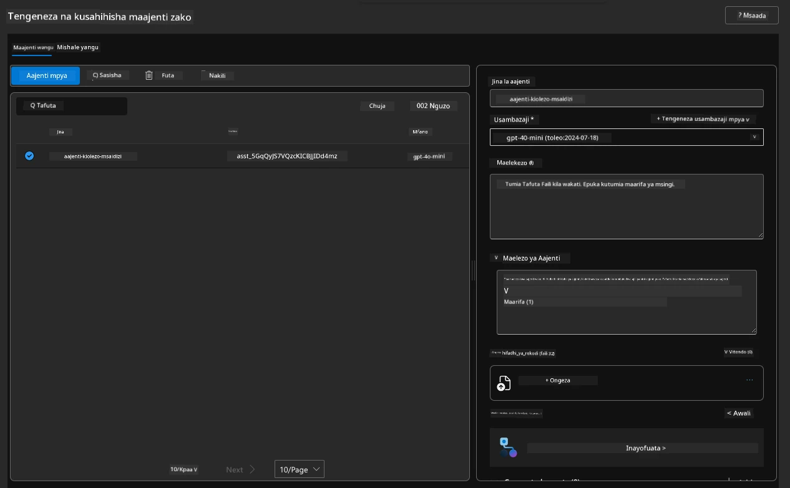

1. Tafuta chaguo la `Data+indexes` katika menyu ya kushoto na bonyeza kwa maelezo.

      - Unapaswa kuona faili 32 za data zilizopakiwa kwa maarifa.
      - Hizi zitahusiana na faili 12 za wateja na faili 20 za bidhaa chini ya `src/files` 
      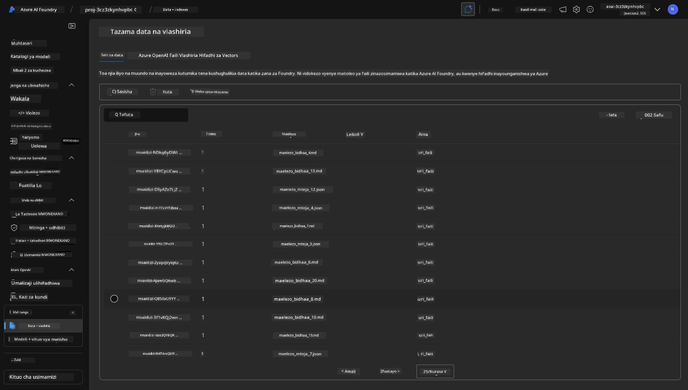

**Umehakiki operesheni ya Mawakala!** 

1. Majibu ya Mawakala yanategemea maarifa katika faili hizo. 
1. Sasa unaweza kuuliza maswali yanayohusiana na data hiyo, na kupata majibu yanayofaa.
1. Mfano: `customer_info_10.json` inaelezea ununuzi 3 uliofanywa na "Amanda Perez"

Rudi kwenye tabo ya kivinjari yenye endpoint ya Container App na uliza: `What products does Amanda Perez own?`. Unapaswa kuona kitu kama hiki:

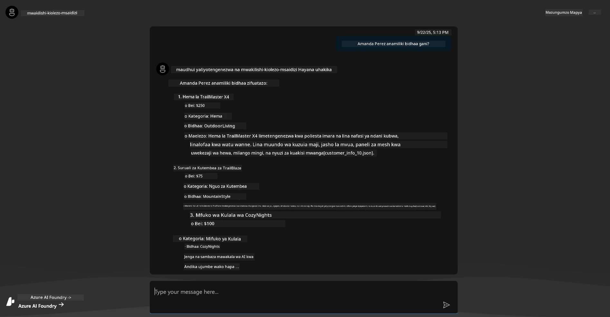

---

## 6. Uwanja wa Mawakala

Hebu tujenge uelewa zaidi wa uwezo wa Azure AI Foundry, kwa kujaribu Mawakala katika Uwanja wa Mawakala.

1. Rudi kwenye ukurasa wa `Agents` katika Azure AI Foundry - chagua wakala wa chaguo-msingi
1. Bonyeza chaguo la `Try in Playground` - unapaswa kupata UI ya Uwanja kama huu
1. Uliza swali lile lile: `What products does Amanda Perez own?`

    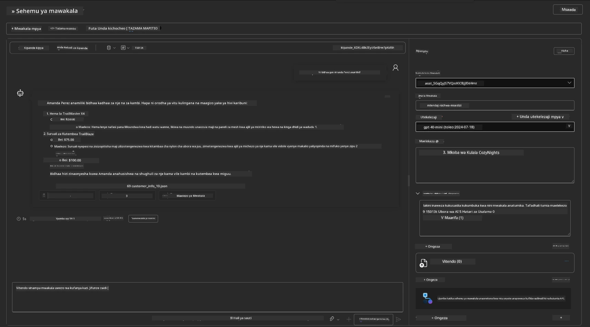

Unapata jibu lile lile (au linalofanana) - lakini pia unapata maelezo ya ziada unayoweza kutumia kuelewa ubora, gharama, na utendaji wa programu yako ya mawakala. Kwa mfano:

1. Kumbuka kuwa jibu linataja faili za data zilizotumika "kuthibitisha" jibu
1. Peleka mshale juu ya lebo yoyote ya faili hizi - je, data inalingana na swali lako na jibu lililoonyeshwa?

Pia unaona safu ya _stats_ chini ya jibu. 

1. Peleka mshale juu ya kipimo chochote - kwa mfano, Usalama. Unaona kitu kama hiki
1. Je, tathmini inayotolewa inalingana na uelewa wako wa kiwango cha usalama wa jibu?

      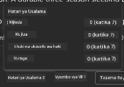

---x

## 7. Ufuatiliaji wa Ndani

Ufuatiliaji ni kuhusu kuweka vifaa vya programu yako ili kuzalisha data inayoweza kutumika kuelewa, kutatua matatizo, na kuboresha operesheni zake. Ili kupata hisia ya hili:

1. Bonyeza kitufe cha `View Run Info` - unapaswa kuona mwonekano huu. Hii ni mfano wa [Ufuatiliaji wa Mawakala](https://learn.microsoft.com/en-us/azure/ai-foundry/how-to/develop/trace-agents-sdk#view-trace-results-in-the-azure-ai-foundry-agents-playground) katika vitendo. _Unaweza pia kupata mwonekano huu kwa kubonyeza Thread Logs katika menyu ya juu._

   - Pata hisia ya hatua za kukimbia na zana zilizotumiwa na wakala
   - Elewa jumla ya idadi ya Tokeni (vs. matumizi ya tokeni za matokeo) kwa jibu
   - Elewa ucheleweshaji na mahali muda unatumika katika utekelezaji

      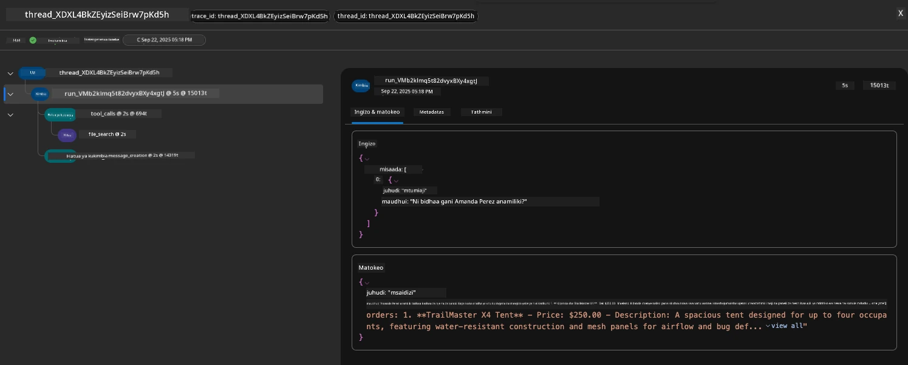

1. Bonyeza tabo ya `Metadata` ili kuona sifa za ziada za kukimbia, ambazo zinaweza kutoa muktadha muhimu kwa kutatua matatizo baadaye.   

      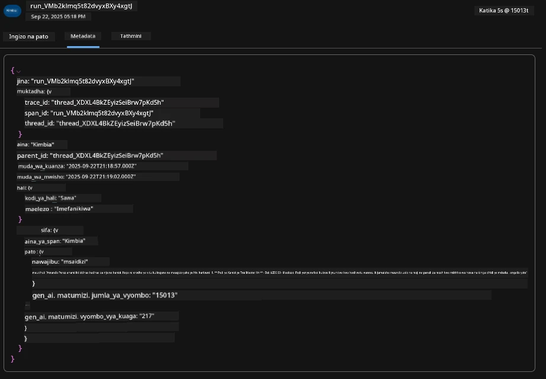

1. Bonyeza tabo ya `Evaluations` ili kuona tathmini za kiotomatiki zilizofanywa kwenye jibu la wakala. Hizi zinajumuisha tathmini za usalama (mfano, Kujidhuru) na tathmini maalum za wakala (mfano, Utatuzi wa nia, Ufuatiliaji wa kazi).

      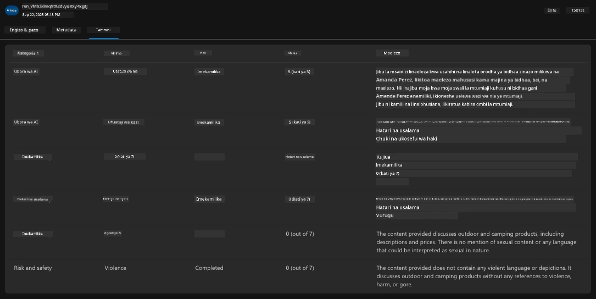

1. Mwisho lakini si kwa uchache, bonyeza tabo ya `Monitoring` katika menyu ya upande.

      - Chagua tabo ya `Resource usage` katika ukurasa ulioonyeshwa - na tazama vipimo.
      - Fuatilia matumizi ya programu kwa gharama (tokeni) na mzigo (maombi).
      - Fuatilia ucheleweshaji wa programu hadi byte ya kwanza (usindikaji wa pembejeo) na byte ya mwisho (matokeo).

      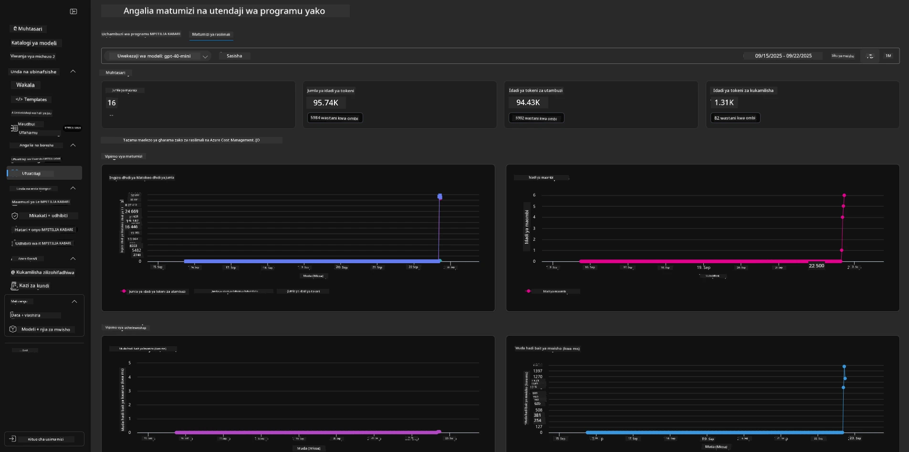

---

## 8. Vigezo vya Mazingira

Hadi sasa, tumepitia uwekaji katika kivinjari - na kuthibitisha kuwa miundombinu yetu imewekwa na programu inafanya kazi. Lakini kufanya kazi na programu _kwa msingi wa msimbo_, tunahitaji kusanidi mazingira yetu ya maendeleo ya ndani na vigezo husika vinavyohitajika kufanya kazi na rasilimali hizi. Kutumia `azd` hufanya iwe rahisi.

1. Azure Developer CLI [hutumia vigezo vya mazingira](https://learn.microsoft.com/en-us/azure/developer/azure-developer-cli/manage-environment-variables?tabs=bash) kuhifadhi na kusimamia mipangilio ya usanidi kwa uwekaji wa programu.

1. Vigezo vya mazingira huhifadhiwa katika `.azure/<env-name>/.env` - hii inavipatia mazingira ya `env-name` yaliyotumika wakati wa uwekaji na husaidia kutenganisha mazingira kati ya malengo tofauti ya uwekaji katika hifadhi moja.

1. Vigezo vya mazingira hupakiwa kiotomatiki na amri ya `azd` kila inapotekeleza amri maalum (mfano, `azd up`). Kumbuka kuwa `azd` haisomi kiotomatiki vigezo vya mazingira vya _OS-level_ (mfano, vilivyowekwa kwenye shell) - badala yake tumia `azd set env` na `azd get env` kuhamisha taarifa ndani ya script.

Hebu jaribu amri chache:

1. Pata vigezo vyote vya mazingira vilivyowekwa kwa `azd` katika mazingira haya:

      ```bash title="" linenums="0"
      azd env get-values
      ```
      
      Unaona kitu kama:

      ```bash title="" linenums="0"
      AZURE_AI_AGENT_DEPLOYMENT_NAME="gpt-4o-mini"
      AZURE_AI_AGENT_NAME="agent-template-assistant"
      AZURE_AI_EMBED_DEPLOYMENT_NAME="text-embedding-3-small"
      AZURE_AI_EMBED_DIMENSIONS=100
      ...
      ```

1. Pata thamani maalum - kwa mfano, nataka kujua kama tumetumia thamani ya `AZURE_AI_AGENT_MODEL_NAME`

      ```bash title="" linenums="0"
      azd env get-value AZURE_AI_AGENT_MODEL_NAME 
      ```
      
      Unaona kitu kama hiki - haikuwekwa kwa chaguo-msingi!

      ```bash title="" linenums="0"
      ERROR: key 'AZURE_AI_AGENT_MODEL_NAME' not found in the environment values
      ```

1. Weka kigezo kipya cha mazingira kwa `azd`. Hapa, tunasasisha jina la mfano wa wakala. _Kumbuka: mabadiliko yoyote yaliyofanywa yataonyeshwa mara moja katika faili `.azure/<env-name>/.env`.

      ```bash title="" linenums="0"
      azd env set AZURE_AI_AGENT_MODEL_NAME gpt-4.1
      azd env set AZURE_AI_AGENT_MODEL_VERSION 2025-04-14
      azd env set AZURE_AI_AGENT_DEPLOYMENT_CAPACITY 150
      ```

      Sasa, tunapaswa kupata thamani imewekwa:

      ```bash title="" linenums="0"
      azd env get-value AZURE_AI_AGENT_MODEL_NAME 
      ```

1. Kumbuka kuwa baadhi ya rasilimali ni za kudumu (mfano, uwekaji wa mifano) na zitahitaji zaidi ya `azd up` kulazimisha uwekaji upya. Hebu jaribu kuondoa uwekaji wa awali na kuweka upya na vigezo vya mazingira vilivyobadilishwa.

1. **Refresh** Ikiwa hapo awali uliweka miundombinu kwa kutumia kiolezo cha azd - unaweza _kusasisha_ hali ya vigezo vya mazingira ya ndani kulingana na hali ya sasa ya uwekaji wa Azure kwa kutumia amri hii:
      ```bash title="" linenums="0"
      azd env refresh
      ```

      Hii ni njia yenye nguvu ya _kusawazisha_ vigezo vya mazingira kati ya mazingira mawili au zaidi ya maendeleo ya ndani (mfano, timu yenye waendelezaji wengi) - ikiruhusu miundombinu iliyotumwa kuwa chanzo cha ukweli kwa hali ya vigezo vya mazingira. Wanachama wa timu wanahitaji tu _kusasisha_ vigezo ili kurudi katika usawazishaji.

---

## 9. Hongera 🏆

Umemaliza mtiririko wa kazi wa mwisho hadi mwisho ambapo ulifanya:

- [X] Kuchagua Kiolezo cha AZD Unachotaka Kutumia
- [X] Kuzindua Kiolezo na GitHub Codespaces 
- [X] Kutuma Kiolezo na kuthibitisha kinafanya kazi

---

