# 2. Thibitisha Kiolezo

!!! tip "MWISHO WA MODULI HII UTAWEZA"

    - [ ] Changanua Usanifu wa Suluhisho la AI
    - [ ] Elewa Mwendo wa Utekelezaji wa AZD
    - [ ] Tumia GitHub Copilot kupata msaada juu ya matumizi ya AZD
    - [ ] **Lab 2:** Tengeneza & Thibitisha kiolezo cha AI Agents

---


## 1. Utangulizi

The [Azure Developer CLI](https://learn.microsoft.com/en-us/azure/developer/azure-developer-cli/) or `azd` ni zana ya chanzo wazi ya mstari wa amri inayorahisisha mtiririko wa kazi wa msanidi programu wakati wa kujenga na kupeleka programu kwenye Azure. 

[AZD Templates](https://learn.microsoft.com/azure/developer/azure-developer-cli/azd-templates) ni hifadhidata zilizo sanifu ambazo zinajumuisha msimbo wa programu wa mfano, mali za _infrastructure-as-code_, na faili za usanidi za `azd` kwa usanifu wa suluhisho ulio kamilika. Uandaji wa miundombinu unakuwa rahisi kama amri ya `azd provision` - wakati kutumia `azd up` kunakuwezesha kuandaa miundombinu **na** kupeleka programu yako kwa mara moja!

Kwa matokeo, kuanzisha mchakato wako wa maendeleo ya programu kunaweza kuwa rahisi kama kupata _AZD Starter template_ inayofaa zaidi kwa mahitaji ya programu na miundombinu yako - kisha kubadilisha hifadhidata ili kufaa mahitaji ya tukio lako.

Kabla hatujaanza, hebu hakikisha umeweka Azure Developer CLI.

1. Fungua terminal ya VS Code na andika amri hii:

      ```bash title="" linenums="0"
      azd version
      ```

1. Unapaswa kuona kitu kama hiki!

      ```bash title="" linenums="0"
      azd version 1.19.0 (commit b3d68cea969b2bfbaa7b7fa289424428edb93e97)
      ```

**Sasa uko tayari kuchagua na kupeleka kiolezo kwa kutumia azd**

---

## 2. Uchaguzi wa Kiolezo

Jukwaa la Microsoft Foundry linakuja na [seti ya kiolezo za AZD zinazopendekezwa](https://learn.microsoft.com/en-us/azure/ai-foundry/how-to/develop/ai-template-get-started) ambazo zinafunika maeneo maarufu ya suluhisho kama _utomishaji wa mtiririko wa kazi wa mawakala wengi_ na _kusindika maudhui ya njia nyingi_. Unaweza pia kugundua kiolezo hivi kwa kutembelea bandari ya Microsoft Foundry.

1. Tembelea [https://ai.azure.com/templates](https://ai.azure.com/templates)
1. Ingia kwenye bandari ya Microsoft Foundry wakati inapoombwa - utaona kitu kama hiki.

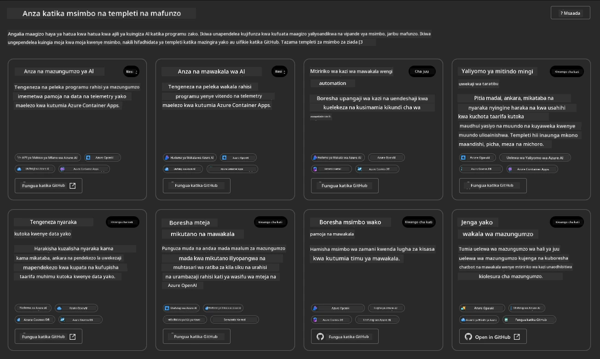


Chaguo la **Basic** ni kiolezo chako cha kuanzia:

1. [ ] [Get Started with AI Chat](https://github.com/Azure-Samples/get-started-with-ai-chat) ambacho kinaweka programu ya mazungumzo ya msingi _na data yako_ kwenye Azure Container Apps. Tumia hii kuchunguza tukio la msingi la chatbot ya AI.
1. [X] [Get Started with AI Agents](https://github.com/Azure-Samples/get-started-with-ai-agents) ambacho pia kinaweka AI Agent ya kawaida (na Foundry Agents). Tumia hii kujifunza suluhisho za AI zenye utendaji wa mawakala zinazohusisha zana na modeli.

Tembelea kiungo cha pili katika kichupo kipya cha kivinjari (au bonyeza `Open in GitHub` kwa kadi husika). Unapaswa kuona hifadhidata ya Kiolezo hiki cha AZD. Chukua dakika kuchunguza README. Usanifu wa programu unaonekana hivi:

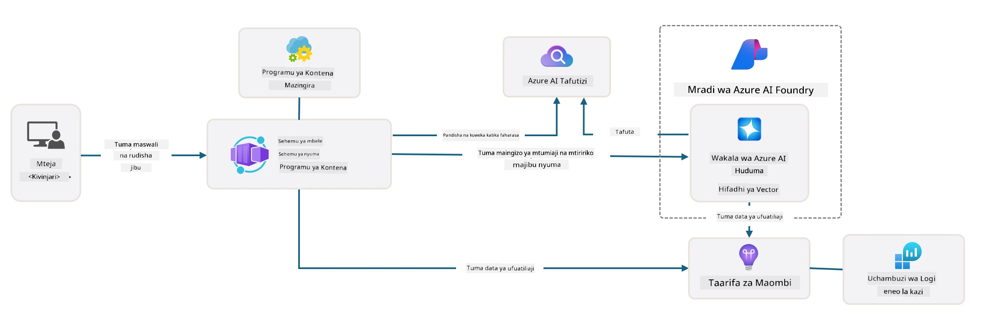

---

## 3. Uwezeshaji wa Kiolezo

Tujaribu kupeleka kiolezo hiki na kuhakikisha ni halali. Tutaifuata miongozo katika sehemu ya [Getting Started](https://github.com/Azure-Samples/get-started-with-ai-agents?tab=readme-ov-file#getting-started).

1. Bonyeza [this link](https://github.com/codespaces/new/Azure-Samples/get-started-with-ai-agents) - thibitisha hatua ya chaguo-msingi ya `Create codespace`
1. Hii itafungua kichupo kipya cha kivinjari - subiri hadi kikao cha GitHub Codespaces kikamilike kupakia
1. Fungua terminal ya VS Code katika Codespaces - andika amri ifuatayo:

   ```bash title="" linenums="0"
   azd up
   ```

Kamilisha hatua za mtiririko ambazo hii itazindua:

1. Utaombwa kuingia kwenye Azure - fuata maagizo ili kuthibitisha
1. Ingiza jina la mazingira la kipekee kwa ajili yako - kwa mfano, nilitumia `nitya-mshack-azd`
1. Hii itaunda folda `.azure/` - utaona folda ndogo yenye jina la mazingira
1. Utaombwa kuchagua jina la usajili - chagua chaguo-msingi
1. Utaombwa chagua eneo - tumia `East US 2`

Sasa, subiri uandishaji ukamilike. **Hii inachukua dakika 10-15**

1. Unapo maliza, terminal yako itaonyesha ujumbe wa MAFANIKIO kama huu:
      ```bash title="" linenums="0"
      SUCCESS: Your up workflow to provision and deploy to Azure completed in 10 minutes 17 seconds.
      ```
1. Azure Portal yako sasa itakuwa na kundi la rasilimali lililopangwa lenye jina la mazingira hayo:

      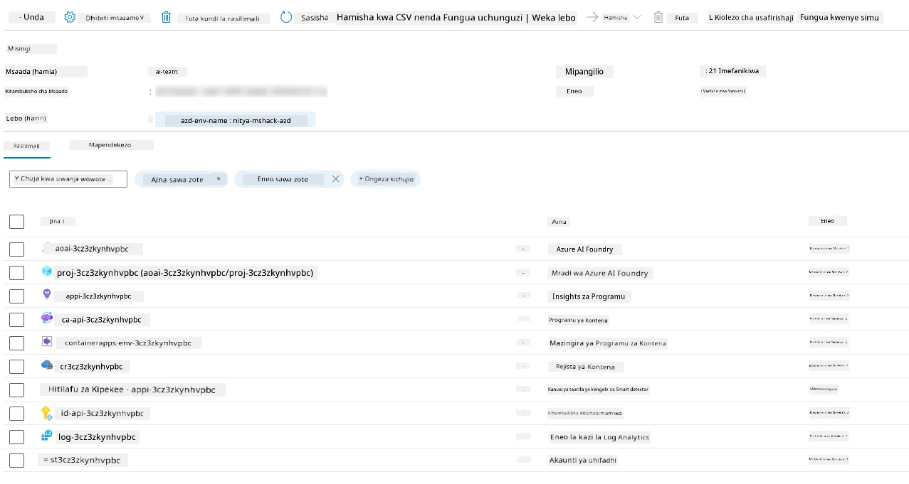

1. **Sasa uko tayari kuthibitisha miundombinu iliyowekwa na programu**.

---

## 4. Uthibitishaji wa Kiolezo

1. Tembelea ukurasa wa Azure Portal [Resource Groups](https://portal.azure.com/#browse/resourcegroups) - ingia ukiombwa
1. Bonyeza RG ya jina la mazingira yako - utaona ukurasa ulio juu

      - bonyeza rasilimali ya Azure Container Apps
      - bonyeza Application Url katika sehemu ya _Essentials_ (juu kulia)

1. Unapaswa kuona mbele-mwisho ya programu iliyohifadhiwa kama hii:

   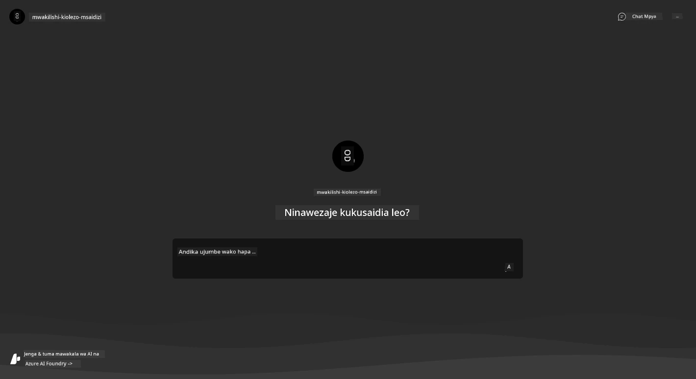

1. Jaribu kuuliza maswali machache ya [mfano](https://github.com/Azure-Samples/get-started-with-ai-agents/blob/main/docs/sample_questions.md)

      1. Uliza: ```What is the capital of France?``` 
      1. Uliza: ```What's the best tent under $200 for two people, and what features does it include?```

1. Unapaswa kupata majibu yanayofanana na yaliyoonyeshwa hapa chini. _Lakini haya yanavyofanya kazi?_

      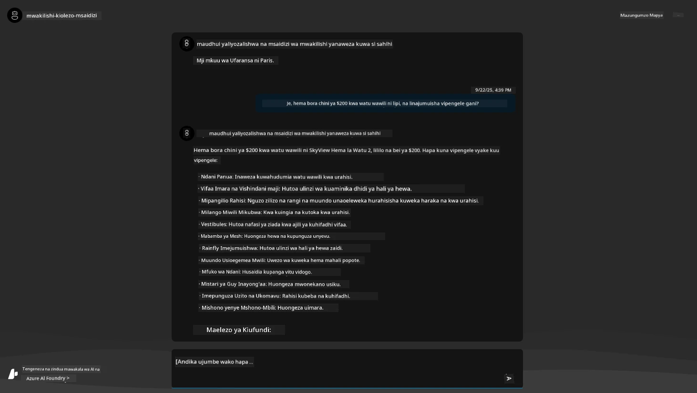

---

## 5.  Uthibitishaji wa Mwakala

Azure Container App inaweka mwisho wa huduma unaounganisha na AI Agent uliowekwa katika mradi wa Microsoft Foundry kwa kiolezo hiki. Hebu tuchunguze maana yake.

1. Rejea kwenye ukurasa wa Azure Portal _Overview_ kwa kundi lako la rasilimali

1. Bonyeza rasilimali `Microsoft Foundry` katika orodha hiyo

1. Unapaswa kuona hii. Bonyeza kitufe cha `Go to Microsoft Foundry Portal`. 
   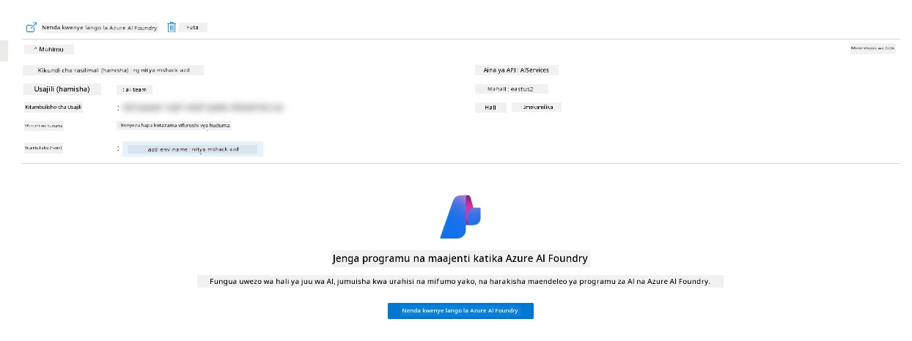

1. Unapaswa kuona ukurasa wa Mradi wa Foundry kwa programu yako ya AI
   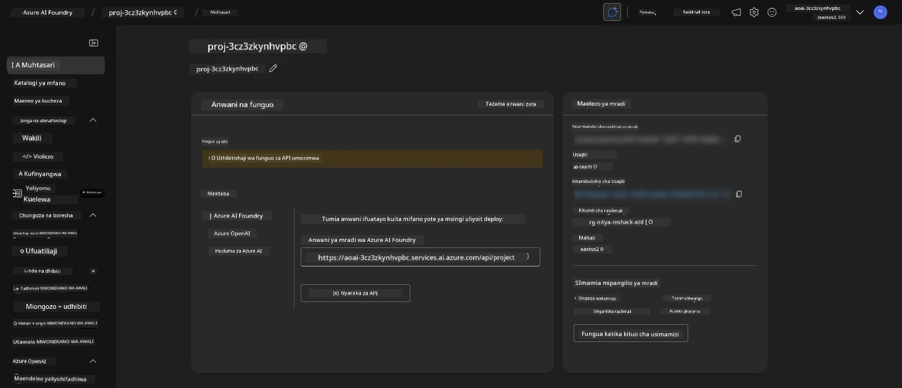

1. Bonyeza `Agents` - utaona Mwakala wa chaguo-msingi uliowekwa katika mradi wako
   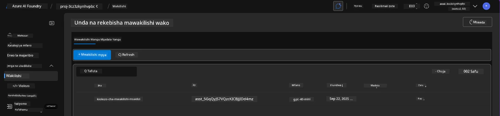

1. Mchague - utaona maelezo ya Mwakala. Angalia yafuatayo:

      - Mwakala hutumia File Search kwa chaguo-msingi (daima)
      - `Knowledge` ya mwakala inaonyesha kuwa kuna mafaili 32 yaliyopakiwa (kwa utafutaji wa faili)
      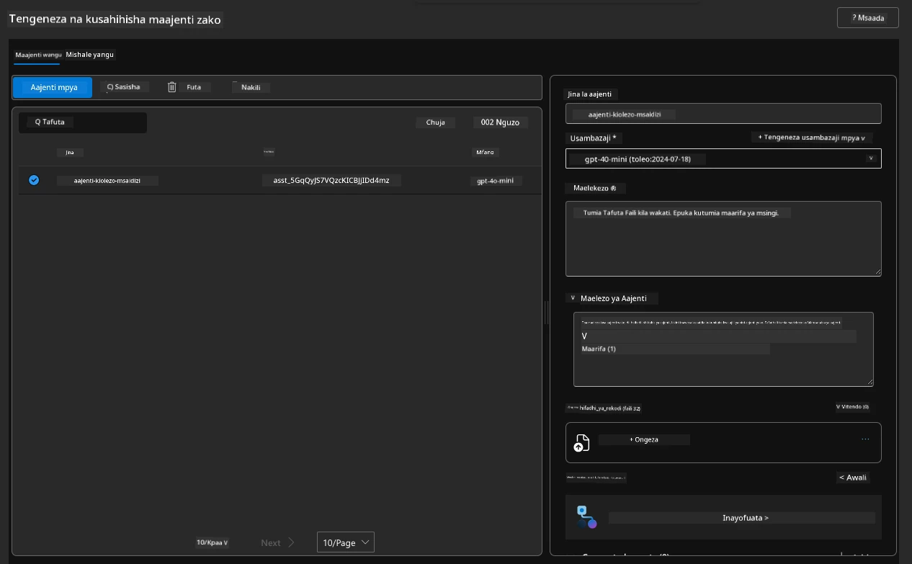

1. Tafuta chaguo la `Data+indexes` katika menyu ya kushoto na bonyeza kwa maelezo. 

      - Unapaswa kuona mafaili 32 ya data yaliyopakiwa kwa maarifa.
      - Haya yatakuwa yanaendana na mafaili 12 ya wateja na mafaili 20 ya bidhaa chini ya `src/files`
      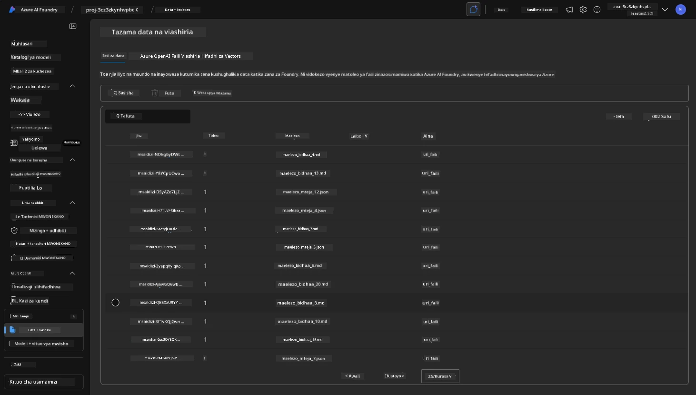

**Umehakiki uendeshaji wa Mwakala!** 

1. Majibu ya mwakala yanategemea maarifa yaliyomo katika mafaili hayo. 
1. Sasa unaweza kuuliza maswali yanayohusiana na data hiyo, na kupata majibu yaliyothibitishwa.
1. Mfano: `customer_info_10.json` inaelezea ununuzi 3 uliofanywa na "Amanda Perez"

Rudia kichupo cha kivinjari chenye mwisho wa Container App na ulize: `What products does Amanda Perez own?`. Unapaswa kuona kitu kama hiki:

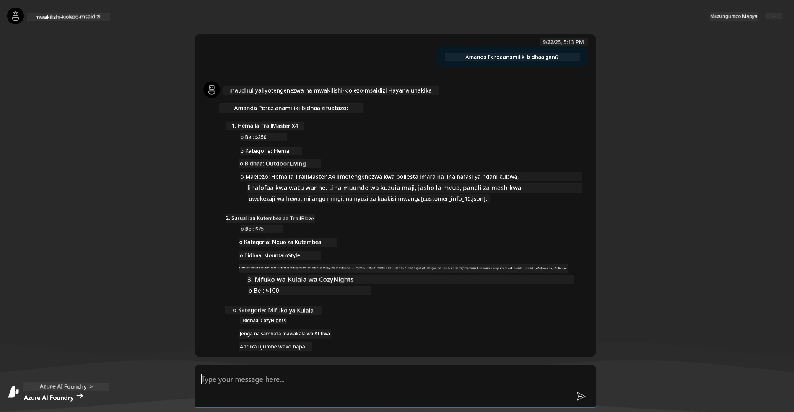

---

## 6. Uwanja wa Mawakala (Agent Playground)

Hebu tujenge ufahamu zaidi wa uwezo wa Microsoft Foundry, kwa kujaribu Mwakala katika Agents Playground. 

1. Rejea kwenye ukurasa wa `Agents` katika Microsoft Foundry - chagua mwakala wa chaguo-msingi
1. Bonyeza chaguo la `Try in Playground` - utapata UI ya Playground kama hii
1. Uliza swali lile lile: `What products does Amanda Perez own?`

    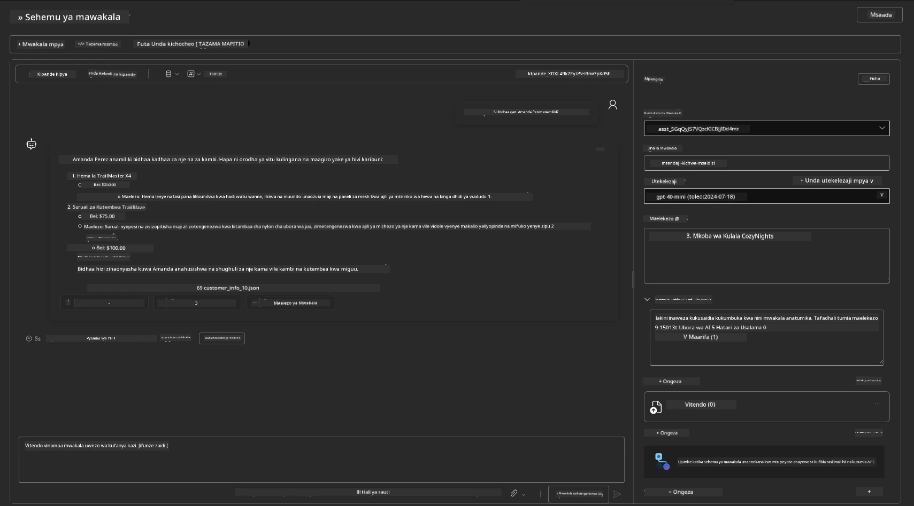

Unapata jibu lile (au jibu linalofanana) - lakini pia unapata taarifa za ziada ambazo unaweza kutumia kuelewa ubora, gharama, na utendaji wa programu yako ya mawakala. Kwa mfano:

1. Kumbuka kwamba jibu linataja mafaili ya data yaliyotumika "kuthibitisha" jibu
1. Peleka mshale juu ya lebo yoyote ya faili hizi - je, data inalingana na swali lako na jibu lililoonyeshwa?

Unaona pia safu ya _takwimu_ chini ya jibu. 

1. Peleka mshale juu ya kipimo chochote - kwa mfano, Safety. Unaona kitu kama hiki
1. Je, tathmini iliyopewa inalingana na hisia zako kuhusu kiwango cha usalama cha jibu?

      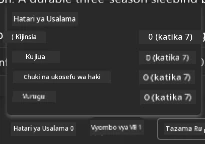

---

## 7. Uwezo wa Uangalizi uliojengwa ndani

Uangalizi unahusu kuweka vifaa katika programu yako ili kuzalisha data ambayo inaweza kutumika kuelewa, kutatua matatizo, na kuibua, uendeshaji wake. Ili kupata hisia ya hili:

1. Bonyeza kitufe cha `View Run Info` - utapata mtazamo huu. Hii ni mfano wa [Agent tracing](https://learn.microsoft.com/en-us/azure/ai-foundry/how-to/develop/trace-agents-sdk#view-trace-results-in-the-azure-ai-foundry-agents-playground) ikifanya kazi. _Unaweza pia kupata mtazamo huu kwa kubonyeza Thread Logs katika menyu ya ngazi ya juu_.

   - Pata hisia ya hatua za utekelezaji na zana zinazotumika na mwakala
   - Elewa jumla ya idadi ya Tokeni (kulinganishwa na matumizi ya tokeni za pato) kwa jibu
   - Elewa ucheleweshaji na wapi muda unatumika zaidi wakati wa utekelezaji

      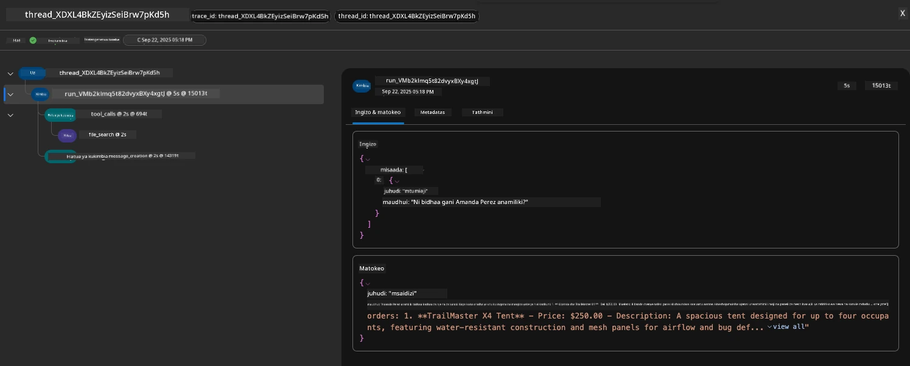

1. Bonyeza kichupo cha `Metadata` kuona sifa za ziada za utekelezaji, ambazo zinaweza kutoa muktadha muhimu kwa kutatua matatizo baadaye.   

      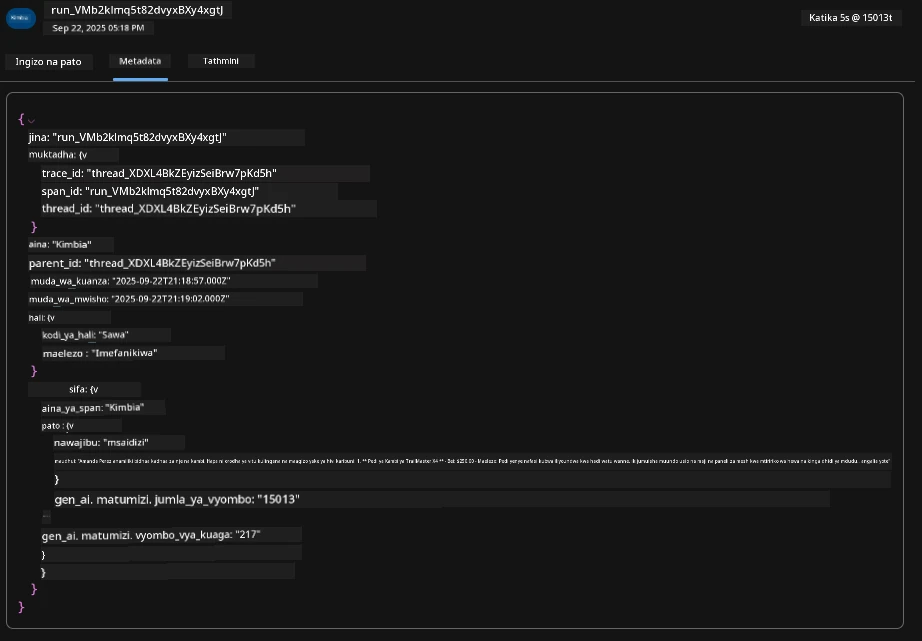


1. Bonyeza kichupo cha `Evaluations` kuona tathmini za moja kwa moja zilizo fanywa kwenye jibu la mwakala. Hizi ni pamoja na tathmini za usalama (mfano, Kujihatarisha) na tathmini maalum za mwakala (mfano, Ufafanuzi wa nia, Utii wa kazi).

      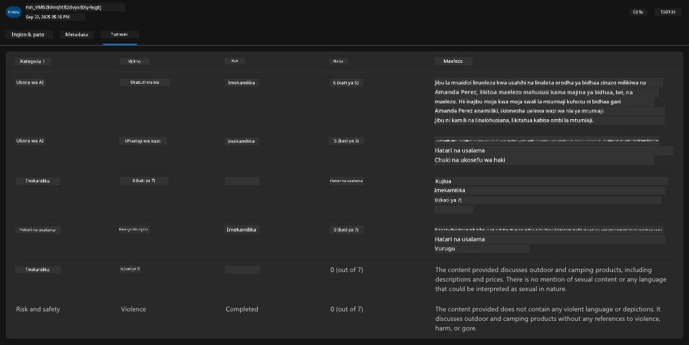

1. Mwisho lakini si wa mwisho, bonyeza kichupo cha `Monitoring` katika menyu ya upau wa upande.

      - Chagua kichupo `Resource usage` kwenye ukurasa unaoonyeshwa - na angalia vipimo.
      - Fuata matumizi ya programu kwa upande wa gharama (tokeni) na mzigo (maombi).
      - Fuata ucheleweshaji wa programu hadi baiti ya kwanza (usindikaji wa pembejeo) na baiti ya mwisho (pato).

      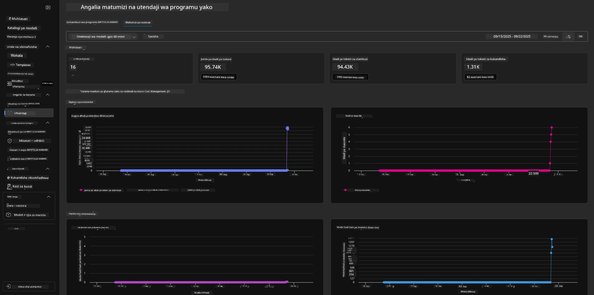

---

## 8. Mabadiliko ya Mazingira (Environment Variables)

Hadi sasa, tumeenda kupitia ujenzi kupitia kivinjari - na kuthibitisha kuwa miundombinu yetu imewezeshwa na programu inafanya kazi. Lakini ili kufanya kazi na msimbo wa programu kwa njia ya _code-first_, tunahitaji kusanidi mazingira yetu ya maendeleo ya ndani na vigezo vinavyohitajika kufanya kazi na rasilimali hizi. Kutumia `azd` kunafanya iwe rahisi.

1. Azure Developer CLI [inatumia vigezo vya mazingira](https://learn.microsoft.com/en-us/azure/developer/azure-developer-cli/manage-environment-variables?tabs=bash) kuhifadhi na kusimamia mipangilio ya usanidi kwa ajili ya utekelezaji wa programu.

1. Vigezo vya mazingira vinahifadhiwa katika `.azure/<env-name>/.env` - hii inavigeuza kwa mazingira ya `env-name` yaliyotumika wakati wa utekelezaji na inakusaidia kutenganisha mazingira kati ya malengo tofauti ya utekelezaji katika hifadhidata moja.

1. Vigezo vya mazingira vinapakiwa kiotomatiki na amri ya `azd` kila inapotekelezwa amri maalum (mfano, `azd up`). Kumbuka kwamba `azd` haisomi kiotomatiki vigezo vya mazingira vya OS (mfano, vilivyowekwa kwenye shell) - badala yake tumia `azd set env` na `azd get env` kuhamisha taarifa ndani ya skiripti.

Hebu jaribu amri chache:

1. Pata vigezo vyote vya mazingira vilivyowekwa kwa `azd` katika mazingira haya:

      ```bash title="" linenums="0"
      azd env get-values
      ```
      
      Unaona kitu kama:

      ```bash title="" linenums="0"
      AZURE_AI_AGENT_DEPLOYMENT_NAME="gpt-4.1-mini"
      AZURE_AI_AGENT_NAME="agent-template-assistant"
      AZURE_AI_EMBED_DEPLOYMENT_NAME="text-embedding-3-small"
      AZURE_AI_EMBED_DIMENSIONS=100
      ...
      ```

1. Pata thamani maalum - kwa mfano, nataka kujua kama tuliweka thamani ya `AZURE_AI_AGENT_MODEL_NAME`

      ```bash title="" linenums="0"
      azd env get-value AZURE_AI_AGENT_MODEL_NAME 
      ```
      
      Unaona kitu kama hiki - haikuwekwa kwa chaguo-msingi!

      ```bash title="" linenums="0"
      ERROR: key 'AZURE_AI_AGENT_MODEL_NAME' not found in the environment values
      ```

1. Weka kigezo kipya cha mazingira kwa `azd`. Hapa, tunasasisha jina la modeli ya mwakala. _Kumbuka: mabadiliko yoyote yatakuwa yanaonekana mara moja katika faili `.azure/<env-name>/.env`.

      ```bash title="" linenums="0"
      azd env set AZURE_AI_AGENT_MODEL_NAME gpt-4.1
      azd env set AZURE_AI_AGENT_MODEL_VERSION 2025-04-14
      azd env set AZURE_AI_AGENT_DEPLOYMENT_CAPACITY 150
      ```

      Sasa, tunapaswa kupata thamani imewekwa:

      ```bash title="" linenums="0"
      azd env get-value AZURE_AI_AGENT_MODEL_NAME 
      ```

1. Kumbuka kwamba rasilimali zingine ni za kudumu (mfano, utekelezaji wa modeli) na zitahitaji zaidi ya `azd up` ili kusababisha utekelezaji upya. Tujaribu kufuta utekelezaji wa awali na kuutekeleza tena kwa vigezo vya mazingira vilivyobadilishwa.

1. **Refresh** Ikiwa uliweka miundombinu hapo awali kwa kutumia kiolezo cha azd - unaweza _kufanya refresh_ ya hali ya vigezo vyako vya mazingira vya ndani kulingana na hali ya sasa ya utekelezaji wako wa Azure kwa kutumia amri hii:

      ```bash title="" linenums="0"
      azd env refresh
      ```

      Hii ni njia yenye nguvu ya _kuoanisha_ vigezo vya mazingira kati ya mazingira mawili au zaidi ya maendeleo ya ndani (kwa mfano, timu yenye waendelezaji wengi) - kuruhusu miundombinu iliyowekwa itumike kama ukweli wa msingi wa hali ya vigezo vya mazingira. Wanachama wa timu kwa urahisi _sasisha_ vigezo ili kurudi kuwa sawa.

---

## 9. Hongera 🏆

Umekamilisha mtiririko wa kazi kutoka mwanzo hadi mwisho ambapo uliyofanya:

- [X] Umechagua AZD Template unayotaka kutumia
- [X] Ulizindua Template kwa kutumia GitHub Codespaces 
- [X] Umeweka Template na kuthibitisha kuwa inafanya kazi

---

<!-- CO-OP TRANSLATOR DISCLAIMER START -->
**Tamko la kutokuhusika**:
Nyaraka hii imetafsiriwa kwa kutumia huduma ya tafsiri ya AI [Co-op Translator](https://github.com/Azure/co-op-translator). Ingawa tunajitahidi kuwa sahihi, tafadhali fahamu kwamba tafsiri za kiotomatiki zinaweza kuwa na makosa au upungufu wa usahihi. Nyaraka ya awali katika lugha yake ya asili inapaswa kuchukuliwa kama chanzo chenye mamlaka. Kwa taarifa muhimu, tafsiri ya kitaalamu ya binadamu inashauriwa. Hatuwajibiki kwa uelewa mbaya au tafsiri potofu zinazotokana na matumizi ya tafsiri hii.
<!-- CO-OP TRANSLATOR DISCLAIMER END -->