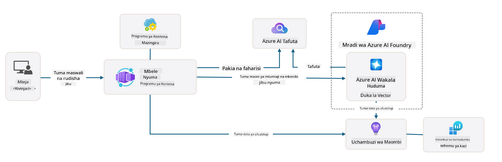

<!--
CO_OP_TRANSLATOR_METADATA:
{
  "original_hash": "4e403f041411361140d6beb88ab2a181",
  "translation_date": "2025-09-25T02:25:05+00:00",
  "source_file": "workshop/docs/instructions/3-Deconstruct-AI-Template.md",
  "language_code": "sw"
}
-->
# 3. Kuvunja Kiolezo

!!! tip "MWISHO WA MODULI HII UTAWEZA"

    - [ ] Kipengele
    - [ ] Kipengele
    - [ ] Kipengele
    - [ ] **Maabara ya 3:** 

---

Kwa kutumia violezo vya AZD na Azure Developer CLI (`azd`), tunaweza kuanza haraka safari yetu ya maendeleo ya AI kwa kutumia hifadhi za kawaida zinazotoa sampuli za msimbo, miundombinu, na faili za usanidi - katika mfumo wa mradi wa _mwanzo_ ulio tayari kupelekwa.

**Lakini sasa, tunahitaji kuelewa muundo wa mradi na msimbo - na kuweza kubadilisha kiolezo cha AZD - bila uzoefu wa awali au uelewa wa AZD!**

---

## 1. Washa GitHub Copilot

### 1.1 Sakinisha GitHub Copilot Chat

Ni wakati wa kuchunguza [GitHub Copilot na Hali ya Wakala](https://code.visualstudio.com/docs/copilot/chat/chat-agent-mode). Sasa, tunaweza kutumia lugha ya kawaida kuelezea kazi yetu kwa kiwango cha juu, na kupata msaada katika utekelezaji. Kwa maabara hii, tutatumia [mpango wa bure wa Copilot](https://github.com/github-copilot/signup) ambao una kikomo cha kila mwezi kwa ukamilishaji na mazungumzo.

Kiendelezi kinaweza kusakinishwa kutoka sokoni, lakini kinapaswa kuwa tayari kinapatikana katika mazingira yako ya Codespaces. _Bonyeza `Open Chat` kutoka kwenye menyu ya Copilot - na andika maelezo kama `What can you do?`_ - unaweza kuombwa kuingia. **GitHub Copilot Chat iko tayari**.

### 1.2. Sakinisha Seva za MCP

Ili Hali ya Wakala iwe na ufanisi, inahitaji ufikiaji wa zana sahihi za kusaidia kupata maarifa au kuchukua hatua. Hapa ndipo seva za MCP zinasaidia. Tutasanidi seva zifuatazo:

1. [Azure MCP Server](../../../../../workshop/docs/instructions)
1. [Microsoft Docs MCP Server](../../../../../workshop/docs/instructions)

Ili kuzihamisha:

1. Unda faili inayoitwa `.vscode/mcp.json` ikiwa haipo
1. Nakili yafuatayo kwenye faili hiyo - na anza seva!
   ```json title=".vscode/mcp.json"
   {
      "servers": {
         "Azure MCP Server": {
            "command": "npx",
            "args": [
            "-y",
            "@azure/mcp@latest",
            "server",
            "start"
            ]
         },
         "microsoft.docs.mcp": {
            "type": "http",
            "url": "https://learn.microsoft.com/api/mcp"
         }
      }
   }
   ```

??? warning "Unaweza kupata hitilafu kwamba `npx` haijasakinishwa (bonyeza ili kupanua kwa suluhisho)"

      Ili kurekebisha, fungua faili `.devcontainer/devcontainer.json` na ongeza mstari huu kwenye sehemu ya vipengele. Kisha jenga upya kontena. Sasa unapaswa kuwa na `npx` iliyosakinishwa.

      ```title="" linenums="0"
         "features": {
            "ghcr.io/devcontainers/features/node:1": {},
            ...
         },
      ```

---

### 1.3. Jaribu GitHub Copilot Chat

**Kwanza tumia `az login` kuingia na Azure kutoka kwa mstari wa amri wa VS Code.**

Sasa unapaswa kuwa na uwezo wa kuuliza hali ya usajili wa Azure yako, na kuuliza maswali kuhusu rasilimali zilizowekwa au usanidi. Jaribu maelezo haya:

1. `List my Azure resource groups`
1. `#foundry list my current deployments`

Unaweza pia kuuliza maswali kuhusu nyaraka za Azure na kupata majibu yanayotegemea seva ya Microsoft Docs MCP. Jaribu maelezo haya:

1. `#microsoft_docs_search What is Azure Developer CLI?`
1. `#microsoft_docs_search Show me a Python tutorial to chat with deployed model`

Au unaweza kuomba sampuli za msimbo ili kukamilisha kazi. Jaribu maelezo haya.

1. `Give me a Python code example that uses AAD for an interactive chat client`

Katika hali ya `Ask`, hii itatoa msimbo ambao unaweza kunakili na kujaribu. Katika hali ya `Agent`, hii inaweza kwenda hatua zaidi na kuunda rasilimali husika kwa ajili yako - ikiwa ni pamoja na hati za usanidi na nyaraka - ili kukusaidia kutekeleza kazi hiyo.

**Sasa umejiandaa kuanza kuchunguza hifadhi ya violezo**

---

## 2. Kuvunja Muundo wa Kifaa

??? prompt "ASK: Eleza muundo wa programu katika docs/images/architecture.png kwa aya moja"

      Programu hii ni programu ya mazungumzo inayotumia AI iliyojengwa kwenye Azure ambayo inaonyesha muundo wa kisasa wa msingi wa wakala. Suluhisho linazingatia Azure Container App inayohifadhi msimbo kuu wa programu, ambayo inachakata pembejeo za mtumiaji na kutoa majibu ya akili kupitia wakala wa AI. 
      
      Muundo unatumia Mradi wa Azure AI Foundry kama msingi wa uwezo wa AI, kuunganishwa na Huduma za Azure AI zinazotoa mifano ya lugha ya msingi (kama GPT-4o-mini) na utendaji wa wakala. Mwingiliano wa mtumiaji unapitia sehemu ya mbele ya React hadi sehemu ya nyuma ya FastAPI inayowasiliana na huduma ya wakala wa AI kwa ajili ya kutoa majibu ya muktadha. 
      
      Mfumo unajumuisha uwezo wa kupata maarifa kupitia utafutaji wa faili au huduma ya Azure AI Search, ikiruhusu wakala kufikia na kunukuu taarifa kutoka kwa nyaraka zilizopakiwa. Kwa ubora wa kiutendaji, muundo unajumuisha ufuatiliaji wa kina kupitia Application Insights na Log Analytics Workspace kwa ufuatiliaji, kumbukumbu, na uboreshaji wa utendaji. 
      
      Azure Storage inatoa hifadhi ya blob kwa data ya programu na nyaraka zilizopakiwa, wakati Managed Identity inahakikisha ufikiaji salama kati ya rasilimali za Azure bila kuhifadhi hati za siri. Suluhisho zima limeundwa kwa ajili ya kupanuka na kudumishwa, na programu iliyowekwa kwenye kontena ikipanuka kiotomatiki kulingana na mahitaji huku ikitoa usalama wa ndani, ufuatiliaji, na uwezo wa CI/CD kupitia mfumo wa huduma za Azure.



---

## 3. Muundo wa Hifadhi

!!! prompt "ASK: Eleza muundo wa folda ya kiolezo. Anza na mchoro wa muundo wa kihierarkia."

??? info "ANSWER: Mchoro wa Muundo wa Kihierarkia"

      ```bash title="" 
      get-started-with-ai-agents/
      ├── 📋 Usanidi & Usanifu
      │   ├── azure.yaml                    # Usanidi wa Azure Developer CLI
      │   ├── docker-compose.yaml           # Kontena za maendeleo ya ndani
      │   ├── pyproject.toml                # Usanidi wa mradi wa Python
      │   ├── requirements-dev.txt          # Mahitaji ya maendeleo
      │   └── .devcontainer/                # Usanidi wa kontena la VS Code
      │
      ├── 🏗️ Miundombinu (infra/)
      │   ├── main.bicep                    # Kiolezo kikuu cha miundombinu
      │   ├── api.bicep                     # Rasilimali maalum za API
      │   ├── main.parameters.json          # Vigezo vya miundombinu
      │   └── core/                         # Vipengele vya miundombinu vya moduli
      │       ├── ai/                       # Usanidi wa huduma za AI
      │       ├── host/                     # Miundombinu ya kuhifadhi
      │       ├── monitor/                  # Ufuatiliaji na kumbukumbu
      │       ├── search/                   # Usanidi wa Azure AI Search
      │       ├── security/                 # Usalama na utambulisho
      │       └── storage/                  # Usanidi wa akaunti ya hifadhi
      │
      ├── 💻 Chanzo cha Programu (src/)
      │   ├── api/                          # API ya sehemu ya nyuma
      │   │   ├── main.py                   # Kuingia kwa programu ya FastAPI
      │   │   ├── routes.py                 # Ufafanuzi wa njia za API
      │   │   ├── search_index_manager.py   # Utendaji wa utafutaji
      │   │   ├── data/                     # Ushughulikiaji wa data ya API
      │   │   ├── static/                   # Mali za wavuti zisizobadilika
      │   │   └── templates/                # Violezo vya HTML
      │   ├── frontend/                     # Sehemu ya mbele ya React/TypeScript
      │   │   ├── package.json              # Mahitaji ya Node.js
      │   │   ├── vite.config.ts            # Usanidi wa ujenzi wa Vite
      │   │   └── src/                      # Chanzo cha sehemu ya mbele
      │   ├── data/                         # Faili za data za sampuli
      │   │   └── embeddings.csv            # Uwekaji wa awali wa embeddings
      │   ├── files/                        # Faili za msingi wa maarifa
      │   │   ├── customer_info_*.json      # Sampuli za data ya wateja
      │   │   └── product_info_*.md         # Nyaraka za bidhaa
      │   ├── Dockerfile                    # Usanidi wa kontena
      │   └── requirements.txt              # Mahitaji ya Python
      │
      ├── 🔧 Uendeshaji & Hati (scripts/)
      │   ├── postdeploy.sh/.ps1           # Usanidi baada ya kupelekwa
      │   ├── setup_credential.sh/.ps1     # Usanidi wa hati za siri
      │   ├── validate_env_vars.sh/.ps1    # Uthibitishaji wa mazingira
      │   └── resolve_model_quota.sh/.ps1  # Usimamizi wa kiwango cha modeli
      │
      ├── 🧪 Upimaji & Tathmini
      │   ├── tests/                        # Upimaji wa vitengo na ujumuishaji
      │   │   └── test_search_index_manager.py
      │   ├── evals/                        # Mfumo wa tathmini ya wakala
      │   │   ├── evaluate.py               # Kimbiaji wa tathmini
      │   │   ├── eval-queries.json         # Maswali ya majaribio
      │   │   └── eval-action-data-path.json
      │   ├── sandbox/                      # Uwanja wa kucheza wa maendeleo
      │   │   ├── 1-quickstart.py           # Mifano ya kuanza
      │   │   └── aad-interactive-chat.py   # Mifano ya uthibitishaji
      │   └── airedteaming/                 # Tathmini ya usalama wa AI
      │       └── ai_redteaming.py          # Upimaji wa timu nyekundu
      │
      ├── 📚 Nyaraka (docs/)
      │   ├── deployment.md                 # Mwongozo wa kupelekwa
      │   ├── local_development.md          # Maelekezo ya usanidi wa ndani
      │   ├── troubleshooting.md            # Masuala ya kawaida & suluhisho
      │   ├── azure_account_setup.md        # Mahitaji ya awali ya Azure
      │   └── images/                       # Mali za nyaraka
      │
      └── 📄 Metadata ya Mradi
         ├── README.md                     # Muhtasari wa mradi
         ├── CODE_OF_CONDUCT.md           # Miongozo ya jamii
         ├── CONTRIBUTING.md              # Mwongozo wa michango
         ├── LICENSE                      # Masharti ya leseni
         └── next-steps.md                # Mwongozo wa baada ya kupelekwa
      ```

### 3.1. Muundo wa Msingi wa Programu

Kiolezo hiki kinafuata muundo wa **programu kamili ya wavuti** na:

- **Sehemu ya Nyuma**: Python FastAPI na ujumuishaji wa Azure AI
- **Sehemu ya Mbele**: TypeScript/React na mfumo wa ujenzi wa Vite
- **Miundombinu**: Violezo vya Azure Bicep kwa rasilimali za wingu
- **Kontena**: Docker kwa kupelekwa kwa uthabiti

### 3.2 Miundombinu Kama Msimbo (bicep)

Tabaka la miundombinu linatumia violezo vya **Azure Bicep** vilivyopangwa kwa moduli:

   - **`main.bicep`**: Inaendesha rasilimali zote za Azure
   - **`core/` moduli**: Vipengele vinavyoweza kutumika tena kwa huduma tofauti
      - Huduma za AI (Azure OpenAI, AI Search)
      - Kuhifadhi kontena (Azure Container Apps)
      - Ufuatiliaji (Application Insights, Log Analytics)
      - Usalama (Key Vault, Managed Identity)

### 3.3 Chanzo cha Programu (`src/`)

**API ya Sehemu ya Nyuma (`src/api/`)**:

- API ya REST inayotegemea FastAPI
- Ujumuishaji wa huduma ya wakala wa Azure AI
- Usimamizi wa faharasa ya utafutaji kwa upatikanaji wa maarifa
- Uwezo wa kupakia faili na usindikaji

**Sehemu ya Mbele (`src/frontend/`)**:

- SPA ya kisasa ya React/TypeScript
- Vite kwa maendeleo ya haraka na ujenzi ulioboreshwa
- Kiolesura cha mazungumzo kwa mwingiliano wa wakala

**Msingi wa Maarifa (`src/files/`)**:

- Data ya wateja na bidhaa ya sampuli
- Inaonyesha upatikanaji wa maarifa kwa msingi wa faili
- Sampuli za fomati za JSON na Markdown

### 3.4 DevOps & Uendeshaji

**Hati (`scripts/`)**:

- Hati za PowerShell na Bash zinazovuka majukwaa
- Uthibitishaji wa mazingira na usanidi
- Usanidi baada ya kupelekwa
- Usimamizi wa kiwango cha modeli

**Ujumuishaji wa Azure Developer CLI**:

- Usanidi wa `azure.yaml` kwa mtiririko wa kazi wa `azd`
- Utoaji na kupelekwa kiotomatiki
- Usimamizi wa vigezo vya mazingira

### 3.5 Upimaji & Uhakikisho wa Ubora

**Mfumo wa Tathmini (`evals/`)**:

- Tathmini ya utendaji wa wakala
- Upimaji wa ubora wa maswali-majibu
- Njia ya tathmini ya kiotomatiki

**Usalama wa AI (`airedteaming/`)**:

- Upimaji wa timu nyekundu kwa usalama wa AI
- Uchanganuzi wa udhaifu wa usalama
- Mazoea ya AI yenye uwajibikaji

---

## 4. Hongera 🏆

Umetumia kwa mafanikio GitHub Copilot Chat na seva za MCP, kuchunguza hifadhi.

- [X] Umeamsha GitHub Copilot kwa Azure
- [X] Umeelewa Muundo wa Programu
- [X] Umechunguza muundo wa kiolezo cha AZD

Hii inakupa hisia ya mali za _miundombinu kama msimbo_ kwa kiolezo hiki. Hatua inayofuata, tutaangalia faili ya usanidi wa AZD.

---

