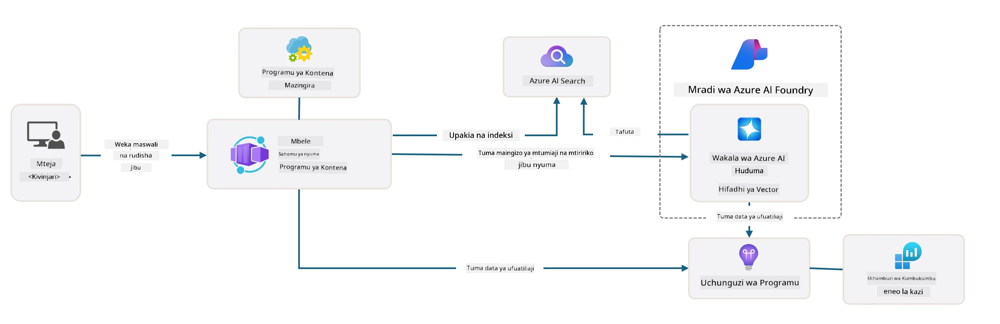

# 3. Kuchanganua Kiolezo

!!! tip "MWISHO WA MODULI HII UTAWEZA"

    - [ ] Washa GitHub Copilot na seva za MCP kwa msaada wa Azure
    - [ ] Fahamu muundo wa folda ya kiolezo cha AZD na vipengele
    - [ ] Chunguza mifumo ya upangaji wa infrastructure-as-code (Bicep)
    - [ ] **Lab 3:** Tumia GitHub Copilot kuchunguza na kuelewa usanifu wa repositori 

---


Kwa templates za AZD na Azure Developer CLI (`azd`) tunaweza kuanza haraka safari yetu ya maendeleo ya AI kwa repositori zilizo sanifu zinazotoa msimbo wa mfano, miundombinu na faili za usanidi - kwa njia ya mradi wa kuanza (_starter_) tayari kwa kutumika.

**Lakini sasa, tunahitaji kuelewa muundo wa mradi na msimbo wa msingi - na kuwa na uwezo wa kubadilisha kiolezo cha AZD - bila uzoefu au uelewa wa AZD awali!**

---

## 1. Washa GitHub Copilot

### 1.1 Sakinisha GitHub Copilot Chat

Ni wakati wa kuchunguza [GitHub Copilot with Agent Mode](https://code.visualstudio.com/docs/copilot/chat/chat-agent-mode). Sasa, tunaweza kutumia lugha ya asili kueleza kazi yetu kwa kiwango cha juu, na kupata msaada katika utekelezaji. Kwa maabara hii, tutatumia the [Copilot Free plan](https://github.com/github-copilot/signup) ambayo ina kikomo cha kila mwezi kwa makamilisho na mwingiliano wa mazungumzo.

Ugani unaweza kusakinishwa kutoka kwenye marketplace, lakini inapaswa tayari kupatikana katika mazingira yako ya Codespaces. _Bonyeza `Open Chat` kutoka kwenye menyu ya ikoni ya Copilot - na andika ombi kama `What can you do?`_ - unaweza kuombwa uingie. **GitHub Copilot Chat iko tayari**.

### 1.2. Sakinisha seva za MCP

Ili Agent mode iwe na ufanisi, inahitaji upatikanaji wa zana sahihi zitaosaidia kupata maarifa au kuchukua hatua. Hapa ndipo seva za MCP zinapoweza kusaidia. Tutasanidi seva zifuatazo:

1. [Seva ya Azure MCP](../../../../../workshop/docs/instructions)
1. [Seva ya Microsoft Docs MCP](../../../../../workshop/docs/instructions)

Ili kuziamsha hizi:

1. Create a file called `.vscode/mcp.json` if it does not exist
1. Nakili yafuatayo ndani ya faili hiyo - na anza seva!
   ```json title=".vscode/mcp.json"
   {
      "servers": {
         "Azure MCP Server": {
            "command": "npx",
            "args": [
            "-y",
            "@azure/mcp@latest",
            "server",
            "start"
            ]
         },
         "microsoft.docs.mcp": {
            "type": "http",
            "url": "https://learn.microsoft.com/api/mcp"
         }
      }
   }
   ```

??? warning "Unaweza kupata kosa kwamba `npx` haijawekwa (bonyeza ili kupanua kwa suluhisho)"

      Ili kurekebisha, fungua faili `.devcontainer/devcontainer.json` na ongeza mstari huu kwenye sehemu ya features. Kisha jenga tena container. Sasa utakuwa na `npx` imewekwa.

      ```title="" linenums="0"
         "features": {
            "ghcr.io/devcontainers/features/node:1": {},
            ...
         },
      ```

---

### 1.3. Jaribu GitHub Copilot Chat

**Kwanza tumia `az login` kuthibitisha na Azure kutoka kwenye command line ya VS Code.**

Sasa utakuwa unaweza kuuliza hali ya subscription ya Azure yako, na kuuliza maswali kuhusu rasilimali zilizowekwa au usanidi. Jaribu maombi haya:

1. `List my Azure resource groups`
1. `#foundry list my current deployments`

Unaweza pia kuuliza maswali kuhusu nyaraka za Azure na kupata majibu yanayotokana na seva ya Microsoft Docs MCP. Jaribu maombi haya:

1. `#microsoft_docs_search What is Azure Developer CLI?`
1. `#microsoft_docs_search Show me a Python tutorial to chat with deployed model`

Au unaweza kuomba snippet za msimbo ili kukamilisha kazi. Jaribu ombi hili.

1. `Give me a Python code example that uses AAD for an interactive chat client`

Katika `Ask` mode, hili litatoa msimbo ambao unaweza kunakili-kubandika na kujaribu. Katika `Agent` mode, hili linaweza kwenda hatua zaidi na kuunda rasilimali zinazofaa kwako - ikiwa ni pamoja na script za usanidi na nyaraka - kukusaidia kutekeleza kazi hiyo.

**Sasa umeandaliwa kuanza kuchunguza kiolezo cha repositori**

---

## 2. Kuchanganua Usanifu

??? prompt "ASK: Elezea usanifu wa programu katika docs/images/architecture.png katika aya 1"

      Programu hii ni programu ya mazungumzo yenye nguvu ya AI iliyojengwa kwenye Azure ambayo inaonyesha usanifu wa kisasa unaotumia agent. Suluhisho linaangazia Azure Container App inayohifadhi msimbo mkuu wa programu, ambayo inashughulikia pembejeo za mtumiaji na kuunda majibu ya bandia kupitia agent wa AI. 
      
      Usanifu unatumia Microsoft Foundry Project kama msingi wa uwezo wa AI, ukijiunga na Azure AI Services ambazo hutoa mifano ya lugha ya msingi (kama gpt-4.1-mini) na utendaji wa agent. Mwingiliano wa watumiaji hupuuzwa kupitia frontend inayotegemea React hadi backend ya FastAPI ambayo inawasiliana na huduma ya agent ya AI kwa ajili ya kuzalisha majibu ya muktadha. 
      
      Mfumo unajumuisha uwezo wa kupata maarifa kupitia utafutaji wa faili au huduma ya Azure AI Search, kuruhusu agent kufikia na kunukuu taarifa kutoka nyaraka zilizopakiwa. Kwa utendaji bora wa uendeshaji, usanifu unajumuisha ufuatiliaji kamili kupitia Application Insights na Log Analytics Workspace kwa ufuatiliaji, uingizaji kumbukumbu, na uboreshaji wa utendaji. 
      
      Azure Storage hutoa uhifadhi wa blob kwa data za programu na upakiaji wa faili, wakati Managed Identity inahakikisha upatikanaji salama kati ya rasilimali za Azure bila kuhifadhi nyaraka za uthibitisho. Suluhisho lote limetengenezwa kwa ajili ya kuongezeka kwa wigo na uendelevu, ambapo programu iliyomo ndani ya container inatoa upanuzi wa kiotomatiki kulingana na mahitaji pamoja na kutoa usalama uliojengwa, ufuatiliaji, na uwezo wa CI/CD kupitia ekosistimu ya huduma zilizosimamiwa za Azure.



---

## 3. Muundo wa Repositori

!!! prompt "ASK: Elezea muundo wa folda ya kiolezo. Anza na mchoro wa muundo wa hierarkia wa kiviualu."

??? info "JIBU: Mchoro wa Muundo wa Hierarkia"

      ```bash title="" 
      get-started-with-ai-agents/
      ├── 📋 Usanidi & Utekelezaji
      │   ├── azure.yaml                    # usanidi wa Azure Developer CLI
      │   ├── docker-compose.yaml           # containers za maendeleo ya eneo la eneo (local development)
      │   ├── pyproject.toml                # usanidi wa mradi wa Python
      │   ├── requirements-dev.txt          # utegemezi wa maendeleo
      │   └── .devcontainer/                # usanidi wa dev container wa VS Code
      │
      ├── 🏗️ Miundombinu (infra/)
      │   ├── main.bicep                    # templeti kuu za miundombinu
      │   ├── api.bicep                     # rasilimali maalum za API
      │   ├── main.parameters.json          # vigezo vya miundombinu
      │   └── core/                         # vipengele vya moduli za miundombinu
      │       ├── ai/                       # usanidi wa huduma za AI
      │       ├── host/                     # miundombinu ya mwenyeji
      │       ├── monitor/                  # ufuatiliaji na uingizaji kumbukumbu
      │       ├── search/                   # usanidi wa Azure AI Search
      │       ├── security/                 # usalama na utambulisho
      │       └── storage/                  # usanidi wa akaunti za uhifadhi
      │
      ├── 💻 Chanzo cha Programu (src/)
      │   ├── api/                          # Backend API
      │   │   ├── main.py                   # kuingia kwa programu ya FastAPI
      │   │   ├── routes.py                 # ufafanuzi wa njia za API
      │   │   ├── search_index_manager.py   # utendakazi wa utafutaji
      │   │   ├── data/                     # usimamizi wa data wa API
      │   │   ├── static/                   # mali za wavuti za static
      │   │   └── templates/                # templeti za HTML
      │   ├── frontend/                     # frontend ya React/TypeScript
      │   │   ├── package.json              # utegemezi wa Node.js
      │   │   ├── vite.config.ts            # usanidi wa ujenzi wa Vite
      │   │   └── src/                      # msimbo wa chanzo cha frontend
      │   ├── data/                         # faili za mfano za data
      │   │   └── embeddings.csv            # embeddings zilizohesabiwa awali
      │   ├── files/                        # faili za hifadhidata ya maarifa
      │   │   ├── customer_info_*.json      # mifano ya data za wateja
      │   │   └── product_info_*.md         # nyaraka za bidhaa
      │   ├── Dockerfile                    # usanidi wa container
      │   └── requirements.txt              # utegemezi wa Python
      │
      ├── 🔧 Otomasishaji & Skripti (scripts/)
      │   ├── postdeploy.sh/.ps1           # usanidi baada ya uenezaji
      │   ├── setup_credential.sh/.ps1     # usanidi wa nyaraka za uthibitisho
      │   ├── validate_env_vars.sh/.ps1    # uhakikisho wa mazingira ya vigezo
      │   └── resolve_model_quota.sh/.ps1  # usimamizi wa quota ya modeli
      │
      ├── 🧪 Upimaji & Tathmini
      │   ├── tests/                        # vipimo vya unit na integration
      │   │   └── test_search_index_manager.py
      │   ├── evals/                        # fremu ya tathmini ya agent
      │   │   ├── evaluate.py               # mwendeshaji wa tathmini
      │   │   ├── eval-queries.json         # maswali ya mtihani
      │   │   └── eval-action-data-path.json
      │   ├── sandbox/                      # uwanja wa majaribio wa maendeleo
      │   │   ├── 1-quickstart.py           # mifano ya kuanza haraka
      │   │   └── aad-interactive-chat.py   # mifano ya uthibitishaji
      │   └── airedteaming/                 # tathmini ya usalama wa AI
      │       └── ai_redteaming.py          # upimaji wa timu ya red
      │
      ├── 📚 Nyaraka (docs/)
      │   ├── deployment.md                 # mwongozo wa ueneaji
      │   ├── local_development.md          # maelekezo ya usanidi wa eneo la eneo
      │   ├── troubleshooting.md            # matatizo ya kawaida & suluhisho
      │   ├── azure_account_setup.md        # mahitaji ya Azure kabla ya kuanza
      │   └── images/                       # mali za nyaraka
      │
      └── 📄 Metadata ya Mradi
         ├── README.md                     # muhtasari wa mradi
         ├── CODE_OF_CONDUCT.md           # miongozo ya jamii
         ├── CONTRIBUTING.md              # mwongozo wa kuchangia
         ├── LICENSE                      # masharti ya leseni
         └── next-steps.md                # mwongozo baada ya ueneaji
      ```

### 3.1. Muundo wa Msingi wa Programu

Kiolezo hiki kinafuata muundo wa **programu ya wavuti ya stack kamili** na:

- **Backend**: Python FastAPI na ujumuishaji wa Azure AI
- **Frontend**: TypeScript/React na mfumo wa ujenzi wa Vite
- **Miundombinu**: templeti za Azure Bicep kwa rasilimali za wingu
- **Uwekaji ndani ya container**: Docker kwa utoaji thabiti

### 3.2 Infra As Code (bicep)

Tabaka la miundombinu linatumia templeti za **Azure Bicep** zilizopangwa kwa moduli:

   - **`main.bicep`**: Inaongoza rasilimali zote za Azure
   - **`core/` modules**: Vipengele vinavyoweza kutumika tena kwa huduma mbalimbali
      - Huduma za AI (Microsoft Foundry Models, AI Search)
      - Ukarabati wa mwenyeji wa container (Azure Container Apps)
      - Ufuatiliaji (Application Insights, Log Analytics)
      - Usalama (Key Vault, Managed Identity)

### 3.3 Chanzo cha Programu (`src/`)

**Backend API (`src/api/`)**:

- API ya REST inayotegemea FastAPI
- Ujumuishaji wa Foundry Agents
- Usimamizi wa index ya utafutaji kwa upatikanaji wa maarifa
- Uwezo wa upakiaji na usindikaji wa faili

**Frontend (`src/frontend/`)**:

- SPA ya kisasa ya React/TypeScript
- Vite kwa maendeleo ya haraka na ujenzi ulioboreshwa
- Kiolesura cha mazungumzo kwa mwingiliano wa agent

**Hifadhidata ya Maarifa (`src/files/`)**:

- Data za mfano za wateja na bidhaa
- Inaonyesha upatikanaji wa maarifa kwa kutumia faili
- Mifano ya muundo wa JSON na Markdown


### 3.4 DevOps & Otomeshaji

**Skripti (`scripts/`)**:

- Skripti za msimbo kwa jukwaa nyingi PowerShell na Bash
- Uhakikisho na usanidi wa mazingira
- Usanidi baada ya ueneaji
- Usimamizi wa quota ya modeli

**Ujumuishaji na Azure Developer CLI**:

- usanidi wa `azure.yaml` kwa workflows za `azd`
- Uundaji na ueneaji otomatiki
- Usimamizi wa vigezo vya mazingira

### 3.5 Upimaji & Udhibiti wa Ubora

**Fremu ya Tathmini (`evals/`)**:

- Tathmini ya utendaji wa agent
- Upimaji wa ubora wa majibu kwa maswali
- Msururu wa tathmini otomatiki

**Usalama wa AI (`airedteaming/`)**:

- Upimaji wa red team kwa usalama wa AI
- Uskanjuzi wa udhaifu wa usalama
- Mazingira ya AI ya kuwajibika

---

## 4. Hongera 🏆

Umetumia kwa mafanikio GitHub Copilot Chat pamoja na seva za MCP, kuchunguza repositori.

- [X] Washa GitHub Copilot kwa Azure
- [X] Umeelewa Muundo wa Programu
- [X] Umechunguza muundo wa kiolezo cha AZD

Hii inakupa wazo la mali za _infrastructure as code_ kwa kiolezo hiki. Ifuatayo, tutaangalia faili ya usanidi ya AZD.

---

<!-- CO-OP TRANSLATOR DISCLAIMER START -->
**Onyo**:
Nyaraka hii imetafsiriwa kwa kutumia huduma ya tafsiri ya AI [Co-op Translator](https://github.com/Azure/co-op-translator). Ingawa tunajitahidi kuhakikisha usahihi, tafadhali fahamu kuwa tafsiri zilizofanywa kwa mashine zinaweza kuwa na makosa au ukosefu wa usahihi. Nyaraka ya asili katika lugha yake inapaswa kuchukuliwa kama chanzo chenye mamlaka. Kwa taarifa muhimu, inapendekezwa kutumia tafsiri ya kitaalamu iliyofanywa na mwanadamu. Hatuwajibiki kwa kutoelewana au tafsiri zisizo sahihi zinazotokana na matumizi ya tafsiri hii.
<!-- CO-OP TRANSLATOR DISCLAIMER END -->