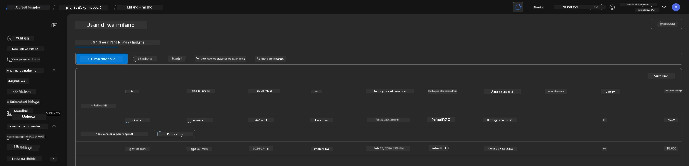
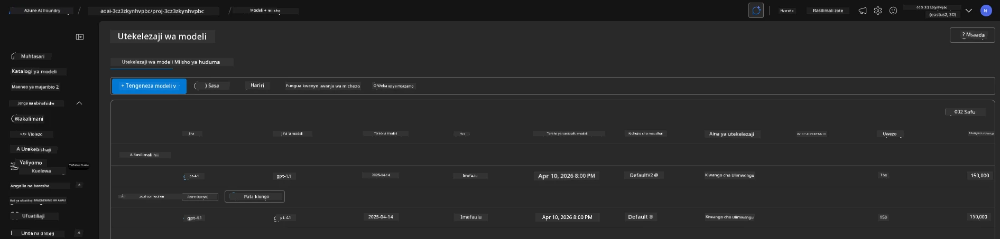

# 6. Kuondoa Miundombinu

!!! tip "MWISHO WA MODULI HII UTAWEZA"

    - [ ] Kuelewa umuhimu wa kusafisha rasilimali na usimamizi wa gharama
    - [ ] Tumia `azd down` kuondoa miundombinu kwa usalama
    - [ ] Rejesha huduma za kognitifa zilizofutwa kwa muda inapohitajika
    - [ ] **Maabara 6:** Safisha rasilimali za Azure na thibitisha uondoaji

---

## Mazoezi ya Ziada

Kabla ya kuondoa mradi, chukua dakika chache kufanya uchunguzi wa wazi.

!!! info "Jaribu Haya Maelekezo ya Uchunguzi"

    **Jaribu GitHub Copilot:**
    
    1. Uliza: `Ni templates gani nyingine za AZD ninaweza kujaribu kwa matukio ya mawakala wengi?`
    2. Uliza: `Ninawezaje kubinafsisha maagizo ya wakala kwa matumizi ya huduma za afya?`
    3. Uliza: `Ni vigezo vya mazingira vinavyodhibiti uboreshaji wa gharama?`
    
    **Chunguza Portal ya Azure:**
    
    1. Kagua vipimo vya Application Insights kwa uanzishaji wako
    2. Angalia uchambuzi wa gharama kwa rasilimali zilizotolewa
    3. Chunguza tena eneo la mchezo la wakala kwenye portal ya Microsoft Foundry

---

## Ondoa Miundombinu

1. Kuondoa miundombinu ni rahisi kama:
      
      ```bash title="" linenums="0"
      azd down --purge
      ```
1. Bendera `--purge` inahakikisha pia inafuta huduma za Cognitive zilizofutwa kwa muda, hivyo kuachilia quota inayoshikiliwa na huduma hizi. Mara baada ya kukamilika utaona kitu kama hiki:
      
      ```bash title="" linenums="0"
      ? Total resources to delete: 11, are you sure you want to continue? Yes
      Deleting your resources can take some time.
      (✓) Done: Deleted resource group rg-nitya-mshack-azd
      (✓) Done: Purging Cognitive Account: aoai-3cz3zkynhvpbc

      SUCCESS: Your application was removed from Azure in 11 minutes 4 seconds.
      ```

1. (Hiari) Ikiwa sasa utaendesha `azd up` tena, utaona mfano gpt-4.1 utawekwa kwani kigezo cha mazingira kilibadilishwa (na kuhifadhiwa) katika saraka ya ndani `.azure`. 

      Hapa kuna uwekaji wa modeli **kabla**:

      

      Na hapa ni **baada**:
      

---

<!-- CO-OP TRANSLATOR DISCLAIMER START -->
Taarifa ya kutokuhusika:
Nyaraka hii imetafsiriwa kwa kutumia huduma ya tafsiri ya AI [Co-op Translator] (https://github.com/Azure/co-op-translator). Ingawa tunajitahidi kuhakikisha usahihi, tafadhali fahamu kwamba tafsiri zilizofanywa kwa njia ya kiotomatiki zinaweza kuwa na makosa au kasoro. Nyaraka ya awali katika lugha yake ya asili inapaswa kuchukuliwa kama chanzo rasmi. Kwa taarifa muhimu, inashauriwa kutumia tafsiri ya mtaalamu wa kibinadamu. Sisi hatuwajibiki kwa kutokuelewana au tafsiri isiyo sahihi zinazotokana na matumizi ya tafsiri hii.
<!-- CO-OP TRANSLATOR DISCLAIMER END -->