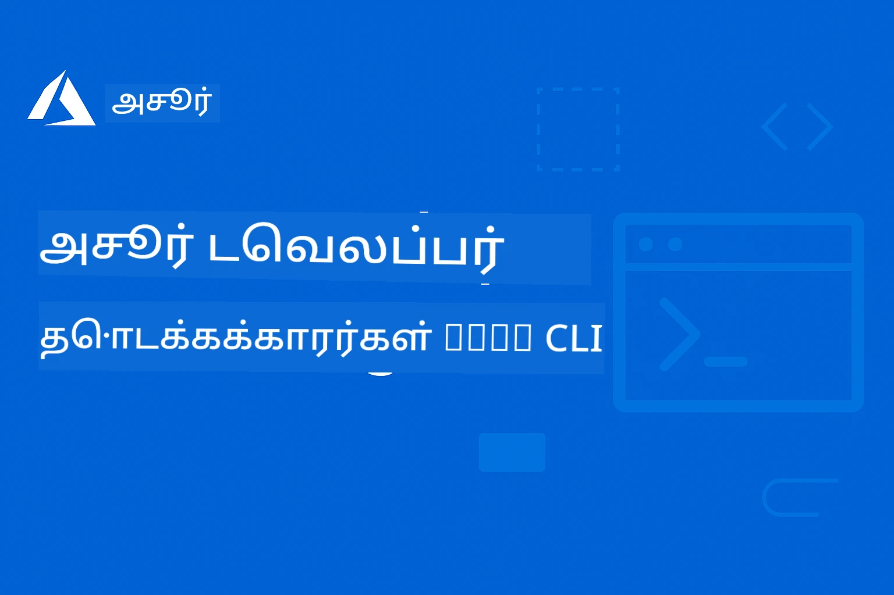

<!--
CO_OP_TRANSLATOR_METADATA:
{
  "original_hash": "068c87cc2641a81ca353ad7064ff326a",
  "translation_date": "2026-01-01T21:24:29+00:00",
  "source_file": "README.md",
  "language_code": "ta"
}
-->
# AZD தொடக்கக்காரர்களுக்கு: கட்டமைக்கப்பட்ட கற்றல் பயணம்

 

[](https://GitHub.com/microsoft/azd-for-beginners/watchers/)
[](https://GitHub.com/microsoft/azd-for-beginners/network/)
[](https://GitHub.com/microsoft/azd-for-beginners/stargazers/)

[](https://discord.gg/microsoft-azure)
[](https://discord.gg/nTYy5BXMWG)

## இந்த பாடநெறியை தொடங்குவது எப்படி

AZD கற்றல் பயணத்தைத் தொடங்க இந்த படிகளை பின்பற்றவும்:

1. **கிட் репோ-வை Fork செய்**: Click [](https://GitHub.com/microsoft/azd-for-beginners/fork)
2. **репோவை Clone செய்க**: `git clone https://github.com/microsoft/azd-for-beginners.git`
3. **கணுகும்பொது சேரவும்**: நிபுணர் ஆதரவுக்காக [Azure Discord Communities](https://discord.com/invite/ByRwuEEgH4)
4. **உங்கள் கற்றல் பாதையை தேர்வு செய்க**: உங்கள் அனுபவ நிலைக்கு பொருத்தமான அத்தியாயத்தைத் தேர்ந்தெடுக்கவும்

### பல்மொழி ஆதரவு

#### தானியங்கி மொழிபெயர்ப்புகள் (எப்போதும் புதுப்பிக்கப்பட்டவை)

<!-- CO-OP TRANSLATOR LANGUAGES TABLE START -->
[அரபு](../ar/README.md) | [பெங்காலி](../bn/README.md) | [பல்கேரியன்](../bg/README.md) | [புர்மீஸ் (மியான்மார்)](../my/README.md) | [சீனம் (சுருக்கப்பட்ட)](../zh/README.md) | [சீனம் (பாரம்பரிய, ஹொங்க் கொங்)](../hk/README.md) | [சீனம் (பாரம்பரிய, மகாவ்)](../mo/README.md) | [சீனம் (பாரம்பரிய, தைவான்)](../tw/README.md) | [குரோஷியன்](../hr/README.md) | [செக்](../cs/README.md) | [டேனிஷ்](../da/README.md) | [டச்சு](../nl/README.md) | [எஸ்தோனியன்](../et/README.md) | [பினிஷ்](../fi/README.md) | [பிரெஞ்சு](../fr/README.md) | [ஜெர்மன்](../de/README.md) | [கிரேக்கம்](../el/README.md) | [இப்ரேயு](../he/README.md) | [ஹிந்தி](../hi/README.md) | [ஹங்கேரியன்](../hu/README.md) | [இந்தோனேஷியன்](../id/README.md) | [இத்தாலியன்](../it/README.md) | [ஜப்பானீஸ்](../ja/README.md) | [ಕನ್ನಡ](../kn/README.md) | [கொரியன்](../ko/README.md) | [லிதுவேனியன்](../lt/README.md) | [மலாய்](../ms/README.md) | [മലയാളം](../ml/README.md) | [மராத்தி](../mr/README.md) | [நேபாளி](../ne/README.md) | [நைஜீரியன் பிட்ஜின்](../pcm/README.md) | [நார்வேஜியன்](../no/README.md) | [பேர்ஷியன் (பார்சி)](../fa/README.md) | [போலிஷ்](../pl/README.md) | [போர்ச்சுகீஸ் (பிரேசில்)](../br/README.md) | [போர்ச்சுகீஸ் (போர்ச்சுங்கல்)](../pt/README.md) | [பஞ்சாபி (குர்முகி)](../pa/README.md) | [ரோமானியன்](../ro/README.md) | [ரஷ்யன்](../ru/README.md) | [செர்பியன் (சைரிலிக்)](../sr/README.md) | [ஸ்லோவாக்](../sk/README.md) | [ஸ்லோவேனியன்](../sl/README.md) | [ஸ்பானிஷ்](../es/README.md) | [ஸ்வாஹிலி](../sw/README.md) | [ஸ்வீடிஷ்](../sv/README.md) | [தகாலோகோ (பிலிப்பீனோ)](../tl/README.md) | [தமிழ்](./README.md) | [తెలుగు](../te/README.md) | [தை](../th/README.md) | [டர்கிஷ்](../tr/README.md) | [உக்ரைனியன்](../uk/README.md) | [உருது](../ur/README.md) | [வியட்நாமீஸ்](../vi/README.md)
<!-- CO-OP TRANSLATOR LANGUAGES TABLE END -->

## பாடநெறி மேலோட்டம்

சீரமைக்கப்பட்ட அத்தியாயங்கள் மூலம் Azure Developer CLI (azd) -ஐ ஆழமாக கற்றுக்கொள்ளுங்கள். **Microsoft Foundry ஒருங்கிணைப்புடன் AI பயன்பாட்டு வெளியீட்டில் சிறப்பு கவனம்.**

### இப்பாடநெறி நவீன டெவலப்பர்களுக்கு ஏன் அவசியம்

Microsoft Foundry Discord community தகவல்களின் அடிப்படையில், **டெவலப்பர்களின் 45% AZD-ஐ AI பணிகளுக்காக பயன்படுத்த விரும்புகிறார்கள்** ஆனால் கீழ்காணும் சவால்களை எதிர்கொள்கிறார்கள்:
- சிக்கலான பல-சேவை AI கட்டமைப்புகள்
- உற்பத்தி AI வெளியீட்டிற்கான சிறந்த நடைமுறைகள்  
- Azure AI சேவை ஒருங்கிணைப்பு மற்றும் கட்டமைப்பு
- AI பணிகளுக்கான செலவு மேம்பாடு
- AI-கூடையான வெளியீட்டு பிழைகள் நீக்குதல்

### கற்றல் குறிக்கோள்கள்

இந்த கட்டமைக்கப்பட்ட பாடநெறியை முடித்த பிறகு, நீங்கள்:
- **AZD அடிப்படைகள்**: முக்கியக் கோட்பாடுகள், நிறுவல் மற்றும் கட்டமைப்பு
- **AI பயன்பாடுகளை வெளியிடுதல்**: Microsoft Foundry சேவைகளுடன் AZD பயன்படுத்துதல்
- **Infrastructure as Code நடைமுறைப்படுத்தல்**: Bicep டெம்ப்ளேட்டுகளால் Azure வளங்களை நிர்வகித்தல்
- **பயிற்சிப் பிரச்சினைகளை தீர்க்கல்**: பொதுவான சிக்கல்களையும் பிழைத் துடைப்பையும் தீர்க்கக் கல்வி
- **உற்பத்திக்காக மேம்படுத்தல்**: பாதுகாப்பு, அளவீடு, கண்காணிப்பு மற்றும் செலவுக் கட்டுப்பாடு
- **பல-ஏஜென்ட் தீர்வுகளை உருவாக்குதல்**: சிக்கலான AI கட்டமைப்புகளை வெளியிடுதல்

## 📚 கற்றல் அத்தியாயங்கள்

*உங்கள் அனுபவம் மற்றும் இலக்குக்கு ஏற்ப கற்றல் பாதையைத் தேர்ந்தெடுக்கவும்*

### 🚀 அத்தியாயம் 1: அடித்தளம் & விரைவு தொடக்கம்
**முன் நிபந்தனைகள்**: Azure subscription, அடிப்படை கட்டளை வரிசை அறிவு  
**காலம்**: 30-45 நிமிடங்கள்  
**சிக்கல்தன்மை**: ⭐

#### நீங்கள் கற்றுக்கொள்ளப்போகும் விஷயங்கள்
- Azure Developer CLI அடிப்படைகளை புரிந்துகொள்ளுதல்
- உங்கள் 플랫폼ில் AZD நிறுவுதல்
- உங்கள் முதல் வெற்றிகரமான வெளியீடு

#### கற்றல் வளங்கள்
- **🎯 இங்கிருந்து தொடங்கவும்**: [What is Azure Developer CLI?](../..)
- **📖 கோட்பாடு**: [AZD Basics](docs/getting-started/azd-basics.md) - முக்கியக் கருத்துகள் மற்றும் சொற்பொருள்
- **⚙️ அமைப்பு**: [Installation & Setup](docs/getting-started/installation.md) - தளம்-சார் வழிகாட்டிகள்
- **🛠️ நடைமுறை**: [Your First Project](docs/getting-started/first-project.md) - படி படியாக பயிற்சி
- **📋 விரைவு குறிப்பு**: [Command Cheat Sheet](resources/cheat-sheet.md)

#### நடைமுறை பயிற்சிகள்
```bash
# விரைவு நிறுவல் சோதனை
azd version

# உங்கள் முதல் பயன்பாட்டை வெளியிடுங்கள்
azd init --template todo-nodejs-mongo
azd up
```

**💡 அத்தியாய முடிவு**: AZD பயன்படுத்தி ஒரு சாதாரண வலை பயன்பாட்டை Azure-க்கு வெற்றிகரமாக வெளியிடுதல்

**✅ வெற்றியின் சரிபார்ப்பு:**
```bash
# அத்தியாயம் 1 முடித்த பிறகு, நீங்கள் இதைச் செய்யக்கூடியிருப்பீர்கள்:
azd version              # நிறுவப்பட்ட பதிப்பை காட்டுகிறது
azd init --template todo-nodejs-mongo  # திட்டத்தை ஆரம்பிக்கிறது
azd up                  # Azure-க்கு வெளியிடுகிறது
azd show                # ஓடிக் கொண்டிருக்கும் பயன்பாட்டின் URL-ஐ காட்டுகிறது
# பயன்பாடு உலாவியில் திறக்கப்படுகிறது மற்றும் செயல்படுகிறது
azd down --force --purge  # வளங்களை சுத்தம் செய்கிறது
```

**📊 நேர முதலீடு:** 30-45 நிமிடங்கள்  
**📈 பின்னர் திறன் நிலை:** அடிப்படை பயன்பாடுகளை தனியாயமாக வெளியிடக்கூடிய திறன்

**✅ வெற்றியின் சரிபார்ப்பு:**
```bash
# அத்தியாயம் 1 ஐ முடித்தவுடன், நீங்கள் இதைச் செய்யக்கூடியவராக இருக்க வேண்டும்:
azd version              # நிறுவப்பட்ட பதிப்பை காட்டுகிறது
azd init --template todo-nodejs-mongo  # திட்டத்தை ஆரம்பிக்கிறது
azd up                  # Azure-க்கு வெளியிடுகிறது
azd show                # இயங்கும் செயலியின் URL ஐ காட்டுகிறது
# பயன்பாடு உலாவியில் திறந்து செயல்படுகிறது
azd down --force --purge  # வளங்களை சுத்தம் செய்கிறது
```

**📊 நேர முதலீடு:** 30-45 நிமிடங்கள்  
**📈 பின்னர் திறன் நிலை:** அடிப்படை பயன்பாடுகளை தனியாயமாக வெளியிடக்கூடிய திறன்

---

### 🤖 அத்தியாயம் 2: AI-முதன்மை மேம்பாடு (AI டெவலப்பர்களுக்கான பரிந்துரை)
**முன் நிபந்தனைகள்**: அத்தியாயம் 1 முடிக்கப்பட்டது  
**காலம்**: 1-2 மணி நேரம்  
**சிக்கல்தன்மை**: ⭐⭐

#### நீங்கள் கற்றுக்கொள்ளப்போகும் விஷயங்கள்
- Microsoft Foundry ஒருங்கிணைப்பு AZD-துடன்
- AI இயல்புடைய பயன்பாடுகளை வெளியிடுதல்
- AI சேவை கட்டமைப்புகளைப் புரிந்துகொள்ளுதல்

#### கற்றல் வளங்கள்
- **🎯 இங்கிருந்து தொடங்கவும்**: [Microsoft Foundry Integration](docs/microsoft-foundry/microsoft-foundry-integration.md)
- **📖 மாதிரிகள்**: [AI Model Deployment](docs/microsoft-foundry/ai-model-deployment.md) - AI மாதிரிகளை வெளியிட்டு நிர்வகிக்கும் வழிமுறைகள்
- **🛠️ ஒருங்கற்கையியல் பயிற்சி**: [AI Workshop Lab](docs/microsoft-foundry/ai-workshop-lab.md) - உங்கள் AI தீர்வுகளை AZD-க்கு தயார்செய்
- **🎥 இணையவழி வழிகாட்டி**: [Workshop Materials](workshop/README.md) - MkDocs * DevContainer சூழலில் உலாவி அடிப்படையிலான கற்கை
- **📋 டெம்ப்ளேட்டுகள்**: [Microsoft Foundry Templates](../..)
- **📝 உதாரணங்கள்**: [AZD Deployment Examples](examples/README.md)

#### நடைமுறை பயிற்சிகள்
```bash
# உங்கள் முதல் செயற்கை நுண்ணறிவு செயலியை அமர்த்தவும்
azd init --template azure-search-openai-demo
azd up

# கூடுதல் செயற்கை நுண்ணறிவு வார்ப்புருக்களை முயற்சி செய்யவும்
azd init --template openai-chat-app-quickstart
azd init --template agent-openai-python-prompty
```

**💡 அத்தியாய முடிவு**: RAG திறன் கொண்ட AI-இயல்புடைய உரையாடல் பயன்பாட்டை வெளியிட்டு கட்டமைத்தல்

**✅ வெற்றியின் சரிபார்ப்பு:**
```bash
# அத்தியாயம் 2 முடிந்தபின், நீங்கள் பின்வரும் செயல்களை செய்யக் கூடியவராக இருக்கும்:
azd init --template azure-search-openai-demo
azd up
# AI அரட்டை இடைமுகத்தை சோதிக்கவும்
# கேள்விகள் கேட்டு, மூலங்களுடன் AI-ஆல் இயங்கும் பதில்களைப் பெறவும்
# தேடல் ஒருங்கிணைப்பு செயல்படுவதைக் சரிபார்க்கவும்
azd monitor  # Application Insights டெலிமெட்ரியை காண்பிக்கிறது என்பதைச் சரிபார்க்கவும்
azd down --force --purge
```

**📊 நேர முதலீடு:** 1-2 மணி நேரம்  
**📈 பின்னர் திறன் நிலை:** உற்பத்தி-தயார் AI பயன்பாடுகளை வெளியிட்டு கட்டமைக்கவல்லது  
**💰 செலவு விழிப்புணர்வு:** $80-150/மாதம் (வளர்ச்சி), $300-3500/மாதம் (உற்பத்தி) என்று மதிப்பீடு

#### 💰 AI வெளியீட்டிற்கான செலவு கருதுகோல்கள்

**வளர்ச்சி சூழல் (அனுமானம் $80-150/மாதம்):**
- Azure OpenAI (Pay-as-you-go): $0-50/மாதம் (டோக்கன் பயன்பாட்டின் படி)
- AI Search (Basic tier): $75/மாதம்
- Container Apps (Consumption): $0-20/மாதம்
- Storage (Standard): $1-5/மாதம்

**உற்பத்தி சூழல் (அனுமானம் $300-3,500+/மாதம்):**
- Azure OpenAI (PTU for consistent performance): $3,000+/மாதம் அல்லது அதிக அளவின் போது Pay-as-you-go
- AI Search (Standard tier): $250/மாதம்
- Container Apps (Dedicated): $50-100/மாதம்
- Application Insights: $5-50/மாதம்
- Storage (Premium): $10-50/மாதம்

**💡 செலவு மேம்பாட்டு குறிப்புகள்:**
- கற்றலுக்கு **Free Tier** Azure OpenAI-வை பயன்படுத்தவும் (50,000 டோக்கன்கள்/மாதம் சேர்க்கப்பட்டுள்ளது)
- நடவடிக்கை இல்லாதபோது வளங்களை நீக்க `azd down` இயக்கவும்
- துவக்கத்தில் consumption-அடிப்படையிலான பிலிங்கைப் பயன்படுத்தவும், உற்பத்திக்காக மட்டும் PTU-க்கு மேம்படுத்தவும்
- வெளியீட்டிற்கு முன் செலவுகளை மதிப்பிட `azd provision --preview` ஐ இயக்கவும்
- தானாக அளவிடுதலை செயல்படுத்தவும்: செயல்பாட்டிற்கே மட்டுமே செலவு செலுத்துங்கள்

**செலவு கண்காணிப்பு:**
```bash
# மாதாந்திர மதிப்பிடப்பட்ட செலவுகளை சரிபார்க்கவும்
azd provision --preview

# Azure போர்டலில் உண்மையான செலவுகளை கண்காணிக்கவும்
az consumption budget list --resource-group <your-rg>
```

---

### ⚙️ அத்தியாயம் 3: கட்டமைப்பு & அங்கீகாரம்
**முன் நிபந்தனைகள்**: அத்தியாயம் 1 முடிக்கப்பட்டது  
**காலம்**: 45-60 நிமிடங்கள்  
**சிக்கல்தன்மை**: ⭐⭐

#### நீங்கள் கற்றுக்கொள்ளப்போகும் விஷயங்கள்
- சூழல் கட்டமைப்பு மற்றும் நிர்வாகம்
- அங்கீகாரம் மற்றும் பாதுகாப்பு சிறந்த நடைமுறைகள்
- வள பெயரிடல் மற்றும் அமைப்பு

#### கற்றல் வளங்கள்
- **📖 கட்டமைப்பு**: [Configuration Guide](docs/getting-started/configuration.md) - சூழல் அமைப்பு
- **🔐 பாதுகாப்பு**: [Authentication patterns and managed identity](docs/getting-started/authsecurity.md) - அங்கீகாரம் மாதிரிகள்
- **📝 உதாரணங்கள்**: [Database App Example](examples/database-app/README.md) - AZD தரவுத்தள உதாரணங்கள்

#### நடைமுறை பயிற்சிகள்
- பல சூழல்களை கட்டமைக்கவும் (dev, staging, prod)
- managed identity அங்கீகாரத்தை அமைக்கவும்
- சூழல்-சார்ந்த கட்டமைப்புகளை நடைமுறைப்படுத்தவும்

**💡 அத்தியாய முடிவு**: சரியான அங்கீகாரம் மற்றும் பாதுகாப்புடன் பல சூழல்களை நிர்வகிக்க இயலும்

---

### 🏗️ அத்தியாயம் 4: Infrastructure as Code & வெளியீடு
**முன் நிபந்தனைகள்**: அத்தியாயங்கள் 1-3 முடிக்கப்பட்டவை  
**காலம்**: 1-1.5 மணி நேரம்  
**சிக்கல்தன்மை**: ⭐⭐⭐

#### நீங்கள் கற்றுக்கொள்ளப்போகும் விஷயங்கள்
- மேம்பட்ட வெளியீட்டு மாதிரிகள்
- Bicep உடன் Infrastructure as Code
- வள வழங்கல் மூலோபாயங்கள்

#### கற்றல் வளங்கள்
- **📖 வெளியீடு**: [Deployment Guide](docs/deployment/deployment-guide.md) - முழு வேலைதிட்டங்கள்
- **🏗️ வழங்கல்**: [Provisioning Resources](docs/deployment/provisioning.md) - Azure வள நிர்வாகம்
- **📝 உதாரணங்கள்**: [Container App Example](../../examples/container-app) - கண்டெய்னரைஸ் செய்யப்பட்ட வெளியீடுகள்

#### நடைமுறை பயிற்சிகள்
- தனிப்பயன் Bicep டெம்ப்ளேட்டுகளை உருவாக்கவும்
- பல-சேவை பயன்பாடுகளை வெளியிடவும்
- blue-green வெளியீட்டு மூலோபாயங்களை நடைமுறைப்படுத்தவும்

**💡 அத்தியாய முடிவு**: தனிப்பயன் உள்ளமைவு டெம்ப்ளேட்டுகளை பயன்படுத்தி சிக்கலான பல-சேவை பயன்பாடுகளை வெளியிட முடியும்

---

### 🎯 அத்தியாயம் 5: பல-ஏஜென்ட் AI தீர்வுகள் (உயர்ந்த)
**முன் நிபந்தனைகள்**: அத்தியாயங்கள் 1-2 முடிக்கப்பட்டவை  
**காலம்**: 2-3 மணி நேரம்  
**சிக்கல்தன்மை**: ⭐⭐⭐⭐

#### நீங்கள் கற்றுக்கொள்ளப்போகும் விஷயங்கள்
- பல-ஏஜென்ட் கட்டமைப்பு மாதிரிகள்
- ஏஜென்ட் ஒழுங்குபடுத்தல் மற்றும் இணைப்பு
- உற்பத்தி-தயார் AI வெளியீடுகள்

#### கற்றல் வளங்கள்
- **🤖 பிரதான 프로젝트**: [Retail Multi-Agent Solution](examples/retail-scenario.md) - முழுமையான செயல்படுத்தல்
- **🛠️ ARM Templates**: [ARM Template Package](../../examples/retail-multiagent-arm-template) - ஒரே கிளிக் நிறுவல்
- **📖 Architecture**: [பல முகவர் ஒருங்கிணைப்பு முறைப்படிகள்](/docs/pre-deployment/coordination-patterns.md) - முறைப்படிகள்

#### Practical Exercises
```bash
# முழுமையான சில்லறை பல முகவர்கள் கொண்ட தீர்வை நிறுவவும்
cd examples/retail-multiagent-arm-template
./deploy.sh

# முகவர் கட்டமைப்புகளை ஆராயவும்
az deployment group show --resource-group <rg-name> --name <deployment-name>
```

**💡 Chapter Outcome**: வாடிக்கையாளர் மற்றும் சரக்கு முகவர்களைக் கொண்ட உற்பத்திக்கு-தயார் பல முகவர் AI தீர்வை நிறுவி நிர்வகித்தல்

---

### 🔍 Chapter 6: முன்-பதிவேற்றச் சரிபார்ப்பு மற்றும் திட்டமிடல்
**Prerequisites**: அத்தியாயம் 4 முடிக்கப்பட்டது  
**Duration**: 1 மணிநேரம்  
**Complexity**: ⭐⭐

#### What You'll Learn
- திறன் திட்டமிடல் மற்றும் வளச் சரிபார்ப்பு
- SKU தேர்வு நெறிமுறைகள்
- முன்னோக்கு சோதனைகள் மற்றும் தானியக்கம்

#### Learning Resources
- **📊 Planning**: [திறன் திட்டமிடல்](docs/pre-deployment/capacity-planning.md) - வளச் சரிபார்ப்பு
- **💰 Selection**: [SKU தேர்வு](docs/pre-deployment/sku-selection.md) - செலவுக்கு உகந்த தேர்வுகள்
- **✅ Validation**: [முன்-டெப்ளாய்மென்ட் சோதனைகள்](docs/pre-deployment/preflight-checks.md) - தானியக்க ஸ்கிரிப்ட்கள்

#### Practical Exercises
- திறன் சரிபார்ப்பு ஸ்கிரிப்ட்களை இயக்கவும்
- செலவினத்தை குறைப்பதற்காக SKU தேர்வுகளை மேம்படுத்தவும்
- தானியக்க முன்-டெப்ளாய்மென்ட் சோதனைகளை செயல்படுத்தவும்

**💡 Chapter Outcome**: நிறைவேற்றத்திற்கு முன் பதிவேற்றங்களைச் சரிபார்க்கவும் மற்றும் மேம்படுத்தவும்

---

### 🚨 Chapter 7: பிரச்சனைத் தீர்வு & பிழைத் திருத்தல்
**Prerequisites**: எந்த ஒரு பதிவேற்ற அத்தியாயமும் முடிந்திருக்க வேண்டும்  
**Duration**: 1-1.5 மணிநேரம்  
**Complexity**: ⭐⭐

#### What You'll Learn
- ஒழுங்கமைவான பிழைதிருத்து அணுகுமுறைகள்
- சாதாரண பிரச்சனைகள் மற்றும் தீர்வுகள்
- AI-சார்ந்த பிரச்சனை தீர்வு

#### Learning Resources
- **🔧 Common Issues**: [சாதாரண பிரச்சனைகள்](docs/troubleshooting/common-issues.md) - அடிக்கடி கேட்கப்படும் கேள்விகள் மற்றும் தீர்வுகள்
- **🕵️ Debugging**: [பிழைதிருத்தக் கையேடு](docs/troubleshooting/debugging.md) - படிநடை முறைகள்
- **🤖 AI Issues**: [AI-சார்ந்த பிரச்சனை தீர்வு](docs/troubleshooting/ai-troubleshooting.md) - AI சேவை பிரச்சனைகள்

#### Practical Exercises
- பதிவேற்ற தோல்விகளை கண்டறியவும்
- அங்கீகார பிரச்சனைகளைத் தீர்க்கவும்
- AI சேவை இணைப்பு பிழைகளை பிழைதிருத்தவும்

**💡 Chapter Outcome**: சுயமாக பொதுவான பதிவேற்ற பிரச்சனைகளை கண்டறிந்து தீர்க்கும் திறன்

---

### 🏢 Chapter 8: உற்பத்தி மற்றும் நிறுவன முறைப்படிகள்
**Prerequisites**: அத்தியாயங்கள் 1-4 முடிக்கப்பட்டிருக்க வேண்டும்  
**Duration**: 2-3 மணிநேரம்  
**Complexity**: ⭐⭐⭐⭐

#### What You'll Learn
- உற்பத்தி பதிவேற்றி உத்திகள்
- நிறுவனப் பாதுகாப்பு முறைப்படிகள்
- மேற்பார்வை மற்றும் செலவுக் குறைத்தல்

#### Learning Resources
- **🏭 Production**: [உற்பத்தி AI சிறந்த நடைமுறைகள்](docs/microsoft-foundry/production-ai-practices.md) - நிறுவன முறைப்படிகள்
- **📝 Examples**: [மைக்ரோசர்வீசஸ் உதாரணம்](../../examples/microservices) - சிக்கலான கட்டமைப்புகள்
- **📊 Monitoring**: [Application Insights இணைப்பு](docs/pre-deployment/application-insights.md) - மேற்பார்வை

#### Practical Exercises
- நிறுவனப் பாதுகாப்பு முறைப்படிகளை நடைமுறைப்படுத்தவும்
- பூரணமான மேற்பார்வையை அமைக்கவும்
- சரியான ஆளுமையுடன் உற்பத்திக்கு பதிவேற்றவும்

**💡 Chapter Outcome**: முழு உற்பத்தி திறன்களுடன் நிறுவன-தயார் பயன்பாடுகளை பதிவேற்றுதல்

---

## 🎓 Workshop Overview: கையால் செய்யும் கற்றல் அனுபவம்

> **⚠️ WORKSHOP STATUS: செயலில் உருவாக்கம்**  
> பயிற்சி வளங்கள் தற்போது உருவாக்கம் மற்றும் நுட்பப்படுத்தப்படுகின்றன. முக்கிய தொகுதிகள் செயல்பாட்டில் உள்ளன, ஆனால் சில மேம்பட்ட பிரிவுகள் முழுமையல்ல. அனைத்து உள்ளடக்கங்களையும் முடிக்க நாங்கள் செயலில் முயற்சி செய்கிறோம். [முன்னேற்றத்தை கண்காணிக்க →](workshop/README.md)

### தொடர்பாடும் பயிற்சி வளங்கள்
**உலாவி அடிப்படையிலான கருவிகளோடு வழிகாட்டப்பட்ட பயிற்சிகள் மூலம் விரிவான கைபயிற்சி கற்றல்**

எங்கள் பயிற்சி வளங்கள் மேலே உள்ள அத்தியாய-அடிப்படையிலான பாடத்திட்டத்தை ஆதரிக்கக் கூடிய கட்டமைக்கப்பட்ட, தொடர்பாடும் கற்றல் அனுபவத்தை வழங்குகின்றன. பயிற்சி தானிக்கான கற்றலும் பயிற்றுநர் முன்னிலையில் நடத்தும் அமர்வுகளும் இரண்டிற்கும் வடிவமைக்கப்பட்டுள்ளது.

#### 🛠️ Workshop Features
- **Browser-Based Interface**: தேடல், நகல் மற்றும் தீம் அம்சங்களுடன் முழுமையான MkDocs-ஆல் இயக்கப்படும் பயிற்சி
- **GitHub Codespaces Integration**: ஒரே கிளிக்கில் டெவலப்பர் சூழலை அமைத்தல்
- **Structured Learning Path**: 7 படி வழிகாட்டப்பட்ட பயிற்சிகள் (மொத்தம் 3.5 மணி)
- **Discovery → Deployment → Customization**: முன்னேறும் செயல்முறை
- **Interactive DevContainer Environment**: முன்-கட்டமைக்கப்பட்ட கருவிகள் மற்றும் சார்புகள்

#### 📚 Workshop Structure
The workshop follows a **Discovery → Deployment → Customization** methodology:

1. **Discovery Phase** (45 mins)
   - Microsoft Foundry டெம்ப்ளேட்டுகள் மற்றும் சேவைகளை ஆராய்ந்து பார்க்கவும்
   - பல முகவர் கட்டமைப்பு முறைப்படிகளைப் புரிந்துகொள்ளவும்
   - பதிவேற்ற தேவைகள் மற்றும் முன் நிபந்தனைகளை ஆய்வு செய்யவும்

2. **Deployment Phase** (2 hours)
   - AZD மூலம் AI பயன்பாடுகளை கைபயிற்சி முறையில் பதிவேற்றுதல்
   - Azure AI சேவைகள் மற்றும் endpoints ஐ கட்டமைக்கவும்
   - பாதுகாப்பு மற்றும் அங்கீகார முறைப்படிகளை செயல்படுத்தவும்

3. **Customization Phase** (45 mins)
   - குறிப்பிட்ட பயன்பாட்டு உபயோகங்களுக்கு செயலிகளை மாற்றவும்
   - உற்பத்தி பதிவேற்றத்திற்கு உடன்படும்படி ஒப்புமையாக்கவும்
   - மேற்பார்வை மற்றும் செலவு மேலாண்மையை நடைமுறைப்படுத்தவும்

#### 🚀 Getting Started with the Workshop
```bash
# விருப்பம் 1: GitHub Codespaces (பரிந்துரைக்கப்பட்டது)
# களஞ்சியத்தில் "Code" → "Create codespace on main" என்பதை கிளிக் செய்யவும்

# விருப்பம் 2: உள்ளூர் அபிவிருத்தி
git clone https://github.com/microsoft/azd-for-beginners.git
cd azd-for-beginners/workshop
# workshop/README.md இல் உள்ள அமைப்பு வழிமுறைகளை பின்பற்றவும்
```

#### 🎯 Workshop Learning Outcomes
By completing the workshop, participants will:
- **Deploy Production AI Applications**: Microsoft Foundry சேவைகளுடன் AZD ஐ பயன்படுத்தி
- **Master Multi-Agent Architectures**: ஒருங்கிணைக்கப்பட்ட AI முகவர் தீர்வுகளை செயல்படுத்துதல்
- **Implement Security Best Practices**: அங்கீகாரமும் அணுகல் கட்டுப்பாடுகளையும் அமைத்தல்
- **Optimize for Scale**: செலவு-திறனான மற்றும் உயர் செயல்திறன் உடைய பதிவேற்றங்களை வடிவமைத்தல்
- **Troubleshoot Deployments**: பொதுவான பிரச்சனைகளை சுயமாக தீர்க்குதல்

#### 📖 Workshop Resources
- **🎥 Interactive Guide**: [பயிற்சி வளங்கள்](workshop/README.md) - உலாவி அடிப்படையிலான கற்றல் சூழல்
- **📋 Step-by-Step Instructions**: [வழிகாட்டப்பட்ட பயிற்சிகள்](../../workshop/docs/instructions) - விரிவான நடைமுறை விளக்கங்கள்
- **🛠️ AI Workshop Lab**: [AI Workshop Lab](docs/microsoft-foundry/ai-workshop-lab.md) - AI மையமான பயிற்சிகள்
- **💡 Quick Start**: [பயிற்சி அமைப்பு கையேடு](workshop/README.md#quick-start) - சூழல் உள்ளமைவு

**Perfect for**: நிறுவன பயிற்சி, பல்கலைக் கோர்ஸுகள், தன்னிச்சையான கற்றல் மற்றும் டெவலப்பர் பூட்கேம்புகள்.

---

## 📖 What is Azure Developer CLI?

Azure Developer CLI (azd) என்பது அபிவிருத்தியாளர்களுக்கான கட்டளை வரிசை இடைமுகமாகும், இது Azureக்கு பயன்பாடுகளை உருவாக்கி பதிவேற்றும் செயல்முறையை வேகப்படுத்துகிறது. இது வழங்குகிறது:

- **Template-based deployments** - பொதுவான பயன்பாட்டு முறைப்படிகளுக்கு முன்-உருவாக்கப்பட்ட டெம்ப்ளேட்டுகளை பயன்படுத்துதல்
- **Infrastructure as Code** - Bicep அல்லது Terraform பயன்படுத்தி Azure வளங்களை நிர்வகிக்கலாம்  
- **Integrated workflows** - பயன்பாடுகளை இடையின்றி வழங்கி, பதிவேற்று, மற்றும் கண்காணிக்க ஒருங்கிணைந்த வேலைப் பயன்பாடுகள்
- **Developer-friendly** - அபிவிருத்தியாளர்களின் செயல்திறனுக்கும் அனுபவத்திற்கும் உகந்த வகையில் சிறப்பாக்கப்பட்டது

### **AZD + Microsoft Foundry: Perfect for AI Deployments**

**Why AZD for AI Solutions?** AZD AI அபிவிருத்தியாளர்கள் எதிர்நோக்கும் முக்கிய சவால்களை தீர்க்கிறது:

- **AI-Ready Templates** - Azure OpenAI, Cognitive Services, மற்றும் ML பணிகளுக்கான முன்-கட்டமைக்கப்பட்ட டெம்ப்ளேட்டுகள்
- **Secure AI Deployments** - AI சேவைகள், API விசைகள் மற்றும் மாதிரி endpoints க்கான உட்பொதி பாதுகாப்பு முறைப்படிகள்  
- **Production AI Patterns** - விரிவாக்கக்கூடிய, செலவு-திறனான AI பயன்பாட்டு பதிவேற்றங்களுக்கு சிறந்த நடைமுறைகள்
- **End-to-End AI Workflows** - மாதிரி உருவாக்கத்திலிருந்து உற்பத்தி பதிவேற்றம் வரை சரியான கண்காணிப்புடன்
- **Cost Optimization** - AI பணிகளுக்கான புத்திசாலித்தனமான வள ஒதுக்கீடு மற்றும் ஸ்கேலிங் நெறிமுறைகள்
- **Microsoft Foundry Integration** - Microsoft Foundry மாதிரி குறிப்புகளுக்கும் endpoints க்கும் இடையற்ற இணைப்பு

---

## 🎯 Templates & Examples Library

### Featured: Microsoft Foundry Templates
**AI பயன்பாடுகளை பதிவேற்றுகிறீர்களானால் இங்கே தொடங்குங்கள்!**

> **Note:** இவை பல்வேறு AI முறைப்படிகளை காட்டுகின்றன. சிலவை வெளிப்புற Azure மாதிரிகள், மற்றவை உள்ளூர் அமல்படுத்தல்கள்.

| டெம்ப்ளேட் | அத்தியாயம் | சிக்கல்தன்மை | சேவைகள் | வகை |
|----------|---------|------------|----------|------|
| [**AI உரையாடல் தொடக்கம்**](https://github.com/Azure-Samples/get-started-with-ai-chat) | அத்தியாயம் 2 | ⭐⭐ | AzureOpenAI + Azure AI Model Inference API + Azure AI Search + Azure Container Apps + Application Insights | வெளிப்புற |
| [**AI முகவர்களுடன் தொடங்குதல்**](https://github.com/Azure-Samples/get-started-with-ai-agents) | அத்தியாயம் 2 | ⭐⭐ | Azure AI Agent Service + AzureOpenAI + Azure AI Search + Azure Container Apps + Application Insights| வெளிப்புற |
| [**Azure Search + OpenAI டெமோ**](https://github.com/Azure-Samples/azure-search-openai-demo) | அத்தியாயம் 2 | ⭐⭐ | AzureOpenAI + Azure AI Search + App Service + Storage | வெளிப்புற |
| [**OpenAI உரையாடல் செயலி - விரைவு தொடக்கம்**](https://github.com/Azure-Samples/openai-chat-app-quickstart) | அத்தியாயம் 2 | ⭐ | AzureOpenAI + Container Apps + Application Insights | வெளிப்புற |
| [**Agent OpenAI Python Prompty**](https://github.com/Azure-Samples/agent-openai-python-prompty) | அத்தியாயம் 5 | ⭐⭐⭐ | AzureOpenAI + Azure Functions + Prompty | வெளிப்புற |
| [**Contoso Chat RAG**](https://github.com/Azure-Samples/contoso-chat) | அத்தியாயம் 8 | ⭐⭐⭐⭐ | AzureOpenAI + AI Search + Cosmos DB + Container Apps | வெளிப்புற |
| [**சில்லறை பல முகவர் தீர்வு**](examples/retail-scenario.md) | அத்தியாயம் 5 | ⭐⭐⭐⭐ | AzureOpenAI + AI Search + Storage + Container Apps + Cosmos DB | **உள்ளூர்** |

### Featured: Complete Learning Scenarios
**உற்பத்திக்கு-தயார் பயன்பாடு டெம்ப்ளேட்டுகள் கற்றல் அத்தியாயங்களுக்கு முறைபடுத்தப்பட்டவை**

| Template | Learning Chapter | Complexity | Key Learning |
|----------|------------------|------------|--------------|
| [**openai-chat-app-quickstart**](https://github.com/Azure-Samples/openai-chat-app-quickstart) | அத்தியாயம் 2 | ⭐ | அடிப்படை AI பதிவேற்று முறைப்படிகள் |
| [**azure-search-openai-demo**](https://github.com/Azure-Samples/azure-search-openai-demo) | அத்தியாயம் 2 | ⭐⭐ | Azure AI Search உடன் RAG செயலாக்கம் |
| [**ai-document-processing**](https://github.com/Azure-Samples/ai-document-processing) | அத்தியாயம் 4 | ⭐⭐ | ஆவண நுண்ணறிவு ஒருங்கிணைப்பு |
| [**agent-openai-python-prompty**](https://github.com/Azure-Samples/agent-openai-python-prompty) | அத்தியாயம் 5 | ⭐⭐⭐ | முகவர் கட்டமைப்பு மற்றும் function calling |
| [**contoso-chat**](https://github.com/Azure-Samples/contoso-chat) | அத்தியாயம் 8 | ⭐⭐⭐ | நிறுவன நிலை AI ஒ orchestration |
| [**retail-multi-agent-solution**](examples/retail-scenario.md) | அத்தியாயம் 5 | ⭐⭐⭐⭐ | வாடிக்கையாளர் மற்றும் சரக்கு முகவர்களைக் கொண்ட பல முகவர் கட்டமைப்பு |

### Learning by Example Type

> **📌 Local vs. External Examples:**  
> **உள்ளூர் உதாரணங்கள்** (இந்த ரெப்போவில்) = உடனே பயன்படுத்த தயாராக உள்ளன  
> **வெளிப்புற உதாரணங்கள்** (Azure மாதிரிகள்) = இணைக்கப்பட்ட ரெப்போசிடரிகள் இருந்து கிளோன் செய்யவும்

#### Local Examples (Ready to Use)
- [**சில்லறை பல முகவர் தீர்வு**](examples/retail-scenario.md) - ARM டெம்ப்ளேட்டுகளுடன் முழுமையான உற்பத்தி-தயார் செயலாக்கம்
  - பல முகவர் கட்டமைப்பு (வாடிக்கையாளர் + சரக்கு முகவர்கள்)
  - விரிவான மேற்பார்வை மற்றும் மதிப்பீடு
  - ARM டெம்ப்ளேட்டின் மூலம் ஒரே கிளிக்கில் பதிவேற்றம்

#### Local Examples - Container Applications (Chapters 2-5)
**இந்த ரெப்போசிட்டரியில் உள்ள விரிவான கன்டெய்னர் பதிவேற்று உதாரணங்கள்:**
- [**கன்டெய்னர் செயலி உதாரணங்கள்**](examples/container-app/README.md) - கன்டெய்னராக்கப்பட்ட பதிவேற்றங்களுக்கு முழுமையான கையேடு
  - [Simple Flask API](../../examples/container-app/simple-flask-api) - scale-to-zero உடன் அடிப்படை REST API
  - [Microservices Architecture](../../examples/container-app/microservices) - உற்பத்திக்கு-தயார் பல-சேவை பதிவேற்று
  - Quick Start, Production, and Advanced deployment patterns
  - Monitoring, security, and cost optimization guidance

#### External Examples - Simple Applications (Chapters 1-2)
**தொடங்க இந்த Azure மாதிரி ரெப்போசிடரிகளை கிளோன் செய்யவும்:**
- [Simple Web App - Node.js + MongoDB](https://github.com/Azure-Samples/todo-nodejs-mongo) - அடிப்படை பதிவேற்று முறைப்படிகள்
- [Static Website - React SPA](https://github.com/Azure-Samples/todo-csharp-sql-swa-func) - நிலையான உள்ளடக்கம் பதிவேற்றம்
- [Container App - Python Flask](https://github.com/Azure-Samples/container-apps-store-api-microservice) - REST API பதிவேற்றம்

#### External Examples - Database Integration (Chapter 3-4)  
- [Database App - C# + SQL](https://github.com/Azure-Samples/todo-csharp-sql) - தரவுத்தள இணைப்பு முறைப்படிகள்
- [Functions + Cosmos DB](https://github.com/Azure-Samples/todo-python-mongo-swa-func) - சர்வர்-இல்லா தரவு வேலைப்பாடு

#### External Examples - Advanced Patterns (Chapters 4-8)
- [Java Microservices](https://github.com/Azure-Samples/java-microservices-aca-lab) - பல-சேவை கட்டமைப்புகள்
- [Container Apps Jobs](https://github.com/Azure-Samples/container-apps-jobs) - பின்னணி செயலாக்கம்  
- [Enterprise ML Pipeline](https://github.com/Azure-Samples/mlops-v2) - உற்பத்தி-தயார் ML முறைப்படிகள்

### External Template Collections
- [**Official AZD Template Gallery**](https://azure.github.io/awesome-azd/) - அதிகாரபூர்வ மற்றும் சமூக டெம்ப்ளேட்டுகளின் தேர்ந்தெடுக்கப்பட்ட தொகுப்பு
- [**Azure Developer CLI Templates**](https://learn.microsoft.com/en-us/azure/developer/azure-developer-cli/azd-templates) - Microsoft Learn டெம்ப்ளேட் ஆவணம்
- [**Examples Directory**](examples/README.md) - உள்ளூர் கற்றல் உதாரணங்கள் மற்றும் விரிவான விளக்கங்கள்

---

## 📚 Learning Resources & References

### Quick References
- [**கட்டளை சுருக்கக் குறிப்புகள்**](resources/cheat-sheet.md) - அத்தியாயத்தின் படி ஒழுங்குபடுத்தப்பட்ட அத்தியாவசிய azd கட்டளைகள்
- [**அகராதி**](resources/glossary.md) - Azure மற்றும் azd தொடர்புடைய சொற்பொருள்  
- [**அடிக்கடி கேட்கப்படும் கேள்விகள்**](resources/faq.md) - கற்றல் அத்தியாயத்தின் படி ஒழுங்குபடுத்தப்பட்ட பொதுக் கேள்விகள்
- [**பயிற்சி வழிகாட்டி**](resources/study-guide.md) - விரிவான பயிற்சி பயிற்சிகள்

### கைநடை பயிற்சிகள்
- [**AI Workshop Lab**](docs/microsoft-foundry/ai-workshop-lab.md) - உங்கள் AI தீர்வுகளை AZD-இல் அமர்த்தக்கூடியவாக செய்வது (2-3 மணி)
- [**இணைய மையப் பயிற்சி வழிகாட்டி**](workshop/README.md) - MkDocs மற்றும் DevContainer சூழலை கொண்ட உலாவி ஆதாரப் பயிற்சி
- [**ஒழுங்குபடுத்தப்பட்ட கற்றல் பாதை**](../../workshop/docs/instructions) -7-படி வழிகாட்டப்பட்ட பயிற்சிகள் (Discovery → Deployment → Customization)
- [**AZD தொடக்க பயிற்சி**](workshop/README.md) - GitHub Codespaces ஒருங்கிணைப்புடன் முழுமையான கைநடை பயிற்சி உள்ளடக்கங்கள்

### வெளி கற்றல் வளங்கள்
- [Azure Developer CLI Documentation](https://learn.microsoft.com/en-us/azure/developer/azure-developer-cli/)
- [Azure Architecture Center](https://learn.microsoft.com/en-us/azure/architecture/)
- [Azure Pricing Calculator](https://azure.microsoft.com/pricing/calculator/)
- [Azure Status](https://status.azure.com/)

---

## 🔧 விரைவு பிழைதிருத்தக் கையேடு

**புதியவர்கள் எதிர்கொள்ளும் பொதுப் பிரச்சினைகள் மற்றும் உடனடி தீர்வுகள்:**

### ❌ "azd: கட்டளை காணப்படவில்லை"

```bash
# முதலில் AZD ஐ நிறுவவும்
# விண்டோஸ் (PowerShell):
winget install microsoft.azd

# macOS:
brew tap azure/azd && brew install azd

# லினக்ஸ்:
curl -fsSL https://aka.ms/install-azd.sh | bash

# நிறுவலை சரிபார்க்கவும்
azd version
```

### ❌ "சப்ஸ்கிரிப்ஷன் காணப்படவில்லை" அல்லது "Subscription not set"

```bash
# கிடைக்கும் சந்தாக்களை பட்டியலிடு
az account list --output table

# இயல்பான சந்தாவை அமைக்கு
az account set --subscription "<subscription-id-or-name>"

# AZD சூழலுக்காக அமைக்கு
azd env set AZURE_SUBSCRIPTION_ID "<subscription-id>"

# சரிபார்க்க
az account show
```

### ❌ "InsufficientQuota" or "Quota exceeded"

```bash
# வேறு Azure பிரதேசத்தை முயற்சி செய்யவும்
azd env set AZURE_LOCATION "westus2"
azd up

# அல்லது மேம்பாட்டு சுற்றுச்சூழலில் சிறிய SKU-களைப் பயன்படுத்தவும்
# infra/main.parameters.json ஐ திருத்தவும்:
{
  "sku": "B1"  // Instead of "P1V2"
}
```

### ❌ "azd up" நடுவில் தோல்வி

```bash
# விருப்பம் 1: சுத்தம் செய்து மீண்டும் முயற்சி செய்யவும்
azd down --force --purge
azd up

# விருப்பம் 2: கட்டமைப்பை மட்டும் சரிசெய்யவும்
azd provision

# விருப்பம் 3: விரிவான பதிவுகளைச் சரிபார்க்கவும்
azd show
azd logs
```

### ❌ "அங்கீகாரம் தோல்வியடைந்தது" அல்லது "டோக்கன் காலாவதி"

```bash
# மீண்டும் அங்கீகாரம் செய்யவும்
az logout
az login

azd auth logout
azd auth login

# அங்கீகாரத்தைச் சரிபார்க்கவும்
az account show
```

### ❌ "வளம் ஏற்கனவே உள்ளது" அல்லது பெயரிடல் மோதல்கள்

```bash
# AZD தனித்துவமான பெயர்களை உருவாக்குகிறது, ஆனால் மோதல் ஏற்பட்டால்:
azd down --force --purge

# பிறகு புதிய சூழ்நிலையுடன் மீண்டும் முயற்சிக்கவும்
azd env new dev-v2
azd up
```

### ❌ டெம்ப்ளேட் பொருத்துதல் அதிக நேரம் எடுத்துக்கொள்ளும்

**இயல்பான காத்திருப்பு நேரங்கள்:**
- எளிய வலை பயன்பாடு: 5-10 minutes
- தரவுத்தளத்துடன் செயலி: 10-15 minutes
- AI பயன்பாடுகள்: 15-25 minutes (OpenAI provisioning is slow)

```bash
# முன்னேற்றத்தை சரிபார்க்கவும்
azd show

# 30 நிமிடத்திற்கு மேல் சிக்கியிருந்தால், Azure போர்டலைச் சரிபார்க்கவும்:
azd monitor
# தோல்வியடைந்த டிப்ளாய்மெண்டுகளைத் தேடுங்கள்
```

### ❌ "அனுமதி மறுக்கப்பட்டது" அல்லது "Forbidden"

```bash
# உங்கள் Azure பங்கை சரிபார்க்கவும்
az role assignment list --assignee $(az account show --query user.name -o tsv)

# உங்களுக்கு குறைந்தது 'Contributor' பங்கு தேவை
# உங்கள் Azure நிர்வாகியிடம் வழங்குமாறு கேட்டுக் கொள்ளுங்கள்:
# - Contributor (வளங்களுக்கு)
# - User Access Administrator (பங்கு ஒதுக்கீடுகளுக்காக)
```

### ❌ பதிவேற்றப்பட்ட பயன்பாட்டின் URL காணப்படவில்லை

```bash
# அனைத்து சேவை முனைகளையும் காட்டு
azd show

# அல்லது Azure போர்டலைத் திறக்கவும்
azd monitor

# குறிப்பிட்ட சேவையை சரிபார்க்கவும்
azd env get-values
# *_URL மாறிலிகளைத் தேடுங்கள்
```

### 📚 முழுமையான பிழைதிருத்த வளங்கள்

- **பொதுப் பிரச்சினைகள் வழிகாட்டி:** [விரிவான தீர்வுகள்](docs/troubleshooting/common-issues.md)
- **ஏ.ஐக்கு சிறப்பு பிரச்சினைகள்:** [AI Troubleshooting](docs/troubleshooting/ai-troubleshooting.md)
- **பிழைத் தேடல் வழிகாட்டி:** [படிநிலைபடி பிழைதிருத்துதல்](docs/troubleshooting/debugging.md)
- **உதவி பெறவும்:** [Azure Discord](https://discord.gg/microsoft-azure) #azure-developer-cli

---

## 🔧 விரைவு பிழைதிருத்தக் கையேடு

**புதியவர்கள் எதிர்கொள்ளும் பொதுப் பிரச்சினைகள் மற்றும் உடனடி தீர்வுகள்:**

<details>
<summary><strong>❌ "azd: கட்டளை காணப்படவில்லை"</strong></summary>

```bash
# முதலில் AZD ஐ நிறுவவும்
# விண்டோஸ் (PowerShell):
winget install microsoft.azd

# macOS:
brew tap azure/azd && brew install azd

# லினக்ஸ்:
curl -fsSL https://aka.ms/install-azd.sh | bash

# நிறுவலை சரிபார்க்கவும்
azd version
```
</details>

<details>
<summary><strong>❌ "சப்ஸ்கிரிப்ஷன் காணப்படவில்லை" அல்லது "Subscription not set"</strong></summary>

```bash
# கிடைக்கும் சந்தாக்களை பட்டியலிடு
az account list --output table

# இயல்புநிலையான சந்தாவை அமை
az account set --subscription "<subscription-id-or-name>"

# AZD சூழலுக்கு அமை
azd env set AZURE_SUBSCRIPTION_ID "<subscription-id>"

# சரிபார்க்க
az account show
```
</details>

<details>
<summary><strong>❌ "InsufficientQuota" or "Quota exceeded"</strong></summary>

```bash
# வேறு Azure மண்டலத்தை முயற்சிக்கவும்
azd env set AZURE_LOCATION "westus2"
azd up

# அல்லது அபிவிருத்தியில் சிறிய SKUs பயன்படுத்தவும்
# infra/main.parameters.json ஐ திருத்தவும்:
{
  "sku": "B1"  // Instead of "P1V2"
}
```
</details>

<details>
<summary><strong>❌ "azd up" நடுவில் தோல்வி</strong></summary>

```bash
# விருப்பம் 1: சுத்தம் செய்து மீண்டும் முயற்சி செய்யவும்
azd down --force --purge
azd up

# விருப்பம் 2: அடித்தள கட்டமைப்பை மட்டுமே சரி செய்யவும்
azd provision

# விருப்பம் 3: விரிவான பதிவுகளைச் சரிபார்க்கவும்
azd show
azd logs
```
</details>

<details>
<summary><strong>❌ "அங்கீகாரம் தோல்வியடைந்தது" அல்லது "டோக்கன் காலாவதி"</strong></summary>

```bash
# மீண்டும் அங்கீகாரம் செய்யவும்
az logout
az login

azd auth logout
azd auth login

# அங்கீகாரத்தை சரிபார்க்கவும்
az account show
```
</details>

<details>
<summary><strong>❌ "வளம் ஏற்கனவே உள்ளது" அல்லது பெயரிடல் மோதல்கள்</strong></summary>

```bash
# AZD தனித்துவமான பெயர்களை உருவாக்குகிறது, ஆனால் மோதல் ஏற்பட்டால்:
azd down --force --purge

# பிறகு புதிய சூழ்நிலையுடன் மீண்டும் முயற்சிக்கவும்
azd env new dev-v2
azd up
```
</details>

<details>
<summary><strong>❌ டெம்ப்ளேட் பொருத்துதல் அதிக நேரம் எடுத்துக்கொள்ளும்</strong></summary>

**இயல்பான காத்திருப்பு நேரங்கள்:**
- எளிய வலை பயன்பாடு: 5-10 minutes
- தரவுத்தளத்துடன் செயலி: 10-15 minutes
- AI பயன்பாடுகள்: 15-25 minutes (OpenAI provisioning is slow)

```bash
# முன்னேற்றத்தைச் சரிபார்க்கவும்
azd show

# 30 நிமிடத்திற்கு மேல் தங்கியிருந்தால், Azure போர்டலைச் சரிபார்க்கவும்:
azd monitor
# தோல்வியடைந்த டெப்ளாய்மெண்டுகளைத் தேடுங்கள்
```
</details>

<details>
<summary><strong>❌ "அனுமதி மறுக்கப்பட்டது" அல்லது "Forbidden"</strong></summary>

```bash
# உங்கள் Azure பங்கைக் சரிபார்க்கவும்
az role assignment list --assignee $(az account show --query user.name -o tsv)

# உங்களுக்கு குறைந்தபட்சமாக "Contributor" பங்கு தேவை
# உங்கள் Azure நிர்வாகியிடம் வழங்குமாறு கேட்கவும்:
# - Contributor (வளங்களுக்காக)
# - User Access Administrator (பங்கு ஒதுக்கீடுகளுக்காக)
```
</details>

<details>
<summary><strong>❌ பதிவேற்றப்பட்ட பயன்பாட்டின் URL காணப்படவில்லை</strong></summary>

```bash
# அனைத்து சேவை எண்ட்பாயிண்ட்களையும் காட்டு
azd show

# அல்லது Azure போர்டலைத் திற
azd monitor

# குறிப்பிட்ட சேவையைச் சரிபார்க்கவும்
azd env get-values
# *_URL மாறிலிகளைத் தேடு
```
</details>

### 📚 முழுமையான பிழைதிருத்த வளங்கள்

- **பொதுப் பிரச்சினைகள் வழிகாட்டி:** [விரிவான தீர்வுகள்](docs/troubleshooting/common-issues.md)
- **ஏ.ஐக்கு சிறப்பு பிரச்சினைகள்:** [AI Troubleshooting](docs/troubleshooting/ai-troubleshooting.md)
- **பிழைத் தேடல் வழிகாட்டி:** [படிநிலைபடி பிழைதிருத்துதல்](docs/troubleshooting/debugging.md)
- **உதவி பெறவும்:** [Azure Discord](https://discord.gg/microsoft-azure) #azure-developer-cli

---

## 🎓 பாடநெறி நிறைவு & சான்றிதழ்

### முன்னேற்ற மேற்பார்வை
ஒவ்வொரு அத்தியாயத்திலும் உங்கள் கற்றல் முன்னேற்றத்தை கண்காணிக்கவும்:

- [ ] **Chapter 1**: அடிப்படை மற்றும் விரைவு தொடக்கம் ✅
- [ ] **Chapter 2**: AI-முதன்மை மேம்பாடு ✅  
- [ ] **Chapter 3**: அமைப்பு மற்றும் அங்கீகாரம் ✅
- [ ] **Chapter 4**: (Infrastructure as Code) கோடாக அமைப்பு மற்றும் அமர்த்தல் ✅
- [ ] **Chapter 5**: பல-ஏஜென்ட் AI தீர்வுகள் ✅
- [ ] **Chapter 6**: முன்-அமர்த்தல் சரிபார்த்தல் & திட்டமிடல் ✅
- [ ] **Chapter 7**: பிழைதிருத்தல் & டீபக்கிங் ✅
- [ ] **Chapter 8**: உற்பத்தி & நிறுவன வடிவங்கள் ✅

### கற்றல் சரிபார்ப்பு
ஒவ்வொரு அத்தியாயத்தையும் முடித்த பிறகு, உங்கள் அறிவை கீழ்க்காணும் முறையில் சரிபார்க்கவும்:
1. **பயிற்சி செயல்பாடு**: அத்தியாயத்தின் கைபயிற்சி அமர்த்தலை முடிக்கவும்
2. **அறிவுத்தெரிவு**: உங்கள் அத்தியாயத்திற்கான FAQ பகுதியைக் கண்ணோட்டமிட்டு ஆய்வு செய்யவும்
3. **சமூக விவாதம்**: உங்கள் அனுபவத்தை Azure Discord இல் பகிரவும்
4. **அடுத்த அத்தியாயம்**: அடுத்த கடினத்தன்மை நிலைக்கு நகரவும்

### பாடநெறி முடிவின் நன்மைகள்
அனைத்து அத்தியாயங்களையும் முடித்த பிறகு, நீங்கள் பெறுவீர்கள்:
- **உற்பத்தி அனுபவம்**: Azure இல் உண்மையான AI பயன்பாடுகளை அமர்த்தியுள்ளீர்கள்
- **தொழில்முறை திறன்கள்**: நிறுவனத்திற்குத் தயாரான அமர்த்தல் திறன்கள்  
- **சமூகப் பாராட்டு**: Azure டெவலப்பர் சமூகத்தின் செயலில் உள்ள உறுப்பினர்
- **தொழில் முன்னேற்றம்**: தேவைமிகுந்த AZD மற்றும் AI அமர்த்தல் அனுபவம்

---

## 🤝 சமூகம் & ஆதரவு

### உதவி & ஆதரவு பெறுதல்
- **தொழில்நுட்பப் பிரச்சினைகள்**: [பிழைகளை அறிவிக்கவும் மற்றும் அம்சங்களை கோரவும்](https://github.com/microsoft/azd-for-beginners/issues)
- **கற்றல் கேள்விகள்**: [Microsoft Azure Discord சமூகம்](https://discord.gg/microsoft-azure) மற்றும் [](https://discord.gg/nTYy5BXMWG)
- **ஏ.ஐ சார்ந்த உதவி**: [](https://discord.gg/nTYy5BXMWG) இல் சேரவும்
- **ஆவணங்கள்**: [அதிகாரப்பூர்வ Azure Developer CLI ஆவணங்கள்](https://learn.microsoft.com/en-us/azure/developer/azure-developer-cli/)

### Microsoft Foundry Discord இல் இருந்து சமூக கருத்துகள்

**#Azure சேனலிலிருந்து சமீபத் தேர்தல் முடிவுகள்:**
- **45%** டெவலப்பர்கள் AI பணிச்சுமைகளுக்காக AZD பயன்படுத்த விரும்புகிறார்கள்
- **முக்கிய சவால்கள்**: பல சேவை அமர்த்தல்கள், அடையாள மேலாண்மை, உற்பத்தி தயார் நிலையில் இருப்பது  
- **அதிகப்படியாக கோரப்படும்**: ஏ.ஐ-சிறப்பு டெம்ப்ளேட்கள், பிழைதிருத்தக் கையேடுகள், சிறந்த நடைமுறைகள்

**எங்கள் சமூகத்தில் சேருவதன் மூலம்:**
- உங்கள் AZD + AI அனுபவங்களை பகிரவும் மற்றும் உதவி பெறவும்
- புதிய AI டெம்ப்ளேட்களின் ஆரம்ப முன்பார்வைகளை அணுகவும்
- AI அமர்த்தல் சிறந்த நடைமுறைகளுக்கு பங்களிக்கவும்
- எதிர்கால AI + AZD அம்ச மேம்பாட்டில் பாதிப்பு நிகழ்த்தவும்

### பாடநெறிக்கு பங்களிப்பு
நாங்கள் பங்களிப்புகளை வரவேற்கின்றோம்! விவரங்களுக்கு எங்கள் [பங்களிப்பு வழிகாட்டி](CONTRIBUTING.md) ஐப் படிக்கவும்:
- **உள்ளடக்க மேம்பாடுகள்**: உள்ள அத்தியாயங்கள் மற்றும் எடுத்துக்காட்டுகளை மேம்படுத்தவும்
- **புதிய எடுத்துக்காட்டுகள்**: உண்மையான பயன்பாட்டு நிலையங்களையும் டெம்ப்ளேட்களையும் சேர்க்கவும்  
- **மொழிபெயர்ப்பு**: பன்மொழித் ஆதரவைக் காப்பாற்ற உதவவும்
- **பிழை அறிக்கைகள்**: துல்லியமும் தெளிவும் உயர்த்தவும்
- **சமூக தரநிலைகள்**: எங்கள் இணக்கமான சமூக வழிகாட்டிகளைப் பின்பற்றவும்

---

## 📄 பாடநெறி தகவல்

### உரிமம்
இந்த திட்டம் MIT License கீழ் உரிமமளிக்கப்பட்டுள்ளது - விவரங்களுக்கு [LICENSE](../../LICENSE) கோப்பை பார்க்கவும்.

### தொடர்புடைய Microsoft கற்றல் வளங்கள்

எங்கள் குழு பிற விரிவான கற்றல் பாடநெறிகளை உருவாக்குகிறது:

<!-- CO-OP TRANSLATOR OTHER COURSES START -->
### LangChain
[](https://aka.ms/langchain4j-for-beginners)
[](https://aka.ms/langchainjs-for-beginners?WT.mc_id=m365-94501-dwahlin)

---

### Azure / Edge / MCP / Agents
[](https://github.com/microsoft/AZD-for-beginners?WT.mc_id=academic-105485-koreyst)
[](https://github.com/microsoft/edgeai-for-beginners?WT.mc_id=academic-105485-koreyst)
[](https://github.com/microsoft/mcp-for-beginners?WT.mc_id=academic-105485-koreyst)
[](https://github.com/microsoft/ai-agents-for-beginners?WT.mc_id=academic-105485-koreyst)

---
 
### Generative AI Series
[](https://github.com/microsoft/generative-ai-for-beginners?WT.mc_id=academic-105485-koreyst)
[-9333EA?style=for-the-badge&labelColor=E5E7EB&color=9333EA)](https://github.com/microsoft/Generative-AI-for-beginners-dotnet?WT.mc_id=academic-105485-koreyst)
[-C084FC?style=for-the-badge&labelColor=E5E7EB&color=C084FC)](https://github.com/microsoft/generative-ai-for-beginners-java?WT.mc_id=academic-105485-koreyst)
[-E879F9?style=for-the-badge&labelColor=E5E7EB&color=E879F9)](https://github.com/microsoft/generative-ai-with-javascript?WT.mc_id=academic-105485-koreyst)

---
 
### முதன்மைப் பயிற்சி
[](https://aka.ms/ml-beginners?WT.mc_id=academic-105485-koreyst)
[](https://aka.ms/datascience-beginners?WT.mc_id=academic-105485-koreyst)
[](https://aka.ms/ai-beginners?WT.mc_id=academic-105485-koreyst)
[](https://github.com/microsoft/Security-101?WT.mc_id=academic-96948-sayoung)
[](https://aka.ms/webdev-beginners?WT.mc_id=academic-105485-koreyst)
[](https://aka.ms/iot-beginners?WT.mc_id=academic-105485-koreyst)
[](https://github.com/microsoft/xr-development-for-beginners?WT.mc_id=academic-105485-koreyst)

---
 
### Copilot தொடர்
[](https://aka.ms/GitHubCopilotAI?WT.mc_id=academic-105485-koreyst)
[](https://github.com/microsoft/mastering-github-copilot-for-dotnet-csharp-developers?WT.mc_id=academic-105485-koreyst)
[](https://github.com/microsoft/CopilotAdventures?WT.mc_id=academic-105485-koreyst)
<!-- CO-OP TRANSLATOR OTHER COURSES END -->

---

## 🗺️ பாடநெறி வழிசெலுத்தல்

**🚀 கற்றலைத் தொடங்க தயாரா?**

**ஆரம்பிகள்**: இதிலிருந்து தொடங்கவும் [அத்தியாயம் 1: அடித்தளம் & விரைவு தொடக்கம்](../..)  
**AI டெவலப்பர்கள்**: நேரடியாகச் செல்ல [அத்தியாயம் 2: AI-முதன்மை மேம்பாடு](../..)  
**அனுபவமுள்ள டெவலப்பர்கள்**: இவ்வழியில் தொடங்குங்கள் [அத்தியாயம் 3: கட்டமைப்பு & அங்கீகாரம்](../..)

**அடுத்த படிகள்**: [அத்தியாயம் 1 - AZD அடிப்படைகள்](docs/getting-started/azd-basics.md) →

---

<!-- CO-OP TRANSLATOR DISCLAIMER START -->
மறுப்பு:
இந்த ஆவணம் இயந்திர நுண்ணறிவு (AI) மொழிபெயர்ப்பு சேவையான Co-op Translator (https://github.com/Azure/co-op-translator) பயன்படுத்தி மொழிபெயர்க்கப்பட்டுள்ளது. நாங்கள் துல்லியத்திற்காக முயற்ச்சித்தாலும், தானாக செய்யப்பட்ட மொழிபெயர்ப்புகளில் பிழைகள் அல்லது தவறான பொருள் இருக்கும் வாய்ப்பு உள்ளது என்பதை தயவுசெய்து கவனிக்கவும். அடிப்படை மொழியில் உள்ள அசல் ஆவணம் அதிகாரப்பூர்வ ஆதாரமாக கருதப்பட வேண்டும். மிக முக்கியமான தகவலுக்கு, தொழில்முறை மனித மொழிபெயர்ப்பை பரிந்துரைக்கின்றோம். இந்த மொழிபெயர்ப்பைப் பயன்படுத்துவதன் காரணமாக ஏற்படும் எந்தவொரு தவறான புரிதல் அல்லது தவறான விளக்கத்திற்கு நாங்கள் பொறுப்பேற்கமாட்டோம்.
<!-- CO-OP TRANSLATOR DISCLAIMER END -->