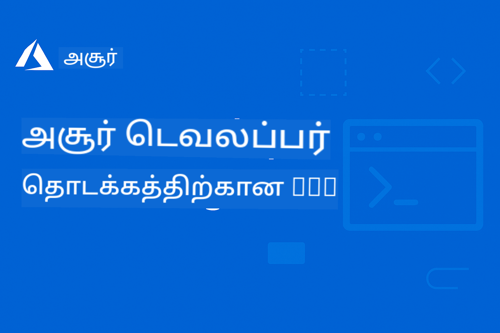

<!--
CO_OP_TRANSLATOR_METADATA:
{
  "original_hash": "62affa32f7697d88ec2a2d5745364db1",
  "translation_date": "2025-12-16T01:27:08+00:00",
  "source_file": "README.md",
  "language_code": "ta"
}
-->
# AZD தொடக்கத்திற்கான பயணமுறை: ஒரு கட்டமைக்கப்பட்ட கற்றல் பயணம்

 

[](https://GitHub.com/microsoft/azd-for-beginners/watchers/)
[](https://GitHub.com/microsoft/azd-for-beginners/network/)
[](https://GitHub.com/microsoft/azd-for-beginners/stargazers/)

[](https://discord.gg/microsoft-azure)
[](https://discord.gg/nTYy5BXMWG)

## இந்த பாடத்திட்டத்துடன் தொடங்குதல்

உங்கள் AZD கற்றல் பயணத்தைத் தொடங்க இந்த படிகளை பின்பற்றவும்:

1. **களஞ்சியத்தை Fork செய்யவும்**: கிளிக் செய்யவும் [](https://GitHub.com/microsoft/azd-for-beginners/fork)
2. **களஞ்சியத்தை Clone செய்யவும்**: `git clone https://github.com/microsoft/azd-for-beginners.git`
3. **சமூகத்தில் சேரவும்**: [Azure Discord Communities](https://discord.com/invite/ByRwuEEgH4) நிபுணர் ஆதரவுக்காக
4. **உங்கள் கற்றல் பாதையை தேர்ந்தெடுக்கவும்**: கீழே உள்ள அத்தியாயங்களில் உங்கள் அனுபவ நிலைக்கு பொருந்தியதை தேர்வு செய்யவும்

### பல மொழி ஆதரவு

#### தானாக மொழிபெயர்ப்பு (எப்போதும் புதுப்பிக்கப்பட்டது)

<!-- CO-OP TRANSLATOR LANGUAGES TABLE START -->
[Arabic](../ar/README.md) | [Bengali](../bn/README.md) | [Bulgarian](../bg/README.md) | [Burmese (Myanmar)](../my/README.md) | [Chinese (Simplified)](../zh/README.md) | [Chinese (Traditional, Hong Kong)](../hk/README.md) | [Chinese (Traditional, Macau)](../mo/README.md) | [Chinese (Traditional, Taiwan)](../tw/README.md) | [Croatian](../hr/README.md) | [Czech](../cs/README.md) | [Danish](../da/README.md) | [Dutch](../nl/README.md) | [Estonian](../et/README.md) | [Finnish](../fi/README.md) | [French](../fr/README.md) | [German](../de/README.md) | [Greek](../el/README.md) | [Hebrew](../he/README.md) | [Hindi](../hi/README.md) | [Hungarian](../hu/README.md) | [Indonesian](../id/README.md) | [Italian](../it/README.md) | [Japanese](../ja/README.md) | [Kannada](../kn/README.md) | [Korean](../ko/README.md) | [Lithuanian](../lt/README.md) | [Malay](../ms/README.md) | [Malayalam](../ml/README.md) | [Marathi](../mr/README.md) | [Nepali](../ne/README.md) | [Nigerian Pidgin](../pcm/README.md) | [Norwegian](../no/README.md) | [Persian (Farsi)](../fa/README.md) | [Polish](../pl/README.md) | [Portuguese (Brazil)](../br/README.md) | [Portuguese (Portugal)](../pt/README.md) | [Punjabi (Gurmukhi)](../pa/README.md) | [Romanian](../ro/README.md) | [Russian](../ru/README.md) | [Serbian (Cyrillic)](../sr/README.md) | [Slovak](../sk/README.md) | [Slovenian](../sl/README.md) | [Spanish](../es/README.md) | [Swahili](../sw/README.md) | [Swedish](../sv/README.md) | [Tagalog (Filipino)](../tl/README.md) | [Tamil](./README.md) | [Telugu](../te/README.md) | [Thai](../th/README.md) | [Turkish](../tr/README.md) | [Ukrainian](../uk/README.md) | [Urdu](../ur/README.md) | [Vietnamese](../vi/README.md)
<!-- CO-OP TRANSLATOR LANGUAGES TABLE END -->

## பாடத்திட்டத்தின் கண்ணோட்டம்

Azure Developer CLI (azd) ஐ கட்டமைக்கப்பட்ட அத்தியாயங்களின் மூலம் கற்றுக்கொள்ளுங்கள், இது முன்னேற்றமான கற்றலுக்காக வடிவமைக்கப்பட்டுள்ளது. **Microsoft Foundry ஒருங்கிணைப்புடன் AI பயன்பாடுகளை வெளியிடுவதில் சிறப்பு கவனம்.**

### இந்த பாடத்திட்டம் நவீன டெவலப்பர்களுக்கு ஏன் அவசியம்?

Microsoft Foundry Discord சமூகத்தின் கருத்துக்களின் அடிப்படையில், **45% டெவலப்பர்கள் AI பணிகளுக்காக AZD ஐ பயன்படுத்த விரும்புகிறார்கள்** ஆனால் சந்திக்கும் சவால்கள்:
- சிக்கலான பல-சேவை AI கட்டமைப்புகள்
- உற்பத்தி AI வெளியீட்டு சிறந்த நடைமுறைகள்  
- Azure AI சேவை ஒருங்கிணைப்பு மற்றும் கட்டமைப்பு
- AI பணிகளுக்கான செலவு குறைத்தல்
- AI-சார்ந்த வெளியீட்டு பிரச்சனைகள் தீர்க்கும் முறைகள்

### கற்றல் நோக்கங்கள்

இந்த கட்டமைக்கப்பட்ட பாடத்திட்டத்தை முடித்தவுடன், நீங்கள்:
- **AZD அடிப்படைகளை கற்றுக்கொள்ளலாம்**: முக்கியக் கருத்துக்கள், நிறுவல் மற்றும் கட்டமைப்பு
- **AI பயன்பாடுகளை வெளியிடலாம்**: Microsoft Foundry சேவைகளுடன் AZD பயன்படுத்தி
- **கட்டமைப்பை குறியீடாக செயல்படுத்தலாம்**: Bicep டெம்ப்ளேட்டுகளுடன் Azure வளங்களை நிர்வகிக்க
- **வெளியீட்டு பிரச்சனைகளை தீர்க்கலாம்**: பொதுவான பிரச்சனைகள் மற்றும் பிழைகளை கண்டறிதல்
- **உற்பத்திக்கான சிறந்த முறைகளை பின்பற்றலாம்**: பாதுகாப்பு, அளவீடு, கண்காணிப்பு மற்றும் செலவு மேலாண்மை
- **பல-ஏஜென்ட் தீர்வுகளை உருவாக்கலாம்**: சிக்கலான AI கட்டமைப்புகளை வெளியிடுதல்

## 📚 கற்றல் அத்தியாயங்கள்

*உங்கள் அனுபவ நிலை மற்றும் இலக்குகளின் அடிப்படையில் கற்றல் பாதையை தேர்ந்தெடுக்கவும்*

### 🚀 அத்தியாயம் 1: அடித்தளம் மற்றும் விரைவு தொடக்கம்
**முன்னோட்டங்கள்**: Azure சந்தா, அடிப்படை கட்டளை வரி அறிவு  
**கால அளவு**: 30-45 நிமிடங்கள்  
**சிக்கல் நிலை**: ⭐

#### நீங்கள் கற்றுக்கொள்ளப்போகும் விஷயங்கள்
- Azure Developer CLI அடிப்படைகளை புரிந்துகொள்ளுதல்
- உங்கள் தளத்தில் AZD ஐ நிறுவுதல்
- உங்கள் முதல் வெற்றிகரமான வெளியீடு

#### கற்றல் வளங்கள்
- **🎯 இங்கே தொடங்கவும்**: [Azure Developer CLI என்றால் என்ன?](../..)
- **📖 கோட்பாடு**: [AZD அடிப்படைகள்](docs/getting-started/azd-basics.md) - முக்கியக் கருத்துக்கள் மற்றும் சொற்கள்
- **⚙️ அமைப்பு**: [நிறுவல் மற்றும் அமைப்பு](docs/getting-started/installation.md) - தள-சார்ந்த வழிகாட்டிகள்
- **🛠️ நடைமுறை**: [உங்கள் முதல் திட்டம்](docs/getting-started/first-project.md) - படி படியாக கற்றல்
- **📋 விரைவு குறிப்பு**: [கட்டளை குறிப்பு](resources/cheat-sheet.md)

#### நடைமுறை பயிற்சிகள்
```bash
# விரைவு நிறுவல் சரிபார்ப்பு
azd version

# உங்கள் முதல் பயன்பாட்டை வெளியிடுங்கள்
azd init --template todo-nodejs-mongo
azd up
```

**💡 அத்தியாய முடிவு**: AZD பயன்படுத்தி ஒரு எளிய வலை பயன்பாட்டை வெற்றிகரமாக Azure இல் வெளியிடுதல்

**✅ வெற்றி உறுதிப்படுத்தல்:**
```bash
# அத்தியாயம் 1 முடிந்த பிறகு, நீங்கள் செய்யக்கூடியவை:
azd version              # நிறுவப்பட்ட பதிப்பை காட்டுகிறது
azd init --template todo-nodejs-mongo  # திட்டத்தை துவக்குகிறது
azd up                  # Azure-க்கு வெளியிடுகிறது
azd show                # இயங்கும் செயலியின் URL-ஐ காட்டுகிறது
# செயலி உலாவியில் திறந்து செயல்படுகிறது
azd down --force --purge  # வளங்களை சுத்தம் செய்கிறது
```

**📊 நேர முதலீடு:** 30-45 நிமிடங்கள்  
**📈 கற்றல் நிலை பிறகு:** அடிப்படை பயன்பாடுகளை தனியாக வெளியிட முடியும்

**✅ வெற்றி உறுதிப்படுத்தல்:**
```bash
# அத்தியாயம் 1 முடிந்த பிறகு, நீங்கள் செய்யக்கூடியவை:
azd version              # நிறுவப்பட்ட பதிப்பை காட்டுகிறது
azd init --template todo-nodejs-mongo  # திட்டத்தை துவக்குகிறது
azd up                  # Azure-க்கு வெளியிடுகிறது
azd show                # இயங்கும் செயலியின் URL-ஐ காட்டுகிறது
# செயலி உலாவியில் திறந்து செயல்படுகிறது
azd down --force --purge  # வளங்களை சுத்தம் செய்கிறது
```

**📊 நேர முதலீடு:** 30-45 நிமிடங்கள்  
**📈 கற்றல் நிலை பிறகு:** அடிப்படை பயன்பாடுகளை தனியாக வெளியிட முடியும்

---

### 🤖 அத்தியாயம் 2: AI-முதன்மை வளர்ச்சி (AI டெவலப்பர்களுக்கு பரிந்துரைக்கப்படுகிறது)
**முன்னோட்டங்கள்**: அத்தியாயம் 1 முடிக்கப்பட்டது  
**கால அளவு**: 1-2 மணி நேரம்  
**சிக்கல் நிலை**: ⭐⭐

#### நீங்கள் கற்றுக்கொள்ளப்போகும் விஷயங்கள்
- Microsoft Foundry ஒருங்கிணைப்பு AZD உடன்
- AI இயக்கப்படும் பயன்பாடுகளை வெளியிடுதல்
- AI சேவை கட்டமைப்புகளை புரிந்துகொள்ளுதல்

#### கற்றல் வளங்கள்
- **🎯 இங்கே தொடங்கவும்**: [Microsoft Foundry ஒருங்கிணைப்பு](docs/microsoft-foundry/microsoft-foundry-integration.md)
- **📖 மாதிரிகள்**: [AI மாதிரி வெளியீடு](docs/microsoft-foundry/ai-model-deployment.md) - AI மாதிரிகளை வெளியிட்டு நிர்வகிக்க
- **🛠️ பணிமனை**: [AI பணிமனை ஆய்வு](docs/microsoft-foundry/ai-workshop-lab.md) - உங்கள் AI தீர்வுகளை AZD-க்கு தயாராக்க
- **🎥 இடைமுக வழிகாட்டி**: [பணிமனைப் பொருட்கள்](workshop/README.md) - MkDocs * DevContainer சூழலில் உலாவி அடிப்படையிலான கற்றல்
- **📋 டெம்ப்ளேட்டுகள்**: [Microsoft Foundry டெம்ப்ளேட்டுகள்](../..)
- **📝 உதாரணங்கள்**: [AZD வெளியீட்டு உதாரணங்கள்](examples/README.md)

#### நடைமுறை பயிற்சிகள்
```bash
# உங்கள் முதல் AI பயன்பாட்டை வெளியிடவும்
azd init --template azure-search-openai-demo
azd up

# கூடுதல் AI வார்ப்புருக்களை முயற்சிக்கவும்
azd init --template openai-chat-app-quickstart
azd init --template agent-openai-python-prompty
```

**💡 அத்தியாய முடிவு**: RAG திறன்களுடன் AI இயக்கப்படும் உரையாடல் பயன்பாட்டை வெளியிட்டு கட்டமைக்க

**✅ வெற்றி உறுதிப்படுத்தல்:**
```bash
# அத்தியாயம் 2 முடிந்த பிறகு, நீங்கள் செய்யக்கூடியவை:
azd init --template azure-search-openai-demo
azd up
# AI உரையாடல் இடைமுகத்தை சோதிக்கவும்
# கேள்விகள் கேட்டு, ஆதாரங்களுடன் AI இயக்கப்பட்ட பதில்களை பெறவும்
# தேடல் ஒருங்கிணைப்பு வேலை செய்கிறது என்பதை உறுதிப்படுத்தவும்
azd monitor  # பயன்பாட்டு அறிவு தொலைநோக்கி தரவுகளை காட்டுகிறது என்பதை சரிபார்க்கவும்
azd down --force --purge
```

**📊 நேர முதலீடு:** 1-2 மணி நேரம்  
**📈 கற்றல் நிலை பிறகு:** உற்பத்தி-தயார் AI பயன்பாடுகளை வெளியிட்டு கட்டமைக்க முடியும்  
**💰 செலவு அறிவு:** மாதம் $80-150 வளர்ச்சி செலவுகள், மாதம் $300-3500 உற்பத்தி செலவுகள் புரிந்துகொள்ளுதல்

#### 💰 AI வெளியீடுகளுக்கான செலவு பரிசீலனைகள்

**வளர்ச்சி சூழல் (கணக்கிடப்பட்ட $80-150/மாதம்):**
- Azure OpenAI (பயன்பாடு அடிப்படையில் கட்டணம்): $0-50/மாதம் (டோக்கன் பயன்பாட்டின் அடிப்படையில்)
- AI தேடல் (அடிப்படை நிலை): $75/மாதம்
- கன்டெய்னர் பயன்பாடுகள் (பயன்பாடு அடிப்படையில்): $0-20/மாதம்
- சேமிப்பு (மாதிரி): $1-5/மாதம்

**உற்பத்தி சூழல் (கணக்கிடப்பட்ட $300-3,500+/மாதம்):**
- Azure OpenAI (PTU நிலையான செயல்திறனுக்காக): $3,000+/மாதம் அல்லது அதிக பயன்பாட்டுடன் Pay-as-go
- AI தேடல் (நிலையான நிலை): $250/மாதம்
- கன்டெய்னர் பயன்பாடுகள் (ஒதுக்கப்பட்டவை): $50-100/மாதம்
- பயன்பாட்டு பார்வைகள்: $5-50/மாதம்
- சேமிப்பு (பிரீமியம்): $10-50/மாதம்

**💡 செலவு குறைத்தல் குறிப்புகள்:**
- கற்றலுக்காக **இலவச நிலை** Azure OpenAI பயன்படுத்தவும் (50,000 டோக்கன்கள்/மாதம் உட்பட)
- செயல்பாட்டில் இல்லாதபோது வளங்களை விடுவிக்க `azd down` இயக்கவும்
- முதலில் பயன்பாடு அடிப்படையிலான பில்லிங் தொடங்கி, உற்பத்திக்கே PTU மேம்படுத்தவும்
- வெளியீட்டுக்கு முன் செலவுகளை கணக்கிட `azd provision --preview` பயன்படுத்தவும்
- தானாக அளவீடு செயல்படுத்தவும்: உண்மையான பயன்பாட்டிற்கே கட்டணம் செலுத்தவும்

**செலவு கண்காணிப்பு:**
```bash
# மதிப்பிடப்பட்ட மாதாந்திர செலவுகளை சரிபார்க்கவும்
azd provision --preview

# Azure போர்டலில் உண்மையான செலவுகளை கண்காணிக்கவும்
az consumption budget list --resource-group <your-rg>
```

---

### ⚙️ அத்தியாயம் 3: கட்டமைப்பு மற்றும் அங்கீகாரம்
**முன்னோட்டங்கள்**: அத்தியாயம் 1 முடிக்கப்பட்டது  
**கால அளவு**: 45-60 நிமிடங்கள்  
**சிக்கல் நிலை**: ⭐⭐

#### நீங்கள் கற்றுக்கொள்ளப்போகும் விஷயங்கள்
- சூழல் கட்டமைப்பு மற்றும் நிர்வாகம்
- அங்கீகாரம் மற்றும் பாதுகாப்பு சிறந்த நடைமுறைகள்
- வள பெயரிடல் மற்றும் ஒழுங்கமைப்பு

#### கற்றல் வளங்கள்
- **📖 கட்டமைப்பு**: [கட்டமைப்பு வழிகாட்டி](docs/getting-started/configuration.md) - சூழல் அமைப்பு
- **🔐 பாதுகாப்பு**: [அங்கீகாரம் மாதிரிகள் மற்றும் நிர்வகிக்கப்பட்ட அடையாளம்](docs/getting-started/authsecurity.md) - அங்கீகாரம் மாதிரிகள்
- **📝 உதாரணங்கள்**: [தரவுத்தள பயன்பாட்டு உதாரணம்](examples/database-app/README.md) - AZD தரவுத்தள உதாரணங்கள்

#### நடைமுறை பயிற்சிகள்
- பல சூழல்களை (வளர்ச்சி, பரிசோதனை, உற்பத்தி) கட்டமைக்கவும்
- நிர்வகிக்கப்பட்ட அடையாள அங்கீகாரத்தை அமைக்கவும்
- சூழல்-சார்ந்த கட்டமைப்புகளை செயல்படுத்தவும்

**💡 அத்தியாய முடிவு**: சரியான அங்கீகாரம் மற்றும் பாதுகாப்புடன் பல சூழல்களை நிர்வகிக்க

---

### 🏗️ அத்தியாயம் 4: குறியீடாக கட்டமைப்பு மற்றும் வெளியீடு
**முன்னோட்டங்கள்**: அத்தியாயங்கள் 1-3 முடிக்கப்பட்டது  
**கால அளவு**: 1-1.5 மணி நேரம்  
**சிக்கல் நிலை**: ⭐⭐⭐

#### நீங்கள் கற்றுக்கொள்ளப்போகும் விஷயங்கள்
- மேம்பட்ட வெளியீட்டு மாதிரிகள்
- Bicep உடன் குறியீடாக கட்டமைப்பு
- வள ஒதுக்கீட்டு நெறிமுறைகள்

#### கற்றல் வளங்கள்
- **📖 வெளியீடு**: [வெளியீட்டு வழிகாட்டி](docs/deployment/deployment-guide.md) - முழுமையான பணிகள்
- **🏗️ ஒதுக்கீடு**: [வள ஒதுக்கீடு](docs/deployment/provisioning.md) - Azure வள நிர்வாகம்
- **📝 உதாரணங்கள்**: [கன்டெய்னர் பயன்பாட்டு உதாரணம்](../../examples/container-app) - கன்டெய்னரைஸ் வெளியீடுகள்

#### நடைமுறை பயிற்சிகள்
- தனிப்பயன் Bicep டெம்ப்ளேட்டுகளை உருவாக்கவும்
- பல சேவை பயன்பாடுகளை வெளியிடவும்
- நீலம்-பச்சை வெளியீட்டு நெறிமுறைகளை செயல்படுத்தவும்

**💡 அத்தியாய முடிவு**: தனிப்பயன் கட்டமைப்பு டெம்ப்ளேட்டுகளை பயன்படுத்தி சிக்கலான பல சேவை பயன்பாடுகளை வெளியிட

---

### 🎯 அத்தியாயம் 5: பல-ஏஜென்ட் AI தீர்வுகள் (மேம்பட்டது)
**முன்னோட்டங்கள்**: அத்தியாயங்கள் 1-2 முடிக்கப்பட்டது  
**கால அளவு**: 2-3 மணி நேரம்  
**சிக்கல் நிலை**: ⭐⭐⭐⭐

#### நீங்கள் கற்றுக்கொள்ளப்போகும் விஷயங்கள்
- பல-ஏஜென்ட் கட்டமைப்பு மாதிரிகள்
- ஏஜென்ட் ஒருங்கிணைப்பு மற்றும் ஒத்துழைப்பு
- உற்பத்தி-தயார் AI வெளியீடுகள்

#### கற்றல் வளங்கள்
- **🤖 சிறப்பு திட்டம்**: [சில்லறை பல-ஏஜென்ட் தீர்வு](examples/retail-scenario.md) - முழுமையான செயல்படுத்தல்
- **🛠️ ARM டெம்ப்ளேட்கள்**: [ARM டெம்ப்ளேட் பேக்கேஜ்](../../examples/retail-multiagent-arm-template) - ஒரே கிளிக் மூலம் டிப்ளாய்மென்ட்
- **📖 கட்டமைப்பு**: [பல-ஏஜென்ட் ஒருங்கிணைப்பு மாதிரிகள்](/docs/pre-deployment/coordination-patterns.md) - மாதிரிகள்

#### நடைமுறை பயிற்சிகள்
```bash
# முழுமையான சில்லறை பன்முக முகவர் தீர்வை வெளியிடவும்
cd examples/retail-multiagent-arm-template
./deploy.sh

# முகவர் கட்டமைப்புகளை ஆராயவும்
az deployment group show --resource-group <rg-name> --name <deployment-name>
```

**💡 அத்தியாய முடிவு**: வாடிக்கையாளர் மற்றும் சரக்கு ஏஜென்ட்களுடன் தயாரிப்பு-தயார் பல-ஏஜென்ட் AI தீர்வை டிப்ளாய் செய்து நிர்வகிக்கவும்

---

### 🔍 அத்தியாயம் 6: முன்-டிப்ளாய்மென்ட் சரிபார்ப்பு மற்றும் திட்டமிடல்
**முன்னோட்டங்கள்**: அத்தியாயம் 4 முடிக்கப்பட்டது  
**கால அளவு**: 1 மணி நேரம்  
**சிக்கல் நிலை**: ⭐⭐

#### நீங்கள் கற்றுக்கொள்ளப்போகும் விஷயங்கள்
- திறன் திட்டமிடல் மற்றும் வள சரிபார்ப்பு
- SKU தேர்வு நெறிமுறைகள்
- முன்-பறக்கும் சரிபார்ப்புகள் மற்றும் தானியங்கி செயலாக்கம்

#### கற்றல் வளங்கள்
- **📊 திட்டமிடல்**: [திறன் திட்டமிடல்](docs/pre-deployment/capacity-planning.md) - வள சரிபார்ப்பு
- **💰 தேர்வு**: [SKU தேர்வு](docs/pre-deployment/sku-selection.md) - செலவு குறைந்த தேர்வுகள்
- **✅ சரிபார்ப்பு**: [முன்-பறக்கும் சரிபார்ப்புகள்](docs/pre-deployment/preflight-checks.md) - தானியங்கி ஸ்கிரிப்ட்கள்

#### நடைமுறை பயிற்சிகள்
- திறன் சரிபார்ப்பு ஸ்கிரிப்ட்களை இயக்கவும்
- செலவுக்கேற்ற SKU தேர்வுகளை மேம்படுத்தவும்
- தானியங்கி முன்-டிப்ளாய்மென்ட் சரிபார்ப்புகளை செயல்படுத்தவும்

**💡 அத்தியாய முடிவு**: செயல்படுத்துவதற்கு முன் டிப்ளாய்மென்ட்களை சரிபார்த்து மேம்படுத்தவும்

---

### 🚨 அத்தியாயம் 7: பிழைத்திருத்தம் மற்றும் டிபக் செய்தல்
**முன்னோட்டங்கள்**: எந்தவொரு டிப்ளாய்மென்ட் அத்தியாயமும் முடிக்கப்பட்டது  
**கால அளவு**: 1-1.5 மணி நேரம்  
**சிக்கல் நிலை**: ⭐⭐

#### நீங்கள் கற்றுக்கொள்ளப்போகும் விஷயங்கள்
- முறையான பிழைத்திருத்த அணுகுமுறைகள்
- பொதுவான பிரச்சனைகள் மற்றும் தீர்வுகள்
- AI-க்கு சிறப்பு பிழைத்திருத்தம்

#### கற்றல் வளங்கள்
- **🔧 பொதுவான பிரச்சனைகள்**: [பொதுவான பிரச்சனைகள்](docs/troubleshooting/common-issues.md) - அடிக்கடி கேட்கப்படும் கேள்விகள் மற்றும் தீர்வுகள்
- **🕵️ பிழைத்திருத்தம்**: [பிழைத்திருத்த வழிகாட்டி](docs/troubleshooting/debugging.md) - படி படியாக செயல்முறை
- **🤖 AI பிரச்சனைகள்**: [AI-க்கு சிறப்பு பிழைத்திருத்தம்](docs/troubleshooting/ai-troubleshooting.md) - AI சேவை பிரச்சனைகள்

#### நடைமுறை பயிற்சிகள்
- டிப்ளாய்மென்ட் தோல்விகளை கண்டறியவும்
- அங்கீகார பிரச்சனைகளை தீர்க்கவும்
- AI சேவை இணைப்பை டிபக் செய்யவும்

**💡 அத்தியாய முடிவு**: பொதுவான டிப்ளாய்மென்ட் பிரச்சனைகளை சுயமாக கண்டறிந்து தீர்க்கவும்

---

### 🏢 அத்தியாயம் 8: தயாரிப்பு மற்றும் நிறுவன மாதிரிகள்
**முன்னோட்டங்கள்**: அத்தியாயங்கள் 1-4 முடிக்கப்பட்டது  
**கால அளவு**: 2-3 மணி நேரம்  
**சிக்கல் நிலை**: ⭐⭐⭐⭐

#### நீங்கள் கற்றுக்கொள்ளப்போகும் விஷயங்கள்
- தயாரிப்பு டிப்ளாய்மென்ட் நெறிமுறைகள்
- நிறுவன பாதுகாப்பு மாதிரிகள்
- கண்காணிப்பு மற்றும் செலவு மேம்படுத்தல்

#### கற்றல் வளங்கள்
- **🏭 தயாரிப்பு**: [தயாரிப்பு AI சிறந்த நடைமுறைகள்](docs/microsoft-foundry/production-ai-practices.md) - நிறுவன மாதிரிகள்
- **📝 உதாரணங்கள்**: [மைக்ரோசெர்வீசஸ் உதாரணம்](../../examples/microservices) - சிக்கலான கட்டமைப்புகள்
- **📊 கண்காணிப்பு**: [ஆப்ளிகேஷன் இன்சைட்ஸ் ஒருங்கிணைப்பு](docs/pre-deployment/application-insights.md) - கண்காணிப்பு

#### நடைமுறை பயிற்சிகள்
- நிறுவன பாதுகாப்பு மாதிரிகளை செயல்படுத்தவும்
- விரிவான கண்காணிப்பை அமைக்கவும்
- சரியான ஆட்சி உடன் தயாரிப்புக்கு டிப்ளாய் செய்யவும்

**💡 அத்தியாய முடிவு**: முழுமையான தயாரிப்பு திறன்களுடன் நிறுவன-தயார் பயன்பாடுகளை டிப்ளாய் செய்யவும்

---

## 🎓 பணிமனை கண்ணோட்டம்: கைமுறை கற்றல் அனுபவம்

> **⚠️ பணிமனை நிலை: செயலில் உள்ளது**  
> பணிமனைப் பொருட்கள் தற்போது உருவாக்கப்பட்டு மேம்படுத்தப்படுகின்றன. முக்கிய தொகுதிகள் செயல்படுகின்றன, ஆனால் சில மேம்பட்ட பகுதிகள் முழுமையாக இல்லை. அனைத்து உள்ளடக்கங்களையும் முடிக்க நாம் செயலில் உள்ளோம். [முன்னேற்றத்தை பின்தொடரவும் →](workshop/README.md)

### இடைமுக பணிமனைப் பொருட்கள்
**உரையாடல் அடிப்படையிலான கருவிகள் மற்றும் வழிகாட்டப்பட்ட பயிற்சிகளுடன் விரிவான கைமுறை கற்றல்**

எங்கள் பணிமனைப் பொருட்கள் மேலே உள்ள அத்தியாய அடிப்படையிலான பாடத்திட்டத்துடன் இணைந்து அமைந்த, கட்டமைக்கப்பட்ட, இடைமுக கற்றல் அனுபவத்தை வழங்குகின்றன. பணிமனை தானாக கற்றல் மற்றும் பயிற்சியாளர் வழிகாட்டும் அமர்வுகளுக்காக வடிவமைக்கப்பட்டுள்ளது.

#### 🛠️ பணிமனை அம்சங்கள்
- **உரையாடல் அடிப்படையிலான இடைமுகம்**: தேடல், நகல் மற்றும் தீம் அம்சங்களுடன் முழுமையான MkDocs-ஆல் இயக்கப்படும் பணிமனை
- **GitHub Codespaces ஒருங்கிணைப்பு**: ஒரே கிளிக் மூலம் மேம்பாட்டு சூழல் அமைப்பு
- **கட்டமைக்கப்பட்ட கற்றல் பாதை**: 7 படி வழிகாட்டப்பட்ட பயிற்சிகள் (மொத்தம் 3.5 மணி நேரம்)
- **கண்டறிதல் → டிப்ளாய்மென்ட் → தனிப்பயனாக்கல்**: முன்னேற்ற முறை
- **இணைய DevContainer சூழல்**: முன்கூட்டியே அமைக்கப்பட்ட கருவிகள் மற்றும் சார்புகள்

#### 📚 பணிமனை கட்டமைப்பு
பணிமனை **கண்டறிதல் → டிப்ளாய்மென்ட் → தனிப்பயனாக்கல்** முறைப்படி செயல்படுகிறது:

1. **கண்டறிதல் கட்டம்** (45 நிமிடங்கள்)
   - Microsoft Foundry டெம்ப்ளேட்கள் மற்றும் சேவைகளை ஆராய்க
   - பல-ஏஜென்ட் கட்டமைப்பு மாதிரிகளை புரிந்துகொள்
   - டிப்ளாய்மென்ட் தேவைகள் மற்றும் முன்னோட்டங்களை மதிப்பாய்வு செய்

2. **டிப்ளாய்மென்ட் கட்டம்** (2 மணி நேரம்)
   - AZD உடன் AI பயன்பாடுகளை கைமுறை டிப்ளாய் செய்
   - Azure AI சேவைகள் மற்றும் முடிவுகளை அமை
   - பாதுகாப்பு மற்றும் அங்கீகார மாதிரிகளை செயல்படுத்து

3. **தனிப்பயனாக்கல் கட்டம்** (45 நிமிடங்கள்)
   - குறிப்பிட்ட பயன்பாடுகளுக்காக பயன்பாடுகளை மாற்று
   - தயாரிப்பு டிப்ளாய்மென்டுக்கான மேம்படுத்தல்
   - கண்காணிப்பு மற்றும் செலவு மேலாண்மையை செயல்படுத்து

#### 🚀 பணிமனை தொடங்குதல்
```bash
# விருப்பம் 1: GitHub Codespaces (பரிந்துரைக்கப்பட்டது)
# "Code" → "Create codespace on main" என்பதை ரெப்போசிடரியில் கிளிக் செய்யவும்

# விருப்பம் 2: உள்ளூர் மேம்பாடு
git clone https://github.com/microsoft/azd-for-beginners.git
cd azd-for-beginners/workshop
# workshop/README.md இல் உள்ள அமைப்பு வழிமுறைகளை பின்பற்றவும்
```

#### 🎯 பணிமனை கற்றல் முடிவுகள்
பணிமனை முடித்தவுடன், பங்கேற்பாளர்கள்:
- **தயாரிப்பு AI பயன்பாடுகளை டிப்ளாய் செய்க**: Microsoft Foundry சேவைகளுடன் AZD பயன்படுத்தவும்
- **பல-ஏஜென்ட் கட்டமைப்புகளை கற்றுக்கொள்**: ஒருங்கிணைந்த AI ஏஜென்ட் தீர்வுகளை செயல்படுத்து
- **பாதுகாப்பு சிறந்த நடைமுறைகளை செயல்படுத்து**: அங்கீகார மற்றும் அணுகல் கட்டுப்பாட்டை அமை
- **அளவுக்கு ஏற்ப மேம்படுத்து**: செலவு குறைந்த, செயல்திறன் வாய்ந்த டிப்ளாய்மென்ட்களை வடிவமை
- **டிப்ளாய்மென்ட் பிழைகளை தீர்க்க கற்றுக்கொள்**: பொதுவான பிரச்சனைகளை சுயமாக தீர்க்க

#### 📖 பணிமனை வளங்கள்
- **🎥 இடைமுக வழிகாட்டி**: [பணிமனைப் பொருட்கள்](workshop/README.md) - உலாவி அடிப்படையிலான கற்றல் சூழல்
- **📋 படி படியாக வழிகாட்டல்கள்**: [வழிகாட்டப்பட்ட பயிற்சிகள்](../../workshop/docs/instructions) - விரிவான நடைமுறைகள்
- **🛠️ AI பணிமனை ஆய்வகம்**: [AI பணிமனை ஆய்வகம்](docs/microsoft-foundry/ai-workshop-lab.md) - AI கவனம் கொண்ட பயிற்சிகள்
- **💡 விரைவு தொடக்கம்**: [பணிமனை அமைப்பு வழிகாட்டி](workshop/README.md#quick-start) - சூழல் கட்டமைப்பு

**சரியானது**: நிறுவன பயிற்சி, பல்கலைக்கழக பாடங்கள், தானாக கற்றல் மற்றும் டெவலப்பர் பயிற்சி முகாம்கள்.

---

## 📖 Azure Developer CLI என்றால் என்ன?

Azure Developer CLI (azd) என்பது Azure-க்கு பயன்பாடுகளை உருவாக்கி டிப்ளாய் செய்வதற்கான டெவலப்பர் மையமான கட்டளை வரி இடைமுகம் ஆகும். இது வழங்குகிறது:

- **டெம்ப்ளேட் அடிப்படையிலான டிப்ளாய்மென்ட்கள்** - பொதுவான பயன்பாட்டு மாதிரிகளுக்கான முன்கூட்டியே உருவாக்கப்பட்ட டெம்ப்ளேட்களை பயன்படுத்தவும்
- **கட்டமைப்பை குறியீடாக நிர்வகித்தல்** - Bicep அல்லது Terraform மூலம் Azure வளங்களை நிர்வகிக்கவும்  
- **இணைக்கப்பட்ட வேலைப்பாடுகள்** - பயன்பாடுகளை எளிதாக வழங்க, டிப்ளாய் மற்றும் கண்காணிக்கவும்
- **டெவலப்பர் நட்பு** - டெவலப்பர் உற்பத்தித்திறன் மற்றும் அனுபவத்திற்கு உகந்தது

### **AZD + Microsoft Foundry: AI டிப்ளாய்மென்ட்களுக்கு சிறந்தது**

**ஏன் AZD AI தீர்வுகளுக்கு?** AZD AI டெவலப்பர்கள் எதிர்கொள்ளும் முக்கிய சவால்களை தீர்க்கிறது:

- **AI-தயார் டெம்ப்ளேட்கள்** - Azure OpenAI, Cognitive Services மற்றும் ML பணிகளுக்கான முன்கூட்டியே அமைக்கப்பட்ட டெம்ப்ளேட்கள்
- **பாதுகாப்பான AI டிப்ளாய்மென்ட்கள்** - AI சேவைகள், API விசைகள் மற்றும் மாதிரி முடிவுகளுக்கான உள்ளமைக்கப்பட்ட பாதுகாப்பு மாதிரிகள்  
- **தயாரிப்பு AI மாதிரிகள்** - அளவிடக்கூடிய, செலவு குறைந்த AI பயன்பாட்டு டிப்ளாய்மென்ட் சிறந்த நடைமுறைகள்
- **முழுமையான AI வேலைப்பாடுகள்** - மாதிரி உருவாக்கத்திலிருந்து தயாரிப்பு டிப்ளாய்மென்ட் வரை சரியான கண்காணிப்புடன்
- **செலவு மேம்படுத்தல்** - AI பணிகளுக்கான புத்திசாலி வள ஒதுக்கீடு மற்றும் அளவீட்டு நெறிமுறைகள்
- **Microsoft Foundry ஒருங்கிணைப்பு** - Microsoft Foundry மாதிரி காட்சியகம் மற்றும் முடிவுகளுடன் எளிதான இணைப்பு

---

## 🎯 டெம்ப்ளேட்கள் மற்றும் உதாரணங்கள் நூலகம்

### சிறப்பு: Microsoft Foundry டெம்ப்ளேட்கள்
**AI பயன்பாடுகளை டிப்ளாய் செய்யும் போது இங்கே தொடங்கவும்!**

> **குறிப்பு:** இவை பல்வேறு AI மாதிரிகளை காட்டும் டெம்ப்ளேட்கள். சிலவை வெளிப்புற Azure மாதிரிகள், சிலவை உள்ளூர் செயலாக்கங்கள்.

| டெம்ப்ளேட் | அத்தியாயம் | சிக்கல் | சேவைகள் | வகை |
|----------|---------|------------|----------|------|
| [**AI உரையாடல் தொடக்கம்**](https://github.com/Azure-Samples/get-started-with-ai-chat) | அத்தியாயம் 2 | ⭐⭐ | AzureOpenAI + Azure AI மாதிரி ஊக API + Azure AI தேடல் + Azure கன்டெய்னர் செயலிகள் + ஆப்ளிகேஷன் இன்சைட்ஸ் | வெளிப்புறம் |
| [**AI ஏஜென்ட்கள் தொடக்கம்**](https://github.com/Azure-Samples/get-started-with-ai-agents) | அத்தியாயம் 2 | ⭐⭐ | Azure AI ஏஜென்ட் சேவை + AzureOpenAI + Azure AI தேடல் + Azure கன்டெய்னர் செயலிகள் + ஆப்ளிகேஷன் இன்சைட்ஸ்| வெளிப்புறம் |
| [**Azure தேடல் + OpenAI டெமோ**](https://github.com/Azure-Samples/azure-search-openai-demo) | அத்தியாயம் 2 | ⭐⭐ | AzureOpenAI + Azure AI தேடல் + ஆப் சேவை + சேமிப்பு | வெளிப்புறம் |
| [**OpenAI உரையாடல் செயலி விரைவு தொடக்கம்**](https://github.com/Azure-Samples/openai-chat-app-quickstart) | அத்தியாயம் 2 | ⭐ | AzureOpenAI + கன்டெய்னர் செயலிகள் + ஆப்ளிகேஷன் இன்சைட்ஸ் | வெளிப்புறம் |
| [**ஏஜென்ட் OpenAI Python Prompty**](https://github.com/Azure-Samples/agent-openai-python-prompty) | அத்தியாயம் 5 | ⭐⭐⭐ | AzureOpenAI + Azure செயல்பாடுகள் + Prompty | வெளிப்புறம் |
| [**Contoso உரையாடல் RAG**](https://github.com/Azure-Samples/contoso-chat) | அத்தியாயம் 8 | ⭐⭐⭐⭐ | AzureOpenAI + AI தேடல் + Cosmos DB + கன்டெய்னர் செயலிகள் | வெளிப்புறம் |
| [**சில்லறை பல-ஏஜென்ட் தீர்வு**](examples/retail-scenario.md) | அத்தியாயம் 5 | ⭐⭐⭐⭐ | AzureOpenAI + AI தேடல் + சேமிப்பு + கன்டெய்னர் செயலிகள் + Cosmos DB | **உள்ளூர்** |

### சிறப்பு: முழுமையான கற்றல் காட்சிகள்
**தயாரிப்பு-தயார் பயன்பாட்டு டெம்ப்ளேட்கள் கற்றல் அத்தியாயங்களுக்கு பொருந்தும்**

| டெம்ப்ளேட் | கற்றல் அத்தியாயம் | சிக்கல் | முக்கிய கற்றல் |
|----------|------------------|------------|--------------|
| [**openai-chat-app-quickstart**](https://github.com/Azure-Samples/openai-chat-app-quickstart) | அத்தியாயம் 2 | ⭐ | அடிப்படை AI டிப்ளாய்மென்ட் மாதிரிகள் |
| [**azure-search-openai-demo**](https://github.com/Azure-Samples/azure-search-openai-demo) | அத்தியாயம் 2 | ⭐⭐ | Azure AI தேடலுடன் RAG செயலாக்கம் |
| [**ai-document-processing**](https://github.com/Azure-Samples/ai-document-processing) | அத்தியாயம் 4 | ⭐⭐ | ஆவண நுண்ணறிவு ஒருங்கிணைப்பு |
| [**agent-openai-python-prompty**](https://github.com/Azure-Samples/agent-openai-python-prompty) | அத்தியாயம் 5 | ⭐⭐⭐ | ஏஜென்ட் கட்டமைப்பு மற்றும் செயல்பாடு அழைப்பு |
| [**contoso-chat**](https://github.com/Azure-Samples/contoso-chat) | அத்தியாயம் 8 | ⭐⭐⭐ | நிறுவன AI ஒருங்கிணைப்பு |
| [**retail-multi-agent-solution**](examples/retail-scenario.md) | அத்தியாயம் 5 | ⭐⭐⭐⭐ | வாடிக்கையாளர் மற்றும் சரக்கு ஏஜென்ட்களுடன் பல-ஏஜென்ட் கட்டமைப்பு |

### உதாரண வகை மூலம் கற்றல்

> **📌 உள்ளூர் மற்றும் வெளிப்புற உதாரணங்கள்:**  
> **உள்ளூர் உதாரணங்கள்** (இந்த ரெப்போவில்) = உடனடியாக பயன்படுத்த தயாராக உள்ளன  
> **வெளிப்புற உதாரணங்கள்** (Azure மாதிரிகள்) = இணைக்கப்பட்ட ரெப்போசிடரிகளிலிருந்து கிளோன் செய்யவும்

#### உள்ளூர் உதாரணங்கள் (உடனடி பயன்பாடு)
- [**சில்லறை பல-ஏஜென்ட் தீர்வு**](examples/retail-scenario.md) - ARM டெம்ப்ளேட்களுடன் முழுமையான தயாரிப்பு-தயார் செயலாக்கம்
  - பல-ஏஜென்ட் கட்டமைப்பு (வாடிக்கையாளர் + சரக்கு ஏஜென்ட்கள்)
  - விரிவான கண்காணிப்பு மற்றும் மதிப்பீடு
  - ARM டெம்ப்ளேட் மூலம் ஒரே கிளிக் டிப்ளாய்மென்ட்

#### உள்ளூர் உதாரணங்கள் - கன்டெய்னர் செயலிகள் (அத்தியாயங்கள் 2-5)
**இந்த ரெப்போவில் முழுமையான கன்டெய்னர் டிப்ளாய்மென்ட் உதாரணங்கள்:**
- [**கன்டெய்னர் செயலி உதாரணங்கள்**](examples/container-app/README.md) - கன்டெய்னரை அடிப்படையாகக் கொண்ட டிப்ளாய்மென்ட் முழுமையான வழிகாட்டி
  - [எளிய Flask API](../../examples/container-app/simple-flask-api) - அளவுக்கு குறைந்த அடிப்படை REST API
  - [மைக்ரோசெர்வீசஸ் கட்டமைப்பு](../../examples/container-app/microservices) - தயாரிப்பு-தயார் பல சேவை டிப்ளாய்மென்ட்
  - விரைவு தொடக்கம், தயாரிப்பு மற்றும் மேம்பட்ட டிப்ளாய்மென்ட் மாதிரிகள்
  - கண்காணிப்பு, பாதுகாப்பு மற்றும் செலவு மேம்படுத்தல் வழிகாட்டி

#### வெளிப்புற உதாரணங்கள் - எளிய பயன்பாடுகள் (அத்தியாயங்கள் 1-2)
**இந்த Azure மாதிரிகள் ரெப்போசிடரிகளை கிளோன் செய்து தொடங்கவும்:**
- [எளிய வலை செயலி - Node.js + MongoDB](https://github.com/Azure-Samples/todo-nodejs-mongo) - அடிப்படை டிப்ளாய்மென்ட் மாதிரிகள்
- [நிலையான வலைத்தளம் - React SPA](https://github.com/Azure-Samples/todo-csharp-sql-swa-func) - நிலையான உள்ளடக்க டிப்ளாய்மென்ட்
- [கன்டெய்னர் செயலி - Python Flask](https://github.com/Azure-Samples/container-apps-store-api-microservice) - REST API டிப்ளாய்மென்ட்

#### வெளிப்புற உதாரணங்கள் - தரவுத்தள ஒருங்கிணைப்பு (அத்தியாயம் 3-4)  
- [தரவுத்தள செயலி - C# + SQL](https://github.com/Azure-Samples/todo-csharp-sql) - தரவுத்தள இணைப்பு மாதிரிகள்
- [செயல்பாடுகள் + Cosmos DB](https://github.com/Azure-Samples/todo-python-mongo-swa-func) - சர்வர்லெஸ் தரவு வேலைப்பாடு

#### வெளிப்புற உதாரணங்கள் - மேம்பட்ட மாதிரிகள் (அத்தியாயங்கள் 4-8)
- [Java மைக்ரோசெர்வீசஸ்](https://github.com/Azure-Samples/java-microservices-aca-lab) - பல சேவை கட்டமைப்புகள்
- [கன்டெய்னர் செயலிகள் வேலைகள்](https://github.com/Azure-Samples/container-apps-jobs) - பின்னணி செயலாக்கம்  
- [நிறுவன ML குழாய்](https://github.com/Azure-Samples/mlops-v2) - தயாரிப்பு-தயார் ML மாதிரிகள்

### வெளிப்புற டெம்ப்ளேட் தொகுப்புகள்
- [**அதிகாரபூர்வ AZD டெம்ப்ளேட் காட்சியகம்**](https://azure.github.io/awesome-azd/) - அதிகாரபூர்வ மற்றும் சமூக டெம்ப்ளேட்களின் தேர்ந்தெடுக்கப்பட்ட தொகுப்பு
- [**Azure Developer CLI டெம்ப்ளேட்கள்**](https://learn.microsoft.com/en-us/azure/developer/azure-developer-cli/azd-templates) - Microsoft Learn டெம்ப்ளேட் ஆவணங்கள்
- [**உதாரணங்கள் அடைவு**](examples/README.md) - உள்ளூர் கற்றல் உதாரணங்கள் விரிவான விளக்கங்களுடன்

---

## 📚 கற்றல் வளங்கள் மற்றும் குறிப்பு

### விரைவு குறிப்பு
- [**கமாண்ட் சீட்**](resources/cheat-sheet.md) - அத்தியாவசிய azd கமாண்டுகள் அத்தியாயப்படி ஒழுங்குபடுத்தப்பட்டவை  
- [**அகராதி**](resources/glossary.md) - Azure மற்றும் azd தொடர்புடைய சொற்கள்  
- [**அடிக்கடி கேட்கப்படும் கேள்விகள்**](resources/faq.md) - கற்றல் அத்தியாயப்படி பொதுவான கேள்விகள்  
- [**பயிற்சி வழிகாட்டி**](resources/study-guide.md) - விரிவான பயிற்சி பயிற்சிகள்  

### கைமுறை பணிமனைகள்  
- [**AI பணிமனை ஆய்வகம்**](docs/microsoft-foundry/ai-workshop-lab.md) - உங்கள் AI தீர்வுகளை AZD-வழங்கக்கூடியதாக மாற்றவும் (2-3 மணி நேரம்)  
- [**இணைய பணிமனை வழிகாட்டி**](workshop/README.md) - MkDocs மற்றும் DevContainer சூழலில் உலாவி அடிப்படையிலான பணிமனை  
- [**கட்டமைக்கப்பட்ட கற்றல் பாதை**](../../workshop/docs/instructions) - 7 படி வழிகாட்டப்பட்ட பயிற்சிகள் (கண்டறிதல் → வழங்கல் → தனிப்பயனாக்கல்)  
- [**AZD தொடக்கத்திற்கான பணிமனை**](workshop/README.md) - GitHub Codespaces ஒருங்கிணைப்புடன் முழுமையான கைமுறை பணிமனைப் பொருட்கள்  

### வெளிப்புற கற்றல் வளங்கள்  
- [Azure Developer CLI ஆவணங்கள்](https://learn.microsoft.com/en-us/azure/developer/azure-developer-cli/)  
- [Azure கட்டமைப்பு மையம்](https://learn.microsoft.com/en-us/azure/architecture/)  
- [Azure விலை கணக்கீடு கருவி](https://azure.microsoft.com/pricing/calculator/)  
- [Azure நிலை](https://status.azure.com/)  

---

## 🔧 விரைவு பிழைத்திருத்த வழிகாட்டி

**தொடக்கத்தினருக்கு பொதுவான பிரச்சனைகள் மற்றும் உடனடி தீர்வுகள்:**

### ❌ "azd: command not found"

```bash
# முதலில் AZD ஐ நிறுவவும்
# விண்டோஸ் (பவர் ஷெல்):
winget install microsoft.azd

# மேக் ஓஎஸ்:
brew tap azure/azd && brew install azd

# லினக்ஸ்:
curl -fsSL https://aka.ms/install-azd.sh | bash

# நிறுவலை சரிபார்க்கவும்
azd version
```
  
### ❌ "No subscription found" அல்லது "Subscription not set"

```bash
# கிடைக்கும் சந்தாக்களை பட்டியலிடு
az account list --output table

# இயல்புநிலை சந்தாவை அமைக்கவும்
az account set --subscription "<subscription-id-or-name>"

# AZD சூழலுக்காக அமைக்கவும்
azd env set AZURE_SUBSCRIPTION_ID "<subscription-id>"

# சரிபார்க்கவும்
az account show
```
  
### ❌ "InsufficientQuota" அல்லது "Quota exceeded"

```bash
# வேறுபட்ட Azure பிராந்தியத்தை முயற்சிக்கவும்
azd env set AZURE_LOCATION "westus2"
azd up

# அல்லது வளர்ச்சியில் சிறிய SKUs ஐ பயன்படுத்தவும்
# infra/main.parameters.json ஐ திருத்தவும்:
{
  "sku": "B1"  // Instead of "P1V2"
}
```
  
### ❌ "azd up" பாதி வழியில் தோல்வி

```bash
# விருப்பம் 1: சுத்தம் செய்து மீண்டும் முயற்சி செய்க
azd down --force --purge
azd up

# விருப்பம் 2: கட்டமைப்பை மட்டும் சரி செய்க
azd provision

# விருப்பம் 3: விரிவான பதிவுகளை சரிபார்க்கவும்
azd show
azd logs
```
  
### ❌ "Authentication failed" அல்லது "Token expired"

```bash
# மீண்டும் அங்கீகாரம் பெறுக
az logout
az login

azd auth logout
azd auth login

# அங்கீகாரத்தை சரிபார்க்கவும்
az account show
```
  
### ❌ "Resource already exists" அல்லது பெயர் மோதல்கள்

```bash
# AZD தனித்துவமான பெயர்களை உருவாக்குகிறது, ஆனால் முரண்பாடு ஏற்பட்டால்:
azd down --force --purge

# பின்னர் புதிய சூழலுடன் மீண்டும் முயற்சி செய்க
azd env new dev-v2
azd up
```
  
### ❌ டெம்ப்ளேட் வழங்கல் மிகவும் நீண்ட நேரம் எடுக்கும்

**சாதாரண காத்திருப்பு நேரங்கள்:**  
- எளிய வலை பயன்பாடு: 5-10 நிமிடங்கள்  
- தரவுத்தளத்துடன் பயன்பாடு: 10-15 நிமிடங்கள்  
- AI பயன்பாடுகள்: 15-25 நிமிடங்கள் (OpenAI வழங்கல் மெதுவாக உள்ளது)  

```bash
# முன்னேற்றத்தை சரிபார்க்கவும்
azd show

# 30 நிமிடங்களுக்கு மேல் சிக்கினால், Azure போர்டலை சரிபார்க்கவும்:
azd monitor
# தோல்வியடைந்த 배치களை தேடவும்
```
  
### ❌ "Permission denied" அல்லது "Forbidden"

```bash
# உங்கள் Azure பங்கினை சரிபார்க்கவும்
az role assignment list --assignee $(az account show --query user.name -o tsv)

# குறைந்தது "பங்களிப்பாளர்" பங்கு தேவை
# உங்கள் Azure நிர்வாகியிடம் கேளுங்கள்:
# - பங்களிப்பாளர் (வளங்களுக்கு)
# - பயனர் அணுகல் நிர்வாகி (பங்கு நியமனங்களுக்கு)
```
  
### ❌ வழங்கப்பட்ட பயன்பாட்டு URL காணவில்லை

```bash
# அனைத்து சேவை முடிவுகளை காட்டு
azd show

# அல்லது Azure போர்டலை திறக்கவும்
azd monitor

# குறிப்பிட்ட சேவையை சரிபார்க்கவும்
azd env get-values
# *_URL மாறிலிகளை தேடவும்
```
  
### 📚 முழுமையான பிழைத்திருத்த வளங்கள்

- **பொதுவான பிரச்சனைகள் வழிகாட்டி:** [விரிவான தீர்வுகள்](docs/troubleshooting/common-issues.md)  
- **AI-சார்ந்த பிரச்சனைகள்:** [AI பிழைத்திருத்தம்](docs/troubleshooting/ai-troubleshooting.md)  
- **பிழைத்திருத்த வழிகாட்டி:** [படி படியாக பிழைத்திருத்தம்](docs/troubleshooting/debugging.md)  
- **உதவி பெறவும்:** [Azure Discord](https://discord.gg/microsoft-azure) #azure-developer-cli  

---

## 🔧 விரைவு பிழைத்திருத்த வழிகாட்டி

**தொடக்கத்தினருக்கு பொதுவான பிரச்சனைகள் மற்றும் உடனடி தீர்வுகள்:**

<details>
<summary><strong>❌ "azd: command not found"</strong></summary>

```bash
# முதலில் AZD ஐ நிறுவவும்
# விண்டோஸ் (பவர் ஷெல்):
winget install microsoft.azd

# மேக் ஓஎஸ்:
brew tap azure/azd && brew install azd

# லினக்ஸ்:
curl -fsSL https://aka.ms/install-azd.sh | bash

# நிறுவலை சரிபார்க்கவும்
azd version
```
</details>

<details>
<summary><strong>❌ "No subscription found" அல்லது "Subscription not set"</strong></summary>

```bash
# கிடைக்கும் சந்தாக்களை பட்டியலிடு
az account list --output table

# இயல்புநிலை சந்தாவை அமைக்கவும்
az account set --subscription "<subscription-id-or-name>"

# AZD சூழலுக்காக அமைக்கவும்
azd env set AZURE_SUBSCRIPTION_ID "<subscription-id>"

# சரிபார்க்கவும்
az account show
```
</details>

<details>
<summary><strong>❌ "InsufficientQuota" அல்லது "Quota exceeded"</strong></summary>

```bash
# வேறுபட்ட Azure பிராந்தியத்தை முயற்சிக்கவும்
azd env set AZURE_LOCATION "westus2"
azd up

# அல்லது வளர்ச்சியில் சிறிய SKUகளை பயன்படுத்தவும்
# infra/main.parameters.json ஐ திருத்தவும்:
{
  "sku": "B1"  // Instead of "P1V2"
}
```
</details>

<details>
<summary><strong>❌ "azd up" பாதி வழியில் தோல்வி</strong></summary>

```bash
# விருப்பம் 1: சுத்தம் செய்து மீண்டும் முயற்சி செய்க
azd down --force --purge
azd up

# விருப்பம் 2: கட்டமைப்பை மட்டும் சரி செய்க
azd provision

# விருப்பம் 3: விரிவான பதிவுகளை சரிபார்க்கவும்
azd show
azd logs
```
</details>

<details>
<summary><strong>❌ "Authentication failed" அல்லது "Token expired"</strong></summary>

```bash
# மீண்டும் அங்கீகாரம் பெறுக
az logout
az login

azd auth logout
azd auth login

# அங்கீகாரத்தை சரிபார்க்கவும்
az account show
```
</details>

<details>
<summary><strong>❌ "Resource already exists" அல்லது பெயர் மோதல்கள்</strong></summary>

```bash
# AZD தனித்துவமான பெயர்களை உருவாக்குகிறது, ஆனால் முரண்பாடு ஏற்பட்டால்:
azd down --force --purge

# பின்னர் புதிய சூழலுடன் மீண்டும் முயற்சி செய்க
azd env new dev-v2
azd up
```
</details>

<details>
<summary><strong>❌ டெம்ப்ளேட் வழங்கல் மிகவும் நீண்ட நேரம் எடுக்கும்</strong></summary>

**சாதாரண காத்திருப்பு நேரங்கள்:**  
- எளிய வலை பயன்பாடு: 5-10 நிமிடங்கள்  
- தரவுத்தளத்துடன் பயன்பாடு: 10-15 நிமிடங்கள்  
- AI பயன்பாடுகள்: 15-25 நிமிடங்கள் (OpenAI வழங்கல் மெதுவாக உள்ளது)  

```bash
# முன்னேற்றத்தை சரிபார்க்கவும்
azd show

# 30 நிமிடங்களுக்கு மேல் சிக்கினால், Azure போர்டலை சரிபார்க்கவும்:
azd monitor
# தோல்வியடைந்த 배치களை தேடவும்
```
</details>

<details>
<summary><strong>❌ "Permission denied" அல்லது "Forbidden"</strong></summary>

```bash
# உங்கள் Azure பங்கினை சரிபார்க்கவும்
az role assignment list --assignee $(az account show --query user.name -o tsv)

# குறைந்தது "பங்களிப்பாளர்" பங்கு தேவை
# உங்கள் Azure நிர்வாகியிடம் கேளுங்கள்:
# - பங்களிப்பாளர் (வளங்களுக்கு)
# - பயனர் அணுகல் நிர்வாகி (பங்கு நியமனங்களுக்கு)
```
</details>

<details>
<summary><strong>❌ வழங்கப்பட்ட பயன்பாட்டு URL காணவில்லை</strong></summary>

```bash
# அனைத்து சேவை முடிவுகளை காட்டு
azd show

# அல்லது Azure போர்டலை திறக்கவும்
azd monitor

# குறிப்பிட்ட சேவையை சரிபார்க்கவும்
azd env get-values
# *_URL மாறிலிகளை தேடவும்
```
</details>

### 📚 முழுமையான பிழைத்திருத்த வளங்கள்

- **பொதுவான பிரச்சனைகள் வழிகாட்டி:** [விரிவான தீர்வுகள்](docs/troubleshooting/common-issues.md)  
- **AI-சார்ந்த பிரச்சனைகள்:** [AI பிழைத்திருத்தம்](docs/troubleshooting/ai-troubleshooting.md)  
- **பிழைத்திருத்த வழிகாட்டி:** [படி படியாக பிழைத்திருத்தம்](docs/troubleshooting/debugging.md)  
- **உதவி பெறவும்:** [Azure Discord](https://discord.gg/microsoft-azure) #azure-developer-cli  

---

## 🎓 பாடநெறி முடிவு மற்றும் சான்றிதழ்

### முன்னேற்ற கண்காணிப்பு  
ஒவ்வொரு அத்தியாயத்திலும் உங்கள் கற்றல் முன்னேற்றத்தை கண்காணிக்கவும்:  

- [ ] **அத்தியாயம் 1**: அடித்தளம் மற்றும் விரைவு தொடக்கம் ✅  
- [ ] **அத்தியாயம் 2**: AI-முதன்மை மேம்பாடு ✅  
- [ ] **அத்தியாயம் 3**: கட்டமைப்பு மற்றும் அங்கீகாரம் ✅  
- [ ] **அத்தியாயம் 4**: குறியீட்டின் மூலம் கட்டமைப்பு மற்றும் வழங்கல் ✅  
- [ ] **அத்தியாயம் 5**: பன்முக AI தீர்வுகள் ✅  
- [ ] **அத்தியாயம் 6**: முன்-வழங்கல் சரிபார்ப்பு மற்றும் திட்டமிடல் ✅  
- [ ] **அத்தியாயம் 7**: பிழைத்திருத்தம் மற்றும் பிழைத்திருத்தம் ✅  
- [ ] **அத்தியாயம் 8**: உற்பத்தி மற்றும் நிறுவன மாதிரிகள் ✅  

### கற்றல் சரிபார்ப்பு  
ஒவ்வொரு அத்தியாயத்தையும் முடித்த பிறகு, உங்கள் அறிவை சரிபார்க்க:  
1. **பயிற்சி பயிற்சி**: அத்தியாயத்தின் கைமுறை வழங்கலை முடிக்கவும்  
2. **அறிவு சோதனை**: உங்கள் அத்தியாயத்தின் FAQ பகுதியை மதிப்பாய்வு செய்யவும்  
3. **சமூக விவாதம்**: Azure Discord இல் உங்கள் அனுபவத்தை பகிரவும்  
4. **அடுத்த அத்தியாயம்**: அடுத்த சிக்கலான நிலைக்கு நகரவும்  

### பாடநெறி முடிவின் நன்மைகள்  
அனைத்து அத்தியாயங்களையும் முடித்தவுடன், நீங்கள் பெற்றிருப்பீர்கள்:  
- **உற்பத்தி அனுபவம்**: Azure இல் உண்மையான AI பயன்பாடுகளை வழங்கிய அனுபவம்  
- **தொழில்முறை திறன்கள்**: நிறுவனத்துக்கு தயாரான வழங்கல் திறன்கள்  
- **சமூக அங்கீகாரம்**: Azure டெவலப்பர் சமூகத்தின் செயலில் உறுப்பினர்  
- **தொழில் முன்னேற்றம்**: தேவையான AZD மற்றும் AI வழங்கல் நிபுணத்துவம்  

---

## 🤝 சமூகமும் ஆதரவும்

### உதவி மற்றும் ஆதரவு பெறவும்  
- **தொழில்நுட்ப பிரச்சனைகள்**: [பிழைகள் மற்றும் அம்ச கோரிக்கைகள்](https://github.com/microsoft/azd-for-beginners/issues)  
- **கற்றல் கேள்விகள்**: [Microsoft Azure Discord Community](https://discord.gg/microsoft-azure) மற்றும் [](https://discord.gg/nTYy5BXMWG)  
- **AI-சார்ந்த உதவி**: [](https://discord.gg/nTYy5BXMWG) இல் சேரவும்  
- **ஆவணங்கள்**: [அதிகாரப்பூர்வ Azure Developer CLI ஆவணங்கள்](https://learn.microsoft.com/en-us/azure/developer/azure-developer-cli/)  

### Microsoft Foundry Discord இல் இருந்து சமூக பார்வைகள்

**#Azure சேனலில் சமீபத்திய வாக்கெடுப்பு முடிவுகள்:**  
- **45%** டெவலப்பர்கள் AI பணிகளுக்கு AZD பயன்படுத்த விரும்புகிறார்கள்  
- **முக்கிய சவால்கள்**: பன்முக சேவை வழங்கல்கள், அங்கீகார மேலாண்மை, உற்பத்தி தயார்தன்மை  
- **அதிகமாக கோரப்பட்டவை**: AI-சார்ந்த டெம்ப்ளேட்கள், பிழைத்திருத்த வழிகாட்டிகள், சிறந்த நடைமுறைகள்  

**எங்கள் சமூகத்தில் சேரவும்:**  
- உங்கள் AZD + AI அனுபவங்களை பகிரவும் மற்றும் உதவி பெறவும்  
- புதிய AI டெம்ப்ளேட்களின் ஆரம்ப முன்னோட்டங்களை அணுகவும்  
- AI வழங்கல் சிறந்த நடைமுறைகளுக்கு பங்களிக்கவும்  
- எதிர்கால AI + AZD அம்ச மேம்பாட்டை பாதிக்கவும்  

### பாடநெறிக்கு பங்களிப்பு  
நாங்கள் பங்களிப்புகளை வரவேற்கிறோம்! விவரங்களுக்கு எங்கள் [பங்களிப்பு வழிகாட்டி](CONTRIBUTING.md) ஐ படிக்கவும்:  
- **உள்ளடக்க மேம்பாடுகள்**: உள்ள அத்தியாயங்கள் மற்றும் உதாரணங்களை மேம்படுத்தவும்  
- **புதிய உதாரணங்கள்**: உண்மையான சூழல்கள் மற்றும் டெம்ப்ளேட்களை சேர்க்கவும்  
- **மொழிபெயர்ப்பு**: பன்மொழி ஆதரவை பராமரிக்க உதவவும்  
- **பிழை அறிக்கைகள்**: துல்லியத்தையும் தெளிவையும் மேம்படுத்தவும்  
- **சமூக நெறிமுறைகள்**: எங்கள் உள்ளடக்கமான சமூக வழிகாட்டுதல்களை பின்பற்றவும்  

---

## 📄 பாடநெறி தகவல்

### உரிமம்  
இந்த திட்டம் MIT உரிமத்தில் உரிமம் பெற்றது - விவரங்களுக்கு [LICENSE](../../LICENSE) கோப்பை பார்க்கவும்.  

### தொடர்புடைய Microsoft கற்றல் வளங்கள்

எங்கள் குழு பிற விரிவான கற்றல் பாடநெறிகளை உருவாக்குகிறது:  

<!-- CO-OP TRANSLATOR OTHER COURSES START -->  
### Azure / Edge / MCP / முகவர்கள்  
[](https://github.com/microsoft/AZD-for-beginners?WT.mc_id=academic-105485-koreyst)  
[](https://github.com/microsoft/edgeai-for-beginners?WT.mc_id=academic-105485-koreyst)  
[](https://github.com/microsoft/mcp-for-beginners?WT.mc_id=academic-105485-koreyst)  
[](https://github.com/microsoft/ai-agents-for-beginners?WT.mc_id=academic-105485-koreyst)  

---  
 
### உருவாக்கும் AI தொடர்  
[](https://github.com/microsoft/generative-ai-for-beginners?WT.mc_id=academic-105485-koreyst)  
[-9333EA?style=for-the-badge&labelColor=E5E7EB&color=9333EA)](https://github.com/microsoft/Generative-AI-for-beginners-dotnet?WT.mc_id=academic-105485-koreyst)  
[-C084FC?style=for-the-badge&labelColor=E5E7EB&color=C084FC)](https://github.com/microsoft/generative-ai-for-beginners-java?WT.mc_id=academic-105485-koreyst)  
[-E879F9?style=for-the-badge&labelColor=E5E7EB&color=E879F9)](https://github.com/microsoft/generative-ai-with-javascript?WT.mc_id=academic-105485-koreyst)  

---  
 
### மைய கற்றல்  
[](https://aka.ms/ml-beginners?WT.mc_id=academic-105485-koreyst)  
[](https://aka.ms/datascience-beginners?WT.mc_id=academic-105485-koreyst)  
[](https://aka.ms/ai-beginners?WT.mc_id=academic-105485-koreyst)  
[](https://github.com/microsoft/Security-101?WT.mc_id=academic-96948-sayoung)
[](https://aka.ms/webdev-beginners?WT.mc_id=academic-105485-koreyst)
[](https://aka.ms/iot-beginners?WT.mc_id=academic-105485-koreyst)
[](https://github.com/microsoft/xr-development-for-beginners?WT.mc_id=academic-105485-koreyst)

---
 
### கோபைலட் தொடர்
[](https://aka.ms/GitHubCopilotAI?WT.mc_id=academic-105485-koreyst)
[](https://github.com/microsoft/mastering-github-copilot-for-dotnet-csharp-developers?WT.mc_id=academic-105485-koreyst)
[](https://github.com/microsoft/CopilotAdventures?WT.mc_id=academic-105485-koreyst)
<!-- CO-OP TRANSLATOR OTHER COURSES END -->

---

## 🗺️ பாடநெறி வழிசெலுத்தல்

**🚀 கற்றலைத் தொடங்க தயாரா?**

**ஆரம்பக்காரர்கள்**: [அத்தியாயம் 1: அடித்தளம் மற்றும் விரைவு தொடக்கம்](../..)  
**ஏ.ஐ. டெவலப்பர்கள்**: [அத்தியாயம் 2: ஏ.ஐ-முதன்மை வளர்ச்சி](../..)  
**அனுபவம் வாய்ந்த டெவலப்பர்கள்**: [அத்தியாயம் 3: கட்டமைப்பு மற்றும் அங்கீகாரம்](../..) இல் தொடங்கவும்

**அடுத்த படிகள்**: [அத்தியாயம் 1 - AZD அடிப்படைகள் தொடங்கு](docs/getting-started/azd-basics.md) →

---

<!-- CO-OP TRANSLATOR DISCLAIMER START -->
**குறிப்பு**:  
இந்த ஆவணம் AI மொழிபெயர்ப்பு சேவை [Co-op Translator](https://github.com/Azure/co-op-translator) மூலம் மொழிபெயர்க்கப்பட்டுள்ளது. நாங்கள் துல்லியத்திற்காக முயற்சித்தாலும், தானியங்கி மொழிபெயர்ப்புகளில் பிழைகள் அல்லது தவறுகள் இருக்கக்கூடும் என்பதை தயவுசெய்து கவனிக்கவும். அசல் ஆவணம் அதன் சொந்த மொழியில் அதிகாரப்பூர்வ மூலமாக கருதப்பட வேண்டும். முக்கியமான தகவல்களுக்கு, தொழில்முறை மனித மொழிபெயர்ப்பை பரிந்துரைக்கிறோம். இந்த மொழிபெயர்ப்பின் பயன்பாட்டால் ஏற்படும் எந்தவொரு தவறான புரிதலுக்கும் அல்லது தவறான விளக்கங்களுக்கும் நாங்கள் பொறுப்பேற்கமாட்டோம்.
<!-- CO-OP TRANSLATOR DISCLAIMER END -->