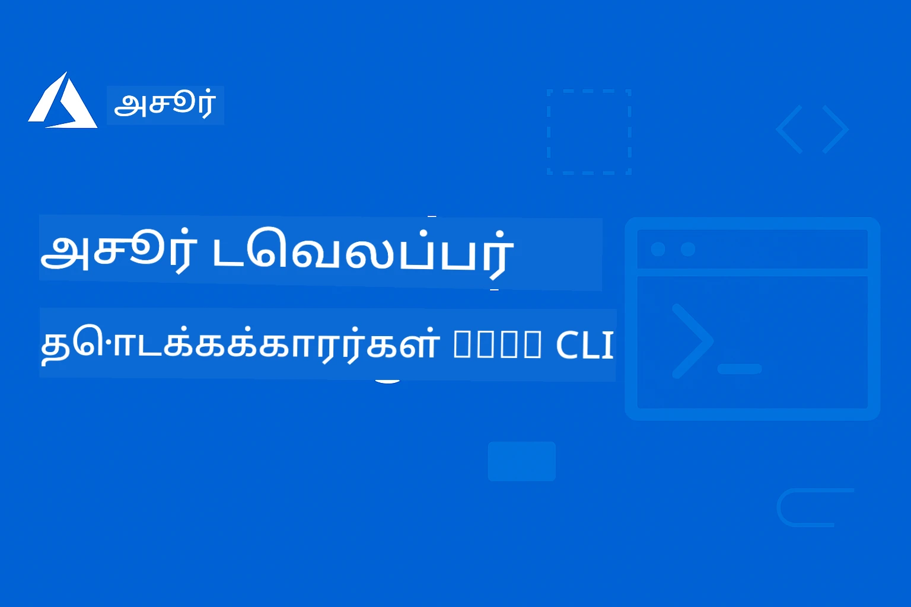

# AZD ஆரம்பக்காரர்களுக்கானது: ஒரு கட்டமைக்கப்பட்ட கற்றல் பயணம்

 

[](https://GitHub.com/microsoft/azd-for-beginners/watchers/)
[](https://GitHub.com/microsoft/azd-for-beginners/network/)
[](https://GitHub.com/microsoft/azd-for-beginners/stargazers/)

[](https://discord.gg/microsoft-azure)
[](https://discord.gg/nTYy5BXMWG)

---

### தானியங்கி மொழிபெயர்ப்புகள் (எப்போதும் புதுப்பிக்கப்பட்டவை)

<!-- CO-OP TRANSLATOR LANGUAGES TABLE START -->
[Arabic](../ar/README.md) | [Bengali](../bn/README.md) | [Bulgarian](../bg/README.md) | [Burmese (Myanmar)](../my/README.md) | [Chinese (Simplified)](../zh-CN/README.md) | [Chinese (Traditional, Hong Kong)](../zh-HK/README.md) | [Chinese (Traditional, Macau)](../zh-MO/README.md) | [Chinese (Traditional, Taiwan)](../zh-TW/README.md) | [Croatian](../hr/README.md) | [Czech](../cs/README.md) | [Danish](../da/README.md) | [Dutch](../nl/README.md) | [Estonian](../et/README.md) | [Finnish](../fi/README.md) | [French](../fr/README.md) | [German](../de/README.md) | [Greek](../el/README.md) | [Hebrew](../he/README.md) | [Hindi](../hi/README.md) | [Hungarian](../hu/README.md) | [Indonesian](../id/README.md) | [Italian](../it/README.md) | [Japanese](../ja/README.md) | [Kannada](../kn/README.md) | [Korean](../ko/README.md) | [Lithuanian](../lt/README.md) | [Malay](../ms/README.md) | [Malayalam](../ml/README.md) | [Marathi](../mr/README.md) | [Nepali](../ne/README.md) | [Nigerian Pidgin](../pcm/README.md) | [Norwegian](../no/README.md) | [Persian (Farsi)](../fa/README.md) | [Polish](../pl/README.md) | [Portuguese (Brazil)](../pt-BR/README.md) | [Portuguese (Portugal)](../pt-PT/README.md) | [Punjabi (Gurmukhi)](../pa/README.md) | [Romanian](../ro/README.md) | [Russian](../ru/README.md) | [Serbian (Cyrillic)](../sr/README.md) | [Slovak](../sk/README.md) | [Slovenian](../sl/README.md) | [Spanish](../es/README.md) | [Swahili](../sw/README.md) | [Swedish](../sv/README.md) | [Tagalog (Filipino)](../tl/README.md) | [Tamil](./README.md) | [Telugu](../te/README.md) | [Thai](../th/README.md) | [Turkish](../tr/README.md) | [Ukrainian](../uk/README.md) | [Urdu](../ur/README.md) | [Vietnamese](../vi/README.md)

> **உள்ளூரில் கிளோன் செய்ய விரும்புகிறீர்களா?**
>
> இந்த ரெப்போவில் 50+ மொழி மொழிபெயர்ப்புகள் உள்ளன, இது பதிவிறக்க அளவை குறிப்பாக அதிகரிக்கிறது. மொழிபெயர்ப்புகள் இல்லாமல் கிளோன் செய்ய sparse checkout ஐப் பயன்படுத்தவும்:
>
> **Bash / macOS / Linux:**
> ```bash
> git clone --filter=blob:none --sparse https://github.com/microsoft/AZD-for-beginners.git
> cd AZD-for-beginners
> git sparse-checkout set --no-cone '/*' '!translations' '!translated_images'
> ```
>
> **CMD (Windows):**
> ```cmd
> git clone --filter=blob:none --sparse https://github.com/microsoft/AZD-for-beginners.git
> cd AZD-for-beginners
> git sparse-checkout set --no-cone "/*" "!translations" "!translated_images"
> ```
>
> இது பாடநெறியை முடிக்க தேவையான அனைத்தையும் மிகவும் வேகமான பதிவிறக்கத்துடன் வழங்கும்.
<!-- CO-OP TRANSLATOR LANGUAGES TABLE END -->

## 🚀 Azure Developer CLI (azd) என்பது என்ன?

**Azure Developer CLI (azd)** என்பது Azure-க்கு பயன்பாடுகளை வெளியிட எளிதாக செய்யும், டெவலப்பர்-உதவிக்கு உகந்த கட்டளை வரிசை கருவி ஆகும். பல Azure வளங்களை கைமுறையாக உருவாக்கி இணைப்பதைப் பதிலாக, ஒரு jedinai கட்டளையுடன் முழு பயன்பாடுகளை நீங்கள் வெளியிடலாம்.

### `azd up` என்பதின் மாயம்

```bash
# இந்த ஒரே கட்டளை எல்லாவற்றையும் செய்கிறது:
# ✅ அனைத்து அஜூர் வளங்களையும் உருவாக்குகிறது
# ✅ நெட்வொர்க்கிங் மற்றும் பாதுகாப்பை கட்டமைக்கிறது
# ✅ உங்கள் பயன்பாட்டு கோடியை கட்டுகிறது
# ✅ அஜூர் வுக்கு அமைக்கிறது
# ✅ உங்களுக்கு ஒரு பணியாற்றும் URL ஐ தருகிறது
azd up
```

**அதே ரூபே!** Azure போர்ட்டலை கிளிக் செய்ய தேவையில்லை, குறிப்பிடத்தகுந்த ARM டெம்ப்ளேட்களை முதலில் கற்றுக்கொள்ள ரொம்பவும் தேவையில்லை, கைமுறையான கட்டமைப்பும் தேவையில்லை - வெறும் Azure-இல் இயங்கும் பயன்பாடுகள் தான்.

---

## ❓ Azure Developer CLI மற்றும் Azure CLI: வேறுபாடு என்ன?

இது புதியவர்களால் மிகவும் அடிக்கடி கேட்கப்படும் கேள்வி. இங்கே எளிய பதில் உள்ளது:

| அம்சம் | **Azure CLI (`az`)** | **Azure Developer CLI (`azd`)** |
|---------|---------------------|--------------------------------|
| **நோக்கம்** | தனித்தனி Azure வளங்களை நிர்வகிக்க | முழு பயன்பாடுகளை வெளியிட |
| **மனப்பான்மை** | கட்டமைப்பு-முகியம் | பயன்பாடு-முகியம் |
| **எடுத்துக்காட்டு** | `az webapp create --name myapp...` | `azd up` |
| **கற்றல் சவால்** | Azure சேவைகளை தெரிந்திருக்க வேண்டும் | உங்கள் செயலியை மட்டுமே அறிந்து கொள்ளுங்கள் |
| **சரியானது** | DevOps, கட்டமைப்பு நிர்வாகம் | டெவலப்பர்கள், புரோட்டோடைபிங் |

### எளிதான ஒப்புமை

- **Azure CLI** என்பது வீடு கட்டுவதற்கான அனைத்து கருவிகளையும் வைத்திருப்பதைப் போன்றது - ஆண் நியமங்கள், மெழுகு, நறுக்கிகள். நீங்கள் எதையாவது கட்டக்கூடாது, ஆனால் கட்டுமானத்தை அறிவதற்குத் தேவையுள்ளது.
- **Azure Developer CLI** என்பது ஒரு ஒப்பந்தக்காரரை கூலி எடுப்பதுபோலது - நீங்கள் என்ன வேண்டும் என்பதை விவரிக்கிறீர்கள், அவர்கள் கட்டுமானத்தை கையாள்கின்றனர்.

### எப்போது எதை பயன்படுத்துவது

| சூழ்நிலை | இதைப் பயன்படுத்தவும் |
|----------|----------|
| "நான் என் வலை செயலியை வேகமாக வெளியிட விரும்புகிறேன்" | `azd up` |
| "நான் ஒரு ஸ்டோரேஜ் கணக்கே உருவாக்க வேண்டும்" | `az storage account create` |
| "நான் முழு AI பயன்பாட்டை உருவாக்கி கொண்டிருக்கிறேன்" | `azd init --template azure-search-openai-demo` |
| "நான் ஒரு குறிப்பிட்ட Azure வளத்தை டீபக் செய்ய வேண்டும்" | `az resource show` |
| "நான் நிமிடங்களில் தயாரிப்பு-முனை வெளியீட்டை விரும்புகிறேன்" | `azd up --environment production` |

### அவை ஒன்றாக வேலை செய்கின்றன!

AZD பின்புலத்தில் Azure CLI ஐ பயன்படுத்துகிறது. நீங்கள் இரண்டையும் பயன்படுத்தலாம்:
```bash
# உங்கள் செயலியை AZD உடன் வெளியிடவும்
azd up

# பின்னர் Azure CLI உடன் குறிப்பிட்ட வளங்களை நுணுக்கமாகச் சரிசெய்யவும்
az webapp config set --name myapp --always-on true
```

---

## 🌟 Awesome AZD-ல் மாதிரிகளை காணுங்கள்

தோற்றத்திலிருந்து தொடங்க வேண்டாம்! **Awesome AZD** என்பது உடனுக்குடன் வெளியிட-ready மாதிரிகளின் சமூகத் தொகுப்பு ஆகும்:

| வளம் | விளக்கம் |
|----------|-------------|
| 🔗 [**Awesome AZD Gallery**](https://azure.github.io/awesome-azd/) | ஒரு கிளிக்கில் 200+ டெம்ப்ளேட்டுகளை உலாவவும் மற்றும் வெளியிடவும் |
| 🔗 [**Submit a Template**](https://github.com/Azure/awesome-azd/issues) | உங்கள் சொந்த டெம்ப்ளேட்டை சமூகத்திற்கு பிரதானமாகச் சேர்க்கவும் |
| 🔗 [**GitHub Repository**](https://github.com/Azure/awesome-azd) | ஸ்டார் விட்டு மூலக்கோவை ஆராயுங்கள் |

### Awesome AZD-இல் இருந்து பிரபலமான AI டெம்ப்ளேட்கள்

```bash
# ஏசூர் ஓபன்‌ஏஐ + ஏஐ தேடலும் கொண்ட RAG உரையாடல்
azd init --template azure-search-openai-demo

# விரைவு ஏஐ உரையாடல் பயன்பாடு
azd init --template openai-chat-app-quickstart

# ஃபவுண்ட்ரி முகவர்களுடன் ஏஐ முகவர்கள்
azd init --template get-started-with-ai-agents
```

---

## 🎯 3 படிகளிலான தொடக்கக்கையேடு

### படி 1: AZD ஐ நிறுவுதல் (2 நிமிடங்கள்)

**Windows:**
```powershell
winget install microsoft.azd
```

**macOS:**
```bash
brew tap azure/azd && brew install azd
```

**Linux:**
```bash
curl -fsSL https://aka.ms/install-azd.sh | bash
```

### படி 2: Azure-க்கு உள்நுழைவு

```bash
azd auth login
```

### படி 3: உங்கள் முதல் பயன்பாட்டை வெளியிடுதல்

```bash
# ஒரு வடிவமைப்பிலிருந்து துவக்கம் செய்யவும்
azd init --template todo-nodejs-mongo

# Azure-க்கு கையளிக்கவும் (எல்லாவற்றையும் உருவாக்குகிறது!)
azd up
```

**🎉 ஆகையே!** உங்கள் செயலி இப்போது Azure-இல் நேரடியாக செயல்படுகிறது.

### சுத்தம் செய்தல் (மறக்க வேண்டாம்!)

```bash
# Remove all resources when done experimenting
azd down --force --purge
```

---

## 📚 இந்த பாடநெறியை எவ்வாறு பயன்படுத்துவது

இந்த பாடநெறி **பிரகுத்தி கற்றலுக்காக** வடிவமைக்கப்பட்டுள்ளது - நீங்கள் சிக்கலற்ற இடத்திலிருந்து தொடங்கி மேலே ஏறுங்கள்:

| உங்கள் அனுபவம் | இங்கு தொடங்கவும் |
|-----------------|------------|
| **Azure-க்கு முற்றிலும் புதியவர்கள்** | [அத்தியாயம் 1: அடித்தளம்](../..) |
| **Azure-ஐ அறிவவர்கள், AZD-க்கு புதியவர்கள்** | [அத்தியாயம் 1: அடித்தளம்](../..) |
| **AI பயன்பாடுகளை வெளியிட விரும்புகிறீர்கள்** | [அத்தியாயம் 2: AI-முதன்மை மேம்பாடு](../..) |
| **கைபயிற்சி வேண்டும்** | [🎓 Interactive Workshop](workshop/README.md) - 3-4 மணி நேர வழிகாட்டப்பட்ட பரிசோதனை |
| **தயாரிப்பு மாதிரிகள் தேவை** | [அத்தியாயம் 8: தயாரிப்பு & நிறுவன மாதிரிகள்](../..) |

### உடனடி அமைப்பு

1. **இந்த ரெப்போவை Fork செய்யவும்**: [](https://GitHub.com/microsoft/azd-for-beginners/fork)
2. **இதை கிளோன் செய்யவும்**: `git clone https://github.com/YOUR-USERNAME/azd-for-beginners.git`
3. **உதவி பெறவும்**: [Azure Discord Community](https://discord.com/invite/ByRwuEEgH4)

> **உள்ளூரில் கிளோன் செய்ய விரும்புகிறீர்களா?**
>
> இந்த ரெப்போவில் 50+ மொழி மொழிபெயர்ப்புகள் உள்ளன, இது பதிவிறக்க அளவை குறிப்பிடத்தக்க வகையில் அதிகரிக்கிறது. மொழிபெயர்ப்புகள் இல்லாமல் கிளோன் செய்ய sparse checkout ஐப் பயன்படுத்தவும்:
> ```bash
> git clone --filter=blob:none --sparse https://github.com/microsoft/AZD-for-beginners.git
> cd AZD-for-beginners
> git sparse-checkout set --no-cone '/*' '!translations' '!translated_images'
> ```
> இது பாடநெறியை முடிக்க தேவையான அனைத்தையும் மிகவும் வேகமான பதிவிறக்கத்துடன் வழங்கும்.


## பாடநெறி மேலோட்டம்

முழுமையான கட்டமைக்கப்பட்ட அத்தியாயங்கள் மூலம் Azure Developer CLI (azd) ஐ கைமுறைப்படுத்துங்கள். **Microsoft Foundry ஒருங்கிணைப்புடன் AI பயன்பாடு வெளியீட்டில் சிறப்பு கவனம்.**

### இந்த பாடநெறி நவீன டெவலப்பர்களுக்காக அவசியமான காரணம்

Microsoft Foundry Discord சமூகத்தின் உள்ளறிவுகளின் அடிப்படையில், **45% டெவலப்பர்கள் AZD-ஐ AI பணிகளுக்காக பயன்படுத்த விரும்புகின்றனர்** ஆனால் அவர்கள் எதிர்கொள்ளும் சவால்கள்:
- பல-சேவை AI கட்டமைப்புகள் சிக்கலாகும்
- தயாரிப்பு AI வெளியீட்டு சிறந்த நடைமுறைகள்
- Azure AI சேவை ஒருங்கிணைப்பு மற்றும் கட்டமைப்பு
- AI பணிகளுக்கான செலவு (cost) 최적화
- AI-குறித்து குறிப்பிட்ட வெளியீட்டு பிரச்சினைகளை கண்டறிதல்

### கற்றல் இலக்குகள்

இந்த கட்டமைக்கப்பட்ட பாடநெறியை முடித்தவுடன், நீங்கள்:
- **AZD அடிப்படைகளை ஆற்றல் பெறுவீர்கள்**: கோர் கொள்கைகள், நிறுவல் மற்றும் கட்டமைப்பு
- **AI பயன்பாடுகளை வெளியிடுவீர்கள்**: Microsoft Foundry சேவைகள் உடன் AZD ஐ பயன்படுத்துதல்
- **Infrastructure as Code ஐ அமல்படுத்துவீர்கள்**: Bicep டெம்ப்ளேட்டுகளுடன் Azure வளங்களை நிர்வகித்தல்
- **வெளியீட்டு பிழைகளை தீர்க்கலாம்**: பொதுவான பிரச்சினைகளை தீர்க்கவும் மற்றும் டீபக் செய்வது
- **தயாரிப்புக்கு உகந்தபடி ஒப்டிமைஸ் செய்யவும்**: பாதுகாப்பு, அளவீடு, மானிட்டரிங் மற்றும் செலவு மேலாண்மை
- **பல்வேறு-ஏஜென்ட் தீர்வுகளை கட்டமைக்கவும்**: சிக்கலான AI கட்டமைப்புகளை வெளியிடுதல்

## 🗺️ பாடநெறி வரைபடம்: அத்தியாயத்தின்படி விரைவு வழிசெலுத்தல்

ஒவ்வொரு அத்தியாயத்துக்கும் கற்றல் இலக்குகள், உடனடி தொடக்கங்கள் மற்றும் பயிற்சிகள் கொண்ட தனியாக README உள்ளது:

| அத்தியாயம் | பொருள் | பாடங்கள் | காலம் | சிக்கல் |
|---------|-------|---------|----------|------------|
| **[அத்தியாயம் 1: அடித்தளம்](docs/chapter-01-foundation/README.md)** | தொடக்கம் | [AZD அடிப்படைகள்](docs/chapter-01-foundation/azd-basics.md) &#124; [நிறுவுதல்](docs/chapter-01-foundation/installation.md) &#124; [முதல் திட்டம்](docs/chapter-01-foundation/first-project.md) | 30-45 நிமிடம் | ⭐ |
| **[அத்தியாயம் 2: AI-முதன்மை மேம்பாடு](docs/chapter-02-ai-development/README.md)** | AI-முதன்மை பயன்பாடுகள் | [Foundry ஒருங்கிணைப்பு](docs/chapter-02-ai-development/microsoft-foundry-integration.md) &#124; [AI ஏஜென்ட்கள்](docs/chapter-02-ai-development/agents.md) &#124; [மாதிரி வெளியீடு](docs/chapter-02-ai-development/ai-model-deployment.md) &#124; [வார்க்ஷாப்](docs/chapter-02-ai-development/ai-workshop-lab.md) | 1-2 மணி | ⭐⭐ |
| **[அத்தியாயம் 3: கட்டமைப்பு](docs/chapter-03-configuration/README.md)** | அங்கீகாரம் & பாதுகாப்பு | [கட்டமைப்பு](docs/chapter-03-configuration/configuration.md) &#124; [அங்கீகாரம் & பாதுகாப்பு](docs/chapter-03-configuration/authsecurity.md) | 45-60 நிமிடம் | ⭐⭐ |
| **[அத்தியாயம் 4: அடித்தள அமைப்பு](docs/chapter-04-infrastructure/README.md)** | IaC மற்றும் வெளியீடு | [வெளியீடு வழிகாட்டு](docs/chapter-04-infrastructure/deployment-guide.md) &#124; [வளங்கள் வழங்கல்](docs/chapter-04-infrastructure/provisioning.md) | 1-1.5 மணி | ⭐⭐⭐ |
| **[அத்தியாயம் 5: பல முகவர்](docs/chapter-05-multi-agent/README.md)** | ஏஐ முகவர் தீர்வுகள் | [சில்லறை காட்சி](examples/retail-scenario.md) &#124; [ஒத்துழைப்பு படைமுறைகள்](docs/chapter-06-pre-deployment/coordination-patterns.md) | 2-3 மணி | ⭐⭐⭐⭐ |
| **[அத்தியாயம் 6: முன்னணி-வெளியீடு](docs/chapter-06-pre-deployment/README.md)** | திட்டமிடல் மற்றும் சரிபார்ப்பு | [முன்-பறக்கும் சோதனைகள்](docs/chapter-06-pre-deployment/preflight-checks.md) &#124; [திறன் திட்டமிடல்](docs/chapter-06-pre-deployment/capacity-planning.md) &#124; [SKU தேர்வு](docs/chapter-06-pre-deployment/sku-selection.md) &#124; [App Insights](docs/chapter-06-pre-deployment/application-insights.md) | 1 மணி | ⭐⭐ |
| **[அத்தியாயம் 7: பிழை தீர்த்து நோக்கு](docs/chapter-07-troubleshooting/README.md)** | டீபக் & சரி செய் | [பொதுவான பிரச்சினைகள்](docs/chapter-07-troubleshooting/common-issues.md) &#124; [டி பக் செய்யல்](docs/chapter-07-troubleshooting/debugging.md) &#124; [ஏஐ பிரச்சினைகள்](docs/chapter-07-troubleshooting/ai-troubleshooting.md) | 1-1.5 மணி | ⭐⭐ |
| **[அத்தியாயம் 8: உற்பத்தி](docs/chapter-08-production/README.md)** | எந்திரவியல் மாதிரிகள் | [உற்பத்தி நடைமுறைகள்](docs/chapter-08-production/production-ai-practices.md) | 2-3 மணி | ⭐⭐⭐⭐ |
| **[🎓 Workshop](workshop/README.md)** | கைமுறைப் பயிற்சி | [அறிமுகம்](workshop/docs/instructions/0-Introduction.md) &#124; [தேர்வு](workshop/docs/instructions/1-Select-AI-Template.md) &#124; [சரிபார்ப்பு](workshop/docs/instructions/2-Validate-AI-Template.md) &#124; [பிரிப்பு](workshop/docs/instructions/3-Deconstruct-AI-Template.md) &#124; [கட்டமைப்பு](workshop/docs/instructions/4-Configure-AI-Template.md) &#124; [தனிப்பயன் செய்தல்](workshop/docs/instructions/5-Customize-AI-Template.md) &#124; [அமைப்பை அகற்றுதல்](workshop/docs/instructions/6-Teardown-Infrastructure.md) &#124; [முடிவு](workshop/docs/instructions/7-Wrap-up.md) | 3-4 மணி | ⭐⭐ |

**மொத்த பாடநெறி நீடித்த காலம்:** ~10-14 மணி | **திறன் முன்னேற்றம்:** தொடக்க நிலை → உற்பத்தி-தயார்

---

## 📚 கற்கும் அத்தியாயங்கள்

*உங்கள் அனுபவம் நிலை மற்றும் இலக்குகளைப் பொருத்து கற்றல் பாதையை தேர்ந்தெடுக்கவும்*

### 🚀 அத்தியாயம் 1: அடித்தளம் மற்றும் விரைவான துவக்கம்
**முன்‌தேவைகள்**: Azure சந்தா, அடிப்படை கட்டளை வரி அறிவு  
**கால அளவு**: 30-45 நிமிடம்  
**சிக்கல்தன்மை**: ⭐

#### நீங்கள் கற்றுக் கொள்வீர்கள்
- Azure Developer CLI அடிப்படிகளைப் புரிந்துகொள்ளுதல்
- உங்கள் தளத்தில் AZD-ஐ நிறுவுதல்
- உங்கள் முதல் வெற்றிகரமான வெளியீடு

#### கற்கும் வளங்கள்
- **🎯 இங்கிருந்து தொடங்கவும்**: [Azure Developer CLI என்றால் என்ன?](../..)
- **📖 தத்துவம்**: [AZD அடிப்படைகள்](docs/chapter-01-foundation/azd-basics.md) - முக்கிய கருத்துகள் மற்றும் 용어
- **⚙️ அமைவு**: [நிறுவல் மற்றும் அமைப்பு](docs/chapter-01-foundation/installation.md) - தள-சார்ந்த வழிகாட்டிகள்
- **🛠️ நடைமுறை**: [உங்கள் முதல் திட்டம்](docs/chapter-01-foundation/first-project.md) - படி படியாக வழிகாட்டி
- **📋 விரைவு அறிக்கை**: [கட்டளை குறுங்குறிப்பு](resources/cheat-sheet.md)

#### நடைமுறை பயிற்சிகள்
```bash
# விரைவு நிறுவல் சோதனை
azd version

# உங்கள் முதன்மை செயலியை நிறுவவும்
azd init --template todo-nodejs-mongo
azd up
```

**💡 அத்தியாய முடிவு**: AZD பயன்படுத்தி Azure-க்கு ஒரு எளிய வலைப் பயன்பாட்டை வெற்றிகரமாக வெளியிடுதல்

**✅ வெற்றி சரிபார்ப்பு:**
```bash
# அத்தியாயம் 1 ஐ முடித்தவுடன், நீங்கள் இதைச் செய்ய முடியும்:
azd version              # நிறுவப்பட்ட பதிப்பை காட்டுகிறது
azd init --template todo-nodejs-mongo  # திட்டத்தை ஆரம்பிக்கிறது
azd up                  # Azure இல் நிறுவுகிறது
azd show                # செயலாக்கத்தில் உள்ள செயலியின் URL ஐ காட்டுகிறது
# விண்ணப்பம் உலாவியில் திறந்து செயல்படுகிறது
azd down --force --purge  # வளங்களை சுத்தப்படுத்துகிறது
```

**📊 நேர முதலீடு:** 30-45 நிமிடம்  
**📈 பிறகு திறன் நிலை:** அடிப்படை பயன்பாடுகளை தன்மாக வெளியிட முடியும்நிறை

**✅ வெற்றி சரிபார்ப்பு:**
```bash
# அத்தியாயம் 1 முடித்தவுடன், நீங்கள் இதைச் செய்யக் கூடியதாக இருப்பீர்கள்:
azd version              # நிறுவப்பட்ட பதிப்பைக் காட்டுகிறது
azd init --template todo-nodejs-mongo  # திட்டத்தை துவக்குகிறது
azd up                  # Azure-இல் வெளியிடுகிறது
azd show                # இயங்கும் செயலியின் URL-ஐ காட்டுகிறது
# பயன்பாடு உலாவியில் திறக்கப்படுகிறது மற்றும் செயல்படுகிறது
azd down --force --purge  # வளங்களை சுத்தம் செய்கிறது
```

**📊 நேர முதலீடு:** 30-45 நிமிடம்  
**📈 பிறகு திறன் நிலை:** அடிப்படை பயன்பாடுகளை தன்மாக வெளியிட முடியும்

---

### 🤖 அத்தியாயம் 2: ஏஐ-முதன்மை மேம்பாடு (ஏஐ டெவலப்பர்களுக்கு பரிந்துரை)
**முன்‌தேவைகள்**: அத்தியாயம் 1 முடிக்கப்பட்டது  
**கால அளவு**: 1-2 மணி  
**சிக்கல்தன்மை**: ⭐⭐

#### நீங்கள் கற்றுக் கொள்வீர்கள்
- Microsoft Foundry மற்றும் AZD இணைப்பு
- ஏஐ சக்தி கொண்ட பயன்பாடுகளை வெளியிடுதல்
- ஏஐ சேவைகள் கட்டமைப்புகளை புரிந்துகொள்ளுதல்

#### கற்கும் வளங்கள்
- **🎯 இங்கிருந்து தொடங்கவும்**: [Microsoft Foundry Integration](docs/chapter-02-ai-development/microsoft-foundry-integration.md)
- **🤖 ஏஐ முகவர்கள்**: [AI Agents Guide](docs/chapter-02-ai-development/agents.md) - AZD-ஐ பயன்படுத்தி நுண்ணறிவு முகவர்களை வெளியிடுவது
- **📖 மாதிரிகள்**: [AI Model Deployment](docs/chapter-02-ai-development/ai-model-deployment.md) - ஏஐ மாதிரிகளை வெளியிட்டு நிர்வகிப்பது
- **🛠️ வேலைப்பகம்**: [AI Workshop Lab](docs/chapter-02-ai-development/ai-workshop-lab.md) - உங்கள் ஏஐ தீர்வுகளை AZD-க்கு தயாராக்குதல்
- **🎥 இடையூறற்ற வழிகாட்டு**: [Workshop Materials](workshop/README.md) - MkDocs * DevContainer சூழலில் உலாவி-அடிப்படையிலான கற்கை
- **📋 மாதிரிகள்**: [Featured Microsoft Foundry Templates](../..)
- **📝 உதாரணங்கள்**: [AZD Deployment Examples](examples/README.md)

#### நடைமுறை பயிற்சிகள்
```bash
# உங்கள் முதல் AI பயன்பாட்டை வெளியிடவும்
azd init --template azure-search-openai-demo
azd up

# மேலும் AI மாதிரிகளை முயற்சி செய்யவும்
azd init --template openai-chat-app-quickstart
azd init --template agent-openai-python-prompty
```

**💡 அத்தியாய முடிவு**: RAG திறன்களுடன் ஒரு ஏஐ-சக்தி கொண்ட உரையாடல் பயன்பாட்டை வெளியிடவும் மற்றும் கட்டமைக்கவும்

**✅ வெற்றி சரிபார்ப்பு:**
```bash
# அத்தியாயம் 2 முடிந்தவுடன், நீங்கள் இதை செய்யக் கூடியவராக இருக்க வேண்டும்:
azd init --template azure-search-openai-demo
azd up
# ஏஐ உரையாடல் இடைமுகத்தை சோதிக்கவும்
# கேள்விகள் கேட்டு ஆதாரங்களுடன் கூடிய ஏஐ-செயல்படுத்தப்பட்ட பதிலுகளைப் பெறுங்கள்
# தேடல் ஒருங்கிணைவு செயல்படுவதை சரிபார்க்கவும்
azd monitor  # Application Insights டெலிமெட்ரியை காட்டுகிறது என்பதை சரிபார்க்கவும்
azd down --force --purge
```

**📊 நேர முதலீடு:** 1-2 மணி  
**📈 பிறகு திறன் நிலை:** உற்பத்தி-தயார் ஏஐ பயன்பாடுகளை வெளியிட்டு கட்டமைக்க முடியும்  
**💰 செலவு அறிவு:** Dev செலவுகள் $80-150/மாதம், உற்பத்தி செலவுகள் $300-3500/மாதம் வரை ஆகலாம்

#### 💰 ஏஐ வெளியீடுகளுக்கான செலவுக்கணக்குகள்

**வिकசனை சூழல் (கணிக்கப்பட்டது $80-150/மாதம்):**
- Azure OpenAI (Pay-as-you-go): $0-50/மாதம் (token பயன்பாட்டின் அடிப்படையில்)
- AI Search (அடிப்படை நிலை): $75/மாதம்
- Container Apps (கட்டணம்-பயன்பாடு): $0-20/மாதம்
- சேமிப்பு (சாதாரண): $1-5/மாதம்

**உற்பத்தி சூழல் (கணிக்கப்பட்டது $300-3,500+/மாதம்):**
- Azure OpenAI (PTU இணையான செயல்திறனுக்காக): $3,000+/மாதம் அல்லது அதிகமான வால்யூமுடன் Pay-as-go
- AI Search (நிலையான நிலை): $250/மாதம்
- Container Apps (ஒதுக்கப்பட்டவை): $50-100/மாதம்
- Application Insights: $5-50/மாதம்
- சேமிப்பு (ப்ரீமியம்): $10-50/மாதம்

**💡 செலவு சாதகத்தன்மை குறிப்புகள்:**
- கற்றலுக்காக **Free Tier** Azure OpenAI ஐ பயன்படுத்தவும் (50,000 tokens/மாதம் அடங்கியுள்ளது)
- செயலில் இல்லாமல் இருக்கும் போது வளங்களை வெளியேற்ற `azd down` இயக்குக
- உற்பத்திக்காக மட்டுமே PTU-வுக்கு மேம்படுத்தாமல், தொடக்கத்தில் consumption-based கட்டணத்தைப் பயன்படுத்துங்கள்
- வெளியீட்டிற்கு முன் செலவுகளை மதிப்பிட `azd provision --preview` இயக்குக
- தானியக்க அளவீட்டை இயக்கவும்: பயன்பாட்டிற்கே ஏற்ப செலவுகளை மட்டுமே செலுத்துங்கள்

**செலவு கண்காணிப்பு:**
```bash
# மாதாந்திர மதிப்பிடப்பட்ட செலவுகளை சரிபார்க்கவும்
azd provision --preview

# Azure போர்டலில் உண்மையான செலவுகளை கண்காணிக்கவும்
az consumption budget list --resource-group <your-rg>
```

---

### ⚙️ அத்தியாயம் 3: அமைப்பு & அடையாளம் உறுதிப்படுத்தல்
**முன்‌தேவைகள்**: அத்தியாயம் 1 முடிக்கப்பட்டது  
**கால அளவு**: 45-60 நிமிடம்  
**சிக்கல்தன்மை**: ⭐⭐

#### நீங்கள் கற்றுக் கொள்வீர்கள்
- சூழல் கட்டமைப்பை நிர்வகித்தல்
- அங்கீகாரம் மற்றும் பாதுகாப்பு சிறந்த நடைமுறைகள்
- வள நாமகரிப்பு மற்றும் அமைப்பு

#### கற்கும் வளங்கள்
- **📖 கட்டமைப்பு**: [Configuration Guide](docs/chapter-03-configuration/configuration.md) - சூழல் அமைப்பு
- **🔐 பாதுகாப்பு**: [Authentication patterns and managed identity](docs/chapter-03-configuration/authsecurity.md) - அங்கீகார மாதிரிகள்
- **📝 உதாரணங்கள்**: [Database App Example](examples/database-app/README.md) - AZD தரவுத்தள உதாரணங்கள்

#### நடைமுறை பயிற்சிகள்
- பல சூழல்களை (dev, staging, prod) கட்டமைக்கவும்
- மேலாண்மை அடையாள அங்கீகாரத்தை அமைக்கவும்
- சூழல்-கேட்பான கட்டமைப்புகளை செயல்படுத்தவும்

**💡 அத்தியாய முடிவு**: சரியான அங்கீகாரம் மற்றும் பாதுகாப்புடன் பல சூழல்களை நிர்வகிக்க கூடிய திறன்

---

### 🏗️ அத்தியாயம் 4: Infrastructure as Code & வெளியீடு
**முன்‌தேவைகள்**: அத்தியாயங்கள் 1-3 முடிக்கப்பட்டவை  
**கால அளவு**: 1-1.5 மணி  
**சிக்கல்தன்மை**: ⭐⭐⭐

#### நீங்கள் கற்றுக் கொள்வீர்கள்
- மேம்பட்ட வெளியீட்டு மாதிரிகள்
- Bicep-இன் மூலம் Infrastructure as Code
- வளம் வழங்கும் रणनीதிகள்

#### கற்கும் வளங்கள்
- **📖 வெளியீடு**: [Deployment Guide](docs/chapter-04-infrastructure/deployment-guide.md) - முழுமையான வேலைப்பFlow
- **🏗️ வளங்கள் வழங்கல்**: [Provisioning Resources](docs/chapter-04-infrastructure/provisioning.md) - Azure வள நிர்வகிப்பு
- **📝 உதாரணங்கள்**: [Container App Example](../../examples/container-app) - கொண்டெய்னர் இயங்கும் வெளியீடுகள்

#### நடைமுறை பயிற்சிகள்
- தனிப்பயன் Bicep மாதிரிகளை உருவாக்கவும்
- பல சேவை பயன்பாடுகளை வெளியிடவும்
- blue-green வெளியீட்டு தந்திரிகளை அமல்படுத்தவும்

**💡 அத்தியாய முடிவு**: தனிப்பயன் அடித்தள மாதிரிகளைப் பயன்படுத்தி பல சேவைகள் கொண்ட சிக்கலான பயன்பாடுகளை வெளியிடுதல்

---

### 🎯 அத்தியாயம் 5: பல-முகவர் ஏஐ தீர்வுகள் (அதிக வல்லுநர்)
**முன்‌தேவைகள்**: அத்தியாயங்கள் 1-2 முடிக்கப்பட்டவை  
**கால அளவு**: 2-3 மணி  
**சிக்கல்தன்மை**: ⭐⭐⭐⭐

#### நீங்கள் கற்றுக் கொள்வீர்கள்
- பல முகவர் கட்டமைப்பு மாதிரிகள்
- முகவர் ஒழுங்கமைப்பு மற்றும் ஒத்திசைவு
- உற்பத்தி-தயார் ஏஐ வெளியீடுகள்

#### கற்கும் வளங்கள்
- **🤖 சிறப்பு திட்டம்**: [Retail Multi-Agent Solution](examples/retail-scenario.md) - முழுமையான செயலாக்கம்
- **🛠️ ARM மாதிரிகள்**: [ARM Template Package](../../examples/retail-multiagent-arm-template) - ஒரு கிளிக்கில் வெளியீடு
- **📖 கட்டமைப்பு**: [Multi-agent coordination patterns](docs/chapter-06-pre-deployment/coordination-patterns.md) - ஒத்துழைப்பு மாதிரிகள்

#### நடைமுறை பயிற்சிகள்
```bash
# முழுமையான சில்லறை பல-ஏஜென்ட் தீர்வை நிறுவவும்
cd examples/retail-multiagent-arm-template
./deploy.sh

# ஏஜென்ட் கட்டமைப்புகளை ஆராயவும்
az deployment group show --resource-group <rg-name> --name <deployment-name>
```

**💡 அத்தியாய முடிவு**: Customer மற்றும் Inventory முகவர்களுடன் உற்பத்தி-தயார் பல-முகவர் ஏஐ தீர்வுகளை வெளியிட்டு நிர்வகித்தல்

---

### 🔍 அத்தியாயம் 6: முன்னணி-வெளியீடு சரிபார்ப்பு & திட்டமிடல்
**முன்‌தேவைகள்**: அத்தியாயம் 4 முடிக்கப்பட்டது  
**கால அளவு**: 1 மணி  
**சிக்கல்தன்மை**: ⭐⭐

#### நீங்கள் கற்றுக் கொள்வீர்கள்
- திறன் திட்டமிடல் மற்றும் வள சரிபார்ப்பு
- SKU தேர்வு நெறிமுறைகள்
- முன்-பறக்கும் சோதனைகள் மற்றும் தானியக்க செயல்முறை

#### கற்கும் வளங்கள்
- **📊 திட்டமிடல்**: [Capacity Planning](docs/chapter-06-pre-deployment/capacity-planning.md) - வள சரிபார்ப்பு
- **💰 தேர்வு**: [SKU Selection](docs/chapter-06-pre-deployment/sku-selection.md) - செலவுக்கு பொருத்தமான தேர்வுகள்
- **✅ சரிபார்ப்பு**: [Pre-flight Checks](docs/chapter-06-pre-deployment/preflight-checks.md) - தானியக்க ஸ்கிரிப்டுகள்

#### நடைமுறை பயிற்சிகள்
- திறன் சரிபார்ப்பு ஸ்கிரிப்டுகளை இயக்கவும்
- செலவு குறைக்க SKU தேர்வுகளை 최적화 செய்யவும்
- முன்-வெளியீடு தானியக்க சோதனைகளை அமல்படுத்தவும்

**💡 அத்தியாய முடிவு**: செயற்படுத்தும் முன் வெளியீடுகளை சரிபார்த்து 최적화 செய்க

---

### 🚨 அத்தியாயம் 7: பிழை நீக்கல் & டீபக்கிங்
**முன்‌தேவைகள்**: எந்தவொரு வெளியீட்டு அத்தியாயமும் முடிக்கப்பட்டிருந்தால்  
**கால அளவு**: 1-1.5 மணி  
**சிக்கல்தன்மை**: ⭐⭐

#### நீங்கள் கற்றுக் கொள்வீர்கள்
- வரிசையாக டீபக்கிங் அணுகுமுறைகள்
- பொதுவான பிரச்சினைகள் மற்றும் தீர்வுகள்
- ஏஐ-சார்ந்த பிழை தீர்த்தல்

#### கற்கும் வளங்கள்
- **🔧 பொதுவான பிரச்சினைகள்**: [Common Issues](docs/chapter-07-troubleshooting/common-issues.md) - கேள்விகள் மற்றும் தீர்வுகள்
- **🕵️ டீபக்கிங்**: [Debugging Guide](docs/chapter-07-troubleshooting/debugging.md) - படி படியாக_Strategies
- **🤖 ஏஐ பிரச்சினைகள்**: [AI-Specific Troubleshooting](docs/chapter-07-troubleshooting/ai-troubleshooting.md) - ஏஐ சேவை பிரச்சினைகள்

#### நடைமுறை பயிற்சிகள்
- வெளியீட்டு தோல்விகளை கண்டறியவும்
- அங்கீகாரம் பிரச்சினைகளை தீர்க்கவும்
- ஏஐ சேவை இணைப்பை டீபக் செய்யவும்

**💡 அத்தியாய முடிவு**: பொதுவான வெளியீட்டு பிரச்சினைகளை தனியாக கண்டறிந்து தீர்க்க கூடிய திறன்

---

### 🏢 அத்தியாயம் 8: உற்பத்தி & எந்திரவியல் மாதிரிகள்
**முன்‌தேவைகள்**: அத்தியாயங்கள் 1-4 முடிக்கப்பட்டவை  
**கால அளவு**: 2-3 மணி  
**சிக்கல்தன்மை**: ⭐⭐⭐⭐

#### நீங்கள் கற்றுக் கொள்வீர்கள்
- உற்பத்தி வெளியீட்டு 전략ங்கள்
- எந்திரவியல் பாதுகாப்பு மாதிரிகள்
- கண்காணிப்பு மற்றும் செலவு 최적화

#### கற்கும் வளங்கள்
- **🏭 உற்பத்தி**: [Production AI Best Practices](docs/chapter-08-production/production-ai-practices.md) - எந்திரவியல் மாதிரிகள்
- **📝 உதாரணங்கள்**: [Microservices Example](../../examples/microservices) - சிக்கலான கட்டமைப்புகள்
- **📊 கண்காணிப்பு**: [Application Insights integration](docs/chapter-06-pre-deployment/application-insights.md) - கண்காணிப்பு

#### நடைமுறை பயிற்சிகள்
- எந்திரவியல் பாதுகாப்பு மாதிரிகளை அமல்படுத்தவும்
- முழுமையான கண்காணிப்பை அமைக்கவும்
- ஒழுங்குப்படுத்தலுடன் உற்பத்திக்கு வெளியிடவும்

**💡 அத்தியாய முடிவு**: முழுமையான உற்பத்தி திறன்களுடன் எந்திரவியல்-தயார் பயன்பாடுகளை வெளியிடுதல்

---

## 🎓 Workshop கண்ணோட்டம்: கைமுறை கற்றல் அனுபவம்

> **⚠️ WORKSHOP நிலை: செயலில் வளர்ச்சியில் உள்ளது**
> வொர்க்ஷாப் வளங்கள் தற்போது உருவாக்கப்படுவதையும் சீரமைக்கப்படுவதையும் உண்டு. முக்கிய மாடுல்கள் செயல்பாட்டிலுள்ளது, ஆனால் சில மேம்பட்ட பிரிவுகள் இன்னும் பூர்த்தியாக அல்ல. நாங்கள் அனைத்து உள்ளடக்கங்களையும் முடிக்க செயலில் இருக்கிறோம். [திறன்பார்வையை கண்காணிக்க →](workshop/README.md)

### இடைமறை வொர்க்ஷாப் வளங்கள்
**உலாவி அடிப்படையிலான கருவிகளுடன் மற்றும் வழிகாட்டும் பயிற்சிகளுடன் விரிவான கைமுறை கற்றல்**

எங்கள் வொர்க்ஷாப் வளங்கள் மேலே உள்ள அத்தியாய அடிப்படையிலான பாடத்திட்டத்தை complemento செய்யும் கட்டமைக்கப்பட்ட, இடைமறை கற்றல் அனுபவத்தை வழங்குகின்றன. வொர்க்ஷாப் தன்னிச்சையான கற்றலும் பயிற்சியாளர்கள் வழிநடத்தும் அம்சங்களும் இரண்டிற்கும் வடிவமைக்கப்பட்டுள்ளது.

#### 🛠️ வொர்க்ஷாப் அம்சங்கள்
- **உலாவி அடிப்படையிலான இடைமுகம்**: தேடல், நகலெடுக்க, மற்றும் தீம் அம்சங்களுடன் முழுமையான MkDocs-அலங்கரிக்கப்பட்ட வொர்க்ஷாப்
- **GitHub Codespaces ஒருங்கிணைப்பு**: ஒரே கிளிக்கில் அபிவிருத்தி சூழலை அமைக்க
- **கட்டமைக்கப்பட்ட கற்பித்தல் பாதை**: 8-மாடுல் வழிநடத்தப்பட்ட பயிற்சிகள் (மொத்தம் 3-4 மணி)
- **முன்னேற்ற முறைமை**: அறிமுகம் → தேர்வு → சரிபார்ப்பு → பகுப்பாய்வு → கட்டமைப்பு → தனிப்பயனாக்கம் → அகற்றம் → முடிவு
- **இடைமுக DevContainer சூழல்**: முன்கட்டமைக்கப்பட்ட கருவிகள் மற்றும் சார்புகள்

#### 📚 வொர்க்ஷாப் மாடுல் கட்டமைப்பு
வொர்க்ஷாப் கண்டுபிடிப்பிலிருந்து பொருளாக்க நிபுணத்துவத்திற்கு நீங்கள் எடுத்துச் செய்கின்ற **8-மாடுல் முன்னேற்ற முறைமையை** பின்பற்றுகிறது:

| Module | Topic | What You'll Do | Duration |
|--------|-------|----------------|----------|
| **0. Introduction** | Workshop Overview | Understand learning objectives, prerequisites, and workshop structure | 15 min |
| **1. Selection** | Template Discovery | Explore AZD templates and select the right AI template for your scenario | 20 min |
| **2. Validation** | Deploy & Verify | Deploy the template with `azd up` and validate infrastructure works | 30 min |
| **3. Deconstruction** | Understand Structure | Use GitHub Copilot to explore template architecture, Bicep files, and code organization | 30 min |
| **4. Configuration** | azure.yaml Deep Dive | Master `azure.yaml` configuration, lifecycle hooks, and environment variables | 30 min |
| **5. Customization** | Make It Yours | Enable AI Search, tracing, evaluation, and customize for your scenario | 45 min |
| **6. Teardown** | Clean Up | Safely deprovision resources with `azd down --purge` | 15 min |
| **7. Wrap-up** | Next Steps | Review accomplishments, key concepts, and continue your learning journey | 15 min |

**வொர்க்ஷாப் ప్రవাহம்:**
```
Introduction → Selection → Validation → Deconstruction → Configuration → Customization → Teardown → Wrap-up
     ↓            ↓           ↓              ↓               ↓              ↓            ↓           ↓
  Overview    Find the     Deploy &      Explore        Master         Customize     Clean up    Review &
             right        verify        code &        azure.yaml      for your      resources   next steps
             template                   structure                     scenario
```

#### 🚀 வொர்க்ஷாப்புடன் தொடங்குவது
```bash
# விருப்பம் 1: GitHub Codespaces (பரிந்துரைக்கப்படுகிறது)
# ரெப்போசிடரியில் "Code" → "Create codespace on main" ஐ கிளிக் செய்யவும்

# விருப்பம் 2: உள்ளூர் மேம்பாடு
git clone https://github.com/microsoft/azd-for-beginners.git
cd azd-for-beginners/workshop
# workshop/README.md இல் உள்ள அமைப்பு வழிமுறைகளைப் பின்பற்றவும்
```

#### 🎯 வொர்க்ஷாப் கற்றல் முடிவுகள்
வொர்க்ஷாப் நிறைவு செய்தால் பங்கேற்பாளர்கள்:
- **உற்பத்தி நிலைக்கு AI பயன்பாடுகளை வெளியிடுவது**: Microsoft Foundry சேவைகள் உடன் AZD பயன்படுத்துதல்
- **பல-ஏஜென்ட் கட்டமைப்புகளில் நிபுணத்துவம் பெறுதல்**: ஒருங்கிணைந்த AI முகவர் தீர்வுகளை அமல்படுத்துதல்
- **பாதுகாப்பு சிறந்த நடைமுறைகளை அமல்படுத்துதல்**: அங்கீகரிப்பு மற்றும் அணுகல் கட்டுப்பாட்டை கோரியாக தொகுத்தல்
- **அளவிற்கு உகந்தவாறு சிறப்பாக்குதல்**: செலவு-திறன் கோட்பாடுகளுடன் வடிவமைத்தல்
- **பதிவேற்ற சிக்கல்களை தீர்க்குதல்**: பொதுவான பிரச்சினைகளை சுயமாகத் தீர்ப்பது

#### 📖 வொர்க்ஷாப் வளங்கள்
- **🎥 இடைமறை வழிகாட்டு**: [Workshop Materials](workshop/README.md) - உலாவி-அடிப்படையிலான கற்றல் சூழல்
- **📋 மாடுல் பயிற்சிகள் த அதனடி**:
  - [0. அறிமுகம்](workshop/docs/instructions/0-Introduction.md) - வொர்க்ஷாப் கண்ணோட்டமும் நோக்கங்களும்
  - [1. தேர்வு](workshop/docs/instructions/1-Select-AI-Template.md) - AI வார்ப்புருக்களை கண்டறிந்து தேர்வு செய்யுதல்
  - [2. சரிபார்ப்பு](workshop/docs/instructions/2-Validate-AI-Template.md) - வார்ப்புருக்களை பதிவேற்றி சரிபார்த்தல்
  - [3. பகுப்பாய்வு](workshop/docs/instructions/3-Deconstruct-AI-Template.md) - வார்ப்புரு கட்டமைப்பை ஆராய்தல்
  - [4. கட்டமைப்பு](workshop/docs/instructions/4-Configure-AI-Template.md) - `azure.yaml` மீது கைதிறன் பெறுதல்
  - [5. தனிப்பயனாக்கம்](workshop/docs/instructions/5-Customize-AI-Template.md) - உங்கள் сценарிக்கு ஏற்ப விரீதப்படுத்தல்
  - [6. அகற்றுதல்](workshop/docs/instructions/6-Teardown-Infrastructure.md) - வளங்களை சுத்தமாக அகற்றுதல்
  - [7. முடிவுரை](workshop/docs/instructions/7-Wrap-up.md) - மதிப்பாய்வு மற்றும் அடுத்த படிகள்
- **🛠️ AI Workshop Lab**: [AI Workshop Lab](docs/chapter-02-ai-development/ai-workshop-lab.md) - AI குறிக்கோள்களை கவனித்த பயிற்சிகள்
- **💡 விரைவான தொடக்க வழிகாட்டு**: [Workshop Setup Guide](workshop/README.md#quick-start) - சூழல் அமைப்பு

**சரியானது**: நிறுவனர் பயிற்சி, பல்கலைக்கழக பாடங்கள், தன்னிச்சையான கற்றல் மற்றும் டெவலப்பர் பூட்கேம்புகள்.

---

## 📖 ஆழமான ஆய்வு: AZD திறன்கள்

அடிப்படைவுகளைத் தாண்டி, AZD உற்பத்தி பதிவேற்றங்களுக்கு பலவீனமான அம்சங்களை வழங்குகிறது:

- **வார்ப்புரு அடிப்படையிலான பதிவேற்றங்கள்** - பொதுவான பயன்பாட்டு மாதிரிகளுக்கான முன்கூட்டியே தயாரிக்கப்பட்ட வார்ப்புருக்களை பயன்படுத்தவும்
- **கட்டமைப்பை குறியாக நிர்வகித்தல்** - Azure வளங்களை Bicep அல்லது Terraform மூலம் நிர்வகிக்கவும்  
- **இணைந்த வேலைபாடுகள்** - பயன்பாடுகளை எளிதில் வழங்கல், பதிவேற்றம் மற்றும் கண்காணிப்பு
- **வளர்ச்சியாளருக்கு உகந்தது** - வளர்ச்சியாளர் செயல்திறன் மற்றும் அனுபவத்திற்கு உகந்ததாக மேம்படுத்தப்பட்டது

### **AZD + Microsoft Foundry: AI பதிவேற்றங்களுக்கு சிறந்த தேர்வு**

**AI தீர்வுகளுக்காக AZD ஏன்?** AZD AI வளர்ச்சியாளர்கள் எதிர்கொள்ளும் முக்கிய சவால்களை தீர்க்க உதவுகிறது:

- **AI-தயாரான வார்ப்புருக்கள்** - Azure OpenAI, Cognitive Services மற்றும் ML பணிகளுக்கான முன்கூட்டியே அமைக்கப்பட்ட வார்ப்புருக்கள்
- **பாதுகாப்பான AI பதிவேற்றங்கள்** - AI சேவைகள், API விசைகள் மற்றும் மாதிரி முடிவுகளுக்கான உள்ளமைக்கப்பட்ட பாதுகாப்பு மாதிரிகள்  
- **உற்பத்தி AI மாதிரிகள்** - அளவிடக்கூடிய, செலவுச்சாமர்த்தியமான AI பயன்பாட்டு பதிவேற்றங்களுக்கான சிறந்த நடைமுறைகள்
- **முழு-முடிவைப் படி AI வேலைப்பாடுகள்** - மாதிரி வளர்ச்சியிலிருந்து உற்பத்தி பதிவேற்றத்திற்கான கண்காணிப்புடன்
- **செலவு சிறப்பாக்கம்** - AI பணிகளுக்கான புத்திசாலித்தனமான வள ஒதுக்கீடு மற்றும் அளவிடுதல் நடைமுறைகள்
- **Microsoft Foundry ஒருங்கிணைப்பு** - Microsoft Foundry மாதிரி каталாக் மற்றும் முடிவுகளுடன் இணைவுகள்

---

## 🎯 வார்ப்புருக்கள் & உதாரண நூலகம்

### சிறப்பு: Microsoft Foundry வார்ப்புருக்கள்
**AI பயன்பாடுகளை பதிவேற்றினால் இங்கிருந்து தொடங்கவும்!**

> **குறிப்பு:** இவ்வார்ப்புருக்கள் பல்வேறு AI மாதிரிகளை காட்டுகின்றன. சிலவை வெளிப் பகுதி Azure Samples-கள், மற்றவை உள்ளூரில் செயல்படுத்தப்பட்டவை.

| Template | Chapter | Complexity | Services | Type |
|----------|---------|------------|----------|------|
| [**Get started with AI chat**](https://github.com/Azure-Samples/get-started-with-ai-chat) | Chapter 2 | ⭐⭐ | AzureOpenAI + Azure AI Model Inference API + Azure AI Search + Azure Container Apps + Application Insights | External |
| [**Get started with AI agents**](https://github.com/Azure-Samples/get-started-with-ai-agents) | Chapter 2 | ⭐⭐ | Foundry Agents + AzureOpenAI + Azure AI Search + Azure Container Apps + Application Insights| External |
| [**Azure Search + OpenAI Demo**](https://github.com/Azure-Samples/azure-search-openai-demo) | Chapter 2 | ⭐⭐ | AzureOpenAI + Azure AI Search + App Service + Storage | External |
| [**OpenAI Chat App Quickstart**](https://github.com/Azure-Samples/openai-chat-app-quickstart) | Chapter 2 | ⭐ | AzureOpenAI + Container Apps + Application Insights | External |
| [**Agent OpenAI Python Prompty**](https://github.com/Azure-Samples/agent-openai-python-prompty) | Chapter 5 | ⭐⭐⭐ | AzureOpenAI + Azure Functions + Prompty | External |
| [**Contoso Chat RAG**](https://github.com/Azure-Samples/contoso-chat) | Chapter 8 | ⭐⭐⭐⭐ | AzureOpenAI + AI Search + Cosmos DB + Container Apps | External |
| [**Retail Multi-Agent Solution**](examples/retail-scenario.md) | Chapter 5 | ⭐⭐⭐⭐ | AzureOpenAI + AI Search + Storage + Container Apps + Cosmos DB | **உள்ளூர்** |

### சிறப்பு: முழுமையான கற்றல் காட்சிகள்
**உற்பத்தி-தகுதியாக உள்ள பயன்பாட்டு வார்ப்புருக்கள் கற்றல் அத்தியாயங்களுக்கு வரைபடம் செய்யப்பட்டவை**

| Template | Learning Chapter | Complexity | Key Learning |
|----------|------------------|------------|--------------|
| [**openai-chat-app-quickstart**](https://github.com/Azure-Samples/openai-chat-app-quickstart) | Chapter 2 | ⭐ | Basic AI deployment patterns |
| [**azure-search-openai-demo**](https://github.com/Azure-Samples/azure-search-openai-demo) | Chapter 2 | ⭐⭐ | RAG implementation with Azure AI Search |
| [**ai-document-processing**](https://github.com/Azure-Samples/ai-document-processing) | Chapter 4 | ⭐⭐ | Document Intelligence integration |
| [**agent-openai-python-prompty**](https://github.com/Azure-Samples/agent-openai-python-prompty) | Chapter 5 | ⭐⭐⭐ | Agent framework and function calling |
| [**contoso-chat**](https://github.com/Azure-Samples/contoso-chat) | Chapter 8 | ⭐⭐⭐ | Enterprise AI orchestration |
| [**retail-multi-agent-solution**](examples/retail-scenario.md) | Chapter 5 | ⭐⭐⭐⭐ | Multi-agent architecture with Customer and Inventory agents |

### உதாரணத்தின் வகையின்படி கற்றல்

> **📌 உள்ளூர் vs. வெளிப்புற உதாரணங்கள்:**  
> **உள்ளூர் உதாரணங்கள்** (இந்த repo-இல்) = உடனடியாகப் பயன்படுத்த தயாராக உள்ளன  
> **வெளிப்புற உதாரணங்கள்** (Azure Samples) = இணைக்கப்பட்ட রিপோசிட்டரிகளிலிருந்து கிளோன் செய்க

#### உள்ளூர் உதாரணங்கள் (உடனடி பயன்பாட்டிற்கு)
- [**Retail Multi-Agent Solution**](examples/retail-scenario.md) - ARM வார்ப்புருக்களுடன் முழுமையான உற்பத்தி-தகுதி செயலாக்கம்
  - பல-ஏஜென்ட் கட்டமைப்பு (வாடிக்கையாளர் + இருப்பு முகவர்கள்)
  - விரிவான கண்காணிப்பு மற்றும் மதிப்பீடு
  - ARM வார்ப்புரு மூலம் ஒரே-கிளிக் பதிவேற்றம்

#### உள்ளூர் உதாரணங்கள் - கன்டெய்னர் பயன்பாடுகள் (அத்தியாயங்கள் 2-5)
**இந்த रिपோவில் முழுமையான கன்டெய்னர் பதிவேற்ற உதாரணங்கள்:**
- [**Container App Examples**](examples/container-app/README.md) - கன்டெய்னர் அடிப்படையிலான பதிவேற்றங்களுக்கான முழுமையான வழிகாட்டு
  - [Simple Flask API](../../examples/container-app/simple-flask-api) - scale-to-zero உடன் அடிப்படை REST API
  - [Microservices Architecture](../../examples/container-app/microservices) - உற்பத்தியிற்குத் தயாரான பல-சேவை பதிவேற்றம்
  - விரைவு தொடக்கம், உற்பத்தி மற்றும் மேம்பட்ட பதிவேற்ற முறைமைகள்
  - கண்காணிப்பு, பாதுகாப்பு மற்றும் செலவுச் சிறப்பாக்க வழிகாட்டுதல்

#### வெளிப்புற உதாரணங்கள் - எளிய பயன்பாடுகள் (அத்தியாயங்கள் 1-2)
**தொடங்க இவை Azure Samples ரிபோக்களை கிளோன் செய்யவும்:**
- [Simple Web App - Node.js + MongoDB](https://github.com/Azure-Samples/todo-nodejs-mongo) - அடிப்படை பதிவேற்ற மாதிரிகள்
- [Static Website - React SPA](https://github.com/Azure-Samples/todo-csharp-sql-swa-func) - நிலையான உள்ளடக்க பதிவேற்றம்
- [Container App - Python Flask](https://github.com/Azure-Samples/container-apps-store-api-microservice) - REST API பதிவேற்றம்

#### வெளிப்புற உதாரணங்கள் - தரவுத்தள ஒருங்கிணைப்பு (அத்தியாயம் 3-4)  
- [Database App - C# + SQL](https://github.com/Azure-Samples/todo-csharp-sql) - தரவுத்தளம் இணைப்புப் பாதைகள்
- [Functions + Cosmos DB](https://github.com/Azure-Samples/todo-python-mongo-swa-func) - சர்வர்லெஸ் தரவுச் செயல்முறை

#### வெளிப்புற உதாரணங்கள் - மேம்பட்ட மாதிரிகள் (அத்தியாயங்கள் 4-8)
- [Java Microservices](https://github.com/Azure-Samples/java-microservices-aca-lab) - பலச் சேவை கட்டமைப்புகள்
- [Container Apps Jobs](https://github.com/Azure-Samples/container-apps-jobs) - பின்னணி செயலாக்கம்  
- [Enterprise ML Pipeline](https://github.com/Azure-Samples/mlops-v2) - உற்பத்தி-தகுதி ML மாதிரிகள்

### வெளிப்புற வார்ப்புரு சேமிப்புகள்
- [**Official AZD Template Gallery**](https://azure.github.io/awesome-azd/) - அலுவலக மற்றும் சமூக வார்ப்புருக்களின் தேர்ந்தெடுத்த தொகுப்பு
- [**Azure Developer CLI Templates**](https://learn.microsoft.com/en-us/azure/developer/azure-developer-cli/azd-templates) - Microsoft Learn வார்ப்புரு ஆவணங்கள்
- [**Examples Directory**](examples/README.md) - விரிவான விளக்கங்களுடன் உள்ளூர் கற்றல் உதாரணங்கள்

---

## 📚 கற்றல் வளங்கள் & குறிப்பு

### விரைவு குறிப்பு
- [**Command Cheat Sheet**](resources/cheat-sheet.md) - அத்தியாயங்களின்படி அமைக்கப்பட்ட அவசியமான azd கட்டளைகள்
- [**Glossary**](resources/glossary.md) - Azure மற்றும் azd தொடர்புடைய சொற்கள்  
- [**FAQ**](resources/faq.md) - கற்றல் அத்தியாயங்களின்படி ஒழுங்குபடுத்தப்பட்ட பொதுவான கேள்விகள்
- [**Study Guide**](resources/study-guide.md) - விரிவான பயிற்சி கடவுச்சொற்கள்

### கைமுறை வேலைநிறுவல்கள்
- [**AI Workshop Lab**](docs/chapter-02-ai-development/ai-workshop-lab.md) - உங்கள் AI தீர்வுகளை AZD-விலக்கு பதிவேற்றக்கட்கு மாற்றுதல் (2-3 மணி)
- [**Interactive Workshop**](workshop/README.md) - MkDocs மற்றும் GitHub Codespaces உடன் 8-மாடுல் வழிநடத்தப்பட்ட பயிற்சிகள்
  - பின்பற்றுகிறது: அறிமுகம் → தேர்வு → சரிபார்ப்பு → பகுப்பாய்வு → கட்டமைப்பு → தனிப்பயனாக்கம் → அகற்றம் → முடிவு

### வெளிப்புற கற்றல் வளங்கள்
- [Azure Developer CLI Documentation](https://learn.microsoft.com/en-us/azure/developer/azure-developer-cli/)
- [Azure Architecture Center](https://learn.microsoft.com/en-us/azure/architecture/)
- [Azure Pricing Calculator](https://azure.microsoft.com/pricing/calculator/)
- [Azure Status](https://status.azure.com/)

---

## 🔧 விரைவான பிரச்சனைசோதனை வழிகாட்டு

**ஆரம்பகால பயனாளிகள் சந்திக்கும் பொதுவான பிரச்சினைகள் மற்றும் உடனடி தீர்வுகள்:**

<details>
<summary><strong>❌ "azd: command not found"</strong></summary>

```bash
# முதலில் AZD ஐ நிறுவவும்
# விண்டோஸ் (பவர்‌ஷெல்):
winget install microsoft.azd

# macOS:
brew tap azure/azd && brew install azd

# லினக்ஸ்:
curl -fsSL https://aka.ms/install-azd.sh | bash

# நிறுவலை சரிபார்க்கவும்
azd version
```
</details>

<details>
<summary><strong>❌ "No subscription found" or "Subscription not set"</strong></summary>

```bash
# கிடைக்கும் சந்தாக்களை பட்டியலிடவும்
az account list --output table

# இயல்புநிலை சந்தையை அமைக்கவும்
az account set --subscription "<subscription-id-or-name>"

# AZD சூழலுக்காக அமைக்கவும்
azd env set AZURE_SUBSCRIPTION_ID "<subscription-id>"

# சரிபார்க்கவும்
az account show
```
</details>
<details>
<summary><strong>❌ "InsufficientQuota" அல்லது "Quota exceeded"</strong></summary>

```bash
# வேறு Azure பிராந்தியத்தை முயற்சி செய்யவும்
azd env set AZURE_LOCATION "westus2"
azd up

# அல்லது உருவாக்க சூழலில் சிறிய SKUs-ஐ பயன்படுத்தவும்
# infra/main.parameters.json ஐ திருத்தவும்:
{
  "sku": "B1"  // Instead of "P1V2"
}
```
</details>

<details>
<summary><strong>❌ "azd up" அரைமட்டத்தில் தோல்வி</strong></summary>

```bash
# விருப்பம் 1: சுத்தம் செய்து மீண்டும் முயற்சி செய்க
azd down --force --purge
azd up

# விருப்பம் 2: கட்டமைப்பை மட்டுமே சரிசெய்க
azd provision

# விருப்பம் 3: விரிவான நிலையைச் சரிபார்க்கவும்
azd show

# விருப்பம் 4: Azure Monitor இல் பதிவுகளைச் சரிபார்க்கவும்
azd monitor --logs
```
</details>

<details>
<summary><strong>❌ "அங்கீகாரம் தோல்வியடைந்தது" அல்லது "டோக்கன் காலாவதியாகியுள்ளது"</strong></summary>

```bash
# மீண்டும் சான்றளிக்க
az logout
az login

azd auth logout
azd auth login

# சான்றை சரிபார்க்கவும்
az account show
```
</details>

<details>
<summary><strong>❌ "வளம் ஏற்கனவே உள்ளது" அல்லது பெயரிடல் மோதல்கள்</strong></summary>

```bash
# AZD தனித்துவமான பெயர்களைக் உருவாக்குகிறது, ஆனால் மோதல் ஏற்பட்டால்:
azd down --force --purge

# பிறகு புதிய சூழ்நிலையுடன் மீண்டும் முயற்சிக்கவும்
azd env new dev-v2
azd up
```
</details>

<details>
<summary><strong>❌ டெம்ப்ளேட் பரவல் மிகவும் நீடிக்கிறது</strong></summary>

**சாதாரண காத்திருப்பு நேரங்கள்:**
- சிறிய வலை பயன்பாடு: 5-10 நிமிடம்
- டேட்டாபேஸ் கொண்ட பயன்பாடு: 10-15 நிமிடம்
- AI பயன்பாடுகள்: 15-25 நிமிடம் (OpenAI வழங்கல் மெதுவாக இருக்கும்)

```bash
# முன்னேற்றத்தைச் சரிபார்க்கவும்
azd show

# 30 நிமிடங்களுக்கு மேல் தங்கிப் போனால், Azure போர்டலைச் சரிபார்க்கவும்:
azd monitor
# தோல்வியடைந்த டெப்ளாய்மெண்டுகளைத் தேடுங்கள்
```
</details>

<details>
<summary><strong>❌ "அனுமதி நிராகரிக்கப்பட்டது" அல்லது "தடை செய்யப்பட்டிருக்கிறது"</strong></summary>

```bash
# உங்கள் Azure பங்கினை சரிபார்க்கவும்
az role assignment list --assignee $(az account show --query user.name -o tsv)

# உங்களுக்கு குறைந்தபட்சமாக "Contributor" பங்கு தேவை
# உங்கள் Azure நிர்வாகியிடம் கேட்டு வழங்கவுமாறு சொல்லுங்கள்:
# - Contributor (வளங்களுக்காக)
# - User Access Administrator (பங்கு ஒதுக்கீடுகளுக்காக)
```
</details>

<details>
<summary><strong>❌ பதிவேற்றப்பட்ட பயன்பாட்டின் URL கண்டறிய முடியவில்லை</strong></summary>

```bash
# அனைத்து சேவை என்ட்பாயிண்ட்களை காட்டு
azd show

# அல்லது Azure போர்டலை திற
azd monitor

# குறிப்பிட்ட சேவையை சரிபார்
azd env get-values
# *_URL மாறிலிகளைத் தேடு
```
</details>

### 📚 முழு பிரச்சினை தீர்க்கும் வளங்கள்

- **சாதாரண பிரச்சினைகள் கையேடு:** [விவரமான தீர்வுகள்](docs/chapter-07-troubleshooting/common-issues.md)
- **AI-சார்ந்த பிரச்சினைகள்:** [AI பிரச்சினை தீர்வு](docs/chapter-07-troubleshooting/ai-troubleshooting.md)
- **டிபக்கிங் கையேடு:** [படி படியாக டிபக்கிங்](docs/chapter-07-troubleshooting/debugging.md)
- **உதவி பெறுங்கள்:** [Azure Discord](https://discord.gg/microsoft-azure) #azure-developer-cli

---

## 🎓 பயிற்சி முடிப்பு மற்றும் சான்றிதழ்

### முன்னேற்ற கண்காணித்தல்
உங்கள் கற்றல் முன்னேற்றத்தை ஒவ்வொரு அத்தியாயத்திலும் கண்காணிக்கவும்:

- [ ] **Chapter 1**: அடித்தளம் மற்றும் விரைவு தொடக்கம் ✅
- [ ] **Chapter 2**: AI-முதன்மை வளர்ச்சி ✅  
- [ ] **Chapter 3**: கட்டமைப்பு மற்றும் அங்கீகாரம் ✅
- [ ] **Chapter 4**: அடிநிலைக் கட்டமைப்பு (Infrastructure as Code) மற்றும் பரவல் ✅
- [ ] **Chapter 5**: பல-ஏஜெண்ட் AI தீர்வுகள் ✅
- [ ] **Chapter 6**: முன்-பரவல் சரிபார்ப்பு மற்றும் திட்டமிடல் ✅
- [ ] **Chapter 7**: பிரச்சினை தீர்த்தல் மற்றும் டிபக்கிங் ✅
- [ ] **Chapter 8**: தயாரிப்பு மற்றும் நிறுவன மாதிரிகள் ✅

### கற்றல் சரிபார்ப்பு
ஒவ்வொரு அத்தியாயத்தையும் முடித்த பிறகு உங்கள் அறிவை சரிபார்க்க:
1. **நடைமுறை பயிற்சி**: அத்தியாயத்தின் கைமுறை பரவலை முடிக்கவும்
2. **அறிவு சோதனை**: உங்கள் அத்தியாயத்திற்கான FAQ பகுதியை பரிசீலிக்கவும்
3. **சமூக விவாதம்**: உங்கள் அனுபவத்தை Azure Discord இல் பகிரவும்
4. **அடுத்த அத்தியாயம்**: அடுத்த சிக்கல் நிலைக்கு செல்லவும்

### பாட முடிப்பு நன்மைகள்
அனைத்து அத்தியாயங்களையும் முடித்தவுடன், நீங்கள் பெற்றிருப்பீர்கள்:
- **ப்ரொடக்‌ஷன் அனுபவம்**: உண்மையான AI பயன்பாடுகளை Azure-க்கு பரவல் செய்த அனுபவம்
- **தொழில்முறை திறன்கள்**: நிறுவனத்திற்கு தயாரான பரவல் திறன்கள்  
- **சமூக அங்கீகாரம்**: Azure டெவலப்பர் சமூகத்தின் செயலில் பங்கேற்பு
- **தொழில் முன்னேற்றம்**: கோரிக்கையான AZD மற்றும் AI பரவல் நிபுணத்துவம்

---

## 🤝 சமூகம் மற்றும் ஆதரவு

### உதவி மற்றும் ஆதரவு பெறுங்கள்
- **தொழில்நுட்ப பிரச்சினைகள்**: [பிழைகளை அறிக்கை செய்யவும் மற்றும் அம்சங்களை கோரவும்](https://github.com/microsoft/azd-for-beginners/issues)
- **கற்றல் கேள்விகள்**: [Microsoft Azure Discord Community](https://discord.gg/microsoft-azure) மற்றும் [](https://discord.gg/nTYy5BXMWG)
- **AI-சார்ந்த உதவி**: [](https://discord.gg/nTYy5BXMWG) இல் சேருங்கள்
- **ஆவணங்கள்**: [அதிகாரபூர்வ Azure Developer CLI ஆவணங்கள்](https://learn.microsoft.com/en-us/azure/developer/azure-developer-cli/)

### Microsoft Foundry Discord இல் இருந்து சமூகவியல் கருத்துக்கள்

**#Azure சேனலில் இருந்து சமீபத்திய ஓட்டு முடிவுகள்:**
- **45%** டெவலப்பர்கள் AI பணிகளுக்காக AZD ஐப் பயன்படுத்த விரும்புகிறார்கள்
- **முக்கிய சவால்கள்**: பன்முக சேவை பரவல்கள், கடவுச்சொல்/அடையாள மேலாண்மை, தயாரிப்பு-readiness  
- **பலமாய் கோரப்பட்டவை**: AI-சார்ந்த வார்ப்புருக்கள், பிரச்சினை தீர்க்கும் கையேடுகள், சிறந்த நடைமுறைகள்

**எங்கள் சமூகத்தில் சேருவதன் மூலம்:**
- உங்கள் AZD + AI அனுபவங்களை பகிரவும் மற்றும் உதவி பெறவும்
- புதிய AI வார்ப்புருக்களின் முன்னணி முன்னோட்டங்களை அணுகவும்
- AI பரவல் சிறந்த நடைமுறைகளுக்கு பங்களிக்கவும்
- எதிர்கால AI + AZD அம்ச மேம்பாட்டிற்கு செறிவூட்டவும்

### பாடத்திற்கான பங்களிப்பு
நாம் பங்களிப்பை வரவேற்கிறோம்! விவரங்களுக்கு எங்கள் [Contributing Guide](CONTRIBUTING.md) ஐப் படிக்கவும்:
- **உள்ளடக்க மேம்பாடுகள்**: உள்ள அத்தியாயங்கள் மற்றும் உதாரணங்களை மேம்படுத்தவும்
- **புதிய உதாரணங்கள்**: உண்மையான сценарிகள் மற்றும் வார்ப்புருக்களை சேர்க்கவும்  
- **மொழிபெயர்ப்பு**: பன்மொழி ஆதரவை பராமரிக்க உதவவும்
- **பிழை அறிக்கைகள்**: துல்லியத்தையும் தெளிவையும் மேம்படுத்தவும்
- **சமூகவியல் தரநிலைகள்**: எங்கள் உள்ளடக்கிய சமூக வழிகாட்டுதல்களை பின்பற்றவும்

---

## 📄 பாட விவரம்

### அனுமதி
இந்த திட்டம் MIT License கீழ் அனுமதிக்கப்பட்டுள்ளது - விவரங்களுக்கு [LICENSE](../../LICENSE) கோப்பைப் பார்க்கவும்.

### தொடர்புடைய Microsoft கற்றல் வளங்கள்

Our team produces other comprehensive learning courses:

<!-- CO-OP TRANSLATOR OTHER COURSES START -->
### LangChain
[](https://aka.ms/langchain4j-for-beginners)
[](https://aka.ms/langchainjs-for-beginners?WT.mc_id=m365-94501-dwahlin)
[](https://github.com/microsoft/langchain-for-beginners?WT.mc_id=m365-94501-dwahlin)
---

### Azure / Edge / MCP / Agents
[](https://github.com/microsoft/AZD-for-beginners?WT.mc_id=academic-105485-koreyst)
[](https://github.com/microsoft/edgeai-for-beginners?WT.mc_id=academic-105485-koreyst)
[](https://github.com/microsoft/mcp-for-beginners?WT.mc_id=academic-105485-koreyst)
[](https://github.com/microsoft/ai-agents-for-beginners?WT.mc_id=academic-105485-koreyst)

---
 
### Generative AI Series
[](https://github.com/microsoft/generative-ai-for-beginners?WT.mc_id=academic-105485-koreyst)
[-9333EA?style=for-the-badge&labelColor=E5E7EB&color=9333EA)](https://github.com/microsoft/Generative-AI-for-beginners-dotnet?WT.mc_id=academic-105485-koreyst)
[-C084FC?style=for-the-badge&labelColor=E5E7EB&color=C084FC)](https://github.com/microsoft/generative-ai-for-beginners-java?WT.mc_id=academic-105485-koreyst)
[-E879F9?style=for-the-badge&labelColor=E5E7EB&color=E879F9)](https://github.com/microsoft/generative-ai-with-javascript?WT.mc_id=academic-105485-koreyst)

---
 
### Core Learning
[](https://aka.ms/ml-beginners?WT.mc_id=academic-105485-koreyst)
[](https://aka.ms/datascience-beginners?WT.mc_id=academic-105485-koreyst)
[](https://aka.ms/ai-beginners?WT.mc_id=academic-105485-koreyst)
[](https://github.com/microsoft/Security-101?WT.mc_id=academic-96948-sayoung)
[](https://aka.ms/webdev-beginners?WT.mc_id=academic-105485-koreyst)
[](https://aka.ms/iot-beginners?WT.mc_id=academic-105485-koreyst)
[](https://github.com/microsoft/xr-development-for-beginners?WT.mc_id=academic-105485-koreyst)

---
 
### Copilot Series
[](https://aka.ms/GitHubCopilotAI?WT.mc_id=academic-105485-koreyst)
[](https://github.com/microsoft/mastering-github-copilot-for-dotnet-csharp-developers?WT.mc_id=academic-105485-koreyst)
[](https://github.com/microsoft/CopilotAdventures?WT.mc_id=academic-105485-koreyst)
<!-- CO-OP TRANSLATOR OTHER COURSES END -->

---

## 🗺️ பாடநெறி வழிகாட்டி

**🚀 கற்றலைத் தொடங்க தயாரா?**

**புதியவர்கள்**: இது மூலம் தொடங்குங்கள் [அத்தியாயம் 1: அடித்தளம் மற்றும் விரைவு தொடக்கம்](../..)  
**AI உருவாக்குநர்கள்**: தாவுங்கள் [அத்தியாயம் 2: AI-முதன்மை மேம்பாடு](../..)  
**அனுபவமிக்க டெவலப்பர்கள்**: இது மூலம் தொடங்குங்கள் [அத்தியாயம் 3: கட்டமைப்பு மற்றும் அங்கீகாரம்](../..)

**அடுத்த படிகள்**: [அத்தியாயம் 1 - AZD அடிப்படைகள் தொடங்கவும்](docs/chapter-01-foundation/azd-basics.md) →

---

<!-- CO-OP TRANSLATOR DISCLAIMER START -->
மறுப்புரை:
இந்த ஆவணம் AI மொழிபெயர்ப்பு சேவையான [Co-op Translator](https://github.com/Azure/co-op-translator) மூலம் மொழிபெயர்க்கப்பட்டது. எங்கள் முயற்சி துல்லியத்திற்காக இருந்தாலும், தானியங்கி மொழிபெயர்ப்புகளில் பிழைகள் அல்லது தவறுகள் இருக்கலாம் என்பதை தயவுசெய்து கருத்தில் கொள்ளவும். அதன் சொந்த மொழியில் உள்ள அசல் ஆவணம் அதிகாரப்பூர்வமான மூலமாகக் கருதப்பட வேண்டும். மிகத் தேவையான தகவல்களுக்கு, ஒரு தொழில்முறை மனித மொழிபெயர்ப்பை பரிந்துரைக்கிறோம். இந்த மொழிபெயர்ப்பைப் பயன்படுத்துவதால் ஏற்பட்ட எந்தவொரு தவறான புரிதல்களுக்கோ அல்லது தவறான விளக்கங்களுக்கோ நாங்கள் பொறுப்பு ஏற்க மாட்டோம்.
<!-- CO-OP TRANSLATOR DISCLAIMER END -->