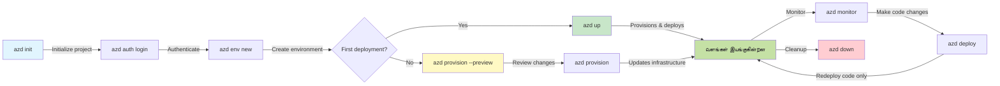

# AZD அடிப்படைகள் - Azure Developer CLI ஐப் புரிந்துகொள்ளுதல்

# AZD அடிப்படைகள் - கோர் கருத்துக்கள் மற்றும் அடிப்படைகள்

**அத்தியாய வழிசெலுத்தல்:**
- **📚 பாடநெறி முகப்பு**: [ஆரம்பக்காரர்களுக்கு AZD](../../README.md)
- **📖 தற்போதைய அத்தியாயம்**: அத்தியாயம் 1 - அடித்தளம் & விரைவு தொடக்கம்
- **⬅️ முந்தைய**: [பாடநெறி கண்ணோட்டம்](../../README.md#-chapter-1-foundation--quick-start)
- **➡️ அடுத்து**: [பதிவிறக்கம் & அமைப்புகள்](installation.md)
- **🚀 அடுத்த அத்தியாயம்**: [அத்தியாயம் 2: AI-முதன்மை மேம்பாடு](../chapter-02-ai-development/microsoft-foundry-integration.md)

## அறிமுகம்

இந்த பாடம் Azure Developer CLI (azd) ஐ அறிமுகப்படுத்துகிறது — உள்ளூர் வளர்ச்சியிலிருந்து Azure பரப்புதலுக்கு உங்கள் பயணத்தை வேகப்படுத்தும் பல்திறன் கொண்ட கட்டளை வரி கருவி. நீங்கள் இங்கு அடிப்படை கருத்துக்கள், கோர் அம்சங்கள் பற்றி கற்றுக்கொள்வீர்கள் மற்றும் azd எப்படி கிளவுட்-நேடிவ் பயன்பாடுகளின் பரப்புதலை எளிதாக்குகிறது என்பதைக் புரிந்துகொள்வீர்கள்.

## கற்றல் குறிக்கோள்கள்

இந்த பாடத்தின் முடிவில் நீங்கள்:
- Azure Developer CLI என்னவென்பதை மற்றும் அதன் முதன்மை நோக்கத்தை புரிந்துகொள்வீர்கள்
- வார்ப்புருக்கள், சூழல்கள் மற்றும் சேவைகளின் கோர் கருத்துக்களை கற்றுக்கொள்வீர்கள்
- வார்ப்புரு-வழி மேம்பாடு மற்றும் Infrastructure as Code உட்பட முக்கிய அம்சங்களை ஆராய்வீர்கள்
- azd திட்ட அமைப்பு மற்றும் பணிமுறையை புரிந்துகொள்வீர்கள்
- உங்கள் வளர்ச்சி சூழலுக்காக azd ஐ நிறுவி அமைக்க தயாராக இருப்பீர்கள்

## கற்றல் விளைவுகள்

இந்த பாடத்தை முடித்த பிறகு, நீங்கள் முடியும்:
- நவீன கிளவுட் மேம்பாட்டு பணிநிலைகளில் azd இன் கதவுகளை விளக்க
- azd திட்ட கட்டமைப்பின் கூறுகளை அடையாளம் காண
- வார்ப்புருக்கள், சூழல்கள் மற்றும் சேவைகள் எப்படி ஒன்றாகச் செயல்படுகின்றன என்பதை விவரிக்க
- azd உடன் Infrastructure as Code இன் நன்மைகளை புரிந்துகொள்ள
- வெவ்வேறு azd கட்டளைகள் மற்றும் அவற்றின் நோக்கங்களை அறிய

## Azure Developer CLI (azd) என்றது என்ன?

Azure Developer CLI (azd) என்பது உள்ளூர் மேம்பாட்டிலிருந்து Azure பரப்புதலுக்கு உங்கள் பயணத்தை வேகப்படுத்த உருவாக்கப்பட்ட கட்டளை வரி கருவி. இது Azure-இல் கிளவுட்-நேடிவ் பயன்பாடுகளை உருவாக்க, பரப்ப மற்றும் நிர்வகிக்கப்படும் செயல்முறையை எளிமையாக்குகிறது.

### azd கொண்டு என்னவை பரப்ப முடியும்?

azd பலவகை வேலைப்பாடுகளை ஆதரிக்கிறது — மற்றும் பட்டியல் வளர்ந்து வருகிறது. இன்றைக்கு, azd ஐப் பயன்படுத்தி நீங்கள் பரப்பக் கூடியவை:

| பணிப்பொருள் வகை | உதாரணங்கள் | அதே பணிமுறை? |
|---------------|----------|----------------|
| **பாரம்பரிய பயன்பாடுகள்** | வெப் செயலிகள், REST APIs, நிலையான தளங்கள் | ✅ `azd up` |
| **சேவைகள் மற்றும் மைக்ரோசேவைகள்** | Container Apps, Function Apps, பன்முக சேவை பின்னணிகள் | ✅ `azd up` |
| **AI-இன் சக்தியடைந்த பயன்பாடுகள்** | Microsoft Foundry Models உடன் chat செயலிகள், AI Search உடன் RAG தீர்வுகள் | ✅ `azd up` |
| **நுண்ணறிவு ஏஜண்ட்கள்** | Foundry-இல் பதிவேற்றப்பட்ட ஏஜண்டுகள், பன்முக ஏஜண்ட் ஒழுங்குமுறைகள் | ✅ `azd up` |

முக்கிய கருத்து: **நீங்கள் எந்தவ 것을 பரப்பினாலும் azd வாழ்நாள்முறை ஒன்றே இருக்கும்**. நீங்கள் ஒரு திட்டத்தை தொடங்குவீர்கள், கட்டமைப்பை வழங்குவீர்கள், உங்கள் குறியீடை பரப்புவீர்கள், உங்கள் பயன்பாட்டை கண்காணிப்பீர்கள், மற்றும் சுத்தப்படுத்துவீர்கள் — அது சுலபமான வலைத்தளம் என்றாலும் அல்லது கடினமான AI ஏஜண்ட் என்றாலும்.

இந்த தொடர்ச்சி நோக்கத்தால் அறுவைபுரிந்து திட்டமிடப்பட்டுள்ளது. azd AI திறன்களைக் உங்கள் பயன்பாடுகள் பயன்படுத்தக்கூடிய மற்றொரு சேவையாக கருதுகிறது, அதை அடிப்படையில் வேறேனும் என்று நோக்கவில்லை. Microsoft Foundry Models ஆதரவில் உள்ள ஒரு சந்திப்பு முனை azd பார்வையில் மற்றொரு சரிசம சேவையாகவே இருக்கும், அதனை கட்டமைக்கவும் பரப்பவும்.

### 🎯 ஏன் AZD பயன்படுத்த வேண்டும்? நிஜ உலக ஒப்பீடு

#### ❌ AZD இல்லாமல்: கைமுறையான Azure பரப்புதல் (30+ நிமிடங்கள்)

```bash
# படி 1: வளக் குழுவை உருவாக்கவும்
az group create --name myapp-rg --location eastus

# படி 2: செயலி சேவை திட்டத்தை உருவாக்கவும்
az appservice plan create --name myapp-plan \
  --resource-group myapp-rg \
  --sku B1 --is-linux

# படி 3: வலை செயலியை உருவாக்கவும்
az webapp create --name myapp-web-unique123 \
  --resource-group myapp-rg \
  --plan myapp-plan \
  --runtime "NODE:18-lts"

# படி 4: Cosmos DB கணக்கை உருவாக்கவும் (10-15 நிமிடங்கள்)
az cosmosdb create --name myapp-cosmos-unique123 \
  --resource-group myapp-rg \
  --kind MongoDB

# படி 5: தரவுத்தளத்தை உருவாக்கவும்
az cosmosdb mongodb database create \
  --account-name myapp-cosmos-unique123 \
  --resource-group myapp-rg \
  --name tododb

# படி 6: கலெக்ஷனை உருவாக்கவும்
az cosmosdb mongodb collection create \
  --account-name myapp-cosmos-unique123 \
  --resource-group myapp-rg \
  --database-name tododb \
  --name todos

# படி 7: இணைப்பு ஸ்ட்ரிங்கை பெறவும்
CONN_STR=$(az cosmosdb keys list \
  --name myapp-cosmos-unique123 \
  --resource-group myapp-rg \
  --type connection-strings \
  --query "connectionStrings[0].connectionString" -o tsv)

# படி 8: செயலி அமைப்புகளை அமைக்கவும்
az webapp config appsettings set \
  --name myapp-web-unique123 \
  --resource-group myapp-rg \
  --settings MONGODB_URI="$CONN_STR"

# படி 9: பதிவுகளை இயக்கவும்
az webapp log config --name myapp-web-unique123 \
  --resource-group myapp-rg \
  --application-logging filesystem \
  --detailed-error-messages true

# படி 10: Application Insights ஐ அமைக்கவும்
az monitor app-insights component create \
  --app myapp-insights \
  --location eastus \
  --resource-group myapp-rg

# படி 11: Application Insights ஐ வலை செயலிக்கு இணைக்கவும்
INSTRUMENTATION_KEY=$(az monitor app-insights component show \
  --app myapp-insights \
  --resource-group myapp-rg \
  --query "instrumentationKey" -o tsv)

az webapp config appsettings set \
  --name myapp-web-unique123 \
  --resource-group myapp-rg \
  --settings APPINSIGHTS_INSTRUMENTATIONKEY="$INSTRUMENTATION_KEY"

# படி 12: செயலியை உள்ளகமாக கட்டவும்
npm install
npm run build

# படி 13: வினியோகப் தொகுப்பை உருவாக்கவும்
zip -r app.zip . -x "*.git*" "node_modules/*"

# படி 14: செயலியை வினியோகிக்கவும்
az webapp deployment source config-zip \
  --resource-group myapp-rg \
  --name myapp-web-unique123 \
  --src app.zip

# படி 15: காத்திருந்து அது வேலை செய்யும் என்று பிரார்த்திக்கவும் 🙏
# (தானியங்கி சரிபார்ப்பு இல்லை, கைமுறை சோதனை தேவை)
```

**பிரச்சனைகள்:**
- ❌ நினைவில் வைக்கவும் மற்றும் வரிசையில் செயல்படுத்த 15+ கட்டளைகள்
- ❌ 30-45 நிமிடங்கள் கைமுறை வேலை
- ❌ தவறுகள் எளிதில் ஏற்படுகின்றன (தட்டச்சு பிழைகள், தவறான அளவுருக்கள்)
- ❌ இணைப்பு சராம்சங்கள் டெர்மினல் வரலாற்றில் வெளிப்படுகின்றன
- ❌ ஏதாவது தோல்வியடைந்தால் தானியங்கி ரால்பேக் இல்லை
- ❌ குழு உறுப்பினர்களுக்கு மீண்டும் உருவாக்க இது கடினம்
- ❌ ஒவ்வொரு முறையும் வேறுபட்டு (மீண்டும் உருவாக்க இயலாது)

#### ✅ AZD உடன்: தானியங்கி பரப்புதல் (5 கட்டளைகள், 10-15 நிமிடங்கள்)

```bash
# படி 1: வார்ப்புருவிலிருந்து தொடங்கவும்
azd init --template todo-nodejs-mongo

# படி 2: அங்கீகரிக்கவும்
azd auth login

# படி 3: சூழலை உருவாக்கவும்
azd env new dev

# படி 4: மாற்றங்களை முன்னோட்டமாகப் பார்க்கவும் (விருப்பமானது ஆனால் பரிந்துரைக்கப்படுகிறது)
azd provision --preview

# படி 5: அனைத்தையும் வெளியிடவும்
azd up

# ✨ முடிந்தது! எல்லாம் வெளியிடப்பட்டு, கட்டமைக்கப்பட்டு மற்றும் கண்காணிக்கப்படுகிறது
```

**நன்மைகள்:**
- ✅ **5 கட்டளைகள்** vs. 15+ கைமுறை படிகள்
- ✅ **10-15 நிமிடங்கள்** மொத்த நேரம் (பெரும்பாலும் Azure காக காத்திருத்தல்)
- ✅ **குறைந்த கைமுறை தவறுகள்** - ஒத்திசைந்த, வார்ப்புரு-ஆதாரமான பணிமுறை
- ✅ **பாதுகாப்பான ரகசிய கையாளுதல்** - பல வார்ப்புருக்கள் Azure-இன் நிர்வகிக்கப்பட்ட ரகசிய சேமிப்பை பயன்படுத்துகின்றன
- ✅ **மறுமுறை செய்யக்கூடிய பரப்புதல்கள்** - ஒவ்வொரு முறையும் அதே பணிமுறை
- ✅ **முழுமையாக மீண்டும் உருவாக்கக்கூடியது** - ஒவ்வொரு முறையும் அதே முடிவு
- ✅ **குழுவிற்கு தயார்** - யாரும் அதே கட்டளைகளுடன் பரப்ப முடியும்
- ✅ **Infrastructure as Code** - பதிப்பு கட்டுப்படுத்தப்பட்ட Bicep வார்ப்புருக்கள்
- ✅ **உள்ளமைந்த கண்காணிப்பு** - Application Insights தானாக அமைக்கப்படுகிறது

### 📊 நேரம் மற்றும் பிழை குறைப்பு

| அளவுகோல் | கைமுறை பரப்புதல் | AZD பரப்புதல் | மேம்பாடு |
|:-------|:------------------|:---------------|:------------|
| **கட்டளைகள்** | 15+ | 5 | 67% குறைவு |
| **நேரம்** | 30-45 நிமிடங்கள் | 10-15 நிமிடங்கள் | 60% வேகமாக |
| **பிழை வீதம்** | ~40% | <5% | 88% குறைப்பு |
| **நிலைத்தன்மை** | குறைவு (கைமுறை) | 100% (தானியங்கி) | முழுமையாக |
| **குழு சேர்த்தல்** | 2-4 மணி நேரம் | 30 நிமிடங்கள் | 75% வேகமாக |
| **ரால்பேக் நேரம்** | 30+ நிமிடங்கள் (கைமுறை) | 2 நிமிடங்கள் (தானியங்கி) | 93% வேகமாக |

## மூல கருத்துக்கள்

### வார்ப்புருக்கள்
வார்ப்புருக்கள் azd-இன் அடித்தளமாகும். அவை கொண்டிருக்கும்:
- **பயன்பாட்டு குறியீடு** - உங்கள் மூலக் குறியீடு மற்றும் சார்புகள்
- **அமைப்பு வரையறைகள்** - Bicep அல்லது Terraform-ல் வரையறுக்கப்பட்ட Azure வளங்கள்
- **அமைப்பு கோப்புகள்** - அமைப்புகள் மற்றும் சூழல் மாறிலிகள்
- **பரப்புதல் ஸ்க்ரிப்ட்கள்** - தானியங்கி பரப்புதல் பணிமுறைகள்

### சூழல்கள்
சூழல்கள் வெவ்வேறு பரப்புதல் இலக்குகளை பிரதிநிதித்துவம் செய்கின்றன:
- **Development** - சோதனை மற்றும் மேம்பாட்டுக்காக
- **Staging** - உற்பத்திக்கு முன் சூழல்
- **Production** - நேரடி உற்பத்தி சூழல்

ஒவ்வொரு சூழலும் தன்னுடைய:
- Azure resource group
- கணமைப்பு அமைப்புகள்
- பரப்புதல் நிலை

### சேவைகள்
சேவைகள் உங்கள் பயன்பாட்டின் கட்டுமான கூறுகள்:
- **Frontend** - வலை பயன்பாடுகள், SPAs
- **Backend** - APIs, மைக்ரோசேவைகள்
- **Database** - தரவு சேமிப்பு தீர்வுகள்
- **Storage** - கோப்பு மற்றும் blob சேமிப்பு

## முக்கிய அம்சங்கள்

### 1. வார்ப்புரு சார்ந்த மேம்பாடு
```bash
# கிடைக்கும் வார்ப்புருக்களை உலாவவும்
azd template list

# ஒரு வார்ப்புருவிலிருந்து துவக்கவும்
azd init --template <template-name>
```

### 2. கட்டமைப்பு குறியீடாக (Infrastructure as Code)
- **Bicep** - Azure-இன் டொமைன்-சார்ந்த மொழி
- **Terraform** - பல்-மேகம் கட்டமைப்பு கருவி
- **ARM Templates** - Azure Resource Manager வார்ப்புருக்கள்

### 3. ஒருங்கிணைந்த பணிமுறைகள்
```bash
# பயன்பாட்டை வெளியிடும் முழுமையான பணிமுறை
azd up            # அமைத்து + வெளியிடு: முதன்முறையான அமைப்பிற்கு இது கையில்லா செயல்முறை

# 🧪 புதியது: வெளியிடுவதற்கு முன் அடித்தள அமைப்பு மாற்றங்களை முன்னோட்டமாக காண்க (பாதுகாப்பானது)
azd provision --preview    # மாற்றங்கள் செய்யாமல் அடித்தள வெளியீட்டை மாதிரியாக இயக்கு

azd provision     # அடித்தளத்தை மேம்படுத்தினால் இதைப் பயன்படுத்தி Azure வளங்களை உருவாக்குங்கள்
azd deploy        # பயன்பாட்டு கோடுகளை வெளியிடவும் அல்லது புதுப்பித்தபின் மீண்டும் வெளியிடவும்
azd down          # வளங்களை சுத்தம் செய்யவும்
```

#### 🛡️ முன்னோட்டத்துடன் பாதுகாப்பான கட்டமைப்பு திட்டமிடல்
`azd provision --preview` கட்டளை பாதுகாப்பான பரப்புதல்களுக்கு விளையாட்டு மாற்றம் ஆகும்:
- **டிரை-ரன் பகுப்பாய்வு** - உருவாக்கப்படவுள்ள, மாற்றப்படவுள்ள அல்லது நீக்கப்படவுள்ளவற்றை காட்டும்
- **பூஜ்ய அபாயம்** - உங்கள் Azure சூழலில் எந்தவொரு மாற்றமும் நிகழாது
- **குழு ஒத்துழைப்பு** - பரப்புவதற்கு முன் முன் காட்சிப் பெறுபேறுகளை பகிரவும்
- **செலவு மதிப்பீடு** - ஒப்பந்தத்திற்கு முன் வளச் செலவுகளைப் புரிந்துகொள்ளும்

```bash
# உதாரண முன்னோட்ட பணிவழிமுறை
azd provision --preview           # என்ன மாறும் என்பதைப் பார்க்கவும்
# வெளியீட்டை பரிசீலித்து குழுவுடன் விவாதிக்கவும்
azd provision                     # நம்பிக்கையுடன் மாற்றங்களைச் செயல்படுத்தவும்
```

### 📊 காட்சி: AZD மேம்பாட்டு பணிமுறை



**பணிமுறை விளக்கம்:**
1. **Init** - வார்ப்புரு அல்லது புதிய திட்டத்துடன் தொடங்கவும்
2. **Auth** - Azure உடன் அங்கீகாரம் பெறவும்
3. **Environment** - தனிமைப்படுத்தப்பட்ட பரப்புதல் சூழலை உருவாக்கவும்
4. **Preview** - 🆕 முதலில் கட்டமைப்பு மாற்றங்களை எப்போதும் நேர்மறையாகப் பாருங்கள் (பாதுகாப்பான நடைமுறை)
5. **Provision** - Azure வளங்களை உருவாக்க/புதுப்பிக்கவும்
6. **Deploy** - உங்கள் பயன்பாட்டுக் குறியீட்டை இடுகையிடவும்
7. **Monitor** - பயன்பாட்டு செயல்திறனைக் கண்காணிக்கவும்
8. **Iterate** - மாற்றங்களைச் செய்து குறியீட்டை மீண்டும் பரப்பவும்
9. **Cleanup** - முடிந்தபின்பு வளங்களை நீக்கவும்

### 4. சூழல் மேலாண்மை
```bash
# சூழல்களை உருவாக்கவும் மற்றும் நிர்வகிக்கவும்
azd env new <environment-name>
azd env select <environment-name>
azd env list
```

### 5. நீட்சிகள் மற்றும் AI கட்டளைகள்

azd கோர் CLI-வைကျော်விட்டு கூடுதலான திறன்கள் சேர்க்க நீட்சிகள் முறைமையை பயன்படுத்துகிறது. இது குறிப்பாக AI வேலைப்பாடுகளுக்கு பயனுள்ளதாக இருக்கும்:

```bash
# கிடையிலுள்ள விரிவாக்கங்களை பட்டியலிடு
azd extension list

# Foundry agents விரிவாக்கத்தை நிறுவு
azd extension install azure.ai.agents

# மெனிபெஸ்ட் கோப்பிலிருந்து ஒரு AI முகவர் திட்டத்தை தொடங்கு
azd ai agent init -m agent-manifest.yaml

# பதிக்கப்பட்ட முகவரை சோதிக்கவும் (தாமதமும் முதல் பைட்டுக்கான நேரமும் காட்டப்படுகிறது)
azd ai agent invoke

# AI உதவியுடன் நடைபெறும் அபிவிருத்திக்காக MCP சர்வரை தொடங்கு (ஆல்ஃபா)
azd mcp start
```

**ஏஜன் வாழ்நாள் சுழற்சி, தொடக்கத்திலிருந்து முடிவுவரை.** நீங்கள் `azure.ai.agents` நிறுவிய பின்னர், ஒரு ஒரே பணிமுறை யோசனையிலிருந்து ஓடும், கண்காணிக்கப்படும் ஏஜன்டாக கொண்டு வருகிறது. ஆரம்பநாளில் இவை எல்லாம் தேவையில்லை — இருப்பதை மட்டும் அறிந்துகொள்வது போதும்:

| நிலை | கட்டளை | இது என்ன செய்கிறது |
|-------|---------|--------------|
| **Scaffold** | `azd ai agent init -m <manifest>` | manifest-இலிருந்து ஒரு ஏஜன்ட் திட்டத்தை உருவாக்குகிறது |
| **Test** | `azd ai agent invoke` | ஏஜன்டை அழைத்து பதில் நேரத்தை காண்க |
| **Measure** | `azd ai agent eval generate` | ஏஜன்டுக்காக ஒரு மதிப்பீட்டு தரவுத்தொகுப்பை உருவாக்கு |
| **Improve** | `azd ai agent optimize` | உங்கள் தரவின் அடிப்படையில் ஏஜன்ட் வழிமுறைகளை சிறப்பாக்கு |
| **Inspect** | `azd ai agent endpoint show` | நடந்து கொண்டிருக்கும் endpoint கட்டமைப்பை காண்க |
| **Clean up** | `azd ai agent delete` | ஹோஸ்ட் செய்யப்பட்ட ஏஜன்டையும் அதன் அனைத்து பதிப்புகளையும் நீக்குங்கள் |

> நீட்சிகள் விரிவாக [அத்தியாயம் 2: AI-முதன்மை மேம்பாடு](../chapter-02-ai-development/agents.md) மற்றும் [AZD AI CLI கட்டளைகள்](../chapter-08-production/production-ai-practices.md#azd-ai-cli-commands-and-extensions) குறிப்பு இல் விவரிக்கப்படுகின்றன.

## 📁 திட்ட அமைப்பு

ஒரு சாதாரண azd திட்ட அமைப்பு:
```
my-app/
├── .azd/                    # azd configuration
│   └── config.json
├── .azure/                  # Azure deployment artifacts
├── .devcontainer/          # Development container config
├── .github/workflows/      # GitHub Actions
├── .vscode/               # VS Code settings
├── infra/                 # Infrastructure code
│   ├── main.bicep        # Main infrastructure template
│   ├── main.parameters.json
│   └── modules/          # Reusable modules
├── src/                  # Application source code
│   ├── api/             # Backend services
│   └── web/             # Frontend application
├── azure.yaml           # azd project configuration
└── README.md
```

## 🔧 கட்டமைப்பு கோப்புகள்

### azure.yaml
முக்கிய திட்ட அமைப்பு கோப்பு:
```yaml
name: my-awesome-app
metadata:
  template: my-template@1.0.0

services:
  web:
    project: ./src/web
    language: js
    host: appservice
  api:
    project: ./src/api
    language: js
    host: appservice

hooks:
  preprovision:
    shell: pwsh
    run: echo "Preparing to provision..."
```

### .azure/config.json
சூழல்-சார்ந்த அமைப்பு:
```json
{
  "version": 1,
  "defaultEnvironment": "dev",
  "environments": {
    "dev": {
      "subscriptionId": "your-subscription-id",
      "location": "eastus"
    }
  }
}
```

## 🎪 வழக்கமான பணிமுறைகள் மற்றும் நடைமுறை பயிற்சிகள்

> **💡 கற்றல் குறிப்பு:** இந்த பயிற்சிகளை வரிசையாக பின்பற்றி உங்கள் AZD திறன்களை படிப்படியாக உருவாக்குங்கள்.

### 🎯 பயிற்சி 1: உங்கள் முதல் திட்டத்தை தொடங்கவும்

**குறிக்கோள்:** ஒரு AZD திட்டத்தை உருவாக்கி அதன் அமைப்பைக் கண்டறியவுய

**படிகள்:**
```bash
# சான்று பெற்ற வார்ப்புருவைப் பயன்படுத்தவும்
azd init --template todo-nodejs-mongo

# உருவாகிய கோப்புகளை ஆராயவும்
ls -la  # மறைக்கப்பட்ட கோப்புகளையும் உட்பட அனைத்து கோப்புகளையும் காணவும்

# உருவாக்கப்பட்ட முக்கிய கோப்புகள்:
# - azure.yaml (முதன்மை கட்டமைப்பு)
# - infra/ (அடித்தளக் குறியீடு)
# - src/ (பயன்பாட்டு குறியீடு)
```

**✅ வெற்றி:** உங்கள் அருகில் azure.yaml, infra/, மற்றும் src/ அடைவைகள் உள்ளன

---

### 🎯 பயிற்சி 2: Azure-க்கு பரப்புதல்

**குறிக்கோள்:** தொடக்கம் முதல் முடிவுவரை பரப்புதல் முடிக்க

**படிகள்:**
```bash
# 1. அங்கீகரிக்கவும்
az login && azd auth login

# 2. சூழலை உருவாக்கவும்
azd env new dev
azd env set AZURE_LOCATION eastus

# 3. மாற்றங்களை முன்னோட்டம் (பரிந்துரைக்கப்படுகிறது)
azd provision --preview

# 4. அனைத்தையும் வெளியிடவும்
azd up

# 5. பதிவேற்றத்தை சரிபார்க்கவும்
azd show    # உங்கள் செயலியின் URL ஐப் பார்க்கவும்
```

**எதிர்பார்க்கப்பட்ட நேரம்:** 10-15 நிமிடங்கள்  
**✅ வெற்றி:** பயன்பாட்டு URL உலாவியில் திறக்கிறது

---

### 🎯 பயிற்சி 3: பல சூழல்கள்

**குறிக்கோள்:** dev மற்றும் staging க்கு பரப்புதல்

**படிகள்:**
```bash
# dev ஏற்கனவே உள்ளது, staging உருவாக்கவும்
azd env new staging
azd env set AZURE_LOCATION westus2
azd up

# அவற்றின் இடையே மாறவும்
azd env list
azd env select dev
```

**✅ வெற்றி:** Azure போர்டலில் இரண்டு தனித்துவமான resource group-கள்

---

### 🛡️ தூய தொடக்கம்: `azd down --force --purge`

நீங்கள் முழுமையாக மீட்டமைக்க வேண்டிய போது:

```bash
azd down --force --purge
```

**இது என்ன செய்கிறது:**
- `--force`: எந்த உறுதிப்படுத்தல் கேள்விகளும் இல்லை
- `--purge`: அனைத்து உள்ளூர் நிலை மற்றும் Azure வளங்களை நீக்குகிறது

**பயன்படுத்த வேண்டிய போது:**
- பரப்புதல் நடுவில் தோல்வியடைந்தால்
- திட்டங்களை மாறும்போத
- புதிதாக தொடக்கம் தேவைப்பட்டால்

---

## 🎪 அசல் பணிமுறை குறிப்புகள்

### புதிய திட்டத்தை தொடங்குதல்
```bash
# முறை 1: உள்ளுள்ள வார்ப்புருவை பயன்படுத்தவும்
azd init --template todo-nodejs-mongo

# முறை 2: ஆரம்பத்திலிருந்து புதிதாக தொடங்கவும்
azd init

# முறை 3: தற்போதைய அடைவைப் பயன்படுத்தவும்
azd init .
```

### உருவாக்கச் சுழற்சி
```bash
# வளர்ச்சி சூழலை அமைக்கவும்
azd auth login
azd env new dev
azd env select dev

# எல்லாவற்றையும் பதிவேற்றவும்
azd up

# மாற்றங்களைச் செய்து மீண்டும் பதிவேற்றவும்
azd deploy

# முடிந்தவுடன் சுத்தப்படுத்தவும்
azd down --force --purge # Azure Developer CLI இல் உள்ள இந்த கட்டளை உங்கள் சூழலுக்கான **முழுமையான மீட்டமைப்பாகும்** — இது குறிப்பாக நீங்கள் தோல்வியடைந்த பதிவேற்றங்களை பிழைத்திருத்தும்போது, உரிமையற்ற வளங்களை சுத்தம் செய்யும்போது அல்லது புதிய மீண்டும்-பதிவேற்றத்திற்காக தயாராகும்போது மிகவும் பயன்படுகிறது
```

## `azd down --force --purge`-ஐப் புரிந்துகொள்வது
`azd down --force --purge` கட்டளை உங்கள் azd சூழல் மற்றும் தொடர்புடைய அனைத்து வளங்களையும் முற்றிலும் உடைத்தறிக்க மிகவும் சக்திவாய்ந்த வழி. ஒவ்வொரு கொடியும் என்ன செய்கிறது என்பதன் பிரிக்கப்படுதல் கீழே உள்ளது:
```
--force
```
- உறுதிப்படுத்தல் கேள்விகளைத் தவிர்க்கிறது.
- தானியக்கமாக்கல் அல்லது ஸ்கிரிப்டிங் இடங்களில் மானுவல் உள்ளீடு சாத்தியமில்லாத போது பயனுள்ளதாகும்.
- CLI முலம் சிக்கனங்கள் கண்டுபிடிக்கப்பட்டாலும், இடைநிறுத்தாமல் தகராறு தொடர்ந்தே செல்லும் என்பதை உறுதி செய்கிறது.

```
--purge
```
அனைத்து தொடர்புடைய மெட்டாடேட்டாவையும் **நீக்கும்**, உட்பட:
சூழல் நிலை
உள்ளூர் `.azure` அடைவு
கேஷ் செய்யப்பட்ட பரப்புதல் தகவல்
azd-இன் முந்தைய பரப்புதல்களை "remembering" செய்வதைத் தடுக்கும், இது பொருந்தாத resource group-கள் அல்லது பழுது பட்ட registry குறிக்கோள் போன்ற பிரச்சனைகளை ஏற்படுத்தக்கூடும்.


### ஏன் இரண்டையும் பயன்படுத்த வேண்டும்?
`azd up` நிலைமையால் அல்லது பகுதி பரப்புதல்களின் காரணமாக தடைகளை எதிர்கொண்டால், இந்த சேர்க்கை ஒரு **தூய தொடக்கம்** என்பதை உறுதி செய்கிறது.

இது குறிப்பாக Azure போர்டலில் கைமுறையாக வளங்களை நீக்கிய பிறகு அல்லது வார்ப்புருக்கள், சூழல்கள் அல்லது resource group பெயரிடும் வழிமுறைகளை மாற்றும் போது உதவும்.

### பல சூழல்களை நிர்வகித்தல்
```bash
# ஸ்டேஜிங் சுற்றுச்சூழலை உருவாக்கு
azd env new staging
azd env select staging
azd up

# மீண்டும் dev க்கு மாற்று
azd env select dev

# சுற்றுச்சூழல்களை ஒப்பிடு
azd env list
```

## 🔐 அங்கீகாரம் மற்றும் அடையாளப் பத்திரங்கள்

அங்கீகாரத்தைப் புரிந்துகொள்வது வெற்றிகரமான azd பரப்புதல்களுக்கு மிக அவசியம். Azure பல்வேறு அங்கீகார முறைகளைப் பயன்படுத்துகிறது, மேலும் azd மற்ற Azure கருவிகள் பயன்படுத்தும் அதே கிரெடென்ஷியல் சங்கிலியைப் பயன்படுத்துகிறது.

### Azure CLI அங்கீகாரம் (`az login`)

azd பயன்படுததற்கு முன்னர், Azure உடன் நீங்கள் அங்கீகரிக்க வேண்டும். மிகவும் பொதுவான முறை Azure CLI-ஐ பயன்படுத்துவதே:
```bash
# இணைச்செயல்பாட்டால் உள்நுழையவும் (உலாவியை திறக்கும்)
az login

# குறிப்பிட்ட டெனன்ட் மூலம் உள்நுழையவும்
az login --tenant <tenant-id>

# சேவை பிரதிநிதியுடன் உள்நுழையவும்
az login --service-principal -u <app-id> -p <password> --tenant <tenant-id>

# தற்போதைய உள்நுழைவு நிலையை சரிபார்க்கவும்
az account show

# கிடைக்கக்கூடிய சப்ஸ்கிரிப்ஷன்களை பட்டியலிடவும்
az account list --output table

# இயல்புநிலை சப்ஸ்கிரிப்ஷனை அமைக்கவும்
az account set --subscription <subscription-id>
```

### அங்கீகார பணி இயக்கம்
1. **Interactive Login**: அங்கீகாரத்திற்கு உங்கள் இயல்புநிலை உலாவியை திறக்கும்
2. **Device Code Flow**: உலாவி அணுகல் இல்லாத சூழல்களுக்கு
3. **Service Principal**: தானியக்க செயல்பாடுகள் மற்றும் CI/CD சூழல்களுக்கு
4. **Managed Identity**: Azure-இல் ஹோஸ்ட் செய்யப்பட்ட பயன்பாடுகளுக்கு

### DefaultAzureCredential சங்கிலி

`DefaultAzureCredential` என்பது பல கிரெடென்ஷியல் ஆதாரங்களை குறிப்பிட்ட வரிசையில் தானாக முயற்சி செய்து எளிமையாக்கப்பட்ட அங்கீகார அனுபவத்தை வழங்கும் ஒரு கிரெடென்ஷியல் வகை:

#### சான்று சங்கிலி வரிசை
```mermaid
graph TD
    A[இயல்புநிலை Azure சான்று] --> B[சூழல் மாறிலிகள்]
    B --> C[பணிச்சுமை அடையாளம்]
    C --> D[மேலாண்மை செய்யப்பட்ட அடையாளம்]
    D --> E[விசுவல் ஸ்டுடியோ]
    E --> F[விசுவல் ஸ்டுடியோ கோடு]
    F --> G[Azure கட்டளை வரி (CLI)]
    G --> H[Azure பவர் ஷெல்]
    H --> I[இணைய இடைமுக உலாவி]
```

#### 1. சுற்றுச்சூழல் மாறிலிகள்
```bash
# சேவை பிரதிநிதிக்காக சுற்றுச்சூழல் மாறிலிகளை அமைக்கவும்
export AZURE_CLIENT_ID="<app-id>"
export AZURE_CLIENT_SECRET="<password>"
export AZURE_TENANT_ID="<tenant-id>"
```

#### 2. வேலைப்பனை அடையாளம் (Kubernetes/GitHub Actions)
தானாக பயன்படும் இடங்கள்:
- Azure Kubernetes Service (AKS) உடன் Workload Identity
- GitHub Actions OIDC கூட்டமைப்புடன்
- பிற கூட்டமைக்கப்பட்ட அடையாள சூழல்கள்

#### 3. Managed Identity
Azure வளங்களுக்கு உதாரணமாக:
- Virtual Machines
- App Service
- Azure Functions
- Container Instances

```bash
# நிர்வகிக்கப்படும் அடையாளம் கொண்ட Azure வளத்தில் இயங்குகிறதா என்பதை சரிபார்க்கவும்
az account show --query "user.type" --output tsv
# மீண்டும் வழங்கப்படும்: நிர்வகிக்கப்படும் அடையாளம் பயன்படுத்தப்பட்டால் "servicePrincipal"
```

#### 4. டெவலப்பர் கருவிகள் ஒருங்கிணைப்பு
- **Visual Studio**: உள்நுழைந்த கணக்கை தானாக பயன்படுத்துகிறது
- **VS Code**: Azure Account நீட்சியின் கிரெடென்ஷியல்களைப் பயன்படுத்துகிறது
- **Azure CLI**: `az login` கிரெடென்ஷியல்களைப் பயன்படுத்துகிறது (உள்ளூர்வள வளர்ச்சிக்கான மிகவும் பொதுவானது)

### AZD அங்கீகாரம் அமைத்தல்

```bash
# முறை 1: Azure CLI ஐ பயன்படுத்தவும் (வளர்ச்சிக்காக பரிந்துரைக்கப்படுகிறது)
az login
azd auth login  # தற்போதைய Azure CLI அங்கீகார விவரங்களை பயன்படுத்துகிறது

# முறை 2: நேரடி azd அங்கீகாரம்
azd auth login --use-device-code  # GUI இல்லாத சூழல்களுக்கு

# முறை 3: அங்கீகார நிலையைச் சரிபார்க்கவும்
azd auth login --check-status

# முறை 4: வெளியேறி மறுபடியும் அங்கீகரிக்கவும்
azd auth logout
azd auth login
```

### அங்கீகார சிறந்த நடைமுறைகள்

#### For Local Development
```bash
# 1. Azure CLI-ஐப் பயன்படுத்தி உள்நுழையவும்
az login

# 2. சரியான சந்தாவை சரிபார்க்கவும்
az account show
az account set --subscription "Your Subscription Name"

# 3. கிடைக்கும் சான்றிதழ்களுடன் azd-ஐப் பயன்படுத்தவும்
azd auth login
```

#### CI/CD குழாய்களுக்கு
```yaml
# GitHub Actions example
- name: Azure Login
  uses: azure/login@v1
  with:
    creds: ${{ secrets.AZURE_CREDENTIALS }}

- name: Deploy with azd
  run: |
    azd auth login --client-id ${{ secrets.AZURE_CLIENT_ID }} \
                    --client-secret ${{ secrets.AZURE_CLIENT_SECRET }} \
                    --tenant-id ${{ secrets.AZURE_TENANT_ID }}
    azd up --no-prompt
```

#### உற்பத்தி சூழல்களுக்கு
- Azure வளங்களின் மீது இயங்கும்போது **Managed Identity** ஐப் பயன்படுத்தவும்
- தானியங்கி சூழ்நிலைகளுக்காக **Service Principal** ஐப் பயன்படுத்தவும்
- கடவுச்சொற்களை குறியீட்டிலும் கட்டமைப்பு கோப்புகளிலும் சேமிக்க வேண்டாம்
- இரகசியமான கட்டமைப்புகளுக்கு **Azure Key Vault** ஐப் பயன்படுத்தவும்

### பொதுவான அங்கீகாரம் பிரச்சினைகள் மற்றும் தீர்வுகள்

#### பிரச்சினை: "சந்தா கண்டுபிடிக்கப்படவில்லை"
```bash
# தீர்வு: இயல்புநிலை சந்தாவை அமைக்கவும்
az account list --output table
az account set --subscription "<subscription-id>"
azd env set AZURE_SUBSCRIPTION_ID "<subscription-id>"
```

#### பிரச்சினை: "தகுந்த அனுமதிகள் இல்லை"
```bash
# தீர்வு: தேவையான பாத்திரங்களை சரிபார்த்து ஒதுக்கவும்
az role assignment list --assignee $(az account show --query user.name --output tsv)

# பொதுவாக தேவைப்படும் பாத்திரங்கள்:
# - பங்களிப்பாளர் (வள மேலாண்மைக்காக)
# - பயனர் அணுகல் நிர்வாகி (பாத்திர ஒதுக்கீடுகளுக்காக)
```

#### பிரச்சினை: "டோக்கன் காலாவதியாகி விட்டது"
```bash
# தீர்வு: மீண்டும் அங்கீகாரம் பெறுங்கள்
az logout
az login
azd auth logout
azd auth login
```

### வேறுபட்ட சூழ்நிலைகளில் அங்கீகாரம்

#### உள்ளூர் மேம்பாடு
```bash
# தனிப்பட்ட வளர்ச்சி கணக்கு
az login
azd auth login
```

#### குழு மேம்பாடு
```bash
# நிறுவனத்திற்காக குறிப்பிட்ட டெனன்டை பயன்படுத்தவும்
az login --tenant contoso.onmicrosoft.com
azd auth login
```

#### பல-வாடிக்கையாளர் சூழ்நிலைகள்
```bash
# வாடகையாளர்களுக்கு இடையே மாறவும்
az login --tenant tenant1.onmicrosoft.com
# வாடகையாளர் 1-இல் வெளியிடவும்
azd up

az login --tenant tenant2.onmicrosoft.com  
# வாடகையாளர் 2-இல் வெளியிடவும்
azd up
```

### பாதுகாப்பு கவனங்கள்

1. **கடவுச்சொற் சேமிப்பு**: கடவுச்சொற்களை மூலக் குறியீட்டில் ஒருபோதும் சேமிக்க வேண்டாம்
2. **அளவைக் கட்டுப்பாடு**: சேவை பிரதிநிதிகளுக்கு குறைந்த-அதிகாரக் கொள்கையைப் பயன்படுத்தவும்
3. **டோக்கன் மாறுதல்**: சேவை பிரதிநிதி ரகசியங்களை pravidha முறையில் மாறுங்கள்
4. **ஆடிட் பாதை**: அங்கீகார மற்றும் பிரசோதன செயல்பாடுகளை கண்காணிக்கவும்
5. **நெட்வொர்க் பாதுகாப்பு**: சாத்தியமானால் தனியார் endpoints ஐப் பயன்படுத்தவும்

### அங்கீகாரம் தொடர்புடைய தொழில்நுட்பச் சரிசெய்தல்

```bash
# அங்கீகாரப் பிரச்சினைகளை கண்டறிந்து சரி செய்க
azd auth login --check-status
az account show
az account get-access-token

# பொதுவான ஆய்வு கட்டளைகள்
whoami                          # தற்போதைய பயனர் சூழல்
az ad signed-in-user show      # Microsoft Entra ID பயனர் விவரங்கள்
az group list                  # வள அணுகலை சோதனை செய்க
```

## `azd down --force --purge` என்பதைப் புரிந்து கொள்வது

### கண்டறிதல்
```bash
azd template list              # வார்ப்புருக்களை உலாவு
azd template show <template>   # வார்ப்புரு விவரங்கள்
azd init --help               # துவக்க விருப்பங்கள்
```

### திட்ட மேலாண்மை
```bash
azd show                     # திட்டத்தின் கண்ணோட்டம்
azd env list                # கிடைக்கக்கூடிய சூழல்கள் மற்றும் தேர்ந்தெடுக்கப்பட்ட இயல்புநிலை
azd config show            # கட்டமைப்பு அமைப்புகள்
```

### கண்காணிப்பு
```bash
azd monitor                  # Azure போர்டல் கண்காணிப்பை திறக்கவும்
azd monitor --logs           # செயலி பதிவுகளைப் பார்க்கவும்
azd monitor --live           # நேரடி அளவீடுகளைப் பார்க்கவும்
azd pipeline config          # CI/CD அமைக்கவும்
```

## சிறந்த நடைமுறைகள்

### 1. அர்த்தமுள்ள பெயர்களைப் பயன்படுத்தவும்
```bash
# நன்று
azd env new production-east
azd init --template web-app-secure

# தவிர்க்கவும்
azd env new env1
azd init --template template1
```

### 2. வார்ப்புருக்களை பயன்படுத்தவும்
- கிடைக்கும் வார்ப்புருக்களுடன் தொடங்கவும்
- உங்கள் தேவைக்குச் சரி பார்த்து தனிப்பயனாக்கவும்
- உங்கள் நிறுவத்திற்காக மீண்டும் பயன்படுத்தக்கூடிய வார்ப்புருக்களை உருவாக்கவும்

### 3. சூழல் தனியேற்பு
- வளர்ச்சி/ஸ்டேஜிங்/உற்பத்திக்கு தனித்த சூழல்களைப் பயன்படுத்தவும்
- உள்ளூர் இயந்திரத்திலிருந்து நேரடியாக உற்பத்திக்கு தள்ளவிட வேண்டாம்
- உற்பத்தி வெளியீடுகளுக்கு CI/CD குழாய்களை பயன்படுத்தவும்

### 4. கட்டமைப்பு மேலாண்மை
- ரகசிய தரவுகளுக்கு சூழல் மாறிலிகளைப் பயன்படுத்தவும்
- கட்டமைப்புகளை பதிப்பு கட்டுப்பாட்டில் வைக்கவும்
- சூழல்-சூழ்நிலைக்கு உரிய அமைப்புகளை ஆவணப்படுத்தவும்

## கற்றல் முன்னேற்றம்

### தொடக்க நிலை (வாரம் 1-2)
1. azd ஐ நிறுவி அங்கீகரிக்கவும்
2. ஒரு எளிய வார்ப்புருவை வெளியிடவும்
3. திட்ட அமைப்பைப் புரிந்துகொள்ளவும்
4. அடிப்படை கட்டளைகள் (up, down, deploy) கற்றுக்கொள்ளவும்

### மத்திய நிலை (வாரம் 3-4)
1. வார்ப்புருக்களை தனிப்பயனாக்கவும்
2. பல சூழல்களை நிர்வகிக்கவும்
3. இன்ஃப்ராஸ்ட்ரக்சர் குறியீட்டை புரிந்துகொள்ளவும்
4. CI/CD குழாய்களை அமைக்கவும்

### மேம்பட்ட (வாரம் 5+)
1. தனிப்பயன் வார்ப்புருக்கள் உருவாக்கவும்
2. மேம்பட்ட இன்ஃப்ராஸ்ட்ரக்சர் மாதிரிகள்
3. பல பிரதேசங்களில் வெளியீடுகள்
4. நிறுவனதரமான கட்டமைப்புகள்

## அடுத்த படிகள்

**📖 அத்தியாயம் 1 கற்றலை தொடரவும்:**
- [நிறுவல் மற்றும் அமைப்பு](installation.md) - azd ஐ நிறுவி அமைக்கவும்
- [உங்கள் முதல் திட்டம்](first-project.md) - கைமுறை பயிற்சியை முடிக்கவும்
- [கட்டமைப்பு வழிகாட்டி](configuration.md) - மேம்பட்ட கட்டமைப்பு விருப்பங்கள்

**🎯 அடுத்த அத்தியாயத்திற்குத் தயாரா?**
- [அத்தியாயம் 2: AI-முதன்மை மேம்பாடு](../chapter-02-ai-development/microsoft-foundry-integration.md) - AI பயன்பாடுகளை உருவாக்க தொடங்கவும்

## கூடுதல் வளங்கள்

- [Azure Developer CLI Overview](https://learn.microsoft.com/en-us/azure/developer/azure-developer-cli/)
- [Template Gallery](https://azure.github.io/awesome-azd/)
- [Community Samples](https://github.com/Azure-Samples)

---

## 🙋 அடிக்கடி கேட்கப்படும் கேள்விகள்

### பொது கேள்விகள்

**Q: AZD மற்றும் Azure CLI இன் வேறுபாடு என்ன?**

A: Azure CLI (`az`) தனிப்பட்ட Azure வளங்களை நிர்வகிக்க பயன்படுத்தப்படுகிறது. AZD (`azd`) முழு பயன்பாடுகளை நிர்வகிக்க பயன்படுகிறது:

```bash
# Azure CLI - கீழ்நிலை வள மேலாண்மை
az webapp create --name myapp --resource-group rg
az sql server create --name myserver --resource-group rg
# ...இன்னும் பல கட்டளைகள் தேவை

# AZD - ஆப்ளிகேஷன் நிலை மேலாண்மை
azd up  # முழு செயலியை அனைத்து வளங்களுடனும் நிறுவுகிறது
```

**இவ்வாறு நினைக்கவும்:**
- `az` = தனிப்பட்ட லெகோ கட்டுகள் மீது செயல்பாடு
- `azd` = முழு லெகோ தொகுப்புகளுடன் வேலை செய்வது

---

**Q: AZD பயன்படுத்த Bicep அல்லது Terraform பற்றி தெரிந்திருக்க வேண்டுமா?**

A: இல்லை! வார்ப்புருக்களுடன் தொடங்குங்கள்:
```bash
# இருக்கும் வார்ப்புருவைப் பயன்படுத்தவும் - IaC பற்றிய அறிவு தேவையில்லை
azd init --template todo-nodejs-mongo
azd up
```

பின்னர் இன்ஃப்ராஸ்ட்ரக்சரை தனிப்பயனாக்க Bicep கற்றுக் கொள்ளலாம். வார்ப்புருக்கள் கற்றுக்கொள்ள உதவும் செயல்பாடுகளைக் காண்பிக்கின்றன.

---

**Q: AZD வார்ப்புருக்களை இயக்க எவ்வளவு செலவாகும்?**

A: செலவுகள் வார்ப்புருவுக்கு ஏற்ப மாறுபடுகிறது. பெரும்பாலான மேம்பாட்டு வார்ப்புருக்கள் மாதத்திற்கு $50-150 செலவாகும்:

```bash
# வெளியிடுவதற்கு முன் செலவுகளை முன்னோட்டமாகப் பார்க்க
azd provision --preview

# பயன்படுத்தாமல் இருக்கும்போது எப்போதும் சுத்தம் செய்யவும்
azd down --force --purge  # எல்லா வளங்களையும் அகற்றுகிறது
```

**திறமையான குறிப்பு:** கிடைக்கும் இடங்களில் இலவச நிலைகளைப் பயன்படுத்துங்கள்:
- App Service: F1 (இலவச) நிலை
- Microsoft Foundry Models: Azure OpenAI 50,000 tokens/மாதம் இலவசம்
- Cosmos DB: 1000 RU/s இலவச நிலை

---

**Q: ஏற்கனவே உள்ள Azure வளங்களுடன் AZD பயன்படுத்தலாமா?**

A: ஆமாம், ஆனால் புதிதாக தொடங்குவது எளிது. AZD முழு வாழ்க்கைச்சுற்றை நிர்வகிக்கும்போது சிறந்ததாக செயல்படுகிறது. ஏற்கனவே உள்ள வளங்களுக்கு:
```bash
# விருப்பம் 1: உள்ளிருக்கும் வளங்களை இறக்குமதி செய் (மேம்பட்ட)
azd init
# பின்னர் infra/ஐ மாற்றி ஏற்குள்ள வளங்களை குறிப்பிடவும்

# விருப்பம் 2: புதியதாக தொடங்கு (பரிந்துரைக்கப்படுகிறது)
azd init --template matching-your-stack
azd up  # புதிய சூழலை உருவாக்குகிறது
```

---

**Q: என் திட்டத்தை கூட்டாளர்களுடன் எப்படி பகிர்வது?**

A: AZD திட்டத்தை Git இல் commit செய்யவும் (ஆனால் `.azure` கோப்புறையை commit செய்ய வேண்டாம்):
```bash
# ஏற்கனவே .gitignore இல் இயல்பாக உள்ளது
.azure/        # ரகசியங்களையும் சூழல் தரவுகளையும் கொண்டுள்ளது
*.env          # சூழல் மாறிகள்

# அப்போது குழு உறுப்பினர்கள்:
git clone <your-repo>
azd auth login
azd env new <their-name>-dev
azd up
```

அனைவரும் ஒரே வார்ப்புருக்களிடமிருந்து ஒன்றே போன்ற இன்ஃப்ராஸ்ட்ரக்சரை பெறுவார்கள்.

---

### பிரச்சினை நீக்குதல் கேள்விகள்

**Q: "azd up" பாதியின் நடுவே தோல்வியடைந்தால் என்ன செய்வேன்?**

A: பிழையை பரிசோதிக்கவும், சரிசெய்து மறு முயற்சிக்கவும்:
```bash
# விரிவான பதிவுகளை பார்க்கவும்
azd show

# பொதுவான திருத்தங்கள்:

# 1. குவோட்டா மீறப்பட்டால்:
azd env set AZURE_LOCATION "westus2"  # வேறு மண்டலத்தை முயற்சிக்கவும்

# 2. வளப் பெயர் மோதல் இருந்தால்:
azd down --force --purge  # புதிய தொடக்கம்
azd up  # மீண்டும் முயற்சிக்கவும்

# 3. அங்கீகப்படுத்தல் காலாவதியானால்:
az login
azd auth login
azd up
```

**சாதாரண பிரச்சினை:** தவறான Azure சந்தா தேர்ந்தெடுக்கப்பட்டிருக்கலாம்
```bash
az account list --output table
az account set --subscription "<correct-subscription>"
```

---

**Q: மீண்டும்Provision செய்யாமல் வெறும் குறியீட்டு மாற்றங்களையும் எப்படி வெளியிடுவது?**

A: `azd up` இற்குப் பதிலாக `azd deploy` ஐப் பயன்படுத்தவும்:
```bash
azd up          # முதல் முறை: வளங்களை உருவாக்குதல் + வெளியிடுதல் (மெதுவாக)

# குறியீட்டில் மாற்றங்களைச் செய்யவும்...

azd deploy      # பின்வரும் முறைகள்: வெளியிடுதல் மட்டும் (வேகமாக)
```

வேக ஒப்பீடு:
- `azd up`: 10-15 நிமிடங்கள் (இன்ஃப்ராஸ்ட்ரக்சர் உருவாக்குகிறது)
- `azd deploy`: 2-5 நிமிடங்கள் (குறியீடு மட்டும்)

---

**Q: இன்ஃப்ராஸ்ட்ரக்சர் வார்ப்புருக்களை தனிப்பயனாக்க முடியுமா?**

A: ஆம்! `infra/` இல் உள்ள Bicep கோப்புகளை திருத்துங்கள்:
```bash
# azd init முடிந்த பிறகு
cd infra/
code main.bicep  # VS Code-ல் திருத்தவும்

# மாற்றங்களை முன்னோட்டமாகப் பார்க்கவும்
azd provision --preview

# மாற்றங்களைப் செயல்படுத்தவும்
azd provision
```

**கருத்து:** சிறிய தொடக்கம் - முதலில் SKUs மாற்றுங்கள்:
```bicep
// infra/main.bicep
sku: {
  name: 'B1'  // Change to 'P1V2' for production
}
```

---

**Q: AZD உருவாக்கிய அனைத்தையும் எப்படி நீக்குவது?**

A: ஒரு கட்டளை அனைத்து வளங்களையும் அகற்றும்:
```bash
azd down --force --purge

# இது நீக்குகிறது:
# - அனைத்து Azure வளங்களையும்
# - வளக் குழுவையும்
# - உள்ளூர் சூழல் நிலையையும்
# - கேஷில் சேமிக்கப்பட்ட டெப்பிளாய்மெண்ட் தரவுகள்
```

**எப்போதும் இதை இயக்குங்கள் যখন:**
- ஒரு வார்ப்புருவின் சோதனை முடிந்தபோது
- வேறு திட்டத்திற்கு மாறும்போது
- புதியதாகத் தொடங்க விரும்பும்போது

**செலவு சேமிப்பு:** பயன்படாத வளங்களை நீக்குவதால் = $0 கட்டணம்

---

**Q: நான் தவறுதலாக Azure போர்டலில் வளங்களைநீக்கியால் என்ன?**

A: AZD நிலை ஒத்திசைவு இழக்கலாம். சுத்தமான தொடக்கம் அணுகுமுறை:
```bash
# 1. உள்ளூர் நிலையை நீக்கு
azd down --force --purge

# 2. புதிதாக தொடங்கு
azd up

# மாற்று விருப்பம்: AZD-ஐ கண்டறிந்து சரிசெய்ய விடு
azd provision  # கிடையாத வளங்களை உருவாக்கும்
```

---

### மேம்பட்ட கேள்விகள்

**Q: CI/CD குழாய்களில் AZD பயன்படுத்தலாமா?**

A: ஆம்! GitHub Actions எடுத்துக்காட்டு:
```yaml
# .github/workflows/deploy.yml
name: Deploy with AZD

on:
  push:
    branches: [main]

jobs:
  deploy:
    runs-on: ubuntu-latest
    steps:
      - uses: actions/checkout@v2
      
      - name: Install azd
        run: curl -fsSL https://aka.ms/install-azd.sh | bash
      
      - name: Azure Login
        run: |
          azd auth login \
            --client-id ${{ secrets.AZURE_CLIENT_ID }} \
            --client-secret ${{ secrets.AZURE_CLIENT_SECRET }} \
            --tenant-id ${{ secrets.AZURE_TENANT_ID }}
      
      - name: Deploy
        run: azd up --no-prompt
```

---

**Q: ரகசியங்கள் மற்றும் உணர்ச்சிச் தரவுகளை எப்படி கையாள்வீர்கள்?**

A: AZD தானாகவே Azure Key Vault உடன் ஒருங்கிணைகிறது:
```bash
# ரகசியங்கள் குறியீட்டில் சேமிக்கப்படாது; அவை Key Vault-இல் சேமிக்கப்படுகின்றன
azd env set DATABASE_PASSWORD "$(openssl rand -base64 32)"

# AZD தானாகவே:
# 1. Key Vault-ஐ உருவாக்குகிறது
# 2. ரகசியத்தை சேமிக்கிறது
# 3. Managed Identity மூலம் செயலிக்கு அணுகலை வழங்குகிறது
# 4. செயல்பாட்டு (runtime) நேரத்தில் அதனை ஊட்டுகிறது
```

**எப்போதும் commit செய்யாதீர்கள்:**
- `.azure/` கோப்புறை (சூழல் தரவை கொண்டுள்ளது)
- `.env` கோப்புகள் (உள்ளூர் ரகசியங்கள்)
- இணைப்பு ஸ்ட்ரிங்ஸ்

---

**Q: பல பிரதேசங்களில் வெளியிடலாமா?**

A: ஆம், ஒவ்வொரு பிரதேசத்திற்கும் ஒரு சூழலை உருவாக்கவும்:
```bash
# அமெரிக்காவின் கிழக்கு மண்டல சுற்றுச்சூழல்
azd env new prod-eastus
azd env set AZURE_LOCATION eastus
azd up

# மேற்கு ஐரோப்பா சுற்றுச்சூழல்
azd env new prod-westeurope
azd env set AZURE_LOCATION westeurope
azd up

# ஒவ்வொரு சுற்றுச்சூழலும் தனித்தனியே இருக்கும்
azd env list
```

சிறந்த பல-பிரதேச செயலிகளுக்கு, பல பிரதேசங்களுக்காக ஒரே நேரத்தில் வெளியிட Bicep வார்ப்புருக்களை தனிப்பயனாக்கவும்.

---

**Q: உதவி எங்கு பெற முடியும்?**

1. **AZD ஆவணங்கள்:** https://learn.microsoft.com/azure/developer/azure-developer-cli/
2. **GitHub Issues:** https://github.com/Azure/azure-dev/issues
3. **Discord:** [Azure Discord](https://discord.gg/microsoft-azure) - #azure-developer-cli சேனல்
4. **Stack Overflow:** Tag `azure-developer-cli`
5. **இந்த பாடநெறி:** [பிரச்சினை நீக்கும் வழிகாட்டி](../chapter-07-troubleshooting/common-issues.md)

**அறிவுரை:** கேட்கும் முன், இயக்குங்கள்:
```bash
azd show       # தற்போதைய நிலையை காட்டுகிறது
azd version    # உங்கள் பதிப்பை காட்டுகிறது
```
இந்த தகவலை உங்கள் கேள்வியில் சேர்க்கவும், உதவிக்கு விரைவாக பதிலுக்கு.

---

## 🎓 அடுத்து என்ன?

நீங்கள் இப்போது AZD அடிப்படைகளைப் புரிந்துகொண்டிருக்கிறீர்கள். உங்கள் பாதையை தேர்வு செய்யவும்:

### 🎯 தொடக்கர்களுக்கு:
1. **அடுத்து:** [நிறுவல் மற்றும் அமைப்பு](installation.md) - உங்கள் இயந்திரத்தில் AZD ஐ நிறுவவும்
2. **பின்னர்:** [உங்கள் முதல் திட்டம்](first-project.md) - உங்கள் முதல் செயலியை வெளியிடவும்
3. **பயிற்சி:** இந்த பாடத்தில் உள்ள அனைத்து 3 பயிற்சிகளையும் முடிக்கவும்

### 🚀 AI டெவலப்பர்களுக்கு:
1. **அடுத்துச் செல்லவும்:** [அத்தியாயம் 2: AI-முதன்மை மேம்பாடு](../chapter-02-ai-development/microsoft-foundry-integration.md)
2. **வெளியேற்றவும்:** `azd init --template get-started-with-ai-chat` கொண்டு தொடங்கவும்
3. **கற்றுக்கொள்ளவும்:** வெளியிடும்போதே கட்டமைப்பை உருவாக்கவும்

### 🏗️ அனுபவமுடைய டெவலப்பர்களுக்கு:
1. **வெளியீடு செய்யவும்:** [கட்டமைப்பு வழிகாட்டி](configuration.md) - மேம்பட்ட அமைப்புகள்
2. **ஆராயுங்கள்:** [Infrastructure as Code](../chapter-04-infrastructure/provisioning.md) - Bicep பற்றிய விரிவான ஆய்வு
3. **உருவாக்குங்கள்:** உங்கள் ஸ்டேக்குக்கான தனிப்பயன் வார்ப்புருக்களை உருவாக்கவும்

---

**அத்தியாய நெவிகேஷன்:**
- **📚 பாடநெறி முகப்பு**: [AZD For Beginners](../../README.md)
- **📖 தற்போதைய அத்தியாயம்**: அத்தியாயம் 1 - அடித்தளம் மற்றும் விரைவு தொடக்கம்  
- **⬅️ முந்தையது**: [பாடநெறி கண்ணோட்டம்](../../README.md#-chapter-1-foundation--quick-start)
- **➡️ அடுத்து**: [நிறுவல் மற்றும் அமைப்பு](installation.md)
- **🚀 அடுத்த அத்தியாயம்**: [அத்தியாயம் 2: AI-முதன்மை மேம்பாடு](../chapter-02-ai-development/microsoft-foundry-integration.md)

---

<!-- CO-OP TRANSLATOR DISCLAIMER START -->
**மறுப்பு**:
இந்த ஆவணம் AI மொழிபெயர்ப்பு சேவை [Co-op Translator](https://github.com/Azure/co-op-translator) பயன்படுத்தி மொழிபெயர்க்கப்பட்டுள்ளது. நாங்கள் துல்லியத்திற்காக முயற்சி செய்துள்ளோம், ஆனால் தானாக செய்யப்படும் மொழிபெயர்ப்புகளில் பிழைகள் அல்லது தவறுகள் இருக்கலாம் என்பதை கவனத்தில் கொள்ளவும். அசல் ஆவணம் அதன் தாய்மொழியில் அதிகாரப்பூர்வ ஆதாரமாக கருதப்பட வேண்டும். முக்கியமான தகவல்களுக்கு, தொழில்நுட்பமான மனித மொழிபெயர்ப்பு பரிந்துரைக்கப்படுகிறது. இந்த மொழிபெயர்ப்பைப் பயன்படுத்துவதால் ஏற்படும் எந்த தவறான புரிதல்கள் அல்லது தவறான விளக்கத்திற்கும் நாங்கள் பொறுப்பில்வில்லை.
<!-- CO-OP TRANSLATOR DISCLAIMER END -->