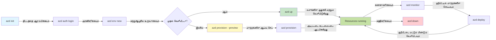
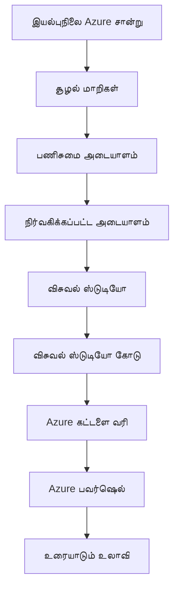

# AZD அடிப்படைகள் - Azure Developer CLI ஐப் புரிந்துகொள்வது

# AZD அடிப்படைகள் - மையக் கருத்துகள் மற்றும் அடிப்படைகள்

**அத்தியாய வழிசெலுத்தல்:**
- **📚 பாடநூல் முகப்பு**: [ஆரம்பகர்களுக்கான AZD](../../README.md)
- **📖 தற்போதைய அத்தியாயம்**: அத்தியாயம் 1 - அடிப்படை மற்றும் விரைவு அறிமுகம்
- **⬅️ முந்தையது**: [பாடப் பரிசீலனை](../../README.md#-chapter-1-foundation--quick-start)
- **➡️ அடுத்து**: [நிறுவல் & அமைப்பு](installation.md)
- **🚀 அடுத்த அத்தியாயம்**: [அத்தியாயம் 2: AI-முதன்மை அபிவிருத்தி](../chapter-02-ai-development/microsoft-foundry-integration.md)

## அறிமுகம்

இந்த பாடத்தில் Azure Developer CLI (azd) பற்றி அறிமுகப்படுத்தப்படுவீர்கள் — இது உள்ளூரில் வளர்ச்சியிலிருந்து Azure இல் வெளியிடுவதற்கு உங்கள் பயணத்தை வேகப்படுத்தும் சக்திவாய்ந்த கட்டளை வரி கருவி. நீங்கள் அடிப்படை கருத்துக்களை, முக்கிய அம்சங்களை கற்றுக்கொள்வீர்கள் மற்றும் azd எப்படி கிளவுட்-நேட்டிவ் பயன்பாட்டை எளிமையாக்குகிறது என்பதைப் புரிந்துகொள்வீர்கள்.

## கற்றல் இலக்குகள்

இந்த பாடம் முடிவடையும் பொழுதில், நீங்கள்:
- Azure Developer CLI என்றால் என்ன மற்றும் அதன் முதன்மை நோக்கம் என்ன என்பதை புரிந்துகொள்ளலாம்
- டெம்ப்ளேட்டுகள், சுற்றுச்சூழல்கள் மற்றும் சேவைகள் என்ற போன்ற முக்கிய கருத்துகளை கற்றுக்கொள்ளலாம்
- டெம்பிளேட்-இல் இயக்கப்படும் அபிவிருத்தி மற்றும் Infrastructure as Code உள்ளிட்ட முக்கிய அம்சங்களை ஆராயலாம்
- azd திட்ட அமைப்பை மற்றும் வேலைநடவடிக்கையை புரிந்துகொள்ளலாம்
- உங்கள் வளர்ச்சி சூழலுக்காக azd ஐ நிறுவி அமைக்க தயாராக இருக்கும்

## கற்றல் முடிவுகள்

இந்த பாடத்தை முடித்ததும், நீங்கள் முடியும்:
- நவீன கிளவுட் அபிவிருத்தி வேலைப்போதைகளில் azd இன் பங்கை விளக்கவும்
- azd திட்ட அமைப்பின் கூறுகளை அடையாளம் காணவும்
- டெம்ப்ளேட்டுகள், சுற்றுச்சூழல்கள் மற்றும் சேவைகள் எவ்வாறு ஒன்றாக வேலை செய்வதைக் விளக்கவும்
- azd உடன் Infrastructure as Code இன் நன்மைகளை புரிந்து கொள்ளவும்
- வெவ்வேறு azd கட்டளைகள் மற்றும் அவற்றின் நோக்கங்களை அறியவும்

## Azure Developer CLI (azd) என்றால் என்ன?

Azure Developer CLI (azd) என்பது உள்ளூரில் உருவாக்கம் இருந்து Azure வெளியீடு வரை உங்கள் பயணத்தை வேகப்படுத்த வடிவமைக்கப்பட்ட கட்டளை வரி கருவி. இது Azure இல் கிளவுட்-நேட்டிவ் பயன்பாடுகளை உருவாக்குதல், வெளியிடுதல் மற்றும் நிர்வகிப்பதை எளிமையாக்குகிறது.

### 🎯 ஏன் AZD பயன்படுத்த வேண்டும்? ஒரு நிகழ்கால ஒப்பீடு

ஒரு எளிய வெப் செயலி மற்றும் தரவுத்தளத்துடன் வெளியிடுவதை ஒப்பிடுவோம்:

#### ❌ AZD இல்லாதது: கைமுறை Azure வெளியீடு (30+ நிமிடங்கள்)

```bash
# படி 1: வளக் குழுவை உருவாக்கவும்
az group create --name myapp-rg --location eastus

# படி 2: App Service திட்டத்தை உருவாக்கவும்
az appservice plan create --name myapp-plan \
  --resource-group myapp-rg \
  --sku B1 --is-linux

# படி 3: வலைப் பயன்பாட்டை உருவாக்கவும்
az webapp create --name myapp-web-unique123 \
  --resource-group myapp-rg \
  --plan myapp-plan \
  --runtime "NODE:18-lts"

# படி 4: Cosmos DB கணக்கை உருவாக்கவும் (10-15 நிமிடங்கள்)
az cosmosdb create --name myapp-cosmos-unique123 \
  --resource-group myapp-rg \
  --kind MongoDB

# படி 5: தரவுத்தளத்தை உருவாக்கவும்
az cosmosdb mongodb database create \
  --account-name myapp-cosmos-unique123 \
  --resource-group myapp-rg \
  --name tododb

# படி 6: கலெக்ஷனை உருவாக்கவும்
az cosmosdb mongodb collection create \
  --account-name myapp-cosmos-unique123 \
  --resource-group myapp-rg \
  --database-name tododb \
  --name todos

# படி 7: இணைப்பு ஸ்ட்ரிங்கை பெறவும்
CONN_STR=$(az cosmosdb keys list \
  --name myapp-cosmos-unique123 \
  --resource-group myapp-rg \
  --type connection-strings \
  --query "connectionStrings[0].connectionString" -o tsv)

# படி 8: பயன்பாட்டு அமைப்புகளை கட்டமைக்கவும்
az webapp config appsettings set \
  --name myapp-web-unique123 \
  --resource-group myapp-rg \
  --settings MONGODB_URI="$CONN_STR"

# படி 9: பதிவெடுப்பை இயக்கவும்
az webapp log config --name myapp-web-unique123 \
  --resource-group myapp-rg \
  --application-logging filesystem \
  --detailed-error-messages true

# படி 10: Application Insights ஐ அமைக்கவும்
az monitor app-insights component create \
  --app myapp-insights \
  --location eastus \
  --resource-group myapp-rg

# படி 11: Application Insights ஐ வலைப் பயன்பாட்டுடன் இணைக்கவும்
INSTRUMENTATION_KEY=$(az monitor app-insights component show \
  --app myapp-insights \
  --resource-group myapp-rg \
  --query "instrumentationKey" -o tsv)

az webapp config appsettings set \
  --name myapp-web-unique123 \
  --resource-group myapp-rg \
  --settings APPINSIGHTS_INSTRUMENTATIONKEY="$INSTRUMENTATION_KEY"

# படி 12: பயன்பாட்டை உள்ளூரில் கட்டவும்
npm install
npm run build

# படி 13: விநியோகிப்புத் தொகுப்பை உருவாக்கவும்
zip -r app.zip . -x "*.git*" "node_modules/*"

# படி 14: பயன்பாட்டை விநியோகிக்கவும்
az webapp deployment source config-zip \
  --resource-group myapp-rg \
  --name myapp-web-unique123 \
  --src app.zip

# படி 15: இது வேலை செய்கிறதா என்று காத்திருங்கள் மற்றும் பிரார்த்திக்கவும் 🙏
# (தானியங்கி சரிபார்ப்பு இல்லை, கைமுறை சோதனை தேவை)
```

**பிரச்சினைகள்:**
- ❌ நினைவில் வைத்து வரிசைப்படுத்தி செயல்படுத்த வேண்டிய 15+ கட்டளைகள்
- ❌ 30-45 நிமிடங்கள் வரை கைமுறை பணிகள்
- ❌ பிழைகள் எளிதில் வரக்கூடும் (தட்டச்சு முறைகள், தவறான அளவுருக்கள்)
- ❌ இணைப்பு சரங்களில் டெர்மினல் வரலாற்றில் விவரம் வெளிப்படுகிறது
- ❌ ஏதாவது தோல்வியடைந்தால் தானாகவே முன்னோக்கிய மாற்றமில்லை
- ❌ அணி உறுப்பினர்களுக்கு ஏமாற்றமுடியாது
- ❌ ஒவ்வொரு முறையாக மாறும் (மறுகட்டமைக்க முடியாதது)

#### ✅ AZD உடன்: தானாக வெளியீடு (5 கட்டளைகள், 10-15 நிமிடங்கள்)

```bash
# படி 1: வார்ப்புருவிலிருந்து ஆரம்பிக்கவும்
azd init --template todo-nodejs-mongo

# படி 2: அங்கீகாரம் செய்யவும்
azd auth login

# படி 3: சுற்றுச்சூழலை உருவாக்கவும்
azd env new dev

# படி 4: மாற்றங்களை முன்னோட்டமாகப் பார்க்கவும் (விருப்பமானது ஆனால் பரிந்துரைக்கப்படுகிறது)
azd provision --preview

# படி 5: அனைத்தையும் வினியோகிக்கவும்
azd up

# ✨ முடிந்தது! அனைத்தும் வினியோகிக்கப்பட்டு, கட்டமைக்கப்பட்டு, கண்காணிக்கப்பட்டுள்ளன
```

**நன்மைகள்:**
- ✅ **5 கட்டளைகள்** مقابل 15+ கைமுறை படிகள்
- ✅ **10-15 நிமிடங்கள்** மொத்த நேரம் (பெரும்பாலான நேரம் Azure க்காக காத்திருத்தல்)
- ✅ **பிழைகள் பூஜ்யம்** - தானாகவும் சோதிக்கப்பட்டதும்
- ✅ **ரகசியங்கள் பாதுகாப்பாக நிர்வகிக்கப்படுகிறது** Key Vault மூலம்
- ✅ **தோல்விகள் ஏற்பட்டால் தானாக ரோல்பேக்** செய்யப்படும்
- ✅ **முழுமையாக மறுகட்டமைக்கக்கூடியது** - ஒவ்வொரு முறையும் அதே முடிவு
- ✅ **அணிக்கு தயாராக உள்ளது** - யாரும் ஒரே கட்டளைகளால் வெளியிட முடியும்
- ✅ **Infrastructure as Code** - பதிப்பு கட்டுப்படுத்தப்பட்ட Bicep டெம்ப்ளேட்டுகள்
- ✅ **உள்ளடக்கிய கண்காணிப்பு** - Application Insights தானாக கட்டமைக்கபட்டுள்ளது

### 📊 நேரம் & பிழை குறைப்பு

| Metric | Manual Deployment | AZD Deployment | Improvement |
|:-------|:------------------|:---------------|:------------|
| **கட்டளைகள்** | 15+ | 5 | 67% குறைவு |
| **நேரம்** | 30-45 நிமி | 10-15 நிமி | 60% வேகமாக |
| **பிழை விகிதம்** | ~40% | <5% | 88% குறைப்பு |
| **இணக்குமுறை** | குறைவானது (கைமுறை) | 100% (தானாக்கப்பட்டது) | சரியானது |
| **அணி சேர்க்கை நேரம்** | 2-4 மணி | 30 நிமி | 75% வேகமாக |
| **ரோல்பேக் நேரம்** | 30+ நிமி (கைமுறை) | 2 நிமி (தானாக்கப்பட்டது) | 93% வேகமாக |

## முக்கியக் கருத்துக்கள்

### டெம்ப்ளேட்டுகள்
டெம்ப்ளேட்டுகள் azd இன் அடித்தளம். அவை கொண்டது:
- **பயன்பாட்டு குறியீடு** - உங்கள் மூலக் குறியீடு மற்றும் சார்புகள்
- **இன்ஃபிராஸ்ட்ரக்சர் வரையறைகள்** - Bicep அல்லது Terraform இல் வரையறுக்கப்பட்ட Azure வளங்கள்
- **கட்டமைப்பு கோப்புகள்** - அமைப்புகள் மற்றும் சுற்றுச்சூழல் மாறிலிகள்
- **வெளியீட்டு ஸ்கிரிப்ட்கள்** - தானாக நடைபெறும் வெளியீட்டு வேலைப்பFlow்கள்

### சுற்றுச்சூழல்கள்
சுற்றுச்சூழல்கள் வெவ்வேறு வெளியீட்டு இலக்குகளை பிரதிநிதித்துவப்படுத்துகின்றன:
- **வளர்ச்சி** - சோதனை மற்றும் அபிவிருத்திக்காக
- **ஏவுகை** - முந்தைய தயாரிப்பு சுற்றுச்சூழல்
- **உற்பத்தி** - நேரடி உற்பத்தி சூழல்

ஒவ்வொரு சுற்றுச்சூழலும் தனக்குத்தான்:
- Azure resource group
- கட்டமைப்பு அமைப்புகள்
- வெளியீட்டு நிலை

### சேவைகள்
சேவைகள் உங்கள் பயன்பாட்டின் கட்டுமானக் கூறுகள்:
- **Frontend** - வலை பயன்பாடுகள், SPAகள்
- **Backend** - APIs, மைக்ரோசேவைகள்
- **Database** - தரவு சேமிப்பு தீர்வுகள்
- **Storage** - கோப்பு மற்றும் பிளாப் சேமிப்பு

## முக்கிய அம்சங்கள்

### 1. டெம்ப்ளேட் சார்ந்த அபிவிருத்தி
```bash
# கிடைக்கக்கூடிய வார்ப்புருக்களை உலாவுக
azd template list

# ஒரு வார்ப்புருவிலிருந்து துவக்கவும்
azd init --template <template-name>
```

### 2. Infrastructure as Code
- **Bicep** - Azure இன் டொமைன்-ஸ்பெசிஃபிக் மொழி
- **Terraform** - பல-கிளவுட் இன்ஃபிராஸ்ட்ரக்‌ச்சர் கருவி
- **ARM Templates** - Azure Resource Manager டெம்ப்ளேட்டுகள்

### 3. ஒருங்கிணைந்த வேலைநடவடிக்கைகள்
```bash
# முழுமையான வெளியீட்டு நடைமுறை
azd up            # வளஒதுக்கல் + வெளியீடு — முதன்முறையான அமைப்பிற்கு இது கைமுறைத் தேவையற்றது

# 🧪 புதியது: வெளியீட்டிற்கு முன் அடித்தள மாற்றங்களை முன்னோட்டமாகப் பார்க்கவும் (பாதுகாப்பான)
azd provision --preview    # மாற்றங்கள் செய்யாமல் அடித்தள வெளியீட்டை சிமுலேட் செய்து பார்க்கவும்

azd provision     # அடித்தளத்தை புதுப்பித்தால் Azure வளங்களை உருவாக்க இதை பயன்படுத்தவும்
azd deploy        # விண்ணப்பக் குறியீட்டை வெளியிடவும் அல்லது புதுப்பித்தவுடன் மீண்டும் வெளியிடவும்
azd down          # வளங்களை சுத்திகரிக்கவும்
```

#### 🛡️ Preview உடன் பாதுகாப்பான இன்ஃபிராஸ்ட்ரக்சர் திட்டமிடல்
`azd provision --preview` கட்டளை பாதுகாப்பான வெளியீடுகளைச் செய்ய மாற்றக்கூடிய முக்கிய அம்சம்:
- **வெறுமனே இயக்கப் பரிசோதனை** - உருவாக்கப்படவிருக்கும், மாற்றப்படவிருக்கும், அழிக்கப்படவிருக்கும் விஷயங்களை காட்டும்
- **பூஜ்யஆபத்து** - உங்கள் Azure சூழலில் எந்தவிதமான மாற்றமும் πραγματικά செய்யப்படாது
- **அணி ஒத்துழைப்பு** - வெளியீட்டுக்கு முன்பாக முன்னோட்ட முடிவுகளை பகிரவும்
- **கட்டணம் மதிப்பீடு** - ஒப்படைப்பு முன் வளத்தின் சலுகை செலவுகளை புரிந்து கொள்ளுங்கள்

```bash
# உதாரண முன்னோட்ட செயல்முறை
azd provision --preview           # என்ன மாற்றம் ஏற்படும் என்பதைப் பார்க்கவும்
# வெளியீட்டை பரிசீலிக்கவும், அணியுடன் கலந்துரையாடவும்
azd provision                     # நம்பிக்கையுடன் மாற்றங்களை செயல்படுத்தவும்
```

### 📊 காட்சி: AZD அபிவிருத்தி வேலைநடவடிக்கை


**வேலைநடவடிக்கை விளக்கம்:**
1. **Init** - டெம்ப்ளேட் அல்லது புதிய திட்டத்துடன் தொடங்குங்கள்
2. **Auth** - Azure உடன் அங்கீகரிக்கவும்
3. **Environment** - தனிமைப்படுத்தப்பட்ட வெளியீட்டு சுற்றுச்சூழலை உருவாக்குங்கள்
4. **Preview** - 🆕 முதலில் இன்ஃபிராஸ்ட்ரக்சர் மாற்றங்களை எப்போதும் முன்னோட்டமாக பார்க்கவும் (பாதுகாப்பான நடைமுறை)
5. **Provision** - Azure வளங்களை உருவாக்க/புதுப்பிக்கவும்
6. **Deploy** - உங்கள் பயன்பாட்டு குறியீட்டை புஷ் செய்யவும்
7. **Monitor** - பயன்பாட்டின் செயல்திறனை கவனிக்கவும்
8. **Iterate** - மாற்றங்களுக்கு செல்லவும் மற்றும் குறியீட்டை மீண்டும் வெளியிடவும்
9. **Cleanup** - முடிந்தவுடன் வளங்களை அகற்றவும்

### 4. சுற்றுச்சூழல் மேலாண்மை
```bash
# சூழல்களை உருவாக்கவும் மற்றும் நிர்வகிக்கவும்
azd env new <environment-name>
azd env select <environment-name>
azd env list
```

## 📁 திட்ட அமைப்பு

ஒரு சாதாரண azd திட்ட அமைப்பு:
```
my-app/
├── .azd/                    # azd configuration
│   └── config.json
├── .azure/                  # Azure deployment artifacts
├── .devcontainer/          # Development container config
├── .github/workflows/      # GitHub Actions
├── .vscode/               # VS Code settings
├── infra/                 # Infrastructure code
│   ├── main.bicep        # Main infrastructure template
│   ├── main.parameters.json
│   └── modules/          # Reusable modules
├── src/                  # Application source code
│   ├── api/             # Backend services
│   └── web/             # Frontend application
├── azure.yaml           # azd project configuration
└── README.md
```

## 🔧 கட்டமைப்பு கோப்புகள்

### azure.yaml
முக்கிய திட்ட கட்டமைப்பு கோப்பு:
```yaml
name: my-awesome-app
metadata:
  template: my-template@1.0.0

services:
  web:
    project: ./src/web
    language: js
    host: appservice
  api:
    project: ./src/api
    language: js
    host: appservice

hooks:
  preprovision:
    shell: pwsh
    run: echo "Preparing to provision..."
```

### .azure/config.json
சுற்றுச்சூழல்-சார்ந்த கட்டமைப்பு:
```json
{
  "version": 1,
  "defaultEnvironment": "dev",
  "environments": {
    "dev": {
      "subscriptionId": "your-subscription-id",
      "location": "eastus"
    }
  }
}
```

## 🎪 பொதுவான வேலைநடவடிக்கைகள் மற்றும் கைமுறை பயிற்சிகள்

> **💡 கற்றல் குறிப்புரை:** உங்கள் AZD திறன்களை கட்டாக்கமாக வளர்ப்பதற்கு இந்தப் பயிற்சிகளை வரிசைப்படுத்தி பின்பற்றுங்கள்.

### 🎯 பயிற்சி 1: உங்கள் முதல் திட்டத்தை ஆரம்பிக்கவும்

**இலக்கு:** ஒரு AZD திட்டத்தை உருவாக்கி அதன் அமைப்பை ஆராய்வதற்கானது

**படிகள்:**
```bash
# நிரூபிக்கப்பட்ட வார்ப்புருவை பயன்படுத்தவும்
azd init --template todo-nodejs-mongo

# உருவாக்கப்பட்ட கோப்புகளை ஆராயவும்
ls -la  # மறைந்த கோப்புகளையும் உட்பட அனைத்து கோப்புகளையும் பார்க்கவும்

# உருவாக்கப்பட்ட முக்கிய கோப்புகள்:
# - azure.yaml (முக்கிய உள்ளமைவு)
# - infra/ (அடித்தளக் குறியீடு)
# - src/ (பயன்பாட்டு குறியீடு)
```

**✅ வெற்றி:** உங்கள் கோப்புகளாக azure.yaml, infra/, மற்றும் src/ அடைவைகள் உள்ளன

---

### 🎯 பயிற்சி 2: Azure இற்கு வெளியிடுதல்

**இலக்கு:** தொடக்கம் வரை முடிவு வரை முழு வெளியீட்டை முடிக்க

**படிகள்:**
```bash
# 1. அங்கீகரிக்கவும்
az login && azd auth login

# 2. சூழலை உருவாக்கவும்
azd env new dev
azd env set AZURE_LOCATION eastus

# 3. மாற்றங்களை முன்னோட்டமாகப் பார்க்கவும் (பரிந்துரைக்கப்படுகிறது)
azd provision --preview

# 4. எல்லாவற்றையும் வெளியிடவும்
azd up

# 5. வெளியீட்டை சரிபாரிக்கவும்
azd show    # உங்கள் செயலியின் URL ஐப் பார்வையிடவும்
```

**எதிர்பார்க்கப்படும் நேரம்:** 10-15 நிமிடங்கள்  
**✅ வெற்றி:** பயன்பாட்டு URL உலாவியில் திறக்கிறது

---

### 🎯 பயிற்சி 3: பல சுற்றுச்சூழல்கள்

**இலக்கு:** dev மற்றும் staging க்குத் தெரிவிகள் வெளியிடுதல்

**படிகள்:**
```bash
# dev ஏற்கனவே உள்ளது, staging ஐ உருவாக்கவும்
azd env new staging
azd env set AZURE_LOCATION westus2
azd up

# அவைகளின் இடையே மாறவும்
azd env list
azd env select dev
```

**✅ வெற்றி:** Azure போர்டலில் இரண்டு தனித்தனிய doporu resource groups உள்ளன

---

### 🛡️ சுத்தமான துவக்கம்: `azd down --force --purge`

முழுமையாக மீட்டமைக்க தேவையானபோது:

```bash
azd down --force --purge
```

**இது என்ன செய்கிறது:**
- `--force`: எந்த உறுதிப்படுத்தல் கேள்விகளும் இல்லை
- `--purge`: அனைத்து உள்ளூர் நிலையும் Azure வளங்களையும் நீக்குகிறது

**எப்போது பயன்படுத்துவது:**
- வெளியீடு நடுவில் தோல்வியடைந்த போது
- திட்டங்களை மாற்றும் போது
- புதிய துவக்கம் தேவைப்பட்டால்ஂ

---

## 🎪 அசல் வேலைநடவடிக்கை குறிப்பு

### புதிய திட்டத்தை துவங்குதல்
```bash
# முறை 1: ஏற்கனவே உள்ள வார்ப்புருவைப் பயன்படுத்தவும்
azd init --template todo-nodejs-mongo

# முறை 2: மூலத்திலிருந்து தொடங்கவும்
azd init

# முறை 3: தற்போதைய கோப்புறையைப் பயன்படுத்தவும்
azd init .
```

### அபிவிருத்தி சுழற்சி
```bash
# வளர்ச்சி சூழலை அமைக்கவும்
azd auth login
azd env new dev
azd env select dev

# எல்லாவற்றையும் வெளியிடவும்
azd up

# மாற்றங்கள் செய்து மீண்டும் வெளியிடவும்
azd deploy

# முடிந்தவுடன் சுத்தம் செய்யவும்
azd down --force --purge # Azure Developer CLI இன் கட்டளை உங்கள் சூழலுக்கு **முழுமையான மீட்டமைப்பாகும்** — இது குறிப்பாக தோல்வியடைந்த பதிவேற்றங்களைப் பிழைத்திருத்தும்போது, தனித்தனியாக மீதமிருக்கும் வளங்களை சுத்தப்படுத்தும்போது, அல்லது புதியதாக மீண்டும் வெளியிட தயாராகும் போது பயனுள்ளதாக இருக்கும்
```

## `azd down --force --purge` ஐப் புரிந்துகொள்ளுதல்
`azd down --force --purge` கட்டளை உங்கள் azd சுற்றுச்சூழலை மற்றும் அதனுடன் தொடர்புடைய அனைத்து வளங்களையும் முழுமையாக அழிக்கும் சக்திவாய்ந்த வழி. கீழே ஒவ்வொரு கொடியின் செயல்பாடு விளக்கம்:
```
--force
```
- உறுதிப்படுத்தல் கேள்விகளைத் தவிர்க்கிறது.
- தானியங்கி அல்லது ஸ்கிரிப்டிங் தேவைகளில் பயனுள்ளது, மானிட் உள்ளீடு காணாத சூழல்களில் பயன்படும்.
- CLI இடையூறுகளை கண்டுபிடித்தாலும், முடிவைத் தடையின்றி தொடர உதவுகிறது.

```
--purge
```
Deletes **all associated metadata**, including:
Environment state
Local `.azure` folder
Cached deployment info
Prevents azd from "remembering" previous deployments, which can cause issues like mismatched resource groups or stale registry references.

### இரண்டையும் ஏன் பயன்படுத்துவது?
`azd up` இல் நிலுவையில் உள்ள நிலை அல்லது பகுதியான வெளியீடுகள் காரணமாக சிக்கலுக்கு சிக்கினீர்கள் என்றால், இந்த இணைப்பு ஒரு **சுத்தமான துவக்கத்தை** நிச்சயப்படுத்தும்.

இதுவும் குறிப்பாக உதவுகிறது: Azure போர்டலில் கைமுறை வள நீக்கங்கள் செய்த பிறகு அல்லது டெம்ப்ளேடுகள், சுற்றுச்சூழல்கள், அல்லது resource group பெயர்த்தொடர்களை மாற்றும் போது.

### பல சுற்றுச்சூழல்களை நிர்வகித்தல்
```bash
# ஸ்டேஜிங் சூழலை உருவாக்கவும்
azd env new staging
azd env select staging
azd up

# மீண்டும் டெவ்க்கு திரும்பவும்
azd env select dev

# சூழல்களை ஒப்பிடவும்
azd env list
```

## 🔐 அங்கீகாரம் மற்றும் கடவுச்சீட்டுகள்

சமரசமில்லாத azd வெளியீடுகளுக்காக அங்கீகாரம் மிகவும் அவசியம். Azure பல அங்கீகார முறைகளை பயன்படுத்துகிறது, மற்றும் azd மற்ற Azure கருவிகளால் பயன்படும் அதே கிரெடென்ஷியல் சங்கிலியை பயன்படுத்துகிறது.

### Azure CLI அங்கீகாரம் (`az login`)

azd பயன்படுத்த முன்னர், Azure உடன் நீங்கள் அங்கீகரிக்க வேண்டும். மிகவும் பொதுவான முறை Azure CLI பயன்படுத்தி ஆகும்:

```bash
# பயனர் இடைமுக நுழைவு (உலாவியை திறக்கும்)
az login

# குறிப்பிட்ட டெனன்டுடன் நுழையவும்
az login --tenant <tenant-id>

# சேவை பிரதிநிதியுடன் நுழையவும்
az login --service-principal -u <app-id> -p <password> --tenant <tenant-id>

# தற்போதைய நுழைவு நிலையை சரிபார்க்கவும்
az account show

# கிடைக்கக்கூடிய சந்தாக்களை பட்டியலிடவும்
az account list --output table

# இயல்புநிலை சந்தாவை அமைக்கவும்
az account set --subscription <subscription-id>
```

### அங்கீகாரம் ஓட்டம்
1. **இணைமுக அங்கீகாரம்**: அங்கீகாரத்திற்கு உங்கள் இயல்புடைய உலாவியை திறக்கும்
2. **டொயிஸ் குறியீட்டு ஓட்டம்**: உலாவி அணியமுடியாத சூழல்களுக்கு
3. **சேவை பிரதிநிதி (Service Principal)**: தானியங்கி மற்றும் CI/CD நிலைகளிற்கு
4. **Managed Identity**: Azure-இல் நடாத்தப்படும் பயன்பாடுகளுக்கு

### DefaultAzureCredential சங்கிலி

`DefaultAzureCredential` என்பது பல கிரெடென்ஷியல் ஆதாரங்களை குறிப்பிட்ட வரிசையில் சுயமாக முயற்சி செய்வதால் எளிமையான அங்கீகாரம் அனுபவத்தை வழங்கும் ஒரு கிரெடென்ஷியல் வகை:

#### Credential Chain வரிசை

#### 1. சூழல் மாறிலிகள்
```bash
# சேவை பிரதிநிதிக்கு சூழல் மாறிகளை அமைக்கவும்
export AZURE_CLIENT_ID="<app-id>"
export AZURE_CLIENT_SECRET="<password>"
export AZURE_TENANT_ID="<tenant-id>"
```

#### 2. Workload Identity (Kubernetes/GitHub Actions)
தன்னிச்சையாக பயன்படுத்தப்படும் இடங்கள்:
- Azure Kubernetes Service (AKS) உடன் Workload Identity
- GitHub Actions உடன் OIDC federation
- பிற ஒத்திசைந்த அடையாள நிலைகள்

#### 3. Managed Identity
விரைவாக Azure வளங்களுக்கு:
- Virtual Machines
- App Service
- Azure Functions
- Container Instances

```bash
# மேலாண்மை அடையாளத்துடன் Azure வளத்தில் இயங்குகிறதா என்பதைச் சரிபார்க்கவும்
az account show --query "user.type" --output tsv
# திரும்பும் மதிப்பு: மேலாண்மை அடையாளம் பயன்படுத்தப்பட்டால் "servicePrincipal"
```

#### 4. Developer Tools இணைப்பு
- **Visual Studio**: புகுபதிகை செய்யப்பட்ட கணக்கைப் பயன்படுத்துகிறது
- **VS Code**: Azure Account விரிவுரியின் கிரெடென்ஷியல்களை பயன்படுத்துகிறது
- **Azure CLI**: `az login` கிரெடென்ஷியல்களை பயன்படுத்துகிறது (உள்ளூர் அபிவிருத்திக்கு மிகவும் பொதுவானது)

### AZD அங்கீகாரம் அமைத்தல்

```bash
# முறை 1: Azure CLI ஐ பயன்படுத்தவும் (வளர்ச்சிக்காக பரிந்துரைக்கப்படுகிறது)
az login
azd auth login  # முந்தைய Azure CLI சான்றுகளைப் பயன்படுத்துகிறது

# முறை 2: azd மூலம் நேரடி அங்கீகாரம்
azd auth login --use-device-code  # பயனர் இடைமுகம் இல்லாத சூழல்களுக்கு

# முறை 3: அங்கீகார நிலையை சரிபார்க்கவும்
azd auth login --check-status

# முறை 4: வெளியேறி மீண்டும் அங்கீகாரம் செய்யவும்
azd auth logout
azd auth login
```

### அங்கீகார சிறந்த நடைமுறைகள்

#### உள்ளூர்ச்சி அபிவிருத்திக்காக
```bash
# 1. Azure CLI மூலம் உள்நுழையவும்
az login

# 2. சரியான சப்ஸ்கிரிப்ஷனை சரிபார்க்கவும்
az account show
az account set --subscription "Your Subscription Name"

# 3. ஏற்கனவே உள்ள அங்கீகார விவரங்களுடன் azd-ஐப் பயன்படுத்தவும்
azd auth login
```

#### CI/CD पाइப்லைன்களுக்காக
```yaml
# GitHub Actions example
- name: Azure Login
  uses: azure/login@v1
  with:
    creds: ${{ secrets.AZURE_CREDENTIALS }}

- name: Deploy with azd
  run: |
    azd auth login --client-id ${{ secrets.AZURE_CLIENT_ID }} \
                    --client-secret ${{ secrets.AZURE_CLIENT_SECRET }} \
                    --tenant-id ${{ secrets.AZURE_TENANT_ID }}
    azd up --no-prompt
```

#### உற்பத்தி சூழல்களுக்கு
- Azure வளங்களில் ஓடும்போது **Managed Identity** ஐப் பயன்படுத்தவும்
- தானியக்க செயல்களுக்கு **Service Principal** ஐப் பயன்படுத்தவும்
- கடவுச்சீட்டுகளை குறியீட்டில் அல்லது கட்டமைப்பு கோப்புகளில் சேமிக்காதீர்கள்
- உணர்ச்சிசார் கட்டமைப்புக்காக **Azure Key Vault** ஐப் பயன்படுத்தவும்

### பொதுவான அங்கீகாரம் பிரச்சினைகள் மற்றும் தீர்வுகள்

#### பிரச்சனை: "சப்ஸ்கிரிப்ஷன் இல்லை"
```bash
# தீர்வு: இயல்புநிலை சந்தாவை அமைக்க
az account list --output table
az account set --subscription "<subscription-id>"
azd env set AZURE_SUBSCRIPTION_ID "<subscription-id>"
```

#### பிரச்சனை: "பாதுகாப்பு அங்கீகாரங்கள் போதில்லை"
```bash
# தீர்வு: தேவையான பங்குகளை சரிபார்க்கவும் மற்றும் ஒதுக்கவும்
az role assignment list --assignee $(az account show --query user.name --output tsv)

# பொதுவாக தேவையான பங்குகள்:
# - Contributor (வள மேலாண்மைக்காக)
# - User Access Administrator (பங்கு ஒதுக்கல들에게)
```

#### பிரச்சனை: "டோக்கன் காலாவதி"
```bash
# தீர்வு: மீண்டும் அங்கீகாரம் செய்யவும்
az logout
az login
azd auth logout
azd auth login
```

### வெவ்வேறு காட்சிகளிலான அங்கீகாரம்

#### உள்ளூர் அபிவிருத்தி
```bash
# சுய வளர்ச்சி கணக்கு
az login
azd auth login
```

#### அணி அபிவிருத்தி
```bash
# அமைப்பிற்காக குறிப்பிட்ட டெனன்டை பயன்படுத்தவும்
az login --tenant contoso.onmicrosoft.com
azd auth login
```

#### பல-துணைமை (Multi-tenant) காட்சிகள்
```bash
# டெனன்டுகளுக்கு இடையே மாறவும்
az login --tenant tenant1.onmicrosoft.com
# டெனன்ட் 1-க்கு வெளியிடவும்
azd up

az login --tenant tenant2.onmicrosoft.com  
# டெனன்ட் 2-க்கு வெளியிடவும்
azd up
```

### பாதுகாப்பு கண்ணோட்டங்கள்

1. **கிரெடென்ஷியல் சேமிப்பு**: கிரெடென்ஷியல்களை மூலக் குறியீட்டில் எப்போதும் சேமிக்க வேண்டாம்
2. **அடைவு வரம்பு**: சேவை பிரதிநிதிகளுக்கு குறைந்த உரிமைகள் கொள்வது
3. **டோக்கன் திருப்பம்**: சேவை பிரதிநிதி ரகசியங்களை規மையால் திருப்பவும்
4. **ஆடிட் ட்ரெயில்**: அங்கீகாரம் மற்றும் வெளியீட்டு செயல்பாடுகளை கண்காணிக்கவும்
5. **நெட்வொர்க் பாதுகாப்பு**: சாத்தியமானபோது தனியார் முடிவுப் புள்ளிகளை (private endpoints) பயன்படுத்தவும்

### அங்கீகாரம் தொடர்பான பிழை நீக்கம்

```bash
# அங்கீகாரப் பிரச்சனைகளை பிழைதிருத்து
azd auth login --check-status
az account show
az account get-access-token

# பொதுவான பரிசோதனை கட்டளைகள்
whoami                          # தற்போதைய பயனர் சூழ்நிலை
az ad signed-in-user show      # Azure AD பயனர் விவரங்கள்
az group list                  # வள அணுகலை சோதனை செய்
```

## `azd down --force --purge` ஐப் புரிந்துகொள்ளுதல்

### கண்டறிதல்
```bash
azd template list              # வடிவங்களை உலாவு
azd template show <template>   # வடிவ விவரங்கள்
azd init --help               # துவக்க விருப்பங்கள்
```

### திட்ட மேலாண்மை
```bash
azd show                     # திட்டத்தின் மேலோட்டம்
azd env show                 # தற்போதைய சூழல்
azd config list             # கட்டமைப்பு அமைப்புகள்
```

### கண்காணிப்பு
```bash
azd monitor                  # Azure போர்டல் கண்காணிப்பை திறக்கவும்
azd monitor --logs           # விண்ணப்ப பதிவுகளைப் பார்க்கவும்
azd monitor --live           # நேரடி அளவீடுகளைப் பார்க்கவும்
azd pipeline config          # CI/CD ஐ அமைக்கவும்
```

## சிறந்த நடைமுறைகள்

### 1. பொருத்தமான பெயர்களைப் பயன்படுத்தவும்
```bash
# நன்று
azd env new production-east
azd init --template web-app-secure

# தவிர்க்கவும்
azd env new env1
azd init --template template1
```

### 2. டெம்ப்ளேட்டுகளைப் பயன்படுத்துங்கள்
- கீழ் கிடைக்கும் டெம்ப்ளேட்டுகளுடன் துவங்கி
- உங்கள் தேவைகளுக்காக தனிப்பயன்படுத்துங்கள்
- உங்கள் நிறுவனத்துக்கான மீண்டும் பயன்படுத்தக்கூடிய டெம்ப்ளேட்டுகளை உருவாக்குங்கள்

### 3. சுற்றுச்சூழல் தனிமைப்படுத்தல்
- dev/staging/prod க்கான தனித்தனியான சுற்றுச்சூழல்களைப் பயன்படுத்துங்கள்
- உங்கள் உள்ளூரில் நேரடியாக உற்பத்திக்கு வெளியிட வேண்டாம்
- உற்பத்தி வெளியீடுகளுக்கு CI/CD পাইப்லைன்களைப் பயன்படுத்துங்கள்

### 4. கட்டமைப்பு மேலாண்மை
- உணர்வுப்பூர்வமான தரவுகளுக்கு சுற்றுச்சூழல் மாறிலிகளைப் பயன்படுத்துங்கள்
- கட்டமைப்பை பதிப்பு கட்டுப்பாட்டில் வைக்கவும்
- சுற்றுச்சூழல்-சார்ந்த அமைப்புகளை ஆவணமிடுங்கள்

## கற்றல் முன்னேற்றம்

### ஆரம்ப நிலை ( வாரம் 1-2 )
1. azd ஐ நிறுவி அங்கீகரிக்கவும்
2. ஒரு எளிய டெம்ப்ளேட்டை வெளியிடுங்கள்
3. திட்ட அமைப்பை புரிந்து கொள்ளுங்கள்
4. அடிப்படை கட்டளைகள் கற்றுக்கொள்ளுங்கள் (up, down, deploy)

### நடுத்தர நிலை ( வாரம் 3-4 )
1. டெம்ப்ளேட்டுகளை தனிப்பயன்படுத்தல்
2. பல சுற்றுச்சூழல்களை நிர்வகித்தல்
3. Infrastructure குறியீட்டை புரிந்துகொள்ளுதல்
4. CI/CD पाइப்லைன்களை அமைத்தல்

### மேம்பட்ட நிலை ( வாரம் 5+ )
1. தனிப்பயன் டெம்ப்ளேட்டுகளை உருவாக்குதல்
2. மேம்பட்ட இன்ஃபிராஸ்ட்ரக்சர் மாதிரிகள்
3. பல மண்டலங்களில் வெளியீடுகள்
4. நிறுவனத் தரம் கொண்ட கட்டமைப்புகள்

## அடுத்த படிகள்

**📖 அத்தியாயம் 1 கற்றலை தொடரவும்:**
- [நிறுவல் மற்றும் அமைப்பு](installation.md) - azd ஐ நிறுவி கட்டமைத்தல்
- [உங்கள் முதல் திட்டம்](first-project.md) - முழுமையான கையால் செய்யும் பயிற்சி
- [கட்டமைப்பு கையேடு](configuration.md) - மேம்பட்ட கட்டமைப்பு விருப்பங்கள்

**🎯 அடுத்த அத்தியாயத்துக்கு தயார்?**
- [அத்தியாயம் 2: AI முதன்மை வளர்ச்சி](../chapter-02-ai-development/microsoft-foundry-integration.md) - AI பயன்பாடுகளை உருவாக்கத் தொடங்கவும்

## கூடுதல் வளங்கள்

- [Azure Developer CLI அறிமுகம்](https://learn.microsoft.com/en-us/azure/developer/azure-developer-cli/)
- [வார்ப்புரு கேலரி](https://azure.github.io/awesome-azd/)
- [சமூக மாதிரிகள்](https://github.com/Azure-Samples)

---

## 🙋 அடிக்கடி கேட்கப்படும் கேள்விகள்

### பொது கேள்விகள்

**Q: AZD மற்றும் Azure CLI இடையே என்ன வேறுபாடு?**

A: Azure CLI (`az`) தனித்தனி Azure வளங்களை நிர்வகிப்பதற்காக உள்ளது. AZD (`azd`) முழுமையான பயன்பாடுகளை நிர்வகிப்பதற்காக உள்ளது:

```bash
# Azure CLI - குறைந்த நிலை வள மேலாண்மை
az webapp create --name myapp --resource-group rg
az sql server create --name myserver --resource-group rg
# ...மேலும் பல கட்டளைகள் தேவை

# AZD - பயன்பாட்டு நிலை மேலாண்மை
azd up  # அனைத்து வளங்களுடனும் முழு பயன்பாட்டையும் நிறுவுகிறது
```

**இதுபோல் நினைத்து பார்க்கவும்:**
- `az` = தனி லெகோ துகள்களின்மேல் செயல்படுத்துவது
- `azd` = முழுமையான லெகோ செட்டுகளுடன் வேலை செய்வது

---

**Q: AZD பயன்படுத்த Bicep அல்லது Terraform தெரிந்திருக்க வேண்டுமா?**

A: இல்லை! வார்ப்புருக்களோடு தொடங்குங்கள்:
```bash
# தற்போதுள்ள வார்ப்புருவை பயன்படுத்தவும் - IaC பற்றிய அறிவு தேவையில்லை
azd init --template todo-nodejs-mongo
azd up
```

பின்னர் Bicep கற்றுக் கொண்டு உளமைப்பை (infrastructure) தனிப்பயனாக்கலாம். வார்ப்புருக்கள் கற்றுக்கொள்ள பயன்படும் செயல்பாட்டு உதாரணங்களை வழங்குகின்றன.

---

**Q: AZD வார்ப்புருக்களை இயக்கு செலவு எவ்வளவு?**

A: செலவுகள் வார்ப்புருவின்படி மாறுபடும். பெரும்பாலான உருவாக்க வார்ப்புருக்களின் செலவு மாதம் $50-150:
```bash
# பதிவேற்றுவதற்கு முன் செலவுகளை முன்னோட்டமாகப் பார்க்கவும்
azd provision --preview

# பயன்படுத்தாதபோது எப்போதும் சுத்தம் செய்யவும்
azd down --force --purge  # அனைத்து வளங்களையும் நீக்குகிறது
```

**பயனுள்ள குறிப்பு:** கிடைக்கும் இடங்களில் இலவச நிலைகளை பயன்படுத்தவும்:
- App Service: F1 (Free) tier
- Azure OpenAI: 50,000 tokens/மாதம் இலவசம்
- Cosmos DB: 1000 RU/s இலவச நிலை

---

**Q: ஏற்கனவே உள்ள Azure வளங்களுடன் AZD பயன்படுத்த முடியுமா?**

A: ஆம், ஆனால் புதியதாக ஆரம்பிப்பது எளிதாக இருக்கும். AZD முழு வாழ்க்கைச்சுற்றத்தை நிர்வகிக்கும்போது சிறந்த செயல்பாட்டைக் காட்டும். ஏற்கனவே உள்ள வளங்களுக்கு:
```bash
# விருப்பம் 1: ஏற்கனவே உள்ள வளங்களை இறக்குமதி செய்க (மேம்பட்ட)
azd init
# பின்னர் infra/ ஐ மாற்றி ஏற்கனவே உள்ள வளங்களை குறிக்கவும்

# விருப்பம் 2: புதிதாகத் தொடங்கவும் (பரிந்துரைக்கப்படுகிறது)
azd init --template matching-your-stack
azd up  # புதிய சூழலை உருவாக்குகிறது
```

---

**Q: என் திட்டத்தை கூட்டாளர்களுடன் எப்படி பகிரலாம்?**

A: AZD திட்டத்தை Git இல் commit செய்யவும் (ஆனால் `.azure/` கோப்புறையை commit செய்யவேண்டாம்):
```bash
# ஏற்கனவே .gitignore இல் இயல்பாக உள்ளது
.azure/        # ரகசியங்களையும் சூழல் தரவுகளையும் கொண்டுள்ளது
*.env          # சூழல் மாறிலிகள்

# அப்போது குழு உறுப்பினர்கள்:
git clone <your-repo>
azd auth login
azd env new <their-name>-dev
azd up
```

அனைவருக்கும் ஒரே வார்ப்புருக்களில் இருந்து ஒரே மாதிரியான கட்டமைப்பு கிடைக்கும்.

---

### பிரச்சனை தீர்க்கும் கேள்விகள்

**Q: "azd up" பாதியில் தோல்வியடைந்தது. நான் என்ன செய்ய வேண்டும்?**

A: பிழையை சரிபார்த்து, அதை சரி செய்து, மீண்டும் முயற்சி செய்யவும்:
```bash
# விரிவான பதிவுகளை பார்க்கவும்
azd show

# பொதுத் தீர்வுகள்:

# 1. கொட்டா மீறப்பட்டால்:
azd env set AZURE_LOCATION "westus2"  # வேறு பிரதேசத்தை முயற்சி செய்யவும்

# 2. வளத்தின் பெயர் மோதல் ஏற்பட்டால்:
azd down --force --purge  # முன்னையதை முழுமையாக அழிக்கவும்
azd up  # மீண்டும் முயற்சி செய்யவும்

# 3. அங்கீகாரம் காலாவதியானால்:
az login
azd auth login
azd up
```

**மிக பொதுவான சிக்கல்:** தவறான Azure சந்தா தேர்ந்தெடுக்கப்பட்டுள்ளது
```bash
az account list --output table
az account set --subscription "<correct-subscription>"
```

---

**Q: மறுபடி வழங்கலை மீளமைக்காமல் மட்டும் குறியீட்டு மாற்றங்களை எப்படி deploy செய்வது?**

A: `azd up` மாறாக `azd deploy` பயன்படுத்தவும்:
```bash
azd up          # முதல் முறை: வளங்களை அமைத்து மற்றும் பயன்பாட்டை வெளியிடுதல் (மெதுவாக)

# குறியீட்டில் மாற்றங்களைச் செய்யவும்...

azd deploy      # பின்வரும் முறைகள்: மட்டுமே வெளியிடுதல் (வேகமாக)
```

வேக ஒப்பீடு:
- `azd up`: 10-15 minutes (அமைப்பை உருவாக்குவதைச் செய்கிறது)
- `azd deploy`: 2-5 minutes (குறியீடு மட்டும்)

---

**Q: நான் கட்டமைப்பு வார்ப்புருக்களை தனிப்பயனாக்கலாமா?**

A: ஆம்! `infra/` இல் உள்ள Bicep கோப்புகளை திருத்துங்கள்:
```bash
# azd init-க்கு பிறகு
cd infra/
code main.bicep  # VS Code-இல் திருத்தவும்

# மாற்றங்களை முன்னோட்டமாகப் பார்க்கவும்
azd provision --preview

# மாற்றங்களை அமல்படுத்தவும்
azd provision
```

**குறிப்பு:** சிறியதாக தொடங்குங்கள் - முதலில் SKUs மாற்றுங்கள்:
```bicep
// infra/main.bicep
sku: {
  name: 'B1'  // Change to 'P1V2' for production
}
```

---

**Q: AZD உருவாக்கிய அனைத்தையும் எப்படி நீக்குவது?**

A: ஒரு கட்டளை அனைத்து வளங்களையும் நீக்குகிறது:
```bash
azd down --force --purge

# இது நீக்குகிறது:
# - அனைத்து Azure வளங்களையும்
# - வளக் குழுவை
# - உள்ளூர் சூழல் நிலையை
# - கேஷ் செய்யப்பட்ட நிறுவல் தரவுகளையும்
```

**இதை எப்போதும் இயக்கவும், குறிப்பாக:**
- ஒரு வார்ப்புருவின் சோதனையை முடித்தபோது
- வேறு திட்டத்திற்கு மாறும்போது
- புதியதாக தொடங்க விரும்பினால்

**செலவு சேமிப்பு:** பயன்படாத வளங்களை நீக்குவதால் செலவு $0

---

**Q: நான் தவறுதலாக Azure போர்டலில் வளங்களை நீக்கினால் என்ன?**

A: AZD நிலை ஒருங்கிணைவு இழக்கலாம். தொடக்க நிலைக்கு திரும்பும் அணுகுமுறை:
```bash
# 1. உள்ளூர் நிலையை அகற்று
azd down --force --purge

# 2. புதிதாக தொடங்கு
azd up

# மாற்று: AZD-ஐ கண்டறிந்து சரிசெய்ய விடவும்
azd provision  # கிடைக்காத வளங்களை உருவாக்கும்
```

---

### மேம்பட்ட கேள்விகள்

**Q: AZD ஐ CI/CD குழாய்களில் பயன்படுத்தலாமா?**

A: ஆம்! GitHub Actions உதாரணம்:
```yaml
# .github/workflows/deploy.yml
name: Deploy with AZD

on:
  push:
    branches: [main]

jobs:
  deploy:
    runs-on: ubuntu-latest
    steps:
      - uses: actions/checkout@v2
      
      - name: Install azd
        run: curl -fsSL https://aka.ms/install-azd.sh | bash
      
      - name: Azure Login
        run: |
          azd auth login \
            --client-id ${{ secrets.AZURE_CLIENT_ID }} \
            --client-secret ${{ secrets.AZURE_CLIENT_SECRET }} \
            --tenant-id ${{ secrets.AZURE_TENANT_ID }}
      
      - name: Deploy
        run: azd up --no-prompt
```

---

**Q: ரகசியங்கள் மற்றும் நுணுக்கமான தரவுகளை எப்படி கையாள்வது?**

A: AZD தானாகவே Azure Key Vault உடன் இணைகிறது:
```bash
# ரகசியங்கள் குறியீட்டில் இல்லை, Key Vault-இல் சேமிக்கப்படுகின்றன
azd env set DATABASE_PASSWORD "$(openssl rand -base64 32)"

# AZD தானாக:
# 1. Key Vault-ஐ உருவாக்குகிறது
# 2. ரகசியத்தை சேமிக்கிறது
# 3. Managed Identity மூலம் செயலிக்கு அணுகலை வழங்குகிறது
# 4. ஓட்டுநேரத்தில் சேர்க்கிறது
```

**ஒருபோதும் commit செய்யாதீர்கள்:**
- `.azure/` கோப்புறை (சூழல் தரவுகள் அடங்கும்)
- `.env` கோப்புகள் (உள்ளூர் ரகசியங்கள்)
- இணைப்பு தொடர்கள்

---

**Q: பல பிரதேசங்களுக்கு deploy செய்யலாமா?**

A: ஆம், ஒவ்வொரு பிரதேசத்திற்கும் ஒரு சூழலை உருவாக்கவும்:
```bash
# கிழக்கு அமெரிக்கா சூழல்
azd env new prod-eastus
azd env set AZURE_LOCATION eastus
azd up

# மேற்கு ஐரோப்பா சூழல்
azd env new prod-westeurope
azd env set AZURE_LOCATION westeurope
azd up

# ஒவ்வொரு சூழலும் தனியாக இருக்கும்
azd env list
```

நிஜமான பல-பிரதேச செயலிகளுக்கு, ஒரே நேரத்தில் பல பிரதேசங்களுக்கு deploy செய்ய Bicep வார்ப்புருக்களை தனிப்பயனாக்குங்கள்.

---

**Q: பிடித்தால் உதவி எங்கே பெறலாம்?**

1. **AZD ஆவணங்கள்:** https://learn.microsoft.com/azure/developer/azure-developer-cli/
2. **GitHub Issues:** https://github.com/Azure/azure-dev/issues
3. **Discord:** [Azure Discord](https://discord.gg/microsoft-azure) - #azure-developer-cli சேனல்
4. **Stack Overflow:** Tag `azure-developer-cli`
5. **இந்த பாடநெறி:** [பிரச்சனை தீர்க்கும் வழிகாட்டி](../chapter-07-troubleshooting/common-issues.md)

**பயனுள்ள குறிப்பு:** கேட்கும் முன், இயக்குங்கள்:
```bash
azd show       # தற்போதைய நிலையை காட்டுகிறது
azd version    # உங்கள் பதிப்பை காட்டுகிறது
```
இந்த தகவலை உங்கள் கேள்வியில் சேர்த்தால் விரைவான உதவி கிடைக்கும்.

---

## 🎓 அடுத்தது என்ன?

இப்போது நீங்கள் AZD அடிப்படைகளைப் புரிந்துகொண்டுள்ளீர்கள். உங்கள் பாதையை தேர்ந்தெடுக்கவும்:

### 🎯 தொடக்கர்களுக்காக:
1. **அடுத்து:** [நிறுவல் மற்றும் அமைப்பு](installation.md) - உங்கள் கணினியில் AZD நிறுவுதல்
2. **பின்:** [உங்கள் முதல் திட்டம்](first-project.md) - உங்கள் முதல் பயன்பாட்டை வெளியிடவும்
3. **பயிற்சி:** இந்தப் பாடத்தில் உள்ள அனைத்து 3 பயிற்சிகளையும் முடிக்கவும்

### 🚀 AI அபிவிருத்திப்பவர்களுக்காக:
1. **நேரடியாக:** [அத்தியாயம் 2: AI முதன்மை வளர்ச்சி](../chapter-02-ai-development/microsoft-foundry-integration.md)
2. **Deploy:** `azd init --template get-started-with-ai-chat` கொண்டு தொடங்குங்கள்
3. **Learn:** deploy செய்யும்போது கட்டமைக்கவும்

### 🏗️ அனுபவமுள்ள டெவலப்பர்களுக்காக:
1. **மீளாய்வு:** [கட்டமைப்பு கையேடு](configuration.md) - மேம்பட்ட அமைப்புகள்
2. **ஆய்வு செய்:** [Infrastructure as Code](../chapter-04-infrastructure/provisioning.md) - Bicep விரிவான ஆய்வு
3. **கட்டமைக்கு:** உங்கள் ஸ்டாக்கிற்கான தனிப்பயன் வார்ப்புருக்களை உருவாக்கவும்

---

**அத்தியாயம் வழிசெலவு:**
- **📚 பாடநெறி முகப்பு**: [AZD தொடக்கர்களுக்காக](../../README.md)
- **📖 தற்போதைய அத்தியாயம்**: அத்தியாயம் 1 - அடித்தளம் & விரைவு தொடக்கம்  
- **⬅️ முந்தைய**: [பாடநெறி சுருக்கம்](../../README.md#-chapter-1-foundation--quick-start)
- **➡️ அடுத்து**: [நிறுவல் மற்றும் அமைப்பு](installation.md)
- **🚀 அடுத்த அத்தியாயம்**: [அத்தியாயம் 2: AI முதன்மை வளர்ச்சி](../chapter-02-ai-development/microsoft-foundry-integration.md)

---

<!-- CO-OP TRANSLATOR DISCLAIMER START -->
புறக்கணிப்பு:
இந்த ஆவணம் AI மொழிபெயர்ப்பு சேவையாகிய [Co-op Translator](https://github.com/Azure/co-op-translator) மூலம் மொழிபெயர்க்கப்பட்டுள்ளது. நாங்கள் துல்லியத்திற்காக முயற்சி செய்கிறோமெனினும், தானியங்கி மொழிபெயர்ப்புகளில் பிழைகள் அல்லது துல்லியமின்மைகள் இருக்கக்கூடும் என்பதை தயவுசெய்து கவனத்தில் கொள்ளவும். அசல் ஆவணம் அதன் தாய்மொழியிலேயே அதிகாரப்பூர்வ மூலமாக கருதப்பட வேண்டும். முக்கியமான தகவல்களுக்கு, தொழில்முறை மனித மொழிபெயர்ப்பு பரிந்துரைக்கப்படுகிறது. இந்த மொழிபெயர்ப்பின் பயன்பாட்டினால் ஏற்படும் எந்தவொரு தவறான புரிதல்களுக்கும் அல்லது தவறான விளக்கங்களுக்கும் நாங்கள் பொறுப்பேற்கமாட்டோம்.
<!-- CO-OP TRANSLATOR DISCLAIMER END -->