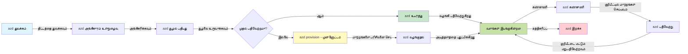

# AZD அடிப்படை - Azure Developer CLI ஐப் புரிந்துகொள்ளுதல்

# AZD அடிப்படை - மூலக் கருத்துகள் மற்றும் அடிப்படைகள்

**அத்தியாயத்தின் வழிசெலுத்தல்:**
- **📚 Course Home**: [AZD தொடக்கர்களுக்கான](../../README.md)
- **📖 Current Chapter**: அத்தியாயம் 1 - அடிப்படை மற்றும் விரைவு தொடக்கம்
- **⬅️ Previous**: [பாடநெறி கண்ணோட்டம்](../../README.md#-chapter-1-foundation--quick-start)
- **➡️ Next**: [நிறுவல் மற்றும் அமைப்பு](installation.md)
- **🚀 Next Chapter**: [அத்தியாயம் 2: AI முதன்மை வளர்ச்சி](../chapter-02-ai-development/microsoft-foundry-integration.md)

## அறிமுகம்

இந்த பாடம் உங்களை Azure Developer CLI (azd) உடன் அறிமுகம் செய்கிறது, இது உள்ளூர் மேம்பாட்டிலிருந்து Azure வரை உங்கள் பயணத்தை வேகப்படுத்தும் சக்திவாய்ந்த கட்டளை வரிசைப் பயன்பாடு. நீங்கள் அடிப்படை கருத்துகள், முக்கிய அம்சங்கள் கற்றுக்கொள்வீர்கள் மற்றும் azd எப்படி கிளவுட்-நேட்டிவ் பயன்பாட்டு பதிப்பீட்டை எளிதாக்குகிறது என்பதை புரிந்து கொள்ளலாம்.

## கற்றல் இலக்குகள்

இந்த பாடம் முடிந்தவுடன், நீங்கள்:
- Azure Developer CLI என்றால் என்ன மற்றும் அதன் பிரதான நோக்கம் என்ன என்பதைப் புரிந்துகொள்வீர்கள்
- வார்ப்புருக்கள் (templates), சூழ்நிலைகள், மற்றும் சேவைகள் ஆகியவற்றின் மூலக் கருத்துக்களை கற்றுக்கொள்வீர்கள்
- வார்ப்புரு-வழிசெலுத்தப்பட்ட மேம்பாடு மற்றும் Infrastructure as Code உட்பட முக்கிய அம்சங்களை ஆராய்வீர்கள்
- azd திட்ட அமைப்பு மற்றும் பணிநடையைப் புரிந்துகொள்வீர்கள்
- உங்கள் மேம்பாட்டு சூழலுக்காக azd ஐ நிறுவி அமைக்கத் தயாராக இருப்பீர்கள்

## கற்றல் முடிவுகள்

இந்தப் பாடத்தை முடித்த பிறகு, நீங்கள்:
- நவீன கிளவுட் மேம்பாட்டு பணிநடைகளில் azd இன் பங்கைக் விவரிக்கக் கூடும்
- azd திட்ட அமைப்பின் கூறுக்களை அடையாளம் காணலாம்
- வார்ப்புருக்கள், சூழ்நிலைகள், மற்றும் சேவைகள் எப்படி ஒன்றாக வேலை செய்கிறன என்பதை விளக்கலாம்
- azd உடன் Infrastructure as Code இன் பயன்களை புரிந்துகொள்ளலாம்
- வெவ்வேறு azd கட்டளைகள் மற்றும் அவற்றின் நோக்கங்களை அடையாளம் காணலாம்

## Azure Developer CLI (azd) என்றது என்ன?

Azure Developer CLI (azd) என்பது உள்ளூர் மேம்பாட்டிலிருந்து Azure பதிப்பீடு வரை உங்கள் பயணத்தை வேகப்படுத்த வடிவமைக்கப்பட்ட கட்டளை வரி கருவி. இது Azure இல் கிளவுட்-நேட்டிவ் பயன்பாடுகளை உருவாக்குவது, பதிப்பீடு செய்வது மற்றும் ನಿರ್ವಹிப்பதை எளிமைப்படுத்துகிறது.

### azd மூலம் நீங்கள் என்னவை பதிப்பீடு செய்யலாம்?

azd பல விதமான வேலைப்பளிகளை ஆதரிக்கிறது — மற்றும் பட்டியல் தொடர்ந்து விரிகிறது. இன்று, நீங்கள் azd ஐப் பயன்படுத்தி பதிப்பீடு செய்யலாம்:

| பணிச்சுமை வகை | எடுத்துக்காட்டுகள் | அதே பணிநடை? |
|---------------|----------|----------------|
| **சம்பிரதாய பயன்பாடுகள்** | வலை பயன்பாடுகள், REST APIs, நிலையான தளங்கள் | ✅ `azd up` |
| **சேவைகள் மற்றும் மைக்ரோசேவைகள்** | Container Apps, Function Apps, பல சேவை பின்னணிகள் | ✅ `azd up` |
| **AI-சக்தி வாய்ந்த பயன்பாடுகள்** | Microsoft Foundry Models உடன் அரட்டை செயலிகள், AI Search உடன் RAG தீர்வுகள் | ✅ `azd up` |
| **அறிவுமிக்க முகவர்கள்** | Foundry-ஹோஸ்ட் செய்யப்பட்ட முகவர்கள், பல-முகவர் ஒழுங்குப்படுத்தல்கள் | ✅ `azd up` |

முக்கியமான விஷயம் என்னவெனில் **நீங்கள் என்ன பதிப்பீடு செய்கிறீர்கள் என்பதைக் காணாமல் azd வாழ்க்கைச் சுழற்சி ஒரே மாதிரிதானே இருக்கும்**. நீங்கள் ஒரு திட்டத்தை தொடங்குவர், கட்டமைப்பை வழங்குவர், உங்கள் குறியீட்டை பதிப்பீடு செய்வீர், உங்கள் பயன்பாட்டை கண்காணிப்பீர், மற்றும் resources-ஐ சுத்தம் செய்வீர் — அது ஒரு எளிய வலைத்தளம் ஆகியிருக்கலாம் அல்லது ஒரு சவாலான AI முகவராகியிருக்கலாம்.

இந்த தொடர்ச்சியா என்றது வடிவமைப்பால் ஏற்படுகிறது. azd AI திறன்களை உங்கள் பயன்பாடு பயன்படுத்தக்கூடிய மற்றொரு வகை சேவையாக சிகிச்சை செய்கிறது, அடிப்படையான விதத்தில் வேறுபட்ட ஒன்றாக அல்ல. Microsoft Foundry Models மூலம் ஆதரிக்கப்படும் ஒரு அரட்டை endpoint azd பார்வையில், கட்டமைக்கவும் பதிப்பீடு செய்யவும் ஒரு மற்றொரு சேவையே ஆகும்.

### 🎯 ஏதற்கு AZD பயன்படுத்துவது? ஒரு உண்மையான உலக ஒப்புமை

ஒரு எளிய வலை பயன்பாட்டை தரவுத்தளத்துடன் பதிப்பீடு செய்வதை ஒப்பிடுவோம்:

#### ❌ AZD இல்லாமல்: கைமுறை Azure பதிப்பீடு (30+ நிமிடம்)

```bash
# படி 1: வளக் குழுவை உருவாக்கவும்
az group create --name myapp-rg --location eastus

# படி 2: ஆப் சேவை திட்டத்தை உருவாக்கவும்
az appservice plan create --name myapp-plan \
  --resource-group myapp-rg \
  --sku B1 --is-linux

# படி 3: வலைப் பயன்பாட்டை உருவாக்கவும்
az webapp create --name myapp-web-unique123 \
  --resource-group myapp-rg \
  --plan myapp-plan \
  --runtime "NODE:18-lts"

# படி 4: Cosmos DB கணக்கை உருவாக்கவும் (10-15 நிமிடங்கள்)
az cosmosdb create --name myapp-cosmos-unique123 \
  --resource-group myapp-rg \
  --kind MongoDB

# படி 5: தரவுத்தளத்தை உருவாக்கவும்
az cosmosdb mongodb database create \
  --account-name myapp-cosmos-unique123 \
  --resource-group myapp-rg \
  --name tododb

# படி 6: கலெக்ஷனை உருவாக்கவும்
az cosmosdb mongodb collection create \
  --account-name myapp-cosmos-unique123 \
  --resource-group myapp-rg \
  --database-name tododb \
  --name todos

# படி 7: இணைப்பு ஸ்ட்ரிங்கைப் பெறவும்
CONN_STR=$(az cosmosdb keys list \
  --name myapp-cosmos-unique123 \
  --resource-group myapp-rg \
  --type connection-strings \
  --query "connectionStrings[0].connectionString" -o tsv)

# படி 8: அப் அமைப்புகளை கட்டமைக்கவும்
az webapp config appsettings set \
  --name myapp-web-unique123 \
  --resource-group myapp-rg \
  --settings MONGODB_URI="$CONN_STR"

# படி 9: பதிவெடுப்பை இயக்கவும்
az webapp log config --name myapp-web-unique123 \
  --resource-group myapp-rg \
  --application-logging filesystem \
  --detailed-error-messages true

# படி 10: Application Insights-ஐ அமைக்கவும்
az monitor app-insights component create \
  --app myapp-insights \
  --location eastus \
  --resource-group myapp-rg

# படி 11: App Insights-ஐ வலைப் பயன்பாட்டுடன் இணைக்கவும்
INSTRUMENTATION_KEY=$(az monitor app-insights component show \
  --app myapp-insights \
  --resource-group myapp-rg \
  --query "instrumentationKey" -o tsv)

az webapp config appsettings set \
  --name myapp-web-unique123 \
  --resource-group myapp-rg \
  --settings APPINSIGHTS_INSTRUMENTATIONKEY="$INSTRUMENTATION_KEY"

# படி 12: செயலியை உள்ளூரில் கட்டவும்
npm install
npm run build

# படி 13: வினியோக தொகுப்பை உருவாக்கவும்
zip -r app.zip . -x "*.git*" "node_modules/*"

# படி 14: செயலியை வினியோகிக்கவும்
az webapp deployment source config-zip \
  --resource-group myapp-rg \
  --name myapp-web-unique123 \
  --src app.zip

# படி 15: காத்திருந்து அது சரியாக செயல்படுவதாக பிரார்த்திக்கவும் 🙏
# (தானியங்கை சரிபார்ப்பு இல்லை, கைமுறை சோதனை தேவை)
```

**பிரச்சனைகள்:**
- ❌ நினைவில் வைக்க வேண்டிய மற்றும் வரிசையில் இயக்க வேண்டிய 15+ கட்டளைகள்
- ❌ 30-45 நிமிடங்கள் கைமுறை வேலை
- ❌ பிழைகள் செய்ய எளிது (தட்டச்சுப் பிழைகள், தவறான அளவுருக்கள்)
- ❌ இணைப்பு ஸ்ட்ரிங்களால் டெர்மினல் வரலாற்றில் வெளிப்படையாக இருக்கும்
- ❌ ஏதேனும் தோல்வியடைந்தால் தானியங்கி ரோல்பேக் இல்லை
- ❌ குழு உறுப்பினர்களுக்கு மறுபடியாய் உருவாக்குவது கடினம்
- ❌ ஒவ்வொரு முறை வேறுபடும் (மறுபடியாய் உருவாக்கமுடியாதது)

#### ✅ AZD உடன்: தானியங்கி பதிப்பீடு (5 கட்டளைகள், 10-15 நிமிடம்)

```bash
# படி 1: மாதிரியிலிருந்து ஆரம்பிக்கவும்
azd init --template todo-nodejs-mongo

# படி 2: அடையாளம் உறுதிசெய்யவும்
azd auth login

# படி 3: சூழலை உருவாக்கவும்
azd env new dev

# படி 4: மாற்றங்களை முன்னோட்டமாகப் பார்க்கவும் (விருப்பமானது ஆனால் பரிந்துரைக்கப்படுகிறது)
azd provision --preview

# படி 5: அனைத்தையும் வெளியிடவும்
azd up

# ✨ முடிந்தது! அனைத்தும் வெளியிடப்பட்டு, கட்டமைக்கப்பட்டு மற்றும் கண்காணிக்கப்படுகின்றன
```

**பலன்கள்:**
- ✅ **5 கட்டளைகள்** (15+ கைமுறை படிகளுடன் ஒப்பிடுகையில்)
- ✅ **10-15 நிமிடம்** மொத்த நேரம் (அதிகபட்சமாக Azure காக காத்திருப்பது)
- ✅ **தவறுகள் இல்லை** - தானியங்கி மற்றும் சோதிக்கப்பட்டது
- ✅ **ரகசியங்கள் பாதுகாப்பாக நிர்வகிக்கப்படுகின்றன** Key Vault மூலம்
- ✅ **தானியங்கி ரோல்பேக்** தோல்விகள் ஏற்பட்டால்
- ✅ **முழுமையாக மறுபடியால் உருவாக்கக்கூடியது** - ஒவ்வொரு முறையும் ஒரே முடிவு
- ✅ **குழு-செயலுக்குத் தயாரானது** - யாரும் ஒரே கட்டளைகளால் பதிவேற்றம் செய்யலாம்
- ✅ **Infrastructure as Code** - பதிப்பு கட்டுப்படுத்தப்பட்ட Bicep வார்ப்புருக்கள்
- ✅ **உள்ளமைக்கப்பட்ட கண்காணிப்பு** - Application Insights தானாக அமைக்கப்படுகிறது

### 📊 நேரம் மற்றும் பிழை குறைப்பு

| அளவுகோல் | கைமுறை பதிப்பு | AZD பதிப்பு | மேம்பாடு |
|:-------|:------------------|:---------------|:------------|
| **கட்டளைகள்** | 15+ | 5 | 67% குறைவு |
| **நேரம்** | 30-45 நிமிடங்கள் | 10-15 நிமிடங்கள் | 60% வேகமாக |
| **பிழை வீதம்** | ~40% | <5% | 88% குறைவு |
| **ஒற்றுமை** | குறைவு (கைமுறை) | 100% (தானியங்கி) | முழுமையாக |
| **குழு சேர்க்கை** | 2-4 மணிநேரம் | 30 நிமிடங்கள் | 75% வேகமாக |
| **ரோல்பேக் நேரம்** | 30+ நிமிடங்கள் (கைமுறை) | 2 நிமிடங்கள் (தானியங்கி) | 93% வேகமாக |

## மூலக் கருத்துகள்

### வார்ப்புருக்கள்
வார்ப்புருக்கள் azd இன் அடித்தளம். அவை கொண்டிருக்கும்:
- **அப்ளிகேஷன் குறியீடு** - உங்கள் மூலக் குறியீடு மற்றும் சார்புகள்
- **அமைப்பமைப்பு வரைவுகள்** - Bicep அல்லது Terraform இல் வரையறுக்கப்பட்ட Azure வளங்கள்
- **கான்பிகரேஷன் கோப்புகள்** - அமைப்புகள் மற்றும் சூழல் மாறிலிகள்
- **பதிவேற்ற ஸ்கிரிப்டுகள்** - தானியங்கி பதிப்பீடு பணிநடைகள்

### சூழல்கள்
சூழல்கள் வெவ்வேறு பதிப்பு இலக்குகளை பிரதிநிதித்துவப்படுத்துகின்றன:
- **Development** - சோதனை மற்றும் மேம்பாட்டிற்காக
- **Staging** - உற்பத்திக்கு முன் சூழல்
- **Production** - நேரடி உற்பத்தி சூழல்

ஒவ்வொரு சூழலும் தன்னுடையது வைத்திருக்கிறது:
- Azure resource group
- கான்பிகரேஷன் அமைப்புகள்
- பதிப்பீடு நிலை

### சேவைகள்
சேவைகள் உங்கள் பயன்பாட்டின் கட்டுமானக் கூறுகள்:
- **Frontend** - வலை பயன்பாடுகள், SPAs
- **Backend** - APIs, மைக்ரோசேவைகள்
- **Database** - தரவு சேமிப்பு தீர்வுகள்
- **Storage** - கோப்பு மற்றும் பிளாப் சேமிப்பு

## முக்கிய அம்சங்கள்

### 1. வார்ப்புரு வழிசெலுத்தப்பட்ட மேம்பாடு
```bash
# கிடைக்கக்கூடிய வார்ப்புருக்களை உலாவு
azd template list

# ஒரு வார்ப்புருவிலிருந்து தொடங்கு
azd init --template <template-name>
```

### 2. Infrastructure as Code
- **Bicep** - Azure இன் டொமைன்-நிர்ணய மொழி
- **Terraform** - பல-மேக அமைப்பு கருவி
- **ARM Templates** - Azure Resource Manager வார்ப்புருக்கள்

### 3. ஒருங்கிணைக்கப்பட்ட பணிநடைகள்
```bash
# முழுமையான பதிப்பிறக்க பணிமுறை
azd up            # Provision + Deploy இது முதன்முறை அமைப்பிற்காக கையேற்பாடின்றி செயல்படுகிறது

# 🧪 புதியது: பதிப்பிறக்கத்திற்கு முன் அடித்தள கட்டமைப்பு மாற்றங்களை முன்னோக்கிப் பார்க்கவும் (பாதுகாப்பானது)
azd provision --preview    # மாற்றங்கள் செய்யாமல் அடித்தளப் பதிப்பிறக்கத்தை உருவகப்படுத்தவும்

azd provision     # அடித்தளத்தை புதுப்பித்தால் Azure வளங்களை உருவாக்க இதைப் பயன்படுத்தவும்
azd deploy        # பயன்பாட்டு குறியீட்டை வெளியிடவும் அல்லது புதுப்பித்த பிறகு மீண்டும் வெளியிடவும்
azd down          # வளங்களை சுத்தப்படுத்தவும்
```

#### 🛡️ முன்னோட்டத்துடன் பாதுகாப்பான அமைப்புத் திட்டமிடல்
The `azd provision --preview` கட்டளை பாதுகாப்பான பதிப்பீடுகளுக்கான ஒரு முக்கிய மாற்றம்:
- **Dry-run analysis** - உருவாக்கப்படும், மாற்றப்படும் அல்லது நீக்கப்படும் என்ன என்பதை காட்டுகிறது
- **Zero risk** - உங்கள் Azure சூழலில் எந்தவிதமான மாற்றங்களும் செய்யப்படாமல் இருக்கும்
- **Team collaboration** - பதிப்பீட்டுக்கு முன்பே முன்னோட்டு முடிவுகளை பகிரலாம்
- **Cost estimation** - பணம் செலவீன் பற்றி பொதுவாக புரிந்துகொள்ள உதவும்

```bash
# உதாரண முன்னோட்ட பணிநெறி
azd provision --preview           # என்ன மாற்றப்படும் என்பதைப் பார்க்க
# வெளியீட்டை பரிசீலிக்கவும், குழுவுடன் விவாதிக்கவும்
azd provision                     # மாற்றங்களை நம்பிக்கையுடன் செயல்படுத்தவும்
```

### 📊 காட்சி: AZD மேம்பாட்டு பணிநடை


**பணிநடை விளக்கம்:**
1. **Init** - வார்ப்புரு அல்லது புதிய திட்டத்துடன் தொடங்கவும்
2. **Auth** - Azure உடன் அங்கீகாரம் செய்யவும்
3. **Environment** - தனித்துவமான பதிப்பு சூழலை உருவாக்கவும்
4. **Preview** - 🆕 முதலில் எப்போதும் அமைப்பு மாற்றங்களை முன்னோட்டம் செய்யவும் (பாதுகாப்பான நடைமுறை)
5. **Provision** - Azure வளங்களை உருவாக்க/புதுப்பிக்கவும்
6. **Deploy** - உங்கள் பயன்பாட்டு குறியீட்டை தள்ளவும்
7. **Monitor** - பயன்பாட்டு செயல்திறனை கவனிக்கவும்
8. **Iterate** - மாற்றங்களை செய்து குறியீட்டை மீண்டும் பதிப்பீடு செய்யவும்
9. **Cleanup** - முடிந்தவுடன் வளங்களை அகற்றவும்

### 4. சூழல் மேலாண்மை
```bash
# சூழல்களை உருவாக்கவும் மற்றும் நிர்வகிக்கவும்
azd env new <environment-name>
azd env select <environment-name>
azd env list
```

### 5. நீட்டிப்புகள் மற்றும் AI கட்டளைகள்

azd கூர் CLI அடிப்படையினை գեր하고 செயல்திறன்களைச் சேர்க்க நீட்டிப்பு சிஸ்டத்தைப் பயன்படுத்துகிறது. இது குறிப்பாக AI வேலைப்பளிகளுக்கு பயனுள்ளதாக இருக்கும்:

```bash
# கிடைக்கும் விரிவாக்கங்களை பட்டியலிடவும்
azd extension list

# Foundry agents விரிவாக்கத்தை நிறுவவும்
azd extension install azure.ai.agents

# ஒரு மெனிஃபெஸ்டில் இருந்து AI ஏஜென்ட் திட்டத்தை துவக்கவும்
azd ai agent init -m agent-manifest.yaml

# AI உதவியுடன் நடைபெறும் உருவாக்கத்துக்காக MCP சர்வரை துவக்கவும் (ஆல்பா)
azd mcp start
```

> நீட்டிப்புகள் விரிவாக [அத்தியாயம் 2: AI முதன்மை வளர்ச்சி](../chapter-02-ai-development/agents.md) மற்றும் [AZD AI CLI கட்டளைகள்](../chapter-08-production/production-ai-practices.md#azd-ai-cli-commands-and-extensions) குறிப்பில் விவாதிக்கப்படுகின்றன.

## 📁 திட்ட அமைப்பு

ஒரு பொதுவான azd திட்ட அமைப்பு:
```
my-app/
├── .azd/                    # azd configuration
│   └── config.json
├── .azure/                  # Azure deployment artifacts
├── .devcontainer/          # Development container config
├── .github/workflows/      # GitHub Actions
├── .vscode/               # VS Code settings
├── infra/                 # Infrastructure code
│   ├── main.bicep        # Main infrastructure template
│   ├── main.parameters.json
│   └── modules/          # Reusable modules
├── src/                  # Application source code
│   ├── api/             # Backend services
│   └── web/             # Frontend application
├── azure.yaml           # azd project configuration
└── README.md
```

## 🔧 கான்பிகரேஷன் கோப்புகள்

### azure.yaml
முதன்மை திட்ட கான்பிகரேஷன் கோப்பு:
```yaml
name: my-awesome-app
metadata:
  template: my-template@1.0.0

services:
  web:
    project: ./src/web
    language: js
    host: appservice
  api:
    project: ./src/api
    language: js
    host: appservice

hooks:
  preprovision:
    shell: pwsh
    run: echo "Preparing to provision..."
```

### .azure/config.json
சூழல்-சரியான கான்பிகரேஷன்:
```json
{
  "version": 1,
  "defaultEnvironment": "dev",
  "environments": {
    "dev": {
      "subscriptionId": "your-subscription-id",
      "location": "eastus"
    }
  }
}
```

## 🎪 பொதுவான பணிநடைகள் கை-பயிற்சிகளுடன்

> **💡 கற்றல் குறிப்பு:** உங்கள் AZD திறன்களை முறையே கட்டியெடுத்து வளர்க்க இந்த பயிற்சிகளை அந்த வரிசையில் பின்பற்றவும்.

### 🎯 பயிற்சி 1: உங்கள் முதல் திட்டத்தை துவக்கவும்

**நோக்கம்:** ஒரு AZD திட்டத்தை உருவாக்கி அதன் அமைப்பை ஆராய்வது

**படிகள்:**
```bash
# நம்பகமான வார்ப்புருவைப் பயன்படுத்தவும்
azd init --template todo-nodejs-mongo

# உருவாக்கப்பட்ட கோப்புகளை ஆராயவும்
ls -la  # மறைக்கப்பட்ட கோப்புகளையும் உட்பட அனைத்து கோப்புகளையும் காணவும்

# உருவாக்கப்பட்ட முக்கிய கோப்புகள்:
# - azure.yaml (முதன்மை கட்டமைப்பு)
# - infra/ (அடித்தளக் குறியீடு)
# - src/ (பயன்பாட்டு குறியீடு)
```

**✅ வெற்றி:** உங்கள் திட்டத்தில் azure.yaml, infra/, மற்றும் src/ கோப்புறைகள் உள்ளன

---

### 🎯 பயிற்சி 2: Azure க்கு பதிப்பீடு செய்யவும்

**நோக்கம்:** தொடக்கம் முதல் இறுதி வரை பதிப்பீட்டை முழுமையாக நிறைவேற்றுதல்

**படிகள்:**
```bash
# 1. அங்கீகரிக்கவும்
az login && azd auth login

# 2. சூழலை உருவாக்கவும்
azd env new dev
azd env set AZURE_LOCATION eastus

# 3. மாற்றங்களை முன்னோட்டமாகப் பார்வையிடவும் (பரிந்துரைக்கப்படுகிறது)
azd provision --preview

# 4. அனைத்தையும் வெளியிடவும்
azd up

# 5. வெளியீட்டை சரிபார்க்கவும்
azd show    # உங்கள் செயலியின் URL ஐப் பார்க்கவும்
```

**எதிர்பார்க்கப்படும் நேரம்:** 10-15 நிமிடங்கள்  
**✅ வெற்றி:** பயன்பாட்டு URL உலாவியில் திறக்கப்படும்

---

### 🎯 பயிற்சி 3: பல சூழல்கள்

**நோக்கம்:** dev மற்றும் staging க்கு பதிப்பீடு செய்யவும்

**படிகள்:**
```bash
# ஏற்கனவே dev உள்ளது, staging உருவாக்கவும்
azd env new staging
azd env set AZURE_LOCATION westus2
azd up

# இவற்றின் இடையே மாறவும்
azd env list
azd env select dev
```

**✅ வெற்றி:** Azure போர்டலில் இரண்டு தனித்துவமான resource groups

---

### 🛡️ சுத்தமான துவக்கம்: `azd down --force --purge`

முழுமையாக மீட்டமைக்க வேண்டிய போது:

```bash
azd down --force --purge
```

**இது என்ன செய்கிறது:**
- `--force`: உறுதிப்படுத்தல் கேட்புகள் இல்லை
- `--purge`: அனைத்து உள்ளூர் நிலையும் Azure வளங்களையும் நீக்குகிறது

**பயன்படுத்த வேண்டிய போது:**
- பதிப்பீடு நடுநிலையில் தோல்வியடைந்தால்
- திட்டங்களை மாற்றுகிறபோது
- புதிய துவக்கம் தேவைப்படும்போது

---

## 🎪 அசல் பணிநடை குறிப்பேடு

### புதிய திட்டத்தை துவக்குதல்
```bash
# முறை 1: ஏற்கனவே உள்ள வார்ப்புருவைப் பயன்படுத்தவும்
azd init --template todo-nodejs-mongo

# முறை 2: ஆரம்பத்திலிருந்து துவங்கவும்
azd init

# முறை 3: தற்போதைய அடைவை பயன்படுத்தவும்
azd init .
```

### மேம்பாட்டு சுழற்சி
```bash
# மேம்பாட்டுத் சூழலை அமைக்க
azd auth login
azd env new dev
azd env select dev

# எல்லாவற்றையும் வெளியிடு
azd up

# மாற்றங்கள் செய்து மீண்டும் வெளியிடு
azd deploy

# முடிந்தவுடன் சுத்தம் செய்
azd down --force --purge # Azure Developer CLI-இல் உள்ள இந்த கட்டளை உங்கள் சூழலுக்கான ஒரு முழுமையான மீட்டமைப்பாகும் — குறிப்பாக தோல்வியடைந்த வெளியீடுகளை ஆய்வு செய்து சரிசெய்யும்போது, பின்தங்கிய வளங்களை சுத்தம் செய்யும்போது, அல்லது புதிய மறுவெளியீட்டிற்கு தயாரிக்கும்போது மிகவும் பயனுள்ளது.
```

## `azd down --force --purge` ஐ புரிந்து கொள்வது
`azd down --force --purge` கட்டளை உங்கள் azd சூழலை மற்றும் அதனுடன் தொடர்புடைய அனைத்து வளங்களையும் முழுமையாக உடைத்துவிட ஒரு வலிமையான வழியாகும். ஒவ்வொரு கொடி எந்த செயலைச் செய்கிறது என்பதின் விரிவுரை இங்கே:
```
--force
```
- உறுதிப்படுத்தல் கேட்புகளை தவிர்க்கிறது.
- தானியக்கமோ அல்லது ஸ்கிரிப்டிங்கோ தொடர்பான சூழல்களில், கைமுறை உள்ளீடு சாத்தியமில்லாத இடங்களில் பயன்படுகிறது.
- CLI எந்தவித கலவையின்மை கண்டுபிடித்தாலும் இடைநிறுத்தமின்றி teardown தொடரும் என்பதை உறுதிப்படுத்துகிறது.

```
--purge
```
**அனைத்து தொடர்புடைய மெட்டா தரவுகளையும் நீக்குகிறது**, உட்பட:
சூழல் நிலை
உள்ளூர் `.azure` கோப்புறை
கேஷ் செய்யப்பட்ட பதிப்பீடு தகவல்
azd இன் முந்தைய பதிப்பீடுகளை "நினைவில் வைக்க" விலக்குகிறது, இது பொருந்தாத resource groups அல்லது காலாவதியான registry குறிப்பு போன்ற பிரச்சனைகளை ஏற்படுத்தக்கூடும்.


### ஏன் இரண்டையும் பயன்படுத்த வேண்டும்?
`azd up` இல் நிலைத்த நிலை அல்லது பகுதி பதிப்பீடுகளால் சிக்கலில் விழுந்துவிட்டால், இந்த கூட்டுத்த் திட்டம் **சுத்தமான துவக்கத்தை** உறுதிசெய்கிறது.

இது குறிப்பாக Azure போர்டலில் கைமுறை வள நீக்கத்திற்குப் பிறகு அல்லது வார்ப்புருக்கள், சூழல்கள், அல்லது resource group பெயரிடல் conventons மாற்றும்போது பயனுள்ளதாக இருக்கும்.


### பல சூழல்களை நிர்வகித்தல்
```bash
# ஸ்டேஜிங் சூழலை உருவாக்கு
azd env new staging
azd env select staging
azd up

# மீண்டும் dev-க்கு மாற்று
azd env select dev

# சூழல்களை ஒப்பிடு
azd env list
```

## 🔐 அங்கீகாரம் மற்றும் அடையாளப்பத்திரங்கள்

அங்கீகாரத்தைப் புரிந்துகொள்வது azd பதிப்பீடுகளின் வெற்றிக்குக் குறியீடு. Azure பல்வேறு அங்கீகார முறைகளைப் பயன்படுத்துகிறது, மற்றும் azd மற்ற Azure கருவிகள் பயன்படுத்தும் அதே அடையாள சங்கிலியை பயன்படுத்துகிறது.

### Azure CLI அங்கீகாரம் (`az login`)

azd ஐ பயன்படுத்தும் முன், நீங்கள் Azure உடன் அங்கீகரிக்க வேண்டும். பொதுவாக பயன்படுத்தப்படும் முறை Azure CLI பயன்படுத்துவது:

```bash
# இணைய சார்ந்த உள்நுழைவு (உலாவியைத் திறக்கும்)
az login

# குறிப்பிட்ட டெனன்ட் மூலம் உள்நுழைவு
az login --tenant <tenant-id>

# சேவை பிரதிநிதியுடன் உள்நுழைவு
az login --service-principal -u <app-id> -p <password> --tenant <tenant-id>

# தற்போதைய உள்நுழைவு நிலையை சரிபார்க்கவும்
az account show

# கிடைக்கும் சப்ஸ்கிரிப்ஷன்களை பட்டியலிடவும்
az account list --output table

# இயல்புநிலை சப்ஸ்கிரிப்ஷனை அமைக்கவும்
az account set --subscription <subscription-id>
```

### அங்கீகார ஓட்டம்
1. **Interactive Login**: அங்கீகாரத்திற்காக உங்கள் இயல்புநிலை உலாவியை திறக்கிறது
2. **Device Code Flow**: உலாவி அணுகல் இல்லாத சூழல்களுக்கு
3. **Service Principal**: தானியக்க மற்றும் CI/CD சூழல்களுக்காக
4. **Managed Identity**: Azure-ஹோஸ்ட் செய்யப்பட்ட பயன்பாடுகளுக்காக

### DefaultAzureCredential சங்கிலி

`DefaultAzureCredential` என்பது பல அடையாள மூலங்களை குறிப்பிட்ட வரிசையில் தானாக முயற்சி செய்து எளிய அங்கீகார அனுபவத்தை வழங்கும் ஒரு அடையாள வகை:

#### அடையாள சங்கிலி வரிசை
```mermaid
graph TD
    A[இயல்புநிலை Azure சான்று] --> B[சூழல் மாறிகள்]
    B --> C[பணிச்சுமை அடையாளம்]
    C --> D[நிர்வகிக்கப்பட்ட அடையாளம்]
    D --> E[விசுவல் ஸ்டுடியோ]
    E --> F[விசுவல் ஸ்டுடியோ கோடு]
    F --> G[Azure கட்டளை வரி (CLI)]
    G --> H[Azure பவர்ஷெல்]
    H --> I[தொடர்பான உலாவி]
```
#### 1. சூழல் மாறிலிகள்
```bash
# சேவை பிரதிநிதிக்கான சுற்றுச்சூழல் மாறிகளை அமைக்கவும்
export AZURE_CLIENT_ID="<app-id>"
export AZURE_CLIENT_SECRET="<password>"
export AZURE_TENANT_ID="<tenant-id>"
```

#### 2. Workload Identity (Kubernetes/GitHub Actions)
தானாக உள்ளது:
- Workload Identity உடன் Azure Kubernetes Service (AKS)
- OIDC கூட்டமைப்புடன் GitHub Actions
- பிற கூட்டமைப்பு அடையாள நிலைகள்

#### 3. Managed Identity
பின்வருமாறு Azure வளங்களுக்கு:
- Virtual Machines
- App Service
- Azure Functions
- Container Instances

```bash
# மேலாண்மை அடையாளத்துடன் Azure வளத்தில் இயங்குகிறதா என சரிபார்க்கவும்
az account show --query "user.type" --output tsv
# திருப்புதல்: மேலாண்மை அடையாளம் பயன்படுத்தினால் "servicePrincipal"
```

#### 4. Developer Tools ஒருங்கிணைப்பு
- **Visual Studio**: உள்நுழைந்த கணக்கை தானாகப் பயன்படுத்தும்
- **VS Code**: Azure Account நீட்டிப்பு அடையாளத்தைப் பயன்படுத்தும்
- **Azure CLI**: `az login` அடையாளத்தைப் பயன்படுத்துகிறது (உள்ளூர் மேம்பாட்டிற்கு மிகப் பொதுவானது)

### AZD அங்கீகார அமைத்தல்

```bash
# முறை 1: Azure CLI பயன்படுத்தவும் (வளர்ச்சிக்காக பரிந்துரைக்கப்படுகிறது)
az login
azd auth login  # தற்போதைய Azure CLI கடவுச்சான்றுகளைப் பயன்படுத்துகிறது

# முறை 2: நேரடி azd அங்கீகாரம்
azd auth login --use-device-code  # தலைமில்லா சூழல்களுக்கு

# முறை 3: அங்கீகார நிலையை சரிபார்க்கவும்
azd auth login --check-status

# முறை 4: வெளியேறி மீண்டும் அங்கீகாரம் செய்யவும்
azd auth logout
azd auth login
```

### அங்கீகார சிறந்த நடைமுறைகள்

#### உள்ளூர் மேம்பாட்டிற்காக
```bash
# 1. Azure CLI மூலம் உள்நுழையவும்
az login

# 2. சரியான சந்தாவை உறுதிசெய்யவும்
az account show
az account set --subscription "Your Subscription Name"

# 3. முன்பே உள்ள சான்றுகளுடன் azd ஐப் பயன்படுத்தவும்
azd auth login
```

#### CI/CD குழாய்களுக்காக
```yaml
# GitHub Actions example
- name: Azure Login
  uses: azure/login@v1
  with:
    creds: ${{ secrets.AZURE_CREDENTIALS }}

- name: Deploy with azd
  run: |
    azd auth login --client-id ${{ secrets.AZURE_CLIENT_ID }} \
                    --client-secret ${{ secrets.AZURE_CLIENT_SECRET }} \
                    --tenant-id ${{ secrets.AZURE_TENANT_ID }}
    azd up --no-prompt
```

#### உற்பத்தி சூழல்களுக்கு
- Azure வளங்களில் இயக்கும்போது **Managed Identity** ஐ பயன்படுத்தவும்
- தானியக்க சூழல்களுக்கு **Service Principal** ஐ பயன்படுத்தவும்
- கடவுச்சொற்களை குறியீடு அல்லது உள்ளமைவு கோப்புகளில் சேமிக்காமல் இருக்கவும்
- உணர்ச்சிமிக்க உள்ளமைப்புகளுக்கு **Azure Key Vault** ஐப் பயன்படுத்தவும்

### பொதுவான அங்கீகார பிரச்சனைகள் மற்றும் தீர்வுகள்

#### பிரச்சனை: "Subscription காணப்படவில்லை"
```bash
# தீர்வு: இயல்புநிலை சந்தாவை அமைக்கவும்
az account list --output table
az account set --subscription "<subscription-id>"
azd env set AZURE_SUBSCRIPTION_ID "<subscription-id>"
```

#### பிரச்சனை: "போதுமான அனுமதிகள் இல்லை"
```bash
# தீர்வு: தேவையான பங்குகளை சரிபார்த்து ஒதுக்கவும்
az role assignment list --assignee $(az account show --query user.name --output tsv)

# பொதுவாக தேவையான பங்குகள்:
# - Contributor (வள மேலாண்மைக்காக)
# - User Access Administrator (பங்கு ஒதுக்கல்களுக்கு)
```

#### பிரச்சனை: "டோக்கன் காலாவதியாகிவிட்டது"
```bash
# தீர்வு: மீண்டும் அங்கீகரிக்கவும்
az logout
az login
azd auth logout
azd auth login
```

### வெவ்வேறு சூழல்களில் அங்கீகாரம்

#### உள்ளூர் மேம்பாடு
```bash
# தனிநபர் மேம்பாட்டு கணக்கு
az login
azd auth login
```

#### குழு மேம்பாடு
```bash
# நிறுவனத்திற்காக குறிப்பிட்ட டெனன்டை பயன்படுத்தவும்.
az login --tenant contoso.onmicrosoft.com
azd auth login
```

#### பல-தொகுதி சூழல்கள்
```bash
# வாடகையாளர்களுக்கு இடையே மாறவும்
az login --tenant tenant1.onmicrosoft.com
# வாடகையாளர் 1-க்கு வெளியிடவும்
azd up

az login --tenant tenant2.onmicrosoft.com  
# வாடகையாளர் 2-க்கு வெளியிடவும்
azd up
```

### பாதுகாப்பு கவனிக்க வேண்டியவை
1. **சான்று சேமிப்பு**: மூலக் குறியிலே சான்றுகளை ஒருபோதும் சேமிக்காதீர்கள்
2. **அளவுக் கட்டுப்பாடு**: சேவைக் பிரதிநிதிகளுக்காக குறைந்த உரிமை கொள்கையைப் பயன்படுத்தவும்
3. **டோக்கன் மறுசுழற்சி**: சேவைக் பிரதிநிதி ரகசியங்களை முறையாக திருப்பவும்
4. **தணிக்கை பதிவுகள்**: அங்கீகார மற்றும் முன்னெடுப்பு செயல்பாட்களை கண்காணிக்கவும்
5. **பிணைய பாதுகாப்பு**: முடிந்தால் தனியார் எண்ட்பாயிண்ட்களைப் பயன்படுத்தவும்

### அங்கீகார சிக்கல்களைத் தீர்க்குதல்

```bash
# அங்கீகாரப் பிரச்சனைகளை டிபக் செய்யவும்
azd auth login --check-status
az account show
az account get-access-token

# பொதுவான கண்டறிதல் கட்டளைகள்
whoami                          # தற்போதைய பயனர் சூழ்நிலை
az ad signed-in-user show      # Azure AD பயனர் விவரங்கள்
az group list                  # வள அணுகலை சோதிக்கவும்
```

## `azd down --force --purge` ஐப் புரிந்துகொள்வது

### கண்டுபிடித்தல்
```bash
azd template list              # வார்ப்புருக்களை உலாவவும்
azd template show <template>   # வார்ப்புரு விவரங்கள்
azd init --help               # துவக்க விருப்பங்கள்
```

### திட்ட மேலாண்மை
```bash
azd show                     # திட்டத்தின் கண்ணோட்டம்
azd env show                 # தற்போதைய சூழல்
azd config list             # கட்டமைப்பு அமைப்புகள்
```

### மேற்பார்வை
```bash
azd monitor                  # Azure போர்டல் கண்காணிப்பை திறக்கவும்
azd monitor --logs           # விண்ணப்ப பதிவுகளைப் பார்க்கவும்
azd monitor --live           # நேரடி அளவீடுகளைப் பார்க்கவும்
azd pipeline config          # CI/CD ஐ அமைக்கவும்
```

## சிறந்த நடைமுறைகள்

### 1. பொருத்தமான பெயர்களைப் பயன்படுத்தவும்
```bash
# நன்று
azd env new production-east
azd init --template web-app-secure

# தவிர்க்கவும்
azd env new env1
azd init --template template1
```

### 2. வார்ப்புருக்களைப் பயன்படுத்தவும்
- உள்ளிருந்த வார்ப்புருக்களுடன் துவங்குங்கள்
- உங்கள் தேவைகளுக்கு ஏற்ப தனிப்பயனாக்குங்கள்
- உங்கள் நிறுவனத்திற்காக மீண்டும் பயன்படுத்தக்கூடிய வார்ப்புருக்களை உருவாக்குங்கள்

### 3. சூழல் தனிமைப்படுத்துதல்
- dev/staging/prod க்காக தனித்த சூழல்களைப் பயன்படுத்தவும்
- உள்ளூர் கணினியிலிருந்து நேரடியாக உற்பத்திக்கு வெளியிடாதீர்கள்
- உற்பத்தி வெளியீடுகளுக்காக CI/CD பைப்்லைன்களின் பயன்பாட்டை பின்பற்றுங்கள்

### 4. கட்டமைப்பு மேலாண்மை
- ரகசியத் தரவுகளுக்காக சூழல் மாறிலிகளைப் பயன்படுத்தவும்
- கட்டமைப்பை பதிப்பு கட்டுப்பாட்டில் வைக்கவும்
- சூழலுக்கு இணையான அமைப்புகளை ஆவணப்படுத்துங்கள்

## கற்றல் முன்னேற்றம்

### தொடக்க நிலை (வாரம் 1-2)
1. azd ஐ நிறுவி அங்கீகரிக்கவும்
2. ஒரு எளிய வார்ப்புருவை வெளியிடவும்
3. திட்ட அமைப்பை புரிந்துகொள்ளவும்
4. அடிப்படை கட்டளைகள் கற்றுக்கொள்ளவும் (up, down, deploy)

### இடைநிலை (வாரம் 3-4)
1. வார்ப்புருக்களை தனிப்பயனாக்கவும்
2. பல சூழல்களை நிர்வகிக்கவும்
3. இன்ப்ராஸ்ட்ரக்சர் குறியீட்டைப் புரிந்துகொள்ளவும்
4. CI/CD பைப்்லைன்களை அமைக்கவும்

### மேம்பட்ட (வாரம் 5+)
1. தனிப்பயன் வார்ப்புருக்களை உருவாக்கவும்
2. மேம்பட்ட அடித்தள அமைப்புப் பேட்டர்ன்கள்
3. பன்மண்டல வெளியீடுகள்
4. நிறுவனத் தரமான கட்டமைப்புகள்

## அடுத்த படிகள்

**📖 அத்தியாயம் 1 கற்றலை தொடரவும்:**
- [நிறுவல் மற்றும் அமைப்பு](installation.md) - azd ஐ நிறுவி அமைக்கவும்
- [உங்கள் முதல் திட்டம்](first-project.md) - கையேடு பயிற்சியை முழுமையாக முடிக்கவும்
- [கட்டமைப்பு வழிகாட்டு](configuration.md) - மேம்பட்ட கட்டமைப்பு விருப்பங்கள்

**🎯 அடுத்த அத்தியாயத்திற்குத் தயாரா?**
- [அத்தியாயம் 2: AI-முதன்மை மேம்பாடு](../chapter-02-ai-development/microsoft-foundry-integration.md) - AI பயன்பாடுகளை உருவாக்கத் தொடங்குங்கள்

## கூடுதல் ஆதாரங்கள்

- [Azure Developer CLI அறிமுகம்](https://learn.microsoft.com/en-us/azure/developer/azure-developer-cli/)
- [வார்ப்புரு தொகுப்பு](https://azure.github.io/awesome-azd/)
- [சமூக மாதிரிகள்](https://github.com/Azure-Samples)

---

## 🙋 அடிக்கடி கேட்கப்படும் கேள்விகள்

### பொது கேள்விகள்

**Q: AZD மற்றும் Azure CLI இல் என்ன வித்தியாசம்?**

A: Azure CLI (`az`) தனி Azure வளங்களைப் பராமரிக்க用. AZD (`azd`) முழு பயன்பாடுகளைப் பராமரிக்க用:

```bash
# Azure CLI - கீழ்மட்ட வள மேலாண்மை
az webapp create --name myapp --resource-group rg
az sql server create --name myserver --resource-group rg
# ...இன்னும் பல கட்டளைகள் தேவை

# AZD - விண்ணப்ப நிலை மேலாண்மை
azd up  # அனைத்து வளங்களுடனும் முழு பயன்பாட்டையும் அமைக்கிறது
```

**இதைப் போல யோசிக்கவும்:**
- `az` = தனிப்பட்ட லெகோ தகரைகளை இயக்குவது
- `azd` = முழு லெகோ செட்களுடன் வேலை செய்வது

---

**Q: AZD பயன்படுத்த Bicep அல்லது Terraform கற்றுக்கொள்ள வேண்டுமா?**

A: இல்லை! வார்ப்புருக்களுடன் துவங்குங்கள்:
```bash
# இருக்கின்ற வார்ப்புருவைப் பயன்படுத்தவும் - IaC பற்றிய அறிவு தேவையில்லை
azd init --template todo-nodejs-mongo
azd up
```

பின்னர் மைய அமைப்புகளை தனிப்பயனாக்க Bicep கற்றுக்கொள்ளலாம். வார்ப்புருக்கள் கற்றுக்கொள்ளக் கூடிய செயல்பாட்டுச் சில உதாரணங்களை வழங்குகின்றன.

---

**Q: AZD வார்ப்புருக்களை இயக்க செலவு எவ்வளவு?**

A: செலவுகள் வார்ப்புருவின்படி மாறுபடும். பெரும்பாலான மேம்பாட்டு வார்ப்புருக்கள் மாதம் $50-150 செலவாகும்:

```bash
# பதிவேற்றுவதற்கு முன் செலவுகளை முன்னோட்டமாகப் பார்க்கவும்
azd provision --preview

# பயன்படுத்தவில்லை என்றால் எப்போதும் சுத்தம் செய்யவும்
azd down --force --purge  # அனைத்து வளங்களையும் நீக்குகிறது
```

**தொழில்முறை குறிப்பாக:** கிடைக்கும்போது இலவச தரவரிசைகளைப் பயன்படுத்தவும்:
- App Service: F1 (இலவச) தரம்
- Microsoft Foundry Models: Azure OpenAI 50,000 tokens/மாதம் இலவசம்
- Cosmos DB: 1000 RU/s இலவசத் தரம்

---

**Q: AZD ஐ உள்ளமைவான Azure வளங்களுடன் பயன்படுத்தலாமா?**

A: ஆம், ஆனால் புதியதாகத் தொடங்குவது எளிதாக இருக்கும். AZD அதன் முழு வாழ்க்கைசாரியை நிர்வகிக்கும் போது சிறந்ததாக செயல்படுகிறது. உள்ளமைவான வளங்களுக்காக:
```bash
# விருப்பம் 1: ஏற்கனவே உள்ள வளங்களை இறக்குமதி செய்யவும் (மேம்பட்ட)
azd init
# பின்பு infra/ கோப்புறையை மாற்றி ஏற்கனவே உள்ள வளங்களை குறிப்பிடவும்

# விருப்பம் 2: புதிதாக தொடங்கவும் (பரிந்துரைக்கப்படுகிறது)
azd init --template matching-your-stack
azd up  # புதிய சுற்றுச்சூழலை உருவாக்குகிறது
```

---

**Q: என் திட்டத்தை குழு அங்கத்தவர்களுடன் எப்படி பகிர்வது?**

A: AZD திட்டத்தை Git க்கு கமிட் செய்யுங்கள் (ஆனால் .azure folder ஐ அல்ல):
```bash
# ஏற்கனவே இயல்பாக .gitignore கோப்பில் உள்ளது
.azure/        # ரகசியங்கள் மற்றும் சூழல் தரவுகளை கொண்டுள்ளது
*.env          # சூழல் மாறிலிகள்

# அப்போது குழு உறுப்பினர்கள்:
git clone <your-repo>
azd auth login
azd env new <their-name>-dev
azd up
```

அதே வார்ப்புருக்களிலிருந்தே எல்லோரும் ஒரே மாதிரியாகும் அமைப்பைப் பெறுவர்.

---

### பிரச்சனைத் தீர்க்கும் கேள்விகள்

**Q: "azd up" நடுவில் தோல்வியடைந்தது. நான் என்ன செய்ய வேண்டும்?**

A: பிழையை சரிபார்த்து, அதை சரிசெய்து, பின்னர் மீண்டும் முயற்சிக்கவும்:

```bash
# விரிவான பதிவுகளை பார்க்க
azd show

# பொதுவான தீர்வுகள்:

# 1. ஒதுக்கீடு மீறப்பட்டால்:
azd env set AZURE_LOCATION "westus2"  # வேறு பிராந்தியத்தை முயற்சிக்கவும்

# 2. வளப் பெயர் மோதல் ஏற்பட்டால்:
azd down --force --purge  # முழுமையாக மீட்டமைக்கவும்
azd up  # மீண்டும் முயற்சிக்கவும்

# 3. அங்கீகாரம் காலாவதி ஆனால்:
az login
azd auth login
azd up
```

**அதிகமாக ஏற்படும் பிரச்சனை:** தவறான Azure சந்தா தேர்வு செய்யப்பட்டிருக்கலாம்
```bash
az account list --output table
az account set --subscription "<correct-subscription>"
```

---

**Q: மறுபடியும் வழங்காம بغیر கூடை மாற்றங்களைக் குறைவாக மட்டுமே எப்படிச் செய்யலாம்?**

A: `azd deploy` ஐ `azd up` இன் பின் பயன்படுத்தவும்:

```bash
azd up          # முதல் முறை: வளங்கள் ஒதுக்குதல் + நிறுவுதல் (மெதுவாக)

# குறியீட்டில் மாற்றங்கள் செய்ய...

azd deploy      # பின்வரும் முறை: மட்டும் நிறுவுதல் (வேகமாக)
```

வேக ஒப்பீடு:
- `azd up`: 10-15 நிமிடம் (இன்ப்ராஸ்ட்ரக்சர் Provision செய்யிறது)
- `azd deploy`: 2-5 நிமிடம் (கோடு மட்டும்)

---

**Q: கட்டமைப்பு வார்ப்புருக்களை தனிப்பயனாக்கலாமா?**

A: ஆம்! `infra/` இல் உள்ள Bicep கோப்புகளை திருத்தவும்:

```bash
# azd init முடிந்த பிறகு
cd infra/
code main.bicep  # VS Code இல் திருத்தவும்

# மாற்றங்களை முன்னோட்டமாகப் பார்க்கவும்
azd provision --preview

# மாற்றங்களை செயல்படுத்தவும்
azd provision
```

**குறிப்பு:** சிறு அளவில் துவங்குங்கள் - முதலில் SKUs மாற்றவும்:
```bicep
// infra/main.bicep
sku: {
  name: 'B1'  // Change to 'P1V2' for production
}
```

---

**Q: AZD உருவாக்கிய அனைத்தையும் எப்படி நீக்குவது?**

A: ஒரு கட்டளை அனைத்து வளங்களையும் நீக்கும்:

```bash
azd down --force --purge

# இது நீக்குகிறது:
# - அனைத்து Azure வளங்களையும்
# - வளக் குழுவையும்
# - உள்ளூர் சூழல் நிலையையும்
# - கேஷ் செய்யப்பட்ட டெப்ளாய்மெண்ட் தரவுகளையும்
```

**இதைஎப்போதெல்லாம் இயக்குவது:**
- ஒரு வார்ப்புருவை சோதித்தவுடன் முடித்துவிட்டால்
- வேறு திட்டத்திற்கு மாறும்போது
- புதிதாகத் தொடங்க விரும்பும்போது

**செலவு சிக்கனமை:** பயன்படுத்தப்படாத வளங்களை நீக்குதல் = $0 கட்டணம்

---

**Q: Azure தளத்தில் தவறுதலாக வளங்களை நீக்கியால் என்ன மாதிரியாக இருக்கும்?**

A: AZD நிலை ஒத்திசையாமல் போகலாம். சுத்தமான தளம் அணுகுமுறை:
```bash
# 1. உள்ளூர் நிலையை நீக்கவும்
azd down --force --purge

# 2. புதியதாக ஆரம்பிக்கவும்
azd up

# மாற்று: AZD-ஐ கண்டறிந்து சரிசெய்ய விடுங்கள்
azd provision  # காணாமல் போன வளங்களை உருவாக்கும்
```

---

### மேம்பட்ட கேள்விகள்

**Q: AZD ஐ CI/CD பைப்்லைன்களில் பயன்படுத்தலாமா?**

A: ஆம்! GitHub Actions உதாரணம்:
```yaml
# .github/workflows/deploy.yml
name: Deploy with AZD

on:
  push:
    branches: [main]

jobs:
  deploy:
    runs-on: ubuntu-latest
    steps:
      - uses: actions/checkout@v2
      
      - name: Install azd
        run: curl -fsSL https://aka.ms/install-azd.sh | bash
      
      - name: Azure Login
        run: |
          azd auth login \
            --client-id ${{ secrets.AZURE_CLIENT_ID }} \
            --client-secret ${{ secrets.AZURE_CLIENT_SECRET }} \
            --tenant-id ${{ secrets.AZURE_TENANT_ID }}
      
      - name: Deploy
        run: azd up --no-prompt
```

---

**Q: ரகசியங்கள் மற்றும் நுண்ணாட்டு தரவுகளை எப்படி கையாள்வது?**

A: AZD தானாக Azure Key Vault உடன் ஒருங்கிணைகிறது:
```bash
# ரகசியங்கள் குறியீட்டில் அல்ல, அவை Key Vault-இல் சேமிக்கப்படுகின்றன
azd env set DATABASE_PASSWORD "$(openssl rand -base64 32)"

# AZD தானாக:
# 1. Key Vault-ஐ உருவாக்குகிறது
# 2. ரகசியத்தை சேமிக்கிறது
# 3. Managed Identity மூலம் செயலிக்கு அணுகலை வழங்குகிறது
# 4. இயக்க நேரத்தில் சேர்க்கிறது
```

**போட்டுக்கூட முடியாதவை:**
- `.azure/` கோப்புறை (சூழல் தரவை கொண்டிருக்கும்)
- `.env` கோப்புகள் (உள்ளூர் ரகசியங்கள்)
- இணைப்பு ஸ்ட்ரிங்குகள்

---

**Q: பல மண்டலங்களுக்கு நான் வெளியிடலாமா?**

A: ஆம், ஒவ்வொரு மண்டலத்திற்கும் சூழலை உருவாக்குங்கள்:
```bash
# கிழக்கு அமெரிக்கா சூழ்நிலை
azd env new prod-eastus
azd env set AZURE_LOCATION eastus
azd up

# மேற்கு ஐரோப்பா சூழ்நிலை
azd env new prod-westeurope
azd env set AZURE_LOCATION westeurope
azd up

# ஒவ்வொரு சூழ்நிலையும் சுயாதீனமாக இருக்கும்
azd env list
```

உண்மையான பன்மண்டலப் பயன்பாடுகள் க்கு, பல மண்டலங்களுக்கு ஒரே நேரத்தில் நிரவாயத்திற்கு Bicep வார்ப்புருக்களை தனிப்பயனாக்கவும்.

---

**Q: சிக்கலில் சிக்கினால் உதவியை எங்கே பெறலாம்?**

1. **AZD ஆவணம்:** https://learn.microsoft.com/azure/developer/azure-developer-cli/
2. **GitHub Issues:** https://github.com/Azure/azure-dev/issues
3. **Discord:** [Azure Discord](https://discord.gg/microsoft-azure) - #azure-developer-cli channel
4. **Stack Overflow:** Tag `azure-developer-cli`
5. **இந்த பாடநெறி:** [சிக்கல் தீர்க்கும் வழிகாட்டு](../chapter-07-troubleshooting/common-issues.md)

**திறமை உள்ள குறிப்பு:** கேட்கும்முன், இலை இயக்கவும்:
```bash
azd show       # தற்போதைய நிலையை காட்டுகிறது
azd version    # உங்கள் பதிப்பை காட்டுகிறது
```
 இந்த தகவலை உங்கள் கேள்வியில் சேர்க்கவும் ताकि வேகமான உதவிக்கு.

---

## 🎓 அடுத்தது என்ன?

இப்போது நீங்கள் AZD அடிப்படைகளை புரிந்துகொண்டீர்கள். உங்கள் பாதையை தேர்ந்தெடுங்கள்:

### 🎯 தொடக்கர்களுக்காக:
1. **அடுத்தது:** [நிறுவல் மற்றும் அமைப்பு](installation.md) - உங்கள் இயந்திரத்தில் AZD ஐ நிறுவவும்
2. **பின்பு:** [உங்கள் முதல் திட்டம்](first-project.md) - உங்கள் முதல் பயன்பாட்டை வெளியிடவும்
3. **பயிற்சி:** இந்த பாடத்தில் உள்ள அனைத்து 3 பயிற்சிகளையும் முடிக்கவும்

### 🚀 AI டெவலப்பர்களுக்காக:
1. **அடுத்ததை தாண்டுங்கள்:** [அத்தியாயம் 2: AI-முதன்மை மேம்பாடு](../chapter-02-ai-development/microsoft-foundry-integration.md)
2. **வெளியிடுங்கள்:** `azd init --template get-started-with-ai-chat` இலிருந்து துவங்குங்கள்
3. **கற்றுக் கொள்ளுங்கள்:** deploy செய்யும் போது கட்டமைக்கவும்

### 🏗️ அனுபவமுள்ள டெவலப்பர்களுக்காக:
1. **மீண்டும் பார்க்கவும்:** [கட்டமைப்பு வழிகாட்டு](configuration.md) - மேம்பட்ட அமைப்புகள்
2. **ஆராயவும்:** [Infrastructure as Code](../chapter-04-infrastructure/provisioning.md) - Bicep பற்றிய ஆழ்ந்த ஆய்வு
3. **செய்க:** உங்கள் ஸ்டாகிற்காக தனிப்பயன் வார்ப்புருக்களை உருவாக்குங்கள்

---

**அத்தியாய நெவிகேஷன்:**
- **📚 பாடநெறி முகப்பு**: [AZD For Beginners](../../README.md)
- **📖 தற்போதைய அத்தியாயம்**: Chapter 1 - Foundation & Quick Start  
- **⬅️ முந்தையது**: [Course Overview](../../README.md#-chapter-1-foundation--quick-start)
- **➡️ அடுத்தது**: [நிறுவல் மற்றும் அமைப்பு](installation.md)
- **🚀 அடுத்த அத்தியாயம்**: [அத்தியாயம் 2: AI-முதன்மை மேம்பாடு](../chapter-02-ai-development/microsoft-foundry-integration.md)

---

<!-- CO-OP TRANSLATOR DISCLAIMER START -->
மறுப்பு:
இந்த ஆவணம் செயற்கை நுண்ணறிவு மொழிபெயர்ப்பு சேவை [Co-op Translator](https://github.com/Azure/co-op-translator) பயன்படுத்தி மொழிபெயர்க்கப்பட்டது. நாங்கள் துல்லியத்திற்காக முயற்சித்தாலும், தானாகச் செய்யப்பட்ட மொழிபெயர்ப்புகளில் தவறுகள் அல்லது துல்லியமின்மைகள் இருக்கக்கூடும் என்பதை தயவுசெய்து கவனிக்கவும். அசல் ஆவணம் அதன் சொந்த மொழியிலேயே அதிகாரப்பூர்வ மூலமாக கருதப்பட வேண்டும். முக்கியமான தகவல்களுக்கு தொழில்முறை மனித மொழிபெயர்ப்பு பரிந்துரைக்கப்படுகிறது. இந்த மொழிபெயர்ப்பைப் பயன்படுத்துவதால் உருவாகக்கூடிய எந்த தவறான புரிதல்களுக்கும் அல்லது தவறான விளக்கங்களுக்கும் நாம் பொறுப்பேற்கமாட்டோம்.
<!-- CO-OP TRANSLATOR DISCLAIMER END -->