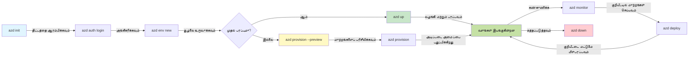
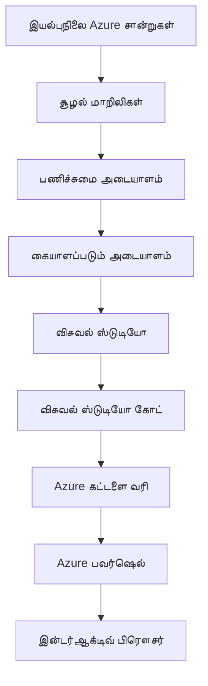

# AZD அடிப்படைகள் - Azure Developer CLI-ஐப் புரிந்து கொள்வது

# AZD அடிப்படைகள் - மூலக் கருத்துகள் மற்றும் அடிப்படை தத்துவங்கள்

**அத்தியாயச் சாராம்சம்:**
- **📚 کور்ஸ் முகப்பு**: [AZD For Beginners](../../README.md)
- **📖 நடப்பு அத்தியாயம்**: அத்தியாயம் 1 - அடித்தளம் & விரைவு தொடக்கம்
- **⬅️ முந்தையது**: [Course Overview](../../README.md#-chapter-1-foundation--quick-start)
- **➡️ அடுத்தது**: [Installation & Setup](installation.md)
- **🚀 அடுத்த அத்தியாயம்**: [Chapter 2: AI-First Development](../chapter-02-ai-development/microsoft-foundry-integration.md)

## அறிமுகம்

இந்த பாடம் உங்களை Azure Developer CLI (azd) எனும் சக்திவாய்ந்த கட்டளை வரிசை கருவிக்கு அறிமுகப்படுத்துகிறது, இது உள்ளூரிலிருந்து Azure இற்கு முகாமை எளிதாக்குகிறது. நீங்கள் அடிப்படை கருத்துகள், முக்கிய அம்சங்கள் மற்றும் azd எப்படி கிளவுட்-நேடிவ் பயன்பாட்டை விநியோகிப்பதை எளிமையாக்குகிறது என்பதை கற்றுகொள்வீர்கள்.

## கற்கும் குறிக்கோள்கள்

இந்த பாடம் முடிந்தவுடன், நீங்கள்:
- Azure Developer CLI என்ன மற்றும் அதன் பிரதான நோக்கம் என்ன என்பதைப் புரிந்துகொள்ளலாம்
- வார்ப்புருக்கள் (templates), சூழல்கள் (environments), மற்றும் சேவைகள் (services) போன்ற மூலக் கருத்துகளை கற்றுக்கொள்வீர்கள்
- வார்ப்புரு-மைய ανάπτυ்ச்சி மற்றும் Infrastructure as Code உட்பட முக்கிய அம்சங்களை ஆராய்வீர்கள்
- azd திட்ட கட்டமைப்பு மற்றும் வேலைநடைப்பைப் புரிந்துகொள்வீர்கள்
- உங்கள் வளர்ச்சி சூழலுக்காக azd ஐ நிறுவி configurar செய்ய தயாராக இருப்பீர்கள்

## கற்றல் முடிவுகள்

இந்த பாடத்தை முடித்த பிறகு, நீங்கள் முடியும்:
- நவீன கிளவுட் வளர்ச்சி பணிநிரல்களில் azd இன் பங்குகளை விளக்கலாம்
- azd திட்ட கட்டமைப்பின் கூறுகளை அடையாளம் காணலாம்
- வார்ப்புருக்கள், சூழல்கள், மற்றும் சேவைகள் எப்படி ஒன்றாக செயற்படுகின்றன என்பதை விவரிக்கலாம்
- azd மூலம் Infrastructure as Code இன் நன்மைகளைப் புரிந்துகொள்வீர்கள்
- வெவ்வேறு azd கட்டளைகள் மற்றும் அவற்றின் நோக்கங்களை அறிந்து கொள்வீர்கள்

## Azure Developer CLI (azd) என்றால் என்ன?

Azure Developer CLI (azd) என்பது உள்ளூரிலிருந்து Azure வரை உங்கள் பயணத்தை வேகப்படுத்த உருவாக்கப்பட்ட கட்டளை வரிசை கருவி. இது Azure இல் கிளவுட்-நேடிவ் பயன்பாட்டுகளை உருவாக்கும், dağıத்தல் செய்யும், மற்றும் பராமரிக்கும் செயல்முறைகளை எளிமையாக்குகிறது.

### azd மூலம் நீங்கள் என்னவை deploy செய்யலாம்?

azd பல்வேறு வகையான வேலைபாடுகளை (workloads) தொழில்நுட்பமாக ஆதரிக்கிறது — மற்றும் பட்டியல் தொடர்ச்சியாக வளர்கிறது. இன்றைக்கு, azd ஐ பயன்படுத்தி நீங்கள் deploy செய்ய முடியும்:

| Workload Type | Examples | Same Workflow? |
|---------------|----------|----------------|
| **Traditional applications** | Web apps, REST APIs, static sites | ✅ `azd up` |
| **Services and microservices** | Container Apps, Function Apps, multi-service backends | ✅ `azd up` |
| **AI-powered applications** | Chat apps with Microsoft Foundry Models, RAG solutions with AI Search | ✅ `azd up` |
| **Intelligent agents** | Foundry-hosted agents, multi-agent orchestrations | ✅ `azd up` |

முக்கிய குறிப்பு: **நீங்கள் எதை deploy செய்தாலும் azd வாழ்நாள் சுழற்சி ஒரே மாதிரிதான் இருக்கும்**. நீங்கள் ஒரு திட்டத்தை ஆரம்பிக்கிறீர்கள், பொறியியல் வளங்களை provision செய்கிறீர்கள், உங்கள் கோடுகளை deploy செய்கிறீர்கள், பயன்பாட்டை கண்காணிக்கிறீர்கள், மற்றும் resources ஐ clean up செய்கிறீர்கள் — அது ஒரு எளிய இணையதளம் ஆனாலும் அல்லது ஒரு வாடிக்கையாளர்-அழகான AI ஏஜென்ட் ஆனாலும்.

இந்த தொடர்ச்சி வடிவமைப்பின் மூலம் உறுதிப்படுத்தப்பட்டுள்ளது. azd AI திறன்களை உங்கள் பயன்பாடு பயன்படுத்தக்கூடிய மற்றொரு சேவையாக கருதுகிறது, அடிப்படை விதத்தில் வேறுபடவில்லை. Microsoft Foundry Models மூலம் ஆதரிக்கப்பட்ட ஒரு chat endpoint azd பார்வையில், கைமுறையில் கட்டமைக்கப்பட்ட மற்றும் deploy செய்ய வேண்டிய மற்றொரு சேவையே ஆகும்.

### 🎯 ஏன் AZD ஐப் பயன்படுத்த வேண்டும்? ஒரு நிஜ-உலகப் பொருத்தம்

ஒரு எளிய வலை பயன்பாட்டை தரவுத்தளத்துடன் deploy செய்வதை ஒப்பிடுவோம்:

#### ❌ AZD இல்லாமல்: கையேடு Azure Deployment (30+ நிமிடம்)

```bash
# படி 1: வளக் குழுவை உருவாக்கவும்
az group create --name myapp-rg --location eastus

# படி 2: App Service திட்டத்தை உருவாக்கவும்
az appservice plan create --name myapp-plan \
  --resource-group myapp-rg \
  --sku B1 --is-linux

# படி 3: வலை பயன்பாட்டை உருவாக்கவும்
az webapp create --name myapp-web-unique123 \
  --resource-group myapp-rg \
  --plan myapp-plan \
  --runtime "NODE:18-lts"

# படி 4: Cosmos DB கணக்கை உருவாக்கவும் (10-15 நிமிடங்கள்)
az cosmosdb create --name myapp-cosmos-unique123 \
  --resource-group myapp-rg \
  --kind MongoDB

# படி 5: தரவுத்தளத்தை உருவாக்கவும்
az cosmosdb mongodb database create \
  --account-name myapp-cosmos-unique123 \
  --resource-group myapp-rg \
  --name tododb

# படி 6: கலெக்ஷனைக் உருவாக்கவும்
az cosmosdb mongodb collection create \
  --account-name myapp-cosmos-unique123 \
  --resource-group myapp-rg \
  --database-name tododb \
  --name todos

# படி 7: இணைப்பு சரத்தைப் பெறவும்
CONN_STR=$(az cosmosdb keys list \
  --name myapp-cosmos-unique123 \
  --resource-group myapp-rg \
  --type connection-strings \
  --query "connectionStrings[0].connectionString" -o tsv)

# படி 8: பயன்பாட்டு அமைப்புகளை அமைக்கவும்
az webapp config appsettings set \
  --name myapp-web-unique123 \
  --resource-group myapp-rg \
  --settings MONGODB_URI="$CONN_STR"

# படி 9: பதிவெடுப்பை செயல்படுத்தவும்
az webapp log config --name myapp-web-unique123 \
  --resource-group myapp-rg \
  --application-logging filesystem \
  --detailed-error-messages true

# படி 10: Application Insights ஐ அமைக்கவும்
az monitor app-insights component create \
  --app myapp-insights \
  --location eastus \
  --resource-group myapp-rg

# படி 11: App Insights-ஐ வலை பயன்பாட்டுடன் இணைக்கவும்
INSTRUMENTATION_KEY=$(az monitor app-insights component show \
  --app myapp-insights \
  --resource-group myapp-rg \
  --query "instrumentationKey" -o tsv)

az webapp config appsettings set \
  --name myapp-web-unique123 \
  --resource-group myapp-rg \
  --settings APPINSIGHTS_INSTRUMENTATIONKEY="$INSTRUMENTATION_KEY"

# படி 12: பயன்பாட்டை உள்ளூரில் கட்டவும்
npm install
npm run build

# படி 13: வினியோகிப்பு தொகுப்பை உருவாக்கவும்
zip -r app.zip . -x "*.git*" "node_modules/*"

# படி 14: பயன்பாட்டை வினியோகிக்கவும்
az webapp deployment source config-zip \
  --resource-group myapp-rg \
  --name myapp-web-unique123 \
  --src app.zip

# படி 15: அது வேலை செய்யுமா என்று காத்திருந்து பிரார்த்திக்கவும் 🙏
# (தானியங்கிய சரிபார்ப்பு இல்லை, கைமுறையாக சோதனை செய்ய வேண்டும்)
```

**பிரச்சனைகள்:**
- ❌ 15+ கட்டளைகளை நினைவில் வைக்கவோ, முறையே செயல்படுத்தவோ வேண்டியிருக்கும்
- ❌ 30-45 நிமிடங்கள் கையேடு வேலை
- ❌ தவறுகள் செய்ய எளிது (typing பிழைகள், தவறான பரிமாணங்கள்)
- ❌ தொடர்பு குறிச்சொற்கள் (connection strings) டெர்மினல் வரலாற்றில் வெளிப்படுகிறது
- ❌ ஏதாவது தோல்வி என்றால் தானாகமாறு rollback இல்லை
- ❌ குழு உறுப்பினர்களுக்கு மீளமைக்க கடினம்
- ❌ ஒவ்வொரு முறையும் வெவ்வேறு (மறுசீரமைக்க முடியாதது)

#### ✅ AZD உடன்: தானாகச் செய்பவையாக deploy செயல் (5 கட்டளைகள், 10-15 நிமிடம்)

```bash
# படி 1: டெம்ப்ளேட்டில் இருந்து தொடங்கவும்
azd init --template todo-nodejs-mongo

# படி 2: அங்கீகரிக்கவும்
azd auth login

# படி 3: சூழலை உருவாக்கவும்
azd env new dev

# படி 4: மாற்றங்களை முன்னோட்டமாக பார்க்கவும் (விருப்பமானது ஆனால் பரிந்துரைக்கப்படுகிறது)
azd provision --preview

# படி 5: எல்லாவற்றையும் அமல்படுத்தவும்
azd up

# ✨ முடிந்தது! எல்லாம் நிறுவப்பட்டு, அமைக்கப்பட்டு, கண்காணிக்கப்படுகிறது
```

**நன்மைகள்:**
- ✅ **5 கட்டளைகள்** مقابل 15+ கையேடு படிகளுக்கு
- ✅ **10-15 நிமிடங்கள்** மொத்த நேரம் (அதிகபட்சம் Azure க்காக காத்திருக்கும் நேரம்)
- ✅ **குறைந்த கையேடு பிழைகள்** - ஒரே மாதிரியான, வார்ப்புரு-மைய வேலைநடைப்பு
- ✅ **பாதுகாக்கப்பட்ட இரகசிய கையாளுதல்** - பல வார்ப்புருக்கள் Azure-மேலாண்மை செய்யப்பட்ட இரகசிய சேமிப்பைப் பயன்படுத்துகின்றன
- ✅ **மீண்டும் deploy செய்யக்கூடியது** - ஒவ்வொரு முறையும் ஒரே வேலைநடைப்பு
- ✅ **முழுமையாக மறுசீரமைக்கத்தக்கது** - ஒவ்வொரு முறையும் அதே முடிவு
- ✅ **குழு-பயன்பாட்டுக்கு சிறந்தது** - யாரும் அதே கட்டளைகளால் deploy செய்யலாம்
- ✅ **Infrastructure as Code** - பதிப்பு கட்டுப்படுத்தப்பட்ட Bicep வார்ப்புருக்கள்
- ✅ **உள்ளடக்கமான கண்காணிப்பு** - Application Insights தானாகவும் இணைக்கப்படுகிறது

### 📊 நேரம் & பிழை குறைப்பு

| Metric | Manual Deployment | AZD Deployment | Improvement |
|:-------|:------------------|:---------------|:------------|
| **Commands** | 15+ | 5 | 67% குறைவாக |
| **Time** | 30-45 min | 10-15 min | 60% வேகமாக |
| **Error Rate** | ~40% | <5% | 88% குறைவு |
| **Consistency** | குறைவு (கையேடு) | 100% (தானாக) | முழுமையானது |
| **Team Onboarding** | 2-4 மணி | 30 நிமிடங்கள் | 75% வேகமாக |
| **Rollback Time** | 30+ நிமிடங்கள் (கையேடு) | 2 நிமிடங்கள் (தானாக) | 93% வேகமாக |

## மூலக் கருத்துகள்

### வார்ப்புருக்கள் (Templates)
வார்ப்புருக்கள் azd இன் அடித்தளமாக இருக்கிறது. அவை கொண்டிருக்கும்:
- **பயன்பாட்டு குறியீடு** - உங்கள் மூலக் குறியீடு மற்றும் சார்புகள்
- **நிறுவல் வரையறைகள்** - Bicep அல்லது Terraform இல் வரையறுக்கபட்ட Azure வளங்கள்
- **கான்பிகரேஷன் கோப்புகள்** - அமைப்புகள் மற்றும் சூழல் மாறிலிகள்
- **Deploy ஸ்கிரிப்டுகள்** - தானாக நடக்கும் deploy வேலைநடைகள

### சூழல்கள் (Environments)
சூழல்கள் வெவ்வேறு deploy இலக்கு இடங்களை பிரதிநிதித்துவப்படுத்துகின்றன:
- **Development** - சோதனை மற்றும் அபிவிருத்திக்காக
- **Staging** - தயாரிப்பு முன் சூழல்
- **Production** - நேரடி உற்பத்தியினிலையை

ஒவ்வொரு சூழலும் அதன் சொந்தத்தை பராமரிக்கிறது:
- Azure resource group
- கான்பிகரேஷன் அமைப்புகள்
- Deploy நிலை

### சேவைகள் (Services)
சேவைகள் உங்கள் பயன்பாட்டின் கட்டுமானத் துண்டுகள்:
- **Frontend** - வலை பயன்பாடுகள், SPA கள்
- **Backend** - APIs, மைக்ரோசேவைகள்
- **Database** - தரவுத்தள சேமிப்பு தீர்வுகள்
- **Storage** - கோப்பு மற்றும் பிளாப் சேமிப்பு

## முக்கிய அம்சங்கள்

### 1. வார்ப்புரு-மைய ανάπτυ்ச்சி
```bash
# கிடைக்கும் வார்ப்புருக்களை உலாவுங்கள்
azd template list

# வார்ப்புருவிலிருந்து துவங்குங்கள்
azd init --template <template-name>
```

### 2. Infrastructure as Code
- **Bicep** - Azure இன் டொமைன்-சப்ளாசிப் மொழி
- **Terraform** - பன்முக கிளவுட் இன்ஃப்ராஸ்ட்ரக்சர் கருவி
- **ARM Templates** - Azure Resource Manager வார்ப்புருக்கள்

### 3. ஒருங்கிணைந்த வேலைநடைகள்
```bash
# முழுமையான நிறுவல் வேலைநடை
azd up            # வழங்குதல் + நிறுவல் இந்த ஒழுங்கு முதன்முறை அமைப்புக்கு கைமுறையில்லாமல் செயல்படும்

# 🧪 புதியது: வெளியீட்டுக்கு முன் இன்ஃப்ராஸ்ட்ரக்சர் மாற்றங்களை முன்னோட்டமாக பார்க்க (பாதுகாப்பானது)
azd provision --preview    # மாற்றங்கள் செய்யாமல் இன்ஃப்ராஸ்ட்ரக்சர் நிறுவலை சிமுலேட் செய்க

azd provision     # அடமைப்பை புதுப்பித்தால் Azure வளங்களை உருவாக்க இதை பயன்படுத்தவும்
azd deploy        # பயன்பாட்டு கோடுகளை வெளியிடவும் அல்லது புதுப்பித்த பிறகு மீண்டும் வெளியிடவும்
azd down          # வளங்களை அகற்றவும்
```

#### 🛡️ Preview உடன் பாதுகாப்பான இன்ஃப்ராஸ்ட்ரக்சர் திட்டமிடல்
`azd provision --preview` கட்டளை பாதுகாப்பான deploy க்காக மாற்றமாற்றாதது:
- **உலர்-நடப்பு (dry-run) பகுப்பாய்வு** - என்ன உருவாகும், மாற்றம் செய்யப்படும் அல்லது நீக்கப்படும் என்பதை காட்டுகிறது
- **பூஜ்ய அபாயம்** - உங்கள் Azure சூழலில் எந்தவொரு மாற்றமும் செய்யப்படாது
- **குழு ஒத்துழைப்பு** - deploy செய்யும்முன் preview முடிவுகளை பகிரவல்லது
- **செலவு மதிப்பீடு** - ஒப்பந்தத்திற்கு முன் வள செலவுகளை புரிந்துகொள்ளவும்

```bash
# மாதிரி முன்னோட்ட வேலைநடை
azd provision --preview           # என்ன மாற்றம் வரவுள்ளது என்பதைப் பாருங்கள்
# வெளியீட்டை பரிசீலிக்கவும், குழுவுடன் விவாதிக்கவும்
azd provision                     # மாற்றங்களை நம்பிக்கையுடன் செயல்படுத்தவும்
```

### 📊 காட்சி: AZD வளர்ச்சி வேலைநடைப்பு


**வேலைநடைப்பு விளக்கம்:**
1. **Init** - வார்ப்புரு அல்லது புதிய திட்டத்துடன் தொடங்கவும்
2. **Auth** - Azure உடன் அங்கீகாரம் செய்யவும்
3. **Environment** - தனித்துவமான deploy சூழலை உருவாக்கவும்
4. **Preview** - 🆕 எப்பொழுதும் இன்ஃப்ராஸ்ட்ரக்சர் மாற்றங்களை முதலில் preview செய்யவும் (பாதுகாப்பான நடைமுறை)
5. **Provision** - Azure வளங்களை உருவாக்க/புதுப்பிக்கவும்
6. **Deploy** - உங்கள் பயன்பாட்டு குறியீட்டை புஷ் செய்யவும்
7. **Monitor** - பயன்பாட்டு செயல்திறனைப் கவனிக்கவும்
8. **Iterate** - மாற்றங்கள் செய்யவும் மற்றும் மீண்டும் deploy செய்க
9. **Cleanup** - முடிந்தவுடன் வளங்களை அகற்று

### 4. சூழல் மேலாண்மை
```bash
# சூழல்களை உருவாக்கவும் மற்றும் நிர்வகிக்கவும்
azd env new <environment-name>
azd env select <environment-name>
azd env list
```

### 5. நீட்சிகள் மற்றும் AI கட்டளைகள்

azd அதன் கோர் CLIக்குப் பின்னாலான திறன்களை சேர்க்க நீட்சிகளின் (extensions) ஒரு முறைமையை பயன்படுத்தும். இது சிறப்பாக AI வேலைபாடுகளுக்கு பயனுள்ளது:

```bash
# கிடைக்கும் விரிவாக்கங்களை பட்டியலிடவும்
azd extension list

# Foundry agents விரிவாக்கத்தை நிறுவவும்
azd extension install azure.ai.agents

# மனிபெஸ்ட் கோப்பிலிருந்து ஒரு AI முகவர் திட்டத்தை துவக்கவும்
azd ai agent init -m agent-manifest.yaml

# ஏ.ஐ. உதவியுடன் அபிவிருத்திக்கான MCP சர்வரை துவக்கவும் (ஆல்பா)
azd mcp start
```

> நீட்சிகள் பற்றிய விரிவான விவரங்கள் [Chapter 2: AI-First Development](../chapter-02-ai-development/agents.md) மற்றும் [AZD AI CLI Commands](../chapter-08-production/production-ai-practices.md#azd-ai-cli-commands-and-extensions) குறிப்பு பகுதியில் காணலாம்.

## 📁 திட்டம் கட்டமைப்பு

ஒரு சாதாரண azd திட்ட கட்டமைப்பு:
```
my-app/
├── .azd/                    # azd configuration
│   └── config.json
├── .azure/                  # Azure deployment artifacts
├── .devcontainer/          # Development container config
├── .github/workflows/      # GitHub Actions
├── .vscode/               # VS Code settings
├── infra/                 # Infrastructure code
│   ├── main.bicep        # Main infrastructure template
│   ├── main.parameters.json
│   └── modules/          # Reusable modules
├── src/                  # Application source code
│   ├── api/             # Backend services
│   └── web/             # Frontend application
├── azure.yaml           # azd project configuration
└── README.md
```

## 🔧 கான்பிகரேஷன் கோப்புகள்

### azure.yaml
முதன்மை திட்ட கான்பிகரேஷன் கோப்பு:
```yaml
name: my-awesome-app
metadata:
  template: my-template@1.0.0

services:
  web:
    project: ./src/web
    language: js
    host: appservice
  api:
    project: ./src/api
    language: js
    host: appservice

hooks:
  preprovision:
    shell: pwsh
    run: echo "Preparing to provision..."
```

### .azure/config.json
சூழல்-சந்தேகமான கான்பிகரேஷன்:
```json
{
  "version": 1,
  "defaultEnvironment": "dev",
  "environments": {
    "dev": {
      "subscriptionId": "your-subscription-id",
      "location": "eastus"
    }
  }
}
```

## 🎪 பொதுவான வேலைநடைகள் மற்றும் கையாட்சி பயிற்சிகள்

> **💡 கற்றல் குறிப்புகள்:** உங்கள் AZD திறன்களை கட்டமைப்பாக மேம்படுத்த இந்த பயிற்சிகளை வரிசையாக பின்பற்றவும்.

### 🎯 பயிற்சி 1: உங்கள் முதல் திட்டத்தை தொடங்குங்கள்

**நோக்கம்:** ஒரு AZD திட்டத்தை உருவாக்கி அதன் கட்டமைப்பை ஆராய்க

**படிகள்:**
```bash
# சாதிக்கப்பட்ட வார்ப்புருவை பயன்படுத்தவும்
azd init --template todo-nodejs-mongo

# உருவாக்கப்பட்ட கோப்புகளை ஆராயவும்
ls -la  # மறைந்த கோப்புகளையும் உட்பட அனைத்து கோப்புகளையும் காணவும்

# உருவாக்கப்பட்ட முக்கிய கோப்புகள்:
# - azure.yaml (முக்கிய அமைப்பு)
# - infra/ (அடிப்படை கட்டமைப்பு குறியீடு)
# - src/ (பயன்பாட்டு குறியீடு)
```

**✅ வெற்றி:** உங்களுக்கு azure.yaml, infra/, மற்றும் src/ அடைநிலையகங்கள் உள்ளன

---

### 🎯 பயிற்சி 2: Azure க்குத் deploy செய்

**நோக்கம்:** முடிவற்ற deploy நிறைவேற்றுதல்

**படிகள்:**
```bash
# 1. அங்கீகரிக்கவும்
az login && azd auth login

# 2. சூழ்நிலையை உருவாக்கவும்
azd env new dev
azd env set AZURE_LOCATION eastus

# 3. மாற்றங்களை முன்னோட்டமாக பார்க்கவும் (பரிந்துரைக்கப்படுகிறது)
azd provision --preview

# 4. எல்லாவற்றையும் வெளியிடவும்
azd up

# 5. வெளியீட்டை சரிபார்க்கவும்
azd show    # உங்கள் செயலியின் URL ஐப் பார்க்கவும்
```

**எதிர்பார்க்கப்படும் நேரம்:** 10-15 நிமிடங்கள்  
**✅ வெற்றி:** பயன்பாட்டின் URL உலாவியில் திறக்கும்

---

### 🎯 பயிற்சி 3: பல சூழல்கள்

**நோக்கம்:** dev மற்றும் staging இற்கு deploy செய்யவும்

**படிகள்:**
```bash
# dev ஏற்கனவே உள்ளது, staging உருவாக்கவும்
azd env new staging
azd env set AZURE_LOCATION westus2
azd up

# அவற்றிடையே மாறவும்
azd env list
azd env select dev
```

**✅ வெற்றி:** Azure போர்டாலில் இரண்டு தனி resource group கள்

---

### 🛡️ சுத்த ஆகிய நிலை: `azd down --force --purge`

முழுமையாக ரீசெட் செய்யவேண்டியால்:

```bash
azd down --force --purge
```

**இது என்ன செய்கிறது:**
- `--force`: எந்த உறுதிப்படுத்தல் கேள்விகளும் இல்லை
- `--purge`: அனைத்து உள்ளூர் நிலை மற்றும் Azure வளங்களையும் நீக்குகிறது

**எப்போது பயன்படுத்துவது:**
- Deploy நடுவில் தோல்வி அடைந்தால்
- திட்டங்களை மாறும்போது
- புதிய தொடக்கம் தேவைப்படும் போது

---

## 🎪 மூல வேலைநடைப்பு குறிப்பு

### புதிய திட்டத்தை தொடங்குதல்
```bash
# முறை 1: ஏற்கனவே உள்ள வார்ப்புருவைப் பயன்படுத்தவும்
azd init --template todo-nodejs-mongo

# முறை 2: முழுமையாக புதிதாக தொடங்கவும்
azd init

# முறை 3: தற்போதைய கோப்புறையைப் பயன்படுத்தவும்
azd init .
```

### அபிவிருத்தி சுற்று
```bash
# வளர்ச்சி சூழலை அமைக்க
azd auth login
azd env new dev
azd env select dev

# எல்லாவற்றையும் அமைத்து வெளியிடு
azd up

# மாற்றங்களை செய்து மீண்டும் வெளியிடு
azd deploy

# முடிந்ததும் சுத்தப்படுத்து
azd down --force --purge # Azure Developer CLI இல் உள்ள இந்த கட்டளை உங்கள் சூழலுக்கான ஒரு **முழுமையான மீட்டமைப்பு** ஆகும் — குறிப்பாக நீங்கள் தோல்வியடைந்த வெளியீடுகளை சிக்கல்களைத் தீர்க்கும்போது, பயன்பாடு இல்லாத வளங்களை சுத்தம் செய்யும்போது அல்லது புதிய மீண்டும் வெளியீட்டுக்காக தயார் செய்யும்போது மிகவும் பயனுள்ளது.
```

## `azd down --force --purge` ஐப் புரிந்து கொள்வது
`azd down --force --purge` கட்டளை உங்கள் azd சூழலை மற்றும் அதனுடன் தொடர்புடைய அனைத்து வளங்களையும் முற்றிலும் அகற்ற ஒரு சக்திவாய்ந்த வழியாகும். கீழே ஒவ்வொரு கொடியின் செயல்களை வகைப்படுத்தி கூறுகிறோம்:
```
--force
```
- உறுதிப்படுத்தல் கோரிக்கைகள் தவிர்க்கப்படுகின்றன.
- ஐயா அல்லது ஸ்கிரிப்டிங் காரணமாக கையேடு உள்ளீடு சாத்தியமில்லாத இடங்களில் பயனுள்ளது.
- CLI இன்சிஸ்டென்சிகள் கண்டுபிடித்தாலும் teardown இடையூறின்றி நடைபெறுவதை உறுதிசெய்கிறது.

```
--purge
```
நீக்குகிறது **அனைத்து தொடர்புடைய மெட்டாடேட்டாவை**, உட்பட:
Environment நிலை
உள்ளூர் `.azure` கோப்புறை
கேஷ் செய்யப்பட்ட deploy தகவல்
azd-ன் "முந்தைய டெப்ளாய்மெண்ட்களை நினைவில் வைக்காமல்" தடுக்கும், இது resource group பொருத்தமின்மை அல்லது பழைய ரெஜிஸ்ட்ரி குறிப்புகளை போன்ற பிரச்சனைகளை ஏற்படுத்தும்.

### ஏன் இரண்டையும் பயன்படுத்த வேண்டும்?
`azd up` உடன் நிலையான நிலைகள் அல்லது பகுதி deploy காரணமாக சிக்கலில் சிக்கினால், இந்த இணைப்பு ஒரு **சுத்தமான நிலையை** உறுதிசெய்கிறது.

இது குறிப்பாக Azure போர்டலில் கைமுறையாக வளங்களை நீக்கிய பிறகு அல்லது வார்ப்புருக்கள், சூழல்கள், அல்லது resource group பெயரிடும் நடைமுறைகளை மாற்றும்போது பயனுள்ளதாக இருக்கும்.

### பல சூழல்களை நிர்வகித்தல்
```bash
# ஸ்டேஜிங் சூழலை உருவாக்கவும்
azd env new staging
azd env select staging
azd up

# மீண்டும் dev-க்கு திரும்பவும்
azd env select dev

# சூழல்களை ஒப்பிடவும்
azd env list
```

## 🔐 அங்கீகாரம் மற்றும் கடவுச்சீட்டுகள்

சாதகமான azd deploy க்கான அங்கீகாரத்தைப் புரிந்துகொள்வது முக்கியம். Azure பல்வேறு அங்கீகாரம் முறைகளை பயன்படுத்துகிறது, மற்றும் azd மற்ற Azure கருவிகள் பயன்படுத்தும் அதே அங்கீகார சந்தையை பயன்படுத்துகிறது.

### Azure CLI அங்கீகாரம் (`az login`)

azd ஐ பயன்படுத்துவதற்கு முன், Azure உடன் அங்கீகரம் செய்ய வேண்டும். பொதுவாகப் பயன்படுத்தப்படும் முறை Azure CLI பயன்படுத்தி அங்கீகரம் செய்வதே ஆகும்:

```bash
# இணைய தொடர்பு மூலம் உள்நுழைவு (உலாவரைத் திறக்கும்)
az login

# குறிப்பிட்ட டெனன்டுடன் உள்நுழைவு
az login --tenant <tenant-id>

# சேவை பிரதிநிதியுடன் உள்நுழைவு
az login --service-principal -u <app-id> -p <password> --tenant <tenant-id>

# தற்போதைய உள்நுழைவு நிலையை சரிபார்க்கவும்
az account show

# கிடைக்கும் சப்ஸ்கிரிப்ஷன்களை பட்டியலிடவும்
az account list --output table

# இயல்புநிலை சப்ஸ்கிரிப்ஷனை அமைக்கவும்
az account set --subscription <subscription-id>
```

### அங்கீகார ஓட்டம்
1. **இணைய உலாவி மூலம் உள்நுழைவு**: உங்கள் இயல்புநிலை உலாவியை திறக்கிறது
2. **Device Code Flow**: உலாவி அணுகல் இல்லாத சூழலுக்காக
3. **Service Principal**: தானாக நடைபெறும் மற்றும் CI/CD சூழல்களுக்காக
4. **Managed Identity**: Azure-இல் ஓடும் பயன்பாடுகளுக்காக

### DefaultAzureCredential சங்கிலி

`DefaultAzureCredential` என்பது பல்வேறு அங்கீகார மூலங்களை குறிப்பிட்ட வரிசைப்படி தானாக முயற்சித்து ஒரு எளிமையான அங்கீகாரம் அனுபவத்தை வழங்கும் ஒரு க்ரெடென்ஷியல் வகை:

#### க்ரெடென்ஷியல் சங்கிலி வரிசை

#### 1. சூழல் மாறிலிகள்
```bash
# சேவை பிரதிநிதிக்கான சுற்றுச்சூழல் மாறிலிகளை அமைக்கவும்
export AZURE_CLIENT_ID="<app-id>"
export AZURE_CLIENT_SECRET="<password>"
export AZURE_TENANT_ID="<tenant-id>"
```

#### 2. Workload Identity (Kubernetes/GitHub Actions)
தன்னிச்சையானமாக பயன்படுத்தப்படுகிறது:
- Azure Kubernetes Service (AKS) Workload Identity உடன்
- GitHub Actions OIDC federation உடன்
- பிற federation அடிப்படையிலான அடையாள சூழல்கள்

#### 3. Managed Identity
ஏஜூரின் வளங்களுக்காக:
- Virtual Machines
- App Service
- Azure Functions
- Container Instances

```bash
# மேனேஜ்டு அடையாளத்துடன் Azure வளத்தில் இயங்குகிறதா என்பதைச் சரிபார்க்கவும்
az account show --query "user.type" --output tsv
# திருப்புகிறது: மேனேஜ்டு அடையாளம் பயன்படுத்தப்பட்டால் "servicePrincipal"
```

#### 4. Developer Tools ஒருங்கிணைவு
- **Visual Studio**: சைனின் கணக்கை தானாக பயன்படுத்துகிறது
- **VS Code**: Azure Account நீட்சியின் க்ரெடென்ஷியல் பயன்படுத்துகிறது
- **Azure CLI**: `az login` க்ரெடென்ஷியல்களை பயன்படுத்துகிறது (உள்ளூர் அபிவிருத்திக்கான பொதுவானது)

### AZD அங்கீகார அமைப்பு

```bash
# முறை 1: Azure CLI ஐப் பயன்படுத்தவும் (வளர்ச்சிக்கு பரிந்துரைக்கப்படுகிறது)
az login
azd auth login  # முன் உள்ள Azure CLI சான்றுகளைப் பயன்படுத்துகிறது

# முறை 2: நேரடி azd அங்கீகாரம்
azd auth login --use-device-code  # UI இல்லாத சூழல்களுக்கு

# முறை 3: அங்கீகார நிலையைச் சரிபார்க்கவும்
azd auth login --check-status

# முறை 4: வெளியேறி மீண்டும் அங்கீகாரம் செய்யவும்
azd auth logout
azd auth login
```

### அங்கீகார சிறந்த நடைமுறைகள்

#### உள்ளூர் அபிவிருத்திக்காக
```bash
# 1. Azure CLI-ஐ பயன்படுத்தி உள்நுழையவும்
az login

# 2. சரியான சப்ஸ்கிரிப்ஷனை சரிபார்க்கவும்
az account show
az account set --subscription "Your Subscription Name"

# 3. முன்னரே உள்ள சான்றுகளுடன் azd ஐப் பயன்படுத்தவும்
azd auth login
```

#### CI/CD பைப்லைன்களுக்கு
```yaml
# GitHub Actions example
- name: Azure Login
  uses: azure/login@v1
  with:
    creds: ${{ secrets.AZURE_CREDENTIALS }}

- name: Deploy with azd
  run: |
    azd auth login --client-id ${{ secrets.AZURE_CLIENT_ID }} \
                    --client-secret ${{ secrets.AZURE_CLIENT_SECRET }} \
                    --tenant-id ${{ secrets.AZURE_TENANT_ID }}
    azd up --no-prompt
```

#### உற்பத்தி சூழல்களுக்கு
- Azure வளங்களில் ஓடும்போது **Managed Identity** ஐ பயன்படுத்தவும்
- தானியங்கி நடைமுறைகளுக்காக **Service Principal** ஐ பயன்படுத்தவும்
- குறியீடு அல்லது கான்பிகரேஷன் கோப்புகளில் கடவுச்சீட்டுகளை சேமிப்பதை தவிர்க்கவும்
- உணர்ச்சிகரமான அமைப்புகளுக்கு **Azure Key Vault** ஐ பயன்படுத்தவும்

### பொதுவான அங்கீகார பிரச்சனைகள் மற்றும் தீர்வுகள்

#### பிரச்சினை: "No subscription found"
```bash
# தீர்வு: இயல்புநிலை சந்தாவை அமைக்கவும்
az account list --output table
az account set --subscription "<subscription-id>"
azd env set AZURE_SUBSCRIPTION_ID "<subscription-id>"
```

#### பிரச்சினை: "Insufficient permissions"
```bash
# தீர்வு: தேவையான பங்குகளை சரிபார்த்து ஒதுக்கவும்
az role assignment list --assignee $(az account show --query user.name --output tsv)

# பொதுவாக தேவையான பங்குகள்:
# - பங்களிப்பாளர் (வள மேலாண்மைக்காக)
# - பயனர் அணுகல் நிர்வாகி (பங்கு ஒதுக்கல்களுக்கு)
```

#### பிரச்சினை: "Token expired"
```bash
# தீர்வு: மறுபடியும் அங்கீகாரம் பெறுதல்
az logout
az login
azd auth logout
azd auth login
```

### வெவ்வேறு சூழல்களில் அங்கீகாரம்

#### உள்ளூர் அபிவிருத்தி
```bash
# தனிப்பட்ட மேம்பாட்டு கணக்கு
az login
azd auth login
```

#### குழு அபிவிருத்தி
```bash
# அமைப்பிற்காக குறிப்பிட்ட டெனன்டை பயன்படுத்தவும்
az login --tenant contoso.onmicrosoft.com
azd auth login
```

#### பல-தொகுதி (Multi-tenant) சூழல்கள்
```bash
# டெனன்ட்களுக்கிடையே மாறவும்
az login --tenant tenant1.onmicrosoft.com
# டெனன்ட் 1-க்கு வெளியிடவும்
azd up

az login --tenant tenant2.onmicrosoft.com  
# டெனன்ட் 2-க்கு வெளியிடவும்
azd up
```

### பாதுகாப்பு தொடர்புடைய கவனங்கள்
1. **அங்கீகார தகவல்கள் சேமிப்பு**: மூலக் குறியீட்டில் அங்கீகார தகவல்களை ஒருபோதும் சேமிக்கக்கூடாது
2. **அளவுக் கட்டுப்பாடு**: சேவை பிரதிநிதிகளுக்கு குறைந்த உரிமைகள் கோட்பாட்டைப் பயன்படுத்தவும்
3. **டோக்கன் சுழற்சி**: சேவை பிரதிநிதிகளின் ரகசியங்களை ஒழுங்காக மாற்றவும்
4. **ஆடிட் தடம்**: அங்கீகாரம் மற்றும் வினியோக செயல்களைக் கண்காணிக்கவும்
5. **பிணைய பாதுகாப்பு**: சாத்தியமானால் தனியார் முனைகளை பயன்படுத்தவும்

### அங்கீகார பிழைத் தீர்வு

```bash
# அங்கீகாரப் பிரச்சினைகளை பிழைத்திருத்து
azd auth login --check-status
az account show
az account get-access-token

# பொதுவான ஆய்வு கட்டளைகள்
whoami                          # தற்போதைய பயனர் சூழல்
az ad signed-in-user show      # Azure AD பயனர் விவரங்கள்
az group list                  # வள அணுகலை சோதனை செய்
```

## `azd down --force --purge` ஐப் புரிந்துகொள்ளுதல்

### கண்டுபிடித்தல்
```bash
azd template list              # வடிவமைப்புகளை உலாவவும்
azd template show <template>   # வடிவமைப்பு விவரங்கள்
azd init --help               # துவக்க விருப்பங்கள்
```

### திட்ட மேலாண்மை
```bash
azd show                     # திட்டத்தின் மேலோட்டம்
azd env list                # கிடைக்கக் கூடிய சூழல்கள் மற்றும் தேர்வு செய்யப்பட்ட இயல்புநிலை
azd config show            # கட்டமைப்பு அமைப்புகள்
```

### கண்காணிப்பு
```bash
azd monitor                  # Azure போர்டல் கண்காணிப்பை திறக்கவும்
azd monitor --logs           # அப்ளிகேஷன் பதிவுகளைப் பார்க்கவும்
azd monitor --live           # நேரடி அளவீடுகளைப் பார்க்கவும்
azd pipeline config          # CI/CD ஐ அமைக்கவும்
```

## சிறந்த நடைமுறைகள்

### 1. பொருத்தமான பெயர்களை பயன்படுத்தவும்
```bash
# நன்று
azd env new production-east
azd init --template web-app-secure

# தவிர்க்கவும்
azd env new env1
azd init --template template1
```

### 2. டெம்ப்ளேட்டுகளை பயன்படுத்துங்கள்
- உள்ள டெம்ப்ளேட்டுகளுடன் தொடங்குங்கள்
- உங்கள் தேவைகள் অনুযায়ী தனிப்பயனாக்குங்கள்
- உங்கள் நிறுவனத்திற்கு மீண்டும் பயன்படுத்தக்கூடிய டெம்ப்ளேட்டுகளை உருவாக்குங்கள்

### 3. சூழல் தனிமைப்படுத்தல்
- dev/staging/prod க்காக தனித்துச் சூழல்களைப் பயன்படுத்தவும்
- உங்கள் உள்ளூர் இயந்திரத்திலிருந்து production-க்கு நேரடியாக வெளியிட வேண்டாம்
- production வெளியீடுகளுக்காக CI/CD pipelines-ஐப் பயன்படுத்துங்கள்

### 4. கட்டமைப்பு மேலாண்மை
- ரகசியத் தரவுகளுக்கு சூழல் மாறிலிகளைப் பயன்படுத்தவும்
- கட்டமைப்பை பதிப்பு கட்டுப்பாட்டில் வைத்திருங்கள்
- சூழலுக்கு நெருங்கிய அமைப்புகளை ஆவணப்படுத்துங்கள்

## கற்றல் முன்னேற்றம்

### தொடக்க (வாரம் 1-2)
1. azd ஐ நிறுவி அங்கீகாரம் செய்யுங்கள்
2. ஒரு எளிய டெம்ப்ளேட்டை வெளியிடுங்கள்
3. திட்ட அமைப்பைப் புரிந்துகொள்ளுங்கள்
4. அடிப்படை கட்டளைகள் (up, down, deploy) களை கற்றுக்கொள்ளுங்கள்

### நடுத்தர (வாரம் 3-4)
1. டெம்ப்ளேட்டுகளை தனிப்பயனாக்குங்கள்
2. பல சூழல்களை நிர்வகிக்கவும்
3. அடித்தளக் குறியீட்டை புரிந்துகொள்ளுங்கள்
4. CI/CD pipelines அமைக்கவும்

### மேம்பட்ட (வாரம் 5+)
1. தனிப்பயன் டெம்ப்ளேட்டுகளை உருவாக்குங்கள்
2. மேம்பட்ட அடித்தள வடிவங்கள்
3. பல பிராந்தியங்களுக்கு வெளியீடுகள்
4. எண்டர்பிரைஸ் தரமான கட்டமைப்புகள்

## அடுத்த படிகள்

**📖 அத்தியாயம் 1 கற்றலை தொடரவும்:**
- [நிறுவல் மற்றும் அமைப்பு](installation.md) - azd ஐ நிறுவி மற்றும் கட்டமைக்கவும்
- [உங்கள் முதல் திட்டம்](first-project.md) - கைமுறை பயிற்சியை முடிக்கவும்
- [கட்டமைப்பு வழிகாட்டி](configuration.md) - மேம்பட்ட கட்டமைப்பு விருப்புகள்

**🎯 அடுத்த அத்தியாயத்திற்குத் தயாரா?**
- [அத்தியாயம் 2: AI-முதன்மை மேம்பாடு](../chapter-02-ai-development/microsoft-foundry-integration.md) - AI பயன்பாடுகளை உருவாக்கத் தொடங்கி விடுங்கள்

## மேலதிக வளங்கள்

- [Azure Developer CLI கண்ணோட்டம்](https://learn.microsoft.com/en-us/azure/developer/azure-developer-cli/)
- [டெம்ப்ளேட் கேலரி](https://azure.github.io/awesome-azd/)
- [சமுதாய மாதிரிகள்](https://github.com/Azure-Samples)

---

## 🙋 அடிக்கடி கேட்கப்படும் கேள்விகள்

### பொதுக் கேள்விகள்

**Q: AZD மற்றும் Azure CLI இடையிலான வேறுபாடு என்ன?**

A: Azure CLI (`az`) என்பது தனி Azure வளங்களை நிர்வகிக்க用. AZD (`azd`) என்பது முழு பயன்பாடுகளை நிர்வகிக்க用:

```bash
# Azure CLI - கீழ்நிலை வள மேலாண்மை
az webapp create --name myapp --resource-group rg
az sql server create --name myserver --resource-group rg
# ...மேலும் பல கட்டளைகள் தேவை

# AZD - பயன்பாட்டு நிலை மேலாண்மை
azd up  # அனைத்து வளங்களோடு முழு பயன்பாட்டையும் நிறுவுகிறது
```

**இவ்வாறு நினைவில் கொள்ளுங்கள்:**
- `az` = தனித்த Lego துண்டுகளை செயல்படுத்துவது
- `azd` = முழு Lego தொகுப்புகளுடன் வேலை செய்வது

---

**Q: AZD பயன்படுத்த Bicep அல்லது Terraform தெரிந்திருக்க வேண்டுமா?**

A: இல்லை! டெம்ப்ளேட்டுகளுடனேயே தொடங்குங்கள்:
```bash
# முன்னரே உள்ள வார்ப்புருவைப் பயன்படுத்தவும் - IaC பற்றிய அறிவு தேவையில்லை
azd init --template todo-nodejs-mongo
azd up
```

பின்னர் Bicep கற்றுக் கொண்டு அடித்தளத்தை தனிப்பயனாக்கலாம். டெம்ப்ளேட்டுகள் கற்றுக்கொள்ள உதவும் வேலை செய்யும் எடுத்துக்காட்டுகளை வழங்குகின்றன.

---

**Q: AZD டெம்ப்ளேட்டுகளை இயக்குவதற்கு செலவு எவ்வளவு?**

A: செலவுகள் டெம்ப்ளேட்டின் அடிப்படையில் மாறுபடும். பெரும்பாலான உருவாக்க டெம்ப்ளேட்டுகளின் செலவு மாதத்திற்கு $50-150 வரை உள்ளது:

```bash
# பயன்படுத்துவதற்கு முன் செலவுகளை முன்னோக்கி பார்க்கவும்
azd provision --preview

# பயன்படாதபோது எப்போதும் சுத்தம் செய்யவும்
azd down --force --purge  # அனைத்து வளங்களையும் நீக்குகிறது
```

**பயனுள்ள குறிப்பு:** கிடைக்கிற இடங்களில் இலவச நிலைகளை பயன்படுத்துங்கள்:
- App Service: F1 (Free) tier
- Microsoft Foundry Models: Azure OpenAI 50,000 tokens/மாதம் இலவசம்
- Cosmos DB: 1000 RU/s இலவச நிலை

---

**Q: ஏற்கனவே உள்ள Azure வளங்களுடன் AZD-ஐ பயன்படுத்தலாமா?**

A: ஆம், ஆனால் புதியதாகத் தொடங்குவது எளிது. AZD முழு வாழ்க்கைச் சுற்றத்தையும் நிர்வகிக்கும் போது சிறந்தது. ஏற்கனவே உள்ள வளங்களுக்காக:
```bash
# விருப்பம் 1: முன்னதாகவே உள்ள வளங்களை இறக்குமதி செய்க (மேம்பட்ட)
azd init
# பின்னர் infra/ ஐ முன்னதாகவே உள்ள வளங்களை குறிக்க மாற்றவும்

# விருப்பம் 2: புதிதாகத் தொடங்கவும் (பரிந்துரைக்கப்படுகிறது)
azd init --template matching-your-stack
azd up  # புதிய சூழலை உருவாக்குகிறது
```

---

**Q: என்னுடைய திட்டத்தை அணி உறுப்பினர்களுடன் எப்படி பகிர்வது?**

A: AZD திட்டத்தை Git-க்கு commit செய்யுங்கள் (ஆனால் .azure கோப்புறையை commit செய்யாதீர்கள்):
```bash
# இயல்பாக .gitignore இல் ஏற்கனவே உள்ளது
.azure/        # ரகசியங்கள் மற்றும் சூழல் தரவுகளை உள்ளடக்குகிறது
*.env          # சூழல் மாறிகள்

# அப்போது குழு உறுப்பினர்கள்:
git clone <your-repo>
azd auth login
azd env new <their-name>-dev
azd up
```

அதே டெம்ப்ளேட்டுகள் மூலம் அனைவருக்கும் ஒரே மாதிரியான அடித்தள அமைப்பு கிடைக்கும்.

---

### பிழைத் தீர்க்கும் கேள்விகள்

**Q: "azd up" பாதியாக தோல்வியடைந்தால் என்ன செய்ய வேண்டும்?**

A: பிழையைப் பார்க்கவும், அதை சரிசெய்து பின்னர் மீண்டும் முயற்சிக்கவும்:
```bash
# விரிவான பதிவுகளை பார்க்கவும்
azd show

# பொதுவான திருத்தங்கள்:

# 1. குவோட்டா மீறினால்:
azd env set AZURE_LOCATION "westus2"  # வேறு மண்டலத்தை முயற்சி செய்யவும்

# 2. வளப் பெயர் மோதினால்:
azd down --force --purge  # புதிய தொடக்கம்
azd up  # மீண்டும் முயற்சிக்கவும்

# 3. அங்கீகாரம் காலாவதியானால்:
az login
azd auth login
azd up
```

**அதிக பொதுவான பிரச்சனை:** தவறான Azure subscription தேர்ந்தெடுக்கப்பட்டுள்ளது
```bash
az account list --output table
az account set --subscription "<correct-subscription>"
```

---

**Q: மறுபிரவிஷனிங் செய்யாமல் மட்டும் குறியீடு மாற்றங்களை எப்படி வெளியிடுவது?**

A: `azd deploy` ஐ `azd up`-க்கு பதிலாக பயன்படுத்தவும்:
```bash
azd up          # முதல்முறை: வழங்கல் + பணியிடுதல் (மெதுவாக)

# குறியீட்டில் மாற்றங்களைச் செய்யவும்...

azd deploy      # அடுத்த முறைகள்: மட்டும் பணியிடுதல் (விரைவாக)
```

வேக ஒப்பீடு:
- `azd up`: 10-15 நிமிடங்கள் (அடித்தளங்களை ஏற்படுத்தும்)
- `azd deploy`: 2-5 நிமிடங்கள் (குறியீடு மட்டும்)

---

**Q: அடித்தள டெம்ப்ளேட்டுகளை தனிப்பயனாக்க முடியுமா?**

A: ஆம்! `infra/` இல் உள்ள Bicep கோப்புகளைத் திருத்துங்கள்:
```bash
# azd init முடிந்ததும்
cd infra/
code main.bicep  # VS Code-இல் திருத்தவும்

# மாற்றங்களை முன்னோட்டம் பார்க்கவும்
azd provision --preview

# மாற்றங்களை செயல்படுத்தவும்
azd provision
```

**குறிப்பு:** சிறியதாகத் தொடங்குங்கள் - முதலில் SKUs-ஐ மாற்றுங்கள்:
```bicep
// infra/main.bicep
sku: {
  name: 'B1'  // Change to 'P1V2' for production
}
```

---

**Q: AZD உருவாக்கிய அனைத்தையும் எப்படி நீக்கும்?**

A: ஒரு கட்டளையே அனைத்து வளங்களையும் நீக்கிவிடும்:
```bash
azd down --force --purge

# இது நீக்குகிறது:
# - எல்லா Azure வளங்களையும்
# - வள குழுவையும்
# - உள்ளூர் சூழல் நிலையை
# - கேஷ் செய்யப்பட்ட வினியோக தரவையும்
```

**இதை எப்போதும் இயக்குங்கள்:**
- ஒரு டெம்ப்ளேட்டை சோதிப்பதை முடித்தவுடன்
- வேறு திட்டத்திற்காக மாறும்போது
- புதியதாகத் தொடங்க விரும்பினால்

**செலவு மிச்சம்:** பயன்படுத்தப்படாத வளங்களை நீக்குதல் = $0 கட்டணம்

---

**Q: Azure Portal-ல் தவறுதலாக வளங்களை நீக்கியிருந்தால் என்ன செய்ய வேண்டும்?**

A: AZD நிலை ஒத்திசையாமல் போகலாம். முற்றிலும் சுத்தமான தொடக்க அணுகுமுறை:
```bash
# 1. உள்ளூர் நிலையை அகற்றவும்
azd down --force --purge

# 2. புதிதாக தொடங்கவும்
azd up

# மாற்று: AZD-ஐ கண்டறிந்து சரிசெய்ய விடவும்
azd provision  # கிடைக்காத வளங்களை உருவாக்கும்
```

---

### மேம்பட்ட கேள்விகள்

**Q: CI/CD pipelines-ல் AZD ஐ பயன்படுத்தலாமா?**

A: ஆம்! GitHub Actions உதாரணம்:
```yaml
# .github/workflows/deploy.yml
name: Deploy with AZD

on:
  push:
    branches: [main]

jobs:
  deploy:
    runs-on: ubuntu-latest
    steps:
      - uses: actions/checkout@v2
      
      - name: Install azd
        run: curl -fsSL https://aka.ms/install-azd.sh | bash
      
      - name: Azure Login
        run: |
          azd auth login \
            --client-id ${{ secrets.AZURE_CLIENT_ID }} \
            --client-secret ${{ secrets.AZURE_CLIENT_SECRET }} \
            --tenant-id ${{ secrets.AZURE_TENANT_ID }}
      
      - name: Deploy
        run: azd up --no-prompt
```

---

**Q: ரகசியங்கள் மற்றும் நுண்ணதரவை எப்படி கையாள்வது?**

A: AZD தானாகவே Azure Key Vault உடன் ஒருங்கிணைகிறது:
```bash
# ரகசியங்கள் குறியீட்டில் அல்ல, Key Vault-இல் சேமிக்கப்படுகின்றன
azd env set DATABASE_PASSWORD "$(openssl rand -base64 32)"

# AZD தானாக:
# 1. Key Vault-ஐ உருவாக்குகிறது
# 2. ரகசியத்தை சேமிக்கிறது
# 3. Managed Identity மூலம் செயலிக்கு அணுகலை வழங்குகிறது
# 4. இயக்க நேரத்தில் ஊட்டுகிறது
```

**எப்போதும் commit செய்ய வேண்டாம்:**
- `.azure/` கோப்பு (சூழல் தரவை கொண்டுள்ளது)
- `.env` கோப்புகள் (உள்ளூர் ரகசியங்கள்)
- இணைப்பு தொடர்கள்

---

**Q: பல பிராந்தியங்களுக்கு வெளியிடலாமா?**

A: ஆம், ஒவ்வொரு பிராந்தியத்திற்கும் ஒரு சூழலை உருவாக்குங்கள்:
```bash
# கிழக்கு அமெரிக்கா சூழல்
azd env new prod-eastus
azd env set AZURE_LOCATION eastus
azd up

# மேற்கு ஐரோப்பா சூழல்
azd env new prod-westeurope
azd env set AZURE_LOCATION westeurope
azd up

# ஒவ்வொரு சூழலும் சுயாதீனமானது
azd env list
```

உண்மையான பல-பிராந்திய செயலிகளுக்காக, ஒரே நேரத்தில் பல பிராந்தியங்களுக்கு வெளியிட Bicep டெம்ப்ளேட்டுகளை தனிப்பயனாக்குங்கள்.

---

**Q: நான் சிக்கலில் இருந்தால் உதவி எங்கே பெறலாம்?**

1. **AZD ஆவணங்கள்:** https://learn.microsoft.com/azure/developer/azure-developer-cli/
2. **GitHub Issues:** https://github.com/Azure/azure-dev/issues
3. **Discord:** [Azure Discord](https://discord.gg/microsoft-azure) - #azure-developer-cli சேனல்
4. **Stack Overflow:** Tag `azure-developer-cli`
5. **இந்த பாடநெறி:** [Troubleshooting Guide](../chapter-07-troubleshooting/common-issues.md)

**பயனுள்ள குறிப்பு:** கேட்குமுன், இயக்கவும்:
```bash
azd show       # தற்போதைய நிலையை காட்டுகிறது
azd version    # உங்கள் பதிப்பை காட்டுகிறது
```

உங்கள் கேள்விக்காக விரைவான உதவிக்கு இந்த தகவலைச் சேர்த்திடுங்கள்.

---

## 🎓 அடுத்தது என்ன?

இப்போது நீங்கள் AZD அடிப்படைகளைப் புரிந்துகொண்டீர்கள். உங்கள் பாதையைத் தேர்ந்தெடுக்கவும்:

### 🎯 தொடக்கர்களுக்காக:
1. **அடுத்தது:** [நிறுவல் மற்றும் அமைப்பு](installation.md) - உங்கள் இயந்திரத்தில் AZD ஐ நிறுவுங்கள்
2. **பின்னர்:** [உங்கள் முதல் திட்டம்](first-project.md) - உங்கள் முதல் பயன்பாட்டை வெளியிடுங்கள்
3. **பயிற்சி:** இந்த பாடத்தில் உள்ள அனைத்து 3 பயிற்சிகளையும் முடிக்கவும்

### 🚀 செயற்கை நுண்ணறிவு டெவலப்பர்களுக்காக:
1. **நேரடியாக செல்:** [அத்தியாயம் 2: AI-முதன்மை மேம்பாடு](../chapter-02-ai-development/microsoft-foundry-integration.md)
2. **வெளியிடவும்:** `azd init --template get-started-with-ai-chat` கொண்டு தொடங்குங்கள்
3. **கற்று:** வெளியிடும்போது கட்டுங்கள்

### 🏗️ அனுபவம் வாய்ந்த டெவலப்பர்களுக்காக:
1. **பரிசீலனை:** [கட்டமைப்பு வழிகாட்டி](configuration.md) - மேம்பட்ட அமைப்புகள்
2. **ஆராயுங்கள்:** [Infrastructure as Code](../chapter-04-infrastructure/provisioning.md) - Bicep ஆழ்ந்த ஆய்வு
3. **கட்டுங்கள்:** உங்கள் ஸ்டாக்கிற்கு தனிப்பயன் டெம்ப்ளேட்டுகளை உருவாக்குங்கள்

---

**அத்தியாய வழிசெலுத்தல்:**
- **📚 பாடநெறி முகப்பு**: [AZD தொடக்கர்களுக்கான](../../README.md)
- **📖 தற்போதைய அத்தியாயம்**: Chapter 1 - Foundation & Quick Start  
- **⬅️ முந்தையது**: [பாடநெறி அறிக்கை](../../README.md#-chapter-1-foundation--quick-start)
- **➡️ அடுத்தது**: [நிறுவல் மற்றும் அமைப்பு](installation.md)
- **🚀 அடுத்த அத்தியாயம்**: [அத்தியாயம் 2: AI-முதன்மை மேம்பாடு](../chapter-02-ai-development/microsoft-foundry-integration.md)

---

<!-- CO-OP TRANSLATOR DISCLAIMER START -->
**மறுப்பு**:
இந்த ஆவணம் [Co-op Translator](https://github.com/Azure/co-op-translator) என்ற செயற்கை நுண்ணறிவு மொழிபெயர்ப்பு சேவையைப் பயன்படுத்தி மொழிபெயர்க்கப்பட்டுள்ளது. நாங்கள் துல்லியத்திற்காக முயற்சி செய்கிறோம் என்றாலும், தானியங்கி மொழிபெயர்ப்புகள் பிழைகள் அல்லது துல்லியக்குறைவுகளை கொண்டிருக்கக்கூடும் என்பதைக் கவனத்தில் கொள்ளவும். அதின் சொந்த மொழியில் உள்ள மூல ஆவணத்தை அதிகாரபூர்வ ஆதாரமாக கருத வேண்டும். முக்கியமான தகவல்களுக்கு, தொழில்முறை மனித மொழிபெயர்ப்பை பரிந்துரைக்கிறோம். இந்த மொழிபெயர்ப்பைப் பயன்படுத்துவதால் உருவாகக்கூடிய எந்த தவறான புரிதல்களையும் அல்லது தவறான பொருள் விளக்கங்களையும் பற்றிய பொறுப்பையும் நாங்கள் ஏற்க மாட்டோம்.
<!-- CO-OP TRANSLATOR DISCLAIMER END -->