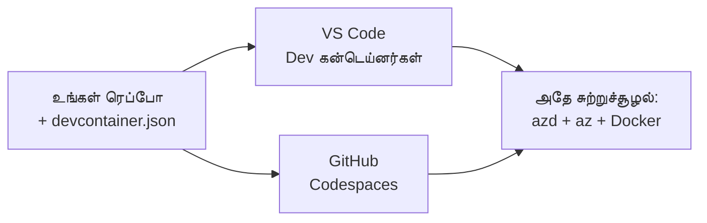

# azdக்கான Dev Containers & GitHub Codespaces

**Chapter Navigation:**
- **📚 Course Home**: [AZD For Beginners](../../README.md)
- **📖 Current Chapter**: Chapter 1 - Foundation & Quick Start
- **⬅️ Previous**: [Bring Your Own App](bring-your-own-app.md)
- **🚀 Next Chapter**: [Chapter 2: AI-First Development](../chapter-02-ai-development/README.md)

> ஜூன் 2026-இல் `azd 1.25.6` உடன் சரிபார்க்கப்பட்டது.

## அறிமுகம்

ஒவ்வொரு இயந்திரத்திலும் azd, சரியான மொழி ரன்டைம், Docker, மற்றும் Azure CLI ஐ நிறுவுவது ஒரு பெரும் வேலை — மேலும் "என் இயந்திரத்தில் வேலை செய்கிறத" என்பதைச் சொல்வது மற்றவர்களுக்கு தோல்வியடையும் முக்கியமான காரணமாக உள்ளது. ஒரு **dev container** உங்கள் முழு டூல்செயினைப் ஒரு கோப்பில் விவரிப்பதன் மூலம் இதற்கு தீர்வாக அமைகிறது. யாராவது VS Code அல்லது GitHub Codespaces இல் திட்டத்தைத் திறக்கும் போது அதே சரியான சூழல், azd முன்னமே நிறுவப்பட்டதாக கிடைக்கும். இந்த பாடம் ஒன்றை எப்படி சேர்ப்பது என்று காட்டுகிறது.

## கற்றல் இலக்குகள்

இந்தப் பாடத்தை முடித்த பிறகு, நீங்கள்:
- dev container என்றால் என்ன மற்றும் அது azd உடன் எவ்வாறு உதவுகிறது என்பதை தெளிவுபடுத்த முடியும்
- ஒரு குறைந்தபட்ச `.devcontainer/devcontainer.json` ஐ ஒரு திட்டத்தில் சேர்க்க முடியும்
- Dev Container *features* மூலம் azd, Azure CLI, மற்றும் Docker ஐ சேர்க்க முடியும்
- GitHub Codespaces அல்லது VS Code இல் திட்டத்தைத் திறக்க முடியும்

## கற்றல் முடிவுகள்

இந்தப் பாடத்தை முடித்த பிறகு, நீங்கள்:
- azd திட்டத்திற்காக ஒரு `devcontainer.json` எழுத முடியும்
- கைமுறை நிறுவல்களில்லாமல் azd மற்றும் Azure கருவிகளைச் சேர்க்க முடியும்
- ஒரு container அல்லது Codespace உள்ளே இருந்து `azd up` ஓட வைக்க முடியும்

---

## Dev Container என்றால் என்ன?

ஒரு dev container என்பது உங்கள் களஞ்சியத்தில் உள்ள `.devcontainer/devcontainer.json` கோப்பால் வரையறுக்கப்பட்ட Docker-அடிப்படையிலான மேம்பாட்டு சூழ்நிலை. நீங்கள் திட்டத்தைத் திறக்கும் போது:

- **VS Code** (Dev Containers நீட்சியுடன்) container ஐ கட்டி அதனுடன் இணைக்கிறது.
- **GitHub Codespaces** மேகம்(கிளவுட்)இல் அதே container ஐ கட்டி உங்களுக்கு ஒரு உலாவி அடிப்படையிலான தொகுப்பியை வழங்குகிறது.

இரு வழிகளில், ஒவ்வொரு பங்களிப்பாளரும் அதே கருவிகளைப் பெறுகிறார்கள் — "நீங்கள் azd ஐ நிறுவினீர்களா?" என்று சிக்கல்களை தவிர்க்கும்.



---

## படி 1: devcontainer கோப்பை உருவாக்கவும்

உங்கள் திட்டத்தின் ரூட்டில் `.devcontainer/devcontainer.json` ஐ உருவாக்கவும்:

```json
{
  "name": "azd-project",
  "image": "mcr.microsoft.com/devcontainers/base:bookworm",
  "features": {
    "ghcr.io/devcontainers/features/azure-cli:1": {},
    "ghcr.io/azure/azure-dev/azd:latest": {},
    "ghcr.io/devcontainers/features/docker-in-docker:2": {},
    "ghcr.io/devcontainers/features/node:1": {}
  },
  "customizations": {
    "vscode": {
      "extensions": [
        "ms-azuretools.azure-dev",
        "ms-azuretools.vscode-bicep"
      ]
    }
  },
  "forwardPorts": [3000],
  "postCreateCommand": "azd version"
}
```

ஒவ்வொரு பகுதிக்கும் செயல்:

| சாவி | பயன்பாடு |
|-----|---------|
| `image` | container க்கு ஆதார OS |
| `features` | முன்நிறுவிக்கப்பட்ட இன்ஸ்டாலர்கள்—இங்கே: Azure CLI, **azd**, Docker, மற்றும் Node.js |
| `customizations.vscode.extensions` | azd மற்றும் Bicep VS Code நீட்சிகளை தானாக நிறுவுகிறது |
| `forwardPorts` | உங்கள் செயலியின் போர்ட்டை உலாவிக்கு வெளிப்படுத்துகிறது |
| `postCreateCommand` | container கட்டப்பட்ட பின் ஒருமுறை இயங்கும் (இங்கே, ஒரு சானிட்டி சோதனை) |

> `ghcr.io/azure/azure-dev/azd:latest` feature என்பது container இல் azd ஐ பெற அதிகாரபூர்வமான வழி. உங்கள் பதிப்புகளை மீண்டும் உருவாக்கத் தேவையாக இருந்தால் ஒரு குறிப்பிட்ட பதிப்பை பின் நின்று கொள் (உதாரணமாக `azd:1.25.6`).

---

## படி 2: உங்கள் செயலியின் மொழிக்கு feature ஐ பொருத்துக

உங்கள் செயலி பயன்படுத்தும் இருக்கையைப்போல் `node` feature ஐ மாற்றவும்:

```jsonc
// Python project
"ghcr.io/devcontainers/features/python:1": {},

// .NET project
"ghcr.io/devcontainers/features/dotnet:2": {},

// Java project
"ghcr.io/devcontainers/features/java:1": {},

// Go project
"ghcr.io/devcontainers/features/go:1": {}
```

உங்கள் `host` `containerapp`, `aks`, அல்லது image ஒன்றை கட்டும் ஏதையாவது என்றால் `docker-in-docker` ஐ வைக்கவும்—container படங்களை கட்டி உருக்க (build) மற்றும் push செய்ய azd க்கு Docker தேவை.

---

## படி 3: அதை திறக்கவும்

**In VS Code:**
1. Install the **Dev Containers** extension.
2. Open the project folder.
3. Click **Reopen in Container** when prompted (or run *Dev Containers: Reopen in Container*).

**In GitHub Codespaces:**
1. Push the repo to GitHub.
2. Click **Code → Codespaces → Create codespace on main**.
3. Wait for the container to build—azd is ready in the terminal.

---

## படி 4: Container உள்ளே இருந்து Deploy செய்க

container இல் azd முன்னலில் நிறுவப்பட்டிருப்பதால், சாதாரண பணிவழி வேலை செய்கிறது:

```bash
azd auth login --use-device-code   # Codespaces இல் சாதனக் குறியீடு வசதியாக உள்ளது
azd up
```

> **Why `--use-device-code`?** In a remote container or Codespace there's no local browser to redirect to, so device-code login is the reliable path. You'll paste a code into a browser tab to complete sign-in.

---

## பொதுவான தவறுகள்

| தவறு | சரி செய்யும் வழி |
|---------|-----|
| `azd up` படம் (image) கட்ட முடியவில்லை | `docker-in-docker` feature ஐ சேர்க்கவும் |
| Codespaces இல் உலாவி மூலம் உள்நுழைவு தாமதிக்கிறது | `azd auth login --use-device-code` பயன்படுத்தவும் |
| குழு உறுப்பினர்களுக்கு கருவிகள் வேறுபடுகின்றன | feature பதிப்புகளை பின் நின்று வைத்துக் கொள்ளவும் (உதா. `azd:1.25.6`) |
| செயலி உலாவியில் அணுகமுடியவில்லை | போர்ட்டை `forwardPorts` இல் சேர்க்கவும் |

---

## சுருக்கம்

- ஒரு dev container உங்கள் azd டூல்செயினை எல்லோருக்கும் மீண்டும் உருவாக்கக்கூடியதாகச் செய்கிறது.
- Dev Container *features* மூலம் azd, Azure CLI, மற்றும் Docker ஐச் சேர்க்கவும்.
- உங்கள் செயலியின் மொழிக்கு அடிப்படையிலான feature ஐ பொருத்தவும் மற்றும் container ஹோஸ்ட்களுக்கு `docker-in-docker` ஐ வைத்திருங்கள்.
- Codespaces உள்ளே ஓடும் போது device-code உள்நுழைவைப் பயன்படுத்தவும்.

---

## 🔗 வழிசெலுத்தல்

| Direction | Resource |
|-----------|----------|
| **Previous** | [Bring Your Own App](bring-your-own-app.md) |
| **Chapter Home** | [Chapter 1: Foundation & Quick Start](README.md) |
| **Next Chapter** | [Chapter 2: AI-First Development](../chapter-02-ai-development/README.md) |

## 📖 தொடர்புடைய வளங்கள்

- [நிறுவல் மற்றும் அமைப்பு](installation.md)
- [கட்டளை குறிப்பு](../../resources/cheat-sheet.md)
- [அதிகார Dev Containers விவரக்குறிப்பு](https://containers.dev/)
- [azd Dev Container அம்சம்](https://github.com/Azure/azure-dev/tree/main/ext/devcontainer)

---

<!-- CO-OP TRANSLATOR DISCLAIMER START -->
**மறுப்பு**:
இந்த ஆவணம் AI மொழிபெயர்ப்பு சேவை [Co-op Translator](https://github.com/Azure/co-op-translator) பயன்படுத்தி மொழிபெயர்க்கப்பட்டுள்ளது. நாங்கள் துல்லியத்திற்காக முயற்சி செய்துள்ளோம், ஆனால் தானாக செய்யப்படும் மொழிபெயர்ப்புகளில் பிழைகள் அல்லது தவறுகள் இருக்கலாம் என்பதை கவனத்தில் கொள்ளவும். அசல் ஆவணம் அதன் தாய்மொழியில் அதிகாரப்பூர்வ ஆதாரமாக கருதப்பட வேண்டும். முக்கியமான தகவல்களுக்கு, தொழில்நுட்பமான மனித மொழிபெயர்ப்பு பரிந்துரைக்கப்படுகிறது. இந்த மொழிபெயர்ப்பைப் பயன்படுத்துவதால் ஏற்படும் எந்த தவறான புரிதல்கள் அல்லது தவறான விளக்கத்திற்கும் நாங்கள் பொறுப்பில்வில்லை.
<!-- CO-OP TRANSLATOR DISCLAIMER END -->