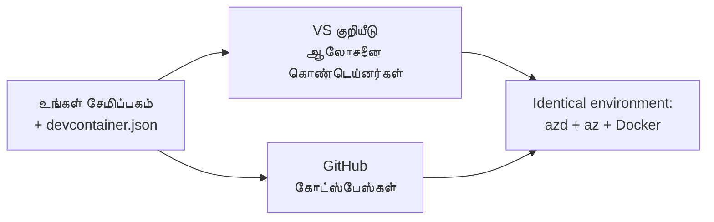

# azd க்கான Dev Containers & GitHub Codespaces

**அத்தியாய வழிசெலுத்தல்:**
- **📚 பாடநெறி முகப்பு**: [ஆறுதல் தேவைப்படுவோருக்கான AZD](../../README.md)
- **📖 தற்போதைய அத்தியாயம்**: அத்தியாயம் 1 - அடித்தளம் மற்றும் சீக்கிரம் துவக்கம்
- **⬅️ முந்தையது**: [உங்கள் சொந்த பயன்பாட்டை கொண்டு வாருங்கள்](bring-your-own-app.md)
- **🚀 அடுத்த அத்தியாயம்**: [அத்தியாயம் 2: AI-முதன்மை வளர்ச்சி](../chapter-02-ai-development/README.md)

> `azd 1.27.1` ஐ 2026 ஜூலை மாதத்தில் சரிபார்த்தவை.

## அறிமுகம்

azd, சரியான மொழி இயக்கு சூழல், Docker மற்றும் Azure CLI ஐ ஒவ்வொரு இயந்திரிலும் நிறுவுவது கடினம்—எனவே "என் இயந்திரத்தில் வேலை செய்கிறது" என்ற டுடோரியல் இன்னொருவருக்கு தோல்வி அடைவதற்கான முதன்மை காரணம் இது. ஒரு **dev container** உங்கள் முழு கருவித்தொடர்பைப் பக்கத்தில் விவரிப்பதன் மூலம் இதைத் தீர்க்கிறது. யாரும் VS Code அல்லது GitHub Codespaces இல் திட்டத்தைத் திறக்கும்போது, அவர்களுக்கு azd முன்னேற்றமாக நிறுவப்பட்டுள்ள அதே சூழல் கிடைக்கும். இந்த பாடம் அது எப்படி சேர்க்க வேண்டும் என்பதை காட்டுகிறது.

## கற்றல் இலக்குகள்

இந்த பாடத்தை முடிவடைவதற்கு, நீங்கள்:
- dev container என்பது என்ன மற்றும் அது azd உடன் யாருக்கு உதவுகிறது என்பதை அறிவீர்கள்
- ஒரு சுருக்கமான `.devcontainer/devcontainer.json` ஐ ஒரு திட்டத்தில் சேர்க்கப்போகிறீர்கள்
- Dev Container *சிறப்பம்சங்களின்* மூலம் azd, Azure CLI மற்றும் Docker ஐ சேர்க்கவும்
- GitHub Codespaces அல்லது VS Code இல் திட்டத்தை திறக்கவும்

## கற்றல் விளைவுகள்

இந்த பாடத்தை முடித்த பிறகு, நீங்கள்:
- azd திட்டத்திற்கு `devcontainer.json` ஐ உருவாக்க முடியும்
- கைமுறை நிறுவல் இல்லாமல் azd மற்றும் Azure கருவிகளை சேர்க்க முடியும்
- ஒரு container அல்லது Codespace உள்ளே இருந்து `azd up` ஐ இயக்க முடியும்

---

## Dev Container என்றால் என்ன?

dev container என்பது உங்கள் நிரல்களில் `.devcontainer/devcontainer.json` கோப்பில் வரையறுக்கப்பட்ட Docker-அடிப்படையிலான வளர்ச்சி சூழல் ஆகும். நீங்கள் திட்டத்தைத் திறக்கும்போது:

- **VS Code** (Dev Containers நீட்டிப்புடன்) container ஐ கட்டுகிறது மற்றும் அதனை இணைக்கிறது.
- **GitHub Codespaces** அதே container ஐ மேகத்தில் கட்டி உங்களுக்குக் குறுக்கு உலாவியில் அடிப்படையான தொகுப்பகம் வழங்குகிறது.

எந்த வழியிலும், ஒவ்வொரு பங்களிப்பாளர் ஒரே கருவிகளைப் பெறுகிறார்கள்—"நீங்கள் azd நிறுவினீர்களா?" என்ற பிரச்சினைகள் இருக்காது.



---

## படி 1: devcontainer கோப்பை உருவாக்குக

உங்கள் திட்டத்தின் ரூட்டில் `.devcontainer/devcontainer.json` ஐ உருவாக்கவும்:

```json
{
  "name": "azd-project",
  "image": "mcr.microsoft.com/devcontainers/base:bookworm",
  "features": {
    "ghcr.io/devcontainers/features/azure-cli:1": {},
    "ghcr.io/azure/azure-dev/azd:latest": {},
    "ghcr.io/devcontainers/features/docker-in-docker:2": {},
    "ghcr.io/devcontainers/features/node:1": {}
  },
  "customizations": {
    "vscode": {
      "extensions": [
        "ms-azuretools.azure-dev",
        "ms-azuretools.vscode-bicep"
      ]
    }
  },
  "forwardPorts": [3000],
  "postCreateCommand": "azd version"
}
```

ஒவ்வொரு பகுதியும் என்ன செய்கிறது:

| முக்கியம் | நோக்கம் |
|---------|----------|
| `image` | container க்கான அடிப்படை OS |
| `features` | முன்னேற்பாடு நிறுவிகள்—இங்கு: Azure CLI, **azd**, Docker மற்றும் Node.js |
| `customizations.vscode.extensions` | azd மற்றும் Bicep VS Code நீட்டிப்புகளை தானாக நிறுவுகிறது |
| `forwardPorts` | உங்கள் பயன்பாட்டின் போர்ட்டை உலாவிக்கு வெளிப்படையாக ஆக்குகிறது |
| `postCreateCommand` | container கட்டப்படும்போது ஒருமுறை இயங்கும் கட்டளை (இங்கு, சரி பார்த்தல்) |

> `ghcr.io/azure/azure-dev/azd:latest` சிறப்பு azd ஐ container இல் பெறுவதற்கான அதிகாரபூர்வ வழி. மறுபடியும் செய்யக்கூடியதற்காக சரிவிருப்பான பதிப்பை பினை செய்யலாம் (உதாரணத்திற்கு `azd:1.27.1`).

---

## படி 2: உங்கள் பயன்பாட்டின் மொழி சிறப்புத்திறனுக்கு பொருந்தும் வகையில் மாற்றுக

உங்கள் பயன்பாட்டிற்கு பயன்படுத்தப்படும் மொழிக்கு `node` சிறப்பை மாற்றுங்கள்:

```jsonc
// Python project
"ghcr.io/devcontainers/features/python:1": {},

// .NET project
"ghcr.io/devcontainers/features/dotnet:2": {},

// Java project
"ghcr.io/devcontainers/features/java:1": {},

// Go project
"ghcr.io/devcontainers/features/go:1": {}
```

உங்கள் `host` containerapp, aks, அல்லது container படம் கட்டும் ஏதாவது என்றால் `docker-in-docker` ஐ வைத்திருங்கள்—azd க்கு Docker படம் கட்டி தள்ள தேவையாகிறது.

---

## படி 3: திறக்கவும்

**VS Code இல்:**
1. **Dev Containers** நீட்டிப்பை நிறுவுக.
2. திட்ட கோப்புறையை திறக்கவும்.
3. கேட்கும்போது **Reopen in Container** அழுத்தவும் (அல்லது *Dev Containers: Reopen in Container* ஐ இயக்கவும்).

**GitHub Codespaces இல்:**
1. repo ஐ GitHub க்கு அப்லோடு செய்யவும்.
2. **Code → Codespaces → Create codespace on main** ஐ கிளிக் செய்யவும்.
3. container கட்டப்படுவதை காத்திருக்கவும்—azd டெர்மினலில் தயார்.

---

## படி 4: container உள்ளிலிருந்து குறிப்பிடுக

container இல் azd முன்னேற்பாடு செய்யப்பட்டுள்ளது, எனவே வழக்கமான வேலைப்பாடு சீராக இயங்கும்:

```bash
azd auth login --use-device-code   # Codespaces உட்பட்ட ஜாதிய குறியீடு பயனுள்ளதாக உள்ளது
azd up
```

> **ஏன் `--use-device-code`?** தொலைவிலான container அல்லது Codespace இல் உள்ளே உள்ளதால், உள்ளூர் உலாவி இல்லை, ஆகவே சாதன குறியீட்டு உள்நுழைவு நம்பகமான வழி. உள்நுழைவுக்கு பிரவுசர் டாபில் நீங்கள் குறியீட்டைப் பதுக்குவீர்கள்.

---

## பொதுவான தவறுகள்

| தவறு | தீர்வு |
|--------|---------|
| `azd up` படம் கட்ட முடியவில்லை | `docker-in-docker` சிறப்பைச் சேர்க்கவும் |
| Codespaces இல் உலாவி உள்நுழைவில் தடையாக உள்ளது | `azd auth login --use-device-code` பயன்படுத்தவும் |
| குழு உறுப்பினர்களுக்கு கருவிகள் வேறுபடுகின்றன | சிறப்பு பதிப்புகளை பினியமைக்கவும் (எ.கா. `azd:1.27.1`) |
| பயன்பாடு உலாவியில் அணுக முடியவில்லை | `forwardPorts` க்கு போர்ட்டைச் சேர்க்கவும் |

---

## சுருக்கம்

- dev container உங்கள் azd கருவித்தொடர்பை அனைவருக்கும் மறுபடியும் உருவாக்கக்கூடியதாக மாற்றுகிறது.
- Dev Container *சிறப்புகளின்* மூலமாக azd, Azure CLI மற்றும் Docker ஐ சேர்க்கவும்.
- உங்கள் பயன்பாட்டுக்கான மொழி சிறப்பை பொருந்துமாறு பொருந்தச் செய்து container ஹோஸ்ட்களுக்கு `docker-in-docker` ஐ வைத்திருங்கள்.
- Codespaces உள்ளே இயங்கும்போது சாதன குறியீட்டு உள்நுழைவைப் பயன்படுத்தவும்.

---

## 🔗 வழிசெலுத்தல்

| திசை | வளம் |
|---------|--------|
| **முந்தையது** | [உங்கள் சொந்த பயன்பாட்டை கொண்டு வாருங்கள்](bring-your-own-app.md) |
| **அத்தியாய முகப்பு** | [அத்தியாயம் 1: அடித்தளம் மற்றும் சீக்கிரம் துவக்கம்](README.md) |
| **அடுத்த அத்தியாயம்** | [அத்தியாயம் 2: AI-முதன்மை வளர்ச்சி](../chapter-02-ai-development/README.md) |

## 📖 தொடர்புடைய வளங்கள்

- [நிறுவல் & அமைப்பு](installation.md)
- [கட்டளை குறிப்பு சீட்டு](../../resources/cheat-sheet.md)
- [அதிகார Dev Containers குறிப்புகள்](https://containers.dev/)
- [azd Dev Container சிறப்பு](https://github.com/Azure/azure-dev/tree/main/ext/devcontainer)

---

<!-- CO-OP TRANSLATOR DISCLAIMER START -->
**மறுப்பு**:
இந்த ஆவணம் AI மொழிபெயர்ப்பு சேவை [Co-op Translator](https://github.com/Azure/co-op-translator) பயன்படுத்தி மொழிபெயர்க்கப்பட்டுள்ளது. நாங்கள் துல்லியத்திற்காக முயற்சி செய்துள்ளோம், ஆனால் தானாக செய்யப்படும் மொழிபெயர்ப்புகளில் பிழைகள் அல்லது தவறுகள் இருக்கலாம் என்பதை கவனத்தில் கொள்ளவும். அசல் ஆவணம் அதன் தாய்மொழியில் அதிகாரப்பூர்வ ஆதாரமாக கருதப்பட வேண்டும். முக்கியமான தகவல்களுக்கு, தொழில்நுட்பமான மனித மொழிபெயர்ப்பு பரிந்துரைக்கப்படுகிறது. இந்த மொழிபெயர்ப்பைப் பயன்படுத்துவதால் ஏற்படும் எந்த தவறான புரிதல்கள் அல்லது தவறான விளக்கத்திற்கும் நாங்கள் பொறுப்பில்வில்லை.
<!-- CO-OP TRANSLATOR DISCLAIMER END -->