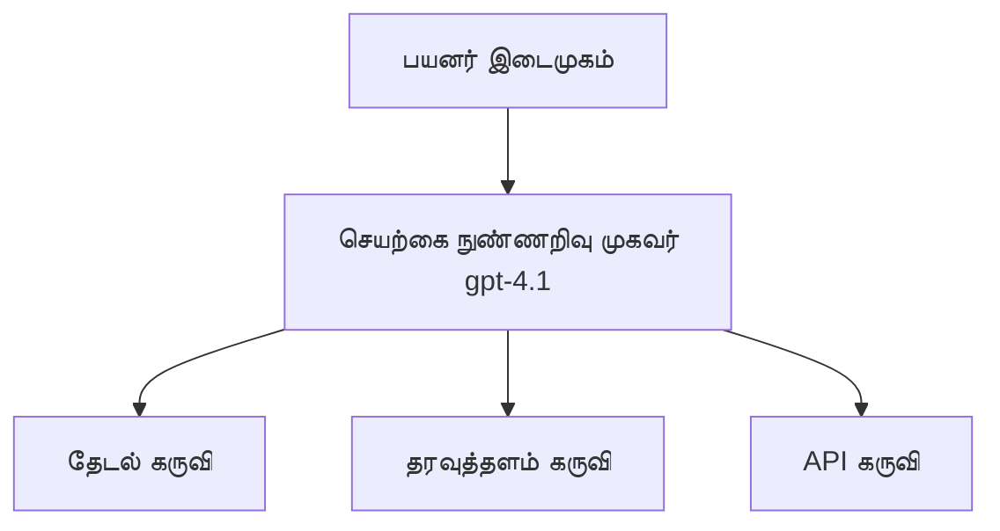
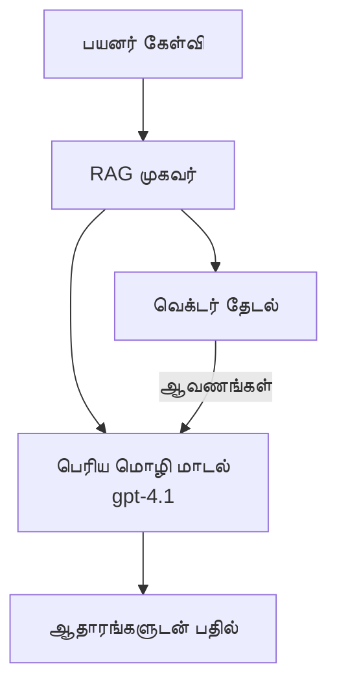
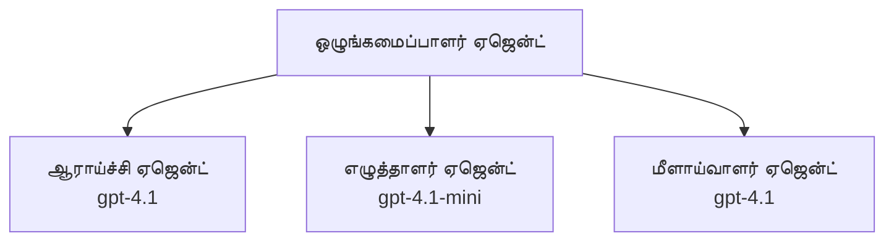

# AI Agents with Azure Developer CLI

**அத்தியாய வழிசெலுத்தல்:**
- **📚 பாடநூல் முகப்பு**: [AZD For Beginners](../../README.md)
- **📖 தற்போதைய அத்தியாயம்**: அத்தியாயம் 2 - AI-முதன்மை Development
- **⬅️ முந்தையது**: [Microsoft Foundry Integration](microsoft-foundry-integration.md)
- **➡️ அடுத்தது**: [AI Model Deployment](ai-model-deployment.md)
- **🚀 முன்னேறினர்**: [Multi-Agent Solutions](../../examples/retail-scenario.md)

---

## அறிமுகம்

AI முகவர்கள் என்பது தன்னாட்சி நிரல்களாகும்; அவை சுற்றுப்புறத்தை உணர்ந்து, முடிவுகளை எடுத்து, குறிப்பிட்ட இலக்குகளைக் தொடர்ந்து செயல்பட முடியும். கேள்விகளுக்கு பதிலளிக்கும் எளிய வழிகாட்டி/சாட்பாட்களுடன் வேறுபடும்போது, முகவர்கள்:

- **கருவிகளை பயன்படுத்துவர்** - APIகளை அழைக்க, தரவுத்தளங்களை தேட, குறியீட்டை இயக்கு
- **திட்டமிடுதல் மற்றும் காரணித்தல்** - சிக்கலான பணிகளை படிகளாக பிரிக்க
- **சுற்றுப்புறத்திலிருந்து கற்றுக்கொள்ளுதல்** - நினைவகத்தை பராமரித்து நடத்தை தழுவிக்கொள்ளுதல்
- **கூட்டிணைப்பு** - மற்ற முகவர்கள்(பல-முகவர் அமைப்புகள்) உடன் வேலைசெய்யுதல்

இந்த கையேடு Azure Developer CLI (azd) பயன்படுத்தி Azure இல் AI முகவர்களை कैसेdeploy செய்வது என்பதை விளக்குகிறது.

> **செதுக்கமைப்பு குறிப்பு (2026-03-25):** இந்த கையேடு `azd` `1.23.12` மற்றும் `azure.ai.agents` `0.1.18-preview` எதிரொலி கொண்டு மதிப்பாய்வு செய்யப்பட்டது. `azd ai` அனுபவம் இன்னும் preview-வில் உள்ளது, ஆகையால் உங்கள் நிறுவியுள்ள விதிகள் வேறாக இருந்தால் extension உதவியை சரிபார்க்கவும்.

## கற்றல் இலக்குகள்

இந்த கையேடுகளை முடித்தவுடன், நீங்கள்:
- AI முகவர்கள் என்ன மற்றும் அவை சாட்பாட்களிலிருந்து எப்படி வேறுபடுகின்றன என்பதை புரிந்துகொள்வீர்கள்
- AZD பயன்படுத்தி முன்னிட்டு உருவாக்கப்பட்ட AI முகவர் டெம்ப்ளேட்களை deploy செய்வீர்கள்
- தனிப்பயன் முகவர்களுக்கு Foundry Agents ஐ வரையறுக்கிறீர்கள்
- அடிப்படை முகவர் மாதிரிகளை (கருவி பயன்பாடு, RAG, பல-முகவர்) செயல்படுத்துகிறீர்கள்
- deploy செய்யப்பட்ட முகவர்களை கண்காணித்து பிழைத்திருத்துகிறீர்கள்

## கற்றல் விளைவுகள்

முழுமையாக முடித்தவுடன், நீங்கள்:
- ஒரே கட்டளையுடன் Azure இல் AI முகவர் பயன்பாடுகளை deploy செய்யக்கூறீர்கள்
- முகவர் கருவிகள் மற்றும் திறன்களை வரையறுக்கக்கூறீர்கள்
- முகவர்களுடன் retrieval-augmented generation (RAG) செயல்படுத்தக்கூறீர்கள்
- சிக்கலான வேலைநடவடிக்கைகளுக்கு பல-முகவர் கட்டமைப்புகளை வடிவமைக்கக்கூறீர்கள்
- பொதுவான முகவர் deployment பிரச்சினைகளை தீர்க்கக்கூறீர்கள்

---

## 🤖 ஒரு முகவர் சாட்பாட்டுடன் எப்படி வேறுபடுகிறது?

| Feature | Chatbot | AI Agent |
|---------|---------|----------|
| **எழுச்சி (Behavior)** | கேள்விகளுக்கு பதிலளிக்கிறது | தன்னாட்சி நடவடிக்கைகள் எடுக்கிறது |
| **கருவிகள் (Tools)** | இல்லையென்று கூறப்படும் | APIகளை அழைக்க, தேடல் செய்ய, குறியீட்டை இயக்கு முடியும் |
| **நினைவகம் (Memory)** | சत्रம்-அடிப்படையிலானது மட்டும் | அமர்நிலை (persistent) நினைவகம் அமர்ந்திருக்கும் |
| **திட்டமிடல் (Planning)** | ஒற்றை பதில் | பல படி காரணித்தல் |
| **கூட்டிணைப்பு (Collaboration)** | ஒற்றை அலகு | மற்ற முகவர்களுடன் வேலைசெய்யலாம் |

### எளிய ஒப்புமை

- **Chatbot** = தகவல் மேசையில் கேள்விகளுக்கு பதிலளிக்கும் உதவிச் சேவையாளர்
- **AI Agent** = அழைப்புகள் போட, நியமனங்களை ஏற்பாடு செய்ய, மற்றும் உங்களுக்காக பணிகளை நிறைவேற்றக்கூடிய தனிப்பட்ட உதவியாளர்

---

## 🚀 வேகமான தொடக்கம்: உங்கள் முதல் முகவரைக் கையாளுங்கள்

### விருப்பம் 1: Foundry Agents டெம்ப்ளேட் (பரிந்துரைக்கப்படுகிறது)

```bash
# AI முகவர்கள் வார்ப்புருவை துவக்கவும்
azd init --template get-started-with-ai-agents

# Azure-க்கு வெளியிடவும்
azd up
```

**என்ன deploy செய்யப்படுகிறது:**
- ✅ Foundry Agents
- ✅ Microsoft Foundry Models (gpt-4.1)
- ✅ Azure AI Search (RAG க்காக)
- ✅ Azure Container Apps (வெப் இடைமுகம்)
- ✅ Application Insights (கண்காணிப்பு)

**காலம்:** ~15-20 நிமிடங்கள்
**செலவு:** ~ $100-150/மாதம் (அவசர வளர்ச்சி)

### விருப்பம் 2: Prompty உடன் OpenAI Agent

```bash
# Prompty அடிப்படையிலான முகவர் வார்ப்புருவை ஆரம்பிக்கவும்
azd init --template agent-openai-python-prompty

# Azure-க்கு வெளியிடவும்
azd up
```

**என்ன deploy செய்யப்படுகிறது:**
- ✅ Azure Functions (serverless முகவர் செயலாக்கம்)
- ✅ Microsoft Foundry Models
- ✅ Prompty கட்டமைப்பு கோப்புகள்
- ✅ மாதிரி முகவர் செயலாக்கம்

**காலம்:** ~10-15 நிமிடங்கள்
**செலவு:** ~ $50-100/மாதம் (அவசர வளர்ச்சி)

### விருப்பம் 3: RAG Chat Agent

```bash
# RAG சாட் வார்ப்புருவை ஆரம்பிக்கவும்
azd init --template azure-search-openai-demo

# Azure-இல் நிறுவுக
azd up
```

**என்ன deploy செய்யப்படுகிறது:**
- ✅ Microsoft Foundry Models
- ✅ மாதிரி தரவுடன் Azure AI Search
- ✅ ஆவண செயலாக்கம் குழாம்
- ✅ மேற்கோள்களுடன் கூடிய உரையாடல் இடைமுகம்

**காலம்:** ~15-25 நிமிடங்கள்
**செலவு:** ~ $80-150/மாதம் (அவசர வளர்ச்சி)

### விருப்பம் 4: AZD AI Agent Init (Manifest- அல்லது Template-அடிப்படையிலான Preview)

உங்களுக்கு ஒரு agent manifest கோப்பு இருந்தால், `azd ai` கட்டளையை பயன்படுத்தி Foundry Agent Service திட்டத்தை நேரடியாக scaffold செய்து கொள்ளலாம். சமீபத்திய preview வெளியீடுகள் template-அடிப்படையிலான initialization ஆதரவையும் சேர்க்கின்றன, ஆகையால் நிறுவியுள்ள extension பதிப்புக்கு ஏற்ப சரியான prompt ஓட்டம் கொஞ்சம் வேறாக இருக்கலாம்.

```bash
# AI முகவர்கள் எக்ஸ்டென்ஷனை நிறுவவும்
azd extension install azure.ai.agents

# விருப்பமாக: நிறுவப்பட்ட முன்னோட்ட பதிப்பை சரிபார்க்கவும்
azd extension show azure.ai.agents

# ஏஜென்ட் மணிபெஸ்டிலிருந்து தொடங்கவும்
azd ai agent init -m agent-manifest.yaml

# Azure-க்கு வெளியிடவும்
azd up

# வெளியிட்ட ஏஜெண்டை சோதிக்கவும் (தாமதம் மற்றும் முதலாவது பைட்டிற்கான நேரம் காட்டுகிறது)
azd ai agent invoke
```

**எப்போது `azd ai agent init` ஐ பயன்படுத்தவேண்டும் vs `azd init --template`:**

| Approach | Best For | How It Works |
|----------|----------|------|
| `azd init --template` | செயல்பாட்டிலுள்ள மாதிரி பயன்பாட்டிலிருந்து துவங்குவதற்கு சிறந்தது | குறியீடு + பணியமைப்பு கொண்ட முழு template repo ஒன்றை கிளோன் செய்கிறது |
| `azd ai agent init -m` | உங்கள் சொந்த agent manifest-இல் இருந்து கட்டமைக்குவதற்கு | உங்கள் முகவர் வரையறையிலிருந்து திட்ட கட்டமைப்பை scaffold செய்கிறது |

> **Tip:** கற்றலுக்காக `azd init --template` ஐ பயன்படுத்துங்கள் (மேலே உள்ள விருப்பங்கள் 1-3). உங்கள் சொந்த manifests கொண்டு production முகவர்களை கட்டமைத்தால் `azd ai agent init` ஐ பயன்படுத்துங்கள்.

`azd up` ஆகியவை முடிந்தவுடன், அந்த extension முகவர் வாழ்நாள் நெறியைக் கொண்டு செல்லும்: சோதனைக்காக `azd ai agent invoke`, தரத்தைக் கணிக்க `azd ai agent eval generate` மற்றும் மேம்படுத்த `azd ai agent optimize`, மற்றும் வளங்களை அழிக்க `azd ai agent delete`. முழு குறிப்புகளுக்கு [AZD AI CLI Commands](../chapter-08-production/production-ai-practices.md#azd-ai-cli-commands-and-extensions) ஐப் பார்வையிடுங்கள்.

---

## 🏗️ முகவர் கட்டமைப்பு மாதிரிகள்

### மாதிரி 1: கருவிகளுடன் தனி முகவர்

எளிமையான முகவர் மாதிரி - பல கருவிகளை பயன்படுத்தக்கூடிய ஒரு முகவர்.



**இத்துக்கான்_best for_:**
- வாடிக்கையாளர் ஆதரவு வாடிகள்
- ஆராய்ச்சி உதவியாளர்கள்
- தரவுப் பகுப்பாய்வு முகவர்கள்

**AZD டெம்ப்ளேட்:** `azure-search-openai-demo`

### மாதிரி 2: RAG முகவர் (Retrieval-Augmented Generation)

பதில் உருவாக்குவதற்கு முன் தொடர்புடைய ஆவணங்களை மீட்டெடுக்கும் முகவர்.



**இத்துக்கான்_best for_:**
- நிறுவன அறிவுத்தளங்கள்
- ஆவண கேள்வி & பதில் அமைப்புகள்
- இணக்கம் மற்றும் சட்ட ஆய்வு

**AZD டெம்ப்ளேட்:** `azure-search-openai-demo`

### மாதிரி 3: பல-முகவர் அமைப்பு

சிக்கலான பணிகளுக்கு பல சிறப்பான முகவர்கள் ஒன்றாக வேலைசெய்கின்றனர்.



**இத்துக்கான்_best for_:**
- சிக்கலான உள்ளடக்க உருவாக்கம்
- பல படி வேலைநடவடிக்கைகள்
- வேறுபட்ட நிபுணத்துவம் தேவைப்படும் பணிகள்

**மேலதிகம் கற்றுக் கொள்ள:** [Multi-Agent Coordination Patterns](../chapter-06-pre-deployment/coordination-patterns.md)

---

## ⚙️ முகவர் கருவிகளை அமைத்தல்

கருவிகள் பயன்படுத்தும் போது முகவர்கள் சக்திவாய்ந்ததாக மாறுகின்றனர். பொதுவான கருவிகளை எப்படி அமைப்பது என்று இங்கே உள்ளது:

### Foundry Agents இல் கருவி கட்டமைப்பு

```python
# agent_config.py
from azure.ai.projects import AIProjectClient
from azure.ai.projects.models import FunctionTool, CodeInterpreterTool

# தனிப்பயன் கருவிகளை வரையறுக்கவும்
search_tool = FunctionTool(
    name="search_knowledge_base",
    description="Search the company knowledge base for relevant documents",
    parameters={
        "type": "object",
        "properties": {
            "query": {
                "type": "string",
                "description": "The search query"
            }
        },
        "required": ["query"]
    }
)

# கருவிகளுடன் ஏஜெண்டை உருவாக்கவும்
agent = project_client.agents.create_agent(
    model="gpt-4.1",
    name="Support Agent",
    instructions="You are a helpful support agent. Use the search tool to find relevant information.",
    tools=[search_tool, CodeInterpreterTool()]
)
```

### சூழல் (Environment) கட்டமைப்பு

```bash
# ஏஜென்ட்-சார்ந்த சுற்றுச்சூழல் மாறிலிகளை அமைக்கவும்
azd env set AZURE_OPENAI_MODEL "gpt-4.1"
azd env set AGENT_INSTRUCTIONS "You are a helpful assistant..."
azd env set ENABLE_CODE_INTERPRETER "true"
azd env set ENABLE_FILE_SEARCH "true"

# புதுப்பிக்கப்பட்ட கட்டமைப்புடன் அமல்படுத்தவும்
azd deploy
```

---

## 📊 முகவர்கள் கண்காணிப்பு

### Application Insights ஒருங்கிணைப்பு

இவ்வசம் எல்லா AZD முகவர் டெம்ப்ளேட்களும் கண்காணிப்புக்காக Application Insights ஐ உள்ளடக்கியவை:

```bash
# மோனிட்டரிங் டாஷ்போர்டை திறக்கவும்
azd monitor --overview

# நேரடி பதிவுகளைப் பார்க்கவும்
azd monitor --logs

# நேரடி அளவுகோல்களைப் பார்க்கவும்
azd monitor --live
```

### கண்காணிக்க வேண்டிய முக்கிய அளவுகோல்கள்

| Metric | Description | Target |
|--------|-------------|--------|
| Response Latency | பதில் உருவாக்கத்திற்கு எடுத்துக் கொள்ளும் நேரம் | < 5 seconds |
| Token Usage | ஒவ்வொரு கோரிக்கைக்கும் டோக்கன்கள் | செலவுக்காக கண்காணிக்கவும் |
| Tool Call Success Rate | வெற்றிகரமான கருதி நடமாடல்களின் சதவீதம் | > 95% |
| Error Rate | தோல்வியடைந்த முகவர் கோரிக்கைகள் | < 1% |
| User Satisfaction | கருத்து மதிப்புகள் | > 4.0/5.0 |

### முகவர்களுக்கு தனிப்பயன் பதிவு (Custom Logging)

```python
import os
from azure.monitor.opentelemetry import configure_azure_monitor
from opentelemetry import trace

# OpenTelemetry உடன் Azure Monitor-ஐ அமைக்கவும்
configure_azure_monitor(
    connection_string=os.environ["APPLICATIONINSIGHTS_CONNECTION_STRING"]
)

tracer = trace.get_tracer(__name__)

def log_agent_interaction(user_query, agent_response, tools_used, latency_ms):
    with tracer.start_as_current_span("agent_interaction") as span:
        span.set_attributes({
            "user_query": user_query,
            "response_length": len(agent_response),
            "tools_used": tools_used,
            "latency_ms": latency_ms
        })
```

> **Note:** தேவையான பேக்கேஜ்களை நிறுவவும்: `pip install azure-monitor-opentelemetry opentelemetry`

---

## 💰 செலவு தொடர்பான கவனிக்கவேண்டியவை

### மாதாந்திர மதிப்பிடப்பட்ட செலவுகள் (பாடத்தைப் பொறுத்து)

| Pattern | Dev Environment | Production |
|---------|-----------------|------------|
| Single Agent | $50-100 | $200-500 |
| RAG Agent | $80-150 | $300-800 |
| Multi-Agent (2-3 agents) | $150-300 | $500-1,500 |
| Enterprise Multi-Agent | $300-500 | $1,500-5,000+ |

### செலவு குறைப்புத் குறிப்புகள்

1. **எளிய பணிகளுக்கு gpt-4.1-mini ஐப் பயன்படுத்துங்கள்**
   ```bash
   azd env set AZURE_OPENAI_MODEL "gpt-4.1-mini"
   ```

2. **மீண்டும் கேட்கப்படும் கேள்விகளுக்கு caching ஐ செயல்படுத்துங்கள்**
   ```python
   from functools import lru_cache
   
   @lru_cache(maxsize=1000)
   def get_cached_response(query_hash):
       return agent.run(query_hash)
   ```

3. **ஒவ்வொரு ஓட்டத்திற்கும் token வரம்புகளை அமைக்குங்கள்**
   ```python
   # ஏஜெண்டை இயக்கும் போது max_completion_tokens-ஐ அமைக்கவும், உருவாக்கும் போது அல்ல
   run = project_client.agents.create_run(
       thread_id=thread.id,
       agent_id=agent.id,
       max_completion_tokens=1000  # பதிலின் நீளத்தை வரம்பிடுங்கள்
   )
   ```

4. **பயன்பாட்டில் இல்லாத நேரங்களில் scale to zero ஐ செயல்படுத்துங்கள்**
   ```bash
   # Container Apps தானாகவே அளவை பூஜ்ஜியமாக்கும்
   azd env set MIN_REPLICAS "0"
   ```

---

## 🔧 முகவர் பிழைதிருத்தம்

### பொதுவான பிரச்சினைகள் மற்றும் தீர்வுகள்

<details>
<summary><strong>❌ கருவி அழைப்புகளில் முகவர் பதிலளிக்கவில்லை</strong></summary>

```bash
# கருவிகள் சரியாக பதிவு செய்யப்பட்டுள்ளதா என்பதை சரிபார்க்கவும்
azd show

# OpenAI வெளியீட்டை சரிபார்க்கவும்
az cognitiveservices account deployment list \
  --name $AZURE_OPENAI_NAME \
  --resource-group $RG_NAME

# ஏஜென்ட் பதிவுகளை சரிபார்க்கவும்
azd monitor --logs
```

**பொதுவான காரணங்கள்:**
- கருவி செயல்பாட்டு கையொப்பம் (function signature) பொருந்தவில்லை
- தேவையான அனுமதிகள் காணப்படவில்லை
- API endpoint அணுகக்கூடியதே இல்லை
</details>

<details>
<summary><strong>❌ முகவர் பதில்களில் அதிக தாமதம்</strong></summary>

```bash
# Application Insights இல் ஏற்படும் செயல்திறன் தடைகளைச் சரிபாரிக்கவும்
azd monitor --live

# வேகமான மாடலைப் பயன்படுத்த பரிசீலிக்கவும்
azd env set AZURE_OPENAI_MODEL "gpt-4.1-mini"
azd deploy
```

**திறம்படுதல் குறிப்புகள்:**
- ஸ்ட்ரீமிங் பதில்களை பயன்படுத்துங்கள்
- பதில் caching ஐ செயல்படுத்துங்கள்
- context சாளரத்தின் அளவை குறைக்குங்கள்
</details>

<details>
<summary><strong>❌ முகவர் தவறான அல்லது ஹாலுசினேஷன் தகவலை மீட்டுப்பெறுகிறது</strong></summary>

```python
# நல்ல சிஸ்டம் ப்ராம்ப்டுகளால் மேம்படுத்தவும்
instructions = """
You are a helpful assistant. IMPORTANT:
- Only answer based on provided context
- If you don't know, say "I don't know"
- Always cite your sources
- Never make up information
"""

# நிலைப்படுத்துவதற்கு மீட்டெடுப்பைச் சேர்க்கவும்
agent = project_client.agents.create_agent(
    model="gpt-4.1",
    instructions=instructions,
    tools=[FileSearchTool()]  # பதில்களை ஆவணங்களில் அடிப்படையாக்கவும்
)
```
</details>

<details>
<summary><strong>❌ Token வரம்பு தாண்டிய பிழைகள்</strong></summary>

```python
# சூழ்நிலை ஜன்னல் மேலாண்மையை செயல்படுத்தவும்
def truncate_context(messages, max_tokens=8000, model="gpt-4.1"):
    """Keep only recent messages within token limit."""
    import tiktoken
    encoding = tiktoken.encoding_for_model(model)
    total_tokens = 0
    truncated = []
    
    for msg in reversed(messages):
        msg_tokens = len(encoding.encode(msg.content))
        if total_tokens + msg_tokens > max_tokens:
            break
        truncated.insert(0, msg)
        total_tokens += msg_tokens
    
    return truncated
```
</details>

---

## 🎓 நடைமுறை பயிற்சிகள்

### பயிற்சி 1: அடிப்படை முகவர்களை Deploy செய் (20 நிமிடங்கள்)

**இலக்கு:** AZD கொண்டு உங்கள் முதற்ப் AI முகவரியை deploy செய்

```bash
# படி 1: மாதிரியை ஆரம்பிக்கவும்
azd init --template get-started-with-ai-agents

# படி 2: Azure-இல் உள்நுழையவும்
azd auth login
# நீங்கள் பல டெனன்ட்களில் பணியாற்றினால், --tenant-id <tenant-id> ஐச் சேர்க்கவும்

# படி 3: வெளியிடவும்
azd up

# படி 4: ஏஜெண்டை சோதிக்கவும்
# வெளியீட்டுக்குப் பிறகு எதிர்பார்க்கப்படும் வெளியீடு:
#   வெளியீடு முடிந்தது!
#   எண்ட்பாயிண்ட்: https://<app-name>.<region>.azurecontainerapps.io
# வெளியீட்டில் காணப்படும் URL-ஐ திறந்து ஒரு கேள்வி கேட்க முயற்சிக்கவும்

# படி 5: கண்காணிப்பை பார்க்கவும்
azd monitor --overview

# படி 6: சுத்தப்படுத்தவும்
azd down --force --purge
```

**வெற்றி கருதுகோள்கள்:**
- [ ] முகவர் கேள்விகளுக்கு பதிலளிக்கிறது
- [ ] `azd monitor` மூலம் கண்காணிப்பு டெஷ்போர்ட்டை அணுகக்கூடியது
- [ ] வளங்கள் வெற்றிகரமாக சுத்திகரிக்கப்படுகின்றன

### பயிற்சி 2: ஒரு தனிப்பயன் கருவி சேர்க்க (30 நிமிடங்கள்)

**இலக்கு:** முகவருக்கு ஒரு தனிப்பயன் கருவியை நீட்டிக்கவும்

1. முகவர் டெம்ப்ளேட்டை deploy செய்யவும்:
   ```bash
   azd init --template get-started-with-ai-agents
   azd up
   ```
2. உங்கள் முகவர்த் குறியீட்டில் புதிய கருவி செயல்பாட்டை உருவாக்கவும்:
   ```python
   def get_weather(location: str) -> str:
       """Get current weather for a location."""
       # வானிலை சேவைக்கு API அழைப்பு
       return f"Weather in {location}: Sunny, 72°F"
   ```
3. முகவருடன் கருவியை பதிவு செய்யவும்:
   ```python
   from azure.ai.projects.models import FunctionTool

   weather_tool = FunctionTool(
       name="get_weather",
       description="Get current weather for a location",
       parameters={
           "type": "object",
           "properties": {
               "location": {"type": "string", "description": "City name"}
           },
           "required": ["location"]
       }
   )

   agent = project_client.agents.create_agent(
       model="gpt-4.1",
       name="Weather Agent",
       tools=[weather_tool]
   )
   ```
4. மறுபடியும் deploy செய்து சோதனை செய்க:
   ```bash
   azd deploy
   # கேளுங்கள்: "சியாட்டிலில் வானிலை என்ன?"
   # எதிர்பார்க்கப்படுகிறது: ஏஜெண்ட் get_weather("Seattle") ஐ அழைத்து வானிலை தகவலை திருப்பி வழங்குகிறது
   ```

**வெற்றி கருதுகோள்கள்:**
- [ ] முகவர் வானிலை தொடர்பான கேள்விகளை அடையாளம் காண்கிறது
- [ ] கருவி சரியாக அழைக்கப்படுகிறது
- [ ] பதில் வானிலைத் தகவலை உள்ளடக்கியது

### பயிற்சி 3: RAG முகவர் உருவாக்க (45 நிமிடங்கள்)

**இலக்கு:** உங்கள் ஆவணங்களிலிருந்து கேள்விகளுக்கு பதிலளிக்கும் முகவரியை உருவாக்கு

```bash
# படி 1: RAG மாதிரியை நிறுவவும்
azd init --template azure-search-openai-demo
azd up

# படி 2: உங்கள் ஆவணங்களை பதிவேற்றவும்
# PDF/TXT கோப்புகளை data/ அடைவுக்கு வைக்கவும், பின்னர் இயக்கவும்:
python scripts/prepdocs.py

# படி 3: துறைக்கு சொந்தமான கேள்விகளுடன் சோதனை செய்யவும்
# azd up வெளியீட்டிலிருந்து வலை பயன்பாட்டின் URL ஐ திறக்கவும்
# உங்கள் பதிவேற்றிய ஆவணங்கள் பற்றித் கேட்கவும்
# பதில்கள் [doc.pdf] போன்ற மேற்கோள் குறிப்புகளைச் சேர்த்திருக்க வேண்டும்
```

**வெற்றி கருதுகோள்கள்:**
- [ ] முகவர் பதிவேற்றப்பட்ட ஆவணங்களில் இருந்து பதிலளிக்கிறது
- [ ] பதில்களில் மேற்கோள்கள் இடம்பெறுகின்றன
- [ ] வரம்புக்கு வெளியான கேள்விகளில் ஹாலுசினேஷன் இல்லை

---

## 📚 அடுத்த படிகள்

இப்போது நீங்கள் AI முகவர்களைப் புரிந்துகொண்டுள்ளீர்கள்; இந்த முன்னேற்ற தலைப்புகளை ஆராயவும்:

| Topic | Description | Link |
|-------|-------------|------|
| **Multi-Agent Systems** | பல ஒத்துழைக்கும் முகவர்களுடன் அமைப்புகளை கட்டமைக்கவும் | [Retail Multi-Agent Example](../../examples/retail-scenario.md) |
| **Coordination Patterns** | ஒருங்கிணைப்பு மற்றும் தொடர்பு மாதிரிகளை கற்பிக்கவும் | [Coordination Patterns](../chapter-06-pre-deployment/coordination-patterns.md) |
| **Production Deployment** | நிறுவன மனப்பான்மையுடன் முகவர் deployment | [Production AI Practices](../chapter-08-production/production-ai-practices.md) |
| **Agent Evaluation** | முகவர் செயல்திறனை சோதிக்கவும் மற்றும் மதிப்பீடு செய்யவும் | [AI Troubleshooting](../chapter-07-troubleshooting/ai-troubleshooting.md) |
| **AI Workshop Lab** | நடைமுறை: உங்கள் AI தீர்வை AZD-க்கு தயாராக்கவும் | [AI Workshop Lab](ai-workshop-lab.md) |

---

## 📖 கூடுதல் வளங்கள்

### அதிகாரப்பூர்வ ஆவணங்கள்
- [Microsoft Foundry Agent Service](https://learn.microsoft.com/azure/ai-services/agents/)
- [Microsoft Foundry Agent Service Quickstart](https://learn.microsoft.com/azure/ai-services/agents/quickstart)
- [Semantic Kernel Agent Framework](https://learn.microsoft.com/semantic-kernel/)

### AZD டெம்ப்ளேட்டுகள் முகவர்களுக்காக
- [Get Started with AI Agents](https://github.com/Azure-Samples/get-started-with-ai-agents)
- [Agent OpenAI Python Prompty](https://github.com/Azure-Samples/agent-openai-python-prompty)
- [Azure Search OpenAI Demo](https://github.com/Azure-Samples/azure-search-openai-demo)

### சமுதாய வளங்கள்
- [Awesome AZD - Agent Templates](https://azure.github.io/awesome-azd/?tags=ai-agents)
- [Azure AI Discord](https://discord.gg/microsoft-azure)
- [Microsoft Foundry Discord](https://discord.gg/nTYy5BXMWG)

### உங்கள் தொகுப்பியில் உள்ள Agent திறன்கள்
- [**Microsoft Azure Agent Skills**](https://skills.sh/microsoft/github-copilot-for-azure) - GitHub Copilot, Cursor, அல்லது ஆதரவான எந்த முகவரியிலும் Azure வளர்ச்சிக்கு பயன்படுத்தக்கூடிய மறுபயன்பாட்டு AI முகவர் திறன்களை நிறுவுங்கள். இதில் [Azure AI](https://skills.sh/microsoft/github-copilot-for-azure/azure-ai), [Microsoft Foundry](https://skills.sh/microsoft/github-copilot-for-azure/microsoft-foundry), [deployment](https://skills.sh/microsoft/github-copilot-for-azure/azure-deploy), மற்றும் [diagnostics](https://skills.sh/microsoft/github-copilot-for-azure/azure-diagnostics) க்கு திறன்கள் அடங்கும்:
  ```bash
  npx skills add microsoft/github-copilot-for-azure
  ```

---

**வழிசெலுத்தல்**
- **முந்தைய பாடம்**: [Microsoft Foundry Integration](microsoft-foundry-integration.md)
- **அடுத்த பாடம்**: [AI Model Deployment](ai-model-deployment.md)

---

<!-- CO-OP TRANSLATOR DISCLAIMER START -->
**மறுப்பு**:
இந்த ஆவணம் AI மொழிபெயர்ப்பு சேவை [Co-op Translator](https://github.com/Azure/co-op-translator) பயன்படுத்தி மொழிபெயர்க்கப்பட்டுள்ளது. நாங்கள் துல்லியத்திற்காக முயற்சி செய்துள்ளோம், ஆனால் தானாக செய்யப்படும் மொழிபெயர்ப்புகளில் பிழைகள் அல்லது தவறுகள் இருக்கலாம் என்பதை கவனத்தில் கொள்ளவும். அசல் ஆவணம் அதன் தாய்மொழியில் அதிகாரப்பூர்வ ஆதாரமாக கருதப்பட வேண்டும். முக்கியமான தகவல்களுக்கு, தொழில்நுட்பமான மனித மொழிபெயர்ப்பு பரிந்துரைக்கப்படுகிறது. இந்த மொழிபெயர்ப்பைப் பயன்படுத்துவதால் ஏற்படும் எந்த தவறான புரிதல்கள் அல்லது தவறான விளக்கத்திற்கும் நாங்கள் பொறுப்பில்வில்லை.
<!-- CO-OP TRANSLATOR DISCLAIMER END -->