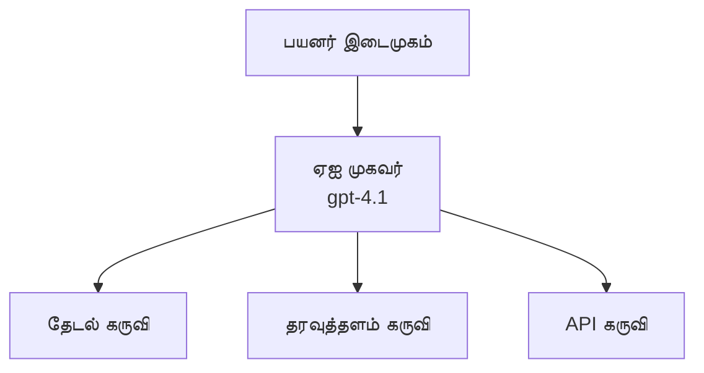
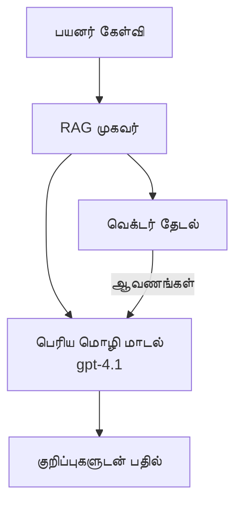
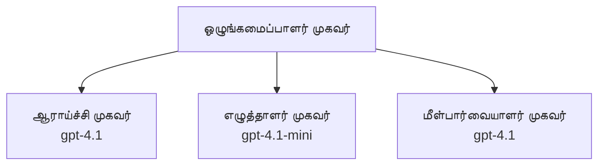

# Azure Developer CLI உடன் AI முகவர்கள்

**அத்தியாய வழிசெலுத்தல்:**
- **📚 Course Home**: [AZD For Beginners](../../README.md)
- **📖 தற்போதைய அத்தியாயம்**: அத்தியாயம் 2 - AI-முதலான வளர்ச்சி
- **⬅️ முந்தைய**: [Microsoft Foundry Integration](microsoft-foundry-integration.md)
- **➡️ அடுத்தது**: [AI Model Deployment](ai-model-deployment.md)
- **🚀 மேம்பட்ட**: [Multi-Agent Solutions](../../examples/retail-scenario.md)

---

## அறிமுகம்

AI முகவர்கள் தங்களுடைய சூழ்நிலையை அறிந்து, முடிவுகளை எடுத்து, குறிப்பிட்ட இலக்குகளை அடைவதற்காக நடவடிக்கைகளை எடுக்கும் சுயாதீன செயலிகள். உத்தரவுகளுக்கு பதிலளிக்கும் எளிதான சாட்‌பாட்டுகளுக்கு முரண்பாடாக, முகவர்கள்:

- **கருவிகளை பயன்படுத்தலாம்** - APIகளை அழைக்க, தரவுத்தளங்களை தேட, குறியீட்டைப் செயல்படுத்த
- **திட்டமிடுதல் மற்றும் காரணமிடல்** - சிக்கலான பணிகளை படிகளாகப் பிரிக்க
- **சூழ்நிலையிலிருந்து கற்றல்** - நினைவைக் காக்கவும் நடத்தை மாற்றிக்கொள்ளவும்
- **ஒத்துழைப்பு** - பிற முகவர்களுடன் (பல-முகவர் அமைப்புகள்) வேலை செய்யலாம்

இந்த வழிகாட்டி Azure Developer CLI (azd) பயன்படுத்தி AI முகவர்களை Azure-க்கு எப்படி நிறுவுவது என்பதைக் காட்டுகிறது.

> **சரிபார்ப்பு குறிப்பு (2026-03-25):** இந்த வழிகாட்டி `azd` `1.23.12` மற்றும் `azure.ai.agents` `0.1.18-preview` எதிரொலிக்கப்பட்டு பரிசீலிக்கப்பட்டது. `azd ai` அனுபவம் இன்னும் முன்னோட்ட முகாமையில் உள்ளது, ஆகையால் நீங்கள் நிறுவியுள்ள கொடிகள் வேறுபடினால் நீட்டிப்பு உதவியை சரிபார்க்கவும்.

## கற்றல் இலக்குகள்

இந்த வழிகாட்டியை முடித்தவுடன், நீங்கள்:
- முகவர்கள் என்னவென்று மற்றும் அவை சாட்‌பாட்டுகளிலிருந்து எவ்வாறு வேறுபடுகின்றன என்பதைக் புரிந்துகொள்வீர்கள்
- AZD பயன்படுத்தி முன்-உருவாக்கப்பட்ட AI முகவர் வார்ப்புகளை பொருத்துவீர்கள்
- தனிப்பயன் முகவர்களுக்கு Foundry Agents ஐ கட்டமைப்பீர்கள்
- அடிப்படை முகவர் வடிவமைப்புகள் (கருவி பயன்பாடு, RAG, பல-முகவர்) அமல்படுத்துவீர்கள்
- நிறுவப்பட்ட முகவர்களை கண்காணித்து பிழைத்திருத்தம் செய்வீர்கள்

## கற்றல் விளைவுகள்

முடிவில், நீங்கள் здக்க முடியும்:
- ஒரு கட்டளை மூலம் Azure-க்கு AI முகவர் செயலிகளைக் கொண்டு வர முடியும்
- முகவர் கருவிகள் மற்றும் திறன்களை கட்டமைக்க முடியும்
- முகவர்களுடன் retrieval-augmented generation (RAG) செயல்படுத்த முடியும்
- சிக்கலான வேலைப்பாடுகளுக்காக பல-முகவர் கட்டமைப்புகளை வடிவமைக்க முடியும்
- பொதுவான முகவர் பொருத்தல் பிரச்சினைகளை தீர்க்க முடியும்

---

## 🤖 ஒரு முகவர் ஒரு சாட்‌பாட்-ஐவிட எப்படி வேறுபடுகிறது?

| சிறப்பு | சாட்‌பாட் | AI முகவர் |
|---------|---------|----------|
| **நடத்தை** | உத்தேசங்களுக்கு பதிலளிக்கும் | சுயாதீன நடவடிக்கைகள் எடுக்கும் |
| **கருவிகள்** | இல்லை | APIகளை அழைக்க, தேட, குறியீடு இயக்க முடியும் |
| **நினைவு** | அமர்வு-அடிப்படையில் மட்டுமே | அமர்வுகளுக்கு பாட் நிலையான நினைவு |
| **திட்டமிடல்** | ஒரே பதில் | பல படி காரணமிடல் |
| **ஒத்துழைப்பு** | ஒரே அமைப்பு | பிற முகவர்களுடன் வேலை செய்ய முடியும் |

### சுலபமான ஒப்புமை

- **சாட்‌பாட்** = தகவல் மேசையில் கேள்விகளுக்கு பதிலளிக்கும் உதவிக்கரமான நபர்
- **AI முகவர்** = உங்களுக்கு அழைக்கைகள் செய்யும், நேர்முகங்களைக் கணக்கிடும், மற்றும் பணிகளை முடிக்கக்கூடிய தனிப்பட்ட உதவியாளர்

---

## 🚀 துரித அறிமுகம்: உங்கள் முதல் முகவரியை நிறுவுங்கள்

### விருப்பம் 1: Foundry முகவர்கள் டெம்ப்ளேட் (பரிந்துரைக்கப்படுகிறது)

```bash
# AI முகவர்கள் மாதிரியை ஆரம்பிக்கவும்
azd init --template get-started-with-ai-agents

# Azure-க்கு வெளியிடவும்
azd up
```

**என்னவை நிறுவப்படுகின்றன:**
- ✅ Foundry Agents
- ✅ Microsoft Foundry Models (gpt-4.1)
- ✅ Azure AI Search (RAG க்காக)
- ✅ Azure Container Apps (வலை இன்டர்ஃபெஸ்)
- ✅ Application Insights (கண்காணிப்பு)

**கால அளவு:** ~15-20 நிமிடங்கள்
**செலவு:** ~$100-150/மாதம் (வளர்ச்சி)

### விருப்பம் 2: Prompty உடன் OpenAI முகவர்

```bash
# Prompty அடிப்படையிலான முகவர் வார்ப்புருவை தொடங்கவும்
azd init --template agent-openai-python-prompty

# Azure-க்கு விநியோகிக்கவும்
azd up
```

**என்னவை நிறுவப்படுகின்றன:**
- ✅ Azure Functions (சேவையில்லா முகவர் செயலாக்கம்)
- ✅ Microsoft Foundry Models
- ✅ Prompty கட்டமைப்பு கோப்புகள்
- ✅ மாதிரி முகவர் செயலாக்கம்

**கால அளவு:** ~10-15 நிமிடங்கள்
**செலவு:** ~$50-100/மாதம் (வளர்ச்சி)

### விருப்பம் 3: RAG அரட்டை முகவர்

```bash
# RAG அரட்டை வார்ப்புருவை ஆரம்பிக்கவும்
azd init --template azure-search-openai-demo

# Azure-க்கு வெளியிடவும்
azd up
```

**என்னவை நிறுவப்படுகின்றன:**
- ✅ Microsoft Foundry Models
- ✅ மாதிரி தரவுடன் Azure AI Search
- ✅ ஆவண செயலாக்க குழாய்
- ✅ மேற்கோள்களுடன் அரட்டை இடைமுகம்

**கால அளவு:** ~15-25 நிமிடங்கள்
**செலவு:** ~$80-150/மாதம் (வளர்ச்சி)

### விருப்பம் 4: AZD AI Agent Init (Manifest- அல்லது Template-Based முன்னோட்டம்)

உங்களுக்கு ஒரு முகவர் மானிஃபெஸ்ட் கோப்பு இருந்தால், `azd ai` கட்டளையைப் பயன்படுத்தி நேரடியாக Foundry Agent Service திட்டத்தைக் கடத்த முடியும். சமீபத்திய முன்னோட்ட வெளியீடுகள் டெம்ப்ளேட்-அடிப்படையிலான தொடக்க ஆதரவையும் சேர்த்துள்ளன, எனவே நீங்கள் நிறுவியுள்ள நீட்டிப்பு பதிப்பின் அடிப்படையில் சரியான உத்தரவுரை ஓட்டம் சற்றே வேறுபடலாம்.

```bash
# AI ஏஜென்ட்கள் விரிவாக்கத்தை நிறுவவும்
azd extension install azure.ai.agents

# விருப்பமாக: நிறுவப்பட்ட முன்னோட்ட பதிப்பை சரிபார்க்கவும்
azd extension show azure.ai.agents

# ஏஜென்ட் மெனிபெஸ்ட் மூலம் துவக்கவும்
azd ai agent init -m agent-manifest.yaml

# Azure-க்கு வெளியிடவும்
azd up
```

**எப்போது `azd ai agent init` பயன்படுத்த வேண்டும் vs `azd init --template`:**

| முறை | சிறந்த பயன்பாடு | அது எப்படி செயல்படுகிறது |
|----------|----------|------|
| `azd init --template` | ஒரு செயல்படும் சாம்பிள் செயலியில் இருந்து தொடங்குவது | கோடு + கட்டமைப்புடன் முழு டெம்ப்ளேட் ரெப்போவை க்ளோன் செய்கிறது |
| `azd ai agent init -m` | உங்கள் சொந்த முகவர் மானிஃபெஸ்ட்டில் இருந்து கட்டமைத்தல் | உங்கள் முகவர் வரையறையிலிருந்து திட்ட அமைப்பை உருவாக்குகிறது |

> **குறிப்பு:** கற்றுக்கொள்ளும்போது `azd init --template` ஐப் பயன்படுத்தவும் (மேலே விருப்பங்கள் 1-3). உங்கள் சொந்த மானிஃபெஸ்ட்களுடன் உற்பத்தி முகவர்களை கட்டமைக்கும் போது `azd ai agent init` ஐப் பயன்படுத்தவும். முழு குறிப்பு பொருளுக்கு காண்க [AZD AI CLI Commands](../chapter-08-production/production-ai-practices.md#azd-ai-cli-commands-and-extensions)。

---

## 🏗️ முகவர் கட்டமைப்பு மாதிரிகள்

### முறை 1: கருவிகள் கொண்ட ஒரே முகவர்

எளியமையான முகவர் மாதிரி - பல கருவிகளை பயன்படுத்தக்கூடிய ஒரே முகவர்.


**மிக பொருத்தமானவை:**
- வாடிக்கையாளர் ஆதரவு பொறிகள்
- ஆராய்ச்சி உதவியாளர்கள்
- தரவு பகுப்பாய்வுச் சந்ததிகள்

**AZD டெம்ப்ளேட்:** `azure-search-openai-demo`

### முறை 2: RAG முகவர் (Retrieval-Augmented Generation)

பதில் உருவாக்குவதற்கு முன்பு தொடர்புடைய ஆவணங்களை தேடும் முகவர்.


**மிக பொருத்தமானவை:**
- நிறுவன அறிவுக் களங்கள்
- ஆவண கேள்வி-பதிலில் செயலிகள்
- ஒழுங்கு மற்றும் சட்டத் தேடல்கள்

**AZD டெம்ப்ளேட்:** `azure-search-openai-demo`

### முறை 3: பல-முகவர் அமைப்பு

சிக்கலான பணிகளுக்கு பல சிறப்பு முகவர்கள் ஒன்றாகக் கூட்டிணைந்து வேலை செய்யும் அமைப்பு.


**மிக பொருத்தமானவை:**
- சிக்கலான உள்ளடக்க உருவாக்கம்
- பல படி பணிமுறைகள்
- வெவ்வேறு நிபுணத்துவம் தேவையுமான பணிகள்

**மேலும் அறிய:** [பல-முகவர் ஒத்துழைப்பு மாதிரிகள்](../chapter-06-pre-deployment/coordination-patterns.md)

---

## ⚙️ முகவர் கருவிகளை கட்டமைப்பது

கருவிகளை பயன்படுத்தக்கூடிய முறையில் முகவர்கள் பல திறன் பெறுகின்றனர். பொதுவான கருவிகளை எவ்வாறு கட்டமைக்குவது இங்கே:

### Foundry முகவர்களில் கருவி கட்டமைப்பு

```python
# agent_config.py
from azure.ai.projects import AIProjectClient
from azure.ai.projects.models import FunctionTool, CodeInterpreterTool

# தனிப்பயன் கருவிகளை வரையறுக்கவும்
search_tool = FunctionTool(
    name="search_knowledge_base",
    description="Search the company knowledge base for relevant documents",
    parameters={
        "type": "object",
        "properties": {
            "query": {
                "type": "string",
                "description": "The search query"
            }
        },
        "required": ["query"]
    }
)

# கருவிகளுடன் ஒரு ஏஜெண்டை உருவாக்கவும்
agent = project_client.agents.create_agent(
    model="gpt-4.1",
    name="Support Agent",
    instructions="You are a helpful support agent. Use the search tool to find relevant information.",
    tools=[search_tool, CodeInterpreterTool()]
)
```

### சுற்றுச்சூழல் கட்டமைப்பு

```bash
# ஏஜென்ட்-க்கு உரிய சூழல் மாறிலிகளை அமைக்கவும்
azd env set AZURE_OPENAI_MODEL "gpt-4.1"
azd env set AGENT_INSTRUCTIONS "You are a helpful assistant..."
azd env set ENABLE_CODE_INTERPRETER "true"
azd env set ENABLE_FILE_SEARCH "true"

# புதுப்பிக்கப்பட்ட கட்டமைப்புடன் நிறுவவும்
azd deploy
```

---

## 📊 முகவர்களை கண்காணித்தல்

### Application Insights ஒருங்கிணைப்பு

அனைத்து AZD முகவர் டெம்ப்ளேட்களிலும் கண்காணிப்புக்கு Application Insights சேர்க்கப்பட்டுள்ளது:

```bash
# கண்காணிப்பு டாஷ்போர்டை திற
azd monitor --overview

# நேரடி பதிவுகளைப் பார்க்க
azd monitor --logs

# நேரடி அளவீடுகளைப் பார்க்க
azd monitor --live
```

### கண்காணிக்கக்கூடிய முக்கிய அளவுகோல்கள்

| அளவுகோல் | விளக்கம் | இலக்கு |
|--------|-------------|--------|
| பதில் தாமதம் | பதில் உருவாக்க நேரம் | < 5 விநாடிகள் |
| டோக்கன் பயன்பாடு | ஒவ்வொரு கோரிக்கைக்கும் டோக்கன்கள் | செலவுக்காக கண்காணிக்கவும் |
| கருவி அழைப்பு வெற்றி விகிதம் | வெற்றிகரமான கருவி செயலாக்கங்களின் % | > 95% |
| பிழை வீதம் | தோல்வியடைந்த முகவர் கோரிக்கைகள் | < 1% |
| பயனர் திருப்தி | கருத்து மதிப்பெண்கள் | > 4.0/5.0 |

### முகவர்கள் için தனிப்பயன் பதிவு

```python
import os
from azure.monitor.opentelemetry import configure_azure_monitor
from opentelemetry import trace

# OpenTelemetry உடன் Azure Monitor ஐ கட்டமைக்கவும்
configure_azure_monitor(
    connection_string=os.environ["APPLICATIONINSIGHTS_CONNECTION_STRING"]
)

tracer = trace.get_tracer(__name__)

def log_agent_interaction(user_query, agent_response, tools_used, latency_ms):
    with tracer.start_as_current_span("agent_interaction") as span:
        span.set_attributes({
            "user_query": user_query,
            "response_length": len(agent_response),
            "tools_used": tools_used,
            "latency_ms": latency_ms
        })
```

> **குறிப்பு:** தேவையான packageகளை நிறுவவும்: `pip install azure-monitor-opentelemetry opentelemetry`

---

## 💰 செலவு கருதல்கள்

### மாதாந்திர மேற்காட்டப்பட்ட செலவுகள் (அமர்வு வகை படி)

| மாதிரி | மேம்பாட்டு சூழல் | உற்பத்தியகம் |
|---------|-----------------|------------|
| ஒரே முகவர் | $50-100 | $200-500 |
| RAG முகவர் | $80-150 | $300-800 |
| பல-முகவர் (2-3 முகவர்கள்) | $150-300 | $500-1,500 |
| நிறுவன பல-முகவர் | $300-500 | $1,500-5,000+ |

### செலவு செயல்திறன் குறிப்புகள்

1. **எளிய பணிகளுக்கு gpt-4.1-mini ஐ உபயோகிக்கவும்**
   ```bash
   azd env set AZURE_OPENAI_MODEL "gpt-4.1-mini"
   ```

2. **மீண்டும் இடம்பெறும் கேள்விகளுக்காக கேஷிங் செயல்படுத்தவும்**
   ```python
   from functools import lru_cache
   
   @lru_cache(maxsize=1000)
   def get_cached_response(query_hash):
       return agent.run(query_hash)
   ```

3. **ஒவ்வொரு ஓட்டத்திற்கும் டோக்கன் வரம்புகளை அமைக்கவும்**
   ```python
   # ஏஜெண்ட் இயக்கும் போது max_completion_tokens ஐ அமைக்கவும், உருவாக்கும்போது அல்ல
   run = project_client.agents.create_run(
       thread_id=thread.id,
       agent_id=agent.id,
       max_completion_tokens=1000  # பதிலின் நீளத்தை வரையறுக்கவும்
   )
   ```

4. **பயன்பாட்டில் இல்லாத போது அளவை பூஜ்யமாக்கவும் (scale to zero)**
   ```bash
   # Container Apps தானாகவே அளவை பூஜ்யத்திற்கு குறைக்கின்றன
   azd env set MIN_REPLICAS "0"
   ```

---

## 🔧 முகவர்கள் தொடர்பான சிக்கல்கள் மற்றும் தீர்வுகள்

### பொதுவான சிக்கல்கள் மற்றும் தீர்வுகள்

<details>
<summary><strong>❌ சாதன அழைப்புகளுக்கு முகவர் பதிலளிக்கவில்லை</strong></summary>

```bash
# சாதனங்கள் சரியாக பதிவு செய்யப்பட்டுள்ளனவா என்பதை சரிபார்க்கவும்
azd show

# OpenAI விநியோகத்தை சரிபார்க்கவும்
az cognitiveservices account deployment list \
  --name $AZURE_OPENAI_NAME \
  --resource-group $RG_NAME

# ஏஜென்ட் பதிவுகளை சரிபார்க்கவும்
azd monitor --logs
```

**பொதுவான காரணங்கள்:**
- கருவி செயல்பாட்டு கையொப்பம் பொருந்தாது
- தேவையான அனுமதிகள் இல்லை
- API endpoint அணுகக்கூடியதாக இல்லை
</details>

<details>
<summary><strong>❌ முகவர் பதில்களில் உயர் தாமதம்</strong></summary>

```bash
# Application Insights-இல் உள்ள தடைகளைச் சரி பாருங்கள்
azd monitor --live

# விரைவான மாதிரியைப் பயன்படுத்தப் பரிசீலிக்கவும்
azd env set AZURE_OPENAI_MODEL "gpt-4.1-mini"
azd deploy
```

**திறன் மேம்படுத்தும் குறிப்புகள்:**
- ஸ்ட்ரீமிங் பதில்களைப் பயன்படுத்தவும்
- பதில் கேஷிங்கை செயல்படுத்தவும்
- உள்ளடக்க சாளரம் அளவு குறைக்கவும்
</details>

<details>
<summary><strong>❌ முகவர் தவறான அல்லது கூறுகையில் கடந்து செல்லும் தகவலை திரும்ப அனுப்புகிறது</strong></summary>

```python
# சிறந்த சிஸ்டம் தூண்டுதல்களால் மேம்படுத்தவும்
instructions = """
You are a helpful assistant. IMPORTANT:
- Only answer based on provided context
- If you don't know, say "I don't know"
- Always cite your sources
- Never make up information
"""

# அடிப்படையாக்குவதற்காக மீட்டெடுப்பை சேர்க்கவும்
agent = project_client.agents.create_agent(
    model="gpt-4.1",
    instructions=instructions,
    tools=[FileSearchTool()]  # பதில்களை ஆவணங்களில் அடிப்படையாக்கவும்
)
```
</details>

<details>
<summary><strong>❌ டோக்கன் வரம்பு மீறல் பிழைகள்</strong></summary>

```python
# சூழ்நிலை ஜன்னல் மேலாண்மையை செயல்படுத்தவும்
def truncate_context(messages, max_tokens=8000, model="gpt-4.1"):
    """Keep only recent messages within token limit."""
    import tiktoken
    encoding = tiktoken.encoding_for_model(model)
    total_tokens = 0
    truncated = []
    
    for msg in reversed(messages):
        msg_tokens = len(encoding.encode(msg.content))
        if total_tokens + msg_tokens > max_tokens:
            break
        truncated.insert(0, msg)
        total_tokens += msg_tokens
    
    return truncated
```
</details>

---

## 🎓 செயலில் பயிற்சிகள்

### பயிற்சி 1: அடிப்படை முகவயை நிறுவுதல் (20 நிமிடம்)

**நோக்கம்:** AZD பயன்படுத்தி உங்கள் முதல் AI முகவரியை நிறுவுதல்

```bash
# படி 1: மாதிரியை துவக்கவும்
azd init --template get-started-with-ai-agents

# படி 2: Azure-க்கு உள்நுழைக
azd auth login
# நீங்கள் பல டெனன்டுகளில் பணியாற்றினால், --tenant-id <tenant-id> ஐச் சேர்க்கவும்

# படி 3: வெளியிடவும்
azd up

# படி 4: ஏஜெண்டை சோதிக்கவும்
# நிறுவலுக்கு பிறகு எதிர்பார்க்கப்படும் வெளியீடு:
#   நிறுவல் முடிந்தது!
#   எண்ட்பாயிண்ட்: https://<app-name>.<region>.azurecontainerapps.io
# வெளியீட்டில் காணப்படும் URL-ஐ திறந்து ஒரு கேள்வி கேட்டு முயற்சிக்கவும்

# படி 5: கண்காணிப்பைப் பார்க்கவும்
azd monitor --overview

# படி 6: சுத்தம் செய்யவும்
azd down --force --purge
```

**வெற்றி அளவுகோல்கள்:**
- [ ] முகவர் கேள்விகளுக்கு பதிலளிக்கிறாரா
- [ ] `azd monitor` மூலம் கண்காணிப்பு டாஷ์போர்ட்டை அணுக முடிகிறதா
- [ ] வளங்கள் வெற்றிகரமாக அழிக்கப்பட்டுள்ளன

### பயிற்சி 2: ஒரு தனிப்பயன் கருவி சேர்க்கவும் (30 நிமிடம்)

**நோக்கம்:** ஒரு முகவருக்கு தனிப்பயன் கருவியை நீட்டிக்கவும்

1. முகவர் டெம்ப்ளேட்டை நிறுவவும்:
   ```bash
   azd init --template get-started-with-ai-agents
   azd up
   ```
2. உங்கள் முகவர் கோடில் ஒரு புதிய கருவி செயல்பாட்டை உருவாக்கவும்:
   ```python
   def get_weather(location: str) -> str:
       """Get current weather for a location."""
       # வானிலை சேவைக்கான API அழைப்பு
       return f"Weather in {location}: Sunny, 72°F"
   ```
3. கருவியை முகவருடன் பதிவுசெய்க:
   ```python
   from azure.ai.projects.models import FunctionTool

   weather_tool = FunctionTool(
       name="get_weather",
       description="Get current weather for a location",
       parameters={
           "type": "object",
           "properties": {
               "location": {"type": "string", "description": "City name"}
           },
           "required": ["location"]
       }
   )

   agent = project_client.agents.create_agent(
       model="gpt-4.1",
       name="Weather Agent",
       tools=[weather_tool]
   )
   ```
4. மறுது-பதிவேற்று மற்றும் சோதனை:
   ```bash
   azd deploy
   # கேள்: "சீயாட்டில் வானிலை எப்படி?"
   # எதிர்பார்க்கப்படுகிறது: முகவர் get_weather("Seattle")-ஐ அழைத்து மற்றும் வானிலை தகவலை வழங்க வேண்டும்
   ```

**வெற்றி அளவுகோல்கள்:**
- [ ] முகவர் வானிலை தொடர்புடைய கேள்விகளை அடையாளம் காண்கிறார்
- [ ] கருவி சரியாக அழைக்கப்படுகிறது
- [ ] பதில் வானிலை தகவலை உள்ளடக்கியதாக இருக்கிறது

### பயிற்சி 3: RAG முகவரியை உருவாக்கு (45 நிமிடம்)

**நோக்கம்:** உங்கள் ஆவணங்களிலிருந்து கேள்விகளுக்கு பதிலளிக்கும் முகவரியை உருவாக்குதல்

```bash
# படி 1: RAG மாதிரியை வெளியிடவும்
azd init --template azure-search-openai-demo
azd up

# படி 2: உங்கள் ஆவணங்களை பதிவேற்றவும்
# PDF/TXT கோப்புகளை data/ அடைவில் வைக்கவும், பின்னர் இயக்கவும்:
python scripts/prepdocs.py

# படி 3: துறை சார்ந்த கேள்விகளுடன் சோதனை செய்யவும்
# azd up வெளியீட்டில் இருந்து வலை செயலியின் URL-ஐ திறக்கவும்
# பதிவேற்றிய ஆவணங்கள் பற்றிய கேள்விகளை கேளுங்கள்
# பதில்களில் [doc.pdf] போன்ற மேற்கோள் குறிப்புகள் இருக்க வேண்டும்
```

**வெற்றி அளவுகோல்கள்:**
- [ ] பதிவேற்றிய ஆவணங்களிலிருந்து முகவர் பதிலளிக்கிறது
- [ ] பதில்களில் மேற்கோள்கள் இடம்பெறும்
- [ ] வரம்பிற்கு வெளியான கேள்விகளுக்கு ஹாலுசினேஷன் இல்லை

---

## 📚 அடுத்த படிகள்

இப்போது நீங்கள் AI முகவர்களைப் புரிந்துகொண்டுள்ளீர்கள், இந்த மேம்பட்ட தலைப்புக்களை ஆராயவும்:

| தலைப்பு | விளக்கம் | இணைப்பு |
|-------|-------------|------|
| **பல-முகவர் அமைப்புகள்** | பல இணைந்த முகவர்களுடன் அமைப்புகளை உருவாக்குக | [Retail Multi-Agent Example](../../examples/retail-scenario.md) |
| **ஒத்துழைப்பு மாதிரிகள்** | ஒக்ஸ்ட்ரேஷன் மற்றும் தொடர்பு மாதிரிகளை கற்றுக்கொள் | [Coordination Patterns](../chapter-06-pre-deployment/coordination-patterns.md) |
| **உற்பத்தி பதிப்பு** | நிறுவனத்திற்கு தயாரான முகவர் பதிப்பு | [Production AI Practices](../chapter-08-production/production-ai-practices.md) |
| **முகவர் மதிப்பீடு** | முகவர் செயல்திறனை சோதனை செய்து மதிப்பீடு செய்தல் | [AI Troubleshooting](../chapter-07-troubleshooting/ai-troubleshooting.md) |
| **AI வரிசபடம் பயிற்சி கூடம்** | கையால்: உங்கள் AI தீர்வை AZD-க்கு தயாராக்கவும் | [AI Workshop Lab](ai-workshop-lab.md) |

---

## 📖 கூடுதல் வளங்கள்

### அதிகாரப்பூர்வ ஆவணங்கள்
- [Azure AI Agent Service](https://learn.microsoft.com/azure/ai-services/agents/)
- [Azure AI Foundry Agent Service Quickstart](https://learn.microsoft.com/azure/ai-services/agents/quickstart)
- [Semantic Kernel Agent Framework](https://learn.microsoft.com/semantic-kernel/)

### AZD முகவர்களுக்கான டெம்ப்ளேட்டுகள்
- [Get Started with AI Agents](https://github.com/Azure-Samples/get-started-with-ai-agents)
- [Agent OpenAI Python Prompty](https://github.com/Azure-Samples/agent-openai-python-prompty)
- [Azure Search OpenAI Demo](https://github.com/Azure-Samples/azure-search-openai-demo)

### சமூகவியல் வளங்கள்
- [Awesome AZD - Agent Templates](https://azure.github.io/awesome-azd/?tags=ai-agents)
- [Azure AI Discord](https://discord.gg/microsoft-azure)
- [Microsoft Foundry Discord](https://discord.gg/nTYy5BXMWG)

### உங்கள் எடிட்டருக்கான முகவர் திறன்கள்
- [**Microsoft Azure Agent Skills**](https://skills.sh/microsoft/github-copilot-for-azure) - GitHub Copilot, Cursor அல்லது ஆதரிக்கப்பட்ட எந்த முகவரியிலும் Azure வளர்ச்சிக்கான மறுபயன்படுத்தக்கூடிய AI முகவர் திறன்களை நிறுவுங்கள். இதில் [Azure AI](https://skills.sh/microsoft/github-copilot-for-azure/azure-ai), [Microsoft Foundry](https://skills.sh/microsoft/github-copilot-for-azure/microsoft-foundry), [deployment](https://skills.sh/microsoft/github-copilot-for-azure/azure-deploy), மற்றும் [diagnostics](https://skills.sh/microsoft/github-copilot-for-azure/azure-diagnostics) உட்பட திறன்கள் அடங்கும்:
  ```bash
  npx skills add microsoft/github-copilot-for-azure
  ```

---

**வழிசெலுத்தல்**
- **முந்தைய பாடம்**: [Microsoft Foundry Integration](microsoft-foundry-integration.md)
- **அடுத்த பாடம்**: [AI Model Deployment](ai-model-deployment.md)

---

<!-- CO-OP TRANSLATOR DISCLAIMER START -->
**Disclaimer**:
இந்த ஆவணம் AI மொழிபெயர்ப்புச் சேவை [Co-op Translator](https://github.com/Azure/co-op-translator) பயன்படுத்தி மொழிபெயர்க்கப்பட்டது. நாங்கள் துல்லியத்திற்காக முயற்சி செய்து கொண்டிருப்பினும், தன்னிச்சையான மொழிபெயர்ப்புகள் பிழைகள் அல்லது தவறான தகவல்களை கொண்டிருக்கக்கூடும் என்பதை தயவுசெய்து கவனியுங்கள். சொந்த மொழியில் உள்ள அசல் ஆவணம் அதிகாரபூர்வ மூலமாக கருதப்பட வேண்டும். முக்கியமான தகவல்களுக்கு, தொழில்முறை மனித மொழிபெயர்ப்பு பரிந்துரைக்கப்படுகிறது. இந்த மொழிபெயர்ப்பைப் பயன்படுத்துவதால் உருவாகும் எந்தவொரு தவறான புரிதல்கள் அல்லது தவறான விளக்கங்களுக்கும் நாங்கள் பொறுப்பாக இருக்க மாட்டோம்.
<!-- CO-OP TRANSLATOR DISCLAIMER END -->