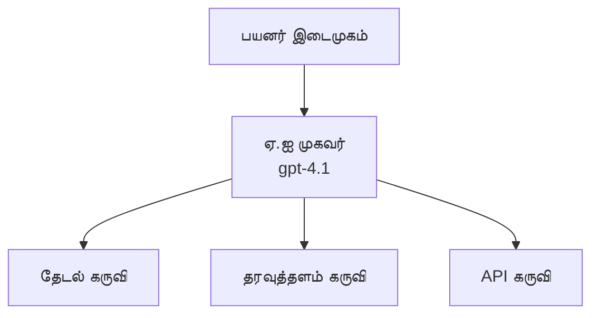
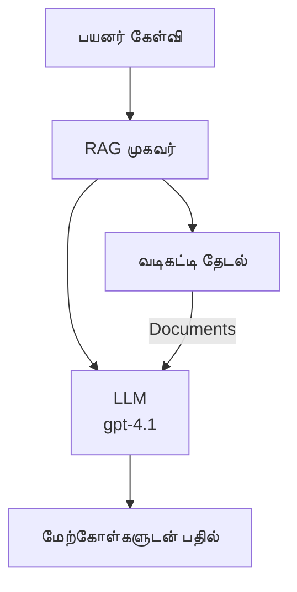
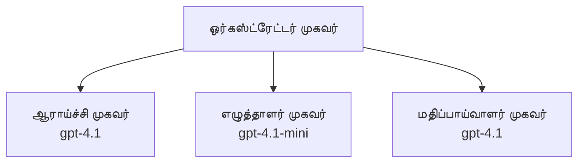

# Azure Developer CLI உடன் AI முகவர்கள்

**அதிகாரம் வழிசெலுத்தல்:**
- **📚 பாடநெடுஞ்சாலை முகப்பு**: [AZD For Beginners](../../README.md)
- **📖 தற்போதைய அதிகாரம்**: அதிகாரம் 2 - முதன்மையான AI மேம்பாடு
- **⬅️ முந்தையது**: [Microsoft Foundry ஒருமை](microsoft-foundry-integration.md)
- **➡️ அடுத்து**: [AI மாதிரி வினியோகம்](ai-model-deployment.md)
- **🚀 முன்னேற்றம்**: [பல முகவர் தீர்வுகள்](../../examples/retail-scenario.md)

---

## அறிமுகம்

AI முகவர்கள் சுயமாக இயங்கும் நிரல்கள் ஆகும், அவை சுற்றுப்புறத்தை உணர்ந்து, தீர்மானங்களை எடுத்து, குறிப்பிட்ட இலக்குகளை அடைய நடவடிக்கைகள் எடுக்க முடியும். தட்டுப்பூங்கல் (chatbot) போன்ற எளிதானதாக அல்லாமல், முகவர்கள்:

- **கருவிகள் பயன்படுத்துதல்** - APIகளை அழை, தரவுத்தளங்கள் தேடு, குறியீடு இயக்கு
- **திட்டமிடல் மற்றும் காரணம் கூறுதல்** - சிக்கலான வேலைகளை படிகளால் பிரி
- **கட்டமைப்பில் இருந்து கற்றல்** - நினைவூட்டல் உண்டு, நடத்தையை இசைகிறது
- **உடன்படுதல்** - பிற முகவர்களுடன் பணியாற்றுதல் (பல முகவர் முறைகள்)

இந்த வழிகாட்டி Azure Developer CLI (azd) பயன்படுத்தி Azure-க்கு AI முகவர்களை எப்படி வினியோகிக்கின்றது என்பதைக் காட்டுகிறது.

> **சரிபார்ப்பு குறிப்பு (2026-07-13):** இந்த வழிகாட்டி `azd` `1.27.1` மற்றும் `azure.ai.agents` `1.0.0-beta.5` உடன் மதிப்பாய்வு செய்யப்பட்டது. `azd ai` அனுபவம் இன்னும் முன்னோட்டம் சார்ந்தது, ஆகையால் உங்கள் நிறுவப்பட்ட கொடியைகள் வேறுபட்டால் விரிவாக்க உதவியை பார்க்கவும்.

## கற்றல் இலக்குகள்

இந்த வழிகாட்டியை முடித்ததன் மூலம், நீங்கள்:
- AI முகவர்கள் என்ன என்பதையும், அவர்கள் தட்டுப்பூங்கல்களிலிருந்து எப்படி வேறுபடுகின்றனர் என்பதையும் புரிந்து கொள்வீர்கள்
- AZD பயன்படுத்தி முன்கூட்டியே உருவாக்கப்பட்ட AI முகவர் வார்ப்புருக்களை துவக்கம் செய்வீர்கள்
- Foundry முகவர்களை தனிப்பயன் முகவர்களுக்காக அமைப்பீர்கள்
- அடிப்படை முகவர் மாதிரிகளை (கருவி பயன்படுத்துதல், RAG, பல முகவர்) செயல்படுத்துவீர்கள்
- வினியோகிக்கப்பட்ட முகவர்களை கண்காணித்து பிழைதிருத்துவீர்கள்

## கற்றல் முடிவுகள்

முடிவு செய்தவுடன் நீங்கள் செயல்படுத்த முடியும்:
- ஒரு கட்டளை மூலம் Azure-க்கு AI முகவர் பயன்பாடுகளை வினியோகிக்க
- முகவர் கருவிகளையும் திறன்களையும் அமைக்க
- முகவர்களுடன் கூடிய தேடியுடனான உருவாக்கத்தை (RAG) செயல்படுத்த
- சிக்கலான பணிக்கிடவு கையாள பல முகவர் கட்டிடக்கலை வடிவங்களை வடிவமைக்க
- பொதுவான முகவர் வினியோக பிரச்சினைகளை திருத்த

---

## 🤖 ஒரு முகவர் தட்டுப்பூங்கலிலிருந்து எப்படி வேறுபடுகிறது?

| அம்சம் | தட்டுப்பூங்கல் | AI முகவர் |
|---------|---------|----------|
| **நடவடிக்கை** | கேள்விகளுக்கு பதிலளிக்கும் | சுயமாக நடவடிக்கைகள் எடுக்கிறது |
| **கருவிகள்** | ஒன்றுமே இல்லை | APIகளை அழைக்க முடியும், தேட முடியும், குறியீடு இயக்கு |
| **நினைவூட்டல்** | only session-based | அமர்வுகளுக்கு இடையேயான நிரந்தர நினைவூட்டல் |
| **திட்டமிடல்** | ஒரு பதில் | பல படிகளால் காரணமிடல் |
| **கூட்டு வேலை** | ஒரு தனி அங்கம் | பிற முகவர்களுடன் பணியாற்ற முடியும் |

### எளிய உவமை

- **தட்டுப்பூங்கல்** = தகவல் மன்றத்தில் கேள்விகளுக்கு பதிலளிக்கும் உதவியாளர்
- **AI முகவர்** = அழைப்புகள் செய்யும், நேரங்கள் ஒதுக்கும், பணிகளை நிறைவேற்றும் தனிப்பட்ட உதவியாளர்

---

## 🚀 விரைவான துவக்கம்: உங்கள் முதல் முகவரைக் கைகாட்டவும்

### விருப்பம் 1: Foundry முகவர் வார்ப்புரு ( பரிந்துரைக்கப்பட்டது )

```bash
# AI முகவர்கள் வார்ப்புருவை ஆரம்பியுங்கள்
azd init --template get-started-with-ai-agents

# Azure-க்கு பயன்படுத்தி நிரப்புக
azd up
```

**என்ன வினியோகிக்கப்படுகிறது:**
- ✅ Foundry முகவர்கள்
- ✅ Microsoft Foundry மாதிரிகள் (gpt-4.1)
- ✅ Azure AI தேடல் (RAGக்காக)
- ✅ Azure Container Apps (வலை முகப்பு)
- ✅ Application Insights (கண்காணிப்பு)

**நேரம்:** ~15-20 நிமிடங்கள்
**செலவு:** ~$100-150/மாதம் (மென்பொருள் மேம்பாடு)

### விருப்பம் 2: Prompty உடன் OpenAI முகவர்

```bash
# Prompty-ஆல் அடிப்படையாக்கப்பட்ட முகவர் மாதிரியை ஆரம்பிப்பது
azd init --template agent-openai-python-prompty

# Azure-க்கு பணியிடுக
azd up
```

**என்ன வினியோகிக்கப்படுகிறது:**
- ✅ Azure Functions (சேவைஇல்லாத முகவர் செயல்பாடு)
- ✅ Microsoft Foundry மாதிரிகள்
- ✅ Prompty அமைப்புத் கோப்புகள்
- ✅ மாதிரி முகவர் அமலாக்கம்

**நேரம்:** ~10-15 நிமிடங்கள்
**செலவு:** ~$50-100/மாதம் (மென்பொருள் மேம்பாடு)

### விருப்பம் 3: RAG அரங்குக்குரிய முகவர்

```bash
# RAG உரையாடல் வார்ப்புருவை துவங்கவும்
azd init --template azure-search-openai-demo

# Azure க்கு தளவமைக்கவும்
azd up
```

**என்ன வினியோகிக்கப்படுகிறது:**
- ✅ Microsoft Foundry மாதிரிகள்
- ✅ மாதிரி தரவுடன் Azure AI தேடல்
- ✅ ஆவணி செயலாக்க குழாய்
- ✅ மேற்கோள் கொண்ட அரங்குக் கிடங்கு

**நேரம்:** ~15-25 நிமிடங்கள்
**செலவு:** ~$80-150/மாதம் (மென்பொருள் மேம்பாடு)

### விருப்பம் 4: AZD AI முகவர் தொடக்கம் (முகவருகோப்போ அல்லது வார்ப்புரு அடிப்படையிலான முன்னோட்டம்)

உங்கள் அருகில் ஒரு முகவருச்சீட்டு இருந்தால், நீங்கள் நேரடியாக Foundry முகவர் சேவை திட்டத்தை `azd ai` கட்டளையுடன் உருவாக்கலாம். சமீபத்திய முன்னோட்ட வெளியீடுகள் வார்ப்புரு அடிப்படையிலான தொடக்க ஆதரவையும் சேர்த்துள்ளன, ஆகையால் உங்கள் நிறுவப்பட்ட விரிவுருப் பதிப்பின் அடிப்படையில் குறுக்கெழுத்து கொடுப்பழுக்கல் வேறுபடலாம்.

```bash
# AI முகவர்கள் நீட்சியை நிறுவுக
azd extension install azure.ai.agents

# விருப்பமானது: நிறுவப்பட்ட முன்னோட்ட பதிப்பை சரிபார்க்கவும்
azd extension show azure.ai.agents

# முகவர் விளக்கத்திலிருந்து தொடங்கவும்
azd ai agent init -m agent-manifest.yaml

# Azure க்கு பரிமாறவும்
azd up

# பரிமாறப்பட்ட முகவரியை சோதிக்கவும் (விலம்பு + முதல் பைட் வரையிலான நேரம் காணப்படுகிறது)
azd ai agent invoke
```

**`azd ai agent init` மற்றும் `azd init --template` எப்போது பயன்படுத்துவது:**

| அணுகுமுறை | சிறந்ததாக | செயல்பாடு எப்படி |
|----------|----------|------|
| `azd init --template` | வேலை செய்கிற மாதிரி செயலி மூலம் துவக்கம் | கோடு + அமைப்பு உடைய முழு வார்ப்புரு களஞ்சியத்தை நகலெடுக்கிறது |
| `azd ai agent init -m` | உங்கள் முகவருச்சீட்டில் இருந்து கட்டமைக்கிறது | உங்கள் முகவருக் வரையறையிலிருந்து திட்ட கட்டமைப்பை உருவாக்குகிறது |

> **கருத்து:** கற்றலுக்கு (மேலே உள்ள விருப்பங்கள் 1-3) `azd init --template` பயன்படுத்தவும். உங்கள் சொந்த முகவருச்சீட்டுகளுடன் உற்பத்தி முகவர்களை உருவாக்க `azd ai agent init` பயன்படுத்தவும்.

`azd up` பிறகு, அதே விரிவுகள் முகவர் வாழ்நாள் முறையின் மற்ற பகுதிகளை முன்னெடுக்கிறது: சோதனைக்கு `azd ai agent invoke`, தரம் அளவீடு மற்றும் மேம்பாட்டுக்கு `azd ai agent eval generate` மற்றும் `azd ai agent optimize`, மற்றும் பசியாக்க `azd ai agent delete`. முழு குறிப்புக்காக [AZD AI CLI கட்டளைகள்](../chapter-08-production/production-ai-practices.md#azd-ai-cli-commands-and-extensions) பார்க்கவும்.

---

## 🏗️ முகவர் கட்டிடக்கலை மாதிரிகள்

### மாதிரி 1: கருவி கொண்ட ஒரே முகவர்

எளிய முகவர் மாதிரி - பல கருவிகளை பயன்படுத்த முடியும்.



**சிறந்த இடங்கள்:**
- வாடிக்கையாளர் ஆதரவு ரோபோக்கள்
- ஆராய்ச்சி உதவியாளர்கள்
- தரவு பகுப்பாய்வு முகவர்கள்

**AZD வார்ப்புரு:** `azure-search-openai-demo`

### மாதிரி 2: RAG முகவர் (தேடல்-வளர்ப்பு உருவாக்கம்)

ஒரு முகவர், பதில்களை உருவாக்கும் முன் சம்பந்தப்பட்ட ஆவணங்களை மீட்டெடுக்கும்.



**சிறந்த இடங்கள்:**
- கம்பெனி அறிவுத் தளங்கள்
- ஆவணி கேள்வி பதில் முறைகள்
- இணக்கம் மற்றும் சட்ட ஆய்வு

**AZD வார்ப்புரு:** `azure-search-openai-demo`

### மாதிரி 3: பல முகவர் முறைமை

பல சிறப்பு முகவர்கள் சிக்கலான பணிகளில் ஒருங்கிணைந்து செயல்படுகின்றனர்.



**சிறந்த இடங்கள்:**
- சிக்கலான உள்ளடக்க உருவாக்கம்
- பல படி வேலைசெய்தல் முறைமைகள்
- வேறுபட்ட திறன்களை தேவையான பணிகள்

**மேலும் கற்றுக்கொள்ள:** [பல முகவர் ஒருங்கிணைப்பு மாதிரிகள்](../chapter-06-pre-deployment/coordination-patterns.md)

---

## ⚙️ முகவர் கருவிகள் அமைப்பு

முகவர்கள் கருவிகளை பயன்படுத்தும் போது வலுவாக இருக்கின்றனர். பொதுவான கருவிகளை அமைப்பது இங்கே:

### Foundry முகவர்களில் கருவி அமைப்பு

```python
# agent_config.py
from azure.ai.projects import AIProjectClient
from azure.ai.projects.models import FunctionTool, CodeInterpreterTool

# உடனடி கருவிகள் வரையறு
search_tool = FunctionTool(
    name="search_knowledge_base",
    description="Search the company knowledge base for relevant documents",
    parameters={
        "type": "object",
        "properties": {
            "query": {
                "type": "string",
                "description": "The search query"
            }
        },
        "required": ["query"]
    }
)

# கருவிகளுடன் முகவரியை உருவாக்கவும்
agent = project_client.agents.create_agent(
    model="gpt-4.1",
    name="Support Agent",
    instructions="You are a helpful support agent. Use the search tool to find relevant information.",
    tools=[search_tool, CodeInterpreterTool()]
)
```

### சூழல் அமைப்பு

```bash
# முகவர்-சิส்டம் சார்ந்த பரிமாற்ற நிலைமைகள் அமைக்கவும்
azd env set AZURE_OPENAI_MODEL "gpt-4.1"
azd env set AGENT_INSTRUCTIONS "You are a helpful assistant..."
azd env set ENABLE_CODE_INTERPRETER "true"
azd env set ENABLE_FILE_SEARCH "true"

# புதுப்பிக்கப்பட்ட கட்டமைப்புடன் பாயிண்ட் செய்யவும்
azd deploy
```

---

## 📊 முகவர்களை கண்காணித்தல்

### Application Insights சங்கமிப்பு

அனைத்து AZD முகவர் வார்ப்புருக்களும் கண்காணிப்புக்காக Application Insights-ஐ உடையவை:

```bash
# கண்காணிப்புத் தளம் திறக்கவும்
azd monitor --overview

# நேரடி பதிவுகளை பார்க்கவும்
azd monitor --logs

# நேரடி பரிமாணங்களை பார்க்கவும்
azd monitor --live
```

### கண்காணிக்க தேவையான முக்கிய அளவுருக்கள்

| அளவுரு | விளக்கம் | இலக்கு |
|--------|-------------|--------|
| பதில் தாமதம் | பதிலை உருவாக்க நேரம் | < 5 நொடிகள் |
| டோக்கன் பயன்பாடு | கேள்விக்கு டோக்கன்கள் | செலவுக்கு கண்காணி |
| கருவி அழைப்பு வெற்றி வீதம் | வெற்றிகரமான கருவி இயக்கங்கள் % | > 95% |
| பிழை வீதம் | தோல்வியுற்ற முகவர் கோரிக்கைகள் | < 1% |
| பயனர் திருப்தி | கருத்து மதிப்பீடுகள் | > 4.0/5.0 |

### முகவர்களுக்கு தனிப்பயன் பதிவேட்டுகள்

```python
import os
from azure.monitor.opentelemetry import configure_azure_monitor
from opentelemetry import trace

# OpenTelemetry உடன் Azure கண்காணிப்பை அமைக்கவும்
configure_azure_monitor(
    connection_string=os.environ["APPLICATIONINSIGHTS_CONNECTION_STRING"]
)

tracer = trace.get_tracer(__name__)

def log_agent_interaction(user_query, agent_response, tools_used, latency_ms):
    with tracer.start_as_current_span("agent_interaction") as span:
        span.set_attributes({
            "user_query": user_query,
            "response_length": len(agent_response),
            "tools_used": tools_used,
            "latency_ms": latency_ms
        })
```

> **குறிப்பு:** தேவையான தொகுப்புகளை நிறுவுக: `pip install azure-monitor-opentelemetry opentelemetry`

---

## 💰 செலவு கருதுகோள்கள்

### மாதாந்திர செலவு மதிப்பீடுகள் மாதிரிகளால்

| மாதிரி | மேம்பாட்டு சூழல் | உற்பத்தி |
|---------|-----------------|------------|
| ஒரே முகவர் | $50-100 | $200-500 |
| RAG முகவர் | $80-150 | $300-800 |
| பல முகவர் (2-3 முகவர்கள்) | $150-300 | $500-1,500 |
| நிறுவனர் பல முகவர் | $300-500 | $1,500-5,000+ |

### செலவு மேம்படுத்தும் குறிப்புகள்

1. **எளிய பணிகளுக்கு gpt-4.1-mini பயன்படுத்தவும்**
   ```bash
   azd env set AZURE_OPENAI_MODEL "gpt-4.1-mini"
   ```

2. **மீண்டும் கேள்விகள் அடிக்கடி வரும் போதெல்லாம் கேச் செயல்படுத்தவும்**
   ```python
   from functools import lru_cache
   
   @lru_cache(maxsize=1000)
   def get_cached_response(query_hash):
       return agent.run(query_hash)
   ```

3. **ஒவ்வொரு ஓட்டத்திலும் டோக்கன் வரம்புகளை அமைக்கவும்**
   ```python
   # முகவரியை இயக்கும்போது max_completion_tokens-ஐ அமைக்கவும், உருவாக்கும் போது அல்ல
   run = project_client.agents.create_run(
       thread_id=thread.id,
       agent_id=agent.id,
       max_completion_tokens=1000  # பதில் நீளத்தை வரையறு
   )
   ```

4. **பயன்பாடு இன்றி இருந்தால் வலுவாயிருத்தல் (Scale to zero) செய்யவும்**
   ```bash
   # கன்டெய்னர் செயலிகள் தானாக திருத்தி பூஜ்யமாக மாறுகின்றன
   azd env set MIN_REPLICAS "0"
   ```

---

## 🔧 முகவர் பிரச்சினைகள் தீர்க்கல்

### பொதுவான பிரச்சினைகள் மற்றும் தீர்வுகள்

<details>
<summary><strong>❌ கருவி அழைப்புக்கு முகவர் பதிலளிக்கவில்லை</strong></summary>

```bash
# கருவிகள் சரியாக பதிவு செய்யப்பட்டுள்ளதா என்பதைச் சரிபார்க்கவும்
azd show

# OpenAI உட்படையைச் சரிபார்க்கவும்
az cognitiveservices account deployment list \
  --name $AZURE_OPENAI_NAME \
  --resource-group $RG_NAME

# முகவர் பதிவுகளைக் சரிபார்க்கவும்
azd monitor --logs
```

**பொதுவான காரணங்கள்:**
- கருவி செயல்பாட்டு கையொப்பம் பொருந்தவில்லை
- தேவையான அனுமதிகள் இல்லை
- API இடைமுகம் அணுக முடியவில்லை
</details>

<details>
<summary><strong>❌ முகவர் பதில்களில் அதிக தாமதம்</strong></summary>

```bash
# தடைகள் உள்ளதா என Application Insights ஐ சரிபார்க்கவும்
azd monitor --live

# வேகமான மாதிரியை பயன்படுத்த பரிசீலனை செய்யவும்
azd env set AZURE_OPENAI_MODEL "gpt-4.1-mini"
azd deploy
```

**மேம்படுத்தல் குறிப்புகள்:**
- ஸ்ட்ரீமிங் பதில்களை பயன்படுத்தவும்
- பதில் கேச் செயல்படுத்தவும்
- கட்டமைப்புச் சாளரத்தின் அளவை குறைக்கவும்
</details>

<details>
<summary><strong>❌ முகவர் தவறான அல்லது பாரபட்சமான தகவலை வழங்குவது</strong></summary>

```python
# சிறந்த அமைப்பு பதில்களை பயன்படுத்தி மேம்படுத்துங்கள்
instructions = """
You are a helpful assistant. IMPORTANT:
- Only answer based on provided context
- If you don't know, say "I don't know"
- Always cite your sources
- Never make up information
"""

# அடிப்படைக்கு தேடலைச் சேர்க்கவும்
agent = project_client.agents.create_agent(
    model="gpt-4.1",
    instructions=instructions,
    tools=[FileSearchTool()]  # பதில்களை ஆவணங்களில் அடிப்படையாக்கவும்
)
```
</details>

<details>
<summary><strong>❌ டோக்கன் வரம்பு மீறல் பிழைகள்</strong></summary>

```python
# சூழல் ஜன்னல் மேலாண்மையை அமல்படுத்துக
def truncate_context(messages, max_tokens=8000, model="gpt-4.1"):
    """Keep only recent messages within token limit."""
    import tiktoken
    encoding = tiktoken.encoding_for_model(model)
    total_tokens = 0
    truncated = []
    
    for msg in reversed(messages):
        msg_tokens = len(encoding.encode(msg.content))
        if total_tokens + msg_tokens > max_tokens:
            break
        truncated.insert(0, msg)
        total_tokens += msg_tokens
    
    return truncated
```
</details>

---

## 🎓 கைமுறை பயிற்சிகள்

### பயிற்சி 1: அடிப்படை முகவரைக் கைகாட்டுதல் (20 நிமிடங்கள்)

**இலக்கு:** AZD பயன்படுத்தி உங்கள் முதல் AI முகவரைக் கைகாட்டுதல்

```bash
# படி 1: தளவமைப்பை துவங்கி செயல் படுத்துக
azd init --template get-started-with-ai-agents

# படி 2: அசுருக்கு உள்நுழைக
azd auth login
# நீங்கள் பன்முகவர்கள் இடையே வேலை செய்யும் போது, --tenant-id <tenant-id> சேர்க்கவும்

# படி 3: அமுல்படுத்துக
azd up

# படி 4: முகவரியை சோதிக்கவும்
# நிறைவேற்றும் பின்பு எதிர்பார்க்கப்படும் வெளியீடு:
#   அமுல்படுத்தல் நிறைவடைந்தது!
#   இடைமுகம்: https://<app-name>.<region>.azurecontainerapps.io
# வெளியீட்டில் காணப்படும் URL ஐ திறந்து ஒரு கேள்வி கேட்க முயலவும்

# படி 5: கண்காணிப்பை பார்வையிடுக
azd monitor --overview

# படி 6: சுத்திகரிக்கவும்
azd down --force --purge
```

**வெற்றி அளவுகோல்கள்:**
- [ ] முகவர் கேள்விகளுக்கு பதிலளிக்கிறது
- [ ] `azd monitor` மூலம் கண்காணிப்பு கவுண்ட்போர்ட்டை அணுக முடியும்
- [ ] வளங்கள் வெற்றிகரமாக சுத்தமாக்கப்பட்டன

### பயிற்சி 2: தனிப்பயன் கருவி சேர்க்கவும் (30 நிமிடங்கள்)

**இலக்கு:** முகவர்களுக்கு தனிப்பயன் கருவி நீட்டிப்பு

1. முகவர் வார்ப்புருவை வினியோகியுங்கள்:
   ```bash
   azd init --template get-started-with-ai-agents
   azd up
   ```
2. உங்கள் முகவர் குறியீட்டில் புதிய கருவி செயல்பாட்டை உருவாக்குங்கள்:
   ```python
   def get_weather(location: str) -> str:
       """Get current weather for a location."""
       # காலநிலை சேவைக்கு API அழைப்பு
       return f"Weather in {location}: Sunny, 72°F"
   ```
3. கருவியை முகவருடன் பதிவு செய்யுங்கள்:
   ```python
   from azure.ai.projects.models import FunctionTool

   weather_tool = FunctionTool(
       name="get_weather",
       description="Get current weather for a location",
       parameters={
           "type": "object",
           "properties": {
               "location": {"type": "string", "description": "City name"}
           },
           "required": ["location"]
       }
   )

   agent = project_client.agents.create_agent(
       model="gpt-4.1",
       name="Weather Agent",
       tools=[weather_tool]
   )
   ```
4. மீண்டும் வினியோகித்து சோதிக்கவும்:
   ```bash
   azd deploy
   # கேள்: "சியாட்டிலில் வானிலை என்ன?"
   # எதிர்பார்ப்பு: முகவர் get_weather("சியாட்டில்") என்னும் அழைப்பை செய்து வானிலை தகவலை திருப்பிப் பெறுவது
   ```

**வெற்றி அளவுகோல்கள்:**
- [ ] முகவர் வானிலை சம்பந்தப்பட்ட கேள்விகளை அடையாளம் காண்கிறது
- [ ] கருவி சரியாக அழைக்கப்படுகிறது
- [ ] பதிலில் வானிலைத் தகவல்கள் உள்ளன

### பயிற்சி 3: RAG முகவரைக் கட்டுமானம் (45 நிமிடங்கள்)

**இலக்கு:** உங்கள் ஆவணங்களிலிருந்து கேள்விகளுக்கு பதிலளிக்கும் முகவரைக் உருவாக்குதல்

```bash
# படி 1: RAG மாதிரியை நியமிக்கவும்
azd init --template azure-search-openai-demo
azd up

# படி 2: உங்கள் ஆவணங்களை பதிவேற்றுக
# PDF/TXT கோப்புகளை data/ கோப்புறையில் வைக்கவும், பின்னர் இயக்கவும்:
python scripts/prepdocs.py

# படி 3: துறை சார்ந்த கேள்விகளுடன் சோதனை செய்யவும்
# azd up வெளியீட்டில் இருந்து வலை பயன்பாட்டு URL ஐ திறக்கவும்
# உங்கள் பதிவேற்றப்பட்ட ஆவணங்கள பற்றிய கேள்விகளை கேளுங்கள்
# பதில்கள் [doc.pdf] போன்ற மேற்கோள் குறிப்புகளை உள்ளடக்க வேண்டும்
```

**வெற்றி அளவுகோல்கள்:**
- [ ] முகவர் ஏற்றப்பட்ட ஆவணங்களிலிருந்து பதிலளிக்கிறது
- [ ] பதில்கள் மேற்கோள் ചേட்கள் கொண்டவை
- [ ] வரம்புக்கு வெளியான கேள்விகளில் பிழை இல்லை

---

## 📚 அடுத்து என்ன செய்யவேண்டும்

இப்போது நீங்கள் AI முகவர்களைப் புரிந்துகொண்டீர்கள், இந்த முன்னேற்ற தலைப்புகளை ஆராயுங்கள்:

| தலைப்பு | விளக்கம் | இணைப்பு |
|-------|-------------|------|
| **பல முகவர் முறைமைகள்** | பல முகவர்கள் இணைந்து செயல்படும் முறைமையை கட்டமைக்கவும் | [Retail Multi-Agent Example](../../examples/retail-scenario.md) |
| **ஒத்துழைப்பு மாதிரிகள்** | ஒருங்கோலம் மற்றும் தகவல் பரிமாற்ற மாதிரிகளை கற்றுக்கொள்ளவும் | [Coordination Patterns](../chapter-06-pre-deployment/coordination-patterns.md) |
| **உற்பத்தி வினியோகம்** | நிறுவனத் தயாராக் முகவர் வினியோகம் | [Production AI Practices](../chapter-08-production/production-ai-practices.md) |
| **முகவர் மதிப்பாய்வு** | முகவர் செயல்திறன் சோதனை மற்றும் மதிப்பீடு | [AI Troubleshooting](../chapter-07-troubleshooting/ai-troubleshooting.md) |
| **AI பணிமனை ஆய்வு** | கைமுறை: உங்கள் AI தீர்வை AZD-கு தயார் செய்ய | [AI Workshop Lab](ai-workshop-lab.md) |

---

## 📖 கூடுதல் வளங்கள்

### அதிகாரப்பூர்வ ஆவணங்கள்
- [Microsoft Foundry முகவர் சேவை](https://learn.microsoft.com/azure/ai-services/agents/)
- [Microsoft Foundry முகவர் சேவை விரைவான துவக்கம்](https://learn.microsoft.com/azure/ai-services/agents/quickstart)
- [Semantic Kernel முகவர் கட்டமைப்பு](https://learn.microsoft.com/semantic-kernel/)

### AI முகவர்களுக்கு AZD வார்ப்புருக்கள்
- [Get Started with AI Agents](https://github.com/Azure-Samples/get-started-with-ai-agents)
- [Agent OpenAI Python Prompty](https://github.com/Azure-Samples/agent-openai-python-prompty)
- [Azure Search OpenAI Demo](https://github.com/Azure-Samples/azure-search-openai-demo)

### சமூக வளங்கள்
- [Awesome AZD - முகவர் வார்ப்புருக்கள்](https://azure.github.io/awesome-azd/?tags=ai-agents)
- [Azure AI Discord](https://discord.gg/microsoft-azure)
- [Microsoft Foundry Discord](https://discord.gg/nTYy5BXMWG)

### உங்கள் தொகுப்புக்கான முகவர் திறன்கள்
- [**Microsoft Azure முகவர் திறன்கள்**](https://skills.sh/microsoft/github-copilot-for-azure) - GitHub Copilot, Cursor அல்லது வேறொரு ஆதரவு முகவருக்கான Azure மேம்பாட்டுக்கான மீண்டும் பயன்படுத்தக்கூடிய AI திறன்கள் நிறுவுக. இதில் [Azure AI](https://skills.sh/microsoft/github-copilot-for-azure/azure-ai), [Microsoft Foundry](https://skills.sh/microsoft/github-copilot-for-azure/microsoft-foundry), [வினியோகம்](https://skills.sh/microsoft/github-copilot-for-azure/azure-deploy), மற்றும் [நோயறிதல்](https://skills.sh/microsoft/github-copilot-for-azure/azure-diagnostics) திறன்கள் உள்ளன:
  ```bash
  npx skills add microsoft/github-copilot-for-azure
  ```

---

**வழிசெலுத்தல்**
- **முந்தைய பாடம்**: [Microsoft Foundry ஒருமை](microsoft-foundry-integration.md)
- **அடுத்த பாடம்**: [AI மாதிரி வினியோகம்](ai-model-deployment.md)

---

<!-- CO-OP TRANSLATOR DISCLAIMER START -->
**மறுப்பு**:
இந்த ஆவணம் AI மொழிபெயர்ப்பு சேவை [Co-op Translator](https://github.com/Azure/co-op-translator) பயன்படுத்தி மொழிபெயர்க்கப்பட்டுள்ளது. நாங்கள் துல்லியத்திற்காக முயற்சி செய்துள்ளோம், ஆனால் தானாக செய்யப்படும் மொழிபெயர்ப்புகளில் பிழைகள் அல்லது தவறுகள் இருக்கலாம் என்பதை கவனத்தில் கொள்ளவும். அசல் ஆவணம் அதன் தாய்மொழியில் அதிகாரப்பூர்வ ஆதாரமாக கருதப்பட வேண்டும். முக்கியமான தகவல்களுக்கு, தொழில்நுட்பமான மனித மொழிபெயர்ப்பு பரிந்துரைக்கப்படுகிறது. இந்த மொழிபெயர்ப்பைப் பயன்படுத்துவதால் ஏற்படும் எந்த தவறான புரிதல்கள் அல்லது தவறான விளக்கத்திற்கும் நாங்கள் பொறுப்பில்வில்லை.
<!-- CO-OP TRANSLATOR DISCLAIMER END -->