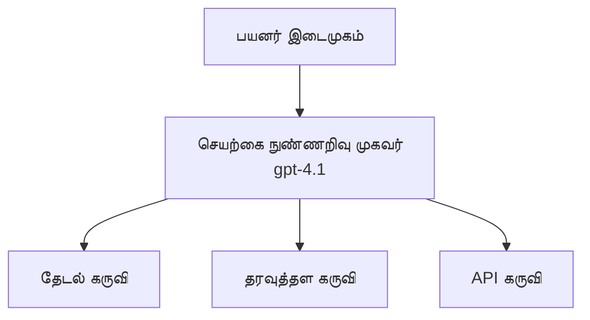
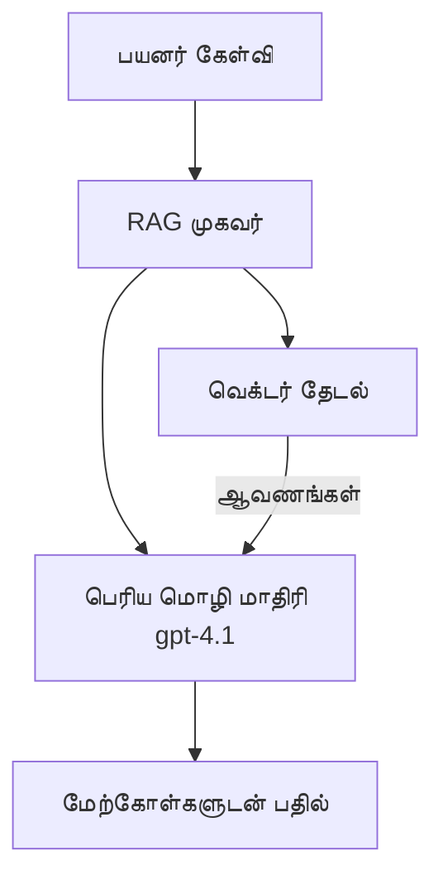
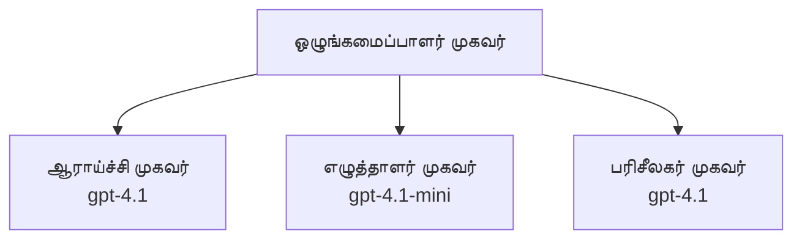

# Azure Developer CLI உடன் AI முகவர்கள்

**அத்தியாய வழிசெலுத்தல்:**
- **📚 பாடநூல் முகப்பு**: [AZD For Beginners](../../README.md)
- **📖 தற்போதைய அத்தியாயம்**: அத்தியாயம் 2 - AI-முதன்மை அபிவிருத்தி
- **⬅️ முந்தைய**: [Microsoft Foundry Integration](microsoft-foundry-integration.md)
- **➡️ அடுத்தது**: [AI Model Deployment](ai-model-deployment.md)
- **🚀 முன்னேற்றம்**: [Multi-Agent Solutions](../../examples/retail-scenario.md)

---

## அறிமுகம்

AI முகவர்கள் தன்னிச்சையான நிகழ்ச்சிகளை உணர்ந்து, முடிவுகள் எடுத்து, குறிப்பிட்ட இலக்குகளை அடைய நடவடிக்கைகள் எடுக்கும் தானியங்கி நிகழ்நிரல்களாகும். கேள்விகளுக்கு பதிலளிக்கும் எளிய அரட்டைச்சாட்‌بாட்களிடமிருந்து மாறுபட்டு, முகவர்கள் முடியும்:

- **கருவிகளை பயன்படுத்துதல்** - APIs களை அழைக்க, தரவுத்தளங்களில் தேட, குறியீட்டை இயக்க
- **திட்டமிடல் மற்றும் காரணமயமாக்கல்** - சிக்கலான பணிகளை படிகளில் பிரிக்க
- **உதவிக்குறிப்புகளில் இருந்து கற்றல்** - நினைவில் வைத்துக்கொண்டு நடத்தை தக்கவைத்தல்
- **ஒத்துழைப்பு** - மற்ற முகவர்களுடன் வேலை செய்ய (பன்முகவர் அமைப்புகள்)

இந்த வழிகாட்டி Azure Developer CLI (azd) ஐ பயன்படுத்தி Azure இல் AI முகவர்களை எவ்வாறு வேலைநிறுத்துவது என்பதை காட்டுகிறது.

## கற்றல் குறிக்கோள்கள்

இந்த வழிகாட்டியை முடித்தவுடன், நீங்கள்:
- AI முகவர்கள் என்னவென்று மற்றும் அவை அரட்டைச்சாட்‌بாட்களிடமிருந்து எப்படி வேறுபடுகிறன என்பதை புரிந்துகொள்வீர்கள்
- AZD பயன்படுத்தி முன்-உருவாக்கப்பட்ட AI முகவர் வார்ப்புருக்களை triển部署 செய்யக்கூடுகிறது
- தனிப்பயன் முகவர்களுக்காக Foundry Agents ஐ உபயோகிப்பதற்கு அமைக்கக்கூடுகிறது
- அடிப்படையான முகவர் முறைமைகளை (கருவி பயன்பாடு, RAG, பன்முகவர்) செயல்படுத்தக்கூடியீர்கள்
- வேலைநிறுத்தப்பட்ட முகவர்களை கண்காணித்து பிழைதிருத்தம் செய்யக்கூடியீர்கள்

## கற்றல் விளைவுகள்

முடித்தவுடன், நீங்கள் முடிந்திருக்கும்:
- ஒரே கட்டளையால் Azure இல் AI முகவர் செயலிகளை வெளியிட
- முகவர் கருவிகள் மற்றும் திறன்களை அமைக்க
- முகவர்களுடன் மீட்பு-பூர்த்தி உற்பத்தி (RAG) ஐ செயல்படுத்த
- சிக்கலான வேலைநிறைவை 위한 பன்முகவர் கட்டமைப்புகளை வடிவமைக்க
- பொதுவான முகவர் பதவிக்கான பிரச்சினைகளை தீர்க்க

---

## 🤖 முகவர் ஒரு அரட்டைச்சாட்‌بாட் உடனான வேனம் என்ன?

| அம்சம் | Chatbot | AI Agent |
|---------|---------|----------|
| **நடத்தை** | கேள்விகளுக்கு பதிலளிக்கிறது | சுயாதீன நடவடிக்கைகளை எடுக்கிறது |
| **கருவிகள்** | இல்லை | APIs ஐ அழைக்க, தேடுதல்கள் செய்ய, குறியீடு இயக்க முடியும் |
| **நினைவு** | செஷன் அடிப்படையே | செஷன்களுக்கு மத்தியில் நிலையான நினைவு |
| **திட்டமிடல்** | ஒரே பதில் | பல-படி காரணமயமுறவு |
| **ஒத்துழைப்பு** | தனி விவேகி | மற்ற முகவர்கள் உடன் வேலை செய்யக்கூடியது |

### எளிய ஒப்புமை

- **Chatbot** = தகவல் மேசையில் கேள்விகளுக்கு பதிலளிக்கும் உதவியாளராகும்
- **AI Agent** = கால் செய்ய, சந்திப்புகள் ஒதுக்க, மற்றும் உங்கள் சார்பாக பணிகளை முடிக்கக்கூடிய தனிப்பட்ட உதவியாளர்

---

## 🚀 சீக்கிர தொடக்கம்: உங்கள் முதல் முகவரியை வேலைநிறுத்துங்கள்

### விருப்பம் 1: Foundry Agents வார்ப்புரு (பரிந்துரைக்கப்படுகிறது)

```bash
# AI முகவர்கள் மாதிரியை ஆரம்பிக்கவும்
azd init --template get-started-with-ai-agents

# Azure-க்கு வெளியிடவும்
azd up
```

**என்னவை நிர்வகிக்கப்படுகின்றன:**
- ✅ Foundry Agents
- ✅ Microsoft Foundry Models (gpt-4.1)
- ✅ Azure AI Search (RAG க்காக)
- ✅ Azure Container Apps (வலை இடைமுகம்)
- ✅ Application Insights (கண்காணிப்பு)

**நேரம்:** ~15-20 நிமிடங்கள்
**செலவு:** ~$100-150/மாதம் (வளர்ச்சி)

### விருப்பம் 2: Prompty உடன் OpenAI முகவர்

```bash
# Prompty-அடிப்படையிலான முகவர் வார்ப்புருவை துவக்கவும்
azd init --template agent-openai-python-prompty

# Azure-க்கு வெளியிடவும்
azd up
```

**என்னவை நிர்வகிக்கப்படுகின்றன:**
- ✅ Azure Functions (சர்வர்-லெஸ் முகவர் இயக்கு)
- ✅ Microsoft Foundry Models
- ✅ Prompty தொடர்புடைய கோப்புகள்
- ✅ மாதிரியான முகவர் செயல்முறை

**நேரம்:** ~10-15 நிமிடங்கள்
**செலவு:** ~$50-100/மாதம் (வளர்ச்சி)

### விருப்பம் 3: RAG உரையாடல் முகவர்

```bash
# RAG உரையாடல் மாதிரியை துவக்கவும்
azd init --template azure-search-openai-demo

# Azure-க்கு வெளியிடவும்
azd up
```

**என்னவை நிர்வகிக்கப்படுகின்றன:**
- ✅ Microsoft Foundry Models
- ✅ மாதிரி தரவுடன் Azure AI Search
- ✅ ஆவண செயலாக்க குழாய்
- ✅ மேற்கோள்களுடன் உரையாடல் இடைமுகம்

**நேரம்:** ~15-25 நிமிடங்கள்
**செலவு:** ~$80-150/மாதம் (வளர்ச்சி)

### விருப்பம் 4: AZD AI Agent Init (மெனிபஸ்ட் அடிப்படையில்)

உங்களுக்கு முகவர் manifest கோப்பு இருந்தால், நீங்கள் `azd ai` கமாண்டைப் பயன்படுத்தி Foundry Agent Service திட்டத்தை நேரடியாக scaffold செய்யலாம்:

```bash
# AI முகவர்கள் விரிவாக்கத்தை நிறுவவும்
azd extension install azure.ai.agents

# ஒரு முகவர் மானிபெஸ்டிலிருந்து ஆரம்பிக்கவும்
azd ai agent init -m agent-manifest.yaml

# Azure-க்கு வெளியிடவும்
azd up
```

**எப்போது `azd ai agent init` vs `azd init --template` பயன்படுத்துவது:**

| முறைகள் | சிறந்தது | அது எப்படி செயல்படுகிறது |
|----------|----------|------|
| `azd init --template` | வேலை செய்யும் மாதிரி பயன்பாட்டிலிருந்து துவங்கும்போது | குறியீடு + கட்டமைப்புடன் முழு வார்ப்புரு ரெப்போவை கிளோன் செய்கிறது |
| `azd ai agent init -m` | உங்கள் சொந்த முகவர் manifest இல் இருந்து கட்டமைக்கும்போது | உங்கள் முகவர் வரையறையிலிருந்து திட்ட அமைப்பை scaffold செய்கிறது |

> **குறிப்பு:** கற்கும்போது `azd init --template` ஐப் பயன்படுத்தவும் (மேலுள்ள விருப்பங்கள் 1-3). உங்களது சொந்த manifests உடன் தயாரிப்பு முகவர்களை கட்டமைக்கும்போது `azd ai agent init` ஐப் பயன்படுத்தவும். முழு குறிப்ப/reference க்காக [AZD AI CLI Commands](../chapter-08-production/production-ai-practices.md#azd-ai-cli-commands-and-extensions) ஐப் பார்.

---

## 🏗️ முகவர் கட்டமைப்பு வடிவங்கள்

### மாதிரி 1: கருவிகளுடன் ஒரே முகவர்

எளிய முகவர் மாதிரி - பல கருவிகளை பயன்படுத்தக்கூடிய ஒரு முகவர்.


**சிறப்பாகப் பொருத்தம்:**
- வாடிக்கையாளர் ஆதரவு சாட்பாட்கள்
- ஆராய்ச்சி உதவியாளர்கள்
- தரவு பகுப்பாய்வு முகவர்கள்

**AZD வார்ப்புரு:** `azure-search-openai-demo`

### மாதிரி 2: RAG முகவர் (Retrieval-Augmented Generation)

முன்பு பொருத்தமான ஆவணங்களை மீட்டெடுத்து பின்னர் பதில்களை உருவாக்கும் முகவர்.


**சிறப்பாகப் பொருத்தம்:**
- நிறுவனர் அறிவுத்தளங்கள்
- ஆவண கேள்வி-பதில் அமைப்புகள்
- ஒழுங்குமுறை மற்றும் சட்ட ஆராய்ச்சி

**AZD வார்ப்புரு:** `azure-search-openai-demo`

### மாதிரி 3: பன்முகவர் அமைப்பு

சிக்கலான பணிகளுக்கு համագործையால் செயல்படும் பல சிறப்பு முகவர்கள்.


**சிறப்பாகப் பொருத்தம்:**
- சிக்கலான உள்ளடக்கம் உருவாக்குதல்
- பல-படி வேலைநிலைகள்
- வெவ்வேறு துறைக் கலைகளை தேவைப்படுத்தும் பணிகள்

**மேலும் அறிக:** [பன்முகவர் ஒத்துழைப்பு மாதிரிகள்](../chapter-06-pre-deployment/coordination-patterns.md)

---

## ⚙️ முகவர் கருவிகளை கட்டமைத்தல்

முகவர்கள் கருவிகளைப் பயன்படுத்தும் போது சக்திவாய்ந்தவையாக உருவாகின்றன. பொதுவான கருவிகளை எவ்வாறு கட்டமைப்பது என்பது இதோ:

### Foundry Agents இல் கருவி அமைப்பு

```python
# agent_config.py
from azure.ai.projects import AIProjectClient
from azure.ai.projects.models import FunctionTool, CodeInterpreterTool

# தனிப்பயன் கருவிகளை வரையறுக்கவும்
search_tool = FunctionTool(
    name="search_knowledge_base",
    description="Search the company knowledge base for relevant documents",
    parameters={
        "type": "object",
        "properties": {
            "query": {
                "type": "string",
                "description": "The search query"
            }
        },
        "required": ["query"]
    }
)

# கருவிகளுடன் ஏஜென்டை உருவாக்கவும்
agent = project_client.agents.create_agent(
    model="gpt-4.1",
    name="Support Agent",
    instructions="You are a helpful support agent. Use the search tool to find relevant information.",
    tools=[search_tool, CodeInterpreterTool()]
)
```

### சுற்றுப்புற அமைப்பு

```bash
# ஏஜென்டுக்கான சூழல் மாறிலிகளை அமைக்க
azd env set AZURE_OPENAI_MODEL "gpt-4.1"
azd env set AGENT_INSTRUCTIONS "You are a helpful assistant..."
azd env set ENABLE_CODE_INTERPRETER "true"
azd env set ENABLE_FILE_SEARCH "true"

# புதுப்பிக்கப்பட்ட கட்டமைப்புடன் நடைமுறைப்படுத்தவும்
azd deploy
```

---

## 📊 முகவர்களை கண்காணித்தல்

### Application Insights ஒருங்கிணைப்பு

அனைத்து AZD முகவர் வார்ப்புருக்கள் கண்காணிப்புக்காக Application Insights ஐ உள்ளடக்குகின்றன:

```bash
# கண்காணிப்பு டாஷ்போர்டை திறக்க
azd monitor --overview

# நேரடி பதிவுகளைப் பார்க்க
azd monitor --logs

# நேரடி அளவீடுகளைப் பார்க்க
azd monitor --live
```

### கண்காணிக்க வேண்டிய முக்கிய அளவைகள்

| அளவுகோல் | விளக்கம் | இலக்கு |
|--------|-------------|--------|
| பதில் தாமதம் | பதிலை உருவாக்க நேரம் | < 5 விநாடிகள் |
| டோக்கன் பயன்பாடு | each கோரிக்கைக்கு டோக்கன்கள் | செலவுக்காக கண்காணிக்கவும் |
| கருவி அழைப்பு வெற்றிகரத்தன்மை வீதம் | வெற்றிகரமான கருவி அமல்படுத்தல்களின் % | > 95% |
| பிழை விகிதம் | தவறான முகவர் கோரிக்கைகள் | < 1% |
| பயனர் திருப்தி | கருத்து மதிப்பீடுகள் | > 4.0/5.0 |

### முகவர்களுக்கான தனிப்பயன் பதிவு

```python
import os
from azure.monitor.opentelemetry import configure_azure_monitor
from opentelemetry import trace

# OpenTelemetry உடன் Azure Monitor ஐ கட்டமைக்கவும்
configure_azure_monitor(
    connection_string=os.environ["APPLICATIONINSIGHTS_CONNECTION_STRING"]
)

tracer = trace.get_tracer(__name__)

def log_agent_interaction(user_query, agent_response, tools_used, latency_ms):
    with tracer.start_as_current_span("agent_interaction") as span:
        span.set_attributes({
            "user_query": user_query,
            "response_length": len(agent_response),
            "tools_used": tools_used,
            "latency_ms": latency_ms
        })
```

> **குறிப்பு:** தேவையான பேக்கேஜுகளை நிறுவவும்: `pip install azure-monitor-opentelemetry opentelemetry`

---

## 💰 செலவு யோசனைகள்

### மாதந்தோறும் மாதிரிப்பட்ட செலவுகள்

| மாதிரி | டெவ் சுற்றுப்புறம் | தயாரிப்பு |
|---------|-----------------|------------|
| ஒரே முகவர் | $50-100 | $200-500 |
| RAG முகவர் | $80-150 | $300-800 |
| பன்முகவர் (2-3 முகவர்கள்) | $150-300 | $500-1,500 |
| நிறுவன பன்முகவர் | $300-500 | $1,500-5,000+ |

### செலவை குறைக்கும் குறிப்புகள்

1. **எளிய பணிகளுக்கு gpt-4.1-mini ஐ பயன்படுத்தவும்**
   ```bash
   azd env set AZURE_OPENAI_MODEL "gpt-4.1-mini"
   ```

2. **மீண்டும் வரும் கேள்விகளுக்கு கேசிங் செயல்படுத்தவும்**
   ```python
   from functools import lru_cache
   
   @lru_cache(maxsize=1000)
   def get_cached_response(query_hash):
       return agent.run(query_hash)
   ```

3. **ஒவ்வொரு இயக்கத்திற்கும் டோக்கன் வரம்புகளை அமைக்கவும்**
   ```python
   # ஏஜெண்ட் இயக்கும்போது max_completion_tokens ஐ அமைக்கவும், உருவாக்கும் போது அல்ல
   run = project_client.agents.create_run(
       thread_id=thread.id,
       agent_id=agent.id,
       max_completion_tokens=1000  # பதில் நீளத்தை வரையறுக்கவும்
   )
   ```

4. **பயன்பாட்டில் இல்லாதபோது அளவை சுழற்சி (scale to zero) செய்யவும்**
   ```bash
   # Container Apps தானாகச் குறைக்கப்பட்டு பூஜ்ஜியமாகும்
   azd env set MIN_REPLICAS "0"
   ```

---

## 🔧 முகவா் பிழைதிருத்தம்

### பொதுவான சிக்கல்கள் மற்றும் தீர்வுகள்

<details>
<summary><strong>❌ கருவி அழைப்புகளுக்கு முகவர் பதிலளிக்கவில்லை</strong></summary>

```bash
# கருவிகள் சரியாக பதிவு செய்யப்பட்டுள்ளதா என்பதை சரிபார்க்கவும்
azd show

# OpenAI வினியோகத்தைச் சரிபார்க்கவும்
az cognitiveservices account deployment list \
  --name $AZURE_OPENAI_NAME \
  --resource-group $RG_NAME

# ஏஜென்ட் பதிவுகளைச் சரிபார்க்கவும்
azd monitor --logs
```

**பொதுவான காரணங்கள்:**
- கருவி செயல்பாட்டு கையொப்பம் பொருந்தவில்லை
- தேவையான அனுமதிகள் காணாமல் போனது
- API endpoint அணுகமுடியவில்லை
</details>

<details>
<summary><strong>❌ முகவர் பதில்களில் உயர்ந்த தாமதம்</strong></summary>

```bash
# முடுக்கல்கள் இருப்பதைக் கண்டறிய Application Insights ஐ சரிபார்க்கவும்
azd monitor --live

# வேகமான மாதிரியைப் பயன்படுத்துவது பற்றி பரிசீலனை செய்யவும்
azd env set AZURE_OPENAI_MODEL "gpt-4.1-mini"
azd deploy
```

**முன்னேற்றக்குறுப்புகள்:**
- ஸ்ட்ரீமிங் பதில்களைப் பயன்படுத்தவும்
- பதில் கேசிங்கை செயல்படுத்தவும்
- சூழல் விண்டோ அளவை குறைக்கவும்
</details>

<details>
<summary><strong>❌ முகவர் தவறான அல்லது உணர்வு சார்ந்த (hallucinated) தகவலை ஒருங்கிணைக்கிறது</strong></summary>

```python
# சிறந்த சிஸ்டம் பிராம்ப்ட்களுடன் மேம்படுத்தவும்
instructions = """
You are a helpful assistant. IMPORTANT:
- Only answer based on provided context
- If you don't know, say "I don't know"
- Always cite your sources
- Never make up information
"""

# அடிப்படையாக்குவதற்காக மீட்டெடுப்பைச் சேர்க்கவும்
agent = project_client.agents.create_agent(
    model="gpt-4.1",
    instructions=instructions,
    tools=[FileSearchTool()]  # பதில்களை ஆவணங்களில் அடிப்படையாக்கவும்
)
```
</details>

<details>
<summary><strong>❌ டோக்கன் வரம்பு எட்டியதற்கு பிழைகள்</strong></summary>

```python
# சூழ்நிலை ஜன்னல் மேலாண்மையை செயல்படுத்தவும்
def truncate_context(messages, max_tokens=8000, model="gpt-4.1"):
    """Keep only recent messages within token limit."""
    import tiktoken
    encoding = tiktoken.encoding_for_model(model)
    total_tokens = 0
    truncated = []
    
    for msg in reversed(messages):
        msg_tokens = len(encoding.encode(msg.content))
        if total_tokens + msg_tokens > max_tokens:
            break
        truncated.insert(0, msg)
        total_tokens += msg_tokens
    
    return truncated
```
</details>

---

## 🎓 கையடக்க பயிற்சிகள்

### பயிற்சி 1: அடிப்படை முகவரியை வெளியிடவும் (20 நிமிடங்கள்)

**இலக்கு:** AZD பயன்படுத்தி உங்கள் முதல் AI முகவரியை வெளியிடவும்

```bash
# படி 1: மாதிரியை ஆரம்பிக்கவும்
azd init --template get-started-with-ai-agents

# படி 2: Azure-ல் உள்நுழைக
azd auth login

# படி 3: செயலியை வினியோகிக்கவும்
azd up

# படி 4: ஏஜென்டை சோதிக்கவும்
# வினியோகத்துக்குப் பிறகு எதிர்பார்க்கப்படும் வெளியீடு:
#   பயன்படுத்துதல் முடிந்தது!
#   இணைப்பு: https://<app-name>.<region>.azurecontainerapps.io
# வெளியீட்டில் காட்டப்படும் URL-ஐ திறந்து ஒரு கேள்வி கேட்க முயற்சிக்கவும்

# படி 5: கண்காணிப்பை பார்வையிடவும்
azd monitor --overview

# படி 6: சுத்தப்படுத்தவும்
azd down --force --purge
```

**வெற்றி அளவுக்குறிகள்:**
- [ ] முகவர் கேள்விகளுக்கு பதிலளிக்கிறது
- [ ] `azd monitor` மூலம் கண்காணிப்பு டாஷ்போர்ட்டை அணுக முடிகிறது
- [ ] வளங்கள் வெற்றிகரமாக சுத்தம் செய்யப்பட்டன

### பயிற்சி 2: தனிப்பயன் கருவி சேர்க்க (30 நிமிடங்கள்)

**இலக்கு:** தனிப்பயன் கருவியுடன் ஒரு முகவரையை விரிவுபடுத்தவும்

1. Deploy the agent template:
   ```bash
   azd init --template get-started-with-ai-agents
   azd up
   ```
2. Create a new tool function in your agent code:
   ```python
   def get_weather(location: str) -> str:
       """Get current weather for a location."""
       # வானிலை சேவைக்கு API அழைப்பு
       return f"Weather in {location}: Sunny, 72°F"
   ```
3. Register the tool with the agent:
   ```python
   from azure.ai.projects.models import FunctionTool

   weather_tool = FunctionTool(
       name="get_weather",
       description="Get current weather for a location",
       parameters={
           "type": "object",
           "properties": {
               "location": {"type": "string", "description": "City name"}
           },
           "required": ["location"]
       }
   )

   agent = project_client.agents.create_agent(
       model="gpt-4.1",
       name="Weather Agent",
       tools=[weather_tool]
   )
   ```
4. Redeploy and test:
   ```bash
   azd deploy
   # கேள்வி: "சியாட்டிலில் வானிலை எப்படி இருக்கிறது?"
   # எதிர்பார்ப்பு: ஏஜென்ட் get_weather("Seattle") ஐ அழைத்து வானிலை தகவலை திருப்பி வழங்குகிறது
   ```

**வெற்றி அளவுக்குறிகள்:**
- [ ] முகவர் வானிலை தொடர்புடைய கேள்விகளை அறிகிறது
- [ ] கருவி சரியாக அழைக்கப்படுகிறது
- [ ] பதில் வானிலை தகவலைக் கொண்டுள்ளது

### பயிற்சி 3: RAG முகவரியை கட்டமைக்க (45 நிமிடங்கள்)

**இலக்கு:** உங்கள் ஆவணங்களில் இருந்து கேள்விகளுக்கு பதிலளிக்கும் ஒரு முகவரியை உருவாக்கவும்

```bash
# படி 1: RAG வார்ப்புருவை அமல்படுத்தவும்
azd init --template azure-search-openai-demo
azd up

# படி 2: உங்கள் ஆவணங்களை பதிவேற்றவும்
# PDF/TXT கோப்புகளை data/ கோப்புறையில் வைக்கவும், பின்னர் இயக்கவும்:
python scripts/prepdocs.py

# படி 3: குறிப்பிட்ட துறை தொடர்பான கேள்விகளுடன் சோதிக்கவும்
# azd up output-இல் இருந்து வலை செயலியின் URL-ஐ திறக்கவும்
# பதிவேற்றிய ஆவணங்களைப் பற்றிய கேள்விகள் கேட்கவும்
# பதில்களில் [doc.pdf] போன்ற மேற்கோள் குறிப்புகள் இருக்க வேண்டும்
```

**வெற்றி அளவுக்குறிகள்:**
- [ ] பதிவேற்றப்பட்ட ஆவணங்களிலிருந்து முகவர் பதிலளிக்கிறது
- [ ] பதில்கள் மேற்கோள்களை உள்ளடக்குகின்றன
- [ ] வெளிச்சமற்ற கேள்விகளுக்கு மனவிழிப்பான தகவல் இல்லை

---

## 📚 அடுத்த படிகள்

இப்போது நீங்கள் AI முகவர்கள் பற்றி புரிந்துவிட்டீர்கள், இந்த மேம்பட்ட தலைப்புகளை ஆராயுங்கள்:

| கருப்பொருள் | விளக்கம் | இணைப்பு |
|-------|-------------|------|
| **பன்முகவர் அமைப்புகள்** | பல முகவர்கள் இணைந்து வேலை செய்யும் அமைப்புகளை கட்டமைக்கவும் | [Retail Multi-Agent Example](../../examples/retail-scenario.md) |
| **ஒத்துழைப்பு மாதிரிகள்** | ஒருங்கிணைப்பு மற்றும் தொடர்பு மாதிரிகளை கற்றுக்கொள்ளுங்கள் | [Coordination Patterns](../chapter-06-pre-deployment/coordination-patterns.md) |
| **தயாரிப்பு வெளியீடு** | நிறுவனத்திற்குத் தயாரான முகவர் வெளியீடு | [Production AI Practices](../chapter-08-production/production-ai-practices.md) |
| **முகவர் மதிப்பீடு** | முகவர் செயல்திறனை சோதித்து மதிப்பீடு செய்யுங்கள் | [AI Troubleshooting](../chapter-07-troubleshooting/ai-troubleshooting.md) |
| **AI பயிற்சி அமர்வு** | கைமுறை: உங்கள் AI தீர்வை AZD-க்கு தயார் செய்யுங்கள் | [AI Workshop Lab](ai-workshop-lab.md) |

---

## 📖 கூடுதல் வளங்கள்

### அதிகாரப்பூர்வ ஆவணங்கள்
- [Azure AI Agent Service](https://learn.microsoft.com/azure/ai-services/agents/)
- [Azure AI Foundry Agent Service Quickstart](https://learn.microsoft.com/azure/ai-services/agents/quickstart)
- [Semantic Kernel Agent Framework](https://learn.microsoft.com/semantic-kernel/)

### முகவர்களுக்கான AZD வார்ப்புருக்கள்
- [Get Started with AI Agents](https://github.com/Azure-Samples/get-started-with-ai-agents)
- [Agent OpenAI Python Prompty](https://github.com/Azure-Samples/agent-openai-python-prompty)
- [Azure Search OpenAI Demo](https://github.com/Azure-Samples/azure-search-openai-demo)

### சமூக வளங்கள்
- [Awesome AZD - Agent Templates](https://azure.github.io/awesome-azd/?tags=ai-agents)
- [Azure AI Discord](https://discord.gg/microsoft-azure)
- [Microsoft Foundry Discord](https://discord.gg/nTYy5BXMWG)

### உங்கள் எடிட்டருக்கான முகவர் திறன்கள்
- [**Microsoft Azure Agent Skills**](https://skills.sh/microsoft/github-copilot-for-azure) - GitHub Copilot, Cursor அல்லது எந்த ஆதரவை பெற்ற முகவரிலும் Azure மேம்பாட்டிற்கான மீண்டும் பயன்படுத்தக்கூடிய AI முகவர் திறன்களை நிறுவுங்கள். இதில் [Azure AI](https://skills.sh/microsoft/github-copilot-for-azure/azure-ai), [Microsoft Foundry](https://skills.sh/microsoft/github-copilot-for-azure/microsoft-foundry), [deployment](https://skills.sh/microsoft/github-copilot-for-azure/azure-deploy), மற்றும் [diagnostics](https://skills.sh/microsoft/github-copilot-for-azure/azure-diagnostics) க்கான திறன்கள் அடங்கும்:
  ```bash
  npx skills add microsoft/github-copilot-for-azure
  ```

---

**வழிசெலுத்தல்**
- **முந்தைய பாடம்**: [Microsoft Foundry Integration](microsoft-foundry-integration.md)
- **அடுத்த பாடம்**: [AI Model Deployment](ai-model-deployment.md)

---

<!-- CO-OP TRANSLATOR DISCLAIMER START -->
மறுப்பு:
இந்த ஆவணம் AI மொழிபெயர்ப்பு சேவையான [Co-op Translator](https://github.com/Azure/co-op-translator) மூலம் மொழிபெயர்க்கப்பட்டுள்ளது. நாங்கள் துல்லியத்திற்காக முயற்சித்தாலும், தானாகச் செய்யப்படும் மொழிபெயர்ப்புகளில் தவறுகள் அல்லது துல்லியக்குறைவுகள் இருக்கக்கூடும் என்பதை தயவுசெய்து கவனிக்கவும். மூல ஆவணம் அதன் தாய்மொழியில் உள்ள பதிப்பே அதிகாரப்பூர்வமானதாகக் கருதப்பட வேண்டும். முக்கியமான தகவல்களுக்கு, தொழில்முறை மனித மொழிபெயர்ப்பை பெற பரிந்துரைக்கப்படுகிறது. இந்த மொழிபெயர்ப்பு பயன்பாட்டினால் ஏற்படும் எந்த தவறான புரிதல்களுக்கும் அல்லது தவறான விளக்கங்களுக்கும் நாங்கள் பொறுப்பு ஏற்கமாட்டோம்.
<!-- CO-OP TRANSLATOR DISCLAIMER END -->