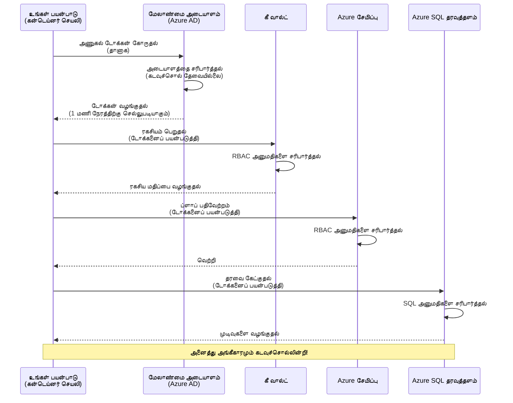
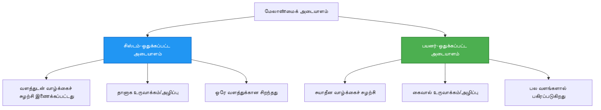

# அடையாளம் உறுதிப்படுத்தல் மாதிரிகள் மற்றும் நிர்வகிக்கப்பட்ட அடையாளம்

⏱️ **கணிக்கப்பட்ட நேரம்**: 45-60 நிமிடங்கள் | 💰 **செலவு தாக்கம்**: இலவசம் (கூடுதல் கட்டணங்கள் இல்லை) | ⭐ **சிக்கல்தன்மை**: நடுத்தர

**📚 கற்றல் பாதை:**
- ← முந்தையது: [அமைவு மேலாண்மை](configuration.md) - சூழல் மாறிகள் மற்றும் ரகசியங்களை நிர்வகித்தல்
- 🎯 **நீங்கள் இங்கே இருக்கிறீர்கள்**: அடையாளம் உறுதிப்படுத்தல் மற்றும் பாதுகாப்பு (நிர்வகிக்கப்பட்ட அடையாளம், Key Vault, பாதுகாப்பான மாதிரிகள்)
- → அடுத்தது: [முதல் திட்டம்](first-project.md) - உங்கள் முதல் AZD பயன்பாட்டை உருவாக்கு
- 🏠 [பாடநெறி முகப்பு](../../README.md)

---

## நீங்கள் கற்றுக்கொள்ளப்போகும் விஷயங்கள்

இந்த பாடத்தை முடித்தவுடன், நீங்கள்:
- Azure அடையாளம் உறுதிப்படுத்தல் மாதிரிகளை (கீகள், இணைப்பு ஸ்ட்ரிங்கள், நிர்வகிக்கப்பட்ட அடையாளம்) புரிந்துகொள்வீர்கள்
- கடவுச்சொல்லில்லா உறுதிப்படுத்தலுக்காக **நிர்வகிக்கப்பட்ட அடையாளம்** அமல்படுத்துவீர்கள்
- **Azure Key Vault** ஒருங்கிணைப்புடன் ரகசியங்களை பாதுகாப்பீர்கள்
- AZD அமர்த்தல்களுக்கு **பங்கு அடிப்படையிலான அணுகல் கட்டுப்பாடு (RBAC)** அமைப்பீர்கள்
- Container Apps மற்றும் Azure சேவைகளில் பாதுகாப்பு சிறந்த நடைமுறைகளைப் பொருந்தப்படுத்துவீர்கள்
- கீ அடிப்படையிலிருந்து அடையாளம் அடிப்படையிலான உறுதிப்படுத்தலுக்கு இடமாற்றம் செய்யலாம்

## நிர்வகிக்கப்பட்ட அடையாளம் ஏன் முக்கியம்

### பிரச்சனை: பாரம்பரிய அடையாளம் உறுதிப்படுத்தல்

**நிர்வகிக்கப்பட்ட அடையாளத்திற்கு முன்:**
```javascript
// ❌ பாதுகாப்பு அபாயம்: கோடிலேயே நேரடியாக நிலைநிறுத்தப்பட்ட ரகசியங்கள்
const connectionString = "Server=mydb.database.windows.net;User=admin;Password=P@ssw0rd123";
const storageKey = "xK7mN9pQ2wR5tY8uI0oP3aS6dF1gH4jK...";
const cosmosKey = "C2x7B9n4M1p8Q5w3E6r0T2y5U8i1O4p7...";
```

**பிரச்சனைகள்:**
- 🔴 **வெளிப்பட்ட ரகசியங்கள்** குறியீட்டிலும், கான்ஃபிகு கோப்புகளிலும், சூழல் மாறிலிகளிலும்
- 🔴 **அங்கீகார சுழற்சி** குறியீட்டு மாற்றங்களையும் மீண்டும் வெளியிடலையும் தேவையாக்கும்
- 🔴 **ஆடிட் சிக்கல்கள்** - யார் எதை எப்போது அணுகினார்கள்?
- 🔴 **பரவல்** - ரகசியங்கள் பல அமைப்புகளில் பரவியுள்ளன
- 🔴 **கம்ப்ளையன்ஸ் ஆபத்துகள்** - பாதுகாப்பு ஆய்வுகளை பூர்த்தி செய்ய முடியாமல் இருக்கும்

### தீர்வு: நிர்வகிக்கப்பட்ட அடையாளம்

**நிர்வகிக்கப்பட்ட அடையாளத்தை பயன்படுத்திய பிறகு:**
```javascript
// ✅ பாதுகாப்பு: குறியீட்டில் எந்த ரகசியங்களும் இல்லை
const credential = new DefaultAzureCredential();
const client = new BlobServiceClient(
  "https://mystorageaccount.blob.core.windows.net",
  credential  // Azure தானாக அங்கீகாரத்தை கையாளுகிறது
);
```

**நன்மைகள்:**
- ✅ **ஒரு ரகசியமும் இல்லை** குறியீட்டிலும் அல்லது அமைப்பிலும்
- ✅ **தானியங்கி சுழற்சி** - Azure இதை நிர்வகிக்கிறது
- ✅ **முழு ஆடிட் தடம்** Azure AD பதிவுகளில்
- ✅ **ஒருங்கிணைந்த பாதுகாப்பு** - Azure போர்டலில் நிர்வகிக்கலாம்
- ✅ **கம்ப்ளையன்ஸ்-அனுகூலமாக உள்ளது** - பாதுகாப்பு தரநிலைகளை பூர்த்தி செய்கிறது

**உதாரணம்**: பாரம்பரிய அடையாளம் உறுதிப்படுத்தல் என்பது பல்வேறு கதவுகளுக்காக பல உடல் சாவிகளை எடுத்துச் செல்லுவது போல. நிர்வகிக்கப்பட்ட அடையாளம் என்பது நீங்கள் யார் என்பதைக் கொண்டு தானாகவே அணுகலை வழங்கும் பாதுகாப்பு அடையாளபத்திரம் போலும் — சாவிகளை இழக்க, நகலெடுக்க அல்லது சுழற்ற தேவையில்லை.

---

## கட்டமைப்பு கண்ணோட்டம்

### நிர்வகிக்கப்பட்ட அடையாளத்துடன் அடையாளம் உறுதிப்படுத்தல் ஓட்டம்


### நிர்வகிக்கப்பட்ட அடையாளங்களின் வகைகள்


| அம்சம் | சிஸ்டம்-ஒதுக்கப்பட்ட | பயனர்-ஒதுக்கப்பட்ட |
|---------|----------------|---------------|
| **வாழ்நாள்** | வளத்திற்கு பிணைக்கப்பட்டுள்ளது | தனித்துவமானது |
| **உருவாக்கம்** | வளத்துடன் தானாக | கைமுறை உருவாக்கம் |
| **நீக்குதல்** | வளத்துடன் நீக்கப்படுகிறது | வளம் நீக்கப்பட்டபின்னரும் நிலைத்து நிற்கும் |
| **பகிர்வு** | ஒரே வளத்திற்கே | பல வளங்களுக்கு |
| **பயன்பாட்டு வழக்கம்** | எளிய பயன்பாட்டு केस்கள் | பல வளங்களை உள்ளடக்கிய சிக்கலான பயன்பாடுகள் |
| **AZD இயல்பு** | ✅ பரிந்துரைக்கப்பட்டது | விருப்பமானது |

---

## முன் நிபந்தனைகள்

### தேவையான கருவிகள்

கடந்த பாடங்களிலிருந்து இவற்றை ஏற்கனவே நிறுவி வைத்திருக்க வேண்டும்:

```bash
# Azure Developer CLI ஐ சரிபார்க்கவும்
azd version
# ✅ எதிர்பார்க்கப்படும்: azd பதிப்பு 1.0.0 அல்லது அதற்கு மேல்

# Azure CLI ஐ சரிபார்க்கவும்
az --version
# ✅ எதிர்பார்க்கப்படும்: azure-cli 2.50.0 அல்லது அதற்கு மேல்
```

### Azure தேவைகள்

- செயலில் உள்ள Azure சந்தா
- அனுமதிகள்:
  - நிர்வகிக்கப்பட்ட அடையாளங்களை உருவாக்க
  - RBAC பங்குகளை ஒதுக்க
  - Key Vault வளங்களை உருவாக்க
  - Container Apps ஐ அமர்த்த

### அறிவுப் முன் நிபந்தனைகள்

நீங்கள் முடித்திருக்க வேண்டும்:
- [நிறுவல் கையேடு](installation.md) - AZD அமைப்பு
- [AZD அடிப்படைகள்](azd-basics.md) - முக்கிய கருத்துக்கள்
- [அமைவு மேலாண்மை](configuration.md) - சூழல் மாறில்கள்

---

## பாடம் 1: அடையாளம் உறுதிப்படுத்தல் மாதிரிகளை புரிந்துகொள்ளுதல்

### மாதிரி 1: இணைப்பு ஸ்ட்ரிங்கள் (பழைய முறை - தவிர்க்கவும்)

**எப்படி செயல்படுகிறது:**
```bash
# இணைப்பு சரம் அங்கீகார விவரங்களை கொண்டுள்ளது.
STORAGE_CONNECTION_STRING="DefaultEndpointsProtocol=https;AccountName=myaccount;AccountKey=xK7mN9pQ2wR5..."
COSMOS_CONNECTION_STRING="AccountEndpoint=https://myaccount.documents.azure.com:443/;AccountKey=C2x7..."
SQL_CONNECTION_STRING="Server=myserver.database.windows.net;User=admin;Password=P@ssw0rd..."
```

**பிரச்சனைகள்:**
- ❌ ரகசியங்கள் சூழல் மாறில்களில் வெளிப்படையாக இருக்கும்
- ❌ அமர்த்தல் அமைப்புகளில் பதிவாகும்
- ❌ சுழற்சி செய்வது கடினம்
- ❌ அணுகலுக்கு ஆடிட் தடம் இல்லை

**எப்போது பயன்படுத்த வேண்டும்:** உள்ளூர் வளர்ச்சிக்காக மட்டும், ஒருபோதும் உற்பத்திக்கு அல்ல.

---

### மாதிரி 2: Key Vault குறிப்புகள் (மேலும் நல்லது)

**இது எப்படி வேலை செய்கிறது:**
```bicep
// Store secret in Key Vault
resource keyVault 'Microsoft.KeyVault/vaults@2023-02-01' = {
  name: 'mykv'
  properties: {
    enableRbacAuthorization: true
  }
}

// Reference in Container App
env: [
  {
    name: 'STORAGE_KEY'
    secretRef: 'storage-key'  // References Key Vault
  }
]
```

**நன்மைகள்:**
- ✅ ரகசியங்கள் Key Vault இல் பாதுகாப்பாக சேமிக்கப்படுகின்றன
- ✅ ஒருங்கிணைக்கப்பட்ட ரகசிய மேலாண்மை
- ✅ குறியீடு மாற்றமின்றி சுழற்சி

**குறைபாடுகள்:**
- ⚠️ இன்னும் கீ/கடவுச்சொற்களை பயன்படுத்துகிறது
- ⚠️ Key Vault அணுகலை நிர்வகிக்க வேண்டும்

**எப்போது பயன்படுத்த வேண்டும்:** இணைப்பு ஸ்ட்ரிங்களிலிருந்து நிர்வகிக்கப்பட்ட அடையாளத்திற்கு மாறும் இடைநிலை.

---

### மாதிரி 3: நிர்வகிக்கப்பட்ட அடையாளம் (சிறந்த நடைமுறை)

**இது எப்படி வேலை செய்கிறது:**
```bicep
// Enable managed identity
resource containerApp 'Microsoft.App/containerApps@2023-05-01' = {
  name: 'myapp'
  identity: {
    type: 'SystemAssigned'  // Automatically creates identity
  }
}

// Grant permissions
resource roleAssignment 'Microsoft.Authorization/roleAssignments@2022-04-01' = {
  scope: storageAccount
  properties: {
    roleDefinitionId: storageBlobDataContributorRole
    principalId: containerApp.identity.principalId
  }
}
```

**பயன்பாட்டு குறியீடு:**
```javascript
// ரகசியங்கள் தேவையில்லை!
const { DefaultAzureCredential } = require('@azure/identity');
const { BlobServiceClient } = require('@azure/storage-blob');

const credential = new DefaultAzureCredential();
const blobServiceClient = new BlobServiceClient(
  'https://mystorageaccount.blob.core.windows.net',
  credential
);
```

**நன்மைகள்:**
- ✅ குறியீடு/கட்டமைப்பில் எந்த ரகசியமும் இல்லை
- ✅ தானியங்கி அங்கீகார சுழற்சி
- ✅ முழுமையான ஆடிட் தடம்
- ✅ RBAC அடிப்படையிலான அனுமதிகள்
- ✅ கம்ப்ளையன்ஸ்-அனுகூலமாக உள்ளது

**எப்போது பயன்படுத்த வேண்டும்:** எப்போதும், உற்பத்தி பயன்பாடுகளுக்கு.

---

## பாடம் 2: AZD உடன் நிர்வகிக்கப்பட்ட அடையாளத்தை செயல்படுத்தல்

### படிச் படியாக செயல்படுத்தல்

Azure Storage மற்றும் Key Vault அணுக நிர்வகிக்கப்பட்ட அடையாளத்தை பயன்படுத்தும் பாதுகாப்பான Container App ஒன்றை உருவாக்குவோம்.

### திட்ட அமைப்பு

```
secure-app/
├── azure.yaml                 # AZD configuration
├── infra/
│   ├── main.bicep            # Main infrastructure
│   ├── core/
│   │   ├── identity.bicep    # Managed identity setup
│   │   ├── keyvault.bicep    # Key Vault configuration
│   │   └── storage.bicep     # Storage with RBAC
│   └── app/
│       └── container-app.bicep
└── src/
    ├── app.js                # Application code
    ├── package.json
    └── Dockerfile
```

### 1. AZD அமைக்கவும் (azure.yaml)

```yaml
name: secure-app
metadata:
  template: secure-app@1.0.0

services:
  api:
    project: ./src
    language: js
    host: containerapp

# Enable managed identity (AZD handles this automatically)
```

### 2. அமைப்பு: நிர்வகிக்கப்பட்ட அடையாளத்தை இயக்கவும்

**கோப்பு: `infra/main.bicep`**

```bicep
targetScope = 'subscription'

param environmentName string
param location string = 'eastus'

var tags = { 'azd-env-name': environmentName }

// Resource group
resource rg 'Microsoft.Resources/resourceGroups@2021-04-01' = {
  name: 'rg-${environmentName}'
  location: location
  tags: tags
}

// Storage Account
module storage './core/storage.bicep' = {
  name: 'storage'
  scope: rg
  params: {
    name: 'st${uniqueString(rg.id)}'
    location: location
    tags: tags
  }
}

// Key Vault
module keyVault './core/keyvault.bicep' = {
  name: 'keyvault'
  scope: rg
  params: {
    name: 'kv-${uniqueString(rg.id)}'
    location: location
    tags: tags
  }
}

// Container App with Managed Identity
module containerApp './app/container-app.bicep' = {
  name: 'container-app'
  scope: rg
  params: {
    name: 'ca-${environmentName}'
    location: location
    tags: tags
    storageAccountName: storage.outputs.name
    keyVaultName: keyVault.outputs.name
  }
}

// Grant Container App access to Storage
module storageRoleAssignment './core/role-assignment.bicep' = {
  name: 'storage-role'
  scope: rg
  params: {
    principalId: containerApp.outputs.identityPrincipalId
    roleDefinitionId: 'ba92f5b4-2d11-453d-a403-e96b0029c9fe'  // Storage Blob Data Contributor
    targetResourceId: storage.outputs.id
  }
}

// Grant Container App access to Key Vault
module kvRoleAssignment './core/role-assignment.bicep' = {
  name: 'kv-role'
  scope: rg
  params: {
    principalId: containerApp.outputs.identityPrincipalId
    roleDefinitionId: '4633458b-17de-408a-b874-0445c86b69e6'  // Key Vault Secrets User
    targetResourceId: keyVault.outputs.id
  }
}

// Outputs
output AZURE_STORAGE_ACCOUNT_NAME string = storage.outputs.name
output AZURE_KEY_VAULT_NAME string = keyVault.outputs.name
output APP_URL string = containerApp.outputs.url
```

### 3. சிஸ்டம்-ஒதுக்கப்பட்ட அடையாளத்துடன் Container App

**கோப்பு: `infra/app/container-app.bicep`**

```bicep
param name string
param location string
param tags object = {}
param storageAccountName string
param keyVaultName string

resource containerApp 'Microsoft.App/containerApps@2023-05-01' = {
  name: name
  location: location
  tags: tags
  identity: {
    type: 'SystemAssigned'  // 🔑 Enable managed identity
  }
  properties: {
    configuration: {
      ingress: {
        external: true
        targetPort: 3000
      }
    }
    template: {
      containers: [
        {
          name: 'api'
          image: 'myregistry.azurecr.io/api:latest'
          resources: {
            cpu: json('0.5')
            memory: '1Gi'
          }
          env: [
            {
              name: 'AZURE_STORAGE_ACCOUNT_NAME'
              value: storageAccountName
            }
            {
              name: 'AZURE_KEY_VAULT_NAME'
              value: keyVaultName
            }
            // 🔑 No secrets - managed identity handles authentication!
          ]
        }
      ]
    }
  }
}

// Output the identity for RBAC assignments
output identityPrincipalId string = containerApp.identity.principalId
output id string = containerApp.id
output url string = 'https://${containerApp.properties.configuration.ingress.fqdn}'
```

### 4. RBAC பங்கு ஒதுக்கல் தொகுதி

**கோப்பு: `infra/core/role-assignment.bicep`**

```bicep
param principalId string
param roleDefinitionId string  // Azure built-in role ID
param targetResourceId string

resource roleAssignment 'Microsoft.Authorization/roleAssignments@2022-04-01' = {
  name: guid(principalId, roleDefinitionId, targetResourceId)
  scope: resourceId('Microsoft.Resources/resourceGroups', resourceGroup().name)
  properties: {
    roleDefinitionId: subscriptionResourceId('Microsoft.Authorization/roleDefinitions', roleDefinitionId)
    principalId: principalId
    principalType: 'ServicePrincipal'
  }
}

output id string = roleAssignment.id
```

### 5. நிர்வகிக்கப்பட்ட அடையாளத்துடன் பயன்பாட்டு குறியீடு

**கோப்பு: `src/app.js`**

```javascript
const express = require('express');
const { DefaultAzureCredential } = require('@azure/identity');
const { BlobServiceClient } = require('@azure/storage-blob');
const { SecretClient } = require('@azure/keyvault-secrets');

const app = express();
const PORT = process.env.PORT || 3000;

// 🔑 அங்கீகாரத்தைத் தொடங்கவும் (நிர்வகிக்கப்பட்ட அடையாளத்துடன் தானாகவே செயல்படுகிறது)
const credential = new DefaultAzureCredential();

// Azure சேமிப்பு அமைப்பு
const storageAccountName = process.env.AZURE_STORAGE_ACCOUNT_NAME;
const blobServiceClient = new BlobServiceClient(
  `https://${storageAccountName}.blob.core.windows.net`,
  credential  // சாவிகள் தேவையில்லை!
);

// Key Vault அமைப்பு
const keyVaultName = process.env.AZURE_KEY_VAULT_NAME;
const secretClient = new SecretClient(
  `https://${keyVaultName}.vault.azure.net`,
  credential  // சாவிகள் தேவையில்லை!
);

// நிலைச் சோதனை
app.get('/health', (req, res) => {
  res.json({ status: 'healthy', authentication: 'managed-identity' });
});

// Blob சேமிப்பிற்கு கோப்பை பதிவேற்றவும்
app.post('/upload', async (req, res) => {
  try {
    const containerClient = blobServiceClient.getContainerClient('uploads');
    await containerClient.createIfNotExists();
    
    const blobName = `file-${Date.now()}.txt`;
    const blockBlobClient = containerClient.getBlockBlobClient(blobName);
    
    await blockBlobClient.upload('Hello from managed identity!', 30);
    
    res.json({
      success: true,
      blobName: blobName,
      message: 'File uploaded using managed identity!'
    });
  } catch (error) {
    console.error('Upload error:', error);
    res.status(500).json({ error: error.message });
  }
});

// Key Vault-இலிருந்து ரகசியத்தைப் பெறவும்
app.get('/secret/:name', async (req, res) => {
  try {
    const secretName = req.params.name;
    const secret = await secretClient.getSecret(secretName);
    
    res.json({
      name: secretName,
      value: secret.value,
      message: 'Secret retrieved using managed identity!'
    });
  } catch (error) {
    console.error('Secret error:', error);
    res.status(500).json({ error: error.message });
  }
});

// Blob கண்டெய்னர்களை பட்டியலிடவும் (படித்தல் அணுகலைக் காட்டுகிறது)
app.get('/containers', async (req, res) => {
  try {
    const containers = [];
    for await (const container of blobServiceClient.listContainers()) {
      containers.push(container.name);
    }
    
    res.json({
      containers: containers,
      count: containers.length,
      message: 'Containers listed using managed identity!'
    });
  } catch (error) {
    console.error('List error:', error);
    res.status(500).json({ error: error.message });
  }
});

app.listen(PORT, () => {
  console.log(`Secure API listening on port ${PORT}`);
  console.log('Authentication: Managed Identity (passwordless)');
});
```

**கோப்பு: `src/package.json`**

```json
{
  "name": "secure-app",
  "version": "1.0.0",
  "dependencies": {
    "express": "^4.18.2",
    "@azure/identity": "^4.0.0",
    "@azure/storage-blob": "^12.17.0",
    "@azure/keyvault-secrets": "^4.7.0"
  },
  "scripts": {
    "start": "node app.js"
  }
}
```

### 6. இடமாற்றம் மற்றும் சோதனை

```bash
# AZD சூழலை ஆரம்பிக்கவும்
azd init

# மூலவசதிகளையும் பயன்பாட்டையும் நிறுவவும்
azd up

# பயன்பாட்டின் URL-ஐ பெறவும்
APP_URL=$(azd env get-values | grep APP_URL | cut -d '=' -f2 | tr -d '"')

# நல பரிசோதனையை சோதிக்கவும்
curl $APP_URL/health
```

**✅ எதிர்பார்க்கப்பட்ட வெளியீடு:**
```json
{
  "status": "healthy",
  "authentication": "managed-identity"
}
```

**பரிசோதனை blob பதிவேற்றம்:**
```bash
curl -X POST $APP_URL/upload
```

**✅ எதிர்பார்க்கப்பட்ட வெளியீடு:**
```json
{
  "success": true,
  "blobName": "file-1700404800000.txt",
  "message": "File uploaded using managed identity!"
}
```

**பரிசோதனை container பட்டியல்:**
```bash
curl $APP_URL/containers
```

**✅ எதிர்பார்க்கப்பட்ட வெளியீடு:**
```json
{
  "containers": ["uploads"],
  "count": 1,
  "message": "Containers listed using managed identity!"
}
```

---

## பொதுவான Azure RBACப் பங்குகள்

### நிர்வகிக்கப்பட்ட அடையாளத்திற்கான உடனடி உள்ளமைந்த பங்கு ID கள்

| சேவை | பங்கு பெயர் | பங்கு ID | அனுமதிகள் |
|---------|-----------|---------|-------------|
| **Storage** | Storage Blob Data Reader | `2a2b9908-6b94-4a3d-8e5a-a7d8f8cc8a12` | Blob-களையும் container-களையும் படிக்க |
| **Storage** | Storage Blob Data Contributor | `ba92f5b4-2d11-453d-a403-e96b0029c9fe` | Blob-களை படிக்க, எழுத மற்றும் நீக்க |
| **Storage** | Storage Queue Data Contributor | `974c5e8b-45b9-4653-ba55-5f855dd0fb88` | Queue செய்திகள் படிக்க, எழுத, நீக்க |
| **Key Vault** | Key Vault Secrets User | `4633458b-17de-408a-b874-0445c86b69e6` | ரகசியங்களை படிக்க |
| **Key Vault** | Key Vault Secrets Officer | `b86a8fe4-44ce-4948-aee5-eccb2c155cd7` | ரகசியங்களை படிக்க, எழுத, நீக்க |
| **Cosmos DB** | Cosmos DB Built-in Data Reader | `00000000-0000-0000-0000-000000000001` | Cosmos DB தரவை படிக்க |
| **Cosmos DB** | Cosmos DB Built-in Data Contributor | `00000000-0000-0000-0000-000000000002` | Cosmos DB தரவை படிக்க, எழுத |
| **SQL Database** | SQL DB Contributor | `9b7fa17d-e63e-47b0-bb0a-15c516ac86ec` | SQL தரவுத்தளங்களை நிர்வகிக்க |
| **Service Bus** | Azure Service Bus Data Owner | `090c5cfd-751d-490a-894a-3ce6f1109419` | செய்திகளை அனுப்ப, பெற, நிர்வகிக்க |

### பங்கு ID-களை எவ்வாறு காணலாம்

```bash
# அனைத்து உள்ளமைக்கப்பட்ட பாத்திரங்களையும் பட்டியலிடு
az role definition list --query "[].{Name:roleName, ID:name}" --output table

# குறிப்பிட்ட பாத்திரத்தைத் தேடு
az role definition list --query "[?contains(roleName, 'Storage Blob')].{Name:roleName, ID:name}" --output table

# பாத்திர விவரங்களைப் பெறு
az role definition list --name "Storage Blob Data Contributor"
```

---

## நடைமுறை பயிற்சிகள்

### பயிற்சி 1: உள்ளாத பயன்பாட்டிற்கு நிர்வகிக்கப்பட்ட அடையாளத்தை இயக்கு ⭐⭐ (நடுத்தர)

**நோக்கம்**: ஒரு உள்ளமைந்த Container App இடமாற்றத்திற்கு நிர்வகிக்கப்பட்ட அடையாளத்தை சேர்க்க

**சூழ்நிலை**: உங்கள் Container App இணைப்பு ஸ்ட்ரிங்களைப் பயன்படுத்துகிறது. அதை நிர்வகிக்கப்பட்ட அடையாளமாக மாற்றுங்கள்.

**தொடக்கப் புள்ளி**: Container App இந்த கட்டமைப்புடன்:

```bicep
// ❌ Current: Using connection string
env: [
  {
    name: 'STORAGE_CONNECTION_STRING'
    secretRef: 'storage-connection'
  }
]
```

**படிகள்**:

1. **Bicep இல் நிர்வகிக்கப்பட்ட அடையாளத்தை இயக்கவும்:**

```bicep
resource containerApp 'Microsoft.App/containerApps@2023-05-01' = {
  name: 'myapp'
  identity: {
    type: 'SystemAssigned'  // Add this
  }
  // ... rest of configuration
}
```

2. **Storage அணுகலை அனுமதிக்கவும்:**

```bicep
// Get storage account reference
resource storageAccount 'Microsoft.Storage/storageAccounts@2023-01-01' existing = {
  name: storageAccountName
}

// Assign role
resource roleAssignment 'Microsoft.Authorization/roleAssignments@2022-04-01' = {
  name: guid(containerApp.id, 'ba92f5b4-2d11-453d-a403-e96b0029c9fe', storageAccount.id)
  scope: storageAccount
  properties: {
    roleDefinitionId: subscriptionResourceId('Microsoft.Authorization/roleDefinitions', 'ba92f5b4-2d11-453d-a403-e96b0029c9fe')
    principalId: containerApp.identity.principalId
    principalType: 'ServicePrincipal'
  }
}
```

3. **பயன்பாட்டு குறியீட்டை புதுப்பிக்கவும்:**

**முந்தையது (இணைப்பு ஸ்ட்ரிங்):**
```javascript
const { BlobServiceClient } = require('@azure/storage-blob');

const blobServiceClient = BlobServiceClient.fromConnectionString(
  process.env.STORAGE_CONNECTION_STRING
);
```

**பின் (நிர்வகிக்கப்பட்ட அடையாளம்):**
```javascript
const { DefaultAzureCredential } = require('@azure/identity');
const { BlobServiceClient } = require('@azure/storage-blob');

const credential = new DefaultAzureCredential();
const blobServiceClient = new BlobServiceClient(
  `https://${process.env.STORAGE_ACCOUNT_NAME}.blob.core.windows.net`,
  credential
);
```

4. **சூழல் மாறில்களை புதுப்பிக்கவும்:**
```bicep
env: [
  {
    name: 'STORAGE_ACCOUNT_NAME'
    value: storageAccountName  // Just the name, no secrets!
  }
  // Remove STORAGE_CONNECTION_STRING
]
```

5. **அமர்த்தி சோதிக்கவும்:**
```bash
# மீண்டும் செயல்படுத்தவும்
azd up

# இன்னும் செயல்படுகிறதா என சோதிக்கவும்
curl https://myapp.azurecontainerapps.io/upload
```

**✅ வெற்றி தரக்குறிகள்:**
- ✅ பயன்பாடு பிழைகள் இன்றி அமர்த்தப்படுகிறது
- ✅ Storage செயல்பாடுகள் வேலை செய்கின்றன (பதிவேற்று, பட்டியல், பதிவிறக்கு)
- ✅ சூழல் மாறில்களில் இணைப்பு ஸ்ட்ரிங்கள் இல்லை
- ✅ Azure போர்டலில் "Identity" பிளேடு கீழ் அடையாளம் காணப்படும்

**சரிபார்த்தல்:**

```bash
# மேனேஜ்டு அடையாளம் இயக்கப்பட்டுள்ளதா என்பதை சரிபார்க்கவும்
az containerapp show \
  --name myapp \
  --resource-group rg-myapp \
  --query "identity.type"
# ✅ எதிர்பார்க்கப்படுகிறது: "SystemAssigned"

# பங்கு ஒதுக்கீட்டை சரிபார்க்கவும்
az role assignment list \
  --assignee $(az containerapp show --name myapp --resource-group rg-myapp --query "identity.principalId" -o tsv) \
  --scope /subscriptions/{sub-id}/resourceGroups/rg-myapp/providers/Microsoft.Storage/storageAccounts/mystorageaccount
# ✅ எதிர்பார்க்கப்படுகிறது: "Storage Blob Data Contributor" பங்கு காணப்படும்
```

**நேரம்**: 20-30 நிமிடங்கள்

---

### பயிற்சி 2: பயனர்-ஒதுக்கப்பட்ட அடையாளத்துடன் பல சேவைகள் அணுகல் ⭐⭐⭐ (மேம்பட்ட)

**நோக்கம்**: பல Container Apps இடையில் பகிரப்படும் ஒரு பயனர்-ஒதுக்கப்பட்ட அடையாளத்தை உருவாக்க

**சூழ்நிலை**: நீங்கள் ஒரே Storage கணக்கு மற்றும் Key Vault அணுகலை தேவைப்படுத்தும் 3 மைக்ரோசேவைகள் கொண்டிருக்கிறீர்கள்.

**படிகள்**:

1. **பயனர்-ஒதுக்கப்பட்ட அடையாளத்தை உருவாக்கவும்:**

**கோப்பு: `infra/core/identity.bicep`**

```bicep
param name string
param location string
param tags object = {}

resource userAssignedIdentity 'Microsoft.ManagedIdentity/userAssignedIdentities@2023-01-31' = {
  name: name
  location: location
  tags: tags
}

output id string = userAssignedIdentity.id
output principalId string = userAssignedIdentity.properties.principalId
output clientId string = userAssignedIdentity.properties.clientId
```

2. **பயனர்-ஒதுக்கப்பட்ட அடையாளத்திற்கு பங்குகளை ஒதுக்கவும்:**

```bicep
// In main.bicep
module userIdentity './core/identity.bicep' = {
  name: 'user-identity'
  scope: rg
  params: {
    name: 'id-${environmentName}'
    location: location
    tags: tags
  }
}

// Grant Storage access
resource storageRoleAssignment 'Microsoft.Authorization/roleAssignments@2022-04-01' = {
  name: guid(userIdentity.outputs.principalId, 'storage-contributor')
  scope: storageAccount
  properties: {
    roleDefinitionId: subscriptionResourceId('Microsoft.Authorization/roleDefinitions', 'ba92f5b4-2d11-453d-a403-e96b0029c9fe')
    principalId: userIdentity.outputs.principalId
    principalType: 'ServicePrincipal'
  }
}

// Grant Key Vault access
resource kvRoleAssignment 'Microsoft.Authorization/roleAssignments@2022-04-01' = {
  name: guid(userIdentity.outputs.principalId, 'kv-secrets-user')
  scope: keyVault
  properties: {
    roleDefinitionId: subscriptionResourceId('Microsoft.Authorization/roleDefinitions', '4633458b-17de-408a-b874-0445c86b69e6')
    principalId: userIdentity.outputs.principalId
    principalType: 'ServicePrincipal'
  }
}
```

3. **பல Container Apps க்கு அடையாளத்தை ஒதுக்கவும்:**

```bicep
resource apiGateway 'Microsoft.App/containerApps@2023-05-01' = {
  name: 'api-gateway'
  identity: {
    type: 'UserAssigned'
    userAssignedIdentities: {
      '${userIdentity.outputs.id}': {}
    }
  }
  // ... rest of config
}

resource productService 'Microsoft.App/containerApps@2023-05-01' = {
  name: 'product-service'
  identity: {
    type: 'UserAssigned'
    userAssignedIdentities: {
      '${userIdentity.outputs.id}': {}
    }
  }
  // ... rest of config
}

resource orderService 'Microsoft.App/containerApps@2023-05-01' = {
  name: 'order-service'
  identity: {
    type: 'UserAssigned'
    userAssignedIdentities: {
      '${userIdentity.outputs.id}': {}
    }
  }
  // ... rest of config
}
```

4. **பயன்பாட்டு குறியீடு (அனைத்து சேவைகளும் ஒரே மாதிரியைப் பயன்படுத்தும்):**

```javascript
const { DefaultAzureCredential, ManagedIdentityCredential } = require('@azure/identity');

// பயனர்-ஒதுக்கப்பட்ட அடையாளத்திற்காக, கிளையண்ட் ID-ஐ குறிப்பிடவும்
const credential = new ManagedIdentityCredential(
  process.env.AZURE_CLIENT_ID  // பயனர்-ஒதுக்கப்பட்ட அடையாளத்தின் கிளையண்ட் ID
);

// அல்லது DefaultAzureCredential ஐப் பயன்படுத்தவும் (தானாக கண்டறிகிறது)
const credential = new DefaultAzureCredential();

const blobServiceClient = new BlobServiceClient(
  `https://${process.env.STORAGE_ACCOUNT_NAME}.blob.core.windows.net`,
  credential
);
```

5. **அமர்த்தி சரிபார்க்கவும்:**

```bash
azd up

# அனைத்து சேவைகளும் சேமிப்பிடம் அணுக முடியும் என்பதை சோதிக்க
curl https://api-gateway.azurecontainerapps.io/upload
curl https://product-service.azurecontainerapps.io/upload
curl https://order-service.azurecontainerapps.io/upload
```

**✅ வெற்றி தரக்குறிகள்:**
- ✅ 3 சேவைகளில் பகிரப்பட்ட ஒரே அடையாளம்
- ✅ அனைத்து சேவைகளும் Storage மற்றும் Key Vault ஐ அணுகலாம்
- ✅ ஒரு சேவையை நீக்கியபோதும் அடையாளம் நிலைத்திருப்பது
- ✅ ஒருங்கிணைந்த அனுமதி மேலாண்மை

**பயனர்-ஒதுக்கப்பட்ட அடையாளத்தின் நன்மைகள்:**
- நிர்வகிக்க ஒரு ஒரே அடையாளம்
- சேவைகளுக்கு ஒத்த அனுமதிகள்
- ஒரு சேவையை நீக்கியால் கூட நிலைத்திருக்கும்
- சிக்கலான கட்டமைப்புகளுக்கு சிறந்தது

**நேரம்**: 30-40 நிமிடங்கள்

---

### பயிற்சி 3: Key Vault ரகசிய சுழற்சியை செயல்படுத்துதல் ⭐⭐⭐ (மேம்பட்ட)

**நோக்கம்**: மூன்றாம் பக்கம் API கீக்களை Key Vault இல் சேமித்து, அவற்றை நிர்வகிக்கப்பட்ட அடையாளத்தை பயன்படுத்தி அணுகுதல்

**சூழ்நிலை**: உங்கள் செயலிக்கு OpenAI, Stripe, SendGrid போன்ற வெளிப்புற API களைக் கூப்பிட API கீகள் தேவைப்படும்.

**படிகள்**:

1. **RBAC உடன் Key Vault உருவாக்கவும்:**

**கோப்பு: `infra/core/keyvault.bicep`**

```bicep
param name string
param location string
param tags object = {}

resource keyVault 'Microsoft.KeyVault/vaults@2023-02-01' = {
  name: name
  location: location
  tags: tags
  properties: {
    enableRbacAuthorization: true  // Use RBAC instead of access policies
    sku: {
      family: 'A'
      name: 'standard'
    }
    tenantId: subscription().tenantId
    enableSoftDelete: true
    softDeleteRetentionInDays: 90
  }
}

// Allow Container App to read secrets
output id string = keyVault.id
output name string = keyVault.name
output uri string = keyVault.properties.vaultUri
```

2. **Key Vault இல் ரகசியங்களை சேமிக்கவும்:**

```bash
# Key Vault பெயரை பெறவும்
KV_NAME=$(azd env get-values | grep AZURE_KEY_VAULT_NAME | cut -d '=' -f2 | tr -d '"')

# மூன்றாம் தரப்பு API விசைகளை சேமிக்கவும்
az keyvault secret set \
  --vault-name $KV_NAME \
  --name "OpenAI-ApiKey" \
  --value "sk-proj-xxxxxxxxxxxxx"

az keyvault secret set \
  --vault-name $KV_NAME \
  --name "Stripe-ApiKey" \
  --value "sk_live_xxxxxxxxxxxxx"

az keyvault secret set \
  --vault-name $KV_NAME \
  --name "SendGrid-ApiKey" \
  --value "SG.xxxxxxxxxxxxx"
```

3. **ரகசியங்களை பெற பயன்பாட்டு குறியீடு:**

**கோப்பு: `src/config.js`**

```javascript
const { DefaultAzureCredential } = require('@azure/identity');
const { SecretClient } = require('@azure/keyvault-secrets');

class Config {
  constructor() {
    this.credential = new DefaultAzureCredential();
    this.secretClient = new SecretClient(
      `https://${process.env.AZURE_KEY_VAULT_NAME}.vault.azure.net`,
      this.credential
    );
    this.cache = {};
  }

  async getSecret(secretName) {
    // முதலில் கேஷ்-ஐ சரிபார்க்கவும்
    if (this.cache[secretName]) {
      return this.cache[secretName];
    }

    try {
      const secret = await this.secretClient.getSecret(secretName);
      this.cache[secretName] = secret.value;
      console.log(`✅ Retrieved secret: ${secretName}`);
      return secret.value;
    } catch (error) {
      console.error(`❌ Failed to get secret ${secretName}:`, error.message);
      throw error;
    }
  }

  async getOpenAIKey() {
    return this.getSecret('OpenAI-ApiKey');
  }

  async getStripeKey() {
    return this.getSecret('Stripe-ApiKey');
  }

  async getSendGridKey() {
    return this.getSecret('SendGrid-ApiKey');
  }
}

module.exports = new Config();
```

4. **பயன்பாட்டில் ரகசியங்களைப் பயன்படுத்தவும்:**

**கோப்பு: `src/app.js`**

```javascript
const express = require('express');
const config = require('./config');
const { OpenAI } = require('openai');

const app = express();

// Key Vault-இருந்து விசையைப் பயன்படுத்தி OpenAI-ஐ ஆரம்பிக்கவும்
let openaiClient;

async function initializeServices() {
  const openaiKey = await config.getOpenAIKey();
  openaiClient = new OpenAI({ apiKey: openaiKey });
  console.log('✅ Services initialized with secrets from Key Vault');
}

// துவக்கத்தில் அழைக்கவும்
initializeServices().catch(console.error);

app.post('/chat', async (req, res) => {
  try {
    const completion = await openaiClient.chat.completions.create({
      model: 'gpt-4.1',
      messages: [{ role: 'user', content: 'Hello!' }]
    });
    
    res.json({
      response: completion.choices[0].message.content,
      authentication: 'Key from Key Vault via Managed Identity'
    });
  } catch (error) {
    res.status(500).json({ error: error.message });
  }
});

app.listen(3000, () => {
  console.log('Secure API with Key Vault integration running');
});
```

5. **அமர்த்தி சோதனை செய்யவும்:**

```bash
azd up

# API விசைகள் வேலை செய்கிறதா என்பதை சோதிக்கவும்
curl -X POST https://myapp.azurecontainerapps.io/chat \
  -H "Content-Type: application/json" \
  -d '{"message":"Hello AI"}'
```

**✅ வெற்றி தரக்குறிகள்:**
- ✅ குறியீடு அல்லது சூழல் மாறில்களில் API கீக்கள் இல்லை
- ✅ பயன்பாடு Key Vault இலிருந்து கீக்களை பெறுகிறது
- ✅ மூன்றாம் பக்க API கள் சரியாக செயல்படுகின்றன
- ✅ குறியீடு மாற்றமின்றி கீக்களை சுழற்சி செய்ய முடியும்

**ஒரு ரகசியத்தை சுழற்றி மாற்றவும்:**
```bash
# Key Vault இல் ரகசியத்தை புதுப்பிக்கவும்
az keyvault secret set \
  --vault-name $KV_NAME \
  --name "OpenAI-ApiKey" \
  --value "sk-proj-NEW_KEY_HERE"

# புதிய விசையை பெற செயலியை மீண்டும் துவக்கவும்
az containerapp revision restart \
  --name myapp \
  --resource-group rg-myapp
```

**நேரம்**: 25-35 நிமிடங்கள்

---

## அறிவுச் சரிபார்ப்பு

### 1. அடையாளம் உறுதிப்படுத்தல் மாதிரிகள் ✓

உங்கள் புரிதலைச் சோதிக்கவும்:

- [ ] **Q1**: மூன்று முக்கிய அடையாளம் உறுதிப்படுத்தல் மாதிரிகள் என்னென்ன? 
  - **A**: இணைப்பு ஸ்ட்ரிங்கள் (பழைய), Key Vault குறிப்புகள் (மாறுதல் கட்டம்), நிர்வகிக்கப்பட்ட அடையாளம் (சிறந்தது)

- [ ] **Q2**: இணைப்பு ஸ்ட்ரிங்களைவிட நிர்வகிக்கப்பட்ட அடையாளம் ஏன் சிறந்தது?
  - **A**: குறியீட்டில் ரகசியங்கள் இல்லை, தானியங்கி சுழற்சி, முழுமையான ஆடிட் தடம், RBAC அனுமதிகள்

- [ ] **Q3**: சிஸ்டம்-ஒதுக்கப்பட்டதைப்பிடியாக பயனர்-ஒதுக்கப்பட்ட அடையாளத்தை எப்போது பயன்படுத்துவீர்கள்?
  - **A**: பல வளங்களில் அடையாளத்தை பகிரும் நேரத்தில் அல்லது அடையாளத்தின் வாழ்நாள் வளத்தின் வாழ்நாளிலிருந்து சுயமாக இருக்கும் போது

**கைமுறை சரிபார்ப்பு:**
```bash
# உங்கள் ஆப் எந்த வகை அடையாளத்தைப் பயன்படுத்துகிறது என்பதைச் சரிபார்க்கவும்
az containerapp show \
  --name myapp \
  --resource-group rg-myapp \
  --query "identity.type"

# அடையாளத்திற்கு வழங்கப்பட்ட அனைத்து பாத்திர ஒதுக்கீடுகளையும் பட்டியலிடவும்
az role assignment list \
  --assignee $(az containerapp show --name myapp --resource-group rg-myapp --query "identity.principalId" -o tsv)
```

---

### 2. RBAC மற்றும் அனுமதிகள் ✓

உங்கள் புரிதலைச் சோதிக்கவும்:

- [ ] **Q1**: "Storage Blob Data Contributor" க்கு பங்கு ID என்ன?
  - **A**: `ba92f5b4-2d11-453d-a403-e96b0029c9fe`

- [ ] **Q2**: "Key Vault Secrets User" எந்த அனுமதிகளை வழங்குகிறது?
  - **A**: ரகசியங்களை வாசிக்க மட்டுமே அணுகல் (உருவாக்க, புதுப்பிப்பு, அல்லது நீக்க முடியாது)

- [ ] **Q3**: Container App க்கு Azure SQL அணுகலை எப்படி வழங்குவது?
  - **A**: "SQL DB Contributor" பங்கினை ஒதுக்க அல்லது SQL க்கான Azure AD அங்கீகாரத்தை அமைக்க

**கைமுறை சரிபார்ப்பு:**
```bash
# குறிப்பிட்ட பாத்திரத்தை கண்டறி
az role definition list --name "Storage Blob Data Contributor"

# உங்கள் அடையாளத்திற்கு எந்த பாத்திரங்கள் ஒதுக்கப்பட்டுள்ளன என்பதைச் சரிபார்க்கவும்
PRINCIPAL_ID=$(az containerapp show --name myapp --resource-group rg-myapp --query "identity.principalId" -o tsv)
az role assignment list --assignee $PRINCIPAL_ID --output table
```

---

### 3. Key Vault ஒருங்கிணைப்பு ✓

உங்கள் புரிதலைச் சோதிக்கவும்:
- [ ] **Q1**: Key Vault இற்காக அணுகல் கொள்கைகளுக்கு பதிலாக RBAC ஐ எப்படி இயக்கு?
  - **A**: Bicep இல் `enableRbacAuthorization: true` அமைக்கவும்

- [ ] **Q2**: எந்த Azure SDK நூலகம் மேலாண்மை அடையாளத்தின் அங்கீகாரத்தை கையாள்கிறது?
  - **A**: `@azure/identity` மற்றும் `DefaultAzureCredential` வகுப்பு மூலம்

- [ ] **Q3**: Key Vault ரகசியங்கள் ச缓存ில் எவ்வளவு காலம் இருக்கும்?
  - **A**: பயன்பாட்டின் பொறுத்தமானது; உங்கள் சொந்த கேஷிங் தந்திரத்தை செயல்படுத்தவும்

**Hands-On Verification:**
```bash
# Key Vault அணுகலை சோதிக்கவும்
az keyvault secret show \
  --vault-name $KV_NAME \
  --name "OpenAI-ApiKey" \
  --query "value"

# RBAC இயலுமைப்படுத்தப்பட்டதா என்பதைச் சரிபார்க்கவும்
az keyvault show \
  --name $KV_NAME \
  --query "properties.enableRbacAuthorization"
# ✅ எதிர்பார்ப்பு: உண்மை
```

---

## பாதுகாப்பு சிறந்த நடைமுறைகள்

### ✅ செய்ய:

1. **உற்பத்தியில் எப்போதும் மேலாண்மை அடையாளத்தை பயன்படுத்தவும்**
   ```bicep
   identity: {
     type: 'SystemAssigned'
   }
   ```

2. **குறைந்த-அனுமதி RBAC பங்குகளை பயன்படுத்தவும்**
   - சாத்தியமானால் "Reader" பங்குகளை பயன்படுத்தவும்
   - அவசியமில்லாவிட்டால் "Owner" அல்லது "Contributor" என்பதைத் தவிர்க்கவும்

3. **மூன்றாம் தரப்பு சாவிகளைக் Key Vault இல் சேமிக்கவும்**
   ```javascript
   const apiKey = await secretClient.getSecret('ThirdPartyApiKey');
   ```

4. **ஆடிட் பதிவு செயல்படுத்தவும்**
   ```bicep
   diagnosticSettings: {
     logs: [{ category: 'AuditEvent', enabled: true }]
   }
   ```

5. **dev/staging/prod க்கான வெவ்வேறு அடையாளங்களைப் பயன்படுத்தவும்**
   ```bash
   azd env new dev
   azd env new staging
   azd env new prod
   ```

6. **ரகசியங்களை pravidhe உளைச்சல் முறையில் சுழற்சி செய்யவும்**
   - Key Vault ரகசியங்களுக்கு காலாவதி தேதிகளை அமைக்கவும்
   - Azure Functions மூலம் சுழற்சியை தானாகச் செயல்படுத்தவும்

### ❌ செய்யக் கூடாது:

1. **ரகசியங்களை ஒருபோதும் ஹார்ட்கோடு செய்யவிடாதீர்கள்**
   ```javascript
   // ❌ மோசமான
   const apiKey = "sk-proj-xxxxxxxxxxxxx";
   ```

2. **உற்பத்தியில் இணைப்பு ஸ்ட்ரிங்குகளைப் பயன்படுத்தாதீர்கள்**
   ```javascript
   // ❌ மோசம்
   BlobServiceClient.fromConnectionString(process.env.STORAGE_CONNECTION_STRING)
   ```

3. **அதிக அனுமதிகளை வழங்க வேண்டாம்**
   ```bicep
   // ❌ BAD - too much access
   roleDefinitionId: 'Owner'
   
   // ✅ GOOD - least privilege
   roleDefinitionId: 'Storage Blob Data Reader'
   ```

4. **ரகசியங்களை பதிவு (log) செய்ய வேண்டாம்**
   ```javascript
   // ❌ மோசம்
   console.log('API Key:', apiKey);
   
   // ✅ நல்லது
   console.log('API Key retrieved successfully');
   ```

5. **உற்பத்தಿ அடையாளங்களை பல சூழல்களுக்கு பகிர வேண்டாம்**
   ```bicep
   // ❌ BAD - same identity for dev and prod
   // ✅ GOOD - separate identities per environment
   ```

---

## பிரச்சினை தீர்க்கும் கையேடு

### பிரச்சினை: Azure Storage அணுகும்போது "Unauthorized"

**அறிகுறிகள்:**
```
Error: Unauthorized (403)
AuthorizationPermissionMismatch: This request is not authorized to perform this operation
```

**பரிசோதனை:**

```bash
# மேலாண்மை அடையாளம் இயலுமைப்படுத்தப்பட்டுள்ளதா என்பதை சரிபார்க்கவும்
az containerapp show \
  --name myapp \
  --resource-group rg-myapp \
  --query "identity.type"
# ✅ எதிர்பார்க்கப்படுகிறது: "SystemAssigned" அல்லது "UserAssigned"

# பங்கு ஒதுக்கீடுகளை சரிபார்க்கவும்
PRINCIPAL_ID=$(az containerapp show --name myapp --resource-group rg-myapp --query "identity.principalId" -o tsv)
az role assignment list --assignee $PRINCIPAL_ID

# எதிர்பார்க்கப்படுகிறது: "Storage Blob Data Contributor" அல்லது அதே மாதிரியான பங்கு காணப்பட வேண்டும்
```

**தீர்வுகள்:**

1. **சரியான RBAC பங்குகளை வழங்கவும்:**
```bash
STORAGE_ID=$(az storage account show --name mystorageaccount --resource-group rg-myapp --query "id" -o tsv)
az role assignment create \
  --assignee $PRINCIPAL_ID \
  --role "Storage Blob Data Contributor" \
  --scope $STORAGE_ID
```

2. **ஒளிபரப்பை காத்திருக்கவும் (5-10 நிமிடம் எடுக்கலாம்):**
```bash
# பங்கு ஒதுக்கீட்டு நிலையை சரிபார்க்கவும்
az role assignment list --assignee $PRINCIPAL_ID --scope $STORAGE_ID
```

3. **பயன்பாட்டு குறியீடு சரியான அங்கீகாரத்தைப் பயன்படுத்துகிறதா என சரிபார்க்கவும்:**
```javascript
// நீங்கள் DefaultAzureCredential பயன்படுத்துகிறீர்கள் என்பதை உறுதி செய்யவும்
const credential = new DefaultAzureCredential();
```

---

### பிரச்சினை: Key Vault 접근 அங்கீகாரம் மறுக்கப்பட்டது

**அறிகுறிகள்:**
```
Error: Forbidden (403)
The user, group or application does not have secrets get permission
```

**பரிசோதனை:**

```bash
# Key Vault RBAC செயல்படுத்தப்பட்டதா என்பதைச் சரிபார்க்கவும்
az keyvault show \
  --name $KV_NAME \
  --query "properties.enableRbacAuthorization"
# ✅ எதிர்பார்க்கப்படுகிறது: true

# பங்கு ஒதுக்கீடுகளைச் சரிபார்க்கவும்
az role assignment list \
  --assignee $PRINCIPAL_ID \
  --scope /subscriptions/{sub-id}/resourceGroups/rg-myapp/providers/Microsoft.KeyVault/vaults/$KV_NAME
```

**தீர்வுகள்:**

1. **Key Vault இல் RBAC ஐ இயக்கு:**
```bash
az keyvault update \
  --name $KV_NAME \
  --enable-rbac-authorization true
```

2. **Key Vault Secrets User பங்கு வழங்கவும்:**
```bash
KV_ID=$(az keyvault show --name $KV_NAME --query "id" -o tsv)
az role assignment create \
  --assignee $PRINCIPAL_ID \
  --role "Key Vault Secrets User" \
  --scope $KV_ID
```

---

### பிரச்சினை: DefaultAzureCredential உள்ளூரில் தோல்வியடைக்கிறது

**அறிகுறிகள்:**
```
Error: DefaultAzureCredential failed to retrieve a token
CredentialUnavailableError: No credential available
```

**பரிசோதனை:**

```bash
# நீங்கள் உள்நுழைந்துள்ளீர்களா என்பதை சரிபார்க்கவும்
az account show

# Azure CLI அங்கீகாரத்தை சரிபார்க்கவும்
az ad signed-in-user show
```

**தீர்வுகள்:**

1. **Azure CLI இல் உள்நுழைக:**
```bash
az login
```

2. **Azure சந்தாவை அமைக்கவும்:**
```bash
az account set --subscription "Your Subscription Name"
```

3. **உள்ளூர் அபிவிருத்திக்காக சூழலியல் மாறிகளைக்(use)கைக் கொள்ளவும்:**
```bash
export AZURE_TENANT_ID="your-tenant-id"
export AZURE_CLIENT_ID="your-client-id"
export AZURE_CLIENT_SECRET="your-client-secret"
```

4. **அல்லது உள்ளூரில் வேறொரு அங்கீகாரத்தைப் பயன்படுத்தவும்:**
```javascript
const { DefaultAzureCredential, AzureCliCredential } = require('@azure/identity');

// உள்ளூர் டெவலப்ப்மென்டுக்காக AzureCliCredential ஐ பயன்படுத்தவும்
const credential = process.env.NODE_ENV === 'production' 
  ? new DefaultAzureCredential()
  : new AzureCliCredential();
```

---

### பிரச்சினை: பங்கு ஒதுக்கீடு பரப்பப்பட மீதமுள்ளது

**அறிகுறிகள்:**
- பங்கு வெற்றிகரமாக ஒதுக்கப்பட்டது
- இன்னும் 403 பிழைகள் வருகிறது
- இடைநிலையில் அணுகல் (சில சமயங்களில் வேலை செய்கிறது, சில சமயங்களில் இல்லை)

**விளக்கம்:**
Azure RBAC மாற்றங்கள் உலகளாவியமாக பரவ 5-10 நிமிடம் எடுக்கலாம்.

**தீர்வு:**

```bash
# காத்திருந்து மீண்டும் முயற்சிக்கவும்
echo "Waiting for RBAC propagation..."
sleep 300  # 5 நிமிடங்கள் காத்திருங்கள்

# அணுகலை சோதிக்கவும்
curl https://myapp.azurecontainerapps.io/upload

# இன்னும் தோல்வியடைந்தால், செயலியை மீண்டும் துவக்கவும்
az containerapp revision restart \
  --name myapp \
  --resource-group rg-myapp
```

---

## செலவு தொடர்பான வினாக்கள்

### மேலாண்மை அடையாள செலவுகள்

| வளம் | கட்டணம் |
|----------|------|
| **Managed Identity** | 🆓 **இலவசம்** - கட்டணம் இல்லை |
| **RBAC Role Assignments** | 🆓 **இலவசம்** - கட்டணம் இல்லை |
| **Azure AD Token Requests** | 🆓 **இலவசம்** - சேர்க்கப்பட்டுள்ளது |
| **Key Vault Operations** | $0.03 ஒவ்வொரு 10,000 செயல்பாடுகளுக்கும் |
| **Key Vault Storage** | $0.024 ஒவ்வொரு ரகசியத்திற்கும் மாதத்திற்கு |

**மேலாண்மை அடையாளம் பணத்தை சேமிக்க உதவுகிறது:**
- ✅ சேவையிலிருந்து சேவைக்கு அங்கீகாரத்திற்கான Key Vault செயல்பாடுகளை நீக்குதல்
- ✅ பாதுகாப்பு சம்பவங்கள் குறைத்தல் (கதவுச்சொற்கள் வெளியேறுவதில்லை)
- ✅ செயல்பாட்டு ஓவர்ஹெட்டை குறைத்தல் (முறையாக கையால் சுழற்சி செய்ய தேவையில்லை)

**உதாரண செலவு ஒப்பீடு (மாதந்தோறும்):**

| சம்பவம் | Connection Strings | Managed Identity | சேமிப்பு |
|----------|-------------------|-----------------|---------|
| சிறிய பயன்பாடு (1M கோரிக்கைகள்) | ~$50 (Key Vault + செயற்பாடுகள்) | ~$0 | $50/மாதம் |
| நடுத்தர பயன்பாடு (10M கோரிக்கைகள்) | ~$200 | ~$0 | $200/மாதம் |
| பெரிய பயன்பாடு (100M கோரிக்கைகள்) | ~$1,500 | ~$0 | $1,500/மாதம் |

---

## மேலும் அறிய

### அதிகாரப்பூர்வ ஆவணங்கள்
- [Azure Managed Identity](https://learn.microsoft.com/entra/identity/managed-identities-azure-resources/overview)
- [Azure RBAC](https://learn.microsoft.com/azure/role-based-access-control/overview)
- [Azure Key Vault](https://learn.microsoft.com/azure/key-vault/general/overview)
- [DefaultAzureCredential](https://learn.microsoft.com/dotnet/api/azure.identity.defaultazurecredential)

### SDK ஆவணங்கள்
- [@azure/identity (Node.js)](https://www.npmjs.com/package/@azure/identity)
- [Azure.Identity (C#)](https://www.nuget.org/packages/Azure.Identity/)
- [azure-identity (Python)](https://pypi.org/project/azure-identity/)

### இந்த பாடத்திட்டத்தில் அடுத்த படிகள்
- ← முந்தையது: [Configuration Management](configuration.md)
- → அடுத்தது: [First Project](first-project.md)
- 🏠 [Course Home](../../README.md)

### தொடர்புடைய உதாரணங்கள்
- [Microsoft Foundry Models Chat Example](../../../../examples/azure-openai-chat) - Microsoft Foundry Models க்காக மேலாண்மை அடையாளத்தை பயன்படுத்துகிறது
- [Microservices Example](../../../../examples/microservices) - பல-சேவைகள் அங்கீகார மரபுகள்

---

## சுருக்கம்

**நீங்கள் கற்றுக்கொண்டீர்கள்:**
- ✅ மூன்று அங்கீகார முறைமைகள் (connection strings, Key Vault, managed identity)
- ✅ AZD இல் மேலாண்மை அடையாளத்தை எப்படி இயக்கு மற்றும் செயல்முறைப்படுத்துவது
- ✅ Azure சேவைகளுக்கான RBAC பங்கு ஒதுக்கீடுகள்
- ✅ மூன்றாம் தரப்பு ரகசியங்களுக்கான Key Vault ஒருங்கிணைப்பு
- ✅ பயனர்-ஒதுக்கப்பட்ட மற்றும் சிஸ்டம்-ஒதுக்கப்பட்ட அடையாளங்கள்
- ✅ பாதுகாப்பு சிறந்த நடைமுறைகள் மற்றும் பிழைத்திருத்தம்

**முக்கிய எடுத்துக்காட்டுகள்:**
1. **உற்பத்தியில் எப்போதும் மேலாண்மை அடையாளத்தை பயன்படுத்தவும்** - ரகசியங்கள் இல்லை, தானாக சுழற்சி
2. **குறைந்த-அனுமதி RBAC பங்குகளைப் பயன்படுத்தவும்** - தேவையான அனுமதிகளையே வழங்கவும்
3. **மூன்றாம் தரப்பு சாவிகளை Key Vault இல் சேமிக்கவும்** - மையமிட்ட ரகசிய மேலாண்மை
4. **சூழலுக்கு ஏற்ப வேறு அடையாளங்களைப் பிரிக்கவும்** - dev, staging, prod தனிமைப்படுத்தல்
5. **ஆடிட் பதிவை இயக்கு** - யார் என்னை அணுகினார்கள் என்பதை கண்காணிக்கவும்

**அடுத்த படிகள்:**
1. மேலே உள்ள செயல்முறை பயிற்சிகளை முடிக்கவும்
2. ஒரு உள்ளமைவு செயலியை connection strings இல் இருந்து managed identity க்கு மாற迁வும்
3. முதல் AZD திட்டத்தை ஆரம்பநாளிலிருந்தே பாதுகாப்புடன் கட்டவும்: [First Project](first-project.md)

---

<!-- CO-OP TRANSLATOR DISCLAIMER START -->
மறுப்பு:
இந்த ஆவணம் AI மொழிபெயர்ப்பு சேவையான Co-op Translator (https://github.com/Azure/co-op-translator) மூலம் மொழிபெயர்க்கப்பட்டுள்ளது. நாம் துல்லியமான மொழிபெயர்ப்பிற்காக முயற்சித்தாலும், தானியங்கி மொழிபெயர்ப்புகளில் தவறுகள் அல்லது அவற்றின் மூலம் தவறான தகவல்கள் இருக்கக்கூடும் என்பதை தயவுசெய்து கருத்தில் கொள்ளவும். மூல ஆவணம் அதன் சொந்த மொழியில் அதிகாரபூர்வ ஆதாரமாக கருதப்பட வேண்டும். முக்கியமான தகவல்களுக்கு, தொழில்முறை மனித மொழிபெயர்ப்பு பரிந்துரைக்கப்படுகிறது. இந்த மொழிபெயர்ப்பை பயன்படுத்துவதால் ஏற்படும் எந்த தவறான புரிதல்கள் அல்லது தவறான விளக்கங்களுக்கு நாங்கள் பொறுப்பேற்க மாட்டோம்.
<!-- CO-OP TRANSLATOR DISCLAIMER END -->