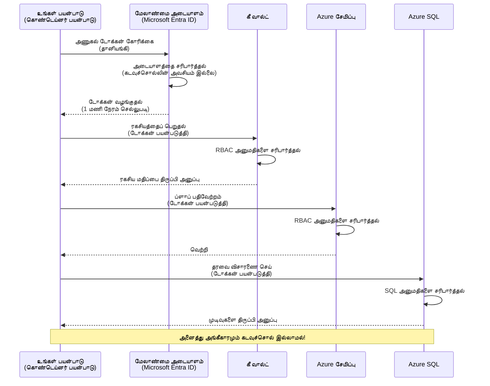
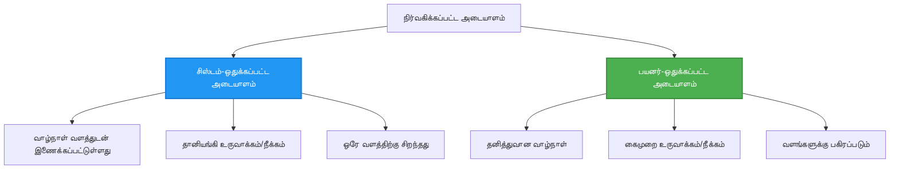

# அங்கீகாரம் மாதிரிகள் மற்றும் நிர்வகிக்கப்பட்ட அடையாளம்

⏱️ **கணிக்கப்பட்ட நேரம்**: 45-60 நிமிடம் | 💰 **செலவு தாக்கம்**: இலவசம் (கூடுதல் கட்டணங்கள் இல்லை) | ⭐ **சிக்கல்தன்மை**: நடுத்தரம்

**📚 கற்றல் பாதை:**
- ← Previous: [கட்டமைப்பு மேலாண்மை](configuration.md) - சுற்றுச்சூழல் மாறிகள் மற்றும் ரகசியங்களை நிர்வகித்தல்
- 🎯 **நீங்கள் இங்கே உள்ளீர்கள்**: அங்கீகாரம் & பாதுகாப்பு (Managed Identity, Key Vault, பாதுகாப்பு முறை)
- → Next: [முதல் திட்டம்](first-project.md) - உங்கள் முதல் AZD பயன்பாட்டை கட்டவும்
- 🏠 [Course Home](../../README.md)

---

## நீங்கள் கற்றுக்கொள்ளும் விஷயங்கள்

By completing this lesson, you will:
- Azure அங்கீகாரம் மாதிரிகளை புரிந்துகொள்ளுங்கள் (சாவுகள், இணைப்பு ஸ்ட்ரிங்குகள், நிர்வகிக்கப்பட்ட அடையாளம்)
- கடவுச்சொல்லின்றி அங்கீகாரத்திற்கு **Managed Identity** ஐ செயல்படுத்தவும்
- **Azure Key Vault** ஒருங்கிணைப்புடன் ரகசியங்களை பாதுகாக்கவும்
- AZD வினியோகங்களுக்கு **பாத்திர அடிப்படையிலான அணுகல் கட்டுப்பாடு (RBAC)** அமைக்கவும்
- Container Apps மற்றும் Azure சேவைகளில் பாதுகாப்பு சிறந்த நடைமுறைகளை பிரயோகப்படுத்தவும்
- சாவி-அடிப்படையிலிருந்து அடையாள-அடிப்படை அங்கீகாரத்திற்கு நகரவும்

## நிர்வகிக்கப்பட்ட அடையாளம் ஏன் முக்கியம்

### சிக்கல்: பாரம்பரிய அங்கீகாரம்

**நிர்வகிக்கப்பட்ட அடையாளத்திற்கு முன்னர்:**
```javascript
// ❌ பாதுகாப்பு ஆபத்து: கோடில் நேரடியாக எழுதப்பட்ட ரகசியங்கள்
const connectionString = "Server=mydb.database.windows.net;User=admin;Password=P@ssw0rd123";
const storageKey = "xK7mN9pQ2wR5tY8uI0oP3aS6dF1gH4jK...";
const cosmosKey = "C2x7B9n4M1p8Q5w3E6r0T2y5U8i1O4p7...";
```

**சிக்கல்கள்:**
- 🔴 **கோடிலும், கட்டமைப்பு கோப்புகளிலும், சூழல் மாறிகளில் ரகசியங்கள் வெளிப்படுத்தப்பட்டவை**
- 🔴 **சான்று சுழற்சி** கோடு மாற்றங்கள் மற்றும் மறுபடி பரவலாக்கத்தை தேவைப்படுத்துகிறது
- 🔴 **ஆடிட் சிக்கல்கள்** - யார் எதை எப்போது அணுகினர்?
- 🔴 **பரவல்** - ரகசியங்கள் பல அமைப்புகளில் பரவியுள்ளன
- 🔴 **கம்ப்ளையன்ஸ் ஆபத்துகள்** - பாதுகாப்பு ஆடிட் தோல்வி

### தீர்வு: நிர்வகிக்கப்பட்ட அடையாளம்

**நிர்வகிக்கப்பட்ட அடையாளத்திற்குப் பிறகு:**
```javascript
// ✅ பாதுகாப்பு: குறியீட்டில் எந்த ரகசியங்களும் இல்லை
const credential = new DefaultAzureCredential();
const client = new BlobServiceClient(
  "https://mystorageaccount.blob.core.windows.net",
  credential  // Azure தானாகச் சான்றளிப்பை கையாளுகிறது
);
```

**நன்மைகள்:**
- ✅ **கோடிலும் அல்லது கட்டமைப்பிலும் ரகசியங்கள் இல்லை**
- ✅ **தானாக சுழற்சி** - Azure இதனை கையாளும்
- ✅ **முழு ஆடிட் தொடர்** Microsoft Entra ID பதிவுகளில்
- ✅ **மையப்படுத்தப்பட்ட பாதுகாப்பு** - Azure போர்டலில் நிர்வகிக்கவும்
- ✅ **கம்ப்ளையன்ஸ் தயார்** - பாதுகாப்பு நிலவரங்களுக்கு ஏற்ப

**உதாரணம்**: பாரம்பரிய அங்கீகாரம் பல கதவுகளுக்கான பல புல்லாங்கிள்களை எடுத்துச்செல்லுவது போன்றது. நிர்வகிக்கப்பட்ட அடையாளம் என்பது உங்கள் யார் என்பதைக் குறிப்பிடும் ஒரு பாதுகாப்பு பேட்ஜ் போல் — அது தானாகவே அடையலை வழங்கும்; சாவிகளை இழக்கவோ, நகலெடுக்கவோ, சுழற்சிக்கவோ தேவையில்லை.

---

## கட்டமைப்பு மேற்பார்வை

### நிர்வகitated அடையாளத்துடன் அங்கீகார ஓட்டம்



### நிர்வகிக்கப்பட்ட அடையாளங்களின் வகைகள்



| அம்சம் | சிஸ்டம்-ஒதுக்கப்பட்ட | பயனர்-ஒதுக்கப்பட்ட |
|---------|----------------|---------------|
| **வாழ்க்கைச் சுழற்சி** | வளத்திற்கு இணைக்கப்பட்டுள்ளது | சுயாதீனம் |
| **உருவாக்கம்** | வளத்துடன் தானாக | கைமுறை உருவாக்கம் |
| **நீக்கு** | வளத்துடன் நீக்கப்படும் | வளம் நீக்கப்பட்ட பிறகும் நிலவுகிறது |
| **பகிர்தல்** | ஒரே வளத்திற்கு மட்டும் | பல வளங்கள் |
| **பயன்பாடு** | எளிய திரைச்சூழல்களுக்கு | சிக்கலான பல வளங்கள் திரைச்சூழல்களுக்கு |
| **AZD முன்னிறுத்தம்** | ✅ பரிந்துரைக்கப்படுகிறது | விருப்பமானது |

---

## முன்னோடிகள்

### தேவையான கருவிகள்

You should already have these installed from previous lessons:

```bash
# Azure Developer CLI ஐ சரிபார்க்கவும்
azd version
# ✅ எதிர்பார்க்கப்படும்: azd பதிப்பு 1.0.0 அல்லது அதற்கு மேல்

# Azure CLI ஐ சரிபார்க்கவும்
az --version
# ✅ எதிர்பார்க்கப்படும்: azure-cli 2.50.0 அல்லது அதற்கு மேல்
```

### Azure தேவைகள்

- Active Azure subscription
- அனுமதிகள்:
  - Create managed identities
  - Assign RBAC roles
  - Create Key Vault resources
  - Deploy Container Apps

### அறிவு முன்னோடிகள்

You should have completed:
- [நிறுவல் வழிகாட்டி](installation.md) - AZD அமைப்பு
- [AZD அடிப்படை](azd-basics.md) - முக்கிய கோட்பாடுகள்
- [கட்டமைப்பு மேலாண்மை](configuration.md) - சுற்றுச்சூழல் மாறிகள்

---

## பாடம் 1: அங்கீகாரம் மாதிரிகளை பற்றி புரிதல்

### முறை 1: கானெக்ஷன் ஸ்ட்ரிங்ஸ் (பழையது - தவிர்க்கவும்)

**இது எப்படி செயல்படுகிறது:**
```bash
# இணைப்பு தொடர் அங்கீகார விவரங்களை கொண்டுள்ளது
STORAGE_CONNECTION_STRING="DefaultEndpointsProtocol=https;AccountName=myaccount;AccountKey=xK7mN9pQ2wR5..."
COSMOS_CONNECTION_STRING="AccountEndpoint=https://myaccount.documents.azure.com:443/;AccountKey=C2x7..."
SQL_CONNECTION_STRING="Server=myserver.database.windows.net;User=admin;Password=P@ssw0rd..."
```

**சிக்கல்கள்:**
- ❌ சூழல் மாறிகளில் ரகசியங்கள் தெரிகின்றன
- ❌ பரவல் அமைப்புகளில் பதிவு செய்யப்பட்டவை
- ❌ சுழற்சி செய்வது கடினம்
- ❌ அணுகலின் ஆடிட் தொடர் இல்லை

**எப்பொழுது பயன்படுத்துவது:** உள்ளூர் வளர்ச்சிக்காக மட்டும்; தயாரிப்பு சூழலில் ஒருபோதும் அல்ல.

---

### முறை 2: Key Vault குறிப்புகள் (மிக நன்று)

**இது எப்படி செயல்படுகிறது:**
```bicep
// Store secret in Key Vault
resource keyVault 'Microsoft.KeyVault/vaults@2023-02-01' = {
  name: 'mykv'
  properties: {
    enableRbacAuthorization: true
  }
}

// Reference in Container App
env: [
  {
    name: 'STORAGE_KEY'
    secretRef: 'storage-key'  // References Key Vault
  }
]
```

**நன்மைகள்:**
- ✅ ரகசியங்கள் Key Vault இல் பாதுகாப்பாக சேமிக்கப்படுகின்றன
- ✅ மையப்படுத்தப்பட்ட ரகசிய மேலாண்மை
- ✅ கோடு மாற்றங்கள் இல்லாமல் சுழற்சி

**வரையறைகள்:**
- ⚠️ இன்னும் சாவிகள்/கடவுச்சொற்கள் பயன்படுத்தப்படுகின்றன
- ⚠️ Key Vault அணுகலை நிர்வகிக்க தேவையுள்ளது

**எப்பொழுது பயன்படுத்துவது:** கானெக்ஷன் ஸ்ட்ரிங்ஸ் இலிருந்து நிர்வகிக்கப்பட்ட அடையாளத்திற்கு மாறும் இடைநிலை படி.

---

### முறை 3: நிர்வகிக்கப்பட்ட அடையாளம் (சிறந்த நடைமுறை)

**இது எப்படி செயல்படுகிறது:**
```bicep
// Enable managed identity
resource containerApp 'Microsoft.App/containerApps@2023-05-01' = {
  name: 'myapp'
  identity: {
    type: 'SystemAssigned'  // Automatically creates identity
  }
}

// Grant permissions
resource roleAssignment 'Microsoft.Authorization/roleAssignments@2022-04-01' = {
  scope: storageAccount
  properties: {
    roleDefinitionId: storageBlobDataContributorRole
    principalId: containerApp.identity.principalId
  }
}
```

**பயன்பாட்டு குறியீடு:**
```javascript
// ரகசியங்கள் தேவையில்லை!
const { DefaultAzureCredential } = require('@azure/identity');
const { BlobServiceClient } = require('@azure/storage-blob');

const credential = new DefaultAzureCredential();
const blobServiceClient = new BlobServiceClient(
  'https://mystorageaccount.blob.core.windows.net',
  credential
);
```

**நன்மைகள்:**
- ✅ கோடிலும்/கட்டமைப்பிலும் ரகசியங்கள் இல்லை
- ✅ தானாக சான்று சுழற்சி
- ✅ முழு ஆடிட் தொடர்
- ✅ RBAC அடிப்படையிலான அனுமதிகள்
- ✅ கம்ப்ளையன்ஸ் தயாரானது

**எப்பொழுது பயன்படுத்துவது:** எப்போதும், தயாரிப்பு பயன்பாடுகளுக்காக.

---

### முறை 4: சர்வீஸ் பிரின்சிப்பல்ஸ் (CI/CD & தானியக்க செயல்முறை)

நிர்வகிக்கப்பட்ட அடையாளம் Azure உள் இயங்கும் வளங்களுக்கு *பொன்மான தரநிலையாகும்*. ஆனால் **Azure இற்கு வெளியே** இயங்கும் விசயங்கள் பற்றி என்ன — உதாரணமாக ஒரு build agent இல் உள்ள CI/CD பைப் லைன், அல்லது உங்கள் லேப்டாப்பில் இயங்கும், உங்கள் இடைமுக உள்நுழைவைக் பயன்படுத்த முடியாத ஸ்கிரிப்ட்? அப்படியானபோது **service principal** உதவும்: ஒரு மனிதரல்லாத அடையாளம், அதன் சொந்த சான்றுகளை கொண்டது, ஒரு தானியங்கி செயல்முறை அதனுடன் உள்நுழையலாம்.

**இது எப்படி செயல்படுகிறது:**

ஒரு resource group இற்குத் தகுந்த குறைந்த-அனுமதி(Service) உரிமையுடன் service principal ஐ உருவாக்கவும்:

```bash
az ad sp create-for-rbac \
  --name "myapp-cicd" \
  --role contributor \
  --scopes /subscriptions/<sub-id>/resourceGroups/<rg-name>
```

This prints a client ID, client secret, and tenant ID. azd can sign in with them non-interactively:

```bash
azd auth login \
  --client-id "<appId>" \
  --client-secret "<password>" \
  --tenant-id "<tenant>"
```

**ரகசியங்களை விடாவிட்டால் federated credentials (OIDC) ஐ முன்னுரிமை கொள்ளுங்கள்.** நீண்ட கால client secret ஐப் பதிலாக, ஒரு federated credential ஐ அமைக்கவும், அதனால் பைப் லைன் குறுகியகால டோக்கனை பரிமாறும்—பகிரப்பட வேண்டிய ரகசியம் எதுவுமில்லை அல்லது சுழற்சி செய்ய வேண்டியதுமில்லை:

```bash
azd auth login \
  --client-id "<appId>" \
  --federated-credential-provider "github" \
  --tenant-id "<tenant>"
```

> `azd pipeline config` இத்தகைய அமைப்பை தானாகவே உங்களுக்குப் பதிவு செய்கிறது. CI/CD நடைமுறை பயிற்சிகளை பார்க்க [அத்தியாயம் 8](../chapter-08-production/production-ai-practices.md).

**நன்மைகள்:**
- ✅ Azure ஓரம்கடந்தகாலம் (build agents, on-prem, மற்ற மேகங்கள்) வேலை செய்கிறது
- ✅ ஒரு பங்கு கொண்டு ஒரு resource group வரை வரம்பளிக்க முடியும்
- ✅ Federated (OIDC) பதிப்பு எந்த சேமிக்கப்பட்ட ரகசியத்தையும் பயன்படுத்தவில்லை

**பரிமாற்றங்கள்:**
- ⚠️ ரகசிய அடிப்படையிலான பதிப்பு கவனமாக சேமிப்பும் சுழற்சியும் தேவை
- ⚠️ ஒரு வெளியேறிய ரகசியம் SP செய்யக்கூடிய அனைத்தையும் வழங்கும்—அதனால் வரம்புகளை குறைக்கவும்

**எப்பொழுது பயன்படுத்துவது:** Managed identity பயன்படுத்த முடியாத CI/CD பைப்ப்லைன்கள் மற்றும் தானியக்க செயல்முறைகளிற்கு. client secret விட **federated/OIDC** பதிப்பை எப்போதும் முன்னுரிமை கொடுங்கள், மற்றும் வேலையமைப்பு Azure உள் ஓடினால் எப்போதும் managed identity ஐ பயன்படுத்துங்கள்.

**சான்றுகளை பாதுகாப்பாக சேமிப்பது:**
- ரகசியங்களை ஒருபோதும் commit செய்யாதீர்கள்—உங்கள் பைப் லைனின் ரகசிய சேமிப்பிடம் (GitHub Actions secrets, Azure DevOps variable groups / Key Vault) பயன்படுத்துங்கள்.
- SP ஐ அவசியமான சிறிய பங்கு மற்றும் resource group வரை மட்டும் வரம்பளிக்கவும்.
- காலக் கட்டம் அமைத்து சுழற்றவும், அல்லது OIDC மூலம் ரகசியத்தை முழுமையாக நீக்கவும்.

---

## பாடம் 2: AZD உடன் நிர்வகிக்கப்பட்ட அடையாளத்தை முன்னெடுப்பது

### படி படியாக செயலாக்கம்

நாம் ஒரு பாதுகாப்பான Container App உருவாக்கி அது Azure Storage மற்றும் Key Vault அணுக நிர்வகிக்கப்பட்ட அடையாளத்தை பயன்படுத்தும் படி செய்வோம்.

### திட்டத்தின் அமைப்பு

```
secure-app/
├── azure.yaml                 # AZD configuration
├── infra/
│   ├── main.bicep            # Main infrastructure
│   ├── core/
│   │   ├── identity.bicep    # Managed identity setup
│   │   ├── keyvault.bicep    # Key Vault configuration
│   │   └── storage.bicep     # Storage with RBAC
│   └── app/
│       └── container-app.bicep
└── src/
    ├── app.js                # Application code
    ├── package.json
    └── Dockerfile
```

### 1. AZD கான்பிகர் செய்யவும் (azure.yaml)

```yaml
name: secure-app
metadata:
  template: secure-app@1.0.0

services:
  api:
    project: ./src
    language: js
    host: containerapp

# Enable managed identity (AZD handles this automatically)
```

### 2. அவசியமான அடிப்படை: நிர்வகிக்கப்பட்ட அடையாளத்தை இயக்கவும்

**File: `infra/main.bicep`**

```bicep
targetScope = 'subscription'

param environmentName string
param location string = 'eastus'

var tags = { 'azd-env-name': environmentName }

// Resource group
resource rg 'Microsoft.Resources/resourceGroups@2021-04-01' = {
  name: 'rg-${environmentName}'
  location: location
  tags: tags
}

// Storage Account
module storage './core/storage.bicep' = {
  name: 'storage'
  scope: rg
  params: {
    name: 'st${uniqueString(rg.id)}'
    location: location
    tags: tags
  }
}

// Key Vault
module keyVault './core/keyvault.bicep' = {
  name: 'keyvault'
  scope: rg
  params: {
    name: 'kv-${uniqueString(rg.id)}'
    location: location
    tags: tags
  }
}

// Container App with Managed Identity
module containerApp './app/container-app.bicep' = {
  name: 'container-app'
  scope: rg
  params: {
    name: 'ca-${environmentName}'
    location: location
    tags: tags
    storageAccountName: storage.outputs.name
    keyVaultName: keyVault.outputs.name
  }
}

// Grant Container App access to Storage
module storageRoleAssignment './core/role-assignment.bicep' = {
  name: 'storage-role'
  scope: rg
  params: {
    principalId: containerApp.outputs.identityPrincipalId
    roleDefinitionId: 'ba92f5b4-2d11-453d-a403-e96b0029c9fe'  // Storage Blob Data Contributor
    targetResourceId: storage.outputs.id
  }
}

// Grant Container App access to Key Vault
module kvRoleAssignment './core/role-assignment.bicep' = {
  name: 'kv-role'
  scope: rg
  params: {
    principalId: containerApp.outputs.identityPrincipalId
    roleDefinitionId: '4633458b-17de-408a-b874-0445c86b69e6'  // Key Vault Secrets User
    targetResourceId: keyVault.outputs.id
  }
}

// Outputs
output AZURE_STORAGE_ACCOUNT_NAME string = storage.outputs.name
output AZURE_KEY_VAULT_NAME string = keyVault.outputs.name
output APP_URL string = containerApp.outputs.url
```

### 3. System-Assigned அடையாளம் உடைய Container App

**File: `infra/app/container-app.bicep`**

```bicep
param name string
param location string
param tags object = {}
param storageAccountName string
param keyVaultName string

resource containerApp 'Microsoft.App/containerApps@2023-05-01' = {
  name: name
  location: location
  tags: tags
  identity: {
    type: 'SystemAssigned'  // 🔑 Enable managed identity
  }
  properties: {
    configuration: {
      ingress: {
        external: true
        targetPort: 3000
      }
    }
    template: {
      containers: [
        {
          name: 'api'
          image: 'myregistry.azurecr.io/api:latest'
          resources: {
            cpu: json('0.5')
            memory: '1Gi'
          }
          env: [
            {
              name: 'AZURE_STORAGE_ACCOUNT_NAME'
              value: storageAccountName
            }
            {
              name: 'AZURE_KEY_VAULT_NAME'
              value: keyVaultName
            }
            // 🔑 No secrets - managed identity handles authentication!
          ]
        }
      ]
    }
  }
}

// Output the identity for RBAC assignments
output identityPrincipalId string = containerApp.identity.principalId
output id string = containerApp.id
output url string = 'https://${containerApp.properties.configuration.ingress.fqdn}'
```

### 4. RBAC பங்கு ஒதுக்குதல் மாட்யூல்

**File: `infra/core/role-assignment.bicep`**

```bicep
param principalId string
param roleDefinitionId string  // Azure built-in role ID
param targetResourceId string

resource roleAssignment 'Microsoft.Authorization/roleAssignments@2022-04-01' = {
  name: guid(principalId, roleDefinitionId, targetResourceId)
  scope: resourceId('Microsoft.Resources/resourceGroups', resourceGroup().name)
  properties: {
    roleDefinitionId: subscriptionResourceId('Microsoft.Authorization/roleDefinitions', roleDefinitionId)
    principalId: principalId
    principalType: 'ServicePrincipal'
  }
}

output id string = roleAssignment.id
```

### 5. நிர்வகிக்கப்பட்ட அடையாளத்துடன் செயல்படும் பயன்பாட்டு குறியீடு

**File: `src/app.js`**

```javascript
const express = require('express');
const { DefaultAzureCredential } = require('@azure/identity');
const { BlobServiceClient } = require('@azure/storage-blob');
const { SecretClient } = require('@azure/keyvault-secrets');

const app = express();
const PORT = process.env.PORT || 3000;

// 🔑 அங்கீகாரச் சான்றுகளை ஆரம்பிக்கவும் (மேலாண்மை அடையாளத்துடன் தானாக செயல்படுகிறது)
const credential = new DefaultAzureCredential();

// Azure சேமிப்பு அமைப்பு
const storageAccountName = process.env.AZURE_STORAGE_ACCOUNT_NAME;
const blobServiceClient = new BlobServiceClient(
  `https://${storageAccountName}.blob.core.windows.net`,
  credential  // எந்த விசைகளும் தேவையில்லை!
);

// Key Vault அமைப்பு
const keyVaultName = process.env.AZURE_KEY_VAULT_NAME;
const secretClient = new SecretClient(
  `https://${keyVaultName}.vault.azure.net`,
  credential  // எந்த விசைகளும் தேவையில்லை!
);

// நலச் சோதனை
app.get('/health', (req, res) => {
  res.json({ status: 'healthy', authentication: 'managed-identity' });
});

// கோப்பை ப்ளாப் சேமிப்பிற்கு பதிவேற்றவும்
app.post('/upload', async (req, res) => {
  try {
    const containerClient = blobServiceClient.getContainerClient('uploads');
    await containerClient.createIfNotExists();
    
    const blobName = `file-${Date.now()}.txt`;
    const blockBlobClient = containerClient.getBlockBlobClient(blobName);
    
    await blockBlobClient.upload('Hello from managed identity!', 30);
    
    res.json({
      success: true,
      blobName: blobName,
      message: 'File uploaded using managed identity!'
    });
  } catch (error) {
    console.error('Upload error:', error);
    res.status(500).json({ error: error.message });
  }
});

// Key Vault-இலிருந்து ரகசியத்தைப் பெறவும்
app.get('/secret/:name', async (req, res) => {
  try {
    const secretName = req.params.name;
    const secret = await secretClient.getSecret(secretName);
    
    res.json({
      name: secretName,
      value: secret.value,
      message: 'Secret retrieved using managed identity!'
    });
  } catch (error) {
    console.error('Secret error:', error);
    res.status(500).json({ error: error.message });
  }
});

// ப்ளாப் கன்டெய்னர்களை பட்டியலிடுக (படிக்க அனுமதியை காட்டுகிறது)
app.get('/containers', async (req, res) => {
  try {
    const containers = [];
    for await (const container of blobServiceClient.listContainers()) {
      containers.push(container.name);
    }
    
    res.json({
      containers: containers,
      count: containers.length,
      message: 'Containers listed using managed identity!'
    });
  } catch (error) {
    console.error('List error:', error);
    res.status(500).json({ error: error.message });
  }
});

app.listen(PORT, () => {
  console.log(`Secure API listening on port ${PORT}`);
  console.log('Authentication: Managed Identity (passwordless)');
});
```

**File: `src/package.json`**

```json
{
  "name": "secure-app",
  "version": "1.0.0",
  "dependencies": {
    "express": "^4.18.2",
    "@azure/identity": "^4.0.0",
    "@azure/storage-blob": "^12.17.0",
    "@azure/keyvault-secrets": "^4.7.0"
  },
  "scripts": {
    "start": "node app.js"
  }
}
```

### 6. பதிவேற்றவும் மற்றும் சோதனை செய்யவும்

```bash
# AZD சூழலை ஆரம்பிக்கவும்
azd init

# அடித்தளத்தையும் பயன்பாட்டையும் நிறுவவும்
azd up

# பயன்பாட்டின் URL ஐப் பெறவும்
APP_URL=$(azd env get-values | grep APP_URL | cut -d '=' -f2 | tr -d '"')

# ஆரோக்கியச் சோதனையை சோதிக்கவும்
curl $APP_URL/health
```

**✅ எதிர்பார்க்கப்படும் வெளியீடு:**
```json
{
  "status": "healthy",
  "authentication": "managed-identity"
}
```

**பரீட்சை blob பதிவேற்றம்:**
```bash
curl -X POST $APP_URL/upload
```

**✅ எதிர்பார்க்கப்படும் வெளியீடு:**
```json
{
  "success": true,
  "blobName": "file-1700404800000.txt",
  "message": "File uploaded using managed identity!"
}
```

**பரீட்சை container பட்டியல்:**
```bash
curl $APP_URL/containers
```

**✅ எதிர்பார்க்கப்படும் வெளியீடு:**
```json
{
  "containers": ["uploads"],
  "count": 1,
  "message": "Containers listed using managed identity!"
}
```

---

## பொதுவான Azure RBAC பங்குகள்

### Built-in Role IDs for Managed Identity

| சேவை | Role Name | Role ID | அனுமதிகள் |
|---------|-----------|---------|-------------|
| **Storage** | Storage Blob Data Reader | `2a2b9908-6b94-4a3d-8e5a-a7d8f8cc8a12` | ப்ளாப் மற்றும் கன்டெய்னரைப் படிக்க |
| **Storage** | Storage Blob Data Contributor | `ba92f5b4-2d11-453d-a403-e96b0029c9fe` | ப்ளாப்களைப் படிக்க, எழுத, அழிக்க |
| **Storage** | Storage Queue Data Contributor | `974c5e8b-45b9-4653-ba55-5f855dd0fb88` | கியூ செய்திகள் படிக்க, எழுத, அழிக்க |
| **Key Vault** | Key Vault Secrets User | `4633458b-17de-408a-b874-0445c86b69e6` | ரகசியங்களைப் படிக்க |
| **Key Vault** | Key Vault Secrets Officer | `b86a8fe4-44ce-4948-aee5-eccb2c155cd7` | ரகசியங்களைப் படிக்க, எழுத, அழிக்க |
| **Cosmos DB** | Cosmos DB Built-in Data Reader | `00000000-0000-0000-0000-000000000001` | Cosmos DB தரவைப் படிக்க |
| **Cosmos DB** | Cosmos DB Built-in Data Contributor | `00000000-0000-0000-0000-000000000002` | Cosmos DB தரவைப் படிக்க, எழுத |
| **SQL Database** | SQL DB Contributor | `9b7fa17d-e63e-47b0-bb0a-15c516ac86ec` | SQL தரவுத்தளங்களை நிர்வகிக்க |
| **Service Bus** | Azure Service Bus Data Owner | `090c5cfd-751d-490a-894a-3ce6f1109419` | செய்திகளை அனுப்ப, பெற, நிர்வகிக்க |

### பங்கு ID க்களை காணும் முறை

```bash
# அனைத்து முன்னமைக்கப்பட்ட பாத்திரங்களையும் பட்டியலிடவும்
az role definition list --query "[].{Name:roleName, ID:name}" --output table

# ஒரு குறிப்பிட்ட பாத்திரத்தைத் தேடவும்
az role definition list --query "[?contains(roleName, 'Storage Blob')].{Name:roleName, ID:name}" --output table

# பாத்திர விவரங்களைப் பெறவும்
az role definition list --name "Storage Blob Data Contributor"
```

---

## நடைமுறை பயிற்சிகள்

### பயிற்சி 1: உள்ளமைவு பயன்பாட்டிற்கான நிர்வகிக்கப்பட்ட அடையாளத்தை இயக்கு ⭐⭐ (இடைநிலை)

**கோள்**: ஏற்கனவே உள்ள Container App பதிப்பில் நிர்வகிக்கப்பட்ட அடையாளத்தைச் சேர்க்கவும்

**நிகழ்ச்சி**: உங்களிடம் கானெக்ஷன் ஸ்ட்ரிங்ஸை பயன்படுத்தும் ஒரு Container App உள்ளது. அதை நிர்வகிக்கப்பட்ட அடையாளமாக மாற்றவும்.

**துவக்கம்**: கீழ்காணும் கட்டமைப்புடன் உள்ள Container App:

```bicep
// ❌ Current: Using connection string
env: [
  {
    name: 'STORAGE_CONNECTION_STRING'
    secretRef: 'storage-connection'
  }
]
```

**படிகள்**:

1. **Bicep இல் நிர்வகிக்கப்பட்ட அடையாளத்தை இயக்கு:**

```bicep
resource containerApp 'Microsoft.App/containerApps@2023-05-01' = {
  name: 'myapp'
  identity: {
    type: 'SystemAssigned'  // Add this
  }
  // ... rest of configuration
}
```

2. **Storage அணுகலை வழங்கவும்:**

```bicep
// Get storage account reference
resource storageAccount 'Microsoft.Storage/storageAccounts@2023-01-01' existing = {
  name: storageAccountName
}

// Assign role
resource roleAssignment 'Microsoft.Authorization/roleAssignments@2022-04-01' = {
  name: guid(containerApp.id, 'ba92f5b4-2d11-453d-a403-e96b0029c9fe', storageAccount.id)
  scope: storageAccount
  properties: {
    roleDefinitionId: subscriptionResourceId('Microsoft.Authorization/roleDefinitions', 'ba92f5b4-2d11-453d-a403-e96b0029c9fe')
    principalId: containerApp.identity.principalId
    principalType: 'ServicePrincipal'
  }
}
```

3. **பயன்பாட்டு குறியீட்டை புதுப்பிக்கவும்:**

**முன் (connection string):**
```javascript
const { BlobServiceClient } = require('@azure/storage-blob');

const blobServiceClient = BlobServiceClient.fromConnectionString(
  process.env.STORAGE_CONNECTION_STRING
);
```

**பின்னர் (managed identity):**
```javascript
const { DefaultAzureCredential } = require('@azure/identity');
const { BlobServiceClient } = require('@azure/storage-blob');

const credential = new DefaultAzureCredential();
const blobServiceClient = new BlobServiceClient(
  `https://${process.env.STORAGE_ACCOUNT_NAME}.blob.core.windows.net`,
  credential
);
```

4. **சுற்றுச்சூழல் மாறிகளை புதுப்பிக்கவும்:**

```bicep
env: [
  {
    name: 'STORAGE_ACCOUNT_NAME'
    value: storageAccountName  // Just the name, no secrets!
  }
  // Remove STORAGE_CONNECTION_STRING
]
```

5. **பதிவேற்றவும் மற்றும் சோதனை செய்யவும்:**

```bash
# மீண்டும் வெளியிடு
azd up

# இது இன்னும் வேலை செய்கிறதா எனச் சோதிக்க
curl https://myapp.azurecontainerapps.io/upload
```

**✅ வெற்றி கோட்பாடுகள்:**
- ✅ பயன்பாடு பிழைகளை இல்லாமல் நிறுவப்படுகிறது
- ✅ Storage செயலிகள் செயல்படுகின்றன (பதிவேற்றம், பட்டியலிடல், பதிவிறக்கம்)
- ✅ சுற்றுச்சூழல் மாறிகளில் எந்த connection string ளும் இல்லை
- ✅ Azure போர்டலில் "Identity" பிளேடின் கீழ் அடையாளம் பார்க்கப்படுகிறது

**சரிபார்ப்பு:**

```bash
# நிர்வகிக்கப்பட்ட அடையாளம் இயக்கப்பட்டுள்ளதா என்பதை சரிபார்க்கவும்
az containerapp show \
  --name myapp \
  --resource-group rg-myapp \
  --query "identity.type"
# ✅ எதிர்பார்ப்பு: "SystemAssigned"

# பங்கு ஒதுக்கீட்டை சரிபார்க்கவும்
az role assignment list \
  --assignee $(az containerapp show --name myapp --resource-group rg-myapp --query "identity.principalId" -o tsv) \
  --scope /subscriptions/{sub-id}/resourceGroups/rg-myapp/providers/Microsoft.Storage/storageAccounts/mystorageaccount
# ✅ எதிர்பார்ப்பு: "Storage Blob Data Contributor" பங்கைக் காட்டும்
```

**நேரம்**: 20-30 நிமிடம்

---

### பயிற்சி 2: பல சேவைகளுக்கான அணுகல் பயனர்-ஒதுக்கப்பட்ட அடையாளத்துடன் ⭐⭐⭐ (மேம்பட்ட)

**கோள்**: பல Container App களில் பகிரப்படும் ஒரு பயனர்-ஒதுக்கப்பட்ட அடையாளத்தை உருவாக்கவும்

**நிகழ்ச்சி**: ஒரே Storage கணக்கு மற்றும் Key Vault ஐ அணுக வேண்டிய 3 மைக்ரோசேவைகள் உங்களுக்கு உள்ளன.

**படிகள்**:

1. **பயனர்-ஒதுக்கப்பட்ட அடையாளத்தை உருவாக்கவும்:**

**File: `infra/core/identity.bicep`**

```bicep
param name string
param location string
param tags object = {}

resource userAssignedIdentity 'Microsoft.ManagedIdentity/userAssignedIdentities@2023-01-31' = {
  name: name
  location: location
  tags: tags
}

output id string = userAssignedIdentity.id
output principalId string = userAssignedIdentity.properties.principalId
output clientId string = userAssignedIdentity.properties.clientId
```

2. **பயனர்-ஒதுக்கப்பட்ட அடையாளத்திற்கு பங்கை ஒதுக்கவும்:**

```bicep
// In main.bicep
module userIdentity './core/identity.bicep' = {
  name: 'user-identity'
  scope: rg
  params: {
    name: 'id-${environmentName}'
    location: location
    tags: tags
  }
}

// Grant Storage access
resource storageRoleAssignment 'Microsoft.Authorization/roleAssignments@2022-04-01' = {
  name: guid(userIdentity.outputs.principalId, 'storage-contributor')
  scope: storageAccount
  properties: {
    roleDefinitionId: subscriptionResourceId('Microsoft.Authorization/roleDefinitions', 'ba92f5b4-2d11-453d-a403-e96b0029c9fe')
    principalId: userIdentity.outputs.principalId
    principalType: 'ServicePrincipal'
  }
}

// Grant Key Vault access
resource kvRoleAssignment 'Microsoft.Authorization/roleAssignments@2022-04-01' = {
  name: guid(userIdentity.outputs.principalId, 'kv-secrets-user')
  scope: keyVault
  properties: {
    roleDefinitionId: subscriptionResourceId('Microsoft.Authorization/roleDefinitions', '4633458b-17de-408a-b874-0445c86b69e6')
    principalId: userIdentity.outputs.principalId
    principalType: 'ServicePrincipal'
  }
}
```

3. **பல Container App களுக்கு அடையாளத்தை ஒதுக்கவும்:**

```bicep
resource apiGateway 'Microsoft.App/containerApps@2023-05-01' = {
  name: 'api-gateway'
  identity: {
    type: 'UserAssigned'
    userAssignedIdentities: {
      '${userIdentity.outputs.id}': {}
    }
  }
  // ... rest of config
}

resource productService 'Microsoft.App/containerApps@2023-05-01' = {
  name: 'product-service'
  identity: {
    type: 'UserAssigned'
    userAssignedIdentities: {
      '${userIdentity.outputs.id}': {}
    }
  }
  // ... rest of config
}

resource orderService 'Microsoft.App/containerApps@2023-05-01' = {
  name: 'order-service'
  identity: {
    type: 'UserAssigned'
    userAssignedIdentities: {
      '${userIdentity.outputs.id}': {}
    }
  }
  // ... rest of config
}
```

4. **பயன்பாட்டு குறியீடு (அனைத்து சேவைகளும் ஒரே முறையைப் பயன்படுத்தும்):**

```javascript
const { DefaultAzureCredential, ManagedIdentityCredential } = require('@azure/identity');

// பயனர் ஒதுக்கப்பட்ட அடையாளத்திற்கு client ID ஐ குறிப்பிடவும்
const credential = new ManagedIdentityCredential(
  process.env.AZURE_CLIENT_ID  // பயனர் ஒதுக்கப்பட்ட அடையாளத்தின் client ID
);

// அல்லது DefaultAzureCredential ஐ பயன்படுத்தவும் (தானாக கண்டுபிடிக்கிறது)
const credential = new DefaultAzureCredential();

const blobServiceClient = new BlobServiceClient(
  `https://${process.env.STORAGE_ACCOUNT_NAME}.blob.core.windows.net`,
  credential
);
```

5. **பதிவேற்று சரிபார்க்கவும்:**

```bash
azd up

# எல்லா சேவைகளும் சேமிப்பகத்தை அணுக முடிகிறதா என்பதைச் சோதிக்கவும்
curl https://api-gateway.azurecontainerapps.io/upload
curl https://product-service.azurecontainerapps.io/upload
curl https://order-service.azurecontainerapps.io/upload
```

**✅ வெற்றி அளவுகோல்கள்:**
- ✅ 3 சேவைகளுக்கிடையில் ஒரே அடையாளம் பகிரப்பட்டது
- ✅ அனைத்து சேவைகளும் Storage மற்றும் Key Vault ஐ அணுக முடிகிறது
- ✅ ஒரு சேவையை நீக்கியபோதிலும் அடையாளம் நிலவுகிறது
- ✅ மையப்படுத்தப்பட்ட அனுமதி மேலாண்மை

**பயனர்-ஒதுக்கப்பட்ட அடையாளத்தின் நன்மைகள்:**
- நிர்வகிக்க ஒரு தனி அடையாளம்
- சேவைகளுக்கு இடையே ஒரே மாதிரியான அனுமதிகள்
- ஒரு சேவையை நீக்கிய பிறகும் அடையாளம் நிலவுகிறது
- சிக்கலான கட்டமைப்புகளுக்கு சிறந்தது

**நேரம்**: 30-40 நிமிடங்கள்

---

### பயிற்சி 3: Key Vault ரகசிய சுழற்தலை செயல்படுத்துதல் ⭐⭐⭐ (மேம்பட்ட)

**கோள்**: மூன்றாம் தரப்பு API சாவிகளை Key Vault இல் சேமித்து அவற்றை நிர்வகிக்கப்பட்ட அடையாளத்தால் அணுகுதல்

**நிகழ்ச்சி**: உங்கள் செயலி வெளியே உள்ள API களை (OpenAI, Stripe, SendGrid) அழைக்க API சாவிகளை தேவைப்படுத்துகிறது.

**படிகள்**:

1. **RBAC உடன் Key Vault ஐ உருவாக்கவும்:**

**File: `infra/core/keyvault.bicep`**

```bicep
param name string
param location string
param tags object = {}

resource keyVault 'Microsoft.KeyVault/vaults@2023-02-01' = {
  name: name
  location: location
  tags: tags
  properties: {
    enableRbacAuthorization: true  // Use RBAC instead of access policies
    sku: {
      family: 'A'
      name: 'standard'
    }
    tenantId: subscription().tenantId
    enableSoftDelete: true
    softDeleteRetentionInDays: 90
  }
}

// Allow Container App to read secrets
output id string = keyVault.id
output name string = keyVault.name
output uri string = keyVault.properties.vaultUri
```

2. **Key Vault இல் ரகசியங்களை சேமிக்கவும்:**

```bash
# Key Vault பெயரைப் பெற
KV_NAME=$(azd env get-values | grep AZURE_KEY_VAULT_NAME | cut -d '=' -f2 | tr -d '"')

# மூன்றாம் தரப்பு API விசைகளை சேமிக்க
az keyvault secret set \
  --vault-name $KV_NAME \
  --name "OpenAI-ApiKey" \
  --value "sk-proj-xxxxxxxxxxxxx"

az keyvault secret set \
  --vault-name $KV_NAME \
  --name "Stripe-ApiKey" \
  --value "sk_live_xxxxxxxxxxxxx"

az keyvault secret set \
  --vault-name $KV_NAME \
  --name "SendGrid-ApiKey" \
  --value "SG.xxxxxxxxxxxxx"
```

3. **ராகசியங்களை பெற பயன்பாட்டு குறியீடு:**

**File: `src/config.js`**

```javascript
const { DefaultAzureCredential } = require('@azure/identity');
const { SecretClient } = require('@azure/keyvault-secrets');

class Config {
  constructor() {
    this.credential = new DefaultAzureCredential();
    this.secretClient = new SecretClient(
      `https://${process.env.AZURE_KEY_VAULT_NAME}.vault.azure.net`,
      this.credential
    );
    this.cache = {};
  }

  async getSecret(secretName) {
    // முதலில் கேஷை சரிபார்க்கவும்
    if (this.cache[secretName]) {
      return this.cache[secretName];
    }

    try {
      const secret = await this.secretClient.getSecret(secretName);
      this.cache[secretName] = secret.value;
      console.log(`✅ Retrieved secret: ${secretName}`);
      return secret.value;
    } catch (error) {
      console.error(`❌ Failed to get secret ${secretName}:`, error.message);
      throw error;
    }
  }

  async getOpenAIKey() {
    return this.getSecret('OpenAI-ApiKey');
  }

  async getStripeKey() {
    return this.getSecret('Stripe-ApiKey');
  }

  async getSendGridKey() {
    return this.getSecret('SendGrid-ApiKey');
  }
}

module.exports = new Config();
```

4. **பயன்பாட்டில் ரகசியங்களைப் பயன்படுத்தவும்:**

**File: `src/app.js`**

```javascript
const express = require('express');
const config = require('./config');
const { OpenAI } = require('openai');

const app = express();

// Key Vault-இருந்து பெறப்பட்ட கீயால் OpenAI-ஐ ஆரம்பிக்கவும்
let openaiClient;

async function initializeServices() {
  const openaiKey = await config.getOpenAIKey();
  openaiClient = new OpenAI({ apiKey: openaiKey });
  console.log('✅ Services initialized with secrets from Key Vault');
}

// ஆரம்பத்தில் அழைக்கவும்
initializeServices().catch(console.error);

app.post('/chat', async (req, res) => {
  try {
    const completion = await openaiClient.chat.completions.create({
      model: 'gpt-4.1',
      messages: [{ role: 'user', content: 'Hello!' }]
    });
    
    res.json({
      response: completion.choices[0].message.content,
      authentication: 'Key from Key Vault via Managed Identity'
    });
  } catch (error) {
    res.status(500).json({ error: error.message });
  }
});

app.listen(3000, () => {
  console.log('Secure API with Key Vault integration running');
});
```

5. **பதிவேற்றி சோதிக்கவும்:**

```bash
azd up

# API விசைகள் வேலை செய்கிறதா என்பதை சோதிக்கவும்
curl -X POST https://myapp.azurecontainerapps.io/chat \
  -H "Content-Type: application/json" \
  -d '{"message":"Hello AI"}'
```

**✅ வெற்றி அளவுகோல்கள்:**
- ✅ கோடிலும் சூழல் மாறிகளிலும் API விசைகள் இல்லை
- ✅ பயன்பாடு Key Vault இலிருந்து விசைகளை பெறுகிறது
- ✅ மூன்றாம் தரப்பு APIகள் சரியாக செயல்படுகின்றன
- ✅ கோடு மாற்றங்கள் இல்லாமல் விசைகள் சுழற்சி செய்யக்கூடாது

**ஒரு ரகசியத்தை சுழற்சி செய்யவும்:**

```bash
# Key Vault இல் இரகசியத்தை புதுப்பிக்கவும்
az keyvault secret set \
  --vault-name $KV_NAME \
  --name "OpenAI-ApiKey" \
  --value "sk-proj-NEW_KEY_HERE"

# புதிய விசையை எடுத்துக்கொள்ள செயலியை மீண்டும் தொடக்கவும்
az containerapp revision restart \
  --name myapp \
  --resource-group rg-myapp
```

**நேரம்**: 25-35 நிமிடங்கள்

---

## அறிவுப் பரிசோதனை

### 1. அங்கீகாரம் மாதிரிகள் ✓

உங்கள் புரிதலைப் பரிசோதிக்கவும்:

- [ ] **Q1**: முக்கிய மூன்று அங்கீகாரம் மாதிரிகள் என்ன?
  - **A**: Connection strings (பழைய), Key Vault references (பரிமாற்றம்), Managed Identity (சிறந்தது)

- [ ] **Q2**: Managed Identity ஏன் Connection strings விட சிறந்தது?
  - **A**: கோடில் எந்த ரகசியமும் இல்லை, தானியங்கி சுழற்சி, முழுமையான ஆய்வு பாதை, RBAC அனுமதிகள்

- [ ] **Q3**: system-assigned பிறகு user-assigned identity ஐ எப்போது பயன்படுத்துவீர்கள்?
  - **A**: பல வளங்களுக்கு இடையே அடையாளத்தை பகிரும்போது அல்லது அடையாளத்தின் வாழ்நாள் வளத்தின் வாழ்நாளிலிருந்து சுயமாக இருக்கும் போது

**கைமுறைச் சரிபார்ப்பு:**
```bash
# உங்கள் செயலி எந்த வகை அடையாளத்தைக் பயன்படுத்துகிறது என்பதை சரிபார்க்கவும்
az containerapp show \
  --name myapp \
  --resource-group rg-myapp \
  --query "identity.type"

# அடையாளத்திற்கான அனைத்து பங்கு ஒதுக்கீடுகளையும் பட்டியலிடவும்
az role assignment list \
  --assignee $(az containerapp show --name myapp --resource-group rg-myapp --query "identity.principalId" -o tsv)
```

---

### 2. RBAC மற்றும் அனுமதிகள் ✓

உங்கள் புரிதலைப் பரிசோதிக்கவும்:

- [ ] **Q1**: "Storage Blob Data Contributor" க்கு role ID என்ன?
  - **A**: `ba92f5b4-2d11-453d-a403-e96b0029c9fe`

- [ ] **Q2**: "Key Vault Secrets User" எந்த அனுமதிகளை வழங்குகிறது?
  - **A**: ரகசியங்களுக்கு மட்டுமே படிக்க அனுமதி (உருவாக்க, புதுப்பித்தல் அல்லது நீக்கு முடியாது)

- [ ] **Q3**: Container Appக்கு Azure SQL அணுகலை எப்படி வழங்குவது?
  - **A**: "SQL DB Contributor" வேலையை ஒதுக்கவும் அல்லது SQL க்கு Microsoft Entra ID அங்கீகாரத்தை அமைக்கவும்

**கைமுறைச் சரிபார்ப்பு:**
```bash
# குறிப்பிட்ட பங்கைக் கண்டறி
az role definition list --name "Storage Blob Data Contributor"

# உங்கள் அடையாளத்திற்கு எந்த பங்குகள் ஒதுக்கப்பட்டுள்ளன என்பதைச் சரிபார்க்கவும்
PRINCIPAL_ID=$(az containerapp show --name myapp --resource-group rg-myapp --query "identity.principalId" -o tsv)
az role assignment list --assignee $PRINCIPAL_ID --output table
```

---

### 3. Key Vault ஒருங்கிணைப்பு ✓

உங்கள் புரிதலைப் பரிசோதிக்கவும்:

- [ ] **Q1**: access policies பதிலாக Key Vault இற்கு RBAC ஐ எப்படி இயக்கு?
  - **A**: Bicep இல் `enableRbacAuthorization: true` அமைக்கவும்

- [ ] **Q2**: Managed identity அங்கீகாரத்தை எந்த Azure SDK நூலகம் நிர்வகிக்கிறது?
  - **A**: `@azure/identity` மற்றும் `DefaultAzureCredential` வகை உடன்

- [ ] **Q3**: Key Vault ரகசியங்கள் cache இல் எவ்வளவு காலம் இருக்கும்?
  - **A**: அப்பிளிகேஷன் சார்ந்தது; உங்கள் சொந்த கேச்சிங் போக்குவரத்தை செயல்படுத்தவும்

**கைமுறைச் சரிபார்ப்பு:**
```bash
# Key Vault அணுகலை சோதிக்கவும்
az keyvault secret show \
  --vault-name $KV_NAME \
  --name "OpenAI-ApiKey" \
  --query "value"

# RBAC செயல்படுத்தப்பட்டுள்ளதா என்பதைச் சரிபார்க்கவும்
az keyvault show \
  --name $KV_NAME \
  --query "properties.enableRbacAuthorization"
# ✅ எதிர்பார்க்கப்படுகிறது: உண்மை
```

---

## பாதுகாப்பு சிறந்த நடைமுறைகள்

### ✅ செய்:

1. **பிரொடக்ஷனில் எப்போதும் Managed Identity ஐப் பயன்படுத்தவும்**
   ```bicep
   identity: {
     type: 'SystemAssigned'
   }
   ```

2. **குறைந்த-அதிகார RBAC வேலையைப் பயன்படுத்தவும்**
   - சாத்தியமானபோது "Reader" வேலையைப் பயன்படுத்தவும்
   - அவசியமில்லை என்றால் "Owner" அல்லது "Contributor" தவிர்க்கவும்

3. **மூன்றாம் தரப்பு விசைகளை Key Vault இல் சேமிக்கவும்**
   ```javascript
   const apiKey = await secretClient.getSecret('ThirdPartyApiKey');
   ```

4. **ஆடிட் பதிவு செயல்படுத்தவும்**
   ```bicep
   diagnosticSettings: {
     logs: [{ category: 'AuditEvent', enabled: true }]
   }
   ```

5. **dev/staging/prod க்காக வெவ்வேறு அடையாளங்களைப் பயன்படுத்தவும்**
   ```bash
   azd env new dev
   azd env new staging
   azd env new prod
   ```

6. **ரகசியங்களை முறையாக சுழற்சி செய்யவும்**
   - Key Vault ரகசியங்களுக்கு காலாவதியாகும் தேதிகளை அமைக்கவும்
   - Azure Functions மூலம் சுழற்சியை தானாகச் செயல்படுத்தவும்

### ❌ செய்யாதீர்கள்:

1. **கோடுகளில் நேரடியாக ரகசியங்களைச் சேர்க்க வேண்டாம்**
   ```javascript
   // ❌ மோசம்
   const apiKey = "sk-proj-xxxxxxxxxxxxx";
   ```

2. **பிரொடக்ஷனில் connection strings பயன்படுத்த வேண்டாம்**
   ```javascript
   // ❌ மோசமான
   BlobServiceClient.fromConnectionString(process.env.STORAGE_CONNECTION_STRING)
   ```

3. **அதிகமான அனுமதிகளை வழங்க வேண்டாம்**
   ```bicep
   // ❌ BAD - too much access
   roleDefinitionId: 'Owner'
   
   // ✅ GOOD - least privilege
   roleDefinitionId: 'Storage Blob Data Reader'
   ```

4. **ராகசியங்களை பதிவு செய்ய வேண்டாம்**
   ```javascript
   // ❌ மோசம்
   console.log('API Key:', apiKey);
   
   // ✅ நல்லது
   console.log('API Key retrieved successfully');
   ```

5. **பிரொடக்ஷன் அடையாளங்களை பல சூழல்களுக்கு இடையே பகிர வேண்டாம்**
   ```bicep
   // ❌ BAD - same identity for dev and prod
   // ✅ GOOD - separate identities per environment
   ```

---

## பிழைதிருத்தும் வழிகாட்டு

### பிரச்சினை: Azure Storage அணுகும்போது "Unauthorized"

**அறிகுறிகள்:**
```
Error: Unauthorized (403)
AuthorizationPermissionMismatch: This request is not authorized to perform this operation
```

**நிர்ணயம்:**

```bash
# மேலாண்மை அடையாளம் இயலுமையா என்பதைச் சரிபார்க்கவும்
az containerapp show \
  --name myapp \
  --resource-group rg-myapp \
  --query "identity.type"
# ✅ எதிர்பார்க்கப்படுகிறது: "SystemAssigned" அல்லது "UserAssigned"

# பங்கு ஒதுக்கீடுகளைச் சரிபார்க்கவும்
PRINCIPAL_ID=$(az containerapp show --name myapp --resource-group rg-myapp --query "identity.principalId" -o tsv)
az role assignment list --assignee $PRINCIPAL_ID

# எதிர்பார்க்கப்படுகிறது: "Storage Blob Data Contributor" அல்லது இதே போன்ற பங்கைக் காணலாம்
```

**தீர்வுகள்:**

1. **சரியான RBAC வேலையை ஒதுக்கவும்:**
```bash
STORAGE_ID=$(az storage account show --name mystorageaccount --resource-group rg-myapp --query "id" -o tsv)
az role assignment create \
  --assignee $PRINCIPAL_ID \
  --role "Storage Blob Data Contributor" \
  --scope $STORAGE_ID
```

2. **பரவலுக்காக காத்திருங்கள் (5-10 நிமிடங்கள் ஆகலாம்):**
```bash
# பாத்திர ஒதுக்கீட்டு நிலையை சரிபார்க்கவும்
az role assignment list --assignee $PRINCIPAL_ID --scope $STORAGE_ID
```

3. **அப்பிளிகேஷன் குறியீடு சரியான அங்கீகாரத்தைப் பயன்படுத்துகிறதா என்பதைச் சரிபார்க்கவும்:**
```javascript
// நீங்கள் DefaultAzureCredential ஐப் பயன்படுத்துகிறீர்கள் என்பதை உறுதிசெய்யவும்
const credential = new DefaultAzureCredential();
```

---

### பிரச்சினை: Key Vault அணுகல் நிராகரிக்கப்பட்டது

**அறிகுறிகள்:**
```
Error: Forbidden (403)
The user, group or application does not have secrets get permission
```

**நிர்ணயம்:**

```bash
# Key Vault இல் RBAC இயலுமைப்படுத்தப்பட்டுள்ளதா என்பதைச் சரிபார்க்கவும்
az keyvault show \
  --name $KV_NAME \
  --query "properties.enableRbacAuthorization"
# ✅ எதிர்பார்த்தது: true

# பங்கு ஒதுக்கீடுகளைச் சரிபார்க்கவும்
az role assignment list \
  --assignee $PRINCIPAL_ID \
  --scope /subscriptions/{sub-id}/resourceGroups/rg-myapp/providers/Microsoft.KeyVault/vaults/$KV_NAME
```

**தீர்வுகள்:**

1. **Key Vault இல் RBAC ஐ இயக்கு:**
```bash
az keyvault update \
  --name $KV_NAME \
  --enable-rbac-authorization true
```

2. **Key Vault Secrets User வேலையை ஒதுக்கவும்:**
```bash
KV_ID=$(az keyvault show --name $KV_NAME --query "id" -o tsv)
az role assignment create \
  --assignee $PRINCIPAL_ID \
  --role "Key Vault Secrets User" \
  --scope $KV_ID
```

---

### பிரச்சினை: DefaultAzureCredential உள்ளூரில் தோல்வியடைகிறது

**அறிகுறிகள்:**
```
Error: DefaultAzureCredential failed to retrieve a token
CredentialUnavailableError: No credential available
```

**நிர்ணயம்:**

```bash
# நீங்கள் உள்நுழைந்துள்ளீர்களா என்பதை சரிபார்க்கவும்
az account show

# Azure CLI அங்கீகாரத்தை சரிபார்க்கவும்
az ad signed-in-user show
```

**தீர்வுகள்:**

1. **Azure CLI இல் உள்நுழையவும்:**
```bash
az login
```

2. **Azure subscription ஐ அமைக்கவும்:**
```bash
az account set --subscription "Your Subscription Name"
```

3. **உள்ளூர் வளர்ச்சிக்காக, சூழல் மாறிகளைப் பயன்படுத்தவும்:**
```bash
export AZURE_TENANT_ID="your-tenant-id"
export AZURE_CLIENT_ID="your-client-id"
export AZURE_CLIENT_SECRET="your-client-secret"
```

4. **அல்லது உள்ளூரில் வேறு அங்கீகாரத்தைப் பயன்படுத்தவும்:**
```javascript
const { DefaultAzureCredential, AzureCliCredential } = require('@azure/identity');

// உள்ளூர் மேம்பாட்டிற்காக AzureCliCredential ஐப் பயன்படுத்தவும்
const credential = process.env.NODE_ENV === 'production' 
  ? new DefaultAzureCredential()
  : new AzureCliCredential();
```

---

### பிரச்சினை: Role ஒதுக்குதல் பரவ அதிக நேரம் எடுக்கும்

**அறிகுறிகள்:**
- ரோல் வெற்றிகரமாக ஒதுக்கப்பட்டது
- இன்னும் 403 பிழைகள் வருகின்றன
- இடைநிலை அணுகல் (சில சமயங்களில் வேலை செய்கிறது, சில சமயங்களில் அல்ல)

**விளக்கம்:**
Azure RBAC மாற்றங்கள் உலகளாவியமாக பரவ 5-10 நிமிடங்கள் எடுத்துக் கொள்ளலாம்.

**தீர்வு:**

```bash
# காத்திருந்து மீண்டும் முயற்சி செய்யவும்
echo "Waiting for RBAC propagation..."
sleep 300  # 5 நிமிடங்கள் காத்திருங்கள்

# அணுகலை சோதிக்கவும்
curl https://myapp.azurecontainerapps.io/upload

# இன்னும் தோல்வியடைந்தால், செயலியை மறுதொடக்கவும்
az containerapp revision restart \
  --name myapp \
  --resource-group rg-myapp
```

---

## செலவியல் கருத்துக்கள்

### Managed Identity செலவுகள்

| வளம் | செலவு |
|----------|------|
| **Managed Identity** | 🆓 **FREE** - கட்டணம் இல்லை |
| **RBAC Role Assignments** | 🆓 **FREE** - கட்டணம் இல்லை |
| **Microsoft Entra ID Token Requests** | 🆓 **FREE** - சேர்க்கப்பட்டுள்ளது |
| **Key Vault Operations** | $0.03 per 10,000 செயற்பாடுகள் |
| **Key Vault Storage** | $0.024 ஒரு ரகசியம் ஒன்றுக்கு மாதம் |

**Managed identity மூலம் செலவை குறைப்பது:**
- ✅ சேவை-இடையே அங்கீகாரத்திற்கான Key Vault செயல்பாடுகளை நீக்குதல்
- ✅ பாதுகாப்பு சம்பவங்களை குறைத்தல் (வெளிபடாத அங்கீகாரச் சான்றுகள்)
- ✅ செயற்பாட்டு மேல்பாரத்தை குறைத்தல் (கைமுறை சுழற்சி தேவையில்லை)

**மாதாந்திர உதாரண செலவு ஒப்பீடு:**

| காட்சி | Connection Strings | Managed Identity | சேமிப்பு |
|----------|-------------------|-----------------|---------|
| சிறிய பயன்பாடு (1 மில்லியன் கோரிக்கைகள்) | ~\$50 (Key Vault + செயல்பாடுகள்) | ~\$0 | \$50/மாதம் |
| நடுத்தர பயன்பாடு (10 மில்லியன் கோரிக்கைகள்) | ~\$200 | ~\$0 | \$200/மாதம் |
| பெரிய பயன்பாடு (100 மில்லியன் கோரிக்கைகள்) | ~\$1,500 | ~\$0 | \$1,500/மாதம் |

---

## மேலும் அறிய

### அதிகாரபூர்வ ஆவணங்கள்
- [Azure நிர்வகிக்கப்படும் அடையாளம்](https://learn.microsoft.com/entra/identity/managed-identities-azure-resources/overview)
- [Azure RBAC](https://learn.microsoft.com/azure/role-based-access-control/overview)
- [Azure Key Vault](https://learn.microsoft.com/azure/key-vault/general/overview)
- [DefaultAzureCredential](https://learn.microsoft.com/dotnet/api/azure.identity.defaultazurecredential)

### SDK ஆவணங்கள்
- [@azure/identity (Node.js)](https://www.npmjs.com/package/@azure/identity)
- [Azure.Identity (C#)](https://www.nuget.org/packages/Azure.Identity/)
- [azure-identity (Python)](https://pypi.org/project/azure-identity/)

### இந்த பாடத்திட்டத்தில் அடுத்த படிகள்
- ← முந்தையது: [கட்டமைப்பு மேலாண்மை](configuration.md)
- → அடுத்து: [முதல் திட்டம்](first-project.md)
- 🏠 [பாடநெறி முகப்பு](../../README.md)

### தொடர்புடைய உதாரணங்கள்
- [Microsoft Foundry Models உரையாடல் உதாரணம்](../../../../examples/azure-openai-chat) - Microsoft Foundry Models க்காக managed identity ஐ பயன்படுத்துகிறது
- [மைக்ரோசர்வீசஸ் உதாரணம்](../../../../examples/microservices) - பல-சேவை அங்கீகாரம் மாதிரிகள்

---

## சுருக்கம்

**நீங்கள் கற்றுக்கொண்டீர்கள்:**
- ✅ மூன்று அங்கீகாரம் மாதிரிகள் (connection strings, Key Vault, managed identity)
- ✅ AZD இல் Managed Identity ஐ எப்படி இயக்கு மற்றும் கட்டமைக்குவது
- ✅ Azure சேவைகளுக்கான RBAC வேலையினை ஒதுக்குதல்
- ✅ மூன்றாம் தரப்பு ரகசியங்களுக்கான Key Vault ஒருங்கிணைப்பு
- ✅ User-assigned மற்றும் system-assigned அடையாளங்கள்
- ✅ பாதுகாப்பு சிறந்த நடைமுறைகள் மற்றும் பிழைதிருத்தல்

**முக்கிய எடுத்துக்குறிப்புகள்:**
1. **பிரொடக்ஷனில் எப்போதும் Managed Identity ஐப் பயன்படுத்தவும்** - ரகசியங்கள் இல்லை, தானியங்கி சுழற்சி
2. **குறைந்த-அதிகார RBAC வேலையைப் பயன்படுத்தவும்** - தேவையான அனுமதிகளை மட்டுமே ஒதுக்கவும்
3. **மூன்றாம் தரப்பு விசைகளை Key Vault இல் சேமிக்கவும்** - மையமிடப்பட்ட ரகசிய மேலாண்மை
4. **ஒவ்வொரு சூழலுக்கும் தனித்த அடையாளங்களைப் பிரிக்கவும்** - Dev, staging, prod தனிமைப்படுத்தல்
5. **ஆடிட்டிங் பதிவுகளை இயக்கு** - யார் என்ன அணுகினனென்பதை கண்காணிக்கவும்

**அடுத்த படிகள்:**
1. மேலே உள்ள நடைமுறைப் பயிற்சிகளை முடிக்கவும்
2. ஒரு இருப்பு பயன்பாட்டை connection strings இலிருந்து Managed Identity க்கு மையப்படுத்தலாம்
3. முதல் நாள் முதல் பாதுகாப்புடன் உங்கள் முதல் AZD திட்டத்தை உருவாக்கவும்: [முதல் திட்டம்](first-project.md)

---

<!-- CO-OP TRANSLATOR DISCLAIMER START -->
**மறுப்பு**:
இந்த ஆவணம் AI மொழிபெயர்ப்பு சேவை [Co-op Translator](https://github.com/Azure/co-op-translator) பயன்படுத்தி மொழிபெயர்க்கப்பட்டுள்ளது. நாங்கள் துல்லியத்திற்காக முயற்சி செய்துள்ளோம், ஆனால் தானாக செய்யப்படும் மொழிபெயர்ப்புகளில் பிழைகள் அல்லது தவறுகள் இருக்கலாம் என்பதை கவனத்தில் கொள்ளவும். அசல் ஆவணம் அதன் தாய்மொழியில் அதிகாரப்பூர்வ ஆதாரமாக கருதப்பட வேண்டும். முக்கியமான தகவல்களுக்கு, தொழில்நுட்பமான மனித மொழிபெயர்ப்பு பரிந்துரைக்கப்படுகிறது. இந்த மொழிபெயர்ப்பைப் பயன்படுத்துவதால் ஏற்படும் எந்த தவறான புரிதல்கள் அல்லது தவறான விளக்கத்திற்கும் நாங்கள் பொறுப்பில்வில்லை.
<!-- CO-OP TRANSLATOR DISCLAIMER END -->