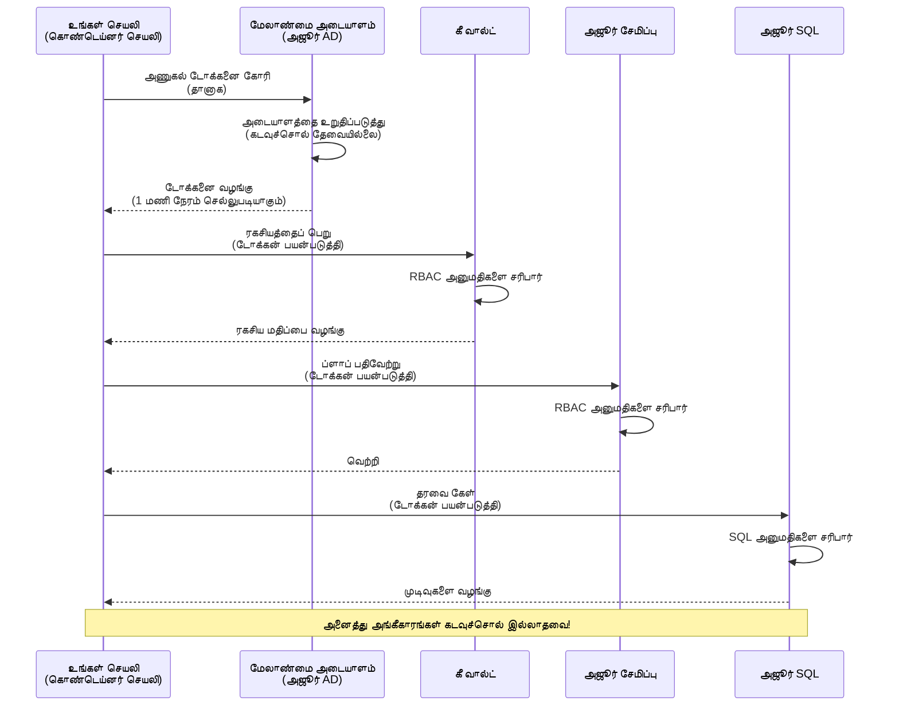
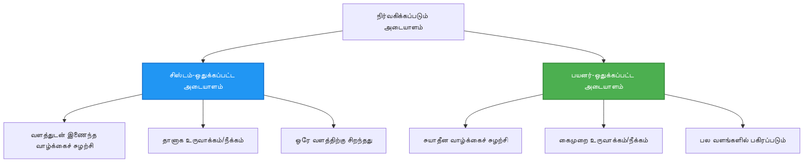

# அங்கீகார வரைமுறைகள் மற்றும் நிர்வகிக்கப்பட்ட அடையாளம்

⏱️ **கணிக்கப்பட்ட காலம்**: 45-60 நிமிடங்கள் | 💰 **செலவுச் சம்பந்தம்**: இலவசம் (கூடுதல் கட்டணங்கள் இல்லை) | ⭐ **சிக்கல்தன்மை**: மத்தியநிலை

**📚 கற்றல் பாதை:**
- ← Previous: [Configuration Management](configuration.md) - கட்டமைப்பு மாறிகள் மற்றும் ரகசியங்களை நிர்வகித்தல்
- 🎯 **நீங்கள் இங்கே**: Authentication & Security (நிர்வகிக்கப்பட்ட அடையாளம், Key Vault, பாதுகாப்பு முறைகள்)
- → Next: [First Project](first-project.md) - உங்கள் முதல் AZD பயன்பாட்டை உருவாக்கவும்
- 🏠 [Course Home](../../README.md)

---

## நீங்கள் என்ன கற்பீர்கள்

இந்த பாடத்தை முடித்தவுடன், நீங்கள்:
- Azure அங்கீகார வரைமுறைகள் (கீகள், இணைப்பு சரங்கள், நிர்வகிக்கப்பட்ட அடையாளம்) புரிந்துகொள்வீர்கள்
- கடவுச்சொல்லற்ற அங்கீகாரத்திற்கு **நிர்வகிக்கப்பட்ட அடையாளம்** செயல்படுத்துவீர்கள்
- **Azure Key Vault** ஒருங்கிணைப்புடன் ரகசியங்களை பாதுகாப்பீர்கள்
- AZD பகிர்வுகளில் **பங்கு அடிப்படையிலான அணுகல் கட்டுப்பாடு (RBAC)** கான்பிகர் செய்வீர்கள்
- Container Apps மற்றும் Azure சேவைகளில் பாதுகாப்பு சிறந்த நடைமுறைகளைப் பயன்படுத்துவீர்கள்
- கீ அடிப்படையிலான அங்கீகாரம் இருந்து அடையாள அடிப்படையிலான அங்கீகாரத்திற்கு மாறுவீர்கள்

## ஏன் நிர்வகிக்கப்பட்ட அடையாளம் முக்கியம்

### பிரச்சினை: பரம்பரையான அங்கீகாரம்

**நிர்வகிக்கப்பட்ட அடையாளம் முன்னர்:**
```javascript
// ❌ பாதுகாப்பு ஆபத்து: குறியீட்டில் நேரடியாக உள்ள ரகசிய தகவல்கள்
const connectionString = "Server=mydb.database.windows.net;User=admin;Password=P@ssw0rd123";
const storageKey = "xK7mN9pQ2wR5tY8uI0oP3aS6dF1gH4jK...";
const cosmosKey = "C2x7B9n4M1p8Q5w3E6r0T2y5U8i1O4p7...";
```

**பிரச்சினைகள்:**
- 🔴 **குறியீட்டிலும் கான்பிக் கோப்புகளிலும், சூழல் மாறிகளிலும் ரகசியங்கள் வெளியாகுகின்றன**
- 🔴 **சான்றிதழ் மறுசுழற்சி** குறியீடு மாற்றங்கள் மற்றும் மீண்டும் வெளியீடு தேவைப்படுகிறது
- 🔴 **ஆடிட் சிக்கல்** - யார் எப்போது என்ன அணுகியது என்ற விவரம் கடினம்
- 🔴 **பகிர்வு** - ரகசியங்கள் பல அமைப்புகளில் பரவியுள்ளது
- 🔴 **பொருந்துதல் ஆபத்துகள்** - பாதுகாப்பு ஆய்வில் தோல்வி

### தீர்வு: நிர்வகிக்கப்பட்ட அடையாளம்

**நிர்வகிக்கப்பட்ட அடையாளம் பிறகு:**
```javascript
// ✅ பாதுகாப்பு: குறியீட்டில் எந்த ரகசியங்களும் இல்லை
const credential = new DefaultAzureCredential();
const client = new BlobServiceClient(
  "https://mystorageaccount.blob.core.windows.net",
  credential  // Azure தானாகவே அங்கீகாரத்தை கையாளுகிறது
);
```

**நன்மைகள்:**
- ✅ **குறியீட்டிலும் கான்பிகிலும் பூஜ்ய ரகசியங்கள்**
- ✅ **தானியங்கி திருப்புதல்** - Azure அதை நிர்வகிக்கிறது
- ✅ **Azure AD பதிவுகளில் முழுமையான ஆடிட் தடம்**
- ✅ **மையப்படுத்தப்பட்ட பாதுகாப்பு** - Azure போர்டலில் நிர்வகிக்கவும்
- ✅ **கோரிக்கைகளுக்கு ஏற்ப இசைப்பாகம்** - பாதுகாப்பு தரநிலைகளை பூர்த்தி செய்கிறது

**உரையோபமான விளக்கம்**: பரம்பரையான அங்கீகாரம் பல கதவுகளுக்கான பல فிசங்களைக் கொளுத்திக்கொண்டிருப்பதைப் போன்றது. நிர்வகிக்கப்பட்ட அடையாளம் என்பது நீங்கள் யார் என்பதின் அடிப்படையில் தானாக அணுகலை வழங்கும் ஒரு பாதுகாப்பு அடையாளப்பதிவை போன்றது — இழக்க, நகலெடுக்க அல்லது திருப்ப தேவையில்லை.

---

## கட்டமைப்பு கண்ணோட்டம்

### நிர்வகிக்கப்பட்ட அடையாளத்துடன் அங்கீகார ஓட்டம்


### நிர்வகிக்கப்பட்ட அடையாளங்களின் வகைகள்


| அம்சம் | சிஸ்டம்-ஒதுக்கப்பட்டது | பயனர்-ஒதுக்கப்பட்டது |
|---------|----------------|---------------|
| **வாழ்நாள்** | வளத்திற்க்கு இணைக்கப்பட்டது | சுயாதீனமானது |
| **ஸ்ரீஷ்டி** | வளத்துடன் தானாக உருவாகிறது | கைமுறை உருவாக்கம் |
| **அழித்தல்** | வளத்துடன் அழிக்கப்படும் | வளம் நீக்கப்பட்டதும் நீடிக்கும் |
| **பகிர்வு** | ஒரே வளத்திற்கு மட்டும் | பல வளங்களுக்கு பகிரலாம் |
| **பயன்பாட்டு ஊக்கம்** | எளிய நிலைகளுக்கு | திறமையான பல-வள நிலைகளுக்கு |
| **AZD இயல்புநிலை** | ✅ பரிந்துரைக்கப்படுகிறது | விருப்பமானது |

---

## முன் தேவைகள்

### தேவையான கருவிகள்

முந்தைய பாடங்களில் நீங்கள் இவற்றை ஏற்கனவே நிறுவி இருக்க வேண்டும்:

```bash
# Azure Developer CLI ஐ சரிபார்க்கவும்
azd version
# ✅ எதிர்பார்க்கப்படும்: azd பதிப்பு 1.0.0 அல்லது அதற்கு மேற்பட்டது

# Azure CLI ஐ சரிபார்க்கவும்
az --version
# ✅ எதிர்பார்க்கப்படும்: azure-cli பதிப்பு 2.50.0 அல்லது அதற்கு மேற்பட்டது
```

### Azure தேவைகள்

- செயலில்ிருக்கும் Azure சந்தா
- அனுமதிகள்:
  - நிர்வகிக்கப்பட்ட அடையாளங்களை உருவாக்க
  - RBAC பங்குகளை ஒதுக்க
  - Key Vault வளங்களை உருவாக்க
  - Container Apps துவக்க உருவாக்க

### அறிவு முன் தேவைகள்

நீங்கள் பூர்த்தி செய்திருக்க வேண்டும்:
- [Installation Guide](installation.md) - AZD அமைத்தல்
- [AZD Basics](azd-basics.md) - அடிப்படை கருத்துகள்
- [Configuration Management](configuration.md) - சூழல் மாறிகள்

---

## பாடம் 1: அங்கீகார வரைமுறைகளைப் புரிந்துகொள்வது

### வரைமை 1: Connection Strings (பழையவை - தவிர்க்கவும்)

**இது எப்படி வேலை செய்கிறது:**
```bash
# இணைப்பு ஸ்ட்ரிங் அங்கீகார தகவல்களைக் கொண்டுள்ளது
STORAGE_CONNECTION_STRING="DefaultEndpointsProtocol=https;AccountName=myaccount;AccountKey=xK7mN9pQ2wR5..."
COSMOS_CONNECTION_STRING="AccountEndpoint=https://myaccount.documents.azure.com:443/;AccountKey=C2x7..."
SQL_CONNECTION_STRING="Server=myserver.database.windows.net;User=admin;Password=P@ssw0rd..."
```

**பிரச்சினைகள்:**
- ❌ சூழல் மாறிகளில் ரகசியங்கள் தெரிகிறது
- ❌ வெளியீட்டு அமைப்புகளில் பதிவு செய்யப்படுகிறது
- ❌ திருப்புதல் கடினம்
- ❌ அணுகல் ஆடிட் தடம் கிடையாது

**எப்போது பயன்படுத்துவது:** உள்ளூர் மேம்பாட்டிற்கே மட்டும்; உற்பத்திக்கு ஒருபோதும் அல்ல.

---

### வரைமை 2: Key Vault குறிப்புகள் (மேலும் சிறந்தது)

**இது எப்படி வேலை செய்கிறது:**
```bicep
// Store secret in Key Vault
resource keyVault 'Microsoft.KeyVault/vaults@2023-02-01' = {
  name: 'mykv'
  properties: {
    enableRbacAuthorization: true
  }
}

// Reference in Container App
env: [
  {
    name: 'STORAGE_KEY'
    secretRef: 'storage-key'  // References Key Vault
  }
]
```

**நன்மைகள்:**
- ✅ ரகசியங்கள் Key Vault-வில் பாதுகாப்பாக சேமிக்கப்படுகின்றன
- ✅ மையப்படுத்தப்பட்ட ரகசிய மேலாண்மை
- ✅ குறியீடு மாற்றங்கள் இல்லாமல் திருப்புதல்

**வரம்புகள்:**
- ⚠️ இன்னும் கீ/கடவுச்சொற்களை பயன்படுத்துகிறது
- ⚠️ Key Vault அணுகலை நிர்வகிக்க வேண்டியது தேவை

**எப்போது பயன்படுத்துவது:** Connection strings-இருந்து நிர்வகிக்கப்பட்ட அடையாளத்திற்கு மாறும் இடைநிலையாக.

---

### வரைமை 3: Managed Identity (சிறந்த நடைமுறை)

**இது எப்படி வேலை செய்கிறது:**
```bicep
// Enable managed identity
resource containerApp 'Microsoft.App/containerApps@2023-05-01' = {
  name: 'myapp'
  identity: {
    type: 'SystemAssigned'  // Automatically creates identity
  }
}

// Grant permissions
resource roleAssignment 'Microsoft.Authorization/roleAssignments@2022-04-01' = {
  scope: storageAccount
  properties: {
    roleDefinitionId: storageBlobDataContributorRole
    principalId: containerApp.identity.principalId
  }
}
```

**அப்ளிகேஷன் குறியீடு:**
```javascript
// ரகசியங்கள் தேவையில்லை!
const { DefaultAzureCredential } = require('@azure/identity');
const { BlobServiceClient } = require('@azure/storage-blob');

const credential = new DefaultAzureCredential();
const blobServiceClient = new BlobServiceClient(
  'https://mystorageaccount.blob.core.windows.net',
  credential
);
```

**நன்மைகள்:**
- ✅ குறியீட்டிலும் கான்பிகிலும் ரகசியங்கள் இல்லை
- ✅ தானியங்கி சான்றிதழ் திருப்புதல்
- ✅ முழுமையான ஆடிட் தடம்
- ✅ RBAC அடிப்படையிலான அனுமதிகள்
- ✅ கோரிக்கைகளுக்கு ஏற்ப செயல்படுகிறது

**எப்போது பயன்படுத்துவது:** எப்போதும், உற்பத்தி பயன்பாடுகளுக்கு.

---

## பாடம் 2: AZD உடன் நிர்வகிக்கப்பட்ட அடையாளத்தை அமல்படுத்துதல்

### படி படியாக செயல்படுத்தல்

நாம் Azure Storage மற்றும் Key Vault-இனுக்கு அணுகுவதற்கு நிர்வகிக்கப்பட்ட அடையாளத்தைப் பயன்படுத்தி ஒரு பாதுகாப்பான Container App-ஐ உருவாக்குவோம்.

### திட்ட அமைப்பு

```
secure-app/
├── azure.yaml                 # AZD configuration
├── infra/
│   ├── main.bicep            # Main infrastructure
│   ├── core/
│   │   ├── identity.bicep    # Managed identity setup
│   │   ├── keyvault.bicep    # Key Vault configuration
│   │   └── storage.bicep     # Storage with RBAC
│   └── app/
│       └── container-app.bicep
└── src/
    ├── app.js                # Application code
    ├── package.json
    └── Dockerfile
```

### 1. AZD ஐ கான்பிகர் செய்க (azure.yaml)

```yaml
name: secure-app
metadata:
  template: secure-app@1.0.0

services:
  api:
    project: ./src
    language: js
    host: containerapp

# Enable managed identity (AZD handles this automatically)
```

### 2. അടിസ്ഥാനஅமைப்பு: நிர்வகிக்கப்பட்ட அடையாளத்தை செயல்படுத்துக

**கோப்பு: `infra/main.bicep`**

```bicep
targetScope = 'subscription'

param environmentName string
param location string = 'eastus'

var tags = { 'azd-env-name': environmentName }

// Resource group
resource rg 'Microsoft.Resources/resourceGroups@2021-04-01' = {
  name: 'rg-${environmentName}'
  location: location
  tags: tags
}

// Storage Account
module storage './core/storage.bicep' = {
  name: 'storage'
  scope: rg
  params: {
    name: 'st${uniqueString(rg.id)}'
    location: location
    tags: tags
  }
}

// Key Vault
module keyVault './core/keyvault.bicep' = {
  name: 'keyvault'
  scope: rg
  params: {
    name: 'kv-${uniqueString(rg.id)}'
    location: location
    tags: tags
  }
}

// Container App with Managed Identity
module containerApp './app/container-app.bicep' = {
  name: 'container-app'
  scope: rg
  params: {
    name: 'ca-${environmentName}'
    location: location
    tags: tags
    storageAccountName: storage.outputs.name
    keyVaultName: keyVault.outputs.name
  }
}

// Grant Container App access to Storage
module storageRoleAssignment './core/role-assignment.bicep' = {
  name: 'storage-role'
  scope: rg
  params: {
    principalId: containerApp.outputs.identityPrincipalId
    roleDefinitionId: 'ba92f5b4-2d11-453d-a403-e96b0029c9fe'  // Storage Blob Data Contributor
    targetResourceId: storage.outputs.id
  }
}

// Grant Container App access to Key Vault
module kvRoleAssignment './core/role-assignment.bicep' = {
  name: 'kv-role'
  scope: rg
  params: {
    principalId: containerApp.outputs.identityPrincipalId
    roleDefinitionId: '4633458b-17de-408a-b874-0445c86b69e6'  // Key Vault Secrets User
    targetResourceId: keyVault.outputs.id
  }
}

// Outputs
output AZURE_STORAGE_ACCOUNT_NAME string = storage.outputs.name
output AZURE_KEY_VAULT_NAME string = keyVault.outputs.name
output APP_URL string = containerApp.outputs.url
```

### 3. System-Assigned அடையாளத்துடன் Container App

**கோப்பு: `infra/app/container-app.bicep`**

```bicep
param name string
param location string
param tags object = {}
param storageAccountName string
param keyVaultName string

resource containerApp 'Microsoft.App/containerApps@2023-05-01' = {
  name: name
  location: location
  tags: tags
  identity: {
    type: 'SystemAssigned'  // 🔑 Enable managed identity
  }
  properties: {
    configuration: {
      ingress: {
        external: true
        targetPort: 3000
      }
    }
    template: {
      containers: [
        {
          name: 'api'
          image: 'myregistry.azurecr.io/api:latest'
          resources: {
            cpu: json('0.5')
            memory: '1Gi'
          }
          env: [
            {
              name: 'AZURE_STORAGE_ACCOUNT_NAME'
              value: storageAccountName
            }
            {
              name: 'AZURE_KEY_VAULT_NAME'
              value: keyVaultName
            }
            // 🔑 No secrets - managed identity handles authentication!
          ]
        }
      ]
    }
  }
}

// Output the identity for RBAC assignments
output identityPrincipalId string = containerApp.identity.principalId
output id string = containerApp.id
output url string = 'https://${containerApp.properties.configuration.ingress.fqdn}'
```

### 4. RBAC பங்கு ஒதுக்கீட்டு மொடியூல்

**கோப்பு: `infra/core/role-assignment.bicep`**

```bicep
param principalId string
param roleDefinitionId string  // Azure built-in role ID
param targetResourceId string

resource roleAssignment 'Microsoft.Authorization/roleAssignments@2022-04-01' = {
  name: guid(principalId, roleDefinitionId, targetResourceId)
  scope: resourceId('Microsoft.Resources/resourceGroups', resourceGroup().name)
  properties: {
    roleDefinitionId: subscriptionResourceId('Microsoft.Authorization/roleDefinitions', roleDefinitionId)
    principalId: principalId
    principalType: 'ServicePrincipal'
  }
}

output id string = roleAssignment.id
```

### 5. நிர்வகிக்கப்பட்ட அடையாளத்துடன் பயன்பாட்டு குறியீடு

**கோப்பு: `src/app.js`**

```javascript
const express = require('express');
const { DefaultAzureCredential } = require('@azure/identity');
const { BlobServiceClient } = require('@azure/storage-blob');
const { SecretClient } = require('@azure/keyvault-secrets');

const app = express();
const PORT = process.env.PORT || 3000;

// 🔑 சான்றிதழை ஆரம்பித்தல் (நிர்வகிக்கப்பட்ட அடையாளத்துடன் தானாக செயல்படுகிறது)
const credential = new DefaultAzureCredential();

// Azure சேமிப்பு அமைப்பு
const storageAccountName = process.env.AZURE_STORAGE_ACCOUNT_NAME;
const blobServiceClient = new BlobServiceClient(
  `https://${storageAccountName}.blob.core.windows.net`,
  credential  // விசைகள் தேவையில்லை!
);

// கீ வால்ட் அமைப்பு
const keyVaultName = process.env.AZURE_KEY_VAULT_NAME;
const secretClient = new SecretClient(
  `https://${keyVaultName}.vault.azure.net`,
  credential  // விசைகள் தேவையில்லை!
);

// நலச் சரிபார்ப்பு
app.get('/health', (req, res) => {
  res.json({ status: 'healthy', authentication: 'managed-identity' });
});

// கோப்பை ப்ளாப் சேமிப்பில் பதிவேற்றவும்
app.post('/upload', async (req, res) => {
  try {
    const containerClient = blobServiceClient.getContainerClient('uploads');
    await containerClient.createIfNotExists();
    
    const blobName = `file-${Date.now()}.txt`;
    const blockBlobClient = containerClient.getBlockBlobClient(blobName);
    
    await blockBlobClient.upload('Hello from managed identity!', 30);
    
    res.json({
      success: true,
      blobName: blobName,
      message: 'File uploaded using managed identity!'
    });
  } catch (error) {
    console.error('Upload error:', error);
    res.status(500).json({ error: error.message });
  }
});

// கீ வால்ட் இலிருந்து ரகசியத்தைப் பெறவும்
app.get('/secret/:name', async (req, res) => {
  try {
    const secretName = req.params.name;
    const secret = await secretClient.getSecret(secretName);
    
    res.json({
      name: secretName,
      value: secret.value,
      message: 'Secret retrieved using managed identity!'
    });
  } catch (error) {
    console.error('Secret error:', error);
    res.status(500).json({ error: error.message });
  }
});

// ப்ளாப் கன்டெய்னர்களை பட்டியலிடு (வாசிப்பு அணுகலை விளக்குகிறது)
app.get('/containers', async (req, res) => {
  try {
    const containers = [];
    for await (const container of blobServiceClient.listContainers()) {
      containers.push(container.name);
    }
    
    res.json({
      containers: containers,
      count: containers.length,
      message: 'Containers listed using managed identity!'
    });
  } catch (error) {
    console.error('List error:', error);
    res.status(500).json({ error: error.message });
  }
});

app.listen(PORT, () => {
  console.log(`Secure API listening on port ${PORT}`);
  console.log('Authentication: Managed Identity (passwordless)');
});
```

**கோப்பு: `src/package.json`**

```json
{
  "name": "secure-app",
  "version": "1.0.0",
  "dependencies": {
    "express": "^4.18.2",
    "@azure/identity": "^4.0.0",
    "@azure/storage-blob": "^12.17.0",
    "@azure/keyvault-secrets": "^4.7.0"
  },
  "scripts": {
    "start": "node app.js"
  }
}
```

### 6. வெளியீடு செய்து சோதனை செய்க

```bash
# AZD சூழலை ஆரம்பிக்கவும்
azd init

# அடித்தளத்தையும் பயன்பாட்டையும் விநியோகிக்கவும்
azd up

# பயன்பாட்டின் URL ஐப் பெறவும்
APP_URL=$(azd env get-values | grep APP_URL | cut -d '=' -f2 | tr -d '"')

# ஆரோக்கியச் சரிபார்ப்பை சோதிக்கவும்
curl $APP_URL/health
```

**✅ எதிர்பார்த்த வெளியீடு:**
```json
{
  "status": "healthy",
  "authentication": "managed-identity"
}
```

**பரிசோதனை பூபிள் பதிவேற்றம்:**
```bash
curl -X POST $APP_URL/upload
```

**✅ எதிர்பார்த்த வெளியீடு:**
```json
{
  "success": true,
  "blobName": "file-1700404800000.txt",
  "message": "File uploaded using managed identity!"
}
```

**கண்டெய்னர் பட்டியலை சோதனை செய்க:**
```bash
curl $APP_URL/containers
```

**✅ எதிர்பார்த்த வெளியீடு:**
```json
{
  "containers": ["uploads"],
  "count": 1,
  "message": "Containers listed using managed identity!"
}
```

---

## பொதுவான Azure RBAC பங்குகள்

### நிர்வகிக்கப்பட்ட அடையாளத்திற்கான கட்டமைக்கப்பட்ட பங்கு IDகள்

| சேவை | Role Name | Role ID | அனுமதிகள் |
|---------|-----------|---------|-------------|
| **Storage** | Storage Blob Data Reader | `2a2b9908-6b94-4a3d-8e5a-a7d8f8cc8a12` | பிளாப்களையும் கன்டெய்னர்களையும் வாசிக்கலாம் |
| **Storage** | Storage Blob Data Contributor | `ba92f5b4-2d11-453d-a403-e96b0029c9fe` | பிளாப்களை வாசிக்க, எழுத, நீக்க முடியும் |
| **Storage** | Storage Queue Data Contributor | `974c5e8b-45b9-4653-ba55-5f855dd0fb88` | கியூ செய்திகளை வாசிக்க, எழுத, நீக்க முடியும் |
| **Key Vault** | Key Vault Secrets User | `4633458b-17de-408a-b874-0445c86b69e6` | ரகசியங்களை வாசிக்க முடியும் |
| **Key Vault** | Key Vault Secrets Officer | `b86a8fe4-44ce-4948-aee5-eccb2c155cd7` | ரகசியங்களை வாசிக்க, எழுத, நீக்க முடியும் |
| **Cosmos DB** | Cosmos DB Built-in Data Reader | `00000000-0000-0000-0000-000000000001` | Cosmos DB தரவை வாசிக்க முடியும் |
| **Cosmos DB** | Cosmos DB Built-in Data Contributor | `00000000-0000-0000-0000-000000000002` | Cosmos DB தரவை வாசிக்கவும், எழுதவும் முடியும் |
| **SQL Database** | SQL DB Contributor | `9b7fa17d-e63e-47b0-bb0a-15c516ac86ec` | SQL தரவுத்தளங்களை நிர்வகிக்க முடியும் |
| **Service Bus** | Azure Service Bus Data Owner | `090c5cfd-751d-490a-894a-3ce6f1109419` | செய்திகளை அனுப்ப, பெற மற்றும் நிர்வகிக்க முடியும் |

### Role IDகளை எப்படி கண்டுபிடிப்பது

```bash
# அனைத்து உள்ளமைக்கப்பட்ட பங்குகளை பட்டியலிடவும்
az role definition list --query "[].{Name:roleName, ID:name}" --output table

# குறிப்பிட்ட பங்கினைத் தேடவும்
az role definition list --query "[?contains(roleName, 'Storage Blob')].{Name:roleName, ID:name}" --output table

# பங்கின் விவரங்களைப் பெறவும்
az role definition list --name "Storage Blob Data Contributor"
```

---

## நடைமுறை பயிற்சிகள்

### பயிற்சி 1: நுழைந்துள்ள பயன்பாட்டிற்கு நிர்வகிக்கப்பட்ட அடையாளத்தை இயக்கு ⭐⭐ (மத்தியநிலை)

**கோலம்**: ஏற்கனவே உள்ள Container App வெளியீட்டிற்கு நிர்வகிக்கப்பட்ட அடையாளத்தை சேர்க்கவும்

**நிலமை**: உங்கள் Container App இணைப்பு சரங்களை பயன்படுத்துகிறது. அதை நிர்வகிக்கப்பட்ட அடையாளத்திற்கு மாற்றவும்.

**ஆரம்ப புள்ளி**: இந்த கட்டமைப்புடன் Container App:

```bicep
// ❌ Current: Using connection string
env: [
  {
    name: 'STORAGE_CONNECTION_STRING'
    secretRef: 'storage-connection'
  }
]
```

**படி வழிகள்**:

1. **Bicep-ல் நிர்வகிக்கப்பட்ட அடையாளத்தை இயக்கு:**

```bicep
resource containerApp 'Microsoft.App/containerApps@2023-05-01' = {
  name: 'myapp'
  identity: {
    type: 'SystemAssigned'  // Add this
  }
  // ... rest of configuration
}
```

2. **Storage அணுகலை கொடுக்கவும்:**

```bicep
// Get storage account reference
resource storageAccount 'Microsoft.Storage/storageAccounts@2023-01-01' existing = {
  name: storageAccountName
}

// Assign role
resource roleAssignment 'Microsoft.Authorization/roleAssignments@2022-04-01' = {
  name: guid(containerApp.id, 'ba92f5b4-2d11-453d-a403-e96b0029c9fe', storageAccount.id)
  scope: storageAccount
  properties: {
    roleDefinitionId: subscriptionResourceId('Microsoft.Authorization/roleDefinitions', 'ba92f5b4-2d11-453d-a403-e96b0029c9fe')
    principalId: containerApp.identity.principalId
    principalType: 'ServicePrincipal'
  }
}
```

3. **பயன்பாட்டு குறியீட்டை மேம்படுத்து:**

**முன்பு (connection string):**
```javascript
const { BlobServiceClient } = require('@azure/storage-blob');

const blobServiceClient = BlobServiceClient.fromConnectionString(
  process.env.STORAGE_CONNECTION_STRING
);
```

**பின்னர் (managed identity):**
```javascript
const { DefaultAzureCredential } = require('@azure/identity');
const { BlobServiceClient } = require('@azure/storage-blob');

const credential = new DefaultAzureCredential();
const blobServiceClient = new BlobServiceClient(
  `https://${process.env.STORAGE_ACCOUNT_NAME}.blob.core.windows.net`,
  credential
);
```

4. **சூழல் மாறிகளை புதுப்பிக்கவும்:**

```bicep
env: [
  {
    name: 'STORAGE_ACCOUNT_NAME'
    value: storageAccountName  // Just the name, no secrets!
  }
  // Remove STORAGE_CONNECTION_STRING
]
```

5. **வெளியீடு செய்து சோதனை செய்க:**

```bash
# மீண்டும் செயல்படுத்தவும்
azd up

# இது இன்னும் வேலை செய்கிறதா என்பதைச் சோதிக்கவும்
curl https://myapp.azurecontainerapps.io/upload
```

**✅ வெற்றி அளவுருக்கள்:**
- ✅ செயலி பிழையில்லாமல் வெளியிடப்படுகிறது
- ✅ Storage செயல்பாடுகள் வேலை செய்க (பதிவேற்றம், பட்டியல், பதிவிறக்கம்)
- ✅ சூழல் மாறிகளில்இல்லாமல் எந்த இணைப்பு சரங்களும் இல்லை
- ✅ Azure போர்டலின் "Identity" தாவலில் அடையாளம் காணப்படும்

**சரிபார்த்தல்:**

```bash
# மேலாண்மை அடையாளம் செயல்படுத்தப்பட்டுள்ளதா என்பதை சரிபார்க்கவும்
az containerapp show \
  --name myapp \
  --resource-group rg-myapp \
  --query "identity.type"
# ✅ எதிர்பார்க்கப்படுகிறது: "SystemAssigned"

# பங்கு ஒதுக்கீட்டை சரிபார்க்கவும்
az role assignment list \
  --assignee $(az containerapp show --name myapp --resource-group rg-myapp --query "identity.principalId" -o tsv) \
  --scope /subscriptions/{sub-id}/resourceGroups/rg-myapp/providers/Microsoft.Storage/storageAccounts/mystorageaccount
# ✅ எதிர்பார்க்கப்படுகிறது: "Storage Blob Data Contributor" பங்கு காணப்படும்
```

**நேரம்**: 20-30 நிமிடங்கள்

---

### பயிற்சி 2: பல சேவைகளுக்கான பயனர்-ஒதுக்கப்பட்ட அடையாளம் ⭐⭐⭐ (மேம்பட்டது)

**கோளம்**: பல Container Apps இடையே பகிரப்பட்ட ஒரு பயனர்-ஒதுக்கப்பட்ட அடையாளத்தை உருவாக்குக

**நிலமை**: ஒரே Storage கணக்கு மற்றும் Key Vault-ஐ அணுக வேண்டிய 3 மைக்ரோசேவைகள் உங்களிடம் உள்ளன.

**படிகள்**:

1. **பயனர்-ஒதுக்கப்பட்ட அடையாளத்தை உருவாக்குக:**

**கோப்பு: `infra/core/identity.bicep`**

```bicep
param name string
param location string
param tags object = {}

resource userAssignedIdentity 'Microsoft.ManagedIdentity/userAssignedIdentities@2023-01-31' = {
  name: name
  location: location
  tags: tags
}

output id string = userAssignedIdentity.id
output principalId string = userAssignedIdentity.properties.principalId
output clientId string = userAssignedIdentity.properties.clientId
```

2. **பயனர்-ஒதுக்கப்பட்ட அடையாளத்திற்கு பங்குகளை ஒதுக்குக:**

```bicep
// In main.bicep
module userIdentity './core/identity.bicep' = {
  name: 'user-identity'
  scope: rg
  params: {
    name: 'id-${environmentName}'
    location: location
    tags: tags
  }
}

// Grant Storage access
resource storageRoleAssignment 'Microsoft.Authorization/roleAssignments@2022-04-01' = {
  name: guid(userIdentity.outputs.principalId, 'storage-contributor')
  scope: storageAccount
  properties: {
    roleDefinitionId: subscriptionResourceId('Microsoft.Authorization/roleDefinitions', 'ba92f5b4-2d11-453d-a403-e96b0029c9fe')
    principalId: userIdentity.outputs.principalId
    principalType: 'ServicePrincipal'
  }
}

// Grant Key Vault access
resource kvRoleAssignment 'Microsoft.Authorization/roleAssignments@2022-04-01' = {
  name: guid(userIdentity.outputs.principalId, 'kv-secrets-user')
  scope: keyVault
  properties: {
    roleDefinitionId: subscriptionResourceId('Microsoft.Authorization/roleDefinitions', '4633458b-17de-408a-b874-0445c86b69e6')
    principalId: userIdentity.outputs.principalId
    principalType: 'ServicePrincipal'
  }
}
```

3. **பல Container Apps-க்கு அடையாளத்தை ஒதுக்குக:**

```bicep
resource apiGateway 'Microsoft.App/containerApps@2023-05-01' = {
  name: 'api-gateway'
  identity: {
    type: 'UserAssigned'
    userAssignedIdentities: {
      '${userIdentity.outputs.id}': {}
    }
  }
  // ... rest of config
}

resource productService 'Microsoft.App/containerApps@2023-05-01' = {
  name: 'product-service'
  identity: {
    type: 'UserAssigned'
    userAssignedIdentities: {
      '${userIdentity.outputs.id}': {}
    }
  }
  // ... rest of config
}

resource orderService 'Microsoft.App/containerApps@2023-05-01' = {
  name: 'order-service'
  identity: {
    type: 'UserAssigned'
    userAssignedIdentities: {
      '${userIdentity.outputs.id}': {}
    }
  }
  // ... rest of config
}
```

4. **பயன்பாட்டு குறியீடு (எல்லா சேவைகளும் அதே முறையைப் பயன்படுத்துகின்றன):**

```javascript
const { DefaultAzureCredential, ManagedIdentityCredential } = require('@azure/identity');

// பயனர்-ஒதுக்கப்பட்ட அடையாளத்திற்காக கிளையன்ட் ஐடியைப் குறிப்பிடவும்
const credential = new ManagedIdentityCredential(
  process.env.AZURE_CLIENT_ID  // பயனர்-ஒதுக்கப்பட்ட அடையாளத்தின் கிளையன்ட் ஐடி
);

// அல்லது DefaultAzureCredential ஐப் பயன்படுத்தவும் (தானாகவே கண்டறிகிறது)
const credential = new DefaultAzureCredential();

const blobServiceClient = new BlobServiceClient(
  `https://${process.env.STORAGE_ACCOUNT_NAME}.blob.core.windows.net`,
  credential
);
```

5. **வெளியீடு செய்து சரிபார்க்கவும்:**

```bash
azd up

# எல்லா சேவைகளும் சேமிப்பிடம் அணுக முடிகிறதா என்பதை சோதிக்கவும்
curl https://api-gateway.azurecontainerapps.io/upload
curl https://product-service.azurecontainerapps.io/upload
curl https://order-service.azurecontainerapps.io/upload
```

**✅ வெற்றி அளவுருக்கள்:**
- ✅ ஒரே அடையாளம் 3 சேவைகளில் பகிரப்பட்டது
- ✅ அனைத்து சேவைகளும் Storage மற்றும் Key Vault-ஐ அணுக முடிகிறது
- ✅ ஒரு சேவையை நீக்கினாலும் அடையாளம் நிலைத்திருக்கும்
- ✅ மையப்படுத்தப்பட்ட அனுமதி மேலாண்மை

பயனர்-ஒதுக்கப்பட்ட அடையாளத்தின் நன்மைகள்:
- நிர்வகிக்க ஒன்றேயான அடையாளம்
- சேவைகளுக்கு ஒத்த அனுமதிகள்
- சேவை நீக்கத்திற்கு பிறகும் நிலைத்திருக்கும்
- குழுமமான கட்டமைப்புகளுக்கு சிறந்தது

**நேரம்**: 30-40 நிமிடங்கள்

---

### பயிற்சி 3: Key Vault ரகசிய மறுசுழற்சி செயல்படுத்துக ⭐⭐⭐ (மேம்பட்டது)

**கோளம்**: Key Vault-இல் மூன்றாம் पक्ष API கீக்களை சேமித்து அவற்றை நிர்வகிக்கப்பட்ட அடையாளத்தைப் பயன்படுத்தி அணுகுக

**நிலமை**: உங்கள் செயலி வெளிப்புற API (OpenAI, Stripe, SendGrid) களை அழைக்க API கீகளை தேவைப்படுத்துகிறது.

**படிகள்**:

1. **RBAC உடன் Key Vault உருவாக்குக:**

**கோப்பு: `infra/core/keyvault.bicep`**

```bicep
param name string
param location string
param tags object = {}

resource keyVault 'Microsoft.KeyVault/vaults@2023-02-01' = {
  name: name
  location: location
  tags: tags
  properties: {
    enableRbacAuthorization: true  // Use RBAC instead of access policies
    sku: {
      family: 'A'
      name: 'standard'
    }
    tenantId: subscription().tenantId
    enableSoftDelete: true
    softDeleteRetentionInDays: 90
  }
}

// Allow Container App to read secrets
output id string = keyVault.id
output name string = keyVault.name
output uri string = keyVault.properties.vaultUri
```

2. **Key Vault-இல் ரகசியங்களை சேமிக்கவும்:**

```bash
# Key Vault பெயரைப் பெறவும்
KV_NAME=$(azd env get-values | grep AZURE_KEY_VAULT_NAME | cut -d '=' -f2 | tr -d '"')

# மூன்றாம் தரப்பு API விசைகளை சேமிக்கவும்
az keyvault secret set \
  --vault-name $KV_NAME \
  --name "OpenAI-ApiKey" \
  --value "sk-proj-xxxxxxxxxxxxx"

az keyvault secret set \
  --vault-name $KV_NAME \
  --name "Stripe-ApiKey" \
  --value "sk_live_xxxxxxxxxxxxx"

az keyvault secret set \
  --vault-name $KV_NAME \
  --name "SendGrid-ApiKey" \
  --value "SG.xxxxxxxxxxxxx"
```

3. **ரகசியங்களை பெற பயன்பாட்டு குறியீடு:**

**கோப்பு: `src/config.js`**

```javascript
const { DefaultAzureCredential } = require('@azure/identity');
const { SecretClient } = require('@azure/keyvault-secrets');

class Config {
  constructor() {
    this.credential = new DefaultAzureCredential();
    this.secretClient = new SecretClient(
      `https://${process.env.AZURE_KEY_VAULT_NAME}.vault.azure.net`,
      this.credential
    );
    this.cache = {};
  }

  async getSecret(secretName) {
    // முதலில் கேஷைப் சரிபார்க்கவும்
    if (this.cache[secretName]) {
      return this.cache[secretName];
    }

    try {
      const secret = await this.secretClient.getSecret(secretName);
      this.cache[secretName] = secret.value;
      console.log(`✅ Retrieved secret: ${secretName}`);
      return secret.value;
    } catch (error) {
      console.error(`❌ Failed to get secret ${secretName}:`, error.message);
      throw error;
    }
  }

  async getOpenAIKey() {
    return this.getSecret('OpenAI-ApiKey');
  }

  async getStripeKey() {
    return this.getSecret('Stripe-ApiKey');
  }

  async getSendGridKey() {
    return this.getSecret('SendGrid-ApiKey');
  }
}

module.exports = new Config();
```

4. **பயன்பாட்டில் ரகசியங்களைப் பயன்படுத்துக:**

**கோப்பு: `src/app.js`**

```javascript
const express = require('express');
const config = require('./config');
const { OpenAI } = require('openai');

const app = express();

// Key Vault-இலிருந்து கிடைக்கும் விசையைக் கொண்டு OpenAI-ஐ துவக்கவும்
let openaiClient;

async function initializeServices() {
  const openaiKey = await config.getOpenAIKey();
  openaiClient = new OpenAI({ apiKey: openaiKey });
  console.log('✅ Services initialized with secrets from Key Vault');
}

// துவக்கத்தின் போது அழைக்கவும்
initializeServices().catch(console.error);

app.post('/chat', async (req, res) => {
  try {
    const completion = await openaiClient.chat.completions.create({
      model: 'gpt-4',
      messages: [{ role: 'user', content: 'Hello!' }]
    });
    
    res.json({
      response: completion.choices[0].message.content,
      authentication: 'Key from Key Vault via Managed Identity'
    });
  } catch (error) {
    res.status(500).json({ error: error.message });
  }
});

app.listen(3000, () => {
  console.log('Secure API with Key Vault integration running');
});
```

5. **வெளியீடு செய்து சோதனை செய்க:**

```bash
azd up

# API விசைகள் வேலை செய்கிறதா என்பதை சோதனை செய்
curl -X POST https://myapp.azurecontainerapps.io/chat \
  -H "Content-Type: application/json" \
  -d '{"message":"Hello AI"}'
```

**✅ வெற்றி அளவுருக்கள்:**
- ✅ குறியீட்டிலும் சூழல் மாறிகளிலும் எந்த API கீக்களும் இல்லை
- ✅ செயலி Key Vault-இருந்து கீகளை பெறுகிறது
- ✅ மூன்றாம் தரப்பு APIs சரியாக வேலை செய்கின்றன
- ✅ குறியீடு மாற்றம் இல்லாமல் கீகளை மறுசுழற்ற முடியும்

**ஒரு ரகசியத்தை மறுசுழற்றுக:**

```bash
# Key Vault இல் ரகசியத்தை புதுப்பிக்கவும்
az keyvault secret set \
  --vault-name $KV_NAME \
  --name "OpenAI-ApiKey" \
  --value "sk-proj-NEW_KEY_HERE"

# புதிய திறவுகோலைப் பெற பயன்பாட்டை மறுதொடக்கம் செய்யவும்
az containerapp revision restart \
  --name myapp \
  --resource-group rg-myapp
```

**நேரம்**: 25-35 நிமிடங்கள்

---

## அறிவு சோதனை

### 1. அங்கீகார வரைமுறைகள் ✓

உங்கள் புரிதலை சோதிக்கவும்:

- [ ] **Q1**: முக்கியமான மூன்று அங்கீகார வரைமுறைகள் என்னவை? 
  - **A**: Connection strings (பழையவை), Key Vault references (இடம்படுத்தல்), Managed Identity (மிகச்சிறந்தது)

- [ ] **Q2**: ஏன் நிர்வகிக்கப்பட்ட அடையாளம் connection strings-ஐவிட சிறந்தது?
  - **A**: குறியீட்டில் எந்த ரகசியங்களும் இல்லாமல் இருக்கும், தானியங்கி திருப்புதல், முழு ஆடிட் தடம், RBAC அனுமதிகள்

- [ ] **Q3**: System-assigned-இன் பதிலாக user-assigned அடையாளத்தை எப்போது பயன்படுத்துவீர்கள்?
  - **A**: பல வளங்களுக்கு அடையாளத்தை பகிரவேண்டியபோது அல்லது அடையாளத்தின் வாழ்க்கைச் சுழற்சி வளத்தின் வாழ்க்கைச் சுழற்சியிலிருந்து சுயாதீனமாக இருக்க வேண்டியபோது

**கைமுறை சரிபார்த்தல்:**
```bash
# உங்கள் செயலி எந்த வகையான அடையாளத்தை பயன்படுத்துகிறது என்பதை சரிபார்க்கவும்
az containerapp show \
  --name myapp \
  --resource-group rg-myapp \
  --query "identity.type"

# அடையாளத்திற்கான அனைத்து பங்கு நியமனங்களையும் பட்டியலிடவும்
az role assignment list \
  --assignee $(az containerapp show --name myapp --resource-group rg-myapp --query "identity.principalId" -o tsv)
```

---

### 2. RBAC மற்றும் அனுமதிகள் ✓

உங்கள் புரிதலை சோதிக்கவும்:

- [ ] **Q1**: "Storage Blob Data Contributor" க்கான பங்கு ID என்ன?
  - **A**: `ba92f5b4-2d11-453d-a403-e96b0029c9fe`

- [ ] **Q2**: "Key Vault Secrets User" என்ன அனுமதிகளை வழங்குகிறது?
  - **A**: ரகசியங்களை வாசிக்க மட்டும் அனுமதி (உருவாக்கம், புதுப்பிப்பு அல்லது நீக்க முடியாது)

- [ ] **Q3**: Container App-க்கு Azure SQL அணுகலை நீங்கள் எப்படி வழங்குவீர்கள்?
  - **A**: "SQL DB Contributor" பண்ணை ஒதுக்கவும் அல்லது SQL-க்கான Azure AD அங்கீகாரத்தை அமைக்கவும்

**கைமுறை சரிபார்த்தல்:**
```bash
# குறிப்பிட்ட பங்கைக் கண்டறிய
az role definition list --name "Storage Blob Data Contributor"

# உங்கள் அடையாளத்துக்கு எந்த பங்குகள் ஒதுக்கப்பட்டுள்ளதாக உள்ளது என்பதை சரிபார்க்கவும்
PRINCIPAL_ID=$(az containerapp show --name myapp --resource-group rg-myapp --query "identity.principalId" -o tsv)
az role assignment list --assignee $PRINCIPAL_ID --output table
```

---

### 3. Key Vault ஒருங்கிணைப்பு ✓
- [ ] **Q1**: Key Vault இல் அணுகல் கொள்முறைகள் மாற்றாக RBAC ஐ எப்படிச் செயல்படுத்துவது?
  - **A**: Bicep இல் `enableRbacAuthorization: true` என்று அமைக்கவும்

- [ ] **Q2**: எந்த Azure SDK நூலகம் managed identity அங்கீகாரத்தை கையாளுகிறது?
  - **A**: `@azure/identity` மற்றும் `DefaultAzureCredential` வகுப்பு மூலம்

- [ ] **Q3**: Key Vault ரகசியங்கள் cache இல் எவ்வளவு காலம் இருக்கும்?
  - **A**: பயன்பாட்டின் அடிப்படையில்; உங்கள் சொந்த caching სტ்ராடஜியை நடைமுறைப்படுத்தவும்

**Hands-On Verification:**
```bash
# Key Vault அணுகலை சோதிக்கவும்
az keyvault secret show \
  --vault-name $KV_NAME \
  --name "OpenAI-ApiKey" \
  --query "value"

# RBAC செயல்பாட்டில் இருக்கிறதா என்பதைச் சரிபார்க்கவும்
az keyvault show \
  --name $KV_NAME \
  --query "properties.enableRbacAuthorization"
# ✅ எதிர்பார்ப்பு: true
```

---

## பாதுகாப்பு சிறந்த நடைமுறைகள்

### ✅ செய்யவும்:

1. **உற்பத்தியில் எப்போதும் managed identity ஐ பயன்படுத்தவும்**
   ```bicep
   identity: {
     type: 'SystemAssigned'
   }
   ```

2. **குறைந்த அனுமதி RBAC பங்களிப்புகளைப் பயன்படுத்தவும்**
   - சாத்தியமானபோது "Reader" பண்புகளைப் பயன்படுத்தவும்
   - தேவையான போது தவிர "Owner" அல்லது "Contributor" விட தவிர்க்கவும்

3. **மூன்றாம் தரப்பு விசைகளை Key Vault இல் சேமிக்கவும்**
   ```javascript
   const apiKey = await secretClient.getSecret('ThirdPartyApiKey');
   ```

4. **ஆடிட் பதிவு செயல்படுத்தவும்**
   ```bicep
   diagnosticSettings: {
     logs: [{ category: 'AuditEvent', enabled: true }]
   }
   ```

5. **dev/staging/prod க்கான வெவ்வேறு அடையாளங்களைப் பயன்படுத்தவும்**
   ```bash
   azd env new dev
   azd env new staging
   azd env new prod
   ```

6. **ரகசியங்களை நியமமான முறையில் மறு சுழற்சி செய்யவும்**
   - Key Vault ரகசியங்களுக்கு காலாவதி தேதிகளை அமைக்கவும்
   - Azure Functions மூலம் சுழற்சி தானாகச் செய்யவும்

### ❌ செய்யாதீர்கள்:

1. **ரகசியங்களை நேரடியாக கோடில் (hardcode) இட வேண்டாம்**
   ```javascript
   // ❌ மோசம்
   const apiKey = "sk-proj-xxxxxxxxxxxxx";
   ```

2. **உற்பத்தியில் connection strings ஐப் பயன்படுத்த வேண்டாம்**
   ```javascript
   // ❌ மோசம்
   BlobServiceClient.fromConnectionString(process.env.STORAGE_CONNECTION_STRING)
   ```

3. **அதிகளவு அனுமதிகளை வழங்காதீர்கள்**
   ```bicep
   // ❌ BAD - too much access
   roleDefinitionId: 'Owner'
   
   // ✅ GOOD - least privilege
   roleDefinitionId: 'Storage Blob Data Reader'
   ```

4. **ரகசியங்களை பதிவு செய்யாதீர்கள்**
   ```javascript
   // ❌ மோசம்
   console.log('API Key:', apiKey);
   
   // ✅ நன்று
   console.log('API Key retrieved successfully');
   ```

5. **புரொடக்ஷன் அடையாளங்களை பல சூழல்களில் பகிர வேண்டாம்**
   ```bicep
   // ❌ BAD - same identity for dev and prod
   // ✅ GOOD - separate identities per environment
   ```

---

## பிரச்சனை தீர்வு வழிகாட்டி

### பிரச்சனை: Azure Storage அணுகும் போது "Unauthorized"

**அறிகுறிகள்:**
```
Error: Unauthorized (403)
AuthorizationPermissionMismatch: This request is not authorized to perform this operation
```

**காரணம்:**

```bash
# மேலாண்மை அடையாளம் செயல்படுத்தப்பட்டுள்ளதா என்று சரிபார்
az containerapp show \
  --name myapp \
  --resource-group rg-myapp \
  --query "identity.type"
# ✅ எதிர்பார்க்கப்படுகிறது: "SystemAssigned" அல்லது "UserAssigned"

# பங்கு ஒதுக்கீடுகளை சரிபார்
PRINCIPAL_ID=$(az containerapp show --name myapp --resource-group rg-myapp --query "identity.principalId" -o tsv)
az role assignment list --assignee $PRINCIPAL_ID

# எதிர்பார்க்கப்படுகிறது: "Storage Blob Data Contributor" அல்லது அதே மாதிரியான பங்கு காணப்பட வேண்டும்
```

**தீர்வுகள்:**

1. **சரியான RBAC பங்கை வழங்கவும்:**
```bash
STORAGE_ID=$(az storage account show --name mystorageaccount --resource-group rg-myapp --query "id" -o tsv)
az role assignment create \
  --assignee $PRINCIPAL_ID \
  --role "Storage Blob Data Contributor" \
  --scope $STORAGE_ID
```

2. **பரவுதலை காத்திருங்கள் (5-10 நிமிடங்கள் ஆகலாம்):**
```bash
# பங்கு ஒதுக்கல் நிலையை சரிபார்க்கவும்
az role assignment list --assignee $PRINCIPAL_ID --scope $STORAGE_ID
```

3. **பயன்பாட்டு குறியீடு சரியான credential ஐப் பயன்படுத்துகிறதா என சரிபார்க்கவும்:**
```javascript
// நீங்கள் DefaultAzureCredential ஐப் பயன்படுத்துகிறீர்கள் என்பதை உறுதி செய்யவும்
const credential = new DefaultAzureCredential();
```

---

### பிரச்சனை: Key Vault அணுகல் நிராகரப்பட்டது

**அறிகுறிகள்:**
```
Error: Forbidden (403)
The user, group or application does not have secrets get permission
```

**காரணம்:**

```bash
# Key Vault RBAC இயலுமைப்படுத்தப்பட்டுள்ளதா என்பதைச் சரிபார்க்கவும்
az keyvault show \
  --name $KV_NAME \
  --query "properties.enableRbacAuthorization"
# ✅ எதிர்பார்ப்பு: true

# பங்கு ஒதுக்கீடுகளைச் சரிபார்க்கவும்
az role assignment list \
  --assignee $PRINCIPAL_ID \
  --scope /subscriptions/{sub-id}/resourceGroups/rg-myapp/providers/Microsoft.KeyVault/vaults/$KV_NAME
```

**தீர்வுகள்:**

1. **Key Vault இல் RBAC ஐ இயக்கு:**
```bash
az keyvault update \
  --name $KV_NAME \
  --enable-rbac-authorization true
```

2. **Key Vault Secrets User பங்கினை வழங்கவும்:**
```bash
KV_ID=$(az keyvault show --name $KV_NAME --query "id" -o tsv)
az role assignment create \
  --assignee $PRINCIPAL_ID \
  --role "Key Vault Secrets User" \
  --scope $KV_ID
```

---

### பிரச்சனை: DefaultAzureCredential உள்ளூர் முறையில் தோல்வி அடைவை

**அறிகுறிகள்:**
```
Error: DefaultAzureCredential failed to retrieve a token
CredentialUnavailableError: No credential available
```

**காரணம்:**

```bash
# நீங்கள் உள்நுழைந்துள்ளீர்களா என்பதைச் சரிபார்க்கவும்
az account show

# Azure CLI அங்கீகாரத்தைச் சரிபார்க்கவும்
az ad signed-in-user show
```

**தீர்வுகள்:**

1. **Azure CLI இல் உள்நுழைக:**
```bash
az login
```

2. **Azure subscription ஐ அமைக்கவும்:**
```bash
az account set --subscription "Your Subscription Name"
```

3. **உள்ளூர் வளர்ச்சிக்கு, environment variables ஐப் பயன்படுத்தவும்:**
```bash
export AZURE_TENANT_ID="your-tenant-id"
export AZURE_CLIENT_ID="your-client-id"
export AZURE_CLIENT_SECRET="your-client-secret"
```

4. **அல்லது உள்ளூரில் வேறொரு credential ஐப் பயன்படுத்தவும்:**
```javascript
const { DefaultAzureCredential, AzureCliCredential } = require('@azure/identity');

// உள்ளூர் அபிவிருத்திக்காக AzureCliCredential ஐ பயன்படுத்தவும்
const credential = process.env.NODE_ENV === 'production' 
  ? new DefaultAzureCredential()
  : new AzureCliCredential();
```

---

### பிரச்சனை: பங்கு ஒதுக்கீடு பரவ அதிக நேரம் எடுத்துக்கிறது

**அறிகுறிகள்:**
- பங்கு வெற்றிகரமாக ஒப்படைக்கப்பட்டது
- இன்னும் 403 பிழைகள் வருகின்றன
- நடுநிலையான அணுகல் (சிலமுறை வேலை செய்கிறது, சிலமுறை இல்லை)

**விளக்கம்:**
Azure RBAC மாறுதல்கள் உலகளாவியமாக பரவ 5-10 நிமிடங்கள் எடுக்கலாம்.

**தீர்வு:**

```bash
# காத்திருந்து மீண்டும் முயற்சி செய்க
echo "Waiting for RBAC propagation..."
sleep 300  # 5 நிமிடங்கள் காத்திருங்கள்

# அணுகலை சோதிக்கவும்
curl https://myapp.azurecontainerapps.io/upload

# இன்னும் தோல்வி ஏற்பட்டால், செயலியை மறுதொடக்கம் செய்யவும்
az containerapp revision restart \
  --name myapp \
  --resource-group rg-myapp
```

---

## செலவு கருத்துகள்

### Managed Identity செலவுகள்

| வலம் | செலவு |
|----------|------|
| **Managed Identity** | 🆓 **இலவசம்** - கட்டணம் இல்லை |
| **RBAC Role Assignments** | 🆓 **இலவசம்** - கட்டணம் இல்லை |
| **Azure AD Token Requests** | 🆓 **இலவசம்** - அடங்கியுள்ளது |
| **Key Vault Operations** | $0.03 (10,000 செயல்பாடுகளுக்கு) |
| **Key Vault Storage** | $0.024 ஒவ்வொரு ரகசியத்திற்கும் மாதத்திற்கு |

**Managed identity மூலம் பணத்தை சேமிக்கிறது:**
- ✅ சேவை-மீது-சேவை அங்கீகத்திற்கான Key Vault செயல்பாடுகளை நீக்குதல்
- ✅ பாதுகாப்பு சம்பவங்களை குறைத்தல் (கடவுச்சொற்கள் வெளியேறாதவை)
- ✅ செயல்பாட்டு பொறுப்புகளை குறைத்தல் (கைமுறை சுழற்சி தேவையில்லை)

**உதாரண செலவு ஒப்பீடு (மாதாந்திர):**

| நிலமை | Connection Strings | Managed Identity | சேமிப்பு |
|----------|-------------------|-----------------|---------|
| சிறிய செயலி (1M கோரிக்கைகள்) | ~$50 (Key Vault + செயல்பாடுகள்) | ~$0 | $50/மாதம் |
| நடுத்தர செயலி (10M கோரிக்கைகள்) | ~$200 | ~$0 | $200/மாதம் |
| பெரிய செயலி (100M கோரிக்கைகள்) | ~$1,500 | ~$0 | $1,500/மாதம் |

---

## மேலும் அறிய

### அதிகாரப்பூர்வ ஆவணங்கள்
- [Azure Managed Identity](https://learn.microsoft.com/entra/identity/managed-identities-azure-resources/overview)
- [Azure RBAC](https://learn.microsoft.com/azure/role-based-access-control/overview)
- [Azure Key Vault](https://learn.microsoft.com/azure/key-vault/general/overview)
- [DefaultAzureCredential](https://learn.microsoft.com/dotnet/api/azure.identity.defaultazurecredential)

### SDK ஆவணங்கள்
- [@azure/identity (Node.js)](https://www.npmjs.com/package/@azure/identity)
- [Azure.Identity (C#)](https://www.nuget.org/packages/Azure.Identity/)
- [azure-identity (Python)](https://pypi.org/project/azure-identity/)

### இந்த பாடத்தில் அடுத்த படிகள்
- ← முந்தையது: [கட்டமைப்பு மேலாண்மை](configuration.md)
- → அடுத்தது: [முதல் திட்டம்](first-project.md)
- 🏠 [பாடநெறி முகப்பு](../../README.md)

### சம்பந்தப்பட்ட உதாரணங்கள்
- [Azure OpenAI Chat Example](../../../../examples/azure-openai-chat) - Azure OpenAI க்காக managed identity ஐ பயன்படுத்துகிறது
- [Microservices Example](../../../../examples/microservices) - பல சேவைகள் அங்கீகார வடிவங்கள்

---

## சுருக்கம்

**நீங்கள் கற்றுக் கொண்டீர்கள்:**
- ✅ மூன்று அங்கீகாரம் முறைகள் (connection strings, Key Vault, managed identity)
- ✅ AZD இல் managed identity ஐ எவ்வாறு இயக்கு மற்றும் கட்டமைக்குவது
- ✅ Azure சேவைகளுக்கான RBAC பங்கு ஒதுக்கீடுகள்
- ✅ மூன்றாம் தரப்பு ரகசியங்களுக்கான Key Vault ஒருங்கிணைப்பு
- ✅ பயனர் ஒதுக்கப்பட்ட மற்றும் சிஸ்டம் ஒதுக்கப்பட்ட அடையாளங்கள்
- ✅ பாதுகாப்பு சிறந்த நடைமுறைகள் மற்றும் பிரச்சனை தீர்வு

**முக்கிய எடுத்துக்கோள்கள்:**
1. **எப்போதும் managed identity ஐ உற்பத்தியில் பயன்படுத்தவும்** - ரகசியங்கள் இல்லை, தானியங்கி சுழற்சி
2. **குறைந்த அனுமதி RBAC பங்களிப்புகளைப் பயன்படுத்தவும்** - தேவையான அனுமதிகளை மட்டுமே வழங்கவும்
3. **மூன்றாம் தரப்பு விசைகளை Key Vault இல் சேமிக்கவும்** - மையமயமான ரகசிய மேலாண்மை
4. **சூழலுக்கு ஏற்ப அடையாளங்களை பிரிக்கவும்** - Dev, staging, prod பிரிவு
5. **ஆடிட் பதிவை இயக்கு** - யார் எதை அணுகினவரை கண்காணிக்கவும்

**அடுத்த படிகள்:**
1. மேலே உள்ள நடைமுறை பயிற்சிகளை முடிக்கவும்
2. ஒரு உள்ளமைவுள்ள செயலியை connection strings இருந்து managed identity க்கு மாறிடுங்கள்
3. முதல் நாளிலிருந்தே பாதுகாப்புடன் உங்கள் முதல் AZD திட்டத்தை கட்டுங்கள்: [முதல் திட்டம்](first-project.md)

---

<!-- CO-OP TRANSLATOR DISCLAIMER START -->
மறுப்பு:
இந்த ஆவணம் AI மொழிபெயர்ப்பு சேவை Co-op Translator (https://github.com/Azure/co-op-translator) மூலம் மொழிபெயர்க்கப்பட்டுள்ளது. நாங்கள் துல்லியத்திற்காக முயலுகிறோம்; இருப்பினும் தானியங்கி மொழிபெயர்ப்புகளில் பிழைகள் அல்லது துல்லியமின்மைகள் இருக்கலாம் என்பதை கவனத்தில் கொள்க. மூல ஆவணம் அதன் சொந்த மொழியில் அதிகாரப்பூர்வமையான மூலமாக கருதப்பட வேண்டும். முக்கியமான தகவல்களுக்கு, தொழில்முறை மனித மொழிபெயர்ப்பு பரிந்துரைக்கப்படுகிறது. இந்த மொழிபெயர்ப்பின் பயன்பாட்டினால் ஏற்படும் எந்தவொரு புரிதல்மறைமையிற்கும் அல்லது தவறான பொருள் எடுத்துக்கொள்ளல்களுக்கும் எங்களுக்கு பொறுப்பு இல்லை.
<!-- CO-OP TRANSLATOR DISCLAIMER END -->