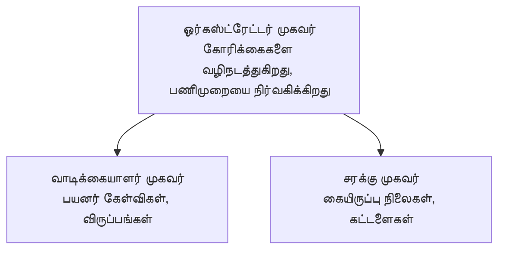

# அத்தியாயம் 5: பல-ஏஜென்ட் AI தீர்வுகள்

**📚 பாடநெறி**: [ஆரம்பிகளுக்கான AZD](../../README.md) | **⏱️ கால அளவு**: 2-3 மணிநேரங்கள் | **⭐ சிக்கல்தன்மை**: சிக்கலான

---

## மேலோட்டம்

இந்த அத்தியாயம் முன்னேற்றமான பல-ஏஜென்ட் அமைப்பு வடிவங்கள், ஏஜென்ட் ஒழுங்குபடுத்தல், மற்றும் پیچيده senாரியோக்களுக்கு தயாரிப்பு-தயார் AI பரிமாற்றங்களை கவருகின்றது.

## கற்றல் நோக்கங்கள்

இந்த அத்தியாயத்தை முடித்தால், நீங்கள்:
- பல-ஏஜென்ட் கட்டமைப்பு வடிவங்களை புரிந்துகொள்வீர்கள்
- ஒத்திசைந்த AI ஏஜென்ட் அமைப்புகளை இயக்கலாம்
- ஏஜென்ட்-மீது-ஏஜென்ட் தொடர்புகளை செயல்படுத்தலாம்
- தயாரிப்பு-தயார் பல-ஏஜென்ட் தீர்வுகளை உருவாக்கலாம்

---

## 📚 பாடங்கள்

| # | பாடம் | விளக்கம் | நேரம் |
|---|--------|-------------|------|
| 1 | [சில்லறை பல-ஏஜென்ட் தீர்வு](../../examples/retail-scenario.md) | முழுமையான செயலாக்க நடைமுறை | 90 நிமிடம் |
| 2 | [ஒழுங்கமைப்பு முறைகள்](../chapter-06-pre-deployment/coordination-patterns.md) | ஏஜென்ட் ஒழுங்கமைப்பு நெறிமுறைகள் | 30 நிமிடம் |
| 3 | [ARM டெம்ப்ளேட் வினியோகம்](../../examples/retail-multiagent-arm-template/README.md) | ஒரே கிளிக்கில் வினியோகம் | 30 நிமிடம் |

---

## 🚀 விரைவு தொடக்கம்

```bash
# விருப்பம் 1: ஒரு வார்ப்புருவிலிருந்து நிறுவவும்
azd init --template agent-openai-python-prompty
azd up

# விருப்பம் 2: ஒரு ஏஜெண்ட் மானிபெஸ்ட் இலிருந்து நிறுவவும் (azure.ai.agents நீட்டிப்பு தேவை)
azd extension install azure.ai.agents
azd ai agent init -m agent-manifest.yaml
azd up
```

> **எந்த அணுகுமுறை?** செயல்படும் மாதிரியில் இருந்து தொடங்க `azd init --template` பயன்படுத்தவும். உங்கள் சொந்த ஏஜென்ட் மானிஃபெஸ்ட் உள்ளபோது `azd ai agent init` பயன்படுத்தவும். முழு விவரங்களுக்கு [AZD AI CLI குறிப்புகள்](../chapter-08-production/production-ai-practices.md#azd-ai-cli-commands-and-extensions) பார்க்கவும்.

---

## 🤖 பல-ஏஜென்ட் கட்டமைப்பு


---

## 🎯 சிறப்பு தீர்வு: சில்லறை பல-ஏஜென்ட்

[சில்லறை பல-ஏஜென்ட் தீர்வு](../../examples/retail-scenario.md) இதை காட்டுகிறது:

- **வாடிக்கையாளர் ஏஜென்ட்**: பயனர் தொடர்புகள் மற்றும் விருப்பங்களை கையாள்கிறது
- **கையிருப்பு ஏஜென்ட்**: சரக்கு நிலை மற்றும் ஆர்டர் செயலாக்கத்தை நிர்வகிக்கின்றது
- **ஒழுங்குபொறுப்பாளர்**: ஏஜென்டுகளின் இடையே ஒத்துழைப்பை ஒருங்கிணைக்கிறது
- **பகிரப்பட்ட நினைவகம்**: ஏஜென்டுகளுக்கு இடையேயான சூழ்நிலை நிர்வாகம்

### பயன்படுத்தப்பட்ட சேவைகள்

| சேவை | நோக்கம் |
|---------|---------|
| Microsoft Foundry Models | மொழி புரிதல் |
| Azure AI Search | பொருள் பட்டியல் |
| Cosmos DB | ஏஜென்ட் நிலை மற்றும் நினைவு |
| Container Apps | ஏஜென்ட் ஹோஸ்டிங் |
| Application Insights | கண்காணிப்பு |

---

## 🔗 வழிசெலுத்தல்

| திசை | அத்தியாயம் |
|-----------|---------|
| **முந்தைய** | [அத்தியாயம் 4: உள்கட்டமைப்பு](../chapter-04-infrastructure/README.md) |
| **அடுத்த** | [அத்தியாயம் 6: முன்-வினியோகம்](../chapter-06-pre-deployment/README.md) |

---

## 📖 தொடர்புடைய வளங்கள்

- [AI ஏஜென்ட்கள் வழிகாட்டி](../chapter-02-ai-development/agents.md)
- [தயாரிப்பு AI நடைமுறைகள்](../chapter-08-production/production-ai-practices.md)
- [AI பிரச்சினைகள் தீர்வுகள்](../chapter-07-troubleshooting/ai-troubleshooting.md)

---

<!-- CO-OP TRANSLATOR DISCLAIMER START -->
மறுப்பு:
இந்த ஆவணம் AI மொழிபெயர்ப்பு சேவை [Co-op Translator](https://github.com/Azure/co-op-translator) மூலம் மொழிபெயர்க்கப்பட்டுள்ளது. எமது முயற்சி துல்லியமாக இருந்தாலும், தானாகச் செய்யப்பட்ட மொழிபெயர்ப்புகளில் பிழைகள் அல்லது துல்லியக்குறைபாடுகள் இருக்கக்கூடும் என்பதை தயவுசெய்து கவனிக்கவும். அசல் ஆவணம் அதன் மூல மொழியில் அதிகாரப்பூர்வ ஆதாரமாக கருதப்பட வேண்டும். முக்கியமான தகவல்களுக்கு தொழில்முறை மனித மொழிபெயர்ப்பை பரிந்துரைக்கிறோம். இந்த மொழிபெயர்ப்பினைக் பயன்படுத்தியதால் ஏற்படும் எந்த தவறான புரிதலுக்கும் அல்லது தவறான விளக்கங்களுக்குமான பொறுப்பை நாங்கள் ஏற்கமாட்டோம்.
<!-- CO-OP TRANSLATOR DISCLAIMER END -->