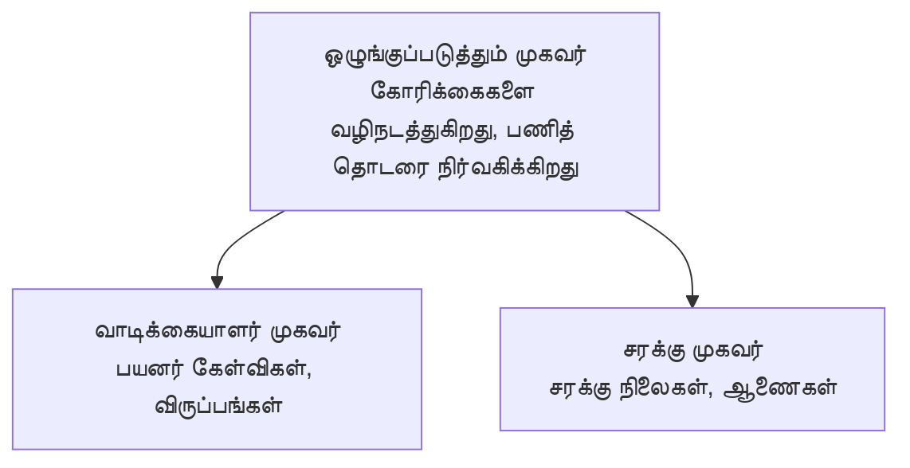

# Chapter 5: பல-ஏஜென்ட் AI தீர்வுகள்

**📚 பாடநெறி**: [AZD — தொடக்க நிலை](../../README.md) | **⏱️ கால அளவு**: 2-3 மணிநேரம் | **⭐ சிக்கல்நிலை**: மேம்பட்டது

---

## கண்ணோட்டம்

இந்த அத்தியாயம் மேம்பட்ட பல-ஏஜென்ட் கட்டமைப்பு வடிவங்கள், ஏஜென்ட் ஒழுங்குபடுத்தல் மற்றும் சிக்கலான நிலைகளுக்கான உற்பத்தி-தயாரான AI வெளியீடுகளை couvreஐ செய்கிறது.

> 2026 ஜூன் மாதத்தில் `azd 1.25.6` உடன் உறுதிசெய்யப்பட்டது.

## கற்றல் நோக்கங்கள்

இந்த அத்தியாயத்தை முடித்தவுடன் நீங்கள்:
- பல-ஏஜென்ட் கட்டமைப்பு வடிவங்களைப் புரிந்துகொள்வீர்கள்
- ஒத்திசைந்து செயல்படும் AI ஏஜென்ட் அமைப்புகளை வெளியிடுவீர்கள்
- ஏஜென்ட்-தன்மேல் ஏஜென்ட் தொடர்பை செயல்படுத்துவீர்கள்
- தொழில்துறைக்கு தயாரான பல-ஏஜென்ட் தீர்வுகளை ரಚிப்பீர்கள்

---

## 📚 பாடங்கள்

| # | பாடம் | விளக்கம் | நேரம் |
|---|--------|-------------|------|
| 1 | [பல-ஏஜென்ட் அடிப்படைகள்](multi-agent-basics.md) | கையேடு: `azd up` உடன் பணியில் இயங்கும் பல-ஏஜென்ட் செயலியை வெளியிடவும் | 45 நிமிடம் |
| 2 | [ஒத்திசைவு மாதிரிகள்](../chapter-06-pre-deployment/coordination-patterns.md) | ஏஜென்ட் ஒழுங்குபடுத்தல் நெறிமுறைகள் (அத்தியாயம் 6 இல் தொடர்கிறது) | 30 நிமிடம் |
| 3 | [ARM டெம்ப்ளேட் வெளியீடு](../../examples/retail-multiagent-arm-template/README.md) | ஒரே-கிளிக் வெளியீடு உதாரணம் | 30 நிமிடம் |

> **பாடம் 1-இல் இருந்து தொடங்கவும்.** இது இந்த அத்தியாயத்தில் முழுமையாக கையேடு-அடைபாடான தேவைப்படும் பாடமாகும். பாடம் 2 அத்தியாயம் 6 இல் உள்ளது (இது முன்-வெளியீடு திட்டமிடலுடன் பகிரப்படுகிறது), மற்றும் [சில்லறை பல-ஏஜென்ட் தீர்வு](../../examples/retail-scenario.md) என்பது கட்டமைப்பு வரைபடம் — ஒரு வடிவமைப்பு குறிப்பாகும்; ஒரே கட்டளையால் இயங்கும் டெம்ப்ளேட் அல்ல.

---

## 🚀 விரைவான தொடக்கம்

```bash
# விருப்பம் 1: ஒரு வார்ப்புருவிலிருந்து அமல்படுத்தவும்
azd init --template agent-openai-python-prompty
azd up

# விருப்பம் 2: ஒரு ஏஜெண்ட் மெனிபெஸ்ட்-இலிருந்து அமல்படுத்தவும் (azure.ai.agents நீட்டிப்பு தேவை)
azd extension install azure.ai.agents
azd ai agent init -m agent-manifest.yaml
azd up
```

> **எந்த அணுகுமுறை?** பணியில் இயங்கும் உதாரணத்திலிருந்து தொடங்க `azd init --template` ஐ பயன்படுத்தவும். உங்கள் சொந்த ஏஜென்ட் மானிபெஸ்ட் இருந்தால் `azd ai agent init` ஐ பயன்படுத்தவும். முழு விவரங்களுக்கு [AZD AI CLI குறிப்புகள்](../chapter-08-production/production-ai-practices.md#azd-ai-cli-commands-and-extensions) ஐப் பார்க்கவும்.

---

## 🤖 பல-ஏஜென்ட் கட்டமைப்பு



---

## 🎯 சிறப்பித்த தீர்வு: சில்லறை பல-ஏஜென்ட்

The [சில்லறை பல-ஏஜென்ட் தீர்வு](../../examples/retail-scenario.md) demonஸ்ட்ரேட் செய்கிறது:

- **வாடிக்கையாளர் ஏஜென்ட்**: பயனர் தொடர்புகள் மற்றும் விருப்பங்களை கையாளுகிறது
- **சரக்கு ஏஜென்ட்**: கையிருப்பு மற்றும் ஆர்டர் செயல்முறையை நிர்வகிக்கிறது
- **ஒழுங்குபடுத்தி**: ஏஜென்டுகள் இடையே ஒருங்கிணைக்கிறது
- **பகிரப்பட்ட நினைவு**: ஏஜென்ட்-களுக்கு இடையிலான சூழ்நிலை நிர்வகிப்பு

### பயன்படுத்தப்படும் சேவைகள்

| சேவை | பயன் |
|---------|---------|
| Microsoft Foundry Models | மொழி புரிதல் |
| Azure AI Search | தயாரிப்பு பட்டியல் |
| Cosmos DB | ஏஜென்ட் நிலை மற்றும் நினைவு |
| Container Apps | ஏஜென்ட்களை ஹோஸ்ட் செய்தல் |
| Application Insights | கண்காணிப்பு |

---

## 🔗 வழிசெலுத்தல்

| திசை | அத்தியாயம் |
|-----------|---------|
| **முந்தையது** | [அத்தியாயம் 4: அடித்தள அமைப்பு](../chapter-04-infrastructure/README.md) |
| **அடுத்தது** | [அத்தியாயம் 6: முன்-வெளியீடு](../chapter-06-pre-deployment/README.md) |

---

## 📖 தொடர்புடைய வளங்கள்

- [AI ஏஜென்ட்கள் வழிகாட்டி](../chapter-02-ai-development/agents.md)
- [உற்பத்தி AI நடைமுறைகள்](../chapter-08-production/production-ai-practices.md)
- [AI பிரச்சனை தீர்வு](../chapter-07-troubleshooting/ai-troubleshooting.md)

---

<!-- CO-OP TRANSLATOR DISCLAIMER START -->
**மறுப்பு**:
இந்த ஆவணம் AI மொழிபெயர்ப்பு சேவை [Co-op Translator](https://github.com/Azure/co-op-translator) பயன்படுத்தி மொழிபெயர்க்கப்பட்டுள்ளது. நாங்கள் துல்லியத்திற்காக முயற்சி செய்துள்ளோம், ஆனால் தானாக செய்யப்படும் மொழிபெயர்ப்புகளில் பிழைகள் அல்லது தவறுகள் இருக்கலாம் என்பதை கவனத்தில் கொள்ளவும். அசல் ஆவணம் அதன் தாய்மொழியில் அதிகாரப்பூர்வ ஆதாரமாக கருதப்பட வேண்டும். முக்கியமான தகவல்களுக்கு, தொழில்நுட்பமான மனித மொழிபெயர்ப்பு பரிந்துரைக்கப்படுகிறது. இந்த மொழிபெயர்ப்பைப் பயன்படுத்துவதால் ஏற்படும் எந்த தவறான புரிதல்கள் அல்லது தவறான விளக்கத்திற்கும் நாங்கள் பொறுப்பில்வில்லை.
<!-- CO-OP TRANSLATOR DISCLAIMER END -->