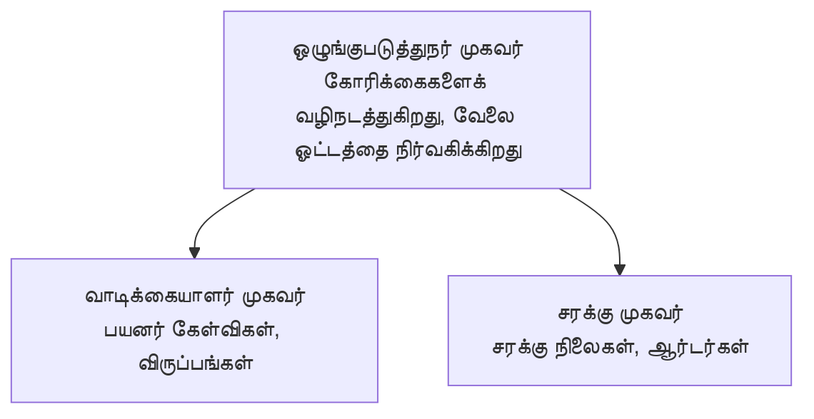

# Chapter 5: பல-ஏஜெண்ட் AI தீர்வுகள்

**📚 பாடநெறி**: [AZD For Beginners](../../README.md) | **⏱️ காலம்**: 2-3 hours | **⭐ சிக்கல்தன்மை**: Advanced

---

## மேலோட்டம்

இந்தப் பகுதி மேம்பட்ட பல-ஏஜெண்ட் கட்டமைப்பு மாதிரிகள், ஏஜெண்ட் ஒர்கஸ்த்ரேஷன், மற்றும் சூழ்நிலைக்கு தயாரான AI டெப்ளாய்மெண்ட்களை கடினமான சூழ்நிலைகளுக்காகக் கையாள்தல் ஆகியவற்றைக் கவர்கிறது.

> `azd 1.23.12` நுடன் 2026 மார்ச் மாதத்தில் சரிபார்க்கப்பட்டது.

## கற்றல் குறிக்கோள்கள்

இப் பயிற்சியை முடித்தவுடன், நீங்கள்:
- பல-ஏஜெண்ட் கட்டமைப்பு மாதிரிகளை புரிந்துகொள்ளுங்கள்
- ஒத்துழைப்பு கொண்ட AI ஏஜெண்ட் அமைப்புகளை அமல்படுத்துங்கள்
- ஏஜெண்ட்-மீது-ஏஜெண்ட் தொடர்பை நடைமுறைப்படுத்துங்கள்
- உற்பத்தி-தயார் பல-ஏஜெண்ட் தீர்வுகளை கட்டியமைக்குங்கள்

---

## 📚 பாடங்கள்

| # | பாடம் | விளக்கம் | நேரம் |
|---|--------|-------------|------|
| 1 | [சில்லறை பல-ஏஜெண்ட் தீர்வு](../../examples/retail-scenario.md) | முழுமையான அமல்படுத்தல் நடைமுறை | 90 நிமிடங்கள் |
| 2 | [ஒத்திசைவு மாதிரிகள்](../chapter-06-pre-deployment/coordination-patterns.md) | ஏஜெண்ட் ஒழுங்குபடுத்தல் நெறிமுறைகள் | 30 நிமிடங்கள் |
| 3 | [ARM டெம்ப்ளேட் பதிவேற்றம்](../../examples/retail-multiagent-arm-template/README.md) | ஒரே கிளிக்கில் பதிவேற்றம் | 30 நிமிடங்கள் |

---

## 🚀 விரைவு தொடக்கம்

```bash
# விருப்பம் 1: டெம்ப்ளேட் மூலம் நிறுவவும்
azd init --template agent-openai-python-prompty
azd up

# விருப்பம் 2: ஏஜென்ட் மனிபெஸ்ட் மூலம் நிறுவவும் (azure.ai.agents நீட்டிப்பு தேவை)
azd extension install azure.ai.agents
azd ai agent init -m agent-manifest.yaml
azd up
```

> **எந்த அணுகுமுறை?** `azd init --template` ஐ ஒரு செயல்படக்கூடிய மாதிரியிலிருந்து துவங்குவதற்கு பயன்படுத்தவும். உங்கள் சொந்த ஏஜெண்ட் manifest இருந்தால் `azd ai agent init` ஐ பயன்படுத்தவும். முழு விவரங்களுக்காக [AZD AI CLI குறிப்பு](../chapter-08-production/production-ai-practices.md#azd-ai-cli-commands-and-extensions) பார்க்கவும்.

---

## 🤖 பல-ஏஜெண்ட் கட்டமைப்பு


---

## 🎯 சிறப்பு தீர்வு: சில்லறை பல-ஏஜெண்ட்

The [Retail Multi-Agent Solution](../../examples/retail-scenario.md) காண்பிக்கிறது:

- **வாடிக்கையாளர் ஏஜெண்ட்**: பயனர் தொடர்புகள் மற்றும் விருப்பங்களை கையாள்கிறது
- **பட்டியல் ஏஜெண்ட்**: தட்டுவதற்கான விநியோகப் பொருட்கள் மற்றும் ஆர்டர் செயலாக்கத்தை நிர்வகிக்கிறது
- **ஒழுங்குபடுத்தி**: ஏஜெண்டுகளுக்கு இடையே ஒருங்கிணைக்கிறது
- **பகிரப்பட்ட நினைவகம்**: ஏஜெண்டுகளுக்கு இடையே உள்ள சூழ்நிலை நிர்வாகம்

### பயன்படுத்திய சேவைகள்

| சேவை | நோக்கம் |
|---------|---------|
| Microsoft Foundry Models | மொழி புரிதல் |
| Azure AI Search | தயாரிப்பு பட்டியல் |
| Cosmos DB | ஏஜெண்ட் நிலை மற்றும் நினைவு |
| Container Apps | ஏஜெண்ட் ஹோஸ்டிங் |
| Application Insights | கண்காணிப்பு |

---

## 🔗 வழிசெலுத்தல்

| திசை | அத்தியாயம் |
|-----------|---------|
| **முன்னையது** | [அத்தியாயம் 4: அடிப்படை அமைப்பு](../chapter-04-infrastructure/README.md) |
| **அடுத்தது** | [அத்தியாயம் 6: முன்-பதிவேற்றம்](../chapter-06-pre-deployment/README.md) |

---

## 📖 தொடர்புடைய வளங்கள்

- [AI ஏஜெண்ட்கள் வழிகாட்டி](../chapter-02-ai-development/agents.md)
- [உற்பத்தி AI நடைமுறைகள்](../chapter-08-production/production-ai-practices.md)
- [AI சிக்கல் தீர்வு](../chapter-07-troubleshooting/ai-troubleshooting.md)

---

<!-- CO-OP TRANSLATOR DISCLAIMER START -->
**Disclaimer**:
இந்த ஆவணம் AI மொழிபெயர்ப்பு சேவை [Co-op Translator](https://github.com/Azure/co-op-translator) மூலம் மொழிபெயர்க்கப்பட்டுள்ளது. நாங்கள் துல்லியத்திற்காக முயற்சி செய்கிறோம் என்ற போதிலும், தானியங்கி மொழிபெயர்ப்புகளில் பிழைகள் அல்லது தவறுகள் இருக்கலாம் என்பதை தயவுசெய்து கவனிக்கவும். மூல மொழியில் உள்ள அசல் ஆவணத்தை அதிகாரப்பூர்வ ஆதாரமாகக் கருத வேண்டும். முக்கியமான தகவல்களின் படிப்பாய்விற்கு, தொழில்முறை மனித மொழிபெயர்ப்பு பரிந்துரைக்கப்படுகிறது. இந்த மொழிபெயர்ப்பினை பயன்படுத்துவதால் ஏற்படும் எந்தவொரு தவறான புரிதல்களுக்கும் அல்லது தவறான விளக்கங்களுக்கும் நாம் பொறுப்பேற்க மாட்டோம்.
<!-- CO-OP TRANSLATOR DISCLAIMER END -->