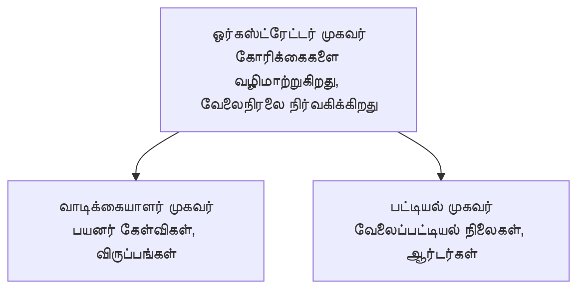

# அத்தியாயம் 5: பல-பேரணியாளர் AI தீர்வுகள்

**📚 பாடநெறி**: [AZD For Beginners](../../README.md) | **⏱️ காலம்**: 2-3 மணி நேரம் | **⭐ சிக்கலான தன்மை**: மேம்பட்டது

---

## கண்ணோட்டம்

இந்த அத்தியாயம் மேம்பட்ட பல-பேரணியாளர் கட்டமைப்பு வடிவங்கள், பேரணியாளர் ஒத்திசைவு, மற்றும் சிக்கலான சூழல்களுக்கு தயாரிப்பிற்கு தயாரான AI 배치 வேலைகளை எழுத்து செய்யிறது.

> `azd 1.27.1` மூலம் 2026 ஜூலை மாதத்தில் சரிபார்க்கப்பட்டது.

## கற்றல் இலக்குகள்

இந்த அத்தியாயத்தை முடித்தவுடன், நீங்கள்:
- பல-பேரணியாளர் கட்டமைப்பு வடிவங்களை புரிந்துகொள்வீர்கள்
- ஒருங்கிணைக்கப்பட்ட AI பேரணியாளர் அமைப்புகளை 배치 செய்யலாம்
- பேரணியாளர்-தனிட்டு-பேரணியாளர் தொடர்பை இடைநிறுத்தலாம்
- தயாரிப்பிற்கு தயாரான பல-பேரணியாளர் தீர்வுகளை கட்டுவீர்கள்

---

## 📚 பாடங்கள்

| # | பாடம் | விளக்கம் | நேரம் |
|---|--------|-------------|------|
| 1 | [பல-பேரணியாளர் அடிப்படைகள்](multi-agent-basics.md) | கைமுறை: `azd up` மூலம் ஒரு வேலை செய்கிற பல-பேரணியாளர் செயலியை 배치 செய்யவும் | 45 நிமிடங்கள் |
| 2 | [ஒத்திசைவு வடிவங்கள்](../chapter-06-pre-deployment/coordination-patterns.md) | பேரணியாளர் ஒருங்கிணைப்பு வகைகள் (அத்தியாயம் 6 இல் தொடர்கிறது) | 30 நிமிடங்கள் |
| 3 | [ARM மற்றும் 배치](../../examples/retail-multiagent-arm-template/README.md) | ஒரு கிளிக் மூலம் 배ச்சு உதாரணம் | 30 நிமிடங்கள் |

> **பாடம் 1 மூலம் தொடங்கவும்.** இது முழுமையாக கைமுறை, 배ச்சு செய்யக்கூடிய பாடம் மட்டுமே இந்த அத்தியாயத்தில் உள்ளது. பாடம் 2 அத்தியாயம் 6 இல் உள்ளது (புரி 배치를 முன்னோக்கி திட்டமிடல் உடன் பகிரப்படுகிறது), மேலும் [சில்லறை பல-பேரணியாளர் தீர்வு](../../examples/retail-scenario.md) ஒரு கட்டமைப்பு வரைபடம் — ஒரு வடிவமைப்பு குறிப்பேடு, ஒரு ஒரே கட்டளை மாதிரியாக இல்லை.

---

## 🚀 விரைவு தொடக்கம்

```bash
# விருப்பம் 1: ஒரு வார்ப்புருவிலிருந்து орналுத்தவும்
azd init --template agent-openai-python-prompty
azd up

# விருப்பம் 2: ஒரு முகவர் மனுவிலிருந்து орналுத்தவும் (azure.ai.agents விரிவாக்கம் தேவை)
azd extension install azure.ai.agents
azd ai agent init -m agent-manifest.yaml
azd up
```

> **எந்த அணுகுமுறை?** செயல்படும் மாதிரியில் இருந்து தொடங்க `azd init --template` பயன்படுத்தவும். உங்கள் சொந்த பேரணியாளர் மாதிரிகை இருந்தால் `azd ai agent init` பயன்படுத்தவும். முழு விவரங்களுக்கு [AZD AI CLI கையேடு](../chapter-08-production/production-ai-practices.md#azd-ai-cli-commands-and-extensions) பார்.

---

## 🤖 பல-பேரணியாளர் கட்டமைப்பு



---

## 🎯 குறிப்பிடத்தக்க தீர்வு: சில்லறை பல-பேரணியாளர்

[சில்லறை பல-பேரணியாளர் தீர்வு](../../examples/retail-scenario.md) காட்டுகிறது:

- **வாடிக்கையாளர் பேரணியாளர்**: பயனர் தொடர்புகள் மற்றும் விருப்பங்களை கையாள்கிறது
- **பொருள் பட்டியலாளர்**: பங்கு மற்றும் ஊர்ஜித செயலாக்கத்தை நிர்வகிக்கின்றது
- **ஒத்திசைப்பாளர்**: பேரணியாளர்களுக்கு இடையே ஒருங்கிணைவு செய்கிறது
- **பகிரப்பட்ட நினைவகம்**: பேரணியாளர் இடையேயான சூழல் மேலாண்மை

### பயன்படுத்தப்படும் சேவைகள்

| சேவை | நோக்கு |
|---------|---------|
| Microsoft Foundry Models | மொழி புரிதல் |
| Azure AI Search | பொருள் பட்டியல் |
| Cosmos DB | பேரணியாளர் நிலையும் நினைவிடமும் |
| Container Apps | பேரணியாளர் தங்கல் |
| Application Insights | கண்காணிப்பு |

---

## 🔗 வழிசெலுத்தல்

| திசை | அத்தியாயம் |
|-----------|---------|
| **முந்தையது** | [அத்தியாயம் 4: அடிக்கடை](../chapter-04-infrastructure/README.md) |
| **அடுத்தது** | [அத்தியாயம் 6: முன்னோக்கு 배치](../chapter-06-pre-deployment/README.md) |

---

## 📖 தொடர்புடைய వనరులు

- [AI பேரணியாளர் வழிகாட்டி](../chapter-02-ai-development/agents.md)
- [உற்பத்தி AI நடைமுறைகள்](../chapter-08-production/production-ai-practices.md)
- [AI சிக்கல் தீர்க்கும் வழிகள்](../chapter-07-troubleshooting/ai-troubleshooting.md)

---

<!-- CO-OP TRANSLATOR DISCLAIMER START -->
**மறுப்பு**:
இந்த ஆவணம் AI மொழிபெயர்ப்பு சேவை [Co-op Translator](https://github.com/Azure/co-op-translator) பயன்படுத்தி மொழிபெயர்க்கப்பட்டுள்ளது. நாங்கள் துல்லியத்திற்காக முயற்சி செய்துள்ளோம், ஆனால் தானாக செய்யப்படும் மொழிபெயர்ப்புகளில் பிழைகள் அல்லது தவறுகள் இருக்கலாம் என்பதை கவனத்தில் கொள்ளவும். அசல் ஆவணம் அதன் தாய்மொழியில் அதிகாரப்பூர்வ ஆதாரமாக கருதப்பட வேண்டும். முக்கியமான தகவல்களுக்கு, தொழில்நுட்பமான மனித மொழிபெயர்ப்பு பரிந்துரைக்கப்படுகிறது. இந்த மொழிபெயர்ப்பைப் பயன்படுத்துவதால் ஏற்படும் எந்த தவறான புரிதல்கள் அல்லது தவறான விளக்கத்திற்கும் நாங்கள் பொறுப்பில்வில்லை.
<!-- CO-OP TRANSLATOR DISCLAIMER END -->