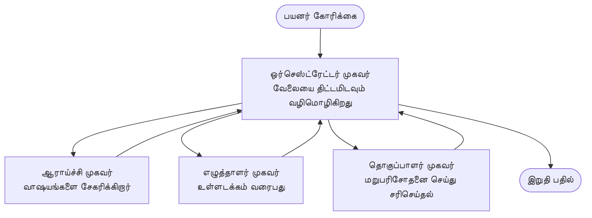

# பன்முக முகவரிகள் அடிப்படைகள் - உங்கள் முதல் ஒருங்கிணைக்கபட்ட AI அமைப்பை செலுத்துங்கள்

**அத்தியாய வழிசெலுத்தல்:**
- **📚 பாடக் கோப்பு முகப்பு**: [AZD திருவிதானக்கான](../../README.md)
- **📖 தற்போதைய அத்தியாயம்**: அத்தியாயம் 5 - பன்முக முகவர் AI தீர்வுகள்
- **⬅️ முந்தையது**: [அத்தியாயம் 4: அடுக்கு அமைப்பு](../chapter-04-infrastructure/README.md)
- **➡️ அடுத்து**: [ஒருங்கிணைப்பு வடிவங்கள்](../chapter-06-pre-deployment/coordination-patterns.md)

> ஜூலை 2026 இல் `azd 1.27.1` மூலம் சரிபார்க்கப்பட்டது.

## அறிமுகம்

முந்தய அத்தியாயங்களில், நீங்கள் ஒரு தனி பயன்பாட்டை வினியோகம் செய்தீர்கள்—மற்றும் அத்தியாயம் 2ல் நீங்கள் ஒரு தனி AI முகவரியை வினியோகம் செய்தீர்கள். இந்த பாடம் அடுத்த படியை எடுக்கும்: பல பரிசுத்தமான முகவர்கள் ஒன்றாக இணைந்து ஒரு பிரச்சினையை தீர்க்கும் **பன்முக முகவர் அமைப்பை** வினியோகம் செய்தல்.

புதியவர்களுக்கு நல்ல செய்தி: **புதிய கட்டளைகள் தேவையில்லை.** பன்முக முகவர் தீர்வு இன்னும் azd திட்டமாகும். நீங்கள் `azd init`, `azd up`, சோதனை செய்யவும், மற்றும் `azd down` செய்வீர்கள்—நீங்கள் ஏற்கனவே அறிந்த ஓர் வேலைகார செயல்முறை மாதிரியாக. மாற்றம் அந்த செயலியில் உள்ள *வடிவமைப்பில்* உள்ளது.

## கற்றல் நோக்குகள்

இந்த பாடம் முடிந்த பிறகு, நீங்கள்:
- "பன்முக முகவர்" என்றால் என்ன மற்றும் எப்போது கூடுதல் சிக்கலுக்கு மதிப்பு உள்ளதோ அவற்றை புரிந்து கொள்வீர்கள்
- ஒரு பன்முக முகவர் அமைப்பில் பொதுவான பணிகள் (ஒருங்கிணைப்பாளர் + சிறப்பு பணியாளர்கள்) என்ன என்பதை அடையாளம் காண்பீர்கள்
- `azd up` கொண்டு ஒரு உண்மையான, செயல்படும் பன்முக முகவர் டெம்ப்ளேட்டை வினியோகம் செய்வீர்கள்
- பன்முக முகவர் செயலியில் ஆதரவு Azure வளங்களை புரிந்துகொள்வீர்கள்
- தீர்வை சரிபார்க்க, தனிப்பயனாக்க, மற்றும் பாதுகாப்பாக நீக்குவது எப்படி என்பதைக் கற்றுக்கொள்வீர்கள்

## கற்றல் விளைவுகள்

இந்த பாடம் முடிந்த பிறகு நீங்கள் செய்யக்கூடியவை:
- தனி முகவர் மற்றும் பன்முக முகவர் அமைப்பின் மாறுபாடுகளை விளக்கம் செய்ய
- ஒரு தனி முகவருடன் கருவிகள் அல்லது உண்மையான பன்முக முகவர் வடிவமைப்புக்கு இடையே தேர்வு செய்ய
- azd கொண்டு ஒரு பன்முக முகவர் டெம்ப்ளேட்டை முழுவதும் வினியோகம் செய்து சோதனை செய்ய
- ஒவ்வொரு முகவரும் எங்கு இயங்குவது மற்றும் அவர்கள் எப்படி தொடர்பு கொள்ளுபவர்கள் என்பதைக் கண்டறிய
- தொடர்ச்சியான கட்டணங்கள் தவிர்ப்பதற்காக அனைத்து வளங்களையும் சுத்தம் செய்ய

---

## பன்முக முகவர் அமைப்பு என்றால் என்ன?

ஒரு தனி AI முகவர் என்பது ஒரு மாதிரி மற்றும் சில (ஆனிச்சையாக) கருவிகள் கொண்ட செயல்படுத்தலாகும். இது கவனிக்கப்பட்ட பணிகளுக்கு நன்றாக வேலை செய்கிறது. ஆனால் ஒரு வேலை வளரும்போது—ஆராய்ச்சி, பிறகு எழுத்து, பிறகு திருத்தம், பிறகு தகவல் சரிபார்ப்பு—அனைத்தையும் ஒரு வேண்டுகோளில் அமுக்குவது அந்த முகவரின் செயல்பாட்டை மெதுவாக்குகிறது, விருப்பத்தை குறைக்கிறது, டிபக் செய்ய கடினமாகிறது.

ஒரு **பன்முக முகவர் அமைப்பு** வேலைகளை சிறப்பு பணியாளர்கள் என பிரிப்பதாகும், ஒவ்வொருவர் ஒரு பணியைக் நன்றாக செய்வார்கள், ஒரு ஒருங்கிணைப்பாளர் மூலம் ஒருங்கிணைக்கப்பட்டு:



### நீங்கள் எப்போதும் காணப்போகும் இரண்டு பணிகள்

| பங்கு | பணி | உதாரணம் |
|------|-----|---------|
| **ஒருங்கிணைப்பாளர்** | *என்ன செய்யப்படும்* என்பதை முடிவு செய்து முகவர்களுக்கு வேலை ஒதுக்குதல் | "முதலில் ஆராய்ச்சி, பிறகு எழுதுதல், பிறகு திருத்து" |
| **சிறப்பாளர்** | ஒரே நியதமான பணியை செய்து முடிவு அளிக்கும் | உண்மைகளைக் குற்றயிடும் "ஆராய்ச்சியாளர்" |

### உண்மையில் பல முகவர்கள் தேவையா?

எளியவையே ஆரம்பியுங்கள். பன்முக முகவர்கள் **அதிகாலை** தேவையான போது மட்டும்:

- ✅ வேலைகள் **வேறுபட்ட கட்டங்களைக்** கொண்டவை மற்றும் வித்தியாசமான வழிமுறைகளால் பயனடையக்கூடியவை (ஆராய்ச்சி vs எழுதுதல் vs மதிப்பாய்வு)
- ✅ நேரத்தை மிச்சப்படுத்த **சிறப்பாளர்கள் ஒரே நேரத்தில் இயங்க** வேண்டும்
- ✅ வெவ்வேறு கட்டங்களுக்கு **வித்தியாசமான கருவிகள் அல்லது தரவளங்கள்** தேவை
- ✅ ஒவ்வொரு கட்டத்தையும் **தனித்துவமாக சோதிக்க மற்றும் டிபக் செய்யக்கூடியது** வேண்டும்

உங்கள் வேலை ஒரு எளிய கேள்வி-பதில் தவிர அல்லது கருவி அழைப்பு என்றால், **கருவிகளுடன் ஒன்றுகூடிய தனி முகவர்** (அத்தியாயம் 2) எளிது, மலிவு மற்றும் இயக்குவதற்கு எளிது.

> **புதியவர்களுக்கு குறிப்பு:** "பல முகவர்கள்" என்பது "மேலும் சிறந்தது" அல்ல. ஒவ்வொரு முகவரும் தாமதம், செலவு, மற்றும் புது கவனிப்பு பொருள் சேர்க்கிறது. பிரச்சினை தெளிவாக பிரிக்கப்பட்டால் மட்டுமே முகவர்களைச் சேர்க்கவும்.

---

## Azure இல் பன்முக முகவர்களை உருவாக்க இரண்டு வழிகள்

| அணுகுமுறை | அது என்ன | சிறந்தது |
|----------|-----------|----------|
| **தனி முகவர் + கருவிகள்** | ஒரு Foundry முகவர் செயல்படுத்தும் கருவிகள்/செயல்பாடுகளை அழைக்கும் | எளிய வேலைகள், தொடக்கம் செய்யவோருக்கானவை |
| **பல ஒருங்கிணைக்கப்பட்ட முகவர்கள்** | பல முகவர்கள் ஒருங்கிணைப்பாளருடன் | வேறுபட்ட கட்டங்கள், ஒரே நேரத்தில் வேலை, சிறப்பு பணி |

இந்த பாடம் இரண்டாம் அணுகுமுறையை கவனித்து ஒரு **முன்னமைக்கப்பட்ட டெம்ப்ளேட்டை** பயன்படுத்தி, ஒரு உண்மையான பன்முக முகவர் அமைப்பை இயக்கும் முறையை காண உதவும்.

---

## செயலில்: செயல்படும் பன்முக முகவர் பயன்பாட்டை வினியோகம் செய்ய

நாம் **Contoso Creative Writer** என்பதைக் வினியோகிப்போம், இது பல முகவர்கள் (ஆராய்ச்சியாளர், எழுத்தாளர், தொகுப்பாளர்) இணைந்து கட்டுரை உருவாக்கும் அதிகாரப்பூர்வ Azure மாதிரி. இது பன்முக முகவர் பயன்பாட்டிற்கு ஒரு சிறந்த தொடக்கம், ஏனெனில் பணிகள் புரிந்துகொள்ள எளிது.

### படி 1: டெம்ப்ளேட்டை தொடங்குக

```bash
# ஒரு பணிப் கோப்பகம் உருவாக்கவும்
mkdir creative-writer && cd creative-writer

# அதிகாரப்பூர்வ பன்முக எஜென்ட் வார்ப்புருவிலிருந்து துவக்கவும்
azd init --template contoso-creative-writer
```

> எந்த நேரத்திலும் [Awesome AZD AI gallery](https://azure.github.io/awesome-azd/?tags=ai) இல் அதிக பன்முக முகவர் டெம்ப்ளேட்டுகளை பார். மற்ற ஆரம்பக்கிய தேர்வுகளில் `get-started-with-ai-agents` மற்றும் `azure-ai-travel-agents` உள்ளன.

### படி 2: அங்கீகாரம்

```bash
# azd பணிச்சூழல்களுக்கு தேவையானது
azd auth login
```

### படி 3: சூழல் உருவாக்கு

```bash
azd env new dev
```

### படி 4: முன்னோட்டம், பிறகு வினியோகம்

```bash
# எதையும் செலவிடும்முன் என்ன உருவாகப்போகிறது என்பதைக் காண்க (பரிந்துரைக்கப்படுகிறது)
azd provision --preview

# ஒரு படியில் கட்டமைப்பை ஏற்படுத்தி அனைத்து முகவர்களையும் 배치 செய்க
azd up
```

`azd up` சந்தா மற்றும் பகுதி கேட்கும், பிறகு Azure வளங்களை ஏற்படுத்தி பயன்பாட்டை வினியோகம் செய்கிறது. AI வினியோகங்கள் ஒரு எளிய வலை பயன்பாட்டைவிட அதிக நேரம் எடுக்கலாம்—பெரிய மாதிரிகளை வினியோகம் செய்கிறீர்களானால், deploy நேரம் நீட்டிக்கலாம்:

```bash
azd deploy --timeout 1800
```

> **செலவு மற்றும் திறனை கவனிப்பது:** பன்முக முகவர் பயன்பாடுகள் AI மாதிரிகளை பயன்படுத்தி சலுகை மற்றும் செலவுகளை உருவாக்கும். `azd up` மாதிரி சலுகை தோல்வி அடையின், [AI Troubleshooting](../chapter-07-troubleshooting/ai-troubleshooting.md) மற்றும் அத்தியாயம் 6 [Capacity Planning](../chapter-06-pre-deployment/capacity-planning.md) காணவும்.

---

## நீங்கள் வினியோகம் செய்ததை புரிந்துகொள்வது

இப்படி ஒரு சாதாரண பன்முக முகவர் பயன்பாடு மேலே உள்ள படத்தில் உள்ள பொறுப்புகளை நேரடியாக இணைக்கும் Azure வளங்களின் தொகுப்பை ஏற்படுத்துகிறது:

| வளம் | ஏன் உள்ளது |
|----------|----------------|
| **Microsoft Foundry / Models** | ஒவ்வொரு முகவரும் பயன்படுத்தும் மொழி மாதிரிகளை விருந்துபுசிக்கிறது |
| **Azure AI Search** | ஆராய்ச்சியாளர் முகவருக்கு தரவுகளை தேடும் வாய்ப்பு கொடுக்கிறது |
| **Container Apps** (அல்லது App Service) | ஒருங்கிணைப்பாளரும் முகவர் குறியீடும் வைப்பு | 
| **Cosmos DB** (சில மாதிரிகளில்) | முகவர்களுக்கு இடையே பகிரப்படும் நிலை/மனம் சேமிப்பு |
| **Application Insights** | முகவர்களுக்கு மாறி கோரிக்கைகளை கண்காணித்து விண்ணப்பத்தை டிபக் செய்ய உதவுகிறது |

### முகவர்கள் எப்படி ஒருவருக்கொருவர் பேசுகிறார்கள்

பெரும்பாலான azd பன்முக முகவர் மாதிரிகளில், **ஒருங்கிணைப்பாளர் உங்கள் செயலியில் இயங்குகிறான்** (உதाहरणமாக, Semantic Kernel அல்லது Microsoft Agent Framework போன்ற அமைப்பை பயன்படுத்தி). ஒருங்கிணைப்பாளர் ஒவ்வொரு சிறப்பாளரையும் அழைத்து முடிவுகளை பெறுகிறார், இறுதி பதிலை திரட்டி வழங்குகிறான். முகவர்கள் உள்ளடக்கத்தை பின்வருமாறு பகிர்கின்றனர்:

- **செயல்பாடு/கருவி அழைப்புகள்** — ஒருங்கிணைப்பாளர் சிறப்பாளரை அழைத்து முடிவை பெறுகிறான்
- **பகிர்ந்த நினைவு** — ஒரு தரவுத்தளம் (பொதுவாக Cosmos DB) இரு முகவர்களாலும் வாசிக்கக்கூடிய நிலையை வைத்திருக்கும்
- **செய்திகள்/நிகழ்வுகள்** — தன்னிச்சையான இணைப்பிற்காக, முகவர்கள் ஒரு கியூ அல்லது சர்வீஸ் பஸ்சை பயன்படுத்தி தொடர்பு கொள்கின்றனர்

> **ஏன் இது டிபக்குக்கு முக்கியம்:** ஒவ்வொரு கட்டமும் தனித்தனியாக இருப்பதால், Application Insights எந்த முகவர் மெதுவோ தோல்வியடையோ அதை காட்டும். இந்த காரணமே முதலில் வேலைகளை முகவர்களில் பிரிப்பதற்கான முக்கிய காரணம்.

---

## வினியோகத்தை சரிபார்க்கவும்

அமைப்பு உண்மையாக இயங்குகிறதா என உறுதி செய்ய:

```bash
# நேரேற்று செய்யப்பட்ட முடிவுகளை காட்டு
azd show

# செயலியின் கண்காணிப்பு தளத்தையும் திறக்கவும்
azd monitor

# ஏதாவது தவறு போல இருந்தால் பதிவு பதிவுகளை பின்தொடர்க
azd monitor --logs
```

பிறகு `azd show` மூலம் பயன்பாட்டு URL ஐத் திறந்து அனைத்து முகவர்களின் செயல்பாட்டை பரிசோதிக்கும் கோரிக்கையை முயற்சிக்கவும் (Creative Writerஇல், ஒரு குறிப்பான தலைப்பில் சுருக்கமான கட்டுரையை எழுதக் கோரவும்). Application Insights **transcation search** இல், கோரிக்கை ஆராய்ச்சியாளர், எழுத்தாளர், மற்றும் தொகுப்பாளர் கட்டங்களுக்குள் பிணைந்திருப்பதை காணலாம்.

**வெற்றி அளவுகோல்கள்:**
- ✅ `azd show` ஒரு அணுகக்கூடிய முனையத்தை பட்டியலிடும்
- ✅ ஒரு கோரிக்கை பல கட்டங்களாக தெளிவுடன் சென்றடைந்த முடிவை உற்பத்தி செய்கிறது
- ✅ Application Insights பல முகவர் கட்டங்களுக்கு அடுத்த தடவிலான தொடர்களை காட்டுகிறது

---

## தனிப்பயனாக்கம்: ஒரு முகவரைக் கூடுதல் செய்யவோ அல்லது மாற்றவோ செய்யவும்

ஒவ்வொரு முகவரும் கட்டளைகள் மற்றும் கருவிகளுடன் மட்டுமே இருக்கும் என்பதால், தனிப்பயனாக்கம் எளிது:

1. **முகவர் வரையறைகளை கண்டுபிடிக்கவும்** டெம்ப்ளேட்டில் (பொதுவாக `prompts/`, `agents/`, அல்லது `*.prompty` கோப்புகளின் தொகுப்பு).
2. **ஒரு முகவரின் கட்டளைகளை மாற்றவும்** — உதாரணமாக, தொகுப்பாளர் முகவரிடம் ஒரு குறிப்பிட்ட சேலி அல்லது சொற்றொடர் எண்ணிக்கையை பின்பற்றச் சொல்வது.
3. **தனிப்பட்ட குறியீட்டை மீண்டும் வினியோகம் செய்யவும்** (அடுக்கு அமைப்பு மாற்றமில்லை):

   ```bash
   azd deploy
   ```

மேலும் முகவர்களை உங்கள் *சுய* விவரக்கோப்பிலிருந்து கட்டமைக்க, முகவர் விரிவாக்கம் மற்றும் அதன் முழு வாழ்நாள் பராமரிப்பை பயன்படுத்தவும்:

```bash
azd extension install azure.ai.agents
azd ai agent init -m agent-manifest.yaml
azd up
azd ai agent invoke      # பதில் நேரம் உடன் சோதனை
```

முழு முகவர் வாழ்நாள் பராமரிப்புக்கான (`invoke`, `eval generate`, `optimize`, `delete`) முழுமையான விசாரணைகள் [அத்தியாயம் 2: முகவர்கள்](../chapter-02-ai-development/agents.md) மற்றும் [AZD AI CLI குறிப்பகம்](../chapter-08-production/production-ai-practices.md#azd-ai-cli-commands-and-extensions) உள்ளன.

---

## சுத்தம் செய்தல்

பன்முக முகவர் பயன்பாடுகள் பல பில்லிங் சேவைகளை இயக்குகின்றன. முடிந்ததும் அனைத்தையும் நீக்கவும்:

```bash
azd down --force --purge
```

`--purge` கொடியுடன் கூட பல மென்மையான நாசமடைந்த AI வளங்களையும் (Foundry/Azure AI Services கணக்குகள் போன்றவை) நீக்கும், அவை எதிர்கால மீண்டும் வினியோகத்தை தடுப்பதோ அல்லது செலவு உருவாக்குவதோ செய்யாது.

---

## தயாரிப்பு பன்முக முகவர் அமைப்புகள் குறித்த குறிப்பு

இந்த வன்பொருள் தொகுதியில் உள்ள [Retail Multi-Agent Solution](../../examples/retail-scenario.md) என்பது **வடிவமைப்பு வரைபடம்**, ஒரு ஒரே கட்டளை டெம்ப்ளேட் அல்ல—it ஒரு தயாரிப்பு சில்லறை அமைப்பு எப்படி உருவாகும் என்பதை ஆவணப்படுத்துகிறதுஇது முழு கட்டுமானம் மிக பெரிய செயல்பாடு என்பதையும் குறிப்பிடுகிறது. இதை ஒரு செயல்படும் மாதிரியை நீங்கள் இதிர்க்குவோம் என்ற பின்பு வடிவமைப்பு குறிப்பு ஆக பயன்படுத்தவும். தயாரிப்பு கவலைகளுக்கு (நிலைத்தன்மை, செலவு, கண்காணிப்பு, ஆட்சி), [அத்தியாயம் 8: தயாரிப்பு AI நடைமுறைகள்](../chapter-08-production/production-ai-practices.md) க்குச் செல்லவும்.

---

## சுருக்கம்

- ஒரு பன்முக முகவர் அமைப்பு சிறப்பாளர்களுக்கு இடையே ஒரு ஒருங்கிணைப்பாளர் மூலம் வேலைபிரித்து செய்கிறது.
- வேறு வழியாகாக வேலைகள் வேறுபட்ட கட்டங்கள், இணைந்து இயங்குதல், அல்லது தனி கருவிகள் தேவைப்பட்டால் மட்டுமே பயன்படுத்தவும்—இல்லையானால் தனி முகவரைக் கருதி செயல்படுத்தவும்.
- azd வேலைநடைமுறை மாறவில்லை: `azd init` → `azd up` → சோதனை → `azd down`.
- `contoso-creative-writer` போன்ற உண்மையான டெம்ப்ளேட் உங்களுக்கு இன்று ஒரு செயல்படும் பன்முக முகவர் செயலியை காணவும் தனிப்பயனாக்கவும் உதவும்.
- முகவர்களுக்கிடையே Application Insights டிரேசிங் பன்முக முகவர் வடிவமைப்பின் மிகப்பெரும் நடைமுறை நன்மைகளில் ஒன்று.

---

## 🔗 வழிசெலுத்தல்

| திசை | பாடம் |
|-----------|--------|
| **முந்தையது** | [அத்தியாயம் 4: அடுக்கு அமைப்பு](../chapter-04-infrastructure/README.md) |
| **அடுத்து** | [ஒருங்கிணைப்பு வடிவங்கள்](../chapter-06-pre-deployment/coordination-patterns.md) |

## 📖 தொடர்புடைய வளங்கள்

- [AI முகவர் வழிகாட்டி](../chapter-02-ai-development/agents.md)
- [ஒருங்கிணைப்பு வடிவங்கள்](../chapter-06-pre-deployment/coordination-patterns.md)
- [தயாரிப்பு AI நடைமுறைகள்](../chapter-08-production/production-ai-practices.md)
- [AI சிக்கல்கள் தீர்வு](../chapter-07-troubleshooting/ai-troubleshooting.md)

---

<!-- CO-OP TRANSLATOR DISCLAIMER START -->
**மறுப்பு**:
இந்த ஆவணம் AI மொழிபெயர்ப்பு சேவை [Co-op Translator](https://github.com/Azure/co-op-translator) பயன்படுத்தி மொழிபெயர்க்கப்பட்டுள்ளது. நாங்கள் துல்லியத்திற்காக முயற்சி செய்துள்ளோம், ஆனால் தானாக செய்யப்படும் மொழிபெயர்ப்புகளில் பிழைகள் அல்லது தவறுகள் இருக்கலாம் என்பதை கவனத்தில் கொள்ளவும். அசல் ஆவணம் அதன் தாய்மொழியில் அதிகாரப்பூர்வ ஆதாரமாக கருதப்பட வேண்டும். முக்கியமான தகவல்களுக்கு, தொழில்நுட்பமான மனித மொழிபெயர்ப்பு பரிந்துரைக்கப்படுகிறது. இந்த மொழிபெயர்ப்பைப் பயன்படுத்துவதால் ஏற்படும் எந்த தவறான புரிதல்கள் அல்லது தவறான விளக்கத்திற்கும் நாங்கள் பொறுப்பில்வில்லை.
<!-- CO-OP TRANSLATOR DISCLAIMER END -->