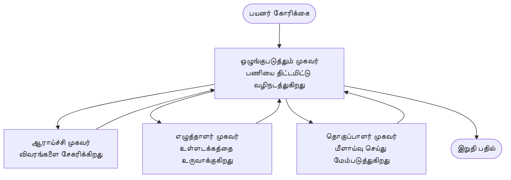

# மல்டி-ஏஜென்ட் அடிப்படைகள் - உங்கள் முதல் ஒருங்கிணைந்த AI அமைப்பை நிறுவுதல்

**அத்தியாய வழிசெலுத்தல்:**
- **📚 பாடநெறி முகப்பு**: [AZD For Beginners](../../README.md)
- **📖 தற்போதைய அத்தியாயம்**: அத்தியாயம் 5 - பல-ஏஜென்ட் AI தீர்வுகள்
- **⬅️ முந்தையது**: [அத்தியாயம் 4: Infrastructure](../chapter-04-infrastructure/README.md)
- **➡️ அடுத்தது**: [Coordination Patterns](../chapter-06-pre-deployment/coordination-patterns.md)

> ஜூன் 2026-ல் `azd 1.25.6` உடன் சரிபார்க்கப்பட்டது.

## அறிமுகம்

முந்தய அத்தியாயங்களில் நீங்கள் ஒரு தனி பயன்பாட்டை நிறுவியீர்கள் — மேலும் அத்தியாயம் 2-இல் நீங்கள் ஒரு தனி AI ஏஜெண்டை நிறுவினீர்கள். இந்த பாடம் அடுத்த படியை எடுக்கிறது: பல நிபுணர் ஏஜெண்ட்கள் ஒன்றாக ஒருங்கிணைந்து ஒரு தனி ஏஜெண்ட் சீராக செய்ய முடியாத பிரச்சினையை தீர்க்கும் **பல-ஏஜென்ட் அமைப்பை** நிறுவுவது.

ஆரம்ப பயனர்களுக்கான நல்ல செய்தி: **உங்களுக்கு புதிய கமாண்டுகள் தேவை இல்லை.** ஒரு பல-ஏஜென்ட் தீர்வு இன்னும் ஒரு azd திட்டமாகும். நீங்கள் `azd init`, `azd up`, சோதனை செய்ய, மற்றும் `azd down` செய்யப்போகிறீர்கள் — நீங்கள் ஏற்கனவே அறிந்தவே உள்ள வேலைப்பொருள். என்ன மாறுவது என்றால் உள்ளக செயலியின் *வடிவம்* மட்டுமே.

## கற்றல் இலக்குகள்

இந்த பாடத்தை முடித்தபின், நீங்கள்:
- "பல-ஏஜென்ட்" என்பது என்ன மற்றும் அது கூடுதல் சிக்கலுக்கு தகுதியானது எந்த நேரத்தில் என்பதை புரிந்துக் கொள்வீர்கள்
- ஒரு பல-ஏஜென்ட் அமைப்பில் பொதுவான பங்குகளை (ஒழுங்கமைப்பாளர் + நிபுணர்கள்) அடையாளம் காண்பீர்கள்
- `azd up` மூலம் ஒரு உண்மையான, செயல்படும் பல-ஏஜென்ட் டெம்ப்ளேட்டை நிறுவுவீர்கள்
- ஒரு பல-ஏஜென்ட் செயலிக்கு ஆதரவு கொடுக்கும் Azure வளங்களை புரிந்துகொள்வீர்கள்
- தீர்வை பாதுகாப்பாக சரிபார்க்கவும், தனிப்பயனாக்கவும், மற்றும் அழிக்கவும் அறிவீர்கள்

## கற்றல் முடிவுகள்

இந்த பாடத்தை முடித்தவுடன், நீங்கள் சிறந்த முறையில்:
- ஒரு தனி ஏஜெண்ட் மற்றும் ஒரு பல-ஏஜென்ட் அமைப்பின் வித்தியாசத்தை விளக்க முடியும்
- ஒரு ஒரு ஏஜெண்ட் + கருவிகள் மற்றும் ஒரு உண்மையான பல-ஏஜென்ட் வடிவமைப்புக்கு இடையில் தேர்வு செய்ய முடியும்
- azd மூலம் ஒரு பல-ஏஜென்ட் டெம்ப்ளேட்டை முடிவுசார் என்று நிறுவி சோதிக்க முடியும்
- ஒவ்வொரு ஏஜெண்ட் எங்கு இயங்குகிறது மற்றும் அவை எப்படி தொடர்பு கொள்கிறார்கள் என்பதைக் கண்டறிய முடியும்
- தொடர்ந்த கட்டணங்களைத் தவிர்க்க அனைத்து வளங்களையும் நீக்க முடியும்

---

## பல-ஏஜென்ட் அமைப்பு என்பது என்ன?

ஒரு தனி AI ஏஜெண்ட் என்பது ஒரு மாதிரியும் ஒரு தெளிவான கட்டளைகளின் தொகுப்பும் (விருப்பமாக சில கருவிகள்) கொண்ட ஒரு அமைப்பாகும். இது கவனிக்கப்பட்ட பணிகளுக்கு நன்று வேலை செய்கிறது. ஆனால் பணிகள் விரிவடையும் போது—ஆராய்ச்சி, பின்னர் எழுதுதல், பின்னர் திருத்தம், பின்னர் தகவல்த் சோதனை—அனைதையும் ஒரு ப்ராம்ப்டில் சமர்ப்பிப்பது ஏஜெண்டை மெல்லப்படுத்தும், குறைவான நம்பகத்தன்மையைக் கொடுக்கும், மற்றும் பிழைக் கண்டறிதலுக்கு கடினமாக்கும்.

ஒரு **பல-ஏஜென்ட் அமைப்பு** ஒவ்வொரு பணியையும் நன்றாக செய்வதே ஒரே வேலை செய்யும் நிபுணர்களாக பிரிக்கிறது, மற்றும் ஒரு ஒழுங்கமைப்பாளர் அவற்றை ஒருங்கிணைக்கிறது:



### நீங்கள் எப்போதும் காணும் இரண்டு பங்குகள்

| Role | Job | Example |
|------|-----|---------|
| **Orchestrator** | Decides *what happens next* and routes work between agents | "முதலில் ஆராய்ச்சி, பின்பு எழுதுதல், பின்னர் திருத்தம்" |
| **Specialist** | Does one focused job and returns a result | ஒரு தகவல்கள் மட்டுமே சேகரிக்கும் "ஆராய்ச்சியாளர்" |

### உண்மையில் பல ஏஜெண்ட்கள் தேவையா?

எளிமையாக தொடங்கு. கீழ்காணும் ஒன்று உண்மையாக இருந்தால் மட்டும் பல-ஏஜென்ட் நோக்கத்தை அணுகுங்கள்:

- ✅ பணிக்கு **தனித்தனியான கட்டங்கள்** உள்ளன மற்றும் வெவ்வேறு வழிமுறைகள் மூலம் பலன்கள் கிடைக்கும் (ஆராய்ச்சி vs. எழுதுதல் vs. மதிப்பாய்வு)
- ✅ நேரத்தை சேமிக்க நிபுணர்கள் **மறுமறிய_parallel_மாக** இயங்க வேண்டும்
- ✅ வெவ்வேறு படிகள் **வெவ்வேறு கருவிகள் அல்லது தரவுகளை** தேவைப்படலாம்
- ✅ ஒவ்வொரு படியும் **சுயமாக சோதிக்கக்கூடியதும் மற்றும் பிழைதேர்வு செய்யக்கூடியதும்** இருக்க வேண்டும்

உங்கள் பணிக்குச் சரியானது ஒரு தனி கேள்வி-பதில் அல்லது ஒரு எளிமையான கருவி அழைப்பு என்றால், ஒரு **ஒரே ஏஜெண்ட் மற்றும் கருவிகள்** (அத்தியாயம் 2) எளிதாகவும், குறைந்த செலவிலும், நிர்வகிக்கவும் எளிதாக இருக்கும்.

> **ஆரம்ப பயனர் குறிப்பு:** "அधिक ஏஜெண்ட்கள்" என்பது "மேலும் சிறந்தது" அல்ல. ஒவ்வொரு ஏஜெண்ட் கூடுதல் தாமதம், செலவு, மற்றும் கண்காணிக்க வேண்டிய புதிய ஒன்றை சேர்க்கும். பிரச்சினை தெளிவாக பாகங்களாக பிரிந்தால் மட்டுமே ஏஜெண்ட்களைச் சேர்க்கவும்.

---

## Azure இல் பல-ஏஜென்ட் அமைப்பை கட்டமைக்க இரண்டு வழிகள்

| Approach | What it is | Best for |
|----------|-----------|----------|
| **Single agent + tools** | One Foundry agent that calls functions/tools | எளிய வேலைப்போக்கள், துவக்கம் |
| **Multiple coordinated agents** | Several agents with an orchestrator | தனித்தனியான கட்டங்கள், 병렬 வேலை, சிறப்பு நிபுணத்துவம் |

இந்த பாடம் இரண்டாவது அணுகுமுறை மீது கவனம் செலுத்துகிறது மற்றும் நீங்கள் ஒரு உண்மையான பல-ஏஜென்ட் அமைப்பை உருவாக்கும் முன் ஓடும் ஒரு தயார்-உருவாக்கப்பட்ட டெம்ப்ளேட்டை பயன்படுத்தினால் எப்படி இருக்கும் என்பதை காண்பதற்காக உள்ளது.

---

## நடைமுறை: ஒரு செயல்படும் பல-ஏஜென்ட் செயலியை நிறுவுதல்

நாம் பல-ஏஜென்ட் (ஆராய்ச்சியாளர், எழுத்தாளர், திருத்துபவர்) ஆகியவற்றைப் பயன்படுத்தி கட்டுரையை உருவாக்க ஒழுங்கமைக்கப்படும் அதிகாரப்பூர்வ Azure மாதிரியாகும் **Contoso Creative Writer**-ஐ நிறுவப்போகிறோம். வேலையின் பாகங்கள் எளிதாக புரிந்து கொள்ளக்கூடியதால் இது ஒரு நல்ல முதல் பல-ஏஜென்ட் செயலி.

### படி 1: டெம்ப்ளேட்டை துவக்குதல்

```bash
# ஒரு வேலைக்கு பயன்படும் கோப்பகத்தை உருவாக்கவும்
mkdir creative-writer && cd creative-writer

# அதிகாரபூர்வ பன்முக முகவர் வார்ப்புருவிலிருந்து துவக்கவும்
azd init --template contoso-creative-writer
```

> எப்போதும் கூடுதல் பல-ஏஜென்ட் டெம்ப்ளேட்டுகளை உலாவ விரும்பினால் [Awesome AZD AI gallery](https://azure.github.io/awesome-azd/?tags=ai) ஐப் பார்வையிடுங்கள். தொடக்கர்களுக்கான மற்ற தேர்வுகளில் `get-started-with-ai-agents` மற்றும் `azure-ai-travel-agents` அடங்கும்.

### படி 2: அங்கீகரிக்கவும்

```bash
# azd வேலைநடைமுறைகளுக்கு தேவையானது
azd auth login
```

### படி 3: ஒரு சூழலை உருவாக்குதல்

```bash
azd env new dev
```

### படி 4: முன்னோட்டம், பின்னர் நிறுவுதல்

```bash
# ஏதேனும் செலவிடுவதற்கு முன் உருவாக்கப்படவிருக்கும் விஷயங்களைப் பார்க்கவும் (பரிந்துரைக்கப்படுகிறது)
azd provision --preview

# அடிப்படை கட்டமைப்பை ஏற்படுத்தி அனைத்து ஏஜென்ட்களையும் ஒரே கட்டத்தில் நிறுவவும்
azd up
```

`azd up` ஒரு சந்தா மற்றும் பிராந்தியத்திற்காக கேட்கும், பின்னர் Azure வளங்களை வழங்கி பயன்பாட்டை நிறுவும். AI நிறுவல்கள் ஒரு எளிய வெப் செயலியில் விட நீளமான நேரம் எடுக்கலாம் — நீங்கள் பெரிய மாதிரிகளை நிறுவினால், deploy timeout ஐ நீட்டிக்கலாம்:

```bash
azd deploy --timeout 1800
```

> **செலவு மற்றும் திறன் பற்றிய முன்னறிவிப்பு:** பல-ஏஜென்ட் செயலிகள் சக்திவாய்ந்த மாதிரிகளை நிறுவுகின்றன, அவை quota ஐ உபயோகித்து செலவினத்தை கொண்டு வரும். `azd up` மாதிரிக் கட்டிக்கேடு காரணமாக தோல்வி அடைந்தால், பிராந்திய மற்றும் quota திருத்தங்களுக்கு [AI Troubleshooting](../chapter-07-troubleshooting/ai-troubleshooting.md) ஐப் பார்க்கவும், மற்றும் அத்தியாயம் 6 [Capacity Planning](../chapter-06-pre-deployment/capacity-planning.md) ஐ பார்க்கவும்.

---

## நீங்கள் 무엇을 நிறுவினார் என்பதை புரிந்துகொள்ளுதல்

இத்தரகமான ஒரு பல-ஏஜென்ட் செயலி பொதுவாக கீழ்க்காணும் Azure வளங்களை வழங்கும், அவை மேலே எடுக்கும் பொறுப்புகளுக்கோடு நேரடியாக பொருந்துகின்றன:

| Resource | Why it's there |
|----------|----------------|
| **Microsoft Foundry / Models** | ஒவ்வொரு ஏஜெண்ட் பயன்படுத்தும் மொழி மாதிரிகளை அனுகுமாறு வழங்கும் |
| **Azure AI Search** | ஆராய்ச்சியாளர் ஏஜெண்டிற்காக தரப்படமடைந்த தரவுகளை தேடும் வசதி அளிக்கும் |
| **Container Apps** (or App Service) | ஒழுங்கமைப்பாளர் மற்றும் ஏஜெண்ட் குறியிடலை ஓர் இடத்தில் கொண்டிருக்கும் |
| **Cosmos DB** (in some samples) | ஏஜெண்ட்களுக்கு இடையில் பகிரப்படும் நிலை/மemory வை சேமிக்கிறது |
| **Application Insights** | ஏஜெண்டுக்குள் நிகழ்ச்சிகளை டிரேஸ் செய்து பிழைதendas பின்பற்ற உதவுகிறது |

### ஏஜெண்ட்கள் எப்படி ஒருமித்தமாக பேசுகின்றன

பல azd பல-ஏஜென்ட் உதாரணங்களில், **ஒழுங்கமைப்பாளர் உங்கள் பயன்பாட்டு குறியீட்டில் இயங்குகிறது** (உதாரணத்திற்கு, Semantic Kernel அல்லது Microsoft Agent Framework போன்ற அமைப்புகளைப் பயன்படுத்தி). ஒழுங்கமைப்பாளர் ஒவ்வொரு நிபுணர் ஏஜெண்டையும் வரிசைப்படுத்தி அழைக்கிறது, பெறப்பட்ட பெறுமதிகளை தொடர்ந்து கடத்தி இறுதிப் பதிலை assembles செய்கிறது. ஏஜெண்ட்கள் பின்னர் பகிர்ந்துள்ள context மூலம் இணைக்கப்படுகின்றன:

- **Function/tool calls** — ஒழுங்கமைப்பாளர் ஒரு நிபுணரை அழைத்து முடிவை பெற்றுக் கொள்கிறது
- **Shared memory** — ஒரு தரவுத்தளம் (அதிகமாக Cosmos DB) இரு ஏஜெண்ட்களும் வாசிக்கக் கூடிய நிலையை வைத்திருக்கிறது
- **Messages/events** — நெகிழ்மையான இணைப்புக்காக, ஏஜெண்ட்கள் ஒரு போக்குவரத்து வரிசை அல்லது Service Bus வழியாக தொடர்பு கொள்கிறார்கள்

> **திருத்தத்திற்காக இது முக்கியம் ஏன்:** ஒவ்வொரு படியும் தனித்தனியாக இருக்கும்போதுதான், Application Insights உங்களுக்கு *ஏது* ஏஜெண்ட் மெதுவாக இருந்தது அல்லது தோல்வி அடைந்தது என்பதை காண்பிக்கும். இது வேலைவை ஏஜெண்ட்களாகப் பிரிப்பதற்கான ஒரு முக்கிய காரணம்.

---

## நிறுவலை சரிபார்க்கவும்

கட்டமைப்பு நடைமுறைக்கு செல்லும் முன் அமைப்பு உண்மையாக வேலை செய்கின்றதா என்பது உறுதி செய்யுங்கள்:

```bash
# பதிவேற்றப்பட்ட எண்ட்பாயிண்ட்களை காட்டு
azd show

# ஆப்பின் கண்காணிப்பு டாஷ்போர்ட்டை திற
azd monitor

# ஏதாவது தவறாகத் தெரிந்தால் லாக்களை தொடர்ச்சியாகப் பார்
azd monitor --logs
```

பின் `azd show` இலிருந்து செயலியின் URL ஐ திறந்து எல்லா ஏஜெண்ட்களையும் உட்படுத்தும் ஒரு கோரிக்கையை முயற்சிக்கவும் (Creative Writer க்காக ஒரு தலைப்பில் சிறிய கட்டுரை எழுதும்படி கேளுங்கள்). Application Insights இல் **transaction search** பார்க்கும்போது, கோரிக்கை ஆராய்ச்சியாளர், எழுத்தாளர், மற்றும் திருத்துபவர் படிகளுக்கு பரவினை நீங்கள் காண வேண்டும்.

**வெற்றி அளவுக்கோல்கள்:**
- ✅ `azd show` ஒரு அணுசத்தநிலையை பட்டியலிடுகிறது
- ✅ ஒரு கோரிக்கை பல கட்டங்களின் வழியாக சென்றதுதான் தெளிவாக காட்டப்படும் ஒரு முடிவை உருவாக்குகிறது
- ✅ Application Insights பல ஏஜெண்ட் படிகளுக்கான ட்ரேஸ்களை காட்டுகிறது

---

## தனிப்பயன்: ஒரு ஏஜெண்ட் சேர்க்க அல்லது திருத்தம் செய்யவும்

ஒவ்வொரு ஏஜெண்டும் கட்டளைகள் மற்றும் கருவிகளை மட்டுமே கொண்டிருப்பதால், தனிபயன் செய்வது அணுகக்கூடியது:

1. டெம்ப்ளேட்டில் **ஏஜெண்ட் வரையறைகள்** கண்டறியவும் (பெரும்பாலும் `prompts/`, `agents/`, அல்லது `*.prompty` கோப்புகளின் தொகுப்பு).
2. ஒரு ஏஜெண்டின் **கட்டளைகளை சீரமைக்கவும்** — உதாரணமாக, திருத்துபவர் ஏஜெண்டை குறிப்பிட்ட ஒரு தொனி அல்லது வார்த்தை எண்ணிக்கையை பின்பற்ற சொல்லுங்கள்.
3. **குறியீட்டை மட்டும் மீண்டும் நிறுவுங்கள்** (அமைப்பு மாற்றமில்லை):

   ```bash
   azd deploy
   ```

தொடர்ந்து செல்ல உங்கள் *சுயமான* manifest இலை கொண்டு ஏஜெண்ட்களை உருவாக்க மற்றும் முழு வாழ்க்கைசுற்றத்தை பயன்படுத்த `agent extension` மற்றும் அதனுடைய முழு lifecycle ஐ நீங்கள் பயன்படுத்தலாம்:

```bash
azd extension install azure.ai.agents
azd ai agent init -m agent-manifest.yaml
azd up
azd ai agent invoke      # பரிசோதனை, பதில் நேரத்துடன்
```

முழு ஏஜெண்ட் வாழ்க்கைசுற்றத்திற்கு `invoke`, `eval generate`, `optimize`, `delete` போன்றவற்றை வழங்கும் விவரங்களுக்கு [அத்தியாயம் 2: Agents](../chapter-02-ai-development/agents.md) மற்றும் [AZD AI CLI reference](../chapter-08-production/production-ai-practices.md#azd-ai-cli-commands-and-extensions) ஐ பார்க்கவும்.

---

## சுத்தமாக்குதல்

பல-ஏஜென்ட் செயலிகள் பல கட்டண வாய்ந்த சேவைகளை இயக்குகின்றன. முடிந்தவுடன் அனைத்தையும் நீக்குங்கள்:

```bash
azd down --force --purge
```

`--purge` கொடியும் மிருதுவாக நீக்கப்பட்ட AI வளங்களையும் (Foundry/Azure AI Services கணக்குகள் போன்றவை) நீக்கும், அது எதிர்கால மீண்டும்-நிறுவலை தடை செய்யவோ அல்லது தொடர்ந்த செலவுகளை ஏற்படுத்தவோ செய்யாது.

---

## உற்பத்தி பல-ஏஜென்ட் அமைப்புகள் குறித்து ஒரு குறிப்பு

இந்த காட்சியகத்தில் உள்ள [Retail Multi-Agent Solution](../../examples/retail-scenario.md) என்பது **வளவமைப்புப் படிமம்** ஆகும், ஒரு ஒரே கமாண்டு டெம்ப்ளேட் அல்ல — இது ஒரு உற்பத்தி ரீடெயில் அமைப்பை எப்படி கட்டப்பட வேண்டும் என்பதை ஆவணப்படுத்துகிறது (முழு கட்டமைப்பு முக்கியமான முயற்சி என்பதை தெளிவாகக் குறிப்பிடுகிறது). நீங்கள் இங்கு ஒரு செயல்படும் மாதிரியை நிறுவிய பின்னர் அதை வடிவமைப்பு குறிப்ப-reference ஆகப் பயன்படுத்துங்கள். உற்பத்தி பரபரப்புகள் (மீண்டும் நிலைத்தன்மை, செலவு, கண்காணிப்பு, நிர்வாகம்) குறித்து தொடர [அத்தியாயம் 8: Production AI Practices](../chapter-08-production/production-ai-practices.md).

---

## சுருக்கம்

- ஒரு பல-ஏஜெண்ட் அமைப்பு பணியை ஒழுங்கமைப்பாளரால் ஒருங்கிணைக்கப்படும் நிபுணர்களிடையே பிரிக்கிறது.
- பணிக்கு தனித்தனியான கட்டங்கள், 병렬 தன்மை, அல்லது ஒவ்வொரு படிக்கும் வெவ்வேறு கருவிகள் தேவை என்றால் மட்டும் இதைப் பயன்படுத்துங்கள் — இல்லையெனில் ஒரு தனி ஏஜெண்ட் பயன்படுத்தச் சொல்லுங்கள்.
- azd வேலைப்பொருள் மாறவில்லை: `azd init` → `azd up` → சோதனை → `azd down`.
- `contoso-creative-writer` போன்ற ஒரு உண்மையான டெம்ப்ளேட் இன்று ஒரு செயல்படும் பல-ஏஜெண்ட் செயலியை பார்க்கவும் தனிப்பயன் செய்யவும் உதவுகிறது.
- ஏஜெண்ட்களுக்கு இடையே Application Insights டிரேசிங் என்பது பல-ஏஜெண்ட் வடிவமைப்பின் மிகப் பெரிய நடைமுறை பயன்களில் ஒன்றாகும்.

---

## 🔗 வழிசெலுத்தல்

| Direction | Lesson |
|-----------|--------|
| **Previous** | [அத்தியாயம் 4: Infrastructure](../chapter-04-infrastructure/README.md) |
| **Next** | [Coordination Patterns](../chapter-06-pre-deployment/coordination-patterns.md) |

## 📖 தொடர்புடைய வளங்கள்

- [AI Agents Guide](../chapter-02-ai-development/agents.md)
- [Coordination Patterns](../chapter-06-pre-deployment/coordination-patterns.md)
- [Production AI Practices](../chapter-08-production/production-ai-practices.md)
- [AI Troubleshooting](../chapter-07-troubleshooting/ai-troubleshooting.md)

---

<!-- CO-OP TRANSLATOR DISCLAIMER START -->
**மறுப்பு**:
இந்த ஆவணம் AI மொழிபெயர்ப்பு சேவை [Co-op Translator](https://github.com/Azure/co-op-translator) பயன்படுத்தி மொழிபெயர்க்கப்பட்டுள்ளது. நாங்கள் துல்லியத்திற்காக முயற்சி செய்துள்ளோம், ஆனால் தானாக செய்யப்படும் மொழிபெயர்ப்புகளில் பிழைகள் அல்லது தவறுகள் இருக்கலாம் என்பதை கவனத்தில் கொள்ளவும். அசல் ஆவணம் அதன் தாய்மொழியில் அதிகாரப்பூர்வ ஆதாரமாக கருதப்பட வேண்டும். முக்கியமான தகவல்களுக்கு, தொழில்நுட்பமான மனித மொழிபெயர்ப்பு பரிந்துரைக்கப்படுகிறது. இந்த மொழிபெயர்ப்பைப் பயன்படுத்துவதால் ஏற்படும் எந்த தவறான புரிதல்கள் அல்லது தவறான விளக்கத்திற்கும் நாங்கள் பொறுப்பில்வில்லை.
<!-- CO-OP TRANSLATOR DISCLAIMER END -->