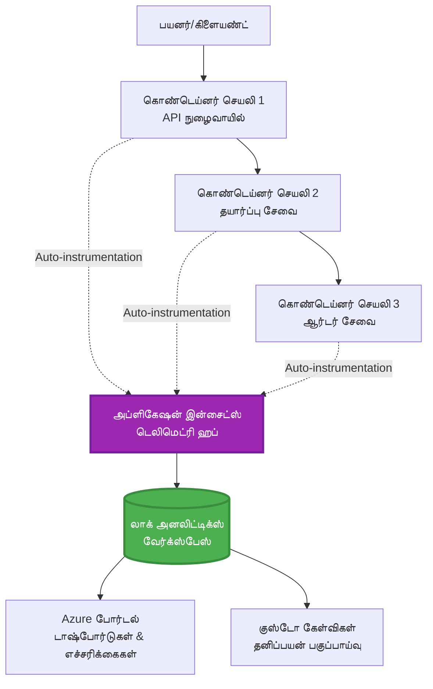
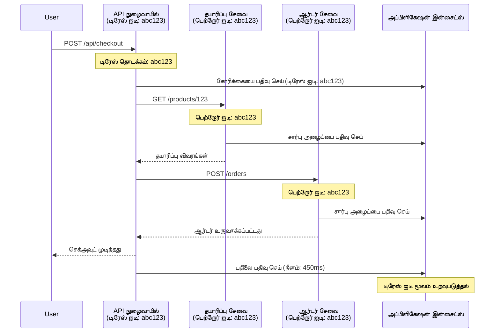

# Application Insights AZD உடன் ஒருங்கிணைப்பு

⏱️ **கூறப்பட்ட நேரம்**: 40-50 நிமிடங்கள் | 💰 **செலவுச் தாக்கம்**: ~$5-15/மாதம் | ⭐ **சிக்கலான தன்மை**: இடைநிலை

**📚 கற்றல் பாதை:**
- ← முந்தையது: [முன்-பரிசோதனைகள்](preflight-checks.md) - முன்-நியமன சரிபார்ப்பு
- 🎯 **நீங்கள் இங்கே இருக்கிறீர்கள்**: Application Insights ஒருங்கிணைப்பு (மேற்பார்வை, டெலிமெட்ரி, பிழைத் திருத்தம்)
- → அடுத்தது: [வெளியீடு வழிகாட்டி](../chapter-04-infrastructure/deployment-guide.md) - Azure-க்கு வெளியிடுதல்
- 🏠 [பாடநெறி முகப்பு](../../README.md)

---

## நீங்கள் கற்றுக்கொள்வது

By completing this lesson, you will:
- AZD திட்டங்களில் **Application Insights** ஐ தானாக ஒருங்கிணைக்கவும்
- மைக்ரோசேவைகள் සඳහා **distributed tracing** ஐ ஒழுங்கமைக்கவும்
- **தனிப்பயன் டெலிமெட்ரி** (அளவீடுகள், நிகழ்வுகள், சார்புகள்) செயல்படுத்தவும்
- நேரடிக் கண்காணிப்பிற்காக **லைவ் மெட்ரிக்ஸ்** அமைக்கவும்
- AZD வெளியீடுகளிலிருந்து **எச்சரிக்கைகள் மற்றும் டாஷ்போர்டுகள்** உருவாக்கவும்
- **டெலிமெட்ரி வினாக்களினூடே** உற்பத்தி சிக்கல்களை பிழைதிருத்தவும்
- **செலவுகள் மற்றும் சாம்பிளிங்** தந்திரங்களை மேம்படுத்தவும்
- **AI/LLM பயன்பாடுகளை** (டோக்கன்கள், தாமதம், செலவுகள்) கண்காணிக்கவும்

## AZD உடன் Application Insights முக்கியத்துவம்

### சவால்: உற்பத்தி கண்காணிப்பு திறன்

**Application Insights இல்லாமல்:**
```
❌ No visibility into production behavior
❌ Manual log aggregation across services
❌ Reactive debugging (wait for customer complaints)
❌ No performance metrics
❌ Cannot trace requests across services
❌ Unknown failure rates and bottlenecks
```

**Application Insights + AZD உடன்:**
```
✅ Automatic telemetry collection
✅ Centralized logs from all services
✅ Proactive issue detection
✅ End-to-end request tracing
✅ Performance metrics and insights
✅ Real-time dashboards
✅ AZD provisions everything automatically
```

**உவமை**: Application Insights உங்கள் பயன்பாட்டிற்கான "black box" பயண பதிவாளரும் + கோக்பிட் டாஷ்போர்டும் போன்றது. நீங்கள் நேரடி முறையில் நடைபெறும் அனைத்தையும் பார்க்கலாம் மற்றும் எந்தவொரு சம்பவத்தையும் மீட்டுப் பார்வையிட முடியும்.

---

## கட்டமைப்பு கண்ணோட்டம்

### AZD கட்டமைப்பில் Application Insights


### தானாகவே கண்காணிக்கப்படும் விடயங்கள்

| டெலிமெட்ரி வகை | அது என்னப் பதிவுசெய்கிறது | பயன்பாடு |
|----------------|------------------|----------|
| **Requests** | HTTP கோரிக்கைகள், நிலை குறியீடுகள், காலம் | API செயல்திறன் கண்காணிப்பு |
| **Dependencies** | வெளி அழைப்புகள் (DB, APIs, storage) | தடைபோகும் பகுதிகளை கண்டறிதல் |
| **Exceptions** | கைமாறு செய்யப்படாத பிழைகள் மற்றும் ஸ்டாக் டிரேஸ்கள் | தோல்விகளை பிழைதிருத்தல் |
| **Custom Events** | வணிக நிகழ்வுகள் (சೈನ್-அப், கொள்முதல்) | அனாலிட்டிக்ஸ் மற்றும் வழித்தடங்கள் |
| **Metrics** | செயல்திறன் கவுன்டர்கள், தனிப்பயன் மீட்ரிக்ஸ் | திறன் திட்டமிடல் |
| **Traces** | கடுமை நிலை உடன் பதிவு செய்திகள் | பிழைதிருத்தம் மற்றும் ஆடிட்டிங் |
| **Availability** | Uptime மற்றும் பதிலளிக்கும் நேர சோதனைகள் | SLA கண்காணிப்பு |

---

## முன் நிபந்தனைகள்

### தேவையான கருவிகள்

```bash
# Azure Developer CLI ஐச் சரிபார்க்கவும்
azd version
# ✅ எதிர்பார்க்கப்படும்: azd பதிப்பு 1.0.0 அல்லது அதற்கு மேலானது

# Azure CLI ஐச் சரிபார்க்கவும்
az --version
# ✅ எதிர்பார்க்கப்படும்: azure-cli பதிப்பு 2.50.0 அல்லது அதற்கு மேலானது
```

### Azure தேவைகள்

- செயலில் உள்ள Azure சந்தா
- உருவாக்க அனுமதிகள்:
  - Application Insights வளங்கள்
  - Log Analytics வேலைநிலைகள்
  - Container பயன்பாடுகள்
  - வளக் குழுக்கள்

### மூல அறிவுத் தேவைகள்

நீங்கள் முடித்து வைத்திருப்பது என்று இருக்க வேண்டும்:
- [AZD அடிப்படை](../chapter-01-foundation/azd-basics.md) - AZD இன் அடிப்படை கருத்துகள்
- [கட்டமைப்பு](../chapter-03-configuration/configuration.md) - சூழல் அமைப்பு
- [முதல் திட்டம்](../chapter-01-foundation/first-project.md) - அடிப்படை வெளியீடு

---

## பாடம் 1: AZD உடன் தானியங்கி Application Insights

### AZD எப்படி Application Insights ஐ வழங்குகிறது

நீங்கள் வெளியிடும்போது AZD தானாக Application Insights ஐ உருவாக்கி கட்டமைக்கிறது. அது எப்படி செயல்படுகிறது என்பதை காண்போம்.

### திட்ட கட்டமைப்பு

```
monitored-app/
├── azure.yaml                     # AZD configuration
├── infra/
│   ├── main.bicep                # Main infrastructure
│   ├── core/
│   │   └── monitoring.bicep      # Application Insights + Log Analytics
│   └── app/
│       └── api.bicep             # Container App with monitoring
└── src/
    ├── app.py                    # Application with telemetry
    ├── requirements.txt
    └── Dockerfile
```

---

### படி 1: AZD ஐ கட்டமைக்கவும் (azure.yaml)

**கோப்பு: `azure.yaml`**

```yaml
name: monitored-app
metadata:
  template: monitored-app@1.0.0

services:
  api:
    project: ./src
    language: python
    host: containerapp

# AZD automatically provisions monitoring!
```

**அதுதான்!** AZD இயல்பாகவே Application Insights ஐ உருவாக்கும். அடிப்படை கண்காணிப்புக்கு கூடுதல் கட்டமைப்பு தேவையில்லை.

---

### படி 2: கண்காணிப்பு உள்கட்டமைப்பு (Bicep)

**கோப்பு: `infra/core/monitoring.bicep`**

```bicep
param logAnalyticsName string
param applicationInsightsName string
param location string = resourceGroup().location
param tags object = {}

// Log Analytics Workspace (required for Application Insights)
resource logAnalytics 'Microsoft.OperationalInsights/workspaces@2022-10-01' = {
  name: logAnalyticsName
  location: location
  tags: tags
  properties: {
    sku: {
      name: 'PerGB2018'  // Pay-as-you-go pricing
    }
    retentionInDays: 30  // Keep logs for 30 days
    features: {
      enableLogAccessUsingOnlyResourcePermissions: true
    }
  }
}

// Application Insights
resource applicationInsights 'Microsoft.Insights/components@2020-02-02' = {
  name: applicationInsightsName
  location: location
  tags: tags
  kind: 'web'
  properties: {
    Application_Type: 'web'
    WorkspaceResourceId: logAnalytics.id
    IngestionMode: 'LogAnalytics'
    publicNetworkAccessForIngestion: 'Enabled'
    publicNetworkAccessForQuery: 'Enabled'
  }
}

// Outputs for Container Apps
output logAnalyticsWorkspaceId string = logAnalytics.id
output logAnalyticsWorkspaceName string = logAnalytics.name
output applicationInsightsConnectionString string = applicationInsights.properties.ConnectionString
output applicationInsightsInstrumentationKey string = applicationInsights.properties.InstrumentationKey
output applicationInsightsName string = applicationInsights.name
```

---

### படி 3: Container App ஐ Application Insights உடன் இணைக்கவும்

**கோப்பு: `infra/app/api.bicep`**

```bicep
param name string
param location string
param tags object = {}
param containerAppsEnvironmentName string
param applicationInsightsConnectionString string

resource containerApp 'Microsoft.App/containerApps@2023-05-01' = {
  name: name
  location: location
  tags: tags
  properties: {
    configuration: {
      ingress: {
        external: true
        targetPort: 8000
      }
      secrets: [
        {
          name: 'appinsights-connection-string'
          value: applicationInsightsConnectionString
        }
      ]
    }
    template: {
      containers: [
        {
          name: 'api'
          image: 'myregistry.azurecr.io/api:latest'
          resources: {
            cpu: json('0.5')
            memory: '1Gi'
          }
          env: [
            {
              name: 'APPLICATIONINSIGHTS_CONNECTION_STRING'
              secretRef: 'appinsights-connection-string'
            }
            {
              name: 'APPLICATIONINSIGHTS_ENABLED'
              value: 'true'
            }
          ]
        }
      ]
    }
  }
}

output uri string = 'https://${containerApp.properties.configuration.ingress.fqdn}'
```

---

### படி 4: டெலிமெட்ரியுடன் பயன்பாட்டு குறியீடு

**கோப்பு: `src/app.py`**

```python
from flask import Flask, request, jsonify
from opencensus.ext.azure.log_exporter import AzureLogHandler
from opencensus.ext.azure.trace_exporter import AzureExporter
from opencensus.ext.flask.flask_middleware import FlaskMiddleware
from opencensus.trace.samplers import ProbabilitySampler
import logging
import os

app = Flask(__name__)

# Application Insights இணைப்பு சரத்தைப் பெறுக
connection_string = os.environ.get('APPLICATIONINSIGHTS_CONNECTION_STRING')

if connection_string:
    # பரவலான தடைக் கண்காணிப்பை அமைக்கவும்
    middleware = FlaskMiddleware(
        app,
        exporter=AzureExporter(connection_string=connection_string),
        sampler=ProbabilitySampler(rate=1.0)  # வளர்ச்சி சூழலுக்காக 100% மாதிரித்தேர்வு
    )
    
    # பதிவுகளை அமைக்கவும்
    logger = logging.getLogger(__name__)
    logger.addHandler(AzureLogHandler(connection_string=connection_string))
    logger.setLevel(logging.INFO)
    
    print("✅ Application Insights enabled")
else:
    logger = logging.getLogger(__name__)
    logger.setLevel(logging.INFO)
    print("⚠️ Application Insights not configured")

@app.route('/health')
def health():
    logger.info('Health check endpoint called')
    return jsonify({'status': 'healthy', 'monitoring': 'enabled'})

@app.route('/api/products')
def get_products():
    logger.info('Fetching products')
    
    # தரவுத்தள அழைப்பை மாதிரியாக்கவும் (இது தானாகவே சார்பாகக் கண்காணிக்கப்படும்)
    products = [
        {'id': 1, 'name': 'Laptop', 'price': 999.99},
        {'id': 2, 'name': 'Mouse', 'price': 29.99},
        {'id': 3, 'name': 'Keyboard', 'price': 79.99}
    ]
    
    logger.info(f'Returned {len(products)} products')
    return jsonify(products)

@app.route('/api/error-test')
def error_test():
    """Test error tracking"""
    logger.error('Testing error tracking')
    try:
        raise ValueError('This is a test exception')
    except Exception as e:
        logger.exception('Exception occurred in error-test endpoint')
        return jsonify({'error': str(e)}), 500

@app.route('/api/slow')
def slow_endpoint():
    """Test performance tracking"""
    import time
    logger.info('Slow endpoint called')
    time.sleep(3)  # மெதுவான செயல்பாட்டை மாதிரியாக்கவும்
    logger.warning('Endpoint took 3 seconds to respond')
    return jsonify({'message': 'Slow operation completed'})

if __name__ == '__main__':
    app.run(host='0.0.0.0', port=8000)
```

**கோப்பு: `src/requirements.txt`**

```txt
Flask==3.0.0
opencensus-ext-azure==1.1.13
opencensus-ext-flask==0.8.1
gunicorn==21.2.0
```

---

### படி 5: வெளியிடவும் மற்றும் சரிபார்க்கவும்

```bash
# AZD ஐ ஆரம்பிக்கவும்
azd init

# பதிவேற்றவும் (Application Insights ஐ தானாகவே ஏற்பாடு செய்கிறது)
azd up

# விண்ணப்பத்தின் URL ஐப் பெறுக
APP_URL=$(azd env get-values | grep API_URL | cut -d '=' -f2 | tr -d '"')

# டெலிமெட்ரி உருவாக்கவும்
curl $APP_URL/health
curl $APP_URL/api/products
curl $APP_URL/api/error-test
curl $APP_URL/api/slow
```

**✅ எதிர்பார்க்கப்படும் வெளியீடு:**
```json
{
  "status": "healthy",
  "monitoring": "enabled"
}
```

---

### படி 6: Azure போர்டலில் டெலிமெட்ரியை காட்டு

```bash
# Application Insights விவரங்களைப் பெறவும்
azd env get-values | grep APPLICATIONINSIGHTS

# Azure போர்டலில் திறக்கவும்
az monitor app-insights component show \
  --app $(azd env get-values | grep APPLICATIONINSIGHTS_NAME | cut -d '=' -f2 | tr -d '"') \
  --resource-group $(azd env get-values | grep AZURE_RESOURCE_GROUP | cut -d '=' -f2 | tr -d '"') \
  --query "appId" -o tsv
```

**Azure போர்டலுக்கு செல்லவும் → Application Insights → பரிவர்த்தனை தேடல்**

நீங்கள் காண வேண்டும்:
- ✅ HTTP கோரிக்கைகள் நிலை குறியீடுகளுடன்
- ✅ கோரிக்கை காலம் (`/api/slow` க்காக 3+ வினாடிகள்)
- ✅ `/api/error-test` இல் இருந்து தவறு விவரங்கள்
- ✅ தனிப்பயன் பதிவு செய்திகள்

---

## பாடம் 2: தனிப்பயன் டெலிமெட்ரி மற்றும் நிகழ்வுகள்

### வணிக நிகழ்வுகளை கண்காணித்தல்

வணிக-முக்கிய நிகழ்வுகளுக்கு தனிப்பயன் டெலிமெட்ரியை சேர்ப்போம்.

**கோப்பு: `src/telemetry.py`**

```python
from opencensus.ext.azure import metrics_exporter
from opencensus.stats import aggregation as aggregation_module
from opencensus.stats import measure as measure_module
from opencensus.stats import stats as stats_module
from opencensus.stats import view as view_module
from opencensus.tags import tag_map as tag_map_module
from opencensus.ext.azure.log_exporter import AzureLogHandler
from opencensus.ext.azure.trace_exporter import AzureExporter
from opencensus.trace import tracer as tracer_module
import logging
import os

class TelemetryClient:
    """Custom telemetry client for Application Insights"""
    
    def __init__(self, connection_string=None):
        self.connection_string = connection_string or os.environ.get('APPLICATIONINSIGHTS_CONNECTION_STRING')
        
        if not self.connection_string:
            print("⚠️ Application Insights connection string not found")
            return
        
        # லாகரை அமைக்கவும்
        self.logger = logging.getLogger(__name__)
        self.logger.addHandler(AzureLogHandler(connection_string=self.connection_string))
        self.logger.setLevel(logging.INFO)
        
        # மெட்ரிக்ஸ் ஏக்ஸ்போர்டர் அமைக்கவும்
        self.stats = stats_module.stats
        self.view_manager = self.stats.view_manager
        self.stats_recorder = self.stats.stats_recorder
        
        exporter = metrics_exporter.new_metrics_exporter(
            connection_string=self.connection_string
        )
        self.view_manager.register_exporter(exporter)
        
        # ட்ரேசரை அமைக்கவும்
        self.tracer = tracer_module.Tracer(
            exporter=AzureExporter(connection_string=self.connection_string)
        )
        
        print("✅ Custom telemetry client initialized")
    
    def track_event(self, event_name: str, properties: dict = None):
        """Track custom business event"""
        properties = properties or {}
        self.logger.info(
            f"CustomEvent: {event_name}",
            extra={
                'custom_dimensions': {
                    'event_name': event_name,
                    **properties
                }
            }
        )
    
    def track_metric(self, metric_name: str, value: float, properties: dict = None):
        """Track custom metric"""
        properties = properties or {}
        self.logger.info(
            f"CustomMetric: {metric_name} = {value}",
            extra={
                'custom_dimensions': {
                    'metric_name': metric_name,
                    'value': value,
                    **properties
                }
            }
        )
    
    def track_dependency(self, name: str, dependency_type: str, duration: float, success: bool):
        """Track external dependency call"""
        with self.tracer.span(name=name) as span:
            span.add_attribute('dependency.type', dependency_type)
            span.add_attribute('duration', duration)
            span.add_attribute('success', success)

# உலகளாவிய டெலிமெட்ரி கிளையன்ட்
telemetry = TelemetryClient()
```

### தனிப்பயன் நிகழ்வுகளுடன் பயன்பாட்டை மேம்படுத்து

**கோப்பு: `src/app.py` (விரிவாக்கம்)**

```python
from flask import Flask, request, jsonify
from telemetry import telemetry
import time
import random

app = Flask(__name__)

@app.route('/api/purchase', methods=['POST'])
def purchase():
    """Track purchase event with custom telemetry"""
    data = request.json
    product_id = data.get('product_id')
    quantity = data.get('quantity', 1)
    price = data.get('price', 0)
    
    # வணிக நிகழ்வை கண்காணிக்கவும்
    telemetry.track_event('Purchase', {
        'product_id': product_id,
        'quantity': quantity,
        'total_amount': price * quantity,
        'user_id': request.headers.get('X-User-Id', 'anonymous')
    })
    
    # வருமான அளவுகுறியை கண்காணிக்கவும்
    telemetry.track_metric('Revenue', price * quantity, {
        'product_id': product_id,
        'currency': 'USD'
    })
    
    return jsonify({
        'order_id': f'ORD-{random.randint(1000, 9999)}',
        'status': 'confirmed',
        'total': price * quantity
    })

@app.route('/api/search')
def search():
    """Track search queries"""
    query = request.args.get('q', '')
    
    start_time = time.time()
    
    # தேடலை மாதிரியாகச் செயல்படுத்தவும் (உண்மையில் இது தரவுத்தளக் கேள்வி இருக்கும்)
    results = [{'id': 1, 'name': f'Result for {query}'}]
    
    duration = (time.time() - start_time) * 1000  # மில்லிசெகண்டுகளில் மாற்றவும்
    
    # தேடல் நிகழ்வை கண்காணிக்கவும்
    telemetry.track_event('Search', {
        'query': query,
        'results_count': len(results),
        'duration_ms': duration
    })
    
    # தேடல் செயல்திறன் அளவுகுறியை கண்காணிக்கவும்
    telemetry.track_metric('SearchDuration', duration, {
        'query_length': len(query)
    })
    
    return jsonify({'results': results, 'count': len(results)})

@app.route('/api/external-call')
def external_call():
    """Track external API dependency"""
    import requests
    
    start_time = time.time()
    success = True
    
    try:
        # வெளிப்புற API அழைப்பை மாதிரியாகச் செயல்படுத்தவும்
        response = requests.get('https://api.example.com/data', timeout=5)
        result = response.json()
    except Exception as e:
        success = False
        result = {'error': str(e)}
    
    duration = (time.time() - start_time) * 1000
    
    # சார்பை கண்காணிக்கவும்
    telemetry.track_dependency(
        name='ExternalAPI',
        dependency_type='HTTP',
        duration=duration,
        success=success
    )
    
    return jsonify(result)

if __name__ == '__main__':
    app.run(host='0.0.0.0', port=8000)
```

### தனிப்பயன் டெலிமெட்ரியை சோதனை செய்யவும்

```bash
# கொள்முதல் நிகழ்வை பதிவுசெய்
curl -X POST $APP_URL/api/purchase \
  -H "Content-Type: application/json" \
  -H "X-User-Id: user123" \
  -d '{"product_id": 1, "quantity": 2, "price": 29.99}'

# தேடல் நிகழ்வை பதிவுசெய்
curl "$APP_URL/api/search?q=laptop"

# வெளிப்புற சார்பை பதிவுசெய்
curl $APP_URL/api/external-call
```

**Azure போர்டலில் பார்வையிடவும்:**

Application Insights → Logs க்கு செல்லவும், பின்னர் இயக்கவும்:

```kusto
// View purchase events
traces
| where customDimensions.event_name == "Purchase"
| project 
    timestamp,
    product_id = tostring(customDimensions.product_id),
    total_amount = todouble(customDimensions.total_amount),
    user_id = tostring(customDimensions.user_id)
| order by timestamp desc

// View revenue metrics
traces
| where customDimensions.metric_name == "Revenue"
| summarize TotalRevenue = sum(todouble(customDimensions.value)) by bin(timestamp, 1h)
| render timechart

// View search performance
traces
| where customDimensions.event_name == "Search"
| summarize 
    AvgDuration = avg(todouble(customDimensions.duration_ms)),
    SearchCount = count()
  by bin(timestamp, 5m)
| render timechart
```

---

## பாடம் 3: மைக்ரோசேவைகளுக்கான பகிரப்பட்ட ட்ரேசிங்

### சேவைகள் இடையே ட்ரேசிங்கை இயக்கு

மைக்ரோசேவைகளுக்கு, Application Insights தானாகவே சேவைகள் முழுவதும் கோரிக்கைகளை தொடர்புபடுத்துகிறது.

**கோப்பு: `infra/main.bicep`**

```bicep
targetScope = 'subscription'

param environmentName string
param location string = 'eastus'

var tags = { 'azd-env-name': environmentName }

resource rg 'Microsoft.Resources/resourceGroups@2021-04-01' = {
  name: 'rg-${environmentName}'
  location: location
  tags: tags
}

// Monitoring (shared by all services)
module monitoring './core/monitoring.bicep' = {
  name: 'monitoring'
  scope: rg
  params: {
    logAnalyticsName: 'log-${environmentName}'
    applicationInsightsName: 'appi-${environmentName}'
    location: location
    tags: tags
  }
}

// API Gateway
module apiGateway './app/api-gateway.bicep' = {
  name: 'api-gateway'
  scope: rg
  params: {
    name: 'ca-gateway-${environmentName}'
    location: location
    tags: union(tags, { 'azd-service-name': 'gateway' })
    applicationInsightsConnectionString: monitoring.outputs.applicationInsightsConnectionString
  }
}

// Product Service
module productService './app/product-service.bicep' = {
  name: 'product-service'
  scope: rg
  params: {
    name: 'ca-products-${environmentName}'
    location: location
    tags: union(tags, { 'azd-service-name': 'products' })
    applicationInsightsConnectionString: monitoring.outputs.applicationInsightsConnectionString
  }
}

// Order Service
module orderService './app/order-service.bicep' = {
  name: 'order-service'
  scope: rg
  params: {
    name: 'ca-orders-${environmentName}'
    location: location
    tags: union(tags, { 'azd-service-name': 'orders' })
    applicationInsightsConnectionString: monitoring.outputs.applicationInsightsConnectionString
  }
}

output APPLICATIONINSIGHTS_CONNECTION_STRING string = monitoring.outputs.applicationInsightsConnectionString
output GATEWAY_URL string = apiGateway.outputs.uri
```

### தொடர்-முடிவு பரிவர்த்தனையை காண்க


**End-to-end ட்ரேஸ் கேள்வி:**

```kusto
// Find complete request flow
let traceId = "abc123...";  // Get from response header
dependencies
| union requests
| where operation_Id == traceId
| project 
    timestamp,
    type = itemType,
    name,
    duration,
    success,
    cloud_RoleName
| order by timestamp asc
```

---

## பாடம் 4: லைவ் மெட்ரிக்ஸ் மற்றும் நேரடி கண்காணிப்பு

### லைவ் மெட்ரிக்ஸ் ஸ்ட்ரீமினை இயக்கவும்

லைவ் மெட்ரிக்ஸ் <1 second latency உடன் நேரடி டெலிமெட்ரியை வழங்குகிறது.

**லைவ் மெட்ரிக்ஸ் அணுகல்:**

```bash
# Application Insights வளத்தைப் பெறுக
APPI_NAME=$(azd env get-values | grep APPLICATIONINSIGHTS_NAME | cut -d '=' -f2 | tr -d '"')

# வளக் குழுவைப் பெறுக
RG_NAME=$(azd env get-values | grep AZURE_RESOURCE_GROUP | cut -d '=' -f2 | tr -d '"')

echo "Navigate to: Azure Portal → Resource Groups → $RG_NAME → $APPI_NAME → Live Metrics"
```

**நேரடியாக நீங்கள் காணும் விஷயங்கள்:**
- ✅ வந்துகொள்ளும் கோரிக்கை வீதம் (requests/sec)
- ✅ வெளியே செல்லும் சார்பு அழைப்புகள்
- ✅ தவறுகளின் எண்ணிக்கை
- ✅ CPU மற்றும் நினைவக பயன்பாடு
- ✅ செயலில் உள்ள சர்வர் எண்ணிக்கை
- ✅ மாதிரி டெலிமெட்ரி

### சோதனைக்கு ஏவல் உருவாக்குதல்

```bash
# சுமையை உருவாக்கி நேரடி அளவுருக்களைப் பார்க்கவும்
for i in {1..100}; do
  curl $APP_URL/api/products &
  curl $APP_URL/api/search?q=test$i &
done

# Azure போர்டலில் நேரடி அளவுருக்களைப் பார்க்கவும்
# நீங்கள் கோரிக்கை விகிதம் திடீரென அதிகரிக்கிறதை காண வேண்டும்
```

---

## தொழில்முறை பயிற்சிகள்

### பயிற்சி 1: எச்சரிக்கைகள் அமைக்கவும் ⭐⭐ (மிதமான)

**நோக்கம்**: அதிக பிழை விகிதம் மற்றும் மெதுவான பதில்களுக்கான எச்சரிக்கைகள் உருவாக்குதல்.

**படிகள்:**

1. **பிழை விகிதத்துக்கான எச்சரிக்கை உருவாக்கவும்:**

```bash
# Application Insights வளத்தின் ID-ஐப் பெறவும்
APPI_ID=$(az monitor app-insights component show \
  --app $APPI_NAME \
  --resource-group $RG_NAME \
  --query "id" -o tsv)

# தோல்வியுற்ற கோரிக்கைகளுக்காக அளவியல் எச்சரிக்கையை உருவாக்கவும்
az monitor metrics alert create \
  --name "High-Error-Rate" \
  --resource-group $RG_NAME \
  --scopes $APPI_ID \
  --condition "count requests/failed > 10" \
  --window-size 5m \
  --evaluation-frequency 1m \
  --description "Alert when error rate exceeds 10 per 5 minutes"
```

2. **மெதுவான பதில்களுக்கு எச்சரிக்கையை உருவாக்கவும்:**

```bash
az monitor metrics alert create \
  --name "Slow-Responses" \
  --resource-group $RG_NAME \
  --scopes $APPI_ID \
  --condition "avg requests/duration > 3000" \
  --window-size 5m \
  --evaluation-frequency 1m \
  --description "Alert when average response time exceeds 3 seconds"
```

3. **Bicep மூலம் எச்சரிக்கையை உருவாக்கவும் (AZD க்காக பரிந்துரைக்கப்படுகிறது):**

**கோப்பு: `infra/core/alerts.bicep`**

```bicep
param applicationInsightsId string
param actionGroupId string = ''
param location string = resourceGroup().location

// High error rate alert
resource errorRateAlert 'Microsoft.Insights/metricAlerts@2018-03-01' = {
  name: 'high-error-rate'
  location: 'global'
  properties: {
    description: 'Alert when error rate exceeds threshold'
    severity: 2
    enabled: true
    scopes: [
      applicationInsightsId
    ]
    evaluationFrequency: 'PT1M'
    windowSize: 'PT5M'
    criteria: {
      'odata.type': 'Microsoft.Azure.Monitor.SingleResourceMultipleMetricCriteria'
      allOf: [
        {
          name: 'Error rate'
          metricName: 'requests/failed'
          operator: 'GreaterThan'
          threshold: 10
          timeAggregation: 'Count'
        }
      ]
    }
    actions: actionGroupId != '' ? [
      {
        actionGroupId: actionGroupId
      }
    ] : []
  }
}

// Slow response alert
resource slowResponseAlert 'Microsoft.Insights/metricAlerts@2018-03-01' = {
  name: 'slow-responses'
  location: 'global'
  properties: {
    description: 'Alert when response time is too high'
    severity: 3
    enabled: true
    scopes: [
      applicationInsightsId
    ]
    evaluationFrequency: 'PT1M'
    windowSize: 'PT5M'
    criteria: {
      'odata.type': 'Microsoft.Azure.Monitor.SingleResourceMultipleMetricCriteria'
      allOf: [
        {
          name: 'Response duration'
          metricName: 'requests/duration'
          operator: 'GreaterThan'
          threshold: 3000
          timeAggregation: 'Average'
        }
      ]
    }
  }
}

output errorAlertId string = errorRateAlert.id
output slowResponseAlertId string = slowResponseAlert.id
```

4. **எச்சரிக்கைகளை பரிசோதிக்கவும்:**

```bash
# பிழைகள் உருவாக்கவும்
for i in {1..20}; do
  curl $APP_URL/api/error-test
done

# மெதுவான பதில்களை உருவாக்கவும்
for i in {1..10}; do
  curl $APP_URL/api/slow
done

# எச்சரிக்கை நிலையை சரிபார்க்கவும் (5-10 நிமிடங்கள் காத்திருங்கள்)
az monitor metrics alert list \
  --resource-group $RG_NAME \
  --query "[].{Name:name, Enabled:enabled, State:properties.enabled}" \
  --output table
```

**✅ வெற்றிக்கூறு:**
- ✅ எச்சரிக்கைகள் வெற்றிகரமாக உருவாக்கப்பட்டன
- ✅ வரம்புகள் மீறப்பட்டால் எச்சரிக்கைகள் இயங்கும்
- ✅ Azure போர்டலில் எச்சரிக்கை வரலாற்றை பார்க்க முடியும்
- ✅ AZD வெளியீட்டுடன் ஒருங்கிணைக்கப்பட்டது

**நேரம்**: 20-25 நிமிடங்கள்

---

### பயிற்சி 2: தனிப்பயன் டாஷ்போர்டு உருவாக்கம் ⭐⭐ (மிதமான)

**நோக்கம்**: முக்கிய பயன்பாட்டு மீட்ரிக்ஸ்களை காட்டும் ஒரு டாஷ்போர்டை கட்டமைக்கவும்.

**படிகள்:**

1. **Azure போர்டல் மூலம் டாஷ்போர்டு உருவாக்கவும்:**

செல்லவும்: Azure போர்டல் → டாஷ்போர்டுகள் → புதிய டாஷ்போர்டு

2. **முக்கிய மீட்ரிக்ஸ்களுக்கு டைல்கள் சேர்க்கவும்:**

- கோரிக்கை எண்ணிக்கை (கடந்த 24 மணிநேரம்)
- சராசரி பதிலளிக்கும் நேரம்
- பிழை விகிதம்
- மேற்பட்ட 5 மெதுவான செயல்பாடுகள்
- பயனர்களின் புவியியல் விநியோகம்

3. **Bicep மூலம் டாஷ்போர்டை உருவாக்கவும்:**

**கோப்பு: `infra/core/dashboard.bicep`**

```bicep
param dashboardName string
param applicationInsightsId string
param location string = resourceGroup().location

resource dashboard 'Microsoft.Portal/dashboards@2020-09-01-preview' = {
  name: dashboardName
  location: location
  properties: {
    lenses: [
      {
        order: 0
        parts: [
          // Request count
          {
            position: { x: 0, y: 0, rowSpan: 4, colSpan: 6 }
            metadata: {
              type: 'Extension/Microsoft_OperationsManagementSuite_Workspace/PartType/LogsDashboardPart'
              inputs: [
                {
                  name: 'resourceId'
                  value: applicationInsightsId
                }
                {
                  name: 'query'
                  value: '''
                    requests
                    | summarize RequestCount = count() by bin(timestamp, 1h)
                    | render timechart
                  '''
                }
              ]
            }
          }
          // Error rate
          {
            position: { x: 6, y: 0, rowSpan: 4, colSpan: 6 }
            metadata: {
              type: 'Extension/Microsoft_OperationsManagementSuite_Workspace/PartType/LogsDashboardPart'
              inputs: [
                {
                  name: 'resourceId'
                  value: applicationInsightsId
                }
                {
                  name: 'query'
                  value: '''
                    requests
                    | summarize 
                        Total = count(),
                        Failed = countif(success == false)
                    | extend ErrorRate = (Failed * 100.0) / Total
                    | project ErrorRate
                  '''
                }
              ]
            }
          }
        ]
      }
    ]
  }
}

output dashboardId string = dashboard.id
```

4. **டாஷ்போர்டை வெளியிடவும்:**

```bash
# main.bicep கோப்பில் சேர்க்கவும்
module dashboard './core/dashboard.bicep' = {
  name: 'dashboard'
  scope: rg
  params: {
    dashboardName: 'dashboard-${environmentName}'
    applicationInsightsId: monitoring.outputs.applicationInsightsId
    location: location
  }
}

# பயன்படுத்தவும்
azd up
```

**✅ வெற்றி நிபந்தனைகள்:**
- ✅ டாஷ்போர்டு முக்கிய மீட்ரிக்ஸ்களை காட்டுகிறது
- ✅ Azure போர்டல் முகப்பிற்கு பின் செய்யலாம்
- ✅ நேரடியாக புதுப்பிக்கிறது
- ✅ AZD மூலம் வெளியிடக்கூடியது

**நேரம்**: 25-30 நிமிடங்கள்

---

### பயிற்சி 3: AI/LLM பயன்பாட்டை கண்காணிக்கவும் ⭐⭐⭐ (மேம்பட்ட)

**நோக்கம்**: Microsoft Foundry மாடல்களின் பயன்பாட்டை (டோக்கன்கள், செலவுகள், தாமதம்) கண்காணிக்கவும்.

**படிகள்:**

1. **AI கண்காணிப்பு ரேப்பர் உருவாக்கவும்:**

**கோப்பு: `src/ai_telemetry.py`**

```python
from telemetry import telemetry
from openai import AzureOpenAI
import time

class MonitoredAzureOpenAI:
    """Microsoft Foundry Models client with automatic telemetry"""
    
    def __init__(self, api_key, endpoint, api_version="2024-02-01"):
        self.client = AzureOpenAI(
            api_key=api_key,
            api_version=api_version,
            azure_endpoint=endpoint
        )
    
    def chat_completion(self, model: str, messages: list, **kwargs):
        """Track chat completion with telemetry"""
        start_time = time.time()
        
        try:
            # Microsoft Foundry மாடல்களை அழைக்கவும்
            response = self.client.chat.completions.create(
                model=model,
                messages=messages,
                **kwargs
            )
            
            duration = (time.time() - start_time) * 1000  # ms
            
            # பயன்பாடு தகவலைப் பெறவும்
            usage = response.usage
            prompt_tokens = usage.prompt_tokens
            completion_tokens = usage.completion_tokens
            total_tokens = usage.total_tokens
            
            # கட்டணத்தை கணக்கிடவும் (gpt-4.1 விலை)
            prompt_cost = (prompt_tokens / 1000) * 0.03  # ஒவ்வொரு 1K டோக்கனுக்கும் $0.03
            completion_cost = (completion_tokens / 1000) * 0.06  # ஒவ்வொரு 1K டோக்கனுக்கும் $0.06
            total_cost = prompt_cost + completion_cost
            
            # தனிப்பயன் நிகழ்வை கண்காணிக்கவும்
            telemetry.track_event('OpenAI_Request', {
                'model': model,
                'prompt_tokens': prompt_tokens,
                'completion_tokens': completion_tokens,
                'total_tokens': total_tokens,
                'duration_ms': duration,
                'cost_usd': total_cost,
                'success': True
            })
            
            # அளவீடுகளை கண்காணிக்கவும்
            telemetry.track_metric('OpenAI_Tokens', total_tokens, {
                'model': model,
                'type': 'total'
            })
            
            telemetry.track_metric('OpenAI_Cost', total_cost, {
                'model': model,
                'currency': 'USD'
            })
            
            telemetry.track_metric('OpenAI_Duration', duration, {
                'model': model
            })
            
            return response
            
        except Exception as e:
            duration = (time.time() - start_time) * 1000
            
            telemetry.track_event('OpenAI_Request', {
                'model': model,
                'duration_ms': duration,
                'success': False,
                'error': str(e)
            })
            
            raise
```

2. **கண்காணிக்கப்பட்ட கிளையண்டை பயன்படுத்தவும்:**

```python
from flask import Flask, request, jsonify
from ai_telemetry import MonitoredAzureOpenAI
import os

app = Flask(__name__)

# கண்காணிக்கப்பட்ட OpenAI கிளையண்டை ஆரம்பிக்கவும்
openai_client = MonitoredAzureOpenAI(
    api_key=os.environ['AZURE_OPENAI_API_KEY'],
    endpoint=os.environ['AZURE_OPENAI_ENDPOINT']
)

@app.route('/api/chat', methods=['POST'])
def chat():
    data = request.json
    user_message = data.get('message')
    
    # தானியங்கி கண்காணிப்புடன் அழைக்கவும்
    response = openai_client.chat_completion(
        model='gpt-4.1',
        messages=[
            {'role': 'user', 'content': user_message}
        ]
    )
    
    return jsonify({
        'response': response.choices[0].message.content,
        'tokens': response.usage.total_tokens
    })
```

3. **AI மீட்ரிக்ஸ்களை கேட்கவும்:**

```kusto
// Total AI spend over time
traces
| where customDimensions.event_name == "OpenAI_Request"
| where customDimensions.success == "True"
| summarize TotalCost = sum(todouble(customDimensions.cost_usd)) by bin(timestamp, 1h)
| render timechart

// Token usage by model
traces
| where customDimensions.event_name == "OpenAI_Request"
| summarize 
    TotalTokens = sum(toint(customDimensions.total_tokens)),
    RequestCount = count()
  by Model = tostring(customDimensions.model)

// Average latency
traces
| where customDimensions.event_name == "OpenAI_Request"
| summarize AvgDuration = avg(todouble(customDimensions.duration_ms))
| project AvgDurationSeconds = AvgDuration / 1000

// Cost per request
traces
| where customDimensions.event_name == "OpenAI_Request"
| extend Cost = todouble(customDimensions.cost_usd)
| summarize 
    TotalCost = sum(Cost),
    RequestCount = count(),
    AvgCostPerRequest = avg(Cost)
```

**✅ வெற்றி நிபந்தனைகள்:**
- ✅ ஒவ்வொரு OpenAI அழைப்பும் தானாக கண்காணிக்கப்படுகிறது
- ✅ டோக்கன் பயன்பாடு மற்றும் செலவுகள் காட்சி
- ✅ தாமதம் கண்காணிக்கப்படுகிறது
- ✅ பட்ஜெட் எச்சரிக்கைகள் அமைக்க முடியும்

**நேரம்**: 35-45 நிமிடங்கள்

---

## செலவு சிறப்பாக்கம்

### சாம்பிளிங் தந்திரங்கள்

டெலிமெட்ரியை மாதிரியாக எடுத்துக்கொண்டு செலவைக் கட்டுப்படுத்துக:

```python
from opencensus.trace.samplers import ProbabilitySampler

# வளர்ச்சி: 100% மாதிரித்தல்
sampler = ProbabilitySampler(rate=1.0)

# உற்பத்தி: 10% மாதிரித்தல் (செலவுகளை 90% குறைக்கும்)
sampler = ProbabilitySampler(rate=0.1)

# அனுகூலமான மாதிரித்தல் (தானாக சரிசெய்கிறது)
from opencensus.trace.samplers import AdaptiveSampler
sampler = AdaptiveSampler()
```

**Bicep இல்:**

```bicep
resource applicationInsights 'Microsoft.Insights/components@2020-02-02' = {
  name: applicationInsightsName
  properties: {
    SamplingPercentage: 10  // 10% sampling
  }
}
```

### தரவு தக்கவைக்கும் காலம்

```bicep
resource logAnalytics 'Microsoft.OperationalInsights/workspaces@2022-10-01' = {
  name: logAnalyticsName
  properties: {
    retentionInDays: 30  // Minimum (cheapest)
    // Options: 30, 31, 60, 90, 120, 180, 270, 365, 550, 730
  }
}
```

### மாதாந்திர செலவு மதிப்பீடுகள்

| தரவு அளவு | தக்கவைத்தல் | மாதாந்திர செலவு |
|-------------|-----------|--------------|
| 1 GB/மாதம் | 30 நாட்கள் | ~$2-5 |
| 5 GB/மாதம் | 30 நாட்கள் | ~$10-15 |
| 10 GB/மாதம் | 90 நாட்கள் | ~$25-40 |
| 50 GB/மாதம் | 90 நாட்கள் | ~$100-150 |

**இலவச நிலை**: 5 GB/மாதம் அடங்கியுள்ளது

---

## அறிவு பரிசோதனை

### 1. அடிப்படை ஒருங்கிணைவு ✓

உங்கள் புரிதலை சோதிக்கவும்:

- [ ] **Q1**: AZD எப்படி Application Insights ஐ வழங்குகிறது?
  - **A**: Bicep டெம்ப்ளேட்களினூடே தானாக `infra/core/monitoring.bicep`

- [ ] **Q2**: Application Insights ஐ இயக்க எந்த சுற்றுச்சூழல் மாறி உள்ளது?
  - **A**: `APPLICATIONINSIGHTS_CONNECTION_STRING`

- [ ] **Q3**: மூன்று முக்கிய டெலிமெட்ரி வகைகள் எவை?
  - **A**: கோரிக்கைகள் (HTTP அழைப்புகள்), சார்புகள் (வெளி அழைப்புகள்), தவறுகள் (பிழைகள்)

**கைமுறை சரிபார்ப்பு:**
```bash
# Application Insights அமைக்கப்பட்டுள்ளதா என்பதைச் சரிபார்க்கவும்
azd env get-values | grep APPLICATIONINSIGHTS

# டெலிமெட்ரி தரவுகள் பாய்ந்து கொண்டு இருக்கிறதா என்பதை உறுதிசெய்யவும்
az monitor app-insights metrics show \
  --app $APPI_NAME \
  --resource-group $RG_NAME \
  --metric "requests/count"
```

---

### 2. தனிப்பயன் டெலிமெட்ரி ✓

உங்கள் புரிதலை சோதிக்கவும்:

- [ ] **Q1**: தனிப்பயன் வணிக நிகழ்வுகளை நீங்கள் எப்படி கண்காணிப்பீர்கள்?
  - **A**: `custom_dimensions` உடன் லாகர் பயன்படுத்தவும் அல்லது `TelemetryClient.track_event()`

- [ ] **Q2**: நிகழ்வுகள் மற்றும் மெட்ரிக்ஸ்களுக்கிடையிலான வித்தியாசம் என்ன?
  - **A**: நிகழ்வுகள் தனித்துவமான நிகழ்ச்சிகள், மெட்ரிக்ஸ்கள் எண்கணிக்கை அளவீடுகள்

- [ ] **Q3**: சேவைகள் மத்தியில் டெலிமெட்ரியை எப்படி ஒத்திசைப்படுத்துவது?
  - **A**: Application Insights தானாகவே தொடர்புக்காக `operation_Id` ஐ பயன்படுத்துகிறது

**கைமுறை சரிபார்ப்பு:**
```kusto
// Verify custom events
traces
| where customDimensions.event_name != ""
| summarize count() by tostring(customDimensions.event_name)
```

---

### 3. உற்பத்தி கண்காணிப்பு ✓

உங்கள் புரிதலை சோதிக்கவும்:

- [ ] **Q1**: சாம்பிளிங் என்ன மற்றும் அதை ஏன் பயன்படுத்த வேண்டும்?
  - **A**: சாம்பிளிங் டெலிமெட்ரியின் ஒரு சதவிகிதத்தை மட்டும் பிடித்துக்கொண்டு தரவு அளவையும் (மற்றும் செலவையும்) குறைக்கிறது

- [ ] **Q2**: எச்சரிக்கைகளை எப்படி அமைக்கின்றீர்கள்?
  - **A**: Application Insights மீட்ரிக்ஸ்களை அடிப்படையாக கொண்டு Bicep அல்லது Azure போர்டல் இல் மெட்ரிக் எச்சரிக்கைகள் பயன்படுத்தவும்

- [ ] **Q3**: Log Analytics மற்றும் Application Insights இடையிலான வித்தியாசம் என்ன?
  - **A**: Application Insights தரவுகளை Log Analytics வேலைநிலையில் சேமிக்கிறது; App Insights பயன்பாடு-சார்ந்த காட்சியினை வழங்குகிறது

**கைமுறை சரிபார்ப்பு:**
```bash
# சேம்பிளிங் கட்டமைப்பை சரிபார்க்கவும்
az monitor app-insights component show \
  --app $APPI_NAME \
  --resource-group $RG_NAME \
  --query "properties.SamplingPercentage"
```

---

## சிறந்த நடைமுறைகள்

### ✅ பின்பற்றவேண்டும்:

1. **ஒத்திசைப்பு IDகளைப் பயன்படுத்தவும்**
   ```python
   logger.info('Processing order', extra={
       'custom_dimensions': {
           'order_id': order_id,
           'user_id': user_id
       }
   })
   ```

2. **கடுமையான மீட்ரிக்ஸ்க்கான எச்சரிக்கைகள் அமைக்கவும்**
   ```bicep
   // Error rate, slow responses, availability
   ```

3. **உருவமைந்த பதிவு (structured logging) பயன்படுத்தவும்**
   ```python
   # ✅ நல்லது: கட்டமைக்கப்பட்ட
   logger.info('User signup', extra={'custom_dimensions': {'user_id': 123}})
   
   # ❌ மோசம்: கட்டமைக்கப்படாத
   logger.info(f'User 123 signed up')
   ```

4. **சார்புகளை கண்காணிக்கவும்**
   ```python
   # தானாக தரவுத்தள அழைப்புகளை, HTTP கோரிக்கைகளை மற்றும் பிறவற்றை கண்காணிக்கவும்.
   ```

5. **வெளியீடு போடும் போது லைவ் மெட்ரிக்ஸைப் பயன்படுத்தவும்**

### ❌ செய்யக்கூடாது:

1. **ரகசிய தரவை பதிவு செய்யாதீர்கள்**
   ```python
   # ❌ மோசமான
   logger.info(f'Login: {username}:{password}')
   
   # ✅ நல்ல
   logger.info('Login attempt', extra={'custom_dimensions': {'username': username}})
   ```

2. **உற்பத்தியில் 100% சாம்பிளிங்கைப் பயன்படுத்த வேண்டாம்**
   ```python
   # ❌ விலை அதிகம்
   sampler = ProbabilitySampler(rate=1.0)
   
   # ✅ விலைக்கு பொருத்தமான
   sampler = ProbabilitySampler(rate=0.1)
   ```

3. **டெட் லெட்டர் கியூக்களை புறக்கணிக்காதீர்கள்**

4. **தரவு தக்கவைத்து வரம்புகளை அமைப்பதை மறக்காதீர்கள்**

---

## பிரச்சினை தீர்வு

### பிரச்சினை: டெலிமெட்ரி தெரியவிடாமல் இருக்கிறது

**காரணம்:**
```bash
# இணைப்பு சரம் அமைக்கப்பட்டுள்ளதா என்பதைச் சரிபார்க்கவும்
azd env get-values | grep APPLICATIONINSIGHTS

# Azure Monitor மூலம் செயலி பதிவுகளைச் சரிபார்க்கவும்
azd monitor --logs

# அல்லது Container Apps-க்கான Azure CLI ஐ பயன்படுத்தவும்:
az containerapp logs show --name $APP_NAME --resource-group $RG_NAME --tail 50
```

**தீர்வு:**
```bash
# Container App இல் இணைப்பு ஸ்ட்ரிங்கை சரிபார்க்கவும்
az containerapp show \
  --name $APP_NAME \
  --resource-group $RG_NAME \
  --query "properties.template.containers[0].env" \
  | grep -i applicationinsights
```

---

### பிரச்சினை: அதிக செலவுகள்

**காரணம்:**
```bash
# தரவு இறக்குமதி சரிபார்க்கவும்
az monitor app-insights metrics show \
  --app $APPI_NAME \
  --resource-group $RG_NAME \
  --metric "availabilityResults/count"
```

**தீர்வு:**
- சாம்பிளிங் வீதத்தை குறைக்கவும்
- தக்கவைத்தல் காலத்தைக் குறைக்கவும்
- விரிவான பதிவீல்களை நீக்கவும்

---

## மேலும் அறிக

### அதிகாரப்பூர்வ ஆவணங்கள்
- [Application Insights கண்ணோட்டம்](https://learn.microsoft.com/azure/azure-monitor/app/app-insights-overview)
- [Python க்கான Application Insights](https://learn.microsoft.com/azure/azure-monitor/app/opencensus-python)
- [Kusto கேள்வி மொழி](https://learn.microsoft.com/azure/data-explorer/kusto/query/)
- [AZD கண்காணிப்பு](https://learn.microsoft.com/azure/developer/azure-developer-cli/monitor-your-app)

### இந்த பாடநெறியில் அடுத்து செய்யவேண்டியது
- ← முந்தையது: [முன்-பரிசோதனைகள்](preflight-checks.md)
- → அடுத்தது: [வெளியீடு வழிகாட்டி](../chapter-04-infrastructure/deployment-guide.md)
- 🏠 [பாடநெறி முகப்பு](../../README.md)

### தொடர்புடைய உதாரணங்கள்
- [Microsoft Foundry Models உதாரணம்](../../../../examples/azure-openai-chat) - AI டெலிமெட்ரி
- [மைக்ரோசேவைகள் உதாரணம்](../../../../examples/microservices) - பகிரப்பட்ட ட்ரேசிங்

---

## சுருக்கம்

**நீங்கள் கற்றுக் கொண்டுள்ளீர்கள்:**
- ✅ AZD மூலம் தானியங்கி Application Insights ஏற்படுத்தல்
- ✅ தனிப்பயன் டெலிமெட்ரி (நிகழ்வுகள், மெட்ரிக்ஸ், சார்புகள்)
- ✅ மைக்ரோசேவைகள் முழுவதும் பகிரப்பட்ட ட்ரேசிங்
- ✅ லைவ் மெட்ரிக்ஸ் மற்றும் நேரடி கண்காணிப்பு
- ✅ எச்சரிக்கைகள் மற்றும் டாஷ்போர்டுகள்
- ✅ AI/LLM பயன்பாட்டு கண்காணிப்பு
- ✅ செலவு சிறப்பாக்கத் தந்திரங்கள்

**முக்கிய வைத்துக்கொள்ள வேண்டியவை:**
1. **AZD தானாகவே கண்காணிப்பை ஏற்பு செய்கிறது** - கைமுறை அமைப்பு தேவையில்லை
2. **கட்டமைக்கப்பட்ட பதிவு பயன்படுத்தவும்** - வினவலை எளிதாக்குகிறது
3. **வணிக நிகழ்வுகளை பின்தொடருங்கள்** - தொழில்நுட்ப அளவுகோல்கள் மட்டும் அல்ல
4. **AI செலவுகளை கண்காணிக்கவும்** - டோக்கன்களையும் செலவுகளையும் பின்தொடருங்கள்
5. **அறிவிப்புகளை அமைக்கவும்** - பின்வினையாக அல்ல, முன்னெச்சரிக்கையாக இருங்கள்
6. **செலவுகளை மேம்படுத்தவும்** - மாதிரிப்படுத்துதல் மற்றும் காப்பு வரம்புகளைப் பயன்படுத்தவும்

**அடுத்த படிகள்:**
1. நடைமுறை பயிற்சிகளை முடிக்கவும்
2. உங்கள் AZD திட்டங்களுக்கு Application Insights ஐச் சேர்க்கவும்
3. உங்கள் குழுவிற்காக தனிப்பயன் டாஷ்போர்டுகளை உருவாக்கவும்
4. கற்றுக்கொள்ள [வினியோக வழிகாட்டி](../chapter-04-infrastructure/deployment-guide.md)

---

<!-- CO-OP TRANSLATOR DISCLAIMER START -->
மறுப்பு:
இந்த ஆவணம் AI மொழிபெயர்ப்பு சேவையான Co‑op Translator (https://github.com/Azure/co-op-translator) மூலம் மொழிபெயர்க்கப்பட்டுள்ளது. நாங்கள் துல்லியத்திற்காக முயலினாலும், தானியங்கி மொழிபெயர்ப்புகளில் பிழைகள் அல்லது துல்லியமின்மை இருக்கக்கூடும் என்பதை தயவுசெய்து கவனத்தில் கொள்ளுங்கள். ஆவணத்தின் மூல மொழியில் உள்ள அசல் ஆவணம் தான் அதிகாரப்பூர்வ ஆதாரமாக கருதப்பட வேண்டும். முக்கியமான தகவல்களுக்கு, தொழில்முறை மனித மொழிபெயர்ப்பைத் தேர்வு செய்ய பரிந்துரைக்கப்படுகிறது. இந்த மொழிபெயர்ப்பைப் பயன்படுத்துவதால் ஏற்படும் எந்தவொரு தவறான புரிதலுக்கும் அல்லது தவறான விளக்கங்களுக்கும் நாங்கள் பொறுப்பேற்கமாட்டோம்.
<!-- CO-OP TRANSLATOR DISCLAIMER END -->