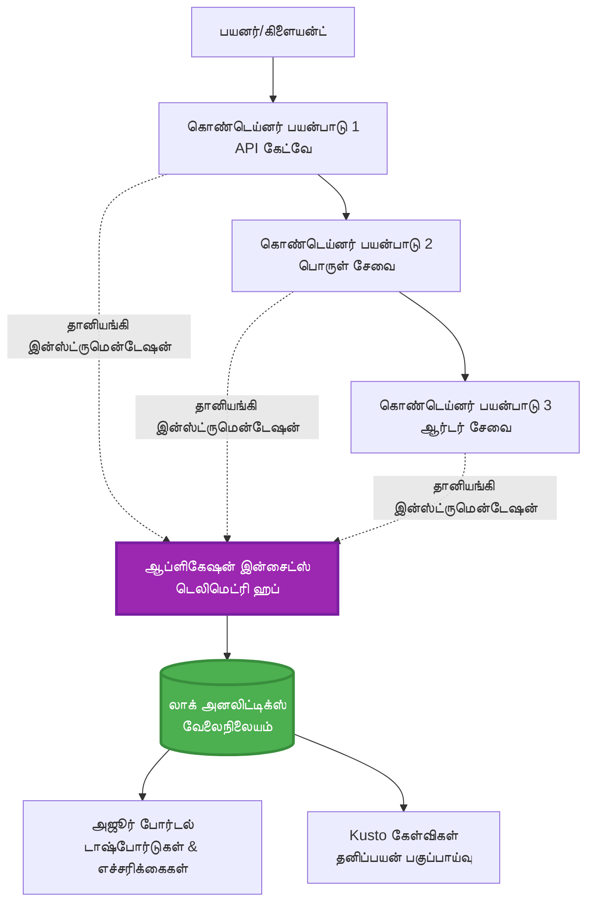
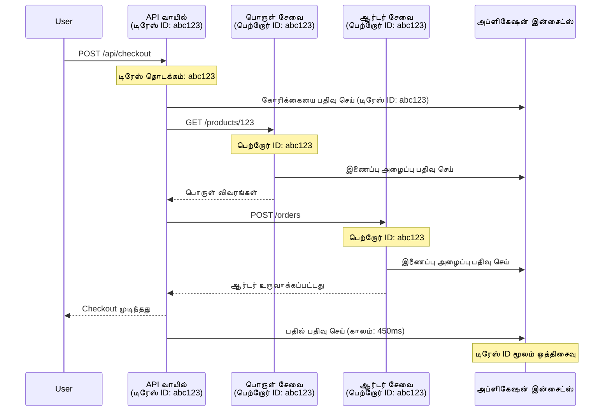

# Application Insights Integration with AZD

⏱️ **கணிக்கப்பட்ட நேரம்**: 40-50 நிமிடங்கள் | 💰 **செலவு தாக்கம்**: ~$5-15/மாதம் | ⭐ **கஷ்ட மட்டம்**: மத்தியமாக

**📚 கற்றல் பாதை:**
- ← Previous: [Preflight Checks](preflight-checks.md) - முன்-பணிவிதான சரிபார்ப்புகள்
- 🎯 **நீங்கள் இங்கே இருக்கிறீர்கள்**: Application Insights ஒருங்கிணைப்பு (மானிட்டரிங், டெலிமெடிரி, பிழைதிருத்தம்)
- → Next: [Deployment Guide](../chapter-04-infrastructure/deployment-guide.md) - Azure இற்கு வடிவமைக்கவும்
- 🏠 [Course Home](../../README.md)

---

## நீங்கள் என்ன கற்கப் போகிறீர்கள்

இந்த பாடத்தை முடித்தவுடன், நீங்கள்:
- AZD திட்டங்களில் **Application Insights** ஐ தானாகஒருங்கிணைக்கலாம்
- மைக்ரோசேவைகளுக்காக **விபரிக்கப்பட்ட டிரேசிங்** ஐ அமைக்கலாம்
- **சிர/custom டெலிமெடிரி** (மெட்ரிக்ஸ், நிகழ்வுகள், சார்புகள்) செயல்படுத்தலாம்
- நேரடி கண்காணிப்பிற்கு **லைவ் மெட்ரிக்ஸ்** அமைக்கலாம்
- AZD உடன் வழங்கல்களுக்கு **அலெர்ட்கள் மற்றும் டாஷ்போர்டுகள்** உருவாக்கலாம்
- **டெலிமெடிரி கேள்விகளுடன்** உற்பத்தி பிரச்சனைகளை டீபக் செய்யலாம்
- **செலவுகள் மற்றும் சாம்பிளிங்** செயல்முறைகளை உத்திரவாதப்படுத்தலாம்
- **AI/LLM பயன்பாடுகள்** (டோக்கன்கள், தாமதம், செலவுகள்) கண்காணிக்கலாம்

## ஏன் AZD உடன் Application Insights முக்கியம்

### சவால்: உற்பத்தி கண்காணிப்பு

**Application Insights இல்லாமல்:**
```
❌ No visibility into production behavior
❌ Manual log aggregation across services
❌ Reactive debugging (wait for customer complaints)
❌ No performance metrics
❌ Cannot trace requests across services
❌ Unknown failure rates and bottlenecks
```

**Application Insights + AZD உடன்:**
```
✅ Automatic telemetry collection
✅ Centralized logs from all services
✅ Proactive issue detection
✅ End-to-end request tracing
✅ Performance metrics and insights
✅ Real-time dashboards
✅ AZD provisions everything automatically
```

**உவமை**: Application Insights என்பது உங்கள் செயலிக்கு ஒரு "பிளாக் பாக்ஸ்" விமான பதிவாளரும் + காக்பிட் குழப்பக் கணிப்பியும் போன்றது. நீங்கள் நேரடி நிகழ்வுகளை அனைத்தையும் காணலாம் மற்றும் எந்த சம்பவத்தையும் மீண்டும் ஓட்டலாம்.

---

## கட்டமைப்பு மேற்பார்வை

### AZD கட்டமைப்பில் Application Insights


### தானாக கண்காணிக்கப்படுவது

| Telemetry Type | What It Captures | Use Case |
|----------------|------------------|----------|
| **Requests** | HTTP எதிர்வினைகள், நிலை குறியீடுகள், காலம் | API செயல்திறன் கண்காணிப்பு |
| **Dependencies** | வெளிப்புற அழைப்புகள் (DB, APIs, storage) | வித்தியாசங்களை அடையாளம் காணல் |
| **Exceptions** | கையாளப்படாத பிழைகள் மற்றும் ஸ்டாக் ட்ரேசுகள் | தோல்விகளின் பிழைத்திருக்கை |
| **Custom Events** | வணிக நிகழ்வுகள் (signup, purchase) | பகுப்பாய்வு மற்றும் ஃபனல்கள் |
| **Metrics** | செயல்திறன் கவுன்டர்கள், தனிப்பயன் மெட்ரிக்ஸ் | கொள்ளளவு திட்டமிடல் |
| **Traces** | தீவிரத்துடன் லாக் செய்திகள் | பிழைத்தீர்வு மற்றும் ஒடிடிங் |
| **Availability** | நேரம் அல்லது பதில் நேர சோதனைகள் | SLA கண்காணிப்பு |

---

## தேவைகள்

### தேவையான கருவிகள்

```bash
# Azure Developer CLI ஐ சரிபார்க்கவும்
azd version
# ✅ எதிர்பார்ப்பு: azd பதிப்பு 1.0.0 அல்லது அதற்கு மேல்

# Azure CLI ஐ சரிபார்க்கவும்
az --version
# ✅ எதிர்பார்ப்பு: azure-cli பதிப்பு 2.50.0 அல்லது அதற்கு மேல்
```

### Azure தேவைகள்

- செயலில் இருக்கும் Azure சந்தா
- உருவாக்க அனுமதிகள்:
  - Application Insights வளங்கள்
  - Log Analytics பணிப்不கங்கள்
  - Container Apps
  - Resource groups

### முன்னுரிமை அறிவு

நீங்கள் இவற்றை முடித்திருக்க வேண்டும்:
- [AZD Basics](../chapter-01-foundation/azd-basics.md) - AZD மொத்தக் கருத்துக்கள்
- [Configuration](../chapter-03-configuration/configuration.md) - சூழ்நிலைய் அமைப்பு
- [First Project](../chapter-01-foundation/first-project.md) - அடிப்படை வழங்கல்

---

## பாடம் 1: AZD உடன் தானியங்கி Application Insights

### AZD எப்படி Application Insights ஐ ஏற்படுத்துகிறது

AZD நீங்கள் deploy செய்தால் தானாக Application Insights ஐ உருவாக்கி அமைக்கிறது. அது எப்படி செயல்படுகிறது என்று பார்ப்போம்.

### திட்ட அமைப்பு

```
monitored-app/
├── azure.yaml                     # AZD configuration
├── infra/
│   ├── main.bicep                # Main infrastructure
│   ├── core/
│   │   └── monitoring.bicep      # Application Insights + Log Analytics
│   └── app/
│       └── api.bicep             # Container App with monitoring
└── src/
    ├── app.py                    # Application with telemetry
    ├── requirements.txt
    └── Dockerfile
```

---

### படி 1: AZD ஐ அமைக்கவும் (azure.yaml)

**கோப்பு: `azure.yaml`**

```yaml
name: monitored-app
metadata:
  template: monitored-app@1.0.0

services:
  api:
    project: ./src
    language: python
    host: containerapp

# AZD automatically provisions monitoring!
```

**அடையாளம்!** AZD அடிப்படை மானிட்டரிங்கிற்கு இயல்பாக Application Insights ஐ உருவாக்கும். கூடுதல் கட்டமைப்பு தேவையில்லை.

---

### படி 2: கண்காணிப்பு உள்கட்டமைப்பு (Bicep)

**கோப்பு: `infra/core/monitoring.bicep`**

```bicep
param logAnalyticsName string
param applicationInsightsName string
param location string = resourceGroup().location
param tags object = {}

// Log Analytics Workspace (required for Application Insights)
resource logAnalytics 'Microsoft.OperationalInsights/workspaces@2022-10-01' = {
  name: logAnalyticsName
  location: location
  tags: tags
  properties: {
    sku: {
      name: 'PerGB2018'  // Pay-as-you-go pricing
    }
    retentionInDays: 30  // Keep logs for 30 days
    features: {
      enableLogAccessUsingOnlyResourcePermissions: true
    }
  }
}

// Application Insights
resource applicationInsights 'Microsoft.Insights/components@2020-02-02' = {
  name: applicationInsightsName
  location: location
  tags: tags
  kind: 'web'
  properties: {
    Application_Type: 'web'
    WorkspaceResourceId: logAnalytics.id
    IngestionMode: 'LogAnalytics'
    publicNetworkAccessForIngestion: 'Enabled'
    publicNetworkAccessForQuery: 'Enabled'
  }
}

// Outputs for Container Apps
output logAnalyticsWorkspaceId string = logAnalytics.id
output logAnalyticsWorkspaceName string = logAnalytics.name
output applicationInsightsConnectionString string = applicationInsights.properties.ConnectionString
output applicationInsightsInstrumentationKey string = applicationInsights.properties.InstrumentationKey
output applicationInsightsName string = applicationInsights.name
```

---

### படி 3: Container App ஐ Application Insights உடன் இணைக்கவும்

**கோப்பு: `infra/app/api.bicep`**

```bicep
param name string
param location string
param tags object = {}
param containerAppsEnvironmentName string
param applicationInsightsConnectionString string

resource containerApp 'Microsoft.App/containerApps@2023-05-01' = {
  name: name
  location: location
  tags: tags
  properties: {
    configuration: {
      ingress: {
        external: true
        targetPort: 8000
      }
      secrets: [
        {
          name: 'appinsights-connection-string'
          value: applicationInsightsConnectionString
        }
      ]
    }
    template: {
      containers: [
        {
          name: 'api'
          image: 'myregistry.azurecr.io/api:latest'
          resources: {
            cpu: json('0.5')
            memory: '1Gi'
          }
          env: [
            {
              name: 'APPLICATIONINSIGHTS_CONNECTION_STRING'
              secretRef: 'appinsights-connection-string'
            }
            {
              name: 'APPLICATIONINSIGHTS_ENABLED'
              value: 'true'
            }
          ]
        }
      ]
    }
  }
}

output uri string = 'https://${containerApp.properties.configuration.ingress.fqdn}'
```

---

### படி 4: டெலிமெட்ரி உடன் செயலி கோடு

**கோப்பு: `src/app.py`**

```python
from flask import Flask, request, jsonify
from opencensus.ext.azure.log_exporter import AzureLogHandler
from opencensus.ext.azure.trace_exporter import AzureExporter
from opencensus.ext.flask.flask_middleware import FlaskMiddleware
from opencensus.trace.samplers import ProbabilitySampler
import logging
import os

app = Flask(__name__)

# Application Insights இணைப்பு ஸ்ட்ரிங்கை பெறவும்
connection_string = os.environ.get('APPLICATIONINSIGHTS_CONNECTION_STRING')

if connection_string:
    # பகிரப்பட்ட டிரேசியை அமைக்கவும்
    middleware = FlaskMiddleware(
        app,
        exporter=AzureExporter(connection_string=connection_string),
        sampler=ProbabilitySampler(rate=1.0)  # மேம்பாட்டிற்கு 100% மாதிரீகம்
    )
    
    # பதிவுகளை அமைக்கவும்
    logger = logging.getLogger(__name__)
    logger.addHandler(AzureLogHandler(connection_string=connection_string))
    logger.setLevel(logging.INFO)
    
    print("✅ Application Insights enabled")
else:
    logger = logging.getLogger(__name__)
    logger.setLevel(logging.INFO)
    print("⚠️ Application Insights not configured")

@app.route('/health')
def health():
    logger.info('Health check endpoint called')
    return jsonify({'status': 'healthy', 'monitoring': 'enabled'})

@app.route('/api/products')
def get_products():
    logger.info('Fetching products')
    
    # தரவுத்தள அழைப்பை சிமுலேட் செய் (தானாகவே சார்பாக கண்காணிக்கப்படும்)
    products = [
        {'id': 1, 'name': 'Laptop', 'price': 999.99},
        {'id': 2, 'name': 'Mouse', 'price': 29.99},
        {'id': 3, 'name': 'Keyboard', 'price': 79.99}
    ]
    
    logger.info(f'Returned {len(products)} products')
    return jsonify(products)

@app.route('/api/error-test')
def error_test():
    """Test error tracking"""
    logger.error('Testing error tracking')
    try:
        raise ValueError('This is a test exception')
    except Exception as e:
        logger.exception('Exception occurred in error-test endpoint')
        return jsonify({'error': str(e)}), 500

@app.route('/api/slow')
def slow_endpoint():
    """Test performance tracking"""
    import time
    logger.info('Slow endpoint called')
    time.sleep(3)  # மெதுவான செயல்பாட்டை சிமுலேட் செய்
    logger.warning('Endpoint took 3 seconds to respond')
    return jsonify({'message': 'Slow operation completed'})

if __name__ == '__main__':
    app.run(host='0.0.0.0', port=8000)
```

**கோப்பு: `src/requirements.txt`**

```txt
Flask==3.0.0
opencensus-ext-azure==1.1.13
opencensus-ext-flask==0.8.1
gunicorn==21.2.0
```

---

### படி 5: deploy செய்து சரிபார்க்கவும்

```bash
# AZD ஐ ஆரம்பிக்கவும்
azd init

# பணியிடவும் (Application Insights ஐ தானாக ஏற்பாடு செய்கிறது)
azd up

# செயலியின் URL ஐப் பெறவும்
APP_URL=$(azd env get-values | grep API_URL | cut -d '=' -f2 | tr -d '"')

# டெலிமெட்ரி உருவாக்கவும்
curl $APP_URL/health
curl $APP_URL/api/products
curl $APP_URL/api/error-test
curl $APP_URL/api/slow
```

**✅ எதிர்பார்க்கப்படும் வெளியீடு:**
```json
{
  "status": "healthy",
  "monitoring": "enabled"
}
```

---

### படி 6: Azure போர்டலில் டெலிமெட்ரியை காண்க

```bash
# Application Insights விவரங்களைப் பெறவும்
azd env get-values | grep APPLICATIONINSIGHTS

# Azure போர்டலில் திறவும்
az monitor app-insights component show \
  --app $(azd env get-values | grep APPLICATIONINSIGHTS_NAME | cut -d '=' -f2 | tr -d '"') \
  --resource-group $(azd env get-values | grep AZURE_RESOURCE_GROUP | cut -d '=' -f2 | tr -d '"') \
  --query "appId" -o tsv
```

**Azure போர்டல் → Application Insights → Transaction Search**க்கு செல்லவும்

நீங்கள் காண்பீர்கள்:
- ✅ HTTP கோரிக்கைகள் நிலை குறியீடுகளுடன்
- ✅ கோரிக்கை காலம் (`/api/slow`க்கு 3+ விநாடிகள்)
- ✅ `/api/error-test` மூலம் பெறப்பட்ட தவறுகளின் விபரங்கள்
- ✅ தனிப்பயன் லாக் செய்திகள்

---

## பாடம் 2: தனிப்பயன் டெலிமெட்ரி மற்றும் நிகழ்வுகள்

### வணிக நிகழ்வுகளை பதிவு செய்யவும்

வணிக-முக்கிய நிகழ்வுகளுக்கான தனிப்பயன் டெலிமெட்ரி சேர்ப்போம்.

**கோப்பு: `src/telemetry.py`**

```python
from opencensus.ext.azure import metrics_exporter
from opencensus.stats import aggregation as aggregation_module
from opencensus.stats import measure as measure_module
from opencensus.stats import stats as stats_module
from opencensus.stats import view as view_module
from opencensus.tags import tag_map as tag_map_module
from opencensus.ext.azure.log_exporter import AzureLogHandler
from opencensus.ext.azure.trace_exporter import AzureExporter
from opencensus.trace import tracer as tracer_module
import logging
import os

class TelemetryClient:
    """Custom telemetry client for Application Insights"""
    
    def __init__(self, connection_string=None):
        self.connection_string = connection_string or os.environ.get('APPLICATIONINSIGHTS_CONNECTION_STRING')
        
        if not self.connection_string:
            print("⚠️ Application Insights connection string not found")
            return
        
        # லாகரை அமைக்கவும்
        self.logger = logging.getLogger(__name__)
        self.logger.addHandler(AzureLogHandler(connection_string=self.connection_string))
        self.logger.setLevel(logging.INFO)
        
        # மெட்ரிக்ஸ் ஏற்றுமதி கருவியை அமைக்கவும்
        self.stats = stats_module.stats
        self.view_manager = self.stats.view_manager
        self.stats_recorder = self.stats.stats_recorder
        
        exporter = metrics_exporter.new_metrics_exporter(
            connection_string=self.connection_string
        )
        self.view_manager.register_exporter(exporter)
        
        # ட்ரேசரை அமைக்கவும்
        self.tracer = tracer_module.Tracer(
            exporter=AzureExporter(connection_string=self.connection_string)
        )
        
        print("✅ Custom telemetry client initialized")
    
    def track_event(self, event_name: str, properties: dict = None):
        """Track custom business event"""
        properties = properties or {}
        self.logger.info(
            f"CustomEvent: {event_name}",
            extra={
                'custom_dimensions': {
                    'event_name': event_name,
                    **properties
                }
            }
        )
    
    def track_metric(self, metric_name: str, value: float, properties: dict = None):
        """Track custom metric"""
        properties = properties or {}
        self.logger.info(
            f"CustomMetric: {metric_name} = {value}",
            extra={
                'custom_dimensions': {
                    'metric_name': metric_name,
                    'value': value,
                    **properties
                }
            }
        )
    
    def track_dependency(self, name: str, dependency_type: str, duration: float, success: bool):
        """Track external dependency call"""
        with self.tracer.span(name=name) as span:
            span.add_attribute('dependency.type', dependency_type)
            span.add_attribute('duration', duration)
            span.add_attribute('success', success)

# உலகளாவிய டெலிமெட்ரி கிளையன்ட்
telemetry = TelemetryClient()
```

### தனிப்பயன் நிகழ்வுகளுடன் செயலியை புதுப்பிக்கவும்

**கோப்பு: `src/app.py` (வளர்க்கப்பட்டது)**

```python
from flask import Flask, request, jsonify
from telemetry import telemetry
import time
import random

app = Flask(__name__)

@app.route('/api/purchase', methods=['POST'])
def purchase():
    """Track purchase event with custom telemetry"""
    data = request.json
    product_id = data.get('product_id')
    quantity = data.get('quantity', 1)
    price = data.get('price', 0)
    
    # வணிக நிகழ்வை கண்காணிக்க
    telemetry.track_event('Purchase', {
        'product_id': product_id,
        'quantity': quantity,
        'total_amount': price * quantity,
        'user_id': request.headers.get('X-User-Id', 'anonymous')
    })
    
    # வருவாய் அளவுகூறை கண்காணிக்க
    telemetry.track_metric('Revenue', price * quantity, {
        'product_id': product_id,
        'currency': 'USD'
    })
    
    return jsonify({
        'order_id': f'ORD-{random.randint(1000, 9999)}',
        'status': 'confirmed',
        'total': price * quantity
    })

@app.route('/api/search')
def search():
    """Track search queries"""
    query = request.args.get('q', '')
    
    start_time = time.time()
    
    # தேடலை நகலாக்கு (இது உண்மையில் ஒரு தரவுத்தளக் கேள்வி இருக்கும்)
    results = [{'id': 1, 'name': f'Result for {query}'}]
    
    duration = (time.time() - start_time) * 1000  # மில்லிசெகன்களுக்கு மாற்று
    
    # தேடல் நிகழ்வை கண்காணிக்க
    telemetry.track_event('Search', {
        'query': query,
        'results_count': len(results),
        'duration_ms': duration
    })
    
    # தேடல் செயல்திறன் அளவுகூறை கண்காணிக்க
    telemetry.track_metric('SearchDuration', duration, {
        'query_length': len(query)
    })
    
    return jsonify({'results': results, 'count': len(results)})

@app.route('/api/external-call')
def external_call():
    """Track external API dependency"""
    import requests
    
    start_time = time.time()
    success = True
    
    try:
        # வெளிப்புற API அழைப்பை நகலாக்கு
        response = requests.get('https://api.example.com/data', timeout=5)
        result = response.json()
    except Exception as e:
        success = False
        result = {'error': str(e)}
    
    duration = (time.time() - start_time) * 1000
    
    # சார்பை கண்காணிக்க
    telemetry.track_dependency(
        name='ExternalAPI',
        dependency_type='HTTP',
        duration=duration,
        success=success
    )
    
    return jsonify(result)

if __name__ == '__main__':
    app.run(host='0.0.0.0', port=8000)
```

### தனிப்பயன் டெலிமெட்ரியை சோதிக்கவும்

```bash
# கொள்முதல் நிகழ்வை கண்காணிக்க
curl -X POST $APP_URL/api/purchase \
  -H "Content-Type: application/json" \
  -H "X-User-Id: user123" \
  -d '{"product_id": 1, "quantity": 2, "price": 29.99}'

# தேடல் நிகழ்வை கண்காணிக்க
curl "$APP_URL/api/search?q=laptop"

# வெளிப்புற சார்பை கண்காணிக்க
curl $APP_URL/api/external-call
```

**Azure போர்டலில் பார்க்க:**

Application Insights → Logs செல்லவும், பிறகு இயக்கு:

```kusto
// View purchase events
traces
| where customDimensions.event_name == "Purchase"
| project 
    timestamp,
    product_id = tostring(customDimensions.product_id),
    total_amount = todouble(customDimensions.total_amount),
    user_id = tostring(customDimensions.user_id)
| order by timestamp desc

// View revenue metrics
traces
| where customDimensions.metric_name == "Revenue"
| summarize TotalRevenue = sum(todouble(customDimensions.value)) by bin(timestamp, 1h)
| render timechart

// View search performance
traces
| where customDimensions.event_name == "Search"
| summarize 
    AvgDuration = avg(todouble(customDimensions.duration_ms)),
    SearchCount = count()
  by bin(timestamp, 5m)
| render timechart
```

---

## பாடம் 3: மைக்ரோசேவைகளுக்கான விநியோக உச்சிகள் (Distributed Tracing)

### சேவைகளுக்கிடையே டிரேசிங் இயக்கவும்

மைக்ரோசேவைகளுக்காக, Application Insights தானாகவே சேவைகளுக்கு இடையே கோரிக்கைகளை இணைக்கிறது.

**கோப்பு: `infra/main.bicep`**

```bicep
targetScope = 'subscription'

param environmentName string
param location string = 'eastus'

var tags = { 'azd-env-name': environmentName }

resource rg 'Microsoft.Resources/resourceGroups@2021-04-01' = {
  name: 'rg-${environmentName}'
  location: location
  tags: tags
}

// Monitoring (shared by all services)
module monitoring './core/monitoring.bicep' = {
  name: 'monitoring'
  scope: rg
  params: {
    logAnalyticsName: 'log-${environmentName}'
    applicationInsightsName: 'appi-${environmentName}'
    location: location
    tags: tags
  }
}

// API Gateway
module apiGateway './app/api-gateway.bicep' = {
  name: 'api-gateway'
  scope: rg
  params: {
    name: 'ca-gateway-${environmentName}'
    location: location
    tags: union(tags, { 'azd-service-name': 'gateway' })
    applicationInsightsConnectionString: monitoring.outputs.applicationInsightsConnectionString
  }
}

// Product Service
module productService './app/product-service.bicep' = {
  name: 'product-service'
  scope: rg
  params: {
    name: 'ca-products-${environmentName}'
    location: location
    tags: union(tags, { 'azd-service-name': 'products' })
    applicationInsightsConnectionString: monitoring.outputs.applicationInsightsConnectionString
  }
}

// Order Service
module orderService './app/order-service.bicep' = {
  name: 'order-service'
  scope: rg
  params: {
    name: 'ca-orders-${environmentName}'
    location: location
    tags: union(tags, { 'azd-service-name': 'orders' })
    applicationInsightsConnectionString: monitoring.outputs.applicationInsightsConnectionString
  }
}

output APPLICATIONINSIGHTS_CONNECTION_STRING string = monitoring.outputs.applicationInsightsConnectionString
output GATEWAY_URL string = apiGateway.outputs.uri
```

### தொடங்கிலிருந்து முடிவு வரை ட்ரான்சாக்ஷனை பார்க்கவும்


**முழு-முழுவதும் டிரேசை கேள்வி செய்யவும்:**

```kusto
// Find complete request flow
let traceId = "abc123...";  // Get from response header
dependencies
| union requests
| where operation_Id == traceId
| project 
    timestamp,
    type = itemType,
    name,
    duration,
    success,
    cloud_RoleName
| order by timestamp asc
```

---

## பாடம் 4: லைவ் மெட்ரிக்ஸ் மற்றும் நேரடி கண்காணிப்பு

### லைவ் மெட்ரிக்ஸ் ஸ்ட்ரீமை இயக்கவும்

லைவ் மெட்ரிக்ஸ் 1 விநாடிக்குக் குறைவான தாமதத்துடன் நேரடி டெலிமெட்ரியை வழங்குகிறது.

**லைவ் மெட்ரிக்ஸை அணுக:**

```bash
# Application Insights வளத்தைப் பெற
APPI_NAME=$(azd env get-values | grep APPLICATIONINSIGHTS_NAME | cut -d '=' -f2 | tr -d '"')

# வளக் குழுவைப் பெற
RG_NAME=$(azd env get-values | grep AZURE_RESOURCE_GROUP | cut -d '=' -f2 | tr -d '"')

echo "Navigate to: Azure Portal → Resource Groups → $RG_NAME → $APPI_NAME → Live Metrics"
```

**நேரடியாக நீங்கள் காணும் விஷயங்கள்:**
- ✅ வரும் கோரிக்கை வீதம் (requests/sec)
- ✅ வெளியே செல்லும் dependency அழைப்புகள்
- ✅ தவறு எண்ணிக்கை
- ✅ CPU மற்றும் மெமரிஃப் பயன்பாடு
- ✅ செயலில் உள்ள சர்வர் எண்ணிக்கை
- ✅ மாதிரி டெலிமெட்ரி

### சோதனைக்கு லோட் உருவாக்கவும்

```bash
# நேரடி அளவிகளை காண சுமையை உருவாக்கவும்
for i in {1..100}; do
  curl $APP_URL/api/products &
  curl $APP_URL/api/search?q=test$i &
done

# Azure போர்டலில் நேரடி அளவுகளைப் பார்க்கவும்
# நீங்கள் கோரிக்கை விகிதம் திடீரென உயர்வைக் காண்பீர்கள்
```

---

## பயிற்சி பயிற்றுக்கள்

### பயிற்சி 1: அலெர்ட்களை அமைக்கலாம் ⭐⭐ (மிதமான)

**கோல்**: உயர்ந்த பிழை விகிதங்கள் மற்றும் மெதுவான பதில்களுக்கு அலெர்ட்களை உருவாக்கவும்.

**படிகள்:**

1. **பிழை விகிதத்திற்கான அலெர்டை உருவாக்கவும்:**

```bash
# Application Insights வளத்தின் ID ஐப் பெற
APPI_ID=$(az monitor app-insights component show \
  --app $APPI_NAME \
  --resource-group $RG_NAME \
  --query "id" -o tsv)

# தோல்வியடைந்த கோரிக்கைகளுக்கான மெட்ரிக் எச்சரிக்கையை உருவாக்கு
az monitor metrics alert create \
  --name "High-Error-Rate" \
  --resource-group $RG_NAME \
  --scopes $APPI_ID \
  --condition "count requests/failed > 10" \
  --window-size 5m \
  --evaluation-frequency 1m \
  --description "Alert when error rate exceeds 10 per 5 minutes"
```

2. **மெதுவான பதில்களுக்கு அலெர்டை உருவாக்கவும்:**

```bash
az monitor metrics alert create \
  --name "Slow-Responses" \
  --resource-group $RG_NAME \
  --scopes $APPI_ID \
  --condition "avg requests/duration > 3000" \
  --window-size 5m \
  --evaluation-frequency 1m \
  --description "Alert when average response time exceeds 3 seconds"
```

3. **Bicep மூலம் அலெர்ட் உருவாக்கு (AZD க்கு விருப்பமானது):**

**கோப்பு: `infra/core/alerts.bicep`**

```bicep
param applicationInsightsId string
param actionGroupId string = ''
param location string = resourceGroup().location

// High error rate alert
resource errorRateAlert 'Microsoft.Insights/metricAlerts@2018-03-01' = {
  name: 'high-error-rate'
  location: 'global'
  properties: {
    description: 'Alert when error rate exceeds threshold'
    severity: 2
    enabled: true
    scopes: [
      applicationInsightsId
    ]
    evaluationFrequency: 'PT1M'
    windowSize: 'PT5M'
    criteria: {
      'odata.type': 'Microsoft.Azure.Monitor.SingleResourceMultipleMetricCriteria'
      allOf: [
        {
          name: 'Error rate'
          metricName: 'requests/failed'
          operator: 'GreaterThan'
          threshold: 10
          timeAggregation: 'Count'
        }
      ]
    }
    actions: actionGroupId != '' ? [
      {
        actionGroupId: actionGroupId
      }
    ] : []
  }
}

// Slow response alert
resource slowResponseAlert 'Microsoft.Insights/metricAlerts@2018-03-01' = {
  name: 'slow-responses'
  location: 'global'
  properties: {
    description: 'Alert when response time is too high'
    severity: 3
    enabled: true
    scopes: [
      applicationInsightsId
    ]
    evaluationFrequency: 'PT1M'
    windowSize: 'PT5M'
    criteria: {
      'odata.type': 'Microsoft.Azure.Monitor.SingleResourceMultipleMetricCriteria'
      allOf: [
        {
          name: 'Response duration'
          metricName: 'requests/duration'
          operator: 'GreaterThan'
          threshold: 3000
          timeAggregation: 'Average'
        }
      ]
    }
  }
}

output errorAlertId string = errorRateAlert.id
output slowResponseAlertId string = slowResponseAlert.id
```

4. **அலெர்ட்களை சோதிக்கவும்:**

```bash
# பிழைகள் உருவாக்கு
for i in {1..20}; do
  curl $APP_URL/api/error-test
done

# மெதுவான பதில்களை உருவாக்கு
for i in {1..10}; do
  curl $APP_URL/api/slow
done

# அலெர்ட் நிலையை சரிபார்க்கவும் (5-10 நிமிடங்கள் காத்திருங்கள்)
az monitor metrics alert list \
  --resource-group $RG_NAME \
  --query "[].{Name:name, Enabled:enabled, State:properties.enabled}" \
  --output table
```

**✅ வெற்றிச் சோதனை அளவுகோல்:**
- ✅ அலெர்ட்கள் வெற்றிகரமாக உருவாக்கப்பட்டன
- ✅ எல்லை மீறப்பட்டால் அலெர்ட்கள் செயல்படும்
- ✅ அலெர்ட் வரலாற்றை Azure போர்டலில் பார்க்கலாம்
- ✅ AZD வழங்கலுடன் ஒருங்கிணைக்கப்பட்டுள்ளது

**நேரம்**: 20-25 நிமிடங்கள்

---

### பயிற்சி 2: தனிப்பயன் டாஷ்போர்டு உருவாக்கவும் ⭐⭐ (மிதமான)

**கோல்**: முக்கிய செயலியின் மெட்ரிக்ஸ்களைக் காட்டும் டாஷ்போர்டை கட்டவும்.

**படிகள்:**

1. **Azure போர்டல் மூலம் டாஷ்போர்டு உருவாக்கவும்:**

Azure போர்டல் → Dashboards → New Dashboard வரை செல்லவும்

2. **முக்கிய மெட்ரிக்ஸ் க்கான டைல்களை சேர்க்கவும்:**

- கோரிக்கை எண்ணிக்கை (கடைசி 24 மணி)
- சராசரி பதில் நேரம்
- பிழை விகிதம்
- மேல்மையான 5 மெதுவான செயலிகள்
- பயனாளர்களின் பிராந்திய விநியோகம்

3. **Bicep மூலம் டாஷ்போர்டு உருவாக்கவும்:**

**கோப்பு: `infra/core/dashboard.bicep`**

```bicep
param dashboardName string
param applicationInsightsId string
param location string = resourceGroup().location

resource dashboard 'Microsoft.Portal/dashboards@2020-09-01-preview' = {
  name: dashboardName
  location: location
  properties: {
    lenses: [
      {
        order: 0
        parts: [
          // Request count
          {
            position: { x: 0, y: 0, rowSpan: 4, colSpan: 6 }
            metadata: {
              type: 'Extension/Microsoft_OperationsManagementSuite_Workspace/PartType/LogsDashboardPart'
              inputs: [
                {
                  name: 'resourceId'
                  value: applicationInsightsId
                }
                {
                  name: 'query'
                  value: '''
                    requests
                    | summarize RequestCount = count() by bin(timestamp, 1h)
                    | render timechart
                  '''
                }
              ]
            }
          }
          // Error rate
          {
            position: { x: 6, y: 0, rowSpan: 4, colSpan: 6 }
            metadata: {
              type: 'Extension/Microsoft_OperationsManagementSuite_Workspace/PartType/LogsDashboardPart'
              inputs: [
                {
                  name: 'resourceId'
                  value: applicationInsightsId
                }
                {
                  name: 'query'
                  value: '''
                    requests
                    | summarize 
                        Total = count(),
                        Failed = countif(success == false)
                    | extend ErrorRate = (Failed * 100.0) / Total
                    | project ErrorRate
                  '''
                }
              ]
            }
          }
        ]
      }
    ]
  }
}

output dashboardId string = dashboard.id
```

4. **டாஷ்போர்டை deploy செய்யவும்:**

```bash
# main.bicep கோப்பில் சேர்க்கவும்
module dashboard './core/dashboard.bicep' = {
  name: 'dashboard'
  scope: rg
  params: {
    dashboardName: 'dashboard-${environmentName}'
    applicationInsightsId: monitoring.outputs.applicationInsightsId
    location: location
  }
}

# பயன்படுத்தவும்
azd up
```

**✅ வெற்றிச் சோதனை அளவுகோல்:**
- ✅ டாஷ்போர்டு முக்கிய மெட்ரிக்ஸ்களை காண்பிக்கிறது
- ✅ Azure போர்டல் ஹோமில் பின் செய்யலாம்
- ✅ நேரடியாக புதுப்பிக்கிறது
- ✅ AZD மூலம் deploy செய்யக்கூடியது

**நேரம்**: 25-30 நிமிடங்கள்

---

### பயிற்சி 3: AI/LLM பயன்பாட்டை கண்காணிக்கவும் ⭐⭐⭐ (மேம்பட்ட)

**கோல்**: Azure OpenAI பயன்பாட்டின் பயன்பாடு (டோக்கன்கள், செலவுகள், தாமதங்கள்) கண்காணிக்கவும்.

**படிகள்:**

1. **AI கண்காணிப்பு ரூப்பரை உருவாக்கவும்:**

**கோப்பு: `src/ai_telemetry.py`**

```python
from telemetry import telemetry
from openai import AzureOpenAI
import time

class MonitoredAzureOpenAI:
    """Azure OpenAI client with automatic telemetry"""
    
    def __init__(self, api_key, endpoint, api_version="2024-02-01"):
        self.client = AzureOpenAI(
            api_key=api_key,
            api_version=api_version,
            azure_endpoint=endpoint
        )
    
    def chat_completion(self, model: str, messages: list, **kwargs):
        """Track chat completion with telemetry"""
        start_time = time.time()
        
        try:
            # Azure OpenAI ஐ அழைக்கவும்
            response = self.client.chat.completions.create(
                model=model,
                messages=messages,
                **kwargs
            )
            
            duration = (time.time() - start_time) * 1000  # மில்லி வினாடிகள்
            
            # பயன்பாடு தகவலை எடுக்கவும்
            usage = response.usage
            prompt_tokens = usage.prompt_tokens
            completion_tokens = usage.completion_tokens
            total_tokens = usage.total_tokens
            
            # செலவை கணக்கிடவும் (GPT-4 விலை)
            prompt_cost = (prompt_tokens / 1000) * 0.03  # ஒவ்வொரு 1K டோக்கனுக்கு $0.03
            completion_cost = (completion_tokens / 1000) * 0.06  # ஒவ்வொரு 1K டோக்கனுக்கு $0.06
            total_cost = prompt_cost + completion_cost
            
            # தனிப்பயன் நிகழ்வை கண்காணிக்கவும்
            telemetry.track_event('OpenAI_Request', {
                'model': model,
                'prompt_tokens': prompt_tokens,
                'completion_tokens': completion_tokens,
                'total_tokens': total_tokens,
                'duration_ms': duration,
                'cost_usd': total_cost,
                'success': True
            })
            
            # அளவுகோல்களை கண்காணிக்கவும்
            telemetry.track_metric('OpenAI_Tokens', total_tokens, {
                'model': model,
                'type': 'total'
            })
            
            telemetry.track_metric('OpenAI_Cost', total_cost, {
                'model': model,
                'currency': 'USD'
            })
            
            telemetry.track_metric('OpenAI_Duration', duration, {
                'model': model
            })
            
            return response
            
        except Exception as e:
            duration = (time.time() - start_time) * 1000
            
            telemetry.track_event('OpenAI_Request', {
                'model': model,
                'duration_ms': duration,
                'success': False,
                'error': str(e)
            })
            
            raise
```

2. **கண்காணிக்கப்பட்ட கிளையண்டை பயன்படுத்தவும்:**

```python
from flask import Flask, request, jsonify
from ai_telemetry import MonitoredAzureOpenAI
import os

app = Flask(__name__)

# கண்காணிக்கப்படும் OpenAI கிளையன்டை ஆரம்பிக்கவும்
openai_client = MonitoredAzureOpenAI(
    api_key=os.environ['AZURE_OPENAI_API_KEY'],
    endpoint=os.environ['AZURE_OPENAI_ENDPOINT']
)

@app.route('/api/chat', methods=['POST'])
def chat():
    data = request.json
    user_message = data.get('message')
    
    # தானியங்கி கண்காணிப்புடன் அழைக்கவும்
    response = openai_client.chat_completion(
        model='gpt-4',
        messages=[
            {'role': 'user', 'content': user_message}
        ]
    )
    
    return jsonify({
        'response': response.choices[0].message.content,
        'tokens': response.usage.total_tokens
    })
```

3. **AI மெட்ரிக்ஸ்களை கேள்வி செய்யவும்:**

```kusto
// Total AI spend over time
traces
| where customDimensions.event_name == "OpenAI_Request"
| where customDimensions.success == "True"
| summarize TotalCost = sum(todouble(customDimensions.cost_usd)) by bin(timestamp, 1h)
| render timechart

// Token usage by model
traces
| where customDimensions.event_name == "OpenAI_Request"
| summarize 
    TotalTokens = sum(toint(customDimensions.total_tokens)),
    RequestCount = count()
  by Model = tostring(customDimensions.model)

// Average latency
traces
| where customDimensions.event_name == "OpenAI_Request"
| summarize AvgDuration = avg(todouble(customDimensions.duration_ms))
| project AvgDurationSeconds = AvgDuration / 1000

// Cost per request
traces
| where customDimensions.event_name == "OpenAI_Request"
| extend Cost = todouble(customDimensions.cost_usd)
| summarize 
    TotalCost = sum(Cost),
    RequestCount = count(),
    AvgCostPerRequest = avg(Cost)
```

**✅ வெற்றிச் சோதனை அளவுகோல்:**
- ✅ ஒவ்வொரு OpenAI அழைப்பும் தானாக கண்காணிக்கப்படுகிறது
- ✅ டோக்கன் பயன்பாடு மற்றும் செலவுகள் தெரியவைக்கப்படுகின்றன
- ✅ தாமதம் கண்காணிக்கப்படுகிறது
- ✅ பட்ஜெட் அலெர்ட்கள் அமைக்கலாம்

**நேரம்**: 35-45 நிமிடங்கள்

---

## செலவு ஒப்டிமைசேஷன்

### சாம்பிளிங் stratெஜிஸ்

டெலிமெட்ரி சாம்பிளிங் மூலம் செலவுகளை கட்டுப்படுத்து:

```python
from opencensus.trace.samplers import ProbabilitySampler

# வளர்ச்சி: 100% மாதிரி எடுப்பு
sampler = ProbabilitySampler(rate=1.0)

# உற்பத்தி: 10% மாதிரி எடுப்பு (செலவுகளை 90% குறைக்கும்)
sampler = ProbabilitySampler(rate=0.1)

# அனுகூல மாதிரி எடுப்பு (தானாகவே சரிசெய்யப்படுகிறது)
from opencensus.trace.samplers import AdaptiveSampler
sampler = AdaptiveSampler()
```

**Bicep இல்:**

```bicep
resource applicationInsights 'Microsoft.Insights/components@2020-02-02' = {
  name: applicationInsightsName
  properties: {
    SamplingPercentage: 10  // 10% sampling
  }
}
```

### தரவு வைத்திருப்பு

```bicep
resource logAnalytics 'Microsoft.OperationalInsights/workspaces@2022-10-01' = {
  name: logAnalyticsName
  properties: {
    retentionInDays: 30  // Minimum (cheapest)
    // Options: 30, 31, 60, 90, 120, 180, 270, 365, 550, 730
  }
}
```

### மாதாந்திர செலவு மதிப்பீடுகள்

| Data Volume | Retention | Monthly Cost |
|-------------|-----------|--------------|
| 1 GB/month | 30 days | ~$2-5 |
| 5 GB/month | 30 days | ~$10-15 |
| 10 GB/month | 90 days | ~$25-40 |
| 50 GB/month | 90 days | ~$100-150 |

**இலவச தளம்**: 5 GB/month உள்kழியப்பட்டவை

---

## அறிவு சோதனை

### 1. அடிப்படை ஒருங்கிணைப்பு ✓

உங்கள் புரிதலை சோதிக்கவும்:

- [ ] **Q1**: AZD எப்படி Application Insights ஐ ஏற்படுத்துகிறது?
  - **A**: `infra/core/monitoring.bicep` இல் Bicep வார்ப்பிரிண் மூலம் தானாக

- [ ] **Q2**: எந்த சூழல் மாறி Application Insights ஐ இயக்கு?
  - **A**: `APPLICATIONINSIGHTS_CONNECTION_STRING`

- [ ] **Q3**: மூன்று பிரதான டெலிமெட்ரி வகைகள் என்ன?
  - **A**: Requests (HTTP கூற்றுகள்), Dependencies (வெளி கூற்றுகள்), Exceptions (பிழைகள்)

**அச்சு-செயல்முறை சரிபார்ப்பு:**
```bash
# Application Insights அமைக்கப்பட்டுள்ளதா என்பதைச் சரிபார்க்கவும்
azd env get-values | grep APPLICATIONINSIGHTS

# டெலிமெட்ரி தரவுகள் செல்கின்றதா என்பதைச் சரிபார்க்கவும்
az monitor app-insights metrics show \
  --app $APPI_NAME \
  --resource-group $RG_NAME \
  --metric "requests/count"
```

---

### 2. தனிப்பயன் டெலிமெட்ரி ✓

உங்கள் புரிதலை சோதிக்கவும்:

- [ ] **Q1**: நீங்கள் தனிப்பயன் வணிக நிகழ்வுகளை எப்படி கண்காணிப்பீர்கள்?
  - **A**: `custom_dimensions` உடன் லோகர் பயன்படுத்தவும் அல்லது `TelemetryClient.track_event()` பயன்படுத்தவும்

- [ ] **Q2**: நிகழ்வுகள் மற்றும் மெட்ரிக்ஸ்களுக்கிடையேயான வித்தியாசம் என்ன?
  - **A**: நிகழ்வுகள் தனித்துவமான நிகழ்ச்சிகள், மெட்ரிக்ஸ் எண்ணிக்கைக் அளவீடுகள்

- [ ] **Q3**: சேவைகளுக்கு இடையே டெலிமெட்ரியை எப்படி ஒத்திசைக்கிறீர்கள்?
  - **A**: Application Insights தானாக `operation_Id` ஐ ஒத்திசைக்க பயன்படுத்துகிறது

**அச்சு-செயல்முறை சரிபார்ப்பு:**
```kusto
// Verify custom events
traces
| where customDimensions.event_name != ""
| summarize count() by tostring(customDimensions.event_name)
```

---

### 3. உற்பத்தி கண்காணிப்பு ✓

உங்கள் புரிதலை சோதிக்கவும்:

- [ ] **Q1**: சாம்பிளிங் என்ன மற்றும் ஏன் பயன்படுத்த வேண்டும்?
  - **A**: சாம்பிளிங் தரவு அளவைக் குறைக்கும் (மற்றும் செலவை) மூலம் டெலிமெட்ரியின் ஒரு சதவீதத்தை மட்டுமே பதிவு செய்கிறது

- [ ] **Q2**: அலெர்ட்களை எப்படி அமைக்கிறீர்கள்?
  - **A**: Application Insights மெட்ரிக்ஸ் அடிப்படையில் Bicep அல்லது Azure போர்டலில் மெட்ரிக் அலெர்ட்களை பயன்படுத்து

- [ ] **Q3**: Log Analytics மற்றும் Application Insights இல் என்ன வித்தியாசம்?
  - **A**: Application Insights தரவை Log Analytics workspace இல் சேமிக்கிறது; App Insights செயலி-கேணி பார்வைகளை வழங்குகிறது

**அச்சு-செயல்முறை சரிபார்ப்பு:**
```bash
# மாதிரி எடுக்கும் கட்டமைப்பை சரிபார்க்கவும்
az monitor app-insights component show \
  --app $APPI_NAME \
  --resource-group $RG_NAME \
  --query "properties.SamplingPercentage"
```

---

## சிறந்த நடைமுறைகள்

### ✅ செய்யவேண்டியது:

1. **Correlation IDs ஐ பயன்படுத்தவும்**
   ```python
   logger.info('Processing order', extra={
       'custom_dimensions': {
           'order_id': order_id,
           'user_id': user_id
       }
   })
   ```

2. **நிர்ணಾಯಕ மெட்ரிக்ஸ் க்காக அலெர்ட்களை அமைக்கவும்**
   ```bicep
   // Error rate, slow responses, availability
   ```

3. **கட்டமைக்கப்பட்ட லாக்கிங் பயன்படுத்தவும்**
   ```python
   # ✅ நல்லது: ஒழுங்குபடுத்தப்பட்ட
   logger.info('User signup', extra={'custom_dimensions': {'user_id': 123}})
   
   # ❌ மோசமானது: ஒழுங்கற்ற
   logger.info(f'User 123 signed up')
   ```

4. **Dependency க்களை கண்காணிக்கவும்**
   ```python
   # தானாக தரவுத்தள அழைப்புகள், HTTP வேண்டுதல்களை மற்றும் இதரவற்றைக் கண்காணிக்கவும்.
   ```

5. **deployகளின் போது Live Metrics ஐ பயன்படுத்தவும்**

### ❌ செய்யக்கூடாது:

1. **ரகசிய தரவுகளை பதிவு செய்யக்கூடாது**
   ```python
   # ❌ மோசம்
   logger.info(f'Login: {username}:{password}')
   
   # ✅ நல்லது
   logger.info('Login attempt', extra={'custom_dimensions': {'username': username}})
   ```

2. **உற்பத்தியில் 100% சாம்பிளிங் பயன்படுத்தாதீர்கள்**
   ```python
   # ❌ விலையுயர்ந்த
   sampler = ProbabilitySampler(rate=1.0)
   
   # ✅ செலவுத் திறமையான
   sampler = ProbabilitySampler(rate=0.1)
   ```

3. **டெட் லெடர் கியூகளை மதிக்காமல் விடாதீர்கள்**

4. **தரவுRetention எல்லைகளை அமைக்க மறக்காதீர்கள்**

---

## பிரச்சனைத் திருத்தம்

### பிரச்சனை: எந்த டெலிமெட்ரியும் தோன்றவில்லை

**காரணம் கண்டறிதல்:**
```bash
# இணைப்பு ஸ்ட்ரிங் அமைக்கப்பட்டுள்ளது என்பதைச் சரிபார்க்கவும்
azd env get-values | grep APPLICATIONINSIGHTS

# Azure Monitor மூலம் பயன்பாட்டு பதிவுகளைச் சரிபார்க்கவும்
azd monitor --logs

# அல்லது Container Apps க்கான Azure CLI ஐப் பயன்படுத்தவும்:
az containerapp logs show --name $APP_NAME --resource-group $RG_NAME --tail 50
```

**தீர்வு:**
```bash
# கொண்டெய்னர் பயன்பாட்டில் இணைப்பு ஸ்ட்ரிங்கை சரிபார்க்கவும்.
az containerapp show \
  --name $APP_NAME \
  --resource-group $RG_NAME \
  --query "properties.template.containers[0].env" \
  | grep -i applicationinsights
```

---

### பிரச்சனை: அதிகமான செலவுகள்

**காரணம் கண்டறிதல்:**
```bash
# தரவு இறக்குதலை சரிபார்க்கவும்
az monitor app-insights metrics show \
  --app $APPI_NAME \
  --resource-group $RG_NAME \
  --metric "availabilityResults/count"
```

**தீர்வு:**
- சாம்பிளிங் வீதத்தை குறைக்கவும்
- Retention காலத்தை குறைக்கவும்
- விரிவான லாக்கிங்கை அகற்று

---

## மேலும் கற்றுக்கொள்ள

### அதிகாரபூர்வ டாக்குமென்டேஷன்
- [Application Insights Overview](https://learn.microsoft.com/azure/azure-monitor/app/app-insights-overview)
- [Application Insights for Python](https://learn.microsoft.com/azure/azure-monitor/app/opencensus-python)
- [Kusto Query Language](https://learn.microsoft.com/azure/data-explorer/kusto/query/)
- [AZD Monitoring](https://learn.microsoft.com/azure/developer/azure-developer-cli/monitor-your-app)

### இந்த பாடநெறியில் அடுத்த படிகள்
- ← Previous: [Preflight Checks](preflight-checks.md)
- → Next: [Deployment Guide](../chapter-04-infrastructure/deployment-guide.md)
- 🏠 [Course Home](../../README.md)

### தொடர்புடைய உதாரணங்கள்
- [Azure OpenAI Example](../../../../examples/azure-openai-chat) - AI டெலிமெட்ரி
- [Microservices Example](../../../../examples/microservices) - விநியோகமான டிரேசிங்

---

## சுருக்கம்

**நீங்கள் கற்றுக்கொண்டவை:**
- ✅ AZD உடன் தானாக Application Insights ஏற்படுத்துதல்
- ✅ தனிப்பயன் டெலிமெட்ரி (நிகழ்வுகள், மெட்ரிக்ஸ், சார்புகள்)
- ✅ மைக்ரோசேவைகளில் விநியோகப்படுத்தப்பட்ட டிரேசிங்
- ✅ நேரடி அளவீடுகள் மற்றும் நேரடி கண்காணிப்பு
- ✅ அறிவிப்புகள் மற்றும் டாஷ்போர்டுகள்
- ✅ AI/LLM பயன்பாட்டு கண்காணிப்பு
- ✅ செலவு சிறப்பாக்கக் கொள்கைகள்

**முக்கியமான கருத்துக்கள்:**
1. **AZD கண்காணிப்பை தானாகவே ஏற்பாடு செய்கிறது** - கைமுறை அமைப்பு தேவையில்லை
2. **கட்டமைக்கப்பட்ட பதிவு பயன்படுத்தவும்** - கேள்விகள் எளிதாக விசாரிக்கப்படுகின்றன
3. **வணிக நிகழ்வுகளை கண்காணிக்கவும்** - வெறும் தொழில்நுட்ப அளவீடுகளுக்கு மட்டுமே அல்ல
4. **AI செலவுகளை கண்காணிக்கவும்** - டோக்கன்களையும் செலவுகளையும் கண்காணிக்கவும்
5. **அறிவிப்புகளை அமைக்கவும்** - முன்னெச்சரிக்கையாய் இருங்கள், எதிர்வினையாய் அல்ல
6. **செலவுகளை சிறப்பாக்கவும்** - மாதிரிப்பீடு மற்றும் சேமிப்பு வரம்புகளைப் பயன்படுத்தவும்

**அடுத்த படிகள்:**
1. நடைமுறை பயிற்சிகளை முடிக்கவும்
2. உங்கள் AZD திட்டங்களில் Application Insights ஐ சேர்க்கவும்
3. உங்கள் குழுவுக்காக தனிப்பயன் டாஷ்போர்டுகளை உருவாக்கவும்
4. கற்றுக்கொள்ள [பதிவேற்ற கையேடு](../chapter-04-infrastructure/deployment-guide.md)

---

<!-- CO-OP TRANSLATOR DISCLAIMER START -->
மறுப்பு அறிவிப்பு:
இந்த ஆவணம் AI மொழிபெயர்ப்பு சேவையாக இருக்கும் Co-op Translator (https://github.com/Azure/co-op-translator) மூலம் மொழிபெயர்க்கப்பட்டுள்ளது. நாங்கள் துல்லியத்தன்மைக்கு முயற்சி செய்தாலும், தானாகச் செயல்படும் மொழிபெயர்ப்புகளில் பிழைகள் அல்லது தவறான தகவல்கள் இருக்கக்கூடும் என்பதை தயவுசெய்து கவனிக்கவும். மூல ஆவணம் அதன் சொந்த மொழியில் அதிகாரபூர்வ ஆதாரமாக கருதப்பட வேண்டும். முக்கியமான தகவல்களுக்கு, தொழில்முறை மனித மொழிபெயர்ப்பை பரிந்துரைக்கிறோம். இந்த மொழிபெயர்ப்பின் பயன்பாட்டால் ஏற்படும் எந்த தவறான புரிதல்களுக்கும் அல்லது தவறான விளக்கங்களுக்கும் நாங்கள் பொறுப்பேற்கமாட்டோம்.
<!-- CO-OP TRANSLATOR DISCLAIMER END -->