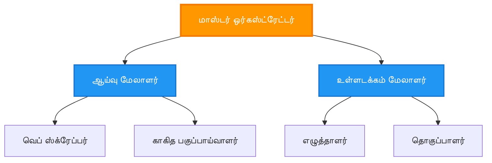
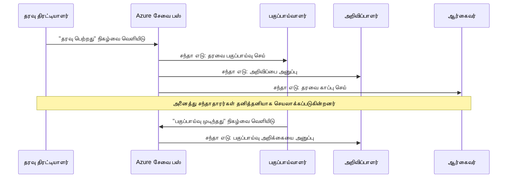
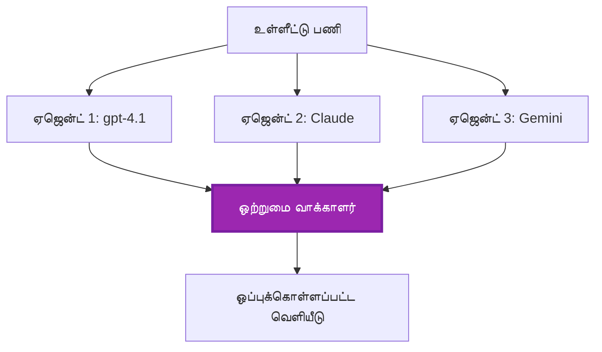
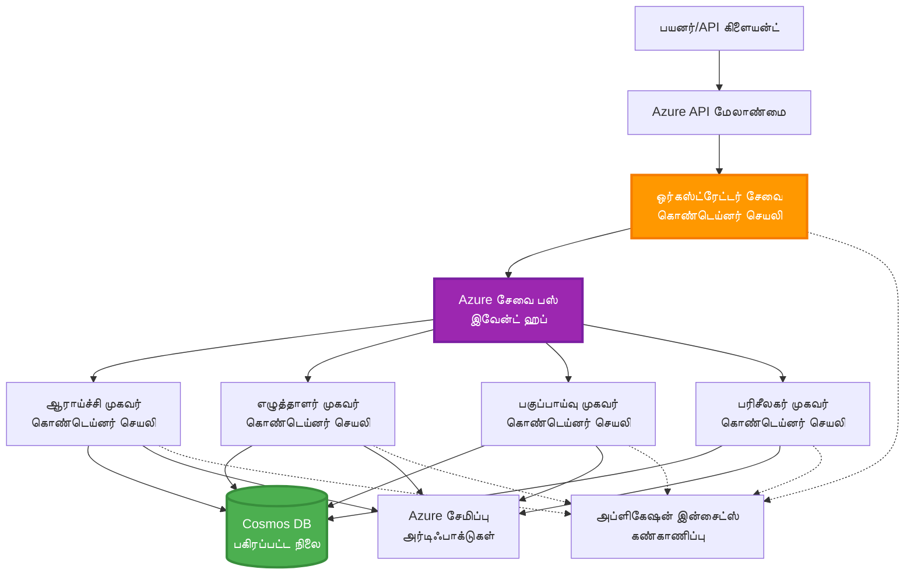

# Multi-Agent Coordination Patterns

⏱️ **Estimated Time**: 60-75 minutes | 💰 **Estimated Cost**: ~$100-300/month | ⭐ **Complexity**: Advanced

**📚 Learning Path:**
- ← Previous: [Capacity Planning](capacity-planning.md) - Resource sizing and scaling strategies
- 🎯 **You Are Here**: Multi-Agent Coordination Patterns (Orchestration, communication, state management)
- → Next: [SKU Selection](sku-selection.md) - Choosing the right Azure services
- 🏠 [Course Home](../../README.md)

---

## What You'll Learn

By completing this lesson, you will:
- Understand **multi-agent architecture** patterns and when to use them
- Implement **orchestration patterns** (centralized, decentralized, hierarchical)
- Design **agent communication** strategies (synchronous, asynchronous, event-driven)
- Manage **shared state** across distributed agents
- Deploy **multi-agent systems** on Azure with AZD
- Apply **coordination patterns** for real-world AI scenarios
- Monitor and debug distributed agent systems

## Why Multi-Agent Coordination Matters

### The Evolution: From Single Agent to Multi-Agent

**Single Agent (Simple):**
```
User → Agent → Response
```
- ✅ Easy to understand and implement
- ✅ Fast for simple tasks
- ❌ Limited by single model's capabilities
- ❌ Cannot parallelize complex tasks
- ❌ No specialization

**Multi-Agent System (Advanced):**
```mermaid
graph TD
    Orchestrator[ஒழுங்குபடுத்தி] --> Agent1[ஏஜென்ட்1<br/>திட்டம்]
    Orchestrator --> Agent2[ஏஜென்ட்2<br/>குறியீடு]
    Orchestrator --> Agent3[ஏஜென்ட்3<br/>மீளாய்வு]
```- ✅ Specialized agents for specific tasks
- ✅ Parallel execution for speed
- ✅ Modular and maintainable
- ✅ Better at complex workflows
- ⚠️ Requires coordination logic

**Analogy**: Single agent is like one person doing all tasks. Multi-agent is like a team where each member has specialized skills (researcher, coder, reviewer, writer) working together.

---

## Core Coordination Patterns

### Pattern 1: Sequential Coordination (Chain of Responsibility)

**When to use**: Tasks must complete in specific order, each agent builds on previous output.

```mermaid
sequenceDiagram
    participant User
    participant Orchestrator
    participant Agent1 as ஆராய்ச்சி முகவர்
    participant Agent2 as எழுத்தாளர் முகவர்
    participant Agent3 as திருத்தி முகவர்
    
    User->>Orchestrator: "ஏ.ஐ. பற்றி கட்டுரை எழுதவும்"
    Orchestrator->>Agent1: தலைப்பை ஆராயுங்கள்
    Agent1-->>Orchestrator: ஆராய்ச்சி முடிவுகள்
    Orchestrator->>Agent2: வரைவு எழுதவும் (ஆராய்ச்சியை பயன்படுத்தி)
    Agent2-->>Orchestrator: வரைவு கட்டுரை
    Orchestrator->>Agent3: திருத்தவும் மற்றும் மேம்படுத்தவும்
    Agent3-->>Orchestrator: இறுதி கட்டுரை
    Orchestrator-->>User: மெருகூட்டப்பட்ட கட்டுரை
    
    Note over User,Agent3: வரிசை: ஒவ்வொரு படியும் முந்தையதை காத்திருக்கும்
```}
**Benefits:**
- ✅ Clear data flow
- ✅ Easy to debug
- ✅ Predictable execution order

**Limitations:**
- ❌ Slower (no parallelism)
- ❌ One failure blocks entire chain
- ❌ Cannot handle interdependent tasks

**Example Use Cases:**
- Content creation pipeline (research → write → edit → publish)
- Code generation (plan → implement → test → deploy)
- Report generation (data collection → analysis → visualization → summary)

---

### Pattern 2: Parallel Coordination (Fan-Out/Fan-In)

**When to use**: Independent tasks can run simultaneously, results combined at the end.

```mermaid
graph TB
    User[பயனர் கோரிக்கை]
    Orchestrator[ஒழுங்குபடுத்துநர்]
    Agent1[பகுப்பாய்வு முகவர்]
    Agent2[ஆய்வு முகவர்]
    Agent3[தரவு முகவர்]
    Aggregator[முடிவு ஒருங்கிணைப்பாளர்]
    Response[கலந்த பதில்]
    
    User --> Orchestrator
    Orchestrator --> Agent1
    Orchestrator --> Agent2
    Orchestrator --> Agent3
    Agent1 --> Aggregator
    Agent2 --> Aggregator
    Agent3 --> Aggregator
    Aggregator --> Response
    
    style Orchestrator fill:#2196F3,stroke:#1976D2,stroke-width:3px,color:#fff
    style Aggregator fill:#4CAF50,stroke:#388E3C,stroke-width:3px,color:#fff
```
**Benefits:**
- ✅ Fast (parallel execution)
- ✅ Fault-tolerant (partial results acceptable)
- ✅ Scales horizontally

**Limitations:**
- ⚠️ Results may arrive out-of-order
- ⚠️ Need aggregation logic
- ⚠️ Complex state management

**Example Use Cases:**
- Multi-source data gathering (APIs + databases + web scraping)
- Competitive analysis (multiple models generate solutions, best selected)
- Translation services (translate to multiple languages simultaneously)

---

### Pattern 3: Hierarchical Coordination (Manager-Worker)

**When to use**: Complex workflows with sub-tasks, delegation needed.


**Benefits:**
- ✅ Handles complex workflows
- ✅ Modular and maintainable
- ✅ Clear responsibility boundaries

**Limitations:**
- ⚠️ More complex architecture
- ⚠️ Higher latency (multiple coordination layers)
- ⚠️ Requires sophisticated orchestration

**Example Use Cases:**
- Enterprise document processing (classify → route → process → archive)
- Multi-stage data pipelines (ingest → clean → transform → analyze → report)
- Complex automation workflows (planning → resource allocation → execution → monitoring)

---

### Pattern 4: Event-Driven Coordination (Publish-Subscribe)

**When to use**: Agents need to react to events, loose coupling desired.


**Benefits:**
- ✅ Loose coupling between agents
- ✅ Easy to add new agents (just subscribe)
- ✅ Asynchronous processing
- ✅ Resilient (message persistence)

**Limitations:**
- ⚠️ Eventual consistency
- ⚠️ Complex debugging
- ⚠️ Message ordering challenges

**Example Use Cases:**
- Real-time monitoring systems (alerts, dashboards, logs)
- Multi-channel notifications (email, SMS, push, Slack)
- Data processing pipelines (multiple consumers of same data)

---

### Pattern 5: Consensus-Based Coordination (Voting/Quorum)

**When to use**: Need agreement from multiple agents before proceeding.


**Benefits:**
- ✅ Higher accuracy (multiple opinions)
- ✅ Fault-tolerant (minority failures acceptable)
- ✅ Quality assurance built-in

**Limitations:**
- ❌ Expensive (multiple model calls)
- ❌ Slower (waiting for all agents)
- ⚠️ Conflict resolution needed

**Example Use Cases:**
- Content moderation (multiple models review content)
- Code review (multiple linters/analyzers)
- Medical diagnosis (multiple AI models, expert validation)

---

## Architecture Overview

### Complete Multi-Agent System on Azure


**Key Components:**

| Component | Purpose | Azure Service |
|-----------|---------|---------------|
| **API Gateway** | Entry point, rate limiting, auth | API Management |
| **Orchestrator** | Coordinates agent workflows | Container Apps |
| **Message Queue** | Asynchronous communication | Service Bus / Event Hubs |
| **Agents** | Specialized AI workers | Container Apps / Functions |
| **State Store** | Shared state, task tracking | Cosmos DB |
| **Artifact Storage** | Documents, results, logs | Blob Storage |
| **Monitoring** | Distributed tracing, logs | Application Insights |

---

## Prerequisites

### Required Tools

```bash
# Azure Developer CLI ஐ சரிபார்க்கவும்
azd version
# ✅ எதிர்பார்க்கப்படுகிறது: azd பதிப்பு 1.0.0 அல்லது அதற்கு மேல்

# Azure CLI ஐ சரிபார்க்கவும்
az --version
# ✅ எதிர்பார்க்கப்படுகிறது: azure-cli பதிப்பு 2.50.0 அல்லது அதற்கு மேல்

# Docker (உள்ளூர் சோதனைக்காக) ஐ சரிபார்க்கவும்
docker --version
# ✅ எதிர்பார்க்கப்படுகிறது: Docker பதிப்பு 20.10 அல்லது அதற்கு மேல்
```

### Azure Requirements

- Active Azure subscription
- Permissions to create:
  - Container Apps
  - Service Bus namespaces
  - Cosmos DB accounts
  - Storage accounts
  - Application Insights

### Knowledge Prerequisites

You should have completed:
- [Configuration Management](../chapter-03-configuration/configuration.md)
- [Authentication & Security](../chapter-03-configuration/authsecurity.md)
- [Microservices Example](../../../../examples/microservices)

---

## Implementation Guide

### Project Structure

```
multi-agent-system/
├── azure.yaml                    # AZD configuration
├── infra/
│   ├── main.bicep               # Main infrastructure
│   ├── core/
│   │   ├── servicebus.bicep     # Message queue
│   │   ├── cosmos.bicep         # State store
│   │   ├── storage.bicep        # Artifact storage
│   │   └── monitoring.bicep     # Application Insights
│   └── app/
│       ├── orchestrator.bicep   # Orchestrator service
│       └── agent.bicep          # Agent template
└── src/
    ├── orchestrator/            # Orchestration logic
    │   ├── app.py
    │   ├── workflows.py
    │   └── Dockerfile
    ├── agents/
    │   ├── research/            # Research agent
    │   ├── writer/              # Writer agent
    │   ├── analyst/             # Analyst agent
    │   └── reviewer/            # Reviewer agent
    └── shared/
        ├── state_manager.py     # Shared state logic
        └── message_handler.py   # Message handling
```

---

## Lesson 1: Sequential Coordination Pattern

### Implementation: Content Creation Pipeline

Let's build a sequential pipeline: Research → Write → Edit → Publish

### 1. AZD Configuration

**File: `azure.yaml`**

```yaml
name: content-pipeline
metadata:
  template: multi-agent-sequential@1.0.0

services:
  orchestrator:
    project: ./src/orchestrator
    language: python
    host: containerapp
  
  research-agent:
    project: ./src/agents/research
    language: python
    host: containerapp
  
  writer-agent:
    project: ./src/agents/writer
    language: python
    host: containerapp
  
  editor-agent:
    project: ./src/agents/editor
    language: python
    host: containerapp
```

### 2. Infrastructure: Service Bus for Coordination

**File: `infra/core/servicebus.bicep`**

```bicep
param name string
param location string
param tags object = {}

resource serviceBusNamespace 'Microsoft.ServiceBus/namespaces@2022-10-01-preview' = {
  name: name
  location: location
  tags: tags
  sku: {
    name: 'Standard'
    tier: 'Standard'
  }
  properties: {
    minimumTlsVersion: '1.2'
  }
}

// Queue for orchestrator → research agent
resource researchQueue 'Microsoft.ServiceBus/namespaces/queues@2022-10-01-preview' = {
  parent: serviceBusNamespace
  name: 'research-tasks'
  properties: {
    maxDeliveryCount: 3
    lockDuration: 'PT5M'
    deadLetteringOnMessageExpiration: true
  }
}

// Queue for research agent → writer agent
resource writerQueue 'Microsoft.ServiceBus/namespaces/queues@2022-10-01-preview' = {
  parent: serviceBusNamespace
  name: 'writer-tasks'
  properties: {
    maxDeliveryCount: 3
    lockDuration: 'PT5M'
  }
}

// Queue for writer agent → editor agent
resource editorQueue 'Microsoft.ServiceBus/namespaces/queues@2022-10-01-preview' = {
  parent: serviceBusNamespace
  name: 'editor-tasks'
  properties: {
    maxDeliveryCount: 3
    lockDuration: 'PT5M'
  }
}

output namespace string = serviceBusNamespace.name
output connectionString string = listKeys('${serviceBusNamespace.id}/AuthorizationRules/RootManageSharedAccessKey', serviceBusNamespace.apiVersion).primaryConnectionString
```

### 3. Shared State Manager

**File: `src/shared/state_manager.py`**

```python
from azure.cosmos import CosmosClient, PartitionKey
from datetime import datetime
import os

class StateManager:
    """Manages shared state across agents using Cosmos DB"""
    
    def __init__(self):
        endpoint = os.environ['COSMOS_ENDPOINT']
        key = os.environ['COSMOS_KEY']
        
        self.client = CosmosClient(endpoint, key)
        self.database = self.client.get_database_client('agent-state')
        self.container = self.database.get_container_client('tasks')
    
    def create_task(self, task_id: str, task_type: str, input_data: dict):
        """Create a new task"""
        task = {
            'id': task_id,
            'type': task_type,
            'status': 'pending',
            'input': input_data,
            'created_at': datetime.utcnow().isoformat(),
            'steps': []
        }
        self.container.create_item(task)
        return task
    
    def update_task_step(self, task_id: str, step_name: str, result: dict):
        """Update task with completed step"""
        task = self.container.read_item(task_id, partition_key=task_id)
        
        task['steps'].append({
            'name': step_name,
            'completed_at': datetime.utcnow().isoformat(),
            'result': result
        })
        
        self.container.replace_item(task_id, task)
        return task
    
    def complete_task(self, task_id: str, final_result: dict):
        """Mark task as complete"""
        task = self.container.read_item(task_id, partition_key=task_id)
        task['status'] = 'completed'
        task['result'] = final_result
        task['completed_at'] = datetime.utcnow().isoformat()
        self.container.replace_item(task_id, task)
        return task
    
    def get_task(self, task_id: str):
        """Retrieve task state"""
        return self.container.read_item(task_id, partition_key=task_id)
```

### 4. Orchestrator Service

**File: `src/orchestrator/app.py`**

```python
from flask import Flask, request, jsonify
from azure.servicebus import ServiceBusClient, ServiceBusMessage
import json
import uuid
import os
from shared.state_manager import StateManager

app = Flask(__name__)
state_manager = StateManager()

# சர்வீஸ் பஸ் இணைப்பு
servicebus_connection_str = os.environ['SERVICEBUS_CONNECTION_STRING']
servicebus_client = ServiceBusClient.from_connection_string(servicebus_connection_str)

@app.route('/health', methods=['GET'])
def health():
    return jsonify({'status': 'healthy', 'service': 'orchestrator'})

@app.route('/create-content', methods=['POST'])
def create_content():
    """
    Sequential workflow: Research → Write → Edit → Publish
    """
    data = request.json
    topic = data.get('topic')
    
    if not topic:
        return jsonify({'error': 'Topic required'}), 400
    
    # நிலை சேமிப்பகத்தில் ஒரு பணியை உருவாக்கு
    task_id = str(uuid.uuid4())
    task = state_manager.create_task(
        task_id=task_id,
        task_type='content_creation',
        input_data={'topic': topic}
    )
    
    # ஆராய்ச்சி முகவருக்கு செய்தி அனுப்பு (முதல் படி)
    sender = servicebus_client.get_queue_sender('research-tasks')
    message = ServiceBusMessage(
        body=json.dumps({
            'task_id': task_id,
            'topic': topic,
            'next_queue': 'writer-tasks'  # முடிவுகளை எங்கு அனுப்ப வேண்டும்
        }),
        content_type='application/json'
    )
    
    with sender:
        sender.send_messages(message)
    
    return jsonify({
        'task_id': task_id,
        'status': 'started',
        'workflow': 'sequential',
        'steps': ['research', 'write', 'edit', 'publish'],
        'message': 'Content creation pipeline initiated'
    }), 202

@app.route('/task/<task_id>', methods=['GET'])
def get_task_status(task_id):
    """Check task status"""
    try:
        task = state_manager.get_task(task_id)
        return jsonify(task)
    except Exception as e:
        return jsonify({'error': str(e)}), 404

if __name__ == '__main__':
    app.run(host='0.0.0.0', port=8080)
```

### 5. Research Agent

**File: `src/agents/research/app.py`**

```python
from azure.servicebus import ServiceBusClient, ServiceBusMessage
from openai import AzureOpenAI
import json
import os
import time
from shared.state_manager import StateManager

# கிளையன்டுகளை ஆரம்பிக்கவும்
state_manager = StateManager()
servicebus_client = ServiceBusClient.from_connection_string(
    os.environ['SERVICEBUS_CONNECTION_STRING']
)

openai_client = AzureOpenAI(
    api_key=os.environ['AZURE_OPENAI_API_KEY'],
    api_version="2024-02-01",
    azure_endpoint=os.environ['AZURE_OPENAI_ENDPOINT']
)

def process_research_task(message_data):
    """Process research request and pass to writer"""
    task_id = message_data['task_id']
    topic = message_data['topic']
    next_queue = message_data['next_queue']
    
    print(f"🔬 Researching: {topic}")
    
    # ஆராய்ச்சிக்காக Microsoft Foundry மாடல்களை அழைக்கவும்
    response = openai_client.chat.completions.create(
        model="gpt-4.1",
        messages=[
            {"role": "system", "content": "You are a research assistant. Provide comprehensive research on the given topic."},
            {"role": "user", "content": f"Research this topic thoroughly: {topic}"}
        ],
        max_tokens=1500
    )
    
    research_results = response.choices[0].message.content
    
    # நிலையை புதுப்பிக்கவும்
    state_manager.update_task_step(
        task_id=task_id,
        step_name='research',
        result={'research': research_results}
    )
    
    # அடுத்த ஏஜெண்ட் (எழுத்தாளர்)க்கு அனுப்பவும்
    sender = servicebus_client.get_queue_sender(next_queue)
    message = ServiceBusMessage(
        body=json.dumps({
            'task_id': task_id,
            'topic': topic,
            'research': research_results,
            'next_queue': 'editor-tasks'
        }),
        content_type='application/json'
    )
    
    with sender:
        sender.send_messages(message)
    
    print(f"✅ Research complete for task {task_id}")

def main():
    """Listen to research queue"""
    receiver = servicebus_client.get_queue_receiver('research-tasks')
    
    print("🔬 Research Agent started, listening for tasks...")
    
    with receiver:
        while True:
            messages = receiver.receive_messages(max_wait_time=5)
            for message in messages:
                try:
                    message_data = json.loads(str(message))
                    process_research_task(message_data)
                    receiver.complete_message(message)
                except Exception as e:
                    print(f"❌ Error processing message: {e}")
                    receiver.abandon_message(message)

if __name__ == '__main__':
    main()
```

### 6. Writer Agent

**File: `src/agents/writer/app.py`**

```python
from azure.servicebus import ServiceBusClient, ServiceBusMessage
from openai import AzureOpenAI
import json
import os
from shared.state_manager import StateManager

state_manager = StateManager()
servicebus_client = ServiceBusClient.from_connection_string(
    os.environ['SERVICEBUS_CONNECTION_STRING']
)

openai_client = AzureOpenAI(
    api_key=os.environ['AZURE_OPENAI_API_KEY'],
    api_version="2024-02-01",
    azure_endpoint=os.environ['AZURE_OPENAI_ENDPOINT']
)

def process_writing_task(message_data):
    """Write article based on research"""
    task_id = message_data['task_id']
    topic = message_data['topic']
    research = message_data['research']
    next_queue = message_data['next_queue']
    
    print(f"✍️ Writing article: {topic}")
    
    # Microsoft Foundry Models-ஐ அழைத்து கட்டுரை எழுதவும்
    response = openai_client.chat.completions.create(
        model="gpt-4.1",
        messages=[
            {"role": "system", "content": "You are a professional writer. Write engaging, well-structured articles."},
            {"role": "user", "content": f"Based on this research:\n\n{research}\n\nWrite a comprehensive article about: {topic}"}
        ],
        max_tokens=2000
    )
    
    article_draft = response.choices[0].message.content
    
    # நிலையை புதுப்பிக்கவும்
    state_manager.update_task_step(
        task_id=task_id,
        step_name='writing',
        result={'draft': article_draft}
    )
    
    # எடிட்டருக்கு அனுப்பவும்
    sender = servicebus_client.get_queue_sender(next_queue)
    message = ServiceBusMessage(
        body=json.dumps({
            'task_id': task_id,
            'topic': topic,
            'draft': article_draft
        }),
        content_type='application/json'
    )
    
    with sender:
        sender.send_messages(message)
    
    print(f"✅ Article draft complete for task {task_id}")

def main():
    """Listen to writer queue"""
    receiver = servicebus_client.get_queue_receiver('writer-tasks')
    
    print("✍️ Writer Agent started, listening for tasks...")
    
    with receiver:
        while True:
            messages = receiver.receive_messages(max_wait_time=5)
            for message in messages:
                try:
                    message_data = json.loads(str(message))
                    process_writing_task(message_data)
                    receiver.complete_message(message)
                except Exception as e:
                    print(f"❌ Error: {e}")
                    receiver.abandon_message(message)

if __name__ == '__main__':
    main()
```

### 7. Editor Agent

**File: `src/agents/editor/app.py`**

```python
from azure.servicebus import ServiceBusClient
from openai import AzureOpenAI
import json
import os
from shared.state_manager import StateManager

state_manager = StateManager()
servicebus_client = ServiceBusClient.from_connection_string(
    os.environ['SERVICEBUS_CONNECTION_STRING']
)

openai_client = AzureOpenAI(
    api_key=os.environ['AZURE_OPENAI_API_KEY'],
    api_version="2024-02-01",
    azure_endpoint=os.environ['AZURE_OPENAI_ENDPOINT']
)

def process_editing_task(message_data):
    """Edit and finalize article"""
    task_id = message_data['task_id']
    topic = message_data['topic']
    draft = message_data['draft']
    
    print(f"📝 Editing article: {topic}")
    
    # Microsoft Foundry Models-ஐ திருத்தத்திற்காக அழைக்கவும்
    response = openai_client.chat.completions.create(
        model="gpt-4.1",
        messages=[
            {"role": "system", "content": "You are an expert editor. Improve grammar, clarity, and structure."},
            {"role": "user", "content": f"Edit and improve this article:\n\n{draft}"}
        ],
        max_tokens=2000
    )
    
    final_article = response.choices[0].message.content
    
    # பணியை முடிக்கப்பட்டதாக குறிக்கவும்
    state_manager.complete_task(
        task_id=task_id,
        final_result={
            'topic': topic,
            'final_article': final_article,
            'word_count': len(final_article.split())
        }
    )
    
    print(f"✅ Article finalized for task {task_id}")

def main():
    """Listen to editor queue"""
    receiver = servicebus_client.get_queue_receiver('editor-tasks')
    
    print("📝 Editor Agent started, listening for tasks...")
    
    with receiver:
        while True:
            messages = receiver.receive_messages(max_wait_time=5)
            for message in messages:
                try:
                    message_data = json.loads(str(message))
                    process_editing_task(message_data)
                    receiver.complete_message(message)
                except Exception as e:
                    print(f"❌ Error: {e}")
                    receiver.abandon_message(message)

if __name__ == '__main__':
    main()
```

### 8. Deploy and Test

```bash
# விருப்பம் A: வார்ப்புரு அடிப்படையிலான நிறுவல்
azd init
azd up

# விருப்பம் B: முகவர் மனிபெஸ்ட் அடிப்படையிலான நிறுவல் (விரிவாக்கம் தேவை)
azd extension install azure.ai.agents
azd ai agent init -m agent-manifest.yaml
azd up
```

> See [AZD AI CLI Commands](../chapter-08-production/production-ai-practices.md#azd-ai-cli-commands-and-extensions) for all `azd ai` flags and options.

```bash
# orchestrator URL ஐப் பெறவும்
ORCHESTRATOR_URL=$(azd env get-values | grep ORCHESTRATOR_URL | cut -d '=' -f2 | tr -d '"')

# உள்ளடக்கம் உருவாக்கவும்
curl -X POST $ORCHESTRATOR_URL/create-content \
  -H "Content-Type: application/json" \
  -d '{"topic": "The Future of AI in Healthcare"}'
```

**✅ Expected output:**
```json
{
  "task_id": "a1b2c3d4-e5f6-7890-abcd-ef1234567890",
  "status": "started",
  "workflow": "sequential",
  "steps": ["research", "write", "edit", "publish"],
  "message": "Content creation pipeline initiated"
}
```

**Check task progress:**
```bash
TASK_ID="a1b2c3d4-e5f6-7890-abcd-ef1234567890"
curl $ORCHESTRATOR_URL/task/$TASK_ID
```

**✅ Expected output (completed):**
```json
{
  "id": "a1b2c3d4-e5f6-7890-abcd-ef1234567890",
  "type": "content_creation",
  "status": "completed",
  "steps": [
    {
      "name": "research",
      "completed_at": "2025-11-19T10:30:00Z",
      "result": {"research": "..."}
    },
    {
      "name": "writing",
      "completed_at": "2025-11-19T10:32:00Z",
      "result": {"draft": "..."}
    }
  ],
  "result": {
    "topic": "The Future of AI in Healthcare",
    "final_article": "...",
    "word_count": 1500
  }
}
```

---

## Lesson 2: Parallel Coordination Pattern

### Implementation: Multi-Source Research Aggregator

Let's build a parallel system that gathers information from multiple sources simultaneously.

### Parallel Orchestrator

**File: `src/orchestrator/parallel_workflow.py`**

```python
from flask import Flask, request, jsonify
from azure.servicebus import ServiceBusClient, ServiceBusMessage
import json
import uuid
import os
from shared.state_manager import StateManager

app = Flask(__name__)
state_manager = StateManager()

servicebus_client = ServiceBusClient.from_connection_string(
    os.environ['SERVICEBUS_CONNECTION_STRING']
)

@app.route('/research-parallel', methods=['POST'])
def research_parallel():
    """
    Parallel workflow: Multiple agents work simultaneously
    """
    data = request.json
    query = data.get('query')
    
    task_id = str(uuid.uuid4())
    task = state_manager.create_task(
        task_id=task_id,
        task_type='parallel_research',
        input_data={
            'query': query,
            'agents': ['web', 'academic', 'news', 'social']
        }
    )
    
    # பகிர்தல்: அனைத்து முகவரிகளுக்கும் ஒரே நேரத்தில் அனுப்பு
    agents = [
        ('web-research-queue', 'web'),
        ('academic-research-queue', 'academic'),
        ('news-research-queue', 'news'),
        ('social-research-queue', 'social')
    ]
    
    for queue_name, agent_type in agents:
        sender = servicebus_client.get_queue_sender(queue_name)
        message = ServiceBusMessage(
            body=json.dumps({
                'task_id': task_id,
                'query': query,
                'agent_type': agent_type,
                'result_queue': 'aggregation-queue'
            }),
            content_type='application/json'
        )
        
        with sender:
            sender.send_messages(message)
    
    return jsonify({
        'task_id': task_id,
        'status': 'started',
        'workflow': 'parallel',
        'agents_dispatched': 4,
        'message': 'Parallel research initiated'
    }), 202

if __name__ == '__main__':
    app.run(host='0.0.0.0', port=8080)
```

### Aggregation Logic

**File: `src/agents/aggregator/app.py`**

```python
from azure.servicebus import ServiceBusClient
import json
import os
from collections import defaultdict
from shared.state_manager import StateManager

state_manager = StateManager()
servicebus_client = ServiceBusClient.from_connection_string(
    os.environ['SERVICEBUS_CONNECTION_STRING']
)

# ஒவ்வொரு பணிக்கும் பெறுபேறுகளை கண்காணிக்க
task_results = defaultdict(list)
expected_agents = 4  # வலை, கல்வி, செய்தி, சமூக

def process_result(message_data):
    """Aggregate results from parallel agents"""
    task_id = message_data['task_id']
    agent_type = message_data['agent_type']
    result = message_data['result']
    
    # முடிவை சேமிக்க
    task_results[task_id].append({
        'agent': agent_type,
        'data': result
    })
    
    print(f"📊 Received result from {agent_type} agent ({len(task_results[task_id])}/{expected_agents})")
    
    # அனைத்து ஏஜென்டுகளும் முடித்துள்ளனவா என்பதை சரிபார்க்க (fan-in)
    if len(task_results[task_id]) == expected_agents:
        print(f"✅ All agents completed for task {task_id}. Aggregating...")
        
        # முடிவுகளை ஒன்றிணைக்க
        aggregated = {
            'query': message_data['query'],
            'sources': task_results[task_id],
            'summary': generate_summary(task_results[task_id])
        }
        
        # முடிக்கப்பட்டதாக குறிக்க
        state_manager.complete_task(task_id, aggregated)
        
        # சுத்தம் செய்ய
        del task_results[task_id]
        
        print(f"✅ Aggregation complete for task {task_id}")

def generate_summary(results):
    """Generate summary from all sources"""
    summaries = [r['data'].get('summary', '') for r in results]
    return '\n\n'.join(summaries)

def main():
    """Listen to aggregation queue"""
    receiver = servicebus_client.get_queue_receiver('aggregation-queue')
    
    print("📊 Aggregator started, listening for results...")
    
    with receiver:
        while True:
            messages = receiver.receive_messages(max_wait_time=5)
            for message in messages:
                try:
                    message_data = json.loads(str(message))
                    process_result(message_data)
                    receiver.complete_message(message)
                except Exception as e:
                    print(f"❌ Error: {e}")
                    receiver.abandon_message(message)

if __name__ == '__main__':
    main()
```

**Benefits of Parallel Pattern:**
- ⚡ **4x faster** (agents run simultaneously)
- 🔄 **Fault-tolerant** (partial results acceptable)
- 📈 **Scalable** (add more agents easily)

---

## Practical Exercises

### Exercise 1: Add Timeout Handling ⭐⭐ (Medium)

**Goal**: Implement timeout logic so aggregator doesn't wait forever for slow agents.

**Steps**:

1. **Add timeout tracking to aggregator:**

```python
from datetime import datetime, timedelta

task_timeouts = {}  # task_id -> expiration_time

def process_result(message_data):
    task_id = message_data['task_id']
    
    # முதல் முடிவுக்கு நேர எல்லையை அமைக்கவும்
    if task_id not in task_timeouts:
        task_timeouts[task_id] = datetime.utcnow() + timedelta(seconds=30)
    
    task_results[task_id].append({
        'agent': message_data['agent_type'],
        'data': message_data['result']
    })
    
    # முழுமையானதா அல்லது காலாவதி ஆனதா என்பதைச் சரிபார்க்கவும்
    if len(task_results[task_id]) == expected_agents or \
       datetime.utcnow() > task_timeouts[task_id]:
        
        print(f"📊 Aggregating with {len(task_results[task_id])}/{expected_agents} results")
        
        aggregated = {
            'query': message_data['query'],
            'sources': task_results[task_id],
            'completed_agents': len(task_results[task_id]),
            'timed_out': len(task_results[task_id]) < expected_agents
        }
        
        state_manager.complete_task(task_id, aggregated)
        
        # சுத்திகரிப்பு
        del task_results[task_id]
        del task_timeouts[task_id]
```

2. **Test with artificial delays:**

```python
# ஒரு ஏஜென்டில், மெதுவாக செயல்படுவதைக் காட்ட தாமதத்தைச் சேர்க்கவும்
import time
time.sleep(35)  # 30-வினாடிகள் கால அவகாசத்தை மீறுகிறது
```

3. **Deploy and verify:**

```bash
azd deploy aggregator

# பணியை சமர்ப்பிக்கவும்
curl -X POST $ORCHESTRATOR_URL/research-parallel \
  -H "Content-Type: application/json" \
  -d '{"query": "AI safety research"}'

# 30 விநாடிகள் கழித்து முடிவுகளை சரிபார்க்கவும்
curl $ORCHESTRATOR_URL/task/$TASK_ID
```

**✅ Success Criteria:**
- ✅ Task completes after 30 seconds even if agents incomplete
- ✅ Response indicates partial results (`"timed_out": true`)
- ✅ Available results are returned (3 out of 4 agents)

**Time**: 20-25 minutes

---

### Exercise 2: Implement Retry Logic ⭐⭐⭐ (Advanced)

**Goal**: Retry failed agent tasks automatically before giving up.

**Steps**:

1. **Add retry tracking to orchestrator:**

```python
from dataclasses import dataclass
from typing import Dict

@dataclass
class RetryConfig:
    max_retries: int = 3
    backoff_seconds: int = 5

retry_counts: Dict[str, int] = {}  # செய்தி_அடையாளம் -> மறுமுயற்சி_எண்ணிக்கை

def send_with_retry(queue_name: str, message_data: dict, retry_config: RetryConfig):
    """Send message with retry metadata"""
    message_id = message_data.get('message_id', str(uuid.uuid4()))
    message_data['message_id'] = message_id
    message_data['retry_count'] = retry_counts.get(message_id, 0)
    message_data['max_retries'] = retry_config.max_retries
    
    sender = servicebus_client.get_queue_sender(queue_name)
    message = ServiceBusMessage(
        body=json.dumps(message_data),
        content_type='application/json',
        message_id=message_id
    )
    
    with sender:
        sender.send_messages(message)
```

2. **Add retry handler to agents:**

```python
def process_with_retry(message, receiver, process_func):
    """Process message with automatic retry on failure"""
    try:
        message_data = json.loads(str(message))
        
        # செய்தியை செயலாக்கவும்
        process_func(message_data)
        
        # வெற்றி - முடிந்தது
        receiver.complete_message(message)
        
    except Exception as e:
        message_id = message.message_id
        retry_count = message_data.get('retry_count', 0)
        max_retries = message_data.get('max_retries', 3)
        
        if retry_count < max_retries:
            # மீண்டும் முயற்சி: தற்போதையதை விட்டு, எண்ணிக்கையை ஒரு கட்ட உயர்த்தி மீண்டும் வரிசையில் சேர்க்கவும்
            print(f"⚠️ Retry {retry_count + 1}/{max_retries} for message {message_id}")
            
            message_data['retry_count'] = retry_count + 1
            
            # அதே வரிசைக்கு தாமதத்துடன் திருப்பி அனுப்பவும்
            time.sleep(5 * (retry_count + 1))  # மடங்கு அடைவான தாமதம்
            send_with_retry(queue_name, message_data, RetryConfig())
            
            receiver.complete_message(message)  # மூலத்தை அகற்று
        else:
            # அதிகபட்ச மீண்டும் முயற்சிகள் மீறியது - மரணக் கடித வரிசைக்கு நகர்த்தவும்
            print(f"❌ Max retries exceeded for message {message_id}")
            receiver.dead_letter_message(
                message,
                reason="MaxRetriesExceeded",
                error_description=str(e)
            )
```

3. **Monitor dead letter queue:**

```python
def monitor_dead_letters():
    """Check dead letter queue for failed messages"""
    receiver = servicebus_client.get_queue_receiver(
        'research-queue',
        sub_queue='deadletter'
    )
    
    with receiver:
        messages = receiver.receive_messages(max_wait_time=5)
        for message in messages:
            print(f"☠️ Dead letter: {message.message_id}")
            print(f"Reason: {message.dead_letter_reason}")
            print(f"Description: {message.dead_letter_error_description}")
```

**✅ Success Criteria:**
- ✅ Failed tasks retry automatically (up to 3 times)
- ✅ Exponential backoff between retries (5s, 10s, 15s)
- ✅ After max retries, messages go to dead letter queue
- ✅ Dead letter queue can be monitored and replayed

**Time**: 30-40 minutes

---

### Exercise 3: Implement Circuit Breaker ⭐⭐⭐ (Advanced)

**Goal**: Prevent cascading failures by stopping requests to failing agents.

**Steps**:

1. **Create circuit breaker class:**

```python
from enum import Enum
from datetime import datetime, timedelta

class CircuitState(Enum):
    CLOSED = "closed"      # சாதாரண செயல்பாடு
    OPEN = "open"          # தோல்வியில் உள்ளது, கோரிக்கைகளை நிராகரிக்கவும்
    HALF_OPEN = "half_open"  # மீண்டு உள்ளதா என்பதை சோதிக்கிறது

class CircuitBreaker:
    def __init__(self, failure_threshold=5, timeout_seconds=60):
        self.failure_threshold = failure_threshold
        self.timeout_seconds = timeout_seconds
        self.failure_count = 0
        self.last_failure_time = None
        self.state = CircuitState.CLOSED
    
    def call(self, func):
        """Execute function with circuit breaker protection"""
        if self.state == CircuitState.OPEN:
            # நேர எல்லை காலாவதானதா என்பதை சரிபார்க்கவும்
            if datetime.utcnow() - self.last_failure_time > timedelta(seconds=self.timeout_seconds):
                self.state = CircuitState.HALF_OPEN
                print("🔄 Circuit breaker: HALF_OPEN (testing)")
            else:
                raise Exception(f"Circuit breaker OPEN for agent. Try again in {self.timeout_seconds}s")
        
        try:
            result = func()
            
            # வெற்றி
            if self.state == CircuitState.HALF_OPEN:
                self.state = CircuitState.CLOSED
                self.failure_count = 0
                print("✅ Circuit breaker: CLOSED (recovered)")
            
            return result
            
        except Exception as e:
            self.failure_count += 1
            self.last_failure_time = datetime.utcnow()
            
            if self.failure_count >= self.failure_threshold:
                self.state = CircuitState.OPEN
                print(f"🔴 Circuit breaker: OPEN (too many failures)")
            
            raise e
```

2. **Apply to agent calls:**

```python
# ஒழுங்குபடுத்தியில்
agent_circuits = {
    'web': CircuitBreaker(failure_threshold=5, timeout_seconds=60),
    'academic': CircuitBreaker(failure_threshold=5, timeout_seconds=60),
    'news': CircuitBreaker(failure_threshold=5, timeout_seconds=60),
    'social': CircuitBreaker(failure_threshold=5, timeout_seconds=60)
}

def send_to_agent(agent_type, message_data):
    """Send with circuit breaker protection"""
    circuit = agent_circuits[agent_type]
    
    try:
        circuit.call(lambda: send_message(agent_type, message_data))
    except Exception as e:
        print(f"⚠️ Skipping {agent_type} agent: {e}")
        # மற்ற ஏஜென்ட்களுடன் தொடரவும்
```

3. **Test circuit breaker:**

```bash
# மீண்டும் மீண்டும் தோல்விகளை சிமுலேட் செய்யவும் (ஒரு ஏஜெண்டை நிறுத்தவும்)
az containerapp stop --name web-research-agent --resource-group rg-agents

# பல கோரிக்கைகள் அனுப்பவும்
for i in {1..10}; do
  curl -X POST $ORCHESTRATOR_URL/research-parallel \
    -H "Content-Type: application/json" \
    -d '{"query": "test query '$i'"}'
  sleep 2
done

# லாக்களை சரிபார்க்கவும் - 5 தோல்விகளுக்குப் பிறகு சர்க்யூட் திறந்திருப்பதை காண வேண்டும்
# Container App பதிவுகளுக்கு Azure CLI-ஐப் பயன்படுத்தவும்:
az containerapp logs show --name orchestrator --resource-group $RG_NAME --tail 50
```

**✅ Success Criteria:**
- ✅ After 5 failures, circuit opens (rejects requests)
- ✅ After 60 seconds, circuit goes half-open (tests recovery)
- ✅ Other agents continue working normally
- ✅ Circuit closes automatically when agent recovers

**Time**: 40-50 minutes

---

## Monitoring and Debugging

### Distributed Tracing with Application Insights

**File: `src/shared/tracing.py`**

```python
from opencensus.ext.azure.log_exporter import AzureLogHandler
from opencensus.ext.azure.trace_exporter import AzureExporter
from opencensus.trace import config_integration
from opencensus.trace.tracer import Tracer
from opencensus.trace.samplers import AlwaysOnSampler
import logging
import os

# டிரேசிங்கை அமைக்கவும்
config_integration.trace_integrations(['requests', 'logging'])

connection_string = os.environ.get('APPLICATIONINSIGHTS_CONNECTION_STRING')

# டிரேசரை உருவாக்கவும்
tracer = Tracer(
    exporter=AzureExporter(connection_string=connection_string),
    sampler=AlwaysOnSampler()
)

# லாக்கிங்கை அமைக்கவும்
logger = logging.getLogger(__name__)
logger.addHandler(AzureLogHandler(connection_string=connection_string))
logger.setLevel(logging.INFO)

def trace_agent_call(agent_name, task_id, operation):
    """Trace agent operations"""
    with tracer.span(name=f'{agent_name}.{operation}') as span:
        span.add_attribute('agent', agent_name)
        span.add_attribute('task_id', task_id)
        span.add_attribute('operation', operation)
        
        try:
            result = operation()
            span.add_attribute('status', 'success')
            return result
        except Exception as e:
            span.add_attribute('status', 'error')
            span.add_attribute('error', str(e))
            raise
```

### Application Insights Queries

**Track multi-agent workflows:**

```kusto
// Trace complete workflow for a task
traces
| where customDimensions.task_id == "a1b2c3d4-..."
| project timestamp, message, customDimensions.agent, customDimensions.operation
| order by timestamp asc
```

**Agent performance comparison:**

```kusto
// Compare agent execution times
dependencies
| where name contains "agent"
| summarize 
    avg_duration = avg(duration),
    p95_duration = percentile(duration, 95),
    count = count()
  by agent = tostring(customDimensions.agent)
| order by avg_duration desc
```

**Failure analysis:**

```kusto
// Find which agents fail most
exceptions
| where customDimensions.agent != ""
| summarize 
    failure_count = count(),
    unique_errors = dcount(outerMessage)
  by agent = tostring(customDimensions.agent)
| order by failure_count desc
```

---

## Cost Analysis

### Multi-Agent System Costs (Monthly Estimates)

| Component | Configuration | Cost |
|-----------|--------------|------|
| **Orchestrator** | 1 Container App (1 vCPU, 2GB) | $30-50 |
| **4 Agents** | 4 Container Apps (0.5 vCPU, 1GB each) | $60-120 |
| **Service Bus** | Standard tier, 10M messages | $10-20 |
| **Cosmos DB** | Serverless, 5GB storage, 1M RUs | $25-50 |
| **Blob Storage** | 10GB storage, 100K operations | $5-10 |
| **Application Insights** | 5GB ingestion | $10-15 |
| **Microsoft Foundry Models** | gpt-4.1, 10M tokens | $100-300 |
| **Total** | | **$240-565/month** |

### Cost Optimization Strategies

1. **Use serverless where possible:**
   ```bicep
   // Cosmos DB serverless (no minimum cost)
   properties: {
     databaseAccountOfferType: 'Standard'
     capabilities: [{ name: 'EnableServerless' }]
   }
   ```

2. **Scale agents to zero when idle:**
   ```bicep
   scale: {
     minReplicas: 0  // Scale to zero when no messages
     maxReplicas: 10
   }
   ```

3. **Use batching for Service Bus:**
   ```python
   # செய்திகளை தொகுதியாக அனுப்புங்கள் (குறைந்த செலவு)
   sender.send_messages([message1, message2, message3])
   ```

4. **Cache frequently used results:**
   ```python
   # Azure Cache for Redis-ஐ பயன்படுத்தவும்
   if cache.exists(query_hash):
       return cache.get(query_hash)
   ```

---

## Best Practices

### ✅ DO:

1. **Use idempotent operations**
   ```python
   # ஏஜென்ட் ஒரே செய்தியை பலமுறை பாதுகாப்பாக செயலாக்க முடியும்
   def process_task(task_id):
       if state_manager.task_exists(task_id):
           print(f"Task {task_id} already processed, skipping")
           return
       # பணியை செயலாக்க...
   ```

2. **Implement comprehensive logging**
   ```python
   logger.info(f"Agent: {agent_name}, Task: {task_id}, Action: {action}")
   ```

3. **Use correlation IDs**
   ```python
   # task_id ஐ முழு வேலைநெறியில் கடத்தவும்
   message_data = {
       'task_id': task_id,  # இணைப்புக் குறியீடு
       'timestamp': datetime.utcnow().isoformat()
   }
   ```

4. **Set message TTL (time-to-live)**
   ```bicep
   properties: {
     defaultMessageTimeToLive: 'PT1H'  // 1 hour max
   }
   ```

5. **Monitor dead letter queues**
   ```python
   # தோல்வியடைந்த செய்திகளின் வழக்கமான கண்காணிப்பு
   monitor_dead_letters()
   ```

### ❌ DON'T:

1. **Don't create circular dependencies**
   ```python
   # ❌ தவறு: ஏஜென்ட் A → ஏஜென்ட் B → ஏஜென்ட் A (முடிவில்லா சுழற்சி)
   # ✅ சிறந்தது: தெளிவான திசையிடப்பட்ட சுழற்சி இல்லாத வரைபடத்தை வரையறுக்கவும் (DAG)
   ```

2. **Don't block agent threads**
   ```python
   # ❌ மோசம்: ஒத்திசையாக காத்திருதல்
   while not task_complete:
       time.sleep(1)
   
   # ✅ நல்லது: செய்தி வரிசை கால்பேக்குகளை பயன்படுத்தவும்
   ```

3. **Don't ignore partial failures**
   ```python
   # ❌ மோசம்: ஒரு ஏஜெண்ட் தோல்வியடையும் போது முழு செயல்முறையை தோல்வியாக்குவது
   # ✅ நல்லது: பிழை குறியீடுகளுடன் பகுதி முடிவுகளை வழங்குதல்
   ```

4. **முடிவற்ற மீண்டும் முயற்சிகளை பயன்படுத்த வேண்டாம்**
   ```python
   # ❌ மோசம்: நிரந்தரமாக மீண்டும் முயற்சி செய்யும்
   # ✅ நல்லது: max_retries = 3, பின்னர் dead-letter க்கு நகர்க்கப்படும்
   ```

---

## பிரச்சனை தீர்க்கும் வழிகாட்டி

### பிரச்சனை: செய்திகள் வரிசையில் சிக்கியிருக்கின்றன

**அறிகுறிகள்:**
- செய்திகள் வரிசையில் சேர்ந்து நிற்கின்றன
- ஏஜெண்ட்கள் செயல்படவில்லை
- பணியின் நிலை "pending"-இல் சிக்கியுள்ளது

**பரிசோதனை:**
```bash
# வரிசை ஆழத்தை சரிபார்க்கவும்
az servicebus queue show \
  --namespace-name mybus \
  --name research-tasks \
  --query "countDetails"

# Azure CLI பயன்படுத்தி ஏஜென்ட் பதிவுகளை சரிபார்க்கவும்
az containerapp logs show --name research-agent --resource-group $RG_NAME --tail 50
```

**தீர்வுகள்:**

1. **ஏஜெண்ட் பிரதிகளை அதிகரிக்கவும்:**
   ```bash
   az containerapp update \
     --name research-agent \
     --min-replicas 3 \
     --max-replicas 10
   ```

2. **டெட்-லெட்டர் வரிசையை சரிபார்க்கவும்:**
   ```bash
   az servicebus queue show \
     --namespace-name mybus \
     --name research-tasks \
     --query "countDetails.deadLetterMessageCount"
   ```

---

### பிரச்சனை: பணி நேரஅவகாசம்/எப்போதும் முடிவடையவில்லை

**அறிகுறிகள்:**
- பணியின் நிலை "in_progress" தான் இருந்து கொண்டிருக்கிறது
- சில ஏஜெண்ட்கள் முடிவடைகின்றன, மற்றவை முடியவில்லை
- பிழை செய்திகள் இல்லை

**பரிசோதனை:**
```bash
# பணியின் நிலையை சரிபார்க்கவும்
curl $ORCHESTRATOR_URL/task/$TASK_ID

# Application Insights ஐ சரிபார்க்கவும்
# வினவலை இயக்கவும்: traces | where customDimensions.task_id == "..."
```

**தீர்வுகள்:**

1. **ஒருங்கிணைப்பாளியில் நேரஅவகாசத்தை செயல்படுத்தவும் (Exercise 1)**

2. **Azure Monitor பயன்படுத்தி ஏஜெண்ட் தோல்விகளுக்கு சரிபார்க்கவும்:**
   ```bash
   # azd monitor மூலம் பதிவுகளைப் பார்க்கவும்
   azd monitor --logs
   
   # அல்லது Azure CLI-ஐ பயன்படுத்தி குறிப்பிட்ட கண்டெய்னர் செயலியின் பதிவுகளைச் சரிபார்க்கவும்
   az containerapp logs show --name <agent-name> --resource-group $RG_NAME --follow | grep "ERROR\|FAIL"
   ```

3. **அனைத்து ஏஜெண்ட்களும் இயங்குகின்றனவா என்பதை உறுதிப்படுத்தவும்:**
   ```bash
   az containerapp list \
     --resource-group rg-agents \
     --query "[].{name:name, status:properties.runningStatus}"
   ```

---

## மேலும் அறிய

### அதிகாரப்பூர்வ ஆவணங்கள்
- [Azure Service Bus](https://learn.microsoft.com/azure/service-bus-messaging/service-bus-messaging-overview)
- [Cosmos DB](https://learn.microsoft.com/azure/cosmos-db/introduction)
- [Container Apps DAPR](https://learn.microsoft.com/azure/container-apps/dapr-overview)
- [Multi-Agent Design Patterns](https://learn.microsoft.com/azure/architecture/guide/ai/multi-agent-systems)

### இந்த பாடநெறியில் அடுத்த படிகள்
- ← முந்தையது: [Capacity Planning](capacity-planning.md)
- → அடுத்தது: [SKU Selection](sku-selection.md)
- 🏠 [பாடநெறி முகப்பு](../../README.md)

### தொடர்புடைய உதாரணங்கள்
- [Microservices Example](../../../../examples/microservices) - சேவை தொடர்பு மாதிரிகள்
- [Microsoft Foundry Models Example](../../../../examples/azure-openai-chat) - AI ஒருங்கிணைப்பு

---

## சுருக்கம்

**நீங்கள் கற்றுக்கொண்டீர்கள்:**
- ✅ ஐந்து ஒத்துழைப்பு மாதிரிகள் (sequential, parallel, hierarchical, event-driven, consensus)
- ✅ Azure இல் பல-ஏஜென்ட் கட்டமைப்பு (Service Bus, Cosmos DB, Container Apps)
- ✅ பங்குபடுத்தப்பட்ட ஏஜெண்டுகளுக்கு இடையே நிலை மேலாண்மை
- ✅ நேரஅவகாசம் கையாளுதல், மீண்டும் முயற்சிகள், மற்றும் circuit breakers
- ✅ பகிரப்பட்ட அமைப்புகளை கண்காணித்து பிழைதிருத்தல்
- ✅ செலவு சிறப்பித்தல் வழிமுறைகள்

**முக்கிய எடுத்துக்காட்டுக்கள்:**
1. **சரியான முறைமையை தேர்ந்தெடுங்கள்** - ஒழுங்கு செய்யப்பட்ட வேலைப்பாய்ச்சலுக்கு sequential, வேகத்திற்கு parallel, நெகிழ்விற்கு event-driven
2. **நிலையை கவனமாக நிர்வகிக்கவும்** - பகிரப்பட்ட நிலைக்கு Cosmos DB அல்லது இதரவை பயன்படுத்தவும்
3. **தோல்விகளை மிதமாக கையாளவும்** - Timeouts, retries, circuit breakers, dead-letter queues
4. **எல்லாவற்றையும் கண்காணிக்கவும்** - பிழைதிருத்தத்திற்காக distributed tracing அவசியம்
5. **செலவுகளை சிறப்பிக்கவும்** - Scale to zero, serverless பயன்படுத்தவும், caching செயல்படுத்தவும்

**அடுத்த படிகள்:**
1. பணிசார் பயிற்சிகளை முடிக்கவும்
2. உங்கள் பயன்பாட்டிற்காக பல-ஏஜெண்ட் சிஸ்டத்தை உருவாக்கவும்
3. செயல்திறன் மற்றும் செலவை சிறப்பிக்க [SKU Selection](sku-selection.md) ஐ படியுங்கள்

---

<!-- CO-OP TRANSLATOR DISCLAIMER START -->
மறுப்பு:
இந்த ஆவணம் AI மொழிபெயர்ப்பு சேவை Co‑op Translator (https://github.com/Azure/co-op-translator) மூலம் மொழிபெயர்க்கப்பட்டுள்ளது. நாங்கள் துல்லியத்திற்காக முயற்சித்தாலும், தானியங்கி மொழிபெயர்ப்புகளில் பிழைகள் அல்லது தவறான பொருள் விளைவுகள் இருக்கலாம் என்பதை தயவுசெய்து கவனிக்கவும். அசல் ஆவணம் அதன் சொந்த மொழியில் அதிகாரபூர்வ ஆதாரமாக கருதப்படும். முக்கியமான தகவல்களுக்கு, தொழில்முறை மனித மொழிபெயர்ப்பாளர் மூலம் மொழிபெயர்ப்பு செய்ய பரிந்துரைக்கப்படுகிறது. இந்த மொழிபெயர்ப்பைப் பயன்படுத்துவதால் ஏற்பட்டுவிடக்கூடிய எந்தவொரு தவறான புரிதல்களுக்கும் அல்லது தவறான விளக்கங்களுக்குமான பொறுப்பேற்பதற்கு நாங்கள் பொறுப்பல்ல.
<!-- CO-OP TRANSLATOR DISCLAIMER END -->