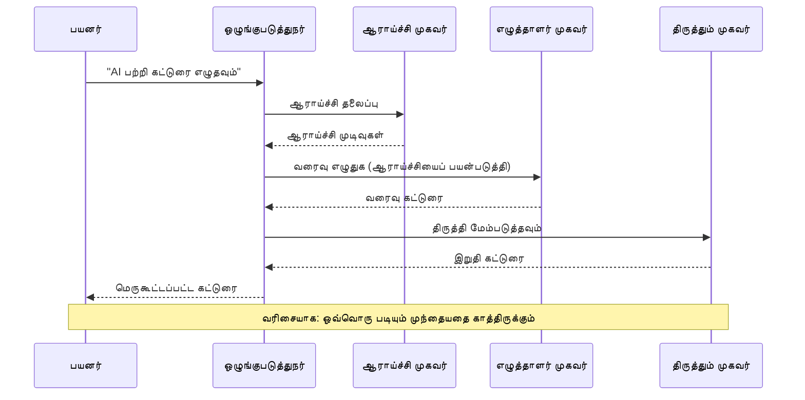
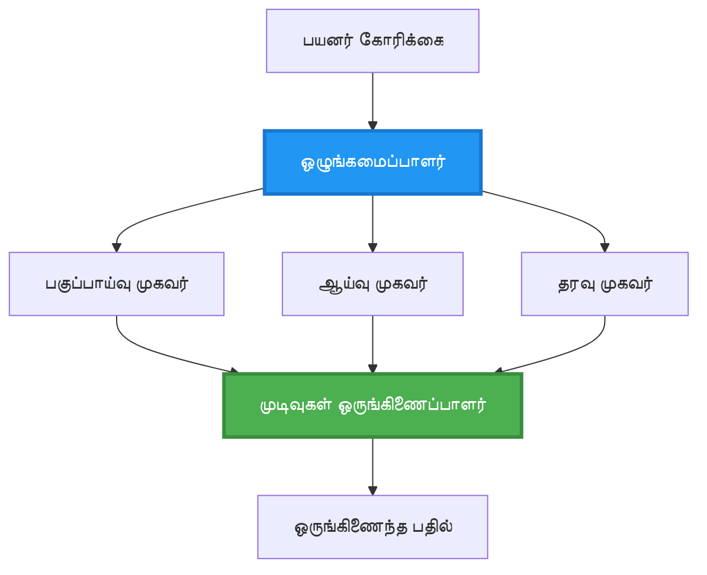
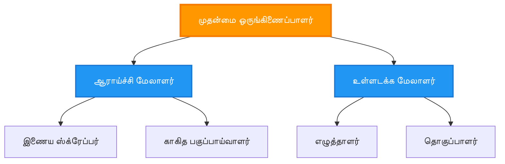
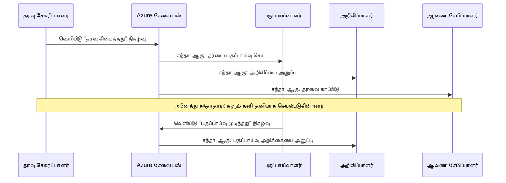
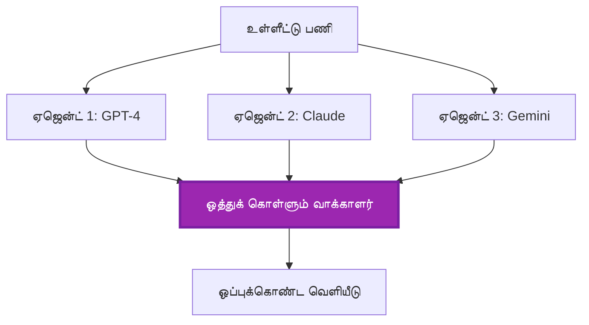
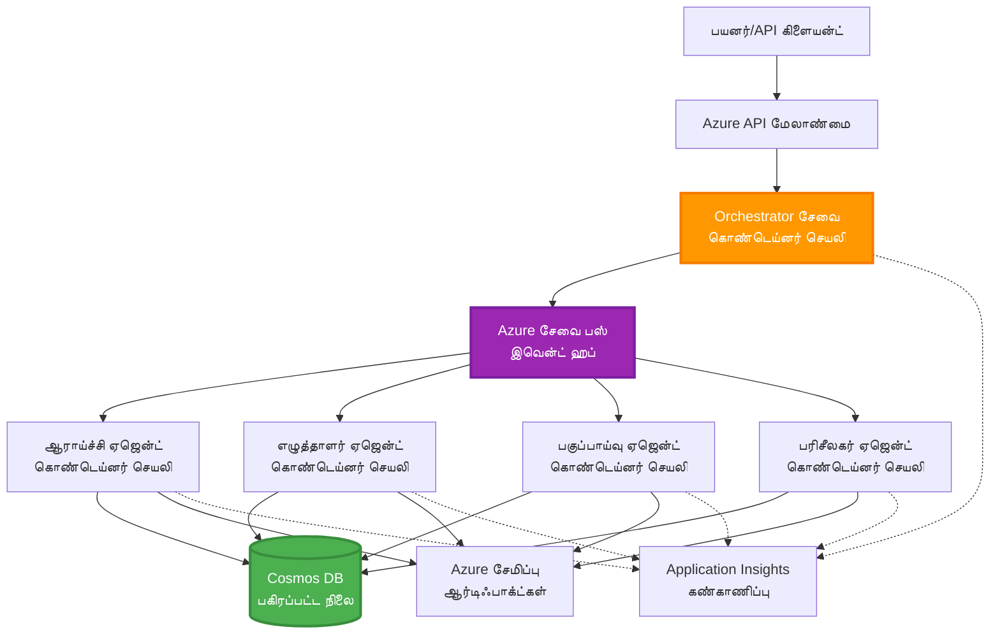

# பல-ஏஜென்ட் ஒருங்கிணைப்பு மாதிரிகள்

⏱️ **எடுத்துக்காட்டான நேரம்**: 60-75 நிமிடங்கள் | 💰 **எடுத்துக்காட்டான செலவு**: ~$100-300/மாதம் | ⭐ **சிக்கல் நிலை**: உயர்ந்தது

**📚 கற்றல் பாதை:**
- ← முந்தைய: [திறன் திட்டமிடல்](capacity-planning.md) - வளங்கள் அளவிடுதல் மற்றும் அளவைப் பெருக்குதல் உத்திகள்
- 🎯 **நீங்கள் இங்கே**: பல-ஏஜென்ட் ஒருங்கிணைப்பு மாதிரிகள் (ஒர்க்கஸ்ட்ரேஷன், தொடர்பு, நிலை மேலாண்மை)
- → அடுத்து: [SKU தேர்வு](sku-selection.md) - சரியான Azure சேவைகளை தேர்ந்தெடுப்பது
- 🏠 [பாடநெறி முகப்பு](../../README.md)

---

## நீங்கள் என்ன கற்றுக்கொள்வீர்கள்

இந்தப் பாடத்தினை முடித்தால், நீங்கள்:
- **பல-ஏஜென்ட் கட்டமைப்பு** மாதிரிகள் மற்றும் அவற்றை எப்போது பயன்படுத்துவது என்பதைப் புரிந்துகொண்டிருப்பீர்கள்
- **ஒர்க்கஸ்ட்ரேஷன் மாதிரிகள்** (மையமிட்டது, மையமில்லாதது, அடுக்குக்கட்டமைப்பு) ஐ அமல்படுத்துவீர்கள்
- **ஏஜென்ட் தொடர்பு** रणनीதிகள் (ஒத்திசைவு, ஒத்திசைவை இல்லாதது, நிகழ்வு சார்ந்தவை) வடிவமைப்பீர்கள்
- விநியோகிக்கப்பட்ட ஏஜென்டுகள் இடையே **பகிரப்பட்ட நிலையை** நிர்வகிப்பீர்கள்
- AZD உடன் Azure இல் **பல-ஏஜென்ட் அமைப்புகளை** despleய் செய்யப்படுவீர்கள்
- நிஜ உலக AI சூழல்களுக்கு **ஒத்துழைப்பு மாதிரிகளை** প্রয়োগிப்பீர்கள்
- விநியோகிக்கப்பட்ட ஏஜென்ட் அமைப்புகளை கண்காணித்து பிழைதிருத்துதல் கற்றுக்கொள்வீர்கள்

## ஏன் பல-ஏஜென்ட் ஒருங்கிணைப்பு முக்கியம்

### மேம்பாடு: ஒரே ஏஜென்டிலிருந்து பல-ஏஜென்டுக்கு

**ஒற்றை ஏஜென்ட் (எளியது):**
```
User → Agent → Response
```
- ✅ புரிந்துகொள்ளவும் அமல்படுத்தவும் எளிது
- ✅ எளிய பணிகளுக்கு விரைவு
- ❌ ஒற்றை மாடலின் திறனால் வரம்பு
- ❌ சிக்கலான பணிகளை இணையாக செயல்படுத்த முடியாது
- ❌ சிறப்பு நிபுணத்துவம் இல்லை

**பல-ஏஜென்ட் அமைப்பு (முன்னேறிய):**
```
           ┌─────────────┐
           │ Orchestrator│
           └──────┬──────┘
        ┌─────────┼─────────┐
        │         │         │
    ┌───▼──┐  ┌──▼───┐  ┌──▼────┐
    │Agent1│  │Agent2│  │Agent3 │
    │(Plan)│  │(Code)│  │(Review)│
    └──────┘  └──────┘  └───────┘
```
- ✅ குறிப்பிட்ட பணிகளுக்கான சிறப்பு ஏஜென்டுகள்
- ✅ வேகத்திற்காக ஒத்தநேர நிறைவு
- ✅ தொகுதியாக அமைந்திருக்கும் மற்றும் பராமரிக்க எளிது
- ✅ சிக்கலான பணிச்சுழற்சிகளில் சிறந்தது
- ⚠️ ஒருங்கிணைப்பு தர்க்கம் தேவை

**உரை**: ஒரே ஏஜென்ட் என்பது ஒரு நபர் எல்லா பணியையும் செய்வதைப் போன்றது. பல-ஏஜென்ட் என்பது ஒவ்வொருவரும் சிறப்புப் திறன்களை கொண்ட (ஆராய்ச்சியாளர், குறியீட்டாளர், மதிப்பாய்வாளர், எழுத்தாளர்) ஒரு குழு போல ஒன்றாக வேலை செய்கிறார்கள்.

---

## முக்கிய ஒருங்கிணைப்பு மாதிரிகள்

### மாதிரி 1: தொடர்ச்சியான ஒருங்கிணைப்பு (பொறுப்பு சங்கிலி)

**பயன்படுத்துவது எப்போது**: பணிகள் குறிப்பிட்ட வரிசையில் முடிக்கப்பட வேண்டும்; ஒவ்வொரு ஏஜென்டும் முந்தைய வெளியீட்டின் அடிப்படையில் கட்டமைக்கப்படும்.



**நன்மைகள்:**
- ✅ தரவு ஓட்டம் தெளிவானது
- ✅ பிழையறிதல் எளிது
- ✅ நிர்ணயிக்கப்பட்ட நிறைவேற்ற வரிசை

**வரம்புகள்:**
- ❌ மெதுவாகும் (ஒத்த செயல்பாடு இல்லை)
- ❌ ஒரு தோல்வி முழு சங்கிலியை முடக்குகிறது
- ❌ பரஸ்பர சார்ந்த பணிகளை கையாள முடியாது

**உதாரண பயன்பாடுகள்:**
- உள்ளடக்கம் உருவாக்கும் குழாய் (ஆராய்ச்சி → எழுது → திருத்து → வெளியிடு)
- குறியீடு உருவாக்கம் (திட்டமிடு → அமல்படுத்து → சோதனை → உருப்பாடு)
- அறிக்கை உருவாக்கம் (தரவிறக்கம் → பகுப்பாய்வு → காட்சிப்படுத்தல் → சுருக்கம்)

---

### மாதிரி 2: 병렬 ஒருங்கிணைப்பு (Fan-Out/Fan-In)

**பயன்படுத்துவது எப்போது**: சுதந்திர பணிகள் ஒன்றே நேரத்தில் இயங்க முடியும்; முடிவுகள் இறுதியில் ஒன்றிணைக்கப்படுகின்றன.


**நன்மைகள்:**
- ✅ வேகமாக (ஒத்தநேர நிறைவேற்று)
- ✅ தவறுகளுக்கு பொறுப்பானது (பகுதி முடிவுகள் ஏற்றுக்கொள்ளப்படும்)
- ✅ அளவில் الأفقي விரிவடையக்கூடியது

**வரம்புகள்:**
- ⚠️ முடிவுகள் வரிசை தவிர் வரலாம்
- ⚠️ ஒருங்கூட்டல் தர்க்கம் தேவை
- ⚠️ நிலை மேலாண்மை சிக்கலானது

**உதாரண பயன்பாடுகள்:**
- பல மூலங்களிலிருந்து தரவு சேகரிப்பு (APIs + தரவுத்தளங்கள் + வலை ஸ்கிரேப்பிங்)
- போட்டிப்போன்று பகுப்பாய்வு (பல மாடல்கள் தீர்வுகளை உருவாக்கி சிறந்தது தேர்வு செய்யப்படும்)
- மொழிபெயர்ப்பு சேவைகள் (பல மொழிகளுக்கு ஒரே நேரத்தில் மொழிபெயர்த்து)

---

### மாதிரி 3: அடுக்குமுறை ஒருங்கிணைப்பு (மேலாளர்-பணியாளர்)

**பயன்படுத்துவது எப்போது**: துணைப் பணிகளுடன் கூடிய சிக்கலான பணிச்சுழற்சிகள், делегேஷன் தேவைப்படும் போது.


**நன்மைகள்:**
- ✅ சிக்கலான பணிச்சுழற்சிகளை கையாளும்
- ✅ தொகுதி வடிவமைப்பு மற்றும் பராமரிக்கக்கூடியது
- ✅ பொறுப்புத் எல்லைகள் தெளிவு

**வரம்புகள்:**
- ⚠️ கட்டமைப்பு மேலும் சிக்கலாகும்
- ⚠️ உயர்ந்த தாமதம் (பல ஒருங்கிணைப்பு அடுக்குகள்)
- ⚠️ சிக்கலான ஒர்க்கஸ்ட்ரேஷன் தேவை

**உதாரண பயன்பாடுகள்:**
- நிறுவன ஆவணம் செயலாக்கம் (வகைப்படுத்து → வழிமாற்று → செயலாக்கு → காப்பகம்)
- பல கட்ட நடவடிக்கைகள் தரவு குழாய் (சமர்ப்பி → சுத்தம் → மாற்று → பகுப்பாய்வு → அறிக்கை)
- சிக்கலான தானியக்க பணிச் செயல்முறைகள் (திட்டமிடல் → வள ஒதுக்கம் → அமல்படுத்தல் → கண்காணிப்பு)

---

### மாதிரி 4: நிகழ்வு சார்ந்த ஒருங்கிணைப்பு (பப்ளிஷ்-சப்ஸ்க்ரைப்)

**பயன்படுத்துவது எப்போது**: ஏஜென்டுகள் நிகழவுகளைப் பதிலளிக்க வேண்டிய போது, இணைப்பு தளர்ந்திருப்பது விரும்பப்படும் போது.


**நன்மைகள்:**
- ✅ ஏஜென்டுகளுக்கு இடையில் தளர்ந்த இணைப்பு
- ✅ புதிய ஏஜென்டுகளை சேர்த்தெடுக்க எளிது (பதிவுசெய்தல் போதும்)
- ✅ ஒத்திசைவை இல்லாத செயலாக்கம்
- ✅ தரவின் நிலைத்தன்மை மூலம் இலக்கணத்தன்மை

**வரம்புகள்:**
- ⚠️ இறுதிக் குறிப்பில் ஒத்திசைவு (eventual consistency)
- ⚠️ பிழைதிருத்தம் சிக்கலானது
- ⚠️ செய்தி வரிசை சவால்கள்

**உதாரண பயன்பாடுகள்:**
- நேரடி கண்காணிப்பு அமைப்புகள் (எச்சரிக்கை, டாஷ்போர்டுகள், பதிவுகள்)
- பல-चெனல்அறிவிப்புகள் (மின்னஞ்சல், SMS, புஷ், Slack)
- தரவு செயலாக்க குழாய்கள் (ஒரே தரவிற்கான பல பயனர்கள்)

---

### மாதிரி 5: கருத்து-அடிப்படையிலான ஒருங்கிணைப்பு (வாக்களிப்பு/குவோரம்)

**பயன்படுத்துவது எப்போது**: தொடர்வதற்கு முன்னர் பல ஏஜென்டுகளிடமிருந்து ஒப்புதல் தேவைப்படும் போது.


**நன்மைகள்:**
- ✅ உயர்ந்த துல்லியம் (பல கருத்துகள்)
- ✅ தவறுகளுக்கு பொறுப்பானது (சிறு தொகுதி தோல்விகள் ஏற்றுக்கொள்ளக்கூடியவை)
- ✅ தர நிர்வாகம் அவுட்-ஆஃப்-தி பாக்ஸ்

**வரம்புகள்:**
- ❌ செலவானது (பல மாடல் அழைப்புகள்)
- ❌ மெதுவாகும் (எல்லா ஏஜென்டுகளின் பதிலுக்காக காத்திருக்கும்)
- ⚠️ மோதலை தீர்க்கும் நடைமுறை தேவை

**உதாரண பயன்பாடுகள்:**
- உள்ளடக்கம் மாதிரியாக்கம் (பல மாடல்கள் உள்ளடக்கத்தை மதிப்பீடு செய்கின்றன)
- குறியீடு சோதனை (பல லின்டர்கள்/பரிசோதகர்கள்)
- மருத்துவ تشخیص (பல AI மாடல்கள், நிபுணர் சரிபார்ப்பு)

---

## வடிவமைப்பு மேற்பார்வை

### Azure இல் முழுமையான பல-ஏஜென்ட் அமைப்பு


**முக்கிய கூறுகள்:**

| கூறு | நோக்கம் | Azure சேவை |
|-----------|---------|---------------|
| **API Gateway** | நுழைவு புள்ளி, விகிதக் கட்டுப்பாடு, அங்கீகாரம் | API Management |
| **Orchestrator** | ஏஜென்ட் பணிச்சுழற்சிகளை ஒருங்கிணைக்கிறது | Container Apps |
| **Message Queue** | ஒத்திசைக்காத தொடர்பு | Service Bus / Event Hubs |
| **Agents** | சிறப்பு AI பணியாளர்கள் | Container Apps / Functions |
| **State Store** | பகிரப்பட்ட நிலை, பணித் தொடக்க கண்காணிப்பு | Cosmos DB |
| **Artifact Storage** | ஆவணங்கள், முடிவுகள், பதிவுகள் | Blob Storage |
| **Monitoring** | விநியோகப்பட்ட டிரேசிங், பதிவுகள் | Application Insights |

---

## முன் தேவைகள்

### தேவைப்படும் கருவிகள்

```bash
# Azure Developer CLI ஐ சரிபார்க்கவும்
azd version
# ✅ எதிர்பார்க்கப்படுகிறது: azd பதிப்பு 1.0.0 அல்லது அதற்கு மேல்

# Azure CLI ஐ சரிபார்க்கவும்
az --version
# ✅ எதிர்பார்க்கப்படுகிறது: azure-cli பதிப்பு 2.50.0 அல்லது அதற்கு மேல்

# Docker ஐ (உள்ளூர் சோதனைகளுக்காக) சரிபார்க்கவும்
docker --version
# ✅ எதிர்பார்க்கப்படுகிறது: Docker பதிப்பு 20.10 அல்லது அதற்கு மேல்
```

### Azure தேவைகள்

- செயல்பாட்டில் இருக்கும் Azure subscription
- உருவாக்க அனுமதிகள்:
  - Container Apps
  - Service Bus namespaces
  - Cosmos DB accounts
  - Storage accounts
  - Application Insights

### அறிவுத் தேவைகள்

நீங்கள் முடித்திருக்க வேண்டியது:
- [கட்டமைப்பு மேலாண்மை](../chapter-03-configuration/configuration.md)
- [அங்கீகாரம் & பாதுகாப்பு](../chapter-03-configuration/authsecurity.md)
- [மைக்ரோசெர்விஸஸ் உதாரணம்](../../../../examples/microservices)

---

## செயலாக்க வழிகாட்டு

### திட்ட அமைப்பு

```
multi-agent-system/
├── azure.yaml                    # AZD configuration
├── infra/
│   ├── main.bicep               # Main infrastructure
│   ├── core/
│   │   ├── servicebus.bicep     # Message queue
│   │   ├── cosmos.bicep         # State store
│   │   ├── storage.bicep        # Artifact storage
│   │   └── monitoring.bicep     # Application Insights
│   └── app/
│       ├── orchestrator.bicep   # Orchestrator service
│       └── agent.bicep          # Agent template
└── src/
    ├── orchestrator/            # Orchestration logic
    │   ├── app.py
    │   ├── workflows.py
    │   └── Dockerfile
    ├── agents/
    │   ├── research/            # Research agent
    │   ├── writer/              # Writer agent
    │   ├── analyst/             # Analyst agent
    │   └── reviewer/            # Reviewer agent
    └── shared/
        ├── state_manager.py     # Shared state logic
        └── message_handler.py   # Message handling
```

---

## பாடம் 1: தொடர்ச்சியான ஒருங்கிணைப்பு மாதிரி

### செயல்படுத்தல்: உள்ளடக்கம் உருவாக்கும் குழாய்

ஒரு தொடர் குழாயை உருவாக்குவோம்: ஆராய்ச்சி → எழுது → திருத்து → வெளியிடு

### 1. AZD கட்டமைப்பு

**கோப்பு: `azure.yaml`**

```yaml
name: content-pipeline
metadata:
  template: multi-agent-sequential@1.0.0

services:
  orchestrator:
    project: ./src/orchestrator
    language: python
    host: containerapp
  
  research-agent:
    project: ./src/agents/research
    language: python
    host: containerapp
  
  writer-agent:
    project: ./src/agents/writer
    language: python
    host: containerapp
  
  editor-agent:
    project: ./src/agents/editor
    language: python
    host: containerapp
```

### 2. கட்டமைப்பு: ஒருங்கிணைப்புக்கான Service Bus

**கோப்பு: `infra/core/servicebus.bicep`**

```bicep
param name string
param location string
param tags object = {}

resource serviceBusNamespace 'Microsoft.ServiceBus/namespaces@2022-10-01-preview' = {
  name: name
  location: location
  tags: tags
  sku: {
    name: 'Standard'
    tier: 'Standard'
  }
  properties: {
    minimumTlsVersion: '1.2'
  }
}

// Queue for orchestrator → research agent
resource researchQueue 'Microsoft.ServiceBus/namespaces/queues@2022-10-01-preview' = {
  parent: serviceBusNamespace
  name: 'research-tasks'
  properties: {
    maxDeliveryCount: 3
    lockDuration: 'PT5M'
    deadLetteringOnMessageExpiration: true
  }
}

// Queue for research agent → writer agent
resource writerQueue 'Microsoft.ServiceBus/namespaces/queues@2022-10-01-preview' = {
  parent: serviceBusNamespace
  name: 'writer-tasks'
  properties: {
    maxDeliveryCount: 3
    lockDuration: 'PT5M'
  }
}

// Queue for writer agent → editor agent
resource editorQueue 'Microsoft.ServiceBus/namespaces/queues@2022-10-01-preview' = {
  parent: serviceBusNamespace
  name: 'editor-tasks'
  properties: {
    maxDeliveryCount: 3
    lockDuration: 'PT5M'
  }
}

output namespace string = serviceBusNamespace.name
output connectionString string = listKeys('${serviceBusNamespace.id}/AuthorizationRules/RootManageSharedAccessKey', serviceBusNamespace.apiVersion).primaryConnectionString
```

### 3. பகிரப்பட்ட நிலை மேலாளர்

**கோப்பு: `src/shared/state_manager.py`**

```python
from azure.cosmos import CosmosClient, PartitionKey
from datetime import datetime
import os

class StateManager:
    """Manages shared state across agents using Cosmos DB"""
    
    def __init__(self):
        endpoint = os.environ['COSMOS_ENDPOINT']
        key = os.environ['COSMOS_KEY']
        
        self.client = CosmosClient(endpoint, key)
        self.database = self.client.get_database_client('agent-state')
        self.container = self.database.get_container_client('tasks')
    
    def create_task(self, task_id: str, task_type: str, input_data: dict):
        """Create a new task"""
        task = {
            'id': task_id,
            'type': task_type,
            'status': 'pending',
            'input': input_data,
            'created_at': datetime.utcnow().isoformat(),
            'steps': []
        }
        self.container.create_item(task)
        return task
    
    def update_task_step(self, task_id: str, step_name: str, result: dict):
        """Update task with completed step"""
        task = self.container.read_item(task_id, partition_key=task_id)
        
        task['steps'].append({
            'name': step_name,
            'completed_at': datetime.utcnow().isoformat(),
            'result': result
        })
        
        self.container.replace_item(task_id, task)
        return task
    
    def complete_task(self, task_id: str, final_result: dict):
        """Mark task as complete"""
        task = self.container.read_item(task_id, partition_key=task_id)
        task['status'] = 'completed'
        task['result'] = final_result
        task['completed_at'] = datetime.utcnow().isoformat()
        self.container.replace_item(task_id, task)
        return task
    
    def get_task(self, task_id: str):
        """Retrieve task state"""
        return self.container.read_item(task_id, partition_key=task_id)
```

### 4. ஒர்க்கஸ்ட்ரேட்டர் சேவை

**கோப்பு: `src/orchestrator/app.py`**

```python
from flask import Flask, request, jsonify
from azure.servicebus import ServiceBusClient, ServiceBusMessage
import json
import uuid
import os
from shared.state_manager import StateManager

app = Flask(__name__)
state_manager = StateManager()

# சர்வீஸ் பஸ் இணைப்பு
servicebus_connection_str = os.environ['SERVICEBUS_CONNECTION_STRING']
servicebus_client = ServiceBusClient.from_connection_string(servicebus_connection_str)

@app.route('/health', methods=['GET'])
def health():
    return jsonify({'status': 'healthy', 'service': 'orchestrator'})

@app.route('/create-content', methods=['POST'])
def create_content():
    """
    Sequential workflow: Research → Write → Edit → Publish
    """
    data = request.json
    topic = data.get('topic')
    
    if not topic:
        return jsonify({'error': 'Topic required'}), 400
    
    # நிலைச் சேமிப்பகத்தில் ஒரு பணியை உருவாக்கு
    task_id = str(uuid.uuid4())
    task = state_manager.create_task(
        task_id=task_id,
        task_type='content_creation',
        input_data={'topic': topic}
    )
    
    # ஆராய்ச்சி ஏஜெண்டிற்கு செய்தி அனுப்பு (முதல் படி)
    sender = servicebus_client.get_queue_sender('research-tasks')
    message = ServiceBusMessage(
        body=json.dumps({
            'task_id': task_id,
            'topic': topic,
            'next_queue': 'writer-tasks'  # முடிவுகளை எங்கே அனுப்புவது
        }),
        content_type='application/json'
    )
    
    with sender:
        sender.send_messages(message)
    
    return jsonify({
        'task_id': task_id,
        'status': 'started',
        'workflow': 'sequential',
        'steps': ['research', 'write', 'edit', 'publish'],
        'message': 'Content creation pipeline initiated'
    }), 202

@app.route('/task/<task_id>', methods=['GET'])
def get_task_status(task_id):
    """Check task status"""
    try:
        task = state_manager.get_task(task_id)
        return jsonify(task)
    except Exception as e:
        return jsonify({'error': str(e)}), 404

if __name__ == '__main__':
    app.run(host='0.0.0.0', port=8080)
```

### 5. ஆராய்ச்சித் ஏஜென்ட்

**கோப்பு: `src/agents/research/app.py`**

```python
from azure.servicebus import ServiceBusClient, ServiceBusMessage
from openai import AzureOpenAI
import json
import os
import time
from shared.state_manager import StateManager

# கிளையண்டுகளை ஆரம்பிக்கவும்
state_manager = StateManager()
servicebus_client = ServiceBusClient.from_connection_string(
    os.environ['SERVICEBUS_CONNECTION_STRING']
)

openai_client = AzureOpenAI(
    api_key=os.environ['AZURE_OPENAI_API_KEY'],
    api_version="2024-02-01",
    azure_endpoint=os.environ['AZURE_OPENAI_ENDPOINT']
)

def process_research_task(message_data):
    """Process research request and pass to writer"""
    task_id = message_data['task_id']
    topic = message_data['topic']
    next_queue = message_data['next_queue']
    
    print(f"🔬 Researching: {topic}")
    
    # ஆராய்ச்சிக்காக Azure OpenAI-ஐ அழைக்கவும்
    response = openai_client.chat.completions.create(
        model="gpt-4",
        messages=[
            {"role": "system", "content": "You are a research assistant. Provide comprehensive research on the given topic."},
            {"role": "user", "content": f"Research this topic thoroughly: {topic}"}
        ],
        max_tokens=1500
    )
    
    research_results = response.choices[0].message.content
    
    # நிலையை புதுப்பிக்கவும்
    state_manager.update_task_step(
        task_id=task_id,
        step_name='research',
        result={'research': research_results}
    )
    
    # அடுத்த ஏஜென்டிற்கு (எழுத்தாளர்) அனுப்பவும்
    sender = servicebus_client.get_queue_sender(next_queue)
    message = ServiceBusMessage(
        body=json.dumps({
            'task_id': task_id,
            'topic': topic,
            'research': research_results,
            'next_queue': 'editor-tasks'
        }),
        content_type='application/json'
    )
    
    with sender:
        sender.send_messages(message)
    
    print(f"✅ Research complete for task {task_id}")

def main():
    """Listen to research queue"""
    receiver = servicebus_client.get_queue_receiver('research-tasks')
    
    print("🔬 Research Agent started, listening for tasks...")
    
    with receiver:
        while True:
            messages = receiver.receive_messages(max_wait_time=5)
            for message in messages:
                try:
                    message_data = json.loads(str(message))
                    process_research_task(message_data)
                    receiver.complete_message(message)
                except Exception as e:
                    print(f"❌ Error processing message: {e}")
                    receiver.abandon_message(message)

if __name__ == '__main__':
    main()
```

### 6. எழுத்தாளர் ஏஜென்ட்

**கோப்பு: `src/agents/writer/app.py`**

```python
from azure.servicebus import ServiceBusClient, ServiceBusMessage
from openai import AzureOpenAI
import json
import os
from shared.state_manager import StateManager

state_manager = StateManager()
servicebus_client = ServiceBusClient.from_connection_string(
    os.environ['SERVICEBUS_CONNECTION_STRING']
)

openai_client = AzureOpenAI(
    api_key=os.environ['AZURE_OPENAI_API_KEY'],
    api_version="2024-02-01",
    azure_endpoint=os.environ['AZURE_OPENAI_ENDPOINT']
)

def process_writing_task(message_data):
    """Write article based on research"""
    task_id = message_data['task_id']
    topic = message_data['topic']
    research = message_data['research']
    next_queue = message_data['next_queue']
    
    print(f"✍️ Writing article: {topic}")
    
    # கட்டுரை எழுத Azure OpenAI-ஐ அழைக்கவும்
    response = openai_client.chat.completions.create(
        model="gpt-4",
        messages=[
            {"role": "system", "content": "You are a professional writer. Write engaging, well-structured articles."},
            {"role": "user", "content": f"Based on this research:\n\n{research}\n\nWrite a comprehensive article about: {topic}"}
        ],
        max_tokens=2000
    )
    
    article_draft = response.choices[0].message.content
    
    # நிலையை புதுப்பிக்கவும்
    state_manager.update_task_step(
        task_id=task_id,
        step_name='writing',
        result={'draft': article_draft}
    )
    
    # திருத்துநருக்கு அனுப்பவும்
    sender = servicebus_client.get_queue_sender(next_queue)
    message = ServiceBusMessage(
        body=json.dumps({
            'task_id': task_id,
            'topic': topic,
            'draft': article_draft
        }),
        content_type='application/json'
    )
    
    with sender:
        sender.send_messages(message)
    
    print(f"✅ Article draft complete for task {task_id}")

def main():
    """Listen to writer queue"""
    receiver = servicebus_client.get_queue_receiver('writer-tasks')
    
    print("✍️ Writer Agent started, listening for tasks...")
    
    with receiver:
        while True:
            messages = receiver.receive_messages(max_wait_time=5)
            for message in messages:
                try:
                    message_data = json.loads(str(message))
                    process_writing_task(message_data)
                    receiver.complete_message(message)
                except Exception as e:
                    print(f"❌ Error: {e}")
                    receiver.abandon_message(message)

if __name__ == '__main__':
    main()
```

### 7. ஆசிரியர் ஏஜென்ட்

**கோப்பு: `src/agents/editor/app.py`**

```python
from azure.servicebus import ServiceBusClient
from openai import AzureOpenAI
import json
import os
from shared.state_manager import StateManager

state_manager = StateManager()
servicebus_client = ServiceBusClient.from_connection_string(
    os.environ['SERVICEBUS_CONNECTION_STRING']
)

openai_client = AzureOpenAI(
    api_key=os.environ['AZURE_OPENAI_API_KEY'],
    api_version="2024-02-01",
    azure_endpoint=os.environ['AZURE_OPENAI_ENDPOINT']
)

def process_editing_task(message_data):
    """Edit and finalize article"""
    task_id = message_data['task_id']
    topic = message_data['topic']
    draft = message_data['draft']
    
    print(f"📝 Editing article: {topic}")
    
    # திருத்தம் செய்ய Azure OpenAI-ஐ அழைக்கவும்
    response = openai_client.chat.completions.create(
        model="gpt-4",
        messages=[
            {"role": "system", "content": "You are an expert editor. Improve grammar, clarity, and structure."},
            {"role": "user", "content": f"Edit and improve this article:\n\n{draft}"}
        ],
        max_tokens=2000
    )
    
    final_article = response.choices[0].message.content
    
    # பணியை முடிந்ததாக குறிக்கவும்
    state_manager.complete_task(
        task_id=task_id,
        final_result={
            'topic': topic,
            'final_article': final_article,
            'word_count': len(final_article.split())
        }
    )
    
    print(f"✅ Article finalized for task {task_id}")

def main():
    """Listen to editor queue"""
    receiver = servicebus_client.get_queue_receiver('editor-tasks')
    
    print("📝 Editor Agent started, listening for tasks...")
    
    with receiver:
        while True:
            messages = receiver.receive_messages(max_wait_time=5)
            for message in messages:
                try:
                    message_data = json.loads(str(message))
                    process_editing_task(message_data)
                    receiver.complete_message(message)
                except Exception as e:
                    print(f"❌ Error: {e}")
                    receiver.abandon_message(message)

if __name__ == '__main__':
    main()
```

### 8. அமல்படுத்தி சோதனை

```bash
# துவக்கவும் மற்றும் வெளியிடவும்
azd init
azd up

# ஒர்கெஸ்ட்ரேட்டரின் URL ஐ பெறவும்
ORCHESTRATOR_URL=$(azd env get-values | grep ORCHESTRATOR_URL | cut -d '=' -f2 | tr -d '"')

# உள்ளடக்கத்தை உருவாக்கவும்
curl -X POST $ORCHESTRATOR_URL/create-content \
  -H "Content-Type: application/json" \
  -d '{"topic": "The Future of AI in Healthcare"}'
```

**✅ எதிர்பார்க்கப்படும் வெளியீடு:**
```json
{
  "task_id": "a1b2c3d4-e5f6-7890-abcd-ef1234567890",
  "status": "started",
  "workflow": "sequential",
  "steps": ["research", "write", "edit", "publish"],
  "message": "Content creation pipeline initiated"
}
```

**பணியின் முன்னேற்றத்தைச் சரிபார்க்கவும்:**
```bash
TASK_ID="a1b2c3d4-e5f6-7890-abcd-ef1234567890"
curl $ORCHESTRATOR_URL/task/$TASK_ID
```

**✅ எதிர்பார்க்கப்படும் வெளியீடு (முடிந்தது):**
```json
{
  "id": "a1b2c3d4-e5f6-7890-abcd-ef1234567890",
  "type": "content_creation",
  "status": "completed",
  "steps": [
    {
      "name": "research",
      "completed_at": "2025-11-19T10:30:00Z",
      "result": {"research": "..."}
    },
    {
      "name": "writing",
      "completed_at": "2025-11-19T10:32:00Z",
      "result": {"draft": "..."}
    }
  ],
  "result": {
    "topic": "The Future of AI in Healthcare",
    "final_article": "...",
    "word_count": 1500
  }
}
```

---

## பாடம் 2: பரலல் ஒருங்கிணைப்பு மாதிரி

### செயல்படுத்தல்: பல மூல ஆய்வு தொகுப்பாளர்

பல மூலங்களிலிருந்து தகவல்களை ஒரே நேரத்தில் சேகரிக்கும் ஒரு பரலல் அமைப்பை உருவாக்குவோம்.

### Parallel Orchestrator

**கோப்பு: `src/orchestrator/parallel_workflow.py`**

```python
from flask import Flask, request, jsonify
from azure.servicebus import ServiceBusClient, ServiceBusMessage
import json
import uuid
import os
from shared.state_manager import StateManager

app = Flask(__name__)
state_manager = StateManager()

servicebus_client = ServiceBusClient.from_connection_string(
    os.environ['SERVICEBUS_CONNECTION_STRING']
)

@app.route('/research-parallel', methods=['POST'])
def research_parallel():
    """
    Parallel workflow: Multiple agents work simultaneously
    """
    data = request.json
    query = data.get('query')
    
    task_id = str(uuid.uuid4())
    task = state_manager.create_task(
        task_id=task_id,
        task_type='parallel_research',
        input_data={
            'query': query,
            'agents': ['web', 'academic', 'news', 'social']
        }
    )
    
    # அனைத்து ஏஜென்ட்களுக்கும் ஒரே நேரத்தில் அனுப்பவும்
    agents = [
        ('web-research-queue', 'web'),
        ('academic-research-queue', 'academic'),
        ('news-research-queue', 'news'),
        ('social-research-queue', 'social')
    ]
    
    for queue_name, agent_type in agents:
        sender = servicebus_client.get_queue_sender(queue_name)
        message = ServiceBusMessage(
            body=json.dumps({
                'task_id': task_id,
                'query': query,
                'agent_type': agent_type,
                'result_queue': 'aggregation-queue'
            }),
            content_type='application/json'
        )
        
        with sender:
            sender.send_messages(message)
    
    return jsonify({
        'task_id': task_id,
        'status': 'started',
        'workflow': 'parallel',
        'agents_dispatched': 4,
        'message': 'Parallel research initiated'
    }), 202

if __name__ == '__main__':
    app.run(host='0.0.0.0', port=8080)
```

###Aggregation Logic

**கோப்பு: `src/agents/aggregator/app.py`**

```python
from azure.servicebus import ServiceBusClient
import json
import os
from collections import defaultdict
from shared.state_manager import StateManager

state_manager = StateManager()
servicebus_client = ServiceBusClient.from_connection_string(
    os.environ['SERVICEBUS_CONNECTION_STRING']
)

# ஒவ்வொரு பணிக்குமான முடிவுகளை கண்காணிக்கவும்
task_results = defaultdict(list)
expected_agents = 4  # இணையம், கல்வி, செய்திகள், சமூக

def process_result(message_data):
    """Aggregate results from parallel agents"""
    task_id = message_data['task_id']
    agent_type = message_data['agent_type']
    result = message_data['result']
    
    # முடிவை சேமிக்கவும்
    task_results[task_id].append({
        'agent': agent_type,
        'data': result
    })
    
    print(f"📊 Received result from {agent_type} agent ({len(task_results[task_id])}/{expected_agents})")
    
    # எல்லா ஏஜென்ட்களும் முடித்துள்ளதா என்பதைச் சரிபார்க்கவும் (fan-in)
    if len(task_results[task_id]) == expected_agents:
        print(f"✅ All agents completed for task {task_id}. Aggregating...")
        
        # முடிவுகளை ஒருங்கிணைக்கவும்
        aggregated = {
            'query': message_data['query'],
            'sources': task_results[task_id],
            'summary': generate_summary(task_results[task_id])
        }
        
        # முடிந்ததாக குறிக்கவும்
        state_manager.complete_task(task_id, aggregated)
        
        # சுத்தம் செய்யவும்
        del task_results[task_id]
        
        print(f"✅ Aggregation complete for task {task_id}")

def generate_summary(results):
    """Generate summary from all sources"""
    summaries = [r['data'].get('summary', '') for r in results]
    return '\n\n'.join(summaries)

def main():
    """Listen to aggregation queue"""
    receiver = servicebus_client.get_queue_receiver('aggregation-queue')
    
    print("📊 Aggregator started, listening for results...")
    
    with receiver:
        while True:
            messages = receiver.receive_messages(max_wait_time=5)
            for message in messages:
                try:
                    message_data = json.loads(str(message))
                    process_result(message_data)
                    receiver.complete_message(message)
                except Exception as e:
                    print(f"❌ Error: {e}")
                    receiver.abandon_message(message)

if __name__ == '__main__':
    main()
```

**பரவல் மாதிரியின் நன்மைகள்:**
- ⚡ **4x வேகமாக** (ஏஜென்ட் ஒன்றே நேரத்தில் இயங்கும்)
- 🔄 **தவறுகள் பொறுப்பீடு** (பகுதி முடிவுகள் ஏற்றுக்கொள்ளப்படலாம்)
- 📈 **அளவிடக்கூடியது** (மேலும் ஏஜென்டுகளை எளிதாக சேர்க்கலாம்)

---

## நடைமுறை பயிற்சிகள்

### பயிற்சி 1: Timeout கையாளுதலைச் சேர்க்கவும் ⭐⭐ (இடைநிலை)

**நோக்கம்**: aggregartor மெதுவாக இருக்கும் ஏஜென்டுகளுக்காக எப்போதும் காத்திருக்காமலிருக்க timeout தர்க்கத்தை செயல்படுத்துதல்.

**படி பட்டியல்**:

1. **aggregator இல் timeout கண்காணிப்பைச் சேர்க்கவும்:**

```python
from datetime import datetime, timedelta

task_timeouts = {}  # பணி_அடையாளம் -> காலாவதி_நேரம்

def process_result(message_data):
    task_id = message_data['task_id']
    
    # முதல் முடிவுக்கு நேர வரம்பை அமைக்க
    if task_id not in task_timeouts:
        task_timeouts[task_id] = datetime.utcnow() + timedelta(seconds=30)
    
    task_results[task_id].append({
        'agent': message_data['agent_type'],
        'data': message_data['result']
    })
    
    # முழுமையானதா அல்லது காலாவதியாகியதா என்பதை சரிபார்க்க
    if len(task_results[task_id]) == expected_agents or \
       datetime.utcnow() > task_timeouts[task_id]:
        
        print(f"📊 Aggregating with {len(task_results[task_id])}/{expected_agents} results")
        
        aggregated = {
            'query': message_data['query'],
            'sources': task_results[task_id],
            'completed_agents': len(task_results[task_id]),
            'timed_out': len(task_results[task_id]) < expected_agents
        }
        
        state_manager.complete_task(task_id, aggregated)
        
        # சுத்தப்படுத்துதல்
        del task_results[task_id]
        del task_timeouts[task_id]
```

2. **செயற்கை தாமதங்களை கொண்டு சோதிக்கவும்:**

```python
# ஒரு ஏஜெண்டில், மந்தமான செயலாக்கத்தை மாதிரிப்படுத்த தாமதம் சேர்க்கவும்
import time
time.sleep(35)  # 30 விநாடி காலவெளியை மீறுகிறது
```

3. **பயன்படுத்து மற்றும் சரிபார்க்கவும்:**

```bash
azd deploy aggregator

# பணியை சமர்ப்பிக்கவும்
curl -X POST $ORCHESTRATOR_URL/research-parallel \
  -H "Content-Type: application/json" \
  -d '{"query": "AI safety research"}'

# 30 விநாடிகளுக்குப் பிறகு முடிவுகளை சரிபாரிக்கவும்
curl $ORCHESTRATOR_URL/task/$TASK_ID
```

**✅ வெற்றி அளவுகோல்கள்:**
- ✅ ஏஜென்டுகள் முழுமையற்றிருந்தாலும் 30 வினாடிகளுக்குப் பிறகு பணி முடிவடையும்
- ✅ பதில் பகுதி முடிவுகளை குறிக்கும் (`"timed_out": true`)
- ✅ கிடைக்கும் முடிவுகள் திருப்பி வழங்கப்படுகின்றன (4 இல் 3 ஏஜென்டுகள்)

**நேரம்**: 20-25 நிமிடங்கள்

---

### பயிற்சி 2: Retry தர்க்கத்தை அமல்படுத்தவும் ⭐⭐⭐ (முன்னேறிய)

**நோக்கம்**: தோல்வியடைந்த ஏஜென்ட் பணிகளை கைவிடும் முன் தானாக மறுபயற்சிகளை செய்யவும்.

**படி பட்டியல்**:

1. **ஒற்க்ஸ்ட்ரேட்டரில் retry கண்காணிப்பைச் சேர்க்கவும்:**

```python
from dataclasses import dataclass
from typing import Dict

@dataclass
class RetryConfig:
    max_retries: int = 3
    backoff_seconds: int = 5

retry_counts: Dict[str, int] = {}  # செய்தி_அடையாளம் -> மீள்முயற்சி_எண்ணிக்கை

def send_with_retry(queue_name: str, message_data: dict, retry_config: RetryConfig):
    """Send message with retry metadata"""
    message_id = message_data.get('message_id', str(uuid.uuid4()))
    message_data['message_id'] = message_id
    message_data['retry_count'] = retry_counts.get(message_id, 0)
    message_data['max_retries'] = retry_config.max_retries
    
    sender = servicebus_client.get_queue_sender(queue_name)
    message = ServiceBusMessage(
        body=json.dumps(message_data),
        content_type='application/json',
        message_id=message_id
    )
    
    with sender:
        sender.send_messages(message)
```

2. **ஏஜென்ட்களில் retry ஹேண்ட்லரைச் சேர்க்கவும்:**

```python
def process_with_retry(message, receiver, process_func):
    """Process message with automatic retry on failure"""
    try:
        message_data = json.loads(str(message))
        
        # செய்தியை செயலாக்கு
        process_func(message_data)
        
        # வெற்றி - முடிந்தது
        receiver.complete_message(message)
        
    except Exception as e:
        message_id = message.message_id
        retry_count = message_data.get('retry_count', 0)
        max_retries = message_data.get('max_retries', 3)
        
        if retry_count < max_retries:
            # மீண்டும் முயற்சி: விட்டு வைக்கவும் மற்றும் எண்ணிக்கையை அதிகரித்து மீண்டும் வரிசையில் சேர்க்கவும்
            print(f"⚠️ Retry {retry_count + 1}/{max_retries} for message {message_id}")
            
            message_data['retry_count'] = retry_count + 1
            
            # அதே வரிசைக்கு தாமதத்துடன் அனுப்பவும்
            time.sleep(5 * (retry_count + 1))  # எக்ஸ்போனென்ஷியல் பின்தள்ளல்
            send_with_retry(queue_name, message_data, RetryConfig())
            
            receiver.complete_message(message)  # மூலத்தை அகற்று
        else:
            # அதிகபட்ச மீண்டும் முயற்சிகள் மீறியுள்ளன - இறந்த கடித வரிசைக்கு நகர்த்தவும்
            print(f"❌ Max retries exceeded for message {message_id}")
            receiver.dead_letter_message(
                message,
                reason="MaxRetriesExceeded",
                error_description=str(e)
            )
```

3. **dead letter queue ஐ கண்காணிக்கவும்:**

```python
def monitor_dead_letters():
    """Check dead letter queue for failed messages"""
    receiver = servicebus_client.get_queue_receiver(
        'research-queue',
        sub_queue='deadletter'
    )
    
    with receiver:
        messages = receiver.receive_messages(max_wait_time=5)
        for message in messages:
            print(f"☠️ Dead letter: {message.message_id}")
            print(f"Reason: {message.dead_letter_reason}")
            print(f"Description: {message.dead_letter_error_description}")
```

**✅ வெற்றி அளவுகோல்கள்:**
- ✅ தோல்வியடைந்த பணிகள் தானாக மறுபயிற்சி செய்யப்படும் (அதிகம் 3 முறை வரை)
- ✅ மறுபயிற்சிகளுக்கு இடையில் உயர்ந்த விகிதமான பின்னடைவு (5s, 10s, 15s)
- ✅ அதிகபட்ச retry பிறகு, செய்திகள் dead letter queue க்கு செல்கின்றன
- ✅ dead letter queue கண்காணிக்கவும் மறுகிடைக்கும் திறன் உள்ளது

**நேரம்**: 30-40 நிமிடங்கள்

---

### பயிற்சி 3: Circuit Breaker ஐ செயல்படுத்தவும் ⭐⭐⭐ (முன்னேறிய)

**நோக்கம்**: தோல்வி அடிக்கடி நிகழும்போது ஒற்றை ஏஜென்டுக்கு கோரிக்கைகளை நிறுத்தி சங்கிலி தோல்விகளைத் தடுக்க circuit breaker ஐ உருவாக்குதல்.

**படி பட்டியல்**:

1. **circuit breaker வகுப்பை உருவாக்கவும்:**

```python
from enum import Enum
from datetime import datetime, timedelta

class CircuitState(Enum):
    CLOSED = "closed"      # சாதாரண செயல்பாடு
    OPEN = "open"          # தோல்வி நிலையில், கோரிக்கைகளை நிராகரிக்கவும்
    HALF_OPEN = "half_open"  # மீண்டியதா என்பதை சோதிக்கவும்

class CircuitBreaker:
    def __init__(self, failure_threshold=5, timeout_seconds=60):
        self.failure_threshold = failure_threshold
        self.timeout_seconds = timeout_seconds
        self.failure_count = 0
        self.last_failure_time = None
        self.state = CircuitState.CLOSED
    
    def call(self, func):
        """Execute function with circuit breaker protection"""
        if self.state == CircuitState.OPEN:
            # டைம்அவுட் காலம் முடிந்ததா என்பதைச் சரிபார்க்கவும்
            if datetime.utcnow() - self.last_failure_time > timedelta(seconds=self.timeout_seconds):
                self.state = CircuitState.HALF_OPEN
                print("🔄 Circuit breaker: HALF_OPEN (testing)")
            else:
                raise Exception(f"Circuit breaker OPEN for agent. Try again in {self.timeout_seconds}s")
        
        try:
            result = func()
            
            # வெற்றி
            if self.state == CircuitState.HALF_OPEN:
                self.state = CircuitState.CLOSED
                self.failure_count = 0
                print("✅ Circuit breaker: CLOSED (recovered)")
            
            return result
            
        except Exception as e:
            self.failure_count += 1
            self.last_failure_time = datetime.utcnow()
            
            if self.failure_count >= self.failure_threshold:
                self.state = CircuitState.OPEN
                print(f"🔴 Circuit breaker: OPEN (too many failures)")
            
            raise e
```

2. **ஏஜென்ட் அழைப்புகளில் பயன்படுத்தவும்:**

```python
# ஆர்கெஸ்ட்ரேட்டரில்
agent_circuits = {
    'web': CircuitBreaker(failure_threshold=5, timeout_seconds=60),
    'academic': CircuitBreaker(failure_threshold=5, timeout_seconds=60),
    'news': CircuitBreaker(failure_threshold=5, timeout_seconds=60),
    'social': CircuitBreaker(failure_threshold=5, timeout_seconds=60)
}

def send_to_agent(agent_type, message_data):
    """Send with circuit breaker protection"""
    circuit = agent_circuits[agent_type]
    
    try:
        circuit.call(lambda: send_message(agent_type, message_data))
    except Exception as e:
        print(f"⚠️ Skipping {agent_type} agent: {e}")
        # மற்ற ஏஜென்ட்களுடன் தொடரவும்
```

3. **circuit breaker ஐ சோதிக்கவும்:**

```bash
# மீண்டும் மீண்டும் தோல்விகளை சிமுலேட் செய்யவும் (ஒரு ஏஜெண்டை நிறுத்தவும்)
az containerapp stop --name web-research-agent --resource-group rg-agents

# பல கோரிக்கைகளை அனுப்பவும்
for i in {1..10}; do
  curl -X POST $ORCHESTRATOR_URL/research-parallel \
    -H "Content-Type: application/json" \
    -d '{"query": "test query '$i'"}'
  sleep 2
done

# பதிவுகளை சரிபார்க்கவும் - 5 தோல்விகளுக்குப் பிறகு சர்க்கெட் திறந்துவிடுவதை காண வேண்டும்
# Container App பதிவுகளுக்கு Azure CLI ஐ பயன்படுத்தவும்:
az containerapp logs show --name orchestrator --resource-group $RG_NAME --tail 50
```

**✅ வெற்றி அளவுகோல்கள்:**
- ✅ 5 தோல்விகளுக்குப் பிறகு circuit திறக்கப்படும் (கோரிக்கைகளை நிராகரிக்கும்)
- ✅ 60 வினாடிகள் கழித்தால் circuit ஒரு அரை-திறப்பு நிலைக்கு வந்து மீட்பை சோதிக்கும்
- ✅ மற்ற ஏஜென்டுகள் சாதாரணமாகவே தொடர்ந்தும் செயல்படுகின்றன
- ✅ ஏஜென்ட் மீண்டதும் circuit தானாக மூடப்படும்

**நேரம்**: 40-50 நிமிடங்கள்

---

## கண்காணிப்பு மற்றும் பிழைதிருத்தல்

### Application Insights மூலம் விநியோகப்பட்ட டிரேசிங்

**கோப்பு: `src/shared/tracing.py`**

```python
from opencensus.ext.azure.log_exporter import AzureLogHandler
from opencensus.ext.azure.trace_exporter import AzureExporter
from opencensus.trace import config_integration
from opencensus.trace.tracer import Tracer
from opencensus.trace.samplers import AlwaysOnSampler
import logging
import os

# டிரேசிங்கை கட்டமைக்கவும்
config_integration.trace_integrations(['requests', 'logging'])

connection_string = os.environ.get('APPLICATIONINSIGHTS_CONNECTION_STRING')

# டிரேசரை உருவாக்கவும்
tracer = Tracer(
    exporter=AzureExporter(connection_string=connection_string),
    sampler=AlwaysOnSampler()
)

# லாகிங்கை கட்டமைக்கவும்
logger = logging.getLogger(__name__)
logger.addHandler(AzureLogHandler(connection_string=connection_string))
logger.setLevel(logging.INFO)

def trace_agent_call(agent_name, task_id, operation):
    """Trace agent operations"""
    with tracer.span(name=f'{agent_name}.{operation}') as span:
        span.add_attribute('agent', agent_name)
        span.add_attribute('task_id', task_id)
        span.add_attribute('operation', operation)
        
        try:
            result = operation()
            span.add_attribute('status', 'success')
            return result
        except Exception as e:
            span.add_attribute('status', 'error')
            span.add_attribute('error', str(e))
            raise
```

### Application Insights கேள்விகள்

**பல-ஏஜென்ட் பணிச்சுழற்சிகளை கண்காணிக்க:**

```kusto
// Trace complete workflow for a task
traces
| where customDimensions.task_id == "a1b2c3d4-..."
| project timestamp, message, customDimensions.agent, customDimensions.operation
| order by timestamp asc
```

**ஏஜென்ட் செயல்திறன் ஒப்புமை:**

```kusto
// Compare agent execution times
dependencies
| where name contains "agent"
| summarize 
    avg_duration = avg(duration),
    p95_duration = percentile(duration, 95),
    count = count()
  by agent = tostring(customDimensions.agent)
| order by avg_duration desc
```

**தோல்வி பகுப்பாய்வு:**

```kusto
// Find which agents fail most
exceptions
| where customDimensions.agent != ""
| summarize 
    failure_count = count(),
    unique_errors = dcount(outerMessage)
  by agent = tostring(customDimensions.agent)
| order by failure_count desc
```

---

## செலவு பகுப்பாய்வு

### பல-ஏஜென்ட் அமைப்பு செலவுகள் (மாதாந்திர மதிப்பீடுகள்)

| கூறு | கட்டமைப்பு | செலவு |
|-----------|--------------|------|
| **Orchestrator** | 1 Container App (1 vCPU, 2GB) | $30-50 |
| **4 Agents** | 4 Container Apps (0.5 vCPU, 1GB each) | $60-120 |
| **Service Bus** | Standard tier, 10M messages | $10-20 |
| **Cosmos DB** | Serverless, 5GB storage, 1M RUs | $25-50 |
| **Blob Storage** | 10GB storage, 100K operations | $5-10 |
| **Application Insights** | 5GB ingestion | $10-15 |
| **Azure OpenAI** | GPT-4, 10M tokens | $100-300 |
| **மொத்தம்** | | **$240-565/மாதம்** |

### செலவு மிச்சப்படுத்தும் தந்திரங்கள்

1. **சாத்தியமான இடங்களில் serverless ஐ பயன்படுத்தவும்:**
   ```bicep
   // Cosmos DB serverless (no minimum cost)
   properties: {
     databaseAccountOfferType: 'Standard'
     capabilities: [{ name: 'EnableServerless' }]
   }
   ```

2. **ஏஜென்டுகளை idle இருக்கும் போது பூஜ்யத்துக்கு அளவை மாற்றவும்:**
   ```bicep
   scale: {
     minReplicas: 0  // Scale to zero when no messages
     maxReplicas: 10
   }
   ```

3. **Service Bus க்கு பேட்சிங் பயன்படுத்தவும்:**
   ```python
   # செய்திகளை தொகுதியாக அனுப்பவும் (குறைந்த செலவு)
   sender.send_messages([message1, message2, message3])
   ```

4. **அடிக்கடி பயன்படும் முடிவுகளை கேஷ் செய்யவும்:**
   ```python
   # Azure Cache for Redis ஐப் பயன்படுத்தவும்
   if cache.exists(query_hash):
       return cache.get(query_hash)
   ```

---

## சிறந்த நடைமுறைகள்

### ✅ செய்யவேண்டியது:

1. **மறுநடமை (idempotent) செயல்பாடுகளைப் பயன்படுத்தவும்**
   ```python
   # ஏஜென்ட் ஒரே செய்தியை பலமுறை பாதுகாப்பாக செயலாக்கலாம்
   def process_task(task_id):
       if state_manager.task_exists(task_id):
           print(f"Task {task_id} already processed, skipping")
           return
       # பணியை செயலாக்குகிறேன்...
   ```

2. **விரிவான லாகிங் அமைப்பை செயல்படுத்தவும்**
   ```python
   logger.info(f"Agent: {agent_name}, Task: {task_id}, Action: {action}")
   ```

3. **பிணைப்பு ID களை (correlation IDs) பயன்படுத்தவும்**
   ```python
   # task_id ஐ முழு வேலை ஓட்டத்தின் வழியாக கடத்தவும்
   message_data = {
       'task_id': task_id,  # ஒத்திசைப்பு அடையாளம்
       'timestamp': datetime.utcnow().isoformat()
   }
   ```

4. **செய்திகளுக்கான TTL (time-to-live) அமைக்கவும்**
   ```bicep
   properties: {
     defaultMessageTimeToLive: 'PT1H'  // 1 hour max
   }
   ```

5. **dead letter queues களை கண்காணிக்கவும்**
   ```python
   # தோல்வியடைந்த செய்திகள் பற்றிய சீரான கண்காணிப்பு
   monitor_dead_letters()
   ```

### ❌ செய்ய வேண்டாம்:

1. **சுழற்சி சார்ந்த சார்புகளை (circular dependencies) உருவாக்காதீர்கள்**
   ```python
   # ❌ தவறு: ஏஜென்ட் A → ஏஜென்ட் B → ஏஜென்ட் A (முடிவற்ற சுற்று)
   # ✅ நல்லது: தெளிவான திசைபடுத்தப்பட்ட சுழற்சி இல்லா வரைபடத்தை (DAG) வரையுங்கள்
   ```

2. **ஏஜென்ட் த்ரெட்களை தடுத்துவிடாதீர்கள்**
   ```python
   # ❌ தவறு: ஒத்திசை காத்திருத்தல்
   while not task_complete:
       time.sleep(1)
   
   # ✅ நல்லது: செய்தி வரிசை கால்பேக்குகளை பயன்படுத்தவும்
   ```

3. **பகுதி தோல்விகளை புறக்கணிக்காதீர்கள்**
   ```python
   # ❌ மோசம்: ஒரு ஏஜென்ட் தோல்வியடைந்தால் முழு வேலைநடை தோல்வியாகும்
   # ✅ நல்லது: பிழை குறியீடுகளுடன் பகுதி முடிவுகளை திருப்பி வழங்கவும்
   ```

4. **முடிவில்லா மறுபயிற்சிகளை பயன்படுத்தாதீர்கள்**
   ```python
   # ❌ மோசம்: முடிவில்லாமல் மீண்டும் முயற்சி செய்வது
   # ✅ நல்லது: max_retries = 3, பின்னர் dead-letter க்கு அனுப்புக
   ```

---
## பிரச்சனை தீர்க்கும் கையேடு

### பிரச்சனை: செய்திகள் வரிசையில் சிக்கியது

**அறிகுறிகள்:**
- செய்திகள் வரிசையில் சேகரிக்கின்றன
- ஏஜென்டுகள் செயல்படவில்லை
- பணி நிலை "pending" இல் சிக்கியுள்ளது

**காரணம்:**
```bash
# வரிசை ஆழத்தை சரிபார்க்கவும்
az servicebus queue show \
  --namespace-name mybus \
  --name research-tasks \
  --query "countDetails"

# Azure CLIஐ பயன்படுத்தி ஏஜென்ட் பதிவுகளை சரிபார்க்கவும்
az containerapp logs show --name research-agent --resource-group $RG_NAME --tail 50
```

**தீர்வுகள்:**

1. **ஏஜென்ட் நகல்களை அதிகப்படுத்தவும்:**
   ```bash
   az containerapp update \
     --name research-agent \
     --min-replicas 3 \
     --max-replicas 10
   ```

2. **dead letter queue ஐ சரிபார்க்கவும்:**
   ```bash
   az servicebus queue show \
     --namespace-name mybus \
     --name research-tasks \
     --query "countDetails.deadLetterMessageCount"
   ```

---

### பிரச்சனை: பணி நேரஅவரம் அல்லது முடிவடையாதது

**அறிகுறிகள்:**
- பணி நிலை "in_progress" நிலையில் தங்கியிருக்கும்
- சில ஏஜென்டுகள் முடிகின்றன, மற்றவை முடிகவில்லை
- பிழை செய்திகள் எதுவும் இல்லை

**காரணம்:**
```bash
# பணியின் நிலையை சரிபார்க்கவும்
curl $ORCHESTRATOR_URL/task/$TASK_ID

# Application Insights ஐ சரிபார்க்கவும்
# வினவலை இயக்கவும்: traces | where customDimensions.task_id == "..."
```

**தீர்வுகள்:**

1. **aggregator-இல் timeout ஐ அமல்படுத்தவும் (Exercise 1)**

2. **Azure Monitor பயன்படுத்தி ஏஜென்ட் தோல்விகளை சரிபார்க்கவும்:**
   ```bash
   # azd monitor மூலம் பதிவுகளை பார்க்கவும்
   azd monitor --logs
   
   # அல்லது குறிப்பிட்ட container app பதிவுகளை சரிபார்க்க Azure CLI ஐப் பயன்படுத்தவும்
   az containerapp logs show --name <agent-name> --resource-group $RG_NAME --follow | grep "ERROR\|FAIL"
   ```

3. **அனைத்து ஏஜென்ட்களும் இயங்குகின்றன என்பதை சரிபார்க்கவும்:**
   ```bash
   az containerapp list \
     --resource-group rg-agents \
     --query "[].{name:name, status:properties.runningStatus}"
   ```

---

## மேலும் படிக்க

### அதிகாரப்பூர்வ ஆவணங்கள்
- [Azure Service Bus](https://learn.microsoft.com/azure/service-bus-messaging/service-bus-messaging-overview)
- [Cosmos DB](https://learn.microsoft.com/azure/cosmos-db/introduction)
- [Container Apps DAPR](https://learn.microsoft.com/azure/container-apps/dapr-overview)
- [Multi-Agent Design Patterns](https://learn.microsoft.com/azure/architecture/guide/ai/multi-agent-systems)

### இந்த பாடத்திட்டத்தில் அடுத்த படிகள்
- ← முந்தையது: [Capacity Planning](capacity-planning.md)
- → அடுத்து: [SKU Selection](sku-selection.md)
- 🏠 [பாடநெறி முகப்பு](../../README.md)

### தொடர்புடைய எடுத்துக்காட்டுகள்
- [Microservices Example](../../../../examples/microservices) - சேவை தொடர்பு வடிவங்கள்
- [Azure OpenAI Example](../../../../examples/azure-openai-chat) - AI ஒருங்கிணைப்பு

---

## சுருக்கம்

**நீங்கள் கற்றுக்கொண்டவை:**
- ✅ ஐந்து ஒருங்குமுறை மாதிரிகள் (sequential, parallel, hierarchical, event-driven, consensus)
- ✅ Azure இல் பல-ஏஜென்ட் கட்டமைப்பு (Service Bus, Cosmos DB, Container Apps)
- ✅ விநியோகிக்கப்பட்ட ஏஜென்டுகளுக்கு இடையிலான நிலை நிர்வகிப்பு
- ✅ Timeout நிர்வாகம், retries, மற்றும் circuit breakers
- ✅ விநியோகிக்கப்பட்ட அமைப்புகளை கண்காணித்தலும் பிழைநிருத்தலும்
- ✅ செலவு மேம்படுத்தும் நெறிமுறைகள்

**முக்கியமான அம்சங்கள்:**
1. **சரியான மாதிரியை தேர்ந்தெடுக்கவும்** - ஒழுங்குபடுத்தப்பட்ட வேலைபட்டிகளுக்கு sequential, வேகத்திற்கு parallel, நெகிழ்வுத்திறனுக்காக event-driven
2. **நிலையை கவனமாக நிர்வகிக்கவும்** - பகிரப்பட்ட நிலைக்காக Cosmos DB அல்லது இதரவற்றைப் பயன்படுத்துங்கள்
3. **தோல்விகளை மென்மையாக கையாளுங்கள்** - Timeouts, retries, circuit breakers, dead letter queues
4. **எல்லாவற்றையும் கண்காணிக்கவும்** - விநியோகிக்கப்பட்ட தடயங்கள் (distributed tracing) பிழைநிருத்தத்திற்கு அவசியம்
5. **செலவுகளை சிறப்பாக்கவும்** - Scale to zero, use serverless, implement caching

**அடுத்த படிகள்:**
1. நடைமுறைப் பயிற்சிகளை முடிக்கவும்
2. உங்கள் பயன்பாட்டு நிலைக்கு ஒரு பல-ஏஜென்ட் அமைப்பை கட்டியமைக்கவும்
3. செயல்திறன் மற்றும் செலவை மேம்படுத்த [SKU Selection](sku-selection.md) ஐப் படியுங்கள்

---

<!-- CO-OP TRANSLATOR DISCLAIMER START -->
அறிவுறுத்தல்:
இந்த ஆவணம் AI மொழிபெயர்ப்பு சேவை [Co-op Translator](https://github.com/Azure/co-op-translator) மூலம் மொழிபெயர்க்கப்பட்டது. நாங்கள் துல்லியத்திற்காக முயற்சிக்கிறோம்; இருந்தாலும், தானாக செய்யப்பட்ட மொழிபெயர்ப்புகளில் பிழைகள் அல்லது தவறுகள் இருக்கலாம் என்பதை தயவுசெய்து கவனத்தில் கொள்ளுங்கள். சொந்த மொழியில் உள்ள அசல் ஆவணம் அதிகாரப்பூர்வ ஆதாரம் என கருதப்பட வேண்டும். முக்கியமான தகவல்களுக்கு, தொழில்முறை மனித மொழிபெயர்ப்பை பயன்படுத்த பரிந்துரைக்கப்படுகிறது. இந்த மொழிபெயர்ப்பைப் பயன்படுத்துவதால் ஏற்பட்ட எந்தவொரு தவறான புரிதல்கள் அல்லது தவறான விளக்கங்களுக்கு நாங்கள் பொறுப்பேற்க மாட்டோம்.
<!-- CO-OP TRANSLATOR DISCLAIMER END -->