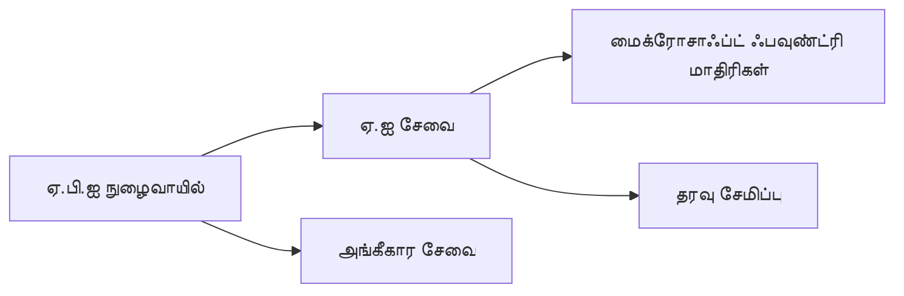
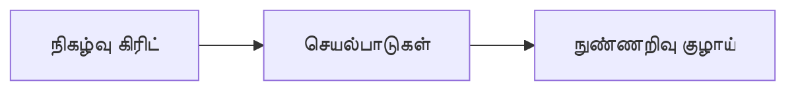

# Chapter 8: உற்பத்தி & நிறுவன மாதிரிகள்

**📚 பாடநெறி**: [AZD For Beginners](../../README.md) | **⏱️ காலம்**: 2-3 மணி நேரம் | **⭐ சிக்கல்**: உயர்

---

## கண்ணோட்டம்

இந்த அத்தியாயம் உற்பத்தி தயாரான despley மாதிரிகள், பாதுகாப்பு கடினப்படுத்தல், கண்காணிப்பு மற்றும் உற்பத்தி AI பணிகளுக்கான செலவு சிறப்பாக்கத்தை கையாள்கிறது.

> Validated against `azd 1.25.6` இல் ஜூன் 2026.

## கற்றல் நோக்கங்கள்

இந்த அத்தியாயத்தை முடிப்பதன் மூலம், நீங்கள்:
- பல பிராந்தியங்களில் நிலைத்தன்மை கொண்ட பயன்பாடுகளை நிறுவுவீர்கள்
- நிறுவன பாதுகாப்பு மாதிரிகளை செயல்படுத்துவீர்கள்
- விரிவான கண்காணிப்பை அமைப்பீர்கள்
- பரிமாணத்தில் செலவுகளை சிறப்பாகச் சீரமைப்பீர்கள்
- AZD உடன் CI/CD குழாய்களை அமைப்பீர்கள்

---

## 📚 பாடங்கள்

| # | பாடம் | விளக்கம் | நேரம் |
|---|--------|-------------|------|
| 1 | [உற்பத்தி AI நடைமுறைகள்](production-ai-practices.md) | நிறுவன வெளியீட்டு மாதிரிகள் | 90 நிமிடம் |

---

## 🚀 உற்பத்தி சரிபார்ப்பு பட்டியல்

- [ ] பல பிராந்தியங்களில் உருவாக்கம் நிலைத்தன்மைக்காக
- [ ] அங்கீகாரத்திற்கான மேலாண்மை அடையாளம் (கீகள் போடாதீர்கள்)
- [ ] கண்காணிப்பிற்கான Application Insights
- [ ] செலவுத்திட்டங்கள் மற்றும் எச்சரிக்கைகள் அமைக்கப்பட்டன
- [ ] பாதுகாப்பு ஸ்கேனிங் இயலுமைப்படுத்தப்பட்டது
- [ ] CI/CD குழாய் ஒருங்கிணைப்பு
- [ ] விபத்து மீட்பு திட்டம்

---

## 🏗️ கட்டமைப்பு மாதிரிகள்

### மாதிரி 1: மைக்ரோசெர்வீசஸ் AI



### மாதிரி 2: நிகழ்வு-சார்ந்த AI



---

## 🔐 பாதுகாப்பு சிறந்த நடைமுறைகள்

```bicep
// Use managed identity
identity: {
  type: 'SystemAssigned'
}

// Private endpoints for AI services
properties: {
  publicNetworkAccess: 'Disabled'
  networkAcls: {
    defaultAction: 'Deny'
  }
}
```

---

## 💰 செலவு சிறப்பாக்கம்

| வழிமுறை | சேமிப்பு |
|----------|---------|
| பூஜ்யத்திற்கு அளவை குறைத்தல் (Container Apps) | 60-80% |
| dev க்கான நுகர்வு நிலைகள் பயன்படுத்துதல் | 50-70% |
| அட்டவணைபடுத்தப்பட்ட அளவீடு | 30-50% |
| முன்-ஒதுக்கப்பட்ட கொள்ளளவு | 20-40% |

```bash
# பட்ஜெட் எச்சரிக்கைகளை அமைக்கவும்
az consumption budget create \
  --budget-name "AI-Budget" \
  --amount 500 \
  --category Cost \
  --time-grain Monthly
```

---

## 📊 கண்காணிப்பு அமைப்புகள்

```bash
# லாக்களை ஸ்ட்ரீம் செய்யவும்
azd monitor --logs

# Application Insights-ஐ சரிபார்க்கவும்
azd monitor --overview

# அளவீடுகளைப் பார்க்கவும்
az monitor metrics list --resource <resource-id>
```

---

## 🔗 வழிசெலுத்தல்

| திசை | அத்தியாயம் |
|-----------|---------|
| **முந்தைய** | [அத்தியாயம் 7: பிரச்சனை தீர்க்குதல்](../chapter-07-troubleshooting/README.md) |
| **பாடம் முடிந்தது** | [கோர்ஸ் முகப்பு](../../README.md) |

---

## 📖 சம்பந்தமான வளங்கள்

- [AI Agents Guide](../chapter-02-ai-development/agents.md)
- [Application Insights](../chapter-06-pre-deployment/application-insights.md)
- [Multi-Agent Solutions](../chapter-05-multi-agent/README.md)
- [Microservices Example](../../examples/microservices/README.md)

---

<!-- CO-OP TRANSLATOR DISCLAIMER START -->
**மறுப்பு**:
இந்த ஆவணம் AI மொழிபெயர்ப்பு சேவை [Co-op Translator](https://github.com/Azure/co-op-translator) பயன்படுத்தி மொழிபெயர்க்கப்பட்டுள்ளது. நாங்கள் துல்லியத்திற்காக முயற்சி செய்துள்ளோம், ஆனால் தானாக செய்யப்படும் மொழிபெயர்ப்புகளில் பிழைகள் அல்லது தவறுகள் இருக்கலாம் என்பதை கவனத்தில் கொள்ளவும். அசல் ஆவணம் அதன் தாய்மொழியில் அதிகாரப்பூர்வ ஆதாரமாக கருதப்பட வேண்டும். முக்கியமான தகவல்களுக்கு, தொழில்நுட்பமான மனித மொழிபெயர்ப்பு பரிந்துரைக்கப்படுகிறது. இந்த மொழிபெயர்ப்பைப் பயன்படுத்துவதால் ஏற்படும் எந்த தவறான புரிதல்கள் அல்லது தவறான விளக்கத்திற்கும் நாங்கள் பொறுப்பில்வில்லை.
<!-- CO-OP TRANSLATOR DISCLAIMER END -->