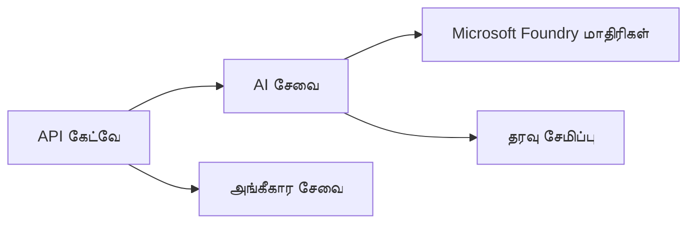
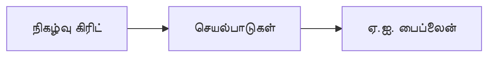

# Chapter 8: உற்பத்தி மற்றும் நிறுவன மாதிரிகள்

**📚 பாடநெறி**: [AZD For Beginners](../../README.md) | **⏱️ காலம்**: 2-3 மணிநேரம் | **⭐ சிக்கல்தன்மை**: உயர்ந்த

---

## கண்ணோட்டம்

இந்த அத்தியாயம் உற்பத்தி AI பணிகளில் நிறுவனத்திற்குத் தயாரான ஒதுக்கீட்டு மாதிரிகள், பாதுகாப்பு கடுமைப்படுத்தல், கண்காணிப்பு மற்றும் செலவு குறைப்பு ஆகியவற்றை உள்ளடக்கியதாகும்।

> மார்ச் 2026 இல் `azd 1.23.12` உடன் சரிபார்க்கப்பட்டது.

## கற்று கொள்ளவேண்டிய நோக்கங்கள்

இந்த அத்தியாயத்தை முடித்தவுடன், நீங்கள்:
- பல பிராந்தியங்களுக்கு தற்காப்பு கொண்ட பயன்பாடுகளை வெளியிடுதல்
- நிறுவன பாதுகாப்பு மாதிரிகளை நடைமுறைப்படுத்துதல்
- முழுமையான கண்காணிப்பை அமைத்தல்
- பருமாணத்தில் செலவுகளை திறமையாக குறைத்தல்
- AZD கொண்டு CI/CD குழாய்களை அமைத்தல்

---

## 📚 பாடங்கள்

| # | பாடம் | விளக்கம் | நேரம் |
|---|--------|-------------|------|
| 1 | [உற்பத்தி AI நடைமுறைகள்](production-ai-practices.md) | நிறுவன வெளியீட்டு மாதிரிகள் | 90 நிமிடம் |

---

## 🚀 உற்பத்தி சரிபார்ப்பு பட்டியல்

- [ ] மறுசீரமைப்புக்கு பல பிராந்திய வெளியீடு
- [ ] அங்கீகாரத்திற்கு மேலாண்மை அடையாளம் (கீகள் பயன்படுத்தாதது)
- [ ] கண்காணிப்புக்கான Application Insights
- [ ] செலவு பட்ஜெட்டுகள் மற்றும் எச்சரிக்கைகள் அமைக்கப்பட்டவை
- [ ] பாதுகாப்பு ஸ்கேனிங் இயக்கப்பட்டது
- [ ] CI/CD குழாய் ஒருங்கிணைப்பு
- [ ] விபத்து மீட்பு திட்டம்

---

## 🏗️ கட்டமைப்பு மாதிரிகள்

### மாதிரி 1: மைக்ரோசெர்வீசஸ் AI


### மாதிரி 2: நிகழ்வுச் சார்ந்த AI


---

## 🔐 பாதுகாப்பு சிறந்த நடைமுறைகள்

```bicep
// Use managed identity
identity: {
  type: 'SystemAssigned'
}

// Private endpoints for AI services
properties: {
  publicNetworkAccess: 'Disabled'
  networkAcls: {
    defaultAction: 'Deny'
  }
}
```

---

## 💰 செலவு குறைத்தல்

| முறைகள் | சேமிப்புகள் |
|----------|---------|
| பூஜ்ஜியத்திற்கு அளவீடு (Container Apps) | 60-80% |
| வளர்ச்சிக்காக consumption tiers பயன்படுத்துதல் | 50-70% |
| காலஅட்டவணை அடிப்படையிலான அளவீடு | 30-50% |
| ஒதுக்கப்பட்ட திறன் | 20-40% |

```bash
# பட்ஜெட் எச்சரிக்கைகளை அமைக்கவும்
az consumption budget create \
  --budget-name "AI-Budget" \
  --amount 500 \
  --category Cost \
  --time-grain Monthly
```

---

## 📊 கண்காணிப்பு அமைப்பு

```bash
# பதிவுகளை நேரடியாகப் பார்க்க
azd monitor --logs

# Application Insights ஐ சரிபார்க்க
azd monitor --overview

# அளவுகோற்களைப் பார்க்க
az monitor metrics list --resource <resource-id>
```

---

## 🔗 வழிசெலுத்தல்

| திசை | அத்தியாயம் |
|-----------|---------|
| **முந்தையது** | [அத்தியாயம் 7: சிக்கல்தீர்வு](../chapter-07-troubleshooting/README.md) |
| **பாடநெறி முடிந்தது** | [பாடநெறி முகப்பு](../../README.md) |

---

## 📖 தொடர்புடைய வளங்கள்

- [AI முகவர்கள் கையேடு](../chapter-02-ai-development/agents.md)
- [Application Insights](../chapter-06-pre-deployment/application-insights.md)
- [பன்முக ஏஜென்ட் தீர்வுகள்](../chapter-05-multi-agent/README.md)
- [மைக்ரோசெர்வீசஸ் எடுத்துக்காட்டு](../../examples/microservices/README.md)

---

<!-- CO-OP TRANSLATOR DISCLAIMER START -->
**மறுப்பு அறிக்கை**:
இந்த ஆவணம் AI மொழிபெயர்ப்பு சேவை [Co-op Translator](https://github.com/Azure/co-op-translator) மூலம் மொழிபெயர்க்கப்பட்டுள்ளது. நாங்கள் துல்லியத்திற்காக முயற்சி செய்தாலும், தானாகச் செய்யப்பட்ட மொழிபெயர்ப்புகளில் பிழைகள் அல்லது தவறான பொருள் பரிமாற்றங்கள் இருக்கக்கூடியவை என்பதைக் கவனத்தில் கொள்ளவும். அசல் ஆவணம் அதன் சொந்த மொழியிலேயே அதிகாரப்பூர்வ மூலமாகக் கருதப்பட வேண்டும். முக்கியமான தகவல்களுக்கு, தொழில்முறை மனித மொழிபெயர்ப்பு பரிந்துரைக்கப்படுகிறது. இந்த மொழிபெயர்ப்பைப் பயன்படுத்துவதால் ஏற்படும் எந்தவொரு தவறான புரிதலுக்கும் அல்லது தவறான விளக்கத்திற்குமான பொறுப்பை நாங்கள் ஏற்க மாட்டோம்.
<!-- CO-OP TRANSLATOR DISCLAIMER END -->