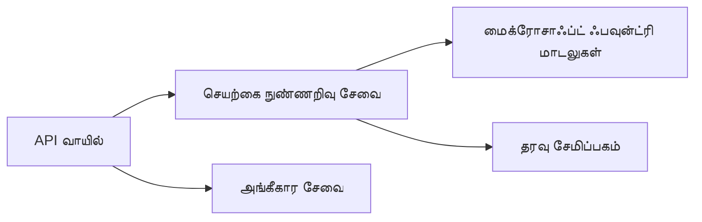
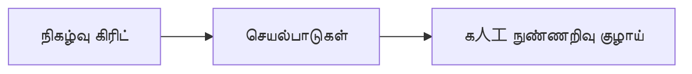

# அதிகாரம் 8: உற்பத்தி மற்றும் நிறுவன முறைப்படிகள்

**📚 படிப்பு**: [AZD தொடக்கத்தக்கவர்கள்](../../README.md) | **⏱️ கால அளவு**: 2-3 மணித்தியாலங்கள் | **⭐ கடினம்**: மேம்பட்டது

---

## கண்ணோட்டம்

இந்த அதிகாரம் நிறுவனர் தயாரான பிணைக்கை முறைப்படிகள், பாதுகாப்பு வலுப்படுத்தல், கண்காணிப்பு மற்றும் உற்பத்தி AI பணிகளுக்கான செலவு தக்கவைத்தல் ஆகியவற்றை உள்ளடக்குகிறது.

> `azd 1.27.1` மூலம் 2026 ஜூலை மாதத்தில் சரிபார்க்கப்பட்டது.

## கற்றல் குறிக்கோள்கள்

இந்த அதிகாரத்தை முடித்த பின், நீங்கள் செய்யக்கூடியவை:
- பல மண்டல உறுதிப்பத்திர பயன்பாடுகளை பிணைக்கவும்
- நிறுவன பாதுகாப்பு முறைப்படிகளை அமல்படுத்தவும்
- விரிவான கண்காணிப்பை அமைக்கவும்
- அளவுக்கு செலவு தக்கவைத்தல் செய்யவும்
- AZD உடன் CI/CD குழாய்களை அமைக்கவும்

---

## 📚 பாடங்கள்

| # | பாடம் | விளக்கம் | நேரம் |
|---|--------|-------------|------|
| 1 | [உற்பத்தி AI நடைமுறைகள்](production-ai-practices.md) | நிறுவன பிணைக்கை முறைப்படிகள் | 90 நிமிடங்கள் |

---

## 🚀 உற்பத்தி சரிபார்ப்பு பட்டியல்

- [ ] பல மண்டல பிணைக்கை உறுதிப்பத்திரம்
- [ ] நிர்வகிக்கப்பட்ட அடையாளம் அங்கீகாரம் (சாவிகள் இல்லாமல்)
- [ ] கண்காணிப்பிற்கான செயலி பார்வைகள்
- [ ] செலவு பட்ஜெட்டுகள் மற்றும் எச்சரிக்கை அமைப்புகள்
- [ ] பாதுகாப்பு ஸ்கேன் செயல்
- [ ] CI/CD குழாய் ஒருங்கிணைப்பு
- [ ] பேரழிவு மீட்பு திட்டம்

---

## 🏗️ கட்டமைப்பு முறைப்படிகள்

### முறை 1: மைக்ரோசர்வீசஸ் AI



### முறை 2: நிகழ்வு இயக்கப்பட்ட AI



---

## 🔐 பாதுகாப்பு சிறந்த நடைமுறைகள்

```bicep
// Use managed identity
identity: {
  type: 'SystemAssigned'
}

// Private endpoints for AI services
properties: {
  publicNetworkAccess: 'Disabled'
  networkAcls: {
    defaultAction: 'Deny'
  }
}
```

---

## 💰 செலவு தக்கவைத்தல்

| யுக்தி | சேமிப்பு |
|----------|---------|
| நிலைக்கு சுழற்சி இழுவை (உருவாக்கப்பட்ட செயலிகள்) | 60-80% |
| மேம்பாட்டிற்கான பயன்பாட்டு நிலைகள் | 50-70% |
| திட்டமிட்ட அளவு உயர்வு | 30-50% |
| முன்பதிவு கொள்ளளவு | 20-40% |

```bash
# பட்ஜெட் அறிவிப்புகளை அமைக்கவும்
az consumption budget create \
  --budget-name "AI-Budget" \
  --amount 500 \
  --category Cost \
  --time-grain Monthly
```

---

## 📊 கண்காணிப்பு அமைப்பு

```bash
# சுரையில் பதிவுகளைக் காண்க
azd monitor --logs

# செயலி பார்வைகளைச் சரிபார்க்கவும்
azd monitor --overview

# அளவுகோல்களைப் பார்வையிடவும்
az monitor metrics list --resource <resource-id>
```

---

## 🔗 வழிசெலுத்தல்

| போக்கு | அதிகாரம் |
|-----------|---------|
| **முந்தைய** | [அதிகாரம் 7: பிழைத்திருத்தம்](../chapter-07-troubleshooting/README.md) |
| **படிப்பு முடிவு** | [படிப்பு முகப்பு](../../README.md) |

---

## 📖 தொடர்புடைய வளங்கள்

- [AI முகவர்கள் வழிகாட்டி](../chapter-02-ai-development/agents.md)
- [செயலி பார்வைகள்](../chapter-06-pre-deployment/application-insights.md)
- [பல முகவர் தீர்வுகள்](../chapter-05-multi-agent/README.md)
- [மைக்ரோசர்வீசஸ் உதாரணம்](../../examples/microservices/README.md)

---

<!-- CO-OP TRANSLATOR DISCLAIMER START -->
**மறுப்பு**:
இந்த ஆவணம் AI மொழிபெயர்ப்பு சேவை [Co-op Translator](https://github.com/Azure/co-op-translator) பயன்படுத்தி மொழிபெயர்க்கப்பட்டுள்ளது. நாங்கள் துல்லியத்திற்காக முயற்சி செய்துள்ளோம், ஆனால் தானாக செய்யப்படும் மொழிபெயர்ப்புகளில் பிழைகள் அல்லது தவறுகள் இருக்கலாம் என்பதை கவனத்தில் கொள்ளவும். அசல் ஆவணம் அதன் தாய்மொழியில் அதிகாரப்பூர்வ ஆதாரமாக கருதப்பட வேண்டும். முக்கியமான தகவல்களுக்கு, தொழில்நுட்பமான மனித மொழிபெயர்ப்பு பரிந்துரைக்கப்படுகிறது. இந்த மொழிபெயர்ப்பைப் பயன்படுத்துவதால் ஏற்படும் எந்த தவறான புரிதல்கள் அல்லது தவறான விளக்கத்திற்கும் நாங்கள் பொறுப்பில்வில்லை.
<!-- CO-OP TRANSLATOR DISCLAIMER END -->