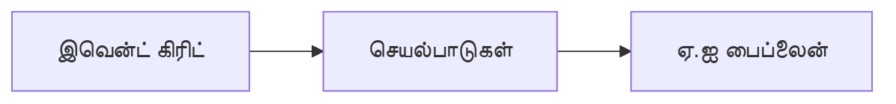

# அத்தியாயம் 8: உற்பத்தி மற்றும் நிறுவன வடிவமைப்புகள்

**📚 பாடநெறி**: [AZD For Beginners](../../README.md) | **⏱️ காலம்**: 2-3 மணிநேரம் | **⭐ சிக்கல்தன்மை**: மேம்பட்ட

---

## கண்ணோட்டம்

இந்த அத்தியாயம் உற்பத்தி AI பணிச்சுமைகளுக்கான நிறுவன-தயார் டெப்ளாய்மென்ட் வடிவமைப்புகள், பாதுகாப்பு கடுமைப்படுத்தல், கண்காணிப்பு மற்றும் செலவு ஒழுங்குபடுத்துதலை கையாள்கிறது.

## கற்றல் நோக்கங்கள்

By completing this chapter, you will:
- பல பிராந்தியங்களில் நிலைத்தன்மை கொண்ட பயன்பாடுகளைப் பிரசுரி செய்யவும்
- நிறுவன பாதுகாப்பு வடிவமைப்புகளை அமல்படுத்தவும்
- விரிவான கண்காணிப்பை அமைக்கவும்
- பெரிதாக்கத்திலான செலவுகளை சிறப்பாக்கவும்
- AZD உடன் CI/CD பைப்பிளைன் அமைக்கவும்

---

## 📚 பாடங்கள்

| # | பாடம் | விளக்கம் | நேரம் |
|---|--------|-------------|------|
| 1 | [உற்பத்தி AI நடைமுறைகள்](production-ai-practices.md) | நிறுவன டெப்ளாய்மெண்ட் மாதிரிகள் | 90 நிமிடங்கள் |

---

## 🚀 உற்பத்தி சரிபார்ப்பு பட்டியல்

- [ ] நிலைத்தன்மைக்கு பல பிராந்தியங்களில் டெப்ளாய்மென்ட்
- [ ] அங்கீகாரத்திற்காக Managed identity (கீகள் இல்லை)
- [ ] கண்காணிப்பிற்காக Application Insights
- [ ] செலவு பட்ஜெட்டுகள் மற்றும் எச்சரிக்கைகள் அமைக்கப்பட்டுள்ளன
- [ ] பாதுகாப்பு ஸ்கேனிங் இயலுமைப்படுத்தப்பட்டது
- [ ] CI/CD பைப்பிளைன் ஒருங்கிணைப்பு
- [ ] விபத்து மீட்பு திட்டம்

---

## 🏗️ கட்டமைப்பு மாதிரிகள்

### மாதிரி 1: மைக்ரோசர்வீசஸ் AI


### மாதிரி 2: நிகழ்வுசாரா AI


---

## 🔐 பாதுகாப்பு சிறந்த நடைமுறைகள்

```bicep
// Use managed identity
identity: {
  type: 'SystemAssigned'
}

// Private endpoints for AI services
properties: {
  publicNetworkAccess: 'Disabled'
  networkAcls: {
    defaultAction: 'Deny'
  }
}
```

---

## 💰 செலவு சிறப்பாக்கம்

| தந்திரம் | சேமிப்பு |
|----------|---------|
| சீரோ வரை ஸ்கேலிங் (Container Apps) | 60-80% |
| dev க்கான consumption tiers பயன்பாடு | 50-70% |
| அட்டவணைபடுத்தப்பட்ட ஸ்கேலிங் | 30-50% |
| முன்பதிவு செய்யப்பட்ட கொள்ளளவு | 20-40% |

```bash
# பட்ஜெட் எச்சரிக்கைகளை அமைக்கவும்
az consumption budget create \
  --budget-name "AI-Budget" \
  --amount 500 \
  --category Cost \
  --time-grain Monthly
```

---

## 📊 கண்காணிப்பு அமைப்பு

```bash
# பதிவுகளை நேரடியாகப் பார்க்கவும்
azd monitor --logs

# Application Insights ஐப் பார்க்கவும்
azd monitor

# அளவீடுகளைப் பார்க்கவும்
az monitor metrics list --resource <resource-id>
```

---

## 🔗 வழிசெலுத்தல்

| திசை | அத்தியாயம் |
|-----------|---------|
| **முந்தைய** | [அத்தியாயம் 7: பிழைத் தீர்வு](../chapter-07-troubleshooting/README.md) |
| **பாடநெறி முடிவு** | [பாடநெறி முகப்பு](../../README.md) |

---

## 📖 தொடர்புடைய வளங்கள்

- [AI ஏஜென்ட்ஸ் கையேடு](../chapter-02-ai-development/agents.md)
- [Application Insights](../chapter-06-pre-deployment/application-insights.md)
- [பல-ஏஜென்ட் தீர்வுகள்](../chapter-05-multi-agent/README.md)
- [Microservices உதாரணம்](../../examples/microservices/README.md)

---

<!-- CO-OP TRANSLATOR DISCLAIMER START -->
**மறுப்பு அறிக்கை**:
இந்த ஆவணம் AI மொழிபெயர்ப்பு சேவை [Co-op Translator](https://github.com/Azure/co-op-translator) பயன்படுத்தி மொழிபெயர்க்கப்பட்டுள்ளது. நாங்கள் துல்லியத்திற்காக முயற்சித்தாலும், தானியங்கி மொழிபெயர்ப்புகளில் பிழைகள் அல்லது தவறுகள் இருக்கலாம் என்பதை தயவுசெய்து கவனிக்கவும். அதன் சொந்த மொழியில் உள்ள அசல் ஆவணம் அதிகாரப்பூர்வ மூலமாக கருதப்பட வேண்டும். முக்கியமான தகவல்களுக்கு, தொழில்முறை மனித மொழிபெயர்ப்பை பரிந்துரைக்கிறோம். இந்த மொழிபெயர்ப்பைப் பயன்படுத்துவதால் ஏற்படும் எந்தவொரு தவறான புரிதலும் அல்லது தவறான விளக்கங்களுக்குமான பொறுப்பை நாங்கள் ஏற்க மாட்டோம்.
<!-- CO-OP TRANSLATOR DISCLAIMER END -->