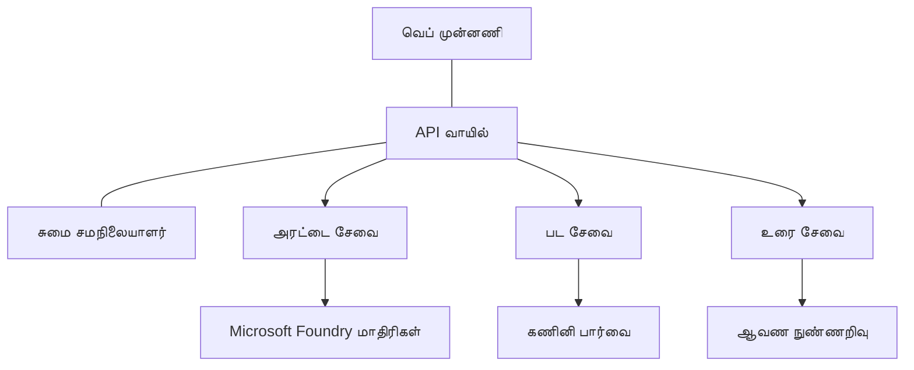

# AZD உடன் உற்பத்தி AI பணிப்பரவைகள் சிறந்த நடைமுறைகள்

**அத்தியாய வழிசெலுத்தல்:**
- **📚 பாடநெறி முகப்பு**: [AZD ஆரம்பர்களுக்காக](../../README.md)
- **📖 தற்போதைய அத்தியாயம்**: அத்தியாயம் 8 - உற்பத்தி மற்றும் நிறுவன மாதிரிகள்
- **⬅️ முன்னைய அத்தியாயம்**: [அத்தியாயம் 7: பிழைதிருத்தம்](../chapter-07-troubleshooting/debugging.md)
- **⬅️ தொடர்புடையது**: [AI பணிமனை ஆய்வு](ai-workshop-lab.md)
- **🎯 பாடநெறி முடிந்தது**: [AZD ஆரம்பர்களுக்காக](../../README.md)

## மீளாய்வு

இந்த கையேடு Azure Developer CLI (AZD) பயன்படுத்தி உற்பத்தி-தயாரான AI பணிப்பரவைகளை போன்றவற்றை разploy செய்வதற்கான விரிவான சிறந்த நடைமுறைகளை வழங்குகிறது. Microsoft Foundry Discord சமூகம் மற்றும் வாடிக்கையாளர் செயல்பாடுகளிலிருந்து கிடைந்த கருத்துக்களின் அடிப்படையில், இந்த நடைமுறைகள் உற்பத்தி AI அமைப்புகளில் பார்க்கப்படும் பொதுவான சவால்களை கையாளுகின்றன.

## தீர்க்கப்படும் முக்கிய சவால்கள்

நமது சமுகப் பொல்ச் முடிவுகளின் படி, டெவலப்பர்கள் எதிர்கொள்ளும் மிகப்பெரிய சவால்கள்:

- **45%** பலசேவை AI டிப்லாய்மெண்ட்களுடன் சிக்கலில் இருக்கிறார்கள்
- **38%** பிரவண மற்றும் ரகசிய மேலாண்மையில் பிரச்சனைகள் உள்ளன  
- **35%** உற்பத்தி தயார் நிலை மற்றும் ஸ்கேலிங் கடினமாக உள்ளது
- **32%** செலவை சிறப்பாக நிர்வகிக்கும் தந்திரங்கள் தேவை
- **29%** மேம்பட்ட கண்காணிப்பு மற்றும் பிழைத்திருத்தம் தேவையாகிறது

## உற்பத்தி AIக்கு கட்டமைப்பு மாதிரிகள்

### மாதிரி 1: மைக்ரோசேவைகள் AI கட்டமைப்பு

**எப்போது பயன்படுத்துவது**: பல திறன்கள் கொண்ட சிக்கலான AI பயன்பாடுகள்


**AZD நடைமுறைப்பாடு**:

```yaml
# azure.yaml
name: enterprise-ai-platform
services:
  web:
    project: ./web
    host: staticwebapp
  api-gateway:
    project: ./api-gateway
    host: containerapp
  chat-service:
    project: ./services/chat
    host: containerapp
  vision-service:
    project: ./services/vision
    host: containerapp
  text-service:
    project: ./services/text
    host: containerapp
```

### மாதிரி 2: நிகழ்வு-ஊറിയ AI செயலாக்கம்

**எப்போது பயன்படுத்த வேண்டும்**: தொகுதி செயலாக்கம், ஆவண분석ம், அசிங்க் பணிவழிகள்

```bicep
// Event Hub for AI processing pipeline
resource eventHub 'Microsoft.EventHub/namespaces@2023-01-01-preview' = {
  name: eventHubNamespaceName
  location: location
  sku: {
    name: 'Standard'
    tier: 'Standard'
    capacity: 1
  }
}

// Service Bus for reliable message processing
resource serviceBus 'Microsoft.ServiceBus/namespaces@2022-10-01-preview' = {
  name: serviceBusNamespaceName
  location: location
  sku: {
    name: 'Premium'
    tier: 'Premium'
    capacity: 1
  }
}

// Function App for processing
resource functionApp 'Microsoft.Web/sites@2023-01-01' = {
  name: functionAppName
  location: location
  kind: 'functionapp,linux'
  properties: {
    siteConfig: {
      appSettings: [
        {
          name: 'FUNCTIONS_EXTENSION_VERSION'
          value: '~4'
        }
        {
          name: 'AZURE_OPENAI_ENDPOINT'
          value: '@Microsoft.KeyVault(VaultName=${keyVault.name};SecretName=openai-endpoint)'
        }
      ]
    }
  }
}
```

## AI முகவர் உடல்நலச் சிந்தனை

சம்ப்ரதாய இணைய பயன்பாடு முறையடைந்தால், அறிகுறிகள் பரிச்சயமானவை: ஒரு பக்கம் லோடு ஆகவில்லை, ஒரு API பிழை அளிக்கிறது, அல்லது ஒரு டிப்லாய்மென்ட் தோல்வியடைகிறது. AI-இன் சக்தியுடன் இயங்கும் பயன்பாடுகள் எல்லா அந்த வழிகளிலும் முறையடையலாம்—ஆனால் அவை தெரிவிக்காத பிழை செய்திகளை கொடுக்காமல் நுட்பமான விதங்களில் தவறாக நடக்கலாம்.

இந்த பகுதி AI பணிப்பரவைகளை கண்காணிக்க மன மொழிமாதிரியை உருவாக்க உதவுகிறது, அதனால் ஏதாவது சரியில்லையானபோது எங்கே காண வேண்டியதென்றால் அது தெரியும்.

### முகவர் உடல்நலன் சாதாரண பயன்பாடு உடல்நலனிலிருந்து எப்படி வேறுபடுகிறது

சம்ப்ரதாயப் பயன்பாடு வேலை செய்கிறதா இல்லையா என்பது தெளிவு. ஒரு AI முகவர் வேலை செய்யும் போல் தோன்றினாலும் மோசமான முடிவுகளை உருவாக்கலாம். முகவர் உடல்நலத்தை இரண்டு அடுக்கு என்றால் சிந்திக்கலாம்:

| Layer | What to Watch | Where to Look |
|-------|--------------|---------------|
| **Infrastructure health** | சேவை இயங்குகிறதா? வளங்கள் Provision செய்யப்பட்டுள்ளதா? இடைக்குழாய்(எண்ட்பாய்ண்ட்) அணுகக்கூடியவைகளா? | `azd monitor`, Azure Portal resource health, container/app logs |
| **Behavior health** | முகவர் துல்லியமாக பதிலளிக்கிறதா? பதில்கள் நேரத்துக்குள் வருகிறதா? மாதிரி சரியாக அழைக்கப்படுகிறதா? | Application Insights traces, model call latency metrics, response quality logs |

Infrastructure health பரிச்சயமானது— அது எந்த azd பயன்பாட்டுக்கும் அதே மாதிரி. Behavior health என்பது AI பணிப்பரவைகள் அறிமுகப்படுத்தும் புதிய அடுக்கு.

### AI பயன்பாடுகள் எதிர்பார்த்தபடி நடக்காமல் இருந்தால் எங்கு தேட வேண்டும்

உங்கள் AI பயன்பாடு எதிர்பார்த்த முடிவுகளை உற்பத்தி செய்யவில்லை என்றால், இங்கு ஒரு கருதுகோள் சரிபார்ப்பு பட்டியல் உள்ளது:

1. **அடிப்படையிலிருந்து தொடங்குங்கள்.** பயன்பாடு இயங்குகிறதா? அது அதன் பொறுப்புகளிற்கு அடையக்கூடுமா? எந்த பயன்பாட்டுக்கும் போலியே `azd monitor` மற்றும் resource health ஐ சரிபார்க்கவும்.
2. **மாதிரி இணைப்பை சரிபார்க்கவும்.** உங்கள் பயன்பாடு AI மாதிரியை வெற்றிகரமாக அழைக்கிறதா? தோல்வியடைந்த அல்லது நேரம் முடிந்த மாதிரி அழைப்புகள் AI பயன்பாடு சிக்கல்களின் பொதுவான காரணம் மற்றும் உங்கள் பயன்பாட்டு லாக்களில் தெறிவாக காணப்படும்.
3. **மாதிரி பெறwhatபெற்றதைப் பார்க்கவும்.** AI பதில்கள் உள்ளீட்டின் (ப்ராம்ப்ட் மற்றும் எந்த மீட்டெடுக்கப்பட்ட உரையாடல்) மீது பொறுத்தவை. அவுட்புட் தவறானிருந்தால், உள்ளீடு வழக்கமாக தவறாக இருக்கும். உங்கள் பயன்பாடு மாதிரிக்கு சரியான தரவை அனுப்புகிறதா என்பதை சரிபார்க்கவும்.
4. **பதிலளிப்பு தாமதத்தை சரிபார்க்கவும்.** AI மாதிரி அழைப்புகள் பொதுவான API அழைப்புகளைவிட மெதுவாக இருக்கும். உங்கள் பயன்பாடு மந்தமாக உணரப்பட்டால், மாதிரி பதிலளிப்பு நேரங்கள் அதிகமாயிருக்கிறதா என்பதை சரிபார்க்கவும்—இது த்ராட்லிங், திறன் வரம்புகள், அல்லது பிரதேச அளவிலான நடுக்கடைப்பை குறிக்கலாம்.
5. **செலவுக் குறிப்புகளுக்கு கவனம் செலுத்துங்கள்.** கட்டுப்பாடற்ற டோக்கன் உபயோகமும் API அழைப்புகளின் எதிர்பிழைகளும் ஒரு லூப், தவறாக உள்ளமைக்கப்பட்ட ப்ராம்ப்ட், அல்லது மிகுந்த மறுபTRY முயற்சிகள் ஆகியவற்றை குறிக்கலாம்.

நீங்கள் உடனடி முறையில் அனைத்துப் மேற்பார்வை கருவிகளை நுண்ணறிவாக கையாள வேண்டுமில்லை. முக்கியமான விஷயம்: AI பயன்பாடுகளில் கண்காணிக்க வேண்டிய ஒரு கூடுதல் நடத்தை அடுக்கு உள்ளது, மற்றும் azd இன் உள்ளமைக்கப்பட்ட கண்காணிப்பு (`azd monitor`) இரு அடுக்குகளையும் விசாரணை செய்ய தொடக்க இடத்தை வழங்குகிறது.

---

## பாதுகாப்பு சிறந்த நடைமுறைகள்

### 1. சிரூப-விசுவாசம் (Zero-Trust) பாதுகாப்பு மாதிரி

**இணைப்பு நடைமுறை**:
- அங்கீகாரம் இல்லாமல் சேவை-க்கு சேவை தொடர்பு கிடையாது
- அனைத்து API அழைப்புகளும் நிர்வகிக்கப்பட்ட அடையாளங்களைப் பயன்படுத்தும்
- தனியுரிமை அடிப்படையிலான நெட்வொர்க் தனிமை (private endpoints)
- குறைந்த அவசியம் בלבד வழங்கும் அணுகல் கட்டுப்பாடுகள்

```bicep
// Managed Identity for each service
resource chatServiceIdentity 'Microsoft.ManagedIdentity/userAssignedIdentities@2023-01-31' = {
  name: 'chat-service-identity'
  location: location
}

// Role assignments with minimal permissions
resource openAIUserRole 'Microsoft.Authorization/roleAssignments@2022-04-01' = {
  scope: openAIAccount
  name: guid(openAIAccount.id, chatServiceIdentity.id, openAIUserRoleDefinitionId)
  properties: {
    roleDefinitionId: subscriptionResourceId('Microsoft.Authorization/roleDefinitions', '5e0bd9bd-7b93-4f28-af87-19fc36ad61bd')
    principalId: chatServiceIdentity.properties.principalId
    principalType: 'ServicePrincipal'
  }
}
```

### 2. பாதுகாப்பான ரகசிய மேலாண்மை

**Key Vault ஒருங்கிணைப்பு மாதிரி**:

```bicep
// Key Vault with proper access policies
resource keyVault 'Microsoft.KeyVault/vaults@2023-02-01' = {
  name: keyVaultName
  location: location
  properties: {
    tenantId: tenant().tenantId
    sku: {
      family: 'A'
      name: 'premium'  // Use premium for production
    }
    enableRbacAuthorization: true  // Use RBAC instead of access policies
    enablePurgeProtection: true    // Prevent accidental deletion
    enableSoftDelete: true
    softDeleteRetentionInDays: 90
  }
}

// Store all AI service credentials
resource openAIKeySecret 'Microsoft.KeyVault/vaults/secrets@2023-02-01' = {
  parent: keyVault
  name: 'openai-api-key'
  properties: {
    value: openAIAccount.listKeys().key1
    attributes: {
      enabled: true
    }
  }
}
```

### 3. நெட்வொர்க் பாதுகாப்பு

**Private Endpoint அமைப்பு**:

```bicep
// Virtual Network for AI services
resource virtualNetwork 'Microsoft.Network/virtualNetworks@2023-04-01' = {
  name: vnetName
  location: location
  properties: {
    addressSpace: {
      addressPrefixes: ['10.0.0.0/16']
    }
    subnets: [
      {
        name: 'ai-services-subnet'
        properties: {
          addressPrefix: '10.0.1.0/24'
          privateEndpointNetworkPolicies: 'Disabled'
        }
      }
      {
        name: 'app-services-subnet'
        properties: {
          addressPrefix: '10.0.2.0/24'
          delegations: [
            {
              name: 'Microsoft.Web/serverFarms'
              properties: {
                serviceName: 'Microsoft.Web/serverFarms'
              }
            }
          ]
        }
      }
    ]
  }
}

// Private endpoints for all AI services
resource openAIPrivateEndpoint 'Microsoft.Network/privateEndpoints@2023-04-01' = {
  name: '${openAIAccountName}-pe'
  location: location
  properties: {
    subnet: {
      id: virtualNetwork.properties.subnets[0].id
    }
    privateLinkServiceConnections: [
      {
        name: 'openai-connection'
        properties: {
          privateLinkServiceId: openAIAccount.id
          groupIds: ['account']
        }
      }
    ]
  }
}
```

## செயல்திறன் மற்றும் ஸ்கேலிங்

### 1. தானாகப் பெரிதாக்கும் (Auto-Scaling) தந்திரங்கள்

**Container Apps தானாகப் பெரிதாக்கல்**:

```bicep
resource containerApp 'Microsoft.App/containerApps@2023-05-01' = {
  name: containerAppName
  location: location
  properties: {
    configuration: {
      ingress: {
        external: true
        targetPort: 8000
        transport: 'http'
      }
    }
    template: {
      scale: {
        minReplicas: 2  // Always have 2 instances minimum
        maxReplicas: 50 // Scale up to 50 for high load
        rules: [
          {
            name: 'http-scaling'
            http: {
              metadata: {
                concurrentRequests: '20'  // Scale when >20 concurrent requests
              }
            }
          }
          {
            name: 'cpu-scaling'
            custom: {
              type: 'cpu'
              metadata: {
                type: 'Utilization'
                value: '70'  // Scale when CPU >70%
              }
            }
          }
        ]
      }
    }
  }
}
```

### 2. கேஷிங் தந்திரங்கள்

**AI பதில்களுக்கான Redis Cache**:

```bicep
// Redis Premium for production workloads
resource redisCache 'Microsoft.Cache/redis@2023-04-01' = {
  name: redisCacheName
  location: location
  properties: {
    sku: {
      name: 'Premium'
      family: 'P'
      capacity: 1
    }
    enableNonSslPort: false
    minimumTlsVersion: '1.2'
    redisConfiguration: {
      'maxmemory-policy': 'allkeys-lru'
    }
    // Enable clustering for high availability
    redisVersion: '6.0'
    shardCount: 2
  }
}

// Cache configuration in application
var cacheConnectionString = '${redisCache.properties.hostName}:6380,password=${redisCache.listKeys().primaryKey},ssl=True,abortConnect=False'
```

### 3. லோட் பாலன்சிங் மற்றும் போக்குவரத்து மேலாண்மை

**WAF உடன் Application Gateway**:

```bicep
// Application Gateway with Web Application Firewall
resource applicationGateway 'Microsoft.Network/applicationGateways@2023-04-01' = {
  name: appGatewayName
  location: location
  properties: {
    sku: {
      name: 'WAF_v2'
      tier: 'WAF_v2'
      capacity: 2
    }
    webApplicationFirewallConfiguration: {
      enabled: true
      firewallMode: 'Prevention'
      ruleSetType: 'OWASP'
      ruleSetVersion: '3.2'
    }
    // Backend pools for AI services
    backendAddressPools: [
      {
        name: 'ai-services-pool'
        properties: {
          backendAddresses: [
            {
              fqdn: '${containerApp.properties.configuration.ingress.fqdn}'
            }
          ]
        }
      }
    ]
  }
}
```

## 💰 செலவு சிறப்பு செயல்வழிமுறை

### 1. வளங்களின் சரியான அளவீடு (Resource Right-Sizing)

**சுற்றுப்புற-சூழலின் குறிப்பிட்ட கட்டமைப்புகள்**:

```bash
# வளர்ச்சி சூழல்
azd env new development
azd env set AZURE_OPENAI_SKU "S0"
azd env set AZURE_OPENAI_CAPACITY 10
azd env set AZURE_SEARCH_SKU "basic"
azd env set CONTAINER_CPU 0.5
azd env set CONTAINER_MEMORY 1.0

# உற்பத்தி சூழல்
azd env new production
azd env set AZURE_OPENAI_SKU "S0"
azd env set AZURE_OPENAI_CAPACITY 100
azd env set AZURE_SEARCH_SKU "standard"
azd env set CONTAINER_CPU 2.0
azd env set CONTAINER_MEMORY 4.0
```

### 2. செலவு கண்காணிப்பு மற்றும் பட்ஜெட்

```bicep
// Cost management and budgets
resource budget 'Microsoft.Consumption/budgets@2023-05-01' = {
  name: 'ai-workload-budget'
  properties: {
    timePeriod: {
      startDate: '2024-01-01'
      endDate: '2024-12-31'
    }
    timeGrain: 'Monthly'
    amount: 2000  // $2000 monthly budget
    category: 'Cost'
    notifications: {
      warning: {
        enabled: true
        operator: 'GreaterThan'
        threshold: 80
        contactEmails: [
          'finance@company.com'
          'engineering@company.com'
        ]
        contactRoles: [
          'Owner'
          'Contributor'
        ]
      }
      critical: {
        enabled: true
        operator: 'GreaterThan'
        threshold: 95
        contactEmails: [
          'cto@company.com'
        ]
      }
    }
  }
}
```

### 3. டோக்கன் பயன்பாடு உத்தேசித்தல்

**OpenAI செலவு மேலாண்மை**:

```typescript
// விண்ணப்ப-நிலை டோக்கன் சிறப்பாக்கம்
class TokenOptimizer {
  private readonly maxTokens = 4000;
  private readonly reserveTokens = 500;
  
  optimizePrompt(userInput: string, context: string): string {
    const availableTokens = this.maxTokens - this.reserveTokens;
    const estimatedTokens = this.estimateTokens(userInput + context);
    
    if (estimatedTokens > availableTokens) {
      // சூழலை சுருக்கவும், பயனர் உள்ளீட்டை அல்ல
      context = this.truncateContext(context, availableTokens - this.estimateTokens(userInput));
    }
    
    return `${context}\n\nUser: ${userInput}`;
  }
  
  private estimateTokens(text: string): number {
    // கிட்டத்தட்ட மதிப்பீடு: 1 டோக்கன் ≈ 4 எழுத்துகள்
    return Math.ceil(text.length / 4);
  }
}
```

## கண்காணிப்பு மற்றும் பார்வைத்திறன் (Observability)

### 1. விரிவான Application Insights

```bicep
// Application Insights with advanced features
resource applicationInsights 'Microsoft.Insights/components@2020-02-02' = {
  name: applicationInsightsName
  location: location
  kind: 'web'
  properties: {
    Application_Type: 'web'
    WorkspaceResourceId: logAnalyticsWorkspace.id
    SamplingPercentage: 100  // Full sampling for AI apps
    DisableIpMasking: false  // Enable for security
  }
}

// Custom metrics for AI operations
resource aiMetricAlerts 'Microsoft.Insights/metricAlerts@2018-03-01' = {
  name: 'ai-high-error-rate'
  location: 'global'
  properties: {
    description: 'Alert when AI service error rate is high'
    severity: 2
    enabled: true
    scopes: [
      applicationInsights.id
    ]
    evaluationFrequency: 'PT1M'
    windowSize: 'PT5M'
    criteria: {
      'odata.type': 'Microsoft.Azure.Monitor.SingleResourceMultipleMetricCriteria'
      allOf: [
        {
          name: 'high-error-rate'
          metricName: 'requests/failed'
          operator: 'GreaterThan'
          threshold: 10
          timeAggregation: 'Count'
        }
      ]
    }
  }
}
```

### 2. AI-சிறப்பு கண்காணிப்பு

**AI மூலோபாய அளவுருக்களுக்கு தனிப்பயன் டாஷ்போர்டுகள்**:

```json
// Dashboard configuration for AI workloads
{
  "dashboard": {
    "name": "AI Application Monitoring",
    "tiles": [
      {
        "name": "OpenAI Request Volume",
        "query": "requests | where name contains 'openai' | summarize count() by bin(timestamp, 5m)"
      },
      {
        "name": "AI Response Latency",
        "query": "requests | where name contains 'openai' | summarize avg(duration) by bin(timestamp, 5m)"
      },
      {
        "name": "Token Usage",
        "query": "customMetrics | where name == 'openai_tokens_used' | summarize sum(value) by bin(timestamp, 1h)"
      },
      {
        "name": "Cost per Hour",
        "query": "customMetrics | where name == 'openai_cost' | summarize sum(value) by bin(timestamp, 1h)"
      }
    ]
  }
}
```

### 3. உடல்நிலை சோதனைகள் மற்றும் நேரடி நேர கண்காக்கல்

```bicep
// Application Insights availability tests
resource availabilityTest 'Microsoft.Insights/webtests@2022-06-15' = {
  name: 'ai-app-availability-test'
  location: location
  tags: {
    'hidden-link:${applicationInsights.id}': 'Resource'
  }
  properties: {
    SyntheticMonitorId: 'ai-app-availability-test'
    Name: 'AI Application Availability Test'
    Description: 'Tests AI application endpoints'
    Enabled: true
    Frequency: 300  // 5 minutes
    Timeout: 120    // 2 minutes
    Kind: 'ping'
    Locations: [
      {
        Id: 'us-east-2-azr'
      }
      {
        Id: 'us-west-2-azr'
      }
    ]
    Configuration: {
      WebTest: '''
        <WebTest Name="AI Health Check" 
                 Id="8d2de8d2-a2b0-4c2e-9a0d-8f9c9a0b8c8d" 
                 Enabled="True" 
                 CssProjectStructure="" 
                 CssIteration="" 
                 Timeout="120" 
                 WorkItemIds="" 
                 xmlns="http://microsoft.com/schemas/VisualStudio/TeamTest/2010" 
                 Description="" 
                 CredentialUserName="" 
                 CredentialPassword="" 
                 PreAuthenticate="True" 
                 Proxy="default" 
                 StopOnError="False" 
                 RecordedResultFile="" 
                 ResultsLocale="">
          <Items>
            <Request Method="GET" 
                     Guid="a5f10126-e4cd-570d-961c-cea43999a200" 
                     Version="1.1" 
                     Url="${webApp.properties.defaultHostName}/health" 
                     ThinkTime="0" 
                     Timeout="120" 
                     ParseDependentRequests="True" 
                     FollowRedirects="True" 
                     RecordResult="True" 
                     Cache="False" 
                     ResponseTimeGoal="0" 
                     Encoding="utf-8" 
                     ExpectedHttpStatusCode="200" 
                     ExpectedResponseUrl="" 
                     ReportingName="" 
                     IgnoreHttpStatusCode="False" />
          </Items>
        </WebTest>
      '''
    }
  }
}
```

## விபத்து மீட்பு மற்றும் உயர் கிடைக்கும் நிலை

### 1. பல-ப்ரதேச டிப்லாய்மெண்ட்

```yaml
# azure.yaml - Multi-region configuration
name: ai-app-multiregion
services:
  api-primary:
    project: ./api
    host: containerapp
    env:
      - AZURE_REGION=eastus
  api-secondary:
    project: ./api
    host: containerapp
    env:
      - AZURE_REGION=westus2
```

```bicep
// Traffic Manager for global load balancing
resource trafficManager 'Microsoft.Network/trafficManagerProfiles@2022-04-01' = {
  name: trafficManagerProfileName
  location: 'global'
  properties: {
    profileStatus: 'Enabled'
    trafficRoutingMethod: 'Priority'
    dnsConfig: {
      relativeName: trafficManagerProfileName
      ttl: 30
    }
    monitorConfig: {
      protocol: 'HTTPS'
      port: 443
      path: '/health'
      intervalInSeconds: 30
      toleratedNumberOfFailures: 3
      timeoutInSeconds: 10
    }
    endpoints: [
      {
        name: 'primary-endpoint'
        type: 'Microsoft.Network/trafficManagerProfiles/azureEndpoints'
        properties: {
          targetResourceId: primaryAppService.id
          endpointStatus: 'Enabled'
          priority: 1
        }
      }
      {
        name: 'secondary-endpoint'
        type: 'Microsoft.Network/trafficManagerProfiles/azureEndpoints'
        properties: {
          targetResourceId: secondaryAppService.id
          endpointStatus: 'Enabled'
          priority: 2
        }
      }
    ]
  }
}
```

### 2. தரவுக் காப்பு மற்றும் மீட்பு

```bicep
// Backup configuration for critical data
resource backupVault 'Microsoft.DataProtection/backupVaults@2023-05-01' = {
  name: backupVaultName
  location: location
  identity: {
    type: 'SystemAssigned'
  }
  properties: {
    storageSettings: [
      {
        datastoreType: 'VaultStore'
        type: 'LocallyRedundant'
      }
    ]
  }
}

// Backup policy for AI models and data
resource backupPolicy 'Microsoft.DataProtection/backupVaults/backupPolicies@2023-05-01' = {
  parent: backupVault
  name: 'ai-data-backup-policy'
  properties: {
    policyRules: [
      {
        backupParameters: {
          backupType: 'Full'
          objectType: 'AzureBackupParams'
        }
        trigger: {
          schedule: {
            repeatingTimeIntervals: [
              'R/2024-01-01T02:00:00+00:00/P1D'  // Daily at 2 AM
            ]
          }
          objectType: 'ScheduleBasedTriggerContext'
        }
        dataStore: {
          datastoreType: 'VaultStore'
          objectType: 'DataStoreInfoBase'
        }
        name: 'BackupDaily'
        objectType: 'AzureBackupRule'
      }
    ]
  }
}
```

## DevOps மற்றும் CI/CD ஒருங்கிணைப்பு

### 1. GitHub Actions வேலைப்பாடுகள்

```yaml
# .github/workflows/deploy-ai-app.yml
name: Deploy AI Application

on:
  push:
    branches: [main]
  pull_request:
    branches: [main]

jobs:
  test:
    runs-on: ubuntu-latest
    steps:
      - uses: actions/checkout@v4
      
      - name: Setup Python
        uses: actions/setup-python@v4
        with:
          python-version: '3.11'
          
      - name: Install dependencies
        run: |
          pip install -r requirements.txt
          pip install pytest
          
      - name: Run tests
        run: pytest tests/
        
      - name: AI Safety Tests
        run: |
          python scripts/test_ai_safety.py
          python scripts/validate_prompts.py

  deploy-staging:
    needs: test
    if: github.event_name == 'pull_request'
    runs-on: ubuntu-latest
    steps:
      - uses: actions/checkout@v4
      
      - name: Setup AZD
        uses: Azure/setup-azd@v2
        
      - name: Login to Azure
        uses: azure/login@v1
        with:
          creds: ${{ secrets.AZURE_CREDENTIALS }}
          
      - name: Deploy to Staging
        run: |
          azd env select staging
          azd deploy

  deploy-production:
    needs: test
    if: github.ref == 'refs/heads/main'
    runs-on: ubuntu-latest
    steps:
      - uses: actions/checkout@v4
      
      - name: Setup AZD
        uses: Azure/setup-azd@v2
        
      - name: Login to Azure
        uses: azure/login@v1
        with:
          creds: ${{ secrets.AZURE_CREDENTIALS }}
          
      - name: Deploy to Production
        run: |
          azd env select production
          azd deploy
          
      - name: Run Production Health Checks
        run: |
          python scripts/health_check.py --env production
```

### 2. பார்க்குவோர் (Infrastructure) சரிபாராட்டு

```bash
# scripts/validate_infrastructure.sh
#!/bin/bash

echo "Validating AI infrastructure deployment..."

# அவசியமான அனைத்து சேவைகளும் இயங்குகிறதா என்பதை சரிபார்க்கவும்
services=("openai" "search" "storage" "keyvault")
for service in "${services[@]}"; do
    echo "Checking $service..."
    if ! az resource list --resource-type "Microsoft.CognitiveServices/accounts" --query "[?contains(name, '$service')]" -o tsv; then
        echo "ERROR: $service not found"
        exit 1
    fi
done

# OpenAI மாடல் டெப்ளாய்மென்டுகளை சரிபார்க்கவும்
echo "Validating OpenAI model deployments..."
models=$(az cognitiveservices account deployment list --name $AZURE_OPENAI_NAME --resource-group $AZURE_RESOURCE_GROUP --query "[].name" -o tsv)
if [[ ! $models == *"gpt-4.1-mini"* ]]; then
  echo "ERROR: Required model gpt-4.1-mini not deployed"
    exit 1
fi

# AI சேவை இணைப்பை சோதிக்கவும்
echo "Testing AI service connectivity..."
python scripts/test_connectivity.py

echo "Infrastructure validation completed successfully!"
```

## உற்பத்தி தயார் சரிபார்ப்பு பட்டியல்

### Security ✅
- [ ] அனைத்து சேவைகளும் நிர்வகிக்கப்பட்ட அடையாளங்களைப் பயன்படுத்துகின்றன
- [ ] ரகசியங்கள் Key Vault-ல் சேமிக்கப்பட்டுள்ளன
- [ ] தனியுரிமை அதிபாயிண்ட்கள் (private endpoints) உள்ளமைக்கப்பட்டுள்ளன
- [ ] நெட்வொர்க் பாதுகாப்பு குழுக்கள் செயல்படுத்தப்பட்டுள்ளன
- [ ] குறைந்த-அவசியம் RBAC அமல்படுத்தப்பட்டுள்ளது
- [ ] பொது இடைவெளிகளில் WAF இயலுமைப்படுத்தப்பட்டுள்ளது

### Performance ✅
- [ ] தானாகப் பெரிதாக்கல் (Auto-scaling) அமைக்கப்பட்டுள்ளது
- [ ] கேஷிங் அமல்படுத்தப்பட்டுள்ளது
- [ ] லோடு பாலன்சிங் அமைக்கப்பட்டுள்ளது
- [ ] நிலையான உள்ளடக்கத்திற்கான CDN
- [ ] தரவுத்தளம் இணைப்பு புல்லிங்
- [ ] டோக்கன் பயன்பாடு உத்தேசித்தல்

### Monitoring ✅
- [ ] Application Insights கட்டமைக்கப்பட்டுள்ளது
- [ ] தனிப்பயன் அளவுருக்கள் வரையறுக்கப்பட்டுள்ளன
- [ ] அலெர்ட் விதிகள் அமைக்கப்பட்டுள்ளன
- [ ] டஷ்போர்டு உருவாக்கப்பட்டது
- [ ] உடல்நிலை சோதனைகள் அமல்படுத்தப்பட்டுள்ளன
- [ ] லாக் தொடர்ந்தமைக் கொள்கைகள்

### Reliability ✅
- [ ] பல-ப்ரதேச டிப்லாய்மெண்ட்
- [ ] காப்பு மற்றும் மீட்பு திட்டம்
- [ ] சர்கிற் ப்ரேக்கர்கள் (Circuit breakers) அமல்படுத்தப்பட்டுள்ளன
- [ ] மறுபயன்பாட்டு நெறிமுறைகள் (Retry policies) அமைக்கப்பட்டுள்ளன
- [ ] மெதுவாகuthம் (Graceful degradation)
- [ ] உடல்நிலை சோதனை இடைவெளிகள்

### Cost Management ✅
- [ ] பட்ஜெட் அலெர்ட் அமைக்கப்பட்டுள்ளது
- [ ] வளங்களின் சரியான அளவீடு
- [ ] Dev/test தள்ளுபடிகள் பொருந்தியவையாக உள்ளன
- [ ] முன்பதிவு செய்யப்பட்ட இன்ஸ்டன்ஸ்கள் வாங்கப்பட்டுள்ளன
- [ ] செலவு கண்காணிப்பு டஷ்போர்டு
- [ ] 규칙படியான செலவு மறுஇறுதிமொழிகள்

### Compliance ✅
- [ ] தரவு இருப்பிடம் தேவைகள் பூர்த்தி செய்யப்பட்டுள்ளன
- [ ]Audit logging இயலுமைப்படுத்தப்பட்டுள்ளது
- [ ] ஒத்திசைவு கொள்கைகள் பொருந்தும்
- [ ] பாதுகாப்பு அடிப்படை வரையறைகள் அமல்படுத்தப்பட்டன
- [ ] 규칙முறை பாதுகாப்பு மதிப்பாய்வுகள்
- [ ] நிகழ்வு பதிலளிப்பு திட்டம்

## செயல்திறன் பெஞ்ச்மார்க்குகள்

### சாதாரண உற்பத்தி அளவுகள்

| Metric | Target | Monitoring |
|--------|--------|------------|
| **Response Time** | < 2 seconds | Application Insights |
| **Availability** | 99.9% | Uptime monitoring |
| **Error Rate** | < 0.1% | Application logs |
| **Token Usage** | < $500/month | Cost management |
| **Concurrent Users** | 1000+ | Load testing |
| **Recovery Time** | < 1 hour | Disaster recovery tests |

### லோட் சோதனை

```bash
# செயற்கை நுண்ணறிவு பயன்பாடுகளுக்கான சுமை சோதனை ஸ்கிரிப்ட்
python scripts/load_test.py \
  --endpoint https://your-ai-app.azurewebsites.net \
  --concurrent-users 100 \
  --duration 300 \
  --ramp-up 60
```

## 🤝 சமுதாய சிறந்த நடைமுறைகள்

Microsoft Foundry Discord சமூகம் கருத்துக்களின் அடிப்படையில்:

### குழுவின் தலைசிறந்த பரிந்துரைகள்:

1. **சிறியதாக தொடங்கி, படிப்படியாக பெரிதாக்குங்கள்**: அடிப்படை SKU-களுடன் தொடங்கி, நிஜப் பயன்பாட்டின் அடிப்படையில் உயர்த்துங்கள்
2. **எல்லாம் கண்காணிக்கவும்**: முதல் நாளிலேயே விரிவான கண்காணிப்பை அமைக்கவும்
3. **பாதுகாப்பை தானியக்கப்படுத்துங்கள்**: ஒத்திணைப்பான பாதுகாப்பிற்காக Infrastructure as Code பயன்படுத்தவும்
4. **முழுமையாக சோதிக்கவும்**: உங்கள் குழைப்பில் AI-சிறப்பு சோதனைகளை சேர்க்கவும்
5. **செலவுகளுக்கு திட்டமிடுங்கள்**: டோக்கன் பயன்பாட்டை கண்காணித்து பட்ஜெட் அலெர்ட்களை ஆரம்பத்தில் அமைக்கவும்

### தவிர்க்க வேண்டிய பொதுவான தவறுகள்:

- ❌ குறியீட்டில் API விசைகள் கடனாக எழுதுவது
- ❌ சரியான கண்காணிப்பை அமைக்காதது
- ❌ செலவு உத்தேசித்தலை கவனிக்காமல் இருத்தல்
- ❌ தோல்வி பரிமாணங்களை சோதிக்காமை
- ❌ உடல்நிலை சோதனைகள் இல்லாமல் டிப்லாய் செய்தல்

## AZD AI CLI கட்டளைகள் மற்றும் நீட்சிகள்

AZD உற்பத்தி AI பணிப்பரவைகளை எளிமையாக்கும் AI-சிறப்பு கட்டளைகள் மற்றும் நீட்சியினைக் கொண்டாடுகிறது. இந்த கருவிகள் உள்ளூர் மேம்பாடு மற்றும் உற்பத்தி டிப்லாய்மென்ட் இடையே உள்ள தடைளை நிரப்புகின்றன.

### AIக்கான AZD நீட்சிகள்

AZD ஒரு நீட்சி முறைமைப் பயன்படுத்தி AI-சிறப்பு திறன்களைச் சேர்க்கிறது. நீட்சிகளை நிறுவி நிர்வகிக்க:

```bash
# அனைத்து கிடைக்கும் விரிவாக்கங்களையும் பட்டியலிடு (AI-ஐ உட்பட)
azd extension list

# நிறுவப்பட்ட விரிவாக்கங்களின் விவரங்களை ஆய்வு செய்
azd extension show azure.ai.agents

# Foundry agents விரிவாக்கத்தை நிறுவு
azd extension install azure.ai.agents

# fine-tuning விரிவாக்கத்தை நிறுவு
azd extension install azure.ai.finetune

# தனிப்பயன் மாதிரிகள் விரிவாக்கத்தை நிறுவு
azd extension install azure.ai.models

# நிறுவப்பட்ட அனைத்து விரிவாக்கங்களையும் புதுப்பி
azd extension upgrade --all
```

**கிடைக்கும் AI நீட்சிகள்:**

| Extension | Purpose | Status |
|-----------|---------|--------|
| `azure.ai.agents` | Foundry Agent Service மேலாண்மை | Preview |
| `azure.ai.finetune` | Foundry மாதிரி நைன்-டூன் | Preview |
| `azure.ai.models` | Foundry தனிப்பயன் மாதிரிகள் | Preview |
| `azure.coding-agent` | கோடிங் முகவர் கட்டமைப்பு | Available |

### `azd ai agent init` உடன் முகவர் திட்டங்களை ஆரம்பித்தல்

`azd ai agent init` கட்டளை Microsoft Foundry Agent Service உடன் ஒருங்கிணைந்த உற்பத்தி-தயாரான AI முகவர் திட்டம் scaffold செய்யும்:

```bash
# ஏஜென்ட் மெனிபெஸ்ட் இருந்து ஒரு புதிய ஏஜென்ட் திட்டத்தை துவக்கவும்
azd ai agent init -m <manifest-path-or-uri>

# ஒரு குறிப்பிட்ட Foundry திட்டத்தை துவக்கவும் மற்றும் இலக்காக அமைக்கவும்
azd ai agent init -m agent-manifest.yaml --project-id <foundry-project-id>

# தனிப்பயன் மூல கோப்புறையுடன் துவக்கவும்
azd ai agent init -m agent-manifest.yaml --src ./agents/my-agent

# Container Apps ஐ ஹோஸ்ட் ஆக இலக்காக அமைக்கவும்
azd ai agent init -m agent-manifest.yaml --host containerapp
```

**முக்கிய கொடிகள்:**

| Flag | Description |
|------|-------------|
| `-m, --manifest` | உங்கள் திட்டத்திற்கு சேர்க்க ஒரு முகவர் manifest இற்கு பாதை அல்லது URI |
| `-p, --project-id` | உங்கள் azd சூழலுக்கான ஏற்கனவே இருக்கும் Microsoft Foundry Project ID |
| `-s, --src` | முகவர் வரையறையை பதிவிறக்க DIRECTORY (இயல்புநிலை `src/<agent-id>`) |
| `--host` | இயல்புநிலை ஹோஸ்டை மீற (உதா., `containerapp`) |
| `-e, --environment` | பயன்படுவதற்கு azd சூழல் |

**உற்பத்தி டிப்**: தொடக்கத்திலிருந்தே உங்கள் முகவர் கோடு மற்றும் கிளவுட் வளங்களை இணைத்துக்கொள்ள `--project-id` பயன்படுத்தி ஏற்கனவே உள்ள Foundry திட்டத்துடன் நேரடியாக இணைக்கவும்.

### `azd mcp` உடன் Model Context Protocol (MCP)

AZD கட்டமைக்கப்பட்ட MCP சர்வர் ஆதரவுடன் (அல்பா) வருகிறது, இது AI முகவர்களும் கருவிகளும் உங்கள் Azure வளங்களுடன் ஒரே நிலையான நெறிமுறையால் தொடர்பு கொள்ள உதவுகிறது:

```bash
# உங்கள் திட்டத்திற்கான MCP சர்வரை தொடங்கவும்
azd mcp start

# கருவி இயக்கத்திற்கான தற்போதைய Copilot ஒப்புதல் விதிகளை மீள்பரிசீலனை செய்யவும்
azd copilot consent list
```

MCP சர்வர் உங்கள் azd திட்டக் சூழலை—சூழல்கள், சேவைகள், மற்றும் Azure வளங்கள்—AI-செயல்திறன் கருவிகளுக்கு வெளிப்படுத்தும். இதனால் சாத்தியமடையும்:

- **AI-சக்தியூட்டப்பட்ட டிப்லாய்மெಂಟ್**: கோடிங் முகவர்கள் உங்கள் திட்ட நிலையை கேட்டு டிப்லாய்மெண்ட்களை தூண்டலாம்
- **வள கண்டுபிடிப்பு**: AI கருவிகள் உங்கள் திட்டம் பயன்படுத்தும் Azure வளங்களை கண்டுபிடிக்கலாம்
- **சூழல் மேலாண்மை**: முகவர்கள் dev/staging/production சூழல்களை மாற்றலாம்

### `azd infra generate` உடன் பார்க்குவோர் உருவாக்கம்

உற்பத்தி AI பணிப்பரவைகளுக்கு, தானியக்க Provisioning இன் மீது சாராமல் Infrastructure as Code உருவாக்கி தனிப்பயனாக்கலாம்:

```bash
# உங்கள் திட்ட வரையறையிலிருந்து Bicep/Terraform கோப்புகளை உருவாக்கவும்
azd infra generate
```

இது IaC-ஐ டிஸ்க்கில் எழுதுகிறது அதனால் நீங்கள்:
- டிப்லாய் செய்வதற்கு முன் இன்ஸ்ட்ரக்சரை மதிப்பாய்வு மற்றும் ஆய்வு செய்யலாம்
- தனிப்பயன் பாதுகாப்பு கொள்கைகள் சேர்க்கலாம் (நெட்வொர்க் விதிகள், private endpoints)
- உள்ளமைக்கப்பட்ட IaC மதிப்பாய்வு செயல்முறைகளுடன் ஒருங்கிணைக்கலாம்
- பயன்பாட்டு கோடுக்கு வேறுபடியாக இன்ப்ராஸ்ட்ரக்ச்சர் மாற்றங்களை பதிப்புக் கட்டுப்பாட்டில் வைக்கலாம்

### உற்பத்தி வாழ்நாள் குக்கிகள் (Lifecycle Hooks)

AZD ஹூக்கள் உங்களுக்கு டிப்லாய்மெண்ட் வாழ்நாள் ஒவ்வொரு கட்டத்திலும் தனிப்பயன் லாஜிக்கை செருக்க அனுமதிக்கின்றன—உற்பத்தி AI பணிப்பரவைகளுக்கு மிக முக்கியம்:

```yaml
# azure.yaml - Production hooks example
name: ai-production-app
hooks:
  preprovision:
    shell: sh
    run: scripts/validate-quotas.sh    # Check AI model quota before provisioning
  postprovision:
    shell: sh
    run: scripts/configure-networking.sh  # Set up private endpoints
  predeploy:
    shell: sh
    run: scripts/run-ai-safety-tests.sh  # Run prompt safety checks
  postdeploy:
    shell: sh
    run: scripts/smoke-test.sh           # Verify agent responses post-deploy
services:
  agent-api:
    project: ./src/agent
    host: containerapp
    hooks:
      predeploy:
        shell: sh
        run: scripts/validate-model-access.sh  # Per-service hook
```

```bash
# வளர்ச்சி நேரத்தில் ஒரு குறிப்பிட்ட ஹுக்-ஐ கையால் இயக்கவும்
azd hooks run predeploy
```

**AI பணிப்பரவைகளுக்கு பரிந்துரைக்கப்படும் உற்பத்தி ஹூக்கள்:**

| Hook | Use Case |
|------|----------|
| `preprovision` | AI மாதிரி திறன் கொள்ளளவுக்கு subscription மேற்கோள்களை சோதிக்க |
| `postprovision` | private endpoints கட்டமைக்க, மாதிரி எடைகள் (weights) டிப்லாய் செய்ய |
| `predeploy` | AI பாதுகாப்பு சோதனைகள் இயக்க, ப்ராம்ப்ட் வார்ப்புகளை சரிபார்க்க |
| `postdeploy` | முகவர் பதில்களை ஸ்மோக் சோதனை செய்ய, மாதிரி இணையைச் சரிபார்க்க |

### CI/CD குழாய் கட்டமைப்பு

உங்கள் திட்டத்தை GitHub Actions அல்லது Azure Pipelines இற்கு பாதுகாப்பான Azure அங்கீகாரத்துடன் இணைக்க `azd pipeline config` பயன்படுத்தவும்:

```bash
# பயனருடன் தொடர்பு கொள்ளும் முறையில் CI/CD குழாயை அமைக்கவும்
azd pipeline config

# ஒரு குறிப்பிட்ட வழங்குநரை பயன்படுத்தி அமைக்கவும்
azd pipeline config --provider github
```

இந்த கட்டளை:
- குறைந்த-அவசியம் அணுகலை கொண்ட ஒரு சேவை பிரதிநிதியை உருவாக்குகிறது
- federated credentials ஐ கட்டமைக்கிறது (சேமிக்கப்பட்ட ரகசியங்கள் இல்லை)
- உங்கள் குழாய் வரையறை கோப்பை உருவாக்குகிறது அல்லது மேம்படுத்துகிறது
- உங்கள் CI/CD அமைப்பில் தேவையான சூழல் மாறிலிகளை அமைக்கிறது

**பயனுள்ள உற்பத்தி வேலைfloவ் pipeline config உடன்:**

```bash
# 1. உற்பத்தி சூழலை அமைக்கவும்
azd env new production
azd env set AZURE_OPENAI_CAPACITY 100

# 2. பைப்லைனை கட்டமைக்கவும்
azd pipeline config --provider github

# 3. main கிளைக்கு ஒவ்வொரு push-க்கும் பைப்லைன் azd deploy ஐ இயக்கும்
```

### `azd add` கொண்டு கூறுகளை சேர்த்தல்

ஏற்கனவே உள்ள திட்டத்தில் படிப்படியாக Azure சேவைகளைச் சேர்க்க:

```bash
# புதிய சேவை கூறை பயனருடன் தொடர்பு கொண்டு சேர்க்க
azd add
```

இது உற்பத்தி AI பயன்பாடுகளை விரிவுபடுத்துவதற்கு மிகவும் பயனுள்ளதாக இருக்கும்—உதாரணமாக, ஒரு வெக்டர் தேடல் சேவையை சேர்த்தல், புதிய முகவர் எண்ட்பாயிண்ட், அல்லது ஒரு கண்காணிப்பு கூறை ஏற்கனவே உள்ள டிப்லாய்மெண்டிற்கு சேர்த்தல்.

## கூடுதல் வளங்கள்
- **Azure Well-Architected Framework**: [AI வேலைப்பளு வழிகாட்டுதல்](https://learn.microsoft.com/azure/well-architected/ai/)
- **Microsoft Foundry Documentation**: [அதிகாரப்பூர்வ ஆவணங்கள்](https://learn.microsoft.com/azure/ai-studio/)
- **Community Templates**: [Azure Samples](https://github.com/Azure-Samples)
- **Discord Community**: [#Azure channel](https://discord.gg/microsoft-azure)
- **Agent Skills for Azure**: [microsoft/github-copilot-for-azure on skills.sh](https://skills.sh/microsoft/github-copilot-for-azure) - Azure AI, Foundry, deployment, cost optimization, and diagnostics ஆகியவற்றுக்கான 37 திறந்த எஜென்ட் திறன்கள். உங்கள் எடிட்டரில் நிறுவவும்:
  ```bash
  npx skills add microsoft/github-copilot-for-azure
  ```

---

**Chapter Navigation:**
- **📚 பாடநெறி முகப்பு**: [AZD For Beginners](../../README.md)
- **📖 தற்போதைய அத்தியாயம்**: அத்தியாயம் 8 - தயாரிப்பு மற்றும் நிறுவன மாதிரிகள்
- **⬅️ முந்தைய அத்தியாயம்**: [அத்தியாயம் 7: பிழை தீர்க்குதல்](../chapter-07-troubleshooting/debugging.md)
- **⬅️ மேலும் தொடர்புடையது**: [AI Workshop Lab](ai-workshop-lab.md)
- **� பாடநெறி முடிந்தது**: [AZD For Beginners](../../README.md)

**நினைவில் கொள்ளவும்**: தயாரிப்பு AI வேலைப்பளுக்கள் கவனமாக திட்டமிடல், கண்காணிப்பு மற்றும் தொடர்ச்சியான மேம்பாட்டைத் தேவைப்படுத்துகின்றன. இந்த மாதிரிகளிலிருந்து தொடங்கி, உங்கள் குறிப்பிட்ட தேவைகளுக்கு ஏற்ப அவற்றை மாற்றி அமைக்கவும்.

---

<!-- CO-OP TRANSLATOR DISCLAIMER START -->
**மறுப்பு**:
இந்த ஆவணம் AI மொழிபெயர்ப்பு சேவை [Co-op Translator](https://github.com/Azure/co-op-translator) மூலம் மொழிபெயர்க்கப்பட்டுள்ளது. நாங்கள் துல்லியத்திற்காக முயற்சித்தாலும், தானியங்கி மொழிபெயர்ப்புகளில் பிழைகள் அல்லது தவறுகள் இருக்கக்கூடும் என்பதை தயவுசெய்து கவனத்தில் கொள்ளவும். அதன் இயல்பு மொழியிலுள்ள மூல ஆவணம் அதிகாரப்பூர்வ ஆதாரமாக கருதப்பட வேண்டும். முக்கியமான தகவல்களுக்காக, தொழில்முறை மனித மொழிபெயர்ப்பாளர் மூலம் மொழிபெயர்ப்பு பரிந்துரைக்கப்படுகிறது. இந்த மொழிபெயர்ப்பைப் பயன்படுத்துவதால் ஏற்படும் எந்த தவறான புரிதல்களுக்கும் அல்லது தவறான விளக்கங்களுக்கும் நாங்கள் பொறுப்பேற்கமாட்டோம்.
<!-- CO-OP TRANSLATOR DISCLAIMER END -->