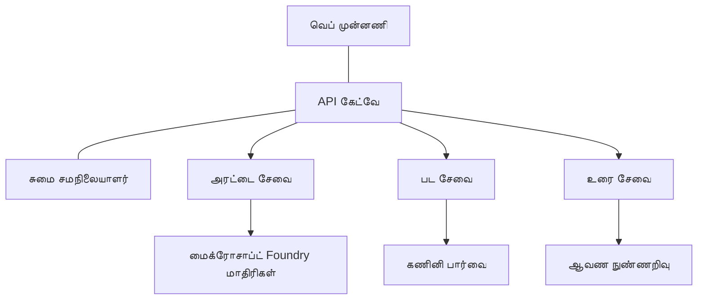

# AZD உடன் உற்பத்தி AI பணிச் சுமைகள் சிறந்த நடைமுறைகள்

**Chapter Navigation:**
- **📚 பாடநூல் முகப்பு**: [AZD For Beginners](../../README.md)
- **📖 தற்போதைய அத்தியாயம்**: Chapter 8 - Production & Enterprise Patterns
- **⬅️ முந்தைய அத்தியாயம்**: [Chapter 7: Troubleshooting](../chapter-07-troubleshooting/debugging.md)
- **⬅️ தொடர்புடையது மேலும்**: [AI Workshop Lab](ai-workshop-lab.md)
- **🎯 பாடநெறி முடிந்தது**: [AZD For Beginners](../../README.md)

## மேற்பார்வை

இந்த வழிகாட்டி Azure Developer CLI (AZD) பயன்படுத்தி உற்பத்திக்கு தயாரான AI பணிச் சுமைகளை despley செய்ய சிறந்த நடைமுறைகளை விரிவாக வழங்குகிறது. Microsoft Foundry Discord சமூகம் மற்றும் வாடிக்கையாளர் despley பணிகளிலிருந்து கிடைந்த பின்னூட்டத்தின் அடிப்படையில், இவை உற்பத்தி AI அமைப்புகளில் மிக பொதுவான சவால்களை தீர்க்கின்றன.

## முக்கிய சவால்கள்

எமது சமூகவாக்கு முடிவுகள் அடிப்படையில், டெவலப்பர்களுக்கு எதிர்கொள்ளும் முக்கிய சவால்கள் இவை:

- **45%** ஒரு பல்சேவையிலான AI despley களுடன் சிரமம் அனுபவிக்கிறார்கள்
- **38%** கடவுச்சொற்கள் மற்றும் ரகசிய மேலாண்மையில் சிக்கல்கள் உள்ளன  
- **35%** உற்பத்திக்கு தயாராக மற்றும் அளவை உயர்த்துவது கடினம் என்று கருப்பொக்குகிறார்கள்
- **32%** செலவு சிறப்பாக ஒழுங்குபடுத்த தேவையுள்ளது
- **29%** மேற்பார்வை மற்றும் பிழைத் தீர்க்கலில் மேம்பாடு வேண்டும்

## உற்பத்தி AI க்கான معماري மாதிரிகள்

### மாதிரி 1: மைக்ரோசேவைகள் AI معماري

**பயன்படுத்த வேண்டிய போது**: பல திறன்களைக் கொண்ட சிக்கலான AI பயன்பாடுகள்


**AZD அமல்படுத்தல்**:

```yaml
# azure.yaml
name: enterprise-ai-platform
services:
  web:
    project: ./web
    host: staticwebapp
  api-gateway:
    project: ./api-gateway
    host: containerapp
  chat-service:
    project: ./services/chat
    host: containerapp
  vision-service:
    project: ./services/vision
    host: containerapp
  text-service:
    project: ./services/text
    host: containerapp
```

### மாதிரி 2: நிகழ்வு-முனைவுத் திருத்தம் AI செயலாக்கம்

**பயன்படுத்த வேண்டிய போது**: தொகுதி செயலாக்கம், ஆவணம் பகுப்பாய்வு, அசிங்க் பணிச்சுழற்சிகள்

```bicep
// Event Hub for AI processing pipeline
resource eventHub 'Microsoft.EventHub/namespaces@2023-01-01-preview' = {
  name: eventHubNamespaceName
  location: location
  sku: {
    name: 'Standard'
    tier: 'Standard'
    capacity: 1
  }
}

// Service Bus for reliable message processing
resource serviceBus 'Microsoft.ServiceBus/namespaces@2022-10-01-preview' = {
  name: serviceBusNamespaceName
  location: location
  sku: {
    name: 'Premium'
    tier: 'Premium'
    capacity: 1
  }
}

// Function App for processing
resource functionApp 'Microsoft.Web/sites@2023-01-01' = {
  name: functionAppName
  location: location
  kind: 'functionapp,linux'
  properties: {
    siteConfig: {
      appSettings: [
        {
          name: 'FUNCTIONS_EXTENSION_VERSION'
          value: '~4'
        }
        {
          name: 'AZURE_OPENAI_ENDPOINT'
          value: '@Microsoft.KeyVault(VaultName=${keyVault.name};SecretName=openai-endpoint)'
        }
      ]
    }
  }
}
```

## AI ஏஜெண்ட் சுகாரித்தன்மையை பற்றி சிந்தித்தல்

ஒரு பாரம்பரிய வலை பயன்பாடு உடைந்தால், அறிகுறிகள் பரிச்சயமுள்ளவையாக இருக்கும்: ஒரு பக்கம் ஏற்றப்படவில்லை, ஒரு API பிழையை காட்டு, அல்லது ஒரு despley தோல்வி அடைகிறது. AI இயக்கப்படும் பயன்பாடுகள் அதே வழிகளில் உடையாகத்தான் உடையும்—ஆனால் அவை கணிசமான பிழை செய்திகளை உருவாக்காமல் நுணுக்கமாக தவறாக நடக்கலாம்.

இந்தப் பிரிவு AI பணிச் சுமைகளை கண்காணிக்க மனஅடிப்படைக் கொள்கையை உருவாக்க உதவுகிறது, असे நீங்கள் எங்கே பார்ப்பது என்பதனை அறிந்திருப்பீர்கள்.

### ஏஜெண்ட் சுகாரித்தன்மை பாரம்பரிய பயன்பாட்டு சுகாரித்தன்மையிலிருந்து எப்படி வேறுபடுகிறது

ஒரு பாரம்பரிய பயன்பாடு வேலை செய்கிறதா இல்லையா என்றே இருக்கும். ஒரு AI ஏஜெண்ட் வேலை செய்கிறபால் கூட மோசமான முடிவுகளை வழங்கலாம். ஏஜெண்ட் சுகாரித்தன்மையை இரண்டு அடுக்குகளில் நினைத்துக்கொள்ளுங்கள்:

| Layer | What to Watch | Where to Look |
|-------|--------------|---------------|
| **Infrastructure health** | சேவை செயல்பட்டுள்ளதா? வளங்கள் provision செய்யப்பட்டுள்ளதா? இடைமுகங்கள் கிடைக்கவுமா? | `azd monitor`, Azure Portal resource health, container/app logs |
| **Behavior health** | ஏஜெண்ட் சரியாக பதில் அளிக்கிறதா? பதில்கள் நேரத்துக்கு சீராகவா? மாதிரியை சரியாக அழைக்கப்படுகிறதா? | Application Insights traces, model call latency metrics, response quality logs |

Infrastructure health பரிச்சயமானது—இது எந்த azd பயன்பாட்டுக்கும் ஒரே மாதிரிதான். Behavior health என்பது AI பணிச் சுமைகள் அறிமுகப்படுத்தும் புதிய அடுக்கு ஆகும்.

### AI பயன்பாடுகள் எதிர்பார்த்தபடி நடக்காதபோது எங்கு பார்க்க வேண்டும்

உங்கள் AI பயன்பாடு எதிர்பார்த்த முடிவுகளை வழங்கவில்லை என்றால், இங்கே ஒரு கருத்து கொள்கைக் சரிபார்ப்பு பட்டியல்:

1. **அடிப்படைகளுடன் ஆரம்பிக்கவும்.** பயன்பாடு இயங்குகிறதா? அதன் சார்புகளுக்கு அணுகலுடனா இருக்கிறதா? எந்தவொரு பயன்பாட்டிற்கும் செய்தபோல் `azd monitor` மற்றும் resource health ஐச் சரிபார்க்கவும்.
2. **மாதிரி இணைப்பைச் சரிபார்.** உங்கள் பயன்பாடு AI மாதிரியை வெற்றிகரமாக அழைக்கிறதா? தோல்வியடைந்த அல்லது நேரம் முடிந்த மாதிரி அழைப்புகள் AI பயன்பாட்டுப் பிரச்சினைகளின் மிகவும் பொதுவான காரணமாகும் மற்றும் உங்கள் பயன்பாட்டுப் பதிவுகளில் தோன்றும்.
3. **மாதிரிக்கு என்ன பெற்றது என்பதைப் பாருங்கள்.** AI பதில்கள் உள்ளீட்டின் (prompt மற்றும் எதாவது மீட்டெடுக்கப்பட்ட context) மீது சார்ந்தவை. வெளியீடு தவறு என்றால், உள்ளீடு பெரும்பாலும் தவறாக இருக்கும். உங்கள் பயன்பாடு மாதிரிக்கு சரியான தரவை அனுப்புகிறதா என்பதைச் சரிபார்க்கவும்.
4. **பதில் தாமதத்தை மதிப்பாய்வு செய்யுங்கள்.** AI மாதிரி அழைப்புகள் சாதாரண API அழைப்புகளைவிட மெதுவாக இருக்கும். உங்கள் பயன்பாடு மெதுவாக உணரப்பட்டால், மாதிரி பதில் நேரம் அதிகரித்ததா என்பதைச் சரிபார்க்கவும்—இது throttling, திறன் எல்லைகள் அல்லது பிராந்திய அளவின் குறுக்கேற்றம் இருப்பதை குறிக்கலாம்.
5. **செலவு சின்னங்களை கவனிக்கவும்.** டோக்கன் பயன்பாடு அல்லது API அழைப்புகளில் எதிர்பாராத உயர்வுகள் ஒரு loop, தவறான தொகுப்பமைப்பு, அல்லது மிக அதிகமான மறுஜிகிரைகள் இருப்பதை குறிக்கலாம்.

நீங்கள் உடனடியாக கண்காணிப்பு கருவிகளில் நிபுணராவதற்குத் தேவையில்லை. முக்கியமான takeaway என்பது AI பயன்பாடுகள் மேலதிக நடத்தைக் அடுக்கைக் கண்காணிக்க வேண்டியது, மற்றும் azd இன் உட்பொருத்தமான கண்காணிப்பு (`azd monitor`) இரு அடுக்குகளையும் விசாரிக்க ஒரு தொடக்கப் புள்ளியை வழங்குகிறது.

---

## பாதுகாப்பு சிறந்த நடைமுறைகள்

### 1. சுழற்சி-நம்பிக்கை இல்லா (Zero-Trust) பாதுகாப்பு மாதிரி

**அமல்படுத்தல் யுக்தி**:
- authentication இல்லாமல் எந்த சேவையிடமும் சேவை-தானாக தொடர்பு கொள்ளக்கூடாது
- அனைத்து API அழைப்புகளும் managed identities பயன்படுத்தும்
- தனியார் இடைமுகங்களுடன் நெட்வொர்க் தனிமைப்படுத்தல்
- குறைந்த உரிமை அணுகல் கட்டுப்பாடுகள்

```bicep
// Managed Identity for each service
resource chatServiceIdentity 'Microsoft.ManagedIdentity/userAssignedIdentities@2023-01-31' = {
  name: 'chat-service-identity'
  location: location
}

// Role assignments with minimal permissions
resource openAIUserRole 'Microsoft.Authorization/roleAssignments@2022-04-01' = {
  scope: openAIAccount
  name: guid(openAIAccount.id, chatServiceIdentity.id, openAIUserRoleDefinitionId)
  properties: {
    roleDefinitionId: subscriptionResourceId('Microsoft.Authorization/roleDefinitions', '5e0bd9bd-7b93-4f28-af87-19fc36ad61bd')
    principalId: chatServiceIdentity.properties.principalId
    principalType: 'ServicePrincipal'
  }
}
```

### 2. ரகசிய மேலாண்மை பாதுகாப்பு

**Key Vault இணைப்பு மாதிரி**:

```bicep
// Key Vault with proper access policies
resource keyVault 'Microsoft.KeyVault/vaults@2023-02-01' = {
  name: keyVaultName
  location: location
  properties: {
    tenantId: tenant().tenantId
    sku: {
      family: 'A'
      name: 'premium'  // Use premium for production
    }
    enableRbacAuthorization: true  // Use RBAC instead of access policies
    enablePurgeProtection: true    // Prevent accidental deletion
    enableSoftDelete: true
    softDeleteRetentionInDays: 90
  }
}

// Store all AI service credentials
resource openAIKeySecret 'Microsoft.KeyVault/vaults/secrets@2023-02-01' = {
  parent: keyVault
  name: 'openai-api-key'
  properties: {
    value: openAIAccount.listKeys().key1
    attributes: {
      enabled: true
    }
  }
}
```

### 3. நெட்வொர்க் பாதுகாப்பு

**Private Endpoint அமைப்பு**:

```bicep
// Virtual Network for AI services
resource virtualNetwork 'Microsoft.Network/virtualNetworks@2023-04-01' = {
  name: vnetName
  location: location
  properties: {
    addressSpace: {
      addressPrefixes: ['10.0.0.0/16']
    }
    subnets: [
      {
        name: 'ai-services-subnet'
        properties: {
          addressPrefix: '10.0.1.0/24'
          privateEndpointNetworkPolicies: 'Disabled'
        }
      }
      {
        name: 'app-services-subnet'
        properties: {
          addressPrefix: '10.0.2.0/24'
          delegations: [
            {
              name: 'Microsoft.Web/serverFarms'
              properties: {
                serviceName: 'Microsoft.Web/serverFarms'
              }
            }
          ]
        }
      }
    ]
  }
}

// Private endpoints for all AI services
resource openAIPrivateEndpoint 'Microsoft.Network/privateEndpoints@2023-04-01' = {
  name: '${openAIAccountName}-pe'
  location: location
  properties: {
    subnet: {
      id: virtualNetwork.properties.subnets[0].id
    }
    privateLinkServiceConnections: [
      {
        name: 'openai-connection'
        properties: {
          privateLinkServiceId: openAIAccount.id
          groupIds: ['account']
        }
      }
    ]
  }
}
```

## செயல்திறன் மற்றும் அளவிடல்

### 1. தானியங்கி அளவீட்டு யுக்திகள்

**Container Apps தானியங்கி அளவீடு**:

```bicep
resource containerApp 'Microsoft.App/containerApps@2023-05-01' = {
  name: containerAppName
  location: location
  properties: {
    configuration: {
      ingress: {
        external: true
        targetPort: 8000
        transport: 'http'
      }
    }
    template: {
      scale: {
        minReplicas: 2  // Always have 2 instances minimum
        maxReplicas: 50 // Scale up to 50 for high load
        rules: [
          {
            name: 'http-scaling'
            http: {
              metadata: {
                concurrentRequests: '20'  // Scale when >20 concurrent requests
              }
            }
          }
          {
            name: 'cpu-scaling'
            custom: {
              type: 'cpu'
              metadata: {
                type: 'Utilization'
                value: '70'  // Scale when CPU >70%
              }
            }
          }
        ]
      }
    }
  }
}
```

### 2. கேஷ் செய்யும் யுக்திகள்

**AI பதில்களுக்கான Redis Cache**:

```bicep
// Redis Premium for production workloads
resource redisCache 'Microsoft.Cache/redis@2023-04-01' = {
  name: redisCacheName
  location: location
  properties: {
    sku: {
      name: 'Premium'
      family: 'P'
      capacity: 1
    }
    enableNonSslPort: false
    minimumTlsVersion: '1.2'
    redisConfiguration: {
      'maxmemory-policy': 'allkeys-lru'
    }
    // Enable clustering for high availability
    redisVersion: '6.0'
    shardCount: 2
  }
}

// Cache configuration in application
var cacheConnectionString = '${redisCache.properties.hostName}:6380,password=${redisCache.listKeys().primaryKey},ssl=True,abortConnect=False'
```

### 3. போக்குவரத்து சமன்வயம் மற்றும் வழிசெலுத்தல்

**WAF உடன் Application Gateway**:

```bicep
// Application Gateway with Web Application Firewall
resource applicationGateway 'Microsoft.Network/applicationGateways@2023-04-01' = {
  name: appGatewayName
  location: location
  properties: {
    sku: {
      name: 'WAF_v2'
      tier: 'WAF_v2'
      capacity: 2
    }
    webApplicationFirewallConfiguration: {
      enabled: true
      firewallMode: 'Prevention'
      ruleSetType: 'OWASP'
      ruleSetVersion: '3.2'
    }
    // Backend pools for AI services
    backendAddressPools: [
      {
        name: 'ai-services-pool'
        properties: {
          backendAddresses: [
            {
              fqdn: '${containerApp.properties.configuration.ingress.fqdn}'
            }
          ]
        }
      }
    ]
  }
}
```

## 💰 செலவு 최적화

### 1. வளங்களின் சரியான அளவு

**சுற்றுச்சூழல்-சார்ந்த அமைப்புகள்**:

```bash
# வளர்ச்சி சூழல்
azd env new development
azd env set AZURE_OPENAI_SKU "S0"
azd env set AZURE_OPENAI_CAPACITY 10
azd env set AZURE_SEARCH_SKU "basic"
azd env set CONTAINER_CPU 0.5
azd env set CONTAINER_MEMORY 1.0

# உற்பத்தி சூழல்
azd env new production
azd env set AZURE_OPENAI_SKU "S0"
azd env set AZURE_OPENAI_CAPACITY 100
azd env set AZURE_SEARCH_SKU "standard"
azd env set CONTAINER_CPU 2.0
azd env set CONTAINER_MEMORY 4.0
```

### 2. செலவு கண்காணிப்பு மற்றும் பட்ஜெட்டுகள்

```bicep
// Cost management and budgets
resource budget 'Microsoft.Consumption/budgets@2023-05-01' = {
  name: 'ai-workload-budget'
  properties: {
    timePeriod: {
      startDate: '2024-01-01'
      endDate: '2024-12-31'
    }
    timeGrain: 'Monthly'
    amount: 2000  // $2000 monthly budget
    category: 'Cost'
    notifications: {
      warning: {
        enabled: true
        operator: 'GreaterThan'
        threshold: 80
        contactEmails: [
          'finance@company.com'
          'engineering@company.com'
        ]
        contactRoles: [
          'Owner'
          'Contributor'
        ]
      }
      critical: {
        enabled: true
        operator: 'GreaterThan'
        threshold: 95
        contactEmails: [
          'cto@company.com'
        ]
      }
    }
  }
}
```

### 3. டோக்கன் பயன்பாடு 최적화

**OpenAI செலவு நிர்வாகம்**:

```typescript
// ஆப்ளிகேஷன்-மட்ட டோக்கன் மிகைப்படுத்தல்
class TokenOptimizer {
  private readonly maxTokens = 4000;
  private readonly reserveTokens = 500;
  
  optimizePrompt(userInput: string, context: string): string {
    const availableTokens = this.maxTokens - this.reserveTokens;
    const estimatedTokens = this.estimateTokens(userInput + context);
    
    if (estimatedTokens > availableTokens) {
      // பயனர் உள்ளீட்டை அல்லாமல் சூழலைக் சுருக்கவும்
      context = this.truncateContext(context, availableTokens - this.estimateTokens(userInput));
    }
    
    return `${context}\n\nUser: ${userInput}`;
  }
  
  private estimateTokens(text: string): number {
    // சராசரி கணிப்பு: 1 டோக்கன் ≈ 4 எழுத்துகள்
    return Math.ceil(text.length / 4);
  }
}
```

## கண்காணிப்பு மற்றும் கவனிப்பு

### 1. விரிவான Application Insights

```bicep
// Application Insights with advanced features
resource applicationInsights 'Microsoft.Insights/components@2020-02-02' = {
  name: applicationInsightsName
  location: location
  kind: 'web'
  properties: {
    Application_Type: 'web'
    WorkspaceResourceId: logAnalyticsWorkspace.id
    SamplingPercentage: 100  // Full sampling for AI apps
    DisableIpMasking: false  // Enable for security
  }
}

// Custom metrics for AI operations
resource aiMetricAlerts 'Microsoft.Insights/metricAlerts@2018-03-01' = {
  name: 'ai-high-error-rate'
  location: 'global'
  properties: {
    description: 'Alert when AI service error rate is high'
    severity: 2
    enabled: true
    scopes: [
      applicationInsights.id
    ]
    evaluationFrequency: 'PT1M'
    windowSize: 'PT5M'
    criteria: {
      'odata.type': 'Microsoft.Azure.Monitor.SingleResourceMultipleMetricCriteria'
      allOf: [
        {
          name: 'high-error-rate'
          metricName: 'requests/failed'
          operator: 'GreaterThan'
          threshold: 10
          timeAggregation: 'Count'
        }
      ]
    }
  }
}
```

### 2. AI-சிறப்பு கண்காணிப்பு

**AI அளவுகோடுகளுக்கான தனிப்பயன் டாஷ்போர்டுகள்**:

```json
// Dashboard configuration for AI workloads
{
  "dashboard": {
    "name": "AI Application Monitoring",
    "tiles": [
      {
        "name": "OpenAI Request Volume",
        "query": "requests | where name contains 'openai' | summarize count() by bin(timestamp, 5m)"
      },
      {
        "name": "AI Response Latency",
        "query": "requests | where name contains 'openai' | summarize avg(duration) by bin(timestamp, 5m)"
      },
      {
        "name": "Token Usage",
        "query": "customMetrics | where name == 'openai_tokens_used' | summarize sum(value) by bin(timestamp, 1h)"
      },
      {
        "name": "Cost per Hour",
        "query": "customMetrics | where name == 'openai_cost' | summarize sum(value) by bin(timestamp, 1h)"
      }
    ]
  }
}
```

### 3. சுகாரித் சோதனைகள் மற்றும் uptime கண்காணிப்பு

```bicep
// Application Insights availability tests
resource availabilityTest 'Microsoft.Insights/webtests@2022-06-15' = {
  name: 'ai-app-availability-test'
  location: location
  tags: {
    'hidden-link:${applicationInsights.id}': 'Resource'
  }
  properties: {
    SyntheticMonitorId: 'ai-app-availability-test'
    Name: 'AI Application Availability Test'
    Description: 'Tests AI application endpoints'
    Enabled: true
    Frequency: 300  // 5 minutes
    Timeout: 120    // 2 minutes
    Kind: 'ping'
    Locations: [
      {
        Id: 'us-east-2-azr'
      }
      {
        Id: 'us-west-2-azr'
      }
    ]
    Configuration: {
      WebTest: '''
        <WebTest Name="AI Health Check" 
                 Id="8d2de8d2-a2b0-4c2e-9a0d-8f9c9a0b8c8d" 
                 Enabled="True" 
                 CssProjectStructure="" 
                 CssIteration="" 
                 Timeout="120" 
                 WorkItemIds="" 
                 xmlns="http://microsoft.com/schemas/VisualStudio/TeamTest/2010" 
                 Description="" 
                 CredentialUserName="" 
                 CredentialPassword="" 
                 PreAuthenticate="True" 
                 Proxy="default" 
                 StopOnError="False" 
                 RecordedResultFile="" 
                 ResultsLocale="">
          <Items>
            <Request Method="GET" 
                     Guid="a5f10126-e4cd-570d-961c-cea43999a200" 
                     Version="1.1" 
                     Url="${webApp.properties.defaultHostName}/health" 
                     ThinkTime="0" 
                     Timeout="120" 
                     ParseDependentRequests="True" 
                     FollowRedirects="True" 
                     RecordResult="True" 
                     Cache="False" 
                     ResponseTimeGoal="0" 
                     Encoding="utf-8" 
                     ExpectedHttpStatusCode="200" 
                     ExpectedResponseUrl="" 
                     ReportingName="" 
                     IgnoreHttpStatusCode="False" />
          </Items>
        </WebTest>
      '''
    }
  }
}
```

## பேரழிவு மீட்பு மற்றும் உயர் கிடைக்கும் நிலை

### 1. பல பிராந்திய despley

```yaml
# azure.yaml - Multi-region configuration
name: ai-app-multiregion
services:
  api-primary:
    project: ./api
    host: containerapp
    env:
      - AZURE_REGION=eastus
  api-secondary:
    project: ./api
    host: containerapp
    env:
      - AZURE_REGION=westus2
```

```bicep
// Traffic Manager for global load balancing
resource trafficManager 'Microsoft.Network/trafficManagerProfiles@2022-04-01' = {
  name: trafficManagerProfileName
  location: 'global'
  properties: {
    profileStatus: 'Enabled'
    trafficRoutingMethod: 'Priority'
    dnsConfig: {
      relativeName: trafficManagerProfileName
      ttl: 30
    }
    monitorConfig: {
      protocol: 'HTTPS'
      port: 443
      path: '/health'
      intervalInSeconds: 30
      toleratedNumberOfFailures: 3
      timeoutInSeconds: 10
    }
    endpoints: [
      {
        name: 'primary-endpoint'
        type: 'Microsoft.Network/trafficManagerProfiles/azureEndpoints'
        properties: {
          targetResourceId: primaryAppService.id
          endpointStatus: 'Enabled'
          priority: 1
        }
      }
      {
        name: 'secondary-endpoint'
        type: 'Microsoft.Network/trafficManagerProfiles/azureEndpoints'
        properties: {
          targetResourceId: secondaryAppService.id
          endpointStatus: 'Enabled'
          priority: 2
        }
      }
    ]
  }
}
```

### 2. தரவு பின்நகல் மற்றும் மீட்பு

```bicep
// Backup configuration for critical data
resource backupVault 'Microsoft.DataProtection/backupVaults@2023-05-01' = {
  name: backupVaultName
  location: location
  identity: {
    type: 'SystemAssigned'
  }
  properties: {
    storageSettings: [
      {
        datastoreType: 'VaultStore'
        type: 'LocallyRedundant'
      }
    ]
  }
}

// Backup policy for AI models and data
resource backupPolicy 'Microsoft.DataProtection/backupVaults/backupPolicies@2023-05-01' = {
  parent: backupVault
  name: 'ai-data-backup-policy'
  properties: {
    policyRules: [
      {
        backupParameters: {
          backupType: 'Full'
          objectType: 'AzureBackupParams'
        }
        trigger: {
          schedule: {
            repeatingTimeIntervals: [
              'R/2024-01-01T02:00:00+00:00/P1D'  // Daily at 2 AM
            ]
          }
          objectType: 'ScheduleBasedTriggerContext'
        }
        dataStore: {
          datastoreType: 'VaultStore'
          objectType: 'DataStoreInfoBase'
        }
        name: 'BackupDaily'
        objectType: 'AzureBackupRule'
      }
    ]
  }
}
```

## DevOps மற்றும் CI/CD ஒருங்கிணைப்பு

### 1. GitHub Actions வேலைப் பக்கம்

```yaml
# .github/workflows/deploy-ai-app.yml
name: Deploy AI Application

on:
  push:
    branches: [main]
  pull_request:
    branches: [main]

jobs:
  test:
    runs-on: ubuntu-latest
    steps:
      - uses: actions/checkout@v4
      
      - name: Setup Python
        uses: actions/setup-python@v4
        with:
          python-version: '3.11'
          
      - name: Install dependencies
        run: |
          pip install -r requirements.txt
          pip install pytest
          
      - name: Run tests
        run: pytest tests/
        
      - name: AI Safety Tests
        run: |
          python scripts/test_ai_safety.py
          python scripts/validate_prompts.py

  deploy-staging:
    needs: test
    if: github.event_name == 'pull_request'
    runs-on: ubuntu-latest
    steps:
      - uses: actions/checkout@v4
      
      - name: Setup AZD
        uses: Azure/setup-azd@v1.0.0
        
      - name: Login to Azure
        uses: azure/login@v1
        with:
          creds: ${{ secrets.AZURE_CREDENTIALS }}
          
      - name: Deploy to Staging
        run: |
          azd env select staging
          azd deploy

  deploy-production:
    needs: test
    if: github.ref == 'refs/heads/main'
    runs-on: ubuntu-latest
    steps:
      - uses: actions/checkout@v4
      
      - name: Setup AZD
        uses: Azure/setup-azd@v1.0.0
        
      - name: Login to Azure
        uses: azure/login@v1
        with:
          creds: ${{ secrets.AZURE_CREDENTIALS }}
          
      - name: Deploy to Production
        run: |
          azd env select production
          azd deploy
          
      - name: Run Production Health Checks
        run: |
          python scripts/health_check.py --env production
```

### 2. உள்கட்டமைப்பு சோதனை

```bash
# scripts/validate_infrastructure.sh
#!/bin/bash

echo "Validating AI infrastructure deployment..."

# எல்லா தேவையான சேவைகளும் இயங்குகிறதா என்பதை சரிபார்க்கவும்
services=("openai" "search" "storage" "keyvault")
for service in "${services[@]}"; do
    echo "Checking $service..."
    if ! az resource list --resource-type "Microsoft.CognitiveServices/accounts" --query "[?contains(name, '$service')]" -o tsv; then
        echo "ERROR: $service not found"
        exit 1
    fi
done

# OpenAI மாடல் வினியோகங்களை சரிபார்க்கவும்
echo "Validating OpenAI model deployments..."
models=$(az cognitiveservices account deployment list --name $AZURE_OPENAI_NAME --resource-group $AZURE_RESOURCE_GROUP --query "[].name" -o tsv)
if [[ ! $models == *"gpt-35-turbo"* ]]; then
    echo "ERROR: Required model gpt-35-turbo not deployed"
    exit 1
fi

# AI சேவை இணைப்பை சோதிக்கவும்
echo "Testing AI service connectivity..."
python scripts/test_connectivity.py

echo "Infrastructure validation completed successfully!"
```

## உற்பத்தி தயார் சரிபார்ப்புப் பட்டியல்

### பாதுகாப்பு ✅
- [ ] அனைத்து சேவைகளும் managed identities பயன்படுத்துகின்றன
- [ ] ரகசியங்கள் Key Vault இல் சேமிக்கப்பட்டுள்ளன
- [ ] தனியார் இடைமுகங்கள் கான்ஃபிக் செய்யப்பட்டுள்ளன
- [ ] நெட்வொர்க் பாதுகாப்பு குழுக்கள் செயல்படுத்தப்பட்டுள்ளன
- [ ] குறைந்த உரிமையுடன் RBAC
- [ ] பொது இடைமுகங்களில் WAF இயங்குகிறது

### செயல்திறன் ✅
- [ ] தானியங்கி அளவீடு கட்டமைக்கப்பட்டது
- [ ] கேஷ் செயல்படுத்தப்பட்டது
- [ ] போக்குவரத்து சமநிலையமைவு அமைக்கப்பட்டது
- [ ] நிலையான உள்ளடக்கத்திற்கு CDN
- [ ] தரவுத்தள இணைப்பு குழாய் (connection pooling)
- [ ] டோக்கன் பயன்பாடு 최적화

### கண்காணிப்பு ✅
- [ ] Application Insights அமைக்கப்பட்டது
- [ ] தனிப்பயன் அளவுகோடுகள் வரையறுக்கப்பட்டுள்ளன
- [ ] அலெர்ட் விதிகள் அமைக்கப்பட்டுள்ளன
- [ ] டாஷ்போர்டு உருவாக்கப்பட்டது
- [ ] சுகாரித் சோதனைகள் செயல்படுத்தப்பட்டுள்ளன
- [ ] பதிவுRetention கொள்கைகள்

### நம்பகத்தன்மை ✅
- [ ] பல பிராந்திய despley
- [ ] பின்நகல் மற்றும் மீட்பு திட்டம்
- [ ] சர்க்கட் பிரேக்கர்கள் செயல்படுத்தப்பட்டுள்ளன
- [ ] மறுஉயிர்த்தல் கொள்கைகள் (retry policies) கட்டமைக்கப்பட்டுள்ளன
- [ ] மென்மையான வீழ்ச்சி (graceful degradation)
- [ ] சுகாரித் சோதனை இடைமுகங்கள்

### செலவு மேலாண்மை ✅
- [ ] பட்ஜெட் அலெர்ட்கள் கட்டமைக்கப்பட்டுள்ளன
- [ ] வளங்கள் சரியாக அளவிடப்பட்டுள்ளன
- [ ] Dev/test தள்ளுபடிகள் பொருந்தியுள்ளன
- [ ] ரிசர்வ் இன்ஸ்டான்ஸுகள் வாங்கப்பட்டுள்ளன
- [ ] செலவு கண்காணிப்பு டாஷ்போர்டு
- [ ] 규칙மான செலவு மதிப்பாய்வுகள்

### இணக்கம் (Compliance) ✅
- [ ] தரவு இருப்பிடத் தேவைகள் 충족ப்பட்டுள்ளன
- [ ] ஆடிட் பதிவேட்டுகள் இயங்குகின்றன
- [ ] இணக்கம் கொள்கைகள் நடைமுறைப்படுத்தப்பட்டுள்ளன
- [ ] பாதுகாப்பு அடிப்படைகள் அமல்படுத்தப்பட்டுள்ளன
- [ ] 규칙மான பாதுகாப்பு மதிப்பாய்வுகள்
- [ ] சம்பவ எதிர்வினை திட்டம்

## செயல்திறன் தரநிலைகள்

### பொது உற்பத்தி அளவுகோடுகள்

| Metric | Target | Monitoring |
|--------|--------|------------|
| **Response Time** | < 2 seconds | Application Insights |
| **Availability** | 99.9% | Uptime monitoring |
| **Error Rate** | < 0.1% | Application logs |
| **Token Usage** | < $500/month | Cost management |
| **Concurrent Users** | 1000+ | Load testing |
| **Recovery Time** | < 1 hour | Disaster recovery tests |

### லோட் சோதனை

```bash
# செயற்கை நுண்ணறிவு பயன்பாடுகளுக்கான சுமை சோதனை ஸ்கிரிப்ட்
python scripts/load_test.py \
  --endpoint https://your-ai-app.azurewebsites.net \
  --concurrent-users 100 \
  --duration 300 \
  --ramp-up 60
```

## 🤝 சமுதாய சிறந்த நடைமுறைகள்

Microsoft Foundry Discord சமூகவின் பின்னூட்டத்தின் அடிப்படையில்:

### சமுதாயத்தின் சிறந்த பரிந்துரைகள்:

1. **கூறுக்கு சிறிது தொடங்கவும், 徐々に அளவை அதிகரிக்கவும்**: அடிப்படை SKU களுடன் தொடங்கி, உண்மையான பயன்பாட்டின் அடிப்படையில் உயர்த்துங்கள்
2. **ஒவ்வொன்றையும் கண்காணிக்கவும்**: முதல் நாளிலேயே விரிவான கண்காணிப்பை அமைக்கவும்
3. **பாதுகாப்பை தானியக்கப்படுத்தவும்**: ஒரே மாதிரியான பாதுகாப்புக்கு உள்கட்டமைப்பு கூற்றைப் பயன்படுத்தவும்
4. **நன்கு சோதிக்கவும்**: உங்கள் பைப்லைனில் AI-சார்ந்த சோதனைகளை சேர்க்கவும்
5. **செலவுக்காக திட்டமிடுங்கள்**: டோக்கன் பயன்பாட்டைப் கண்காணித்து முதலில் பட்ஜெட் அலெர்ட்களை அமைக்கவும்

### தவிர்த்து கொள்ள வேண்டிய பொதுவான தவறுகள்:

- ❌ API விசைகளை குறியீட்டில் கடைப்பிடித்தல்
- ❌ சரியான கண்காணிப்பு அமைக்காதல்
- ❌ செலவு 최적화를 புறக்கணித்தல்
- ❌ தோல்வி சூழ்நிலைகளை சோதிக்காமை
- ❌ சுகாரித் சோதனைகள் இல்லாமல் despley செய்தல்

## AZD AI CLI கட்டளைகள் மற்றும் விரிவாக்கங்கள்

AZD உற்பத்தி AI பணிச் சுமைகளுக்கான வேலைநடைகளை எளிதாக்கும் AI-சிறப்பு கட்டளைகள் மற்றும் விரிவாக்கங்களின் வளர்ந்து வரும் தொகுப்பை உள்ளடக்கியுள்ளது. இவை உள்ளூர் அபிவிருத்தி மற்றும் உற்பத்தி despley இடையேயான இடைவெளியை குறைக்க உதவுகின்றன.

### AI க்கான AZD விரிவாக்கங்கள்

AZD AI-சிறப்பு திறன்களை சேர்க்க ஒரு விரிவாக்க அமைப்பை பயன்படுத்துகிறது. விரிவாக்கங்களை நிறுவவும் நிர்வகிக்கவும்:

```bash
# கிடைக்கும் அனைத்து விரிவாக்கங்களையும் (AI உட்பட) பட்டியலிடு
azd extension list

# Foundry முகவர்கள் விரிவாக்கத்தை நிறுவு
azd extension install azure.ai.agents

# நுணுக்கமான சீரமைத்தல் விரிவாக்கத்தை நிறுவு
azd extension install azure.ai.finetune

# தனிப்பயன் மாதிரிகள் விரிவாக்கத்தை நிறுவு
azd extension install azure.ai.models

# நிறுவப்பட்ட அனைத்து விரிவாக்கங்களையும் மேம்படுத்து
azd extension upgrade --all
```

**கிடைக்கும் AI விரிவாக்கங்கள்:**

| Extension | Purpose | Status |
|-----------|---------|--------|
| `azure.ai.agents` | Foundry Agent Service மேலாண்மை | Preview |
| `azure.ai.finetune` | Foundry மாதிரி fine-tuning | Preview |
| `azure.ai.models` | Foundry தனிப்பயன் மாதிரிகள் | Preview |
| `azure.coding-agent` | కోడింగ్ ஏஜெண்ட் கட்டமைப்பு | Available |

### `azd ai agent init` கொண்டு ஏஜெண்ட் பிராஜெக்டுகளை துவக்குதல்

`azd ai agent init` கட்டளை Microsoft Foundry Agent Service உடன் ஒருங்கிணைக்கப்பட்ட உற்பத்தி-தயாரான AI ஏஜெண்ட் பிராஜெக்டை scaffolding செய்கிறது:

```bash
# ஏஜென்ட் மேனிபெஸ்டில் இருந்து புதிய ஏஜென்ட் திட்டத்தை துவக்கவும்
azd ai agent init -m <manifest-path-or-uri>

# குறிப்பிட்ட Foundry திட்டத்தை துவக்கி இலக்காக அமைக்கவும்
azd ai agent init -m agent-manifest.yaml --project-id <foundry-project-id>

# தனிப்பயன் மூல அடைவை பயன்படுத்தி துவக்கவும்
azd ai agent init -m agent-manifest.yaml --src ./agents/my-agent

# Container Apps-ஐ ஹோஸ்டாக இலக்காக அமைக்கவும்
azd ai agent init -m agent-manifest.yaml --host containerapp
```

**முக்கிய கொடி சிக்னல்கள்:**

| Flag | Description |
|------|-------------|
| `-m, --manifest` | உங்கள் பிராஜெக்டில் சேர்க்க ஒரு agent manifest இற்கு பாதை அல்லது URI |
| `-p, --project-id` | உங்கள் azd சூழலுக்கான இருக்கும் Microsoft Foundry Project ID |
| `-s, --src` | agent வரையறையை பதிவிறக்க Directory (இயல்பாக `src/<agent-id>`) |
| `--host` | இயல்புநிலை host ஐ மேல்மையிடும் (உதாரணமாக, `containerapp`) |
| `-e, --environment` | பயன்படுத்துவதற்கான azd சுற்றுச்சூழல் |

**உற்பத்தி சிறந்த யுக்தி**: தொடக்கத்தில் உங்கள் agent குறியீடு மற்றும் மங்கை வளங்களை இணைத்து வைக்க `--project-id` ஐப் பயன்படுத்தவும்.

### `azd mcp` உடன் Model Context Protocol (MCP)

AZD கட்டமைப்பில் உள்ள MCP சர்வர் ஆதரவு (அல்பா) உள்ளது, இது AI ஏஜெண்ட்கள் மற்றும் கருவிகள் உங்கள் Azure வளங்களுடன் ஒரு சீரான நெறிமுறையின் மூலம் தொடர்பு கொள்வதை சாத்தியமாக்குகிறது:

```bash
# உங்கள் திட்டத்திற்காக MCP சர்வரை துவங்கவும்
azd mcp start

# MCP செயல்பாடுகளுக்கான கருவி ஒப்புதலை நிர்வகிக்கவும்
azd mcp consent
```

MCP சர்வர் உங்கள் azd பிராஜெக்ட் context—சுற்றுச்சூழல்கள், சேவைகள் மற்றும் Azure வளங்கள்—ஐ AI சக்தி வாய்ந்த அபிவிருத்தி கருவிகளுக்கு வெளிப்படுத்துகிறது. இது சாத்தியமாக்குகிறது:

- **AI-உதவியுடன் despley**: கோடிங் ஏஜெண்ட்கள் உங்கள் பிராஜெக்ட் நிலையை பதிவேற்றம் செய்து despleyஐ தொடங்கலாம்
- **வள கண்டறிதல்**: AI கருவிகள் உங்கள் பிராஜெக்ட் பயன்படுத்தும் Azure வளங்களை கண்டறியலாம்
- **சுற்றுச்சூழல் மேலாண்மை**: ஏஜெண்ட்கள் dev/staging/production சுற்றுச்சூழல்களை மாற்றலாம்

### `azd infra generate` உடன் உள்கட்டமைப்பு உருவாக்கல்

உற்பத்தி AI பணிச் சுமைகளிற்காக, தானாக provision செய்யப்படுவதைத் தவிர நீங்கள் Infrastructure as Code ஐ உருவாக்கி துணைமை செய்யலாம்:

```bash
# உங்கள் திட்ட வரையறையிலிருந்து Bicep/Terraform கோப்புகளை உருவாக்கவும்
azd infra generate
```

இது IaC ஐ மடிக்கணக்கில் எழுதுகிறது எனவே நீங்கள்:
- despley முன் உள்கட்டமைப்பை மதிப்பாய்வு மற்றும் ஆடிட் செய்ய
- குறிப்பிட்ட பாதுகாப்பு கொள்கைகள் (network விதிகள், private endpoints) சேர்க்க
- உள்ளமைவாகுள்ள IaC ஆய்வு செயல்முறைகளுடன் ஒருங்கிணைக்க
- பயன்பாட்டு குறியீட்டிலிருந்து தனியாக உள்கட்டமைப்பு மாற்றங்களை பதிப்பு கட்டுப்பாட்டில் வைக்க

### உற்பத்தி வாழ்நாள் ஹுக்குகள்

AZD ஹுக்குகள் despley வாழ்நாளின் ஒவ்வொரு கட்டத்திலும் தனிப்பயன் தர்க்கத்தை ஊக்குவிக்க உதவுகிறது—உற்பத்தி AI பணிச் சுமைகளுக்கு இது கடுங்கிறது:

```yaml
# azure.yaml - Production hooks example
name: ai-production-app
hooks:
  preprovision:
    shell: sh
    run: scripts/validate-quotas.sh    # Check AI model quota before provisioning
  postprovision:
    shell: sh
    run: scripts/configure-networking.sh  # Set up private endpoints
  predeploy:
    shell: sh
    run: scripts/run-ai-safety-tests.sh  # Run prompt safety checks
  postdeploy:
    shell: sh
    run: scripts/smoke-test.sh           # Verify agent responses post-deploy
services:
  agent-api:
    project: ./src/agent
    host: containerapp
    hooks:
      predeploy:
        shell: sh
        run: scripts/validate-model-access.sh  # Per-service hook
```

```bash
# வளர்ச்சி நிலையில் ஒரு குறிப்பிட்ட ஹூக்கை கைமுறையாக இயக்கவும்
azd hooks run predeploy
```

**AI பணிச் சுமைகளுக்கான பரிந்துரைக்கப்பட்ட உற்பத்தி ஹூக்கள்:**

| Hook | Use Case |
|------|----------|
| `preprovision` | AI மாதிரி திறன் குவாட்டாக்களுக்கு subscription quotas ஐ சரிபார்க்க |
| `postprovision` | தனியார் இடைமுகங்களை கான்ஃபிக் செய்ய, மாதிரி எடை(deploy model weights) பதிய |
| `predeploy` | AI பாதுகாப்பு சோதனைகள் இயக்கவும், prompt கருவிகளை சரிபார்க்கவும் |
| `postdeploy` | ஏஜெண்ட் பதில்களை smoke test செய்யவும், மாதிரி இணைப்பை சரிபார்க்கவும் |

### CI/CD குழும அமைப்பு

உங்கள் பிராஜெக்டை GitHub Actions அல்லது Azure Pipelines உடன் பாதுகாப்பான Azure அங்கீகரிப்புடன் இணைக்க `azd pipeline config` ஐப் பயன்படுத்தவும்:

```bash
# CI/CD பைப்ப்லைன் (பரஸ்பர செயல்பாடான) அமைக்கவும்
azd pipeline config

# ஒரு குறிப்பிட்ட சேவை வழங்குநருடன் கட்டமைக்கவும்
azd pipeline config --provider github
```

இந்த கட்டளை:
- குறைந்த உரிமையுள்ள ஒரு service principal உருவாக்குகிறது
- இணைநிலை அங்கீகாரங்கள் (federated credentials) அமைக்கிறது (சேமிக்கப்பட்ட ரகசியங்கள் இல்லாமல்)
- உங்கள் குழும வரையறை கோப்பை உருவாக்க அல்லது புதுப்பிக்கிறது
- உங்கள் CI/CD அமைப்பில் தேவையான சுற்றுச்சூழல் மாறிகளைக் குறிப்பிடுகிறது

**குழும உற்பத்தி வேலைநடை:**

```bash
# 1. உற்பத்தி சூழலை அமைக்கவும்
azd env new production
azd env set AZURE_OPENAI_CAPACITY 100

# 2. பைப்ப்லைனை கட்டமைக்கவும்
azd pipeline config --provider github

# 3. பிரதான கிளைக்கு (main) ஒவ்வொரு push-இலும் பைப்ப்லைன் azd deploy ஐ இயக்குகிறது
```

### `azd add` கொண்டு கூறுகளைச் சேர்த்தல்

நிலையான பிராஜெக்டில் Azure சேவைகளை படியாகச் சேர்க்க:

```bash
# பயனருடன் இடையிலான முறையில் புதிய சேவை கூறை சேர்க்கவும்
azd add
```

இது உற்பத்தி AI பயன்பாடுகளை விரிவாக்குவதற்கு மிகவும் பயனுள்ளது—மثالுக்கு, ஒரு வெக்டர் தேடல் சேவை சேர்ப்பது, புதிய ஏஜெண்ட் இடைமுகம், அல்லது ஏற்கனவே உள்ள despleyக்கு ஒரு கண்காணிப்பு கூறு இணைக்குதல்.

## கூடுதல் வளங்கள்
- **Azure நன்கு வடிவமைக்கப்பட்ட கட்டமைப்பு**: [AI பணிச்சுமை வழிகாட்டி](https://learn.microsoft.com/azure/well-architected/ai/)
- **Microsoft Foundry ஆவணங்கள்**: [அதிகாரப்பூர்வ ஆவணங்கள்](https://learn.microsoft.com/azure/ai-studio/)
- **சமூக வார்ப்புகள்**: [Azure மாதிரிகள்](https://github.com/Azure-Samples)
- **Discord சமூகம்**: [#Azure சேனல்](https://discord.gg/microsoft-azure)
- **Azure-க்கான முகவர் திறன்கள்**: [microsoft/github-copilot-for-azure on skills.sh](https://skills.sh/microsoft/github-copilot-for-azure) - Azure AI, Foundry, விநியோகிப்பு, செலவு ஒழுங்குபடுத்தல் மற்றும் டயக்னோஸ்டிக்ஸ் ஆகியவற்றுக்கான 37 திறந்த முகவர் திறன்கள். உங்கள் எடிட்டரில் நிறுவுங்கள்:
  ```bash
  npx skills add microsoft/github-copilot-for-azure
  ```

---

**அத்தியாய வழிசெலுத்தல்:**
- **📚 பாடநெறி முகப்பு**: [AZD For Beginners](../../README.md)
- **📖 தற்போதைய அத்தியாயம்**: அத்தியாயம் 8 - உற்பத்தி மற்றும் நிறுவன மாதிரிகள்
- **⬅️ முந்தைய அத்தியாயம்**: [அத்தியாயம் 7: பிழை தீர்வு](../chapter-07-troubleshooting/debugging.md)
- **⬅️ மேலும் தொடர்புடையவை**: [AI பணிமனை ஆய்வகம்](ai-workshop-lab.md)
- **� பாடநெறி முடிந்தது**: [AZD For Beginners](../../README.md)

**கவனத்திற்கு**: உற்பத்தி AI பணிச்சுமைகள் கவனமான திட்டமிடல், கண்காணிப்பு மற்றும் தொடர்ச்சியான மேம்பாட்டை தேவைப்படுத்தும். இந்த மாதிரிகளுடன் தொடங்கி, அவற்றை உங்கள் குறிப்பிட்ட தேவைகளுக்கு ஏற்ப ஒழுங்குசெய்க.

---

<!-- CO-OP TRANSLATOR DISCLAIMER START -->
மறுப்புரை:
இந்த ஆவணம் AI மொழிபெயர்ப்பு சேவையான Co-op Translator (https://github.com/Azure/co-op-translator) மூலம் மொழிபெயர்க்கப்பட்டுள்ளது. நாங்கள் துல்லியத்திற்காக முயலினாலும், தானியங்கி மொழிபெயர்ப்புகளில் பிழைகள் அல்லது துல்லியமின்மைகள் இருக்கக்கூடும் என்பதை தயவுசெய்து கவனத்தில் கொள்ளுங்கள். மூல ஆவணத்தை அதன் சொந்த மொழியில் அதிகாரப்பூர்வ ஆதாரமாக கருத வேண்டும். முக்கியமான தகவல்களுக்கு, தொழில்முறை மனித மொழிபெயர்ப்பை பரிந்துரைக்கிறோம். இந்த மொழிபெயர்ப்பின் பயன்பாட்டால் ஏற்படும் எந்தவொரு தவறான புரிதல்கள் அல்லது தவறான பொருள் விளக்கங்களுக்கும் நாங்கள் பொறுப்பேற்கமாட்டோம்.
<!-- CO-OP TRANSLATOR DISCLAIMER END -->