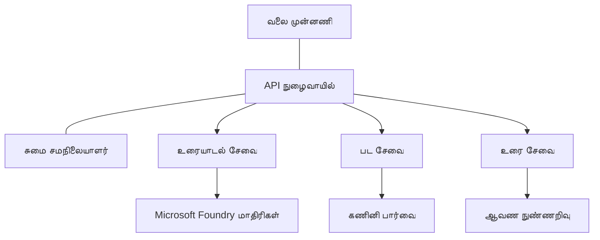

# AZD உடன் உற்பத்தி AI பணிச்சுமை சிறந்த நடைமுறைகள்

**அத்தியாயம் வழிசெலுத்தல்:**
- **📚 பாடநெறி முகப்பு**: [AZD - ஆரம்பக்கூடியவர்களுக்கு](../../README.md)
- **📖 தற்போதைய அத்தியாயம்**: அத்தியாயம் 8 - உற்பத்தி மற்றும் நிறுவன மாதிரிகள்
- **⬅️ முந்தைய அத்தியாயம்**: [அத்தியாயம் 7: பிழைத் தீர்க்கல்](../chapter-07-troubleshooting/debugging.md)
- **⬅️ தொடர்புடையவை**: [AI பணிமனை ஆய்வு](ai-workshop-lab.md)
- **🎯 பாடநெறி முடிந்தது**: [AZD - ஆரம்பக்கூடியவர்களுக்கு](../../README.md)

## கண்ணோட்டம்

இந்த வழிகாட்டி Azure Developer CLI (AZD) பயன்படுத்தி உற்பத்தி-திட்டத்திற்கு தயாரான AI பணிச்சுமைகளை 배치 செய்ய உதவும் விரிவான சிறந்த நடைமுறைகளை வழங்குகிறது. Microsoft Foundry Discord சமூகத்திலிருந்து மற்றும் விற்பனையாளர் இடைமுகக்கான பயனீடு அனுபவங்களில் பெற்று செய்யப்பட்ட கருத்துக்களின்படி, இந்த நடைமுறைகள் உற்பத்தி AI அமைப்புகளில் பொதுவாக எதிர்கொள்ளப்படும் சவால்களை முகாமிடுகிறது.

## தீர்க்கப்படும் முக்கிய சவால்கள்

நமது சமூக சர்வே முடிவுகளின் அடிப்படையில், டெவலப்பர்கள் எதிர்கொள்ளும் முக்கிய சவால்கள் இவையே:

- **45%** பல சேவைகள் கொண்ட AI deployments-ஐ நிர்வகிப்பதில் சிரமம்
- **38%** சான்றிதழ் மற்றும் ரகசிய மேலாண்மையில் சிக்கல்கள்  
- **35%** உற்பத்தி-தயார்தன்மை மற்றும் அளவீடு கடினம்
- **32%** செலவு சிறப்புமுறை தூண்டுதல்களுக்கு மேம்பாடு தேவை
- **29%** கண்காணிப்பு மற்றும் பிழைத் தீர்க்கலில் மேம்பாடு தேவை

## உற்பத்தி AI-க்கான கட்டமைப்பு மாதிரிகள்

### மாதிரி 1: மைக்ரோசேவைகள் AI கட்டமைப்பு

**பயன்படுவதற்கு எப்போது**: பல திறன்களைக் கொண்ட சிக்கலான AI பயன்பாடுகளுக்காக



**AZD நடைமுறை அமலாக்கம்**:

```yaml
# azure.yaml
name: enterprise-ai-platform
services:
  web:
    project: ./web
    host: staticwebapp
  api-gateway:
    project: ./api-gateway
    host: containerapp
  chat-service:
    project: ./services/chat
    host: containerapp
  vision-service:
    project: ./services/vision
    host: containerapp
  text-service:
    project: ./services/text
    host: containerapp
```

### மாதிரி 2: நிகழ்வு தூண்டிய AI செயலாக்கம்

**பயன்படுவதற்கு எப்போது**: தொகுப்பு செயலாக்கம், ஆவண பகுப்பாய்வு, அசிங்க் வேலைசூழல்கள்

```bicep
// Event Hub for AI processing pipeline
resource eventHub 'Microsoft.EventHub/namespaces@2023-01-01-preview' = {
  name: eventHubNamespaceName
  location: location
  sku: {
    name: 'Standard'
    tier: 'Standard'
    capacity: 1
  }
}

// Service Bus for reliable message processing
resource serviceBus 'Microsoft.ServiceBus/namespaces@2022-10-01-preview' = {
  name: serviceBusNamespaceName
  location: location
  sku: {
    name: 'Premium'
    tier: 'Premium'
    capacity: 1
  }
}

// Function App for processing
resource functionApp 'Microsoft.Web/sites@2023-01-01' = {
  name: functionAppName
  location: location
  kind: 'functionapp,linux'
  properties: {
    siteConfig: {
      appSettings: [
        {
          name: 'FUNCTIONS_EXTENSION_VERSION'
          value: '~4'
        }
        {
          name: 'AZURE_OPENAI_ENDPOINT'
          value: '@Microsoft.KeyVault(VaultName=${keyVault.name};SecretName=openai-endpoint)'
        }
      ]
    }
  }
}
```

## AI முகவர் (Agent) சுகநிலை பற்றி சிந்தித்தல்

சாதாரண வலை பயன்பாடு சேதமடைந்தால், அறிகுறிகள் பரிச்சயமானவை: ஒரு பக்கம் ஏற்றமடையவில்லை, ஒரு API வழு திருப்புகிறது, அல்லது ஒரு deployment தோல்வி அடைகிறது. AI-சக்தியுடைய பயன்பாடுகள் அதே வழிகளில் தடைபடலாம்—ஆனால் அவை தெளிவு இல்லாத தவறான நடத்தை நிரூபிக்கும் விதமாகவும் நடக்கலாம், தெளிவான பிழைச் செய்திகள் தராமலே.

இந்த பிரிவு AI பணிச்சுமைகளை கண்காணிக்க ஒரு மனப்பாட மாடலை உருவாக்க உதவுகிறது, தவறாக இருக்கும் போது எங்கு தேட வேண்டும் என்று நீங்கள் தெரிந்து கொள்ள உதவும்.

### முகவர் சுகநிலை வழக்கமான பயன்பாட்டு சுகநிலையிலிருந்து எப்படி வேறுபடுகிறது

சாதாரண பயன்பாடு வேலை செய்கிறது அல்லது செய்யாது. ஒரு AI முகவர் வேலை செய்கிறதாக தோன்றினாலும் தரமான முடிவுகளை வழங்காமல் இருக்கலாம். முகவர் சுகநிலையை இரண்டு அடுக்குகளில் சிந்தியுங்கள்:

| அடுக்கு | கவனிக்க வேண்டியது | எங்கு பார்க்க வேண்டும் |
|-------|--------------|---------------|
| **Infrastructure health** | சேவை இயங்குகிறதா? வளங்கள் ஒதுக்கப்பட்டுள்ளனவா? எண்ட்பாயிண்டுகள் அணுகக்கூடியவையா? | `azd monitor`, Azure Portal resource health, container/app logs |
| **Behavior health** | முகவர் துல்லியமாக பதிலளிக்கிறதா? பதில்கள் நேரத்துக்கு உடன்படுகிறதா? மாதிரி சரியாக அழைக்கப்படுகிறதா? | Application Insights traces, model call latency metrics, response quality logs |

அடிப்படை அமைப்பு சுகநிலை பரிச்சயமானது—இது எந்த azd பயன்பாட்டிற்கும் ஒன்றே. நடத்தை சுகநிலை AI பணிச்சுமைகள் introduces செய்யும் புதிய அடுக்கு.

### AI பயன்பாடுகள் எதிர்பார்ப்பிற்கேற்ப நடக்காமல் இருக்கும்போது எங்கு பார்க்க வேண்டும்

உங்கள் AI பயன்பாடு எதிர்பார்த்த முடிவுகளை வழங்கக்கூடாதால், இங்கே ஒரு கருத்தரீதியான சரிபார்ப்பு பட்டியல் உள்ளது:

1. **அடிப்படையிலிருந்து தொடங்குங்கள்.** பயன்பாடு இயங்குகிறதா? அது அதன் சார்புள்ளவற்றை அணுகக்கூடுகிறதா? எந்தவொரு பயன்பாட்டிற்கும் போலவே `azd monitor` மற்றும் resource health-ஐ சரிபார்க்கவும்.
2. **மாதிரி கண்ணைச் சரிபார்க்கவும்.** உங்கள் பயன்பாடு AI மாதிரியை வெற்றிகரமாக அழைக்கிறதா? தோல்வியடைந்த அல்லது நேரம் முடிந்த மாதிரி அழைப்புகள் AI பயன்பாடு பிரச்சனைகளுக்கான பொதுவான காரணமாகும் மற்றும் உங்கள் பயன்பாட்டு பதிவுகளில் தோன்றும்.
3. **மாதிரிக்கு என்ன கிடைத்தது என்பதைக் காண்க.** AI பதில்கள் உள்ளீட்டின் (prompt மற்றும் ஏதாவது மீட்டெடுக்கப்பட்ட context) மீது منحصر. வெளியீடு தவறானால், உள்ளீடு தவறாக இருப்பதே சமஸ்யை உண்டாக்கும். உங்கள் பயன்பாடு மாதிரிக்கு சரியான தரவுகளை அனுப்புகிறதா என்பதை சரிபார்க்கவும்.
4. **பதில் தாமதத்தை மதிப்பாய்வு செய்யவும்.** AI மாதிரி அழைப்புகள் சாதாரண API அழைப்புகளைவிட மெதுவாக இருக்கும். உங்கள் பயன்பாடு மெதுவாக உணரப்பட்டால், மாதிரி பதில் நேரங்கள் அதிகமாகியுள்ளதா என்பதை சரிபார்க்கவும்—இது throttling, திறன்குறைவுகள் (capacity limits), அல்லது பிராந்திய அளவிலான கூட்டமும் சுட்டிக்காட்டலாம்.
5. **செலவுச் சிக்னல்களை கவனியுங்கள்.** டோக்கன் பயன்படுத்தல் அல்லது API அழைப்புகளில் எதிர்பாராத உயர்வுகள் ஒரு லூப், தவறாக உள்ளமைவான prompt, அல்லது அதிகமான மீண்டும் முயற்சிகள் இருப்பதை குறிப்பதாக இருக்கலாம்.

உங்களுக்கு உடனடியாக observability கருவிகளை முழுமையாக கையாள தேவையில்லை. முக்கியமானது என்னவென்றால் AI பயன்பாடுகளில் ஒரு கூடுதல் நடத்தை அடுக்கு இருக்கும், மற்றும் azd-ன் உள்ளமைவான கண்காணிப்பு (`azd monitor`) இந்த இரு அடுக்குகளையும் ஆராய தொடக்க புள்ளியாக ஆகும்.

---

## பாதுகாப்பு சிறந்த நடைமுறைகள்

### 1. பூஜ்ய நம்பிக்கை (Zero-Trust) பாதுகாப்பு மாதிரி

**செயலாக்க நெறிமுறை**:
- அங்கீகாரமின்றி சேவை-மீது-சேவை தொடர்பு இல்லை
- அனைத்து API அழைப்புகளும் managed identities ஐ பயன்படுத்தும்
- தனியுரைவு முடுக்குகள் (private endpoints) மூலம் நெட்வொர்க் தனிமை
- குறைந்த அனுமதி கொள்கைகள் (least privilege access controls)

```bicep
// Managed Identity for each service
resource chatServiceIdentity 'Microsoft.ManagedIdentity/userAssignedIdentities@2023-01-31' = {
  name: 'chat-service-identity'
  location: location
}

// Role assignments with minimal permissions
resource openAIUserRole 'Microsoft.Authorization/roleAssignments@2022-04-01' = {
  scope: openAIAccount
  name: guid(openAIAccount.id, chatServiceIdentity.id, openAIUserRoleDefinitionId)
  properties: {
    roleDefinitionId: subscriptionResourceId('Microsoft.Authorization/roleDefinitions', '5e0bd9bd-7b93-4f28-af87-19fc36ad61bd')
    principalId: chatServiceIdentity.properties.principalId
    principalType: 'ServicePrincipal'
  }
}
```

### 2. பாதுகாப்பான ரகசிய மேலாண்மை

**Key Vault இணைப்பு மாதிரி**:

```bicep
// Key Vault with proper access policies
resource keyVault 'Microsoft.KeyVault/vaults@2023-02-01' = {
  name: keyVaultName
  location: location
  properties: {
    tenantId: tenant().tenantId
    sku: {
      family: 'A'
      name: 'premium'  // Use premium for production
    }
    enableRbacAuthorization: true  // Use RBAC instead of access policies
    enablePurgeProtection: true    // Prevent accidental deletion
    enableSoftDelete: true
    softDeleteRetentionInDays: 90
  }
}

// Store all AI service credentials
resource openAIKeySecret 'Microsoft.KeyVault/vaults/secrets@2023-02-01' = {
  parent: keyVault
  name: 'openai-api-key'
  properties: {
    value: openAIAccount.listKeys().key1
    attributes: {
      enabled: true
    }
  }
}
```

### 3. நெட்வொர்க் பாதுகாப்பு

**பிரைவேட் என்ட்பாயிண்ட் அமைப்பு**:

```bicep
// Virtual Network for AI services
resource virtualNetwork 'Microsoft.Network/virtualNetworks@2023-04-01' = {
  name: vnetName
  location: location
  properties: {
    addressSpace: {
      addressPrefixes: ['10.0.0.0/16']
    }
    subnets: [
      {
        name: 'ai-services-subnet'
        properties: {
          addressPrefix: '10.0.1.0/24'
          privateEndpointNetworkPolicies: 'Disabled'
        }
      }
      {
        name: 'app-services-subnet'
        properties: {
          addressPrefix: '10.0.2.0/24'
          delegations: [
            {
              name: 'Microsoft.Web/serverFarms'
              properties: {
                serviceName: 'Microsoft.Web/serverFarms'
              }
            }
          ]
        }
      }
    ]
  }
}

// Private endpoints for all AI services
resource openAIPrivateEndpoint 'Microsoft.Network/privateEndpoints@2023-04-01' = {
  name: '${openAIAccountName}-pe'
  location: location
  properties: {
    subnet: {
      id: virtualNetwork.properties.subnets[0].id
    }
    privateLinkServiceConnections: [
      {
        name: 'openai-connection'
        properties: {
          privateLinkServiceId: openAIAccount.id
          groupIds: ['account']
        }
      }
    ]
  }
}
```

## செயல்திறன் மற்றும் அளவீடு

### 1. தானாக அளவீடு நெறிமுறைகள்

**Container Apps தானாக அளவீடு**:

```bicep
resource containerApp 'Microsoft.App/containerApps@2023-05-01' = {
  name: containerAppName
  location: location
  properties: {
    configuration: {
      ingress: {
        external: true
        targetPort: 8000
        transport: 'http'
      }
    }
    template: {
      scale: {
        minReplicas: 2  // Always have 2 instances minimum
        maxReplicas: 50 // Scale up to 50 for high load
        rules: [
          {
            name: 'http-scaling'
            http: {
              metadata: {
                concurrentRequests: '20'  // Scale when >20 concurrent requests
              }
            }
          }
          {
            name: 'cpu-scaling'
            custom: {
              type: 'cpu'
              metadata: {
                type: 'Utilization'
                value: '70'  // Scale when CPU >70%
              }
            }
          }
        ]
      }
    }
  }
}
```

### 2. கசேச் நெறிமுறைகள்

**AI பதில்களுக்கு Redis Cache**:

```bicep
// Redis Premium for production workloads
resource redisCache 'Microsoft.Cache/redis@2023-04-01' = {
  name: redisCacheName
  location: location
  properties: {
    sku: {
      name: 'Premium'
      family: 'P'
      capacity: 1
    }
    enableNonSslPort: false
    minimumTlsVersion: '1.2'
    redisConfiguration: {
      'maxmemory-policy': 'allkeys-lru'
    }
    // Enable clustering for high availability
    redisVersion: '6.0'
    shardCount: 2
  }
}

// Cache configuration in application
var cacheConnectionString = '${redisCache.properties.hostName}:6380,password=${redisCache.listKeys().primaryKey},ssl=True,abortConnect=False'
```

### 3. சுமை சமநிலை மற்றும் போக்குவரத்து நிர்வாகம்

**WAF உடன் Application Gateway**:

```bicep
// Application Gateway with Web Application Firewall
resource applicationGateway 'Microsoft.Network/applicationGateways@2023-04-01' = {
  name: appGatewayName
  location: location
  properties: {
    sku: {
      name: 'WAF_v2'
      tier: 'WAF_v2'
      capacity: 2
    }
    webApplicationFirewallConfiguration: {
      enabled: true
      firewallMode: 'Prevention'
      ruleSetType: 'OWASP'
      ruleSetVersion: '3.2'
    }
    // Backend pools for AI services
    backendAddressPools: [
      {
        name: 'ai-services-pool'
        properties: {
          backendAddresses: [
            {
              fqdn: '${containerApp.properties.configuration.ingress.fqdn}'
            }
          ]
        }
      }
    ]
  }
}
```

## 💰 செலவு சிறப்புமுறை

### 1. வளங்களை சரியான அளவில் அமைத்தல்

**சுற்றுச்சூழல்-சார்ந்த கான்பிகரேஷன்கள்**:

```bash
# வளர்ச்சி சூழல்
azd env new development
azd env set AZURE_OPENAI_SKU "S0"
azd env set AZURE_OPENAI_CAPACITY 10
azd env set AZURE_SEARCH_SKU "basic"
azd env set CONTAINER_CPU 0.5
azd env set CONTAINER_MEMORY 1.0

# உற்பத்தி சூழல்
azd env new production
azd env set AZURE_OPENAI_SKU "S0"
azd env set AZURE_OPENAI_CAPACITY 100
azd env set AZURE_SEARCH_SKU "standard"
azd env set CONTAINER_CPU 2.0
azd env set CONTAINER_MEMORY 4.0
```

### 2. செலவு கண்காணிப்பு மற்றும் பட்ஜெட்டுகள்

```bicep
// Cost management and budgets
resource budget 'Microsoft.Consumption/budgets@2023-05-01' = {
  name: 'ai-workload-budget'
  properties: {
    timePeriod: {
      startDate: '2024-01-01'
      endDate: '2024-12-31'
    }
    timeGrain: 'Monthly'
    amount: 2000  // $2000 monthly budget
    category: 'Cost'
    notifications: {
      warning: {
        enabled: true
        operator: 'GreaterThan'
        threshold: 80
        contactEmails: [
          'finance@company.com'
          'engineering@company.com'
        ]
        contactRoles: [
          'Owner'
          'Contributor'
        ]
      }
      critical: {
        enabled: true
        operator: 'GreaterThan'
        threshold: 95
        contactEmails: [
          'cto@company.com'
        ]
      }
    }
  }
}
```

### 3. டோக்கன் பயன்பாட்டு சிறப்புமுறை

**OpenAI செலவு மேலாண்மை**:

```typescript
// விண्णப்ப மடத்திலான டோக்கன் மேம்படுத்தல்
class TokenOptimizer {
  private readonly maxTokens = 4000;
  private readonly reserveTokens = 500;
  
  optimizePrompt(userInput: string, context: string): string {
    const availableTokens = this.maxTokens - this.reserveTokens;
    const estimatedTokens = this.estimateTokens(userInput + context);
    
    if (estimatedTokens > availableTokens) {
      // பயனர் உள்ளீட்டை அல்லாமல் சூழ்நிலையை சுருக்குங்கள்
      context = this.truncateContext(context, availableTokens - this.estimateTokens(userInput));
    }
    
    return `${context}\n\nUser: ${userInput}`;
  }
  
  private estimateTokens(text: string): number {
    // மொத்த மதிப்பீடு: 1 டோக்கன் ≈ 4 எழுத்துகள்
    return Math.ceil(text.length / 4);
  }
}
```

## கண்காணிப்பு மற்றும் கால்பார்வை

### 1. விரிவான Application Insights

```bicep
// Application Insights with advanced features
resource applicationInsights 'Microsoft.Insights/components@2020-02-02' = {
  name: applicationInsightsName
  location: location
  kind: 'web'
  properties: {
    Application_Type: 'web'
    WorkspaceResourceId: logAnalyticsWorkspace.id
    SamplingPercentage: 100  // Full sampling for AI apps
    DisableIpMasking: false  // Enable for security
  }
}

// Custom metrics for AI operations
resource aiMetricAlerts 'Microsoft.Insights/metricAlerts@2018-03-01' = {
  name: 'ai-high-error-rate'
  location: 'global'
  properties: {
    description: 'Alert when AI service error rate is high'
    severity: 2
    enabled: true
    scopes: [
      applicationInsights.id
    ]
    evaluationFrequency: 'PT1M'
    windowSize: 'PT5M'
    criteria: {
      'odata.type': 'Microsoft.Azure.Monitor.SingleResourceMultipleMetricCriteria'
      allOf: [
        {
          name: 'high-error-rate'
          metricName: 'requests/failed'
          operator: 'GreaterThan'
          threshold: 10
          timeAggregation: 'Count'
        }
      ]
    }
  }
}
```

### 2. AI-சார்ந்த கண்காணிப்பு

**AI அளவுகோல்களுக்கு தனிப்பயன் டாஷ்போர்டுகள்**:

```json
// Dashboard configuration for AI workloads
{
  "dashboard": {
    "name": "AI Application Monitoring",
    "tiles": [
      {
        "name": "OpenAI Request Volume",
        "query": "requests | where name contains 'openai' | summarize count() by bin(timestamp, 5m)"
      },
      {
        "name": "AI Response Latency",
        "query": "requests | where name contains 'openai' | summarize avg(duration) by bin(timestamp, 5m)"
      },
      {
        "name": "Token Usage",
        "query": "customMetrics | where name == 'openai_tokens_used' | summarize sum(value) by bin(timestamp, 1h)"
      },
      {
        "name": "Cost per Hour",
        "query": "customMetrics | where name == 'openai_cost' | summarize sum(value) by bin(timestamp, 1h)"
      }
    ]
  }
}
```

### 3. சுகநிலை சோதனைகள் மற்றும் அப்டைம் கண்காணிப்பு

```bicep
// Application Insights availability tests
resource availabilityTest 'Microsoft.Insights/webtests@2022-06-15' = {
  name: 'ai-app-availability-test'
  location: location
  tags: {
    'hidden-link:${applicationInsights.id}': 'Resource'
  }
  properties: {
    SyntheticMonitorId: 'ai-app-availability-test'
    Name: 'AI Application Availability Test'
    Description: 'Tests AI application endpoints'
    Enabled: true
    Frequency: 300  // 5 minutes
    Timeout: 120    // 2 minutes
    Kind: 'ping'
    Locations: [
      {
        Id: 'us-east-2-azr'
      }
      {
        Id: 'us-west-2-azr'
      }
    ]
    Configuration: {
      WebTest: '''
        <WebTest Name="AI Health Check" 
                 Id="8d2de8d2-a2b0-4c2e-9a0d-8f9c9a0b8c8d" 
                 Enabled="True" 
                 CssProjectStructure="" 
                 CssIteration="" 
                 Timeout="120" 
                 WorkItemIds="" 
                 xmlns="http://microsoft.com/schemas/VisualStudio/TeamTest/2010" 
                 Description="" 
                 CredentialUserName="" 
                 CredentialPassword="" 
                 PreAuthenticate="True" 
                 Proxy="default" 
                 StopOnError="False" 
                 RecordedResultFile="" 
                 ResultsLocale="">
          <Items>
            <Request Method="GET" 
                     Guid="a5f10126-e4cd-570d-961c-cea43999a200" 
                     Version="1.1" 
                     Url="${webApp.properties.defaultHostName}/health" 
                     ThinkTime="0" 
                     Timeout="120" 
                     ParseDependentRequests="True" 
                     FollowRedirects="True" 
                     RecordResult="True" 
                     Cache="False" 
                     ResponseTimeGoal="0" 
                     Encoding="utf-8" 
                     ExpectedHttpStatusCode="200" 
                     ExpectedResponseUrl="" 
                     ReportingName="" 
                     IgnoreHttpStatusCode="False" />
          </Items>
        </WebTest>
      '''
    }
  }
}
```

## பேரழிவு மீட்பு மற்றும் உயர் இயல்புத்தன்மை

### 1. பல-பிராந்திய பிரசாரம்

```yaml
# azure.yaml - Multi-region configuration
name: ai-app-multiregion
services:
  api-primary:
    project: ./api
    host: containerapp
    env:
      - AZURE_REGION=eastus
  api-secondary:
    project: ./api
    host: containerapp
    env:
      - AZURE_REGION=westus2
```

```bicep
// Traffic Manager for global load balancing
resource trafficManager 'Microsoft.Network/trafficManagerProfiles@2022-04-01' = {
  name: trafficManagerProfileName
  location: 'global'
  properties: {
    profileStatus: 'Enabled'
    trafficRoutingMethod: 'Priority'
    dnsConfig: {
      relativeName: trafficManagerProfileName
      ttl: 30
    }
    monitorConfig: {
      protocol: 'HTTPS'
      port: 443
      path: '/health'
      intervalInSeconds: 30
      toleratedNumberOfFailures: 3
      timeoutInSeconds: 10
    }
    endpoints: [
      {
        name: 'primary-endpoint'
        type: 'Microsoft.Network/trafficManagerProfiles/azureEndpoints'
        properties: {
          targetResourceId: primaryAppService.id
          endpointStatus: 'Enabled'
          priority: 1
        }
      }
      {
        name: 'secondary-endpoint'
        type: 'Microsoft.Network/trafficManagerProfiles/azureEndpoints'
        properties: {
          targetResourceId: secondaryAppService.id
          endpointStatus: 'Enabled'
          priority: 2
        }
      }
    ]
  }
}
```

### 2. தரவின் பேக்கப் மற்றும் மீட்பு

```bicep
// Backup configuration for critical data
resource backupVault 'Microsoft.DataProtection/backupVaults@2023-05-01' = {
  name: backupVaultName
  location: location
  identity: {
    type: 'SystemAssigned'
  }
  properties: {
    storageSettings: [
      {
        datastoreType: 'VaultStore'
        type: 'LocallyRedundant'
      }
    ]
  }
}

// Backup policy for AI models and data
resource backupPolicy 'Microsoft.DataProtection/backupVaults/backupPolicies@2023-05-01' = {
  parent: backupVault
  name: 'ai-data-backup-policy'
  properties: {
    policyRules: [
      {
        backupParameters: {
          backupType: 'Full'
          objectType: 'AzureBackupParams'
        }
        trigger: {
          schedule: {
            repeatingTimeIntervals: [
              'R/2024-01-01T02:00:00+00:00/P1D'  // Daily at 2 AM
            ]
          }
          objectType: 'ScheduleBasedTriggerContext'
        }
        dataStore: {
          datastoreType: 'VaultStore'
          objectType: 'DataStoreInfoBase'
        }
        name: 'BackupDaily'
        objectType: 'AzureBackupRule'
      }
    ]
  }
}
```

## DevOps மற்றும் CI/CD ஒருங்கிணைப்பு

### 1. GitHub Actions வேலைநடை

```yaml
# .github/workflows/deploy-ai-app.yml
name: Deploy AI Application

on:
  push:
    branches: [main]
  pull_request:
    branches: [main]

jobs:
  test:
    runs-on: ubuntu-latest
    steps:
      - uses: actions/checkout@v4
      
      - name: Setup Python
        uses: actions/setup-python@v4
        with:
          python-version: '3.11'
          
      - name: Install dependencies
        run: |
          pip install -r requirements.txt
          pip install pytest
          
      - name: Run tests
        run: pytest tests/
        
      - name: AI Safety Tests
        run: |
          python scripts/test_ai_safety.py
          python scripts/validate_prompts.py

  deploy-staging:
    needs: test
    if: github.event_name == 'pull_request'
    runs-on: ubuntu-latest
    steps:
      - uses: actions/checkout@v4
      
      - name: Setup AZD
        uses: Azure/setup-azd@v2
        
      - name: Login to Azure
        uses: azure/login@v1
        with:
          creds: ${{ secrets.AZURE_CREDENTIALS }}
          
      - name: Deploy to Staging
        run: |
          azd env select staging
          azd deploy

  deploy-production:
    needs: test
    if: github.ref == 'refs/heads/main'
    runs-on: ubuntu-latest
    steps:
      - uses: actions/checkout@v4
      
      - name: Setup AZD
        uses: Azure/setup-azd@v2
        
      - name: Login to Azure
        uses: azure/login@v1
        with:
          creds: ${{ secrets.AZURE_CREDENTIALS }}
          
      - name: Deploy to Production
        run: |
          azd env select production
          azd deploy
          
      - name: Run Production Health Checks
        run: |
          python scripts/health_check.py --env production
```

### 2. கட்டமைப்பு சோதனை

```bash
# scripts/validate_infrastructure.sh
#!/bin/bash

echo "Validating AI infrastructure deployment..."

# அனைத்து தேவையான சேவைகள் இயக்கத்தில் உள்ளதா என்பதை சரிபார்க்கவும்
services=("openai" "search" "storage" "keyvault")
for service in "${services[@]}"; do
    echo "Checking $service..."
    if ! az resource list --resource-type "Microsoft.CognitiveServices/accounts" --query "[?contains(name, '$service')]" -o tsv; then
        echo "ERROR: $service not found"
        exit 1
    fi
done

# OpenAI மாடல் deployment-களை சரிபார்க்கவும்
echo "Validating OpenAI model deployments..."
models=$(az cognitiveservices account deployment list --name $AZURE_OPENAI_NAME --resource-group $AZURE_RESOURCE_GROUP --query "[].name" -o tsv)
if [[ ! $models == *"gpt-4.1-mini"* ]]; then
  echo "ERROR: Required model gpt-4.1-mini not deployed"
    exit 1
fi

# AI சேவை இணைப்பை சோதிக்கவும்
echo "Testing AI service connectivity..."
python scripts/test_connectivity.py

echo "Infrastructure validation completed successfully!"
```

## உற்பத்திக்கு தயாராக இருப்பு சரிபார்ப்பு பட்டியல்

### பாதுகாப்பு ✅
- [ ] அனைத்து சேவைகளும் managed identities பயன்படுத்தப்படுகின்றன
- [ ] ரகசியங்கள் Key Vault-இல் சேமிக்கப்பட்டுள்ளன
- [ ] பிரைவேட் எண்ட்பாயிண்ட்-கள் அமைக்கப்பட்டுள்ளன
- [ ] நெட்வொர்க் பாதுகாப்பு குழுக்கள் அமல்படுத்தப்பட்டுள்ளன
- [ ] குறைந்த அனுமதியுடன் RBAC அமைக்கப்பட்டுள்ளது
- [ ] பொதுத் எண்ட்பாயிண்ட்களில் WAF செயல்படுத்தப்பட்டுள்ளது

### செயல்திறன் ✅
- [ ] தானாக அளவீடு அமைக்கப்பட்டுள்ளது
- [ ] காசேக் (caching) அமல்படுத்தப்பட்டுள்ளது
- [ ] சுமை சமநிலைப்படுத்தல் அமைக்கப்பட்டுள்ளது
- [ ] நிலையான உள்ளடக்கத்திற்கான CDN
- [ ] தரவுத்தளம் இணைப்பு பூலிங்
- [ ] டோக்கன் பயன்பாட்டை சிறப்புப்படுத்தல்

### கண்காணிப்பு ✅
- [ ] Application Insights அமைக்கப்பட்டுள்ளது
- [ ] தனிப்பயன் அளவுகோல்கள் வரையறுக்கப்பட்டுள்ளன
- [ ] அலர்ட் விதிகள் அமைக்கப்பட்டுள்ளன
- [ ] டாஷ்போர்டு உருவாக்கப்பட்டது
- [ ] சுகநிலை சோதனைகள் அமல்படுத்தப்பட்டுள்ளன
- [ ] பதிவு (log) வைத்திருப்பு கொள்கைகள்

### நம்பகத்தன்மை ✅
- [ ] பல பிராந்தியங்களில் பிரசாரம்
- [ ] பேக்கப் மற்றும் மீட்பு திட்டம்
- [ ] சுற்று-அடைதல் (circuit breakers) அமல்படுத்தப்பட்டுள்ளன
- [ ] மீண்டும் முயற்சி கொள்கைகள் அமைக்கப்பட்டுள்ளன
- [ ] மென்மையான குறைப்பு (graceful degradation)
- [ ] சுகநிலை சோதனை எண்ட்பாயிண்டுகள்

### செலவு மேலாண்மை ✅
- [ ] பட்ஜெட் அலர்ட்கள் அமைக்கப்பட்டுள்ளன
- [ ] வளங்கள் சரியாக அளவிடப்பட்டுள்ளன
- [ ] Dev/test தள்ளுபடிகள் பயன்படுத்தப்பட்டுள்ளன
- [ ] முன்னோ்மிக்க இன்ஸ்டான்ஸ்கள் வாங்கப்பட்டுள்ளன
- [ ] செலவு கண்காணிப்பு டாஷ்போர்டு
- [ ] நிரந்தர செலவு மறுஆலைச்சீலனைகள்

### ஒத்திசைவு ✅
- [ ] தரவு இருப்பிடம் தேவைகள் பூர்த்தி செய்யப்பட்டுள்ளன
- [ ] ஆடிட் பதிவு இயக்கப்பட்டுள்ளன
- [ ] ஒத்திசைவு கொள்கைகள் பொருந்தப்பட்டுள்ளன
- [ ] பாதுகாப்பு அடிப்படை நிலைகள் அமல்படுத்தப்பட்டுள்ளன
- [ ] தொடர்ந்து பாதுகாப்பு மதிப்பீடுகள் நடைபெறுகின்றன
- [ ] சம்பவ எதிர்வினை திட்டம்

## செயல்திறன் தரநிலைகள்

### பொதுவான உற்பத்தி அளவுகோல்கள்

| அளவுக்குறி | இலக்கு | கண்காணிப்பு |
|--------|--------|------------|
| **பதில் நேரம்** | < 2 வினாடிகள் | Application Insights |
| **கிடைக்குரல்** | 99.9% | அப்டைம் கண்காணிப்பு |
| **பிழை விகிதம்** | < 0.1% | பயன்பாட்டு பதிவுகள் |
| **டோக்கன் பயன்பாடு** | < $500/மாதம் | செலவு மேலாண்மை |
| **ஒரே நேரத்தில் பயனர்கள்** | 1000+ | சுமை சோதனை |
| **மீட்பு நேரம்** | < 1 மணி | பேரழிவு மீட்பு சோதனைகள் |

### சுமை சோதனை

```bash
# நுண்ணறிவு (AI) பயன்பாடுகளுக்கான லோடு சோதனை ஸ்கிரிப்ட்
python scripts/load_test.py \
  --endpoint https://your-ai-app.azurewebsites.net \
  --concurrent-users 100 \
  --duration 300 \
  --ramp-up 60
```

## 🤝 சமூகத்தின் சிறந்த நடைமுறைகள்

Microsoft Foundry Discord சமூகத்தின் கருத்துக்களின் அடிப்படையில்:

### சமூகத்தின் முன்னணிப் பரிந்துரைகள்:

1. **சிறியதாக தொடங்கு, மெல்ல விரிவாக்கம் செய்யுங்கள்**: அடிப்படை SKUகளுடன் தொடங்கி, உண்மையான பயன்பாட்டின் அடிப்படையில் அளவை உயர்த்துங்கள்
2. **எல்லாமையும் கண்காணியுங்கள்**: முதல் நாளிலிருந்து விரிவான கண்காணிப்பை அமைக்கவும்
3. **பாதுகாப்பை தானியங்கமாக்குங்கள்**: ஒழுங்கான பாதுகாப்பிற்காக infrastructure as code பயன்படுத்தவும்
4. **முழுமையாக சோதியுங்கள்**: உங்கள் பைப்ப்லைனில் AI-சார்ந்த சோதனைகளை சேர்க்கவும்
5. **செலவுக்கான திட்டமிடல்**: டோக்கன் பயன்பாட்டை கண்காணித்து விரைவில் பட்ஜெட் அலர்டுகளை அமைக்கவும்

### தவிர்க்க வேண்டிய பொதுவான தவறுகள்:

- ❌ குறியீட்டில் API கீகளை கடினமாக ஒதுக்கல்
- ❌ சரியான கண்காணிப்பை அமைக்காமை
- ❌ செலவு சிறப்புமுறையை தவிர்ப்பது
- ❌ தோல்வி сценарிகள் சோதனை செய்யாமை
- ❌ சுகநிலை சோதனைகள் இல்லாமல் deployment செய்தல்

## AZD AI CLI கட்டளைகள் மற்றும் நீட்டயங்கள்

AZD உற்பத்தி AI பணிச்சுமை பணிகளை எளிதாக்க AI-சார்ந்த கட்டளைகள் மற்றும் நீட்டயங்களின் வளர்ந்து வரும் தொகுப்பை உட்படுத்தியுள்ளது. இந்த கருவிகள் உள்ளூர் வளர்ச்சியிலிருந்து உற்பத்தி 배치 வரை AI பணிச்சுமைகளை இணைக்க உதவுகின்றன.

### AI-க்கான AZD நீட்டயங்கள்

AZD ஒரு நீட்டய அமைப்பை பயன்படுத்்துகிறது AI-சார்ந்த திறன்களைச் சேர்க்க. நீட்டயங்களை நிறுவ மற்றும் நிர்வகிக்க:

```bash
# அனைத்து கிடைக்கக்கூடிய விரிவாக்கங்களை பட்டியலிடு (AI உட்பட)
azd extension list

# நிறுவப்பட்ட விரிவாக்கங்களின் விவரங்களை ஆய்வு செய்
azd extension show azure.ai.agents

# Foundry agents விரிவாக்கத்தை நிறுவு
azd extension install azure.ai.agents

# fine-tuning விரிவாக்கத்தை நிறுவு
azd extension install azure.ai.finetune

# தனிப்பயன் மாதிரிகள் விரிவாக்கத்தை நிறுவு
azd extension install azure.ai.models

# நிறுவப்பட்ட அனைத்து விரிவாக்கங்களையும் மேம்படுத்து
azd extension upgrade --all
```

**கிடைக்கும் AI நீட்டயங்கள்:**

| நீட்டயம் | நோக்கம் | நிலை |
|-----------|---------|--------|
| `azure.ai.agents` | Foundry Agent சேவை மேலாண்மை | முன்னோட்டம் |
| `azure.ai.skills` | மீண்டும் பயன்படக்கூடிய agent திறன்கள் | முன்னோட்டம் |
| `azure.ai.connections` | Foundry இணைப்புகள் (தரவு மூலம், கருவிகள்) | முன்னோட்டம் |
| `azure.ai.finetune` | Foundry மாதிரி நுண்ணீர்ப்பான மாற்றம் | முன்னோட்டம் |
| `azure.ai.models` | Foundry தனிப்பயன் மாதிரிகள் | முன்னோட்டம் |
| `azure.coding-agent` | கோடிங் முகவர் கட்டமைப்பு | கிடைக்கும் |

> `azure.ai.agents` நீட்டயம் விரைவாக உருவெடுப்பதை தொடர்கிறது. இந்த பாடநெறி `0.1.40-preview` மீது சரிபார்க்கப்பட்டுள்ளது. சமீபத்திய கட்டளை தொகுப்பை பெற `azd extension upgrade --all` இயக்கு, மற்றும் உங்கள் நிறுவப்பட்ட பதிப்பை உறுதிசெய்ய `azd extension show azure.ai.agents` ஓட்டு.

**புதிய `skills` மற்றும் `connections` நீட்டயங்கள் என்னவாக உள்ளன?**

எழுந்திருக்கும் இரண்டு முன்னோட்ட நீட்டயங்கள் agent கருவிகளோடு ஒன்றாக வந்தன மற்றும் ஆரம்ப நிலைவிலிருந்தாலும் அவற்றை புரிந்து கொள்வது பயனுள்ளது:

- **`azure.ai.skills`** — ஒரு **skill** என்பது மறுபயன்பாடான திறன் (ஒரு தொகுக்கப்பட்ட கருவி அல்லது நடத்தை) ஆகும், அதை ஒவ்வொரு முறையிலும் மறுபடியும் செயல்படுத்தாமல் ஒரு அல்லது அதற்கு மேற்பட்ட முகவர்களுக்கு இணைக்கலாம். இதைப் பகிர்ந்து கொள்ளக்கூடிய கட்டுமானக்கல்லாக நினைக்கவும்: ஒருமுறை "ஆவணங்களை தேடுதல்" அல்லது "ஒரு ஆர்டர் பார்க்க" என்ற skill-ஐ வரையறுத்து, அதை பல முகவர்களில் மீண்டும் பயன்படுத்தலாம். இது பல-முகவர் அமைப்புகளை (அத்தியாயம் 5) ஒருபோதும் ஒப்புநிலைப்படுத்தி நகலெடுக்கலைத் தவிர்க்க உதவுகிறது.
- **`azure.ai.connections`** — ஒரு **connection** என்பது உங்கள் Foundry திட்டத்திலிருந்து உங்கள் முகவர்கள் தேவையாகக் கொண்ட வெளிப்புற வளத்திற்கு நிர்வகிக்கப்படும் இணைப்பு—ஒரு தரவுமூலம் (உதாரணமாக Azure AI Search), ஒரு கருவி எண்ட்பாயிண்ட், அல்லது மற்றொரு சேவை. Connections எங்கு மற்றும் எப்படி முகவர்கள் தரவை அணுகுகின்றனர் என்பதை மையப்படுத்துகிறது, ஆகையால் சான்றுகள் மற்றும் எண்ட்பாயிண்டுகள் குறியீட்டில் பறக்காமல் ஒரு வழிகாட்டப்பட்ட இடத்தில் இருக்கும்.

முதல் முகவர்களை 배치 செய்ய இதற்குச் சார்ந்தவை அவசியமில்லை—கற்றுக்கொள்ளும்போது `azure.ai.agents`-யுடன் இருங்கள். ஒரே கருவியை பல முகவர்களில் நகலெடுக்கும்போது `skills` பயன்படுத்தத் தொடங்குங்கள், மற்றும் பல முகவர்கள் ஒரே தரவுமூலத்தை பகிர்ந்துகொண்டால் `connections` பயனுள்ளதாக இருக்கும்.

### `azd ai agent init` மூலம் முகவர் திட்டங்கள் துவக்குதல்

`azd ai agent init` கட்டளை Microsoft Foundry Agent Service உடன் ஒத்திசையப்பட்ட உற்பத்தி-தயாரான AI முகவர் திட்டத்தை scaffolding செய்கிறது:

```bash
# ஏஜென்ட் மானிபெஸ்டில் இருந்து புதிய ஏஜென்ட் தொடக்க திட்டத்தை துவக்கவும்
azd ai agent init -m <manifest-path-or-uri>

# ஒரு குறிப்பிட்ட Foundry திட்டத்தை துவக்கி இலக்காக அமைக்கவும்
azd ai agent init -m agent-manifest.yaml --project-id <foundry-project-id>

# தனிப்பயன் மூல கோப்புறையுடன் துவக்கவும்
azd ai agent init -m agent-manifest.yaml --src ./agents/my-agent

# Container Apps ஐ ஹோஸ்ட் ஆக இலக்காக அமைக்கவும்
azd ai agent init -m agent-manifest.yaml --host containerapp
```

**முக்கிய கொடிகள்:**

| கொடி | விளக்கம் |
|------|-------------|
| `-m, --manifest` | உங்கள் திட்டத்திற்கு சேர்க்க ஒரு முகவர் manifest-இன் பாதை அல்லது URI |
| `-p, --project-id` | உங்கள் azd சூழலுக்கான உள்ளமைவான Microsoft Foundry Project ID |
| `-s, --src` | முகவர் வரையறையை பதிவிறக்கக் கோப்புறை (இலக்குகள் `src/<agent-id>` என இருக்கும்) |
| `--host` | இயல்பு ஹோஸ்டை மாற்றவும் (உதா., `containerapp`) |
| `-e, --environment` | பயன்படுத்த வேண்டிய azd சூழல் |

**உற்பத்தி குறிப்பு**: துவக்கத்திலிருந்து உங்கள் முகவர் குறியீடு மற்றும் மேக வளங்களை இணைக்க `--project-id` பயன்படுத்தி உள்ளமைவான Foundry திட்டத்துடன் நேரடியாக இணைக்கவும்.

### முகவர் வாழ்க்கைச் சுழற்சியை நிர்வகித்தல்

`init`-க்கு மேலும், `azure.ai.agents` நீட்டயம் ஒரு ஹோஸ்டு செய்யப்பட்ட முகவரின் முழு வாழ்க்கைச் சுழற்சிக்கு கட்டளைகளை வழங்குகிறது—சோதனை, மதிப்பீடு, சிறப்பிக்க, மற்றும் ஓய்வு விடுதல் வரை:

```bash
# நிறுவப்பட்ட முகவரியை இயக்கி சர்வர் பதில் நேரத்தை பார்க்கவும்
# (மொத்த தாமதம் மற்றும் முதல் பைட்டுக்கு எடுத்த நேரம்)
azd ai agent invoke

# மாற்றுவதற்கு முன் நேரடி எண்ட்பாயிண்ட் கட்டமைப்பைக் காண்க
azd ai agent endpoint show

# முகவருக்கான மதிப்பீட்டு தரவுத்தொகுதியை உருவாக்கு
azd ai agent eval generate --dataset ./eval/dataset.jsonl

# உங்கள் மதிப்பீட்டு தரவின் அடிப்படையில் முகவர் வழிமுறைகளை சிறப்புபடுத்து
# (முகவர் திட்டத்தில் optimization_model தேவைப்படுகிறது)
azd ai agent optimize

# குறியீடு அடிப்படையிலான ஹோஸ்ட் செய்யப்பட்ட முகவரியின் வெளியிடப்பட்ட மூலத்தை பதிவிறக்குக
# (SHA-256 சரிபார்ப்பு உடன்)
azd ai agent code download

# ஒரு ஹோஸ்ட் செய்யப்பட்ட முகவரியையும் அதன் அனைத்து பதிப்புகளையும் நீக்கு
# (--force செயலில் உள்ள அமர்வுகளை முடிக்கிறது)
azd ai agent delete --force
```

**வாழ்க்கை சுழற்சி சுருக்கமாக:**

| படிநிலை | கட்டளை | உற்பத்தி பயன்பாடு |
|-------|---------|----------------|
| சோதனை | `azd ai agent invoke` | பதில்களை உறுதி செய்யவும் மற்றும் வெளியீட்டிற்கு முன் தாமதத்தை அளவிடவும் |
| ஆய்வு | `azd ai agent endpoint show` | எண்ட்பாயிண்ட் அங்கீகாரம்/கான்பிகரேஷனை மறுபரிசீலனை செய்யவும்; முறியடிப்பு மாற்றங்களை முன்கூட்டியே கண்டறியுங்கள் |
| அளவு | `azd ai agent eval generate` | நிஜ தடயங்களிலிருந்து மீண்டும் இயங்கக்கூடிய மதிப்பீட்டு தொகுப்பை உருவாக்குங்கள் |
| மேம்படுத்தல் | `azd ai agent optimize` | விவரிக்கப்பட்ட தரவிற்கு எதிராக வழிமுறைகளை சீரமைக்கவும் |
| மீட்பு | `azd ai agent code download` | ஆய்வு/மீட்டெடுக்க உருவாக்கப்பட்ட துல்லிய அம்சக் கையொப்பத்தை கோரவும் |
| ஓய்வு | `azd ai agent delete --force` | ஒரு முகவரையும் அதன் பதிப்புகளையும் சுத்தமாக அகற்றவும் |

> இவை முன்னோட்ட கட்டளைகள் மற்றும் நீட்டய பதிப்புகளுக்கு இடையில் மாறலாம். உங்கள் நிறுவப்பட்ட பதிப்பில் கிடைக்கும் துல்லிய உப்கமாண்டுகளை பார்க்க `azd ai agent --help` ஓட்டவும்.

### Model Context Protocol (MCP) with `azd mcp`
AZD உருவகப்படுத்திய MCP சர்வர் ஆதரவு (ஆல்பா) கொண்டுள்ளது, இது ஒரு ஒருங்கிணைக்கப்பட்ட நெறிமுறை மூலம் AI முகவர்கள் மற்றும் கருவிகள் உங்கள் Azure வளங்களுடன் தொடர்பு கொள்ள அனுமதிக்கிறது:

```bash
# உங்கள் திட்டத்திற்காக MCP சர்வரை தொடங்கவும்
azd mcp start

# கருவி செயல்படுத்தலுக்கான தற்போதைய Copilot ஒப்புதல் விதிகளை பரிசீலனை செய்யவும்
azd copilot consent list
```

MCP சர்வர் உங்கள் azd திட்டக் காரியச் சூழலை—சுற்றுச்சூழல்கள், சேவைகள் மற்றும் Azure வளங்கள்—AI-சக்தியாக்கப்பட்ட அபிவிருத்தி கருவிகளுக்கு வெளிப்படுத்துகிறது. இதனால் நடைபெறும் செயல்கள்:

- **AI-உதவியுடன் நடாத்தப்படும் விண்ணப்ப நடைமுறைப்படுத்தல்**: கோடிங் முகவர்கள் உங்கள் திட்ட நிலையை விசாரித்து நடைமுறைப்படுத்தல்களை துவக்க அனுமதிக்கவும்
- **வள கண்டுபிடிப்பு**: AI கருவிகள் உங்கள் திட்டம் எந்த Azure வளங்களை பயன்படுத்துகிறது என்பதை கண்டுபிடிக்கலாம்
- **சுற்றுச்சூழல் மேலாண்மை**: முகவர்கள் dev/staging/production சுற்று நிலைகளுக்கு இடையே மாறலாம்

### Infrastructure Generation with `azd infra generate`

ப்ரொடக்ஷன் AI பணிச்சம்பிரகாரங்களுக்கு, தானியங்கி வழங்கலுக்கு நம்பிக்கை வைப்பதற்குப் பதிலாக Infrastructure as Code ஐ உருவாக்கி தனிப்பயனாக்கலாம்:

```bash
# உங்கள் திட்டத்தின் வரையறையிலிருந்து Bicep/Terraform கோப்புகளை உருவாக்கவும்
azd infra generate
```

இது IaC ஐ டிஸ்க்கில் எழுதும், இதனால் நீங்கள்:
- நடைமுறைப்படுத்துவதற்கு முன் அமைப்பை பரிசீலித்து கண்காணிக்கவும்
- தனிப்பயன் பாதுகாப்பு கொள்கைகள் சேர்க்கவும் (நெட்வொர்க் விதிகள், private endpoints)
- நிலையான IaC பரிசீலனை செயல்முறைகளுடன் ஒருங்கிணைக்கவும்
- செயலி குறியீட்டிலிருந்து தனித்தனியாக அமைப்பு மாற்றங்களை பதிப்புத் கட்டுப்பாட்டில் வைக்கவும்

### Production Lifecycle Hooks

AZD ஹுக்குகள் உடன்பிறந்த வாழ்க்கைச்சுழற்சி ஒவ்வொரு கட்டத்திலும் தனிப்பயன் தருக்க منطکسை சேர்க்க முடிகிறது—ப்ரொடக்ஷன் AI வேலைநிரல்களுக்குக் மிக அவசியமானது:

```yaml
# azure.yaml - Production hooks example
name: ai-production-app
hooks:
  preprovision:
    shell: sh
    run: scripts/validate-quotas.sh    # Check AI model quota before provisioning
  postprovision:
    shell: sh
    run: scripts/configure-networking.sh  # Set up private endpoints
  predeploy:
    shell: sh
    run: scripts/run-ai-safety-tests.sh  # Run prompt safety checks
  postdeploy:
    shell: sh
    run: scripts/smoke-test.sh           # Verify agent responses post-deploy
services:
  agent-api:
    project: ./src/agent
    host: containerapp
    hooks:
      predeploy:
        shell: sh
        run: scripts/validate-model-access.sh  # Per-service hook
```

```bash
# வளர்ச்சியின் போது ஒரு குறிப்பிட்ட ஹூக்கை கைமுறையாக இயக்கவும்
azd hooks run predeploy
```

**AI பணிச்சமயங்களுக்கு பரிந்துரைக்கும்து ப்ரொடக்ஷன் ஹுக்குகள்:**

| Hook | பயன்பாடு |
|------|----------|
| `preprovision` | AI மாடல் கொள்ளளவு தொடர்பான subscription வரம்புகளை சரிபார்க்கவும் |
| `postprovision` | private endpoints ஐ அமைக்கவும், மாடல் எடைகளை இயக்கவும் |
| `predeploy` | AI பாதுகாப்பு சோதனைகள் இயக்கவும், prompt வார்ப்புருக்களை சரிபார்க்கவும் |
| `postdeploy` | முகவர் பதில்களை smoke சோதனை செய்யவும், மாடல் இணைப்பை சரிபார்க்கவும் |

### CI/CD Pipeline Configuration

பாதுகாப்பான Azure அங்கீகாரத்துடன் உங்கள் திட்டத்தை GitHub Actions அல்லது Azure Pipelines உடன் இணைக்க `azd pipeline config` ஐ பயன்படுத்தவும்:

```bash
# CI/CD குழாய்திட்டத்தை (பயனருடன் தொடர்பு கொண்டு) அமைக்க
azd pipeline config

# ஒரு குறிப்பிட்ட வழங்குநருடன் அமைக்க
azd pipeline config --provider github
```

இந்த கட்டளை:
- குறைந்த உரிமை அணுகலுடன் ஒரு service principal உருவாக்குகிறது
- federated credentials (எந்த ரகசியங்களும் சேமிக்கப்படாத) அமைக்கிறது
- உங்கள் pipeline வரையறை கோப்பை உருவாக்குகிறது அல்லது புதுப்பிக்கிறது
- உங்கள் CI/CD அமைப்பில் தேவையான சுற்றுச்சூழல் மாறிகளை அமைக்கிறது

#### Step-by-step: your first GitHub Actions pipeline

ஒரு செயலில் உள்ள azd திட்டத்திலிருந்து ஒவ்வொரு push-க்கும் தானியங்கி நடைமுறைப்படுத்தல்களுக்கு செல்ல முழு வழிகாட்டி கீழே.

**1. Make sure your project is on GitHub**

```bash
git init
git add .
git commit -m "Initial azd project"
gh repo create my-ai-app --private --source=. --push
```

**2. Run pipeline config**

```bash
azd pipeline config --provider github
```

azd இடையூறான முறையில், கீழ்கண்டவற்றைச் செய்கிறது:
- எந்த Azure subscription மற்றும் சுற்றுச்சூழலை இலக்காகக் கொண்டு இருக்க வேண்டும் என்பதை கேட்கும்
- pipeline க்காக Entra **app registration + service principal** உருவாக்கும்
- **federated credentials (OIDC)** அமைப்பை செய்து விடும் — இதனால் GitHub குறுகியகால டோக்கன்களால் Azure ஐ அங்கீகரித்து **எந்த ரகசியங்களும் சேமிக்கப்படமாட்டாது**
- தேவையான **variables**-ஐ உங்கள் GitHub repo-க்கு தள்ளி வைக்கிறது (`AZURE_CLIENT_ID`, `AZURE_TENANT_ID`, `AZURE_SUBSCRIPTION_ID`, `AZURE_ENV_NAME`, `AZURE_LOCATION`)

**3. Understand the generated workflow**

azd `.github/workflows/azure-dev.yml` ஐ சேர்க்கிறது. முக்கிய பகுதிகள் இதுபோல இருக்கும்:

```yaml
# .github/workflows/azure-dev.yml
on:
  push:
    branches: [ main ]
  workflow_dispatch:        # lets you run it manually too

permissions:
  id-token: write           # required for OIDC federated login
  contents: read

jobs:
  build:
    runs-on: ubuntu-latest
    env:
      AZURE_CLIENT_ID: ${{ vars.AZURE_CLIENT_ID }}
      AZURE_TENANT_ID: ${{ vars.AZURE_TENANT_ID }}
      AZURE_SUBSCRIPTION_ID: ${{ vars.AZURE_SUBSCRIPTION_ID }}
      AZURE_ENV_NAME: ${{ vars.AZURE_ENV_NAME }}
      AZURE_LOCATION: ${{ vars.AZURE_LOCATION }}
    steps:
      - uses: actions/checkout@v4
      - name: Install azd
        uses: Azure/setup-azd@v2
      - name: Log in with OIDC
        run: azd auth login --client-id "$AZURE_CLIENT_ID" --federated-credential-provider "github" --tenant-id "$AZURE_TENANT_ID"
      - name: Provision infrastructure
        run: azd provision --no-prompt
      - name: Deploy application
        run: azd deploy --no-prompt
```

**4. Verify it works**

```bash
# பைப்லைனைத் தொடங்க தூண்டும் ஒரு மாற்றத்தை புஷ் செய்யுங்கள்
git commit -am "Trigger pipeline" --allow-empty
git push
```

உங்கள் GitHub repo இல் **Actions** தாவலை திறந்து workflow தானாக `azd provision` மற்றும் `azd deploy` ஐ இயக்குவது காண்க.

> **ஏன் federated credentials முக்கியம்:** பழைய pipeline-கள் GitHub இல் ஒரு client secret-ஐ சேமித்து வைத்திருந்தன. OIDC federated credentials அந்த ரகசியத்தை முற்றிலும் நீக்குகின்றன—GitHub ஓர் குறுகியகால டோக்கனை runtime-இல் கேட்கும், இது மேலும் பாதுகாப்பானதானது மற்றும் சுழற்றவோ வெளியிடவோ தேவையில்லை. இது `azd pipeline config` இயல்பாக அமைக்கும் அமைப்பாகும்.

> **Secrets vs. variables:** உண்மையில் அபரிமிதமான அடையாளக்குறியீடுகள் (`AZURE_CLIENT_ID`, முதலியன) repo **variables**-இல் போடப்படுகின்றன. உங்கள் செயலிக்கு கட்டுமான நேரத்தில் ரகசியம் அவசியமிருந்தால், அதை GitHub **secret** ஆக சேர்த்து `${{ secrets.NAME }}` மூலம் குறிக்கவும் — ஆனால் runtime-இல் Key Vault + managed identity ஐ முன்னுரிமை கொடுங்கள் (பார் [Chapter 3](../chapter-03-configuration/authsecurity.md)).

**Production workflow with pipeline config:**

```bash
# 1. உற்பத்தி சூழலை அமைக்க
azd env new production
azd env set AZURE_OPENAI_CAPACITY 100

# 2. பைப்லைனை அமைக்க
azd pipeline config --provider github

# 3. main கிளைக்கு ஒவ்வொரு push-இலும் பைப்லைன் azd deploy ஐ இயக்குகிறது
```

#### Step-by-step: Azure DevOps Pipelines

GitHub Actions ஐவிட Azure DevOps-ஐ முன்னுரிமை கொடுக்க விரும்புகிறீர்களா? azd அதன் `azdo` provider மூலம் இயல்பாக அதனை ஆதரிக்கிறது. பணிவழி சுமார் அதே மாதிரிதான்—azd pipeline கோப்பை உருவாக்குகிறது, ஒரு service connection உருவாக்குகிறது, மற்றும் அங்கீகாரத்தை இணைக்கிறது.

**1. Make sure you have an Azure DevOps project**

உங்களுக்கு ஒரு organization மற்றும் `https://dev.azure.com/<your-org>` இல் ஒரு project தேவை. **Build (Read & execute)**, **Code (Read & write)**, மற்றும் **Service Connections (Read, query & manage)** என்ற ஸ்கோப்களுடன் ஒரு Personal Access Token (PAT) உருவாக்கவும்—azd அதை கேட்கும்.

**2. Configure the pipeline**

```bash
azd pipeline config --provider azdo
```

azd:
- உங்கள் Azure DevOps organization மற்றும் project ஐ கேட்கும்
- Azure-க்கு service principal பயன்படுத்தி ஒரு **service connection** உருவாக்குவது (அல்லது மீண்டும் பயன்படுத்துவது)
- எந்த client secret-ஓ சேமிக்கப்படாமல் இருக்க **workload identity federation (OIDC)** ஐ அமைக்கும்
- `azure-dev.yml` pipeline வரையறையை உங்கள் repo-வில் commit செய்கிறது

**3. Review the generated `azure-dev.yml`**

azd ஒவ்வொரு push-க்கும் `main`க்கு provision மற்றும் deploy செய்கின்ற pipeline-ஐ எழுதுகிறது:

```yaml
# azure-dev.yml
trigger:
  - main

pool:
  vmImage: ubuntu-latest

steps:
  - task: setup-azd@1
    displayName: Install azd

  - script: azd provision --no-prompt
    displayName: Provision Infrastructure
    env:
      AZURE_SUBSCRIPTION_ID: $(AZURE_SUBSCRIPTION_ID)
      AZURE_ENV_NAME: $(AZURE_ENV_NAME)
      AZURE_LOCATION: $(AZURE_LOCATION)

  - script: azd deploy --no-prompt
    displayName: Deploy Application
    env:
      AZURE_SUBSCRIPTION_ID: $(AZURE_SUBSCRIPTION_ID)
      AZURE_ENV_NAME: $(AZURE_ENV_NAME)
      AZURE_LOCATION: $(AZURE_LOCATION)
```

**4. Where the variables come from**

azd சூழல் மதிப்புகளை (`AZURE_ENV_NAME`, `AZURE_LOCATION`, `AZURE_SUBSCRIPTION_ID`) Azure DevOps-இல் ஒரு **variable group** ஆக பதிந்துவைக்கிறது, அதனால் pipeline அவற்றை வாசிக்க முடியும். நீங்கள் அவற்றைப் **Pipelines → Library** இல் காணவும் மற்றும் திருத்தவும் முடியிறது.

> **GitHub இல் இருந்தது போல் OIDC நன்மை:** `azdo` provider-லும் இயல்பாக workload identity federation ஐ அமைக்கிறது, அதனால் service connection-இல் எந்த client secret-ஓ சேமிக்கப்படாதது—Azure DevOps runtime-இல் ஒரு குறுகியகால டோக்கனை பரிமாறுகிறது. உங்கள் அணிக்கு OIDC பயன்படுத்த முடியாவிட்டால் மட்டுமே `--auth-type client-credentials` ஐப் பயன்படுத்தவும்.

**5. Run it**

```bash
git commit -am "Add Azure DevOps pipeline" --allow-empty
git push
```

Azure DevOps இல் **Pipelines**-ஐ திறந்து `azd provision` மற்றும் `azd deploy` ஓடுவதைப் பார்க்கவும்.

### Adding Components with `azd add`

இடைந்தளவில் பயன்பாட்டில் உள்ள திட்டத்திற்கு Azure சேவைகள் சேர்க்க:

```bash
# புதிய சேவை கூறை இடைமுகமாகச் சேர்க்கவும்
azd add
```

இது குறிப்பாக ப்ரொடக்ஷன் AI பயன்பாடுகளை விரிவாக்குவதற்கு பயனுள்ளது—for example, ஒரு vector search சேவை சேர்க்க, ஒரு புதிய agent endpoint சேர்க்க, அல்லது ஒரு கண்காணிப்பு கூறு ஏற்கனவே உள்ள deployment-க்கு சேர்�

## Additional Resources

- **Azure Well-Architected Framework**: [AI workload guidance](https://learn.microsoft.com/azure/well-architected/ai/)
- **Microsoft Foundry Documentation**: [Official docs](https://learn.microsoft.com/azure/ai-studio/)
- **Community Templates**: [Azure Samples](https://github.com/Azure-Samples)
- **Discord Community**: [#Azure channel](https://discord.gg/microsoft-azure)
- **Agent Skills for Azure**: [microsoft/github-copilot-for-azure on skills.sh](https://skills.sh/microsoft/github-copilot-for-azure) - Azure AI, Foundry, deployment, cost optimization மற்றும் diagnostics தொடர்பான 37 திறந்த agent skills. உங்கள் எடிட்டரில் நிறுவவும்:
  ```bash
  npx skills add microsoft/github-copilot-for-azure
  ```

---

**Chapter Navigation:**
- **📚 Course Home**: [AZD For Beginners](../../README.md)
- **📖 Current Chapter**: Chapter 8 - Production & Enterprise Patterns
- **⬅️ Previous Chapter**: [Chapter 7: Troubleshooting](../chapter-07-troubleshooting/debugging.md)
- **⬅️ Also Related**: [AI Workshop Lab](ai-workshop-lab.md)
- **� Course Complete**: [AZD For Beginners](../../README.md)

**நினைவில் வைக்கவும்**: ப்ரொடக்ஷன் AI பணிச்சமயங்களுக்கு கவனமாய் திட்டமிடல், கண்காணிப்பு மற்றும் தொடர்ச்சியான 최்செயலி தேவைப்படும். இந்த முறைகளைத் தொடங்கி, உங்கள் குறிப்பிட்ட தேவைகளுக்கு ஏறவாறு அவற்றை தனிப்பயனாக்குங்கள்.

---

<!-- CO-OP TRANSLATOR DISCLAIMER START -->
**மறுப்பு**:
இந்த ஆவணம் AI மொழிபெயர்ப்பு சேவை [Co-op Translator](https://github.com/Azure/co-op-translator) பயன்படுத்தி மொழிபெயர்க்கப்பட்டுள்ளது. நாங்கள் துல்லியத்திற்காக முயற்சி செய்துள்ளோம், ஆனால் தானாக செய்யப்படும் மொழிபெயர்ப்புகளில் பிழைகள் அல்லது தவறுகள் இருக்கலாம் என்பதை கவனத்தில் கொள்ளவும். அசல் ஆவணம் அதன் தாய்மொழியில் அதிகாரப்பூர்வ ஆதாரமாக கருதப்பட வேண்டும். முக்கியமான தகவல்களுக்கு, தொழில்நுட்பமான மனித மொழிபெயர்ப்பு பரிந்துரைக்கப்படுகிறது. இந்த மொழிபெயர்ப்பைப் பயன்படுத்துவதால் ஏற்படும் எந்த தவறான புரிதல்கள் அல்லது தவறான விளக்கத்திற்கும் நாங்கள் பொறுப்பில்வில்லை.
<!-- CO-OP TRANSLATOR DISCLAIMER END -->