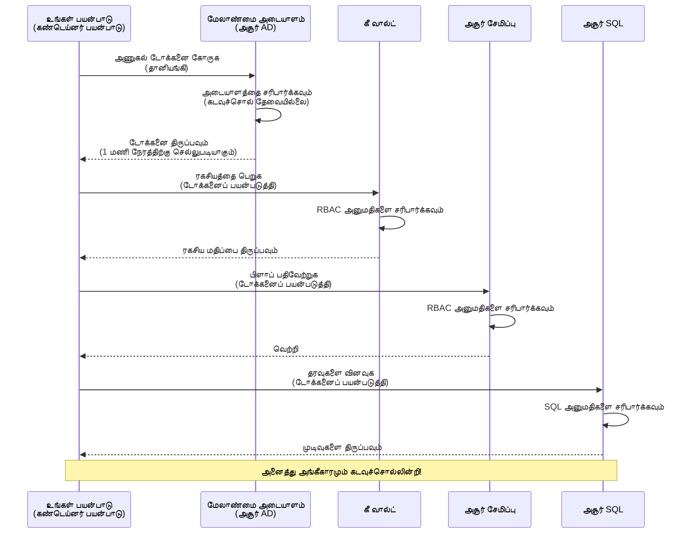
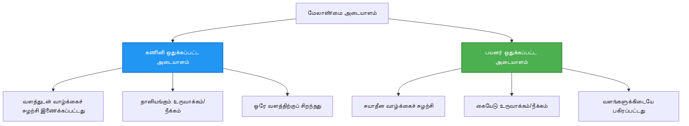

# அங்கீகாரம் முறை மற்றும் மேலாண்மை அடையாளம்

⏱️ **மதிப்பிடப்பட்ட நேரம்**: 45-60 நிமிடங்கள் | 💰 **செலவு தாக்கம்**: இலவசம் (கூடுதல் கட்டணங்கள் இல்லை) | ⭐ **சிக்கலானது**: நடுத்தர

**📚 கற்றல் பாதை:**
- ← முந்தையது: [கட்டமைப்பு மேலாண்மை](configuration.md) - சூழல் மாறிகள் மற்றும் ரகசியங்களை நிர்வகித்தல்
- 🎯 **நீங்கள் இங்கே**: அங்கீகாரம் & பாதுகாப்பு (முகவரியுடன் அடையாளம், முக்கிய காப்பகம், பாதுகாப்பான முறைகள்)
- → அடுத்தது: [முதல் திட்டம்](first-project.md) - உங்கள் முதல் AZD பயன்பாட்டை உருவாக்குங்கள்
- 🏠 [பாடநெறி முகப்பு](../../README.md)

---

## நீங்கள் என்ன கற்றுக்கொள்வீர்கள்

இந்த பாடத்தை முடிப்பதன் மூலம், நீங்கள்:
- Azure அங்கீகார முறைகளை (முக்கியங்கள், இணைப்பு சரங்கள், மேலாண்மை அடையாளம்) புரிந்துகொள்வீர்கள்
- **முகவரியுடன் அடையாளம்** மூலம் கடவுச்சொல் இல்லாத அங்கீகாரத்தை செயல்படுத்துங்கள்
- **Azure Key Vault** ஒருங்கிணைப்புடன் ரகசியங்களை பாதுகாக்குங்கள்
- AZD பிரசாரங்களுக்கு **பங்கு அடிப்படையிலான அணுகல் கட்டுப்பாடு (RBAC)** அமைக்கவும்
- Container Apps மற்றும் Azure சேவைகளில் பாதுகாப்பு சிறந்த முறைகளை பயன்படுத்துங்கள்
- முக்கிய அடிப்படையிலிருந்து அடையாள அடிப்படையிலான அங்கீகாரத்திற்கு மாறுங்கள்

## முகவரியுடன் அடையாளத்தின் முக்கியத்துவம்

### பிரச்சினை: பாரம்பரிய அங்கீகாரம்

**முகவரியுடன் அடையாளத்திற்கு முன்:**
```javascript
// ❌ பாதுகாப்பு ஆபத்து: குறியீட்டில் கடினமாக குறிக்கப்பட்ட ரகசியங்கள்
const connectionString = "Server=mydb.database.windows.net;User=admin;Password=P@ssw0rd123";
const storageKey = "xK7mN9pQ2wR5tY8uI0oP3aS6dF1gH4jK...";
const cosmosKey = "C2x7B9n4M1p8Q5w3E6r0T2y5U8i1O4p7...";
```

**பிரச்சினைகள்:**
- 🔴 **குறியீட்டில் வெளிப்படையான ரகசியங்கள்**, கட்டமைப்பு கோப்புகள், சூழல் மாறிகள்
- 🔴 **அங்கீகார மாற்றம்** குறியீட்டு மாற்றங்கள் மற்றும் மீள்நிர்வாகம் தேவை
- 🔴 **தொகுப்புகள்** - யார் எப்போது அணுகினார் என்பதைப் பற்றிய கண்காணிப்பு சிக்கல்கள்
- 🔴 **பரவல்** - பல அமைப்புகளில் பரவிய ரகசியங்கள்
- 🔴 **இணக்க சிக்கல்கள்** - பாதுகாப்பு ஆய்வுகளை தோல்வி அடைகிறது

### தீர்வு: முகவரியுடன் அடையாளம்

**முகவரியுடன் அடையாளத்திற்கு பின்:**
```javascript
// ✅ பாதுகாப்பானது: குறியீட்டில் ரகசியங்கள் இல்லை
const credential = new DefaultAzureCredential();
const client = new BlobServiceClient(
  "https://mystorageaccount.blob.core.windows.net",
  credential  // Azure தானாகவே அங்கீகாரத்தை கையாளுகிறது
);
```

**நன்மைகள்:**
- ✅ **குறியீட்டில் அல்லது கட்டமைப்பில் ரகசியங்கள் இல்லை**
- ✅ **தானியங்கி மாற்றம்** - Azure இதை நிர்வகிக்கிறது
- ✅ **முழு கண்காணிப்பு** Azure AD பதிவுகளில்
- ✅ **மையப்படுத்தப்பட்ட பாதுகாப்பு** - Azure Portal-ல் நிர்வகிக்கவும்
- ✅ **இணக்கத்துக்கு தயாராக** - பாதுகாப்பு தரங்களை பூர்த்தி செய்கிறது

**உருவகம்**: பாரம்பரிய அங்கீகாரம் என்பது பல கதவுகளுக்கு பல physical கீகளை எடுத்துச் செல்லுவது போன்றது. முகவரியுடன் அடையாளம் என்பது உங்கள் அடையாளத்தின் அடிப்படையில் தானாகவே அணுகலை வழங்கும் பாதுகாப்பு அடையாளம் போன்றது—இழக்க, நகலெடுக்க, அல்லது மாற்ற தேவையில்லை.

---

## கட்டமைப்பு கண்ணோட்டம்

### முகவரியுடன் அடையாளத்துடன் அங்கீகார ஓட்டம்


### முகவரியுடன் அடையாளத்தின் வகைகள்


| அம்சம் | Resource-க்கு ஒதுக்கப்பட்ட | பயனர்-ஒதுக்கப்பட்ட |
|---------|----------------|---------------|
| **வாழ்நிலை** | Resource-க்கு இணைக்கப்பட்டது | சுயாதீனமானது |
| **உருவாக்கம்** | Resource உடன் தானியங்கி | கையேடு உருவாக்கம் |
| **நீக்கம்** | Resource உடன் நீக்கப்பட்டது | Resource நீக்கத்திற்குப் பிறகு தொடர்கிறது |
| **பகிர்வு** | ஒரு Resource மட்டும் | பல Resource-கள் |
| **பயன்பாட்டு வழக்கு** | எளிய சூழல்கள் | சிக்கலான பல Resource சூழல்கள் |
| **AZD இயல்புநிலை** | ✅ பரிந்துரைக்கப்பட்டது | விருப்பம் |

---

## முன் தேவைகள்

### தேவையான கருவிகள்

முந்தைய பாடங்களில் இருந்து நீங்கள் ஏற்கனவே இவை நிறுவியிருக்க வேண்டும்:

```bash
# Azure Developer CLI ஐ சரிபார்க்கவும்
azd version
# ✅ எதிர்பார்க்கப்பட்டது: azd பதிப்பு 1.0.0 அல்லது அதற்கு மேல்

# Azure CLI ஐ சரிபார்க்கவும்
az --version
# ✅ எதிர்பார்க்கப்பட்டது: azure-cli 2.50.0 அல்லது அதற்கு மேல்
```

### Azure தேவைகள்

- செயலில் Azure சந்தா
- அனுமதிகள்:
  - முகவரியுடன் அடையாளங்களை உருவாக்க
  - RBAC பங்குகளை ஒதுக்க
  - Key Vault வளங்களை உருவாக்க
  - Container Apps-ஐ பிரசாரம் செய்ய

### அறிவு முன் தேவைகள்

நீங்கள் முடித்திருக்க வேண்டும்:
- [நிறுவல் வழிகாட்டி](installation.md) - AZD அமைப்பு
- [AZD அடிப்படைகள்](azd-basics.md) - முக்கிய கருத்துக்கள்
- [கட்டமைப்பு மேலாண்மை](configuration.md) - சூழல் மாறிகள்

---

## பாடம் 1: அங்கீகார முறைகளைப் புரிந்துகொள்வது

### முறை 1: இணைப்பு சரங்கள் (பாரம்பரியம் - தவிர்க்கவும்)

**இது எப்படி வேலை செய்கிறது:**
```bash
# இணைப்பு சரம் நம்பகத்தன்மைகளை கொண்டுள்ளது
STORAGE_CONNECTION_STRING="DefaultEndpointsProtocol=https;AccountName=myaccount;AccountKey=xK7mN9pQ2wR5..."
COSMOS_CONNECTION_STRING="AccountEndpoint=https://myaccount.documents.azure.com:443/;AccountKey=C2x7..."
SQL_CONNECTION_STRING="Server=myserver.database.windows.net;User=admin;Password=P@ssw0rd..."
```

**பிரச்சினைகள்:**
- ❌ சூழல் மாறிகளில் வெளிப்படையான ரகசியங்கள்
- ❌ Deployment அமைப்புகளில் பதிவு செய்யப்பட்டது
- ❌ மாற்றம் கடினம்
- ❌ அணுகலின் கண்காணிப்பு இல்லை

**எப்போது பயன்படுத்த வேண்டும்:** உள்ளூர் மேம்பாட்டிற்காக மட்டுமே, உற்பத்தியில் ஒருபோதும் இல்லை.

---

### முறை 2: Key Vault குறிப்புகள் (சிறந்தது)

**இது எப்படி வேலை செய்கிறது:**
```bicep
// Store secret in Key Vault
resource keyVault 'Microsoft.KeyVault/vaults@2023-02-01' = {
  name: 'mykv'
  properties: {
    enableRbacAuthorization: true
  }
}

// Reference in Container App
env: [
  {
    name: 'STORAGE_KEY'
    secretRef: 'storage-key'  // References Key Vault
  }
]
```

**நன்மைகள்:**
- ✅ Key Vault-ல் பாதுகாப்பாக ரகசியங்கள் சேமிக்கப்பட்டது
- ✅ மையப்படுத்தப்பட்ட ரகசிய மேலாண்மை
- ✅ குறியீட்டு மாற்றங்கள் இல்லாமல் மாற்றம்

**முடுக்கங்கள்:**
- ⚠️ இன்னும் முக்கியங்கள்/கடவுச்சொற்களைப் பயன்படுத்துகிறது
- ⚠️ Key Vault அணுகலை நிர்வகிக்க வேண்டும்

**எப்போது பயன்படுத்த வேண்டும்:** இணைப்பு சரங்களிலிருந்து முகவரியுடன் அடையாளத்திற்கு மாறும் இடைநிலை.

---

### முறை 3: முகவரியுடன் அடையாளம் (சிறந்த நடைமுறை)

**இது எப்படி வேலை செய்கிறது:**
```bicep
// Enable managed identity
resource containerApp 'Microsoft.App/containerApps@2023-05-01' = {
  name: 'myapp'
  identity: {
    type: 'SystemAssigned'  // Automatically creates identity
  }
}

// Grant permissions
resource roleAssignment 'Microsoft.Authorization/roleAssignments@2022-04-01' = {
  scope: storageAccount
  properties: {
    roleDefinitionId: storageBlobDataContributorRole
    principalId: containerApp.identity.principalId
  }
}
```

**பயன்பாட்டு குறியீடு:**
```javascript
// ரகசியங்கள் தேவையில்லை!
const { DefaultAzureCredential } = require('@azure/identity');
const { BlobServiceClient } = require('@azure/storage-blob');

const credential = new DefaultAzureCredential();
const blobServiceClient = new BlobServiceClient(
  'https://mystorageaccount.blob.core.windows.net',
  credential
);
```

**நன்மைகள்:**
- ✅ குறியீட்டில்/கட்டமைப்பில் ரகசியங்கள் இல்லை
- ✅ தானியங்கி அங்கீகார மாற்றம்
- ✅ முழு கண்காணிப்பு
- ✅ RBAC அடிப்படையிலான அனுமதிகள்
- ✅ இணக்கத்துக்கு தயாராக

**எப்போது பயன்படுத்த வேண்டும்:** எப்போதும், உற்பத்தி பயன்பாடுகளுக்கு.

---

## பாடம் 2: AZD உடன் முகவரியுடன் அடையாளத்தை செயல்படுத்துதல்

### படிப்படியாக செயல்படுத்தல்

Azure Storage மற்றும் Key Vault-ஐ அணுக முகவரியுடன் அடையாளத்தைப் பயன்படுத்தும் ஒரு பாதுகாப்பான Container App-ஐ உருவாக்குவோம்.

### திட்ட அமைப்பு

```
secure-app/
├── azure.yaml                 # AZD configuration
├── infra/
│   ├── main.bicep            # Main infrastructure
│   ├── core/
│   │   ├── identity.bicep    # Managed identity setup
│   │   ├── keyvault.bicep    # Key Vault configuration
│   │   └── storage.bicep     # Storage with RBAC
│   └── app/
│       └── container-app.bicep
└── src/
    ├── app.js                # Application code
    ├── package.json
    └── Dockerfile
```

### 1. AZD-ஐ கட்டமைக்கவும் (azure.yaml)

```yaml
name: secure-app
metadata:
  template: secure-app@1.0.0

services:
  api:
    project: ./src
    language: js
    host: containerapp

# Enable managed identity (AZD handles this automatically)
```

### 2. அடிப்படை: முகவரியுடன் அடையாளத்தை இயக்கவும்

**கோப்பு: `infra/main.bicep`**

```bicep
targetScope = 'subscription'

param environmentName string
param location string = 'eastus'

var tags = { 'azd-env-name': environmentName }

// Resource group
resource rg 'Microsoft.Resources/resourceGroups@2021-04-01' = {
  name: 'rg-${environmentName}'
  location: location
  tags: tags
}

// Storage Account
module storage './core/storage.bicep' = {
  name: 'storage'
  scope: rg
  params: {
    name: 'st${uniqueString(rg.id)}'
    location: location
    tags: tags
  }
}

// Key Vault
module keyVault './core/keyvault.bicep' = {
  name: 'keyvault'
  scope: rg
  params: {
    name: 'kv-${uniqueString(rg.id)}'
    location: location
    tags: tags
  }
}

// Container App with Managed Identity
module containerApp './app/container-app.bicep' = {
  name: 'container-app'
  scope: rg
  params: {
    name: 'ca-${environmentName}'
    location: location
    tags: tags
    storageAccountName: storage.outputs.name
    keyVaultName: keyVault.outputs.name
  }
}

// Grant Container App access to Storage
module storageRoleAssignment './core/role-assignment.bicep' = {
  name: 'storage-role'
  scope: rg
  params: {
    principalId: containerApp.outputs.identityPrincipalId
    roleDefinitionId: 'ba92f5b4-2d11-453d-a403-e96b0029c9fe'  // Storage Blob Data Contributor
    targetResourceId: storage.outputs.id
  }
}

// Grant Container App access to Key Vault
module kvRoleAssignment './core/role-assignment.bicep' = {
  name: 'kv-role'
  scope: rg
  params: {
    principalId: containerApp.outputs.identityPrincipalId
    roleDefinitionId: '4633458b-17de-408a-b874-0445c86b69e6'  // Key Vault Secrets User
    targetResourceId: keyVault.outputs.id
  }
}

// Outputs
output AZURE_STORAGE_ACCOUNT_NAME string = storage.outputs.name
output AZURE_KEY_VAULT_NAME string = keyVault.outputs.name
output APP_URL string = containerApp.outputs.url
```

### 3. System-Assigned Identity உடன் Container App

**கோப்பு: `infra/app/container-app.bicep`**

```bicep
param name string
param location string
param tags object = {}
param storageAccountName string
param keyVaultName string

resource containerApp 'Microsoft.App/containerApps@2023-05-01' = {
  name: name
  location: location
  tags: tags
  identity: {
    type: 'SystemAssigned'  // 🔑 Enable managed identity
  }
  properties: {
    configuration: {
      ingress: {
        external: true
        targetPort: 3000
      }
    }
    template: {
      containers: [
        {
          name: 'api'
          image: 'myregistry.azurecr.io/api:latest'
          resources: {
            cpu: json('0.5')
            memory: '1Gi'
          }
          env: [
            {
              name: 'AZURE_STORAGE_ACCOUNT_NAME'
              value: storageAccountName
            }
            {
              name: 'AZURE_KEY_VAULT_NAME'
              value: keyVaultName
            }
            // 🔑 No secrets - managed identity handles authentication!
          ]
        }
      ]
    }
  }
}

// Output the identity for RBAC assignments
output identityPrincipalId string = containerApp.identity.principalId
output id string = containerApp.id
output url string = 'https://${containerApp.properties.configuration.ingress.fqdn}'
```

### 4. RBAC பங்கு ஒதுக்கீட்டு தொகுதி

**கோப்பு: `infra/core/role-assignment.bicep`**

```bicep
param principalId string
param roleDefinitionId string  // Azure built-in role ID
param targetResourceId string

resource roleAssignment 'Microsoft.Authorization/roleAssignments@2022-04-01' = {
  name: guid(principalId, roleDefinitionId, targetResourceId)
  scope: resourceId('Microsoft.Resources/resourceGroups', resourceGroup().name)
  properties: {
    roleDefinitionId: subscriptionResourceId('Microsoft.Authorization/roleDefinitions', roleDefinitionId)
    principalId: principalId
    principalType: 'ServicePrincipal'
  }
}

output id string = roleAssignment.id
```

### 5. முகவரியுடன் அடையாளத்துடன் பயன்பாட்டு குறியீடு

**கோப்பு: `src/app.js`**

```javascript
const express = require('express');
const { DefaultAzureCredential } = require('@azure/identity');
const { BlobServiceClient } = require('@azure/storage-blob');
const { SecretClient } = require('@azure/keyvault-secrets');

const app = express();
const PORT = process.env.PORT || 3000;

// 🔑 சான்றுகளை தொடங்கவும் (மேலாண்மை அடையாளத்துடன் தானாகவே செயல்படுகிறது)
const credential = new DefaultAzureCredential();

// Azure Storage அமைப்பு
const storageAccountName = process.env.AZURE_STORAGE_ACCOUNT_NAME;
const blobServiceClient = new BlobServiceClient(
  `https://${storageAccountName}.blob.core.windows.net`,
  credential  // எந்த விசைகளும் தேவையில்லை!
);

// Key Vault அமைப்பு
const keyVaultName = process.env.AZURE_KEY_VAULT_NAME;
const secretClient = new SecretClient(
  `https://${keyVaultName}.vault.azure.net`,
  credential  // எந்த விசைகளும் தேவையில்லை!
);

// ஆரோக்கிய சோதனை
app.get('/health', (req, res) => {
  res.json({ status: 'healthy', authentication: 'managed-identity' });
});

// ப்ளாப் சேமிப்பகத்திற்கு கோப்பை பதிவேற்றவும்
app.post('/upload', async (req, res) => {
  try {
    const containerClient = blobServiceClient.getContainerClient('uploads');
    await containerClient.createIfNotExists();
    
    const blobName = `file-${Date.now()}.txt`;
    const blockBlobClient = containerClient.getBlockBlobClient(blobName);
    
    await blockBlobClient.upload('Hello from managed identity!', 30);
    
    res.json({
      success: true,
      blobName: blobName,
      message: 'File uploaded using managed identity!'
    });
  } catch (error) {
    console.error('Upload error:', error);
    res.status(500).json({ error: error.message });
  }
});

// Key Vault இலிருந்து ரகசியத்தை பெறவும்
app.get('/secret/:name', async (req, res) => {
  try {
    const secretName = req.params.name;
    const secret = await secretClient.getSecret(secretName);
    
    res.json({
      name: secretName,
      value: secret.value,
      message: 'Secret retrieved using managed identity!'
    });
  } catch (error) {
    console.error('Secret error:', error);
    res.status(500).json({ error: error.message });
  }
});

// ப்ளாப் கெண்டெய்னர்களை பட்டியலிடவும் (படிக்க அனுமதியை காட்டுகிறது)
app.get('/containers', async (req, res) => {
  try {
    const containers = [];
    for await (const container of blobServiceClient.listContainers()) {
      containers.push(container.name);
    }
    
    res.json({
      containers: containers,
      count: containers.length,
      message: 'Containers listed using managed identity!'
    });
  } catch (error) {
    console.error('List error:', error);
    res.status(500).json({ error: error.message });
  }
});

app.listen(PORT, () => {
  console.log(`Secure API listening on port ${PORT}`);
  console.log('Authentication: Managed Identity (passwordless)');
});
```

**கோப்பு: `src/package.json`**

```json
{
  "name": "secure-app",
  "version": "1.0.0",
  "dependencies": {
    "express": "^4.18.2",
    "@azure/identity": "^4.0.0",
    "@azure/storage-blob": "^12.17.0",
    "@azure/keyvault-secrets": "^4.7.0"
  },
  "scripts": {
    "start": "node app.js"
  }
}
```

### 6. பிரசாரம் மற்றும் சோதனை

```bash
# AZD சூழலை தொடங்கவும்
azd init

# அடுக்கமைப்பு மற்றும் பயன்பாட்டை பிரசுரிக்கவும்
azd up

# பயன்பாட்டின் URL ஐ பெறவும்
APP_URL=$(azd env get-values | grep APP_URL | cut -d '=' -f2 | tr -d '"')

# ஆரோக்கிய சோதனையை சோதிக்கவும்
curl $APP_URL/health
```

**✅ எதிர்பார்க்கப்படும் வெளியீடு:**
```json
{
  "status": "healthy",
  "authentication": "managed-identity"
}
```

**Blob upload சோதனை:**
```bash
curl -X POST $APP_URL/upload
```

**✅ எதிர்பார்க்கப்படும் வெளியீடு:**
```json
{
  "success": true,
  "blobName": "file-1700404800000.txt",
  "message": "File uploaded using managed identity!"
}
```

**Container listing சோதனை:**
```bash
curl $APP_URL/containers
```

**✅ எதிர்பார்க்கப்படும் வெளியீடு:**
```json
{
  "containers": ["uploads"],
  "count": 1,
  "message": "Containers listed using managed identity!"
}
```

---

## பொதுவான Azure RBAC பங்குகள்

### முகவரியுடன் அடையாளத்திற்கான Built-in Role IDs

| சேவை | பங்கு பெயர் | Role ID | அனுமதிகள் |
|---------|-----------|---------|-------------|
| **Storage** | Storage Blob Data Reader | `2a2b9908-6b94-4a3d-8e5a-a7d8f8cc8a12` | Blobs மற்றும் Containers-ஐ படிக்க |
| **Storage** | Storage Blob Data Contributor | `ba92f5b4-2d11-453d-a403-e96b0029c9fe` | Blobs-ஐ படிக்க, எழுத, நீக்க |
| **Storage** | Storage Queue Data Contributor | `974c5e8b-45b9-4653-ba55-5f855dd0fb88` | Queue Messages-ஐ படிக்க, எழுத, நீக்க |
| **Key Vault** | Key Vault Secrets User | `4633458b-17de-408a-b874-0445c86b69e6` | ரகசியங்களை படிக்க |
| **Key Vault** | Key Vault Secrets Officer | `b86a8fe4-44ce-4948-aee5-eccb2c155cd7` | ரகசியங்களை படிக்க, எழுத, நீக்க |
| **Cosmos DB** | Cosmos DB Built-in Data Reader | `00000000-0000-0000-0000-000000000001` | Cosmos DB தரவுகளை படிக்க |
| **Cosmos DB** | Cosmos DB Built-in Data Contributor | `00000000-0000-0000-0000-000000000002` | Cosmos DB தரவுகளை படிக்க, எழுத |
| **SQL Database** | SQL DB Contributor | `9b7fa17d-e63e-47b0-bb0a-15c516ac86ec` | SQL தரவுத்தொகுப்புகளை நிர்வகிக்க |
| **Service Bus** | Azure Service Bus Data Owner | `090c5cfd-751d-490a-894a-3ce6f1109419` | Messages-ஐ அனுப்ப, பெற, நிர்வகிக்க |

### Role IDs-ஐ எவ்வாறு கண்டறிவது

```bash
# அனைத்து உள்ளமைக்கப்பட்ட வேடங்களை பட்டியலிடவும்
az role definition list --query "[].{Name:roleName, ID:name}" --output table

# குறிப்பிட்ட வேடத்தை தேடவும்
az role definition list --query "[?contains(roleName, 'Storage Blob')].{Name:roleName, ID:name}" --output table

# வேட விவரங்களை பெறவும்
az role definition list --name "Storage Blob Data Contributor"
```

---

## நடைமுறை பயிற்சிகள்

### பயிற்சி 1: உள்ளமைந்த பயன்பாட்டிற்கு முகவரியுடன் அடையாளத்தை இயக்கவும் ⭐⭐ (நடுத்தர)

**நோக்கம்**: உள்ளமைந்த Container App பிரசாரத்திற்கு முகவரியுடன் அடையாளத்தைச் சேர்க்கவும்

**சூழல்**: நீங்கள் இணைப்பு சரங்களைப் பயன்படுத்தும் Container App-ஐ வைத்திருக்கிறீர்கள். அதை முகவரியுடன் அடையாளத்திற்கு மாற்றவும்.

**தொடக்க புள்ளி**: இந்த கட்டமைப்புடன் Container App:

```bicep
// ❌ Current: Using connection string
env: [
  {
    name: 'STORAGE_CONNECTION_STRING'
    secretRef: 'storage-connection'
  }
]
```

**படிகள்**:

1. **Bicep-ல் முகவரியுடன் அடையாளத்தை இயக்கவும்:**

```bicep
resource containerApp 'Microsoft.App/containerApps@2023-05-01' = {
  name: 'myapp'
  identity: {
    type: 'SystemAssigned'  // Add this
  }
  // ... rest of configuration
}
```

2. **Storage அணுகலை வழங்கவும்:**

```bicep
// Get storage account reference
resource storageAccount 'Microsoft.Storage/storageAccounts@2023-01-01' existing = {
  name: storageAccountName
}

// Assign role
resource roleAssignment 'Microsoft.Authorization/roleAssignments@2022-04-01' = {
  name: guid(containerApp.id, 'ba92f5b4-2d11-453d-a403-e96b0029c9fe', storageAccount.id)
  scope: storageAccount
  properties: {
    roleDefinitionId: subscriptionResourceId('Microsoft.Authorization/roleDefinitions', 'ba92f5b4-2d11-453d-a403-e96b0029c9fe')
    principalId: containerApp.identity.principalId
    principalType: 'ServicePrincipal'
  }
}
```

3. **பயன்பாட்டு குறியீட்டை புதுப்பிக்கவும்:**

**முன் (இணைப்பு சரம்):**
```javascript
const { BlobServiceClient } = require('@azure/storage-blob');

const blobServiceClient = BlobServiceClient.fromConnectionString(
  process.env.STORAGE_CONNECTION_STRING
);
```

**பின் (முகவரியுடன் அடையாளம்):**
```javascript
const { DefaultAzureCredential } = require('@azure/identity');
const { BlobServiceClient } = require('@azure/storage-blob');

const credential = new DefaultAzureCredential();
const blobServiceClient = new BlobServiceClient(
  `https://${process.env.STORAGE_ACCOUNT_NAME}.blob.core.windows.net`,
  credential
);
```

4. **சூழல் மாறிகளை புதுப்பிக்கவும்:**

```bicep
env: [
  {
    name: 'STORAGE_ACCOUNT_NAME'
    value: storageAccountName  // Just the name, no secrets!
  }
  // Remove STORAGE_CONNECTION_STRING
]
```

5. **பிரசாரம் மற்றும் சோதனை:**

```bash
# மீண்டும் பிரயோகிக்கவும்
azd up

# இது இன்னும் செயல்படுகிறதா என்பதை சோதிக்கவும்
curl https://myapp.azurecontainerapps.io/upload
```

**✅ வெற்றியின் அளவுகோல்:**
- ✅ பயன்பாடு பிழைகள் இல்லாமல் பிரசாரம் செய்யப்படுகிறது
- ✅ Storage செயல்பாடுகள் வேலை செய்கிறது (upload, list, download)
- ✅ சூழல் மாறிகளில் இணைப்பு சரங்கள் இல்லை
- ✅ Azure Portal-ல் "Identity" blade-இல் அடையாளம் காணப்படுகிறது

**சரிபார்ப்பு:**

```bash
# மேலாண்மை அடையாளம் இயக்கப்பட்டுள்ளதா என்பதை சரிபார்க்கவும்
az containerapp show \
  --name myapp \
  --resource-group rg-myapp \
  --query "identity.type"
# ✅ எதிர்பார்க்கப்பட்டது: "SystemAssigned"

# பங்கு ஒதுக்கீட்டை சரிபார்க்கவும்
az role assignment list \
  --assignee $(az containerapp show --name myapp --resource-group rg-myapp --query "identity.principalId" -o tsv) \
  --scope /subscriptions/{sub-id}/resourceGroups/rg-myapp/providers/Microsoft.Storage/storageAccounts/mystorageaccount
# ✅ எதிர்பார்க்கப்பட்டது: "Storage Blob Data Contributor" பங்கு காட்டுகிறது
```

**நேரம்**: 20-30 நிமிடங்கள்

---

### பயிற்சி 2: பல சேவைகளுடன் User-Assigned Identity ⭐⭐⭐ (மேம்பட்டது)

**நோக்கம்**: பல Container Apps-க்கு பகிரப்பட்ட User-Assigned Identity உருவாக்கவும்

**சூழல்**: உங்களுக்கு ஒரே Storage கணக்கு மற்றும் Key Vault-ஐ அணுக 3 மைக்ரோசேவைகள் தேவை.

**படிகள்**:

1. **User-Assigned Identity உருவாக்கவும்:**

**கோப்பு: `infra/core/identity.bicep`**

```bicep
param name string
param location string
param tags object = {}

resource userAssignedIdentity 'Microsoft.ManagedIdentity/userAssignedIdentities@2023-01-31' = {
  name: name
  location: location
  tags: tags
}

output id string = userAssignedIdentity.id
output principalId string = userAssignedIdentity.properties.principalId
output clientId string = userAssignedIdentity.properties.clientId
```

2. **User-Assigned Identity-க்கு பங்குகளை ஒதுக்கவும்:**

```bicep
// In main.bicep
module userIdentity './core/identity.bicep' = {
  name: 'user-identity'
  scope: rg
  params: {
    name: 'id-${environmentName}'
    location: location
    tags: tags
  }
}

// Grant Storage access
resource storageRoleAssignment 'Microsoft.Authorization/roleAssignments@2022-04-01' = {
  name: guid(userIdentity.outputs.principalId, 'storage-contributor')
  scope: storageAccount
  properties: {
    roleDefinitionId: subscriptionResourceId('Microsoft.Authorization/roleDefinitions', 'ba92f5b4-2d11-453d-a403-e96b0029c9fe')
    principalId: userIdentity.outputs.principalId
    principalType: 'ServicePrincipal'
  }
}

// Grant Key Vault access
resource kvRoleAssignment 'Microsoft.Authorization/roleAssignments@2022-04-01' = {
  name: guid(userIdentity.outputs.principalId, 'kv-secrets-user')
  scope: keyVault
  properties: {
    roleDefinitionId: subscriptionResourceId('Microsoft.Authorization/roleDefinitions', '4633458b-17de-408a-b874-0445c86b69e6')
    principalId: userIdentity.outputs.principalId
    principalType: 'ServicePrincipal'
  }
}
```

3. **பல Container Apps-க்கு Identity-ஐ ஒதுக்கவும்:**

```bicep
resource apiGateway 'Microsoft.App/containerApps@2023-05-01' = {
  name: 'api-gateway'
  identity: {
    type: 'UserAssigned'
    userAssignedIdentities: {
      '${userIdentity.outputs.id}': {}
    }
  }
  // ... rest of config
}

resource productService 'Microsoft.App/containerApps@2023-05-01' = {
  name: 'product-service'
  identity: {
    type: 'UserAssigned'
    userAssignedIdentities: {
      '${userIdentity.outputs.id}': {}
    }
  }
  // ... rest of config
}

resource orderService 'Microsoft.App/containerApps@2023-05-01' = {
  name: 'order-service'
  identity: {
    type: 'UserAssigned'
    userAssignedIdentities: {
      '${userIdentity.outputs.id}': {}
    }
  }
  // ... rest of config
}
```

4. **பயன்பாட்டு குறியீடு (அனைத்து சேவைகளும் ஒரே முறையைப் பயன்படுத்துகிறது):**

```javascript
const { DefaultAzureCredential, ManagedIdentityCredential } = require('@azure/identity');

// பயனர் ஒதுக்கப்பட்ட அடையாளத்திற்காக, வாடிக்கையாளர் ஐடியை குறிப்பிடவும்
const credential = new ManagedIdentityCredential(
  process.env.AZURE_CLIENT_ID  // பயனர் ஒதுக்கப்பட்ட அடையாள வாடிக்கையாளர் ஐடி
);

// அல்லது DefaultAzureCredential ஐ பயன்படுத்தவும் (தானாக கண்டறிகிறது)
const credential = new DefaultAzureCredential();

const blobServiceClient = new BlobServiceClient(
  `https://${process.env.STORAGE_ACCOUNT_NAME}.blob.core.windows.net`,
  credential
);
```

5. **பிரசாரம் மற்றும் சரிபார்ப்பு:**

```bash
azd up

# அனைத்து சேவைகளும் சேமிப்பகத்தை அணுக முடியும் என்பதை சோதிக்கவும்
curl https://api-gateway.azurecontainerapps.io/upload
curl https://product-service.azurecontainerapps.io/upload
curl https://order-service.azurecontainerapps.io/upload
```

**✅ வெற்றியின் அளவுகோல்:**
- ✅ 3 சேவைகளுக்கு பகிரப்பட்ட ஒரு Identity
- ✅ அனைத்து சேவைகளும் Storage மற்றும் Key Vault-ஐ அணுக முடியும்
- ✅ ஒரு சேவையை நீக்கினால் Identity தொடர்கிறது
- ✅ மையப்படுத்தப்பட்ட அனுமதி மேலாண்மை

**User-Assigned Identity-யின் நன்மைகள்:**
- ஒரே Identity-ஐ நிர்வகிக்க
- சேவைகளுக்கு ஒரே அனுமதிகள்
- சேவை நீக்கத்தைத் தாண்டி Identity தொடர்கிறது
- சிக்கலான கட்டமைப்புகளுக்கு சிறந்தது

**நேரம்**: 30-40 நிமிடங்கள்

---

### பயிற்சி 3: Key Vault ரகசிய மாற்றத்தை செயல்படுத்தவும் ⭐⭐⭐ (மேம்பட்டது)

**நோக்கம்**: மூன்றாம் தரப்பு API முக்கியங்களை Key Vault-ல் சேமித்து, முகவரியுடன் அடையாளத்தைப் பயன்படுத்தி அணுகவும்

**சூழல்**: உங்கள் பயன்பாடு OpenAI, Stripe, SendGrid போன்ற வெளிப்புற API-களை அழைக்க API முக்கியங்களை தேவை.

**படிகள்**:

1. **RBAC உடன் Key Vault உருவாக்கவும்:**

**கோப்பு: `infra/core/keyvault.bicep`**

```bicep
param name string
param location string
param tags object = {}

resource keyVault 'Microsoft.KeyVault/vaults@2023-02-01' = {
  name: name
  location: location
  tags: tags
  properties: {
    enableRbacAuthorization: true  // Use RBAC instead of access policies
    sku: {
      family: 'A'
      name: 'standard'
    }
    tenantId: subscription().tenantId
    enableSoftDelete: true
    softDeleteRetentionInDays: 90
  }
}

// Allow Container App to read secrets
output id string = keyVault.id
output name string = keyVault.name
output uri string = keyVault.properties.vaultUri
```

2. **Key Vault-ல் ரகசியங்களை சேமிக்கவும்:**

```bash
# கீ வால்ட் பெயரை பெறவும்
KV_NAME=$(azd env get-values | grep AZURE_KEY_VAULT_NAME | cut -d '=' -f2 | tr -d '"')

# மூன்றாம் தரப்பு API கீகளை சேமிக்கவும்
az keyvault secret set \
  --vault-name $KV_NAME \
  --name "OpenAI-ApiKey" \
  --value "sk-proj-xxxxxxxxxxxxx"

az keyvault secret set \
  --vault-name $KV_NAME \
  --name "Stripe-ApiKey" \
  --value "sk_live_xxxxxxxxxxxxx"

az keyvault secret set \
  --vault-name $KV_NAME \
  --name "SendGrid-ApiKey" \
  --value "SG.xxxxxxxxxxxxx"
```

3. **ரகசியங்களை பெற பயன்பாட்டு குறியீடு:**

**கோப்பு: `src/config.js`**

```javascript
const { DefaultAzureCredential } = require('@azure/identity');
const { SecretClient } = require('@azure/keyvault-secrets');

class Config {
  constructor() {
    this.credential = new DefaultAzureCredential();
    this.secretClient = new SecretClient(
      `https://${process.env.AZURE_KEY_VAULT_NAME}.vault.azure.net`,
      this.credential
    );
    this.cache = {};
  }

  async getSecret(secretName) {
    // முதலில் கேஷ் சரிபார்க்கவும்
    if (this.cache[secretName]) {
      return this.cache[secretName];
    }

    try {
      const secret = await this.secretClient.getSecret(secretName);
      this.cache[secretName] = secret.value;
      console.log(`✅ Retrieved secret: ${secretName}`);
      return secret.value;
    } catch (error) {
      console.error(`❌ Failed to get secret ${secretName}:`, error.message);
      throw error;
    }
  }

  async getOpenAIKey() {
    return this.getSecret('OpenAI-ApiKey');
  }

  async getStripeKey() {
    return this.getSecret('Stripe-ApiKey');
  }

  async getSendGridKey() {
    return this.getSecret('SendGrid-ApiKey');
  }
}

module.exports = new Config();
```

4. **பயன்பாட்டில் ரகசியங்களைப் பயன்படுத்தவும்:**

**கோப்பு: `src/app.js`**

```javascript
const express = require('express');
const config = require('./config');
const { OpenAI } = require('openai');

const app = express();

// கீ வால்டிலிருந்து திறவுகோலைப் பயன்படுத்தி OpenAI ஐ தொடங்கவும்
let openaiClient;

async function initializeServices() {
  const openaiKey = await config.getOpenAIKey();
  openaiClient = new OpenAI({ apiKey: openaiKey });
  console.log('✅ Services initialized with secrets from Key Vault');
}

// தொடக்கத்தில் அழைக்கவும்
initializeServices().catch(console.error);

app.post('/chat', async (req, res) => {
  try {
    const completion = await openaiClient.chat.completions.create({
      model: 'gpt-4',
      messages: [{ role: 'user', content: 'Hello!' }]
    });
    
    res.json({
      response: completion.choices[0].message.content,
      authentication: 'Key from Key Vault via Managed Identity'
    });
  } catch (error) {
    res.status(500).json({ error: error.message });
  }
});

app.listen(3000, () => {
  console.log('Secure API with Key Vault integration running');
});
```

5. **பிரசாரம் மற்றும் சோதனை:**

```bash
azd up

# API விசைகள் வேலை செய்கிறதா என்பதை சோதிக்கவும்
curl -X POST https://myapp.azurecontainerapps.io/chat \
  -H "Content-Type: application/json" \
  -d '{"message":"Hello AI"}'
```

**✅ வெற்றியின் அளவுகோல்:**
- ✅ API முக்கியங்கள் குறியீட்டில் அல்லது சூழல் மாறிகளில் இல்லை
- ✅ பயன்பாடு Key Vault-ல் இருந்து முக்கியங்களைப் பெறுகிறது
- ✅ மூன்றாம் தரப்பு API-கள் சரியாக வேலை செய்கிறது
- ✅ குறியீட்டு மாற்றங்கள் இல்லாமல் முக்கியங்களை மாற்ற முடியும்

**ஒரு ரகசியத்தை மாற்றவும்:**

```bash
# கீ வால்டில் ரகசியத்தை புதுப்பிக்கவும்
az keyvault secret set \
  --vault-name $KV_NAME \
  --name "OpenAI-ApiKey" \
  --value "sk-proj-NEW_KEY_HERE"

# புதிய கீயை எடுத்துக்கொள்ள பயன்பாட்டை மீண்டும் தொடங்கவும்
az containerapp revision restart \
  --name myapp \
  --resource-group rg-myapp
```

**நேரம்**: 25-35 நிமிடங்கள்

---

## அறிவு சோதனை

### 1. அங்கீகார முறைகள் ✓

உங்கள் புரிதலை சோதிக்கவும்:

- [ ] **Q1**: மூன்று முக்கிய அங்கீகார முறைகள் என்ன? 
  - **A**: இணைப்பு சரங்கள் (பாரம்பரியம்), Key Vault குறிப்புகள் (இடைநிலை), முகவரியுடன் அடையாளம் (சிறந்தது)

- [ ] **Q2**: இணைப்பு சரங்களுடன் ஒப்பிடும்போது முகவரியுடன் அடையாளம் ஏன் சிறந்தது?
  - **A**: குறியீட்டில் ரகசியங்கள் இல்லை, தானியங்கி மாற்றம், முழு கண்காணிப்பு, RBAC அனுமதிகள்

- [ ] **Q3**: System-Assigned Identity-க்கு பதிலாக User-Assigned Identity எப்போது பயன்படுத்த வேண்டும்?
  - **A**: பல Resource-களுக்கு Identity-ஐ பகிரும்போது அல்லது Resource வாழ்நிலைக்கு சுயாதீனமாக Identity தேவைப்படும் போது

**கைமுறையாக சரிபார்ப்பு:**
```bash
# உங்கள் பயன்பாடு எந்த வகையான அடையாளத்தை பயன்படுத்துகிறது என்பதை சரிபார்க்கவும்
az containerapp show \
  --name myapp \
  --resource-group rg-myapp \
  --query "identity.type"

# அடையாளத்திற்கான அனைத்து வேட ஒதுக்கீடுகளையும் பட்டியலிடவும்
az role assignment list \
  --assignee $(az containerapp show --name myapp --resource-group rg-myapp --query "identity.principalId" -o tsv)
```

---

### 2. RBAC மற்றும் அனுமதிகள் ✓

உங்கள் புரிதலை சோதிக்கவும்:

- [ ] **Q1**: "Storage Blob Data Contributor" பங்கிற்கான Role ID என்ன?
  - **A**: `ba92f5b4-2d11-453d-a403-e96b0029c9fe`

- [ ] **Q2**: "Key Vault Secrets User" என்ன அனுமதிகளை வழங்குகிறது?
  - **A**: ரகசியங்களை படிக்க மட்டுமே (உருவாக்க, புதுப்பிக்க, அல்லது நீக்க முடியாது)

- [ ] **Q3**: Azure SQL-ஐ அணுக Container App-க்கு எப்படி அனுமதி வழங்குவது?
  - **A**: "SQL DB Contributor
- [ ] **Q1**: Key Vault-க்கு RBAC-ஐ access policies-க்கு பதிலாக எப்படி செயல்படுத்துவது?
  - **A**: Bicep-ல் `enableRbacAuthorization: true` அமைக்கவும்

- [ ] **Q2**: Azure SDK நூலகங்களில் managed identity authentication-ஐ எது கையாளுகிறது?
  - **A**: `@azure/identity` மற்றும் `DefaultAzureCredential` class

- [ ] **Q3**: Key Vault ரகசியங்கள் cache-ல் எவ்வளவு நேரம் இருக்கும்?
  - **A**: பயன்பாட்டின் அடிப்படையில்; உங்கள் சொந்த cache strategy-ஐ செயல்படுத்தவும்

**கைமுறையாக சரிபார்க்கவும்:**
```bash
# கீ வால்ட் அணுகலை சோதிக்கவும்
az keyvault secret show \
  --vault-name $KV_NAME \
  --name "OpenAI-ApiKey" \
  --query "value"

# RBAC இயக்கப்பட்டுள்ளதா என்பதை சரிபார்க்கவும்
az keyvault show \
  --name $KV_NAME \
  --query "properties.enableRbacAuthorization"
# ✅ எதிர்பார்ப்பு: உண்மை
```

---

## பாதுகாப்பு சிறந்த நடைமுறைகள்

### ✅ செய்யவேண்டியது:

1. **உற்பத்தியில் managed identity-ஐ எப்போதும் பயன்படுத்தவும்**
   ```bicep
   identity: {
     type: 'SystemAssigned'
   }
   ```

2. **குறைந்த privilege RBAC பங்கு பயன்படுத்தவும்**
   - "Reader" பங்கு பயன்படுத்தவும்
   - "Owner" அல்லது "Contributor" பங்கு தேவையானால் மட்டுமே பயன்படுத்தவும்

3. **மூன்றாம் தரப்பு கீக்களை Key Vault-ல் சேமிக்கவும்**
   ```javascript
   const apiKey = await secretClient.getSecret('ThirdPartyApiKey');
   ```

4. **Audit logging-ஐ இயக்கவும்**
   ```bicep
   diagnosticSettings: {
     logs: [{ category: 'AuditEvent', enabled: true }]
   }
   ```

5. **Development, staging, production-க்கு தனித்தனியான identity-களை பயன்படுத்தவும்**
   ```bash
   azd env new dev
   azd env new staging
   azd env new prod
   ```

6. **ரகசியங்களை முறையாக மாற்றவும்**
   - Key Vault ரகசியங்களுக்கு காலாவதி தேதிகளை அமைக்கவும்
   - Azure Functions மூலம் மாற்றத்தை தானியங்கமாக்கவும்

### ❌ செய்யக்கூடாது:

1. **ரகசியங்களை hardcode செய்யவேண்டாம்**
   ```javascript
   // ❌ மோசம்
   const apiKey = "sk-proj-xxxxxxxxxxxxx";
   ```

2. **உற்பத்தியில் connection strings-ஐ பயன்படுத்த வேண்டாம்**
   ```javascript
   // ❌ மோசம்
   BlobServiceClient.fromConnectionString(process.env.STORAGE_CONNECTION_STRING)
   ```

3. **அதிகமான அனுமதிகளை வழங்க வேண்டாம்**
   ```bicep
   // ❌ BAD - too much access
   roleDefinitionId: 'Owner'
   
   // ✅ GOOD - least privilege
   roleDefinitionId: 'Storage Blob Data Reader'
   ```

4. **ரகசியங்களை பதிவு செய்ய வேண்டாம்**
   ```javascript
   // ❌ மோசம்
   console.log('API Key:', apiKey);
   
   // ✅ நல்லது
   console.log('API Key retrieved successfully');
   ```

5. **உற்பத்தி identity-களை சூழல்களுக்கிடையே பகிர வேண்டாம்**
   ```bicep
   // ❌ BAD - same identity for dev and prod
   // ✅ GOOD - separate identities per environment
   ```

---

## சிக்கல் தீர்வு வழிகாட்டி

### சிக்கல்: Azure Storage-ஐ அணுகும்போது "Unauthorized"

**அறிகுறிகள்:**
```
Error: Unauthorized (403)
AuthorizationPermissionMismatch: This request is not authorized to perform this operation
```

**காரணம்:**

```bash
# மேலாண்மை அடையாளம் இயக்கப்பட்டுள்ளதா என்பதை சரிபார்க்கவும்
az containerapp show \
  --name myapp \
  --resource-group rg-myapp \
  --query "identity.type"
# ✅ எதிர்பார்ப்பு: "SystemAssigned" அல்லது "UserAssigned"

# பங்கு ஒதுக்கீடுகளை சரிபார்க்கவும்
PRINCIPAL_ID=$(az containerapp show --name myapp --resource-group rg-myapp --query "identity.principalId" -o tsv)
az role assignment list --assignee $PRINCIPAL_ID

# எதிர்பார்ப்பு: "Storage Blob Data Contributor" அல்லது இதற்கு இணையான பங்கை காண வேண்டும்
```

**தீர்வுகள்:**

1. **சரியான RBAC பங்கை வழங்கவும்:**
```bash
STORAGE_ID=$(az storage account show --name mystorageaccount --resource-group rg-myapp --query "id" -o tsv)
az role assignment create \
  --assignee $PRINCIPAL_ID \
  --role "Storage Blob Data Contributor" \
  --scope $STORAGE_ID
```

2. **Propagation-ஐ காத்திருக்கவும் (5-10 நிமிடங்கள் ஆகலாம்):**
```bash
# பங்கு ஒதுக்கீட்டு நிலையை சரிபார்க்கவும்
az role assignment list --assignee $PRINCIPAL_ID --scope $STORAGE_ID
```

3. **பயன்பாட்டு குறியீடு சரியான credential-ஐ பயன்படுத்துகிறதா என்பதை சரிபார்க்கவும்:**
```javascript
// நீங்கள் DefaultAzureCredential பயன்படுத்துகிறீர்கள் என்பதை உறுதிப்படுத்துங்கள்
const credential = new DefaultAzureCredential();
```

---

### சிக்கல்: Key Vault அணுகல் மறுக்கப்பட்டது

**அறிகுறிகள்:**
```
Error: Forbidden (403)
The user, group or application does not have secrets get permission
```

**காரணம்:**

```bash
# கீ வால்ட் RBAC இயக்கப்பட்டுள்ளது என்பதை சரிபார்க்கவும்
az keyvault show \
  --name $KV_NAME \
  --query "properties.enableRbacAuthorization"
# ✅ எதிர்பார்க்கப்பட்டது: உண்மை

# பங்கு ஒதுக்கீடுகளை சரிபார்க்கவும்
az role assignment list \
  --assignee $PRINCIPAL_ID \
  --scope /subscriptions/{sub-id}/resourceGroups/rg-myapp/providers/Microsoft.KeyVault/vaults/$KV_NAME
```

**தீர்வுகள்:**

1. **Key Vault-ல் RBAC-ஐ இயக்கவும்:**
```bash
az keyvault update \
  --name $KV_NAME \
  --enable-rbac-authorization true
```

2. **Key Vault Secrets User பங்கை வழங்கவும்:**
```bash
KV_ID=$(az keyvault show --name $KV_NAME --query "id" -o tsv)
az role assignment create \
  --assignee $PRINCIPAL_ID \
  --role "Key Vault Secrets User" \
  --scope $KV_ID
```

---

### சிக்கல்: DefaultAzureCredential உள்ளூரில் தோல்வி

**அறிகுறிகள்:**
```
Error: DefaultAzureCredential failed to retrieve a token
CredentialUnavailableError: No credential available
```

**காரணம்:**

```bash
# நீங்கள் உள்நுழைந்துள்ளீர்களா என்பதை சரிபார்க்கவும்
az account show

# Azure CLI அங்கீகாரம் சரிபார்க்கவும்
az ad signed-in-user show
```

**தீர்வுகள்:**

1. **Azure CLI-ல் உள்நுழையவும்:**
```bash
az login
```

2. **Azure subscription-ஐ அமைக்கவும்:**
```bash
az account set --subscription "Your Subscription Name"
```

3. **உள்ளூர் மேம்பாட்டிற்காக, சூழல் மாறிகள் பயன்படுத்தவும்:**
```bash
export AZURE_TENANT_ID="your-tenant-id"
export AZURE_CLIENT_ID="your-client-id"
export AZURE_CLIENT_SECRET="your-client-secret"
```

4. **அல்லது உள்ளூரில் வேறு credential-ஐ பயன்படுத்தவும்:**
```javascript
const { DefaultAzureCredential, AzureCliCredential } = require('@azure/identity');

// உள்ளூர் மேம்பாட்டிற்கான AzureCliCredential ஐ பயன்படுத்தவும்
const credential = process.env.NODE_ENV === 'production' 
  ? new DefaultAzureCredential()
  : new AzureCliCredential();
```

---

### சிக்கல்: Role assignment பரவுவதற்கு அதிக நேரம் எடுக்கிறது

**அறிகுறிகள்:**
- பங்கு வெற்றிகரமாக வழங்கப்பட்டது
- Still 403 பிழைகள் வருகிறது
- இடைக்கிடை அணுகல் (சில நேரங்களில் வேலை செய்கிறது, சில நேரங்களில் இல்லை)

**விளக்கம்:**
Azure RBAC மாற்றங்கள் உலகளவில் பரவ 5-10 நிமிடங்கள் ஆகலாம்.

**தீர்வு:**

```bash
# காத்திருந்து மீண்டும் முயற்சிக்கவும்
echo "Waiting for RBAC propagation..."
sleep 300  # 5 நிமிடங்கள் காத்திருக்கவும்

# அணுகலை சோதிக்கவும்
curl https://myapp.azurecontainerapps.io/upload

# இன்னும் தோல்வியடைந்தால், பயன்பாட்டை மீண்டும் தொடங்கவும்
az containerapp revision restart \
  --name myapp \
  --resource-group rg-myapp
```

---

## செலவுகள் பற்றிய கருத்துக்கள்

### Managed Identity செலவுகள்

| வளம் | செலவு |
|------|------|
| **Managed Identity** | 🆓 **இலவசம்** - கட்டணம் இல்லை |
| **RBAC Role Assignments** | 🆓 **இலவசம்** - கட்டணம் இல்லை |
| **Azure AD Token Requests** | 🆓 **இலவசம்** - சேர்க்கப்பட்டுள்ளது |
| **Key Vault செயல்பாடுகள்** | $0.03 10,000 செயல்பாடுகளுக்கு |
| **Key Vault சேமிப்பு** | $0.024 ரகசியம் ஒன்றுக்கு மாதத்திற்கு |

**Managed identity பணத்தை சேமிக்கிறது:**
- ✅ சேவை-to-சேவை authentication-க்கு Key Vault செயல்பாடுகளை நீக்குகிறது
- ✅ பாதுகாப்பு சம்பவங்களை குறைக்கிறது (ரகசியங்கள் கசியாமல்)
- ✅ செயல்பாட்டு சுமையை குறைக்கிறது (கையேடு மாற்றம் இல்லை)

**மாதாந்திர செலவுகள் ஒப்பீடு (உதாரணம்):**

| சூழல் | Connection Strings | Managed Identity | சேமிப்பு |
|-------|-------------------|-----------------|---------|
| சிறிய பயன்பாடு (1M கோரிக்கைகள்) | ~$50 (Key Vault + ops) | ~$0 | $50/மாதம் |
| நடுத்தர பயன்பாடு (10M கோரிக்கைகள்) | ~$200 | ~$0 | $200/மாதம் |
| பெரிய பயன்பாடு (100M கோரிக்கைகள்) | ~$1,500 | ~$0 | $1,500/மாதம் |

---

## மேலும் அறிக

### அதிகாரப்பூர்வ ஆவணங்கள்
- [Azure Managed Identity](https://learn.microsoft.com/entra/identity/managed-identities-azure-resources/overview)
- [Azure RBAC](https://learn.microsoft.com/azure/role-based-access-control/overview)
- [Azure Key Vault](https://learn.microsoft.com/azure/key-vault/general/overview)
- [DefaultAzureCredential](https://learn.microsoft.com/dotnet/api/azure.identity.defaultazurecredential)

### SDK ஆவணங்கள்
- [@azure/identity (Node.js)](https://www.npmjs.com/package/@azure/identity)
- [Azure.Identity (C#)](https://www.nuget.org/packages/Azure.Identity/)
- [azure-identity (Python)](https://pypi.org/project/azure-identity/)

### இந்த பாடத்தில் அடுத்த படிகள்
- ← முந்தையது: [Configuration Management](configuration.md)
- → அடுத்தது: [First Project](first-project.md)
- 🏠 [பாடம் முகப்பு](../../README.md)

### தொடர்புடைய உதாரணங்கள்
- [Azure OpenAI Chat Example](../../../../examples/azure-openai-chat) - Azure OpenAI-க்கு managed identity பயன்படுத்துகிறது
- [Microservices Example](../../../../examples/microservices) - பல சேவை authentication முறை

---

## சுருக்கம்

**நீங்கள் கற்றுக்கொண்டது:**
- ✅ மூன்று authentication முறை (connection strings, Key Vault, managed identity)
- ✅ AZD-ல் managed identity-ஐ இயக்குவது மற்றும் அமைப்பது
- ✅ Azure சேவைகளுக்கு RBAC பங்கு வழங்கல்
- ✅ மூன்றாம் தரப்பு ரகசியங்களுக்கு Key Vault ஒருங்கிணைப்பு
- ✅ User-assigned மற்றும் system-assigned identity-கள்
- ✅ பாதுகாப்பு சிறந்த நடைமுறைகள் மற்றும் சிக்கல் தீர்வு

**முக்கிய takeaway-கள்:**
1. **உற்பத்தியில் managed identity-ஐ எப்போதும் பயன்படுத்தவும்** - ரகசியங்கள் இல்லை, தானியங்க மாற்றம்
2. **குறைந்த privilege RBAC பங்கு பயன்படுத்தவும்** - தேவையான அனுமதிகளை மட்டுமே வழங்கவும்
3. **மூன்றாம் தரப்பு கீக்களை Key Vault-ல் சேமிக்கவும்** - மையகமாதான ரகசிய மேலாண்மை
4. **சூழல்களுக்கு தனித்தனியான identity-களை பிரிக்கவும்** - Development, staging, production தனிமைப்படுத்தல்
5. **Audit logging-ஐ இயக்கவும்** - யார் என்ன அணுகினார்கள் என்பதை கண்காணிக்கவும்

**அடுத்த படிகள்:**
1. மேலே உள்ள நடைமுறை பயிற்சிகளை முடிக்கவும்
2. Connection strings-இருந்து managed identity-க்கு ஒரு பயன்பாட்டை மாற்றவும்
3. முதல் AZD திட்டத்தை day one-ல் பாதுகாப்புடன் உருவாக்கவும்: [First Project](first-project.md)

---

<!-- CO-OP TRANSLATOR DISCLAIMER START -->
**குறிப்பு**:  
இந்த ஆவணம் AI மொழிபெயர்ப்பு சேவை [Co-op Translator](https://github.com/Azure/co-op-translator) பயன்படுத்தி மொழிபெயர்க்கப்பட்டுள்ளது. நாங்கள் துல்லியத்திற்காக முயற்சிக்கின்றோம், ஆனால் தானியங்கி மொழிபெயர்ப்புகளில் பிழைகள் அல்லது தவறுகள் இருக்கக்கூடும் என்பதை கவனத்தில் கொள்ளவும். அதன் தாய்மொழியில் உள்ள அசல் ஆவணம் அதிகாரப்பூர்வ ஆதாரமாக கருதப்பட வேண்டும். முக்கியமான தகவல்களுக்கு, தொழில்முறை மனித மொழிபெயர்ப்பு பரிந்துரைக்கப்படுகிறது. இந்த மொழிபெயர்ப்பைப் பயன்படுத்துவதால் ஏற்படும் எந்த தவறான புரிதல்கள் அல்லது தவறான விளக்கங்களுக்கு நாங்கள் பொறுப்பல்ல.
<!-- CO-OP TRANSLATOR DISCLAIMER END -->