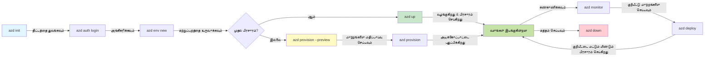
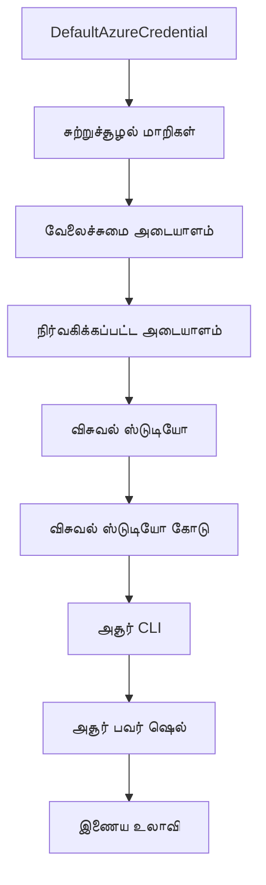

# AZD அடிப்படைகள் - Azure Developer CLI-ஐப் புரிந்துகொள்வது

# AZD அடிப்படைகள் - முக்கிய கருத்துக்கள் மற்றும் அடிப்படைகள்

**அத்தியாய வழிகாட்டுதல்:**
- **📚 பாடநெறி முகப்பு**: [AZD ஆரம்பத்திற்கானது](../../README.md)
- **📖 தற்போதைய அத்தியாயம்**: அத்தியாயம் 1 - அடித்தளம் & விரைவான தொடக்கம்
- **⬅️ முந்தையது**: [பாடநெறி மேற்பார்வை](../../README.md#-chapter-1-foundation--quick-start)
- **➡️ அடுத்தது**: [நிறுவல் & அமைப்பு](installation.md)
- **🚀 அடுத்த அத்தியாயம்**: [அத்தியாயம் 2: AI-முதன்மை மேம்பாடு](../microsoft-foundry/microsoft-foundry-integration.md)

## அறிமுகம்

இந்த பாடம் Azure Developer CLI (azd) பற்றிய அறிமுகத்தை வழங்குகிறது, இது உள்ளூர் மேம்பாட்டிலிருந்து Azure-க்கு மின்னல் வேகத்தில் செல்ல உதவும் ஒரு சக்திவாய்ந்த கட்டளைகள் கருவி. azd மேக-நேசமான பயன்பாடுகளைப் பரிமாற்றம் செய்ய எளிமையாக்குவதில் எப்படி உதவுகிறது என்பதை நீங்கள் அடிப்படை கருத்துக்கள் மற்றும் முக்கிய அம்சங்களைப் புரிந்துகொள்வீர்கள்.

## கற்றல் இலக்குகள்

இந்த பாடத்தின் முடிவில், நீங்கள்:
- Azure Developer CLI என்ன மற்றும் அதன் முதன்மை நோக்கம் என்ன என்பதைப் புரிந்துகொள்வீர்கள்
- டெம்ப்ளேட்கள், சூழல்கள் மற்றும் சேவைகள் பற்றிய அடிப்படை கருத்துகளைப் படிப்பீர்கள்
- டெம்ப்ளேட்-அடிப்படையிலான மேம்பாடு மற்றும் கட்டமைப்பை குறியீடாக மாற்றும் முக்கிய அம்சங்களை ஆராய்வீர்கள்
- azd திட்ட அமைப்பு மற்றும் பணிச்சூழலைப் புரிந்துகொள்வீர்கள்
- உங்கள் மேம்பாட்டு சூழலுக்கு azd-ஐ நிறுவ மற்றும் அமைக்க தயாராக இருப்பீர்கள்

## கற்றல் முடிவுகள்

இந்த பாடத்தை முடித்த பிறகு, நீங்கள்:
- azd-இன் பங்கு மற்றும் அதன் முக்கியத்துவத்தை விளக்க முடியும்
- azd திட்ட அமைப்பின் கூறுகளை அடையாளம் காண முடியும்
- டெம்ப்ளேட்கள், சூழல்கள் மற்றும் சேவைகள் எப்படி ஒருங்கிணைக்கப்படுகின்றன என்பதை விவரிக்க முடியும்
- azd உடன் கட்டமைப்பை குறியீடாக மாற்றுவதின் நன்மைகளைப் புரிந்துகொள்ள முடியும்
- azd கட்டளைகள் மற்றும் அவற்றின் நோக்கங்களை அடையாளம் காண முடியும்

## Azure Developer CLI (azd) என்றால் என்ன?

Azure Developer CLI (azd) என்பது உள்ளூர் மேம்பாட்டிலிருந்து Azure-க்கு மின்னல் வேகத்தில் செல்ல வடிவமைக்கப்பட்ட கட்டளைகள் கருவி ஆகும். இது Azure-ல் மேக-நேசமான பயன்பாடுகளை உருவாக்க, பரிமாற்றம் செய்ய மற்றும் நிர்வகிக்க செயல்முறை எளிமையாக்குகிறது.

### 🎯 ஏன் AZD பயன்படுத்த வேண்டும்? ஒரு நிஜ உலக ஒப்பீடு

ஒரு எளிய வலை பயன்பாட்டை தரவுத்தொகுப்புடன் பரிமாற்றம் செய்வதை ஒப்பிடுவோம்:

#### ❌ AZD இல்லாமல்: கையேடு Azure பரிமாற்றம் (30+ நிமிடங்கள்)

```bash
# படி 1: வளக் குழுவை உருவாக்கவும்
az group create --name myapp-rg --location eastus

# படி 2: பயன்பாட்டு சேவை திட்டத்தை உருவாக்கவும்
az appservice plan create --name myapp-plan \
  --resource-group myapp-rg \
  --sku B1 --is-linux

# படி 3: வலை பயன்பாட்டை உருவாக்கவும்
az webapp create --name myapp-web-unique123 \
  --resource-group myapp-rg \
  --plan myapp-plan \
  --runtime "NODE:18-lts"

# படி 4: கோஸ்மோஸ் DB கணக்கை உருவாக்கவும் (10-15 நிமிடங்கள்)
az cosmosdb create --name myapp-cosmos-unique123 \
  --resource-group myapp-rg \
  --kind MongoDB

# படி 5: தரவுத்தொகுப்பை உருவாக்கவும்
az cosmosdb mongodb database create \
  --account-name myapp-cosmos-unique123 \
  --resource-group myapp-rg \
  --name tododb

# படி 6: தொகுப்பை உருவாக்கவும்
az cosmosdb mongodb collection create \
  --account-name myapp-cosmos-unique123 \
  --resource-group myapp-rg \
  --database-name tododb \
  --name todos

# படி 7: இணைப்பு சரத்தை பெறவும்
CONN_STR=$(az cosmosdb keys list \
  --name myapp-cosmos-unique123 \
  --resource-group myapp-rg \
  --type connection-strings \
  --query "connectionStrings[0].connectionString" -o tsv)

# படி 8: பயன்பாட்டு அமைப்புகளை உள்ளமைக்கவும்
az webapp config appsettings set \
  --name myapp-web-unique123 \
  --resource-group myapp-rg \
  --settings MONGODB_URI="$CONN_STR"

# படி 9: பதிவு செயல்படுத்தவும்
az webapp log config --name myapp-web-unique123 \
  --resource-group myapp-rg \
  --application-logging filesystem \
  --detailed-error-messages true

# படி 10: பயன்பாட்டு உள்ளுணர்வுகளை அமைக்கவும்
az monitor app-insights component create \
  --app myapp-insights \
  --location eastus \
  --resource-group myapp-rg

# படி 11: பயன்பாட்டு உள்ளுணர்வுகளை வலை பயன்பாட்டுடன் இணைக்கவும்
INSTRUMENTATION_KEY=$(az monitor app-insights component show \
  --app myapp-insights \
  --resource-group myapp-rg \
  --query "instrumentationKey" -o tsv)

az webapp config appsettings set \
  --name myapp-web-unique123 \
  --resource-group myapp-rg \
  --settings APPINSIGHTS_INSTRUMENTATIONKEY="$INSTRUMENTATION_KEY"

# படி 12: பயன்பாட்டை உள்ளூராக உருவாக்கவும்
npm install
npm run build

# படி 13: பிரசாரம் தொகுப்பை உருவாக்கவும்
zip -r app.zip . -x "*.git*" "node_modules/*"

# படி 14: பயன்பாட்டை பிரசாரம் செய்யவும்
az webapp deployment source config-zip \
  --resource-group myapp-rg \
  --name myapp-web-unique123 \
  --src app.zip

# படி 15: காத்திருந்து அது வேலை செய்யும் என்று பிரார்த்திக்கவும் 🙏
# (தானியங்கி சரிபார்ப்பு இல்லை, கையேடு சோதனை தேவை)
```

**சிக்கல்கள்:**
- ❌ 15+ கட்டளைகளை நினைவில் வைத்துக் கொண்டு செயல்படுத்த வேண்டும்
- ❌ 30-45 நிமிடங்கள் கையேடு வேலை
- ❌ தவறுகள் செய்ய எளிது (தவறான எழுத்துகள், தவறான அளவுருக்கள்)
- ❌ இணைப்பு சரங்கள் டெர்மினல் வரலாற்றில் வெளிப்படுகின்றன
- ❌ ஏதாவது தவறினால் தானியங்கிய ரோல்பேக் இல்லை
- ❌ குழு உறுப்பினர்களுக்கு மீண்டும் செய்ய கடினம்
- ❌ ஒவ்வொரு முறையும் மாறுபடுகிறது (மீண்டும் செய்ய முடியாது)

#### ✅ AZD உடன்: தானியங்கிய பரிமாற்றம் (5 கட்டளைகள், 10-15 நிமிடங்கள்)

```bash
# படிவத்திலிருந்து ஆரம்பிக்கவும்
azd init --template todo-nodejs-mongo

# அங்கீகரிக்கவும்
azd auth login

# சூழலை உருவாக்கவும்
azd env new dev

# மாற்றங்களை முன்னோட்டமாக பார்க்கவும் (விருப்பமானது ஆனால் பரிந்துரைக்கப்படுகிறது)
azd provision --preview

# அனைத்தையும் பிரசுரிக்கவும்
azd up

# ✨ முடிந்தது! அனைத்தும் பிரசுரிக்கப்பட்டது, அமைக்கப்பட்டது, மற்றும் கண்காணிக்கப்பட்டது
```

**நன்மைகள்:**
- ✅ **5 கட்டளைகள்** vs. 15+ கையேடு படிகள்
- ✅ **10-15 நிமிடங்கள்** மொத்த நேரம் (Azure க்காக காத்திருக்க வேண்டும்)
- ✅ **பிழைகள் இல்லை** - தானியங்கிய மற்றும் சோதிக்கப்பட்டது
- ✅ **இரகசியங்கள் பாதுகாப்பாக நிர்வகிக்கப்படுகின்றன** Key Vault மூலம்
- ✅ **தானியங்கிய ரோல்பேக்** தோல்விகளில்
- ✅ **முழுமையாக மீண்டும் செய்யக்கூடியது** - ஒவ்வொரு முறையும் ஒரே முடிவு
- ✅ **குழு-தயார்** - ஒரே கட்டளைகளுடன் யாரும் பரிமாற்றம் செய்ய முடியும்
- ✅ **கட்டமைப்பை குறியீடாக மாற்றுதல்** - பதிப்பு கட்டுப்படுத்தப்பட்ட Bicep டெம்ப்ளேட்கள்
- ✅ **உள்ளமைக்கப்பட்ட கண்காணிப்பு** - Application Insights தானியங்கிய அமைப்பு

### 📊 நேரம் & பிழை குறைப்பு

| அளவுகோல் | கையேடு பரிமாற்றம் | AZD பரிமாற்றம் | மேம்பாடு |
|:-------|:------------------|:---------------|:------------|
| **கட்டளைகள்** | 15+ | 5 | 67% குறைவு |
| **நேரம்** | 30-45 நிமிடங்கள் | 10-15 நிமிடங்கள் | 60% வேகமாக |
| **பிழை விகிதம்** | ~40% | <5% | 88% குறைவு |
| **நிலைத்தன்மை** | குறைவு (கையேடு) | 100% (தானியங்கியது) | சிறந்தது |
| **குழு பயிற்சி** | 2-4 மணி நேரம் | 30 நிமிடங்கள் | 75% வேகமாக |
| **ரோல்பேக் நேரம்** | 30+ நிமிடங்கள் (கையேடு) | 2 நிமிடங்கள் (தானியங்கியது) | 93% வேகமாக |

## முக்கிய கருத்துக்கள்

### டெம்ப்ளேட்கள்
டெம்ப்ளேட்கள் azd-இன் அடித்தளம். அவை கொண்டுள்ளன:
- **பயன்பாட்டு குறியீடு** - உங்கள் மூல குறியீடு மற்றும் சார்புகள்
- **கட்டமைப்பு வரையறைகள்** - Azure வளங்கள் Bicep அல்லது Terraform-ல் வரையறுக்கப்பட்டவை
- **கட்டமைப்பு கோப்புகள்** - அமைப்புகள் மற்றும் சூழல் மாறிகள்
- **பரிமாற்ற ஸ்கிரிப்ட்கள்** - தானியங்கிய பரிமாற்ற பணிச்சூழல்கள்

### சூழல்கள்
சூழல்கள் வெவ்வேறு பரிமாற்ற இலக்குகளை பிரதிநிதித்துவப்படுத்துகின்றன:
- **மேம்பாடு** - சோதனை மற்றும் மேம்பாட்டிற்காக
- **ஸ்டேஜிங்** - உற்பத்திக்கு முன் சூழல்
- **உற்பத்தி** - நேரடி உற்பத்தி சூழல்

ஒவ்வொரு சூழலும் தனித்தனியாக வைத்திருக்கும்:
- Azure வளக் குழு
- கட்டமைப்பு அமைப்புகள்
- பரிமாற்ற நிலை

### சேவைகள்
சேவைகள் உங்கள் பயன்பாட்டின் கட்டமைப்புகள்:
- **முன்பக்கம்** - வலை பயன்பாடுகள், SPAs
- **பின்பக்கம்** - APIs, மைக்ரோசேவைகள்
- **தரவுத்தொகுப்பு** - தரவுத்தொகுப்பு தீர்வுகள்
- **சேமிப்பு** - கோப்பு மற்றும் blob சேமிப்பு

## முக்கிய அம்சங்கள்

### 1. டெம்ப்ளேட்-அடிப்படையிலான மேம்பாடு
```bash
# கிடைக்கக்கூடிய டெம்ப்ளேட்களை உலாவுக
azd template list

# ஒரு டெம்ப்ளேட்டிலிருந்து தொடங்கவும்
azd init --template <template-name>
```

### 2. கட்டமைப்பை குறியீடாக மாற்றுதல்
- **Bicep** - Azure-இன் துறை-குறிப்பிட்ட மொழி
- **Terraform** - பல மேக கட்டமைப்பு கருவி
- **ARM டெம்ப்ளேட்கள்** - Azure Resource Manager டெம்ப்ளேட்கள்

### 3. ஒருங்கிணைந்த பணிச்சூழல்கள்
```bash
# முழுமையான பிரசார வேலைப்பாடு
azd up            # வழங்கல் + பிரசாரம் இது முதல் முறை அமைப்புக்கு கையற்றது

# 🧪 புதியது: பிரசாரத்திற்கு முன் கட்டமைப்பு மாற்றங்களை முன்னோட்டமாக பார்க்கவும் (பாதுகாப்பானது)
azd provision --preview    # மாற்றங்களை செய்யாமல் கட்டமைப்பு பிரசாரத்தை ஒத்திகை செய்யவும்

azd provision     # நீங்கள் கட்டமைப்பை புதுப்பித்தால் Azure வளங்களை உருவாக்கவும்
azd deploy        # பயன்பாட்டு குறியீட்டை பிரசாரம் செய்யவும் அல்லது புதுப்பித்த பிறகு பயன்பாட்டு குறியீட்டை மீண்டும் பிரசாரம் செய்யவும்
azd down          # வளங்களை சுத்தம் செய்யவும்
```

#### 🛡️ பாதுகாப்பான கட்டமைப்பு திட்டமிடல் முன்னோட்டத்துடன்
`azd provision --preview` கட்டளை பாதுகாப்பான பரிமாற்றங்களுக்கு ஒரு மாற்றத்தை வழங்குகிறது:
- **உலர்ந்த-இயக்க பகுப்பாய்வு** - என்ன உருவாக்கப்படும், மாற்றப்படும் அல்லது நீக்கப்படும் என்பதை காட்டுகிறது
- **பூஜ்ஜிய ஆபத்து** - உங்கள் Azure சூழலில் எந்த உண்மையான மாற்றங்களும் செய்யப்படவில்லை
- **குழு ஒத்துழைப்பு** - பரிமாற்றத்திற்கு முன் முன்னோட்ட முடிவுகளைப் பகிரவும்
- **செலவுத்திறன் மதிப்பீடு** - வள செலவுகளைப் புரிந்துகொள்ளவும்

```bash
# உதாரண முன்னோட்ட வேலைப்பாடு
azd provision --preview           # என்ன மாற்றம் ஏற்படும் என்பதை பாருங்கள்
# வெளியீட்டை மதிப்பீடு செய்யவும், குழுவுடன் விவாதிக்கவும்
azd provision                     # நம்பிக்கையுடன் மாற்றங்களை பயன்படுத்தவும்
```

### 📊 காட்சி: AZD மேம்பாட்டு பணிச்சூழல்


**பணிச்சூழல் விளக்கம்:**
1. **Init** - டெம்ப்ளேட் அல்லது புதிய திட்டத்துடன் தொடங்கவும்
2. **Auth** - Azure உடன் அங்கீகரிக்கவும்
3. **சூழல்** - தனிமைப்படுத்தப்பட்ட பரிமாற்ற சூழலை உருவாக்கவும்
4. **Preview** - 🆕 எப்போதும் கட்டமைப்பு மாற்றங்களை முன்னோட்டமாக பார்க்கவும் (பாதுகாப்பான நடைமுறை)
5. **Provision** - Azure வளங்களை உருவாக்க/மேம்படுத்தவும்
6. **Deploy** - உங்கள் பயன்பாட்டு குறியீட்டை தள்ளவும்
7. **Monitor** - பயன்பாட்டு செயல்திறனை கவனிக்கவும்
8. **Iterate** - மாற்றங்களைச் செய்யவும் மற்றும் குறியீட்டை மீண்டும் பரிமாற்றம் செய்யவும்
9. **Cleanup** - முடிந்தவுடன் வளங்களை நீக்கவும்

### 4. சூழல் மேலாண்மை
```bash
# சூழல்களை உருவாக்கி நிர்வகிக்கவும்
azd env new <environment-name>
azd env select <environment-name>
azd env list
```

## 📁 திட்ட அமைப்பு

ஒரு வழக்கமான azd திட்ட அமைப்பு:
```
my-app/
├── .azd/                    # azd configuration
│   └── config.json
├── .azure/                  # Azure deployment artifacts
├── .devcontainer/          # Development container config
├── .github/workflows/      # GitHub Actions
├── .vscode/               # VS Code settings
├── infra/                 # Infrastructure code
│   ├── main.bicep        # Main infrastructure template
│   ├── main.parameters.json
│   └── modules/          # Reusable modules
├── src/                  # Application source code
│   ├── api/             # Backend services
│   └── web/             # Frontend application
├── azure.yaml           # azd project configuration
└── README.md
```

## 🔧 கட்டமைப்பு கோப்புகள்

### azure.yaml
முக்கிய திட்ட கட்டமைப்பு கோப்பு:
```yaml
name: my-awesome-app
metadata:
  template: my-template@1.0.0

services:
  web:
    project: ./src/web
    language: js
    host: appservice
  api:
    project: ./src/api
    language: js
    host: appservice

hooks:
  preprovision:
    shell: pwsh
    run: echo "Preparing to provision..."
```

### .azure/config.json
சூழல்-குறிப்பிட்ட கட்டமைப்பு:
```json
{
  "version": 1,
  "defaultEnvironment": "dev",
  "environments": {
    "dev": {
      "subscriptionId": "your-subscription-id",
      "location": "eastus"
    }
  }
}
```

## 🎪 பொதுவான பணிச்சூழல்கள் மற்றும் கையால் செய்யும் பயிற்சிகள்

> **💡 கற்றல் குறிப்புகள்:** உங்கள் AZD திறன்களை முறையாக உருவாக்க இந்த பயிற்சிகளை வரிசையாக பின்பற்றவும்.

### 🎯 பயிற்சி 1: உங்கள் முதல் திட்டத்தை தொடங்கவும்

**நோக்கம்:** ஒரு AZD திட்டத்தை உருவாக்கவும் மற்றும் அதன் அமைப்பை ஆராயவும்

**படிகள்:**
```bash
# ஒரு நிரூபிக்கப்பட்ட வார்ப்புருவைப் பயன்படுத்தவும்
azd init --template todo-nodejs-mongo

# உருவாக்கப்பட்ட கோப்புகளை ஆராயவும்
ls -la  # மறைக்கப்பட்ட கோப்புகளைச் சேர்த்து அனைத்து கோப்புகளையும் காணவும்

# முக்கிய கோப்புகள் உருவாக்கப்பட்டன:
# - azure.yaml (முக்கிய கட்டமைப்பு)
# - infra/ (கட்டமைப்பு குறியீடு)
# - src/ (விண்ணப்ப குறியீடு)
```

**✅ வெற்றி:** azure.yaml, infra/, மற்றும் src/ கோப்புறைகள் உங்களிடம் உள்ளன

---

### 🎯 பயிற்சி 2: Azure-க்கு பரிமாற்றம் செய்யவும்

**நோக்கம்:** முழுமையான பரிமாற்றத்தை முடிக்கவும்

**படிகள்:**
```bash
# 1. அங்கீகரிக்கவும்
az login && azd auth login

# 2. சூழலை உருவாக்கவும்
azd env new dev
azd env set AZURE_LOCATION eastus

# 3. மாற்றங்களை முன்னோட்டமாக காண்க (பரிந்துரைக்கப்படுகிறது)
azd provision --preview

# 4. அனைத்தையும் பிரசுரிக்கவும்
azd up

# 5. பிரசுரத்தை சரிபார்க்கவும்
azd show    # உங்கள் பயன்பாட்டு URL ஐ பார்க்கவும்
```

**எதிர்பார்க்கும் நேரம்:** 10-15 நிமிடங்கள்  
**✅ வெற்றி:** பயன்பாட்டு URL உலாவியில் திறக்கிறது

---

### 🎯 பயிற்சி 3: பல சூழல்கள்

**நோக்கம்:** dev மற்றும் staging-க்கு பரிமாற்றம் செய்யவும்

**படிகள்:**
```bash
# ஏற்கனவே dev உள்ளது, staging உருவாக்கவும்
azd env new staging
azd env set AZURE_LOCATION westus2
azd up

# அவற்றிற்கிடையில் மாறவும்
azd env list
azd env select dev
```

**✅ வெற்றி:** Azure Portal-ல் இரண்டு தனித்தனியான வளக் குழுக்கள்

---

### 🛡️ புதிய தொடக்கம்: `azd down --force --purge`

முழுமையாக மீட்டமைக்க வேண்டுமென்றால்:

```bash
azd down --force --purge
```

**அது என்ன செய்கிறது:**
- `--force`: எந்த உறுதிப்படுத்தல் உந்துதல்கள் இல்லை
- `--purge`: அனைத்து உள்ளூர் நிலை மற்றும் Azure வளங்களை நீக்குகிறது

**பயன்பாடு:**
- பரிமாற்றம் நடுவில் தோல்வியடைந்தது
- திட்டங்களை மாற்றுவது
- புதிய தொடக்கம் தேவை

---

## 🎪 அசல் பணிச்சூழல் குறிப்பு

### புதிய திட்டத்தை தொடங்குதல்
```bash
# முறை 1: உள்ளமைவுள்ள வார்ப்புருவைப் பயன்படுத்தவும்
azd init --template todo-nodejs-mongo

# முறை 2: புதிதாக தொடங்கவும்
azd init

# முறை 3: தற்போதைய கோப்பகத்தைப் பயன்படுத்தவும்
azd init .
```

### மேம்பாட்டு சுழற்சி
```bash
# மேம்பாட்டு சூழலை அமைக்கவும்
azd auth login
azd env new dev
azd env select dev

# அனைத்தையும் பிரசுரிக்கவும்
azd up

# மாற்றங்களைச் செய்து மீண்டும் பிரசுரிக்கவும்
azd deploy

# முடிந்ததும் சுத்தம் செய்யவும்
azd down --force --purge # Azure Developer CLI இல் உள்ள கட்டளை உங்கள் சூழலுக்கு **கடினமான மீட்டமைப்பு** ஆகும்—முக்கியமாக தோல்வியடைந்த பிரசுரங்களை சரிசெய்யும்போது, தன்னிலைமறைந்த வளங்களை சுத்தம் செய்யும்போது, அல்லது புதிய மீண்டும் பிரசுரத்திற்கு தயாராகும்போது பயனுள்ளதாக இருக்கும்.
```

## `azd down --force --purge`-ஐப் புரிந்துகொள்வது
`azd down --force --purge` கட்டளை azd சூழல் மற்றும் அதனுடன் தொடர்புடைய அனைத்து வளங்களையும் முழுமையாக அழிக்க ஒரு சக்திவாய்ந்த வழியாகும். ஒவ்வொரு கொடுப்பனவின் செயல்பாட்டை இங்கே பிரிக்கவும்:
```
--force
```
- உறுதிப்படுத்தல் உந்துதல்களை தவிர்க்கிறது.
- கையேடு உள்ளீடு சாத்தியமற்றது என்றால் ஆட்டோமேஷன் அல்லது ஸ்கிரிப்ட்டிங் பயன்பாட்டிற்கு பயனுள்ளதாக உள்ளது.
- CLI முரண்பாடுகளை கண்டறிந்தாலும், அழிப்பு இடையூறு இல்லாமல் தொடரும்.

```
--purge
```
**அனைத்து தொடர்புடைய மெட்டாடேட்டாவையும்** நீக்குகிறது, உட்பட:
சூழல் நிலை
உள்ளூர் `.azure` கோப்புறை
பரிமாற்ற தகவல் கச்சா
முந்தைய பரிமாற்றங்களை "நினைவில் வைத்திருக்கும்" azd-ஐ தடுக்கிறது, இது தவறான வளக் குழுக்கள் அல்லது பழமையான பதிவக குறிப்புகள் போன்ற சிக்கல்களை ஏற்படுத்தலாம்.


### ஏன் இரண்டையும் பயன்படுத்த வேண்டும்?
`azd up`-இன் போது நிலை அல்லது பகுதி பரிமாற்றங்களின் காரணமாக சிக்கல்களை சந்தித்தால், இந்த இணைப்பு **புதிய தொடக்கம்** உறுதிசெய்கிறது.

இது Azure Portal-ல் கையேடு வள அழிப்புகளுக்கு பிறகு அல்லது டெம்ப்ளேட்கள், சூழல்கள் அல்லது வளக் குழு பெயரிடல் ஒழுங்குகளை மாற்றும்போது மிகவும் உதவியாக உள்ளது.


### பல சூழல்களை நிர்வகித்தல்
```bash
# மேடை சூழலை உருவாக்கவும்
azd env new staging
azd env select staging
azd up

# டெவ்-க்கு திரும்ப переключить
azd env select dev

# சூழல்களை ஒப்பிடவும்
azd env list
```

## 🔐 அங்கீகாரம் மற்றும் சான்றுகள்

அங்கீகாரத்தைப் புரிந்துகொள்வது வெற்றிகரமான azd பரிமாற்றங்களுக்கு முக்கியமானது. Azure பல அங்கீகார முறைகளைப் பயன்படுத்துகிறது, மேலும் azd மற்ற Azure கருவிகள் பயன்படுத்தும் அதே சான்று சங்கிலியை பயன்படுத்துகிறது.

### Azure CLI அங்கீகாரம் (`az login`)

azd பயன்படுத்துவதற்கு முன், நீங்கள் Azure உடன் அங்கீகரிக்க வேண்டும். மிகவும் பொதுவான முறை Azure CLI பயன்படுத்துவது:

```bash
# இடையக உள்நுழைவு (உலாவியை திறக்கிறது)
az login

# குறிப்பிட்ட வாடகையுடன் உள்நுழைக
az login --tenant <tenant-id>

# சேவை பிரதிநிதியுடன் உள்நுழைக
az login --service-principal -u <app-id> -p <password> --tenant <tenant-id>

# தற்போதைய உள்நுழைவு நிலையை சரிபார்க்கவும்
az account show

# கிடைக்கக்கூடிய சந்தாக்களை பட்டியலிடவும்
az account list --output table

# இயல்புநிலை சந்தாவை அமைக்கவும்
az account set --subscription <subscription-id>
```

### அங்கீகார சுழற்சி
1. **இணையதள உள்நுழைவு**: அங்கீகாரத்திற்காக உங்கள் இயல்பான உலாவியைத் திறக்கிறது
2. **சாதன குறியீடு சுழற்சி**: உலாவி அணுகல் இல்லாத சூழல்களுக்கு
3. **சேவை பிரதிநிதி**: ஆட்டோமேஷன் மற்றும் CI/CD சூழல்களுக்கு
4. **நிர்வகிக்கப்பட்ட அடையாளம்**: Azure-இல் ஹோஸ்ட் செய்யப்பட்ட பயன்பாடுகளுக்கு

### DefaultAzureCredential சங்கிலி

`DefaultAzureCredential` என்பது பல சான்று மூலங்களை ஒரு குறிப்பிட்ட வரிசையில் தானாக முயற்சிக்கும் ஒரு சான்று வகை ஆகும்:

#### சான்று சங்கிலி வரிசை

#### 1. சூழல் மாறிகள்
```bash
# சேவை முதன்மைதாரருக்கான சூழல் மாறிகளை அமைக்கவும்
export AZURE_CLIENT_ID="<app-id>"
export AZURE_CLIENT_SECRET="<password>"
export AZURE_TENANT_ID="<tenant-id>"
```

#### 2. வேலைச்சுமை அடையாளம் (Kubernetes/GitHub Actions)
தானாக பயன்படுத்தப்படுகிறது:
- Azure Kubernetes Service (AKS) வேலைச்சுமை அடையாளத்துடன்
- GitHub Actions OIDC கூட்டமைப்புடன்
- பிற கூட்டமைக்கப்பட்ட அடையாள சூழல்கள்

#### 3. நிர்வகிக்கப்பட்ட அடையாளம்
Azure வளங்களுக்கு:
- மெய்நிகர் இயந்திரங்கள்
- பயன்பாட்டு சேவை
- Azure செயல்பாடுகள்
- கெண்டைனர் நிகழ்வுகள்

```bash
# Azure வளம் மேலாண்மை அடையாளத்துடன் இயங்குகிறதா என்பதை சரிபார்க்கவும்
az account show --query "user.type" --output tsv
# மேலாண்மை அடையாளத்தைப் பயன்படுத்தினால் "servicePrincipal" ஐ திருப்புகிறது
```

#### 4. மேம்பாட்டு கருவிகள் ஒருங்கிணைப்பு
- **Visual Studio**: உள்நுழைந்த கணக்கைப் பயன்படுத்துகிறது
- **VS Code**: Azure Account நீட்டிப்பு சான்றுகளைப் பயன்படுத்துகிறது
- **Azure CLI**: `az login` சான்றுகளைப் பயன்படுத்துகிறது (உள்ளூர் மேம்பாட்டிற்கு மிகவும் பொதுவானது)

### AZD அங்கீகார அமைப்பு

```bash
# முறை 1: Azure CLI பயன்படுத்தவும் (வளர்ச்சிக்கு பரிந்துரைக்கப்படுகிறது)
az login
azd auth login  # ஏற்கனவே உள்ள Azure CLI சான்றுகளை பயன்படுத்துகிறது

# முறை 2: நேரடி azd அங்கீகாரம்
azd auth login --use-device-code  # தலை இல்லாத சூழல்களுக்கு

# முறை 3: அங்கீகார நிலையை சரிபார்க்கவும்
azd auth login --check-status

# முறை 4: வெளியேறி மீண்டும் அங்கீகரிக்கவும்
azd auth logout
azd auth login
```

### அங்கீகார சிறந்த நடைமுறைகள்

#### உள்ளூர் மேம்பாட்டிற்காக
```bash
# 1. Azure CLI உடன் உள்நுழைக
az login

# 2. சரியான சந்தாவை சரிபார்க்கவும்
az account show
az account set --subscription "Your Subscription Name"

# 3. ஏற்கனவே உள்ள சான்றுகளுடன் azd ஐ பயன்படுத்தவும்
azd auth login
```

#### CI/CD குழாய்களுக்கு
```yaml
# GitHub Actions example
- name: Azure Login
  uses: azure/login@v1
  with:
    creds: ${{ secrets.AZURE_CREDENTIALS }}

- name: Deploy with azd
  run: |
    azd auth login --client-id ${{ secrets.AZURE_CLIENT_ID }} \
                    --client-secret ${{ secrets.AZURE_CLIENT_SECRET }} \
                    --tenant-id ${{ secrets.AZURE_TENANT_ID }}
    azd up --no-prompt
```

#### உற்பத்தி சூழல்களுக்கு
- Azure வளங்களில் இயங்கும்போது **நிர்வகிக்கப்பட்ட அடையாளம்** பயன்படுத்தவும்
- ஆட்டோமேஷன் சூழல்களுக்கு **சேவை பிரதிநிதி** பயன்படுத்தவும்
- குறியீடு அல்லது கட்டமைப்பு கோப்புகளில் சான்றுகளை சேமிக்க தவிர்க்கவும்
- **Azure Key Vault**-ஐ நுணுக்கமான கட்டமைப்பிற்காக பயன்படுத்தவும்

### பொதுவான அங்கீகார சிக்கல்கள் மற்றும் தீர்வுகள்

#### சிக்கல்: "சந்தா இல்லை"
```bash
# தீர்வு: இயல்புநிலை சந்தாவை அமைக்கவும்
az account list --output table
az account set --subscription "<subscription-id>"
azd env set AZURE_SUBSCRIPTION_ID "<subscription-id>"
```

#### சிக்கல்: "போதுமான அனுமதிகள் இல்லை"
```bash
# தீர்வு: தேவையான பங்குகளை சரிபார்த்து ஒதுக்கவும்
az role assignment list --assignee $(az account show --query user.name --output tsv)

# பொதுவான தேவையான பங்குகள்:
# - பங்களிப்பாளர் (வள மேலாண்மைக்காக)
# - பயனர் அணுகல் நிர்வாகி (பங்கு ஒதுக்குதலுக்காக)
```

#### சிக்கல்: "டோக்கன் காலாவதியானது"
```bash
# தீர்வு: மீண்டும் அங்கீகரிக்கவும்
az logout
az login
azd auth logout
azd auth login
```

### வெவ்வேறு சூழல்களில் அங்கீகாரம்

#### உள்ளூர் மேம்பாடு
```bash
# தனிப்பட்ட வளர்ச்சி கணக்கு
az login
azd auth login
```

#### குழு மேம்பாடு
```bash
# அமைப்பிற்கான குறிப்பிட்ட வாடகையாளரை பயன்படுத்தவும்
az login --tenant contoso.onmicrosoft.com
azd auth login
```

#### பல-வாடிக்கையாளர் சூழல்கள்
```bash
# வாடகையாளர்களுக்கு இடையில் மாறவும்
az login --tenant tenant1.onmicrosoft.com
# வாடகையாளர் 1க்கு பிரயோகிக்கவும்
azd up

az login --tenant tenant2.onmicrosoft.com  
# வாடகையாளர் 2க்கு பிரயோகிக்கவும்
azd up
```

### பாதுகாப்பு கருத்துக்கள்

1. **சான்று சேம
- [நிறுவல் மற்றும் அமைப்பு](installation.md) - azd ஐ நிறுவி அமைக்கவும்
- [உங்கள் முதல் திட்டம்](first-project.md) - முழுமையான கையேடு பயிற்சி
- [அமைப்பு வழிகாட்டி](configuration.md) - மேம்பட்ட அமைப்பு விருப்பங்கள்

**🎯 அடுத்த அத்தியாயத்திற்கு தயாரா?**
- [அத்தியாயம் 2: AI-முதன்மை மேம்பாடு](../microsoft-foundry/microsoft-foundry-integration.md) - AI பயன்பாடுகளை உருவாக்கத் தொடங்குங்கள்

## கூடுதல் வளங்கள்

- [Azure Developer CLI கண்ணோட்டம்](https://learn.microsoft.com/en-us/azure/developer/azure-developer-cli/)
- [டெம்ப்ளேட் கேலரி](https://azure.github.io/awesome-azd/)
- [சமூக மாதிரிகள்](https://github.com/Azure-Samples)

---

## 🙋 அடிக்கடி கேட்கப்படும் கேள்விகள்

### பொதுக் கேள்விகள்

**Q: AZD மற்றும் Azure CLI இன் வித்தியாசம் என்ன?**

A: Azure CLI (`az`) தனிப்பட்ட Azure வளங்களை நிர்வகிக்க பயன்படுகிறது. AZD (`azd`) முழு பயன்பாடுகளை நிர்வகிக்க பயன்படுகிறது:

```bash
# Azure CLI - குறைந்த நிலை வள மேலாண்மை
az webapp create --name myapp --resource-group rg
az sql server create --name myserver --resource-group rg
# ...பல கூடுதல் கட்டளைகள் தேவை

# AZD - பயன்பாட்டு நிலை மேலாண்மை
azd up  # அனைத்து வளங்களுடன் முழு பயன்பாட்டை பிரசுரிக்கிறது
```

**இதை இவ்வாறு நினைத்துக்கொள்ளுங்கள்:**
- `az` = தனிப்பட்ட லெகோ கட்டங்களை இயக்குவது
- `azd` = முழு லெகோ செட்டுகளை வேலை செய்யும்

---

**Q: AZD ஐ பயன்படுத்த Bicep அல்லது Terraform தெரிந்திருக்க வேண்டுமா?**

A: இல்லை! டெம்ப்ளேட்டுகளுடன் தொடங்குங்கள்:
```bash
# உள்ளமைவுள்ள வார்ப்புருவைப் பயன்படுத்தவும் - IaC அறிவு தேவையில்லை
azd init --template todo-nodejs-mongo
azd up
```

பின்னர் Bicep கற்றுக்கொண்டு உள்கட்டமைப்பை தனிப்பயனாக்கலாம். டெம்ப்ளேட்டுகள் கற்றுக்கொள்ள உதவும் வேலை செய்யும் உதாரணங்களை வழங்குகின்றன.

---

**Q: AZD டெம்ப்ளேட்டுகளை இயக்குவதற்கு செலவு எவ்வளவு?**

A: செலவுகள் டெம்ப்ளேட்டுகளின் அடிப்படையில் மாறுபடும். பெரும்பாலான மேம்பாட்டு டெம்ப்ளேட்டுகள் மாதத்திற்கு $50-150 செலவாகும்:

```bash
# பிரிவியூ செலவுகளை வெளியிடுவதற்கு முன் பாருங்கள்
azd provision --preview

# பயன்படுத்தாமல் இருக்கும் போது எப்போதும் சுத்தம் செய்யுங்கள்
azd down --force --purge  # அனைத்து வளங்களையும் அகற்றுகிறது
```

**சிறந்த குறிப்புகள்:** இலவச நிலைகளை பயன்படுத்துங்கள்:
- App Service: F1 (இலவச) நிலை
- Azure OpenAI: மாதத்திற்கு 50,000 டோக்கன்கள் இலவசம்
- Cosmos DB: 1000 RU/s இலவச நிலை

---

**Q: நான் ஏற்கனவே உள்ள Azure வளங்களுடன் AZD ஐ பயன்படுத்த முடியுமா?**

A: ஆம், ஆனால் புதியதாக தொடங்குவது எளிதாக இருக்கும். AZD முழு வாழ்க்கைச் சுழற்சியையும் நிர்வகிக்க சிறந்தது. ஏற்கனவே உள்ள வளங்களுக்கு:

```bash
# விருப்பம் 1: ஏற்கனவே உள்ள வளங்களை இறக்குமதி செய்யவும் (மேம்பட்டது)
azd init
# பின்னர் infra/ ஐ மாற்றி ஏற்கனவே உள்ள வளங்களை குறிப்பிடவும்

# விருப்பம் 2: புதியதாக தொடங்கவும் (பரிந்துரைக்கப்படுகிறது)
azd init --template matching-your-stack
azd up  # புதிய சூழலை உருவாக்குகிறது
```

---

**Q: என் திட்டத்தை என் குழுவினருடன் எப்படி பகிர்வது?**

A: AZD திட்டத்தை Git இல் Commit செய்யுங்கள் (ஆனால் .azure கோப்புறையை Commit செய்ய வேண்டாம்):

```bash
# இயல்பாகவே .gitignore இல் உள்ளது
.azure/        # ரகசியங்கள் மற்றும் சூழல் தரவுகளை கொண்டுள்ளது
*.env          # சூழல் மாறிகள்

# அப்போது குழு உறுப்பினர்கள்:
git clone <your-repo>
azd auth login
azd env new <their-name>-dev
azd up
```

அனைவரும் ஒரே டெம்ப்ளேட்டுகளிலிருந்து ஒரே மாதிரியான உள்கட்டமைப்பைப் பெறுவார்கள்.

---

### பிழைத்திருத்த கேள்விகள்

**Q: "azd up" பாதியில் தோல்வியடைந்தது. என்ன செய்ய வேண்டும்?**

A: பிழையை சரிபார்த்து, சரிசெய்து மீண்டும் முயற்சிக்கவும்:

```bash
# விரிவான பதிவுகளைப் பார்வையிடவும்
azd show

# பொதுவான சரிசெய்தல்கள்:

# 1. ஒதுக்கீடு மீறப்பட்டால்:
azd env set AZURE_LOCATION "westus2"  # வேறுபட்ட பிராந்தியத்தை முயற்சிக்கவும்

# 2. வளத்தின் பெயர் மோதல் ஏற்பட்டால்:
azd down --force --purge  # புதிய துவக்கம்
azd up  # மீண்டும் முயற்சிக்கவும்

# 3. அங்கீகாரம் காலாவதியானால்:
az login
azd auth login
azd up
```

**மிகவும் பொதுவான பிரச்சினை:** தவறான Azure சந்தா தேர்ந்தெடுக்கப்பட்டது
```bash
az account list --output table
az account set --subscription "<correct-subscription>"
```

---

**Q: உள்கட்டமைப்பை மீண்டும் வழங்காமல் குறியீட்டு மாற்றங்களை மட்டும் எப்படி பிரசுரிப்பது?**

A: `azd up` இற்கு பதிலாக `azd deploy` ஐ பயன்படுத்தவும்:

```bash
azd up          # முதல் முறை: வழங்கல் + பிரயோகிக்க (மெதுவாக)

# குறியீட்டில் மாற்றங்களை செய்யவும்...

azd deploy      # அடுத்த முறை: பிரயோகிக்க மட்டும் (வேகமாக)
```

வேக ஒப்பீடு:
- `azd up`: 10-15 நிமிடங்கள் (உள்கட்டமைப்பை வழங்குகிறது)
- `azd deploy`: 2-5 நிமிடங்கள் (குறியீடு மட்டும்)

---

**Q: உள்கட்டமைப்பு டெம்ப்ளேட்டுகளை தனிப்பயனாக்க முடியுமா?**

A: ஆம்! `infra/` உள்ள Bicep கோப்புகளை திருத்தவும்:

```bash
# azd init பிறகு
cd infra/
code main.bicep  # VS Code இல் திருத்தவும்

# மாற்றங்களை முன்னோட்டமாக காணவும்
azd provision --preview

# மாற்றங்களை பயன்படுத்தவும்
azd provision
```

**குறிப்பு:** சிறியதாக தொடங்குங்கள் - முதலில் SKUs ஐ மாற்றவும்:
```bicep
// infra/main.bicep
sku: {
  name: 'B1'  // Change to 'P1V2' for production
}
```

---

**Q: AZD உருவாக்கிய அனைத்தையும் எப்படி நீக்குவது?**

A: ஒரு கட்டளையுடன் அனைத்து வளங்களையும் நீக்கலாம்:

```bash
azd down --force --purge

# இது நீக்குகிறது:
# - அனைத்து Azure வளங்கள்
# - வளக் குழு
# - உள்ளூர் சூழ்நிலை நிலை
# - சேமிக்கப்பட்ட பிரயோக தரவுகள்
```

**இதை எப்போதும் இயக்கவும்:**
- ஒரு டெம்ப்ளேட்டை சோதித்து முடித்த பிறகு
- வேறு திட்டத்திற்கு மாறும்போது
- புதியதாக தொடங்க விரும்பும்போது

**செலவச் சேமிப்பு:** பயன்படுத்தாத வளங்களை நீக்குவது = $0 கட்டணங்கள்

---

**Q: நான் Azure Portal இல் வளங்களை தவறுதலாக நீக்கியால் என்ன செய்ய வேண்டும்?**

A: AZD நிலை ஒத்திசைக்காமல் போகலாம். புதிய தொடக்க அணுகுமுறை:

```bash
# 1. உள்ளூர் நிலையை நீக்கவும்
azd down --force --purge

# 2. புதியதாக தொடங்கவும்
azd up

# மாற்று: AZD கண்டறிந்து சரிசெய்ய அனுமதிக்கவும்
azd provision  # காணாமல் போன வளங்களை உருவாக்கும்
```

---

### மேம்பட்ட கேள்விகள்

**Q: AZD ஐ CI/CD குழாய்களில் பயன்படுத்த முடியுமா?**

A: ஆம்! GitHub Actions உதாரணம்:

```yaml
# .github/workflows/deploy.yml
name: Deploy with AZD

on:
  push:
    branches: [main]

jobs:
  deploy:
    runs-on: ubuntu-latest
    steps:
      - uses: actions/checkout@v2
      
      - name: Install azd
        run: curl -fsSL https://aka.ms/install-azd.sh | bash
      
      - name: Azure Login
        run: |
          azd auth login \
            --client-id ${{ secrets.AZURE_CLIENT_ID }} \
            --client-secret ${{ secrets.AZURE_CLIENT_SECRET }} \
            --tenant-id ${{ secrets.AZURE_TENANT_ID }}
      
      - name: Deploy
        run: azd up --no-prompt
```

---

**Q: ரகசியங்கள் மற்றும் உணர்வான தரவுகளை எப்படி கையாள்வது?**

A: AZD தானாகவே Azure Key Vault உடன் ஒருங்கிணைக்கிறது:

```bash
# ரகசியங்கள் கோடில் அல்ல, கீ வால்டில் சேமிக்கப்படுகின்றன
azd env set DATABASE_PASSWORD "$(openssl rand -base64 32)"

# AZD தானாகவே:
# 1. கீ வால்டை உருவாக்குகிறது
# 2. ரகசியத்தை சேமிக்கிறது
# 3. மேலாண்மை அடையாளத்தின் மூலம் பயன்பாட்டிற்கு அணுகலை வழங்குகிறது
# 4. இயக்க நேரத்தில் செலுத்துகிறது
```

**எப்போதும் Commit செய்ய வேண்டாம்:**
- `.azure/` கோப்புறை (சுற்றுச்சூழல் தரவுகளை கொண்டுள்ளது)
- `.env` கோப்புகள் (உள்ளூர் ரகசியங்கள்)
- இணைப்பு சரங்கள்

---

**Q: பல பிராந்தியங்களுக்கு பிரசுரிக்க முடியுமா?**

A: ஆம், பிராந்தியத்திற்கு ஒரு சுற்றுச்சூழலை உருவாக்கவும்:

```bash
# கிழக்கு அமெரிக்க சூழல்
azd env new prod-eastus
azd env set AZURE_LOCATION eastus
azd up

# மேற்கு ஐரோப்பா சூழல்
azd env new prod-westeurope
azd env set AZURE_LOCATION westeurope
azd up

# ஒவ்வொரு சூழலும் தனித்துவமானது
azd env list
```

உண்மையான பல பிராந்திய பயன்பாடுகளுக்கு, பல பிராந்தியங்களுக்கு ஒரே நேரத்தில் வழங்குவதற்கு Bicep டெம்ப்ளேட்டுகளை தனிப்பயனாக்கவும்.

---

**Q: நான் சிக்கலில் சிக்கினால் உதவி எங்கு பெறலாம்?**

1. **AZD ஆவணங்கள்:** https://learn.microsoft.com/azure/developer/azure-developer-cli/
2. **GitHub பிரச்சினைகள்:** https://github.com/Azure/azure-dev/issues
3. **Discord:** [Azure Discord](https://discord.gg/microsoft-azure) - #azure-developer-cli சேனல்
4. **Stack Overflow:** Tag `azure-developer-cli`
5. **இந்த பாடம்:** [பிழைத்திருத்த வழிகாட்டி](../troubleshooting/common-issues.md)

**சிறந்த குறிப்புகள்:** கேட்கும் முன், இயக்கவும்:
```bash
azd show       # தற்போதைய நிலையை காட்டுகிறது
azd version    # உங்கள் பதிப்பை காட்டுகிறது
```
உங்கள் கேள்வியில் இந்த தகவலை சேர்க்கவும், அதனால் விரைவாக உதவி கிடைக்கும்.

---

## 🎓 அடுத்தது என்ன?

இப்போது நீங்கள் AZD அடிப்படைகளை புரிந்துகொண்டுள்ளீர்கள். உங்கள் பாதையைத் தேர்ந்தெடுக்கவும்:

### 🎯 தொடக்கத்திற்கானது:
1. **அடுத்தது:** [நிறுவல் மற்றும் அமைப்பு](installation.md) - உங்கள் கணினியில் AZD ஐ நிறுவவும்
2. **பிறகு:** [உங்கள் முதல் திட்டம்](first-project.md) - உங்கள் முதல் பயன்பாட்டை பிரசுரிக்கவும்
3. **பயிற்சி:** இந்த பாடத்தில் உள்ள அனைத்து 3 பயிற்சிகளையும் முடிக்கவும்

### 🚀 AI மேம்பாட்டாளர்களுக்கானது:
1. **தவிர்க்கவும்:** [அத்தியாயம் 2: AI-முதன்மை மேம்பாடு](../microsoft-foundry/microsoft-foundry-integration.md)
2. **பிரசுரிக்கவும்:** `azd init --template get-started-with-ai-chat` உடன் தொடங்கவும்
3. **கற்றுக்கொள்ளுங்கள்:** பிரசுரிக்கும்போது உருவாக்கவும்

### 🏗️ அனுபவமுள்ள மேம்பாட்டாளர்களுக்கானது:
1. **மீளாய்வு செய்யுங்கள்:** [அமைப்பு வழிகாட்டி](configuration.md) - மேம்பட்ட அமைப்புகள்
2. **ஆராயுங்கள்:** [உள்கட்டமைப்பு குறியீடாக](../deployment/provisioning.md) - Bicep ஆழமான ஆய்வு
3. **உருவாக்குங்கள்:** உங்கள் ஸ்டாக்கிற்கான தனிப்பயன் டெம்ப்ளேட்டுகளை உருவாக்கவும்

---

**அத்தியாய வழிசெலுத்தல்:**
- **📚 பாடநெறி முகப்பு**: [AZD தொடக்கத்திற்கானது](../../README.md)
- **📖 நடப்பு அத்தியாயம்**: அத்தியாயம் 1 - அடித்தளம் மற்றும் விரைவான தொடக்கம்  
- **⬅️ முந்தையது**: [பாடநெறி கண்ணோட்டம்](../../README.md#-chapter-1-foundation--quick-start)
- **➡️ அடுத்தது**: [நிறுவல் மற்றும் அமைப்பு](installation.md)
- **🚀 அடுத்த அத்தியாயம்**: [அத்தியாயம் 2: AI-முதன்மை மேம்பாடு](../microsoft-foundry/microsoft-foundry-integration.md)

---

<!-- CO-OP TRANSLATOR DISCLAIMER START -->
**குறிப்பு**:  
இந்த ஆவணம் AI மொழிபெயர்ப்பு சேவை [Co-op Translator](https://github.com/Azure/co-op-translator) பயன்படுத்தி மொழிபெயர்க்கப்பட்டுள்ளது. நாங்கள் துல்லியத்திற்காக முயற்சிக்கிறோம், ஆனால் தானியங்கி மொழிபெயர்ப்புகளில் பிழைகள் அல்லது தவறுகள் இருக்கக்கூடும் என்பதை கவனத்தில் கொள்ளவும். அதன் தாய்மொழியில் உள்ள மூல ஆவணம் அதிகாரப்பூர்வ ஆதாரமாக கருதப்பட வேண்டும். முக்கியமான தகவல்களுக்கு, தொழில்முறை மனித மொழிபெயர்ப்பு பரிந்துரைக்கப்படுகிறது. இந்த மொழிபெயர்ப்பைப் பயன்படுத்துவதால் ஏற்படும் எந்த தவறான புரிதல்கள் அல்லது தவறான விளக்கங்களுக்கு நாங்கள் பொறுப்பல்ல.
<!-- CO-OP TRANSLATOR DISCLAIMER END -->