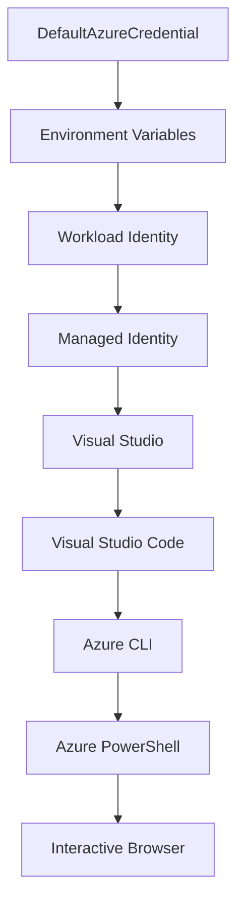

<!--
CO_OP_TRANSLATOR_METADATA:
{
  "original_hash": "4dc26ed8004b58a51875efd07203340f",
  "translation_date": "2025-10-11T16:06:49+00:00",
  "source_file": "docs/getting-started/azd-basics.md",
  "language_code": "ta"
}
-->
# AZD அடிப்படைகள் - Azure Developer CLI-ஐப் புரிந்துகொள்வது

# AZD அடிப்படைகள் - முக்கிய கருத்துகள் மற்றும் அடிப்படைகள்

**அத்தியாய வழிசெலுத்தல்:**
- **📚 பாடநெறி முகப்பு**: [AZD ஆரம்பக்காரர்களுக்காக](../../README.md)
- **📖 தற்போதைய அத்தியாயம்**: அத்தியாயம் 1 - அடித்தளம் & விரைவான தொடக்கம்
- **⬅️ முந்தையது**: [பாடநெறி கண்ணோட்டம்](../../README.md#-chapter-1-foundation--quick-start)
- **➡️ அடுத்தது**: [நிறுவல் & அமைப்பு](installation.md)
- **🚀 அடுத்த அத்தியாயம்**: [அத்தியாயம் 2: AI-முதன்மை மேம்பாடு](../ai-foundry/azure-ai-foundry-integration.md)

## அறிமுகம்

இந்த பாடம் Azure Developer CLI (azd) பற்றிய அறிமுகத்தை வழங்குகிறது, இது உள்ளூர் மேம்பாட்டிலிருந்து Azure-க்கு இடமாற்றத்தை வேகமாக்கும் சக்திவாய்ந்த கட்டளைகள் அடிப்படையிலான கருவியாகும். azd மேக-நேசமான பயன்பாடுகளை இடமாற்றம் செய்ய எளிமையாக்குவது எப்படி என்பதை நீங்கள் அடிப்படை கருத்துகள் மற்றும் முக்கிய அம்சங்களைப் புரிந்துகொள்வீர்கள்.

## கற்றல் இலக்குகள்

இந்த பாடத்தின் முடிவில், நீங்கள்:
- Azure Developer CLI என்ன மற்றும் அதன் முதன்மை நோக்கம் என்ன என்பதைப் புரிந்துகொள்வீர்கள்
- டெம்ப்ளேட்கள், சூழல்கள் மற்றும் சேவைகளின் அடிப்படை கருத்துகளைப் படிப்பீர்கள்
- டெம்ப்ளேட்-அடிப்படையிலான மேம்பாடு மற்றும் Infrastructure as Code உட்பட முக்கிய அம்சங்களை ஆராய்வீர்கள்
- azd திட்ட அமைப்பு மற்றும் பணிச்சூழலைப் புரிந்துகொள்வீர்கள்
- உங்கள் மேம்பாட்டு சூழலுக்கு azd-ஐ நிறுவ மற்றும் அமைக்க தயாராக இருப்பீர்கள்

## கற்றல் முடிவுகள்

இந்த பாடத்தை முடித்த பிறகு, நீங்கள்:
- azd-இன் பங்கு மற்றும் அதன் மேக மேம்பாட்டு பணிச்சூழல்களில் உள்ள இடத்தை விளக்க முடியும்
- azd திட்ட அமைப்பின் கூறுகளை அடையாளம் காண முடியும்
- டெம்ப்ளேட்கள், சூழல்கள் மற்றும் சேவைகள் ஒன்றுடன் ஒன்று எப்படி வேலை செய்கின்றன என்பதை விவரிக்க முடியும்
- azd உடன் Infrastructure as Code-இன் நன்மைகளைப் புரிந்துகொள்ள முடியும்
- azd கட்டளைகள் மற்றும் அவற்றின் நோக்கங்களை அடையாளம் காண முடியும்

## Azure Developer CLI (azd) என்றால் என்ன?

Azure Developer CLI (azd) என்பது உள்ளூர் மேம்பாட்டிலிருந்து Azure-க்கு இடமாற்றத்தை வேகமாக்க வடிவமைக்கப்பட்ட கட்டளைகள் அடிப்படையிலான கருவியாகும். இது Azure-ல் மேக-நேசமான பயன்பாடுகளை உருவாக்க, இடமாற்றம் செய்ய மற்றும் நிர்வகிக்க செயல்முறை எளிமையாக்குகிறது.

## முக்கிய கருத்துகள்

### டெம்ப்ளேட்கள்
டெம்ப்ளேட்கள் azd-இன் அடிப்படையாகும். அவை கொண்டுள்ளன:
- **பயன்பாட்டு குறியீடு** - உங்கள் மூலக் குறியீடு மற்றும் சார்புகள்
- **அமைப்பு வரையறைகள்** - Bicep அல்லது Terraform மூலம் வரையறுக்கப்பட்ட Azure வளங்கள்
- **கட்டமைப்பு கோப்புகள்** - அமைப்புகள் மற்றும் சூழல் மாறிகள்
- **இடமாற்ற ஸ்கிரிப்ட்கள்** - தானியங்கி இடமாற்ற பணிச்சூழல்கள்

### சூழல்கள்
சூழல்கள் வெவ்வேறு இடமாற்ற இலக்குகளை பிரதிநிதித்துவப்படுத்துகின்றன:
- **மேம்பாடு** - சோதனை மற்றும் மேம்பாட்டுக்காக
- **முன்-தயாரிப்பு** - தயாரிப்புக்கு முன் சூழல்
- **தயாரிப்பு** - நேரடி தயாரிப்பு சூழல்

ஒவ்வொரு சூழலும் தனித்துவமாக வைத்திருக்கும்:
- Azure வளக் குழு
- கட்டமைப்பு அமைப்புகள்
- இடமாற்ற நிலை

### சேவைகள்
சேவைகள் உங்கள் பயன்பாட்டின் கட்டமைப்புகள்:
- **முன்பக்கம்** - வலை பயன்பாடுகள், SPAs
- **பின்பக்கம்** - APIs, மைக்ரோசேவைகள்
- **தரவுத்தளம்** - தரவுக் காப்பக தீர்வுகள்
- **சேமிப்பு** - கோப்பு மற்றும் blob சேமிப்பு

## முக்கிய அம்சங்கள்

### 1. டெம்ப்ளேட்-அடிப்படையிலான மேம்பாடு
```bash
# Browse available templates
azd template list

# Initialize from a template
azd init --template <template-name>
```

### 2. Infrastructure as Code
- **Bicep** - Azure-இன் துறைசார் மொழி
- **Terraform** - பல-மேக அமைப்பு கருவி
- **ARM Templates** - Azure Resource Manager டெம்ப்ளேட்கள்

### 3. ஒருங்கிணைந்த பணிச்சூழல்கள்
```bash
# Complete deployment workflow
azd up            # Provision + Deploy this is hands off for first time setup
azd provision     # Create Azure resources if you update the infrastructure use this
azd deploy        # Deploy application code or redeploy application code once update
azd down          # Clean up resources
```

### 4. சூழல் மேலாண்மை
```bash
# Create and manage environments
azd env new <environment-name>
azd env select <environment-name>
azd env list
```

## 📁 திட்ட அமைப்பு

ஒரு வழக்கமான azd திட்ட அமைப்பு:
```
my-app/
├── .azd/                    # azd configuration
│   └── config.json
├── .azure/                  # Azure deployment artifacts
├── .devcontainer/          # Development container config
├── .github/workflows/      # GitHub Actions
├── .vscode/               # VS Code settings
├── infra/                 # Infrastructure code
│   ├── main.bicep        # Main infrastructure template
│   ├── main.parameters.json
│   └── modules/          # Reusable modules
├── src/                  # Application source code
│   ├── api/             # Backend services
│   └── web/             # Frontend application
├── azure.yaml           # azd project configuration
└── README.md
```

## 🔧 கட்டமைப்பு கோப்புகள்

### azure.yaml
முக்கிய திட்ட கட்டமைப்பு கோப்பு:
```yaml
name: my-awesome-app
metadata:
  template: my-template@1.0.0

services:
  web:
    project: ./src/web
    language: js
    host: appservice
  api:
    project: ./src/api
    language: js
    host: appservice

hooks:
  preprovision:
    shell: pwsh
    run: echo "Preparing to provision..."
```

### .azure/config.json
சூழல்-சிறப்பு கட்டமைப்பு:
```json
{
  "version": 1,
  "defaultEnvironment": "dev",
  "environments": {
    "dev": {
      "subscriptionId": "your-subscription-id",
      "location": "eastus"
    }
  }
}
```

## 🎪 பொதுவான பணிச்சூழல்கள்

### புதிய திட்டத்தைத் தொடங்குதல்
```bash
# Method 1: Use existing template
azd init --template todo-nodejs-mongo

# Method 2: Start from scratch
azd init

# Method 3: Use current directory
azd init .
```

### மேம்பாட்டு சுழற்சி
```bash
# Set up development environment
azd auth login
azd env new dev
azd env select dev

# Deploy everything
azd up

# Make changes and redeploy
azd deploy

# Clean up when done
azd down --force --purge # command in the Azure Developer CLI is a **hard reset** for your environment—especially useful when you're troubleshooting failed deployments, cleaning up orphaned resources, or prepping for a fresh redeploy.
```

## `azd down --force --purge`-ஐப் புரிந்துகொள்வது
`azd down --force --purge` கட்டளை உங்கள் azd சூழல் மற்றும் அதனுடன் தொடர்புடைய அனைத்து வளங்களையும் முழுமையாக அழிக்க ஒரு சக்திவாய்ந்த வழியாகும். ஒவ்வொரு கொடுப்பனவின் செயல்பாடுகளின் விவரங்கள் இங்கே:
```
--force
```
- உறுதிப்படுத்தல் கேள்விகளை தவிர்க்கிறது.
- கையேடு உள்ளீடு சாத்தியமற்றது எனும் சூழல்களில் தானியக்கத்திற்கோ அல்லது ஸ்கிரிப்ட்டிங்கிற்கோ பயனுள்ளதாக உள்ளது.
- CLI முரண்பாடுகளை கண்டறிந்தாலும் இடமாற்றம் தடையின்றி தொடரும்.

```
--purge
```
**அனைத்து தொடர்புடைய மெட்டாடேட்டாக்களையும்** அழிக்கிறது, உட்பட:
சூழல் நிலை
உள்ளூர் `.azure` கோப்புறை
கேஷ் செய்யப்பட்ட இடமாற்ற தகவல்
முந்தைய இடமாற்றங்களை azd "நினைவில் வைத்திருப்பதை" தடுக்கிறது, இது முரண்பட்ட வளக் குழுக்கள் அல்லது பழைய பதிவேடு குறிப்புகள் போன்ற பிரச்சினைகளை ஏற்படுத்தலாம்.

### ஏன் இரண்டையும் பயன்படுத்த வேண்டும்?
`azd up`-இல் நிலைமைகள் அல்லது பகுதி இடமாற்றங்களால் சிக்கல்களை சந்தித்தால், இந்த இணைப்பு **சுத்தமான துவக்கத்தை** உறுதிசெய்கிறது.

இது Azure போர்ட்டலில் கையேடு வள அழிப்புகளுக்குப் பிறகு அல்லது டெம்ப்ளேட்கள், சூழல்கள் அல்லது வளக் குழு பெயரிடும் ஒழுங்குகளை மாற்றும்போது மிகவும் உதவியாக உள்ளது.

### பல சூழல்களை நிர்வகித்தல்
```bash
# Create staging environment
azd env new staging
azd env select staging
azd up

# Switch back to dev
azd env select dev

# Compare environments
azd env list
```

## 🔐 அங்கீகாரம் மற்றும் சான்றுகள்

அங்கீகாரத்தைப் புரிந்துகொள்வது azd இடமாற்றங்களில் வெற்றிக்கு முக்கியமானது. Azure பல அங்கீகார முறைகளைப் பயன்படுத்துகிறது, மேலும் azd மற்ற Azure கருவிகள் பயன்படுத்தும் அதே சான்று சங்கிலியை பயன்படுத்துகிறது.

### Azure CLI அங்கீகாரம் (`az login`)

azd-ஐ பயன்படுத்துவதற்கு முன், நீங்கள் Azure-இல் அங்கீகரிக்க வேண்டும். பொதுவான முறை Azure CLI-ஐப் பயன்படுத்துவது:

```bash
# Interactive login (opens browser)
az login

# Login with specific tenant
az login --tenant <tenant-id>

# Login with service principal
az login --service-principal -u <app-id> -p <password> --tenant <tenant-id>

# Check current login status
az account show

# List available subscriptions
az account list --output table

# Set default subscription
az account set --subscription <subscription-id>
```

### அங்கீகார செயல்முறை
1. **இணையதள உள்நுழைவு**: அங்கீகாரத்திற்காக உங்கள் இயல்புநிலை உலாவியைத் திறக்கிறது
2. **சாதன குறியீடு செயல்முறை**: உலாவி அணுகல் இல்லாத சூழல்களுக்கு
3. **சேவை பிரதிநிதி**: தானியக்கம் மற்றும் CI/CD சூழல்களுக்கு
4. **நிர்வகிக்கப்பட்ட அடையாளம்**: Azure-இல் ஹோஸ்ட் செய்யப்பட்ட பயன்பாடுகளுக்கு

### DefaultAzureCredential சங்கிலி

`DefaultAzureCredential` என்பது பல சான்று மூலங்களை ஒரு குறிப்பிட்ட வரிசையில் தானாக முயற்சிக்கும் மூலம் எளிமையான அங்கீகார அனுபவத்தை வழங்கும் சான்று வகையாகும்:

#### சான்று சங்கிலி வரிசை


#### 1. சூழல் மாறிகள்
```bash
# Set environment variables for service principal
export AZURE_CLIENT_ID="<app-id>"
export AZURE_CLIENT_SECRET="<password>"
export AZURE_TENANT_ID="<tenant-id>"
```

#### 2. பணிச்சுமை அடையாளம் (Kubernetes/GitHub Actions)
தானாக பயன்படுத்தப்படுகிறது:
- Azure Kubernetes Service (AKS) உடன் பணிச்சுமை அடையாளம்
- GitHub Actions உடன் OIDC கூட்டிணைப்பு
- பிற கூட்டிணைந்த அடையாள சூழல்கள்

#### 3. நிர்வகிக்கப்பட்ட அடையாளம்
Azure வளங்களுக்கு:
- வर्चுவல் மெஷின்கள்
- பயன்பாட்டு சேவை
- Azure Functions
- கன்டெய்னர் நிகழ்வுகள்

```bash
# Check if running on Azure resource with managed identity
az account show --query "user.type" --output tsv
# Returns: "servicePrincipal" if using managed identity
```

#### 4. மேம்பாட்டு கருவிகள் ஒருங்கிணைப்பு
- **Visual Studio**: உள்நுழைந்த கணக்கைப் பயன்படுத்துகிறது
- **VS Code**: Azure Account நீட்டிப்பு சான்றுகளைப் பயன்படுத்துகிறது
- **Azure CLI**: `az login` சான்றுகளைப் பயன்படுத்துகிறது (உள்ளூர் மேம்பாட்டுக்கு மிகவும் பொதுவானது)

### AZD அங்கீகார அமைப்பு

```bash
# Method 1: Use Azure CLI (Recommended for development)
az login
azd auth login  # Uses existing Azure CLI credentials

# Method 2: Direct azd authentication
azd auth login --use-device-code  # For headless environments

# Method 3: Check authentication status
azd auth login --check-status

# Method 4: Logout and re-authenticate
azd auth logout
azd auth login
```

### அங்கீகார சிறந்த நடைமுறைகள்

#### உள்ளூர் மேம்பாட்டுக்காக
```bash
# 1. Login with Azure CLI
az login

# 2. Verify correct subscription
az account show
az account set --subscription "Your Subscription Name"

# 3. Use azd with existing credentials
azd auth login
```

#### CI/CD குழாய்களுக்கு
```yaml
# GitHub Actions example
- name: Azure Login
  uses: azure/login@v1
  with:
    creds: ${{ secrets.AZURE_CREDENTIALS }}

- name: Deploy with azd
  run: |
    azd auth login --client-id ${{ secrets.AZURE_CLIENT_ID }} \
                    --client-secret ${{ secrets.AZURE_CLIENT_SECRET }} \
                    --tenant-id ${{ secrets.AZURE_TENANT_ID }}
    azd up --no-prompt
```

#### தயாரிப்பு சூழல்களுக்கு
- Azure வளங்களில் இயங்கும்போது **நிர்வகிக்கப்பட்ட அடையாளம்** பயன்படுத்தவும்
- தானியக்க சூழல்களுக்கு **சேவை பிரதிநிதி** பயன்படுத்தவும்
- குறியீடு அல்லது கட்டமைப்பு கோப்புகளில் சான்றுகளை சேமிக்க தவிர்க்கவும்
- நுண்ணறிவு கட்டமைப்புக்கு **Azure Key Vault** பயன்படுத்தவும்

### பொதுவான அங்கீகார பிரச்சினைகள் மற்றும் தீர்வுகள்

#### பிரச்சினை: "சந்தா கிடைக்கவில்லை"
```bash
# Solution: Set default subscription
az account list --output table
az account set --subscription "<subscription-id>"
azd env set AZURE_SUBSCRIPTION_ID "<subscription-id>"
```

#### பிரச்சினை: "போதுமான அனுமதிகள் இல்லை"
```bash
# Solution: Check and assign required roles
az role assignment list --assignee $(az account show --query user.name --output tsv)

# Common required roles:
# - Contributor (for resource management)
# - User Access Administrator (for role assignments)
```

#### பிரச்சினை: "டோக்கன் காலாவதியானது"
```bash
# Solution: Re-authenticate
az logout
az login
azd auth logout
azd auth login
```

### வெவ்வேறு சூழல்களில் அங்கீகாரம்

#### உள்ளூர் மேம்பாடு
```bash
# Personal development account
az login
azd auth login
```

#### குழு மேம்பாடு
```bash
# Use specific tenant for organization
az login --tenant contoso.onmicrosoft.com
azd auth login
```

#### பல-வாடிக்கையாளர் சூழல்கள்
```bash
# Switch between tenants
az login --tenant tenant1.onmicrosoft.com
# Deploy to tenant 1
azd up

az login --tenant tenant2.onmicrosoft.com  
# Deploy to tenant 2
azd up
```

### பாதுகாப்பு கருத்துக்கள்

1. **சான்று சேமிப்பு**: சான்றுகளை மூலக் குறியீட்டில் ஒருபோதும் சேமிக்க வேண்டாம்
2. **வாய்ப்பு வரம்பு**: சேவை பிரதிநிதிகளுக்கு குறைந்த-அனுமதி கொள்கையைப் பயன்படுத்தவும்
3. **டோக்கன் சுழற்சி**: சேவை பிரதிநிதி ரகசியங்களை முறையாக சுழற்சி செய்யவும்
4. **ஆடிட் தடம்**: அங்கீகாரம் மற்றும் இடமாற்ற செயல்பாடுகளை கண்காணிக்கவும்
5. **நெட்வொர்க் பாதுகாப்பு**: சாத்தியமான போது தனியார் முடிவுகளைப் பயன்படுத்தவும்

### அங்கீகாரத்தைத் தீர்வுகள்

```bash
# Debug authentication issues
azd auth login --check-status
az account show
az account get-access-token

# Common diagnostic commands
whoami                          # Current user context
az ad signed-in-user show      # Azure AD user details
az group list                  # Test resource access
```

## `azd down --force --purge`-ஐப் புரிந்துகொள்வது

### கண்டறிதல்
```bash
azd template list              # Browse templates
azd template show <template>   # Template details
azd init --help               # Initialization options
```

### திட்ட மேலாண்மை
```bash
azd show                     # Project overview
azd env show                 # Current environment
azd config list             # Configuration settings
```

### கண்காணிப்பு
```bash
azd monitor                  # Open Azure portal
azd pipeline config          # Set up CI/CD
azd logs                     # View application logs
```

## சிறந்த நடைமுறைகள்

### 1. பொருத்தமான பெயர்களைப் பயன்படுத்தவும்
```bash
# Good
azd env new production-east
azd init --template web-app-secure

# Avoid
azd env new env1
azd init --template template1
```

### 2. டெம்ப்ளேட்களைப் பயன்படுத்தவும்
- உள்ளடங்கிய டெம்ப்ளேட்களுடன் தொடங்கவும்
- உங்கள் தேவைகளுக்கு ஏற்ப தனிப்பயனாக்கவும்
- உங்கள் நிறுவனத்திற்கான மீண்டும் பயன்படுத்தக்கூடிய டெம்ப்ளேட்களை உருவாக்கவும்

### 3. சூழல் தனிமைப்படுத்தல்
- மேம்பாடு/முன்-தயாரிப்பு/தயாரிப்பு ஆகியவற்றுக்கு தனித்துவமான சூழல்களைப் பயன்படுத்தவும்
- உள்ளூர் கணினியில் இருந்து நேரடியாக தயாரிப்புக்கு இடமாற்றம் செய்ய வேண்டாம்
- தயாரிப்பு இடமாற்றங்களுக்கு CI/CD குழாய்களைப் பயன்படுத்தவும்

### 4. கட்டமைப்பு மேலாண்மை
- நுண்ணறிவு தரவுகளுக்கு சூழல் மாறிகளைப் பயன்படுத்தவும்
- கட்டமைப்பை பதிப்பு கட்டுப்பாட்டில் வைத்திருங்கள்
- சூழல்-சிறப்பு அமைப்புகளை ஆவணப்படுத்தவும்

## கற்றல் முன்னேற்றம்

### ஆரம்பநிலை (வாரம் 1-2)
1. azd-ஐ நிறுவி அங்கீகரிக்கவும்
2. எளிய டெம்ப்ளேட்டை இடமாற்றம் செய்யவும்
3. திட்ட அமைப்பைப் புரிந்துகொள்ளவும்
4. அடிப்படை கட்டளைகளை (up, down, deploy) கற்றுக்கொள்ளவும்

### இடைநிலை (வாரம் 3-4)
1. டெம்ப்ளேட்களை தனிப்பயனாக்கவும்
2. பல சூழல்களை நிர்வகிக்கவும்
3. அமைப்பு குறியீட்டைப் புரிந்துகொள்ளவும்
4. CI/CD குழாய்களை அமைக்கவும்

### மேம்பட்டது (வாரம் 5+)
1. தனிப்பயன் டெம்ப்ளேட்களை உருவாக்கவும்
2. மேம்பட்ட அமைப்பு முறைமைகள்
3. பல-பிராந்திய இடமாற்றங்கள்
4. நிறுவன தரமான அமைப்புகள்

## அடுத்த படிகள்

**📖 அத்தியாயம் 1 கற்றலைத் தொடரவும்:**
- [நிறுவல் & அமைப்பு](installation.md) - azd-ஐ நிறுவி அமைக்கவும்
- [உங்கள் முதல் திட்டம்](first-project.md) - கையால் செய்யும் பயிற்சி
- [கட்டமைப்பு வழிகாட்டி](configuration.md) - மேம்பட்ட கட்டமைப்பு விருப்பங்கள்

**🎯 அடுத்த அத்தியாயத்திற்கு தயாரா?**
- [அத்தியாயம் 2: AI-முதன்மை மேம்பாடு](../ai-foundry/azure-ai-foundry-integration.md) - AI பயன்பாடுகளை உருவாக்கத் தொடங்குங்கள்

## கூடுதல் வளங்கள்

- [Azure Developer CLI கண்ணோட்டம்](https://learn.microsoft.com/en-us/azure/developer/azure-developer-cli/)
- [டெம்ப்ளேட் கேலரி](https://azure.github.io/awesome-azd/)
- [சமூக மாதிரிகள்](https://github.com/Azure-Samples)

---

**அத்தியாய வழிசெலுத்தல்:**
- **📚 பாடநெறி முகப்பு**: [AZD ஆரம்பக்காரர்களுக்காக](../../README.md)
- **📖 தற்போதைய அத்தியாயம்**: அத்தியாயம் 1 - அடித்தளம் & விரைவான தொடக்கம்  
- **⬅️ முந்தையது**: [பாடநெறி கண்ணோட்டம்](../../README.md#-chapter-1-foundation--quick-start)
- **➡️ அடுத்தது**: [நிறுவல் & அமைப்பு](installation.md)
- **🚀 அடுத்த அத்தியாயம்**: [அத்தியாயம் 2: AI-முதன்மை மேம்பாடு](../ai-foundry/azure-ai-foundry-integration.md)

---

**குறிப்பு**:  
இந்த ஆவணம் [Co-op Translator](https://github.com/Azure/co-op-translator) என்ற AI மொழிபெயர்ப்பு சேவையைப் பயன்படுத்தி மொழிபெயர்க்கப்பட்டுள்ளது. நாங்கள் துல்லியத்திற்காக முயற்சிக்கின்றோம், ஆனால் தானியங்கி மொழிபெயர்ப்புகளில் பிழைகள் அல்லது தவறான தகவல்கள் இருக்கக்கூடும் என்பதை கவனத்தில் கொள்ளவும். அதன் தாய்மொழியில் உள்ள மூல ஆவணம் அதிகாரப்பூர்வ ஆதாரமாக கருதப்பட வேண்டும். முக்கியமான தகவல்களுக்கு, தொழில்முறை மனித மொழிபெயர்ப்பு பரிந்துரைக்கப்படுகிறது. இந்த மொழிபெயர்ப்பைப் பயன்படுத்துவதால் ஏற்படும் எந்த தவறான புரிதல்கள் அல்லது தவறான விளக்கங்களுக்கு நாங்கள் பொறுப்பல்ல.