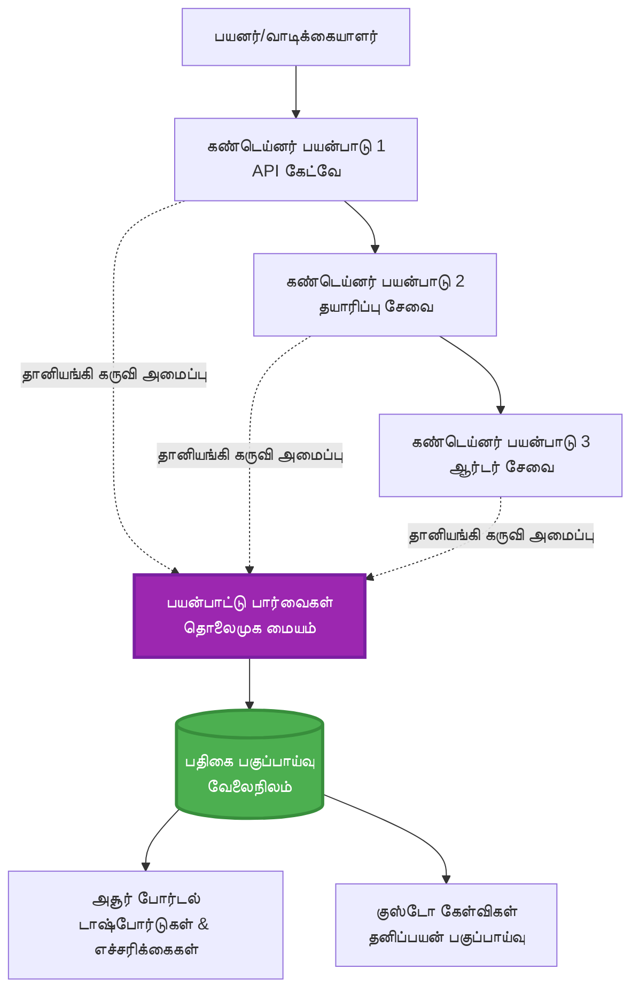
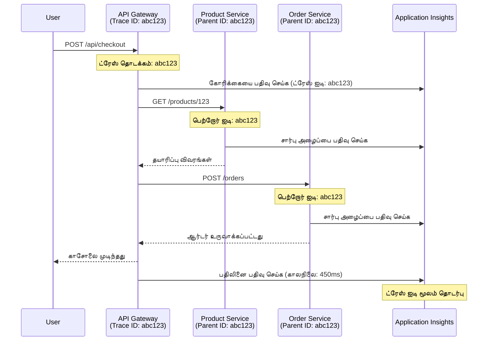

<!--
CO_OP_TRANSLATOR_METADATA:
{
  "original_hash": "e5aa37cdb6378c09099500ac31600b8c",
  "translation_date": "2025-11-24T15:14:34+00:00",
  "source_file": "docs/pre-deployment/application-insights.md",
  "language_code": "ta"
}
-->
# AZD உடன் Application Insights ஒருங்கிணைப்பு

⏱️ **மதிப்பிடப்பட்ட நேரம்**: 40-50 நிமிடங்கள் | 💰 **செலவின் தாக்கம்**: ~$5-15/மாதம் | ⭐ **சிக்கலானது**: நடுத்தர

**📚 கற்றல் பாதை:**
- ← முந்தையது: [Preflight Checks](preflight-checks.md) - முன்னோட்ட சரிபார்ப்பு
- 🎯 **நீங்கள் இங்கே**: Application Insights ஒருங்கிணைப்பு (மோனிட்டரிங், டெலிமெட்ரி, பிழைதிருத்தம்)
- → அடுத்தது: [Deployment Guide](../deployment/deployment-guide.md) - Azure-க்கு பிரயோகிக்கவும்
- 🏠 [பாடநெறி முகப்பு](../../README.md)

---

## நீங்கள் என்ன கற்றுக்கொள்வீர்கள்

இந்த பாடத்தை முடிப்பதன் மூலம், நீங்கள்:
- **Application Insights** ஐ AZD திட்டங்களில் தானாக ஒருங்கிணைக்க கற்றுக்கொள்வீர்கள்
- மைக்ரோசர்வீசுகளுக்கான **distributed tracing** ஐ அமைக்கவும்
- **தனிப்பயன் டெலிமெட்ரி** (மெட்ரிக்ஸ், நிகழ்வுகள், சார்புகள்) செயல்படுத்தவும்
- நேரடி கண்காணிப்புக்கான **live metrics** அமைக்கவும்
- AZD பிரயோகங்களில் இருந்து **அலர்ட்கள் மற்றும் டாஷ்போர்டுகளை** உருவாக்கவும்
- **டெலிமெட்ரி கேள்விகள்** மூலம் உற்பத்தி பிரச்சினைகளை சரிசெய்யவும்
- **செலவுகள் மற்றும் சாம்பிளிங்** உத்திகளை மேம்படுத்தவும்
- **AI/LLM பயன்பாடுகளை** (டோக்கன்கள், தாமதம், செலவுகள்) கண்காணிக்கவும்

## AZD உடன் Application Insights ஏன் முக்கியம்

### சவால்: உற்பத்தி கண்காணிப்பு

**Application Insights இல்லாமல்:**
```
❌ No visibility into production behavior
❌ Manual log aggregation across services
❌ Reactive debugging (wait for customer complaints)
❌ No performance metrics
❌ Cannot trace requests across services
❌ Unknown failure rates and bottlenecks
```

**Application Insights + AZD உடன்:**
```
✅ Automatic telemetry collection
✅ Centralized logs from all services
✅ Proactive issue detection
✅ End-to-end request tracing
✅ Performance metrics and insights
✅ Real-time dashboards
✅ AZD provisions everything automatically
```

**உதாரணம்**: Application Insights உங்கள் பயன்பாட்டிற்கான "பிளாக் பாக்ஸ்" விமான பதிவேடு + காக்பிட் டாஷ்போர்டைப் போன்றது. நீங்கள் நேரடியாக நடப்பதைப் பார்க்கலாம் மற்றும் எந்த சம்பவத்தையும் மீண்டும் விளையாடலாம்.

---

## கட்டமைப்பு கண்ணோட்டம்

### AZD கட்டமைப்பில் Application Insights


### தானாக கண்காணிக்கப்படும் விஷயங்கள்

| டெலிமெட்ரி வகை | இது என்ன பிடிக்கிறது | பயன்பாட்டு வழக்கு |
|----------------|------------------|----------|
| **Requests** | HTTP கோரிக்கைகள், நிலை குறியீடுகள், கால அளவு | API செயல்திறன் கண்காணிப்பு |
| **Dependencies** | வெளிப்புற அழைப்புகள் (DB, APIs, சேமிப்பு) | bottlenecks கண்டறிதல் |
| **Exceptions** | கையாளப்படாத பிழைகள் மற்றும் ஸ்டாக் டிரேஸ்கள் | தோல்விகளை சரிசெய்தல் |
| **Custom Events** | வணிக நிகழ்வுகள் (சைன்அப், வாங்குதல்) | பகுப்பாய்வு மற்றும் சுரங்கங்கள் |
| **Metrics** | செயல்திறன் கவுண்டர்கள், தனிப்பயன் மெட்ரிக்ஸ் | திறன் திட்டமிடல் |
| **Traces** | தீவிரத்துடன் உள்ள புகார்களுக்கான செய்திகள் | பிழைதிருத்தம் மற்றும் தணிக்கை |
| **Availability** | செயல்பாடு மற்றும் பதிலளிக்கும் நேர சோதனைகள் | SLA கண்காணிப்பு |

---

## முன் தேவைகள்

### தேவையான கருவிகள்

```bash
# Azure Developer CLI ஐ சரிபார்க்கவும்
azd version
# ✅ எதிர்பார்க்கப்பட்டது: azd பதிப்பு 1.0.0 அல்லது அதற்கு மேல்

# Azure CLI ஐ சரிபார்க்கவும்
az --version
# ✅ எதிர்பார்க்கப்பட்டது: azure-cli 2.50.0 அல்லது அதற்கு மேல்
```

### Azure தேவைகள்

- செயலில் உள்ள Azure சந்தா
- உருவாக்க அனுமதிகள்:
  - Application Insights வளங்கள்
  - Log Analytics பணிமனைகள்
  - Container Apps
  - Resource groups

### அறிவு தேவைகள்

நீங்கள் முடித்திருக்க வேண்டும்:
- [AZD அடிப்படைகள்](../getting-started/azd-basics.md) - AZD அடிப்படை கருத்துக்கள்
- [கட்டமைப்பு](../getting-started/configuration.md) - சூழல் அமைப்பு
- [முதல் திட்டம்](../getting-started/first-project.md) - அடிப்படை பிரயோகம்

---

## பாடம் 1: AZD உடன் தானியங்கி Application Insights

### AZD Application Insights ஐ எப்படி வழங்குகிறது

AZD நீங்கள் பிரயோகிக்கும்போது Application Insights ஐ தானாக உருவாக்கி அமைக்கிறது. இது எப்படி செயல்படுகிறது என்பதை பார்ப்போம்.

### திட்ட அமைப்பு

```
monitored-app/
├── azure.yaml                     # AZD configuration
├── infra/
│   ├── main.bicep                # Main infrastructure
│   ├── core/
│   │   └── monitoring.bicep      # Application Insights + Log Analytics
│   └── app/
│       └── api.bicep             # Container App with monitoring
└── src/
    ├── app.py                    # Application with telemetry
    ├── requirements.txt
    └── Dockerfile
```

---

### படி 1: AZD ஐ அமைக்கவும் (azure.yaml)

**கோப்பு: `azure.yaml`**

```yaml
name: monitored-app
metadata:
  template: monitored-app@1.0.0

services:
  api:
    project: ./src
    language: python
    host: containerapp

# AZD automatically provisions monitoring!
```

**அதுவே!** AZD அடிப்படை கண்காணிப்புக்கு Application Insights ஐ தானாக உருவாக்கும். கூடுதல் அமைப்பு தேவையில்லை.

---

### படி 2: கண்காணிப்பு உள்கட்டமைப்பு (Bicep)

**கோப்பு: `infra/core/monitoring.bicep`**

```bicep
param logAnalyticsName string
param applicationInsightsName string
param location string = resourceGroup().location
param tags object = {}

// Log Analytics Workspace (required for Application Insights)
resource logAnalytics 'Microsoft.OperationalInsights/workspaces@2022-10-01' = {
  name: logAnalyticsName
  location: location
  tags: tags
  properties: {
    sku: {
      name: 'PerGB2018'  // Pay-as-you-go pricing
    }
    retentionInDays: 30  // Keep logs for 30 days
    features: {
      enableLogAccessUsingOnlyResourcePermissions: true
    }
  }
}

// Application Insights
resource applicationInsights 'Microsoft.Insights/components@2020-02-02' = {
  name: applicationInsightsName
  location: location
  tags: tags
  kind: 'web'
  properties: {
    Application_Type: 'web'
    WorkspaceResourceId: logAnalytics.id
    IngestionMode: 'LogAnalytics'
    publicNetworkAccessForIngestion: 'Enabled'
    publicNetworkAccessForQuery: 'Enabled'
  }
}

// Outputs for Container Apps
output logAnalyticsWorkspaceId string = logAnalytics.id
output logAnalyticsWorkspaceName string = logAnalytics.name
output applicationInsightsConnectionString string = applicationInsights.properties.ConnectionString
output applicationInsightsInstrumentationKey string = applicationInsights.properties.InstrumentationKey
output applicationInsightsName string = applicationInsights.name
```

---

### படி 3: Application Insights உடன் Container App ஐ இணைக்கவும்

**கோப்பு: `infra/app/api.bicep`**

```bicep
param name string
param location string
param tags object = {}
param containerAppsEnvironmentName string
param applicationInsightsConnectionString string

resource containerApp 'Microsoft.App/containerApps@2023-05-01' = {
  name: name
  location: location
  tags: tags
  properties: {
    configuration: {
      ingress: {
        external: true
        targetPort: 8000
      }
      secrets: [
        {
          name: 'appinsights-connection-string'
          value: applicationInsightsConnectionString
        }
      ]
    }
    template: {
      containers: [
        {
          name: 'api'
          image: 'myregistry.azurecr.io/api:latest'
          resources: {
            cpu: json('0.5')
            memory: '1Gi'
          }
          env: [
            {
              name: 'APPLICATIONINSIGHTS_CONNECTION_STRING'
              secretRef: 'appinsights-connection-string'
            }
            {
              name: 'APPLICATIONINSIGHTS_ENABLED'
              value: 'true'
            }
          ]
        }
      ]
    }
  }
}

output uri string = 'https://${containerApp.properties.configuration.ingress.fqdn}'
```

---

### படி 4: டெலிமெட்ரியுடன் பயன்பாட்டு குறியீடு

**கோப்பு: `src/app.py`**

```python
from flask import Flask, request, jsonify
from opencensus.ext.azure.log_exporter import AzureLogHandler
from opencensus.ext.azure.trace_exporter import AzureExporter
from opencensus.ext.flask.flask_middleware import FlaskMiddleware
from opencensus.trace.samplers import ProbabilitySampler
import logging
import os

app = Flask(__name__)

# பயன்பாட்டு உள்ளுணர்வு இணைப்பு சரத்தை பெறவும்
connection_string = os.environ.get('APPLICATIONINSIGHTS_CONNECTION_STRING')

if connection_string:
    # பகிர்ந்தளிக்கப்பட்ட கண்காணிப்பை அமைக்கவும்
    middleware = FlaskMiddleware(
        app,
        exporter=AzureExporter(connection_string=connection_string),
        sampler=ProbabilitySampler(rate=1.0)  # 100% மாதிரியாக்கல் மேம்பாட்டு சூழலுக்கு
    )
    
    # பதிவு செய்யும் செயல்பாட்டை அமைக்கவும்
    logger = logging.getLogger(__name__)
    logger.addHandler(AzureLogHandler(connection_string=connection_string))
    logger.setLevel(logging.INFO)
    
    print("✅ Application Insights enabled")
else:
    logger = logging.getLogger(__name__)
    logger.setLevel(logging.INFO)
    print("⚠️ Application Insights not configured")

@app.route('/health')
def health():
    logger.info('Health check endpoint called')
    return jsonify({'status': 'healthy', 'monitoring': 'enabled'})

@app.route('/api/products')
def get_products():
    logger.info('Fetching products')
    
    # தரவுத்தொகுப்பு அழைப்பை ஒத்திகை செய்யவும் (தானாகவே சார்பாக கண்காணிக்கப்படும்)
    products = [
        {'id': 1, 'name': 'Laptop', 'price': 999.99},
        {'id': 2, 'name': 'Mouse', 'price': 29.99},
        {'id': 3, 'name': 'Keyboard', 'price': 79.99}
    ]
    
    logger.info(f'Returned {len(products)} products')
    return jsonify(products)

@app.route('/api/error-test')
def error_test():
    """Test error tracking"""
    logger.error('Testing error tracking')
    try:
        raise ValueError('This is a test exception')
    except Exception as e:
        logger.exception('Exception occurred in error-test endpoint')
        return jsonify({'error': str(e)}), 500

@app.route('/api/slow')
def slow_endpoint():
    """Test performance tracking"""
    import time
    logger.info('Slow endpoint called')
    time.sleep(3)  # மெதுவான செயல்பாட்டை ஒத்திகை செய்யவும்
    logger.warning('Endpoint took 3 seconds to respond')
    return jsonify({'message': 'Slow operation completed'})

if __name__ == '__main__':
    app.run(host='0.0.0.0', port=8000)
```

**கோப்பு: `src/requirements.txt`**

```txt
Flask==3.0.0
opencensus-ext-azure==1.1.13
opencensus-ext-flask==0.8.1
gunicorn==21.2.0
```

---

### படி 5: பிரயோகித்து சரிபார்க்கவும்

```bash
# AZD ஐ தொடங்கவும்
azd init

# நிறுவவும் (தானாகவே Application Insights ஐ வழங்குகிறது)
azd up

# பயன்பாட்டு URL ஐ பெறவும்
APP_URL=$(azd env get-values | grep API_URL | cut -d '=' -f2 | tr -d '"')

# தொலைநோக்கத்தை உருவாக்கவும்
curl $APP_URL/health
curl $APP_URL/api/products
curl $APP_URL/api/error-test
curl $APP_URL/api/slow
```

**✅ எதிர்பார்க்கப்படும் வெளியீடு:**
```json
{
  "status": "healthy",
  "monitoring": "enabled"
}
```

---

### படி 6: Azure Portal இல் டெலிமெட்ரியைப் பார்வையிடவும்

```bash
# பயன்பாட்டு உள்ளுணர்வு விவரங்களை பெறுங்கள்
azd env get-values | grep APPLICATIONINSIGHTS

# Azure போர்டலில் திறக்கவும்
az monitor app-insights component show \
  --app $(azd env get-values | grep APPLICATIONINSIGHTS_NAME | cut -d '=' -f2 | tr -d '"') \
  --resource-group $(azd env get-values | grep AZURE_RESOURCE_GROUP | cut -d '=' -f2 | tr -d '"') \
  --query "appId" -o tsv
```

**Azure Portal → Application Insights → Transaction Search** க்கு செல்லவும்

நீங்கள் காணலாம்:
- ✅ HTTP கோரிக்கைகள் மற்றும் நிலை குறியீடுகள்
- ✅ கோரிக்கை கால அளவு (`/api/slow` க்கு 3+ விநாடிகள்)
- ✅ `/api/error-test` இல் இருந்து பிழை விவரங்கள்
- ✅ தனிப்பயன் புகார் செய்திகள்

---

## பாடம் 2: தனிப்பயன் டெலிமெட்ரி மற்றும் நிகழ்வுகள்

### வணிக நிகழ்வுகளைப் பதிவுசெய்க

வணிக முக்கிய நிகழ்வுகளுக்கான தனிப்பயன் டெலிமெட்ரியைச் சேர்ப்போம்.

**கோப்பு: `src/telemetry.py`**

```python
from opencensus.ext.azure import metrics_exporter
from opencensus.stats import aggregation as aggregation_module
from opencensus.stats import measure as measure_module
from opencensus.stats import stats as stats_module
from opencensus.stats import view as view_module
from opencensus.tags import tag_map as tag_map_module
from opencensus.ext.azure.log_exporter import AzureLogHandler
from opencensus.ext.azure.trace_exporter import AzureExporter
from opencensus.trace import tracer as tracer_module
import logging
import os

class TelemetryClient:
    """Custom telemetry client for Application Insights"""
    
    def __init__(self, connection_string=None):
        self.connection_string = connection_string or os.environ.get('APPLICATIONINSIGHTS_CONNECTION_STRING')
        
        if not self.connection_string:
            print("⚠️ Application Insights connection string not found")
            return
        
        # லாகர் அமைக்கவும்
        self.logger = logging.getLogger(__name__)
        self.logger.addHandler(AzureLogHandler(connection_string=self.connection_string))
        self.logger.setLevel(logging.INFO)
        
        # அளவீட்டு ஏற்றுமதி அமைக்கவும்
        self.stats = stats_module.stats
        self.view_manager = self.stats.view_manager
        self.stats_recorder = self.stats.stats_recorder
        
        exporter = metrics_exporter.new_metrics_exporter(
            connection_string=self.connection_string
        )
        self.view_manager.register_exporter(exporter)
        
        # டிரேசர் அமைக்கவும்
        self.tracer = tracer_module.Tracer(
            exporter=AzureExporter(connection_string=self.connection_string)
        )
        
        print("✅ Custom telemetry client initialized")
    
    def track_event(self, event_name: str, properties: dict = None):
        """Track custom business event"""
        properties = properties or {}
        self.logger.info(
            f"CustomEvent: {event_name}",
            extra={
                'custom_dimensions': {
                    'event_name': event_name,
                    **properties
                }
            }
        )
    
    def track_metric(self, metric_name: str, value: float, properties: dict = None):
        """Track custom metric"""
        properties = properties or {}
        self.logger.info(
            f"CustomMetric: {metric_name} = {value}",
            extra={
                'custom_dimensions': {
                    'metric_name': metric_name,
                    'value': value,
                    **properties
                }
            }
        )
    
    def track_dependency(self, name: str, dependency_type: str, duration: float, success: bool):
        """Track external dependency call"""
        with self.tracer.span(name=name) as span:
            span.add_attribute('dependency.type', dependency_type)
            span.add_attribute('duration', duration)
            span.add_attribute('success', success)

# உலகளாவிய தொலைநிலையியல் கிளையன்ட்
telemetry = TelemetryClient()
```

### தனிப்பயன் நிகழ்வுகளுடன் பயன்பாட்டை மேம்படுத்தவும்

**கோப்பு: `src/app.py` (மேம்படுத்தப்பட்டது)**

```python
from flask import Flask, request, jsonify
from telemetry import telemetry
import time
import random

app = Flask(__name__)

@app.route('/api/purchase', methods=['POST'])
def purchase():
    """Track purchase event with custom telemetry"""
    data = request.json
    product_id = data.get('product_id')
    quantity = data.get('quantity', 1)
    price = data.get('price', 0)
    
    # வணிக நிகழ்வை கண்காணிக்கவும்
    telemetry.track_event('Purchase', {
        'product_id': product_id,
        'quantity': quantity,
        'total_amount': price * quantity,
        'user_id': request.headers.get('X-User-Id', 'anonymous')
    })
    
    # வருவாய் அளவீட்டை கண்காணிக்கவும்
    telemetry.track_metric('Revenue', price * quantity, {
        'product_id': product_id,
        'currency': 'USD'
    })
    
    return jsonify({
        'order_id': f'ORD-{random.randint(1000, 9999)}',
        'status': 'confirmed',
        'total': price * quantity
    })

@app.route('/api/search')
def search():
    """Track search queries"""
    query = request.args.get('q', '')
    
    start_time = time.time()
    
    # தேடலை ஒத்திகை செய்யவும் (உண்மையான தரவுத்தொகுப்பு கேள்வி இருக்கும்)
    results = [{'id': 1, 'name': f'Result for {query}'}]
    
    duration = (time.time() - start_time) * 1000  # மில்லி விநாடிகளுக்கு மாற்றவும்
    
    # தேடல் நிகழ்வை கண்காணிக்கவும்
    telemetry.track_event('Search', {
        'query': query,
        'results_count': len(results),
        'duration_ms': duration
    })
    
    # தேடல் செயல்திறன் அளவீட்டை கண்காணிக்கவும்
    telemetry.track_metric('SearchDuration', duration, {
        'query_length': len(query)
    })
    
    return jsonify({'results': results, 'count': len(results)})

@app.route('/api/external-call')
def external_call():
    """Track external API dependency"""
    import requests
    
    start_time = time.time()
    success = True
    
    try:
        # வெளிப்புற API அழைப்பை ஒத்திகை செய்யவும்
        response = requests.get('https://api.example.com/data', timeout=5)
        result = response.json()
    except Exception as e:
        success = False
        result = {'error': str(e)}
    
    duration = (time.time() - start_time) * 1000
    
    # சார்பை கண்காணிக்கவும்
    telemetry.track_dependency(
        name='ExternalAPI',
        dependency_type='HTTP',
        duration=duration,
        success=success
    )
    
    return jsonify(result)

if __name__ == '__main__':
    app.run(host='0.0.0.0', port=8000)
```

### தனிப்பயன் டெலிமெட்ரியைச் சோதிக்கவும்

```bash
# வாங்கும் நிகழ்வை கண்காணிக்கவும்
curl -X POST $APP_URL/api/purchase \
  -H "Content-Type: application/json" \
  -H "X-User-Id: user123" \
  -d '{"product_id": 1, "quantity": 2, "price": 29.99}'

# தேடல் நிகழ்வை கண்காணிக்கவும்
curl "$APP_URL/api/search?q=laptop"

# வெளிப்புற சார்பை கண்காணிக்கவும்
curl $APP_URL/api/external-call
```

**Azure Portal இல் பார்வையிடவும்:**

Application Insights → Logs க்கு செல்லவும், பின்னர் இயக்கவும்:

```kusto
// View purchase events
traces
| where customDimensions.event_name == "Purchase"
| project 
    timestamp,
    product_id = tostring(customDimensions.product_id),
    total_amount = todouble(customDimensions.total_amount),
    user_id = tostring(customDimensions.user_id)
| order by timestamp desc

// View revenue metrics
traces
| where customDimensions.metric_name == "Revenue"
| summarize TotalRevenue = sum(todouble(customDimensions.value)) by bin(timestamp, 1h)
| render timechart

// View search performance
traces
| where customDimensions.event_name == "Search"
| summarize 
    AvgDuration = avg(todouble(customDimensions.duration_ms)),
    SearchCount = count()
  by bin(timestamp, 5m)
| render timechart
```

---

## பாடம் 3: மைக்ரோசர்வீசுகளுக்கான Distributed Tracing

### குறுக்கு-சேவை டிரேசிங்கை இயக்கு

மைக்ரோசர்வீசுகளுக்கு, Application Insights சேவைகளுக்கு இடையே கோரிக்கைகளை தானாக இணைக்கிறது.

**கோப்பு: `infra/main.bicep`**

```bicep
targetScope = 'subscription'

param environmentName string
param location string = 'eastus'

var tags = { 'azd-env-name': environmentName }

resource rg 'Microsoft.Resources/resourceGroups@2021-04-01' = {
  name: 'rg-${environmentName}'
  location: location
  tags: tags
}

// Monitoring (shared by all services)
module monitoring './core/monitoring.bicep' = {
  name: 'monitoring'
  scope: rg
  params: {
    logAnalyticsName: 'log-${environmentName}'
    applicationInsightsName: 'appi-${environmentName}'
    location: location
    tags: tags
  }
}

// API Gateway
module apiGateway './app/api-gateway.bicep' = {
  name: 'api-gateway'
  scope: rg
  params: {
    name: 'ca-gateway-${environmentName}'
    location: location
    tags: union(tags, { 'azd-service-name': 'gateway' })
    applicationInsightsConnectionString: monitoring.outputs.applicationInsightsConnectionString
  }
}

// Product Service
module productService './app/product-service.bicep' = {
  name: 'product-service'
  scope: rg
  params: {
    name: 'ca-products-${environmentName}'
    location: location
    tags: union(tags, { 'azd-service-name': 'products' })
    applicationInsightsConnectionString: monitoring.outputs.applicationInsightsConnectionString
  }
}

// Order Service
module orderService './app/order-service.bicep' = {
  name: 'order-service'
  scope: rg
  params: {
    name: 'ca-orders-${environmentName}'
    location: location
    tags: union(tags, { 'azd-service-name': 'orders' })
    applicationInsightsConnectionString: monitoring.outputs.applicationInsightsConnectionString
  }
}

output APPLICATIONINSIGHTS_CONNECTION_STRING string = monitoring.outputs.applicationInsightsConnectionString
output GATEWAY_URL string = apiGateway.outputs.uri
```

### முடிவு-to-முடிவு பரிவர்த்தனையைப் பார்வையிடவும்


**முடிவு-to-முடிவு டிரேஸை கேள்வி செய்யவும்:**

```kusto
// Find complete request flow
let traceId = "abc123...";  // Get from response header
dependencies
| union requests
| where operation_Id == traceId
| project 
    timestamp,
    type = itemType,
    name,
    duration,
    success,
    cloud_RoleName
| order by timestamp asc
```

---

## பாடம் 4: நேரடி மெட்ரிக்ஸ் மற்றும் நேரடி கண்காணிப்பு

### நேரடி மெட்ரிக்ஸ் ஸ்ட்ரீமை இயக்கு

நேரடி மெட்ரிக்ஸ் <1 விநாடி தாமதத்துடன் நேரடி டெலிமெட்ரியை வழங்குகிறது.

**நேரடி மெட்ரிக்ஸ் அணுகவும்:**

```bash
# பயன்பாட்டு உள்ளுணர்வு வளத்தை பெறவும்
APPI_NAME=$(azd env get-values | grep APPLICATIONINSIGHTS_NAME | cut -d '=' -f2 | tr -d '"')

# வளக் குழுவை பெறவும்
RG_NAME=$(azd env get-values | grep AZURE_RESOURCE_GROUP | cut -d '=' -f2 | tr -d '"')

echo "Navigate to: Azure Portal → Resource Groups → $RG_NAME → $APPI_NAME → Live Metrics"
```

**நேரடியாக நீங்கள் காண்பது:**
- ✅ வரும் கோரிக்கை வீதம் (requests/sec)
- ✅ வெளியே செல்லும் சார்பு அழைப்புகள்
- ✅ பிழை எண்ணிக்கை
- ✅ CPU மற்றும் நினைவக பயன்பாடு
- ✅ செயலில் உள்ள சர்வர் எண்ணிக்கை
- ✅ மாதிரி டெலிமெட்ரி

### சோதனைக்கு சுமையை உருவாக்கவும்

```bash
# நேரடி அளவீடுகளை காண சுமையை உருவாக்கவும்
for i in {1..100}; do
  curl $APP_URL/api/products &
  curl $APP_URL/api/search?q=test$i &
done

# Azure Portal இல் நேரடி அளவீடுகளை பாருங்கள்
# கோரிக்கை விகிதம் அதிகரிப்பதை நீங்கள் காண வேண்டும்
```

---

## நடைமுறை பயிற்சிகள்

### பயிற்சி 1: அலர்ட்களை அமைக்கவும் ⭐⭐ (நடுத்தர)

**நோக்கம்**: அதிக பிழை வீதங்கள் மற்றும் மந்தமான பதில்களுக்கு அலர்ட்களை உருவாக்கவும்.

**படிகள்:**

1. **பிழை வீதத்திற்கான அலர்டை உருவாக்கவும்:**

```bash
# பயன்பாட்டு உள்ளுணர்வு வள ID ஐப் பெறவும்
APPI_ID=$(az monitor app-insights component show \
  --app $APPI_NAME \
  --resource-group $RG_NAME \
  --query "id" -o tsv)

# தோல்வியடைந்த கோரிக்கைகளுக்கான அளவீட்டு எச்சரிக்கையை உருவாக்கவும்
az monitor metrics alert create \
  --name "High-Error-Rate" \
  --resource-group $RG_NAME \
  --scopes $APPI_ID \
  --condition "count requests/failed > 10" \
  --window-size 5m \
  --evaluation-frequency 1m \
  --description "Alert when error rate exceeds 10 per 5 minutes"
```

2. **மந்தமான பதில்களுக்கு அலர்டை உருவாக்கவும்:**

```bash
az monitor metrics alert create \
  --name "Slow-Responses" \
  --resource-group $RG_NAME \
  --scopes $APPI_ID \
  --condition "avg requests/duration > 3000" \
  --window-size 5m \
  --evaluation-frequency 1m \
  --description "Alert when average response time exceeds 3 seconds"
```

3. **Bicep மூலம் அலர்டை உருவாக்கவும் (AZD க்கு விருப்பமானது):**

**கோப்பு: `infra/core/alerts.bicep`**

```bicep
param applicationInsightsId string
param actionGroupId string = ''
param location string = resourceGroup().location

// High error rate alert
resource errorRateAlert 'Microsoft.Insights/metricAlerts@2018-03-01' = {
  name: 'high-error-rate'
  location: 'global'
  properties: {
    description: 'Alert when error rate exceeds threshold'
    severity: 2
    enabled: true
    scopes: [
      applicationInsightsId
    ]
    evaluationFrequency: 'PT1M'
    windowSize: 'PT5M'
    criteria: {
      'odata.type': 'Microsoft.Azure.Monitor.SingleResourceMultipleMetricCriteria'
      allOf: [
        {
          name: 'Error rate'
          metricName: 'requests/failed'
          operator: 'GreaterThan'
          threshold: 10
          timeAggregation: 'Count'
        }
      ]
    }
    actions: actionGroupId != '' ? [
      {
        actionGroupId: actionGroupId
      }
    ] : []
  }
}

// Slow response alert
resource slowResponseAlert 'Microsoft.Insights/metricAlerts@2018-03-01' = {
  name: 'slow-responses'
  location: 'global'
  properties: {
    description: 'Alert when response time is too high'
    severity: 3
    enabled: true
    scopes: [
      applicationInsightsId
    ]
    evaluationFrequency: 'PT1M'
    windowSize: 'PT5M'
    criteria: {
      'odata.type': 'Microsoft.Azure.Monitor.SingleResourceMultipleMetricCriteria'
      allOf: [
        {
          name: 'Response duration'
          metricName: 'requests/duration'
          operator: 'GreaterThan'
          threshold: 3000
          timeAggregation: 'Average'
        }
      ]
    }
  }
}

output errorAlertId string = errorRateAlert.id
output slowResponseAlertId string = slowResponseAlert.id
```

4. **அலர்ட்களை சோதிக்கவும்:**

```bash
# பிழைகளை உருவாக்கவும்
for i in {1..20}; do
  curl $APP_URL/api/error-test
done

# மெதுவான பதில்களை உருவாக்கவும்
for i in {1..10}; do
  curl $APP_URL/api/slow
done

# எச்சரிக்கை நிலையை சரிபார்க்கவும் (5-10 நிமிடங்கள் காத்திருக்கவும்)
az monitor metrics alert list \
  --resource-group $RG_NAME \
  --query "[].{Name:name, Enabled:enabled, State:properties.enabled}" \
  --output table
```

**✅ வெற்றியின் அளவுகோல்:**
- ✅ அலர்ட்கள் வெற்றிகரமாக உருவாக்கப்பட்டன
- ✅ அளவுகோல் மீறப்பட்டால் அலர்ட்கள் செயல்படுகின்றன
- ✅ Azure Portal இல் அலர்ட் வரலாற்றைப் பார்க்க முடியும்
- ✅ AZD பிரயோகத்துடன் ஒருங்கிணைக்கப்பட்டுள்ளது

**நேரம்**: 20-25 நிமிடங்கள்

---

### பயிற்சி 2: தனிப்பயன் டாஷ்போர்டை உருவாக்கவும் ⭐⭐ (நடுத்தர)

**நோக்கம்**: முக்கிய பயன்பாட்டு மெட்ரிக்ஸ்களை காட்டும் டாஷ்போர்டை உருவாக்கவும்.

**படிகள்:**

1. **Azure Portal மூலம் டாஷ்போர்டை உருவாக்கவும்:**

Azure Portal → Dashboards → New Dashboard க்கு செல்லவும்

2. **முக்கிய மெட்ரிக்ஸ்களுக்கான டைல்களைச் சேர்க்கவும்:**

- கோரிக்கை எண்ணிக்கை (கடந்த 24 மணி நேரம்)
- சராசரி பதிலளிக்கும் நேரம்
- பிழை வீதம்
- மிக மந்தமான 5 செயல்பாடுகள்
- பயனர்களின் புவியியல் விநியோகம்

3. **Bicep மூலம் டாஷ்போர்டை உருவாக்கவும்:**

**கோப்பு: `infra/core/dashboard.bicep`**

```bicep
param dashboardName string
param applicationInsightsId string
param location string = resourceGroup().location

resource dashboard 'Microsoft.Portal/dashboards@2020-09-01-preview' = {
  name: dashboardName
  location: location
  properties: {
    lenses: [
      {
        order: 0
        parts: [
          // Request count
          {
            position: { x: 0, y: 0, rowSpan: 4, colSpan: 6 }
            metadata: {
              type: 'Extension/Microsoft_OperationsManagementSuite_Workspace/PartType/LogsDashboardPart'
              inputs: [
                {
                  name: 'resourceId'
                  value: applicationInsightsId
                }
                {
                  name: 'query'
                  value: '''
                    requests
                    | summarize RequestCount = count() by bin(timestamp, 1h)
                    | render timechart
                  '''
                }
              ]
            }
          }
          // Error rate
          {
            position: { x: 6, y: 0, rowSpan: 4, colSpan: 6 }
            metadata: {
              type: 'Extension/Microsoft_OperationsManagementSuite_Workspace/PartType/LogsDashboardPart'
              inputs: [
                {
                  name: 'resourceId'
                  value: applicationInsightsId
                }
                {
                  name: 'query'
                  value: '''
                    requests
                    | summarize 
                        Total = count(),
                        Failed = countif(success == false)
                    | extend ErrorRate = (Failed * 100.0) / Total
                    | project ErrorRate
                  '''
                }
              ]
            }
          }
        ]
      }
    ]
  }
}

output dashboardId string = dashboard.id
```

4. **டாஷ்போர்டை பிரயோகிக்கவும்:**

```bash
# முக்கிய.bicep இல் சேர்க்கவும்
module dashboard './core/dashboard.bicep' = {
  name: 'dashboard'
  scope: rg
  params: {
    dashboardName: 'dashboard-${environmentName}'
    applicationInsightsId: monitoring.outputs.applicationInsightsId
    location: location
  }
}

# பிரசுரிக்கவும்
azd up
```

**✅ வெற்றியின் அளவுகோல்:**
- ✅ டாஷ்போர்டு முக்கிய மெட்ரிக்ஸ்களை காட்டுகிறது
- ✅ Azure Portal முகப்புக்கு பின் செய்ய முடியும்
- ✅ நேரடியாக புதுப்பிக்கிறது
- ✅ AZD மூலம் பிரயோகிக்கக்கூடியது

**நேரம்**: 25-30 நிமிடங்கள்

---

### பயிற்சி 3: AI/LLM பயன்பாட்டை கண்காணிக்கவும் ⭐⭐⭐ (மேம்பட்டது)

**நோக்கம்**: Azure OpenAI பயன்பாட்டை (டோக்கன்கள், செலவுகள், தாமதம்) கண்காணிக்கவும்.

**படிகள்:**

1. **AI கண்காணிப்பு ராப்பரை உருவாக்கவும்:**

**கோப்பு: `src/ai_telemetry.py`**

```python
from telemetry import telemetry
from openai import AzureOpenAI
import time

class MonitoredAzureOpenAI:
    """Azure OpenAI client with automatic telemetry"""
    
    def __init__(self, api_key, endpoint, api_version="2024-02-01"):
        self.client = AzureOpenAI(
            api_key=api_key,
            api_version=api_version,
            azure_endpoint=endpoint
        )
    
    def chat_completion(self, model: str, messages: list, **kwargs):
        """Track chat completion with telemetry"""
        start_time = time.time()
        
        try:
            # Azure OpenAI ஐ அழைக்கவும்
            response = self.client.chat.completions.create(
                model=model,
                messages=messages,
                **kwargs
            )
            
            duration = (time.time() - start_time) * 1000  # மி.செ
            
            # பயன்பாட்டை எடுக்கவும்
            usage = response.usage
            prompt_tokens = usage.prompt_tokens
            completion_tokens = usage.completion_tokens
            total_tokens = usage.total_tokens
            
            # செலவை கணக்கிடவும் (GPT-4 விலை நிர்ணயம்)
            prompt_cost = (prompt_tokens / 1000) * 0.03  # 1K டோக்கன்களுக்கு $0.03
            completion_cost = (completion_tokens / 1000) * 0.06  # 1K டோக்கன்களுக்கு $0.06
            total_cost = prompt_cost + completion_cost
            
            # தனிப்பயன் நிகழ்வை கண்காணிக்கவும்
            telemetry.track_event('OpenAI_Request', {
                'model': model,
                'prompt_tokens': prompt_tokens,
                'completion_tokens': completion_tokens,
                'total_tokens': total_tokens,
                'duration_ms': duration,
                'cost_usd': total_cost,
                'success': True
            })
            
            # அளவுகளை கண்காணிக்கவும்
            telemetry.track_metric('OpenAI_Tokens', total_tokens, {
                'model': model,
                'type': 'total'
            })
            
            telemetry.track_metric('OpenAI_Cost', total_cost, {
                'model': model,
                'currency': 'USD'
            })
            
            telemetry.track_metric('OpenAI_Duration', duration, {
                'model': model
            })
            
            return response
            
        except Exception as e:
            duration = (time.time() - start_time) * 1000
            
            telemetry.track_event('OpenAI_Request', {
                'model': model,
                'duration_ms': duration,
                'success': False,
                'error': str(e)
            })
            
            raise
```

2. **கண்காணிக்கப்பட்ட கிளையண்டை பயன்படுத்தவும்:**

```python
from flask import Flask, request, jsonify
from ai_telemetry import MonitoredAzureOpenAI
import os

app = Flask(__name__)

# கண்காணிக்கப்படும் OpenAI கிளையினை தொடங்கவும்
openai_client = MonitoredAzureOpenAI(
    api_key=os.environ['AZURE_OPENAI_API_KEY'],
    endpoint=os.environ['AZURE_OPENAI_ENDPOINT']
)

@app.route('/api/chat', methods=['POST'])
def chat():
    data = request.json
    user_message = data.get('message')
    
    # தானியங்கக் கண்காணிப்புடன் அழைக்கவும்
    response = openai_client.chat_completion(
        model='gpt-4',
        messages=[
            {'role': 'user', 'content': user_message}
        ]
    )
    
    return jsonify({
        'response': response.choices[0].message.content,
        'tokens': response.usage.total_tokens
    })
```

3. **AI மெட்ரிக்ஸ்களை கேள்வி செய்யவும்:**

```kusto
// Total AI spend over time
traces
| where customDimensions.event_name == "OpenAI_Request"
| where customDimensions.success == "True"
| summarize TotalCost = sum(todouble(customDimensions.cost_usd)) by bin(timestamp, 1h)
| render timechart

// Token usage by model
traces
| where customDimensions.event_name == "OpenAI_Request"
| summarize 
    TotalTokens = sum(toint(customDimensions.total_tokens)),
    RequestCount = count()
  by Model = tostring(customDimensions.model)

// Average latency
traces
| where customDimensions.event_name == "OpenAI_Request"
| summarize AvgDuration = avg(todouble(customDimensions.duration_ms))
| project AvgDurationSeconds = AvgDuration / 1000

// Cost per request
traces
| where customDimensions.event_name == "OpenAI_Request"
| extend Cost = todouble(customDimensions.cost_usd)
| summarize 
    TotalCost = sum(Cost),
    RequestCount = count(),
    AvgCostPerRequest = avg(Cost)
```

**✅ வெற்றியின் அளவுகோல்:**
- ✅ ஒவ்வொரு OpenAI அழைப்பும் தானாக கண்காணிக்கப்படுகிறது
- ✅ டோக்கன் பயன்பாடு மற்றும் செலவுகள் தெரியும்
- ✅ தாமதம் கண்காணிக்கப்படுகிறது
- ✅ பட்ஜெட் அலர்ட்களை அமைக்க முடியும்

**நேரம்**: 35-45 நிமிடங்கள்

---

## செலவுகளை மேம்படுத்தல்

### சாம்பிளிங் உத்திகள்

டெலிமெட்ரி செலவுகளை சாம்பிளிங் மூலம் கட்டுப்படுத்தவும்:

```python
from opencensus.trace.samplers import ProbabilitySampler

# வளர்ச்சி: 100% மாதிரி எடுப்பு
sampler = ProbabilitySampler(rate=1.0)

# உற்பத்தி: 10% மாதிரி எடுப்பு (செலவுகளை 90% குறைக்கவும்)
sampler = ProbabilitySampler(rate=0.1)

# தழுவும் மாதிரி எடுப்பு (தானாகவே சரிசெய்கிறது)
from opencensus.trace.samplers import AdaptiveSampler
sampler = AdaptiveSampler()
```

**Bicep இல்:**

```bicep
resource applicationInsights 'Microsoft.Insights/components@2020-02-02' = {
  name: applicationInsightsName
  properties: {
    SamplingPercentage: 10  // 10% sampling
  }
}
```

### தரவின் நிலைத்தன்மை

```bicep
resource logAnalytics 'Microsoft.OperationalInsights/workspaces@2022-10-01' = {
  name: logAnalyticsName
  properties: {
    retentionInDays: 30  // Minimum (cheapest)
    // Options: 30, 31, 60, 90, 120, 180, 270, 365, 550, 730
  }
}
```

### மாதாந்திர செலவின் மதிப்பீடுகள்

| தரவு அளவு | நிலைத்தன்மை | மாதாந்திர செலவு |
|-------------|-----------|--------------|
| 1 GB/மாதம் | 30 நாட்கள் | ~$2-5 |
| 5 GB/மாதம் | 30 நாட்கள் | ~$10-15 |
| 10 GB/மாதம் | 90 நாட்கள் | ~$25-40 |
| 50 GB/மாதம் | 90 நாட்கள் | ~$100-150 |

**இலவச நிலை**: 5 GB/மாதம் சேர்க்கப்பட்டுள்ளது

---

## அறிவு சோதனை

### 1. அடிப்படை ஒருங்கிணைப்பு ✓

உங்கள் புரிதலை சோதிக்கவும்:

- [ ] **Q1**: AZD Application Insights ஐ எப்படி வழங்குகிறது?
  - **A**: `infra/core/monitoring.bicep` இல் உள்ள Bicep டெம்ப்ளேட்களின் மூலம் தானாக

- [ ] **Q2**: Application Insights ஐ இயக்கும் சூழல் மாறி என்ன?
  - **A**: `APPLICATIONINSIGHTS_CONNECTION_STRING`

- [ ] **Q3**: மூன்று முக்கிய டெலிமெட்ரி வகைகள் என்ன?
  - **A**: Requests (HTTP அழைப்புகள்), Dependencies (வெளிப்புற அழைப்புகள்), Exceptions (பிழைகள்)

**கைமுறை சரிபார்ப்பு:**
```bash
# பயன்பாட்டு உள்ளுணர்வு அமைக்கப்பட்டுள்ளதா என்பதை சரிபார்க்கவும்
azd env get-values | grep APPLICATIONINSIGHTS

# தொலைநோக்கி தரவுகள் பாய்வதை உறுதிப்படுத்தவும்
az monitor app-insights metrics show \
  --app $APPI_NAME \
  --resource-group $RG_NAME \
  --metric "requests/count"
```

---

### 2. தனிப்பயன் டெலிமெட்ரி ✓

உங்கள் புரிதலை சோதிக்கவும்:

- [ ] **Q1**: தனிப்பயன் வணிக நிகழ்வுகளை நீங்கள் எப்படி பதிவுசெய்வீர்கள்?
  - **A**: `custom_dimensions` உடன் logger ஐ அல்லது `TelemetryClient.track_event()` ஐ பயன்படுத்தவும்

- [ ] **Q2**: நிகழ்வுகள் மற்றும் மெட்ரிக்ஸ்களுக்கு இடையிலான வேறுபாடு என்ன?
  - **A**: நிகழ்வுகள் தனித்தனியான நிகழ்வுகள், மெட்ரிக்ஸ் எண் அளவீடுகள்

- [ ] **Q3**: சேவைகளுக்கு இடையே டெலிமெட்ரியை நீங்கள் எப்படி இணைப்பீர்கள்?
  - **A**: Application Insights தானாகவே `operation_Id` ஐ பயன்படுத்துகிறது

**கைமுறை சரிபார்ப்பு:**
```kusto
// Verify custom events
traces
| where customDimensions.event_name != ""
| summarize count() by tostring(customDimensions.event_name)
```

---

### 3. உற்பத்தி கண்காணிப்பு ✓

உங்கள் புரிதலை சோதிக்கவும்:

- [ ] **Q1**: சாம்பிளிங் என்றால் என்ன, ஏன் அதை பயன்படுத்த வேண்டும்?
  - **A**: சாம்பிளிங் டெலிமெட்ரியின் ஒரு சதவீதத்தை மட்டுமே பிடிப்பதன் மூலம் தரவின் அளவைக் குறைக்கிறது (மற்றும் செலவைக் குறைக்கிறது)

- [ ] **Q2**: அலர்ட்களை நீங்கள் எப்படி அமைப்பீர்கள்?
  - **A**: Application Insights மெட்ரிக்ஸ்களை அடிப்படையாகக் கொண்ட Bicep அல்லது Azure Portal இல் மெட்ரிக் அலர்ட்களைப் பயன்படுத்தவும்

- [ ] **Q3**: Log Analytics மற்றும் Application Insights இன் வேறுபாடு என்ன?
  - **A**: Application Insights தரவுகளை Log Analytics பணிமனையில் சேமிக்கிறது; App Insights பயன்பாட்டுக்கேற்ப பார்வைகளை வழங்குகிறது

**கைமுறை சரிபார்ப்பு:**
```bash
# மாதிரிகள் அமைப்பை சரிபார்க்கவும்
az monitor app-insights component show \
  --app $APPI_NAME \
  --resource-group $RG_NAME \
  --query "properties.SamplingPercentage"
```

---

## சிறந்த நடைமுறைகள்

### ✅ செய்யவும்:

1. **உருவாக்க IDகளைப் பயன்படுத்தவும்**
   ```python
   logger.info('Processing order', extra={
       'custom_dimensions': {
           'order_id': order_id,
           'user_id': user_id
       }
   })
   ```

2. **முக்கிய மெட்ரிக்ஸ்களுக்கு அலர்ட்களை அமைக்கவும்**
   ```bicep
   // Error rate, slow responses, availability
   ```

3. **கட்டமைக்கப்பட்ட புகார்களைப் பயன்படுத்தவும்**
   ```python
   # ✅ நல்லது: கட்டமைக்கப்பட்டது
   logger.info('User signup', extra={'custom_dimensions': {'user_id': 123}})
   
   # ❌ மோசமானது: கட்டமைக்கப்படாதது
   logger.info(f'User 123 signed up')
   ```

4. **சார்புகளை கண்காணிக்கவும்**
   ```python
   # தானாகவே தரவுத்தொகுப்பு அழைப்புகள், HTTP கோரிக்கைகள் போன்றவற்றை கண்காணிக்கவும்.
   ```

5. **பிரயோகங்களின் போது Live Metrics ஐ பயன்படுத்தவும்**

### ❌ செய்யாதீர்கள்:

1. **அதிகரித்த தரவுகளை பதிவு செய்யாதீர்கள்**
   ```python
   # ❌ மோசமானது
   logger.info(f'Login: {username}:{password}')
   
   # ✅ நல்லது
   logger.info('Login attempt', extra={'custom_dimensions': {'username': username}})
   ```

2. **உற்பத்தியில் 100% சாம்பிளிங்கை பயன்படுத்தாதீர்கள்**
   ```python
   # ❌ செலவானது
   sampler = ProbabilitySampler(rate=1.0)
   
   # ✅ செலவுச்செலுத்தல்
   sampler = ProbabilitySampler(rate=0.1)
   ```

3. **மரண எழுத்து வரிசைகளை புறக்கணிக்காதீர்கள்**

4. **தரவு நிலைத்தன்மை வரம்புகளை அமைக்க மறக்காதீர்கள்**

---

## பிழைதிருத்தம்

### பிரச்சினை: டெலிமெட்ரி தோன்றவில்லை

**கண்காணிப்பு:**
```bash
# இணைப்பு சரம் அமைக்கப்பட்டுள்ளதா என்பதை சரிபார்க்கவும்
azd env get-values | grep APPLICATIONINSIGHTS

# பயன்பாட்டு பதிவுகளை சரிபார்க்கவும்
azd logs api --tail 50
```

**தீர்வு:**
```bash
# கன்டெய்னர் பயன்பாட்டில் இணைப்பு சரத்தை சரிபார்க்கவும்
az containerapp show \
  --name $APP_NAME \
  --resource-group $RG_NAME \
  --query "properties.template.containers[0].env" \
  | grep -i applicationinsights
```

---

### பிரச்சினை: அதிக செலவுகள்

**கண்காணிப்பு:**
```bash
# தரவுகளை உட்கொள்வதை சரிபார்க்கவும்
az monitor app-insights metrics show \
  --app $APPI_NAME \
  --resource-group $RG_NAME \
  --metric "availabilityResults/count"
```

**தீர்வு:**
- சாம்பிளிங் வீதத்தை குறைக்கவும்
- நிலைத்தன்மை காலத்தை குறைக்கவும்
- அதிகரித்த புகார்களை அகற்றவும்

---

## மேலும் கற்றுக்கொள்ளுங்கள்

### அதிகாரப்பூர்வ ஆவணங்கள்
- [Application Insights கண்ணோட்டம்](https://learn.microsoft.com/azure/azure-monitor/app/app-insights-overview)
- [Python க்கான Application Insights](https://learn.microsoft.com/azure/azure-monitor/app/opencensus-python)
- [Kusto கேள்வி மொழி](https://learn.microsoft.com/azure/data-explorer/kusto/query/)
- [AZD
- ✅ AI/LLM பயன்பாட்டின் கண்காணிப்பு
- ✅ செலவுகளை குறைக்கும் உத்திகள்

**முக்கிய குறிப்புகள்:**
1. **AZD கண்காணிப்பை தானாகவே ஏற்படுத்துகிறது** - கையேடு அமைப்புகள் தேவையில்லை
2. **கட்டமைக்கப்பட்ட பதிவு முறையை பயன்படுத்தவும்** - கேள்விகளை எளிதாக்குகிறது
3. **வணிக நிகழ்வுகளை கண்காணிக்கவும்** - தொழில்நுட்ப அளவுகோல்களை மட்டுமல்ல
4. **AI செலவுகளை கண்காணிக்கவும்** - டோக்கன்கள் மற்றும் செலவுகளை கவனிக்கவும்
5. **எச்சரிக்கைகளை அமைக்கவும்** - எதிர்வினை அல்ல, முன்னெச்சரிக்கை
6. **செலவுகளை மேம்படுத்தவும்** - மாதிரிகள் மற்றும் சேமிப்பு வரம்புகளை பயன்படுத்தவும்

**அடுத்த படிகள்:**
1. நடைமுறை பயிற்சிகளை முடிக்கவும்
2. உங்கள் AZD திட்டங்களில் Application Insights சேர்க்கவும்
3. உங்கள் குழுவுக்கான தனிப்பயன் டாஷ்போர்டுகளை உருவாக்கவும்
4. [Deployment Guide](../deployment/deployment-guide.md) கற்றுக்கொள்ளவும்

---

<!-- CO-OP TRANSLATOR DISCLAIMER START -->
**குறிப்பு**:  
இந்த ஆவணம் AI மொழிபெயர்ப்பு சேவை [Co-op Translator](https://github.com/Azure/co-op-translator) பயன்படுத்தி மொழிபெயர்க்கப்பட்டுள்ளது. நாங்கள் துல்லியத்திற்காக முயற்சிக்கின்றோம், ஆனால் தானியக்க மொழிபெயர்ப்புகளில் பிழைகள் அல்லது தவறுகள் இருக்கக்கூடும் என்பதை கவனத்தில் கொள்ளவும். அதன் தாய்மொழியில் உள்ள மூல ஆவணம் அதிகாரப்பூர்வ ஆதாரமாக கருதப்பட வேண்டும். முக்கியமான தகவல்களுக்கு, தொழில்முறை மனித மொழிபெயர்ப்பு பரிந்துரைக்கப்படுகிறது. இந்த மொழிபெயர்ப்பைப் பயன்படுத்துவதால் ஏற்படும் எந்த தவறான புரிதல்கள் அல்லது தவறான விளக்கங்களுக்கு நாங்கள் பொறுப்பல்ல.
<!-- CO-OP TRANSLATOR DISCLAIMER END -->